# Elasticsearch 7.13.0 源码底层原理深度解析

> 本文基于 Elasticsearch 7.13.0 源码（`server/`、`modules/`、`libs/`、`x-pack/` 等）逐层分析其底层实现原理，涵盖整体架构、节点启动、集群形成与选主、通信机制、数据写入与落盘、数据查询、分片分配与副本恢复、快照备份恢复，以及线程池、断路器、缓存、ingest、脚本等支撑机制，并附 mermaid 架构图、时序图、流程图与状态图。所有行号均对应 `server/src/main/java/org/elasticsearch/` 下的实际源码。

---

## 目录

1. [整体架构与模块划分](#1-整体架构与模块划分)
2. [节点启动流程](#2-节点启动流程)
3. [集群形成与选主流程](#3-集群形成与选主流程)
4. [通信架构与节点间通信](#4-通信架构与节点间通信)
5. [数据写入流程与数据落盘](#5-数据写入流程与数据落盘)
6. [数据查询流程](#6-数据查询流程)
7. [分片分配与副本恢复](#7-分片分配与副本恢复)
8. [快照备份与恢复](#8-快照备份与恢复)
9. [底层支撑机制](#9-底层支撑机制)
10. [关键设计原理与总结](#10-关键设计原理与总结)

---

## 1. 整体架构与模块划分

### 1.1 分层架构总览

Elasticsearch 是基于 Apache Lucene 构建的分布式近实时（NRT）搜索与分析引擎。其架构自上而下可分为：客户端接入层、传输层、协调层、集群管理层、数据/索引引擎层、存储层。

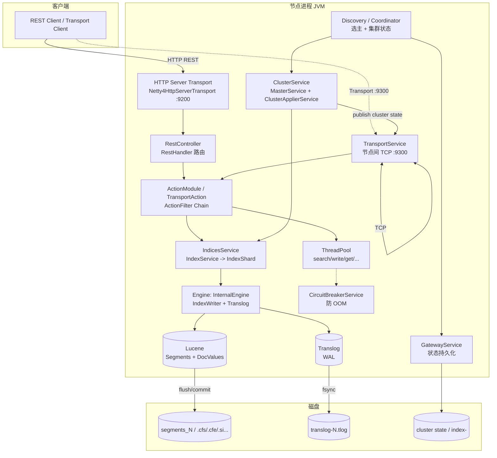
```mermaid
graph TB
    subgraph 客户端
        CLI[REST Client / Transport Client]
    end
    subgraph 节点进程 JVM
        HTTP[HTTP Server Transport<br/>Netty4HttpServerTransport :9200]
        REST[RestController<br/>RestHandler 路由]
        ACTION[ActionModule / TransportAction<br/>ActionFilter Chain]
        TP[ThreadPool<br/>search/write/get/...]
        TRANS[TransportService<br/>节点间 TCP :9300]
        DISC[Discovery / Coordinator<br/>选主 + 集群状态]
        CS[ClusterService<br/>MasterService + ClusterApplierService]
        ISVC[IndicesService<br/>IndexService -> IndexShard]
        ENGINE[Engine: InternalEngine<br/>IndexWriter + Translog]
        LUCENE[(Lucene<br/>Segments + DocValues)]
        TRANSLOG[(Translog<br/>WAL)]
        GATE[GatewayService<br/>状态持久化]
        BREAKER[CircuitBreakerService<br/>防 OOM]
    end
    subgraph 磁盘
        SEG[(segments_N / .cfs/.cfe/.si...)]
        TLOG[(translog-N.tlog)]
        META[(cluster state / index-)]
    end

    CLI -->|HTTP REST| HTTP
    HTTP --> REST
    REST --> ACTION
    ACTION --> TP
    CLI -.->|Transport :9300| TRANS
    TRANS <-->|TCP| TRANS
    TRANS --> ACTION
    ACTION --> ISVC
    ISVC --> ENGINE
    ENGINE --> LUCENE
    ENGINE --> TRANSLOG
    LUCENE -->|flush/commit| SEG
    TRANSLOG -->|fsync| TLOG
    DISC --> CS
    CS --> ISVC
    DISC --> GATE
    GATE --> META
    CS -->|publish cluster state| TRANS
    TP -.-> BREAKER
```

### 1.2 核心源码模块

核心源码位于 `server/src/main/java/org/elasticsearch/`，按职责划分如下：

| 包 | 职责 | 关键类 |
|---|---|---|
| `bootstrap` | 启动引导、JVM/原生/安全检查 | `Elasticsearch`, `Bootstrap`, `Natives`, `Security`, `BootstrapChecks` |
| `node` | 节点装配（Guice） | `Node`, `InternalSettingsPreparer` |
| `cli` | 命令行框架 | `EnvironmentAwareCommand`（基类在 `libs/cli`） |
| `common/inject` | Guice fork（依赖注入） | `Module`, `AbstractModule`, `ModulesBuilder` |
| `common/component` | 生命周期 | `Lifecycle`, `AbstractLifecycleComponent` |
| `common/settings` | 配置系统 | `Settings`, `SettingsModule`, `ClusterSettings` |
| `cluster/coordination` | 选主（zen2） | `Coordinator`, `ClusterBootstrapService`, `PreVoteCollector`, `PublishClusterStateAction` |
| `cluster/service` | 集群状态服务 | `ClusterService`, `MasterService`, `ClusterApplierService` |
| `cluster/routing/allocation` | 分片分配 | `AllocationService`, `BalancedShardsAllocator`, `AllocationDeciders` |
| `cluster/metadata` | 元数据 | `Metadata`, `IndexMetadata`, `MappingMetadata` |
| `discovery` | 发现机制 | `DiscoveryModule`, `PeerFinder` |
| `gateway` | 集群状态持久化/恢复 | `GatewayService`, `GatewayMetaState`, `PersistedClusterStateService` |
| `transport` | 节点间通信抽象 | `TransportService`, `TcpTransport`, `InboundHandler` |
| `http` | HTTP 抽象 | `HttpServerTransport`（实现 Netty4 在 `modules/transport-netty4`） |
| `threadpool` | 线程池 | `ThreadPool`, `ExecutorBuilder`, `FixedExecutorBuilder`, `ScalingExecutorBuilder` |
| `action` | 请求动作框架 | `ActionType`, `ActionModule`, `TransportAction`, `ActionFilter` |
| `rest` | REST 路由 | `RestController`, `RestHandler` |
| `indices` | 索引级管理 | `IndicesService`, `IndicesClusterStateService`, `recovery/`, `breaker/` |
| `index/shard` | 分片实体 | `IndexShard`, `IndexService` |
| `index/engine` | 引擎（封装 Lucene） | `Engine`, `InternalEngine`, `EngineConfig` |
| `index/translog` | 事务日志 | `Translog`, `TranslogWriter` |
| `index/store` | 存储目录 | `Store` |
| `index/seqno` | 序号与检查点 | `LocalCheckpointTracker`, `ReplicationTracker` |
| `index/mapper` | 字段映射 | `DocumentMapper`, `TextFieldMapper`, `KeywordFieldMapper`... |
| `search` | 搜索执行 | `SearchService`, `QueryPhase`, `FetchPhase`, `DfsPhase` |
| `action/search` | 搜索协调 | `TransportSearchAction`, `AbstractSearchAsyncAction`, `FetchSearchPhase` |
| `action/bulk` | 批量写入 | `TransportBulkAction`, `TransportShardBulkAction` |
| `action/support/replication` | 主副复制框架 | `ReplicationOperation`, `TransportReplicationAction` |
| `snapshots` | 快照 | `SnapshotsService`, `SnapshotShardsService`, `RestoreService` |
| `repositories` | 备份仓库 | `Repository`, `BlobStoreRepository`, `FsRepository` |
| `monitor` | 监控采集 | `MonitorService`, `JvmService`, `OsService`, `FsService` |
| `ingest` | 文档预处理 | `IngestService`, `Pipeline`, `Processor` |
| `script` | 脚本引擎 | `ScriptService`, `ScriptCache`, `ScriptContext` |
| `common/breaker` | 断路器 | `CircuitBreaker`, `ChildMemoryCircuitBreaker` |
| `plugins` | 插件体系 | `PluginsService`, `Plugin`（含 20+ 扩展点子接口） |
| `tasks` | 任务跟踪 | `TaskManager`, `Task`, `CancellableTask` |

外部模块：`modules/transport-netty4`（Netty 实现）、`modules/lang-painless`（脚本）、`modules/analysis-common`（分析器）、`modules/ingest-common` 等；商业特性位于 `x-pack/`（安全、SQL、监控、Watcher 等）。

### 1.3 节点角色

节点角色由 `DiscoveryNode`（`cluster/node/DiscoveryNode.java`）的 `roles` 集合表示，通过 `node.master`、`node.data`、`node.ingest`、`node.ml`、`node.transform`、`node.remote_cluster_client` 等设置控制：

- **master-eligible**：有资格被选为主节点，负责维护集群状态、分片分配决策。
- **data**：数据节点，持有分片、执行读写与搜索。
- **ingest**：预处理节点，执行 ingest pipeline。
- **coordinating only**：仅协调节点（关闭 master/data/ingest），负责路由分发与结果归并。
- **master + data 合一**：小集群常见。

集群状态（`ClusterState`）是核心数据结构，包含 `ClusterName`、`Metadata`（索引/模板/设置）、`RoutingTable`（分片路由表）、`DiscoveryNodes`（节点列表）、`Blocks`。master 是唯一可修改集群状态的节点，通过两阶段发布同步到所有节点。

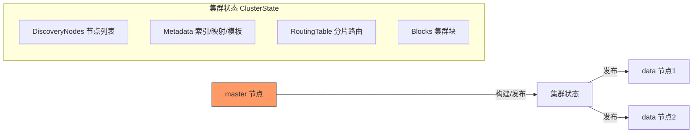
```mermaid
flowchart LR
    subgraph 集群状态 ClusterState
        N[DiscoveryNodes 节点列表]
        M[Metadata 索引/映射/模板]
        R[RoutingTable 分片路由]
        B[Blocks 集群块]
    end
    MASTER[master 节点]:::m -->|构建/发布| 集群状态
    集群状态 -->|发布| D1[data 节点1]
    集群状态 -->|发布| D2[data 节点2]
    classDef m fill:#f96,stroke:#333;
```

---

## 2. 节点启动流程

### 2.1 入口与命令行/配置解析

程序入口 `Elasticsearch.main`（`bootstrap/Elasticsearch.java:64`）：

```java
public static void main(final String[] args) throws Exception {
    overrideDnsCachePolicyProperties();              // 覆盖 DNS 缓存策略
    System.setSecurityManager(new SecurityManager() {...}); // 临时"全权限"SM
    LogConfigurator.registerErrorListener();
    final Elasticsearch elasticsearch = new Elasticsearch();
    int status = main(args, elasticsearch, Terminal.DEFAULT);
    ...
}
```

继承链 `Elasticsearch` → `EnvironmentAwareCommand` → `Command`（`libs/cli`）。`Command.main`（`Command.java:54`）注册 JVM 关闭钩子、用 jopt-simple 解析选项（`-d` 后台、`-p` pidfile、`-q` 静默、`-V` 版本），再调用子类 `execute`。

`EnvironmentAwareCommand.execute`（`cli/EnvironmentAwareCommand.java:52`）解析 `-E key=value`，补齐 `path.data/home/logs` 系统属性，调用 `InternalSettingsPreparer.prepareEnvironment`（`node/InternalSettingsPreparer.java:53`）：

1. 读取 `$ES_PATH_CONF/elasticsearch.yml`（拒绝 `.yaml`/`.json` 旧扩展名）；
2. 命令行 `-E` 优先级高于配置文件；
3. `replacePropertyPlaceholders` 替换 `${...}` 占位符（可引用 keystore）；
4. 默认 `cluster.name=elasticsearch`、`node.name=$HOSTNAME`。

`es.path.conf` 由 `elasticsearch-env` 脚本注入为系统属性。

### 2.2 Bootstrap 阶段

`Elasticsearch.init`（`Elasticsearch.java:156`）→ `Bootstrap.init`（`bootstrap/Bootstrap.java:332`）：

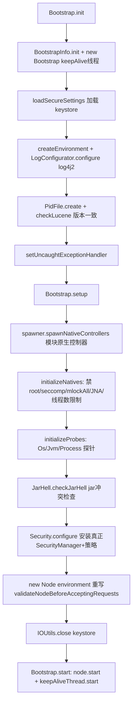
```mermaid
flowchart TD
    A[Bootstrap.init] --> B[BootstrapInfo.init + new Bootstrap keepAlive线程]
    B --> C[loadSecureSettings 加载 keystore]
    C --> D[createEnvironment + LogConfigurator.configure log4j2]
    D --> E[PidFile.create + checkLucene 版本一致]
    E --> F[setUncaughtExceptionHandler]
    F --> G[Bootstrap.setup]
    G --> G1[spawner.spawnNativeControllers 模块原生控制器]
    G1 --> G2[initializeNatives: 禁root/seccomp/mlockAll/JNA/线程数限制]
    G2 --> G3[initializeProbes: Os/Jvm/Process 探针]
    G3 --> G4[JarHell.checkJarHell jar冲突检查]
    G4 --> G5[Security.configure 安装真正SecurityManager+策略]
    G5 --> H[new Node environment 重写validateNodeBeforeAcceptingRequests]
    H --> I[IOUtils.close keystore]
    I --> J[Bootstrap.start: node.start + keepAliveThread.start]
```

`initializeNatives`（`Bootstrap.java:96`）要点：禁止 root 运行、可选 seccomp 系统调用过滤、`mlockall`/虚拟内存锁（避免 heap 被 swap）、强制加载 JNA、限制最大线程/虚拟内存/文件大小。`BootstrapChecks`（文件描述符数、内存锁定等）在 `Node.start` 接受请求前执行（`Node.java:895`），仅在绑定非 loopback 接口时强制全部检查（生产模式）。

`keepAliveThread`（`Bootstrap.java:74`）是非守护线程，`await` 一个 `CountDownLatch`，使 JVM 不退出；`Bootstrap.stop()` 通过 `countDown` 触发退出。

### 2.3 Node 构造与 Guice 装配

`Node` 构造函数（`node/Node.java:289`）采用「资源列表 + success 标志」模式，异常时 `IOUtils.closeWhileHandlingException` 回滚。分两阶段：

**阶段一：直接 new 关键服务**（不依赖 Guice，`Node.java:294-488`），按依赖顺序：`PluginsService`（351，扫描加载插件）→ `Environment`/`NodeEnvironment`（366/368）→ `ThreadPool`（404，含插件自定义 builder）→ `ScriptModule`/`AnalysisModule`（425/427）→ `SettingsModule`（437）→ `ClusterService`（444）→ `IngestService`（452）→ `SearchModule`/`IndicesModule`（459/460）→ `NamedWriteableRegistry`/`NamedXContentRegistry`。

**阶段二：Guice 模块注册**（`Node.java:488-756`），`ModulesBuilder` 按序 `add`：

| 顺序 | Module | 说明 |
|---|---|---|
| 1 | 插件 `createGuiceModules()` | 必须最先，避免注入错误 |
| 2 | `ClusterModule` | 绑定 `AllocationService`、`ClusterService`、`NodeConnectionsService`、`AllocationDeciders`、`ShardsAllocator` 等 |
| 3 | `IndicesModule` | 索引模块 |
| 4 | `GatewayModule` | `GatewayService`、`TransportNodesListGatewayStartedShards` |
| 5 | `SettingsModule` | `Settings`、`ClusterSettings`、`IndexScopedSettings` |
| 6 | `ActionModule` | 所有 `TransportAction` 子类 `asEagerSingleton` |
| 7 | 匿名 binder lambda | 把阶段一 new 出的约 40 个实例 `bind(X).toInstance(obj)`，含插件 `createComponents` 产物 |

```java
injector = modules.createInjector();   // Node.java:756
// ModulesBuilder.createInjector 调用 Guice.createInjector + readOnlyAllSingletons (强制全部 eager singleton)
```

随后 `clusterModule.setExistingShardsAllocators(...)`（763，打破 `AllocationService`↔`GatewayAllocator` 循环依赖）、`client.initialize(actionMap)`（773）、`actionModule.initRestHandlers(...)`（777，注册所有 REST handler）。

### 2.4 Node.start() 启动序列

`Node.start()`（`Node.java:833`）严格顺序启动 27 个组件，关键设计：Transport 先于 Discovery（让本地 discovery node 地址可设置）、Discovery 先于 ClusterService（设置初始 state）、HTTP 最后启动（确保内部就绪才对外暴露）。

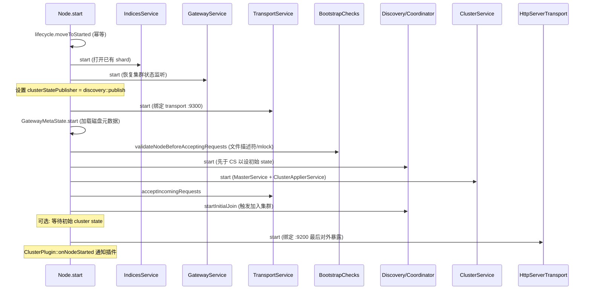
```mermaid
sequenceDiagram
    participant N as Node.start
    participant IS as IndicesService
    participant GS as GatewayService
    participant TS as TransportService
    participant BC as BootstrapChecks
    participant D as Discovery/Coordinator
    participant CS as ClusterService
    participant HTTP as HttpServerTransport

    N->>N: lifecycle.moveToStarted (幂等)
    N->>IS: start (打开已有 shard)
    N->>GS: start (恢复集群状态监听)
    Note over N: 设置 clusterStatePublisher = discovery::publish
    N->>TS: start (绑定 transport :9300)
    N->>N: GatewayMetaState.start (加载磁盘元数据)
    N->>BC: validateNodeBeforeAcceptingRequests (文件描述符/mlock)
    N->>D: start (先于 CS 以设初始 state)
    N->>CS: start (MasterService + ClusterApplierService)
    N->>TS: acceptIncomingRequests
    N->>D: startInitialJoin (触发加入集群)
    Note over N: 可选: 等待初始 cluster state
    N->>HTTP: start (绑定 :9200 最后对外暴露)
    Note over N: ClusterPlugin::onNodeStarted 通知插件
```

完整 27 步：pluginLifecycleComponents → MappingUpdatedAction.setClient → IndicesService → IndicesClusterStateService → SnapshotsService → SnapshotShardsService → RepositoriesService → SearchService → FsHealthService → MonitorService → NodeConnectionsService → GatewayService →（设置 ClusterStatePublisher）→ TransportService → PeerRecoverySourceService → GatewayMetaState → BootstrapChecks →（taskManager 作为 stateApplier）→ Discovery → ClusterService → acceptIncomingRequests → startInitialJoin → 等待初始 state → HttpServerTransport → writePortsFile → onNodeStarted。

关闭顺序（`Node.stop`/`close`）大致反向，但 `IndicesService` 最后停（等待 scroll/recovery 释放），`ThreadPool.shutdown`（非 `shutdownNow`，避免破坏 Lucene 索引）。

### 2.5 Lifecycle 生命周期

`Lifecycle`（`common/component/Lifecycle.java`）四态状态机，转换方法幂等（重复 `moveToStarted` 已 started 时返回 false），但 `moveToClosed` 在 STARTED 时抛异常（强制先 stop）：

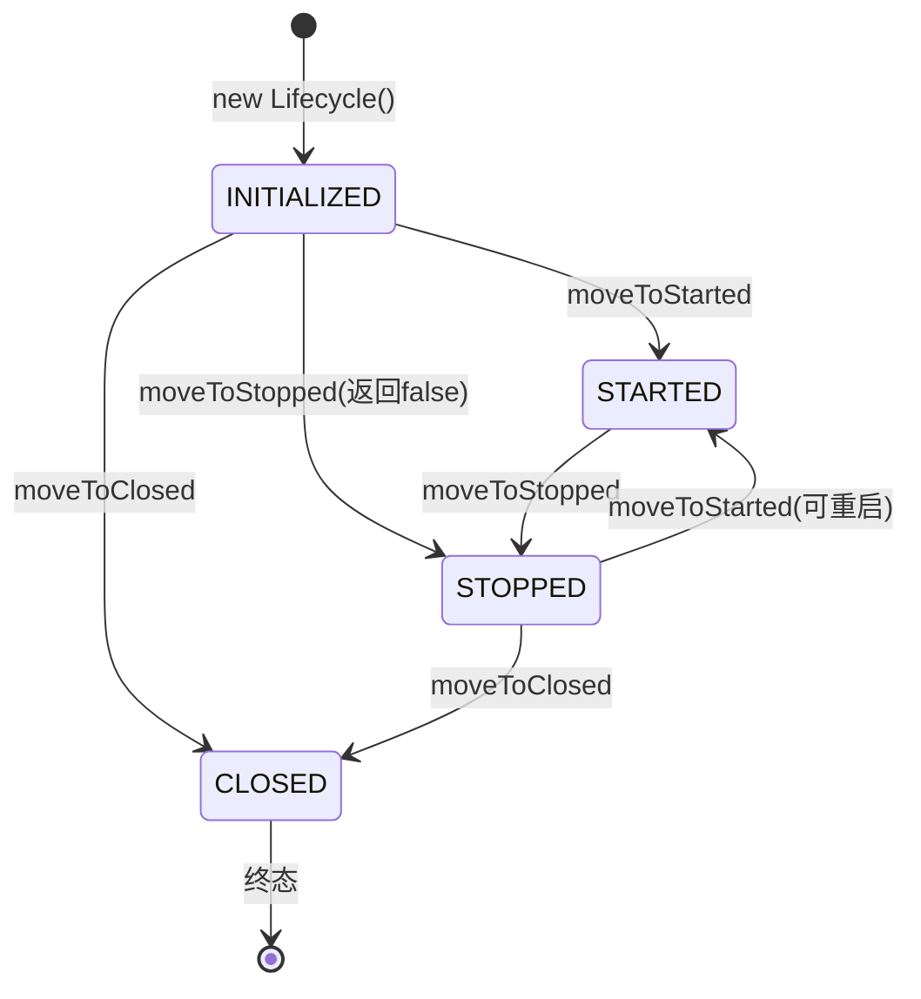
```mermaid
stateDiagram-v2
    [*] --> INITIALIZED : new Lifecycle()
    INITIALIZED --> STARTED : moveToStarted
    INITIALIZED --> STOPPED : moveToStopped(返回false)
    INITIALIZED --> CLOSED : moveToClosed
    STARTED --> STOPPED : moveToStopped
    STOPPED --> STARTED : moveToStarted(可重启)
    STOPPED --> CLOSED : moveToClosed
    CLOSED --> [*] : 终态
```

`AbstractLifecycleComponent` 用模板方法统一 `before/do/after` + listener 通知，子类实现 `doStart/doStop/doClose`。所有 `service.start()` 调用线程安全且幂等。

### 2.6 插件机制

`PluginsService`（`plugins/PluginsService.java:97`）扫描 `modules/`（内置）和 `plugins/`（用户）目录，每个插件独立 `URLClassLoader`，经 `PluginLoaderIndirection` 隔离层与 ES core 相连，`reloadLuceneSPI` 重载 Lucene 的 Codec/Analyzer SPI，`sortBundles` 拓扑排序（按 `extendedPlugins` 依赖），`checkBundleJarHell` 防类冲突。

`Plugin` 基类提供 20+ 扩展点，按子接口分类：`ActionPlugin`（actions/rest handlers/filters）、`AnalysisPlugin`、`ClusterPlugin`（`onNodeStarted`、cluster state applier）、`DiscoveryPlugin`、`IngestPlugin`、`MapperPlugin`、`NetworkPlugin`、`RepositoryPlugin`、`ScriptPlugin`、`SearchPlugin`、`SystemIndexPlugin`、`PersistentTaskPlugin`、`EnginePlugin`、`IndexStorePlugin`、`CircuitBreakerPlugin` 等。Node 构造时通过 `pluginsService.filterPlugins(XxxPlugin.class)` 获取各类扩展并注入对应 Module。

## 3. 集群形成与选主流程

### 3.1 zen2 概述：基于 Raft 的选主

7.x 起用 zen2（`cluster/coordination/Coordinator`）取代旧版 zen 的 `discovery.zen.minimum_master_nodes`，核心是基于 Raft 的共识算法，保证：每个 term 至多一个 leader、leader 选举需获得 voting configuration 的多数（quorum）投票、集群状态变更需 quorum 确认后 commit。关键概念：

- **term**：单调递增的「任期」，每次选举递增，防止脑裂。
- **VotingConfiguration**：有投票权的 master-eligible 节点集合；首次启动时由 `cluster.initial_master_nodes` bootstrap 形成，之后可动态调整（reconfiguration）。
- **quorum**：VotingConfiguration 的多数（`N/2+1`）。
- **last accepted state**：节点最后接受的集群状态及其 term/version。
- **pre-voting**：正式投票前的预投票阶段，避免多个候选者同时发起选举导致频繁失败。

`Coordinator`（`cluster/coordination/Coordinator.java:90`）继承 `AbstractLifecycleComponent` 并实现 `Discovery`，是选主与集群状态协调的核心。

### 3.2 首次启动 Bootstrap

`Coordinator.startInitialJoin`（`Coordinator.java:719`）：

```java
public void startInitialJoin() {
    synchronized (mutex) { becomeCandidate("startInitialJoin"); }
    clusterBootstrapService.scheduleUnconfiguredBootstrap();
}
```

`ClusterBootstrapService`（`cluster/coordination/ClusterBootstrapService.java`）负责首次集群引导：

- `INITIAL_MASTER_NODES_SETTING`（`cluster.initial_master_nodes`，L50）列出初始 master 节点。
- `onFoundPeersUpdated`（L106）：PeerFinder 发现节点后，`checkRequirements`（L219）按节点名/地址匹配 bootstrap requirements，当匹配节点数过半（`nodesMatchingRequirements.size() * 2 > bootstrapRequirements.size()`，L132）时 `startBootstrap`。
- `startBootstrap`（L175）-> `doBootstrap`（L190）：用匹配节点构造初始 `VotingConfiguration`，通过 `votingConfigurationConsumer` 回调设置到 Coordinator。
- 若未配置 `initial_master_nodes` 且无 discovery 配置，`scheduleUnconfiguredBootstrap`（L138）延迟 `discovery.unconfigured_bootstrap_timeout`（默认 3s）后「尽力而为」bootstrap。

### 3.3 选举流程

选举由 PeerFinder 发现节点驱动，经 pre-voting、投票、胜选三步：

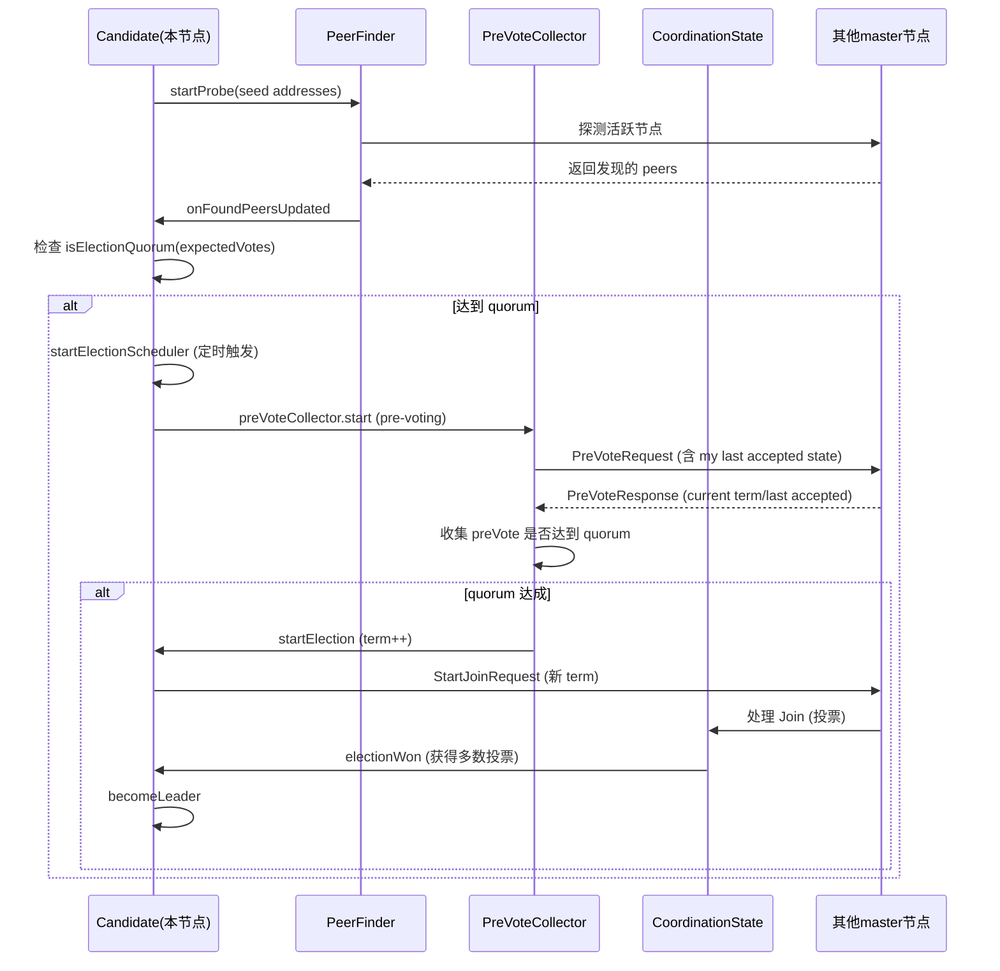
```mermaid
sequenceDiagram
    participant C as Candidate(本节点)
    participant PF as PeerFinder
    participant PVC as PreVoteCollector
    participant CS as CoordinationState
    participant Peers as 其他master节点

    C->>PF: startProbe(seed addresses)
    PF->>Peers: 探测活跃节点
    Peers-->>PF: 返回发现的 peers
    PF->>C: onFoundPeersUpdated
    C->>C: 检查 isElectionQuorum(expectedVotes)
    alt 达到 quorum
        C->>C: startElectionScheduler (定时触发)
        C->>PVC: preVoteCollector.start (pre-voting)
        PVC->>Peers: PreVoteRequest (含 my last accepted state)
        Peers-->>PVC: PreVoteResponse (current term/last accepted)
        PVC->>PVC: 收集 preVote 是否达到 quorum
        alt quorum 达成
            PVC->>C: startElection (term++)
            C->>Peers: StartJoinRequest (新 term)
            Peers->>CS: 处理 Join (投票)
            CS->>C: electionWon (获得多数投票)
            C->>C: becomeLeader
        end
    end
```

关键代码位置：

- `CoordinatorPeerFinder.onFoundPeersUpdated`（`Coordinator.java:1186`）：发现节点更新后，候选者计算 `expectedVotes`，若 `coordinationState.isElectionQuorum(expectedVotes)`（L1193）成立则 `startElectionScheduler`（L1197）。
- `startElectionScheduler`（`Coordinator.java:1209`）：通过 `ElectionSchedulerFactory` 启动定时器，定时回调 `preVoteCollector.start(lastAcceptedState, discoveredNodes)`（L1242）发起 pre-voting。
- `PreVoteCollector`：向各节点发 `PreVoteRequest`，收集 `PreVoteResponse`；只有当对方认为本节点的 last accepted state 足够新（term/version 不落后）时才返回支持。quorum 达成后触发 `startElection`（`Coordinator.java:384`），term 递增，进入正式投票。
- `CoordinationState`（共识状态机）：处理 `StartJoinRequest`/`JoinRequest`，收集投票，满足 quorum 后 `electionWon()`。
- 胜选后 `becomeLeader`：本节点成为 LEADER，`MasterService` 被通知开始接受集群状态更新任务；同时启动 `FollowersChecker`（检测 follower 存活）与 `LagDetector`（检测 follower 落后程度）。

**Master 故障重选**：follower 节点通过 `LeaderChecker` 检测 leader 失联（超时），term 递增，发起新一轮 pre-voting/选举。旧 leader 恢复后因 term 较低，其写入被拒绝，自动降级为 follower。

### 3.4 集群状态发布与应用

master 构建的 `ClusterState` 通过 `CoordinatorPublication`（`Coordinator.java:1277`，继承 `Publication`）发布到所有节点，采用两阶段（commit-then-apply）确保一致性：

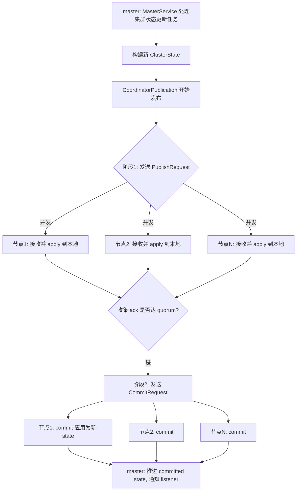
```mermaid
flowchart TD
    A[master: MasterService 处理集群状态更新任务] --> B[构建新 ClusterState]
    B --> C[CoordinatorPublication 开始发布]
    C --> D{阶段1: 发送 PublishRequest}
    D -->|并发| E1[节点1: 接收并 apply 到本地]
    D -->|并发| E2[节点2: 接收并 apply 到本地]
    D -->|并发| E3[节点N: 接收并 apply 到本地]
    E1 --> F{收集 ack 是否达 quorum?}
    E2 --> F
    E3 --> F
    F -->|是| G[阶段2: 发送 CommitRequest]
    G --> H1[节点1: commit 应用为新 state]
    G --> H2[节点2: commit]
    G --> H3[节点N: commit]
    H1 --> I[master: 推进 committed state, 通知 listener]
    H2 --> I
    H3 --> I
```

- master 端 `PublishClusterStateAction`（`cluster/coordination/PublishClusterStateAction.java`）封装发布/提交流程，通过 `transportService` 向各节点发 `PublishRequest`。
- 各节点收到后调用 `ClusterApplierService.onNewClusterState`（`cluster/service/ClusterApplierService.java:302`）：先在本地 `applyChanges`（L433）应用——调用所有 `ClusterStateApplier`（如 `IndicesClusterStateService`、`TransportService`、`RoutingService` 等，通过 `addStateApplier` L200 注册），再通知 `ClusterStateListener`。此时状态被「接受」但未必「committed」。
- master 收集到 quorum 数量的 ack 后发送 `CommitRequest`，节点收到后把该 state 标记为 committed（last accepted state）。

### 3.5 MasterService 与 ClusterApplierService

集群状态在 master 侧由 `MasterService`（`cluster/service/MasterService.java:62`）处理更新任务，在所有节点侧由 `ClusterApplierService` 应用：

- **MasterService**：持有 `Batcher taskBatcher`（L82，继承 `TaskBatcher`，L122）。`submitStateUpdateTask`（L377/353）提交任务到 `Batcher`，`Batcher.run`（L137）按 `batchingKey` 批量合并任务（减少集群状态更新次数），依次 `execute` 每个 `UpdateTask`（在 master 线程池执行），产出新 `ClusterState`，再通过 `ClusterStatePublisher`（即 `discovery::publish`，在 `Node.start` 设置）发布。
- **ClusterApplierService**：`onNewClusterState`（L302）接收 master 发布的状态，`applyChanges`（L433）依次调用 `callClusterStateAppliers`（让各 Applier 响应，如创建/删除索引、更新路由）与 `callClusterStateListeners`，更新本地 `state` 引用。集群状态更新对索引/分片的实际影响（如打开/关闭分片、触发 recovery）多在 `IndicesClusterStateService`（作为 Applier）中完成。

### 3.6 GatewayService 状态恢复

master 当选并应用集群状态后，若集群仍处 `STATE_NOT_RECOVERED_BLOCK`（数据未恢复），`GatewayService`（`gateway/GatewayService.java:40`，作为 `ClusterStateListener`）负责恢复：

- `clusterChanged`（L141）：仅本地是 elected master 且存在 `STATE_NOT_RECOVERED_BLOCK` 时处理。
- 根据 `gateway.expected_data_nodes` / `recover_after_data_nodes` / `recover_after_time` 等待足够节点加入（L160-191）。
- 条件满足后 `performStateRecovery`（L196）-> `RecoverStateUpdateTask`（L240）：`removeStateNotRecoveredBlock`（移除恢复块）+ `allocationService.reroute`（L254）触发分片分配。

在 zen2（`Coordinator`）下，集群状态本身由 `PersistedClusterStateService`/`GatewayMetaState` 持久化到磁盘（`Node.start` 中 `GatewayMetaState.start` 加载/升级磁盘元数据），master 重启后能恢复 last accepted state，避免重新 bootstrap。

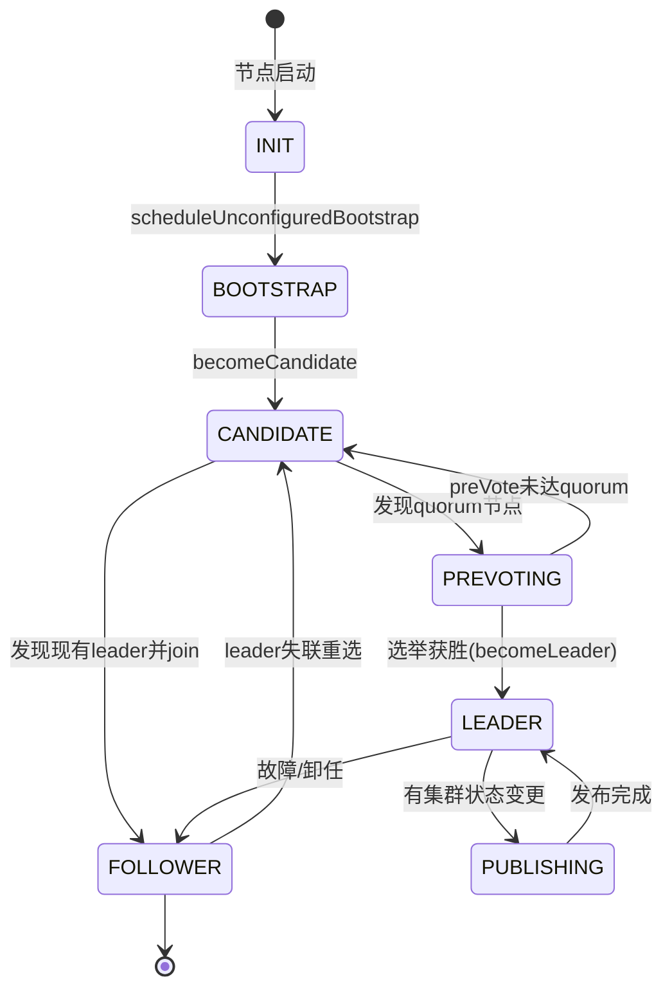
```mermaid
stateDiagram-v2
    [*] --> INIT : 节点启动
    INIT --> BOOTSTRAP : scheduleUnconfiguredBootstrap
    BOOTSTRAP --> CANDIDATE : becomeCandidate
    CANDIDATE --> PREVOTING : 发现quorum节点
    PREVOTING --> CANDIDATE : preVote未达quorum
    PREVOTING --> LEADER : 选举获胜(becomeLeader)
    CANDIDATE --> FOLLOWER : 发现现有leader并join
    LEADER --> FOLLOWER : 故障/卸任
    FOLLOWER --> CANDIDATE : leader失联重选
    LEADER --> PUBLISHING : 有集群状态变更
    PUBLISHING --> LEADER : 发布完成
    FOLLOWER --> [*]
```

---

## 4. 通信架构与节点间通信

### 4.1 双通信通道

ES 节点对外暴露两套通信通道：

| 通道 | 端口 | 实现 | 用途 |
|---|---|---|---|
| HTTP REST | 9200 | `Netty4HttpServerTransport`（`modules/transport-netty4`） | 客户端 REST 请求 |
| Transport | 9300 | `Netty4Transport`（`modules/transport-netty4`） | 节点间内部通信（集群状态发布、分片读写分发、recovery、ping） |

二者均基于 Netty，但 `Transport` 是节点间二进制协议（`StreamInput/StreamOutput` 序列化、可选压缩、版本协商），`HTTP` 面向客户端。


```mermaid
graph LR
    subgraph 节点A
        HC[REST Client] -->|HTTP :9200| H1[Netty4HttpServerTransport]
        H1 --> RC[RestController]
        RC --> RH[RestHandler]
        RH --> CL[NodeClient]
        CL --> AM[ActionModule<br/>action map]
        AM --> TA[TransportAction<br/>execute]
        TA --> TS1[TransportService]
    end
    subgraph 节点B
        TS1 -->|TCP :9300| N2[Netty4Transport]
        N2 --> IH2[InboundHandler]
        IH2 --> RH2[requestHandlers map]
        RH2 --> TP[ThreadPool 分发]
        TP --> HA2[TransportRequestHandler<br/>messageReceived]
    end
```

### 4.2 TransportService 收发

`TransportService`（`transport/TransportService.java:68`，继承 `AbstractLifecycleComponent`）是通信抽象层，底层 `Transport`（`TcpTransport`，Netty4 实现）。

**注册 handler**：`registerRequestHandler`（L205）注册 action -> `TransportRequestHandler` 映射，默认用 `ThreadPool.Names.SAME`（调用线程）执行。所有节点间 action（如 search query、fetch、recovery、publish）都在此注册。

**发送请求**：`sendRequest`（L667/673/709）-> 经 `asyncSender`（L193，`interceptor.interceptSender(this::sendRequestInternal)` 拦截器链）-> `sendRequestInternal`（L813）-> `connection.sendRequest(requestId, action, request, options)`（L845）。`requestId` 由 `TransportService` 分配，同时记录 `pending` 的 `TransportResponseHandler`，响应到达时按 `requestId` 回调。`sendChildRequest`（L784）用于父子 task 关联的分片级请求。

**节点连接与握手**：`connectToNode`（L374/407）-> `connectionManager.connectToNode`（L412）-> 新连接建立后执行 `handshake`（L418/494，action=`internal:transport/handshake`，L90），交换节点 `version`/`name`/`DiscoveryNode`，校验兼容性（`PERMIT_HANDSHAKES_FROM_INCOMPATIBLE_BUILDS_KEY`，L73）。`NodeConnectionsService` 周期性检查集群状态中的节点，自动连接新节点、断开离线节点。

**生命周期**：`doStart` 绑定端口；`acceptIncomingRequests`（L331）在 `Node.start` 末段被调用，此前拒绝所有请求（关闭连接），确保服务就绪才接受请求。

### 4.3 Netty4 Transport 与消息处理

`Netty4Transport`（`modules/transport-netty4/.../Netty4Transport.java:66`，继承 `TcpTransport`）用 Netty 实现 IO：

- `doStart`（L112）-> `createServerBootstrap`（L183），对每个 profile（默认 + 自定义）绑定端口。
- 服务端 pipeline 由 `ServerChannelInitializer`（L316）构建，客户端 pipeline 由 `ClientChannelInitializer`（L297）构建，handler 链含 `SizeHeaderFrameDecoder`（按长度分帧）+ `Netty4MessageInboundHandler`（解码为 `InboundMessage`/`OutboundMessage`）。
- `TcpTransport`（`transport/TcpTransport.java:88`）持有 `InboundHandler inboundHandler`（L122/160），`doStart`（L181）时 `inboundHandler.setMessageListener(listener)`（L187）把 `TransportService` 设为消息监听者。
- 字节到达：`Netty4MessageInboundHandler` 解码 -> `TcpTransport.inboundMessage`（L691）-> `inboundHandler.inboundMessage`（L693）。

**InboundHandler 消息分流**（`TcpTransport` 内部类）：收到 `InboundMessage` 后判断是 request 还是 response：

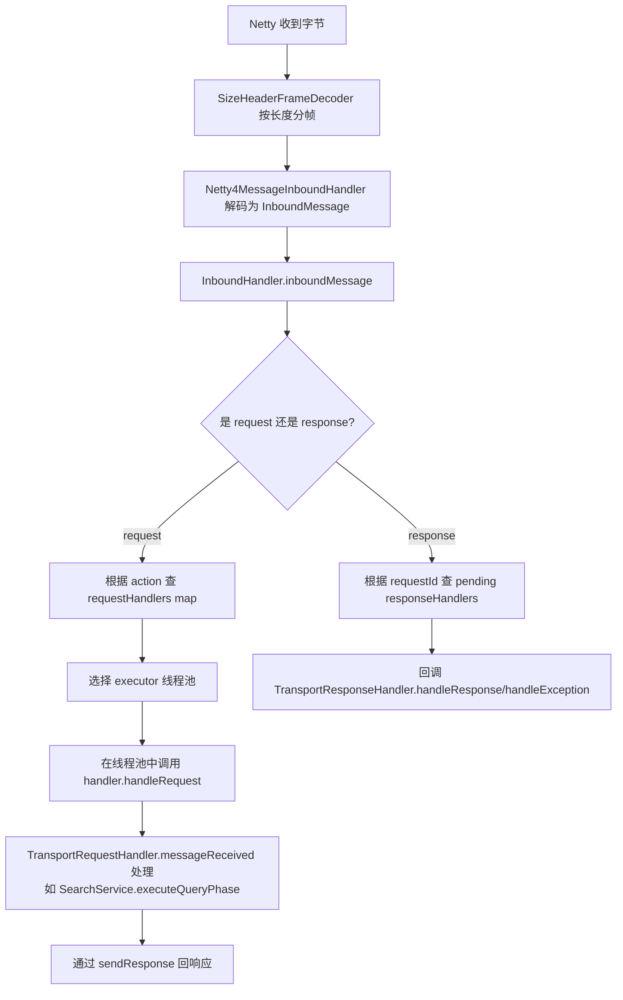
```mermaid
flowchart TD
    A[Netty 收到字节] --> B[SizeHeaderFrameDecoder 按长度分帧]
    B --> C[Netty4MessageInboundHandler 解码为 InboundMessage]
    C --> D[InboundHandler.inboundMessage]
    D --> E{是 request 还是 response?}
    E -->|request| F[根据 action 查 requestHandlers map]
    F --> G[选择 executor 线程池]
    G --> H[在线程池中调用 handler.handleRequest]
    H --> I[TransportRequestHandler.messageReceived 处理<br/>如 SearchService.executeQueryPhase]
    I --> J[通过 sendResponse 回响应]
    E -->|response| K[根据 requestId 查 pending responseHandlers]
    K --> L[回调 TransportResponseHandler.handleResponse/handleException]
```

- **request**：根据 action 名查 `requestHandlers` map，拿到 `TransportRequestHandler` 与目标 `executor`（线程池名），将任务提交到 `ThreadPool.executor(name)`，线程中执行 `handler.handleRequest` -> `messageReceived`。
- **response**：根据 `requestId` 查 `pending` 的 `TransportResponseHandler`，回调 `handleResponse`/`handleException`。

请求/响应用 `StreamInput`/`StreamOutput` 序列化（`NamedWriteable` 机制），版本通过握手协商，可选压缩（`TransportRequestOptions.compress`）。

### 4.4 线程池模型

`ThreadPool`（`threadpool/ThreadPool.java`）是所有异步执行的基础。通过 `ExecutorBuilder` 列表（Node.java:402，含插件自定义 + 内置）创建。线程池类型有 `fixed`（固定大小 + 有界队列）、`scaling`（动态伸缩）、`direct`（直接执行）、`same`（调用线程）。

主要线程池（`ThreadPool.Names`，L57+）：

| 名称 | 类型 | 默认大小 | 队列 | 用途 |
|---|---|---|---|---|
| `same` | same | - | - | 调用线程执行（handler 注册默认） |
| `generic` | scaling | 0-动态 | 无 | 通用（recovery、bootstrap 等） |
| `write` | fixed | `2*cpu` | 10000 | 索引/删除/批量写入 |
| `search` | fixed | `(int)((0.3*cpu)*(1+?))`≈`2*cpu`大小? | 1000 | 查询分发与执行 |
| `search_throttled` | fixed | 1 | 100 | `index.search.throttled=true` 索引查询 |
| `get` | fixed | `2*cpu` | 1000 | get/mget |
| `analyze` | fixed | 1 | 16 | analyze API |
| `management` | scaling | 1-5 | 无 | 集群管理（reroute 等） |
| `flush` | scaling | 1-5 | 无 | flush/refresh |
| `refresh` | scaling | 1-5 | 无 | refresh |
| `listener` | scaling | 1-动态 | 无 | ActionListener 回调 |
| `system_read`/`system_write` | fixed | `2/5*cpu` 等 | 2000/10000 | 系统索引读写 |
| `system_critical_read`/`system_critical_write` | fixed | 较高 | - | 系统关键操作 |

> 注：`LISTENER`（L59）已 `@Deprecated`。具体 size 受 `node.processors`、`*_thread_pool.*.size` 设置影响。

线程池与 action 绑定：`ActionType.getExecutor()` 返回线程池名，`TransportAction.execute` 通过 `TaskManager` 注册 task 后在对应线程池执行。`TaskAwareExecutor` 把 `Runnable` 包装为关联 task，`ThreadContext` 通过 `stashContext`/`restoreContext` 在跨线程时传递请求头与权限上下文。

### 4.5 Action 机制与 ActionFilter Chain

`ActionModule`（`action/ActionModule.java:411`，L488 `setupActions` 注册 action -> `ActionHandler` 映射）装配所有 `TransportAction`。`TransportAction`（`action/support/TransportAction.java:27`）是所有 action 的抽象基类：

```java
public final Task execute(Request request, ActionListener<Response> listener) {
    final Task task = taskManager.register("transport", actionName, request);  // 注册 task
    execute(task, request, listener);
    return task;
}
public final void execute(Task task, Request request, ActionListener<Response> listener) {
    // validate -> TaskResultStoring -> RequestFilterChain
    new RequestFilterChain<>(this, logger).proceed(task, actionName, request, listener);
}
// RequestFilterChain.proceed: 依次执行 filters[i].apply, 最后调 doExecute
```

`RequestFilterChain`（L154）实现 ActionFilter 责任链：`proceed` 用 `AtomicInteger index` 依次调用 `filters[i].apply(...)`，所有 filter 完成后调用 `doExecute`（子类实现，如 `TransportSearchAction`、`TransportBulkAction`）。`ActionFilter` 可拦截/审计/校验请求。Action 通过 `ActionType.getExecutor()` 选择线程池。

### 4.6 REST 路由

`RestController`（`rest/RestController.java:56`，实现 `HttpServerTransport.Dispatcher`）负责 REST 请求分发：

- `registerHandler`（L145/156）-> `registerHandlerNoWrap`（L163）把 `method + path` -> `RestHandler` 存入 `requestHandlers` map（支持路径参数如 `/{index}/_doc/{id}`）。
- `dispatchRequest`（L190）-> `getAllHandlers`（L337）匹配 handler -> `dispatchRequest`（L351）执行 handler。
- handler（如 `RestSearchAction`）解析 `RestRequest`，调用 `NodeClient.execute(action, request, listener)` -> `TransportAction.execute`，最终经 transport 分发到分片节点。

完整链路：HTTP 请求 -> `Netty4HttpServerTransport` 解码 -> `RestController.dispatchRequest` -> `RestHandler` -> `NodeClient` -> `TransportAction`（filter chain）-> `doExecute`（协调节点逻辑）-> `TransportService.sendRequest`（分发到分片节点）-> 分片节点 `TransportRequestHandler.messageReceived` -> 线程池执行。

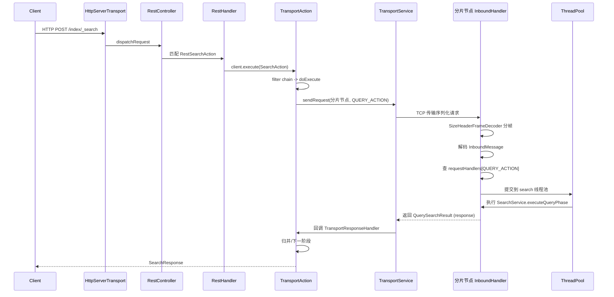
```mermaid
sequenceDiagram
    participant C as Client
    participant H as HttpServerTransport
    participant RC as RestController
    participant RH as RestHandler
    participant TA as TransportAction
    participant TS as TransportService
    participant S as 分片节点 InboundHandler
    participant TP as ThreadPool

    C->>H: HTTP POST /index/_search
    H->>RC: dispatchRequest
    RC->>RH: 匹配 RestSearchAction
    RH->>TA: client.execute(SearchAction)
    TA->>TA: filter chain -> doExecute
    TA->>TS: sendRequest(分片节点, QUERY_ACTION)
    TS->>S: TCP 传输序列化请求
    S->>S: SizeHeaderFrameDecoder 分帧
    S->>S: 解码 InboundMessage
    S->>S: 查 requestHandlers[QUERY_ACTION]
    S->>TP: 提交到 search 线程池
    TP->>S: 执行 SearchService.executeQueryPhase
    S-->>TS: 返回 QuerySearchResult (response)
    TS->>TA: 回调 TransportResponseHandler
    TA->>TA: 归并/下一阶段
    TA-->>C: SearchResponse
```

## 5. 数据写入流程与数据落盘

### 5.1 写入主路径：协调节点 -> 主分片 -> 副本

写入（index/update/delete/bulk）由 `TransportBulkAction`（`action/bulk/TransportBulkAction.java`）协调：

1. **协调节点按分片聚合**（`TransportBulkAction.java:416` `BulkOperation.run`）：对每条 `DocWriteRequest` 解析具体索引、用 mapping 校验默认值、`OperationRouting.indexShards`（`hash(routing) % numberOfPrimaryShards`）计算目标分片，按 `ShardId` 聚合成 `BulkShardRequest`。
2. **ingest 预处理**（`TransportBulkAction.java:179`）：若有 pipeline，`IngestService.resolvePipelines` -> `ingestService.executeBulkRequest`（`ingest/IngestService.java:427`）在协调节点执行 processor 链（groovy/painless 脚本、set/grok/date 等），处理后的文档才进入索引。
3. **路由到主分片**（`TransportReplicationAction.java:172` `doExecute` -> `ReroutePhase`，L659）：主分片在本地则直接执行，否则 `transportService.sendRequest` 发往主分片所在节点。
4. **主分片执行**（`AsyncPrimaryAction.doRun`，L304）：校验 `primaryTerm`/`allocationId`，`acquirePrimaryOperationPermit`（基于 seqno 并发控制），创建 `ReplicationOperation.execute()`（`action/support/replication/ReplicationOperation.java:99`）：先 `checkActiveShardCount`（wait_for_active_shards），再 `primary.perform`（`shardOperationOnPrimary`）。
5. **副本复制**（`ReplicationOperation.handlePrimaryResult`，L114）：采样 `globalCheckpoint`、`maxSeqNoOfUpdatesOrDeletes`、`replicationGroup`，`performOnReplicas`（L170）并行 `replicasProxy.performOn`（L186，带 `RetryableAction` 重试，对熔断/拒绝/连接异常重试）发到副本。
6. **副本执行**（`AsyncReplicaAction`，L540）：`acquireReplicaOperationPermit` -> `shardOperationOnReplica` -> `IndexShard.applyIndexOperationOnReplica(seqNo, ...)`（注意 seqNo 来自主分片，副本不重新生成）。
7. **后置动作**（`runPostReplicationActions`）：等副本完成后执行 refresh 策略 + translog sync。

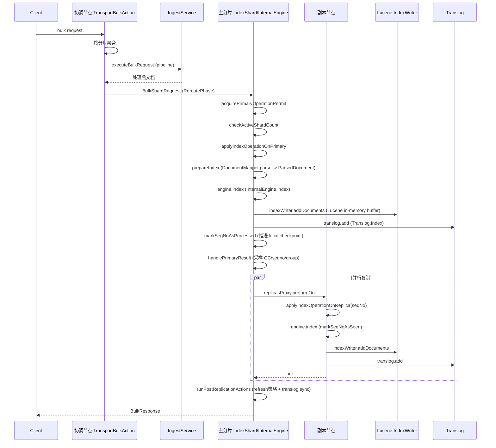
```mermaid
sequenceDiagram
    participant C as Client
    participant CO as 协调节点 TransportBulkAction
    participant IN as IngestService
    participant P as 主分片 IndexShard/InternalEngine
    participant R as 副本节点
    participant L as Lucene IndexWriter
    participant T as Translog

    C->>CO: bulk request
    CO->>CO: 按分片聚合
    CO->>IN: executeBulkRequest (pipeline)
    IN-->>CO: 处理后文档
    CO->>P: BulkShardRequest (ReroutePhase)
    P->>P: acquirePrimaryOperationPermit
    P->>P: checkActiveShardCount
    P->>P: applyIndexOperationOnPrimary
    P->>P: prepareIndex (DocumentMapper.parse -> ParsedDocument)
    P->>P: engine.index (InternalEngine.index)
    P->>L: indexWriter.addDocuments (Lucene in-memory buffer)
    P->>T: translog.add (Translog.Index)
    P->>P: markSeqNoAsProcessed (推进 local checkpoint)
    P->>P: handlePrimaryResult (采样 GC/seqno/group)
    par 并行复制
        P->>R: replicasProxy.performOn
        R->>R: applyIndexOperationOnReplica(seqNo)
        R->>R: engine.index (markSeqNoAsSeen)
        R->>L: indexWriter.addDocuments
        R->>T: translog.add
        R-->>P: ack
    end
    P->>P: runPostReplicationActions (refresh策略 + translog sync)
    P-->>C: BulkResponse
```

### 5.2 InternalEngine 与 Lucene 交互

`InternalEngine.index`（`index/engine/InternalEngine.java:889`）核心顺序：读锁 -> 版本冲突检查（`indexingStrategyForOperation`，含 `if_seq_no`/`if_primary_term` 乐观并发检查）-> 主分片 `generateSeqNoForOperationOnPrimary`（分配 seqno，`LocalCheckpointTracker.generateSeqNo` L82）/ 副本 `markSeqNoAsSeen` -> `indexIntoLucene`（L1104，`indexWriter.addDocuments`/`softUpdateDocuments`）-> `translog.add`（仅非 translog 重放来源）-> `versionMap.maybePutIndexUnderLock` -> `localCheckpointTracker.markSeqNoAsProcessed`。

- **append 优化**：自动生成 ID 的文档用 `indexWriter.addDocuments`（append，无需查旧文档）；指定 ID 用 `softUpdateDocuments`（soft delete 旧版本后 add）。
- **soft deletes**（7.x 默认启用）：删除/更新旧版本以 `softDeletesField` 标记保留在 Lucene 中，支持 operations-based recovery（从 Lucene 历史重放而非依赖 translog）。
- `Engine.createWriter`（`InternalEngine.java:2271`）配置 `IndexWriterConfig`：`OpenMode.APPEND`、`ElasticsearchMergePolicy`、`ElasticsearchConcurrentMergeScheduler`、`CombinedDeletionPolicy`、commit data（含 translog UUID、local_checkpoint、max_seq_no、history_uuid）。

### 5.3 Sequence Number 与 Checkpoint

- **seqno**：主分片单调递增（`nextSeqNo.getAndIncrement()`），副本按 seqno 应用，实现乱序容错与重复抑制。
- **local checkpoint**（`LocalCheckpointTracker`）：本分片已连续处理的最大 seqno，用 `CountedBitSet`（每 1024 seqno 一个 bitset）标记，区分 `processedCheckpoint`（写入 Lucene）与 `persistedCheckpoint`（translog fsync）。
- **global checkpoint**（`ReplicationTracker.java:1253` `computeGlobalCheckpoint`）：所有 in-sync 副本 local checkpoint 的最小值。**global checkpoint 之前的 translog 可安全删除**；recovery 时副本从 global checkpoint 之后开始追赶。
- **primary term**：主分片任期，每次主切换递增，副本只接受匹配 term 的操作，防止脑裂。
- **wait_for_active_shards**：仅在主分片执行前校验活跃分片数（默认 1，可设 `all`/`quorum`/具体值），不保证副本一定成功。

### 5.4 Translog 机制

`Translog`（`index/translog/Translog.java`）是每个分片的 WAL：多个 generation，每个含 `translog-N.tlog`（数据）+ `translog-N.ckp`（检查点，记录 offset/numOps/globalCheckpoint/minSeqNo/maxSeqNo）。

- **add**（L514）：`current.add(bytes, seqNo)` 追加到当前 writer。
- **sync**（L701）：`current.sync()` fsync 到磁盘。`InternalEngine.syncTranslog`（L545）调用。
- **持久化模式**（`IndexShard.getTranslogDurability`，L3315）：`REQUEST`（默认）每请求同步 fsync（`TransportWriteAction` 的 `AsyncAfterWriteAction` 等待 sync 完成才响应）；`ASYNC` 周期 fsync（`index.translog.sync_interval` 默认 5s，`IndexService.AsyncTranslogFSync`）。
- **写入顺序**：先写 Lucene 成功后才 `translog.add`（L957-970），保证 translog 中的操作都已进入 Lucene buffer。
- **rollGeneration**（L1607）：flush 时或大小超阈值（`index.translog.generation_threshold_size`）时滚动新 generation。
- **trimUnreferencedReaders**（L1640）：删除 global checkpoint 之前、不再被 commit 需要的旧 generation（`CombinedDeletionPolicy` 依据 safeCommit 的 localCheckpoint 决定下限）。
- **newSnapshot**（L604）：recovery phase2 用，跨 readers+current 创建带 `SeqNoFilter` 的 point-in-time 快照。

### 5.5 refresh / flush / commit / merge

| 操作 | 作用 | 触发 | 性能 |
|---|---|---|---|
| **refresh** | in-memory buffer 打开为新 segment，切换 DirectoryReader 使其可搜索（不落盘） | 定时 1s（`IndexService.AsyncRefreshTask`）/ API / `refresh=IMMEDIATE` / `WAIT_UNTIL` | 低 |
| **flush** | Lucene commit（写 `segments_N` + fsync）+ 滚动 translog + 清理旧 translog | translog ≥ `index.translog.flush_threshold_size`（默认 512MB）/ API / 大合并后 | 高 |
| **commit** | flush 的核心，`commitIndexWriter`（L2488）写 commit data + `writer.commit()` | flush 内部 | - |
| **merge** | 合并 segment（减少数量、物理删除 tombstone） | IndexWriter 自动（`TieredMergePolicy`）/ `forceMerge` API | 后台 |

- `InternalEngine.flush`（L1822）：`translog.rollGeneration` -> `commitIndexWriter` -> `refresh(version_table_flush)` -> `translog.trimUnreferencedReaders`。
- `refresh` 本质是 `ReferenceManager.maybeRefreshBlocking()`（`InternalEngine.java:1657`），把 in-memory 文档开为新 segment。
- **synced flush**（`syncFlush` L1717）：索引无写入活动时写带 `syncId` 的 commit，多分片共享 syncId，recovery 可 `canSkipPhase1`（L611）跳过 phase1，用于 index close/restart 优化。
- **CombinedDeletionPolicy**（L56-100 `onCommit`）：保留 safeCommit（max_seqno <= global checkpoint 的最新 commit），删除更旧的 commit（除非被 snapshot 引用）。

### 5.6 数据落盘状态机

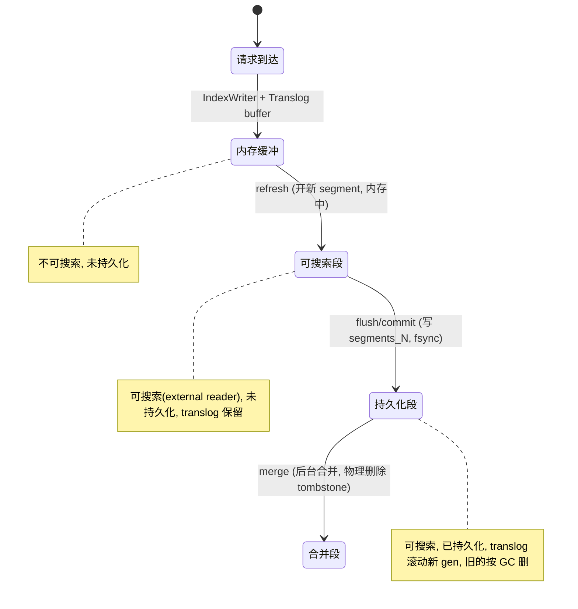
```mermaid
stateDiagram-v2
    [*] --> 请求到达
    请求到达 --> 内存缓冲 : IndexWriter + Translog buffer
    内存缓冲 --> 可搜索段 : refresh (开新 segment, 内存中)
    可搜索段 --> 持久化段 : flush/commit (写 segments_N, fsync)
    持久化段 --> 合并段 : merge (后台合并, 物理删除 tombstone)
    note right of 内存缓冲: 不可搜索, 未持久化
    note right of 可搜索段: 可搜索(external reader), 未持久化, translog 保留
    note right of 持久化段: 可搜索, 已持久化, translog 滚动新 gen, 旧的按 GC 删
```

**为何用 translog**：Lucene commit 开销大（fsync 所有 segment），不能每写都 commit；translog 顺序追加 fsync 快；crash 后用最近 commit + 重放 translog 恢复到崩溃前状态；副本/recovery 可基于 translog 或 soft deletes 历史增量重放。

**为何 segment 不可变**：并发读无需锁、缓存友好、写入用 in-memory buffer + refresh 开新段避免原地更新；代价是需 merge 控制段数量与物理删除 tombstone。

### 5.7 版本控制与乐观锁

- **VersionType**（`index/VersionType.java`）：`INTERNAL`（默认，自增）、`EXTERNAL`/`EXTERNAL_GTE`（用客户端版本号）、`FORCE`（不检查）。
- **if_seq_no / if_primary_term**（`IndexRequest.java:113`）：`InternalEngine.planIndexingAsPrimary`（L1074）检查当前文档的 seqno/term 与期望是否匹配，不匹配抛 `VersionConflictEngineException`（HTTP 409）。
- **versionMap**（`LiveVersionMap`）：维护未 refresh 到 Lucene 的文档版本（内存中），提供实时版本查询（无需 refresh）。
- **update 两阶段**（`TransportUpdateAction.java:176`）：先读当前文档 -> 执行脚本/upsert 生成 IndexRequest/DeleteRequest -> 递归走 bulk 路径；`retryOnConflict` 时对 `VersionConflictEngineException` 重试。

### 5.8 写入失败处理

- **primary failover**：shard 不再是 primary -> `RetryOnPrimaryException` -> `retryPrimaryException`（L263）重试整个请求到新 primary。
- **replica failover**（`ReplicationOperation.performOnReplica.onFailure` L206）：`failShardIfNeeded`（`TransportWriteAction.java:422`）-> `shardStateAction.remoteShardFailed` 通知 master，master 将副本从 in-sync 集合移除（标记 stale）。
- **document vs tragic failure**（`InternalEngine.indexIntoLucene` L1128）：主分片文档级失败只 fail 该请求；副本/recovery 上的文档失败视为 tragic（`failEngine`，关闭引擎）。

---

## 6. 数据查询流程

### 6.1 协调节点路由与 SearchType

`TransportSearchAction`（`action/search/TransportSearchAction.java:211` `doExecute`）：

1. `executeRequest`（L262）：协调节点本地 `rewriteAndFetch`（解析 date math 索引名、rewrite query）。
2. `executeSearch`（L593）：`resolveLocalIndices` -> `OperationRouting.searchShards`（L625，基于 routing/preference 选择分片）-> 合并本地+远程分片 -> 优化 SearchType（单分片强制 `QUERY_THEN_FETCH`，suggest-only 也转 Q_T_F，L641-658）-> `searchAsyncAction`（L744）。
3. 根据 `shouldPreFilterSearchShards`（L663）选择 `CanMatchPreFilterSearchPhase` 或直接创建 `SearchQueryThenFetchAsyncAction`（L794）/ `SearchDfsQueryThenFetchAsyncAction`（L789），`.start()`。

### 6.2 SearchPhase 状态机

所有阶段继承 `AbstractSearchAsyncAction`（`action/search/AbstractSearchAsyncAction.java`），采用 fan-out + 计数回调模式：`start`（L171）-> `run`（L188）遍历分片 `performPhaseOnShard`（L280）-> 每个 shard 返回 `onShardResult`（L544）/失败 `onShardFailure`（L446，尝试下一副本）-> `totalOps==expectedTotalOps` 时 `onPhaseDone`（L693）-> `executeNextPhase`（L373，检查故障决定是否继续）-> `getNextPhase()` 串接下一阶段。

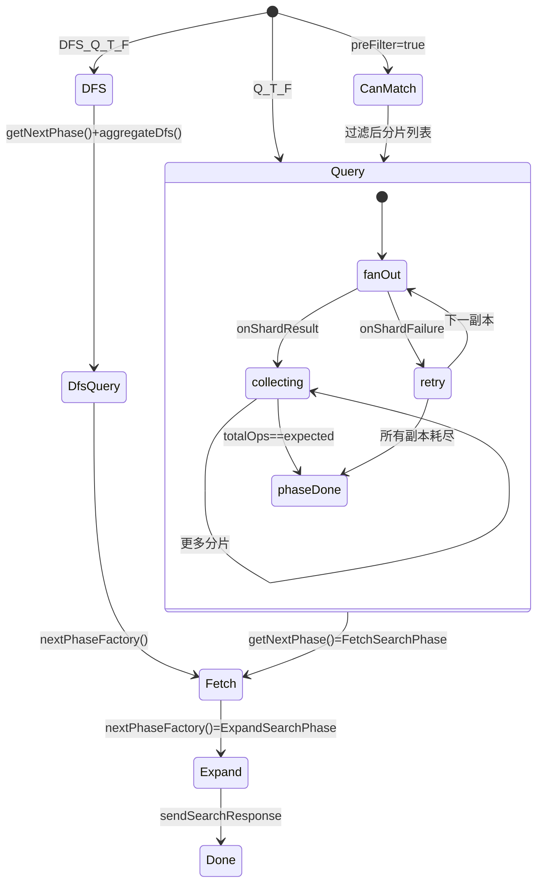
```mermaid
stateDiagram-v2
    [*] --> CanMatch : preFilter=true
    [*] --> Query : Q_T_F
    [*] --> DFS : DFS_Q_T_F
    CanMatch --> Query : 过滤后分片列表
    Query --> Fetch : getNextPhase()=FetchSearchPhase
    DFS --> DfsQuery : getNextPhase()+aggregateDfs()
    DfsQuery --> Fetch : nextPhaseFactory()
    Fetch --> Expand : nextPhaseFactory()=ExpandSearchPhase
    Expand --> Done : sendSearchResponse

    state Query {
        [*] --> fanOut
        fanOut --> collecting : onShardResult
        collecting --> collecting : 更多分片
        collecting --> phaseDone : totalOps==expected
        fanOut --> retry : onShardFailure
        retry --> fanOut : 下一副本
        retry --> phaseDone : 所有副本耗尽
    }
```

### 6.3 QUERY 阶段（分片端）

分片端收到 `QUERY_ACTION_NAME` 请求（`SearchTransportService.java:309` 注册 handler）-> `SearchService.executeQueryPhase`（`search/SearchService.java:372`）：

1. `rewriteAndFetchShardRequest` -> `shard.awaitShardSearchActive`（等 search idle 结束）。
2. `canMatch` 快速检查（可能直接返回 `nullInstance` 跳过）。
3. `createOrGetReaderContext` -> `shard.acquireSearcherSupplier`（`IndexShard.java:1328` -> `Engine.acquireSearcherSupplier` L616，引用计数）。
4. `createContext` + `parseSource`（解析 query/sort/agg/suggest/postFilter/innerHits）-> `queryPhase.preProcess`（注册 agg collector 为 query collector）。
5. `queryPhase.execute`（`search/query/QueryPhase.java:122`）：构建 collector 链（`terminateAfter` -> `postFilter` -> `aggs` -> `minScore` -> `topDocs`），`searcher.search(query, queryCollector)`（Lucene IndexSearcher 遍历文档，**一次遍历同时填充 TopDocs 与 Aggregation buckets**），随后 `rescorePhase` + `suggestPhase` + `aggregationPhase.execute`（`buildTopLevel`）。
6. 单分片优化：`numberOfShards==1` 时 `executeFetchPhase`（QUERY_AND_FETCH）。

### 6.4 FETCH 阶段

协调节点 `FetchSearchPhase.run`（`action/search/FetchSearchPhase.java:77`）：

1. `resultConsumer.reduce` -> `SearchPhaseController.reducedQueryPhase`（L398）：`reduceAggs`（`InternalAggregations.topLevelReduce`）+ `sortDocs`/`mergeTopDocs`（L186，Lucene `TopDocs.merge` 用堆归并各分片 TopDocs）。
2. `fillDocIdsToLoad`（L239）：按 `ScoreDoc.shardIndex` 分组 docIds。
3. 并行 `executeFetch` -> `sendExecuteFetch` 到各分片。
4. 分片端 `SearchService.executeFetchPhase`（L566）：`findReaderContext` -> `fetchPhase.execute`（`search/fetch/FetchPhase.java:74`）：按 docId 排序，逐个 `FetchSubPhase`（ExplainPhase、FetchDocValuesPhase、ScriptFieldsPhase、FetchSourcePhase、FetchFieldsPhase、FetchVersionPhase、SeqNoPrimaryTermPhase、HighlightPhase、InnerHitsPhase 等）处理，加载完整 `_source`/fields。
5. `searchPhaseController.merge`（L217）组装 `SearchHit` -> `ExpandSearchPhase`（collapse inner hits）-> `sendSearchResponse`。

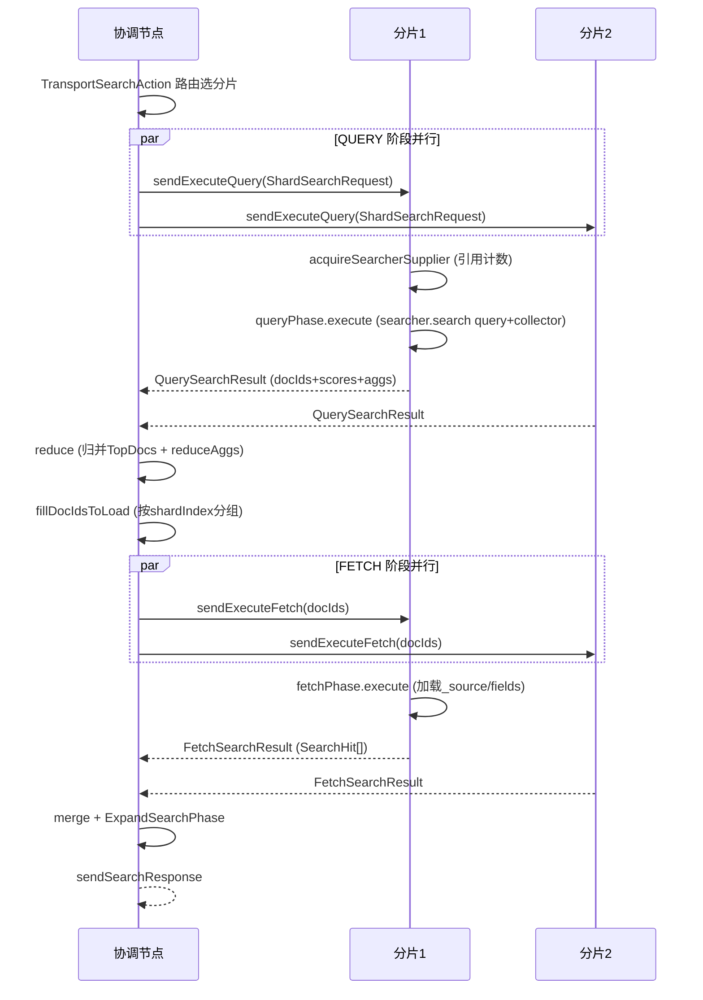
```mermaid
sequenceDiagram
    participant CO as 协调节点
    participant S1 as 分片1
    participant S2 as 分片2
    CO->>CO: TransportSearchAction 路由选分片
    par QUERY 阶段并行
        CO->>S1: sendExecuteQuery(ShardSearchRequest)
        CO->>S2: sendExecuteQuery(ShardSearchRequest)
    end
    S1->>S1: acquireSearcherSupplier (引用计数)
    S1->>S1: queryPhase.execute (searcher.search query+collector)
    S1-->>CO: QuerySearchResult (docIds+scores+aggs)
    S2-->>CO: QuerySearchResult
    CO->>CO: reduce (归并TopDocs + reduceAggs)
    CO->>CO: fillDocIdsToLoad (按shardIndex分组)
    par FETCH 阶段并行
        CO->>S1: sendExecuteFetch(docIds)
        CO->>S2: sendExecuteFetch(docIds)
    end
    S1->>S1: fetchPhase.execute (加载_source/fields)
    S1-->>CO: FetchSearchResult (SearchHit[])
    S2-->>CO: FetchSearchResult
    CO->>CO: merge + ExpandSearchPhase
    CO-->>CO: sendSearchResponse
```

### 6.5 为何分 Query/Fetch 两阶段

- **query 阶段**：每分片只返回 top (from+size) 条的 docId+score（轻量，不含 _source）。
- **fetch 阶段**：协调节点归并后，只对最终 top (from+size) 条拉取完整 _source/fields。

若用 QUERY_AND_FETCH，每分片返回 from+size 条完整文档，N 分片共 N*(from+size) 条，但只需 from+size 条，浪费 (N-1)*(from+size) 条 _source 传输。两阶段代价是多一次网络往返，但通常更省带宽。

### 6.6 DFS 三阶段

`SearchType.DFS_QUERY_THEN_FETCH` 用于需跨分片评分准确：先 DFS 阶段各分片收集 term/field 统计（`DfsPhase.execute`，`search/dfs/DfsPhase.java`，override `termStatistics`/`collectionStatistics`），协调节点 `aggregateDfs` 合并全局 `docFreq`/`totalTermFreq`，`DfsQueryPhase` 用全局统计重新查询。代价是多一次网络往返，用于 TF-IDF/BM25 跨分片评分可比场景。单分片/纯 sort/suggest-only 自动转 Q_T_F。

### 6.7 聚合 Reduce

- **分片本地聚合**：`AggregationPhase.preProcess` 创建 `Aggregator`（继承 `BucketCollector`），注册为 query collector，Lucene 遍历时与 TopDocs 同时填充；收集后 `buildTopLevel` 产出分片级 `InternalAggregations`。
- **协调节点增量 reduce**（`QueryPhaseResultConsumer`，`action/search/QueryPhaseResultConsumer.java`）：每收 `batchReduceSize`（默认 512）个分片结果触发一次 `partialReduce`（partial，不执行 pipeline），全部到齐后 `reduce`（final，执行 pipeline aggregations + `MultiBucketConsumer` 限制 bucket 数）。每次 reduce 都经断路器 `addEstimateAndMaybeBreak`。

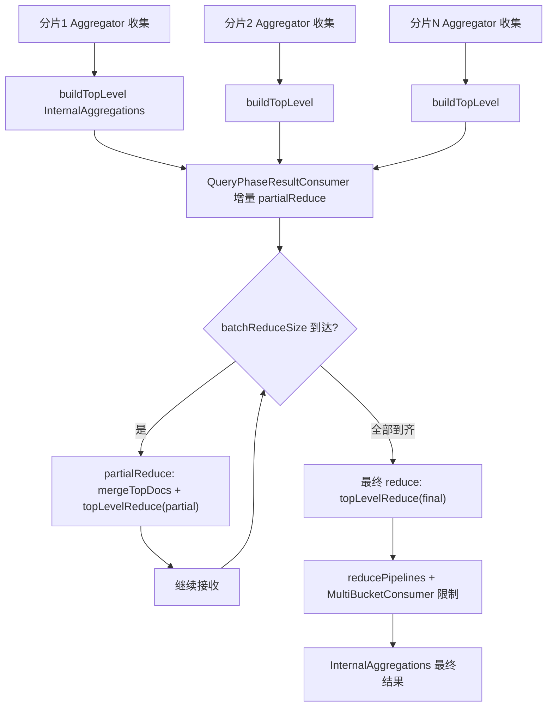
```mermaid
flowchart TD
    A1["分片1 Aggregator 收集"] --> B1["buildTopLevel InternalAggregations"]
    A2["分片2 Aggregator 收集"] --> B2["buildTopLevel"]
    A3["分片N Aggregator 收集"] --> B3["buildTopLevel"]
    B1 --> C["QueryPhaseResultConsumer 增量 partialReduce"]
    B2 --> C
    B3 --> C
    C --> D{"batchReduceSize 到达?"}
    D -->|是| E["partialReduce: mergeTopDocs + topLevelReduce(partial)"]
    E --> F["继续接收"]
    F --> D
    D -->|全部到齐| G["最终 reduce: topLevelReduce(final)"]
    G --> H["reducePipelines + MultiBucketConsumer 限制"]
    H --> I["InternalAggregations 最终结果"]
```

### 6.8 Scroll / PIT / search_after

- **scroll**（`SearchScrollQueryThenFetchAsyncAction`）：分片级 `LegacyReaderContext` 保持 searcher，`lastEmittedDoc` 作为下轮起点，query 用 `MinDocQuery(after.doc+1)` 跳过已返回。scrollId 含所有分片的 node+contextId 映射。
- **PIT**（`TransportOpenPointInTimeAction` -> `SearchService.openReaderContext` L716）：在分片上创建长生命周期 `ReaderContext` 持有 `SearcherSupplier`，固定 searcher 快照，支持多次 search_after 看到一致视图。
- **search_after**：用上页最后一条的 sortValues 作为 `after`，配合 `SearchAfterSortedDocQuery`（利用 index sorting 优化跳过）。

### 6.9 Searcher 生命周期

`IndexShard.acquireSearcherSupplier`（L1328）-> `Engine.acquireSearcherSupplier`（L616）：`store.tryIncRef` -> `referenceManager.acquire`（DirectoryReader 引用计数）-> 返回 `SearcherSupplier`，再 `acquireSearcher` 创建 `Searcher`（包装 IndexSearcher，`close` 释放）。`ReaderContext` 用 `AbstractRefCounted` 管理引用计数，keepAlive + lastAccessTime 控制过期。refresh 后 `ReferenceManager.maybeRefresh` 切换新 reader，旧 reader 在所有引用释放后被 GC。

### 6.10 故障处理与慢日志

- **分片故障**（`AbstractSearchAsyncAction.onShardFailure` L446）：尝试下一副本；所有副本失败且 `allowPartialSearchResults==false`（默认 true）则 `cancelSearchTask` 取消整个搜索。
- **搜索慢日志**（`SearchSlowLog`，`index/SearchSlowLog.java`）：实现 `SearchOperationListener`，`onQueryPhase`/`onFetchPhase` 比较 tookInNanos 与各级别（WARN/INFO/DEBUG/TRACE）阈值，记录 shardId/took/hits/source 等。
- **超时**：通过 Lucene `QueryCancellation` 在遍历时检查（非真中断线程），超时后 `allowPartialSearchResults==true` 返回部分结果（`searchTimedOut=true`）。

## 7. 分片分配与副本恢复

### 7.1 分片分配触发与 reroute

集群状态变化（节点加入/离开、索引创建、分片失败、磁盘水位触发）时，master 通过 `AllocationService.reroute`（`cluster/routing/allocation/AllocationService.java:381`）重新分配分片：

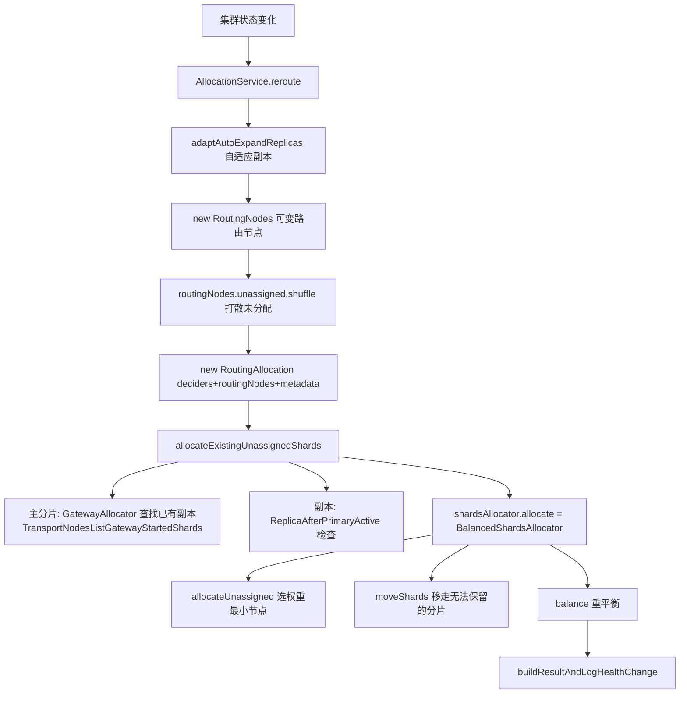
```mermaid
flowchart TD
    A[集群状态变化] --> B[AllocationService.reroute]
    B --> C[adaptAutoExpandReplicas 自适应副本]
    C --> D[new RoutingNodes 可变路由节点]
    D --> E[routingNodes.unassigned.shuffle 打散未分配]
    E --> F[new RoutingAllocation deciders+routingNodes+metadata]
    F --> G[allocateExistingUnassignedShards]
    G --> G1[主分片: GatewayAllocator 查找已有副本<br/>TransportNodesListGatewayStartedShards]
    G --> G2[副本: ReplicaAfterPrimaryActive 检查]
    G --> H[shardsAllocator.allocate = BalancedShardsAllocator]
    H --> H1[allocateUnassigned 选权重最小节点]
    H --> H2[moveShards 移走无法保留的分片]
    H --> H3[balance 重平衡]
    H3 --> I[buildResultAndLogHealthChange]
```

核心入口 `reroute(RoutingAllocation)`（L413-424）：`removeDelayMarkers` -> `allocateExistingUnassignedShards`（L421，主分片先经 `GatewayAllocator` 从磁盘已有副本恢复，副本在主 active 后才分配）-> `shardsAllocator.allocate`（L422，`BalancedShardsAllocator`）。

### 7.2 BalancedShardsAllocator 权重算法

`BalancedShardsAllocator`（`cluster/routing/allocation/allocator/BalancedShardsAllocator.java`）三阶段：

1. **allocateUnassigned**（L743）：为未分配分片选权重最小节点。主分片优先、同索引按 shardId 排序，`decideAllocateUnassigned`（L857）遍历所有节点找 `canAllocate` 为 YES/THROTTLE 且权重最小的。
2. **moveShards**（L621）：用 `decideMove`（L657）检查 `canRemain`，若 NO 则强制迁移到最优节点。
3. **balance**（L302）：`balanceByWeights`（L452）按索引不平衡度排序，`NodeSorter` 按权重排节点，从最重向最轻迁移，当权重差 `delta > threshold` 时 `tryRelocateShard`，需通过 `canRebalance` + `canAllocate` 双重检查。

权重公式（L196-219）：

```
weight(node, index) = theta0 * (node.numShards() - avgShardsPerNode)         // 全局平衡
                    + theta1 * (node.numShards(index) - avgShardsPerNode(index))  // 索引级
theta0 = shardBalance / (indexBalance + shardBalance)
theta1 = indexBalance / (indexBalance + shardBalance)
```

参数：`cluster.routing.allocation.balance.shard=0.45`、`index=0.55`、`threshold=1.0`。

### 7.3 AllocationDecider 决策链

`AllocationDeciders`（`cluster/routing/allocation/decider/AllocationDeciders.java:26`）是组合模式，**任意一个返回 NO 则短路返回 NO**（除非 debug 模式）。决策类型 `YES`/`THROTTLE`/`NO`。各 Decider 单一职责：

| Decider | 拦截 | 核心逻辑 |
|---|---|---|
| `EnableAllocationDecider` | canAllocate, canRebalance | `cluster.routing.allocation.enable`（NONE/NEW_PRIMARIES/PRIMARIES/ALL）开关 |
| `SameShardAllocationDecider` | canAllocate | 防止同分片副本在同节点/同 host |
| `AwarenessAllocationDecider` | canAllocate, canRemain | 基于 rack_id/zone 分散副本，`maximumShardsPerAttributeValue=ceil(shardCount/valueCount)` |
| `FilterAllocationDecider` | canAllocate, canRemain | require/include/exclude 过滤器控制节点 |
| `DiskThresholdDecider` | canAllocate, canRemain | 磁盘水位线检查 |
| `ThrottlingAllocationDecider` | canAllocate | 并发恢复数限制（`node_initial_primaries_recoveries=4`、`node_concurrent_incoming/outgoing_recoveries=2`），超限 THROTTLE |
| `ShardsLimitAllocationDecider` | canAllocate, canRemain | `index.routing.allocation.total_shards_per_node` |
| `ClusterRebalanceAllocationDecider` | canRebalance | `indices_all_active`（默认）等条件 |
| `ConcurrentRebalanceAllocationDecider` | canRebalance | `cluster.routing.allocation.cluster_concurrent_rebalance=2` |
| `ReplicaAfterPrimaryActiveAllocationDecider` | canAllocate | 副本仅在主分片 active 后才分配 |
| `NodeVersionAllocationDecider` | canAllocate | 副本不能分配到比主分片版本低的节点 |
| `MaxRetryAllocationDecider` | canAllocate | 分片分配重试次数限制（默认 5） |

手动 reroute 命令（`AllocationService.reroute(ClusterState, AllocationCommands, ...)` L351）：`MoveAllocationCommand`（强制迁移）、`CancelAllocationCommand`（取消）、`AllocateStalePrimaryAllocationCommand` 等。

### 7.4 分片状态机

`ShardRoutingState`（`cluster/routing/ShardRoutingState.java:16`）四态：

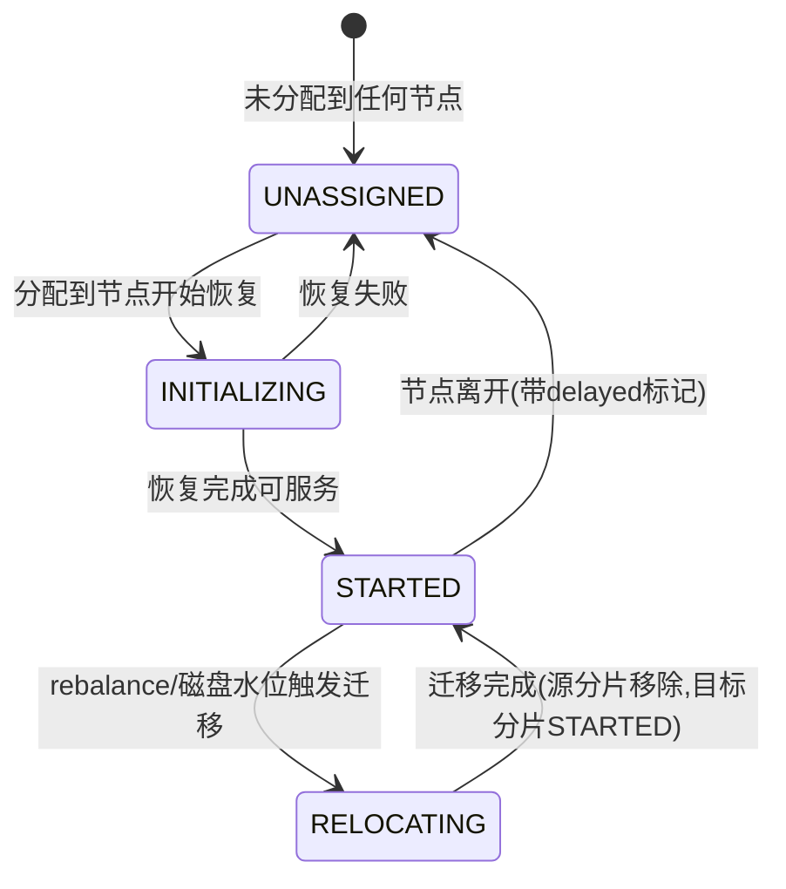
```mermaid
stateDiagram-v2
    [*] --> UNASSIGNED : 未分配到任何节点
    UNASSIGNED --> INITIALIZING : 分配到节点开始恢复
    INITIALIZING --> STARTED : 恢复完成可服务
    INITIALIZING --> UNASSIGNED : 恢复失败
    STARTED --> RELOCATING : rebalance/磁盘水位触发迁移
    RELOCATING --> STARTED : 迁移完成(源分片移除,目标分片STARTED)
    STARTED --> UNASSIGNED : 节点离开(带delayed标记)
```

`active()` = `started() || relocating()`。RELOCATING 状态会创建「影子」分片（`initializeTargetRelocatingShard`）：源节点持有 RELOCATING 分片（仍可读），目标节点同时创建 INITIALIZING 分片（`PeerRecoverySource`），迁移期间双份。恢复源类型：`EMPTY_STORE`（新建）、`EXISTING_STORE`（节点重启从本地盘恢复）、`PEER`（副本从主分片恢复）、`SNAPSHOT`（从快照）、`LOCAL_SHARDS`（shrink/split）。

### 7.5 Peer Recovery 两阶段

副本恢复由副本侧 `IndexShard.startRecovery`（`index/shard/IndexShard.java:2723`）触发（PEER 类型 -> `PeerRecoveryTargetService.startRecovery`），主分片侧 `PeerRecoverySourceService` -> `RecoverySourceHandler.recoverToTarget`（`indices/recovery/RecoverySourceHandler.java:139`）执行：

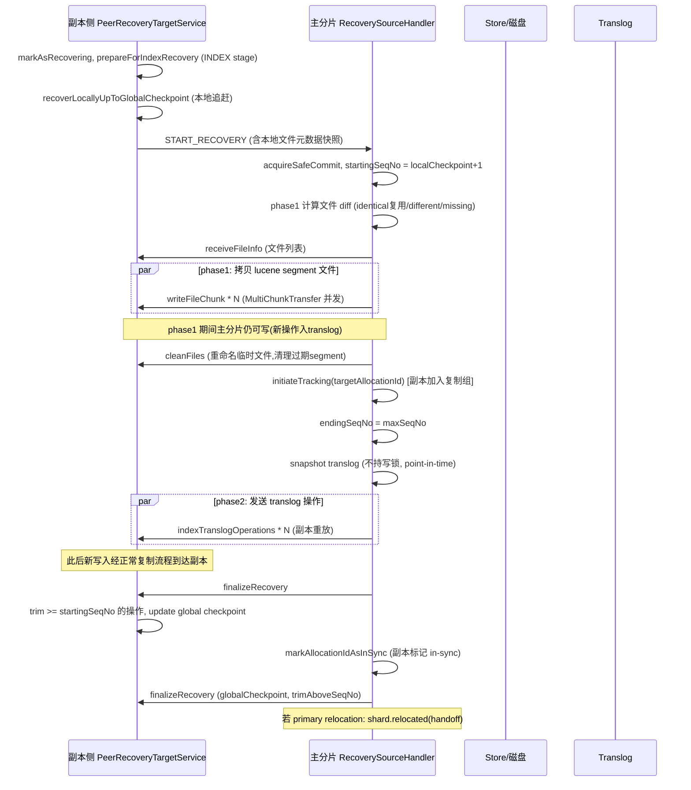
```mermaid
sequenceDiagram
    participant T as 副本侧 PeerRecoveryTargetService
    participant S as 主分片 RecoverySourceHandler
    participant ST as Store/磁盘
    participant TL as Translog

    T->>T: markAsRecovering, prepareForIndexRecovery (INDEX stage)
    T->>T: recoverLocallyUpToGlobalCheckpoint (本地追赶)
    T->>S: START_RECOVERY (含本地文件元数据快照)
    S->>S: acquireSafeCommit, startingSeqNo = localCheckpoint+1
    S->>S: phase1 计算文件 diff (identical复用/different/missing)
    S->>T: receiveFileInfo (文件列表)
    par phase1: 拷贝 lucene segment 文件
        S->>T: writeFileChunk * N (MultiChunkTransfer 并发)
    end
    Note over S,T: phase1 期间主分片仍可写(新操作入translog)
    S->>T: cleanFiles (重命名临时文件,清理过期segment)
    S->>S: initiateTracking(targetAllocationId) [副本加入复制组]
    S->>S: endingSeqNo = maxSeqNo
    S->>S: snapshot translog (不持写锁, point-in-time)
    par phase2: 发送 translog 操作
        S->>T: indexTranslogOperations * N (副本重放)
    end
    Note over T: 此后新写入经正常复制流程到达副本
    S->>T: finalizeRecovery
    T->>T: trim >= startingSeqNo 的操作, update global checkpoint
    S->>S: markAllocationIdAsInSync (副本标记 in-sync)
    S->>T: finalizeRecovery (globalCheckpoint, trimAboveSeqNo)
    Note over S: 若 primary relocation: shard.relocated(handoff)
```

**Phase1**（L459）：`store.getMetadata(safeCommit)` 获取源端文件元数据，`recoveryDiff`（`Store.java`）对比目标端分 identical（复用）/different/missing，按文件大小排序（小文件优先）经 `MultiChunkTransfer` 并发传输（`writeFileChunk`，`maxConcurrentFileChunks`），`createRetentionLease` 保留恢复期间历史，`cleanFiles` 重命名临时文件并建空 translog。可 `canSkipPhase1`（L611）：若 source/target 有相同 `syncId` 且 doc 数/seqno 一致则跳过（synced flush 优化）。

**Phase2**（L663）：先 `initiateTracking`（L300，副本加入复制组，此后主分片新写入实时复制到副本），`getHistoryOperations` 取 `[startingSeqNo, endingSeqNo]` 的 point-in-time 快照（不持写锁），`OperationBatchSender`（L711）分批发送，副本重放。`endingSeqNo` 之后的操作经正常复制流程到达。

**Finalize**（L795）：`markAllocationIdAsInSync`（L808，标记副本 in-sync），副本 trim `>= startingSeqNo` 的操作，更新 global checkpoint；primary relocation 时 `shard.relocated` 完成主分片交接。

**sequence-number-based recovery 优化**（L186-221）：若目标端 historyUUID 相同且主分片有完整历史（retention lease 覆盖），可跳过 phase1，仅 phase2 历史重放。

### 7.6 RecoveryState 状态机

`RecoveryState.Stage`（`indices/recovery/RecoveryState.java:44`）六阶段严格顺序：`INIT` -> `INDEX`（phase1 文件恢复）-> `VERIFY_INDEX`（完整性校验）-> `TRANSLOG`（phase2 重放）-> `FINALIZE` -> `DONE`。三个 tracker（`Index`/`Translog`/`VerifyIndex`）各自记录进度。

### 7.7 磁盘水位线

`DiskThresholdSettings`（`cluster/routing/allocation/DiskThresholdSettings.java`）三级：

| 水位线 | 默认 | 含义 |
|---|---|---|
| `watermark.low` | 85% | 超过则不分配新副本（主分片仍可） |
| `watermark.high` | 90% | 超过则分片不能留在该节点，触发迁移 |
| `watermark.flood_stage` | 95% | 标记索引为 `read_only_allow_delete` |

`DiskThresholdMonitor.onNewInfo`（L112）监听集群磁盘信息：超 flood_stage 标记只读、超 high 触发 `reroute`（`DiskThresholdDecider.canRemain` 返回 NO 让超水位分片迁移走）、节点恢复后自动释放只读块（`autoReleaseIndexEnabled` 默认 true）。`reroute_interval`（默认 60s）限制自动 reroute 频率。

---

## 8. 快照备份与恢复

### 8.1 快照协调机制

快照是 master 协调的两阶段过程：master 在集群状态中创建 `SnapshotsInProgress` 条目，数据节点执行分片快照，结果汇报后 master finalize。

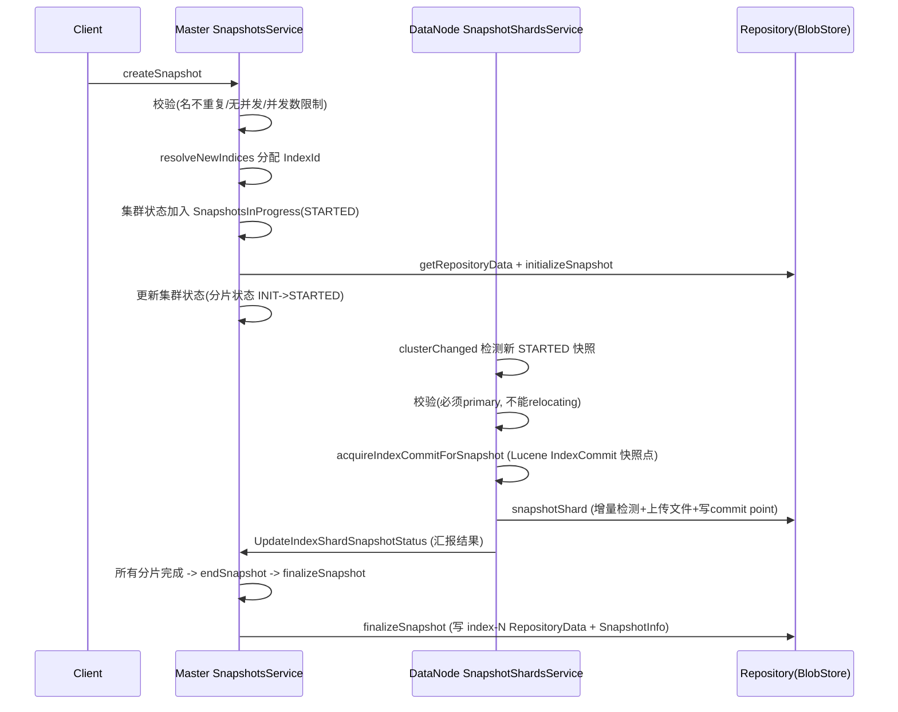
```mermaid
sequenceDiagram
    participant C as Client
    participant M as Master SnapshotsService
    participant D as DataNode SnapshotShardsService
    participant R as Repository(BlobStore)

    C->>M: createSnapshot
    M->>M: 校验(名不重复/无并发/并发数限制)
    M->>M: resolveNewIndices 分配 IndexId
    M->>M: 集群状态加入 SnapshotsInProgress(STARTED)
    M->>R: getRepositoryData + initializeSnapshot
    M->>M: 更新集群状态(分片状态 INIT->STARTED)
    D->>D: clusterChanged 检测新 STARTED 快照
    D->>D: 校验(必须primary, 不能relocating)
    D->>D: acquireIndexCommitForSnapshot (Lucene IndexCommit 快照点)
    D->>R: snapshotShard (增量检测+上传文件+写commit point)
    D->>M: UpdateIndexShardSnapshotStatus (汇报结果)
    M->>M: 所有分片完成 -> endSnapshot -> finalizeSnapshot
    M->>R: finalizeSnapshot (写 index-N RepositoryData + SnapshotInfo)
```

关键类：`SnapshotsService`（`snapshots/SnapshotsService.java`，master 侧，`createSnapshot` L357）、`SnapshotShardsService`（`snapshots/SnapshotShardsService.java`，数据节点侧，监听集群状态变化）、`BlobStoreRepository`（`repositories/blobstore/BlobStoreRepository.java`，`snapshotShard` L2119）、`FsRepository`（文件系统实现）。

### 8.2 快照基于 Lucene IndexCommit

`SnapshotShardsService.snapshot`（L312）-> `indexShard.acquireIndexCommitForSnapshot()`（L333）获取 Lucene `IndexCommit`（point-in-time segment 文件快照引用）。利用 Lucene 引用计数，快照期间即使有新 merge/commit，快照看到的文件不变（文件不被删除）。这是**零拷贝快照**的基础（不复制 segment，只引用）。

### 8.3 增量快照

`BlobStoreRepository.snapshotShard`（L2119）两层增量：

1. **Shard State Identifier 复用**（L2153-2160）：基于 `history_uuid-force_merge_uuid-maxSeqNo` 生成标识，若分片完全 synced（global checkpoint==local checkpoint==maxSeqNo）且 uuid 未变，直接复用之前的文件列表，零传输。
2. **文件级复用**（L2194-2203）：逐文件对比，同名同大小同 checksum（`fileInfo.isSame`）则复用不重传。

仓库存储结构：根 `index-N`（`RepositoryData`，所有快照/索引映射）-> `indices/${indexId}/${shardId}/`（`index-${uuid}` 分片级快照列表 + `${snapshotUUID}` commit point + `__`/`v__` 前缀数据 blob）。

### 8.4 快照恢复

`RestoreService.restoreSnapshot`（`snapshots/RestoreService.java:222`）：读 `RepositoryData` + `SnapshotInfo` -> 校验可恢复 -> 集群状态更新（新建索引或给已存在索引加 restore block，分片设为 INITIALIZING + `SnapshotRecoverySource`）-> 分片经正常 recovery 流程（`IndexShard.startRecovery` SNAPSHOT 类型 -> `repository.restoreShard`，`BlobStoreRepository.java:2388`）从仓库拉取文件（`FileRestoreContext` 并发 restore，对比本地文件确定需恢复的，虚拟 blob 直接写 hash、数据 blob 用 `SlicedInputStream`），恢复完成后经类似 phase2 追上主分片状态。

### 8.5 断路器

`CircuitBreaker`（`common/breaker/CircuitBreaker.java`）5 种，由 `HierarchyCircuitBreakerService`（`indices/breaker/HierarchyCircuitBreakerService.java`）管理：

| 断路器 | 默认 limit | overhead | 作用 |
|---|---|---|---|
| `FIELDDATA` | 40% heap | 1.03 | fielddata/parent-child id cache（PERMANENT） |
| `REQUEST` | 60% heap | 1.0 | 请求级内存（cardinality、bucket 计数，TRANSIENT） |
| `IN_FLIGHT_REQUESTS` | 100% heap | 2.0 | transport 请求字节（TRANSIENT） |
| `ACCOUNTING` | 100% heap | 1.0 | Lucene segment 内存（PERMANENT） |
| `PARENT` | 95% heap(use_real_memory) | 1.0 | 父断路器，汇总子断路器，基于实际 JVM heap |

`ChildMemoryCircuitBreaker.addEstimateBytesAndMaybeBreak`（L76）：CAS 计算含 overhead 的用量，超限抛 `CircuitBreakingException` 中止请求释放已分配内存；同时检查父断路器。`HierarchyCircuitBreakerService.checkParentLimit`（L302）：`trackRealMemoryUsage=true`（默认）时基于 `MEMORY_MX_BEAN.getHeapMemoryUsage().getUsed()` 实际堆使用；G1 GC 时 `G1OverLimitStrategy`（L386）在熔断前主动触发 G1 GC（分配 humongous 对象迫使回收），给 JVM 一次回收机会避免假性熔断。

## 9. 底层支撑机制

### 9.1 线程池与 Task 机制

线程池已在 §4.4 详述。`TaskManager`（`tasks/TaskManager.java`）跟踪长任务：`TransportAction.execute`（`action/support/TransportAction.java:61`）通过 `taskManager.register` 注册 task（含 action、request、parentTask），完成时 `unregister`。`sendChildRequest` 传递 `setParentTask`，实现父子 task 跨节点关联。`CancellableTask`（如 search、reindex）可被取消，`TaskTransportChannel` 让长任务结果异步返回。`TaskResult` 可存储供 `GET _tasks` 查询。

### 9.2 三类缓存

| 缓存 | 类 | 作用 | 失效 |
|---|---|---|---|
| **Node Query Cache** | `index/cache/query/IndexQueryCache.java`（分片级） | 缓存 query 的位集（bit set），加速重复过滤查询 | refresh 后按段失效 |
| **Shard Request Cache** | `index/cache/request/ShardRequestCache.java` | 缓存分片级查询结果（size=0 的 count/aggs） | refresh 后失效 |
| **FieldData Cache** | `indices/fielddata/cache/IndicesFieldDataCache.java` | 列式数据（doc_values 或 fielddata）内存缓存，供排序/聚合 | 按 LRU 淘汰 |

`SearchService.loadOrExecuteQueryPhase`（`search/SearchService.java:362`）：`indicesService.canCache` 判断是否可缓存，可缓存则 `loadIntoContext`（命中直接返回，未命中执行后缓存），否则直接 `queryPhase.execute`。缓存经断路器统计内存。底层 `Cache`（`common/cache/Cache.java`）是 LRU 实现，支持 `RemovalListener`。

### 9.3 Ingest Pipeline

`IngestService`（`ingest/IngestService.java:71`，实现 `ClusterStateApplier`）在写入前对文档执行 pipeline（processor 链）。`TransportBulkAction`（L179/L681）对带 `pipeline` 的 index 请求调用 `ingestService.executeBulkRequest`（L427），在协调节点（或专用 ingest 节点）执行 `executePipelines`（L489）：

- `Pipeline.execute`（`ingest/Pipeline.java:85`）-> `CompoundProcessor` 依次执行各 `Processor`（`set`、`grok`、`date`、`geoip`、`user_agent`、`script`、`convert`、`rename` 等，`modules/ingest-common`）。
- processor 可改写文档、修改目标索引（触发 final pipeline 重新解析）、丢弃文档（`onDropped`）。
- 失败按 `on_failure` 处理或 `onFailure` 回调。处理后的文档才进入索引流程。

Pipeline 元数据存于集群状态（`IngestMetadata`），通过 `ClusterStateApplier` 响应 pipeline 变更。

### 9.4 脚本引擎

`ScriptService`（`script/ScriptService.java:50`，实现 `ClusterStateApplier`、`ScriptCompiler`）管理脚本编译与缓存：

- `compile(Script, ScriptContext)`（L330）-> `ScriptCache.compile`（L380），按 `ScriptContext`（`score`、`aggs`、`ingest`、`update`、`field` 等）选择 `ScriptEngine`（Painless 在 `modules/lang-painless`、Mustache 在 `modules/lang-mustache`、Expression 在 `modules/lang-expression`）。
- `ScriptCache`（`script/ScriptCache.java`）按 context 限制编译速率（`script.max_compilations_rate`），避免脚本注入导致 CPU 耗尽；已编译脚本缓存复用。
- 存储脚本（stored script）通过 `putStoredScript` 写入集群状态 `ScriptMetadata`。

### 9.5 Mapping 与 Analysis

`DocumentMapper`（`index/mapper/DocumentMapper.java`）由 `MapperService` 管理，`parse`（L111）-> `DocumentParser` 把 JSON 解析为 Lucene `Document`，各 `FieldMapper`（`TextFieldMapper`、`KeywordFieldMapper`、`NumberFieldMapper`、`DateFieldMapper`、`BooleanFieldMapper`、`GeoPointFieldMapper`、`ObjectMapper`、`NestedObjectMapper` 等）负责字段映射，并写入元数据字段（`_id`、`_seq_no`、`_primary_term`、`_source`、`_routing`、`_field_names`）。动态 mapping（`DynamicTemplate`）在首次写入未知字段时自动推断类型。`AnalysisModule`（`indices/analysis/AnalysisModule.java`）提供 analyzer/tokenizer/char_filter/filter（`modules/analysis-common`），`PreBuiltAnalyzers` 提供内置分析器。

### 9.6 监控

`MonitorService`（`monitor/MonitorService.java:23`）聚合 `JvmService`（JVM 信息）、`OsService`（OS）、`ProcessService`（进程）、`FsService`（文件系统）、`JvmGcMonitorService`（GC 监控，`doStart` L57 启动）。这些探针数据供 `GET _nodes/stats`、`GET _nodes/os`、`GET _nodes/jvm` 等 API，也供磁盘水位、断路器、`CpuBreakerCalculationThread` 等使用。`NodeHealthService` 提供节点健康状态（选主时 `nodeHealthService.getHealth()` 检查，`Coordinator.java:1230`）。

### 9.7 Settings 配置系统

`Settings`（`common/settings/Settings.java`）是键值配置，`SettingsModule`（L142）注册所有 `Setting` 定义（含校验、默认值、动态更新）。`ClusterSettings`（集群级，动态可更新）与 `IndexScopedSettings`（索引级）支持 `cluster:settings` API 动态更新。`Settings` 可来自 `elasticsearch.yml`、命令行 `-E`、keystore（`KeyStoreWrapper` 安全设置如密码）。`replacePropertyPlaceholders` 支持环境变量/keystore 引用。

### 9.8 BigArrays / PageCache / 网络

- `BigArrays`：大数组抽象（堆外内存），供聚合、排序、滚动使用，经断路器统计。
- `PageCacheRecycler`：对象池复用，减少 GC。
- `NetworkService`（`common/network/NetworkService.java`）：含插件自定义 `NetworkCustomNameResolver`，解析节点发布地址。`BoundTransportAddress`/`PortsRange` 处理端口绑定（默认 9200-9300，可范围绑定）。
- `TransportInterceptor`：插件可拦截发送/接收，注入自定义逻辑。

### 9.9 其它核心抽象

- **IndicesService**（`indices/IndicesService.java`）：管理所有 `IndexService`，创建/删除索引、注入 `IndexModule` 扩展、注册 `IndexEventListener`（refresh/flush/merge 回调）。
- **IndicesClusterStateService**（`indices/cluster/IndicesClusterStateService.java`）：作为 `ClusterStateApplier`，响应集群状态变化，在数据节点创建/删除分片、触发 recovery、更新 mapping。
- **ShardStateAction**（`cluster/action/shard/`）：`remoteShardFailed` 通知 master 分片失败，master 决定是否移除分片。
- **DelayedAllocationService**（`cluster/routing/DelayedAllocationService.java`）：节点离开时延迟分配副本（`index.unassigned.node_left.delayed_timeout` 默认 1m），给节点恢复时间。
- **PersistentTasksService**：持久化任务（如 transform、rollup）跨节点调度与恢复。

---

## 10. 关键设计原理与总结

### 10.1 整体工作流程总览

```mermaid
flowchart TB
    subgraph 启动
        S1[main -> Bootstrap 原生/安全检查] --> S2[Node Guice 装配]
        S2 --> S3[Node.start 27步: TS->Discovery->CS->HTTP]
        S3 --> S4[Coordinator startInitialJoin 选主]
    end
    subgraph 集群
        S4 --> C1[选主 quorum+preVote]
        C1 --> C2[master 构建 ClusterState]
        C2 --> C3[两阶段发布 publish+commit]
        C3 --> C4[各节点 apply -> IndicesClusterStateService]
        C4 --> C5[GatewayService 恢复 + reroute 分配]
    end
    subgraph 写入
        W1[Client bulk -> 协调节点聚合] --> W2[ingest pipeline]
        W2 --> W3[主分片 engine.index: Lucene+Translog]
        W3 --> W4[副本复制 seqno]
        W4 --> W5[refresh 可搜索 / flush 落盘]
    end
    subgraph 查询
        Q1[Client search -> 路由选分片] --> Q2[QUERY 阶段: 各分片 topN docId]
        Q2 --> Q3[归并 TopDocs + reduce 聚合]
        Q3 --> Q4[FETCH 阶段: 拉取 _source]
        Q4 --> Q5[组装 SearchHit 响应]
    end
    S4 --> C1
```

### 10.2 Lucene 存储原理

ES 数据存储建立在 Lucene 之上，每个分片是一个 Lucene 索引（实际是 Engine 封装的 `IndexWriter`）：

- **倒排索引**（Inverted Index）：`text` 字段经分析器分词后构建 term -> posting list 的倒排结构，支持快速全文检索。`.tim`（term dictionary）、`.doc`（postings）、`.pos`（positions）等文件。
- **Doc Values**（列式存储）：`keyword`/数值/日期字段默认开启，以列式存储文档值，用于排序、聚合、script，避免 heap 占用（`fielddata` 是其堆内 fallback）。`.dvd`/`.dvm`。
- **BKD Tree**：数值/geo_point 的多维索引（`.dim`/`.kdd`/`.kdi`），支持范围查询与地理搜索。
- **Stored Fields**：`_source` 与启用了 `store` 的字段，按文档存储（`.fdt`/`.fdx`/`.fdm`）。
- **Segment 不可变**：每个 refresh 产生新 segment（不可变），便于并发无锁读、缓存友好；删除/更新通过 tombstone（soft delete）标记，物理删除靠 merge。
- **近实时（NRT）**：写入后默认 1s 内 refresh 后可搜索；持久化延迟（flush 按 translog 大小），用 translog 保证持久性。

### 10.3 seqno + checkpoint + soft deletes 的一致性设计

- **seqno** 实现主副本一致性与乱序容错：主分配递增 seqno，副本按 seqno 应用并去重。
- **local/global checkpoint** 控制 translog 清理与 recovery 起点：global checkpoint 之前的 translog 可安全删除；recovery 从 global checkpoint 之后增量追赶。
- **primary term** 防脑裂：副本只接受匹配 term 的操作。
- **soft deletes** 保留历史版本：recovery 可基于 Lucene 历史（而非依赖 translog 保留）重放，配合 `RetentionLease` 为各 peer 保留所需历史，实现高效的 sequence-number-based recovery（甚至跳过 phase1）。

### 10.4 选主：类 Raft 的 zen2

- term 单调递增、quorum 投票、pre-voting 减少冲突、two-phase（commit-then-apply）发布，与 Raft 一致。
- 差异：voting configuration 可动态调整（reconfiguration）；集群状态发布是 state-based 而非 log-based；leader 选举考虑 last accepted state 的新旧。
- 弃用了 zen1 的 `minimum_master_nodes`，由 voting configuration 自动计算 quorum，避免人工配置错误导致脑裂。

### 10.5 分层与解耦设计

- **CLI / Bootstrap / Node 构造 / Node.start** 四层分离：构造与启动分离，便于错误回滚与测试。
- **Guice fork + 强制 eager singleton**：`readOnlyAllSingletons` 节省内存、启动即暴露循环依赖；大量 `bind(X).toInstance(obj)` 手动 new 保证可控。
- **LifecycleComponent 模板方法**：统一的 start/stop/close 流程，幂等且线程安全，启动顺序精心设计（TS->Discovery->CS->HTTP）。
- **插件 classloader 隔离**：每插件独立 `URLClassLoader` + `PluginLoaderIndirection`，`reloadLuceneSPI` 让自定义 Codec/Analyzer 可发现，`sortBundles` 拓扑排序，`checkBundleJarHell` 防冲突。
- **Decider 责任链**：分片分配用组合 + 短路策略，每 decider 单一职责，灵活覆盖各种约束。
- **分层断路器**：Parent 汇总 Children，基于实际 JVM heap（`use_real_memory`）而非纯估算，配合 G1 GC 主动触发，精度与性能平衡；overhead 系数为估算不精确留余量。

### 10.6 其它底层设计点补充

- **refresh vs flush 本质区别**：refresh 开新 segment 使可搜索（不持久化）；flush Lucene commit（写 segments_N + fsync）+ 滚动 translog，持久化。写入默认 NRT（1s 可搜），持久化延迟。
- **为何 segment 不可变**：并发读无锁、缓存友好、写入用 in-memory buffer + refresh 开新段避免原地更新；代价是 merge 控制段数量与物理删除 tombstone。
- **coordinating only 节点**：卸载查询协调负担，数据节点专注读写。
- **routing 自定义**：相同 `routing` 的文档落同一分片，支持相关查询路由到单分片。
- **awareness**：按物理位置（rack/zone）分散副本，提高容灾。
- **Delayed Allocation**：节点离开时延迟分配副本，给恢复时间，避免不必要的 recovery 开销。
- **synced flush / canSkipPhase1**：无写入活动时写 syncId，recovery 跳过 phase1，优化 index close/restart。
- **Searcher 引用计数**：refresh 后 reader 切换，旧 reader 引用计数未归零前不释放，支持并发搜索与写入。
- **版本号 + if_seq_no 乐观并发**：客户端可基于上次读到的 seqno 做条件更新，避免覆盖。
- **DocumentMapper 动态 mapping**：首次写入未知字段自动推断类型，支持 `dynamic_templates` 定制。
- **断路器 Durability**：TRANSIENT（请求结束自动恢复）vs PERMANENT（需手动清理），区分可自愈与需干预的熔断。
- **x-pack 商业特性**：安全（认证鉴权、审计、加密）、SQL、监控（monitoring/stack monitoring）、Watcher（告警）、机器学习（ML）、CCS（跨集群搜索）、CCR（跨集群复制）、索引生命周期管理（ILM）、数据流（data stream）、变换（transform）、rollup、扁平化字段（flattened）、dense_vector 等，均位于 `x-pack/`，通过插件机制集成。

### 10.7 总结

Elasticsearch 7.13.0 是一个工程复杂度极高的分布式系统，其设计精髓在于：

1. **以 Lucene 为存储引擎**，用不可变 segment + translog WAL 实现 NRT 搜索与持久性的平衡，refresh/flush/merge 各司其职。
2. **以类 Raft（zen2）共识保证集群一致性**，自动 quorum + 动态 voting configuration 免除脑裂隐患，集群状态两阶段发布。
3. **以 seqno + checkpoint + soft deletes 保证副本一致性与高效 recovery**，从主分片增量追赶而非全量拷贝。
4. **以 Guice + LifecycleComponent + 插件扩展点构建可扩展架构**，40+ 服务按拓扑顺序装配启动，20+ 插件子接口覆盖几乎所有扩展场景。
5. **以分层断路器 + 磁盘水位 + Decider 责任链保证稳定性与自愈**，从请求级到集群级多级防护。

理解这些底层原理，有助于在生产环境中正确配置（线程池大小、refresh/flush 策略、分片/副本数、awareness、水位线）、性能调优（缓存、merge、force merge、routing）、故障排查（选主异常、recovery 卡住、断路器熔断、慢查询）以及容量规划。

---

> **附：关键源码索引**
>
> - 启动：`bootstrap/Elasticsearch.java:64`、`bootstrap/Bootstrap.java:332/159`、`node/Node.java:289/756/833`
> - 选主：`cluster/coordination/Coordinator.java:90/719/1209`、`cluster/coordination/ClusterBootstrapService.java:106`、`cluster/coordination/Coordinator.java:1277`（Publication）
> - 集群状态：`cluster/service/MasterService.java:62/377`、`cluster/service/ClusterApplierService.java:302/433`、`gateway/GatewayService.java:141`
> - 通信：`transport/TransportService.java:205/667/407`、`transport/TcpTransport.java:122/691`、`modules/transport-netty4/.../Netty4Transport.java:112/316`、`action/support/TransportAction.java:61/137`
> - 写入：`action/bulk/TransportBulkAction.java:416`、`action/support/replication/ReplicationOperation.java:99/114`、`index/shard/IndexShard.java:801/852`、`index/engine/InternalEngine.java:889/1822`、`index/translog/Translog.java:514/701`、`index/seqno/LocalCheckpointTracker.java:82`、`index/seqno/ReplicationTracker.java:1253`
> - 查询：`action/search/TransportSearchAction.java:211/593`、`action/search/AbstractSearchAsyncAction.java:171/693`、`search/SearchService.java:372/566`、`search/query/QueryPhase.java:122`、`search/fetch/FetchPhase.java:74`、`action/search/SearchPhaseController.java:398`
> - 分配恢复：`cluster/routing/allocation/AllocationService.java:381/413`、`cluster/routing/allocation/allocator/BalancedShardsAllocator.java:743/302`、`cluster/routing/ShardRoutingState.java:16`、`indices/recovery/RecoverySourceHandler.java:139/459/663/795`、`cluster/routing/allocation/DiskThresholdMonitor.java:112`
> - 快照：`snapshots/SnapshotsService.java:357`、`snapshots/SnapshotShardsService.java:312`、`repositories/blobstore/BlobStoreRepository.java:2119`、`snapshots/RestoreService.java:222`
> - 支撑：`threadpool/ThreadPool.java:57`、`common/breaker/CircuitBreaker.java`、`indices/breaker/HierarchyCircuitBreakerService.java:302`、`ingest/IngestService.java:71/427`、`script/ScriptService.java:330`、`plugins/PluginsService.java:97`、`monitor/MonitorService.java:23`

---

*本文档基于 Elasticsearch 7.13.0 源码分析整理，行号对应 `server/src/main/java/org/elasticsearch/` 下实际源码，可供深入研读与运维参考。*


