# Netty 4.1.105.Final 底层原理与架构深度剖析

> 本文档基于 **Netty 4.1.105.Final** 源码逐行核对撰写，所有结论均标注源文件路径与行号，并配 mermaid 架构图/流程图/时序图。文中特别标注了若干"网上流传但已过时"的说法与 4.1.105 实际实现的差异。
>
> 源码根目录：`netty-netty-4.1.105.Final/`

---

## 目录

1. [整体架构与模块划分](#1-整体架构与模块划分)
2. [工作流程总览](#2-工作流程总览)
3. [线程模型（Reactor）](#3-线程模型reactor)
4. [服务端/客户端启动流程](#4-服务端客户端启动流程)
5. [Pipeline 整体设计与执行流程](#5-pipeline-整体设计与执行流程)
6. [ByteBuf 体系设计与内存管理](#6-bytebuf-体系设计与内存管理)
7. [零拷贝实现原理](#7-零拷贝实现原理)
8. [消息发送 writeAndFlush 全链路](#8-消息发送-writeandflush-全链路)
9. [异步编程模型（Future/Promise）](#9-异步编程模型futurepromise)
10. [时间轮 HashedWheelTimer 实现原理](#10-时间轮-hashedwheeltimer-实现原理)
11. [编解码器体系](#11-编解码器体系)
12. [心跳检测机制](#12-心跳检测机制)
13. [FastThreadLocal 设计](#13-fastthreadlocal-设计)
14. [补充底层原理点](#14-补充底层原理点)
15. [性能优化点汇总](#15-性能优化点汇总)
16. [4.1.105 版本演进与易错点](#16-41105-版本演进与易错点)

---

## 1. 整体架构与模块划分

Netty 采用**分层 + 可插拔传输层**的设计，整体分为三大核心层与若干扩展层。

### 1.1 模块分层

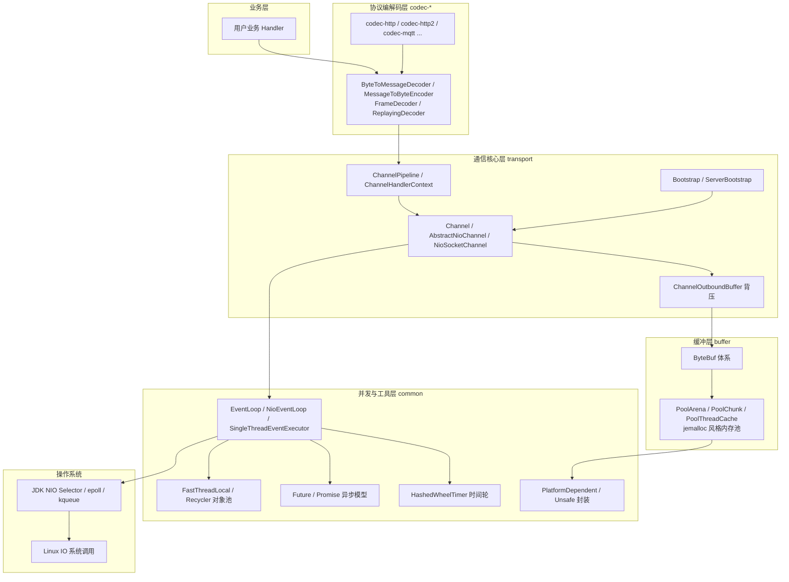

### 1.2 核心模块职责

| 模块 | 职责 | 关键类 |
|------|------|--------|
| `common` | 并发原语、线程模型、工具、Unsafe 封装 | `NioEventLoop`、`FastThreadLocal`、`DefaultPromise`、`Recycler`、`HashedWheelTimer`、`PlatformDependent` |
| `buffer` | ByteBuf 体系与池化内存管理（jemalloc 风格） | `ByteBuf`、`CompositeByteBuf`、`PoolArena`、`PoolChunk`、`PoolThreadCache`、`PooledByteBufAllocator` |
| `transport` | Channel 抽象、Pipeline、启动引导、出站缓冲 | `AbstractChannel`、`DefaultChannelPipeline`、`AbstractChannelHandlerContext`、`ChannelOutboundBuffer`、`ServerBootstrap` |
| `codec` | 通用编解码框架 | `ByteToMessageDecoder`、`MessageToByteEncoder`、`ReplayingDecoder`、`LengthFieldBasedFrameDecoder` |
| `handler` | 常用 Handler（心跳、流量整形、SSL、日志） | `IdleStateHandler`、`FlushConsolidationHandler` |
| `transport-native-epoll/kqueue` | 原生传输（更高性能、更多特性） | `EpollEventLoop`、`KQueueEventLoop` |

### 1.3 核心抽象关系图

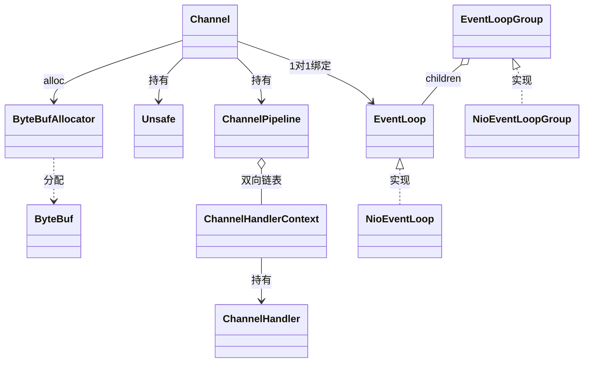

> **设计精髓**：一个 `Channel` 在其整个生命周期内只绑定一个 `EventLoop`（一个线程），其上所有事件（读、写、连接、关闭）都在该线程内串行执行——**无需同步锁**，这是 Netty 高并发的基础。

---

## 2. 工作流程总览

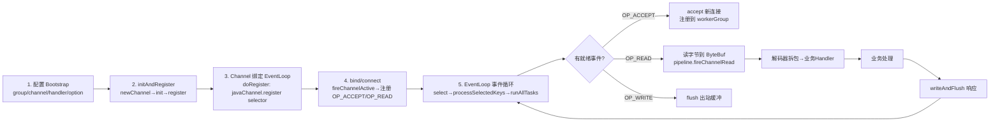

### 2.1 一次完整的请求-响应生命周期

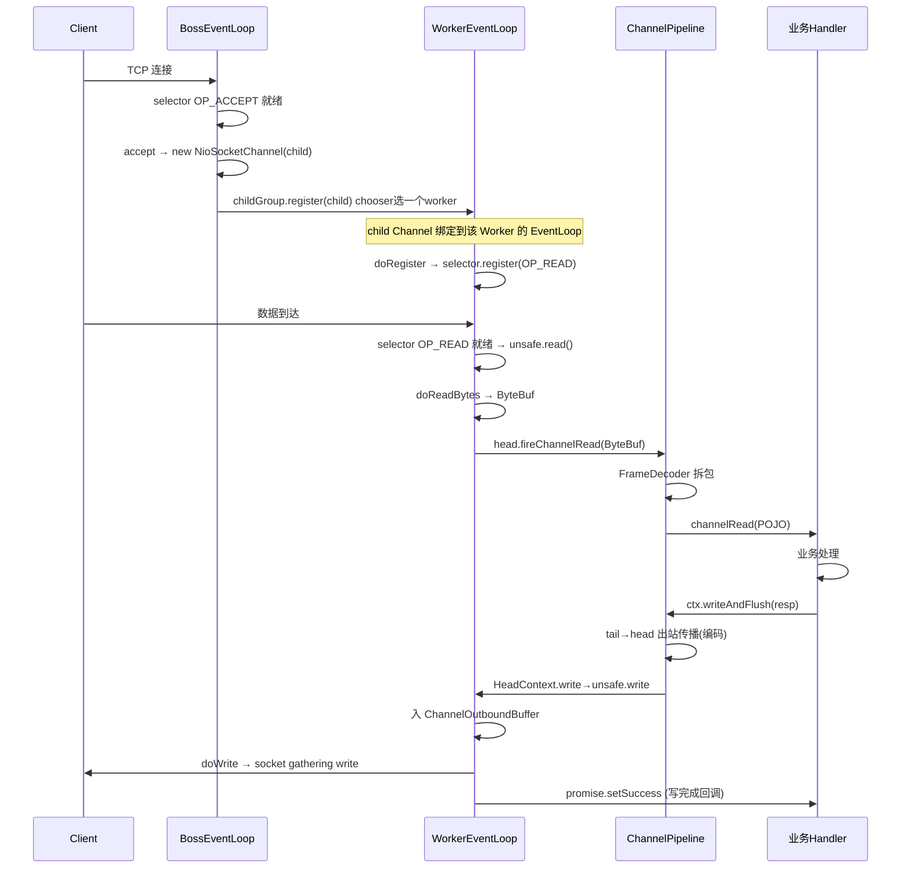

---

## 3. 线程模型（Reactor）

Netty 默认采用**主从 Reactor 多线程模型**：boss group 负责接收连接（OP_ACCEPT），worker group 负责已连接 Channel 的读写（OP_READ/OP_WRITE）。每个 EventLoop 内部封装一个 JDK `Selector`，多个 Channel 共享同一个 EventLoop（N:1 注册关系）。

### 3.1 Reactor 三种形态对比

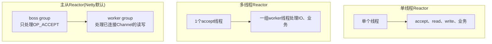

### 3.2 EventLoopGroup 与 chooser

`MultithreadEventExecutorGroup`（`common/.../concurrent/MultithreadEventExecutorGroup.java:33`）持有 `EventExecutor[] children`（line 35）与 `chooser`（line 39）。

**构造流程**（line 71-129）：
1. 默认 `ThreadPerTaskExecutor(newDefaultThreadFactory())`（line 75-77）
2. 循环 `newChild(executor, args)` 创建每个 EventLoop（line 81-108），失败则把已创建的全部 `shutdownGracefully`
3. `chooser = chooserFactory.newChooser(children)`（line 111）

**chooser 选择策略**（`DefaultEventExecutorChooserFactory.java`）：根据线程数是否为 2 的幂二选一：

```java
// PowerOfTwoEventExecutorChooser (line 56) — 位与替代取模，最快
public EventExecutor next() {
    return executors[idx.getAndIncrement() & executors.length - 1];
}

// GenericEventExecutorChooser (line 73) — 用 AtomicLong 计数避免32位溢出
public EventExecutor next() {
    return executors[(int) Math.abs(idx.getAndIncrement() % executors.length)];
}
```

> 默认线程数：`DEFAULT_EVENT_LOOP_THREADS = max(1, CPU核心数*2)`（`MultithreadEventLoopGroup.java:37-46`）。

### 3.3 NioEventLoop.run() 事件循环核心

`transport/.../nio/NioEventLoop.java:504-607`

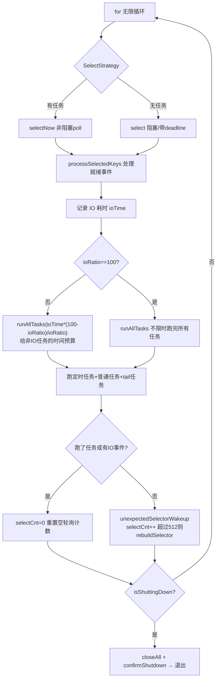

**关键机制详解**：

**① select() 与 deadline**（`NioEventLoop.java:877-884`）：
```java
private int select(long deadlineNanos) throws IOException {
    if (deadlineNanos == NONE) {            // 无定时任务，无限阻塞
        return selector.select();
    }
    long timeoutMillis = deadlineToDelayNanos(deadlineNanos + 995000L) / 1000000L;
    return timeoutMillis <= 0 ? selector.selectNow() : selector.select(timeoutMillis);
}
```

**② SelectStrategy——有任务时跳过阻塞 select**（`DefaultSelectStrategy.java:28-31`）：
```java
public int calculateStrategy(IntSupplier selectSupplier, boolean hasTasks) {
    return hasTasks ? selectSupplier.get() : SelectStrategy.SELECT; // 有任务→selectNow立即处理
}
```
这避免了"有任务却阻塞 select"的无谓等待，也减少了 `wakeup()` 调用。

**③ 空轮询 bug 规避**（`NioEventLoop.java:610-634`）：JDK epoll 在某些情况会 100% CPU 空轮询。Netty 用 `selectCnt` 计数，每次 select 返回后若没跑任务也没 IO 事件则 `selectCnt++`，超过 `SELECTOR_AUTO_REBUILD_THRESHOLD`（默认 512，line 102）则 `rebuildSelector0()`（line 441-501）——开新 selector，把所有 key 重新注册过去，关闭旧 selector。

**④ processSelectedKey 事件分发**（`NioEventLoop.java:742-793`）：
```java
int readyOps = k.readyOps();
if ((readyOps & SelectionKey.OP_CONNECT) != 0) {     // 优先: 先完成连接
    k.interestOps(k.interestOps() & ~OP_CONNECT);    // 清除OP_CONNECT否则select立即返回
    unsafe.finishConnect();
}
if ((readyOps & SelectionKey.OP_WRITE) != 0) {         // 次之: flush 待写数据释放内存
    unsafe.forceFlush();
}
if ((readyOps & (OP_READ | OP_ACCEPT)) != 0 || readyOps == 0) { // 最后: 读/accept
    unsafe.read();
}
```
顺序设计：先 CONNECT（保证已连），再 WRITE（释放内存），最后 READ/ACCEPT；`readyOps==0` 也调 read 是为规避 JDK bug。

### 3.4 selectedKeys 数组优化

JDK `Selector.selectedKeys()` 返回 `HashSet`，遍历需创建 Iterator 且有哈希开销。Netty 用 `SelectedSelectionKeySet`（数组）替换它：

- `SelectedSelectionKeySet`（`transport/.../nio/SelectedSelectionKeySet.java`）：内部 `SelectionKey[] keys`，`add` 直接 `keys[size++] = o`（O(1) 均摊，无哈希无装箱），`remove` 故意 no-op（直接 `keys[i]=null`），`reset()` 用 `Arrays.fill` 批量清空复用。
- 注入点 `NioEventLoop.openSelector()`（line 174-267）：反射/Unsafe 把 `sun.nio.ch.SelectorImpl` 的 `selectedKeys` 与 `publicSelectedKeys` 字段替换为 `SelectedSelectionKeySet`（line 217-247）。
- `SelectedSelectionKeySetSelector` 在每次 `select*` 前调 `selectionKeys.reset()` 清空数组供复用。
- `processSelectedKeysOptimized`（line 714-740）直接按下标遍历数组，CPU cache line 友好。

### 3.5 SingleThreadEventExecutor 任务队列与状态机

`common/.../concurrent/SingleThreadEventExecutor.java`

**状态机**（line 59-63）：`ST_NOT_STARTED(1) → ST_STARTED(2) → ST_SHUTTING_DOWN(3) → ST_SHUTDOWN(4) → ST_TERMINATED(5)`，用 `AtomicIntegerFieldUpdater` CAS 推进。

**任务队列**：默认 `LinkedBlockingQueue`（line 190-192），但 `NioEventLoop` 重写为 **MPSC 无锁队列**（`NioEventLoop.java:281-285`）：
```java
private static Queue<Runnable> newTaskQueue0(int maxPendingTasks) {
    // This event loop never calls takeTask()
    return maxPendingTasks == Integer.MAX_VALUE ? PlatformDependent.newMpscQueue()
            : PlatformDependent.newMpscQueue(maxPendingTasks);
}
```
> NioEventLoop 靠 select 阻塞而非 `take()` 阻塞，无界无锁 MPSC（多生产者单消费者）最合适：外部线程多生产者入队，EventLoop 单消费者出队。

**execute() 流程**（line 834-859）：`addTask` → 若非本线程则 `startThread`（CAS 状态启动）→ 若 `!addTaskWakesUp && immediate` 则 `wakeup`。

**safeExecute**（`AbstractEventExecutor.java:164-170`）：单个任务抛异常只记日志不杀死 EventLoop 线程，run 循环继续。

**ioRatio 时间预算**（`NioEventLoop.java:548-570`）：默认 50，IO 与非 IO 各占一半。IO 耗时 `ioTime`，则非 IO 任务最多跑 `ioTime*(100-ioRatio)/ioRatio` 纳秒——保证 IO 事件不被普通任务饿死。

**定时任务**：`AbstractScheduledEventExecutor` 用 `DefaultPriorityQueue`（小顶堆，按 deadline 排序，line 46/107-115）。`schedule` 创建 `ScheduledFutureTask` 入堆，`runAllTasks` 时 `fetchFromScheduledTaskQueue` 把到期任务搬到 taskQueue 执行。每 64 个任务检查一次超时（`nanoTime()` 较贵）。

**tailTasks**（`SingleThreadEventLoop.java:40`）：独立队列，存"每轮迭代末尾执行"的收尾任务，在 `afterRunningAllTasks` 中处理。

---

## 4. 服务端/客户端启动流程

启动引导核心三段式：**newChannel() → init() → register()**，在 `AbstractBootstrap.initAndRegister()`（`transport/.../bootstrap/AbstractBootstrap.java:323-358`）中编排。

### 4.1 AbstractBootstrap fluent API

`AbstractBootstrap<B, C>`（line 60）采用**泛型自引用**（`B extends AbstractBootstrap<B,C>`），每个 fluent 方法返回 `self()`（line 102），实现链式调用类型安全。

核心字段（均 `volatile`）：
- `EventLoopGroup group`（line 60）
- `ChannelFactory<? extends C> channelFactory`（line 62）：`channel(Class)` 内部创建 `ReflectiveChannelFactory`（反射调无参构造）
- `Map<ChannelOption<?>, Object> options`（line 67，LinkedHashMap，`synchronized` 保护，保证按序应用）
- `Map<AttributeKey<?>, Object> attrs`（line 68，ConcurrentHashMap）
- `ChannelHandler handler`（line 69）

### 4.2 initAndRegister() 三段式

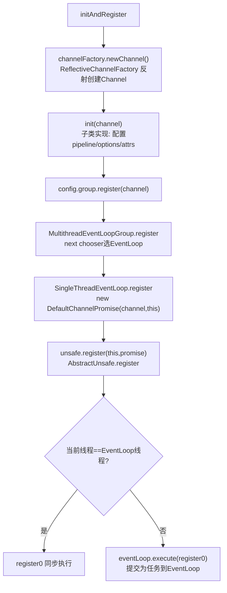

### 4.3 AbstractUnsafe.register / register0

`transport/.../channel/AbstractChannel.java`

```java
// register (line 465-498)
public final void register(EventLoop eventLoop, final ChannelPromise promise) {
    ...
    AbstractChannel.this.eventLoop = eventLoop;   // line 477: 绑定EventLoop！
    if (eventLoop.inEventLoop()) {
        register0(promise);                       // 本线程直接执行
    } else {
        eventLoop.execute(() -> register0(promise)); // 跨线程提交为任务
    }
}
```

```java
// register0 (line 500-537)
private void register0(ChannelPromise promise) {
    boolean firstRegistration = neverRegistered;
    doRegister();                              // line 508: 实际注册到selector
    neverRegistered = false;
    registered = true;
    pipeline.invokeHandlerAddedIfNeeded();     // line 514: 触发ChannelInitializer.initChannel！
    safeSetSuccess(promise);
    pipeline.fireChannelRegistered();         // line 517
    if (isActive()) {
        if (firstRegistration) {
            pipeline.fireChannelActive();     // line 522: 首次注册且active→触发active
        } else if (config().isAutoRead()) {
            beginRead();
        }
    }
}
```

**doRegister（NIO 实现）**（`AbstractNioChannel.java:376-396`）：
```java
protected void doRegister() throws Exception {
    for (;;) {
        try {
            selectionKey = javaChannel().register(eventLoop().unwrappedSelector(), 0, this); // line 381
            return;
        } catch (CancelledKeyException e) {
            if (!selected) { eventLoop().selectNow(); selected = true; } else { throw e; }
        }
    }
}
```
> 第 381 行是绑定核心：`javaChannel().register(selector, 0, this)`——interestOps 初始 0，attachment 为 Channel 自身。之后 `processSelectedKey` 通过 `k.attachment()` 取回 Channel，建立 IO 事件到 Channel 的映射。

### 4.4 服务端 bind 流程

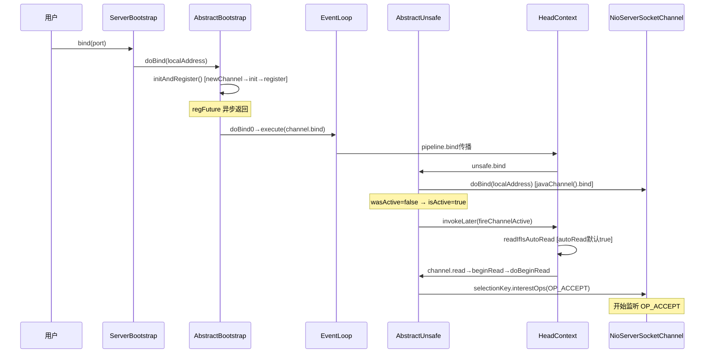

**关键链路**：
- `doBind`（`AbstractBootstrap.java:287-321`）：`initAndRegister()` 后若 `regFuture.isDone()` 同步 `doBind0`，否则加 `ChannelFutureListener` 异步回调。`PendingRegistrationPromise`（line 504-529）解决注册未完成时 executor 不确定的问题。
- `doBind0`（line 370-386）：`channel.eventLoop().execute(() -> channel.bind(...))`。
- `AbstractUnsafe.bind`（`AbstractChannel.java:540-579`）：`doBind()` 后若 `!wasActive && isActive()` 则 `invokeLater(fireChannelActive)`。
- `HeadContext.channelActive`（`DefaultChannelPipeline.java:1397-1401`）：`fireChannelActive` + `readIfIsAutoRead()`。
- `readIfIsAutoRead`（line 1420-1424）：`autoRead` 默认 true → `channel.read()` → `beginRead()` → `doBeginRead()`。
- `AbstractNioChannel.doBeginRead`（line 404-417）：`selectionKey.interestOps(interestOps | readInterestOp)`。对 `NioServerSocketChannel`，`readInterestOp = OP_ACCEPT`（构造时传入，`NioServerSocketChannel.java:96`）。

**NioServerSocketChannel.doBind**（line 139-145）：JDK7+ `javaChannel().bind(localAddress, backlog)`。

### 4.5 客户端 connect 流程

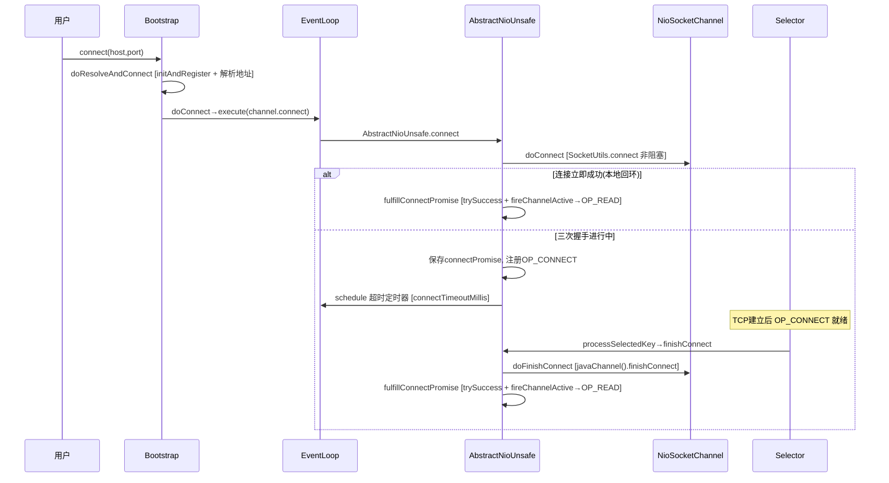

**关键点**：
- `Bootstrap.doResolveAndConnect0`（line 197-252）：默认 `DefaultAddressResolverGroup`（JDK DNS）异步解析，完成后 `doConnect`。
- `AbstractNioUnsafe.connect`（`AbstractNioChannel.java:235-288`）：`doConnect` 返回 false（进行中）则保存 `connectPromise`，设置 `OP_CONNECT`，启动 `connectTimeoutMillis` 超时定时器（line 255-269）。
- `NioSocketChannel.doConnect`（line 315-333）：`SocketUtils.connect()` 非阻塞，返回 false 则 `selectionKey().interestOps(OP_CONNECT)`。
- OP_CONNECT 就绪时 `NioEventLoop.processSelectedKey`（line 769-776）：清 OP_CONNECT，调 `unsafe.finishConnect()` → `doFinishConnect()` → `fulfillConnectPromise()`（line 290-313）：`trySuccess` + `fireChannelActive` → `doBeginRead` 注册 `OP_READ`。

### 4.6 ServerBootstrap.init 与 ServerBootstrapAcceptor

`transport/.../bootstrap/ServerBootstrap.java:132-173`：父 Channel 的 options/attrs 立即设置，通过 `ChannelInitializer` 延迟到注册后添加 `ServerBootstrapAcceptor`（通过 `eventLoop().execute()` 确保 EventLoop 线程执行）。

**ServerBootstrapAcceptor.channelRead**（line 222-252）：accept 到新连接时，子 Channel 作为 msg 传入：
```java
public void channelRead(ChannelHandlerContext ctx, Object msg) {
    final Channel child = (Channel) msg;
    child.pipeline().addLast(childHandler);       // 添加业务handler
    setChannelOptions(child, childOptions, logger);
    setAttributes(child, childAttrs);
    childGroup.register(child).addListener(...);  // 注册到childGroup
}
```

### 4.7 ChannelInitializer 的 initChannel 与自移除

`transport/.../channel/ChannelInitializer.java`：`@Sharable`，在 `handlerAdded`（line 106-118）触发。`initChannel`（line 126-142）用 `initMap`（ConcurrentHashSet）防重入，执行后无论成功失败都 `pipeline().remove(this)` **自移除**——这是"一次性"特性。

### 4.8 NioServerSocketChannel / NioSocketChannel 构造

- `AbstractNioChannel` 构造（line 79-90）：`ch.configureBlocking(false)` 设为非阻塞（关键！），保存 `readInterestOp`。
- `AbstractChannel` 构造（line 71-76）：创建 `ChannelId`、`unsafe`（`newUnsafe()`）、`DefaultChannelPipeline`。
- 服务端 accept 创建子 Channel：`NioServerSocketChannel.doReadMessages`（line 153-172）：`SocketUtils.accept()` → `new NioSocketChannel(this, ch)`（parent=this）。

> **澄清**：`openSelector` 不是在 Channel 构造时执行，而是在 **NioEventLoop 构造时**执行（`NioEventLoop.java:146`）。每个 NioEventLoop 持有一个 Selector。

---

## 5. Pipeline 整体设计与执行流程

`ChannelPipeline` 是一个**双向链表**，节点是 `ChannelHandlerContext`，每个节点持有一个 `ChannelHandler`。链表两端是两个特殊的内置节点 `HeadContext`（头）和 `TailContext`（尾）。

### 5.1 双向链表结构

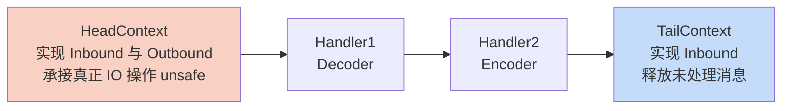

> 链表节点之间通过 `prev`/`next` 双向关联（addLast0 在 tail 前插入，line 227-233）。Inbound 事件沿 `head -> tail` 方向（`findContextInbound` 向 `next` 遍历），Outbound 事件沿 `tail -> head` 方向（`findContextOutbound` 向 `prev` 遍历）。

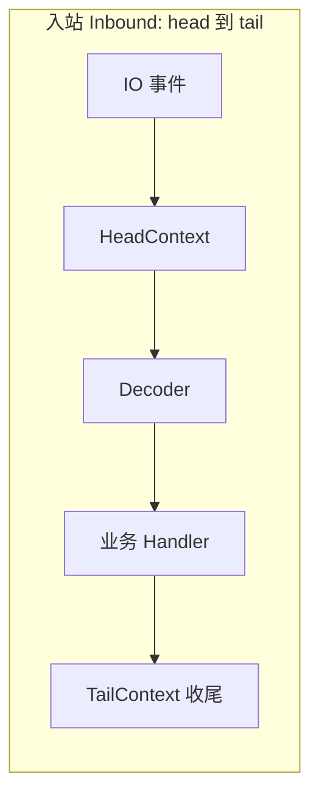

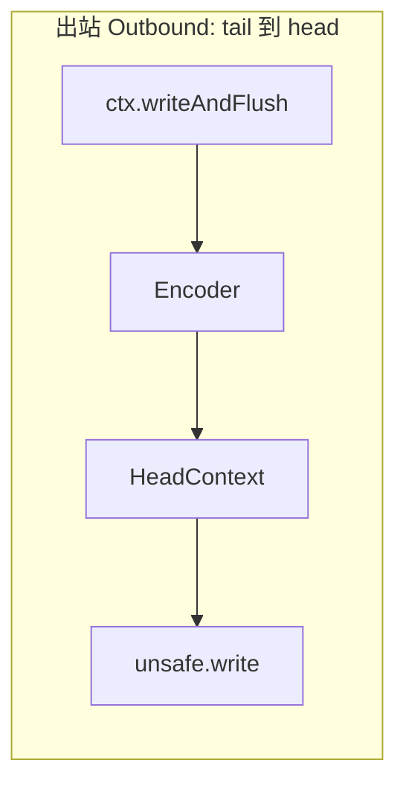

**构造**（`DefaultChannelPipeline.java:97-98`）：
```java
tail = new TailContext(this);
head = new HeadContext(this);
```
初始 `head.next = tail`，`tail.prev = head`。

**addLast0**（line 227-233）：在 `tail` 前插入：
```java
private void addLast0(AbstractChannelHandlerContext newCtx) {
    AbstractChannelHandlerContext prev = tail.prev;
    newCtx.prev = prev;
    newCtx.next = tail;
    prev.next = newCtx;
    tail.prev = newCtx;
}
```
`addLast`（line 199）在 `synchronized(this)` 中调用 `addLast0` + `newContext`，注册完成后调 `callHandlerAdded0` 触发 `handlerAdded`。

### 5.2 Inbound 与 Outbound 传播方向

| 方向 | 传播方向 | 触发者 | 代表事件 |
|------|----------|--------|----------|
| Inbound（入站） | head → tail | 底层 IO 事件 | channelRead、channelActive、channelRegistered |
| Outbound（出站） | tail → head | 用户主动调用 | write、flush、bind、connect、read |

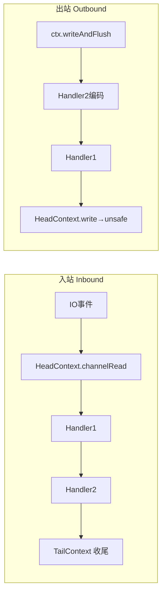

### 5.3 ChannelHandlerMask 位运算优化（核心性能点）

`transport/.../channel/ChannelHandlerMask.java`：用位掩码标记每个 handler 关心哪些事件。每个事件对应一个位（line 39-55）：
```java
static final int MASK_EXCEPTION_CAUGHT = 1;
static final int MASK_CHANNEL_READ = 1 << 5;
static final int MASK_WRITE = 1 << 15;
static final int MASK_FLUSH = 1 << 16;
...
```

**mask 计算**（`mask0`，line 91-164）：当 handler 加入 pipeline 时，反射检查 handler 类各方法是否标注 `@Skip`。`ChannelHandlerAdapter` 的所有方法默认标注 `@Skip`，**子类重写的方法没有 @Skip**，于是 mask 中对应位被设置。

```java
// 示例: 检查 channelRead 是否可跳过
if (isSkippable(handlerType, "channelRead", ChannelHandlerContext.class, Object.class)) {
    mask &= ~MASK_CHANNEL_READ;   // 标注了@Skip → 清除该位
}
```

> **@Skip 不被 @Inherited 继承**（line 194-197）：用户重写父类带 @Skip 的方法后，该方法不再被跳过。`MessageToByteEncoder` 重写了 `write` 且没标 @Skip，所以 mask 中 WRITE 位被设置，pipeline 会调用它编码。

### 5.4 findContextInbound / findContextOutbound——按 mask 跳过不关心的 handler

`AbstractChannelHandlerContext.java:1068-1095`：

```java
private AbstractChannelHandlerContext findContextInbound(int mask) {
    AbstractChannelHandlerContext ctx = this;
    EventExecutor currentExecutor = executor();
    do {
        ctx = ctx.next;     // 向 tail 方向遍历
    } while (skipContext(ctx, currentExecutor, mask, MASK_ONLY_INBOUND));
    return ctx;
}

private AbstractChannelHandlerContext findContextOutbound(int mask) {
    AbstractChannelHandlerContext ctx = this;
    EventExecutor currentExecutor = executor();
    do {
        ctx = ctx.prev;     // 向 head 方向遍历
    } while (skipContext(ctx, currentExecutor, mask, MASK_ONLY_OUTBOUND));
    return ctx;
}

private static boolean skipContext(AbstractChannelHandlerContext ctx, EventExecutor currentExecutor,
                                    int mask, int onlyMask) {
    return (ctx.executionMask & (onlyMask | mask)) == 0 ||
           (ctx.executor() == currentExecutor && (ctx.executionMask & mask) == 0);
}
```

**精髓**：传播事件时跳过"不关心该事件"的 handler，省去一次空方法调用 + `ctx.xxx()` 转发的开销。例如一个纯 Outbound 的 Encoder 不会被入站 channelRead 事件触发。

### 5.5 HeadContext 与 TailContext

**HeadContext**（`DefaultChannelPipeline.java:1305-1424`）：同时实现 `ChannelOutboundHandler` 和 `ChannelInboundHandler`，持有 `Unsafe unsafe`（line 1308，`pipeline.channel().unsafe()`）。它是 pipeline 通往底层 socket 的边界：

```java
// HeadContext 的出站方法都委托给 unsafe
public void bind(ChannelHandlerContext ctx, SocketAddress localAddress, ChannelPromise promise) { unsafe.bind(...); }
public void connect(...) { unsafe.connect(...); }
public void write(ChannelHandlerContext ctx, Object msg, ChannelPromise promise) { unsafe.write(msg, promise); } // line 1366
public void flush(ChannelHandlerContext ctx) { unsafe.flush(); } // line 1371

// HeadContext.channelActive 触发 autoRead
public void channelActive(ChannelHandlerContext ctx) {
    ctx.fireChannelActive();
    readIfIsAutoRead();   // autoRead→注册OP_ACCEPT/OP_READ
}
```

**TailContext**（line 1245-1303）：实现 `ChannelInboundHandler`，处理到达尾部未处理的消息——**释放 ByteBuf 资源**并打印警告日志：
```java
public void channelRead(ChannelHandlerContext ctx, Object msg) {
    onUnhandledInboundMessage(ctx, msg);   // 释放 ByteBuf，警告未处理的消息
}
```

### 5.6 事件传播完整流程（以 channelRead 为例）

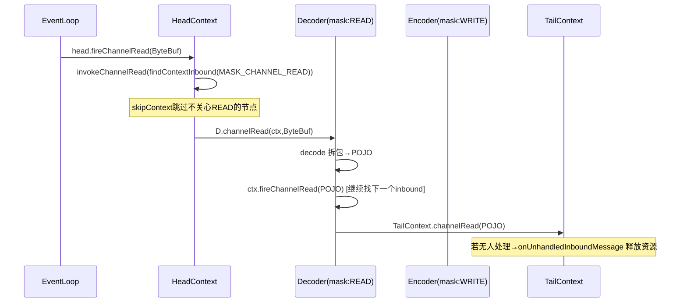

**入站传播入口**（`AbstractChannelHandlerContext.java:412-435`）：
```java
public ChannelHandlerContext fireChannelRead(Object msg) {
    invokeChannelRead(findContextInbound(MASK_CHANNEL_READ), msg); // line 412
    return this;
}
static void invokeChannelRead(final AbstractChannelHandlerContext next, Object msg) {
    if (next.executor().inEventLoop()) {
        next.invokeChannelRead(msg);   // 同线程直接调用
    } else {
        next.executor().execute(() -> next.invokeChannelRead(msg)); // 跨线程提交
    }
}
```

### 5.7 handler 状态与调用时机

`AbstractChannelHandlerContext` 的 `handlerState`（`ADD_PENDING → ADD_COMPLETE → REMOVE_COMPLETE`）。`invokeHandler()`（line 1154-1158）只有 `ADD_COMPLETE`（或非有序时 `ADD_PENDING`）才真正调用 handler，否则只转发——防止 handlerAdded 未完成时事件丢失。

---

## 6. ByteBuf 体系设计与内存管理

### 6.1 ByteBuf 类体系

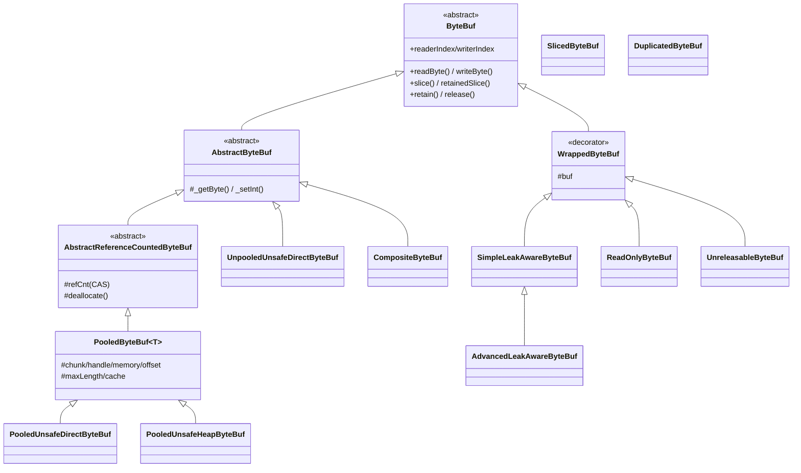

### 6.2 装饰器模式

根装饰器 `WrappedByteBuf`（`buffer/.../WrappedByteBuf.java:40`）持有 `protected final ByteBuf buf`，每个方法直接转发。子类只覆盖需要改写行为的方法：

- **LeakAware**：`SimpleLeakAwareByteBuf`（持 `ResourceLeakTracker`，release 后 `closeLeak`）；`AdvancedLeakAwareByteBuf` 覆盖几乎每个方法，调用前 `leak.record()` 记录访问栈。由 `AbstractByteBufAllocator.toLeakAwareBuffer`（line 40-60）按 `ResourceLeakDetector.getLevel()` 选择包装。
- **ReadOnly**：写方法抛 `ReadOnlyBufferException`。
- **Sliced/Duplicated**：派生自 `AbstractDerivedByteBuf`，共享底层内存（见零拷贝章节）。
- **Unreleasable**：覆盖 `retain/release` 全部返回 this/false，阻止修改引用计数。

装饰链可叠加，如 `AdvancedLeakAwareByteBuf → WrappedByteBuf → PooledUnsafeDirectByteBuf`。

### 6.3 读写指针设计

`AbstractByteBuf`（line 71-75）：`readerIndex`、`writerIndex`、`markedReaderIndex`、`markedWriterIndex`、`maxCapacity`。

不变量：`0 ≤ readerIndex ≤ writerIndex ≤ capacity`。

- `discardReadBytes()`（line 216-233）：把可读字节搬到 0，`writerIndex -= readerIndex`，`readerIndex = 0`（memmove，开销大）。`discardSomeReadBytes()` 仅在 `readerIndex >= capacity/2` 才搬移。
- `ensureWritable0`：容量不足时 `calculateNewCapacity` 扩容（4MB 阈值以下取下一个 2 的幂，以上按 4MB 步进）。

### 6.4 引用计数（CAS + 偶数编码）

`AbstractReferenceCountedByteBuf` + `ReferenceCountUpdater`（`common/.../internal/ReferenceCountUpdater.java`）采用**偶数编码**技巧：

> **Even ⇒ 真实 refCnt = refCnt >>> 1；Odd ⇒ 已释放（refCnt=0）**

- `initialValue()` 返回 2（真实计数为 1）。
- `retain`：`getAndAdd(rawIncrement)`（rawIncrement = increment << 1），旧值为奇数则抛异常。
- `release`：`tryFinalRelease0` 把 `refCnt` 从偶数（如 2）**CAS 到 1（奇数，归零）**。一次 CAS 完成"释放到 0"判定，避免 ABA。

`release` 归零后调 `deallocate()`。`PooledByteBuf.deallocate`（`PooledByteBuf.java:171-182`）：`chunk.arena.free(chunk, tmpNioBuf, handle, maxLength, cache)` 归还到池 + `recyclerHandle.unguardedRecycle(this)` 对象回收到 ObjectPool。

### 6.5 ⚠️ 重要版本订正：PoolChunk 算法

> **网上流传的说法**（适用于 4.1.30 之前）：PoolChunk 用满二叉树 `memoryMap`/`depthMap`/`heightMap`，chunkSize=16MB，maxOrder=11。
>
> **4.1.105 实际**（4.1.52+ 起重构）：PoolChunk 已切换为 jemalloc 风格的 **PageRun/RunHandles** 算法，`memoryMap`/`depthMap`/`heightMap` **已不存在**。默认 `maxOrder=9`、`chunkSize=4MB`（`PooledByteBufAllocator.java:82、104`）。

### 6.6 PooledByteBufAllocator 整体结构

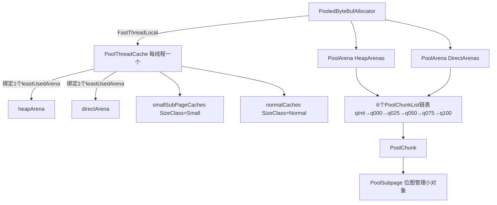

**Arena 数量**默认 `2 * availableProcessors()`（`PooledByteBufAllocator.java:103`），受内存上限约束。

**6 个 PoolChunkList**（`PoolArena.java:45-50, 86-98`）按使用率分桶：

| List | minUsage | maxUsage | 含义 |
|------|----------|----------|------|
| qInit | MIN | 25 | 新建 chunk 入口 |
| q000 | 1 | 50 | 使用率 1%~50% |
| q025 | 25 | 75 | 25%~75% |
| q050 | 50 | 100 | **分配优先在此**（半满减少碎片） |
| q075 | 75 | 100 | 75%~100% |
| q100 | 100 | MAX | 100% |

**使用率推进**：`PoolChunkList.allocate`（`PoolChunkList.java:99-117`）成功后若使用率达 maxUsage 则 `remove + nextList.add` **上移**；`free` 后若低于 minUsage 则 **下移**（`move0` 递归向 prevList，直到 q000 之下被销毁）。`allocateNormal`（`PoolArena.java:201-216`）按 `q050→q025→q000→qInit→q075` 顺序尝试。

### 6.7 PoolChunk 核心算法（PageRun）

**核心字段**（`PoolChunk.java:136`）：
- `Object base` / `T memory`（原始内存）
- `LongLongHashMap runsAvailMap`（key=runOffset, value=handle，line 155）
- `IntPriorityQueue[] runsAvail`（每个 pageIdx 一个最小堆，line 160，堆顶是偏移最小的 run）
- `PoolSubpage[] subpages`（按 runOffset 索引，line 167）
- `int pageSize(8KB)`, `pageShifts(13)`, `chunkSize(4MB)`

**Handle 位编码**（line 76-84）：
```
 ooooooo ooooooo sssssss sssssss ssue bbbb bbbb bbbb bbbb bbbb bbbb
  o: runOffset(15bit)  s: size页数(15bit)  u:isUsed(1bit)  e:isSubpage(1bit)  b:bitmapIdx(32bit)
```

**allocateRun**（line 359-388）：
```java
private long allocateRun(int runSize) {
    int pages = runSize >> pageShifts;
    int pageIdx = arena.sizeClass.pages2pageIdx(pages);
    runsAvailLock.lock();
    try {
        int queueIdx = runFirstBestFit(pageIdx);   // best-fit 找最小够大的队列
        if (queueIdx == -1) return -1;
        long handle = runsAvail[queueIdx].poll();   // 取偏移最小的 run
        handle = splitLargeRun(handle, pages);     // 切分多余页
        freeBytes -= runSize(pageShifts, handle);
        return handle;
    } finally { runsAvailLock.unlock(); }
}
```

**free + collapseRuns**（line 489-535, 538-587）：释放时合并相邻 avail run（`collapsePast`/`collapseNext` 查 `runsAvailMap` 的相邻 offset），减少碎片。

### 6.8 PoolSubpage 位图管理

`PoolSubpage`（`PoolSubpage.java:26`）：把一个 page（或 run）按 `elemSize` 切分，用 `long[] bitmap` 位图管理空闲 slot。

- `maxNumElems = runSize / elemSize`，`bitmapLength = (maxNumElems+63)>>>6`
- **allocate**（line 90-112）：`getNextAvail` 找第一个 0 位，`bitmap[q] |= 1L<<r` 置位，满则 `removeFromPool`。
- **free**（line 118-151）：`bitmap[q] ^= 1L<<r` XOR 清位，`setNextAvail` 记录下次分配起点，从空恢复则 `addToPool`，全空且非唯一则 `removeFromPool`。
- 同一 `sizeIdx` 的 subpage 共享 `arena.smallSubpagePools[sizeIdx]` head（双向链表），形成 subpage 池。

### 6.9 PoolThreadCache（线程本地缓存——性能关键）

`buffer/.../PoolThreadCache.java`：每个线程一个（`PooledByteBufAllocator` 的 `FastThreadLocal<PoolThreadCache>`，line 504）。

**结构**：
- `smallSubPageHeapCaches` / `smallSubPageDirectCaches`（每个 sizeIdx 一个 `SubPageMemoryRegionCache`，size=256）
- `normalHeapCaches` / `normalDirectCaches`（每个 sizeIdx 一个 `NormalMemoryRegionCache`，size=64）
- `MemoryRegionCache` 内部用 **MPSC 队列**（`PlatformDependent.newFixedMpscQueue`，line 348）持有 `Entry`

**allocate**（`MemoryRegionCache.allocate`，line 376-387）：`queue.poll()` 取 Entry → `initBuf` → `entry.unguardedRecycle()`。**命中即取，无锁**。
**add**（line 362-371）：`newEntry` → `queue.offer`。
**trim**（line 413-421）：每 `freeSweepAllocationThreshold`（默认 8192）次分配触发，`free = size - allocations` 释放未用够的 Entry 回 arena。

**Entry**（line 440-464）用 `ObjectPool` 复用，字段：`chunk`、`nioBuffer`、`handle`、`normCapacity`。

> **设计精髓**：分配走 `线程缓存(MPSC无锁) → PoolChunkArena(加锁) → PoolChunk`，缓存命中率高时全程无锁无竞争。`FreeOnFinalize`（line 486-503）通过 `finalize()` 兜底释放，防止线程异常退出泄漏。

### 6.10 SizeClasses 分级

`SizeClasses`（`buffer/.../SizeClasses.java:81`）jemalloc 风格分级：
- `LOG2_QUANTUM=4`（最小步长 16 字节）
- 第一组 size：16/32/48/64，后续组按 `log2Group` 翻倍
- `isSubPage=yes` 当 size < 32KB
- `size2SizeIdx`：size<=4096 用 `size2idxTab` 查表 O(1)，否则按 log2 计算

> **版本订正**：4.1.105 中 **tiny 已合并进 small**（`SizeClass` 枚举只剩 `Small/Normal`，`PoolArena.numTinySubpages()` 返回 0）。subpage 级别（small）覆盖 16B~28KB，normal 是 pageSize 整数倍（8KB~4MB），>chunkSize 为 Huge（不进缓存，unpooled）。

### 6.11 分配全链路时序

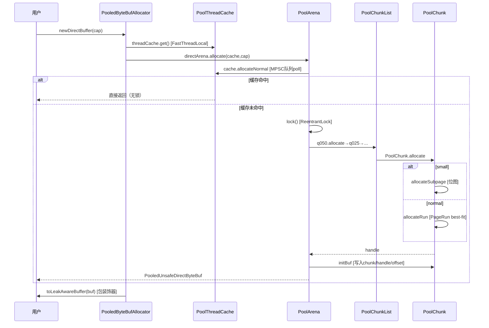

---

## 7. 零拷贝实现原理

Netty 的零拷贝有**四个层次**，从应用层到操作系统层逐级深入。

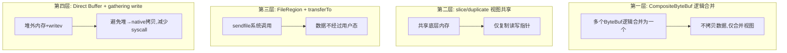

### 7.1 第一层：CompositeByteBuf 逻辑合并

`CompositeByteBuf`（`buffer/.../CompositeByteBuf.java`）把多个 ByteBuf 组合为一个逻辑视图，**不拷贝数据**。

**Component 结构**（line 1889-1961）：
```java
private static final class Component {
    final ByteBuf srcBuf;      // 原始添加的buffer
    final ByteBuf buf;         // srcBuf unwrap 后的buffer
    int srcAdjustment;         // 相对 srcBuf 的偏移
    int adjustment;            // 相对 buf 的偏移
    int offset;                // 在 CompositeByteBuf 中的起始偏移
    int endOffset;             // 结束偏移
    private ByteBuf slice;     // 缓存的slice

    int idx(int index) { return index + adjustment; }  // Composite索引→底层buf索引
}
```

**addComponent0**（line 280-310）：`newComponent(ensureAccessible(buffer), 0)` 创建 Component，`addComp` 加入数组，`updateComponentOffsets` 更新各组件 offset。

**读写定位**：访问 `getByte(index)` → `findComponent(index)` 找到所属 Component → `c.buf.getByte(c.idx(index))` 委托给底层 buf（line 952-956）。

**toComponentIndex0 二分查找**（line 920-945）：在组件数组中二分查找 index 落在哪个组件（fast-path 处理 0/1/2 个组件）：
```java
for (int low = 0, high = size; low <= high;) {
    int mid = low + high >>> 1;
    Component c = components[mid];
    if (offset >= c.endOffset) low = mid + 1;
    else if (offset < c.offset) high = mid - 1;
    else return mid;
}
```

**nioBuffers 暴露给 gathering write**（line 1695-1727）：遍历组件，把每个底层 buf 的 `nioBuffer` 加入数组，供 socket 一次 writev 写出——**跨组件零拷贝合并**。

> `CompositeByteBuf` 默认不递增被包装 buf 的引用计数（除非显式 retain），释放时由 head 释放并转发给所有组件。

### 7.2 第二层：slice / duplicate 视图共享

`SlicedByteBuf` / `DuplicatedByteBuf` 派生自 `AbstractDerivedByteBuf`，**共享底层内存，仅复制读写指针**：

- `slice(index, length)`：返回 `[index, index+length)` 的视图，readerIndex=0。
- `duplicate()`：共享全部内存，独立读写指针。
- `retainedSlice()` / `retainedDuplicate()`：同时 retain 底层 buf。
- 池化版本 `PooledSlicedByteBuf` / `PooledDuplicatedByteBuf` 用 `ObjectPool` 复用。

### 7.3 第三层：FileRegion + transferTo（OS sendfile）

`DefaultFileRegion`（`transport/.../channel/DefaultFileRegion.java`）封装文件传输，核心 `transferTo`（line 114-141）：
```java
public long transferTo(WritableByteChannel target, long position) throws IOException {
    ...
    open();
    long written = file.transferTo(this.position + position, count, target);  // line 130
    ...
}
```
`FileChannel.transferTo` 最终走 OS **sendfile** 系统调用——数据从内核页缓存直接到 socket，**不经过用户态**。

**ChannelOutboundBuffer 处理 FileRegion**：`AbstractNioByteChannel.doWrite` 中对 `FileRegion` 走 `transferTo` 路径而非普通 ByteBuf 的 gathering write。

### 7.4 第四层：Direct Buffer + gathering write（writev）

- **堆外直接内存**：避免 JVM 堆到 native 的拷贝（`PooledUnsafeDirectByteBuf` 用 `Unsafe` 直接操作堆外地址）。`ioBuffer()` 默认分配 direct buffer。
- **gathering write**：`ChannelOutboundBuffer.nioBuffers()`（见第 8 章）收集所有待写 ByteBuf 的 NIO `ByteBuffer[]`，一次 `SocketChannel.write(ByteBuffer[])` 聚集写入，**减少系统调用**。

`NioSocketChannel.doWrite`（`transport/.../socket/nio/NioSocketChannel.java:386-446`）：
```java
ByteBuffer[] nioBuffers = in.nioBuffers(1024, maxBytesPerGatheringWrite);
int nioBufferCnt = in.nioBufferCount();
switch (nioBufferCnt) {
    case 0: writeSpinCount -= doWrite0(in); break;        // FileRegion 等
    case 1: ch.write(buffer); ... break;                  // 单buffer
    default: ch.write(nioBuffers, 0, nioBufferCnt); ...   // gathering write (writev)
}
```

**`adjustMaxBytesPerGatheringWrite`**（line 372-383）：写满翻倍、写不满一半减半，**自适应 OS 缓冲行为**。

### 7.5 OS 层零拷贝技术对比

| 技术 | 系统调用 | 数据路径 | Netty 使用 |
|------|----------|----------|-----------|
| sendfile | sendfile | 内核页缓存→socket（不经用户态） | ✅ FileRegion |
| mmap | mmap | 文件映射到用户空间内存 | ❌ |
| splice | splice | 管道/socket 间内核拷贝 | ❌（epoll transport 部分支持） |
| gather write | writev | 多个 buffer 一次写出 | ✅ nioBuffers gathering |
| direct buffer | - | 堆外内存避免堆→native 拷贝 | ✅ PooledDirectByteBuf |

---

## 8. 消息发送 writeAndFlush 全链路

### 8.1 完整链路总览

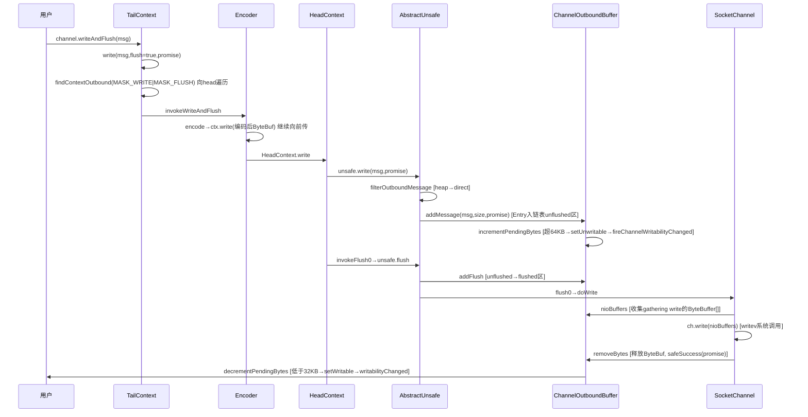

### 8.2 出站传播入口

`channel.writeAndFlush(msg)` → `pipeline.writeAndFlush`（`DefaultChannelPipeline.java:1023-1026`）→ `tail.writeAndFlush`。

`AbstractChannelHandlerContext.write`（line 963-996）：
```java
private void write(Object msg, boolean flush, ChannelPromise promise) {
    ...
    final AbstractChannelHandlerContext next = findContextOutbound(flush ?
            (MASK_WRITE | MASK_FLUSH) : MASK_WRITE);   // 向head找能处理write+flush的ctx
    final Object m = pipeline.touch(msg, next);
    EventExecutor executor = next.executor();
    if (executor.inEventLoop()) {
        next.invokeWriteAndFlush(m, promise);          // 同线程直接调
    } else {
        final WriteTask task = WriteTask.newInstance(next, m, promise, flush); // 跨线程封装为task
        if (!safeExecute(executor, task, promise, m, !flush)) {
            task.cancel();
        }
    }
}
```

> `WriteTask` 用 `ObjectPool` 复用；跨线程提交时提前 `incrementPendingOutboundBytes` 记账，避免高水位延迟感知。

### 8.3 HeadContext.write → ChannelOutboundBuffer

`HeadContext.write`（`DefaultChannelPipeline.java:1366`）→ `unsafe.write(msg, promise)`。

`AbstractUnsafe.write`（`AbstractChannel.java:847-883`）：
```java
public final void write(Object msg, ChannelPromise promise) {
    assertEventLoop();
    ...
    msg = filterOutboundMessage(msg);               // heap buf→direct buf
    size = pipeline.estimatorHandle().size(msg);    // 估算字节
    outboundBuffer.addMessage(msg, size, promise);  // 入出站缓冲
}
```

**ChannelOutboundBuffer.addMessage**（`ChannelOutboundBuffer.java:114-130`）：从对象池取 `Entry`，尾插链表，标记 `unflushedEntry`，`incrementPendingOutboundBytes`。

**Entry 链表结构**（line 76-85）：
```
flushedEntry → ... → unflushedEntry → ... → tailEntry
[已flush未写出]      [未flush区]
```
`Entry` 用 `ObjectPool` 复用（line 805-876），`pendingSize = 估算字节 + CHANNEL_OUTBOUND_BUFFER_ENTRY_OVERHEAD(96)`。

### 8.4 高低水位与背压

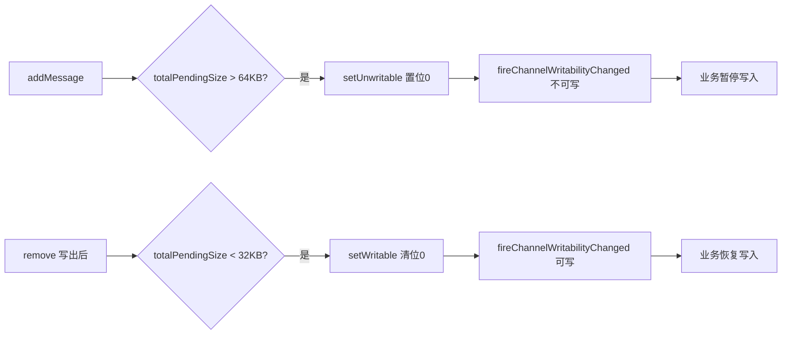

- `incrementPendingOutboundBytes`（line 166-179）：CAS 累加 `TOTAL_PENDING_SIZE`，超 `WriteBufferHighWaterMark`（默认 64KB）则 `setUnwritable`。
- `setUnwritable`（line 610-621）：CAS 设置 `unwritable` int 的第 0 位，**仅从可写→不可写才触发** `fireChannelWritabilityChanged`。
- `unwritable` int 用位图表示多种不可写原因：第 0 位是水位，1~31 位是用户自定义（`setUserDefinedWritability`）。
- `decrementPendingOutboundBytes`（line 185-198）：写出后扣减，低于 `WriteBufferLowWaterMark`（默认 32KB）则 `setWritable`。

业务可在 `channelWritabilityChanged` 中据此暂停/恢复写入实现**背压**，防止 OOM。

### 8.5 flush → doWrite 写循环

`flush` → `HeadContext.flush` → `unsafe.flush`（`AbstractChannel.java:886-896`）→ `addFlush`（把 unflushed 转 flushed）→ `flush0` → `doWrite`。

**addFlush**（`ChannelOutboundBuffer.java:136-160`）：`flushed++`，`promise.setUncancellable()`，清空 `unflushedEntry`。

**AbstractNioByteChannel.doWrite**（`AbstractNioByteChannel.java:254-268`）：
```java
protected void doWrite(ChannelOutboundBuffer in) throws Exception {
    int writeSpinCount = config().getWriteSpinCount();   // 自旋次数默认16
    do {
        Object msg = in.current();                        // 取 flushedEntry.msg
        if (msg == null) { clearOpWrite(); return; }
        writeSpinCount -= doWriteInternal(in, msg);
    } while (writeSpinCount > 0);
    incompleteWrite(writeSpinCount < 0);  // <0:SNDBUF满注册OP_WRITE; ≥0:quantum用完延迟再写
}
```

**`incompleteWrite`**（line 289-303）：`setOpWrite=true` 注册 `OP_WRITE` 等 selector 通知再 `forceFlush`；否则 `eventLoop().execute(flushTask)` 延迟再 flush。

**OP_WRITE 就绪**（`NioEventLoop.java:780-782`）：`unsafe.forceFlush()`。

**NioSocketChannel.doWrite** 用 gathering write（见第 7.4 节）。**ChannelOutboundBuffer.nioBuffers**（line 411-475）：`NIO_BUFFERS`（FastThreadLocal 的 1024 长度 ByteBuffer[]）复用，收集可写 ByteBuf 的 NIO buffer，缓存 `entry.buf`/`entry.bufs` 避免重复创建。

### 8.6 remove 写完后释放与通知

`ChannelOutboundBuffer.remove`（line 265-289）：
```java
removeEntry(e);                        // flushed--
if (!e.cancelled) {
    ReferenceCountUtil.safeRelease(msg);       // 释放ByteBuf
    safeSuccess(promise);                      // 标记promise成功
    decrementPendingOutboundBytes(size, false, true);  // 可能触发可写事件
}
e.unguardedRecycle();                  // 回收Entry到对象池
```

失败路径 `remove0` 调 `safeFail(promise, cause)`。

---

## 9. 异步编程模型（Future/Promise）

### 9.1 Future vs Promise

```mermaid
classDiagram
    class Future~V~ {
        <<interface 只读>>
        +isSuccess() / cause()
        +getNow()
        +sync() / await()
        +addListener()
    }
    class Promise~V~ {
        <<interface 可写>>
        +setSuccess(V) / trySuccess(V)
        +setFailure(Throwable) / tryFailure(Throwable)
        +setUncancellable()
    }
    class ChannelFuture {
        +channel()
        +isVoid()
    }
    class ChannelPromise {
        +setSuccess() [无参]
        +unvoid()
    }
    Future <|-- Promise
    Future <|-- ChannelFuture
    Promise <|-- ChannelPromise
    ChannelFuture <|-- ChannelPromise
```

- **Future**：只读结果视图（`Future.java`），继承 `java.util.concurrent.Future`，只暴露查询/等待/回调。
- **Promise**：可写视图（`Promise.java`），增加 `setSuccess/setFailure`。`set*` 已完成时抛异常，`try*` 返回 false。
- **ChannelFuture/ChannelPromise**：channel 专用，`ChannelFuture extends Future<Void>`，增加 `channel()`。

### 9.2 ⚠️ 重要订正：DefaultPromise 的等待机制

> **网上流传的说法**：`await` 用 `LockSupport.park(this)`，状态标记为 `UNCERTAIN`。
>
> **4.1.105 实际**：`await` 用 **`synchronized(this)` + `wait()`/`notifyAll()`**（`DefaultPromise.java:250-258、647-650`），状态标记名为 **`UNCANCELLABLE`**（line 45）。

### 9.3 DefaultPromise 核心字段与状态语义

`common/.../concurrent/DefaultPromise.java`（line 36-69）：

```java
private volatile Object result;      // line 50 核心结果字段
private final EventExecutor executor; // line 51 通知executor
private GenericFutureListener listener;          // line 58 单个监听器
private DefaultFutureListeners listeners;       // line 59 多个监听器（与listener互斥）
private short waiters;               // line 63 同步等待线程数
private boolean notifyingListeners;  // line 69 是否正在通知
```

`result` 取值语义：
- `null`：未完成
- `SUCCESS`：成功且值为 null
- `UNCANCELLABLE`：锁定不可取消但仍未完成
- `CauseHolder`：失败（含取消）
- 其他对象：成功且持有实际值

### 9.4 setSuccess / setFailure（CAS 一次性完成）

`setValue0`（line 632-641）：
```java
private boolean setValue0(Object objResult) {
    if (RESULT_UPDATER.compareAndSet(this, null, objResult) ||          // 从null CAS
        RESULT_UPDATER.compareAndSet(this, UNCANCELLABLE, objResult)) { // 或从UNCANCELLABLE CAS
        if (checkNotifyWaiters()) {   // 唤醒等待线程，返回是否有监听器
            notifyListeners();        // 通知监听器
        }
        return true;
    }
    return false;  // 已完成，CAS失败
}
```

**`UNCANCELLABLE` 的作用**：`setUncancellable()`（line 122-128）先把 null CAS 成 UNCANCELLABLE，之后 `cancel` 无法再从 null CAS（`cancel` 只 CAS `null→CANCELLATION_CAUSE_HOLDER`），从而**防止取消**，但仍允许后续完成。

### 9.5 await / sync

```java
// await (line 238-261)
public Promise<V> await() throws InterruptedException {
    if (isDone()) return this;          // 快速路径
    if (Thread.interrupted()) throw new InterruptedException(...);
    checkDeadLock();                    // 死锁检测
    synchronized (this) {
        while (!isDone()) {             // while + wait 防虚假唤醒
            incWaiters();
            try { wait(); } finally { decWaiters(); }
        }
    }
    return this;
}
```

- `sync`（line 403-408）= `await()` + `rethrowIfFailed()`（失败重抛）。
- `await` 只等待不抛失败异常；`sync` 等待后失败会重抛。

### 9.6 监听器通知——避免持锁回调与栈溢出

```mermaid
flowchart TD
    A[setSuccess CAS result] --> B[checkNotifyWaiters synchronized内]
    B --> C{有waiters?}
    C -->|是| D[notifyAll 唤醒await线程]
    B --> E{有listeners?}
    E -->|是| F[notifyListeners 锁外调用]
    F --> G{executor.inEventLoop?}
    G -->|是| H{递归深度 < 8?}
    H -->|是| I[notifyListenersNow 直接递归通知]
    H -->|否| J[safeExecute 提交到executor队列 拍平调用栈]
    G -->|否| J
    J --> K[notifyListenersNow 异步执行]
```

**三层防死锁/栈溢出机制**：
1. **锁内只做最小操作**：`checkNotifyWaiters`（line 647-652）在 `synchronized(this)` 内只 `notifyAll()` + 返回是否有监听器；`notifyListeners` 完全在锁外执行；`notifyListenersNow` 在锁内只取引用，回调在锁外进行——监听器回调即使触发新的 `addListener/setSuccess` 也不会死锁。
2. **executor 线程切换**：`notifyListeners`（line 486）若当前线程不是 executor 线程，则 `safeExecute` 提交任务，避免在非 EventLoop 线程同步执行回调。
3. **栈深保护**：`MAX_LISTENER_STACK_DEPTH`（默认 8，line 39-40）通过 `InternalThreadLocal.futureListenerStackDepth` 跟踪递归深度，超过则 `safeExecute` 提交任务，把递归转迭代，**防止 StackOverflowError**。

### 9.7 addListener 延迟执行

```java
// addListener (line 176-186)
public Promise<V> addListener(GenericFutureListener listener) {
    synchronized (this) { addListener0(listener); }
    if (isDone()) { notifyListeners(); }   // 已完成则立即异步回调
    return this;
}
```
- 单监听器优化：第一个存 `listener` 字段，第二个才升级为 `DefaultFutureListeners`（line 607）。
- **对已完成的 future 调 addListener 会立即触发回调**（line 184-186）。

### 9.8 checkDeadLock 死锁检测

`DefaultPromise.checkDeadLock`（line 460-465）：
```java
protected void checkDeadLock() {
    EventExecutor e = executor();
    if (e != null && e.inEventLoop()) {   // 当前线程就是executor线程
        throw new BlockingOperationException(toString());
    }
}
```
若在 EventLoop 线程内 `await` 自己触发的 I/O 操作，会阻塞 EventLoop 而该操作又必须由 EventLoop 执行——必然死锁，故直接抛 `BlockingOperationException`。

`DefaultChannelPromise.checkDeadLock`（line 157-161）只有 channel 已注册才检测（未注册时阻塞是合理的）。

### 9.9 DefaultChannelPromise 的 executor 来源

```java
// DefaultChannelPromise.executor (line 57-64)
protected EventExecutor executor() {
    EventExecutor e = super.executor();   // 取DefaultPromise.executor字段
    if (e == null) {
        return channel().eventLoop();     // 回退到channel的EventLoop
    }
    return e;
}
```
> **订正**：ChannelPromise 的通知 executor 就是 channel 的 EventLoop（非 ImmediateEventExecutor）。监听器回调默认在 EventLoop 线程执行。

### 9.10 内置 ChannelFutureListener

`ChannelFutureListener`（`ChannelFutureListener.java`）提供常用单例：
- `CLOSE`：完成即 `channel.close()`（无论成败）
- `CLOSE_ON_FAILURE`：仅失败时关闭
- `FIRE_EXCEPTION_ON_FAILURE`：失败时 `pipeline.fireExceptionCaught(cause)`

### 9.11 异步编程模式对比

| 方式 | API | 行为 | 适用场景 |
|------|-----|------|----------|
| 回调 | `addListener` | 非阻塞，完成时在 executor 线程通知 | **推荐**，EventLoop 内必用 |
| 阻塞等待 | `await` | 阻塞调用线程，不抛失败异常 | 非 EventLoop 线程 |
| 阻塞+重抛 | `sync` | 阻塞等待，失败重抛 cause | 非 EventLoop 线程 |

> **最佳实践**：优先 `addListener`，避免在 ChannelHandler 里调 `await`（会死锁，`checkDeadLock` 会抛异常防御）。

### 9.12 组合工具与轻量 future

- **PromiseCombiner**：多个 Future 合并，全部成功才成功，任一失败则失败（`PromiseCombiner.java`，非线程安全，须在 executor 线程调用）。
- **SucceededFuture / FailedFuture**：已完成不可变的轻量 future，避免分配（channel 已关闭时的 write 返回它）。
- **ProgressiveFuture**：进度回调（`tryProgress` + `GenericProgressiveFutureListener.operationProgressed`）。

---

## 10. 时间轮 HashedWheelTimer 实现原理

基于 George Varghese 和 Tony Lauck 的论文《Hashed and Hierarchical Timing Wheels》。`common/.../util/HashedWheelTimer.java`。

### 10.1 为什么用时间轮

| 维度 | ScheduledThreadPoolExecutor（堆） | HashedWheelTimer（轮） |
|------|------------------------------------|-------------------------|
| 添加任务 | O(logN) 入堆调整 | O(1) 入队 |
| 到期处理 | O(logN) 出堆 | 遍历当前 bucket 链表 |
| 大量定时任务 | 堆大、性能下降 | 适合大量近似超时任务 |
| 精度 | 高 | 近似（tick 粒度，默认 100ms） |

> Netty 的 IO 超时（如连接超时、IdleStateHandler）不需要高精度，时间轮更高效。**注意**：HashedWheelTimer 每实例创建一个线程，**应全局共享，不要每连接一个**（line 68-73 警告，超过 64 实例会报错）。

### 10.2 核心数据结构

```mermaid
graph TB
    HWT[HashedWheelTimer] --> WH["wheel: HashedWheelBucket[] 环形数组<br/>大小=2的幂, 默认512"]
    HWT --> TQ["timeouts: MPSC队列<br/>外部任务入队缓冲"]
    HWT --> CQ["cancelledTimeouts: MPSC队列<br/>取消任务缓冲"]
    HWT --> WK["Worker 工作线程"]
    HWT --> ST["startTime (volatile)<br/>+ startTimeInitialized (CountDownLatch)"]
    WH --> B1[HashedWheelBucket 0]
    WH --> B2[HashedWheelBucket 1]
    B1 --> N1["HashedWheelTimeout 双向链表<br/>head↔...↔tail"]
    N1 --> N2["next/prev/bucket<br/>remainingRounds 剩余圈数"]
```

字段（line 110-120）：
- `tickDuration`（默认 100ms）
- `HashedWheelBucket[] wheel`（默认 512，`createWheel` 归一化为 2 的幂，line 335-353）
- `mask = wheel.length - 1`（line 112）
- `Queue<HashedWheelTimeout> timeouts`（MPSC，line 114）
- `Queue<HashedWheelTimeout> cancelledTimeouts`（MPSC，line 115）
- `volatile long startTime`（line 120）
- `CountDownLatch startTimeInitialized`（line 113）

### 10.3 HashedWheelTimeout 状态

```java
private static final int ST_INIT = 0;
private static final int ST_CANCELLED = 1;
private static final int ST_EXPIRED = 2;
```
字段：`deadline`（绝对纳秒）、`remainingRounds`（剩余圈数）、`next/prev/bucket`（链表节点）、`state`（CAS）。

### 10.4 newTimeout 入队

`newTimeout`（line 434-460）：
```java
public Timeout newTimeout(TimerTask task, long delay, TimeUnit unit) {
    ...
    start();   // 懒启动Worker线程
    long deadline = System.nanoTime() + unit.toNanos(delay) - startTime;  // 相对startTime
    if (delay > 0 && deadline < 0) deadline = Long.MAX_VALUE;  // 防溢出
    HashedWheelTimeout timeout = new HashedWheelTimeout(this, task, deadline);
    timeouts.add(timeout);   // 入MPSC队列，由Worker统一处理
    return timeout;
}
```
任务先入 `timeouts` 队列（MPSC，多生产者安全），由 Worker 线程统一转移到 wheel，**避免对 wheel 直接加锁**。

### 10.5 ⭐ Worker.run 主循环（核心）

`Worker.run`（line 483-522）：
```java
public void run() {
    startTime = System.nanoTime();          // line 486: 初始化startTime
    if (startTime == 0) startTime = 1;
    startTimeInitialized.countDown();      // line 493: 通知start()等待的线程

    do {
        final long deadline = waitForNextTick();   // line 496: 等待下一tick
        if (deadline > 0) {
            int idx = (int) (tick & mask);          // line 498: 当前bucket下标
            processCancelledTasks();                // line 499: 处理取消队列
            HashedWheelBucket bucket = wheel[idx];
            transferTimeoutsToBuckets();            // line 502: 转移入队任务到bucket
            bucket.expireTimeouts(deadline);        // line 503: 处理到期任务
            tick++;                                 // line 504
        }
    } while (WORKER_STATE_UPDATER.get(...) == WORKER_STATE_STARTED);
    // 收尾: 把未处理任务收集到unprocessedTimeouts
}
```

```mermaid
flowchart TD
    A[初始化startTime countDown] --> B[waitForNextTick 计算并sleep到下个tick]
    B --> C{deadline>0?}
    C -->|否| Z[检查shutdown状态继续循环]
    C -->|是| D[计算当前bucket idx = tick & mask]
    D --> E[processCancelledTasks 清理取消队列]
    E --> F[transferTimeoutsToBuckets 转移入队任务]
    F --> G[expireTimeouts 处理当前bucket到期任务]
    G --> H["tick++"]
    H --> Z
    Z -->|未shutdown| B
    Z -->|已shutdown| I[收集unprocessedTimeouts 退出]
```

### 10.6 transferTimeoutsToBuckets——任务转移

`transferTimeoutsToBuckets`（line 524-547）：每 tick 最多转移 100000 个任务（防止线程饥饿）：
```java
long calculated = timeout.deadline / tickDuration;
timeout.remainingRounds = (calculated - tick) / wheel.length;  // 剩余圈数
final long ticks = Math.max(calculated, tick);  // 不调度到过去
int stopIndex = (int) (ticks & mask);          // 落在哪个bucket
wheel[stopIndex].addTimeout(timeout);
```

**核心公式**：
- `calculated = deadline / tickDuration`：任务应该在"第几个 tick"执行
- `bucket index = calculated & mask`：通过位与快速定位
- `remainingRounds = (calculated - tick) / wheel.length`：还要转几圈

> **设计精髓**：延时大于一个轮周期（wheel.length × tickDuration）的任务，`remainingRounds > 0`，每转一圈 `remainingRounds--`，到 0 才真正执行。这就是时间轮处理"长延时"的方式——用圈数而非更大的轮。

### 10.7 expireTimeouts——到期执行

`HashedWheelBucket.expireTimeouts`（line 781-803）：
```java
while (timeout != null) {
    HashedWheelTimeout next = timeout.next;
    if (timeout.remainingRounds <= 0) {           // 圈数到0
        next = remove(timeout);
        if (timeout.deadline <= deadline) {
            timeout.expire();                     // CAS状态→EXPIRED, 执行task
        } else {
            throw new IllegalStateException(...); // 放错槽，不应发生
        }
    } else if (timeout.isCancelled()) {
        next = remove(timeout);
    } else {
        timeout.remainingRounds--;                 // 还没到, 圈数-1
    }
    timeout = next;
}
```

`HashedWheelTimeout.expire`（line 697-710）：CAS `ST_INIT→ST_EXPIRED`，成功则 `timer.taskExecutor.execute(this)` 执行任务（用 taskExecutor，不在 Worker 线程直接跑，避免阻塞 tick）。

### 10.8 任务取消

`cancel`（line 658-668）：CAS `ST_INIT→ST_CANCELLED`，成功后入 `cancelledTimeouts` 队列，等下个 tick 由 `processCancelledTasks` 清理（`remove` 从链表摘除）。GC 延迟最多 1 个 tick。

### 10.9 waitForNextTick

`waitForNextTick`（line 572-607）：计算 `deadline = tickDuration * (tick + 1)`，与 `currentTime` 比较算 `sleepTimeMs`，`Thread.sleep`。Windows 上有精度 bug 需特殊处理（line 592-597）。被中断且 shutdown 则返回 `Long.MIN_VALUE` 退出。

### 10.10 线程安全

- `startTime` 用 `volatile` + `CountDownLatch` 保证可见性。
- `timeouts`/`cancelledTimeouts` 用 **MPSC 队列**（`PlatformDependent.newMpscQueue`，line 114-115），多生产者安全，Worker 单消费者。
- wheel 和 bucket 链表只有 Worker 线程操作，**无需同步**。

---

## 11. 编解码器体系

### 11.1 整体类层次

```mermaid
classDiagram
    class ChannelInboundHandlerAdapter
    class ChannelOutboundHandlerAdapter
    class ChannelDuplexHandler
    class ByteToMessageDecoder {
        +cumulation 累积缓冲
        +channelRead(ctx,msg)
        #decode(ctx,in,out)
    }
    class MessageToMessageDecoder~I~
    class ReplayingDecoder~S~ {
        +replayable ReplayingDecoderByteBuf
        +checkpoint(S state)
    }
    class MessageToByteEncoder~I~ {
        +write(ctx,msg,promise)
        #encode(ctx,msg,out)
    }
    class MessageToMessageEncoder~I~
    class ByteToMessageCodec~I~
    class LengthFieldBasedFrameDecoder
    class LengthFieldPrepender

    ChannelInboundHandlerAdapter <|-- ByteToMessageDecoder
    ByteToMessageDecoder <|-- ReplayingDecoder
    ByteToMessageDecoder <|-- LengthFieldBasedFrameDecoder
    ChannelInboundHandlerAdapter <|-- MessageToMessageDecoder
    ChannelOutboundHandlerAdapter <|-- MessageToByteEncoder
    ChannelOutboundHandlerAdapter <|-- MessageToMessageEncoder
    MessageToMessageEncoder <|-- LengthFieldPrepender
    ChannelDuplexHandler <|-- ByteToMessageCodec
```

- **入站解码**：`ChannelInboundHandlerAdapter` 派生 `ByteToMessageDecoder`（ByteBuf→POJO）、`MessageToMessageDecoder`（POJO→POJO）。
- **出站编码**：`ChannelOutboundHandlerAdapter` 派生 `MessageToByteEncoder`（POJO→ByteBuf）、`MessageToMessageEncoder`。
- **组合**：`ByteToMessageCodec` / `MessageToMessageCodec` 内部持有 encoder + decoder。

### 11.2 ByteToMessageDecoder.channelRead（核心）

`codec/.../ByteToMessageDecoder.java:282-326`：

```mermaid
flowchart TD
    A[channelRead ctx,msg] --> B{msg instanceof ByteBuf?}
    B -->|否| C[ctx.fireChannelRead 透传]
    B -->|是| D[CodecOutputList.newInstance 对象池取]
    D --> E["cumulator.cumulate 累积<br/>MERGE模式 - writeBytes合并<br/>COMPOSITE模式 - addFlattenedComponents"]
    E --> F[callDecode 循环解码]
    F --> G{in.isReadable?}
    G -->|是| H[记录oldInputLength]
    H --> I[decodeRemovalReentryProtection 调子类decode]
    I --> J{out空?}
    J -->|空 且 输入未变| K[break 半包等更多数据]
    J -->|空 但输入变了| F
    J -->|非空 且 输入未变| L[抛异常: decode没读却产出]
    J -->|非空| M[fireChannelRead 批量传播 out.clear]
    M --> G
    K --> N[finally: cumulation不可读→release<br/>否则每16次discardSomeReadBytes]
    N --> O[fireChannelRead 传播剩余]
    O --> P[out.recycle 回收]
```

**关键点**：
- `cumulation` 跨多次 channelRead 累积半包字节。`MERGE_CUMULATOR`（line 81-114）用 `writeBytes` 拷贝合并；`COMPOSITE_CUMULATOR`（line 121-159）用 `CompositeByteBuf` 尽量零拷贝。
- `CodecOutputList` 用 `FastThreadLocal` 池化（每线程 16 个），`getUnsafe` 跳过范围检查。
- `decodeRemovalReentryProtection`（line 525-539）用 `decodeState` 位掩码防止 decode 期间 handler 被移除导致状态不一致。
- 半包：decode 未消费的字节保留在 cumulation，下次 channelRead 继续解码。
- 每 `discardAfterReads`（默认 16）次 `discardSomeReadBytes` 回收已读字节防 OOM（issue #4275）。

### 11.3 MessageToByteEncoder.write

`codec/.../MessageToByteEncoder.java:99-131`：
```java
public void write(ChannelHandlerContext ctx, Object msg, ChannelPromise promise) {
    if (acceptOutboundMessage(msg)) {        // TypeParameterMatcher 类型匹配
        I cast = (I) msg;
        buf = allocateBuffer(ctx, cast, preferDirect);  // preferDirect默认true
        encode(ctx, cast, buf);              // 子类实现
        ReferenceCountUtil.release(cast);    // 释放原消息
        if (buf.isReadable()) ctx.write(buf, promise);
        else { buf.release(); ctx.write(Unpooled.EMPTY_BUFFER, promise); }
    } else {
        ctx.write(msg, promise);            // 非匹配类型透传
    }
}
```
`allocateBuffer`（line 137-144）：`preferDirect` 默认 true，用 `ctx.alloc().ioBuffer()`（直接内存）。

### 11.4 ReplayingDecoder——可重放解码器

`codec/.../ReplayingDecoder.java`：用 `ReplayingDecoderByteBuf`（一个数据不足时抛 `Signal` 的特殊 ByteBuf）让开发者像"数据已就绪"一样顺序写解码逻辑。

- `ReplayingDecoderByteBuf.capacity()` 返回 `Integer.MAX_VALUE`（看似无限大）
- 读操作先 `checkReadableBytes`，不足则抛 `REPLAY` Signal
- `ReplayingDecoder.callDecode`（line 341-423）重写：捕获 `REPLAY`，**回滚 readerIndex 到 checkpoint**，break 等下次数据
- `State` 枚举 + `checkpoint(S state)` 切换状态机：即使读到一半抛 REPLAY，下次从上个 checkpoint 的状态重新开始

```mermaid
sequenceDiagram
    participant D as decode
    participant R as ReplayingDecoderByteBuf
    participant CD as callDecode
    D->>R: readInt() [数据不足]
    R->>CD: throw REPLAY Signal
    CD->>CD: catch REPLAY
    CD->>CD: in.readerIndex(checkpoint) 回滚
    CD->>CD: break 等下次数据
    Note over CD: 下次 channelRead 从checkpoint重新decode
```

**对比 ByteToMessageDecoder**：代码简洁（无需手动检查 readableBytes）但可能反复重新解码同一批字节；写操作全部禁止。

### 11.5 LengthFieldBasedFrameDecoder（基于长度字段拆包）

`codec/.../LengthFieldBasedFrameDecoder.java`，五个参数：

| 参数 | 含义 |
|------|------|
| `maxFrameLength` | 帧最大长度 |
| `lengthFieldOffset` | 长度字段偏移（前面可有 header） |
| `lengthFieldLength` | 长度字段字节数（1/2/3/4/8） |
| `lengthAdjustment` | 补偿值（正/负） |
| `initialBytesToStrip` | 解码后剥离的字节数 |

**核心计算**（decode line 416）：
```
frameLength = 长度字段原始值 + lengthAdjustment + lengthFieldEndOffset
lengthFieldEndOffset = lengthFieldOffset + lengthFieldLength
```
即整帧总长 = 长度字段前数据 + 长度字段本身 + 长度字段表示内容 + 补偿。

**stateful 设计**：`frameLengthInt` 缓存帧长，整帧数据未到齐时下次直接用缓存检查（line 429）。

**extractFrame**（line 501-503）：`buffer.retainedSlice(index, length)`——零拷贝切出帧。

### 11.6 其他拆包器

- `LengthFieldPrepender`（`MessageToMessageEncoder<ByteBuf>`）：编码时在消息前加长度字段，与 LengthFieldBasedFrameDecoder 对称。
- `LineBasedFrameDecoder`：按 `\n`/`\r\n` 拆包，`offset` 优化避免重复扫描。
- `DelimiterBasedFrameDecoder`：多分隔符取最短帧。
- `FixedLengthFrameDecoder`：`readRetainedSlice(frameLength)` 定长拆包。

### 11.7 解码器在 pipeline 中的位置

```
[Head] → [FrameDecoder(LengthFieldBasedFrameDecoder)] → [ByteToMessageDecoder(如ProtobufDecoder)] → [业务Handler]
```
字节流 → 拆包成帧 ByteBuf → 解码成 POJO → 业务处理，一对多传播。

---

## 12. 心跳检测机制

`handler/.../timeout/IdleStateHandler.java` 继承 `ChannelDuplexHandler`，三种超时：

| 超时 | 触发事件 | 含义 |
|------|----------|------|
| `readerIdleTime` | `READER_IDLE` | 读空闲（长时间没读到数据） |
| `writerIdleTime` | `WRITER_IDLE` | 写空闲（长时间没写出数据） |
| `allIdleTime` | `ALL_IDLE` | 读写都空闲 |

### 12.1 核心字段（line 100-131）

```java
private Future<?> readerIdleTimeout;     // 三个调度任务句柄
private long lastReadTime;                 // 上次读完成时间
private boolean firstReaderIdleEvent = true;
private Future<?> writerIdleTimeout;
private long lastWriteTime;
private boolean reading;                   // channelRead已触发但channelReadComplete未触发
```

### 12.2 读写事件钩子更新时间戳

- `channelRead`（line 281-287）：`reading = true`，重置首次事件。
- `channelReadComplete`（line 290-296）：`lastReadTime = ticksInNanos()`，`reading = false`。
- `write`（line 299-306）：给 promise 加 `writeListener`，写完成时 `lastWriteTime = ticksInNanos()`。

### 12.3 initialize——启动三个定时任务

`initialize`（line 308-335）在 `handlerAdded`/`channelActive` 时调用：
```java
if (readerIdleTimeNanos > 0) {
    readerIdleTimeout = schedule(ctx, new ReaderIdleTimeoutTask(ctx), readerIdleTimeNanos, NANOSECONDS);
}
// writer / all 同理
```
`schedule`（line 347-349）委托 `ctx.executor().schedule(...)`——即 EventLoop 的 `schedule`，底层 `ScheduledFutureTask` + `DefaultPriorityQueue`（非 `scheduleAtFixedRate`）。

> **关键设计**：用单次延迟任务而非固定周期。任务 `run` 内根据剩余延迟决定"触发事件并重新调度完整周期"或"重新调度剩余延迟"，精确处理"超时期间又发生读/写"，避免误报。

### 12.4 ReaderIdleTimeoutTask.run

`ReaderIdleTimeoutTask.run`（line 481-512）：
```java
long nextDelay = readerIdleTimeNanos;
if (!reading) {
    nextDelay -= ticksInNanos() - lastReadTime;  // 剩余延迟 = 配置 - (现在 - 上次读)
}
if (nextDelay <= 0) {                            // 超时
    readerIdleTimeout = schedule(ctx, this, readerIdleTimeNanos, NANOSECONDS); // 重排完整周期
    boolean first = firstReaderIdleEvent;
    firstReaderIdleEvent = false;
    IdleStateEvent event = newIdleStateEvent(IdleState.READER_IDLE, first);
    channelIdle(ctx, event);                     // 默认 fireUserEventTriggered
} else {
    readerIdleTimeout = schedule(ctx, this, nextDelay, NANOSECONDS); // 未超时重排剩余
}
```

> **澄清**：ReaderIdle/WriterIdle/AllIdle **只触发 `IdleStateEvent`**（`fireUserEventTriggered`），由业务在 `userEventTriggered` 中决定动作（常见 `ctx.close()` 或发心跳）。WriterIdle **本身不发心跳包**——发送心跳是业务行为。

### 12.5 ReadTimeoutHandler / WriteTimeoutHandler

- **ReadTimeoutHandler**（`ReadTimeoutHandler.java:62-103`）继承 IdleStateHandler，覆写 `channelIdle` 直接 `fireExceptionCaught(ReadTimeoutException) + ctx.close()`。
- **WriteTimeoutHandler**（`WriteTimeoutHandler.java`）**独立实现**（不继承 IdleStateHandler），每次 `write` 挂一个超时任务（双向链表管理），超时且 promise 未完成则 `fireExceptionCaught(WriteTimeoutException) + ctx.close()`，正常完成则取消定时任务。

### 12.6 FlushConsolidationHandler

`handler/.../flush/FlushConsolidationHandler.java`（line 59-220）：聚合多次 `flush()` 为一次真正 flush，减少系统调用。读循环中累计到 `explicitFlushAfterFlushes`（默认 256）才真正 flush，否则等 `channelReadComplete`；无读循环时用 `scheduleFlush` 延迟到 EventLoop 下一轮。

### 12.7 心跳典型用法

```java
// 服务端：60s 无读则关闭连接
pipeline.addLast(new IdleStateHandler(60, 0, 0, TimeUnit.SECONDS));
pipeline.addLast(new ChannelInboundHandlerAdapter() {
    public void userEventTriggered(ChannelHandlerContext ctx, Object evt) {
        if (evt instanceof IdleStateEvent && ((IdleStateEvent)evt).state() == IdleState.READER_IDLE) {
            ctx.close();
        }
        ctx.fireUserEventTriggered(evt);
    }
});

// 客户端：30s 无写则发心跳
pipeline.addLast(new IdleStateHandler(0, 30, 0, TimeUnit.SECONDS));
pipeline.addLast(new ChannelInboundHandlerAdapter() {
    public void userEventTriggered(ChannelHandlerContext ctx, Object evt) {
        if (evt instanceof IdleStateEvent && ((IdleStateEvent)evt).state() == IdleState.WRITER_IDLE) {
            ctx.writeAndFlush(HEARTBEAT);  // 业务发心跳
        }
        ctx.fireUserEventTriggered(evt);
    }
});
```

---

## 13. FastThreadLocal 设计

`common/.../concurrent/FastThreadLocal.java`：比 JDK `ThreadLocal` 更快的线程局部存储。

### 13.1 与 JDK ThreadLocal 对比

| 维度 | JDK ThreadLocal | Netty FastThreadLocal |
|------|------------------|----------------------|
| 存储 | ThreadLocalMap（哈希表） | Object[] 数组下标 |
| 访问复杂度 | O(1) 均摊，但哈希+线性探测 | **严格 O(1)**，数组下标直接访问 |
| 冲突 | 哈希冲突退化为 O(n) | 无冲突 |
| 索引 | `threadLocalHashCode`（魔数递增） | 全局唯一递增整数 index |

### 13.2 核心实现

**InternalThreadLocalMap**（`common/.../internal/InternalThreadLocalMap.java`）：
- 快路径：`FastThreadLocalThread` 持有 `InternalThreadLocalMap threadLocalMap`（`FastThreadLocalThread.java:33`），直接挂在 Thread 上。
- 慢路径：非 FastThreadLocalThread 走 `ThreadLocal<InternalThreadLocalMap>`（退化）。
- `Object[] indexedVariables`（line 64，初始 32，全填 `UNSET`）。
- `nextVariableIndex()`（line 151-158）：静态 `AtomicInteger` 全局递增，每个 FastThreadLocal 分配唯一 index，**所有线程共享该 index 语义**。

**get**（`FastThreadLocal.java:135-143`）：
```java
public final V get() {
    InternalThreadLocalMap threadLocalMap = InternalThreadLocalMap.get();
    Object v = threadLocalMap.indexedVariable(index);   // 数组下标取值
    if (v != InternalThreadLocalMap.UNSET) return (V) v;
    return initialize(threadLocalMap);                  // 未设置则初始化
}
```
**set**（line 193-200）：直接 `setIndexedVariable(index, value)` 数组赋值。

### 13.3 FastThreadLocalThread

`FastThreadLocalThread extends Thread`，`cleanupFastThreadLocals = true`。`DefaultThreadFactory.newThread`（line 104-122）创建的就是 `FastThreadLocalThread`，并用 `FastThreadLocalRunnable.wrap` 包裹 Runnable，线程退出时 `FastThreadLocal.removeAll()` 清理，防内存泄漏。

### 13.4 ⚠️ 订正：Recycler 对象池

> **网上流传的说法**（旧版 4.1.30 前）：Recycler 用 `Stack<T>` + `WeakOrderQueue`（Link 链表）+ `DefaultHandle[] elements`。
>
> **4.1.105 实际**：Recycler 已重构为 **`LocalPool<T>` + MPSC 队列 + `ArrayDeque` 批量缓存**。

`common/.../util/Recycler.java`：

```mermaid
graph TB
    R[Recycler T] -->|FastThreadLocal| LP["LocalPool T 每线程一个"]
    LP --> BA["batch: ArrayDeque DefaultHandle<br/>本线程批量缓存"]
    LP --> PH["pooledHandles: MPSC队列<br/>跨线程回收入口"]
    LP --> OW[owner: 归属线程]

    R --> GET["get()"]
    GET --> CL["claim() 从MPSC drain到batch→poll"]
    CL -->|池空| NH["newHandle 每8次ratio才new"]
    NH --> NO["newObject(handle)"]

    DH["DefaultHandle.recycle(obj)"] --> RL["LocalPool.release"]
    RL -->|同线程 且 batch未满| AC["accept 直接入batch 无锁"]
    RL -->|跨线程| OF["pooledHandles.relaxedOffer MPSC无锁"]
    RL -->|owner线程已死| CLR["置空防泄漏"]
```

**核心字段**（line 60-83）：
- `maxCapacityPerThread` 默认 4096
- `RATIO = 8`：未回收过的新 handle 每 8 次才真正入池（缓慢扩容）
- `chunkSize` 默认 32：批量搬运大小

**LocalPool**（line 297-373）：
- `ArrayDeque<DefaultHandle> batch`（本线程缓存，替代旧 `Stack.elements`）
- `MessagePassingQueue pooledHandles`（MPSC，跨线程回收，替代旧 `WeakOrderQueue`）
- `claim()`（line 320-333）：`batch` 空则 `handles.drain(this, chunkSize)` 从 MPSC 批量搬到 batch，再 `pollFirst`。
- `release()`（line 335-353）：同线程且 batch 未满则 `accept`（直接入 batch）；跨线程则 `pooledHandles.relaxedOffer`（MPSC 无锁）；owner 线程已死则置空防泄漏。

> **设计哲学不变**：跨线程回收不直接操作目标线程的本地结构，而是投入单消费者可消费的队列，避免锁竞争。新实现用标准 MPSC（jctools）替代手写 WeakOrderQueue，更简洁。

---

## 14. 补充底层原理点

### 14.1 AdaptiveRecvByteBufAllocator——自适应接收缓冲区

`transport/.../channel/AdaptiveRecvByteBufAllocator.java`：根据上次读取反馈自动调整下次 buffer 大小。

**SIZE_TABLE**（line 45-62）：16~496 步长 16，之后按 2 的幂（512/1024/.../65536）。

**升降级算法**（`record`，line 126-140）：
```java
if (actualReadBytes <= SIZE_TABLE[max(0, index - INDEX_DECREMENT)]) {  // 没读满
    if (decreaseNow) {
        index = max(index - INDEX_DECREMENT, minIndex);  // 降级步长1
        decreaseNow = false;
    } else {
        decreaseNow = true;   // 连续两次才降
    }
} else if (actualReadBytes >= nextReceiveBufferSize) {  // 读满了
    index = min(index + INDEX_INCREMENT, maxIndex);     // 升级步长4
    decreaseNow = false;
}
```
- 升级步长 `INDEX_INCREMENT=4`（快速扩容），降级步长 `INDEX_DECREMENT=1`（缓慢缩容），连续两次读不满才降。
- 默认 min=64、initial=2048、max=65536。

**MaxMessageHandle**（`DefaultMaxMessagesRecvByteBufAllocator.java`）：`continueReading` 控制 read 循环（`autoRead && totalMessages < maxMessagePerRead`），`allocate` 用 `alloc.ioBuffer(guess())`。

### 14.2 DefaultAttributeMap——并发属性存储

`common/.../util/DefaultAttributeMap.java`：**写时复制 + 二分查找 + CAS**。

- `volatile DefaultAttribute[] attributes`（line 84，按 key.id 排序）
- `attr(key)`（line 88-120）：`searchAttributeByKey` 二分查找；未找到则 `orderedCopyOnInsert` 复制数组插入 + `ATTRIBUTES_UPDATER.compareAndSet`。
- `DefaultAttribute extends AtomicReference<T>`：值用 CAS 设置，`getAndRemove` 原子取值并移除。
- 查找/删除 O(logn)，写 O(n) 拷贝但无锁读取。

> 对比 `AttributeKey`（`ConstantPool` 分配全局唯一 id），属性存储按 id 排序实现二分查找，**读无锁、写 copy-on-write**。

### 14.3 MPSC 队列（JCTools）

Netty 通过 `PlatformDependent.newMpscQueue()` 使用 **JCTools 的 `MpscChunkedArrayQueue`**（shaded 为 `org.jctools-core`）。多生产者单消费者无锁队列，用于：
- `NioEventLoop` 的 taskQueue（外部线程提交任务）
- `HashedWheelTimer` 的 timeouts/cancelledTimeouts
- `Recycler` 的跨线程回收
- `PoolThreadCache` 的 MemoryRegionCache 队列

**为何适合 EventLoop**：多线程（业务线程）入队，单线程（EventLoop）出队，无锁高效。`NioEventLoop` 注释明确"This event loop never calls takeTask()"——靠 select 阻塞而非 take，无界 MPSC 最合适。

### 14.4 PlatformDependent / Unsafe 封装

`common/.../internal/PlatformDependent0.java` + `PlatformDependent.java`：平台相关操作抽象层。

- **Unsafe 获取**：反射 `sun.misc.Unsafe.theUnsafe`（line 221-267）
- **NoCleaner 直接内存**（性能关键）：`USE_DIRECT_BUFFER_NO_CLEANER`（PlatformDependent.java:114），用 `UNSAFE.allocateMemory` 分配 + 反射构造**不带 Cleaner** 的 DirectByteBuffer，手动 `freeMemory` 释放。`-Dio.netty.maxDirectMemory` 控制，`DIRECT_MEMORY_COUNTER`（AtomicLong）统计。
- **Cleaner**（line 187-197）：Java9+ 用 `Unsafe.invokeCleaner`（`CleanerJava9`），Java6-8 反射 `Cleaner.clean()`（`CleanerJava6`）。
- **copyMemory**：`UNSAFE.copyMemory`，超阈值走 `copyMemoryWithSafePointPolling` 分块允许 safepoint。
- `unalignedAccess`：检测是否支持非对齐访问（性能优化）。

> **NoCleaner 的意义**：带 Cleaner 的 DirectByteBuffer 依赖 GC 触发释放，时机不可控且可能 OOM。NoCleaner 让 Netty 自管直接内存，引用计数归零即释放，精确控制。

### 14.5 内存泄漏检测 ResourceLeakDetector

`common/.../util/ResourceLeakDetector.java`：四级（line 61-97）：
- `DISABLED`：关闭
- `SIMPLE`（默认）：采样 1/128，只报告是否泄漏
- `ADVANCED`：采样，记录访问栈
- `PARANOID`：每次分配都追踪（测试用）

`DefaultResourceLeak extends WeakReference`（line 388）：ByteBuf 作弱引用 + `ReferenceQueue`。`track0`（line 267-277）按采样率创建 tracker。`record0`（line 465-492）用**指数退避**保留最近访问栈。`reportLeak`（line 299-330）：轮询 refQueue，ByteBuf 被 GC 但未 release（仍在 allLeaks）则报告泄漏。

`-Dio.netty.leakDetection.level` / `samplingInterval` / `targetRecords` 可调。

### 14.6 ChannelOption 体系

`ChannelOption<T>` 继承 `AbstractConstant`（`ConstantPool` 分配全局唯一 id），是强类型配置项。常用：`SO_BACKLOG`、`SO_KEEPALIVE`、`TCP_NODELAY`、`CONNECT_TIMEOUT_MILLIS`、`WRITE_BUFFER_HIGH_WATER_MARK`/`LOW_WATER_MARK`（实际为 `WriteBufferWaterMark`）、`ALLOCATOR`、`AUTO_READ`、`MAX_MESSAGES_PER_READ`。在 `AbstractBootstrap.option()` 配置，`init` 时 `setChannelOptions` 应用到 ChannelConfig。

### 14.7 ObjectPool（轻量对象池）

`common/.../internal/ObjectPool.java`：Recycler 的精简替代接口，`newPool(ObjectPool.ObjectCreator)` 创建。`DefaultHandle.recycle()` 归还。用于 `ChannelOutboundBuffer.Entry`、`WriteTask`、`PooledByteBuf` 等高频对象复用，减少 GC。

### 14.8 ThreadDeathWatcher / ObjectCleaner

- `ThreadDeathWatcher`：监听线程死亡后执行清理任务（如释放 NoCleaner 内存兜底）。
- `ObjectCleaner`：对象清理注册，用于 `ThreadLocal` 资源在当前线程结束时自动清理（替代 `finalize`）。

---

## 15. 性能优化点汇总

| # | 优化点 | 实现位置 | 原理 |
|---|--------|----------|------|
| 1 | 无锁串行化 | Channel↔EventLoop 1:1 绑定 | 单线程处理所有事件，无需同步 |
| 2 | MPSC 任务队列 | NioEventLoop.newTaskQueue0 | 多生产者无锁入队，单消费者出队 |
| 3 | selectedKeys 数组化 | NioEventLoop.openSelector | 数组替代 HashSet，CPU cache 友好 |
| 4 | FastThreadLocal | 数组下标访问 | 严格 O(1)，无哈希无探测 |
| 5 | Recycler 对象池 | Entry/WriteTask/PooledByteBuf | 复用高频对象减少 GC |
| 6 | 池化内存 + 线程缓存 | PoolThreadCache (MPSC) | 分配走缓存无锁，命中率高 |
| 7 | 零拷贝（4层） | Composite/slice/FileRegion/gather write | 减少数据拷贝与 syscall |
| 8 | ChannelHandlerMask | mask0 + findContext | 位运算跳过不关心的 handler |
| 9 | ioRatio 时间预算 | NioEventLoop.run | 防止非 IO 任务饿死 IO |
| 10 | 空轮询规避 | selectCnt + rebuildSelector | 重建 selector 规避 JDK epoll bug |
| 11 | 自适应接收缓冲 | AdaptiveRecvByteBufAllocator | 动态调整 buffer 大小 |
| 12 | gathering write 自适应 | adjustMaxBytesPerGatheringWrite | 写满翻倍/不满减半 |
| 13 | NoCleaner 直接内存 | PlatformDependent0 | 自管内存精确释放，不受 GC 制约 |
| 14 | 装饰器 ByteBuf | WrappedByteBuf | 横切关注点（泄漏/只读）可插拔 |
| 15 | wakeups 去重 | nextWakeupNanos 三态 | 避免重复 selector.wakeup 系统调用 |
| 16 | CodecOutputList 池化 | FastThreadLocal 16个/线程 | 解码输出容器复用 |
| 17 | 升级步长4/降级步长1 | AdaptiveRecvByteBufAllocator | 快速扩容缓慢缩容 |

---

## 16. 4.1.105 版本演进与易错点

> 本节专门列出网上流传资料中"适用于旧版但 4.1.105 已变化"的点，避免踩坑。

### 16.1 PoolChunk 算法重构（4.1.52+）

| 旧版（4.1.30 前） | 4.1.105 实际 |
|-------------------|--------------|
| 满二叉树 `memoryMap`/`depthMap`/`heightMap` | `runsAvail`/`runsAvailMap` PageRun 算法 |
| `subpageAllocationMap` | `subpages[]` + `PoolSubpage` |
| chunkSize=16MB, maxOrder=11（默认） | chunkSize=4MB, maxOrder=9（默认，可配 11） |
| allocateRun 按 depth 找 order | allocateRun 按 pageIdx best-fit 找队列 |

### 16.2 Recycler 重构

| 旧版 | 4.1.105 |
|------|---------|
| `ThreadLocal<Stack<T>>` | `FastThreadLocal<LocalPool<T>>` |
| `Stack.DefaultHandle[] elements` | `LocalPool.ArrayDeque batch` |
| `WeakOrderQueue`（Link 链表，跨线程回收） | `MessagePassingQueue pooledHandles`（MPSC） |
| `Stack.push`/`scavenge` | `accept`/`claim().drain` |

### 16.3 tiny 已并入 small

4.1.105 中 `SizeClass` 枚举只剩 `Small/Normal`，`PoolArena.numTinySubpages()` 返回 0，`defaultTinyCacheSize()` 返回 0（@Deprecated）。subpage（small）覆盖 16B~28KB。

### 16.4 DefaultPromise 等待机制

`await` 用 `synchronized(this)` + `wait()/notifyAll()`（非 `LockSupport.park`）；状态标记名 `UNCANCELLABLE`（非 `UNCERTAIN`）；监听器是两个字段 `listener` + `listeners`（非单个 Object）；栈保护方法名 `notifyListenerWithStackOverFlowProtection`。

### 16.5 DefaultChannelPromise 的 executor

ChannelPromise 通知 executor 是 `channel().eventLoop()`（非 `ImmediateEventExecutor`），监听器回调默认在 EventLoop 线程执行。仅 `PromiseCombiner` 废弃无参构造器用 `ImmediateEventExecutor.INSTANCE`。

### 16.6 IdleStateHandler 不用 scheduleAtFixedRate

用单次 `schedule` + 任务内重新调度，精确处理"超时期间又发生读/写"，避免固定周期误报。`WriterIdleTimeoutTask` **不发送心跳包**，只触发事件；发心跳是业务行为。

### 16.7 HashedWheelTimer 的 timeouts/cancelledTimeouts 是 MPSC

非 `LinkedBlockingQueue`，用 `PlatformDependent.newMpscQueue()`。Worker 单消费者，无锁。

### 16.8 selectedKeys 注入

`openSelector` 用反射/Unsafe 替换 `sun.nio.ch.SelectorImpl` 的 `selectedKeys`/`publicSelectedKeys` 字段为 `SelectedSelectionKeySet`（数组）。需注意高版本 JDK 模块化限制，失败则回退原 selector。

---

## 附录：关键源文件索引

| 主题 | 文件 | 关键行 |
|------|------|--------|
| 启动 | `bootstrap/AbstractBootstrap.java` | initAndRegister:323, doBind:287 |
| 启动 | `bootstrap/ServerBootstrap.java` | init:132, ServerBootstrapAcceptor:222 |
| 启动 | `channel/AbstractChannel.java` | AbstractUnsafe.register:465, register0:500 |
| 启动 | `channel/nio/AbstractNioChannel.java` | doRegister:377(381), doBeginRead:404 |
| Pipeline | `channel/DefaultChannelPipeline.java` | head/tail:64-65, addLast0:227, HeadContext:1305, TailContext:1245 |
| Pipeline | `channel/AbstractChannelHandlerContext.java` | findContextInbound:1068, findContextOutbound:1077, skipContext:1086 |
| Pipeline | `channel/ChannelHandlerMask.java` | mask0:91, @Skip:200 |
| 写消息 | `channel/ChannelOutboundBuffer.java` | addMessage:114, addFlush:136, nioBuffers:411, remove:265 |
| 写消息 | `channel/nio/AbstractNioByteChannel.java` | doWrite:254, incompleteWrite:289 |
| 写消息 | `channel/socket/nio/NioSocketChannel.java` | doWrite:386 |
| 线程 | `channel/nio/NioEventLoop.java` | run:504, select:877, openSelector:174, processSelectedKey:742, newTaskQueue0:281 |
| 线程 | `concurrent/SingleThreadEventExecutor.java` | execute:834, doStartThread:984, runAllTasks:458 |
| 线程 | `concurrent/MultithreadEventExecutorGroup.java` | 构造:71, chooser:111 |
| 异步 | `concurrent/DefaultPromise.java` | setSuccess:95, setValue0:632, await:238, notifyListeners:484, checkDeadLock:460 |
| 异步 | `channel/DefaultChannelPromise.java` | executor:57, checkDeadLock:157 |
| ByteBuf | `buffer/PooledByteBufAllocator.java` | newDirectBuffer:391, 默认值:82-104 |
| ByteBuf | `buffer/PoolArena.java` | allocate:124, 6个chunkList:45-50 |
| ByteBuf | `buffer/PoolChunk.java` | allocateRun:359, free:489, collapseRuns:538 |
| ByteBuf | `buffer/PoolSubpage.java` | allocate:90, free:118 |
| ByteBuf | `buffer/PoolThreadCache.java` | allocate:159, MemoryRegionCache:340 |
| ByteBuf | `buffer/CompositeByteBuf.java` | Component:1889, addComponent0:280, toComponentIndex0:920, nioBuffers:1695 |
| 零拷贝 | `channel/DefaultFileRegion.java` | transferTo:114 |
| 时间轮 | `util/HashedWheelTimer.java` | Worker.run:483, transferTimeoutsToBuckets:524, expireTimeouts:781, newTimeout:434 |
| 编解码 | `handler/codec/ByteToMessageDecoder.java` | channelRead:282, callDecode:448 |
| 编解码 | `handler/codec/ReplayingDecoder.java` | callDecode:341 |
| 编解码 | `handler/codec/LengthFieldBasedFrameDecoder.java` | decode:397 |
| 心跳 | `handler/timeout/IdleStateHandler.java` | initialize:308, ReaderIdleTimeoutTask:481 |
| FastThreadLocal | `concurrent/FastThreadLocal.java` | get:135, set:193 |
| FastThreadLocal | `internal/InternalThreadLocalMap.java` | nextVariableIndex:151, indexedVariable:325 |
| 对象池 | `util/Recycler.java` | get:176, LocalPool:297 |
| 平台 | `internal/PlatformDependent0.java` | allocateDirectNoCleaner:575 |
| 泄漏检测 | `util/ResourceLeakDetector.java` | track0:267, DefaultResourceLeak:388 |
| 自适应缓冲 | `channel/AdaptiveRecvByteBufAllocator.java` | SIZE_TABLE:45, record:126 |
| 属性 | `util/DefaultAttributeMap.java` | attr:88, searchAttributeByKey:39 |

---

> **文档总结**：Netty 的核心设计哲学是 **"串行化无锁 + 异步事件驱动 + 零拷贝 + 池化复用"**。一个 Channel 绑定一个 EventLoop 实现无锁串行；Future/Promise 实现异步编排；Pipeline 双向链表 + Mask 位运算实现高效事件传播；ByteBuf 体系 + jemalloc 内存池 + Recycler 对象池实现极致内存效率；四层零拷贝减少数据拷贝与系统调用。理解这些底层原理，才能真正写出高性能、无 bug 的 Netty 应用。

---

*本文档基于 Netty 4.1.105.Final 源码逐行核对，覆盖 16 大主题与若干补充点。所有版本演进点（PoolChunk 算法、Recycler、tiny 合并、DefaultPromise 等待机制等）均以 4.1.105 实际代码为准。*
