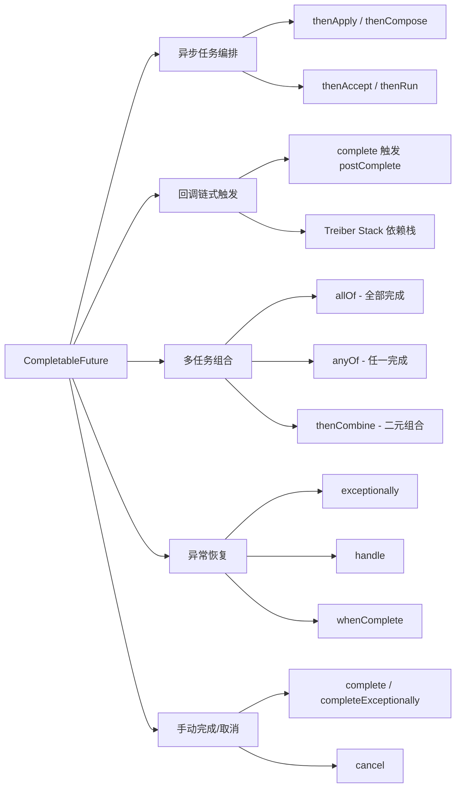
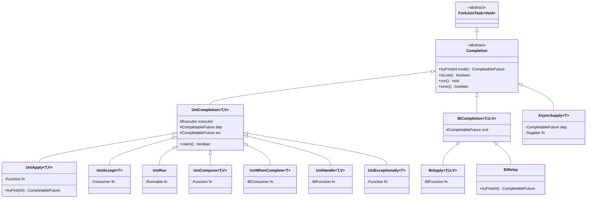
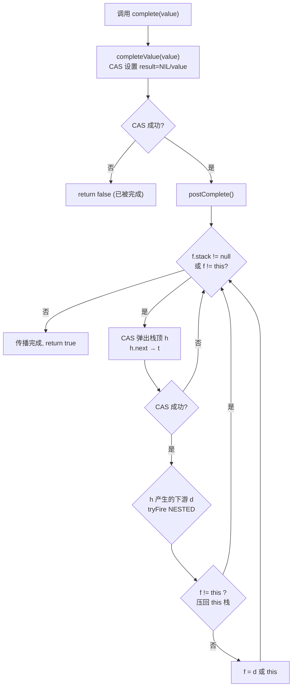
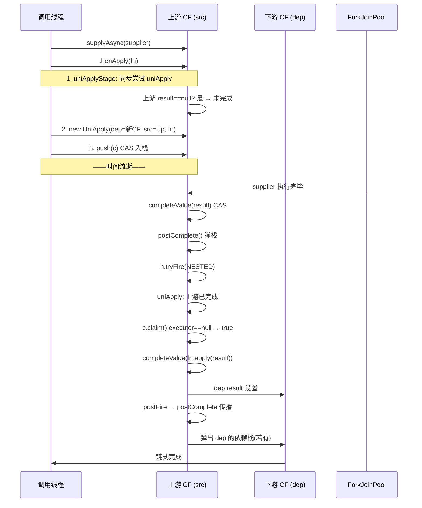
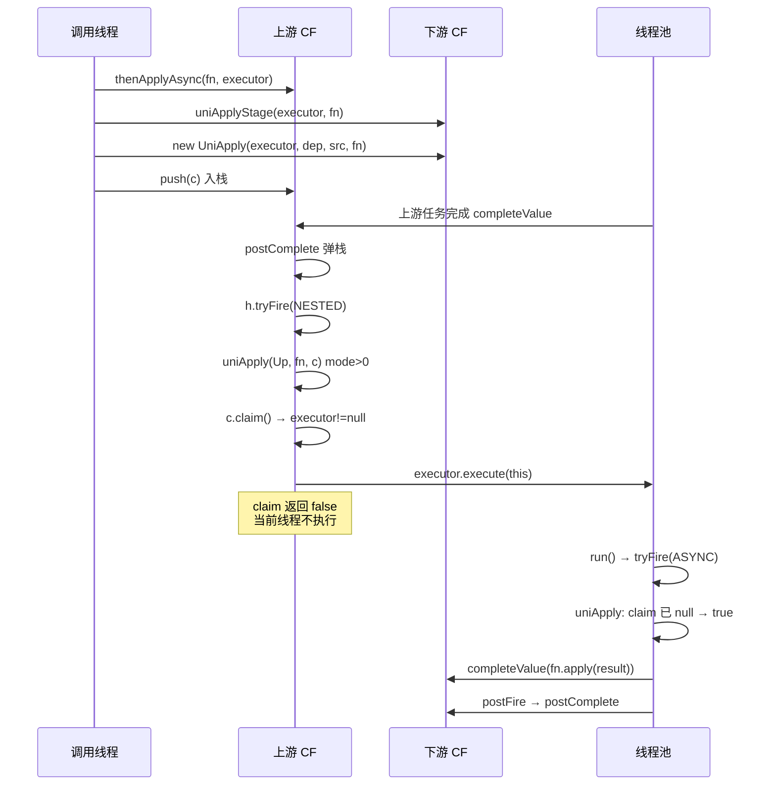
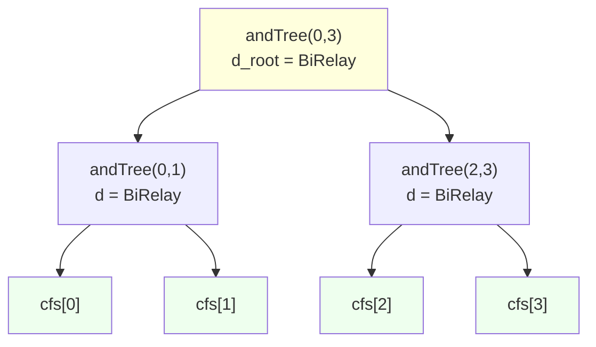
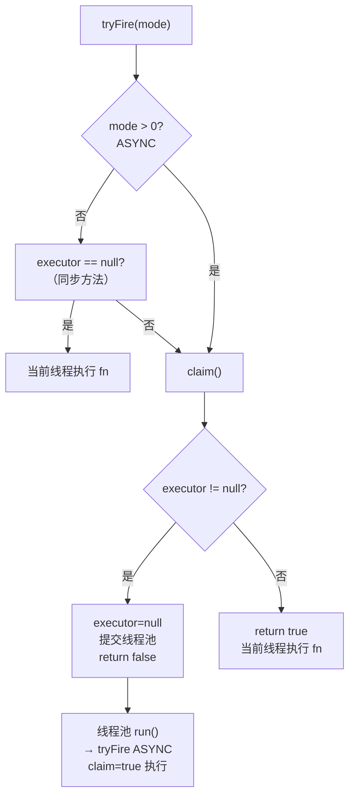
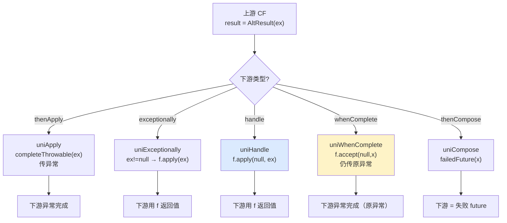
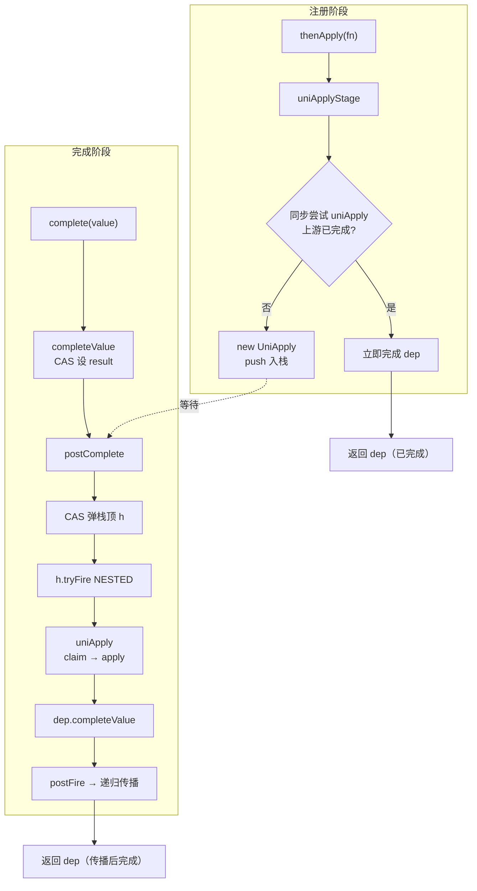

# CompletableFuture 深度解析：使用、原理与源码

> 本文基于 JDK 8 ~ JDK 21 的 `java.util.concurrent.CompletableFuture` 源码，系统梳理其用法、作用与实现原理，并配以 Mermaid 流程图与时序图。

---

## 目录

- [一、概述与作用](#一概述与作用)
- [二、核心 API 分类速查](#二核心-api-分类速查)
- [三、使用示例](#三使用示例)
- [四、数据结构与类设计](#四数据结构与类设计)
- [五、核心字段分析](#五核心字段分析)
- [六、Completion 体系源码分析](#六completion-体系源码分析)
- [七、关键流程源码剖析](#七关键流程源码剖析)
- [八、线程模型与 Executor](#八线程模型与-executor)
- [九、异常处理源码](#九异常处理源码)
- [十、常见陷阱与最佳实践](#十常见陷阱与最佳实践)
- [十一、总结](#十一总结)

---

## 一、概述与作用

### 1.1 是什么

`CompletableFuture` 是 Java 8 引入的**可组合异步编程**框架，位于 `java.util.concurrent` 包。它同时实现了：

- `Future<T>`：表示一个异步计算的结果。
- `CompletionStage<T>`：表示计算流水线上的某一个阶段。

与 `Future` 相比，它的关键能力在于：**计算完成时主动通知依赖方**，并且支持**链式编排、组合、异常恢复**。

### 1.2 解决了什么问题

`Future` 接口的局限：

| 问题 | `Future` | `CompletableFuture` |
|------|----------|---------------------|
| 阻塞获取结果 | `get()` 必须阻塞 | 可注册回调，完成时自动触发 |
| 链式编排 | 不支持 | `thenApply`/`thenCompose` 等 |
| 多任务组合 | 不支持 | `allOf` / `anyOf` |
| 异常处理 | 只能 `get` 抛出 | `exceptionally` / `handle` / `whenComplete` |
| 手动完成 | 不支持 | `complete()` / `completeExceptionally()` |
| 取消传播 | 有限 | 支持级联取消 |

### 1.3 核心能力一览（Mermaid 流程图）



---

## 二、核心 API 分类速查

### 2.1 创建 CompletableFuture

| 方法 | 说明 |
|------|------|
| `new CompletableFuture<>()` | 创建未完成的 future |
| `CompletableFuture.supplyAsync(Supplier)` | 异步执行 Supplier，ForkJoinPool.commonPool |
| `CompletableFuture.supplyAsync(Supplier, Executor)` | 指定线程池 |
| `CompletableFuture.runAsync(Runnable)` | 异步执行 Runnable，无返回值 |
| `CompletableFuture.completedFuture(T)` | 已完成的 future |

### 2.2 单依赖阶段（Unary）

后缀规律：`thenXxx`（同步）、`thenXxxAsync`（默认线程池异步）、`thenXxxAsync(executor)`（指定线程池）。

| 方法 | 入参 | 返回 | 语义 |
|------|------|------|------|
| `thenApply` | `Function<T,V>` | `CompletableFuture<V>` | 转换结果 |
| `thenAccept` | `Consumer<T>` | `CompletableFuture<Void>` | 消费结果 |
| `thenRun` | `Runnable` | `CompletableFuture<Void>` | 不关心结果，仅执行 |
| `thenCompose` | `Function<T,CF<V>>` | `CompletableFuture<V>` | flatMap，避免 `CF<CF<V>>` |
| `thenApply` / `thenAccept` 等 `Async` 变体 | 同上 | 同上 | 在线程池中执行 |
| `whenComplete` | `BiConsumer<T,Throwable>` | `CompletableFuture<T>` | 旁观（结果不变） |
| `handle` | `BiFunction<T,Throwable,V>` | `CompletableFuture<V>` | 可转换结果与异常 |
| `exceptionally` | `Function<Throwable,T>` | `CompletableFuture<T>` | 仅异常时兜底 |

### 2.3 双依赖阶段（Binary）

| 方法 | 语义 |
|------|------|
| `thenCombine(CF<U>, BiFunction<T,U,V>)` | 两个都完成后合并 |
| `thenAcceptBoth` | 两个都完成后消费 |
| `runAfterBoth` | 两个都完成后执行 |
| `applyToEither(CF<U>, Function<T,V>)` | 任一完成时转换 |
| `acceptEither` | 任一完成时消费 |
| `runAfterEither` | 任一完成时执行 |

### 2.4 多任务组合

| 方法 | 说明 |
|------|------|
| `allOf(CF<?>...)` | 全部完成才完成，返回 `CompletableFuture<Void>` |
| `anyOf(CF<?>...)` | 任一完成即完成，返回 `CompletableFuture<Object>` |

### 2.5 完成与状态

| 方法 | 说明 |
|------|------|
| `complete(T)` | 手动完成 |
| `completeExceptionally(Throwable)` | 手动异常完成 |
| `completeAsync(Supplier)` | 异步完成 |
| `completeOnTimeout(T, long, unit)` | 超时完成 |
| `orTimeout(long, unit)` | 超时异常完成 |
| `cancel(boolean)` | 取消 |
| `join()` | 阻塞获取（unchecked 异常） |
| `get()` | 阻塞获取（checked 异常） |
| `getNow(T)` | 立即获取，未完成则返回默认值 |

---

## 三、使用示例

### 3.1 创建与同步链式

```java
CompletableFuture<String> future = CompletableFuture
    .supplyAsync(() -> {
        // 异步执行
        return "hello";
    })
    .thenApply(s -> s + " world")
    .thenApply(String::toUpperCase);

System.out.println(future.join()); // HELLO WORLD
```

### 3.2 thenCompose 避免 `CompletableFuture<CompletableFuture<T>>`

```java
// ❌ 反模式：返回 CF<CF<String>>
CompletableFuture<CompletableFuture<String>> bad =
    CompletableFuture.supplyAsync(() -> "user-id")
        .thenApply(id -> loadUserAsync(id));

// ✅ 正确：thenCompose 拍平
CompletableFuture<String> good =
    CompletableFuture.supplyAsync(() -> "user-id")
        .thenCompose(id -> loadUserAsync(id));

CompletableFuture<String> loadUserAsync(String id) {
    return CompletableFuture.supplyAsync(() -> "user-" + id);
}
```

### 3.3 异常处理三件套

```java
CompletableFuture<Integer> safe = CompletableFuture
    .supplyAsync(() -> 10 / 0)            // 抛出 ArithmeticException
    .thenApply(n -> n + 1)                // 不会执行（异常短路）
    .exceptionally(ex -> {
        log.error("出错: {}", ex.getMessage());
        return -1;                         // 兜底值
    })
    .handle((val, ex) -> ex != null ? -2 : val); // 兜底 + 正常也处理
```

### 3.4 whenComplete（旁观，不改结果）

```java
CompletableFuture<Integer> f = CompletableFuture
    .supplyAsync(() -> 100)
    .whenComplete((r, ex) -> {
        if (ex != null) log.error("失败", ex);
        else            log.info("成功: {}", r);
    });
// f 结果仍为 100
```

### 3.5 双任务组合 thenCombine

```java
CompletableFuture<String> user = CompletableFuture.supplyAsync(() -> "Alice");
CompletableFuture<Integer> age = CompletableFuture.supplyAsync(() -> 30);

CompletableFuture<String> combined = user.thenCombine(age, (u, a) ->
    u + " is " + a + " years old");

System.out.println(combined.join()); // Alice is 30 years old
```

### 3.6 Either（任一完成）

```java
CompletableFuture<String> fast = CompletableFuture.supplyAsync(() -> {
    sleep(100); return "fast";
});
CompletableFuture<String> slow = CompletableFuture.supplyAsync(() -> {
    sleep(1000); return "slow";
});

CompletableFuture<String> firstDone = fast.applyToEither(slow, s -> "winner: " + s);
System.out.println(firstDone.join()); // winner: fast
```

### 3.7 allOf（聚合多个）

```java
List<CompletableFuture<String>> futures = ids.stream()
    .map(id -> CompletableFuture.supplyAsync(() -> fetch(id)))
    .toList();

CompletableFuture<Void> all = CompletableFuture.allOf(
    futures.toArray(new CompletableFuture[0]));

CompletableFuture<List<String>> allResult = all.thenApply(v ->
    futures.stream().map(CompletableFuture::join).toList()  // 此时 join 不会阻塞
);

System.out.println(allResult.join());
```

### 3.8 anyOf（任一完成）

```java
CompletableFuture<Object> any = CompletableFuture.anyOf(f1, f2, f3);
Object firstResult = any.join(); // 最先完成的那个结果
```

### 3.9 手动完成（RPC 场景）

```java
CompletableFuture<String> promise = new CompletableFuture<>();

// 另一个线程完成它
executor.execute(() -> {
    try {
        String r = rpc.call();
        promise.complete(r);       // ✅ 正常完成
    } catch (Exception e) {
        promise.completeExceptionally(e); // ❌ 异常完成
    }
});

// 注册回调
promise.thenAccept(System.out::println);
```

### 3.10 超时控制（JDK 9+）

```java
CompletableFuture<String> f = CompletableFuture
    .supplyAsync(() -> {
        sleep(5000); return "slow result";
    })
    .completeOnTimeout("timeout fallback", 1, TimeUnit.SECONDS)  // 超时给默认值
    .orTimeout(2, TimeUnit.SECONDS);                              // 或超时抛异常
```

### 3.11 指定线程池（生产必备）

```java
Executor bizPool = Executors.newFixedThreadPool(
    Runtime.getRuntime().availableProcessors() * 2,
    new ThreadFactoryBuilder().setNameFormat("biz-%d").build());

CompletableFuture<String> f = CompletableFuture
    .supplyAsync(() -> query(), bizPool)
    .thenApplyAsync(this::process, bizPool)
    .thenAcceptAsync(this::save, bizPool);
```

---

## 四、数据结构与类设计

### 4.1 类声明

```java
public class CompletableFuture<T> implements Future<T>, CompletionStage<T> {
    volatile Object result;          // 结果或 AltResult（包装异常）
    volatile Completion stack;       // 依赖本 future 的回调栈（Treiber Stack）
    // ...
}
```

`CompletableFuture` 既是**一个 future**（持有 result），又是一个**依赖队列头**（持有 stack）。

### 4.2 result 的两种形态

| 值 | 含义 |
|----|------|
| `null` | 未完成 |
| 普通 `Object`（非 AltResult） | 正常结果 |
| `AltResult` 包装 `Throwable` | 异常结果 |
| `AltResult(NULL)` | 正常完成但值为 null（如 `runAsync`） |

```java
static final AltResult NIL = new AltResult(null);

static Object encodeValue(T t) {
    return (t == null) ? NIL : t;   // null 值包装成 NIL
}
```

### 4.3 Completion 体系（Mermaid 类图）



### 4.4 关键设计要点

1. **Completion 继承 `ForkJoinTask<Void>`**：可直接提交给 `ForkJoinPool` 执行，复用 `work-stealing` 调度。
2. **Treiber Stack**：每个 future 持有一个无锁栈 `stack`，存放所有依赖它的 `Completion`。无锁通过 CAS 实现。
3. **dep / src 双向引用**：`dep` 是新生成的 downstream future，`src` 是上游 future。触发后断开引用避免内存泄漏。
4. **三种触发模式**：
   - `SYNC = 0`：当前线程同步触发
   - `ASYNC = 1`：提交到线程池异步触发
   - `NESTED = -1`：在 `postComplete` 中嵌套触发

```java
// 模式常量
static final int SYNC   = 0;
static final int ASYNC  = 1;
static final int NESTED = -1;
```

---

## 五、核心字段分析

### 5.1 result

```java
volatile Object result;       // null=未完成, 否则=结果
```

- 使用 `volatile` 保证可见性，无锁。
- 异常结果用 `AltResult` 包装：

```java
static final class AltResult {
    final Throwable ex;        // null 表示正常完成(null 值)
    AltResult(Throwable x) { this.ex = x; }
}
```

判定方法：

```java
// 是否已完成
boolean isDone() { return result != null; }

// 是否异常完成
boolean isCompletedExceptionally() {
    Object r;
    return ((r = result) instanceof AltResult) && r != NIL;
}
```

### 5.2 stack（Treiber Stack）

```java
volatile Completion stack;    // 栈顶
```

栈操作（无锁 CAS）：

```java
// 压栈（CAS 替换栈顶）
final boolean tryPushStack(Completion c) {
    Completion h = stack;
    lazySetNext(c, h);          // c.next = h (普通写，避免重排序)
    return UNSAFE.compareAndSwapObject(this, STACK, h, c);
}

// 压栈重试
final void pushStack(Completion c) {
    do {} while (!tryPushStack(c));
}

// 注册依赖：压栈后若已完成则立即触发
final void unipush(Completion c) {
    if (c != null) {
        while (result == null && !tryPushStack(c))
            lazySetNext(c, null);
        if (result != null)
            c.tryFire(SYNC);     // 已完成则同步触发
    }
}
```

`lazySetNext` 用 `Unsafe.putOrderedObject` 写 next 字段（store-store 屏障前），比 volatile 写开销小：

```java
static void lazySetNext(Completion c, Completion next) {
    U.putReference(c, NEXT, next);
}
```

---

## 六、Completion 体系源码分析

### 6.1 Completion 抽象基类

```java
abstract static class Completion
        extends ForkJoinTask<Void>
        implements Runnable, AsynchronousCompletionTask {

    volatile Completion next;      // Treiber Stack 的 next 指针

    // 核心：尝试触发本 Completion，返回它产生的 downstream future
    abstract CompletableFuture<?> tryFire(int mode);

    // 是否仍挂在某个 src 上（未触发）
    abstract boolean isLive();

    public final void run()                { tryFire(ASYNC); }
    public final boolean exec()            { tryFire(ASYNC); return false; } // 不等待
    public final Void getRawResult()       { return null; }
    public final void setRawResult(Void v) {}
}
```

> **设计精髓**：`tryFire` 是核心，无论同步、异步、嵌套，都走同一条触发路径，由 `mode` 决定执行方式。

### 6.2 UniCompletion

```java
abstract static class UniCompletion<T,V> extends Completion {
    final Executor executor;                 // null 表示同步执行
    final CompletableFuture<V> dep;          // 下游 future
    final CompletableFuture<T> src;          // 上游 future

    UniCompletion(Executor executor,
                  CompletableFuture<V> dep,
                  CompletableFuture<T> src) {
        this.executor = executor; this.dep = dep; this.src = src;
    }

    // 线程归属控制：确保一个 Completion 只被一个线程执行
    final boolean claim() {
        Executor e = executor;
        if (e != null) {
            executor = null;   // 抢占后置空，CAS 式所有权转移
            e.execute(this);   // 提交到线程池
        }
        return e == null;     // 返回 true 表示当前线程可直接执行
    }
}
```

> **claim() 的精妙**：当存在 executor 时，第一次调用会把它置 null 并提交任务（返回 false → 当前线程不执行），后续调用看到 executor==null 则返回 true（由线程池线程执行）。这保证了**一个回调不会被并发执行两次**。

### 6.3 UniApply（thenApply 的载体）

```java
static final class UniApply<T,V> extends UniCompletion<T,V> {
    Function<? super T,? extends V> fn;

    UniApply(Executor executor, CompletableFuture<V> dep,
             CompletableFuture<T> src, Function<? super T,? extends V> fn) {
        super(executor, dep, src); this.fn = fn;
    }

    final CompletableFuture<V> tryFire(int mode) {
        CompletableFuture<V> d; CompletableFuture<T> a;
        // uniApply 执行函数；mode>0 即 ASYNC，要求 claim 成功才在本线程执行
        if ((d = dep) == null || !d.uniApply(a = src, fn, mode > 0))
            return null;
        dep = null; src = null; fn = null;   // 清引用，防内存泄漏
        return d.postFire(a, mode);          // 触发下游 + 清理
    }
}
```

### 6.4 uniApply（真正执行函数）

```java
final <V> boolean uniApply(CompletableFuture<T> a,
                           Function<? super T,? extends V> f,
                           UniApply<V,V> c) {
    Object r; Throwable x;
    // 1. 上游未完成 或 函数为空 → 不触发
    if (a == null || (r = a.result) == null || f == null)
        return false;

    tryComplete: if (result == null) {           // 下游未完成才处理
        // 2. 上游是异常结果
        if (r instanceof AltResult) {
            if ((x = ((AltResult)r).ex) != null) {
                completeThrowable(x, r);          // 异常传播给下游
                break tryComplete;
            }
            r = null;                            // NIL → null
        }
        // 3. 执行转换
        try {
            if (c != null && !c.claim())         // ASYNC：claim 决定线程归属
                return false;
            completeValue(f.apply((T)r));        // ⭐ 调用 Function
        } catch (Throwable ex) {
            completeThrowable(ex);               // 函数抛异常 → 下游异常完成
        }
    }
    return true;
}
```

逻辑要点：
1. **上游未完成则返回 false**（`tryFire` 返回 null，回调等待）。
2. **异常传播**：上游异常直接传给下游，跳过函数执行。
3. **claim 机制**：`mode > 0`（ASYNC）时，若被提交到线程池则返回 false。
4. **下游幂等**：`result == null` 守卫确保只执行一次。

### 6.5 thenApply 的注册入口

```java
public <V> CompletableFuture<V> thenApply(Function<? super T,? extends V> fn) {
    return uniApplyStage(null, fn);          // executor=null → 同步
}

public <V> CompletableFuture<V> thenApplyAsync(Function<? super T,? extends V> fn) {
    return uniApplyStage(asyncPool(), fn);   // 默认 ForkJoinPool.commonPool
}

public <V> CompletableFuture<V> thenApplyAsync(Function<? super T,? extends V> fn,
                                               Executor executor) {
    return uniApplyStage(executor, fn);      // 指定线程池
}

private <V> CompletableFuture<V> uniApplyStage(Executor e,
                                              Function<? super T,? extends V> f) {
    if (f == null) throw new NullPointerException();
    CompletableFuture<V> d = new CompletableFuture<V>();   // 新建下游
    if (e != null || !d.uniApply(this, f, null)) {         // 同步尝试一次
        UniApply<T,V> c = new UniApply<T,V>(e, d, this, f);
        push(c);                                            // 入栈等待
    }
    return d;
}
```

> **关键优化**：注册时先同步尝试执行 `uniApply`，如果上游已完成则**立即完成**，无需入栈。这是"快路径"。

`push` 方法：

```java
final void push(UniCompletion<?,?> c) {
    if (c != null) {
        while (result == null && !tryPushStack(c))     // CAS 入栈
            lazySetNext(c, null);
        if (result != null)
            c.tryFire(SYNC);                           // 入栈后发现完成 → 同步触发
    }
}
```

### 6.6 postFire（触发后清理）

```java
final CompletableFuture<V> postFire(CompletableFuture<?> a, int mode) {
    if (a != null && a.stack != null) {
        if (mode < 0 || a.result == null)
            a.cleanStack();           // 清理已触发的无效节点
        else
            a.postComplete();         // 级联触发上游栈
    }
    if (result != null && stack != null)
        postComplete();               // 触发自己的下游栈
    return null;
}
```

---

## 七、关键流程源码剖析

### 7.1 complete() + postComplete() —— 通知整个依赖链

```java
public boolean complete(T value) {
    boolean triggered = completeValue(value);   // CAS 设置 result
    postComplete();                              // 触发依赖栈
    return triggered;
}
```

`completeValue`：

```java
final boolean completeValue(T t) {
    return UNSAFE.compareAndSwapObject(this, RESULT, null,
                                       (t == null) ? NIL : t);
}
```

`postComplete` —— 最核心的传播逻辑：

```java
final void postComplete() {
    CompletableFuture<?> f = this; Completion h;
    // 不断从栈顶弹出 Completion 并触发
    while ((h = f.stack) != null
           || (f != this && (h = (f = this).stack) != null)) {
        CompletableFuture<?> d; Completion t;
        if (f.casStack(h, t = h.next)) {       // CAS 弹出栈顶
            if (t != null) {
                if (f != this) {               // 来自被级联触发的 future
                    pushStack(h);              // 重新压回 this 的栈（继续处理）
                    continue;
                }
                h.next = null;                 // 断引用
            }
            // 触发该 Completion，返回它产生的下游 future
            f = (d = h.tryFire(NESTED)) == null ? this : d;
        }
    }
}
```

**循环条件解析**：
- `h = f.stack`：当前 future 的栈顶。
- 若当前 future 已空栈且 `f != this`，重置回 `this` 继续扫。
- `tryFire(NESTED)` 返回的 `d` 可能是级联产生的下游 future，需要继续处理它的栈，形成**深度优先传播**。

### 7.2 complete() 传播流程图



### 7.3 thenApply 注册 + 触发时序图



### 7.4 thenApplyAsync 异步时序图



### 7.5 thenCompose（flatMap）源码

`thenCompose` 解决 `CF<CF<V>>` 嵌套问题：

```java
public <V> CompletableFuture<V> thenCompose(Function<? super T,? extends CompletionStage<V>> fn) {
    return uniComposeStage(null, fn);
}

private <V> CompletableFuture<V> uniComposeStage(Executor e,
        Function<? super T,? extends CompletionStage<V>> f) {
    if (f == null) throw new NullPointerException();
    Object r; CompletableFuture<V> d; T t;
    if (e == null && (r = result) != null) {
        // 快路径：上游已完成
        try {
            if (r instanceof AltResult) {
                Throwable x;
                if ((x = ((AltResult)r).ex) != null)
                    d = failedFuture(x);          // 异常 → 失败 future
                else
                    d = (f.apply(null)).toCompletableFuture();
            } else {
                @SuppressWarnings("unchecked") T tr = (T) r;
                d = (f.apply(tr)).toCompletableFuture();  // 调用 fn 得到内层 CF
            }
        } catch (Throwable ex) {
            d = failedFuture(ex);
        }
        return d;                                  // ⭐ 直接返回内层 future
    }
    // 慢路径：上游未完成
    CompletableFuture<V> g = new CompletableFuture<>();
    UniCompose<T,V> c = new UniCompose<T,V>(e, g, this, f);
    push(c);
    return g;
}
```

`UniCompose.tryFire`：

```java
static final class UniCompose<T,V> extends UniCompletion<T,V> {
    Function<? super T,? extends CompletionStage<V>> fn;

    final CompletableFuture<V> tryFire(int mode) {
        CompletableFuture<V> d; CompletableFuture<T> a;
        Object r; Throwable x;
        if ((d = dep) == null || (a = src) == null
            || (r = a.result) == null || fn == null)
            return null;
        tryComplete: if (result == null) {
            if (r instanceof AltResult) {
                if ((x = ((AltResult)r).ex) != null) {
                    completeThrowable(x, r);
                    break tryComplete;
                }
                r = null;
            }
            try {
                if (c != null && !c.claim()) return false;
                @SuppressWarnings("unchecked")
                CompletableFuture<V> g = fn.apply((T) r).toCompletableFuture();
                // ⭐ 当内层 g 完成时，把结果传给 dep
                if (g.result == null)
                    g.unipush(new UniRelay<V,V>(null, d, g));
                else if (d.uniRelay(g, null)) {
                    g.result = null; d = null;
                }
            } catch (Throwable ex) {
                completeThrowable(ex);
            }
        }
        return null;
    }
}
```

> **核心**：`thenCompose` 的执行结果 `g` 通过 `UniRelay` 桥接到 `dep`。当 `g` 完成时，`UniRelay.tryFire` 把 `g` 的结果搬到 `dep`，从而"拍平"了嵌套。

### 7.6 allOf / andTree —— 树形聚合

```java
public static CompletableFuture<Void> allOf(CompletableFuture<?>... cfs) {
    return andTree(cfs, 0, cfs.length - 1);
}

static CompletableFuture<Void> andTree(CompletableFuture<?>[] cfs, int lo, int hi) {
    CompletableFuture<Void> d = new CompletableFuture<Void>();
    if (lo <= hi) {
        CompletableFuture<?> a, b;
        int mid = (lo + hi) >>> 1;
        // 分治：左半 = a，右半 = b
        if ((a = (lo == mid ? cfs[lo] : andTree(cfs, lo, mid))) == null ||
            (b = (lo == hi ? null
                 : (mid == hi ? cfs[hi] : andTree(cfs, mid+1, hi)))) == null)
            throw new NullPointerException();
        // 用 BiRelay 把 d 注册为 a 和 b 的二元依赖
        if (!d.biApply(a, b, BiRelay.relayer, null)) {
            BiRelay<?,?> c = new BiRelay<>(d, a, b);
            a.bipush(b, c);
            c.tryFire(SYNC);
        }
    }
    return d;
}
```

`BiRelay`：当 a、b 都完成时，把 d 完成成 `null`。

```java
static final class BiRelay<T,U> extends BiCompletion<T,U,Void> {
    static final BiRelay<?,?> RELAY = new BiRelay<>();

    BiRelay(CompletableFuture<Void> dep, CompletableFuture<T> src, CompletableFuture<U> snd) {
        super(null, dep, src, snd);
    }

    final CompletableFuture<Void> tryFire(int mode) {
        CompletableFuture<Void> d; CompletableFuture<T> a; CompletableFuture<U> b;
        if ((d = dep) == null || (a = src) == null || (b = snd) == null)
            return null;
        if (d.biRelay(a, b)) {
            src = null; snd = null; dep = null;
            return d.postFire(a, b, mode);
        }
        return null;
    }
}
```

**树形结构**（Mermaid）：



> **设计精髓**：通过二叉树分治，把 N 元聚合降为 log N 层二元组合。每个叶子完成时触发父节点，全部叶子完成则根节点完成。这避免了 O(N) 的回调链深度。

### 7.7 anyOf —— 任一完成

```java
public static CompletableFuture<Object> anyOf(CompletableFuture<?>... cfs) {
    return orTree(cfs, 0, cfs.length - 1);
}

static CompletableFuture<Object> orTree(CompletableFuture<?>[] cfs, int lo, int hi) {
    CompletableFuture<Object> d = new CompletableFuture<Object>();
    if (lo <= hi) {
        CompletableFuture<?> a, b;
        int mid = (lo + hi) >>> 1;
        if ((a = (lo == mid ? cfs[lo] : orTree(cfs, lo, mid))) == null ||
            (b = (lo == hi ? null
                 : (mid == hi ? cfs[hi] : orTree(cfs, mid+1, hi)))) == null)
            throw new NullPointerException();
        // 用 OrRelay 注册为 a 或 b 的依赖
        if (!d.orRelay(a, b)) {
            OrRelay<?,?> c = new OrRelay<>(d, a, b);
            a.orpush(b, c);
            c.tryFire(SYNC);
        }
    }
    return d;
}
```

与 `allOf` 对偶：用 `OrRelay`，任一子节点完成即触发父节点。

---

## 八、线程模型与 Executor

### 8.1 默认线程池

```java
private static final Executor ASYNC_POOL = USE_COMMON_POOL ?
    ForkJoinPool.commonPool() : new ThreadPoolExecutor(...);

static Executor asyncPool() {
    return ASYNC_POOL;
}
```

`ForkJoinPool.commonPool()` 的特点：
- 并行度 = `Runtime.getRuntime().availableProcessors() - 1`（最少 1）。
- 守护线程，程序退出不阻塞。
- 适合 CPU 密集型短任务。

### 8.2 同步 vs 异步执行的判定

| 方法 | executor | 执行线程 |
|------|----------|----------|
| `thenApply(fn)` | null | **谁完成上游谁执行**（注册方或上游完成方） |
| `thenApplyAsync(fn)` | commonPool | ForkJoinPool 工作线程 |
| `thenApplyAsync(fn, exec)` | exec | 指定线程池 |

`claim()` 决定同步链的实际执行者：



### 8.3 同步链的线程归属陷阱

```java
CompletableFuture.supplyAsync(() -> {
        sleep(5000);           // 阻塞 IO
        return "result";
    }, bizPool)
    .thenApply(this::heavyCpu)  // 由 bizPool 线程执行！
    .thenAccept(this::save);   // 还是 bizPool 线程！
```

由于 `thenApply` 没有指定 executor，回调会**在上游完成它的线程**中执行。若上游用 IO 线程池，则后续回调会污染 IO 线程池。生产中应：
- IO 任务用 IO 线程池，CPU 任务用 CPU 线程池，回调链明确切换：
- `.thenApplyAsync(this::heavyCpu, cpuPool)`

---

## 九、异常处理源码

### 9.1 AltResult 与异常编码

```java
// 完成异常
final boolean completeThrowable(Throwable x) {
    return UNSAFE.compareAndSwapObject(this, RESULT, null,
                                       encodeThrowable(x));
}

static Object encodeThrowable(Throwable x) {
    return new AltResult((x instanceof CompletionException) ? x :
                         new CompletionException(x));   // 包装成 CompletionException
}

// 异常传播（携带原 result）
final boolean completeThrowable(Throwable x, Object r) {
    return UNSAFE.compareAndSwapObject(this, RESULT, null,
                                       encodeThrowable(x, r));
}
```

### 9.2 exceptionally（仅异常时兜底）

```java
public CompletableFuture<T> exceptionally(Function<Throwable,? extends T> fn) {
    return uniExceptionallyStage(null, fn);
}

private CompletableFuture<T> uniExceptionallyStage(Executor e,
        Function<Throwable,? extends T> f) {
    if (f == null) throw new NullPointerException();
    CompletableFuture<T> d = new CompletableFuture<>();
    if (e != null || !d.uniExceptionally(this, f, null)) {
        UniExceptionally<T> c = new UniExceptionally<T>(e, d, this, f);
        push(c);
    }
    return d;
}
```

`uniExceptionally`：

```java
final boolean uniExceptionally(CompletableFuture<T> a,
                              Function<Throwable,? extends T> f,
                              UniExceptionally<T,?> c) {
    Object r; Throwable x;
    if (a == null || (r = a.result) == null || f == null)
        return false;
    complete: if (result == null) {
        if (r instanceof AltResult) {            // 仅当异常时
            if ((x = ((AltResult)r).ex) != null) {
                if (c != null && !c.claim()) return false;
                try {
                    completeValue(f.apply(x));    // 调用兜底函数
                } catch (Throwable ex) {
                    completeThrowable(ex);
                }
                break complete;
            }
        }
        completeValue((T)r);                      // 正常 → 透传结果
    }
    return true;
}
```

> **关键**：`exceptionally` 在正常完成时**透传结果**，仅异常时才调用 `fn`。这与 `handle` 不同（`handle` 无论如何都调用）。

### 9.3 handle（正常与异常都处理）

```java
final <V> boolean uniHandle(CompletableFuture<T> a,
                            BiFunction<? super T,Throwable,? extends V> f,
                            UniHandle<T,V> c) {
    Object r; T t; Throwable x;
    if (a == null || (r = a.result) == null || f == null)
        return false;
    complete: if (result == null) {
        if (r instanceof AltResult) {
            if ((x = ((AltResult)r).ex) != null) {
                if (c != null && !c.claim()) return false;
                try {
                    completeValue(f.apply(null, x));   // 异常 → t=null
                } catch (Throwable ex) {
                    completeThrowable(ex);
                }
                break complete;
            }
            t = null; r = null;
        } else {
            @SuppressWarnings("unchecked") T tr = (T) r;
            t = tr; r = null;
        }
        if (c != null && !c.claim()) return false;
        try {
            completeValue(f.apply(t, null));          // 正常 → x=null
        } catch (Throwable ex) {
            completeThrowable(ex);
        }
    }
    return true;
}
```

### 9.4 whenComplete（旁观，保留原结果）

```java
final boolean uniWhenComplete(CompletableFuture<T> a,
                              BiConsumer<? super T,? super Throwable> f,
                              UniWhenComplete<T> c) {
    Object r; T t; Throwable x = null;
    if (a == null || (r = a.result) == null || f == null)
        return false;
    complete: if (result == null) {
        if (r instanceof AltResult) {
            if ((x = ((AltResult)r).ex) != null) {
                if (c != null && !c.claim()) return false;
                try {
                    f.accept(null, x);        // 调用观察者
                } catch (Throwable ex) {
                    x = combine(x, ex);      // 合并异常
                }
                completeThrowable(x);         // ⚠️ 结果仍是异常
                break complete;
            }
            t = null; r = null;
        } else {
            @SuppressWarnings("unchecked") T tr = (T) r;
            t = tr; r = null;
        }
        if (c != null && !c.claim()) return false;
        try {
            f.accept(t, null);                // 调用观察者
            completeValue(t);                  // ⚠️ 保留原结果
        } catch (Throwable ex) {
            completeThrowable(ex);
        }
    }
    return true;
}
```

> **whenComplete 与 handle 的核心区别**：
> - `whenComplete`：正常时**保留原结果**（result 传给下游）；异常时**传原异常**给下游。
> - `handle`：总是用函数返回值替换结果。
> 因此 `whenComplete` 常用于日志/监控，不改变计算结果。

### 9.5 异常传播对比



---

## 十、常见陷阱与最佳实践

### 10.1 陷阱清单

| 陷阱 | 说明 | 建议 |
|------|------|------|
| **同步回调阻塞上游线程** | `thenApply` 在上游线程执行 | IO 重活用 `Async` 变体 |
| **未指定线程池** | 默认 commonPool 并行度低 | 生产用自定义池 |
| **异常被吞** | `join()` 不 catch 则抛出 | 末尾加 `exceptionally` |
| **`CF<CF<T>>` 嵌套** | `thenApply` 返回 CF 时嵌套 | 用 `thenCompose` |
| **`allOf` 返回 Void** | 无法直接拿结果 | `.thenApply(v -> futures.stream().map(join))` |
| **守护线程不退出** | commonPool 是守护线程 | 主线程需 join 等待 |
| **取消不级联** | `cancel` 只标记自己 | 上游任务仍会执行 |

### 10.2 取消的实现

```java
public boolean cancel(boolean mayInterruptIfRunning) {
    boolean cancelled = (result == null) &&
        completeExceptionally(new CancellationException());  // 异常完成
    postComplete();   // 传播取消
    return cancelled || isCancelled();
}
```

> `cancel` 本质是**异常完成**，会传播给依赖。但它**不能中断正在执行的上游任务**（不像 `FutureTask` 的 interrupt）。

### 10.3 最佳实践模板

```java
// 1. 自定义线程池，按任务类型隔离
Executor ioPool = new ThreadPoolExecutor(...);
Executor cpuPool = new ThreadPoolExecutor(...);

// 2. 异常兜底
CompletableFuture<List<User>> result = CompletableFuture
    .supplyAsync(() -> queryIds(), ioPool)
    .thenComposeAsync(ids ->
        CompletableFuture.allOf(
            ids.stream()
               .map(id -> CompletableFuture
                    .supplyAsync(() -> loadUser(id), ioPool)
                    .exceptionally(ex -> User.failed(id)))
               .toArray(CompletableFuture[]::new))
        .thenApply(v -> ids.stream()
            .map(id -> /* collect */ null)
            .toList()),
        ioPool
    )
    .orTimeout(5, TimeUnit.SECONDS)        // 超时保护
    .exceptionally(ex -> {
        log.error("整体失败", ex);
        return List.of();
    });

result.join();   // 如需阻塞
```

---

## 十一、总结

### 11.1 设计精髓回顾

1. **Treiber Stack 无锁回调队列**：每个 future 持有无锁栈，依赖方以 CAS 入栈，`complete` 时 CAS 弹出触发。O(1) 入栈/出栈，无锁高并发。

2. **`tryFire(mode)` 统一触发模型**：同步、异步、嵌套共用一条触发路径，`claim()` 用"executor 置 null"实现轻量所有权转移，保证回调恰好执行一次。

3. **快路径优化**：注册时同步尝试一次执行，上游已完成则无需入栈直接完成。

4. **异常即数据**：用 `AltResult` 包装异常，统一进 result 字段，异常传播与正常传播走同一套机制。

5. **树形聚合**：`allOf`/`anyOf` 用二叉树分治，把 O(N) 回调深度降为 O(log N)，避免栈溢出。

6. **`ForkJoinTask` 复用**：Completion 继承 ForkJoinTask，可直接提交 work-stealing 池，调度开销极低。

### 11.2 完整调用链全景图



### 11.3 一句话原理

> **CompletableFuture = 一个持有 volatile result 的 future + 一个无锁 Treiber Stack 依赖队列。任何线程调用 `complete()` 时，用 CAS 标记完成，然后遍历栈弹出所有依赖的 `Completion`，调用 `tryFire()` 在恰当的线程中执行回调并把结果传播给下游 future，下游 future 再级联触发它自己的栈 —— 如此递归，整条依赖链被一次 `complete()` 唤醒。**

---

## 附：源码版本说明

- 本文源码以 **JDK 11 / JDK 17** 为基准，JDK 8 的结构基本一致（`claim`、`tryFire` 模型一致），主要差异在 `orTimeout`/`completeOnTimeout`/`completeAsync`（JDK 9+ 新增）及部分内部方法命名。
- `Unsafe` 相关 CAS 在 JDK 9+ 用 `VarHandle` 重写，语义不变。

```
```