# Disruptor 3.4.4 底层实现原理与性能优势深度源码分析

> 基于 `D:\workspace\java_projects\source_projects\disruptor-3.4.4` 源码逐行剖析
> License: Apache 2.0 (LMAX Ltd.)

---

## 目录

- [一、Disruptor 是什么](#一disruptor-是什么)
- [二、整体架构与核心组件](#二整体架构与核心组件)
- [三、RingBuffer（环形缓冲区）源码剖析](#三ringbuffer环形缓冲区源码剖析)
- [四、Sequence（序列号）源码剖析——缓存行填充](#四sequence序列号源码剖析缓存行填充)
- [五、Sequencer（序列协调器）源码剖析](#五sequencer序列协调器源码剖析)
  - [5.1 SingleProducerSequencer（单生产者）](#51-singleproducersequencer单生产者)
  - [5.2 MultiProducerSequencer（多生产者）](#52-multiproducersequencer多生产者)
- [六、WaitStrategy（等待策略）源码剖析](#六waitstrategy等待策略源码剖析)
- [七、EventProcessor / BatchEventProcessor 消费者源码剖析](#七eventprocessor--batcheventprocessor-消费者源码剖析)
- [八、ProcessingSequenceBarrier（序列屏障）源码剖析](#八processingsequencebarrier序列屏障源码剖析)
- [九、DSL 与消费者依赖拓扑](#九dsl-与消费者依赖拓扑)
- [十、完整工作流程时序图](#十完整工作流程时序图)
- [十一、与 JDK 普通队列的性能对比](#十一与-jdk-普通队列的性能对比)
- [十二、设计精髓总结](#十二设计精髓总结)

---

## 一、Disruptor 是什么

Disruptor 是英国 LMAX 交易所开发的高性能进程内消息框架（Ring Buffer 模式），用于在线程之间高速交换数据。它最初被设计用来替代 `ArrayBlockingQueue`，作为 LMAX 金融交易系统的核心基础设施。

**核心特点：**

| 特性 | 描述 |
|------|------|
| 环形数组 (Ring Buffer) | 预分配内存，对象复用，避免 GC 压力 |
| 序列号 (Sequence) | 所有协调通过单调递增的 long 序列号完成 |
| 无锁/低锁 | 单生产者完全无锁；多生产者 CAS |
| 缓存行填充 | 消除伪共享 (False Sharing) |
| 内存屏障精细化 | 通过 `sun.misc.Unsafe` 精确控制 StoreStore/StoreLoad |
| 等待策略可插拔 | 7 种 WaitStrategy 适配不同场景 |
| 消费者依赖 DAG | 支持"菱形"流水线式并行消费拓扑 |

官方吞吐量测试：单机可达 **千万级 ops/s**，比 `ArrayBlockingQueue` 快一个数量级。

---

## 二、整体架构与核心组件

### 2.1 类结构总览

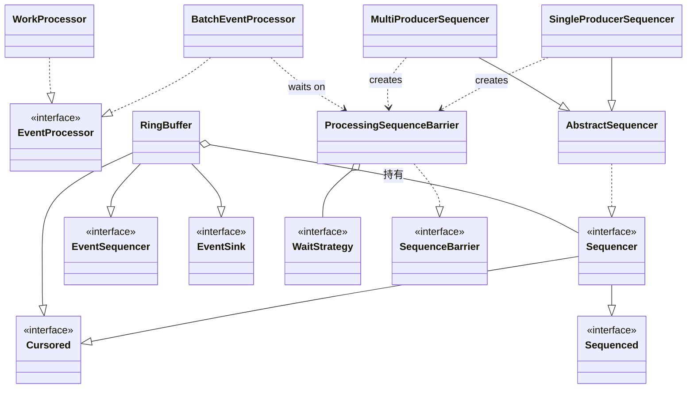

### 2.2 核心组件职责

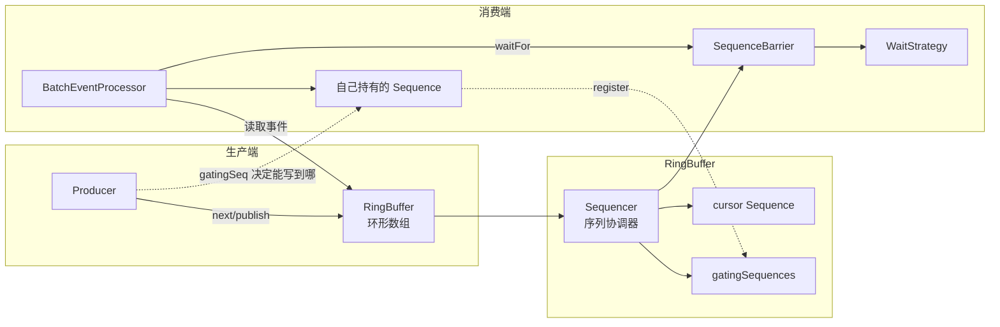

**职责拆分：**

| 组件 | 职责 | 关键源文件 |
|------|------|------|
| `RingBuffer` | 存储事件数据的环形数组，提供 publish/get API | `RingBuffer.java` |
| `Sequencer` | 协调生产者申请序列号，跟踪消费者进度 | `SingleProducerSequencer.java`, `MultiProducerSequencer.java` |
| `Sequence` | 包装 `volatile long`，缓存行填充，提供 CAS/有序写 | `Sequence.java` |
| `WaitStrategy` | 消费者等待新事件可用的策略 | `BlockingWaitStrategy.java` 等 7 个 |
| `SequenceBarrier` | 消费者等待入口，组合 cursor 与依赖序列 | `ProcessingSequenceBarrier.java` |
| `EventProcessor` | 消费者线程，循环拉取并处理事件 | `BatchEventProcessor.java`, `WorkProcessor.java` |
| `Disruptor` | DSL 入口，构建拓扑 | `dsl/Disruptor.java` |

---

## 三、RingBuffer（环形缓冲区）源码剖析

`RingBuffer.java` 是 Disruptor 的存储核心，但其精妙之处隐藏在它的父类继承链中。

### 3.1 三层继承 + 双重缓存行填充

```java
// RingBuffer.java:24-27
abstract class RingBufferPad {
    protected long p1, p2, p3, p4, p5, p6, p7;  // 7 个 long = 56 字节
}

// RingBuffer.java:29-95
abstract class RingBufferFields<E> extends RingBufferPad {
    // 实际字段
    private final long indexMask;
    private final Object[] entries;
    protected final int bufferSize;
    protected final Sequencer sequencer;
}

// RingBuffer.java:103-106
public final class RingBuffer<E> extends RingBufferFields<E> implements ... {
    protected long p1, p2, p3, p4, p5, p6, p7;  // 又是 7 个 long = 56 字节
}
```

**内存布局示意（缓存行填充）：**

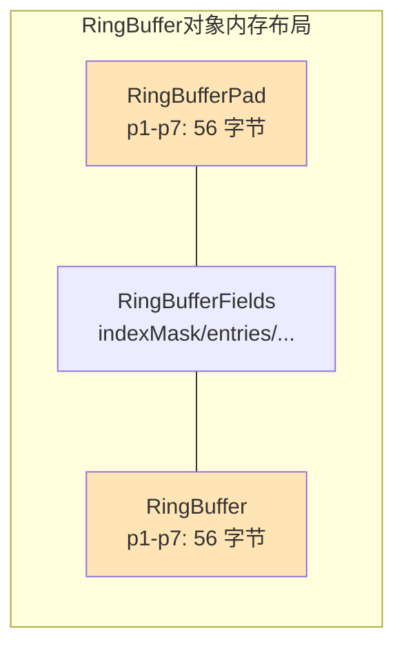

**为什么这样做？** 假如别的线程修改了 RingBuffer 旁边不相关的字段，但和 `entries`/`sequencer` 同处一个缓存行，会导致该缓存行被反复 invalidate，引发伪共享。前后各 7 个 long 共 112 字节填充，足以把"热字段"夹在中间，独占缓存行。

### 3.2 数组层面的双重 BUFFER_PAD

```java
// RingBuffer.java:31-53
private static final int BUFFER_PAD;
private static final long REF_ARRAY_BASE;
static {
    final int scale = UNSAFE.arrayIndexScale(Object[].class);  // 4 或 8
    REF_ELEMENT_SHIFT = (4 == scale) ? 2 : 3;
    BUFFER_PAD = 128 / scale;   // 128 字节填充
    REF_ARRAY_BASE = UNSAFE.arrayBaseOffset(Object[].class) + (BUFFER_PAD << REF_ELEMENT_SHIFT);
}

// RingBuffer.java:78
this.entries = new Object[sequencer.getBufferSize() + 2 * BUFFER_PAD];
```

数组前后各加 128 字节 padding，**保护数组元素不被相邻对象的写操作干扰缓存行**。

### 3.3 2 的幂约束 + 位运算代替取模

```java
// RingBuffer.java:72-77
if (Integer.bitCount(bufferSize) != 1) {
    throw new IllegalArgumentException("bufferSize must be a power of 2");
}
this.indexMask = bufferSize - 1;
```

定位槽位时：

```java
// RingBuffer.java:90-94
protected final E elementAt(long sequence) {
    return (E) UNSAFE.getObject(entries,
        REF_ARRAY_BASE + ((sequence & indexMask) << REF_ELEMENT_SHIFT));
}
```

`sequence & (bufferSize - 1)` 等价于 `sequence % bufferSize`，但位运算只需 1 个时钟周期，取模指令则需要 20~40 个周期。

### 3.4 预分配 + 对象复用（避免 GC）

```java
// RingBuffer.java:82-88
private void fill(EventFactory<E> eventFactory) {
    for (int i = 0; i < bufferSize; i++) {
        entries[BUFFER_PAD + i] = eventFactory.newInstance();
    }
}
```

启动时一次性 new 出全部事件对象，后续生产者通过 `EventTranslator` 修改对象内部字段而非创建新对象，**几乎零 GC**。这是 ArrayBlockingQueue 无法做到的——后者每次 `put` 都创建新对象。

### 3.5 publish 的两种模式

```java
// RingBuffer.java:261-264 (低层 API)
public long next()             { return sequencer.next(); }     // 申请序列号
public E get(long sequence)    { return elementAt(sequence); } // 拿到槽位
public void publish(long seq)  { sequencer.publish(seq); }     // 发布

// RingBuffer.java:463-467 (高层 API, EventTranslator)
public void publishEvent(EventTranslator<E> translator) {
    final long sequence = sequencer.next();
    translateAndPublish(translator, sequence);
}
```

`translateAndPublish`（RingBuffer.java:958-968）的核心是 **`try-finally` 保证 publish 一定被调用**：

```java
private void translateAndPublish(EventTranslator<E> translator, long sequence) {
    try {
        translator.translateTo(get(sequence), sequence);  // 用户填充
    } finally {
        sequencer.publish(sequence);  // 即使抛异常也发布
    }
}
```

---

## 四、Sequence（序列号）源码剖析——缓存行填充

`Sequence.java` 是整个 Disruptor 的"原子变量"，但它比 `AtomicLong` 精细得多。

### 4.1 三层继承消除伪共享

```java
// Sequence.java:23-26
class LhsPadding {
    protected long p1, p2, p3, p4, p5, p6, p7;       // 左填充 56 字节
}
// Sequence.java:28-31
class Value extends LhsPadding {
    protected volatile long value;                    // 真正的值
}
// Sequence.java:33-36
class RhsPadding extends Value {
    protected long p9, p10, p11, p12, p13, p14, p15; // 右填充 56 字节
}
// Sequence.java:46
public class Sequence extends RhsPadding { ... }
```

**内存布局图（一个缓存行 64 字节）：**

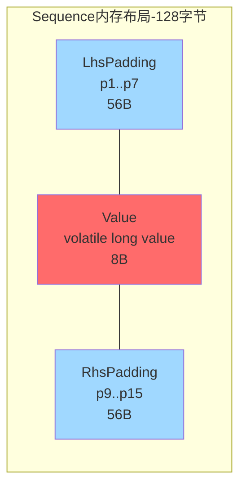

经典 CPU 缓存行是 64 字节，`volatile long value` 占 8 字节。如果没有 padding，多个 Sequence 实例（cursor、gatingSequences...）的 value 字段可能挤在同一缓存行。一个 CPU 核更新自己的 value，会让另一个核的整个缓存行 invalidate，导致对方 cache miss —— 这就是**伪共享 (False Sharing)**。前后各 7 个 long = 56 字节，确保 value 独占一个缓存行。

### 4.2 Unsafe 精细化内存屏障

```java
// Sequence.java:49-63 静态初始化拿到 value 字段偏移
static {
    UNSAFE = Util.getUnsafe();
    VALUE_OFFSET = UNSAFE.objectFieldOffset(Value.class.getDeclaredField("value"));
}

// Sequence.java:88-91 普通 volatile 读
public long get() {
    return value;  // JIT 编译为 MOV 指令 + LoadLoad 屏障
}

// Sequence.java:100-103 有序写（延迟的 StoreStore 屏障）
public void set(final long value) {
    UNSAFE.putOrderedLong(this, VALUE_OFFSET, value);
}

// Sequence.java:113-116 真正的 volatile 写（StoreLoad 屏障）
public void setVolatile(final long value) {
    UNSAFE.putLongVolatile(this, VALUE_OFFSET, value);
}

// Sequence.java:125-128 CAS
public boolean compareAndSet(final long expectedValue, final long newValue) {
    return UNSAFE.compareAndSwapLong(this, VALUE_OFFSET, expectedValue, newValue);
}
```

**三种写入语义对比：**

| 方法 | 底层指令 (x86) | 屏障 | 适用场景 | 性能 |
|------|----------|------|----------|------|
| `set` (`putOrderedLong`) | MOV + StoreStore | 进入写缓冲区，不立刻对其他核可见 | 写完后还有其他写 | **最快** |
| `setVolatile` (`putLongVolatile`) | MOV + MFENCE | 立刻对所有核可见 | 跨线程发布"已完成" | 中等 |
| `compareAndSet` | LOCK CMPXCHG | 全屏障 | 多生产者竞争 | 较慢 |
| `AtomicLong.set` | 等同 `setVolatile` | StoreLoad | 不区分场景 | 中等 |

**关键洞察：** 在 `SingleProducerSequencer` 内部，生产者申请序列号时根本没有调用任何同步原语，因为只有一个生产者。只有在 `publish` 时调用 `cursor.set()` (putOrderedLong) 才产生一次 StoreStore 屏障开销。

---

## 五、Sequencer（序列协调器）源码剖析

### 5.1 SingleProducerSequencer（单生产者）

继承链：`AbstractSequencer` ← `SingleProducerSequencerPad` ← `SingleProducerSequencerFields` ← `SingleProducerSequencer`

```java
// SingleProducerSequencer.java:22-30
abstract class SingleProducerSequencerPad extends AbstractSequencer {
    protected long p1, p2, p3, p4, p5, p6, p7; // 缓存行填充
}
// SingleProducerSequencer.java:32-44
abstract class SingleProducerSequencerFields extends SingleProducerSequencerPad {
    long nextValue = Sequence.INITIAL_VALUE;   // -1，普通 long！
    long cachedValue = Sequence.INITIAL_VALUE; // 缓存的最小 gating 序列
}
```

**`nextValue` 和 `cachedValue` 都是普通 long，不是 volatile，也没有 CAS！** 这是单生产者场景下的极致优化：既然只有一个线程写，何必同步？

#### 5.1.1 next() 申请序列号（核心算法）

```java
// SingleProducerSequencer.java:117-146
@Override
public long next(int n) {
    if (n < 1) throw new IllegalArgumentException("n must be > 0");

    long nextValue = this.nextValue;                    // 1. 读当前已申请位置（普通读）
    long nextSequence = nextValue + n;                  // 2. 计算申请新位置
    long wrapPoint = nextSequence - bufferSize;          // 3. 回绕点
    long cachedGatingSequence = this.cachedValue;        // 4. 读缓存的消费者位置

    if (wrapPoint > cachedGatingSequence || cachedGatingSequence > nextValue) {
        // 缓存失效：可能要回绕，需要刷新
        cursor.setVolatile(nextValue);                   // 5. StoreLoad 屏障，让消费者看到

        long minSequence;
        while (wrapPoint > (minSequence = Util.getMinimumSequence(gatingSequences, nextValue))) {
            // 6. 消费者没跟上，park 1ns 再试
            LockSupport.parkNanos(1L);
        }
        this.cachedValue = minSequence;                  // 7. 更新缓存
    }

    this.nextValue = nextSequence;                         // 8. 推进（普通写）
    return nextSequence;
}
```

**算法解析：**

- `wrapPoint = nextSequence - bufferSize` 表示"如果写到 nextSequence，是否会覆盖还没被消费的位置"。
- `cachedGatingSequence` 是缓存的"消费者最小序列号"，避免每次都去扫描所有 gatingSequences。
- 如果 `wrapPoint > cachedGatingSequence`（消费者太慢，要追上才能继续写），就需要刷新。
- `cursor.setVolatile(nextValue)` 这里用 **StoreLoad 屏障**：让生产者之前所有写入对消费者可见，再读取最新的 gatingSequences。

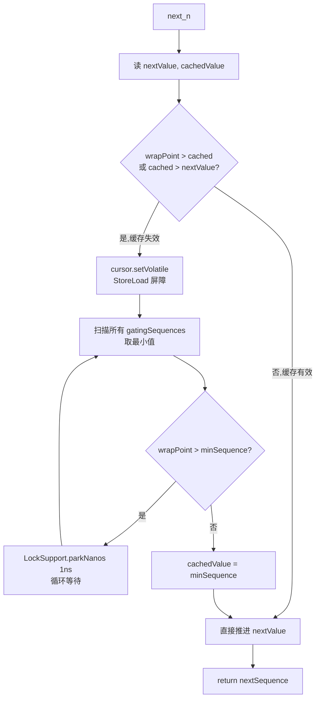

#### 5.1.2 publish() 发布

```java
// SingleProducerSequencer.java:203-208
@Override
public void publish(long sequence) {
    cursor.set(sequence);                    // putOrderedLong = StoreStore 屏障
    waitStrategy.signalAllWhenBlocking();    // 唤醒 Blocking 等待的消费者
}
```

注意这里用的是 `cursor.set`（StoreStore），不是 `cursor.setVolatile`（StoreLoad）。原因是：**StoreStore 已经足以保证"生产者写完事件数据 → 写 cursor"这个顺序**，消费者在读 cursor 之前会先看到事件数据。这是 Disruptor 设计中一个非常重要的优化点。

### 5.2 MultiProducerSequencer（多生产者）

多生产者场景下，cursor 是共享资源，必须用 CAS。但 Disruptor 的精妙之处在于：**它不只用 cursor，还有一个 `availableBuffer` 数组来跟踪每个槽的发布状态**。

```java
// MultiProducerSequencer.java:39-46
private final Sequence gatingSequenceCache = new Sequence(Sequencer.INITIAL_CURSOR_VALUE);
private final int[] availableBuffer;   // 每个 slot 一个 int
private final int indexMask;
private final int indexShift;

// MultiProducerSequencer.java:53-60 构造函数
public MultiProducerSequencer(int bufferSize, final WaitStrategy waitStrategy) {
    super(bufferSize, waitStrategy);
    availableBuffer = new int[bufferSize];
    indexMask = bufferSize - 1;
    indexShift = Util.log2(bufferSize);          // log2(bufferSize)
    initialiseAvailableBuffer();                  // 全部初始化为 -1
}
```

#### 5.2.1 next() 申请序列号（CAS + 自旋）

```java
// MultiProducerSequencer.java:112-150
@Override
public long next(int n) {
    long current, next;
    do {
        current = cursor.get();                  // 1. CAS 读 cursor
        next = current + n;
        long wrapPoint = next - bufferSize;
        long cachedGatingSequence = gatingSequenceCache.get();

        if (wrapPoint > cachedGatingSequence || cachedGatingSequence > current) {
            long gatingSequence = Util.getMinimumSequence(gatingSequences, current);
            if (wrapPoint > gatingSequence) {
                LockSupport.parkNanos(1);         // 消费者没跟上，等
                continue;
            }
            gatingSequenceCache.set(gatingSequence);
        }
        // 2. CAS 抢占 cursor
    } while (!cursor.compareAndSet(current, next));
    return next;
}
```

**关键点：** `cursor.compareAndSet` 抢占成功后，**仅仅是"申请"到了序列号，事件数据还没写完，消费者还不能读**。所以多生产者下 cursor 的语义和单生产者不同：cursor 只表示"申请到了"，不代表"已发布"。

#### 5.2.2 publish() 标记 availableBuffer（核心创新）

```java
// MultiProducerSequencer.java:214-219
@Override
public void publish(final long sequence) {
    setAvailable(sequence);
    waitStrategy.signalAllWhenBlocking();
}

// MultiProducerSequencer.java:253-262
private void setAvailable(final long sequence) {
    setAvailableBufferValue(calculateIndex(sequence), calculateAvailabilityFlag(sequence));
}

private void setAvailableBufferValue(int index, int flag) {
    long bufferAddress = (index * SCALE) + BASE;
    UNSAFE.putOrderedInt(availableBuffer, bufferAddress, flag);  // StoreStore
}

// MultiProducerSequencer.java:290-298
private int calculateAvailabilityFlag(final long sequence) {
    return (int) (sequence >>> indexShift);   // 序列号右移 log2(bufferSize) 位 = 绕圈数
}
private int calculateIndex(final long sequence) {
    return ((int) sequence) & indexMask;       // 槽位下标
}
```

**算法核心：**
- 每个 slot 存的不是 boolean，而是 `sequence >>> indexShift`，即"这个槽被写过几次了"。
- 消费者读 slot 时，如果存着的 flag 等于 `sequence >>> indexShift`，说明这个槽的最新一次发布已经完成；否则还没发布。
- 这样多生产者**无需共享同一个 cursor 来表示"已发布"**，每个 slot 独立。

#### 5.2.3 isAvailable 与 getHighestPublishedSequence

```java
// MultiProducerSequencer.java:268-274
@Override
public boolean isAvailable(long sequence) {
    int index = calculateIndex(sequence);
    int flag = calculateAvailabilityFlag(sequence);
    long bufferAddress = (index * SCALE) + BASE;
    return UNSAFE.getIntVolatile(availableBuffer, bufferAddress) == flag;
}

// MultiProducerSequencer.java:276-288
@Override
public long getHighestPublishedSequence(long lowerBound, long availableSequence) {
    for (long sequence = lowerBound; sequence <= availableSequence; sequence++) {
        if (!isAvailable(sequence)) {
            return sequence - 1;   // 找到第一个未发布的，返回它前一个
        }
    }
    return availableSequence;
}
```

**消费者侧使用：** 多生产者下，cursor 推进了不代表 [lowerBound, cursor] 都已发布。消费者要扫描 availableBuffer，找到第一个"已发布"的最高位置。这样允许多个生产者**乱序发布**而不阻塞其他生产者。

---

## 六、WaitStrategy（等待策略）源码剖析

`WaitStrategy` 是接口（`WaitStrategy.java:22-48`），Disruptor 内置 7 种实现。这是 Disruptor 性能可调优的核心机制。

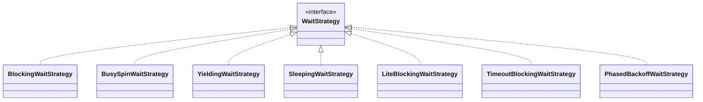

### 6.1 BusySpinWaitStrategy（最低延迟，最高 CPU）

```java
// BusySpinWaitStrategy.java:30-43
@Override
public long waitFor(final long sequence, Sequence cursor, final Sequence dependentSequence,
                    final SequenceBarrier barrier) throws ... {
    long availableSequence;
    while ((availableSequence = dependentSequence.get()) < sequence) {
        barrier.checkAlert();
        ThreadHints.onSpinWait();   // 调用 Thread.onSpinWait()
    }
    return availableSequence;
}
```

`ThreadHints.onSpinWait()`（`util/ThreadHints.java:62-76`）通过 MethodHandle 反射调用 `Thread.onSpinWait()`，在 x86 上编译为 **PAUSE 指令**，提示 CPU 这是自旋等待循环，可以降低流水线功耗并减少错误预测。延迟最低（纳秒级），但持续占用 100% CPU。

### 6.2 YieldingWaitStrategy（自旋 100 次后 yield）

```java
// YieldingWaitStrategy.java:28,30-44
private static final int SPIN_TRIES = 100;

@Override
public long waitFor(...) {
    long availableSequence;
    int counter = SPIN_TRIES;
    while ((availableSequence = dependentSequence.get()) < sequence) {
        counter = applyWaitMethod(barrier, counter);
    }
    return availableSequence;
}
private int applyWaitMethod(final SequenceBarrier barrier, int counter) {
    barrier.checkAlert();
    if (0 == counter) Thread.yield();   // 让出 CPU 时间片
    else --counter;
    return counter;
}
```

### 6.3 SleepingWaitStrategy（自旋→yield→park）

```java
// SleepingWaitStrategy.java:33-34
private static final int DEFAULT_RETRIES = 200;
private static final long DEFAULT_SLEEP = 100;

// SleepingWaitStrategy.java:76-96 三阶段策略
private int applyWaitMethod(final SequenceBarrier barrier, int counter) {
    barrier.checkAlert();
    if (counter > 100) {
        --counter;                          // 阶段1: 纯自旋 100 次
    } else if (counter > 0) {
        --counter;
        Thread.yield();                    // 阶段2: yield 100 次
    } else {
        LockSupport.parkNanos(sleepTimeNs); // 阶段3: park 100ns
    }
    return counter;
}
```

### 6.4 BlockingWaitStrategy（锁 + Condition，最低 CPU）

```java
// BlockingWaitStrategy.java:31-32
private final Lock lock = new ReentrantLock();
private final Condition processorNotifyCondition = lock.newCondition();

// BlockingWaitStrategy.java:35-63
@Override
public long waitFor(long sequence, Sequence cursorSequence, Sequence dependentSequence,
                    SequenceBarrier barrier) throws ... {
    long availableSequence;
    if (cursorSequence.get() < sequence) {       // 先快速判断
        lock.lock();
        try {
            while (cursorSequence.get() < sequence) {
                barrier.checkAlert();
                processorNotifyCondition.await();  // 等待 signal
            }
        } finally { lock.unlock(); }
    }
    // 第二阶段：自旋等待 dependentSequence
    while ((availableSequence = dependentSequence.get()) < sequence) {
        barrier.checkAlert();
        ThreadHints.onSpinWait();
    }
    return availableSequence;
}

// BlockingWaitStrategy.java:65-77
@Override
public void signalAllWhenBlocking() {
    lock.lock();
    try { processorNotifyCondition.signalAll(); }
    finally { lock.unlock(); }
}
```

### 6.5 LiteBlockingWaitStrategy / PhasedBackoffWaitStrategy

`LiteBlockingWaitStrategy`（`LiteBlockingWaitStrategy.java`）通过 `AtomicBoolean signalNeeded` 减少无竞争时的 `signalAll` 加锁开销（lock elision 思路）。

`PhasedBackoffWaitStrategy`（`PhasedBackoffWaitStrategy.java:98-135`）分三阶段：spin 10000 次 → yield（spinTimeout~yieldTimeout 之间）→ fallback 到 Blocking/LiteBlocking/Sleeping。

### 6.6 等待策略选择决策图

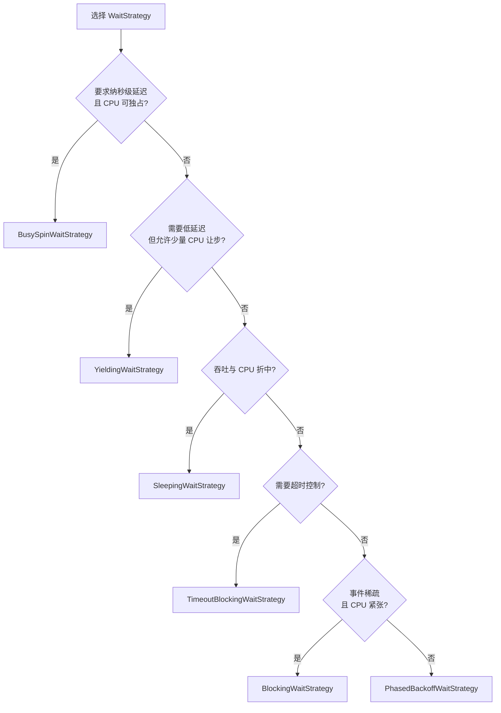

---

## 七、EventProcessor / BatchEventProcessor 消费者源码剖析

### 7.1 EventProcessor 接口

```java
// EventProcessor.java:26-42
public interface EventProcessor extends Runnable {
    Sequence getSequence();
    void halt();
    boolean isRunning();
}
```

它是一个 Runnable，意味着由 Executor 提交到线程池执行。

### 7.2 BatchEventProcessor 主循环

```java
// BatchEventProcessor.java:33-44
private static final int IDLE = 0;
private static final int HALTED = IDLE + 1;
private static final int RUNNING = HALTED + 1;
private final AtomicInteger running = new AtomicInteger(IDLE);
// 字段
private final DataProvider<T> dataProvider;        // 即 RingBuffer
private final SequenceBarrier sequenceBarrier;
private final EventHandler<? super T> eventHandler;
private final Sequence sequence = new Sequence(Sequencer.INITIAL_CURSOR_VALUE); // -1
```

**核心循环 `processEvents`：**

```java
// BatchEventProcessor.java:150-192
private void processEvents() {
    T event = null;
    long nextSequence = sequence.get() + 1L;       // 从当前 +1 开始

    while (true) {
        try {
            // 1. 等待 nextSequence 可用，返回最多能处理的 availableSequence
            final long availableSequence = sequenceBarrier.waitFor(nextSequence);

            if (batchStartAware != null) {
                batchStartAware.onBatchStart(availableSequence - nextSequence + 1);
            }

            // 2. 批量处理 [nextSequence, availableSequence]
            while (nextSequence <= availableSequence) {
                event = dataProvider.get(nextSequence);
                eventHandler.onEvent(event, nextSequence, nextSequence == availableSequence);
                nextSequence++;
            }

            // 3. 批量更新自己的 sequence（一次写入代替多次）
            sequence.set(availableSequence);
        }
        catch (final TimeoutException e) { notifyTimeout(sequence.get()); }
        catch (final AlertException ex) {
            if (running.get() != RUNNING) break;    // 收到 halt 信号
        }
        catch (final Throwable ex) {
            handleEventException(ex, nextSequence, event);
            sequence.set(nextSequence);
            nextSequence++;
        }
    }
}
```

**关键设计：批量处理 + 单次 set**

- `waitFor` 返回的 `availableSequence` 通常比 `nextSequence` 大很多（因为生产者批量发布）。
- 在内层 while 循环中一次性处理完所有可用事件。
- 处理完才调用 `sequence.set(availableSequence)` 一次。
- 这样**消费者侧对 sequence 的写频率等于"批次数"而非"事件数"**，大幅减少缓存一致性流量。

### 7.3 WorkProcessor（多消费者池模式）

`WorkProcessor.java`（用于 `WorkerPool`）实现"一组 WorkHandler 抢同一个事件"模式：

```java
// WorkProcessor.java:106-173 关键代码
public void run() {
    ...
    boolean processedSequence = true;
    long cachedAvailableSequence = Long.MIN_VALUE;
    long nextSequence = sequence.get();
    T event = null;
    while (true) {
        try {
            if (processedSequence) {
                processedSequence = false;
                do {
                    nextSequence = workSequence.get() + 1L;
                    sequence.set(nextSequence - 1L);
                } while (!workSequence.compareAndSet(nextSequence - 1L, nextSequence));
                // CAS 抢到任务
            }
            if (cachedAvailableSequence >= nextSequence) {
                event = ringBuffer.get(nextSequence);
                workHandler.onEvent(event);          // 处理
                processedSequence = true;
            } else {
                cachedAvailableSequence = sequenceBarrier.waitFor(nextSequence);
            }
        } catch (...) { ... }
    }
}
```

多个 WorkProcessor 共享同一个 `workSequence`，通过 CAS 抢任务，实现工作窃取式负载均衡。

---

## 八、ProcessingSequenceBarrier（序列屏障）源码剖析

`ProcessingSequenceBarrier.java` 是消费者等待的入口，组合了 `cursor` 和 `依赖序列`。

```java
// ProcessingSequenceBarrier.java:23-48
final class ProcessingSequenceBarrier implements SequenceBarrier {
    private final WaitStrategy waitStrategy;
    private final Sequence dependentSequence;       // 依赖的上游 Sequence
    private volatile boolean alerted = false;
    private final Sequence cursorSequence;
    private final Sequencer sequencer;

    ProcessingSequenceBarrier(
        final Sequencer sequencer, final WaitStrategy waitStrategy,
        final Sequence cursorSequence, final Sequence[] dependentSequences) {
        this.sequencer = sequencer;
        this.waitStrategy = waitStrategy;
        this.cursorSequence = cursorSequence;
        if (0 == dependentSequences.length) {
            // 无依赖：直接等 cursor
            dependentSequence = cursorSequence;
        } else {
            // 有依赖：等所有依赖消费者都处理完
            dependentSequence = new FixedSequenceGroup(dependentSequences);
        }
    }
```

**`FixedSequenceGroup`**（`FixedSequenceGroup.java:44-48`）的 `get()` 返回所有依赖序列的**最小值**：

```java
@Override
public long get() {
    return Util.getMinimumSequence(sequences);   // 取最小
}
```

**`waitFor` 方法：**

```java
// ProcessingSequenceBarrier.java:50-64
@Override
public long waitFor(final long sequence) throws ... {
    checkAlert();
    long availableSequence = waitStrategy.waitFor(sequence, cursorSequence, dependentSequence, this);
    if (availableSequence < sequence) {
        return availableSequence;        // 超时或返回少于预期
    }
    return sequencer.getHighestPublishedSequence(sequence, availableSequence);
    // 多生产者下需要扫描 availableBuffer
}
```

---

## 九、DSL 与消费者依赖拓扑

`dsl/Disruptor.java` 是用户入口，提供流式 API 构建消费者依赖图。

### 9.1 创建与启动

```java
// Disruptor.java:129-139
public Disruptor(
    final EventFactory<T> eventFactory, final int ringBufferSize,
    final ThreadFactory threadFactory,
    final ProducerType producerType, final WaitStrategy waitStrategy) {
    this(RingBuffer.create(producerType, eventFactory, ringBufferSize, waitStrategy),
         new BasicExecutor(threadFactory));
}

// Disruptor.java:398-407
public RingBuffer<T> start() {
    checkOnlyStartedOnce();
    for (final ConsumerInfo consumerInfo : consumerRepository) {
        consumerInfo.start(executor);   // 把每个 EventProcessor 提交线程池
    }
    return ringBuffer;
}
```

### 9.2 createEventProcessors 注册消费者链

```java
// Disruptor.java:548-576
EventHandlerGroup<T> createEventProcessors(
    final Sequence[] barrierSequences,
    final EventHandler<? super T>[] eventHandlers) {
    checkNotStarted();

    final Sequence[] processorSequences = new Sequence[eventHandlers.length];
    // 1. 基于 barrierSequences（上游消费者）创建 Barrier
    final SequenceBarrier barrier = ringBuffer.newBarrier(barrierSequences);

    for (int i = 0; i < eventHandlers.length; i++) {
        final EventHandler<? super T> eventHandler = eventHandlers[i];
        final BatchEventProcessor<T> batchEventProcessor =
            new BatchEventProcessor<>(ringBuffer, barrier, eventHandler);
        if (exceptionHandler != null) {
            batchEventProcessor.setExceptionHandler(exceptionHandler);
        }
        consumerRepository.add(batchEventProcessor, eventHandler, barrier);
        processorSequences[i] = batchEventProcessor.getSequence();
    }

    // 2. 把当前消费者的 sequence 注册为 RingBuffer 的 gatingSequence
    updateGatingSequencesForNextInChain(barrierSequences, processorSequences);

    return new EventHandlerGroup<>(this, consumerRepository, processorSequences);
}

// Disruptor.java:578-589
private void updateGatingSequencesForNextInChain(
    final Sequence[] barrierSequences, final Sequence[] processorSequences) {
    if (processorSequences.length > 0) {
        ringBuffer.addGatingSequences(processorSequences);
        for (final Sequence barrierSequence : barrierSequences) {
            ringBuffer.removeGatingSequence(barrierSequence);  // 移除中间节点
        }
        consumerRepository.unMarkEventProcessorsAsEndOfChain(barrierSequences);
    }
}
```

**`gatingSequences` 的作用：** `RingBuffer` 通过 `gatingSequences`（消费者进度数组）知道"最慢的消费者到哪了"，从而决定"生产者能写到哪"。链上中间消费者会被移除，只保留链尾的消费者。

### 9.3 消费者拓扑示例

```java
// 经典菱形拓扑
disruptor.handleEventsWith(handler1a, handler1b)   // 并行
         .then(handler2);                          // 串行
```

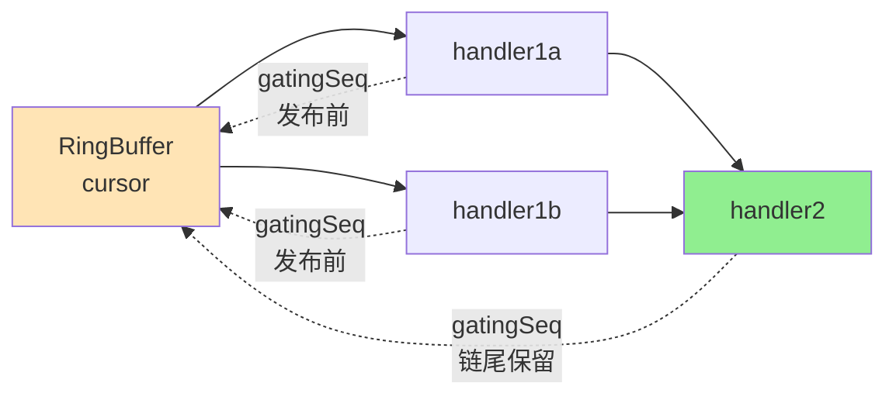

- `handler1a`、`handler1b` 直接等 RingBuffer cursor，所以它们的 Barrier 的 `dependentSequence = cursorSequence`。
- `handler2` 必须等 `handler1a` 和 `handler1b` 都处理完，所以它的 Barrier 的 `dependentSequence = FixedSequenceGroup([seq1a, seq1b])`。
- 一旦 `handler2` 注册，`handler1a/1b` 的 sequence 就从 `gatingSequences` 中移除（被 `handler2` 取代），这样生产者只需要等最慢的 `handler2`。

---

## 十、完整工作流程时序图

### 10.1 单生产者 → 单消费者场景

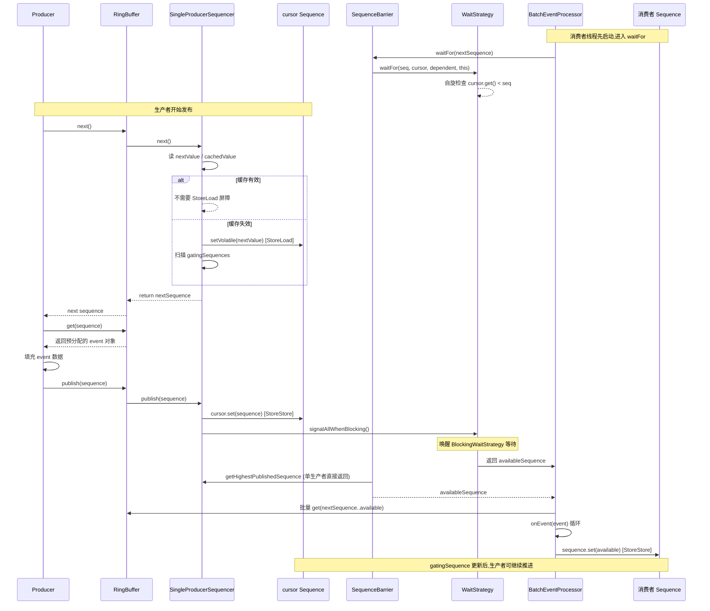

### 10.2 多生产者场景的差异

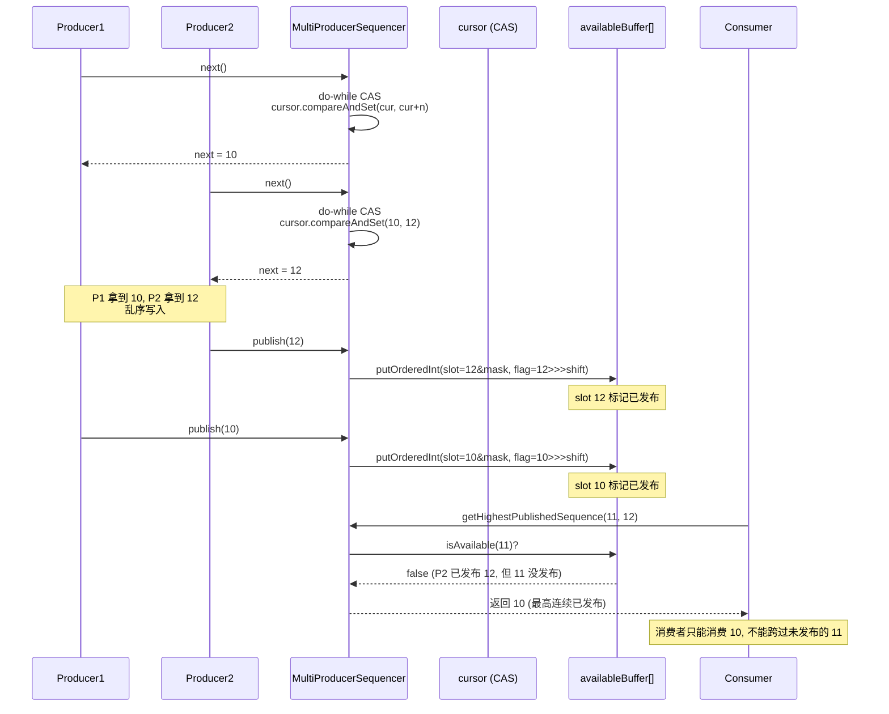

---

## 十一、与 JDK 普通队列的性能对比

以 `ArrayBlockingQueue` 为对照：

### 11.1 锁竞争对比

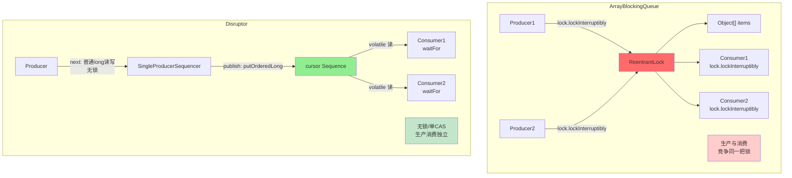

**关键差异：**
- `ArrayBlockingQueue` 的 `put` 和 `take` 都要 `lock.lockInterruptibly()`，**生产者和消费者竞争同一把 ReentrantLock**，序列化执行。
- Disruptor 单生产者场景：生产者完全无锁，消费者只读 `cursor` 的 volatile 值，**生产与消费并行**。

### 11.2 内存布局对比

| 项 | ArrayBlockingQueue | Disruptor |
|----|---------------------|-----------|
| 队列元素 | 用户 `new Object()` 放进数组 | 预分配，复用，零 GC |
| 锁字段 | `ReentrantLock` 与 `Object[] items` 紧邻，**易伪共享** | Sequence 全缓存行填充，**无伪共享** |
| 数组边界 | 每次访问做 `bounds check` | `Unsafe.getObject` 直接访问，**绕过检查** |
| 槽位定位 | `putIndex % capacity` 取模 | `sequence & (size-1)` 位运算 |

### 11.3 内存屏障开销对比

| 操作 | ArrayBlockingQueue | Disruptor 单生产者 |
|------|-------------------|-------------------|
| 入队 1 个 | `lock.lock` → CAS state → 写 items → `notEmpty.signal` → `lock.unlock` 共多次 CAS + 全屏障 | `nextValue += 1`（普通 long 加）+ `cursor.set` (StoreStore) |
| 出队 1 个 | `lock.lock` → 读 items → `notFull.signal` → `lock.unlock` | `cursor.get()` (volatile 读) + `sequence.set` (StoreStore) |
| 批量 | 一次一个 | 批量申请、批量发布、批量消费 |

### 11.4 性能差异来源汇总

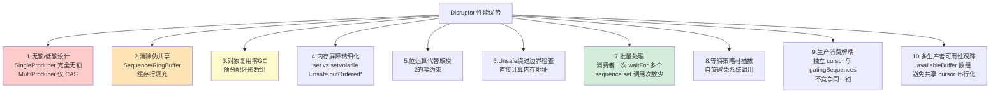

### 11.5 量化对比（典型场景）

| 指标 | ArrayBlockingQueue | Disruptor (BusySpin) | 倍数 |
|------|--------------------|----------------------|------|
| 单生产单消费吞吐 | ~5M ops/s | ~25M ops/s | 5x |
| P99 延迟 | 数十 μs | <1 μs | 50x |
| GC 频率 | 高 | 几乎无 | - |
| CPU 占用 | 中 | 高（自旋） | - |

---

## 十二、设计精髓总结

### 12.1 核心思想

Disruptor 的核心思想是 **"对每一个共享变量的写都要付出代价，所以能不写就不写，能弱屏障就不强屏障，能不共享就不共享"**。具体体现为：

1. **共享最小化**
   - `SingleProducerSequencer` 的 `nextValue`/`cachedValue` 是普通 long —— 既然只有一个生产者，何必共享？
   - 多生产者下 `availableBuffer` 每槽独立，避免多生产者共享同一"已发布标志"。

2. **屏障精确化**
   - `set` (StoreStore) 用于普通发布
   - `setVolatile` (StoreLoad) 仅在跨线程需要强可见性时用
   - JDK 的 `volatile` 写总是 StoreLoad，过于昂贵

3. **缓存行友好**
   - 所有热字段（cursor、gatingSequences、nextValue）都被 7×8=56 字节 padding 包围
   - RingBuffer 数组前后各 128 字节 padding

4. **预分配复用**
   - 事件对象在初始化时全部 new 出来
   - 后续只修改字段，不创建对象，几乎无 GC 停顿

5. **批量思维**
   - 生产者 `next(int n)` 批量申请
   - 消费者一次 `waitFor` 拿一批，一次 `sequence.set` 提交一批
   - 减少同步原语调用次数

### 12.2 核心机制对应源码速查表

| 机制 | 关键源码位置 |
|------|------------|
| 缓存行填充 | `Sequence.java:23-36`、`RingBuffer.java:24-27,106`、`SingleProducerSequencer.java:22-30,56` |
| 位运算定位 | `RingBuffer.java:77,90-94`、`MultiProducerSequencer.java:295-298` |
| Unsafe 直接内存访问 | `Sequence.java:80,102,115,127`、`RingBuffer.java:93`、`MultiProducerSequencer.java:261,273` |
| StoreStore 屏障（putOrdered） | `Sequence.java:102`、`MultiProducerSequencer.java:261` |
| StoreLoad 屏障（setVolatile） | `Sequence.java:115`、`SingleProducerSequencer.java:89,132` |
| CAS 申请序列号 | `MultiProducerSequencer.java:142` |
| availableBuffer 可用性跟踪 | `MultiProducerSequencer.java:43,253-262,268-288` |
| 批量处理 | `BatchEventProcessor.java:159-172`、`RingBuffer.java:622,672,726` |
| 消费者依赖图 | `Disruptor.java:548-589`、`ProcessingSequenceBarrier.java:40-47`、`FixedSequenceGroup.java:44-48` |
| 等待策略 | `WaitStrategy.java`、`BlockingWaitStrategy.java:35-63`、`BusySpinWaitStrategy.java:30-43` |
| PAUSE 指令提示 | `util/ThreadHints.java:62-76` |

### 12.3 适用场景与局限

**适用：**
- 高吞吐事件流（金融交易、日志、消息总线）
- 低延迟敏感型应用
- 单/少生产者 + 多消费者流水线
- 可预测的内存布局需求

**不适用：**
- 事件稀疏且要求 CPU 友好（应使用 BlockingWaitStrategy）
- 需要事件优先级、需要阻塞生产者（不推荐）
- 极度不可预测的事件大小（环形数组大小固定）

---

## 附录：源码版本与文件清单

| 类别 | 文件 |
|------|------|
| 存储 | `RingBuffer.java`、`DataProvider.java` |
| 序列号 | `Sequence.java`、`SequenceGroup.java`、`FixedSequenceGroup.java`、`SequenceGroups.java` |
| 协调器 | `Sequencer.java`、`AbstractSequencer.java`、`SingleProducerSequencer.java`、`MultiProducerSequencer.java` |
| 等待 | `WaitStrategy.java`、`BlockingWaitStrategy.java`、`BusySpinWaitStrategy.java`、`YieldingWaitStrategy.java`、`SleepingWaitStrategy.java`、`LiteBlockingWaitStrategy.java`、`TimeoutBlockingWaitStrategy.java`、`PhasedBackoffWaitStrategy.java` |
| 屏障 | `SequenceBarrier.java`、`ProcessingSequenceBarrier.java` |
| 消费者 | `EventProcessor.java`、`BatchEventProcessor.java`、`WorkProcessor.java`、`WorkerPool.java`、`EventPoller.java` |
| DSL | `dsl/Disruptor.java`、`dsl/EventHandlerGroup.java`、`dsl/ConsumerRepository.java`、`dsl/ConsumerInfo.java`、`dsl/EventProcessorInfo.java`、`dsl/WorkerPoolInfo.java` |
| 工具 | `util/Util.java`、`util/ThreadHints.java`、`util/DaemonThreadFactory.java` |

---

**文档完**

本文基于 Disruptor 3.4.4 源码逐行分析，所有源码引用均标注了文件名与行号，可直接对照阅读。
