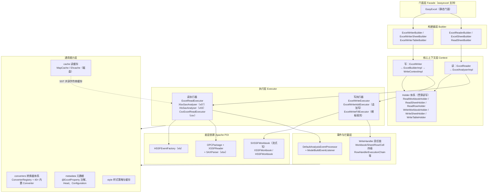
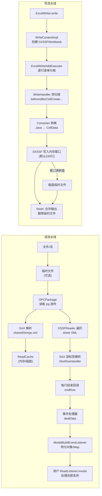
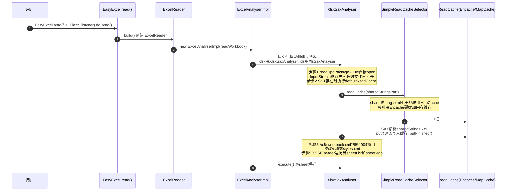
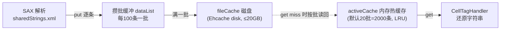
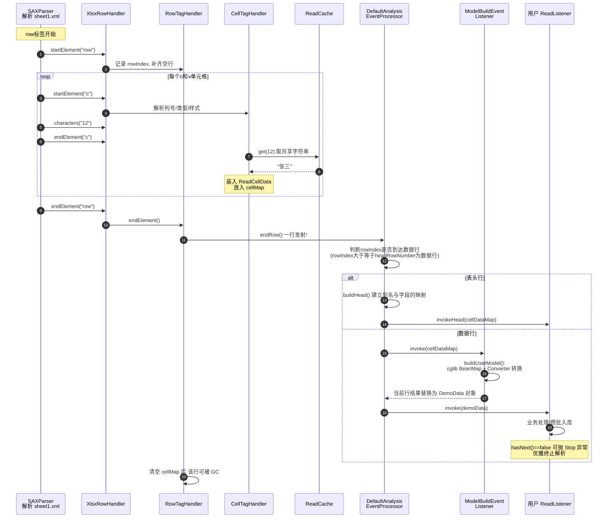
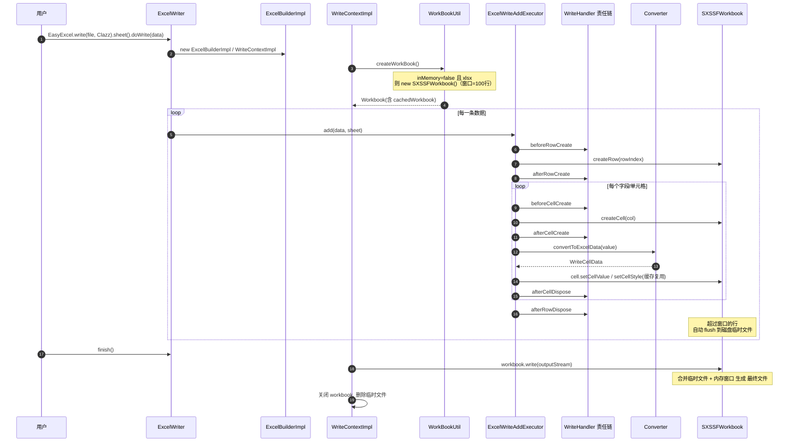
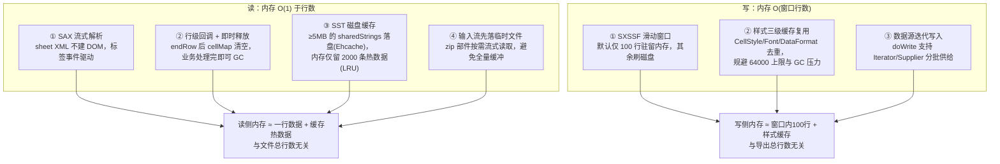

# EasyExcel 4.0.3 源码深度解析

> 基于 `easyexcel-4.0.3` 源码（模块 `easyexcel-core`）编写，所有结论均可在源码中找到对应位置，文中标注了 `类名:行号`。

---

## 目录

1. [项目简介](#一项目简介)
2. [功能特点](#二功能特点)
3. [使用示例](#三使用示例)
4. [整体架构](#四整体架构)
5. [读取流程深度剖析](#五读取流程深度剖析)
6. [写入流程深度剖析](#六写入流程深度剖析)
7. [为什么内存占用这么小（核心原理总结）](#七为什么内存占用这么小核心原理总结)
8. [性能与设计亮点、局限](#八性能与设计亮点局限)
9. [附录：关键类索引](#九附录关键类索引)

---

## 一、项目简介

EasyExcel 是阿里巴巴开源的 Java Excel 处理框架，基于 **Apache POI** 二次封装。它诞生的核心动机是：**POI 的 userModel（`XSSFWorkbook`/`HSSFWorkbook`）在解析大文件时会把整个 DOM 树加载进内存，一个几 MB 的 Excel 可能膨胀出几 GB 的内存占用，极易 OOM**。

EasyExcel 重写了 POI 之上的解析/写入层：

- **读**：不用 POI 的 `XSSFWorkbook`（DOM 方式），而是直接使用 POI 的底层事件模型（`OPCPackage` + `XSSFReader` + SAX / `HSSFEventFactory`），逐行流式解析，每解析完一行就回调给业务代码，业务处理完后该行即可被 GC。
- **写**：默认使用 POI 的 `SXSSFWorkbook`（流式滑动窗口写），超过窗口的行自动刷到磁盘临时文件。

> 补充：2023 年底阿里宣布 easyexcel 进入维护模式（4.0.3 是其最后的稳定版本之一），原作者另起项目 **FastExcel**（包名 `cn.idev.excel`），API 与 EasyExcel 高度兼容。本文分析的是 easyexcel-4.0.3 本体。

**项目模块划分：**

| 模块 | 说明 |
|---|---|
| `easyexcel-core` | 核心实现（本文分析对象），唯一的重逻辑模块 |
| `easyexcel-support` | 无关紧要的支撑类（对 POI 的 shaded 补充，如 cglib BeanMap） |
| `easyexcel-test` | 测试用例，也是最好的官方示例集 |
| `easyexcel` | 聚合/兼容模块 |

---

## 二、功能特点

| 特性 | 说明 |
|---|---|
| **低内存读写** | 64M 堆内存即可稳定处理 75M（百万行级）Excel，读一行处理一行 |
| **xlsx / xls / csv** | 三种格式统一 API，自动识别文件类型选择解析器 |
| **注解驱动** | `@ExcelProperty`、`@ExcelIgnore`、`@ContentStyle`、`@NumberFormat`、`@DateTimeFormat` 等，模型映射零配置 |
| **高性能** | SAX 事件解析 + 共享字符串磁盘缓存 + 写侧样式缓存复用 |
| **修复 POI 已知坑** | 修复了 POI 对 1904 日期窗口、SST 索引等场景的兼容问题 |
| **模板填充** | `{name}` / `{.name}` 占位符，支持集合循环填充，保留模板样式 |
| **可扩展** | 读写两侧均有完整的拦截器链（`ReadListener` / 4 种 `WriteHandler`），转换器可自定义注册 |
| **Web 友好** | `ExcelReaderBuilder`/`ExcelWriterBuilder` 可直接接收 `HttpServletRequest`/`Response` 输入输出流 |
| **读能力丰富** | 多 sheet、多级表头、异步/分批监听（`PageReadListener`）、读取批注/超链接/合并单元格、错误恢复（`onException`） |

---

## 三、使用示例

### 3.1 快速写入

```java
public class DemoData {
    @ExcelProperty("姓名")
    private String name;
    @ExcelProperty("年龄")
    private Integer age;
    @DateTimeFormat("yyyy-MM-dd")
    @ExcelProperty("生日")
    private Date birthday;
    @ExcelIgnore                        // 该字段不导出
    private String password;
}

// 一行代码写出（默认 xlsx，默认 SXSSF 流式写）
String fileName = "demo.xlsx";
EasyExcel.write(fileName, DemoData.class)
        .sheet("模板")
        .doWrite(() -> {
            List<DemoData> list = new ArrayList<>();
            for (int i = 0; i < 100_0000; i++) {
                list.add(new DemoData("user" + i, i, new Date()));
            }
            return list;                // Supplier 形式，分批获取数据，避免内存堆积
        });
```

### 3.2 流式读取（核心用法）

```java
public class DemoDataListener implements ReadListener<DemoData> {

    private static final int BATCH_SIZE = 3000;
    private List<DemoData> cached = new ArrayList<>(BATCH_SIZE);

    @Override
    public void invoke(DemoData data, AnalysisContext context) {
        cached.add(data);
        if (cached.size() >= BATCH_SIZE) {
            saveToDb(cached);            // 攒批入库
            cached = new ArrayList<>(BATCH_SIZE); // 释放引用，让 GC 回收
        }
    }

    @Override
    public void doAfterAllAnalysed(AnalysisContext context) {
        saveToDb(cached);                // 收尾
    }

    @Override
    public void onException(Exception e, AnalysisContext context) {
        // 默认抛出即中断解析；此处可记录并跳过，实现错误容忍
        if (e instanceof ExcelDataConvertException) {
            log.warn("第 {} 行转换失败: {}",
                context.readRowHolder().getRowIndex(), e.getMessage());
        } else {
            throw new ExcelAnalysisException(e);
        }
    }
}

EasyExcel.read(fileName, DemoData.class, new DemoDataListener())
        .sheet()                          // 默认读第一个 sheet
        .headRowNumber(1)                 // 表头占 1 行
        .doRead();
```

### 3.3 多 Sheet / 指定列 / 读为 Map

```java
// 读为 Map<Integer, String>，无需定义实体
EasyExcel.read(fileName)
        .sheet(0)
        .headRowNumber(0)
        .registerReadListener(new AnalysisEventListener<Map<Integer, String>>() {
            @Override
            public void invoke(Map<Integer, String> data, AnalysisContext ctx) { ... }
            @Override
            public void doAfterAllAnalysed(AnalysisContext ctx) { ... }
        }).doRead();

// 精确控制读哪个 sheet
try (ExcelReader excelReader = EasyExcel.read(fileName).build()) {
    ReadSheet sheet1 = EasyExcel.readSheet(0)
            .head(DemoData.class)
            .registerReadListener(listener1)
            .build();
    ReadSheet sheet2 = EasyExcel.readSheet(2).build();
    excelReader.read(sheet1, sheet2);
}
```

### 3.4 模板填充

```java
// 模板单元格中写 {name} {age}；列表行写 {.name} {.age} 表示逐行填充集合
EasyExcel.fill("template.xlsx", dataMap, "filled.xlsx");

// 复杂场景：填充 + 追加写在同一个 workbook
try (ExcelWriter excelWriter = EasyExcel.write(fileName).withTemplate(template).build()) {
    WriteSheet writeSheet = EasyExcel.writerSheet().build();
    FillConfig fillConfig = FillConfig.builder().forceNewRow(false).build();
    excelWriter.fill(listData, fillConfig, writeSheet);   // 填充集合
    excelWriter.fill(mapData, writeSheet);                 // 填充普通变量
}
```

### 3.5 Web 上传 / 下载

```java
// 下载
EasyExcel.write(response.getOutputStream(), DemoData.class)
        .sheet("sheet1").doWrite(dataList);

// 上传
EasyExcel.read(file.getInputStream(), DemoData.class, listener).sheet().doRead();
```

---

## 四、整体架构

### 4.1 分层架构图



### 4.2 读 / 写两条流水线总览



### 4.3 源码包结构（easyexcel-core）

```
com.alibaba.excel
├── analysis          # 读解析：ExcelAnalyserImpl + v03(xls)/v07(xlsx)/csv 三套执行器
│   └── v07/handlers  # SAX 标签处理器（Row/Cell/CellValue/Formula/Hyperlink/Merge...）
├── cache             # SST 共享字符串缓存：MapCache、Ehcache、ReadCacheSelector
├── context           # 读写上下文（AnalysisContext、WriteContext、各 Holder）
├── annotation        # @ExcelProperty、@ExcelIgnoreUnannotated、@ContentStyle 等
├── converters        # 双向类型转换器（read: CellData→Java；write: Java→CellData）
├── metadata          # 元数据模型（Head、Cell、Configuration、data.ReadCellData...）
├── read              # 读侧：builder、listener、metadata.holder、processor
├── write             # 写侧：builder、executor、handler、metadata.holder、style
├── event             # AnalysisEventListener、Reducer 的基础事件类
├── enums / constant / util / exception / support
```

### 4.4 贯穿全局的设计模式

| 模式 | 应用位置 | 作用 |
|---|---|---|
| **门面模式** | `EasyExcel` | 一行代码 API，屏蔽 Builder/Context/Analyser 细节 |
| **建造者模式** | `ExcelReaderBuilder` → `ExcelWriterBuilder` 及 Sheet/Table 三级 Builder | 链式配置，按作用域分层（workbook 配置可被 sheet 覆盖，sheet 可被 table 覆盖） |
| **策略模式** | `ExcelReadExecutor` 三个实现；`ReadCache` 三个实现；`Converter` 40+ 实现 | 按文件格式/缓存需求/类型自由替换 |
| **观察者/事件驱动** | SAX 事件 → `XlsxTagHandler`；`ReadListener` 回调 | 读侧解耦：解析器只产事件，业务只关心行数据 |
| **责任链模式** | `WriteHandler` 4 级 × 执行链（`RowHandlerExecutionChain` 等） | 写侧 AOP：样式、列宽、行高、批注等横切逻辑可插拔 |
| **模板方法** | `AbstractCellStyleStrategy`、`AbstractColumnWidthStyleStrategy` | 固化"何时设样式"骨架，开放"设什么样式" |
| **享元/缓存** | `WriteWorkbookHolder` 样式三级缓存；读侧 `ReadCache` | 复用昂贵对象（CellStyle 有 64000 上限） |
| **工厂方法** | `WorkBookUtil.createWorkBook()` | 按类型 + inMemory + 模板条件创建 POI Workbook |

---

## 五、读取流程深度剖析

### 5.1 前置知识：xlsx 文件的本质

xlsx 是一个 **zip 包**，内部是一组 XML（OOXML 标准）：

```
demo.xlsx (zip)
├── [Content_Types].xml
├── _rels/
├── xl/
│   ├── workbook.xml          # sheet 清单、日期窗口(1904)
│   ├── sharedStrings.xml     # ★ 共享字符串表 SST：全文件所有字符串去重集中存放
│   ├── styles.xml            # 样式表
│   └── worksheets/sheet1.xml # ★ 单元格数据，字符串只存 SST 索引
└── docProps/
```

`sheet1.xml` 中一个单元格长这样：

```xml
<row r="1">
  <c r="A1" t="s"><v>12</v></c>   <!-- t="s"：值 12 是 SST 的下标 -->
  <c r="B1"><v>3.14</v></c>        <!-- 数字直接内联 -->
</row>
```

**大文件 OOM 的根源正在于此**：POI 的 `XSSFWorkbook` 会把 sheet XML 完整解析成 DOM、把 `sharedStrings.xml` 全量加载成 `SharedStrings` 对象，再加上每个 Cell/Style 对象的包装开销，内存放大倍数通常是文件体积的 **几十到上百倍**。EasyExcel 的对策见下文。

### 5.2 读侧启动流程



源码要点：

- `XlsxSaxAnalyser` 构造函数（`XlsxSaxAnalyser.java:84-145`）完成上述 ①~⑤。
- **临时文件策略**（`readOpcPackage`, `XlsxSaxAnalyser.java:188-210`）：

```java
private OPCPackage readOpcPackage(...) {
    if (decryptedStream == null && workbookHolder.getFile() != null) {
        return OPCPackage.open(workbookHolder.getFile());          // 有 File 直接用，零拷贝
    }
    if (workbookHolder.getMandatoryUseInputStream()) {
        return OPCPackage.open(workbookHolder.getInputStream());   // 强制流模式
    }
    // 默认：把流写入临时文件，再以只读方式打开 zip
    File tempFile = new File(readTempFile.getPath(), UUID.randomUUID() + ".xlsx");
    FileUtils.writeToFile(tempFile, workbookHolder.getInputStream(), ...);
    return OPCPackage.open(tempFile, PackageAccess.READ);
}
```

> 为什么先落盘？`OPCPackage.open(InputStream)` 在 POI 内部同样会缓冲到内存，且 zip 的随机访问依赖文件句柄。先写临时文件可以让后续所有部件（sheet XML、SST）按需以流方式读取，内存中不持有整体数据；解析完毕后 `finish()` 统一删除。

- **XXE 防护**（`parseXmlSource`, `XlsxSaxAnalyser.java:227-235`）：SAX 工厂显式关闭 `doctype-decl`、外部实体，防 XML 注入。

### 5.3 SST 共享字符串的缓存体系（读侧省内存的关键之一）

**问题**：单元格只存 SST 下标，取真实字符串必须能 `get(index)`。如果像 POI 一样把 SST 全量驻留内存，千万级去重字符串照样 OOM。

**EasyExcel 的方案**：`ReadCache` 抽象 + 自动选择（`cache/selector/SimpleReadCacheSelector.java:77-111`）：

```
sharedStrings.xml 解压后大小 < 5MB  →  MapCache（纯内存 ArrayList）
sharedStrings.xml 解压后大小 ≥ 5MB  →  Ehcache（内存热缓存 + 磁盘全量缓存）
```

`Ehcache`（`cache/Ehcache.java`）的实现非常精巧：

```java
public class Ehcache implements ReadCache {
    public static final int BATCH_COUNT = 100;      // 每批 100 条字符串
    private ArrayList<String> dataList;             // 当前攒批缓冲

    @Override
    public void put(String value) {                 // :116-129
        dataList.add(value);
        if (dataList.size() >= BATCH_COUNT) {
            fileCache.put(activeIndex, dataList);   // 攒满一批 → 写入磁盘缓存
            activeIndex++;
            dataList = new ArrayList<>(BATCH_COUNT);
        }
    }

    @Override
    public String get(Integer key) {                // :132-148
        int route = key / BATCH_COUNT;              // 定位第几批
        ArrayList<String> dataList = activeCache.get(route);  // 先查内存热缓存
        if (dataList == null) {                     // miss
            dataList = fileCache.get(route);        // 从磁盘读回该批 100 条
            activeCache.put(route, dataList);       // 提升进热缓存
        }
        return dataList.get(key % BATCH_COUNT);
    }
}
```

要点：

- **磁盘缓存**配置为 `disk(20, MemoryUnit.GB)`（`Ehcache.java:86-88`），即最多 20GB 的 SST 落在磁盘，堆内完全不持有全量字符串。
- **内存热缓存**默认只保留 `20 批 × 100 条 = 2000` 条字符串（`SimpleReadCacheSelector.java:40`），以 LRU 淘汰。由于同一行/相邻行的字符串往往集中分布（局部性原理），命中率极高。
- `destroy()`（`Ehcache.java:159-162`）在读取结束时移除磁盘缓存目录。



### 5.4 SAX 事件分发：一行数据是如何诞生的

EasyExcel 没有使用 POI 的 `XSSFSheetXMLHandler`，而是自己实现了一套更轻的分发器 `XlsxRowHandler`（`analysis/v07/handlers/sax/XlsxRowHandler.java`）：

```java
public class XlsxRowHandler extends DefaultHandler {
    // 标签名 → 处理器 的静态注册表（无状态处理器全局复用）
    private static final Map<String, XlsxTagHandler> XLSX_CELL_HANDLER_MAP = new HashMap<>(64);

    @Override
    public void startElement(..., String name, Attributes attributes) {
        XlsxTagHandler handler = XLSX_CELL_HANDLER_MAP.get(name);   // O(1) 路由
        if (handler == null || !handler.support(xlsxReadContext)) return;
        xlsxReadContext.xlsxReadSheetHolder().getTagDeque().push(name); // 标签栈
        handler.startElement(xlsxReadContext, name, attributes);
    }
    // characters(): 出栈顶标签名 → 调 handler.characters() 收集文本
    // endElement():  调 handler.endElement() 后弹栈
}
```

注册的处理器（`XlsxRowHandler.java:31-64`）：

| XML 标签 | 处理器 | 职责 |
|---|---|---|
| `<row>` | `RowTagHandler` | 记录行号；**endElement 时触发行回调**（整个流水线的"心跳"） |
| `<c>` | `CellTagHandler` | 解析 `r`/`t`/`s` 属性 → 列号、类型、样式索引；endElement 时按类型装箱 |
| `<v>` | `CellValueTagHandler` | 收集单元格原始文本值 |
| `<f>` | `CellFormulaTagHandler` | 处理公式（读缓存值或公式串） |
| `<is><t>` | `CellInlineStringValueTagHandler` | 内联字符串（无 SST 的文件） |
| `<dimension>` | `CountTagHandler` | 记录表格尺寸 |
| `<hyperlink>` | `HyperlinkTagHandler` | 超链接附加信息 |
| `<mergeCell>` | `MergeCellTagHandler` | 合并单元格附加信息 |

`CellTagHandler.endElement()` 中类型装箱的关键逻辑：

```java
case STRING:   // t="s"：值是 SST 下标 → 查 ReadCache
    tempCellData.setStringValue(
        readWorkbookHolder.getReadCache().get(Integer.valueOf(tempDataString)));
    break;
case NUMBER:   // 数字：用 BigDecimal 承载，并做精度约束
    tempCellData.setOriginalNumberValue(new BigDecimal(tempDataString));
    tempCellData.setNumberValue(
        tempCellData.getOriginalNumberValue().round(EasyExcelConstants.EXCEL_MATH_CONTEXT));
    break;
```

**行回调触发点** —— `RowTagHandler.endElement()`（`RowTagHandler.java:43-69`）：

```java
@Override
public void endElement(XlsxReadContext xlsxReadContext, String name) {
    // 1. 根据本行 cellMap 是否全空，判定 RowTypeEnum.EMPTY / DATA
    // 2. 包装成 ReadRowHolder（行号 + cellMap + 全局配置）
    xlsxReadContext.readRowHolder(new ReadRowHolder(rowIndex, rowType, config, cellMap));
    // 3. ★ 交给事件处理器 —— 一行就此"发射"出去
    xlsxReadContext.analysisEventProcessor().endRow(xlsxReadContext);
    // 4. 立即清空 cellMap/columnIndex，本行数据不再被引用 → 可被 GC
    xlsxReadSheetHolder.setColumnIndex(null);
    xlsxReadSheetHolder.setCellMap(new LinkedHashMap<>());
}
```

注意 `startElement`（`RowTagHandler.java:26-40`）还会**补齐空行**：如果 XML 中行号从 3 跳到 7（中间是空行，Excel 不会为全空行输出 `<row>`），会循环发出 4 个 EMPTY 行事件，保证用户监听器看到的行号连续。

### 5.5 事件处理器与监听器链

`endRow` 之后进入 `DefaultAnalysisEventProcessor`（`read/processor/DefaultAnalysisEventProcessor.java`）：

```java
@Override
public void endRow(AnalysisContext analysisContext) {
    if (RowTypeEnum.EMPTY.equals(...getRowType())
            && analysisContext.readWorkbookHolder().getIgnoreEmptyRow()) {
        return;                                   // 空行可配置忽略
    }
    dealData(analysisContext);
}

private void dealData(AnalysisContext analysisContext) {   // :92-121
    int rowIndex = readRowHolder.getRowIndex();
    int headRowNumber = sheetHolder.getHeadRowNumber();
    boolean isData = rowIndex >= headRowNumber;

    // 最后一行表头 → 建立列名→字段 的映射
    if (!isData && headRowNumber == rowIndex + 1) {
        buildHead(analysisContext, cellDataMap);
    }
    for (ReadListener readListener : currentReadHolder().readListenerList()) {
        if (isData) {
            readListener.invoke(currentRowAnalysisResult, analysisContext);
        } else {
            readListener.invokeHead(cellDataMap, analysisContext);
        }
        // ...
        if (!readListener.hasNext(analysisContext)) {
            throw new ExcelAnalysisStopException();  // hasNext=false → 优雅停止解析
        }
    }
}
```

**监听器链的第 0 号成员永远是 `ModelBuildEventListener`**（`read/listener/ModelBuildEventListener.java:33-41`）——它是一个"变换器监听器"：

```java
@Override
public void invoke(Map<Integer, ReadCellData<?>> cellDataMap, AnalysisContext context) {
    if (HeadKindEnum.CLASS.equals(...getHeadKind())) {
        // 有实体类：反射实例化 + BeanMap(cglib) 赋值
        context.readRowHolder().setCurrentRowAnalysisResult(buildUserModel(...));
        return;
    }
    // 无实体类：转 Map<Integer,Object>（STRING / BigDecimal / LocalDateTime / Boolean）
    context.readRowHolder().setCurrentRowAnalysisResult(buildNoModel(...));
}
```

- `buildUserModel`（`ModelBuildEventListener.java`）：`newInstance()` 创建对象 → `BeanMapUtils.create(resultModel)` 生成 cglib BeanMap（避免逐字段反射 set）→ 遍历 `headMap`，每个字段调 `ConverterUtils.convertToJavaObject` 完成 `ReadCellData → Java 字段类型` 的转换（数字→日期的判断依据是 `DateUtils.isADateFormat`，见 `convertReadCellData`, `:96-102`）。
- **关键点**：链式调用使得第 0 号（ModelBuild）先把 `Map<Integer,ReadCellData>` 变换成目标类型，存回 `currentRowAnalysisResult`，后续用户 listener 拿到的 `invoke(T data)` 已经是成品对象。**转换后的一行数据在被下一个监听器处理后即失去引用，随 cellMap 一起被 GC**。

**表头匹配（`buildHead`, `DefaultAnalysisEventProcessor.java:123-167`）**：
- 注解只写了列名（`forceName=true`）→ 在最后一行表头里**按名字匹配**实际列下标（支持 `autoTrim`），这意味着 Excel 列顺序变化不影响读取；
- 注解写了 `index`（`forceIndex=true`）→ 严格按下标；
- 同时记录 `maxNotEmptyDataHeadSize`（最大非空表头列数），无模型模式下用于对齐 Map 长度。

### 5.6 完整读取时序图



### 5.7 xls（BIFF）与 csv 的读取差异

- **xls**（`analysis/v03/XlsSaxAnalyser.java`）：走 POI **HSSF 事件模型**。xls 是二进制复合文档（BIFF record 流），`HSSFRequest.addListenerForAllRecords(...)` 后由 `HSSFEventFactory.processWorkbookEvents()` 逐 record 推给 `XlsSaxAnalyser`（其自身即 HSSFListener）。SST 对应 `SSTRecord`，同样写入 `ReadCache`；字符串单元格对应 `LabelSstRecord`（索引）/`LabelRecord`（内联）；日期数字→日期的判定靠 `FormatTrackingHSSFListener` 追踪的格式索引。**天然流式，无需临时文件**。
- **csv**（`analysis/csv/CsvExcelReadExecutor.java`）：纯文本逐行 split，无样式/公式概念，同样复用监听器体系。

| 维度 | xls（BIFF） | xlsx（OOXML） |
|---|---|---|
| 格式 | 二进制复合文档 | zip + XML |
| 解析 | HSSFEventFactory record 事件 | SAX XML 事件 |
| SST | SSTRecord → ReadCache | sharedStrings.xml → ReadCache |
| 临时文件 | 不需要 | 流输入时默认需要 |
| 加密 | 传统 BIFF8 解密 | OPCPackage 标准加密 |

### 5.8 资源回收

`ExcelAnalyserImpl.finish()` 统一收尾：销毁 `ReadCache`（删磁盘缓存目录）→ `opcPackage.revert()`（POI 专用低开销关闭，不写回）→ 按配置关闭输入流 → 删除读临时文件。`ExcelReader` 实现了 `Closeable`，`doRead()` 一把梭的 API 内部 `finally` 中保证执行。

---

## 六、写入流程深度剖析

### 6.1 Workbook 的创建：SXSSF 是默认选择

`WriteContextImpl` 构造时调用 `WorkBookUtil.createWorkBook()`（`util/WorkBookUtil.java`），决策逻辑：

```java
case XLSX:
    if (tempTemplateInputStream != null) {                 // ① 模板填充场景
        XSSFWorkbook xssf = new XSSFWorkbook(template);    //    模板必须整体读入 XSSF
        writeWorkbookHolder.setCachedWorkbook(xssf);
        if (writeWorkbookHolder.getInMemory()) {
            writeWorkbookHolder.setWorkbook(xssf);
        } else {
            writeWorkbookHolder.setWorkbook(new SXSSFWorkbook(xssf)); // 包装成 SXSSF
        }
        return;
    }
    // ② 普通写出
    Workbook workbook = writeWorkbookHolder.getInMemory()
        ? new XSSFWorkbook()            // 内存模式：完整 DOM，支持注释/富文本等高级特性
        : new SXSSFWorkbook();          // ★ 默认：流式滑动窗口写
    ...
case XLS:  return new HSSFWorkbook();
case CSV:  return new CsvWorkbook();    // 自研 csv 输出
```

**SXSSFWorkbook 滑动窗口原理**（POI 机制，EasyExcel 默认启用）：

- 内存中只保留**最近 N 行**（默认 `SXSSFWorkbook()` = 100 行）的 `Row` 对象，可用 `writeWorkbookHolder` 相关参数调整；
- 窗口外的行被序列化成 XML 追加写入磁盘临时文件（`SXSSFSheet.flushRows()`），内存中的 `Row` 被置为不可再修改的"已刷出"状态并释放数据；
- 最终 `workbook.write(out)` 时把临时文件中的行 XML 与内存中的剩余部分合并成合法的 sheet XML 输出；
- Excel 单元格值在 XML 里本来就只存 SST 索引或内联值，行刷盘后 JVM 堆里就只剩极小的窗口数据 → **写入侧内存与总行数无关，近似 O(100 行)**。

`inMemory=true` 的适用场景：需要写批注、富文本、图表等 XSSF 高级能力，且数据量可控。模板填充默认会把模板读成 XSSF（`cachedWorkbook`），新数据仍通过 SXSSF 窗口写出，兼顾"模板整体可编辑"与"填充大数据不 OOM"。

### 6.2 写一行数据的完整调用链

`ExcelWriteAddExecutor.addOneRowOfDataToExcel()`（`write/executor/ExcelWriteAddExecutor.java`）：

```java
private void addOneRowOfDataToExcel(Object oneRowData, int rowIndex, int relativeRowIndex) {
    // 1. Row 级责任链：beforeRowCreate
    RowWriteHandlerContext ctx = WriteHandlerUtils.createRowWriteHandlerContext(...);
    WriteHandlerUtils.beforeRowCreate(ctx);

    // 2. 创建 POI Row（SXSSF 窗口内）
    Row row = WorkBookUtil.createRow(writeContext.writeSheetHolder().getSheet(), rowIndex);
    ctx.setRow(row);
    WriteHandlerUtils.afterRowCreate(ctx);

    // 3. 按数据类型分发
    if (oneRowData instanceof Collection) addBasicTypeToExcel(new CollectionRowData(...), ...);
    else if (oneRowData instanceof Map)    addBasicTypeToExcel(new MapRowData(...), ...);
    else                                   addJavaObjectToExcel(oneRowData, ...);

    // 4. Row 级责任链：afterRowDispose（此时行数据已全部写入）
    WriteHandlerUtils.afterRowDispose(ctx);
}
```

单个单元格（`doAddBasicTypeToExcel` / `addJavaObjectToExcel` 内部）：

```
beforeCellCreate  →  WorkBookUtil.createCell(row, col)  →  afterCellCreate
→  converterAndSet(ctx)          ★ 类型转换 + 写值
→  afterCellDispose              （FillStyleCellWriteHandler 等在此改样式）
```

`converterAndSet` 的核心：从 `ConverterRegistry` 按 `(Java字段类型, Excel类型)` 二元组取出 `Converter`，把 Java 值转成 `WriteCellData`（value + dataFormat + style 相关信息），再落到 POI Cell 上。40+ 内置转换器覆盖 String/数值/Boolean/Date/LocalDateTime/BigDecimal/byte[]（图片）/枚举等，用户可通过 `registerConverter` 任意扩展。

### 6.3 WriteHandler 责任链（写侧最大的架构特色）

四粒度拦截点，各自有独立执行链（如 `write/handler/chain/CellHandlerExecutionChain`）：

| 拦截点 | 接口 | 典型内置实现 |
|---|---|---|
| Workbook | `WorkbookWriteHandler` | `WorkbookWriteHandler` 默认空实现；加密/Sheet 顺序等 |
| Sheet | `SheetWriteHandler` | `DefaultSheetWriteHandler`（建 sheet、冻结表头） |
| Row | `RowWriteHandler` | `DefaultRowWriteHandler`、`AutoFillRowWriteHandler` |
| Cell | `CellWriteHandler` | `FillStyleCellWriteHandler`（填充时改样式）、`LongestMatchColumnWidthStyleStrategy` 的钩子 |

样式体系完全构建在这条链上：`HorizontalCellStyleStrategy`（实现 `CellWriteHandler`）在 `afterCellDispose` 阶段把 `WriteCellStyle` 应用到单元格 —— 表头一套样式、内容循环使用样式列表，全部走缓存：

```java
// WriteWorkbookHolder 中的三级缓存
Map<Short, Map<WriteCellStyle, CellStyle>> cellStyleIndexMap; // 原样式索引+新样式 → 复用 CellStyle
Map<WriteFont, Font> fontMap;                                 // 字体复用
Map<DataFormatData, Short> dataFormatMap;                     // 数字格式复用
```

`createCellStyle()` 先查 `cellStyleIndexMap`，命中直接返回；未命中才 `StyleUtil.buildCellStyle(...)` 创建并放入缓存。**避免每个单元格都 new CellStyle** —— POI 的 CellStyle 全局上限 64000 个，且大量重复对象会显著增加 GC 压力。这是写侧在"对象数"维度的重要优化。

### 6.4 写入时序图



### 6.5 模板填充（fill）原理

`ExcelWriteFillExecutor`（`write/executor/ExcelWriteFillExecutor.java`）：

1. **模板加载**：`withTemplate()` 指定的模板被复制成临时输入流（避免污染原文件），`WorkBookUtil` 中以 XSSF 读入，再包装 SXSSF。
2. **占位符解析**（`prepareData`）：遍历模板单元格字符串，扫描 `{` `}`，支持 `\{` 转义、`{.field}` 集合前缀、一个单元格内多变量（`姓名:{name} 年龄:{age}`）。解析结果缓存为 `AnalysisCell`（rowIndex/columnIndex/variableList/onlyOneVariable），重复填充不重复解析。
3. **填充执行**（`doFill`）：
   - `onlyOneVariable`：直接取值 → Converter 转换 → 写单元格（保留模板原样式）；
   - 多变量：StringBuilder 拼接后 `setCellValue`；
   - 集合填充：`forceNewRow=true` 时对每一行调用 `shiftRows`/复制行（保留逐行样式），默认 `VERTICAL` 逐行向下、可配 `HORIZONTAL` 横向。
4. 样式：`FillStyleCellWriteHandler` 在 `afterCellDispose` 把 `WriteCellStyle` 与模板原有样式合并（`originCellStyle` 作为基底），保证"填充值 + 模板样式"共存。

---

## 七、为什么内存占用这么小（核心原理总结）

### 7.1 一图总览



### 7.2 逐条对照源码

| # | 机制 | 源码位置 | 内存效果 |
|---|---|---|---|
| 1 | SAX 事件解析，无 DOM | `XlsxSaxAnalyser.parseXmlSource:217` | sheet XML 不进堆 |
| 2 | 每行结束即回调、即清空 | `RowTagHandler.endElement:43-69` | 堆中任意时刻只有 1 行原始数据 |
| 3 | 监听器链首变换、链尾消费 | `ModelBuildEventListener.invoke:33` | 转换产物随行丢弃 |
| 4 | SST 分批落盘 + 热缓存 | `Ehcache.put/get:116/132`，阈值在 `SimpleReadCacheSelector:90` | 千万字符串只占 2000 条堆内存 |
| 5 | 输入流→临时文件 | `XlsxSaxAnalyser.readOpcPackage:200-209` | 避免流缓冲放大 |
| 6 | xls 走 HSSF record 事件 | `XlsSaxAnalyser.execute:128-142` | 二进制流天然低内存 |
| 7 | SXSSF 窗口写 | `WorkBookUtil.createWorkBook` | 写侧与总行数解耦 |
| 8 | 样式/字体/格式缓存 | `WriteWorkbookHolder` 三级 Map | 消除对象数量爆炸 |
| 9 | `revert()` 而非 `close()` 关 OPC 包 | `ExcelAnalyserImpl.finish` | 只读场景跳过写回开销 |
| 10 | `Iterator`/`Supplier` 数据源 | `doWrite(Iterator)` 重载 | 数据库游标直接对接导出 |

### 7.3 与 POI userModel 的对比

| 场景（75MB xlsx，约百万行） | POI userModel | EasyExcel |
|---|---|---|
| 全量读取 | 数 GB 堆，大概率 OOM | 峰值 ~几十 MB |
| 边读边处理 | 需自行实现 SAX，门槛高 | 监听器一行回调 |
| 全量写出 | XSSF 堆内存随行数线性增长 | SXSSF 恒定 ~百行窗口 |
| 代价 | — | 磁盘 IO（临时文件/SST 磁盘缓存）+ 无法随机回访已读行 |

---

## 八、性能与设计亮点、局限

### 亮点

1. **读写对称的分层架构**：Builder → Context/Holder → Executor → Handler/Listener → POI，两侧心智一致。
2. **三级配置作用域**：workbook → sheet → table 逐级覆盖（Holder 继承链），既支持全局默认又支持局部特化。
3. **无状态处理器复用**：`XlsxTagHandler` 注册表静态单例复用，避免每个标签 new 对象。
4. **细节防御**：XXE 关闭、`ExcelAnalysisStopException` 优雅停止、`onException` 错误容忍、空行补齐（`RowTagHandler:31-38`）、1904 日期窗口探测（`analysisUse1904WindowDate:165`）、Ehcache 临时目录被清理后的自动重建（`Ehcache.init:96-111`，Issue #2693）。
5. **享元思想贯穿**：读侧缓存字符串索引、写侧缓存样式对象，两处最容易被忽视的内存放大点都被处理。

### 局限 / 使用注意

1. 流式读是**单向的**：不能随机访问已读过的行，也不能在读时写回。
2. SST 磁盘缓存带来磁盘 IO，`get` miss 时有批读取开销；极小文件反而比 MapCache 慢——所以有 5MB 阈值自动选择。
3. SXSSF 模式下**已刷出窗口的行不可修改**；需要反复改写已有行（如事后补批注/合并）须 `inMemory=true` 并控制数据量。
4. 写侧每个单元格仍产生一个 POI `Cell` 对象（窗口内），超高列数 × 大窗口仍需关注堆占用。
5. 模板填充需将模板整体读入 XSSF（`cachedWorkbook`），超大模板本身有内存成本。

---

## 九、附录：关键类索引

| 类 | 位置（easyexcel-core `com.alibaba.excel` 下） | 一句话职责 |
|---|---|---|
| `EasyExcel` | 门面 | 一行代码入口 |
| `ExcelReader` / `ExcelWriter` | `read` / `write` | 读写 API 门面，管理生命周期 |
| `ExcelReaderBuilder` / `ExcelWriterBuilder` | `*.builder` | 链式配置 |
| `ExcelAnalyserImpl` | `analysis` | 按类型装配读执行器、统一 finish |
| `XlsxSaxAnalyser` | `analysis.v07` | xlsx 解析总控（临时文件/SST/样式/sheet 枚举/SAX） |
| `XlsSaxAnalyser` | `analysis.v03` | xls BIFF 事件解析 |
| `CsvExcelReadExecutor` | `analysis.csv` | csv 解析 |
| `XlsxRowHandler` | `analysis.v07.handlers.sax` | SAX 事件 → 标签处理器分发（含标签栈） |
| `RowTagHandler` | `analysis.v07.handlers` | 行号维护、**行回调触发点**、空行补齐 |
| `CellTagHandler` | `analysis.v07.handlers` | 单元格类型装箱（SST 查询/BigDecimal） |
| `SimpleReadCacheSelector` | `cache.selector` | 按 SST 大小选 MapCache/Ehcache（5MB 阈值） |
| `Ehcache` | `cache` | SST 内存热缓存 + 磁盘批量缓存（批=100） |
| `DefaultAnalysisEventProcessor` | `read.processor` | 行事件 → 监听器链、表头匹配 |
| `ModelBuildEventListener` | `read.listener` | `Map<Integer,ReadCellData>` → 实体/Map |
| `ExcelWriteAddExecutor` | `write.executor` | 追加写一行（Row/Cell 责任链 + Converter） |
| `ExcelWriteFillExecutor` | `write.executor` | 模板 `{}` 占位符解析与填充 |
| `WriteContextImpl` | `context` | 写上下文、finish 输出与清理 |
| `WorkBookUtil` | `util` | 按类型/inMemory/模板创建 POI Workbook（**SXSSF 决策点**） |
| `WriteWorkbookHolder` | `write.metadata.holder` | 持有 Workbook + **样式三级缓存** |
| `ConverterRegistry` | `converters` | `(Java类型, Excel类型)` → Converter 路由 |

---

*文档基于 easyexcel-4.0.3 源码静态分析整理；`测试与示例` 可参考仓库 `easyexcel-test/src/test/java/com/alibaba/easyexcel/test/demo/` 目录。*
