# Ehcache 3.10.9 源码架构与实现原理全解析

> 本文档基于本地源码 `ehcache3-3.10.9` 分析编写，涵盖：简介、功能特点、使用示例、整体架构、核心工作流程，以及**堆内（On-Heap）、堆外（Off-Heap）、磁盘（Disk）三层缓存的底层实现原理**，并配有 Mermaid 架构图、流程图与时序图。

---

## 目录

1. [简介](#1-简介)
2. [功能特点](#2-功能特点)
3. [使用示例](#3-使用示例)
4. [整体架构](#4-整体架构)
5. [核心工作流程](#5-核心工作流程)
6. [堆内缓存（On-Heap）实现原理](#6-堆内缓存on-heap实现原理)
7. [堆外缓存（Off-Heap）实现原理](#7-堆外缓存off-heap实现原理)
8. [磁盘缓存（Disk）实现原理](#8-磁盘缓存disk实现原理)
9. [过期（Expiry）与淘汰（Eviction）机制汇总](#9-过期expiry与淘汰eviction机制汇总)
10. [序列化体系](#10-序列化体系)
11. [事件、统计与容错](#11-事件统计与容错)
12. [附录：关键类索引](#12-附录关键类索引)

---

## 1. 简介

Ehcache 是 Java 生态中最流行的**进程内分布式缓存框架**之一，由 Terracotta 公司开发并维护。Ehcache 3 是一次彻底的重写（相对 Ehcache 2.x），主要特性：

- **纯 Java 实现**，零外部依赖（核心），单 jar 即可使用；
- **三级存储**：堆内（Heap）→ 堆外（Off-Heap，NIO DirectByteBuffer）→ 磁盘（Memory-Mapped File），可任意组合；
- **JSR-107（JCache）标准实现**，可通过 `javax.cache` API 使用；
- 支持通过 Terracotta 集群扩展为**分布式缓存**（本仓库中的 `clustered` 模块）；
- 内建 **CacheLoaderWriter（read-through / write-through / write-behind）**、过期策略、淘汰建议器（EvictionAdvisor）、事件监听、统计监控等企业级能力。

本仓库（3.10.9）是典型的 **Gradle 多模块工程**，`gradle.properties` 中版本号为 3.10.9。

---

## 2. 功能特点

| 能力 | 说明 | 主要入口 |
|---|---|---|
| 三层存储 | heap / offheap / disk 任意组合，容量分别以"条数"或"字节数"指定 | `ResourcePoolsBuilder` |
| 持久化 | `disk` 层可声明 `persistent=true`，重启后恢复数据 | `DiskPersistenceConfiguration` |
| 过期策略 | TTL / TTI / 自定义 `ExpiryPolicy`（创建、访问、更新时可分别设定 Duration） | `ExpiryPolicyBuilder` |
| 淘汰控制 | 各层容量满时自动淘汰（近似 LRU）；可用 `EvictionAdvisor` 阻止特定条目被淘汰 | `CacheConfigurationBuilder#withEvictionAdvisor` |
| Read/Write-Through | `CacheLoaderWriter` 统一抽象，缓存 miss 自动加载、写操作同步透写 | `DefaultCacheLoaderWriterConfiguration` |
| Write-Behind | 异步批量写回底层资源 | `WriteBehindConfiguration` |
| 原子操作 | `putIfAbsent` / `remove(key,value)` / `replace` 等基于 `Store.compute` 族实现 | `Cache` 接口 |
| 事件监听 | CREATED/UPDATED/REMOVED/EXPIRED/EVICTED 事件，支持有序/无序派发 | `CacheEventListener` |
| 统计监控 | 命中率、各层命中率、淘汰数等；支持 JMX / REST（management 模块） | `CacheStatistics`、`StatisticsService` |
| JSR-107 | 完整实现 JCache 标准 | `ehcache-107` 模块 |
| 事务 | 通过 `ehcache-transactions` 模块支持 JTA（Soft Lock 乐观事务模型） | `XACache` 等 |
| 集群 | `clustered` 模块：客户端连接 Terracotta 集群，服务端分层存储 | `ClusteredCacheManager` |
| 可扩展性 | 一切组件均为 SPI 服务：Store、Serializer、Copier、ExecutionService…… | `Service` / `ServiceProvider` |

---

## 3. 使用示例

### 3.1 最简单的堆内缓存

```java
CacheManager cacheManager = CacheManagerBuilder.newCacheManagerBuilder()
    .build(true);   // init 即触发

Cache<Long, String> cache = cacheManager.createCache("myCache",
    CacheConfigurationBuilder.newCacheConfigurationBuilder(
        Long.class, String.class,
        ResourcePoolsBuilder.heap(100))       // 堆内最多 100 条
    .withExpiry(ExpiryPolicyBuilder.timeToLiveExpiration(Duration.ofSeconds(60)))
    .build());

cache.put(1L, "one");
String v = cache.get(1L);
cache.remove(1L);
cacheManager.close();
```

### 3.2 三层缓存（heap + offheap + disk）

```java
CacheManager cacheManager = CacheManagerBuilder.newCacheManagerBuilder()
    .with(CacheManagerBuilder.persistence("d:/ehcache-data"))   // 磁盘根目录
    .build(true);

Cache<Long, String> tiered = cacheManager.createCache("tieredCache",
    CacheConfigurationBuilder.newCacheConfigurationBuilder(
        Long.class, String.class,
        ResourcePoolsBuilder.newResourcePoolsBuilder()
            .heap(10, EntryUnit.ENTRIES)        // L1：堆内 10 条（快，受 GC 影响）
            .offheap(10, MemoryUnit.MB)         // L2：堆外 10MB（不受 GC 管理）
            .disk(20, MemoryUnit.MB, true))     // L3：磁盘 20MB，persistent=true
    .withSerializer(String.class, StringSerializer.class)   // offheap/disk 必须能序列化
    .build());
```

### 3.3 Read-Through / Write-Through

```java
CacheLoaderWriter<Long, String> loaderWriter = new CacheLoaderWriter<Long, String>() {
  @Override
  public String load(Long key) { return db.query(key); }        // miss 时加载
  @Override
  public void write(Long key, String value) { db.update(key, value); } // 写透
  @Override
  public void delete(Long key) { db.delete(key); }
};

Cache<Long, String> cache = cacheManager.createCache("rwThrough",
    CacheConfigurationBuilder.newCacheConfigurationBuilder(Long.class, String.class,
        ResourcePoolsBuilder.heap(100))
    .withLoaderWriter(loaderWriter)
    .build());
```

### 3.4 XML 配置 + JSR-107

```xml
<!-- config.xml -->
<config xmlns='http://www.ehcache.org/v3'>
  <cache alias="foo">
    <key-type>java.lang.Long</key-type>
    <resources>
      <heap unit="entries">100</heap>
      <offheap unit="MB">10</offheap>
    </resources>
  </cache>
</config>
```

```java
// JSR-107 (JCache) 方式使用 Ehcache
CachingProvider provider = Caching.getCachingProvider(
    "org.ehcache.jsr107.EhcacheCachingProvider");
CacheManager cm = provider.getCacheManager(
    getClass().getResource("/config.xml").toURI(), null);
javax.cache.Cache<Long, String> jcache = cm.getCache("foo", Long.class, String.class);
```

---

## 4. 整体架构

### 4.1 模块划分

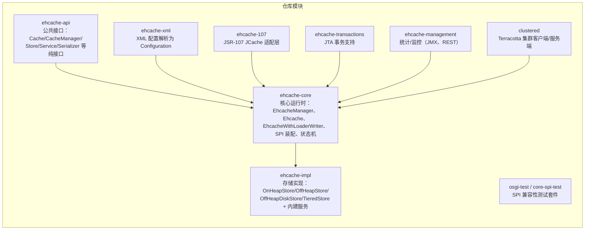

- **ehcache-api**：只有接口与配置模型（`org.ehcache.Cache`、`org.ehcache.config.*`、`org.ehcache.spi.*`），用户面向的契约层；
- **ehcache-core**：`EhcacheManager`（CacheManager 实现）、`Ehcache`/`EhcacheWithLoaderWriter`（Cache 实现）、`StatusTransitioner` 状态机、`StoreSupport`（Store Provider 选取）；
- **ehcache-impl**：所有开箱即用的实现，包括三种 Store、TieredStore 组合器、默认序列化器（JDK/Compact/Serializable）、线程池服务、本地持久化服务等；
- 其余模块为可选增强。

### 4.2 运行时分层架构

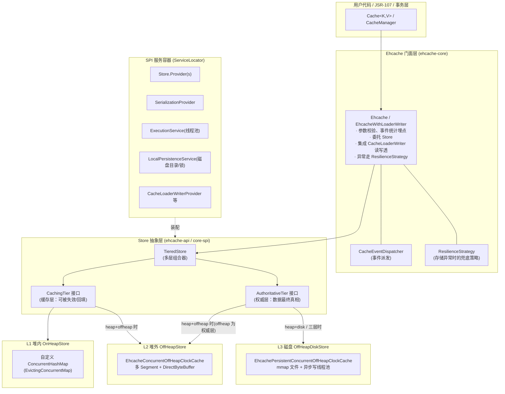

**关键设计思想**：

1. **Cache 门面不存数据**：`Ehcache` 只做校验、统计、事件、LoaderWriter 集成，数据操作全部委托给 `Store`；
2. **Store 分两类角色**：
   - `CachingTier`（缓存层）：数据"副本"，随时可失效，性能极高；
   - `AuthoritativeTier`（权威层）：数据的最终来源，唯一保证一致性的层；
3. **组合优于配置**：`TieredStore` 用"1 个 CachingTier + 1 个 AuthoritativeTier"二叉组合出任意层级；heap+offheap+disk 三层时，`CompoundCachingTier` 再把 heap（HigherCachingTier）与 offheap（LowerCachingTier）组合成一个 CachingTier，disk 作为 AuthoritativeTier；
4. **一切皆服务（SPI）**：Store、序列化器、线程池、持久化目录……都通过 `ServiceLocator` 按依赖拓扑启动/停止，第三方可实现任意服务替换默认行为。

### 4.3 核心接口继承体系

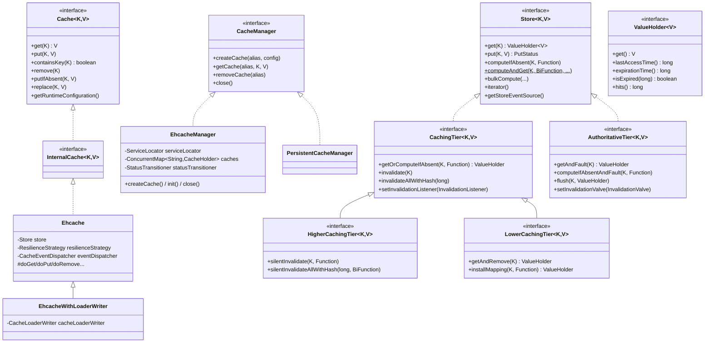

> 命名速记：**fault（取出）**= 权威层把条目交给上层时"打标记"；**flush（写回）**= 上层失效时把条目（及其访问统计）写回权威层；**invalidate（失效）**= 写操作前使上层副本失效，保证一致性。

### 4.4 SPI 服务机制

```mermaid
flowchart LR
    subgraph ServiceLocator["ServiceLocator（服务容器）"]
        direction TB
        DI["按 @ServiceDependencies 注解<br/>构建依赖 DAG，拓扑排序启动"]
    end
    subgraph 内建服务["内建默认服务（ehcache-impl）"]
        P1["OnHeapStore.Provider<br/>(CachingTier/HigherCachingTier)"]
        P2["OffHeapStore.Provider<br/>(AuthoritativeTier/LowerCachingTier)"]
        P3["OffHeapDiskStore.Provider<br/>(AuthoritativeTier)"]
        P4["DefaultSerializationProvider<br/>(JDK/Compact/Serializable)"]
        P5["DefaultExecutionService<br/>(线程池)"]
        P6["DefaultLocalPersistenceService<br/>(磁盘目录+文件锁)"]
        P7["DefaultCacheLoaderWriterProvider<br/>等"]
    end
    内建服务 -->|java.util.ServiceLoader<br/>+ 显式注册| DI
    DI -->|"getServicesOfType(Store.Provider.class)"| SEL["StoreSupport.selectStoreProvider<br/>按 rank() 排序选取"]
```

每个 `Store.Provider` 通过 `rank(Set<ResourceType>, serviceConfigs)` 声明自己对某资源组合的适配度：

- `OnHeapStore.Provider`：资源集合恰为 `{heap}` 时 rank=1（同时实现 `HigherCachingTier.Provider`）；
- `OffHeapStore.Provider`：`{offheap}` 时作为唯一 Store rank=1；作为权威层 `rankAuthority(OFFHEAP)=1`；作为低缓存层 `rankCachingTier({heap,offheap}中的caching部分)=1`；
- `OffHeapDiskStore.Provider`：`{disk}` 或 disk 作为权威层时 rank=1；
- `TieredStore.Provider`：资源数 ≥ 2 时生效，rank = 权威层 rank + 缓存层 rank，`getAuthorityResource()` 取 **tierHeight 最大**（最冷）的资源做权威层（`disk > offheap > heap`）。

---

## 5. 核心工作流程

### 5.1 CacheManager 初始化与缓存创建（时序图）

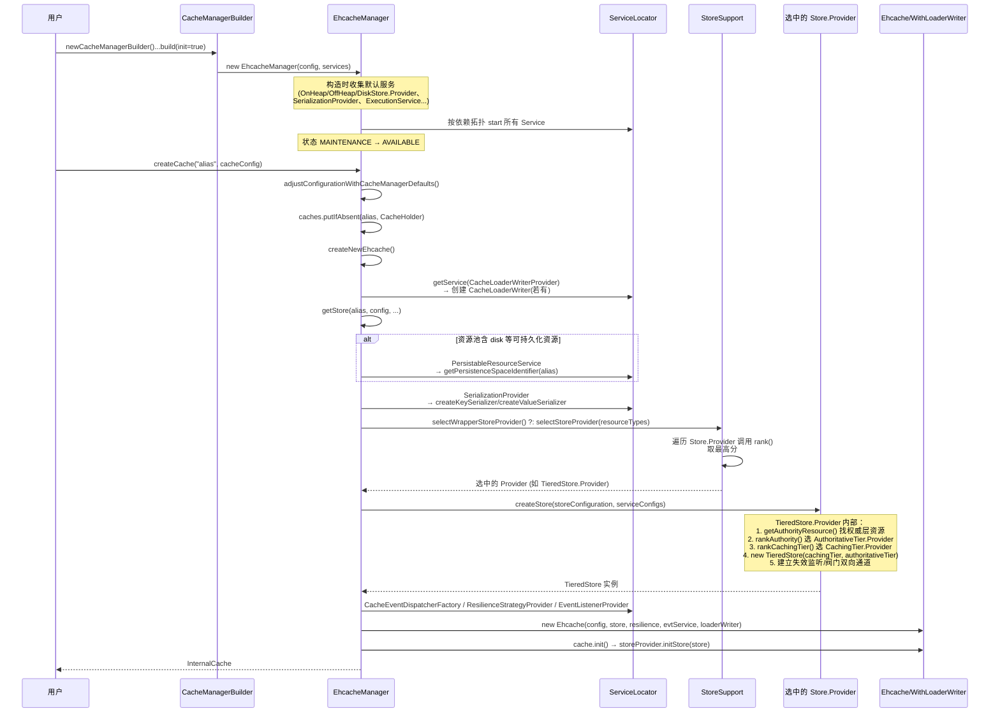

### 5.2 读路径：`cache.get(key)`（三层配置为例）

`TieredStore.get()`（`ehcache-impl/.../store/tiering/TieredStore.java:88`）：

```java
public ValueHolder<V> get(final K key) {
  return cachingTier().getOrComputeIfAbsent(key, keyParam ->
      authoritativeTier.getAndFault(keyParam));   // 缓存层 miss 时才碰权威层
}
```

`CompoundCachingTier.getOrComputeIfAbsent()`（同包 `CompoundCachingTier.java:103`）：

```java
return higher.getOrComputeIfAbsent(key, keyParam -> {
    ValueHolder<V> valueHolder = lower.getAndRemove(keyParam);  // 从 offheap "取出"（fault）
    if (valueHolder != null) return valueHolder;
    return source.apply(keyParam);                               // 到权威层(disk) getAndFault
});
```

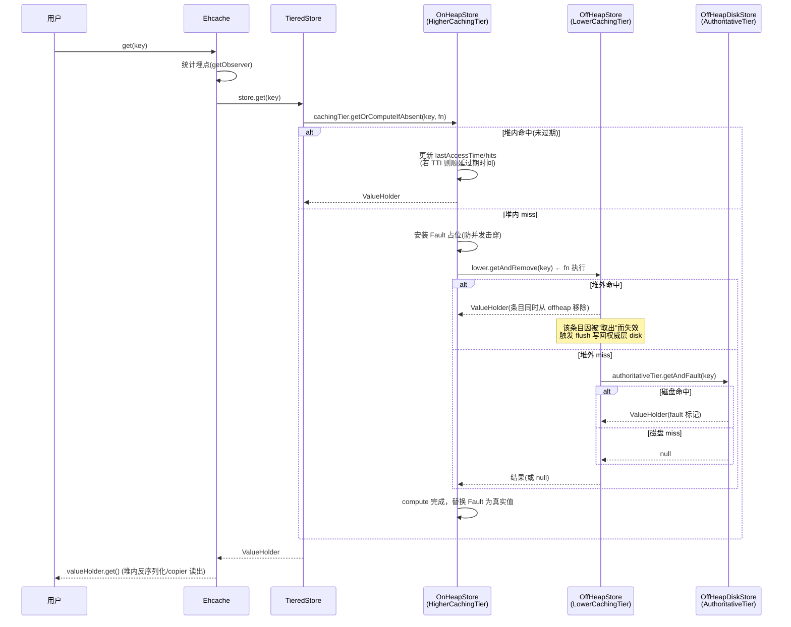

**要点**：

- 只有读操作走"逐层向下"，且下层数据会**回填上层**（offheap 命中则条目整体搬到 heap；disk 命中则进入 caching tier）；
- `Fault` 机制保证同一 key 的并发加载只有一个线程真正穿透到底层；
- `EhcacheWithLoaderWriter` 中，三层全 miss 时还会调用 `CacheLoaderWriter.load()`（read-through）。

### 5.3 写路径：`cache.put(key, value)`

`TieredStore.put()`（`TieredStore.java:108`）——**先写权威层，再失效缓存层**：

```java
public PutStatus put(final K key, final V value) {
  try {
    return authoritativeTier.put(key, value);   // 1. 权威层落盘/落堆外
  } finally {
    cachingTier().invalidate(key);              // 2. 上层副本全部失效
  }
}
```

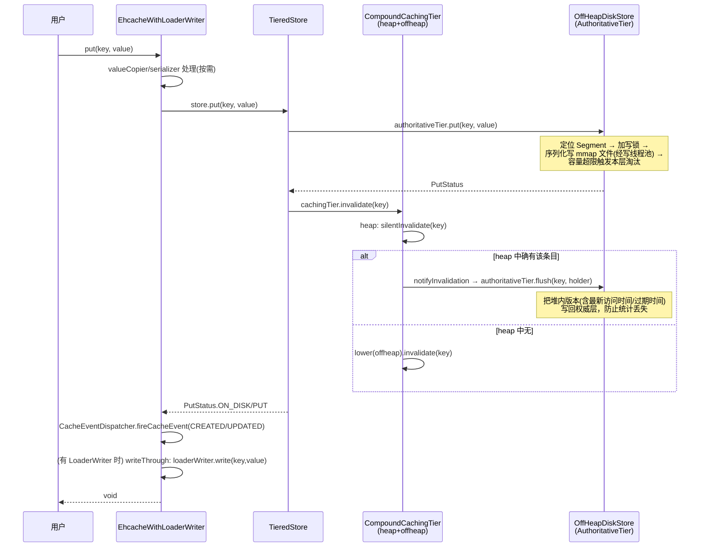

**一致性模型**：写操作**永远不直接写缓存层**，而是"权威层写入 + 缓存层失效"。因此缓存层中的数据只可能是权威层某次状态的有效副本（由读回填），不会出现上层数据比权威层新的情况。所有 `put / getAndPut / putIfAbsent / remove / replace / bulkCompute` 都遵循该模式（见 `TieredStore.java:108-374`）。

### 5.4 层间数据流转总览

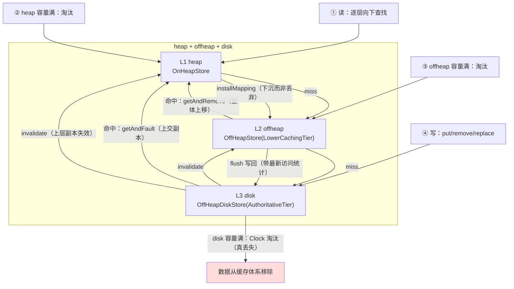

> 三层结构中 offheap 的角色很微妙：对 heap 来说它是"下层"（LowerCachingTier，条目可整体上移、可被下沉安装）；对 TieredStore 来说它与 heap 共同组成 CachingTier（`CompoundCachingTier`），disk 才是权威层。而在 heap+offheap 两层配置中，offheap 自身就是权威层（AuthoritativeTier）。

### 5.5 CacheManager 生命周期

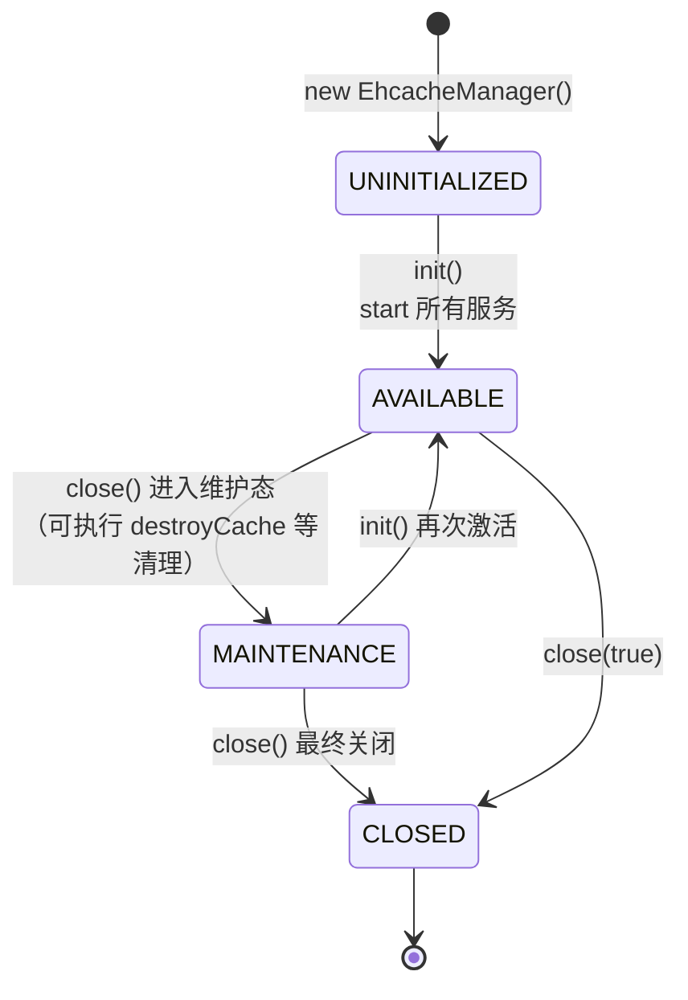

---

## 6. 堆内缓存（On-Heap）实现原理

代码位置：`ehcache-impl/src/main/java/org/ehcache/impl/internal/store/heap/`

### 6.1 整体结构

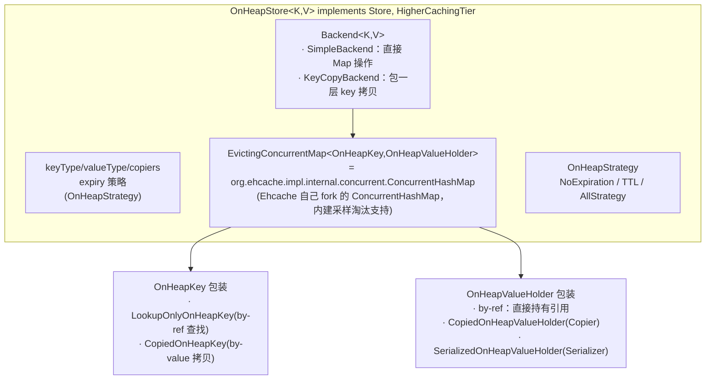

### 6.2 键值包装与 By-Ref / By-Value

- **默认 by-reference**：map 的 key 是 `LookupOnlyOnHeapKey`（仅用于等值查找），value 直接持有原对象引用，零拷贝、性能最高，但外部修改 value 会直接影响缓存内容；
- **by-value（堆内也可选）**：key 用 `CopiedOnHeapKey`（构造时 `keyCopier.copyForWrite`），value 用 `CopiedOnHeapValueHolder`（读时 `copyForRead` 返回副本）或 `SerializedOnHeapValueHolder`（存 `ByteBuffer`，读时反序列化），彻底隔离外部修改；
- 拷贝/序列化行为由 `Copier` / `Serializer` SPI 决定，默认提供 `IdentityCopier`（即 by-ref）与基于序列化器的实现。

### 6.3 过期检查

- 每个条目（`AbstractValueHolder`）持有 `expirationTime` 时间戳，`isExpired(now)` 即 `now >= expirationTime`；
- `OnHeapStrategy` 按 `ExpiryPolicy` 类型特化：
  - `NO_EXPIRY` → `NoExpirationStrategy`（检查短路，零开销）；
  - 纯 TTL → `TTLStrategy`（访问不延长过期时间，只更新 `lastAccessTime`）；
  - 其他（TTI / 自定义）→ `AllStrategy`（`getExpiryForAccess/Update` 动态计算，可能在访问时顺延过期时间）；
- 过期检查发生在**访问时**（get/compute 入口），过期即移除并触发 `EXPIRED` 事件；没有专门的后台过期线程（堆内层）。

### 6.4 淘汰（Eviction）

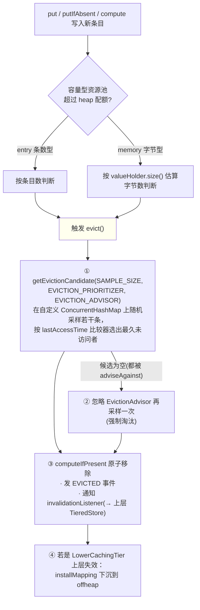

- **算法**：采样式**近似 LRU**（比较 `lastAccessTime`），非严格 LRU，换取并发下的低开销；
- **Fault 保护**：比较器把 `Fault`（正在加载的占位）排到最不容易被淘汰的位置，避免淘汰在途加载；
- **EvictionAdvisor**：`(key,value) -> adviseAgainstEviction`，用户可声明"热数据不可淘汰"；
- 淘汰出的条目不是简单丢弃：作为 HigherCachingTier，其 `invalidationListener` 被设为 `lower.installMapping`（见 `CompoundCachingTier` 构造器，`CompoundCachingTier.java:65`），即**下沉到下一缓存层**。

### 6.5 并发与原子语义

- 底层是 fork 的 `java.util.concurrent.ConcurrentHashMap`（包 `org.ehcache.impl.internal.concurrent`），改造成 `EvictingConcurrentMap`，在 `compute*` 的桶级锁内可安全触发淘汰；
- `putIfAbsent` / `replace` / `remove(k,v)` 等原子操作直接映射到 map 的 `compute` / `computeIfPresent` 原子指令族，桶级（bin 级）粒度锁，无全局锁。

---

## 7. 堆外缓存（Off-Heap）实现原理

代码位置：`ehcache-impl/src/main/java/org/ehcache/impl/internal/store/offheap/`（底层复用 Terracotta **offheapstore** 数据结构库）

### 7.1 整体结构

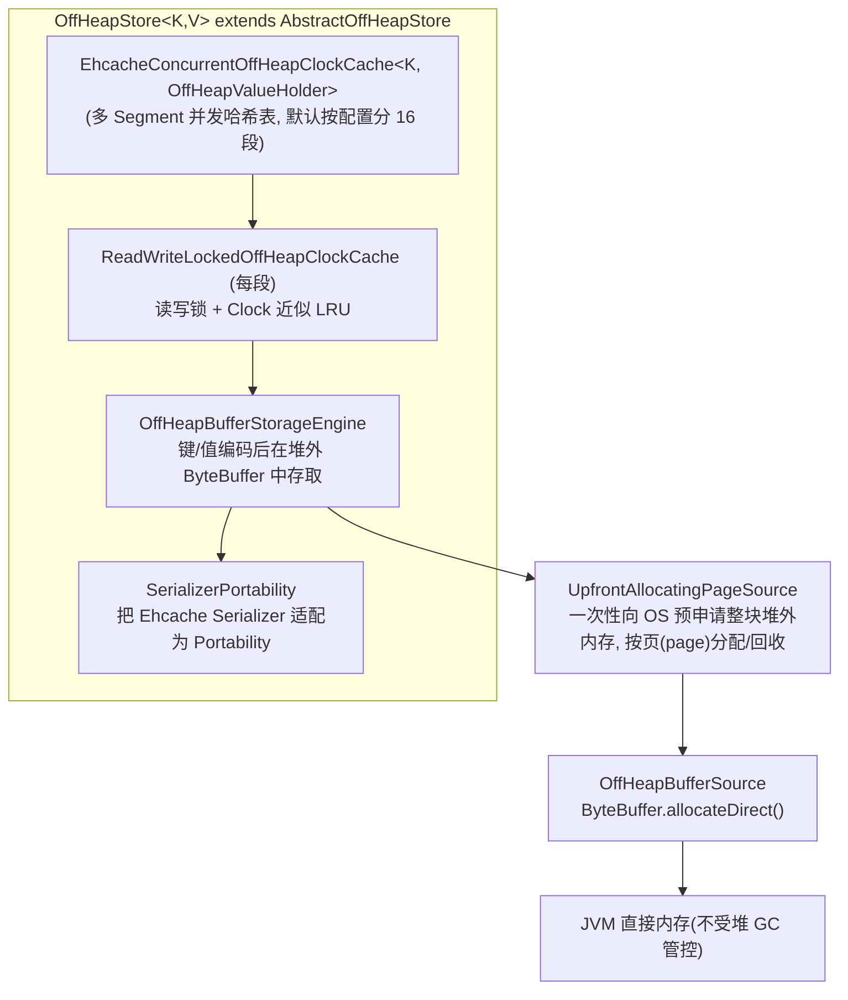

### 7.2 关键机制

**（1）内存分配：预分配 + 分页**

- `OffHeapStore.createBackingMap()` 中按配置的 offheap 字节数创建 `UpfrontAllocatingPageSource`；
- 后者一次性 `ByteBuffer.allocateDirect()` 申请总容量，之后所有条目的存储都是在这块"私有堆"内按页分配（`PowerOfTwoFileAllocator`/页分配器管理空闲页），彻底避免 JVM 堆 GC 压力与碎片；
- 内存用尽时：先尝试淘汰（Clock 算法），仍无空间则抛 `OversizeMappingException`（单个条目大于剩余空间）。

**（2）序列化与懒解码**

- key、value 都必须序列化（这也是配置 offheap 时必须提供 `Serializer` 或可序列化类型的原因）；
- 值统一包成 `OffHeapValueHolder`：其中 `BinaryOffHeapValueHolder` 直接持有堆外二进制，`LazyOffHeapValueHolder` 在 `get()` 调用时才把 `ByteBuffer` 反序列化成对象——**堆外层存取不产生反序列化开销，除非真的要读值**；
- `OffHeapValueHolderSerializer` 同时把 `hits`、`expirationTime` 等元数据一并编码进堆外字节。

**（3）淘汰：Clock（时钟）近似 LRU + 字节配额**

- 每个条目在 status 元数据位中有引用位，访问置位；淘汰时时钟指针扫描，引用位为 0 者被选中淘汰；
- `EhcacheSegmentFactory.EhcacheSegment.evict(int index, boolean shrink)` 在段写锁内执行淘汰并回调 `evictionListener.onEviction()`；
- 与堆内不同，offheap 的配额是**真实字节**（页分配器统计），淘汰持续到分配量回到水位以下；
- **Pinning**：`Metadata.PINNED` 状态位 + `putPinned` / `computeIfPresentAndPin`，被固定的条目永不淘汰。

**（4）过期**

- 访问时惰性检查（`AbstractOffHeapStore.get` 流程内），过期条目立即从堆外释放并触发事件；
- 作为权威层或缓存层都遵循该模式。

**（5）fault / installMapping 语义（LowerCachingTier 角色）**

- `getAndRemove(key)`：读出并**删除**堆外条目（"整体上移"给 heap）；
- `installMapping(key, supplier)`：heap 淘汰下来的条目通过它装入堆外；
- 作为 **AuthoritativeTier**（heap+offheap 两层配置）时则提供 `getAndFault` / `flush`：faulted 条目在被 flush 回写前受保护，防止权威层数据丢失。

**（6）内存释放**

- 关闭时 `releaseStore()` → `map.destroy()` 逐段销毁存储引擎并释放全部 DirectByteBuffer；
- 条目级删除/淘汰/过期都会立即归还页。

### 7.3 OffHeapStore.Provider 的启用条件

- `@ServiceDependencies({TimeSourceService, SerializationProvider})`；
- 仅当资源类型匹配 OFFHEAP 时 rank=1；heap+offheap 时由 `CompoundCachingTier.Provider` 调它的 `LowerCachingTier.Provider` 角色，或由 `TieredStore.Provider` 调其 `AuthoritativeTier.Provider` 角色。

---

## 8. 磁盘缓存（Disk）实现原理

代码位置：`ehcache-impl/src/main/java/org/ehcache/impl/internal/store/disk/`（底层同样基于 offheapstore 的 **persistent** 变体）

### 8.1 整体结构

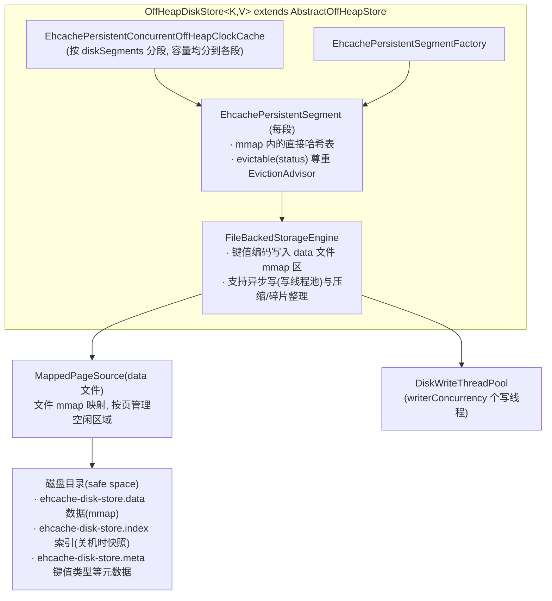

### 8.2 磁盘文件三件套与持久化语义

由 `DefaultLocalPersistenceService`（`ehcache-impl/.../persistence/`）管理目录：

```
${persistence.root}/
├── .lock            # 进程独占文件锁（防多 JVM 共用同一目录）
├── ${owner}/        # CacheManager 级
│   └── ${alias}_*/  # Cache 级 safe space
│       ├── ehcache-disk-store.data    # mmap 数据文件
│       ├── ehcache-disk-store.index   # 索引快照（关闭时写入）
│       └── ehcache-disk-store.meta    # key/value 类型校验信息
```

- 启动时 `tryLock` `.lock` 文件，独占目录；stop 时释放；
- `persistent=true` 时，Cache/CacheManager 关闭后 safe space 保留，重启可恢复；`persistent=false` 时 `destroySafeSpace` 直接清空。

### 8.3 启动恢复流程（`recoverBackingMap`）

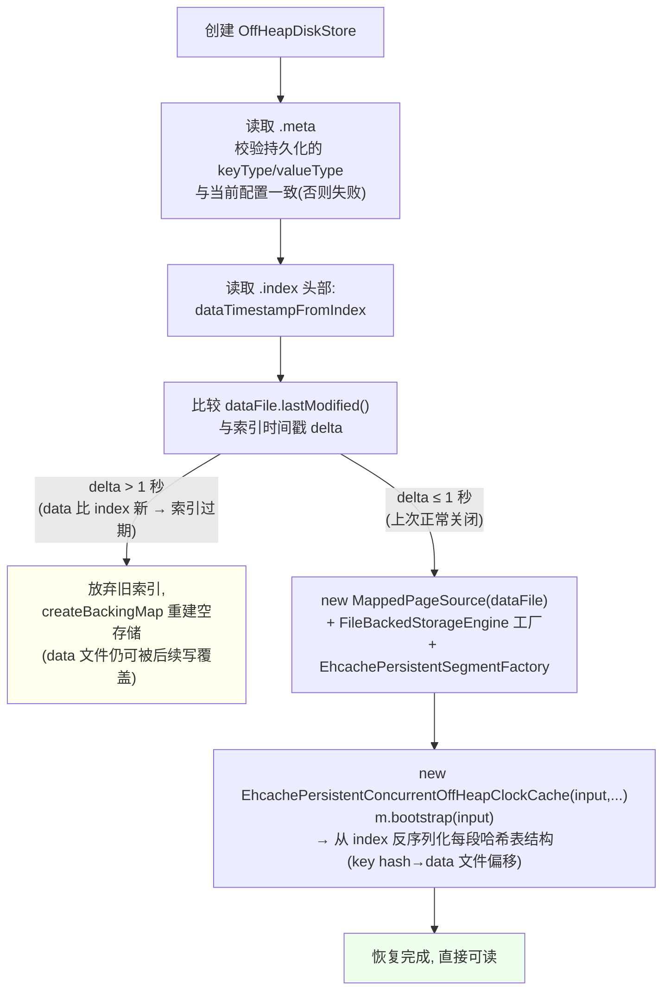

> 恢复的核心思想：**data 文件是 mmap 的"堆外内存"，index 只是哈希表结构快照**。正常关闭时二者同步（时间戳吻合）即可完整恢复；异常退出后 index 可能落后于 data（异步写导致），宁可重建也不冒险使用旧索引。

### 8.4 写盘机制：mmap + 异步写线程池

- `FileBackedStorageEngine.createFactory(source, chunkSize, BYTES, keyPortability, valuePortability, writeWorkers, ...)`：写入编码后的键值字节到 `MappedPageSource` 管理的 mmap 页；
- `DiskWriteThreadPool(executionService, threadPoolAlias, writerConcurrency)`：段内部分写操作（如编码压缩、重定位）提交到写线程池**异步**执行，业务线程（put 调用者）不等待磁盘 IO，只有页耗尽需淘汰/整理时才可能阻塞；
- `MappedPageSource` 基于 `FileChannel.map(MAP_MODE.READ_WRITE, ...)`，写 mmap 即写文件（由 OS 异步刷盘），配合 `force()`（flush 时）保证持久化。

### 8.5 关闭/落盘流程（`close` 静态方法）

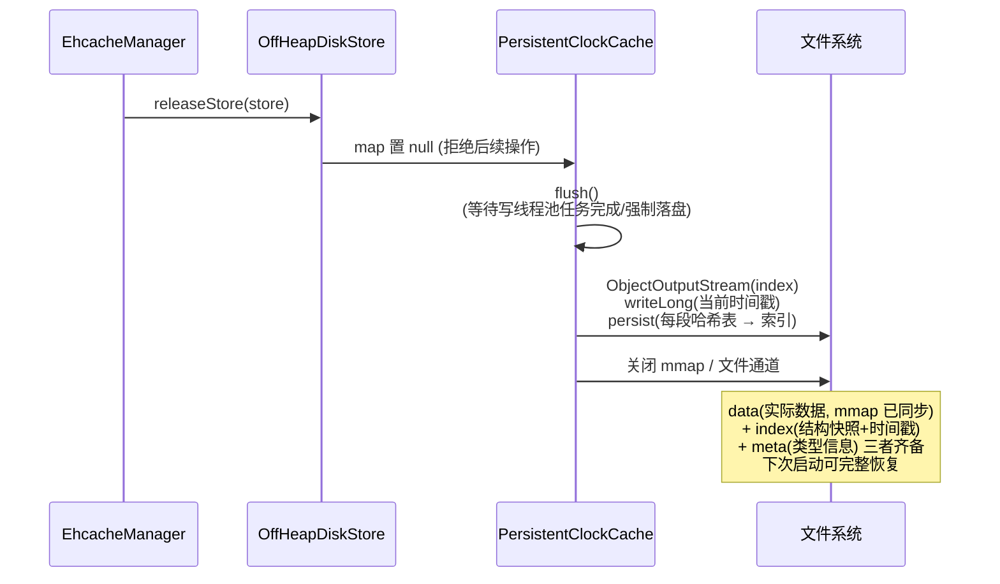

### 8.6 淘汰与过期

- 淘汰：与堆外同为 **Clock 近似 LRU**，配额为磁盘字节数（每段 = 总量/diskSegments）；
- `EhcachePersistentSegmentFactory.EhcachePersistentSegment#evictable` 额外检查 `ADVISED_AGAINST_EVICTION` 状态位（`SwitchableEvictionAdvisor` 可整体开关）；
- `evict(index, shrink)` 在段写锁内淘汰并回调监听器 → 上层（TieredStore）感知；
- 过期为访问时惰性检查 + 淘汰路径检查，过期条目释放其 mmap 页。

---

## 9. 过期（Expiry）与淘汰（Eviction）机制汇总

### 9.1 Expiry：用户可编程的过期策略

```java
public interface ExpiryPolicy<K, V> {
  Duration getExpiryForCreation(K key, V value);   // 创建时
  Duration getExpiryForAccess(K key, ValueSupplier<V> value);  // 访问时(TTI 的来源)
  Duration getExpiryForUpdate(K key, ValueSupplier<V> oldValue, V newValue); // 更新时
}
```

- `ExpiryPolicyBuilder.timeToLiveExpiration(ttl)` / `timeToIdleExpiration(tti)` / `expiry(...)` 自定义；
- 返回 `ExpiryPolicy.INFINITE` 表示永不过期；`null`（access/update 场景）表示维持原过期时间；
- 各 Store 在 put/compute 时把计算出的 `expirationTime` 一并编码进 ValueHolder（堆外/磁盘连元数据一起序列化）；
- 过期是**惰性**的：读时检查、淘汰路径检查，不保证精确到点移除。

### 9.2 三层淘汰对比

| 维度 | Heap | Off-Heap | Disk |
|---|---|---|---|
| 配额单位 | 条数（entries）或估算字节 | 真实字节（DirectByteBuffer 页） | 真实字节（mmap 文件页） |
| 算法 | 采样近似 LRU（lastAccessTime 比较器） | Clock 近似 LRU（引用位） | Clock 近似 LRU（引用位） |
| 触发时机 | 写入导致超配额时 | 页分配失败/超配额时 | 同左 |
| 被淘汰数据的去向 | 下沉到下一缓存层（installMapping） | flush 写回权威层（若有） | **真丢失**（权威层无下家） |
| 防淘汰手段 | EvictionAdvisor | EvictionAdvisor + Pinning | EvictionAdvisor（可开关） |
| 事件 | EVICTED / EXPIRED | 同左 | 同左 |

---

## 10. 序列化体系

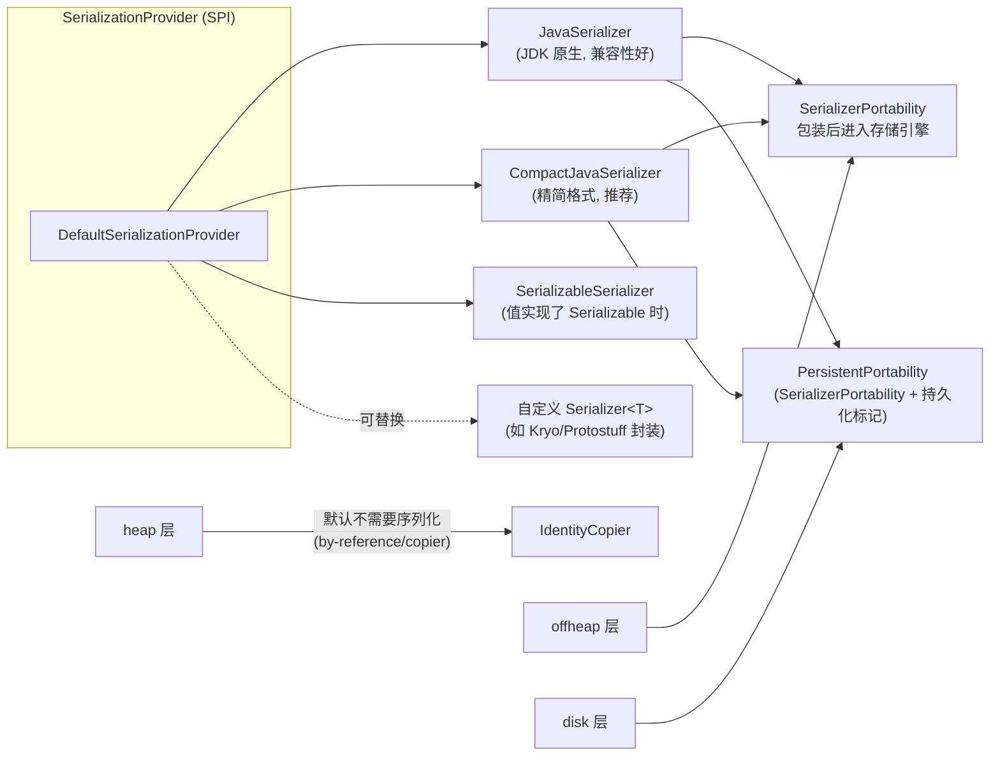

- `Serializer<T>` 三个方法：`serialize(T)→ByteBuffer`、`read(ByteBuffer)→T`、`equals(T, ByteBuffer)`（第三点很关键：堆外层的 `containsKey/remove(k,v)` 无需完整反序列化即可比对）；
- 序列化器在 `EhcacheManager.getStore()` 中统一创建并作为 `Store.Configuration` 传入（`EhcacheManager.java:446-485`）；
- 类型不支持序列化且配置了 offheap/disk → 创建缓存直接失败（`requiresSerialization()` 检查）。

---

## 11. 事件、统计与容错

### 11.1 事件链路

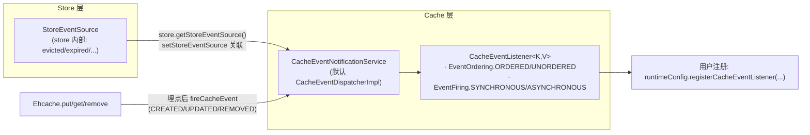

### 11.2 统计

- 每个 Store 内嵌 `OperationStatistic/OperationObserver`（命中/未命中/淘汰计数），多层配置下默认开启（`EhcacheManager.getStore()` 中 `getResourceTypeSet().size() > 1` 判定，`EhcacheManager.java:494-497`）；
- `TieredStore.Provider.createStore` 中通过 `StatisticsService.registerWithParent` 把各层统计挂到整缓存视角，因此能看到 `highestTierHitRatio` 等分层指标；
- management 模块进一步暴露为 JMX MBean / REST 端点。

### 11.3 容错（ResilienceStrategy）

- 任何 `StoreAccessException`（序列化失败、IO 错误等）不会直接抛给用户，而是交给 `ResilienceStrategy`：默认策略对读返回 null/抛出、对写做记录；有 LoaderWriter 时可配置降级直读底层数据源；
- 用户可实现 `ResilienceStrategy` 并通过 `ResilienceStrategyProvider` 注入自定义行为。

### 11.4 JSR-107 适配（ehcache-107）

- `EhcacheCachingProvider` → `EhcacheCacheManager` → `EhcacheCache<K,V>`（包装 `Ehcache` 的 `Jsr107Cache` 视图，`Ehcache.createJsr107Cache()`）；
- 负责 JCache 的 `MutableConfiguration` ↔ Ehcache `CacheConfiguration` 互转、Expiry 适配、统计语义（getAndPut/getAndRemove 等映射到 `store.getAndPut/getAndRemove`，见 `Ehcache.java:212-257`）。

---

## 12. 附录：关键类索引

| 职责 | 类 | 位置 |
|---|---|---|
| CacheManager 实现 | `org.ehcache.core.EhcacheManager` | ehcache-core |
| Cache 门面 | `org.ehcache.core.Ehcache` / `EhcacheWithLoaderWriter` | ehcache-core |
| Store 选取 | `org.ehcache.core.spi.store.StoreSupport` | ehcache-core |
| 多层组合器 | `org.ehcache.impl.internal.store.tiering.TieredStore` | ehcache-impl |
| 缓存层组合器 | `...tiering.CompoundCachingTier` | ehcache-impl |
| 堆内 Store | `...store.heap.OnHeapStore`（Provider 内嵌） | ehcache-impl |
| 堆内并发 Map | `org.ehcache.impl.internal.concurrent.ConcurrentHashMap` | ehcache-impl |
| 堆外 Store | `...store.offheap.OffHeapStore` / `AbstractOffHeapStore` | ehcache-impl |
| 堆外并发 Map | `...offheap.EhcacheConcurrentOffHeapClockCache` | ehcache-impl |
| 磁盘 Store | `...store.disk.OffHeapDiskStore` | ehcache-impl |
| 磁盘并发 Map | `...disk.EhcachePersistentConcurrentOffHeapClockCache` | ehcache-impl |
| 磁盘写线程池 | `...disk.DiskWriteThreadPool` | ehcache-impl |
| 本地持久化 | `...persistence.DefaultLocalPersistenceService` | ehcache-impl |
| 序列化适配 | `...offheap.portability.SerializerPortability` | ehcache-impl |
| JSR-107 | `org.ehcache.jsr107.EhcacheCachingProvider` | ehcache-107 |

### 核心设计模式速览

- **门面模式**：`Ehcache` 门面 + `Store` 干活；
- **组合模式**：`TieredStore`/`CompoundCachingTier` 递归组合出任意层级；
- **SPI/策略模式**：Provider rank 机制动态选择实现；Serializer/Copier/ExpiryPolicy/ResilienceStrategy 全部可插拔；
- **观察者模式**：StoreEventSource → CacheEventDispatcher → CacheEventListener；
- **模板方法**：`AbstractEhcache` 的 `doGet/doPut` 族由 `Ehcache`/`EhcacheWithLoaderWriter` 特化；
- **读写不对称**：读走全层（回填），写只写权威层（失效上层）——这是 Ehcache 多层一致性的基石。
