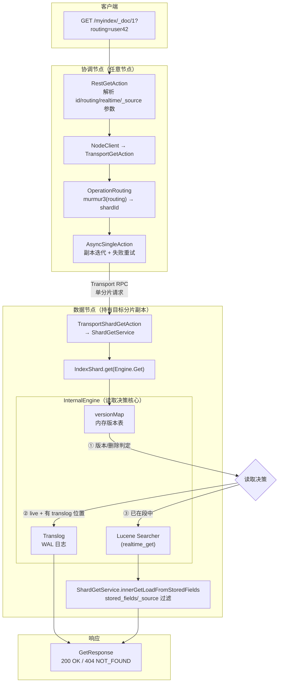
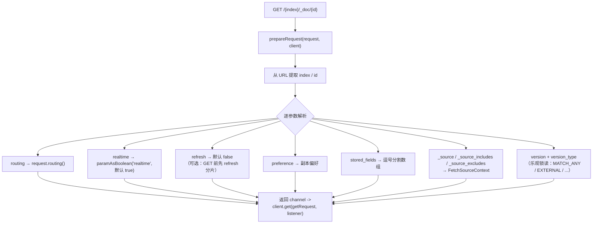
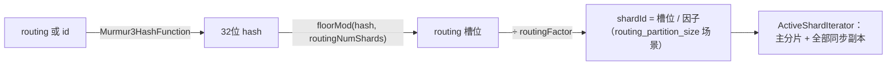
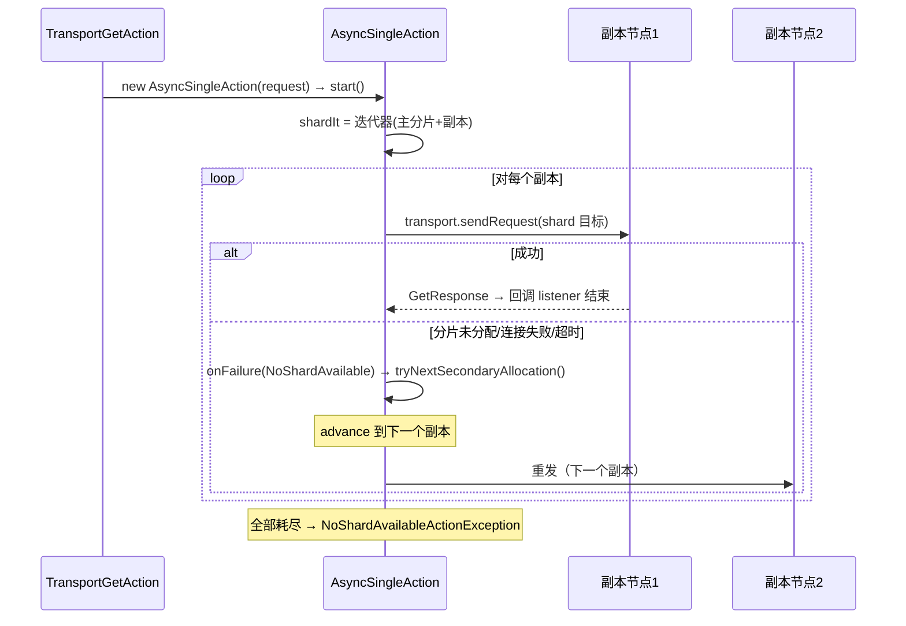
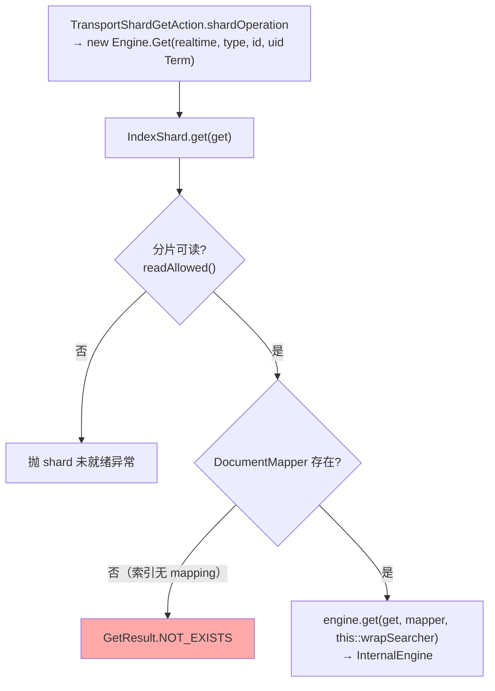
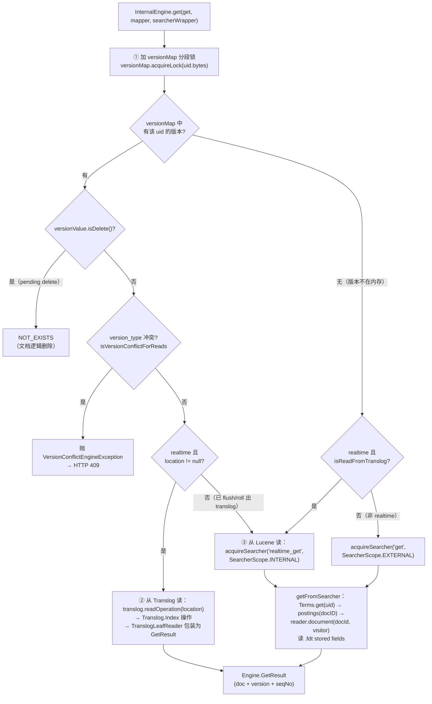
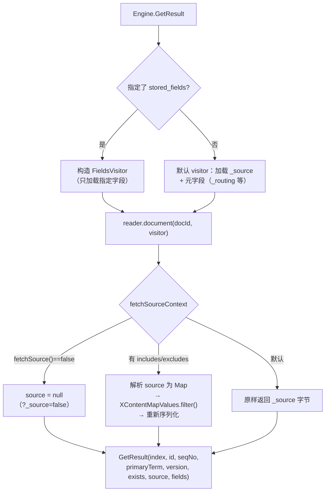
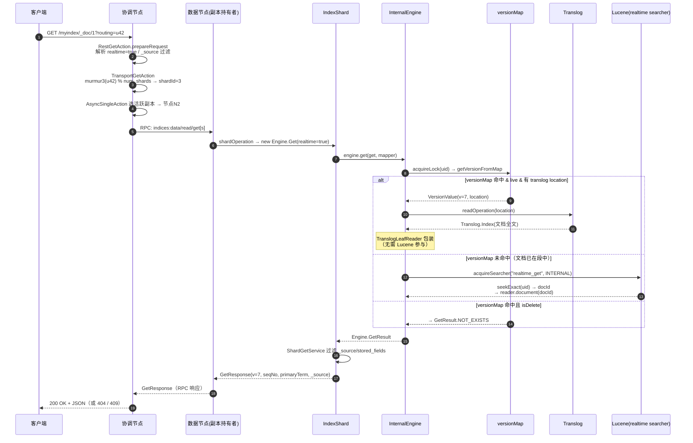
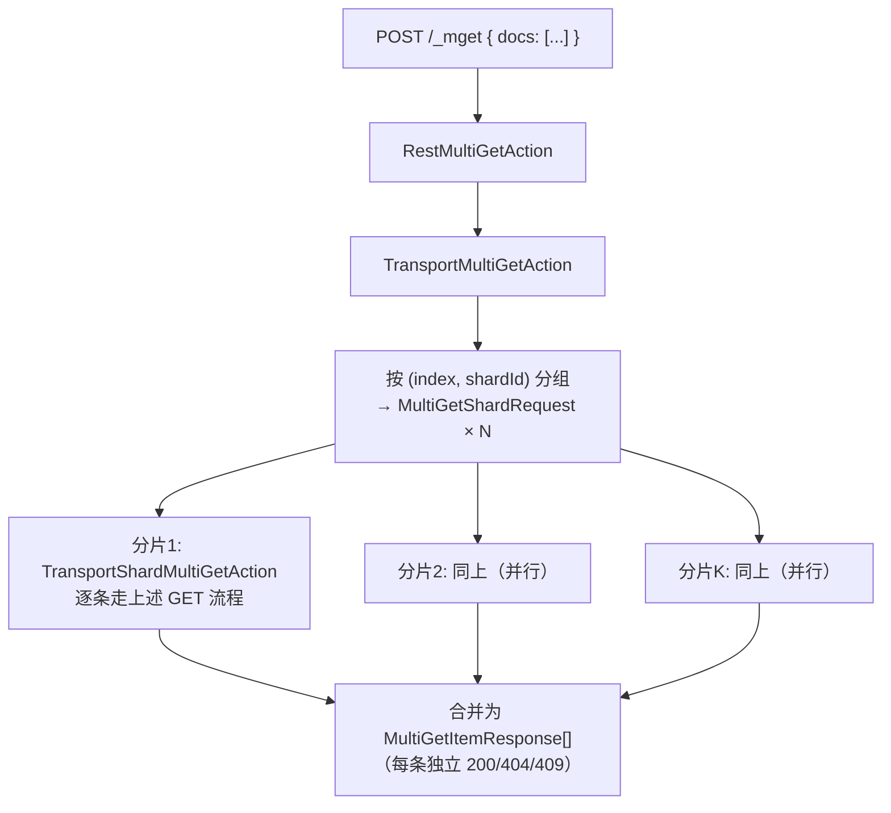

# Elasticsearch 7.13.0 GET 查询流程源码深度剖析

> 基于 Elasticsearch 7.13.0 源码
> 链路：`RestGetAction → TransportGetAction → IndexShard → InternalEngine（versionMap / Translog / Lucene）→ GetResponse`
> 前置阅读：《Lucene深度学习指南》（本文涉及 FST/stored fields/liveDocs 时直接引用其结论）

---

## 目录

1. [GET 是什么：与 Search 的本质区别](#1-get-是什么与-search-的本质区别)
2. [总体架构图](#2-总体架构图)
3. [REST 层：RestGetAction 参数解析](#3-rest-层restgetaction-参数解析)
4. [Transport 层：路由与副本选择](#4-transport-层路由与副本选择)
5. [分片层：IndexShard.get](#5-分片层indexshardget)
6. [引擎层：InternalEngine.get 实时读取算法（核心）](#6-引擎层internalengineget-实时读取算法核心)
7. [结果组装：stored_fields 与 _source 过滤](#7-结果组装stored_fields-与-_source-过滤)
8. [端到端时序图](#8-端到端时序图)
9. [mget 批量查询](#9-mget-批量查询)
10. [关键问题 Q&A](#10-关键问题-qa)
11. [关键源码索引](#11-关键源码索引)

---

## 1. GET 是什么：与 Search 的本质区别

`GET /index/_doc/{id}`（以及 HEAD 检查存在性、`_mget`）是**点查**：按 `_id` 精确取一篇文档，走的是**实时读取路径**。

| 维度 | GET（点查） | Search（搜索） |
|---|---|---|
| realtime 参数默认值 | **true** | false |
| 未 refresh 的文档可见？ | **可见**（versionMap + translog） | 不可见（必须等 refresh） |
| 查询方式 | Lucene `Terms.get(...)` 精确定位 term → 单 doc | Query → Weight → Scorer 迭代 |
| 评分 | 无（不计算 BM25） | 有 |
| 读取成本 | O(term 定位) ≈ 微秒级，读一个 stored field 块 | 视命中量而定 |
| 参与节点 | 1 个分片（routing 决定） | 该索引所有主分片（或副本） |

**GET 实时性的直觉解释**：写请求成功返回前，`InternalEngine` 已经把文档版本登记进内存 `versionMap` 并写入 translog——GET 直接读这两处即可，**完全不需要等 refresh 生成新 Lucene 段**。这是 ES"写完立即可 GET 到"的原理。

---

## 2. 总体架构图



三层数据来源（引擎内部决策顺序）：**versionMap（内存元数据）→ Translog（最近写入）→ Lucene 段（已 refresh 的存量）**。

---

## 3. REST 层：RestGetAction 参数解析

文件：`server/src/main/java/org/elasticsearch/rest/action/document/RestGetAction.java`



关键点：

- **`realtime=true` 默认开启**——这是 GET 与 Search 行为分叉的开关，一路透传到 `Engine.Get.realtime()`
- **`refresh=true` 可选参数**：执行前对该分片强制 refresh（性能差，仅调试用；正常实时性不需要它）
- `_source=false` / `includes/excludes` 在**分片层**过滤（第 7 章），不传全量
- version 参数支持**乐观读**：如 `?version=5&version_type=external`，文档当前版本不满足时返回冲突（409）

---

## 4. Transport 层：路由与副本选择

文件：`server/src/main/java/org/elasticsearch/action/get/TransportGetAction.java`，核心能力来自父类 `TransportSingleShardAction`。

### 4.1 路由计算：为什么这条文档在这个分片

`OperationRouting.generateShardId`（`server/.../cluster/routing/OperationRouting.java`）：

```java
final String effectiveRouting = routing == null ? id : routing;   // 无 routing 时用 _id 兜底
final int hash = Murmur3HashFunction.hash(effectiveRouting);       // murmur3
return Math.floorMod(hash, routingNumShards) / routingFactor;      // 映射到主分片号
```



- **Murmur3**：均匀性优于 String.hashCode，分布更均衡，且 32 位足够
- **写入与读取必须同路由**：写入时用的 routing 决定了文档落点；GET 不带相同 routing → `murmur3` 算到**另一个分片** → 404。若索引 `routing_required=true`，缺 routing 直接抛 `RoutingMissingException`（`resolveRequest` 阶段）
- 这也解释了自定义 routing 的双刃剑：同用户数据聚到一个分片（GET 变单分片、快），但可能数据倾斜

### 4.2 preference 副本选择

`getShards` → `preferenceActiveShardIterator(...)`：

| preference | 行为 |
|---|---|
| （默认） | 轮询选取活跃副本（randomize） |
| `_local` | 优先协调节点本地持有的副本 |
| `_only_local` | 只用本地副本 |
| `_prefer_nodes=node1` | 优先指定节点 |
| 自定义字符串 | 对字符串哈希做一致性选择（同值总落同一副本，利于缓存） |

### 4.3 失败重试：AsyncSingleAction



- `TransportSingleShardAction.AsyncSingleAction` 是 ES 里"单分片读操作"的通用重试骨架（GET、explain、analyze 等复用）
- 注意 **GET 可以读副本**（读操作，无需主分片）——副本与主之间的复制是异步的，因此**可能读到旧版本**（详见 Q&A 第 10 章）

---

## 5. 分片层：IndexShard.get

文件：`server/src/main/java/org/elasticsearch/index/shard/IndexShard.java`



- `Engine.Get` 的 key 不是 id 字符串，而是 **uid Term**（`_id` 字段的 `Term`，即 Lucene 里 `keyword` 型倒排键）——引擎层最终要用它在 Lucene `Terms` 中 `seek` 到 postings
- `realtime` 标志一路从 HTTP 参数传到这里

---

## 6. 引擎层：InternalEngine.get 实时读取算法（核心）

文件：`server/src/main/java/org/elasticsearch/index/engine/InternalEngine.java`。这是整个 GET 流程的**灵魂**——按三层优先级决策从哪里读：



### 6.1 versionMap：写入路径留下的"账本"

`versionMap` 是 `InternalEngine` 维护的内存哈希表：**key = uid，value = 最新版本号 + seqNo + 是否删除 + translog 位置（location）**。每次 `index`/`delete` 成功前都会同步登记。

它同时服务于三个用途：

1. **实时存在性判断**（本流程）：不查 Lucene 就知道文档是否存在、是否刚被删
2. **版本冲突检测**（写入路径）：`index()` 时对比期望版本
3. **translog 定位**：value 里的 `location` 指向这篇文档最近一次 `Index` 操作在 translog 中的物理位置

锁粒度：按 uid 的 bytes 分段锁（`acquireLock`），并发 GET 不同文档互不阻塞。

### 6.2 为什么优先读 Translog 而不是 Lucene？

未 refresh 的文档只存在于两个地方：DWPT 内存（不可读）和 **translog**。所以 realtime GET 的路径设计为：

```
versionMap 命中(live) 且 location 非空  →  translog.readOperation(location)  →  直接还原文档
```

`TranslogLeafReader` 把 translog 里的 `Translog.Index` 操作包装成一个**单文档的 Lucene LeafReader**——下游 `ShardGetService` 用与读 Lucene 完全相同的 visitor 协议取字段，无需感知数据来自哪里。

当 `location == null`（该版本已被 flush 进段、或 translog 已 roll），才落到 **Lucene realtime searcher**（`SearcherScope.INTERNAL`）。非 realtime GET（`?realtime=false`）则直接用 EXTERNAL searcher（只看已 refresh 的数据，行为对齐 Search）。

### 6.3 Lucene 侧的点查（getFromSearcher）

对照《Lucene深度学习指南》第 8 章，一次 GET 在 Lucene 内只做三件事：

```
Term uid = new Term("_id", id)
PostingsEnum docs = leafReader.terms("_id").seekExact(uid.bytes()) → postings(liveDocs)
docId = docs.nextDoc()                 // 命中的段内文档号（受 liveDocs 过滤，打删除标记的不返回）
reader.document(docId, visitor)        // .fdx 定位块 → .fdt 解压 chunk → 还原字段
```

- `seekExact` 走 `.tip` FST → `.tim` 块——微秒级
- `liveDocs` 保证**打删除标记但未 merge 的文档**不会命中（Lucene 删除是位图，见指南第 10 章）
- 因为没有打分、没有迭代，成本与索引总量基本无关

---

## 7. 结果组装：stored_fields 与 _source 过滤

文件：`server/src/main/java/org/elasticsearch/index/get/ShardGetService.java`（`innerGetLoadFromStoredFields`）



- **字段过滤发生在存储层**（visitor 只解压需要的字段），`_source` 的 includes/excludes 才是"取回后裁剪"——所以 `_source=false` + `stored_fields=["title"]` 是最省流量的组合
- `_source` 的物理形态就是 Lucene stored fields（`.fdt` LZ4 压缩块）里的一个二进制域
- `docvalue_fields`：GET 也支持 `?docvalue_fields=`，从 `.dvd` 列存取值（排序/聚合同源数据）

---

## 8. 端到端时序图



---

## 9. mget 批量查询

`_mget` 是 GET 的批量形态（一次 HTTP 请求查多篇文档，各自路由可能不同）：



要点：**单条失败不影响整体**（每条 item 独立返回 found/version/error）；同分片的多个 id 合并成一次 RPC，减少网络往返——这是客户端优化点。

---

## 10. 关键问题 Q&A

**Q1：GET 为什么不用 refresh 就能读到刚写入的文档？**
写入路径在返回成功前已把版本登记进 `versionMap` 并写入 translog。realtime GET 按 `versionMap → translog` 顺序读，完全绕开"文档必须先 refresh 成 Lucene 段才可见"的约束。

**Q2：GET 会触发 refresh 吗？**
默认不会。只有显式带 `?refresh=true` 才会在读前强制 refresh（性能差，正常业务用不到）。realtime searcher（`SearcherScope.INTERNAL`）面向引擎内部操作，与对外的 `refresh` 语义解耦。

**Q3：GET 一定读到最新版本吗？**
不一定。GET 路由到的若是**副本**，而主副本复制尚在途中（异步 replication），会读到旧版本。需要强一致读时：`?preference=_primary` 指定读主分片，或写时 `?refresh=wait_for`。

**Q4：文档删除后立即 GET 会怎样？**
返回 404。删除在 versionMap 里是 `isDelete=true` 的版本记录（或段中的 liveDocs 位），三层读取路径都会判定 NOT_EXISTS。但磁盘空间要等 merge 才释放（Lucene 删除非物理，见指南第 10 章）。

**Q5：GET 与 Search 的 realtime 行为差异会带来什么"怪象"？**
"刚写入的文档 GET 得到、却搜不到"是经典现象：GET 走 translog（实时），Search 只认已 refresh 的段（默认 1s）。另外"GET 到旧版本"（读副本）和"count 与 search 命中数不一致"（refresh 时机）同源。

**Q6：`?version=10&version_type=external` 有什么用？**
乐观读：引擎用 `versionValue` 与期望版本比对，不匹配直接 `VersionConflictEngineException`（HTTP 409），不返回数据——用于外部系统做读-改-写前的一致性校验。

---

## 11. 关键源码索引

| 层 | 类 | 文件 |
|---|---|---|
| REST | `RestGetAction` | `server/src/main/java/org/elasticsearch/rest/action/document/RestGetAction.java` |
| Transport | `TransportGetAction` | `server/src/main/java/org/elasticsearch/action/get/TransportGetAction.java` |
| 单分片重试骨架 | `TransportSingleShardAction.AsyncSingleAction` | `server/src/main/java/org/elasticsearch/action/support/single/shard/TransportSingleShardAction.java` |
| 路由 | `OperationRouting.generateShardId` | `server/src/main/java/org/elasticsearch/cluster/routing/OperationRouting.java` |
| 路由哈希 | `Murmur3HashFunction` | `server/src/main/java/org/elasticsearch/cluster/routing/OperationRouting.java`（内部引用） |
| 分片入口 | `IndexShard.get` | `server/src/main/java/org/elasticsearch/index/shard/IndexShard.java` |
| 引擎决策 | `InternalEngine.get` / `getFromSearcher` / `getFromTranslog` | `server/src/main/java/org/elasticsearch/index/engine/InternalEngine.java` |
| 版本表 | `LiveVersionMap` / `VersionValue` | `server/src/main/java/org/elasticsearch/index/engine/`（同包） |
| translog 读 | `Translog.readOperation` / `TranslogLeafReader` | `server/src/main/java/org/elasticsearch/index/translog/` |
| 字段组装 | `ShardGetService.innerGetLoadFromStoredFields` | `server/src/main/java/org/elasticsearch/index/get/ShardGetService.java` |
| 响应 | `GetResponse` / `RestToXContentListener` | `server/src/main/java/org/elasticsearch/action/get/GetResponse.java` |
| mget | `TransportMultiGetAction` / `TransportShardMultiGetAction` | `server/src/main/java/org/elasticsearch/action/get/` |

---

## 总结

1. **GET = 一次路由 + 一场引擎内的"三层决策"**：murmur3 算出唯一目标分片（可读任一副本、失败自动换副本），引擎内按 `versionMap（存在性/版本）→ Translog（最新未入段文档）→ Lucene（已入段存量）` 的顺序读取，取哪层由 versionMap 的登记状态自动决定。
2. **实时性来自写入路径的"记账"**：versionMap + translog 让 GET 与 refresh 完全解耦——这是"写完立即可 GET"的全部秘密，也是 GET 与 Search 行为分叉的根因。
3. **点查的 Lucene 成本极低**：`seekExact(uid)` 一跳 FST + 一个 stored-field 块解压，与索引规模基本无关；性能瓶颈通常在网络往返与副本一致性，而非存储引擎。
