# Elasticsearch 7.13.0 写入流程源码深度剖析

> 基于 Elasticsearch 7.13.0 源码
> 链路：`RestIndexAction/RestBulkAction → TransportBulkAction → TransportShardBulkAction（主分片/副本复制）→ IndexShard → InternalEngine（versionMap + Lucene + Translog）`
> 前置阅读：《Lucene深度学习指南》第 5~7 章（IndexWriter/DWPT/commit）、《ES-GET查询流程源码分析》第 6 章（versionMap）

---

## 目录

1. [写入全景：一条文档的旅程](#1-写入全景一条文档的旅程)
2. [总体架构图](#2-总体架构图)
3. [REST 层：参数解析与请求构造](#3-rest-层参数解析与请求构造)
4. [协调层：单文档转 Bulk 与按分片分组](#4-协调层单文档转-bulk-与按分片分组)
5. [TransportReplicationAction 三阶段：Reroute → Primary → Replica](#5-transportreplicationaction-三阶段reroute--primary--replica)
6. [主分片写入：seqNo 分配与动态 mapping](#6-主分片写入seqno-分配与动态-mapping)
7. [引擎层：InternalEngine.index 全流程（核心）](#7-引擎层internalengineindex-全流程核心)
8. [Translog：持久化与 fsync 策略](#8-translog持久化与-fsync-策略)
9. [refresh 与 flush：可见性与持久化的阶梯](#9-refresh-与-flush可见性与持久化的阶梯)
10. [seqNo / 本地检查点 / 全局检查点](#10-seqno--本地检查点--全局检查点)
11. [一致性、容错与限流](#11-一致性容错与限流)
12. [端到端时序图](#12-端到端时序图)
13. [关键问题 Q&A](#13-关键问题-qa)
14. [关键源码索引](#14-关键源码索引)

---

## 1. 写入全景：一条文档的旅程

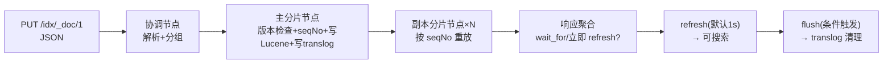

写入语义的三个时间尺度（务必分清，与 GET/搜索行为直接相关）：

| 时刻 | 事件 | 用户可感知的效果 |
|---|---|---|
| 写返回 | 版本进 `versionMap`、操作进 translog（可能已 fsync） | GET 可见（realtime）；**搜索不可见** |
| refresh（默认 1s） | 新段可见于搜索 reader | 搜索可见 |
| flush（30min 或 translog 满等） | Lucene commit + translog 滚动清空 | 持久化边界、恢复起点缩短 |

---

## 2. 总体架构图

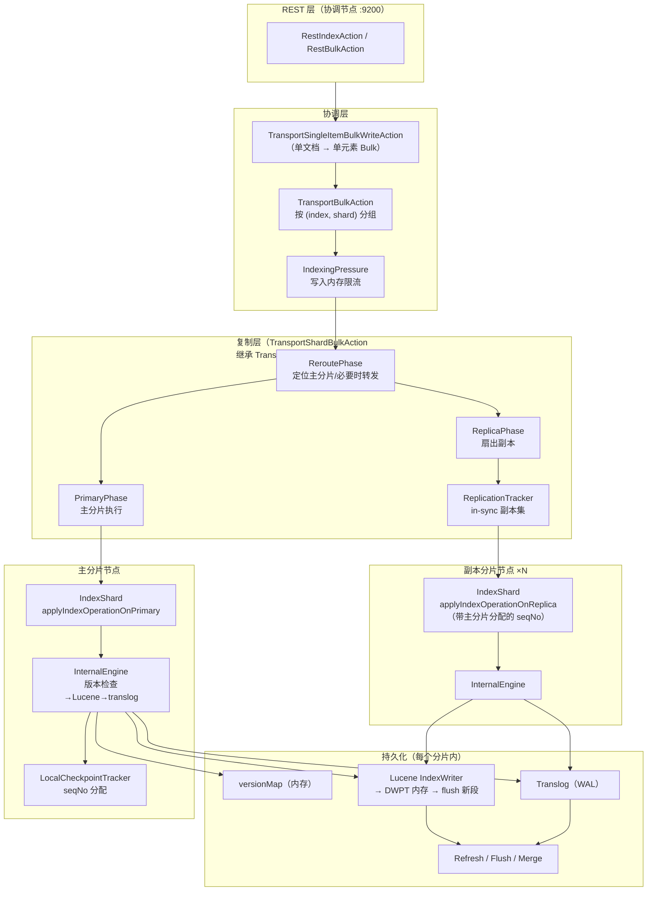

---

## 3. REST 层：参数解析与请求构造

文件：`server/src/main/java/org/elasticsearch/rest/action/document/RestIndexAction.java`、`RestBulkAction.java`

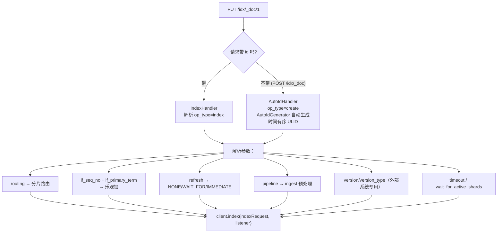

要点：

- **自动生成 id 是时间有序的 ULID**：顺序写入天然落进同一时间前缀，利于排序与压缩；且自动 id 写入在重复提交时可幂等去重（`isRetry` 标志参与版本判断）
- `op_type=create`（`PUT /_create` 或 POST 无 id）：文档已存在则 409
- **乐观锁**：`if_seq_no + if_primary_term` 是 7.x 推荐用法（取代旧 version）；GET 响应里返回的 seqNo/primaryTerm 直接回填即可实现 CAS

---

## 4. 协调层：单文档转 Bulk 与按分片分组

文件：`server/src/main/java/org/elasticsearch/action/bulk/`

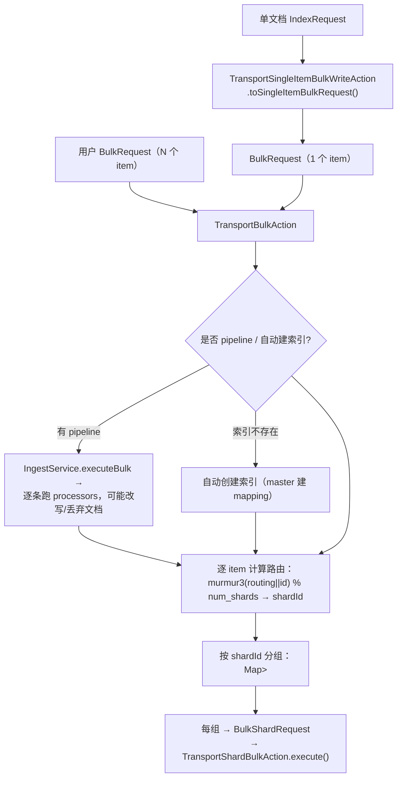

设计精髓：**单文档写入是 bulk 的特例**——7.x 把 `TransportIndexAction` 标记废弃，统一走 `TransportSingleItemBulkWriteAction` 转 bulk 路径，一套代码覆盖单写与批量写。

---

## 5. TransportReplicationAction 三阶段：Reroute → Primary → Replica

文件：`server/src/main/java/org/elasticsearch/action/support/replication/TransportReplicationAction.java`——**所有写操作的通用复制骨架**（bulk、delete、merge、global-ordinals 等 15+ 个 action 复用）。

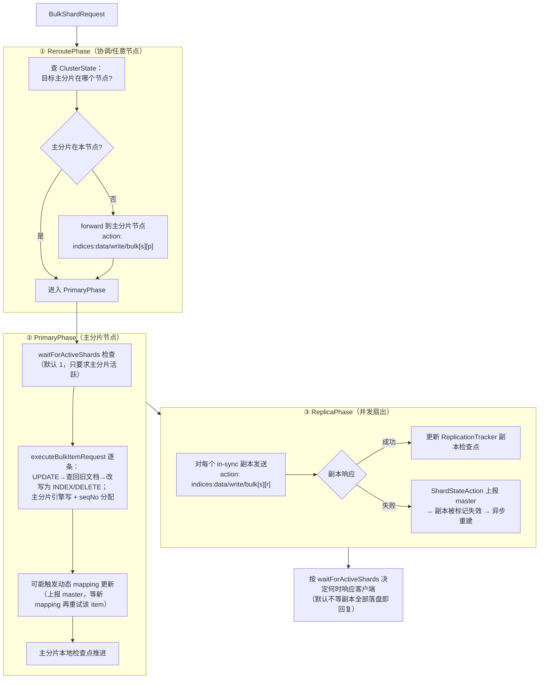

三个关键语义：

1. **主分片是唯一的 seqNo 分配者**：所有写操作先路由到主分片（ReroutePhase 保证），保证副本按相同顺序重放
2. **副本失败不阻塞响应**：响应里的 `ShardInfo.failed` 告知哪些副本没写成；失效副本由 master 重分配后通过 **分片恢复（peer recovery）** 补齐
3. **UPDATE 是两次操作**：协调/主分片节点先 GET 旧文档（走 realtime 读）、脚本/partial 合并后变成新的 INDEX 写入——所以 update 不是原子的"原地修改"

---

## 6. 主分片写入：seqNo 分配与动态 mapping

文件：`server/src/main/java/org/elasticsearch/index/shard/IndexShard.java`、`index/seqno/LocalCheckpointTracker.java`

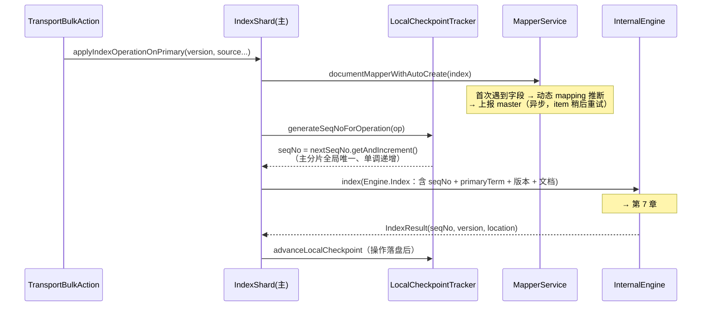

- **seqNo**：分片内每个写操作的全局序号（主分片分配、副本沿用），是副本一致性、全局检查点、恢复去重的基础
- **primaryTerm**：主分片任期号，随主分片重新选举递增——旧主"复活"后的过期写入会因 term 不匹配被拒绝（防脑裂双写）
- **动态 mapping 代价**：第一个触发新字段的写请求要多一轮 master 往返，是 bulk 首批请求慢的常见原因

---

## 7. 引擎层：InternalEngine.index 全流程（核心）

文件：`server/src/main/java/org/elasticsearch/index/engine/InternalEngine.java`

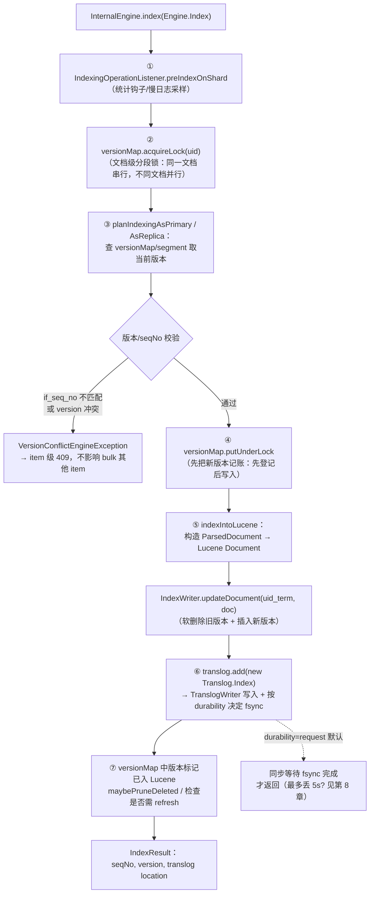

逐步拆解：

1. **文档级锁**（`versionMap.acquireLock`）：同 `_id` 的并发写天然串行化——这是 ES 实现 per-doc 乐观并发控制的物理基础。锁内做完"读版本→比对→登记→写 Lucene→写 translog"
2. **版本决策**（`planIndexingAsPrimary`）：
   - 当前版本来自 versionMap（含未 refresh 的）；不在则查 Lucene（`getFromSearcher`，内部 realtime searcher）
   - `if_seq_no/if_primary_term` 不匹配 → 409；`op_type=create` 且已存在 → 409；外部 version_type 按用户语义比较
3. **先记账后写**：`versionMap.putUnderLock` 先登记新版本，此后哪怕 Lucene 写入中，realtime GET 看到的也是最新版本（location 指向 translog）
4. **写 Lucene**：`indexIntoLucene` 按 origin 选择策略——新文档 `addDocument`，覆盖写 `updateDocument(uid_term, ...)`（内部即"按 _id 软删旧版 + 插入新版"，对照《Lucene指南》第 5 章：DWPT 删除队列 + 新文档同批 flush）
5. **写 translog**：操作追加进 translog，`location` 返回给上层（副本写、`refresh=wait_for`、flush 等都要用）
6. **软删除**：7.x 写删除是 **Lucene soft-delete**（`updateDocument` 携带 soft delete field 打标），使旧版本文档在 merge 前仍可被"打捞"——服务于副本恢复（history retention）与 retention lease

---

## 8. Translog：持久化与 fsync 策略

文件：`server/src/main/java/org/elasticsearch/index/translog/`

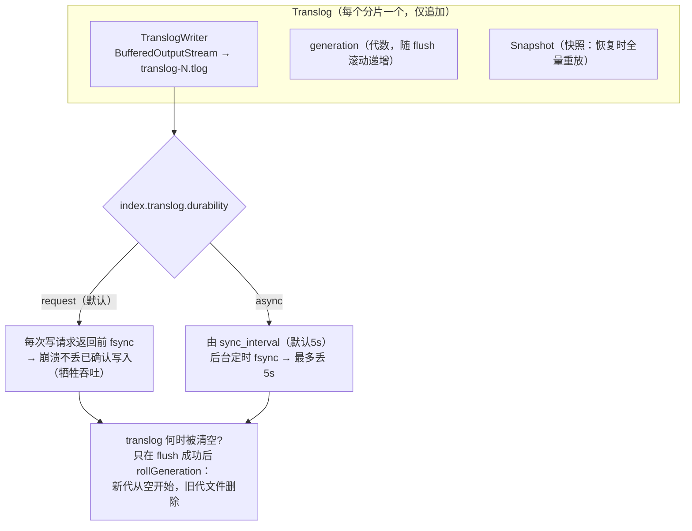

- **Translog.Operation 三种**：`Index` / `Delete` / `NoOp`（版本跳过的空操作）
- **作用**：填补"写已确认但 Lucene 尚未 commit"的窗口。分片重启/副本重建时：先加载上次 commit 的段 → **重放 translog 快照**追平
- `index.translog.flush_threshold_size`（默认 512MB）：translog 超限时**条件性 flush**（7.x 由 flush 策略后台评估，见 `InternalEngine` flush 检查点），防止 translog 无限膨胀

---

## 9. refresh 与 flush：可见性与持久化的阶梯

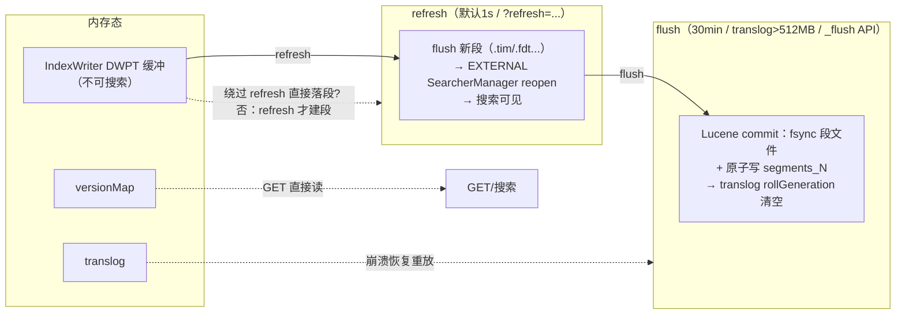

**RefreshPolicy 三种取值**（`?refresh=` 参数，作用在分片层响应之后）：

| 取值 | 行为 | 代价 |
|---|---|---|
| `NONE`（默认） | 什么都不做，等 1s 定时 refresh | 无 |
| `wait_for`（`RefreshPolicy.WAIT_FOR`） | 阻塞响应直到该操作参与的 refresh 完成 | 增加延迟但摊薄成本（并发请求共享同一次 refresh），与 translog durability=request 组合实现"读己之写"的搜索可见 |
| `true`（IMMEDIATE） | 响应前**立即强制 refresh** | 每次一个小段，段爆炸 → merge 压力，仅适合低频写入 |

**flush 的完整链**：`IndexShard.flush` → `InternalEngine.flush` → ① `IndexWriter.commit()`（写 `pending_segments_N` → fsync → 原子 rename，对照《Lucene指南》第 7 章的事务协议）→ ② `translog.rollGeneration()`（新代清零）→ ③ 同步全局检查点。此后恢复起点 = 最近 commit，translog 只保留增量。

---

## 10. seqNo / 本地检查点 / 全局检查点

文件：`server/src/main/java/org/elasticsearch/index/seqno/`

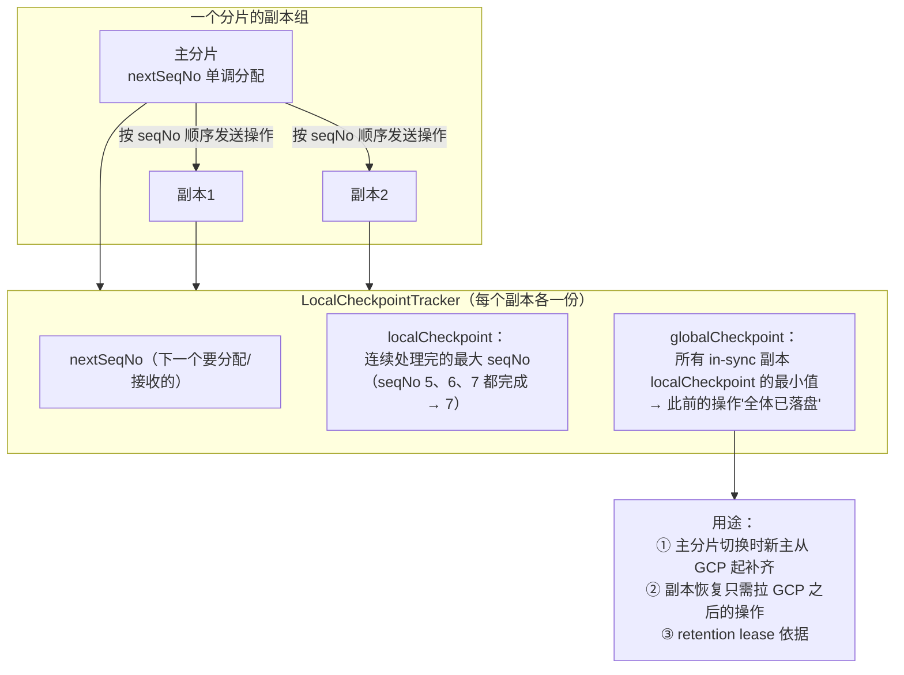

- **为什么需要"连续"的 localCheckpoint**：seqNo 完成可能乱序（bulk 并发），checkpoint 特指**无空洞前缀**——这是所有副本达到一致状态的判定标准
- **全局检查点推进**：主分片收集各副本 ACK 后下调 `globalCheckpoint` 并异步广播（`AsyncGlobalCheckpointSync`）
- **主分片故障切换**：新主（更高 primaryTerm）依据全局检查点向旧副本/历史（软删除保留的操作）补齐缺失操作——seqNo + 软删除 + retention lease 共同构成 7.x 的数据不丢基石

---

## 11. 一致性、容错与限流

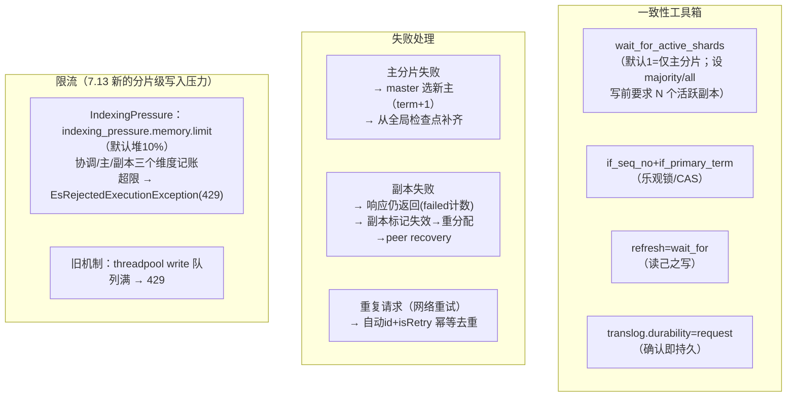

**注意主从写语义与关系型数据库不同**：ES 的"写成功"默认只保证**主分片 + translog fsync**（`durability=request` 时），不等所有副本——它是**最终一致的分布式系统**，一致性按需用 `wait_for_active_shards` 加强。

---

## 12. 端到端时序图

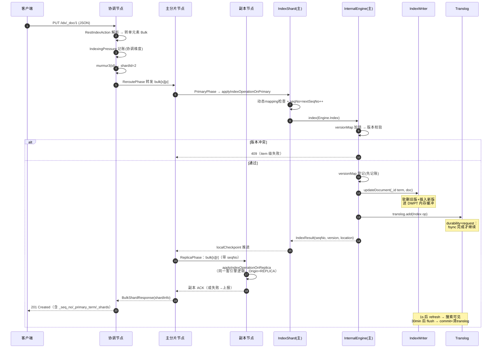

---

## 13. 关键问题 Q&A

**Q1：写入返回 201 了，为什么搜不到？**
返回只代表"主分片引擎 + translog 完成"。搜索可见需要 refresh（默认 1s）。要"写完即搜到"：`?refresh=wait_for`（推荐）或 `?refresh=true`（代价大）。

**Q2：写入会丢吗？**
默认 `translog.durability=request`：响应前 translog 已 fsync，节点崩溃可恢复，**已确认的写不丢**。改成 `async` 换吞吐，最多丢 `sync_interval`（5s）内的写。

**Q3：副本没写成功，为什么请求还是成功？**
响应 `_shards` 里 `failed` 会计数。ES 默认不等全部副本——失效副本被替换后通过 peer recovery 补数据。要更强保证：`?wait_for_active_shards=majority`。

**Q4：ES 是怎么实现"更新"的？**
没有原地更新。`update` = realtime GET 旧文档 → 合并（脚本/partial）→ 作为新版本 INDEX 写入（`updateDocument` 软删旧版）。所以频繁 update 会产生大量待 merge 的删除标记。

**Q5：seqNo 和 version 有什么区别？**
version 是**文档维度**的逻辑版本（对外可见，用于乐观锁）；seqNo 是**分片维度**的操作序号（内部用于副本顺序、检查点、恢复）。`if_seq_no` 实际是拿操作序号做更精确的 CAS。

**Q6：为什么大量 bulk 后磁盘涨、写入变慢？**
每次 refresh 一个小段 → 段过多 → TieredMergePolicy 后台 merge（读旧写新）占 IO/CPU。调 `refresh_interval`、`index.translog.flush_threshold_size`，或接受 merge 延迟是常规优化。

---

## 14. 关键源码索引

| 层 | 类 | 文件 |
|---|---|---|
| REST | `RestIndexAction` / `RestBulkAction` | `server/src/main/java/org/elasticsearch/rest/action/document/` |
| 自动 id | `AutoIdGenerator` | `server/src/main/java/org/elasticsearch/action/auto/AutoIdGenerator.java`（TimeBasedUUID 语义） |
| 单转 bulk | `TransportSingleItemBulkWriteAction` | `server/src/main/java/org/elasticsearch/action/bulk/` |
| 分组分片 | `TransportBulkAction` | `server/src/main/java/org/elasticsearch/action/bulk/TransportBulkAction.java` |
| 复制骨架 | `TransportReplicationAction`（Reroute/Primary/Replica Phase） | `server/src/main/java/org/elasticsearch/action/support/replication/` |
| 主分片批量执行 | `TransportShardBulkAction` | `server/src/main/java/org/elasticsearch/action/bulk/TransportShardBulkAction.java` |
| 分片入口 | `IndexShard.applyIndexOperationOnPrimary/OnReplica` | `server/src/main/java/org/elasticsearch/index/shard/IndexShard.java` |
| 引擎 | `InternalEngine.index / delete / planIndexingAsPrimary` | `server/src/main/java/org/elasticsearch/index/engine/InternalEngine.java` |
| 版本表 | `LiveVersionMap` / `VersionValue` | `server/src/main/java/org/elasticsearch/index/engine/` |
| 序号 | `LocalCheckpointTracker` / `GlobalCheckpointSync` | `server/src/main/java/org/elasticsearch/index/seqno/` |
| 副本跟踪 | `ReplicationTracker`（in-sync 集合 / retention leases） | `server/src/main/java/org/elasticsearch/index/seqno/ReplicationTracker.java` |
| translog | `Translog` / `TranslogWriter` / `Translog.Operation` | `server/src/main/java/org/elasticsearch/index/translog/` |
| 限流 | `IndexingPressure` | `server/src/main/java/org/elasticsearch/index/IndexingPressure.java` |
| 动态 mapping | `MapperService.documentMapperWithAutoCreate` | `server/src/main/java/org/elasticsearch/index/mapper/MapperService.java` |

---

## 总结

1. **写入是一条"层层递减扇出"的流水线**：REST（1）→ bulk 分组（N 个分片）→ 主分片（唯一 seqNo 来源）→ in-sync 副本（并发重放）。`TransportReplicationAction` 的 Reroute→Primary→Replica 三阶段是所有写操作共享的骨架。
2. **引擎层一次写 = 锁内五步**：`versionMap` 锁 → 版本决策 → 先记账 → `IndexWriter.updateDocument`（软删+插入）→ `translog.add`（fsync）。文档级锁保证了 per-doc 乐观并发，translog 填补了 refresh/commit 的可见性缝隙。
3. **一致性是"可选增强"而不是默认**：默认写成功 = 主分片 + translog fsync；`wait_for_active_shards` / `refresh=wait_for` / `if_seq_no` 分别解决副本数、搜索可见性、并发冲突三个维度——理解这些开关的层级，就理解了 ES 写语义的全部。
