# Elasticsearch 7.13.0 启动流程与插件加载机制源码深度剖析

> 基于 Elasticsearch 7.13.0 源码
> 涉及类：`bootstrap.Elasticsearch`、`bootstrap.Bootstrap`、`node.Node`、`plugins.PluginsService`、`discovery.zen.ZenDiscovery`

---

## 目录

1. [总体架构鸟瞰：从脚本到集群就绪](#1-总体架构鸟瞰从脚本到集群就绪)
2. [阶段一：启动脚本与 JVM 准备](#2-阶段一启动脚本与-jvm-准备)
3. [阶段二：main() 入口](#3-阶段二main-入口)
4. [阶段三：Bootstrap.init() 安全初始化](#4-阶段三bootstrapinit-安全初始化)
5. [阶段四：Node 构造器——组件装配流水线](#5-阶段四node-构造器组件装配流水线)
6. [阶段五：Node.start()——组件启动顺序](#6-阶段五nodestart组件启动顺序)
7. [阶段六：集群发现与选主](#7-阶段六集群发现与选主)
8. [Lifecycle 生命周期状态机](#8-lifecycle-生命周期状态机)
9. [插件加载机制全景](#9-插件加载机制全景)
10. [Plugin 扩展点完整清单](#10-plugin-扩展点完整清单)
11. [核心功能如何以"插件"形式注册](#11-核心功能如何以插件形式注册)
12. [端到端时序图](#12-端到端时序图)
13. [关键源码索引](#13-关键源码索引)

---

## 1. 总体架构鸟瞰：从脚本到集群就绪

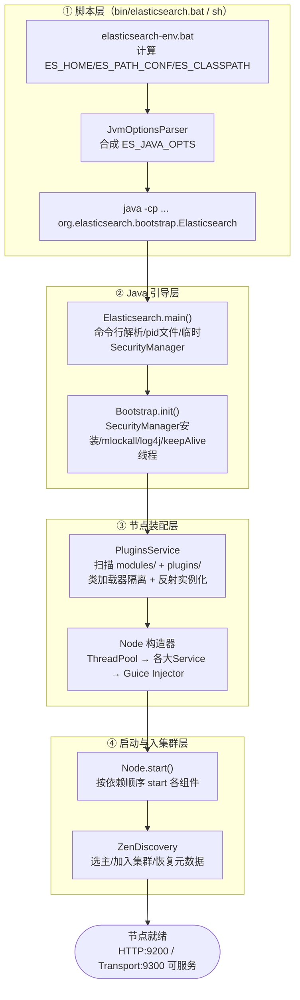

四个阶段各回答一个问题：

| 阶段 | 回答的问题 | 关键类 |
|---|---|---|
| ① 脚本层 | 用什么 JVM、什么参数启动？ | `elasticsearch-env.bat`、`JvmOptionsParser` |
| ② 引导层 | 如何安全地进入受控环境？ | `Elasticsearch`、`Bootstrap` |
| ③ 装配层 | 一个节点由哪些组件组成、怎么组装？ | `Node`、`PluginsService` |
| ④ 启动层 | 组件按什么顺序激活、怎么加入集群？ | `Node.start()`、`ZenDiscovery` |

---

## 2. 阶段一：启动脚本与 JVM 准备

`distribution/src/bin/elasticsearch.bat`（前面已分析过的启动脚本）：

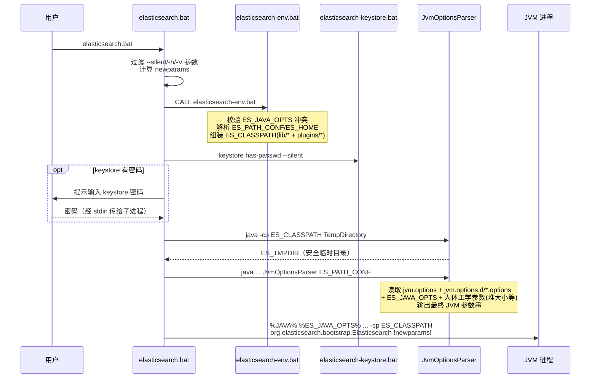

要点：

- **keystore 密码走 stdin 管道**（`ECHO.!KEYSTORE_PASSWORD!|`），不暴露在命令行参数里
- `ES_CLASSPATH` 包含 `lib/*` **和 `plugins/*` 下的 jar**——插件 jar 在 JVM 启动时就被放进主 classpath 供 JarHell 冲突检查，但插件的业务类是后来由独立类加载器加载的（见第 9 章）
- `TempDirectory` 工具为 JVM 创建安全临时目录（防 `/tmp` 符号链接攻击）

---

## 3. 阶段二：main() 入口

`server/src/main/java/org/elasticsearch/bootstrap/Elasticsearch.java`：

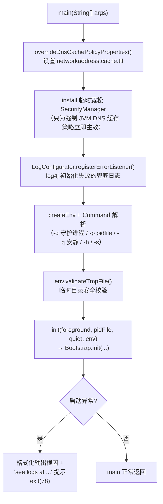

细节说明：

- **单实例检测**：配置了 `node.max_local_storage_nodes`/pid 文件时，`Bootstrap.init` 内部通过 `PidFile.create()` 原子创建 pid 文件；同目录已有活动实例则启动失败，防止双写数据目录
- `-d` 守护进程模式下 fork 子进程并 detach stdin/stdout
- **为什么先装一个"假"SecurityManager**：JVM 只在 SecurityManager 已安装时才接受 `networkaddress.cache.ttl` 覆盖，先装一个全放行的占位管理器，后面 `Bootstrap` 再替换为真正的严格管理器

---

## 4. 阶段三：Bootstrap.init() 安全初始化

`server/src/main/java/org/elasticsearch/bootstrap/Bootstrap.java`——整个启动流程中**安全语义最重**的一段：

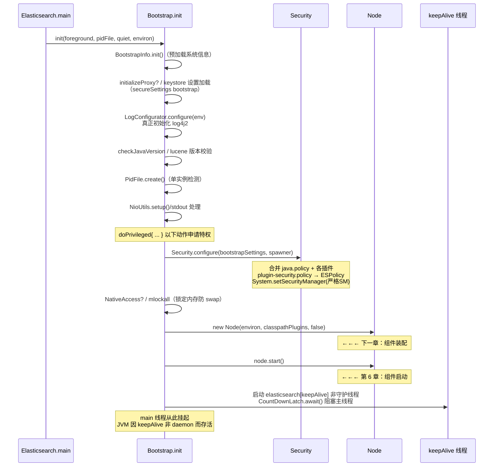

### 安全初始化核心：ESPolicy

`bootstrap.Security` + `ESPolicy`（同包）：

- **代码源分级授权**：`ESPolicy` 按代码来源把权限分成三类——系统级（server jar、lib 下所有 jar 全权限）、模块级（`modules/` 下按各自 policy 授予）、插件级（`plugins/` 下严格白名单）
- 插件 jar 里声明的 `plugin-security.policy` 在此刻被合并进全局策略；**安装时**（plugin-cli）就校验过权限必须在允许清单内，启动时再次合入
- `Spawner`：处理需要 `has.native.controller` 的插件（如控制本地原生进程），允许受控地执行外部命令

> 这就是为什么 ES 不需要 Java Agent：安全插桩点全部在 `doPrivileged` 边界 + `ESPolicy` 运行时检查里显式声明。

---

## 5. 阶段四：Node 构造器——组件装配流水线

`server/src/main/java/org/elasticsearch/node/Node.java` 是整个 ES 最长的方法之一（约 800 行）。核心思想：**构造即装配，全部为 Guice 单例，start() 只做轻量激活**。

### 5.1 组件创建顺序总览

```mermaid
flowchart TB
    subgraph Phase1["Phase 1：插件与基础设施"]
        A1["PluginsService<br/>扫描+实例化全部插件"] --> A2["Environment / NodeEnvironment<br/>（数据目录锁：write lock by UUID）"]
        A2 --> A3["ThreadPool<br/>（含插件提供的 ExecutorBuilder）"]
        A3 --> A4["ResourceWatcherService<br/>（热加载 watcher）"]
    end
    subgraph Phase2["Phase 2：语言与索引能力"]
        A4 --> B1["ScriptService（脚本引擎：Painless/Mustache…）"]
        B1 --> B2["AnalysisRegistry（分词器体系）"]
        B2 --> B3["NamedWriteable/XContent Registry"]
    end
    subgraph Phase3["Phase 3：集群与索引服务"]
        B3 --> C1["CircuitBreakerService / BigArrays"]
        C1 --> C2["ClusterService（集群状态机）"]
        C2 --> C3["IngestService（管道预处理）"]
        C3 --> C4["IndicesService（分片/引擎容器）<br/>+ IndicesClusterStateService"]
        C4 --> C5["SnapshotsService / RestoreService<br/>RepositoriesService"]
    end
    subgraph Phase4["Phase 4：网络层"]
        C5 --> D1["NetworkService"]
        D1 --> D2["TransportService（9300 RPC）"]
        D2 --> D3["HttpServerTransport（9200）"]
    end
    subgraph Phase5["Phase 5：发现与收尾"]
        D3 --> E1["DiscoveryModule → ZenDiscovery"]
        E1 --> E2["MonitorService（JVM/OS 指标）"]
        E2 --> E3["GatewayService / GatewayMetaState"]
        E3 --> E4["Guice Injector.createInjector"]
        E4 --> E5["NodeClient 注入 / NodeService 聚合"]
    end
```

### 5.2 关键依赖关系

| 组件 | 硬依赖 | 说明 |
|---|---|---|
| `PluginsService` | Settings | **必须是第一个被创建的服务**——后续所有模块都要向它要插件列表 |
| `ThreadPool` | 插件 ExecutorBuilder | 插件可注入自定义线程池（如 `searchable_snapshots` 池） |
| `ClusterService` | ThreadPool, ClusterSettings | 集群状态发布/订阅的核心 |
| `IndicesService` | ThreadPool, BigArrays, ScriptService, AnalysisRegistry… | 持有全部 `IndexService`（每个索引一个，内含 `IndexShard`→`InternalEngine`） |
| `TransportService` | NetworkModule(由 NetworkPlugin 决定 Netty4) | 与上一份网络架构文档衔接 |
| `DiscoveryModule` | TransportService, ClusterService, 候选 master 配置 | 7.13 默认 `zen`（协调者模式），选 `multi` 需显式配置 |

### 5.3 NodeEnvironment 的数据目录锁

Node 构造早期就获取数据目录 `write.lock`（基于节点 UUID）——**防止同一数据目录被两个进程同时打开**（与脚本层的 pid 文件互补：pid 防同机双实例，lock 防任何形式的数据目录复用）。

---

## 6. 阶段五：Node.start()——组件启动顺序

启动顺序经过精心编排，原则：**先能接收集群内部消息，再开始参与集群，最后才对外（HTTP）暴露**——避免"HTTP 已可达但集群未就绪"的假在线。

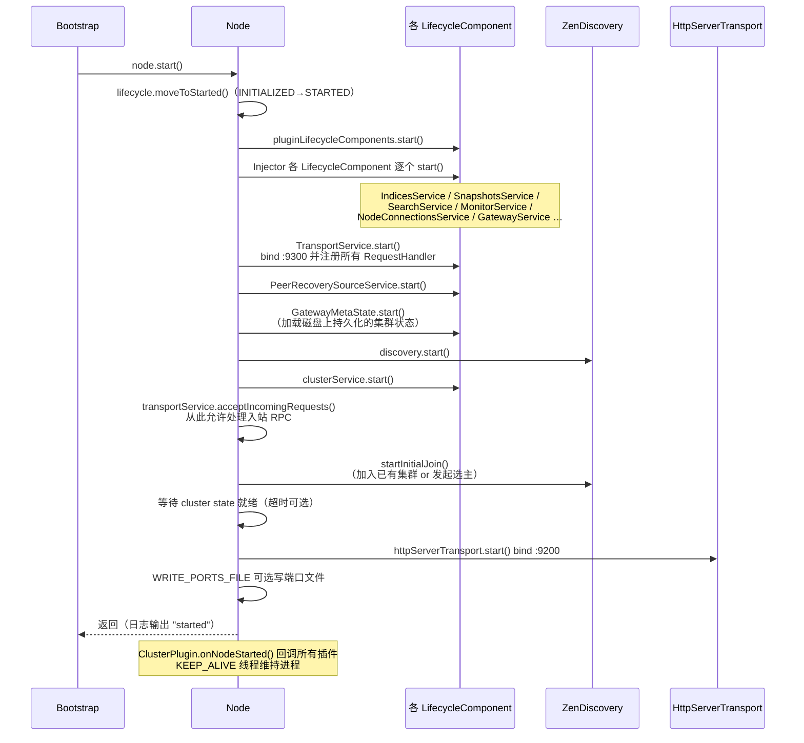

### 为什么要 `acceptIncomingRequests()` 单独一步？

`TransportService.start()` 只负责 bind 和注册 handler，此时入站请求仍被丢弃/排队；等 discovery 与 clusterService 就绪后才调用 `acceptIncomingRequests()` 放行——**保证加入集群前不会处理任何基于集群状态的 RPC**（否则节点拿到不完整的路由表会答错）。

---

## 7. 阶段六：集群发现与选主

`server/src/main/java/org/elasticsearch/discovery/zen/ZenDiscovery.java`（7.13 默认协调者模式）：

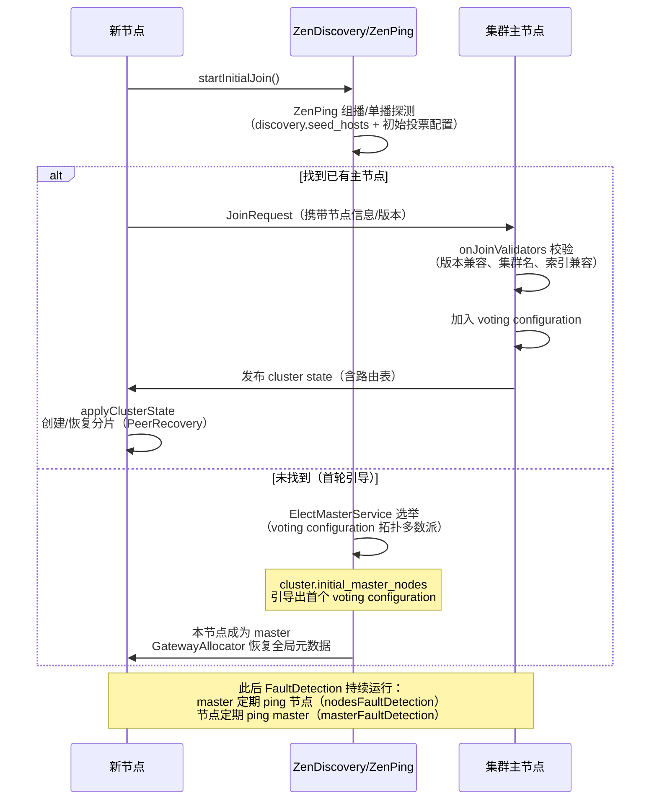

关键点：

- **voting configuration**（7.x 核心改进）：主节点由"投票配置"多数派确认，`cluster.initial_master_nodes` 只在**首次**引导一个全新集群时需要
- 加入集群前要过 `onJoinValidators`（版本、索引兼容性检查），滚动升级中老版本节点会被拒之门外
- 集群状态就绪后，`IndicesClusterStateService` 依据路由表创建本地持有的分片，无主分片数据的走 **Peer Recovery** 从副本拷贝（走 9300 Transport 通道）

---

## 8. Lifecycle 生命周期状态机

`server/src/main/java/org/elasticsearch/common/component/Lifecycle.java`：

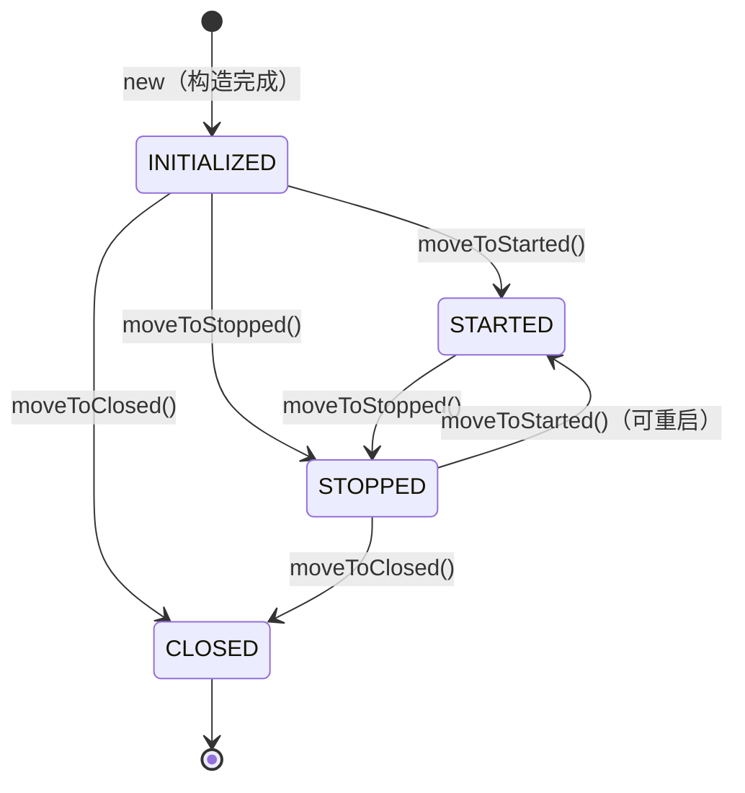

- 状态转换是**原子 CAS**，非法转换（如 CLOSED→STARTED）直接抛异常——构造与启动/停止解耦正是为了让"重启组件"成为合法操作（如 `InternalEngine` rollover、`IndexShard` 重开）
- Guice 中绑定 `LifecycleComponent` 的实例会被 `Node.start()` 遍历启动；`PluginsService.getGuiceServiceClasses()` 声明的插件服务类也进入同一机制

---

## 9. 插件加载机制全景

### 9.1 总体流程

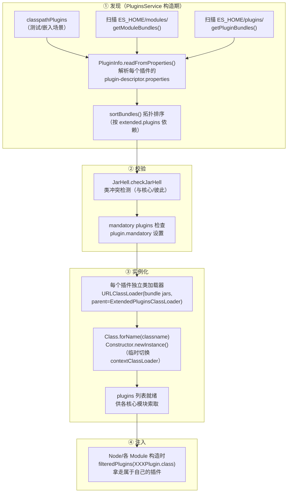

### 9.2 plugin-descriptor.properties 字段

| 字段 | 说明 |
|---|---|
| `name` | 插件唯一名（目录名必须一致） |
| `classname` | 插件主类全限定名（被反射实例化） |
| `elasticsearch.version` | 必须与节点版本完全一致 |
| `java.version` | 编译用的 JDK 版本 |
| `extended.plugins` | 依赖的其他插件名（决定加载顺序与父类加载器可见性） |
| `has.native.controller` | 是否有原生控制器进程（对接 Spawner） |
| `type` | `isolated`（普通隔离插件）/ `bootstrap`（引导型，可带 `java.opts`） |
| `licensed` | 是否商业授权 |

### 9.3 类加载器隔离模型

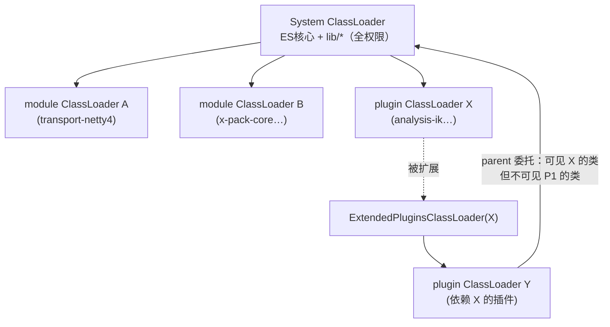

- **parent 委托到 `ExtendedPluginsClassLoader`**：插件 Y 声明 `extended.plugins=X` 后，Y 能看到 X 的类，但**看不到其他插件 P1 的类**——精确的横向隔离
- **JarHell**：加载前逐一比对类路径，任何重复类（半限定名冲突）直接拒绝启动，把"NoClassDefFoundError 运行期炸"提前到启动期
- **权限域**：每个插件的 CodeSource 挂各自的 `plugin-security.policy` 授权，普通插件只能申请白名单内权限（modules/ 权限宽于 plugins/）

### 9.4 modules/ 与 plugins/ 的区别

| | `modules/` | `plugins/` |
|---|---|---|
| 来源 | 官方随发行版内置 | `elasticsearch-plugin install` 安装 |
| 能否卸载 | 否（发行版的一部分） | 可以 remove |
| 权限 | 更宽松（受信代码） | 严格白名单沙箱 |
| 例子 | transport-netty4、x-pack-core、ingest-* | analysis-ik、repository-s3 |

---

## 10. Plugin 扩展点完整清单

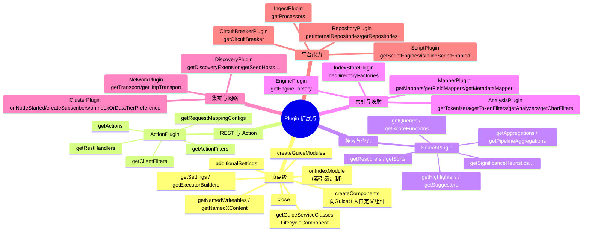

> 这些接口全部位于 `server/src/main/java/org/elasticsearch/plugins/` 包。一个插件类可以同时实现多个（如 `repository-s3` 同时是 `RepositoryPlugin` + 声明自定义设置）。

---

## 11. 核心功能如何以"插件"形式注册

ES 很多"看起来像内核"的能力其实通过同一套插件接口注册——这正是理解 `Plugin` 接口价值的最好例子：

| 核心能力 | 实现插件 | 注册点 |
|---|---|---|
| Netty4 传输（9200/9300） | `NettyPlugin`（transport-netty4 module） | `NetworkPlugin` |
| Lucene 引擎（InternalEngine） | `InternalEnginePlugin`（server 内部） | `EnginePlugin` |
| Painless / Mustache 脚本 | `PainlessPlugin` / `MustachePlugin` | `ScriptPlugin` |
| 标准/IK 等分词器 | `AnalysisPlugin` 实现 | `AnalysisRegistry` |
| ingest 通用/Grok 处理器 | `IngestCommonPlugin` | `IngestPlugin` |
| FS/S3/HDFS 快照仓库 | 各 RepositoryPlugin | `RepositoriesService` |
| x-pack 全家桶（安全/SQL/CCR…） | x-pack 各子插件 | 几乎所有接口 |

**注入路径示例（HTTP 层如何拿到 Netty）**：

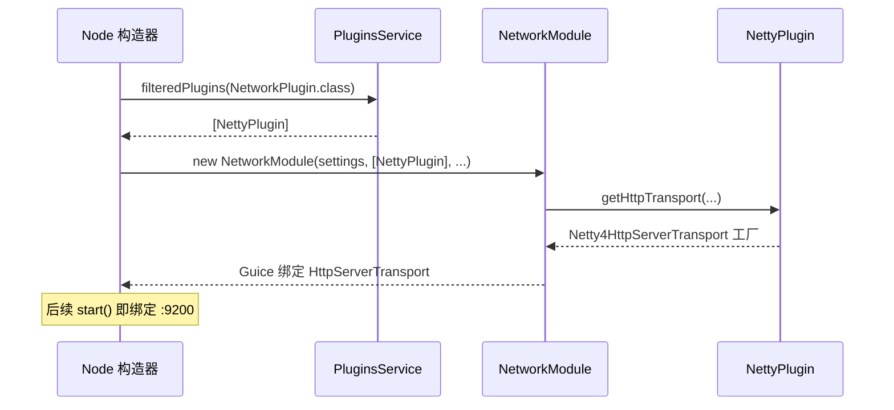

同理：`ActionModule` 收 `ActionPlugin` 列表注册 REST/Transport handler；`IndicesModule` 收 `MapperPlugin/EnginePlugin`；`SearchModule` 收 `SearchPlugin`——**所有"内核可替换点"都收敛为"构造时向 PluginsService 要一批实现了某接口的插件"**。

---

## 12. 端到端时序图

从敲下 `elasticsearch` 命令到 `curl :9200` 得到响应的完整链路：

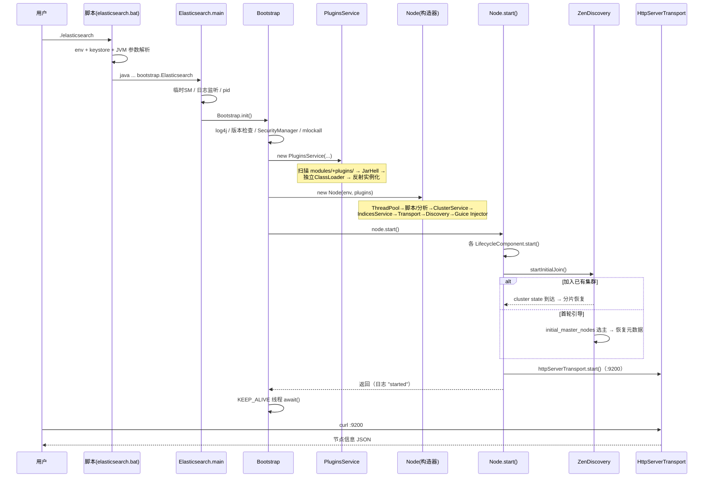

---

## 13. 关键源码索引

| 组件 | 文件 |
|---|---|
| main 入口 | `server/src/main/java/org/elasticsearch/bootstrap/Elasticsearch.java` |
| 安全引导 | `server/src/main/java/org/elasticsearch/bootstrap/Bootstrap.java` |
| SecurityManager 安装 | `server/src/main/java/org/elasticsearch/bootstrap/Security.java` |
| 权限策略 | `server/src/main/java/org/elasticsearch/bootstrap/ESPolicy.java` |
| pid 文件 | `server/src/main/java/org/elasticsearch/bootstrap/PidFile.java` |
| 节点装配/启动 | `server/src/main/java/org/elasticsearch/node/Node.java` |
| 数据目录/节点锁 | `server/src/main/java/org/elasticsearch/env/NodeEnvironment.java` |
| 生命周期状态机 | `server/src/main/java/org/elasticsearch/common/component/Lifecycle.java` |
| 插件服务（发现/加载） | `server/src/main/java/org/elasticsearch/plugins/PluginsService.java` |
| 插件描述符 | `server/src/main/java/org/elasticsearch/plugins/PluginInfo.java` |
| 插件扩展点接口 | `server/src/main/java/org/elasticsearch/plugins/`（ActionPlugin/SearchPlugin/…） |
| 插件间类可见 | `server/src/main/java/org/elasticsearch/plugins/ExtendedPluginsClassLoader.java` |
| 类冲突检查 | `server/src/main/java/org/elasticsearch/bootstrap/JarHell.java` |
| 发现与选主 | `server/src/main/java/org/elasticsearch/discovery/zen/ZenDiscovery.java` |
| Netty 插件注册 | `modules/transport-netty4/src/main/java/org/elasticsearch/transport/netty4/NettyPlugin.java` |

---

## 总结

1. **启动是五段接力**：脚本定参数 → `main` 做最小化前置 → `Bootstrap` 装好"安全外壳"（SecurityManager/pid/mlockall/log4j）→ `Node` 构造器把几十个服务按依赖顺序装配成 Guice 图 → `start()` 按"先内部、后集群、最后 HTTP"的顺序激活。
2. **插件先于一切**：`PluginsService` 是 Node 构造的第一个服务；内核的每个可替换点（网络/引擎/分词/搜索/发现…）都定义成一个插件接口，模块与第三方插件走**同一套**发现—校验—隔离—实例化—注入流水线。
3. **两道防线保证安全与单实例**：pid 文件（进程级）+ NodeEnvironment write.lock（数据目录级）；插件侧则是 JarHell（类冲突）+ ESPolicy（权限沙箱）+ 独立类加载器（可见性隔离）。
4. **就绪顺序有讲究**：`acceptIncomingRequests()` 在 discovery 之后、HTTP 在集群加入之后——节点对外可见时，它一定已经能正确回答路由与集群相关问题。
