# Elasticsearch 7.13.0 网络通信架构源码深度剖析

> 基于 Elasticsearch 7.13.0 源码（`server` 模块 + `modules/transport-netty4` 模块）
> 涉及包：`org.elasticsearch.transport`、`org.elasticsearch.http`、`org.elasticsearch.rest`、`org.elasticsearch.client.node`

---

## 目录

1. [总体架构鸟瞰](#1-总体架构鸟瞰)
2. [两条通信通道：HTTP vs Transport](#2-两条通信通道http-vs-transport)
3. [HTTP REST 通信链路（9200 端口）](#3-http-rest-通信链路9200-端口)
4. [节点间 Transport 通信链路（9300 端口）](#4-节点间-transport-通信链路9300-端口)
5. [传输协议与编解码](#5-传输协议与编解码)
6. [连接管理与握手](#6-连接管理与握手)
7. [线程模型](#7-线程模型)
8. [一次搜索请求的端到端时序](#8-一次搜索请求的端到端时序)
9. [可靠性机制：超时、重试、背压、熔断](#9-可靠性机制超时重试背压熔断)
10. [关键源码索引](#10-关键源码索引)

---

## 1. 总体架构鸟瞰

Elasticsearch 的网络层完全构建在 **Netty 4** 之上（通过 `transport-netty4` 插件模块），对外暴露两套独立的通信体系：

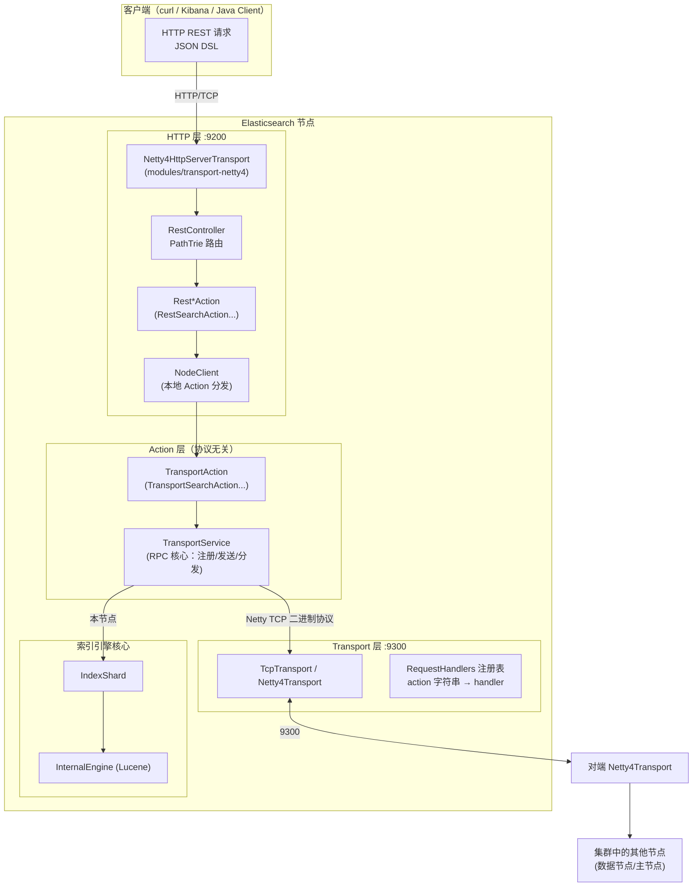

核心设计思想：

| 设计点 | 说明 |
|---|---|
| **协议无关的 Action 层** | `TransportAction` 不知道请求来自 HTTP 还是 Transport，统一通过 `TransportService` 的 `sendRequest` / `registerRequestHandler` 通信 |
| **NodeClient 本地短路** | 收到 REST 请求的协调节点通过 `NodeClient.executeLocally` 在本地发起 Action，而不是网络回环 |
| **插件化传输实现** | `TcpTransport`/`HttpServerTransport` 是抽象，Netty4 只是默认实现（理论上可替换为其他网络库） |

---

## 2. 两条通信通道：HTTP vs Transport

| 维度 | HTTP 通道（9200） | Transport 通道（9300） |
|---|---|---|
| 抽象接口 | `HttpServerTransport`（`server/.../http/HttpServerTransport.java`） | `Transport`（`server/.../transport/Transport.java`） |
| 默认实现 | `Netty4HttpServerTransport` | `Netty4Transport` |
| 协议 | HTTP/1.1 + JSON（支持 chunked、gzip） | ES 私有二进制协议（ES header + StreamOutput 序列化） |
| 服务对象 | 外部客户端 | 集群内部节点间 RPC（含跨集群 CCS） |
| 消息路由 | URL 路径 + HTTP Method（PathTrie） | action 字符串（`RequestHandlers` 注册表） |
| 压缩 | `http.compression`（默认开，级别 3） | `transport.compress`（默认关，DEFLATE 级别 3） |
| 连接复用 | HTTP Pipelining（`Netty4HttpPipeliningHandler`，默认上限 10000） | 每节点多连接池（ConnectionProfile 分级） |

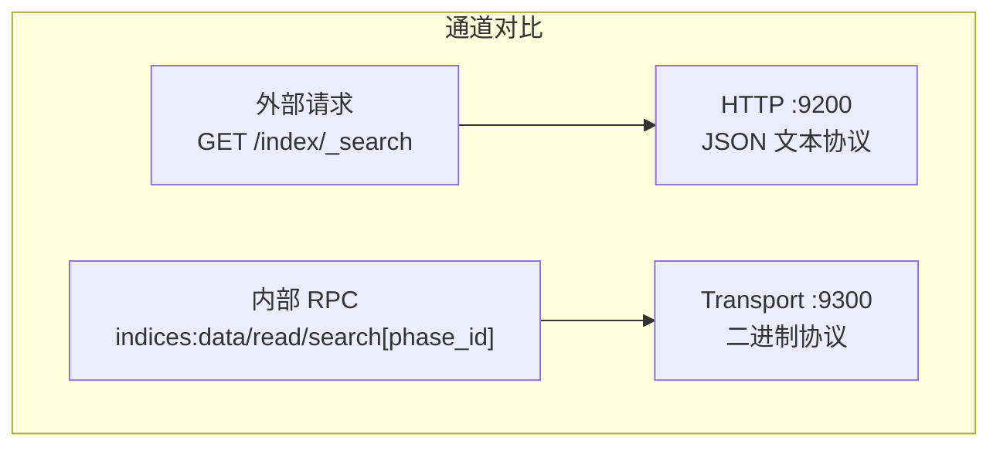

> ⚠️ 注意：9300 端口的二进制协议**不保证跨大版本兼容**，Java TransportClient 在 7.x 已废弃（替换为走 HTTP 9200 的 RestHighLevelClient / Java HLRC），这是理解 ES 版本演进的重要背景。

---

## 3. HTTP REST 通信链路（9200 端口）

### 3.1 Netty Pipeline 组成

`Netty4HttpServerTransport` 启动时（`doStart()`）创建 `ServerBootstrap`，每个接入的连接由 `HttpChannelHandler.initChannel()` 装配如下 pipeline：

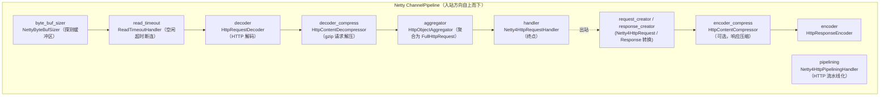

关键配置（`HttpTransportSettings`）：

- `http.port`：默认 `9200-9300`（范围绑定，取第一个可用端口）
- `http.max_content_length`：默认 100mb，聚合器上限
- `http.compression`：默认 `true`，`http.compression_level` 默认 3
- `http.pipelining.max_events`：默认 10000

### 3.2 请求分发全链路

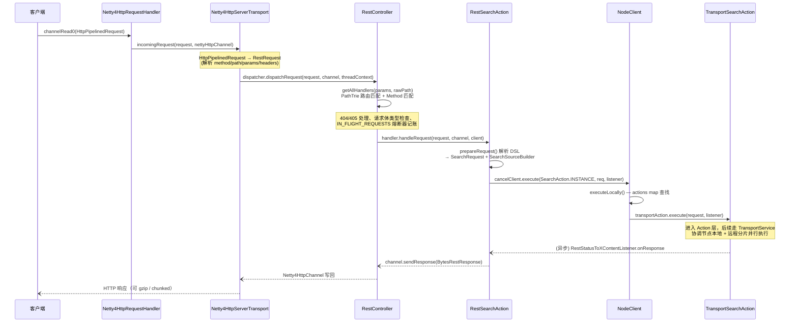

### 3.3 RestController 路由细节

`server/.../rest/RestController.java`：

- **`PathTrie`**：前缀树结构注册所有 REST handler，支持路径参数（如 `/{index}/_doc/{id}`）
- **`MethodHandlers`**：同一路径下按 GET/POST/PUT/DELETE 区分
- **`RestHandlerWrapper`**：全局包装器链（安全认证、`x-opaque-id` 追踪等都挂在这）
- 未匹配时：`handleBadRequest()` 返回 400；`GET /` 由 main action 处理返回节点信息
- **熔断**：请求体大小计入 `CircuitBreaker.IN_FLIGHT_REQUESTS` 断路器，响应完成后释放，防止并发大请求打爆堆内存

### 3.4 NodeClient —— REST 与 Action 的桥梁

```java
// server/.../client/node/NodeClient.java
public <Request extends ActionRequest, Response extends ActionResponse>
Task executeLocally(ActionType<Response> action, Request request, ActionListener<Response> listener) {
    return transportAction(action).execute(request, listener);  // actions map 本地查找，无网络
}
```

所有 `ActionPlugin` 注册的 Action 在节点启动时汇总到 `actions` map（`ActionModule` 完成），`NodeClient` 只是本地分发器。

---

## 4. 节点间 Transport 通信链路（9300 端口）

### 4.1 核心组件分层

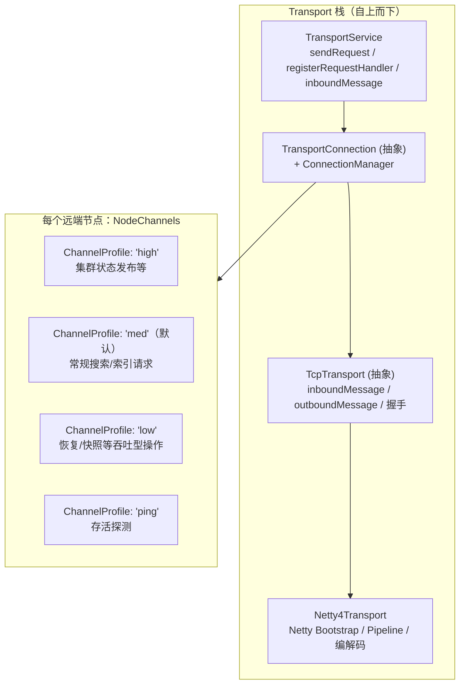

`TcpTransport.NodeChannels`：**到每个远端节点不是一条连接，而是按 ConnectionProfile 建立一组连接**——高优先级消息（cluster state）不会被大块恢复数据（low 通道）阻塞。

### 4.2 出站（发送请求）流程

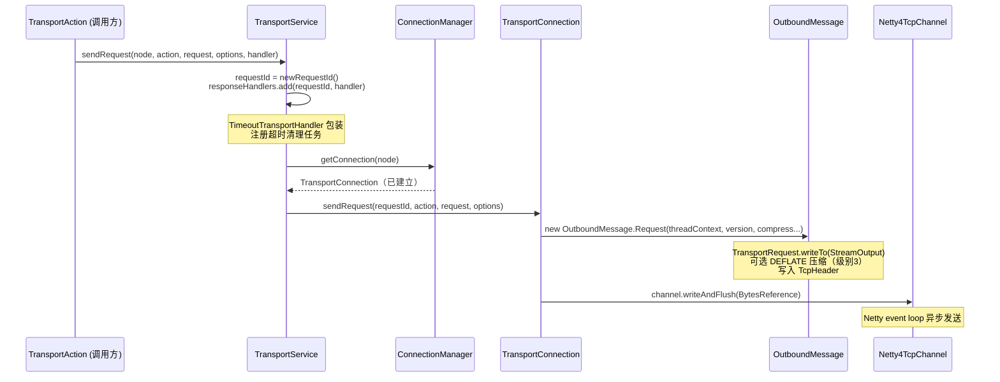

### 4.3 入站（接收并分发）流程

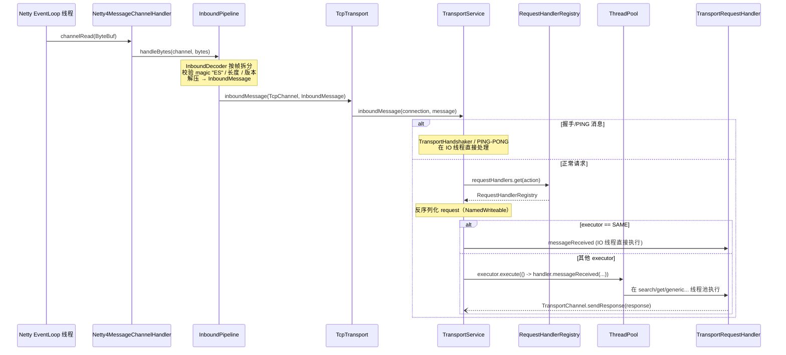

### 4.4 请求注册机制（action 字符串路由）

```java
// TransportService.java
public <Request extends TransportRequest> void registerRequestHandler(
        String action, String executor, Writeable.Reader<Request> reader,
        TransportRequestHandler<Request> handler) {
    requestHandlers.register(new RequestHandlerRegistry<>(action, handler, reader, executor, ...));
}
```

- **action 字符串示例**：`indices:data/read/search[np]`（np=查询阶段编号）、`indices:data/write/bulk[s][r]`（分片/副本阶段）
- 每个 `TransportAction` 在构造时向 `TransportService` 注册自己的 handler
- `TransportInterceptor`（`AsyncSender` 装饰链）允许插件在发送前后插入逻辑（安全、追踪）

### 4.5 响应回传

handler 处理完后通过 `TransportChannel.sendResponse()` 写回（`TcpTransportChannel`），响应同样走 `OutboundMessage.Response` → header 中 status 标记 `isResponse`。发送方收到后：

1. `InboundDecoder` 解出 response，按 header 中的 `requestId` 在 `responseHandlers` map 中查找注册的 `TransportResponseHandler`
2. 回调 `handleResponse()` / `handleException()`（在 handler 指定的 executor 上执行，默认 `SAME`）

---

## 5. 传输协议与编解码

### 5.1 消息帧格式（`TcpHeader.java`）

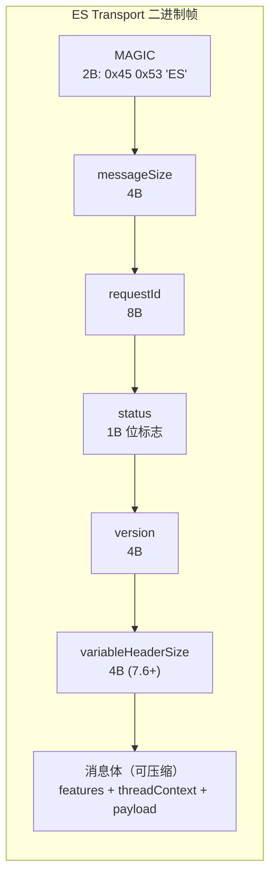

| 字段 | 大小 | 说明 |
|---|---|---|
| `MAGIC` | 2B | 固定 `0x45 0x53`（"ES"），帧同步/协议识别 |
| `messageSize` | 4B | 帧总长（用于 TCP 流上切帧） |
| `requestId` | 8B | 请求-响应关联 ID（唯一，线程安全生成） |
| `status` | 1B | bit0: request/response；bit1: error response；bit2: compressed；bit3: handshake |
| `version` | 4B | 发送方节点版本 ID，接收方据此选择 BwC 编解码 |
| `variableHeaderSize` | 4B | 7.6.0 引入的可变头部长度（feature flags） |

**消息体**（`InboundMessage` / `OutboundMessage`，7.13 的新协议抽象）：
- features 集合（如 `x-pack` 特性协商）
- `ThreadContext`（上下文头，请求头/系统设置随请求传播——ES 的"隐式上下文传递"机制）
- 真实 payload：request 对象经 `writeTo(StreamOutput)` 序列化的字节

### 5.2 序列化体系

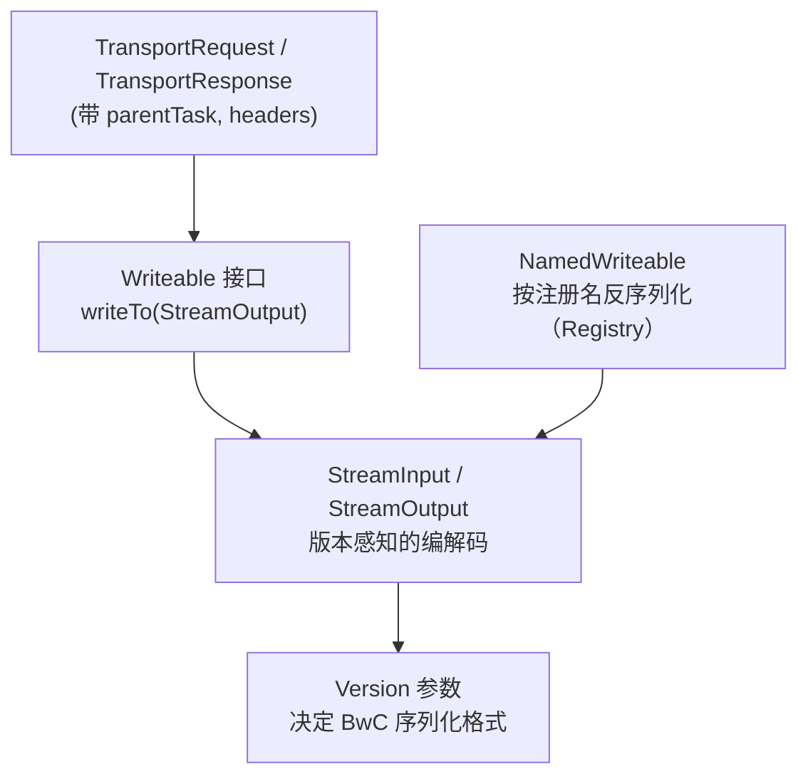

- `NamedWriteableRegistry`：类似序列化框架的类型注册表，查询 DSL（`QueryBuilder`）、聚合（`AggregatorBuilder`）等通过**名字字符串**跨节点重建对象
- `Version`：`Version.minCompatVersion()` 保证相邻主版本互操作（7.x ↔ 6.8），序列化时根据对端版本走旧格式分支

### 5.3 压缩

`CompressibleBytesOutputStream`（`server/.../transport/CompressibleBytesOutputStream.java`）：
- 算法：JDK `DeflaterOutputStream`（DEFLATE），级别固定 3
- 触发：`transport.compress: true` 时（默认关闭，节点间内网带宽通常足够）
- header `status` bit2 标记是否压缩，接收端据此解压

---

## 6. 连接管理与握手

### 6.1 握手流程（TransportHandshaker）

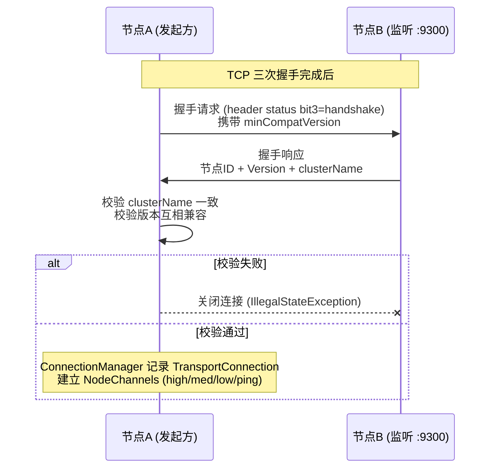

- 集群名不一致 → 拒绝加入（防止误连集群）
- 版本不兼容 → 连接失败（滚动升级时保证主版本差 ≤1）
- TLS：若启用 x-pack security，握手前有 TLS 握手层（`TransportLayer` 接口，`Netty4NioServerSocketChannel` 包装 SSLEngine）。未启用 TLS 的节点收到 TLS ClientHello（首字节 `0x16 0x03`，见 `TcpTransport.appearsToBeTLS()`）会抛 `StreamCorruptedException` 并给出友好提示

### 6.2 连接生命周期（ConnectionManager）

- `ClusterConnectionManager`：管理集群内所有节点连接（master、数据节点间 mesh）
- `RemoteConnectionManager`：跨集群连接（CCS），种子节点 + 网关模式，失败种子节点会被暂时隔离避免反复重试
- 断连：`TransportService.onNodeDisconnected()` → **批量清理该节点上所有 pending 的 responseHandlers**（回调 `handleException(NodeDisconnectedException)`），这是副本请求失败快速反馈的来源

---

## 7. 线程模型

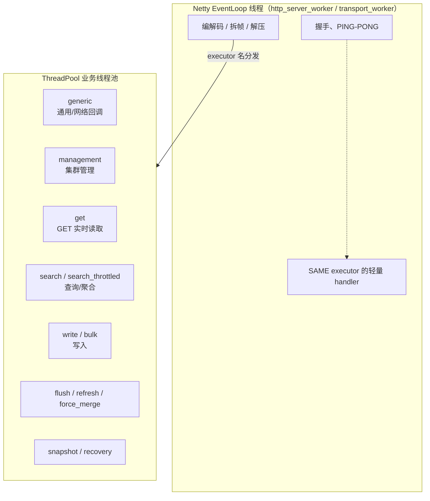

| 层 | 执行者 | 说明 |
|---|---|---|
| 帧解码、magic 校验 | Netty IO 线程 | `InboundDecoder`，纯字节操作，不阻塞 |
| 握手 / PING | Netty IO 线程 | 必须快，不能占用业务池 |
| `TransportRequestHandler` | 按 action 注册时声明的 executor | 如 search phase 交给 `search` 池 |
| `TransportResponseHandler` | 默认 `SAME`（IO 线程） | 协调节点聚合各分片响应时多为轻量计数，走 SAME 提高吞吐 |
| REST handler | `management`（HTTP 层统一入口） | 真正的重活交给后续 Action |

**设计要点**：action 字符串末尾的 `[np]`/`[s]`/`[r]` 后缀让同一 action 的不同阶段在不同 executor 上隔离执行，避免慢查询阻塞集群状态发布。

---

## 8. 一次搜索请求的端到端时序

以 `GET /myindex/_search` 为例，请求落在协调节点（coordinating node），跨 3 个数据节点：

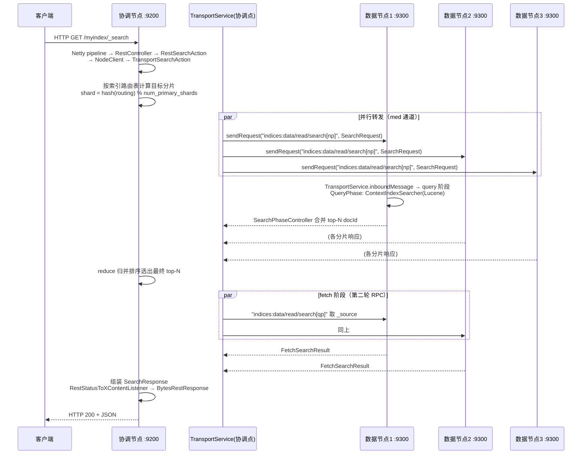

> **两阶段搜索**（query then fetch）在网络上体现为：协调节点对每个目标数据节点发起**两轮** Transport RPC——第一轮只要排序后的 docId + score，第二轮按 docId 批量取 `_source`。这直接减少了跨节点传输量。

---

## 9. 可靠性机制：超时、重试、背压、熔断

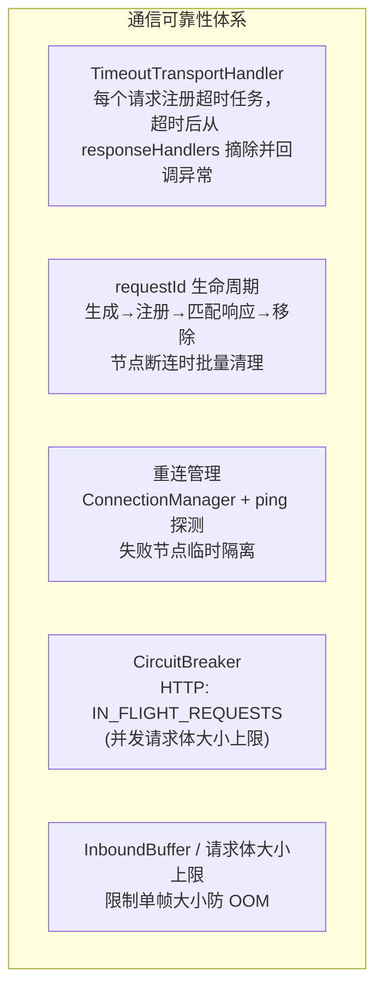

- **超时**：`TransportService.sendRequest` 用 `TimeoutTransportHandler` 包装用户 handler，调度到 `generic` 池的清理任务在超时后触发 `handleException(ReceiveTimeoutTransportException)`
- **请求丢失**：`ConnectionManager` 关闭连接时触发 `onNodeDisconnected`，`responseHandlers` 中所有指向该节点的 pending handler 收到 `NodeDisconnectedException`——上层 `TransportReplicationAction` 据此决定副本失效或重试到新主分片
- **背压**：
  - 入站：帧大小上限（`network.tcp.buffer`? 实际由 messageSize 校验）+ `ReadTimeoutHandler` 断空闲连接
  - HTTP：`http.max_content_length` + in-flight 断路器
- **熔断**：`CircuitBreakerService`，HTTP 层记账的是请求字节数（响应写回后释放），超出即拒绝请求（429 Too Many Requests）

---

## 10. 关键源码索引

| 组件 | 文件 |
|---|---|
| TCP 传输抽象 | `server/src/main/java/org/elasticsearch/transport/TcpTransport.java` |
| Netty 传输实现 | `modules/transport-netty4/src/main/java/org/elasticsearch/transport/netty4/Netty4Transport.java` |
| RPC 核心 | `server/src/main/java/org/elasticsearch/transport/TransportService.java` |
| 请求注册表 | `server/src/main/java/org/elasticsearch/transport/RequestHandlers.java` |
| 消息头定义 | `server/src/main/java/org/elasticsearch/transport/TcpHeader.java` |
| 入/出站消息 | `server/src/main/java/org/elasticsearch/transport/InboundMessage.java` / `OutboundMessage.java` |
| 入站处理管道 | `server/src/main/java/org/elasticsearch/transport/InboundPipeline.java` |
| 握手 | `server/src/main/java/org/elasticsearch/transport/TransportHandshaker.java` |
| 连接管理 | `server/src/main/java/org/elasticsearch/transport/ConnectionManager.java` |
| 压缩 | `server/src/main/java/org/elasticsearch/transport/CompressibleBytesOutputStream.java` |
| HTTP 抽象 | `server/src/main/java/org/elasticsearch/http/HttpServerTransport.java` |
| HTTP 实现 | `modules/transport-netty4/src/main/java/org/elasticsearch/http/netty4/Netty4HttpServerTransport.java` |
| HTTP 请求处理 | `modules/transport-netty4/src/main/java/org/elasticsearch/http/netty4/Netty4HttpRequestHandler.java` |
| REST 路由 | `server/src/main/java/org/elasticsearch/rest/RestController.java` |
| REST→Action 桥 | `server/src/main/java/org/elasticsearch/client/node/NodeClient.java` |
| 搜索 REST 入口 | `server/src/main/java/org/elasticsearch/rest/action/search/RestSearchAction.java` |
| 复制类 Action 范式 | `server/src/main/java/org/elasticsearch/action/support/replication/TransportReplicationAction.java` |

---

## 总结

ES 网络通信的核心可以浓缩为三句话：

1. **对外（9200）**：Netty HTTP → `RestController`(PathTrie 路由) → `Rest*Action` 解析 DSL → `NodeClient` 本地转交 Action 层，异步 listener 链一路写回响应。
2. **对内（9300）**：`TransportService` 提供以 **action 字符串** 为路由键的异步 RPC，`"ES" magic + requestId + version` 的二进制帧 + `StreamOutput` 序列化 + `ThreadContext` 随请求传播；每节点按 high/med/low/ping 分级建连，断连时 pending 请求批量失败。
3. **分层解耦**：Netty IO 线程只做编解码和握手，业务逻辑按 action 声明的 executor 落到 `ThreadPool` 的专属线程池——这是 ES 能同时扛住慢查询和集群状态发布而互不干扰的根本原因。
