# Lucene 8.8.0 深度学习指南 —— 为阅读 Elasticsearch 7.13 源码而作

> 源码基线：`D:\workspace\java_projects\source_projects\lucene-solr-8.8.0`（对应 ES 7.13.0 依赖的 Lucene 8.8.x）
> 核心模块：`lucene/core`，扩展模块：`analysis`、`queryparser`、`highlighter`、`luke`
>
> **ES 与 Lucene 的对应关系速查**：ES 的一个分片（shard）= 一个 Lucene 索引目录 = 一堆 segment 文件 + `segments_N`。ES 的 `InternalEngine` 就是 `IndexWriter` + `DirectoryReader` 的封装。看懂本文，ES 读写源码就通了 70%。

---

## 目录

1. [Lucene 是什么](#1-lucene-是什么)
2. [核心概念与术语表](#2-核心概念与术语表)
3. [搜索实战：30 行代码用上 Lucene](#3-搜索实战30-行代码用上-lucene)
4. [总体架构](#4-总体架构)
5. [写入原理（一）：IndexWriter 与 DWPT](#5-写入原理一indexwriter-与-dwpt)
6. [写入原理（二）：DefaultIndexingChain 文档处理链](#6-写入原理二defaultindexingchain-文档处理链)
7. [写入原理（三）：flush / commit / 事务](#7-写入原理三flush--commit--事务)
8. [Segment 文件格式详解（Codec 体系）](#8-segment-文件格式详解codec-体系)
9. [合并原理：TieredMergePolicy](#9-合并原理tieredmergepolicy)
10. [近实时搜索：NRT 与 liveDocs](#10-近实时搜索nrt-与-livedocs)
11. [搜索原理（一）：Query → Weight → Scorer](#11-搜索原理一query--weight--scorer)
12. [搜索原理（二）：打分与跳页优化](#12-搜索原理二打分与跳页优化)
13. [IndexReader 层级与 reopen](#13-indexreader-层级与-reopen)
14. [Lucene ↔ ES 概念映射表](#14-lucene--es-概念映射表)
15. [源码阅读路线与关键文件索引](#15-源码阅读路线与关键文件索引)

---

## 1. Lucene 是什么

Lucene 是 **Doug Cutting 于 2000 年创建的高性能全文检索库**（Apache 顶级项目，同时是 Solr 和 Elasticsearch 的共同内核）。定位要分清：

| | Lucene | Elasticsearch / Solr |
|---|---|---|
| 形态 | **Java 库**（jar 包，无进程） | 服务器产品 |
| 职责 | 单机索引/搜索引擎内核 | 分布式、集群、HTTP/DSL |
| 提供 | `IndexWriter`/`IndexSearcher`/倒排索引/分词/打分 | 分片路由、副本、translog、聚合 |

一句话：**Lucene 回答"如何在单机上以毫秒级延迟对海量文本建立倒排索引并检索"，ES 回答"如何把这件事做成分布式服务"**。

三个决定性设计（也是"为什么 ES 适合搜索"的根因）：

1. **倒排索引 + FST**：term → docId 列表，查词复杂度接近 O(len(term))，天然抗数据量增长
2. **不可变 segment**：写入的段永不修改（删除只打标记），极度利于 OS page cache、mmap 和各种缓存
3. **块压缩 + 列存（doc_values）**：同一类数据连续存放，压缩比和扫描吞吐远超行存数据库

---

## 2. 核心概念与术语表

| 术语 | 英文/类 | 一句话解释 |
|---|---|---|
| 文档 | `Document` | 一次检索的原子单位（ES 里一个 JSON doc） |
| 域 | `Field` | 文档的属性，一个域可被多种方式索引（倒排+列存+行存同时存在） |
| 分词 | `Analyzer` / `TokenStream` | 文本 → term 序列（含小写化、去停用词等） |
| 词项 | `Term` | `域名:token`，倒排索引的 key |
| 段 | `Segment` | 不可变的最小索引单元，一次 flush/merge 产生 |
| 倒排表 | Postings | 一个 term 对应的 docId/freq/pos 列表（`.doc/.pos/.pay`） |
| 词项字典 | Term Dictionary (`.tim/.tip`) | 段内全部 term 的有序集合 + FST 前缀索引 |
| 列存 | DocValues (`.dvd/.dvm`) | docId → 值，供排序/聚合 |
| 行存 | Stored Fields (`.fdt/.fdx`) | 原始文档内容，`_source` 的底座 |
| 删除位图 | liveDocs (`.liv`) | 位图标记段内被删文档，查询时跳过 |
| 提交点 | `segments_N` | 索引的"目录页"：列出所有有效 segment |
| 近实时 | NRT (Near Real-Time) | 不 commit 也能看到新写入（refresh 生成新 reader） |
| 打分 | `Similarity`（BM25） | 相关性算法 |
| 编解码器 | `Codec` | 决定上述一切文件怎么编码到磁盘（默认 `Lucene87Codec`） |

---

## 3. 搜索实战：30 行代码用上 Lucene

`lucene/demo` 模块就是官方教程。最小可用示例：

```java
// ========== 1. 建索引 ==========
Directory dir = FSDirectory.open(Path.of("idx"));
Analyzer analyzer = new StandardAnalyzer();
IndexWriterConfig cfg = new IndexWriterConfig(analyzer);
// 默认：RAMBufferSizeMB=32MB、TieredMergePolicy、ConcurrentMergeScheduler
try (IndexWriter writer = new IndexWriter(dir, cfg)) {
    Document doc = new Document();
    doc.add(new TextField("title", "Lucene in Action", Field.Store.YES));   // 分词+倒排
    doc.add(new StringField("isbn", "193398817", Field.Store.YES));          // 不分词，精确匹配
    doc.add(new SortedDocValuesField("price", new BytesRef("39.99")));       // 列存，排序用
    doc.add(new IntPoint("pub_year", 2010));                                  // BKD 数值范围查询
    writer.addDocument(doc);
    writer.commit();                       // ← 写出 segments_N（数据真正落盘）
}

// ========== 2. 搜索 ==========
DirectoryReader reader = DirectoryReader.open(dir);
IndexSearcher searcher = new IndexSearcher(reader);
Query q = new BooleanQuery.Builder()
    .add(new TermQuery(new Term("title", "action")), BooleanClause.Occur.SHOULD)
    .add(IntPoint.newRangeQuery("pub_year", 2005, 2020), BooleanClause.Occur.FILTER)
    .build();
TopDocs hits = searcher.search(q, 10);             // 取 top 10
for (ScoreDoc sd : hits.scoreDocs) {
    Document d = searcher.doc(sd.doc);             // 从 .fdt 行存取回原文
    System.out.println(d.get("title") + " score=" + sd.score);
}

// ========== 3. NRT 增量重开（ES refresh 的本质）=========
DirectoryReader r2 = DirectoryReader.openIfChanged(reader);
if (r2 != null) { reader.close(); reader = r2; }   // 只重开变化的 segment，旧的复用
```

四个实战要点（每条都直通一个 ES 机制）：

1. **`commit()` 才是持久化边界**——ES 的 `_flush` 最终调它；ES 默认 1s 一次 `_refresh` 调的却是 NRT 重开（第 10 章）
2. **一个 Field 可同时有倒排 + 列存 + 行存**——对应 ES mapping 里 `text`/`keyword`/`doc_values: true`/`_source` 的组合
3. **`IntPoint` 走 BKD 树**——ES 数值/日期/geo 字段的范围查询就是这么实现的
4. **多线程并发写只需一个 `IndexWriter`**——内部按线程分配独立缓冲（第 5 章），ES bulk 多线程写入的根基

---

## 4. 总体架构

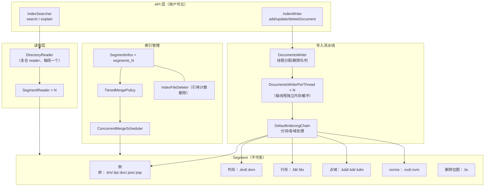

**一次完整数据生命周期**（后面各章展开）：

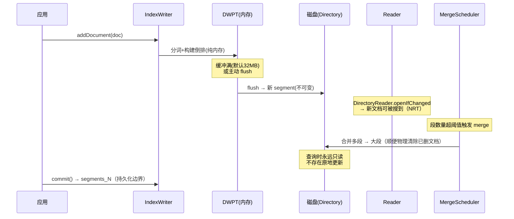

---

## 5. 写入原理（一）：IndexWriter 与 DWPT

源码：`lucene/core/src/java/org/apache/lucene/index/` 下 `IndexWriter.java`、`DocumentsWriter.java`、`DocumentsWriterPerThread.java`

### 5.1 写入并发模型（重点，ES bulk 的性能根基）

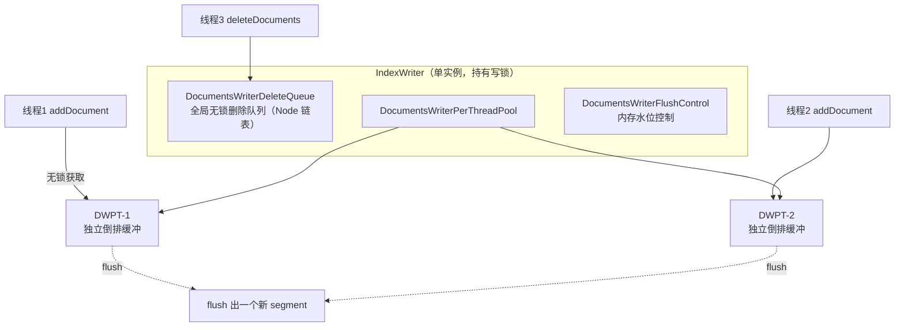

设计精髓：

1. **每线程一个 DWPT**：各自在内存里构建自己的倒排结构（`ByteBlockPool` 字节池 + `IntBlockPool` 整数池），**写路径几乎无锁**——不同线程写的文档天然属于不同段
2. **全局删除队列**：`deleteDocuments(term/query)` 是全局操作，进 `DocumentsWriterDeleteQueue`（Michael-Scott 无锁链表），每个 DWPT 持有一个 `DeleteSlice` 视图，flush 时应用；未 flush 的删除由 `applyAllDeletes()` 兜底
3. **内存水位**：`RAMBufferSizeMB`（默认 32MB）是**所有 DWPT 共享预算**；任一线程写完文档后由 `flushControl.doAfterDocument()` 检查水位，超了就挑选（通常最大的）DWPT flush
4. **`updateDocument(term, doc)`** = `deleteDocuments(term)` + `addDocument(doc)`，两者进同一批次保证原子性——ES 的文档"更新"本质上就是这个（先标记删旧的，再插入新的）

### 5.2 addDocument 调用链

```
IndexWriter.updateDocument(term, doc)
 └─ DocumentsWriter.updateDocument(...)
     ├─ flushControl.obtainAndLock()          // 无锁拿一个空闲 DWPT（或新建）
     ├─ DWPT.updateDocument(...)
     │   └─ DefaultIndexingChain.processDocument(docID, doc)   // → 第 6 章
     ├─ perThreadPool.marksAsFreeAndUnlock()  // 归还
     └─ flushControl.doAfterDocument()        // 水位检查 → maybeFlush
```

---

## 6. 写入原理（二）：DefaultIndexingChain 文档处理链

源码：`DefaultIndexingChain.java`——**一张 Field 的"路由表"**，每种域类型走不同 writer，最终落到不同 segment 文件：

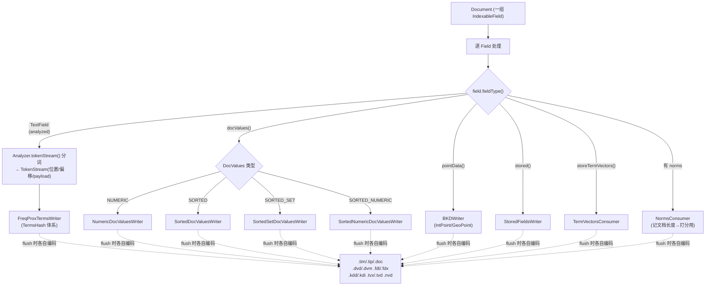

关键细节：

- **同一个 Field 可以同时挂多种结构**：ES 的 `text` 字段 = 倒排 + norms + stored(_source)；`keyword` = 倒排(不分词) + doc_values；数值 = BKD point + doc_values——这就是 mapping 里那些开关的物理含义
- **DWPT 内存里的倒排**：`TermsHash` 用 `ByteBlockPool` 存 term 字节和 postings 增量，hash 定位 term；flush 时才整体排序、编码成 BlockTree
- **`ByteBlockPool` 的块链**：内存中 term/posting 长度不定，用 16KB 块链 + 整数池存"下一块指针"——学 C 的同学会认出这就是手写堆管理，避免 Java 对象开销
- **index sort**（`segmentInfo.getIndexSort()`，ES 7 的 `index.sort`）：flush 前对段内文档按指定字段重排，代价在写入端，收益是范围/排序查询可以提前终止

### 6.1 DWPT flush：内存 → 磁盘

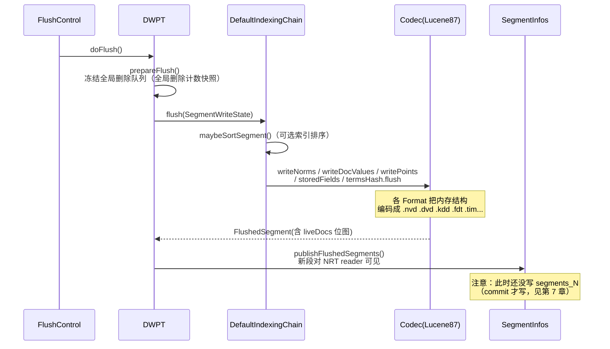

---

## 7. 写入原理（三）：flush / commit / 事务

三个容易混淆的持久化层级，**这是读懂 ES 的 refresh/flush/translog 的前提**：

| 操作 | 做了什么 | 数据可见性 | ES 对应 |
|---|---|---|---|
| `flush()` | DWPT 内存 → 新 segment 文件（写入 Directory 缓存/文件系统） | 同一 writer 打开的 NRT reader | `_refresh`（调用的是 `openIfChanged`，其前置动作就是 flush 新段） |
| `commit()` | flush + fsync 所有文件 + 写 `segments_N`（原子） | 任何新进程/新 reader（跨重启） | `_flush`（flush API） |
| `close()` | commit（默认）+ 释放写锁 | 同 commit | 关闭分片 |

### 7.1 原子提交协议（崩溃安全的根）

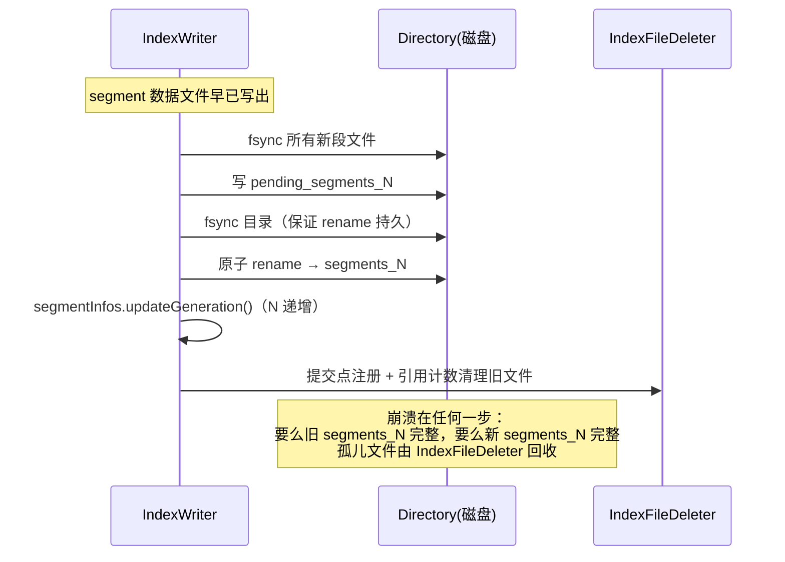

- **`segments_N` 是唯一真相**：它列出当前提交点包含的所有段文件。写锁（`write.lock`）保证任一时刻只有一个 `IndexWriter`
- **`IndexFileDeleter` 引用计数删除**：段文件在还有 reader/merge 引用时不物理删除——这就是为什么 ES 里旧 reader 不关闭会导致磁盘涨
- **`rollback()`**：放弃上次 commit 之后的一切（内存缓冲、新段文件、合并），回到 `rollbackSegments` 快照——ES 的 translog 重放配合它实现分片恢复语义

---

## 8. Segment 文件格式详解（Codec 体系）

> `ls` 一个 ES 数据目录（或用 `lucene/luke` 打开）看到的每个文件都在此表。默认总编解码器：`Lucene87Codec`（`lucene/core/src/java/org/apache/lucene/codecs/lucene87/`），通过 Java SPI（`META-INF/services`）可替换——ES 的 `_all` BwC 就依赖 `backward-codecs` 模块反序列化旧版段。

### 8.1 全景：一个段由哪些文件构成

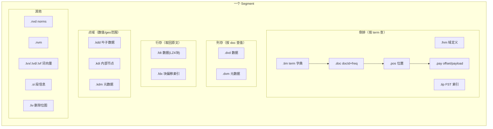

| 你想回答的问题 | 用哪个文件 |
|---|---|
| "哪些文档含这个词" | `.tip` 定位 → `.tim` 找 term → `.doc` 得 docId 列表 |
| "这个词出现在文中哪" | `.pos`/`.pay` |
| "这个 doc 的字段值"（聚合/排序） | `.dvd/.dvm`（doc_values） |
| "取回完整原文 _source" | `.fdx` 定位块 → `.fdt` 解压 |
| "数值范围过滤" | `.kdi/.kdd`（BKD 树） |
| "为什么这个文档得分高" | `.nvd`（文档长度 norm） |

### 8.2 倒排链路：FST + BlockTree + FOR 压缩（重中之重）

**查找路径**：`Term("title","action")` → `.tip` 里的 **FST** 定位到 `.tim` 的 block → block 内顺序扫描（前缀压缩）→ term 的 metadata 指向 `.doc` 的 postings。

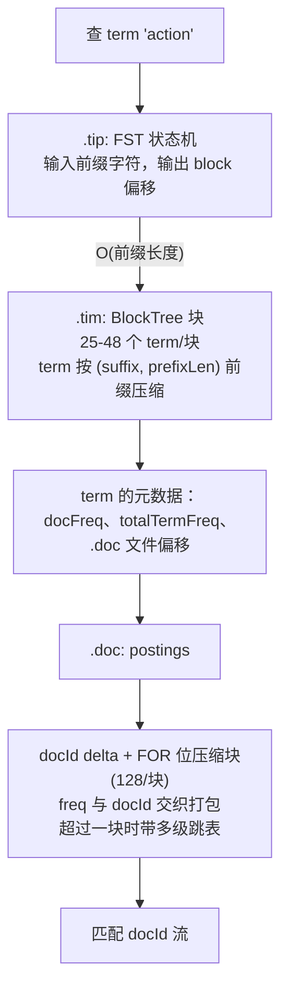

三个压缩技术各司其职：

1. **FST（`util/fst/FST.java`）——内存里的 term 前缀自动机**
   - 后缀共享（`mop, moth, pop, star` 共享公共前缀路径）+ **输出共享**（路径输出可前缀复用），把海量 term 索引压到极小常驻内存
   - 这是 ES 中 `"索引几乎不占堆、全在 page cache"` 的根本原因：`.tip` 通常 mmap 进 OS 缓存
   - 副产品：天然支持前缀/通配/范围查询的定位
2. **BlockTree 前缀压缩**：term 字典按块组织（floor block 25-48），块内只存相邻 term 的增量后缀
3. **FOR（Frame-of-Reference）打包**（`util/packed/PackedInts`）：postings 里 docId 是严格递增的，delta 后每 128 个一组，按组内最大位宽连续位打包——比通用压缩快一个数量级，解压只涉及移位；跳表（`SkipWriter`）间隔与块对齐，`advance(target)` 才有 O(log) 跳页能力

> ES 查询为什么快：`match` 查询 95% 时间就是走这条链路，全部是顺序读 + 位运算，完美命中 CPU cache 和 page cache。

### 8.3 DocValues：四种类型与按块自适应编码

`Lucene80DocValuesFormat`，数据 `.dvd` / 元数据 `.dvm`：

| 类型 | 语义 | 典型 ES 场景 |
|---|---|---|
| `NUMERIC` | doc → 一个数 | `long/float` 排序、聚合 |
| `SORTED` | doc → 字节串（字典序全局 ords） | `keyword` |
| `SORTED_SET` | doc → 多个字节串 | `keyword` 数组 |
| `SORTED_NUMERIC` | doc → 多个数 | 数值数组、`date` ranges |

编码自适应（每 16384 doc 一块，块级选择最优算法）：

- **Delta 位打包**：普通情况
- **GCD**：所有值有公约数时除掉（如价格全是 5 的倍数）
- **Table**：块内唯一值 < 256 时查表
- **常量**：整块一个值只存一份
- SORTED 类先去重存字典，再存 doc → ord 映射（ord 数值又走上述压缩）

### 8.4 StoredFields：ES `_source` 的底座

`Lucene87StoredFieldsFormat`（继承 `CompressingStoredFieldsFormat`）：文档按 chunk 压缩存储，`BEST_SPEED`=LZ4/16KB（默认），`BEST_COMPRESSION`=DEFLATE/48KB（对应 ES `index.codec: best_compression`）。`.fdx` 是块偏移索引——取单文档只需解压一个 chunk，不必扫全文件。

### 8.5 BKD 点域：数值/地理范围查询

`Lucene86PointsFormat` + `BKDWriter`：把 N 维点按维度中位数递归切分成 Block KD-Tree。内部节点（`.kdi`）存分割值，叶子（`.kdd`）存实际点。1 维数值字段（ES 的 `long/int/date`）也用它（可退化成排序数组的二分）。范围查询 = 树剪枝，最坏 O(√N) 级。8.8 的 doc_values 压缩模式改进（CHANGES 里 LUCENE-9378）也在影响这一代格式。

---

## 9. 合并原理：TieredMergePolicy

不可变 segment 的代价：**段越积越多，一次查询要打开的文件/迭代器线性增长**。merge 是唯一的回收手段（顺便物理清除已删文档）。

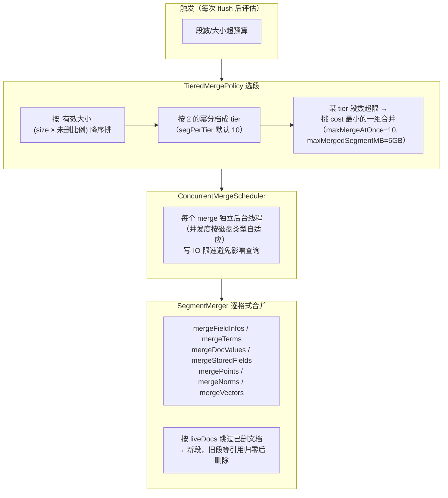

要点：

- **Tiered 与 LogMergePolicy 的区别**：允许非相邻段合并、允许"部分合并"（一次合并 tier 里 cost 最小的 ≤10 个段，而不是无脑全合），大小越均衡的段合并性价比越高
- **`forceMerge`**（ES `_forcemerge`）：无视策略直接合并到指定段数——通常把段压到 1，代价是一次巨大的 IO + CPU
- **合并期间查询不受影响**：旧段还在被读；新段就绪后原子替换，旧段引用计数归零才删
- **ES 侧对应**：`IndexShard` 里的 merge scheduler 受 `index.merge.scheduler.*` 控制；TieredMergePolicy 参数即 ES 的 `index.merge.policy.*`

---

## 10. 近实时搜索：NRT 与 liveDocs

Lucene 的"实时性阶梯"（ES 近实时语义的全部出处）：

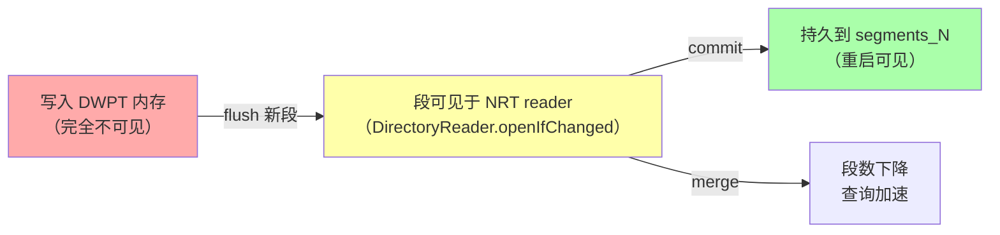

**`DirectoryReader.openIfChanged(old)` 的增量语义**（ES `_refresh` 的本体）：

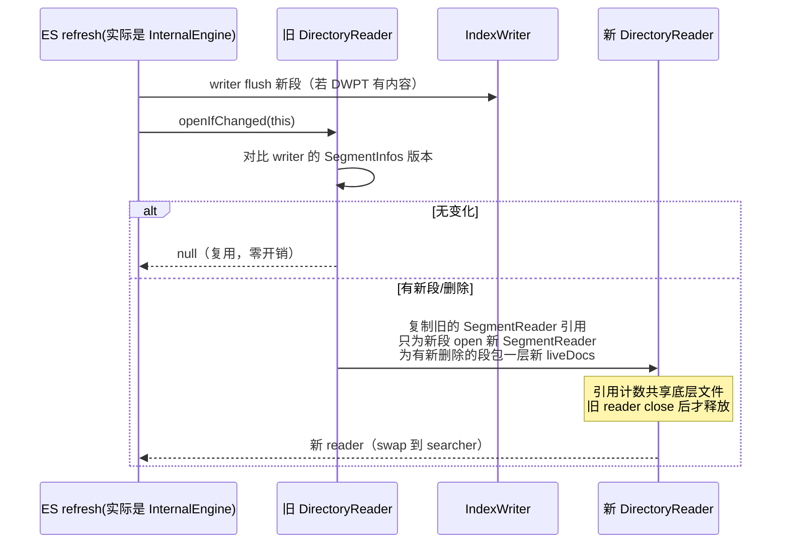

**liveDocs 删除位图**：term 删除在 flush/merge 间如何生效——删除先进入全局队列 → 应用到受影响段的 `FixedBitSet`（`.liv`）→ 查询的 postings 迭代器包一层过滤 → merge 时才真正物理丢弃。**所以"删除"在任何时刻都不是物理的**，这也是 ES 磁盘空间"删了数据不释放"的直接原因（需等 merge）。

> ES 的 `refresh_interval=1s` = 每 1s 做一次 openIfChanged；`_flush` = commit（+ translog 清空）。两个词在 ES 语境和 Lucene 语境里是**错位**的，读 ES 源码务必记住此表。

---

## 11. 搜索原理（一）：Query → Weight → Scorer

源码：`lucene/core/src/java/org/apache/lucene/search/`。三层对象是 Lucene 搜索的骨架：

| 层 | 类 | 生命周期 | 职责 |
|---|---|---|---|
| 语法树 | `Query`（不可变，可共享） | 每次查询 | 声明"要什么"，无状态 |
| 编译期 | `Weight`（每 searcher 一份） | rewrite 后创建 | 计划：每段创建 Scorer、估算 cost、explain |
| 执行期 | `Scorer` / `DocIdSetIterator`（每段一份） | 段内迭代 | 真正产出 docId 流 + 分数 |

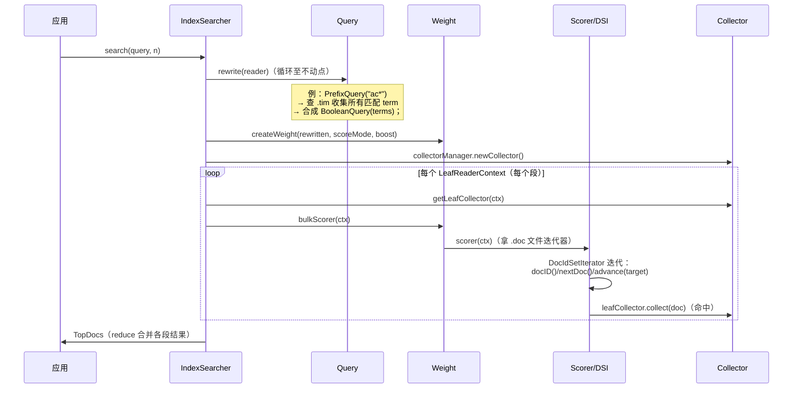

**DocIdSetIterator 协议**（一切优化的基础）：迭代器产出**严格递增**的段内 docId。`advance(target)` 是跳页原语，背后就是 8.2 的跳表；两个迭代器求交集（AND）= 小的跳、大的追，全部 `advance` 完成——**Lucene 查询没有"回表扫描"，只有迭代器代数**。

### BooleanScorer 家族（组合查询的执行策略）

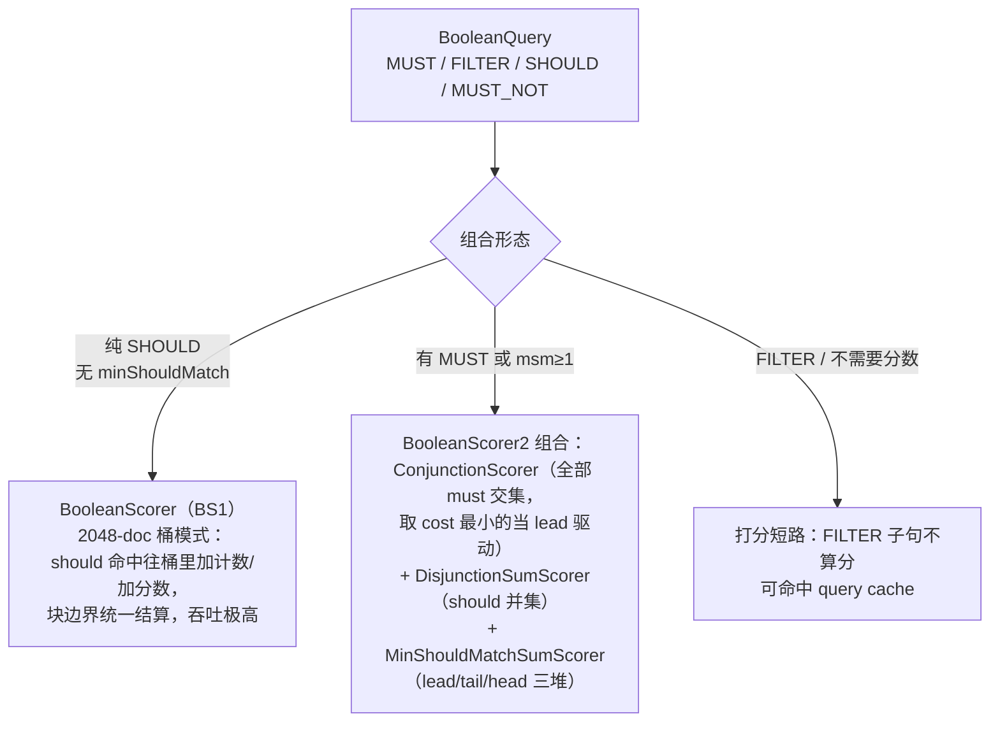

- **BS1 vs BS2**：BS1 用桶批量匹配，快但不支持 `advance`（不能做交集的一侧）；纯 should 的宽查询用它最快
- **WAND / max-score 剪枝**（TopScoreDocCollector + `ScoreMode.TOP_SCORES`）：当只要 top N 时，用 `getMaxScore(upTo)` 维护"当前第 N 名分数"，某个文档即使全命中也不可能进榜就整段跳过——ES 的 `track_total_hits` 截断与 terminate_after 都建立在这类能力上

---

## 12. 搜索原理（二）：打分与跳页优化

### BM25Similarity（8.x 唯一默认，`similarities/BM25Similarity.java`）

```
score(D, T) = idf(t) · tf饱和(t,D) · 长度归一(D)
idf(t)      = ln( 1 + (N - n(t) + 0.5) / (n(t) + 0.5) )
tf饱和      = freq · (k1 + 1) / (freq + k1 · (1 - b + b·|D|/avgdl))     // k1=1.2, b=0.75
```

实现细节（读完你会对 ES 打分豁然开朗）：

- `|D|`（文档长度）**不存原文**，编码成一个字节塞在 `.nvd`（norms）里，查表 `normInverse` 直接参与乘法
- 打分在 Scorer 内部随迭代顺带完成（`score = weight - weight/(1+freq*normInverse)`），无第二次扫描
- ES 的 `function_score`/`script_score` 是在 collector 层对 score 再加工，不动这里

### 关键性能机制一览

| 机制 | 类/位置 | 一句话 |
|---|---|---|
| BulkScorer | `DefaultBulkScorer` | 段内整块循环收集，摊薄虚调用 |
| Two-phase iterator | `TwoPhaseIterator` | 近似迭代器先粗筛（phrase 的位置检查放第二步） |
| maxScore 剪枝 | `MaxScoreSumPropagator` | top-N 查询中按分数上界跳过整片 docId |
| 查询缓存 | ES 侧 `IndicesRequestCache`（基于 filter 查询的 docId 结果） | Lucene 只提供 `UsageTrackingQueryCaches` 原语 |
| 并行搜索 | `IndexSearcher(reader, executor)` | 段切片进 slice 并行——ES 的分片级并行 + 段级并行 |

---

## 13. IndexReader 层级与 reopen

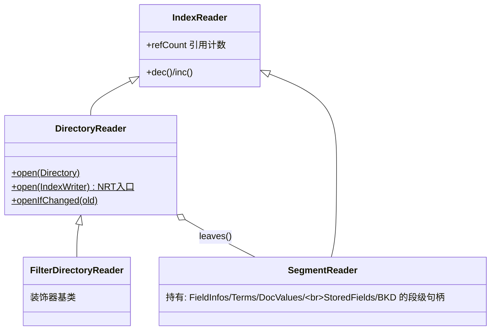

- **组合模式**：`DirectoryReader.leaves()` 返回每个段的 `LeafReaderContext`（含 docBase 偏移，把段内 docId 映射到全局）——查询按段执行，结果合并时 `docBase` 还原全局 ID
- **ES 的接入点**：`InternalEngine` 用 `ElasticsearchDirectoryReader.wrap(...)`（common 模块）给 reader 挂 shard 上下文，`IndexShard.acquireSearcher()` 提供引用计数化的 searcher 获取——**你如果读了 ES `SearchService`，所有"searcher 生命周期"问题答案都在 ReferenceManager（`SearcherManager`）的 acquire/release 协议里**
- 引用计数是硬约束：reader 不 dec，merge 出的旧段文件永远不删（ES 报 "too many open files" 常见根因）

---

## 14. Lucene ↔ ES 概念映射表

读 ES 源码时的"翻译词典"：

| Lucene | ES | 备注 |
|---|---|---|
| `Directory`（一个索引目录） | **一个分片** | ES 的 index = N 个 Lucene 索引的集合 |
| `IndexWriter` | `InternalEngine` 内部 | `InternalEngine.index()` → `updateDocument` |
| `DirectoryReader.openIfChanged` | `_refresh` / `refresh()` | 近实时可见 |
| `commit()`（写 segments_N） | `_flush` / `flush()` | 持久化边界 |
| `IndexWriterConfig.RAMBufferSizeMB` | `index.translog.flush_threshold` 无关；影响 refresh 频率 | 写缓冲 32MB |
| `TieredMergePolicy` | `index.merge.policy.*` | 段合并策略 |
| liveDocs `.liv` | 文档删除/版本替换的中间态 | merge 才物理删除 |
| `Document/Field` | JSON doc / mapping 生成的 field 组合 | `ParsedDocument` → Document |
| `Analyzer`（analysis-common） | `AnalysisPlugin` 注册的分词器 | IK 就是这里接入 |
| `IndexSearcher` | `ContextIndexSearcher`（ES 子类） | QueryPhase 用 |
| `Collector`/`CollectorManager` | 聚合/分页收集器 | `QueryPhase.searchWithCollectorManager` |
| `IndexReader` reopen | searcher refresh + 引用计数 | `IndexShard.acquireSearcher` |
| translog | **Lucene 没有！** ES 独有 | Lucene 只有 commit，ES 用 translog 填 refresh~commit 间隙 |

---

## 15. 源码阅读路线与关键文件索引

### 推荐顺序（由易到难，可执行）

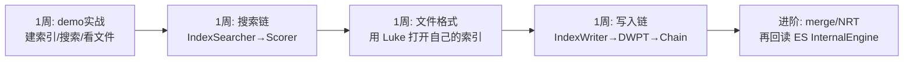

**动手建议**：写 demo 索引 3 篇文档 → `ls idx/` 看文件 → `java -jar luke`（`lucene/luke/`，8.8 仓库自带）打开同一目录 → 在 Luke 里看 term 字典、postings、doc_values —— 文件格式一章立刻具象化。

### 关键文件（均相对 `lucene/core/src/java/org/apache/lucene/`）

| 主题 | 文件 |
|---|---|
| 写入入口 | `index/IndexWriter.java` |
| 线程缓冲 | `index/DocumentsWriter.java`、`index/DocumentsWriterPerThread.java` |
| 删除队列 | `index/DocumentsWriterDeleteQueue.java` |
| 文档处理链 | `index/DefaultIndexingChain.java` |
| 段发布/提交 | `index/SegmentInfos.java`、`index/IndexFileDeleter.java` |
| 合并策略/调度 | `index/TieredMergePolicy.java`、`index/ConcurrentMergeScheduler.java`、`index/SegmentMerger.java` |
| 合并执行 | `index/SegmentMerger.java` |
| NRT | `index/DirectoryReader.java`、`search/SearcherManager.java` |
| 搜索入口 | `search/IndexSearcher.java` |
| 查询体系 | `search/Query.java`、`search/BooleanQuery.java`、`search/Weight.java`、`search/Scorer.java`、`search/DocIdSetIterator.java` |
| 布尔执行器 | `search/BooleanScorer.java`、`search/BooleanScorer2.java`、`search/ConjunctionScorer.java`、`search/MinShouldMatchSumScorer.java` |
| 收集器 | `search/TopScoreDocCollector.java`、`search/CollectorManager.java` |
| 打分 | `search/similarities/BM25Similarity.java` |
| term 字典 | `codecs/blocktree/BlockTreeTermsWriter.java` / `Reader` |
| postings | `codecs/lucene84/Lucene84PostingsFormat.java` |
| doc_values | `codecs/lucene80/Lucene80DocValuesFormat.java` |
| 行存 | `codecs/lucene87/Lucene87StoredFieldsFormat.java`、`codecs/compressing/CompressingStoredFieldsFormat.java` |
| 点域 | `codecs/lucene86/Lucene86PointsFormat.java`、`util/bkd/BKDWriter.java` |
| FST | `util/fst/FST.java`、`util/fst/Builder.java` |
| 位压缩 | `util/packed/PackedInts.java` |
| 总编解码器 | `codecs/lucene87/Lucene87Codec.java` |

---

## 总结：把整条主线串起来

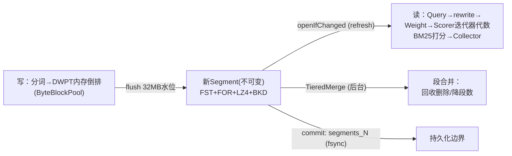

1. **写**：线程本地 DWPT + 无锁删除队列，内存里攒出倒排，水位到了 flush 成不可变段
2. **存**：段 = FST(term 索引) + BlockTree(字典) + FOR(倒排) + DocValues(列存) + LZ4 行存 + BKD(点域)，全部块化压缩，为 page cache 而生
3. **读**：rewrite 后的 Query 编译为每段一个 docId 迭代器，组合布尔逻辑全靠 `advance` 跳页，BM25 随迭代顺带打分
4. **管**：删除是位图、合并是后台、提交是 `segments_N` 原子 rename、实时性靠增量 reopen——ES 在其上补了 translog、分片和分布式的拼图
