# Guava EventBus 实现原理深度剖析

> 基于 Guava 33.4.0 源码分析
> 核心源文件（`com.google.common.eventbus` 包，共约 1369 行）：
> - `EventBus.java`（304 行，主类）
> - `SubscriberRegistry.java`（269 行，订阅者注册与查找）
> - `Dispatcher.java`（193 行，分发策略）
> - `Subscriber.java`（146 行，订阅者抽象）
> - `AsyncEventBus.java`（63 行，异步变体）
> - `Subscribe.java` / `AllowConcurrentEvents.java`（注解）
> - `DeadEvent.java` / `SubscriberExceptionContext.java` / `SubscriberExceptionHandler.java`

---

## 目录

1. [一、整体设计思想](#一整体设计思想)
2. [二、类结构与架构图](#二类结构与架构图)
3. [三、核心数据结构：SubscriberRegistry](#三核心数据结构subscriberregistry)
4. [四、register 注册流程](#四register-注册流程)
5. [五、反射发现 @Subscribe 方法](#五反射发现-subscribe-方法)
6. [六、post 分发流程（核心）](#六post-分发流程核心)
7. [七、事件类型匹配：flattenHierarchy](#七事件类型匹配flattenhierarchy)
8. [八、Dispatcher 三种分发策略](#八dispatcher-三种分发策略)
9. [九、Subscriber：执行器与反射调用](#九subscriber执行器与反射调用)
10. [十、并发安全：AllowConcurrentEvents 与 SynchronizedSubscriber](#十并发安全allowconcurrentevents-与-synchronizedsubscriber)
11. [十一、异常处理机制](#十一异常处理机制)
12. [十二、DeadEvent 死信机制](#十二deadevent-死信机制)
13. [十三、AsyncEventBus 异步总线](#十三asynceventbus-异步总线)
14. [十四、关键设计洞察](#十四关键设计洞察)
15. [十五、官方"不推荐使用"的说明](#十五官方不推荐使用的说明)
16. [十六、总结](#十六总结)

---

## 一、整体设计思想

### 1.1 EventBus 是什么

EventBus 是一个**进程内**的发布-订阅（publish-subscribe）事件总线。它让组件之间通过事件解耦通信，而**无需彼此显式注册/感知对方**。其本质是替代传统的 Java 事件分发（显式 `addXxxListener`）。

源码 Javadoc 明确定位：

> *"The EventBus allows publish-subscribe-style communication between components without requiring the components to explicitly register with one another... It is **not** a general-purpose publish-subscribe system, nor is it intended for interprocess communication."*

### 1.2 使用模型

```java
// 1. 定义事件（普通 POJO）
class PurchaseEvent { String item; int qty; }

// 2. 定义订阅者：@Subscribe 标注、单参数、非基本类型
class PurchaseSubscriber {
  @Subscribe
  void onPurchase(PurchaseEvent e) { System.out.println("bought " + e.item); }
}

// 3. 注册 + 发布
EventBus bus = new EventBus();
bus.register(new PurchaseSubscriber());
bus.post(new PurchaseEvent("book", 1));  // 自动路由到 onPurchase
```

### 1.3 三大核心组件

EventBus 的实现由三个可替换的"齿轮"咬合而成：

| 组件 | 职责 | 可替换性 |
|------|------|----------|
| **SubscriberRegistry** | 维护"事件类型 → 订阅者集合"的映射；负责查找 | 固定实现，内部用 Guava Cache 加速反射 |
| **Dispatcher** | 决定事件**按什么顺序**分发给订阅者 | 3 种策略：perThread / legacyAsync / immediate |
| **Executor** | 决定订阅者方法**在哪个线程**执行 | directExecutor（同步）/ 用户线程池（异步） |

> **关键认知**：**Dispatcher 控制顺序，Executor 控制线程**。二者正交（源码注释明确强调）。这是理解 EventBus 的钥匙。

---

## 二、类结构与架构图

### 2.1 类继承与组合关系

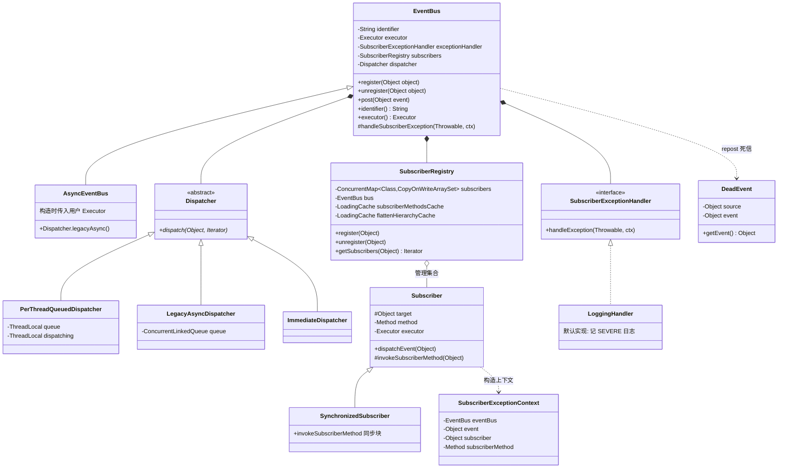
```mermaid
classDiagram
    direction TB

    class EventBus {
        -String identifier
        -Executor executor
        -SubscriberExceptionHandler exceptionHandler
        -SubscriberRegistry subscribers
        -Dispatcher dispatcher
        +register(Object object)
        +unregister(Object object)
        +post(Object event)
        +identifier() String
        +executor() Executor
        #handleSubscriberException(Throwable, ctx)
    }
    class AsyncEventBus {
        构造时传入用户 Executor
        +Dispatcher.legacyAsync()
    }
    class SubscriberRegistry {
        -ConcurrentMap~Class,CopyOnWriteArraySet~ subscribers
        -EventBus bus
        -LoadingCache subscriberMethodsCache
        -LoadingCache flattenHierarchyCache
        +register(Object)
        +unregister(Object)
        +getSubscribers(Object) Iterator
    }
    class Dispatcher {
        <<abstract>>
        +dispatch(Object, Iterator)*
    }
    class PerThreadQueuedDispatcher {
        -ThreadLocal queue
        -ThreadLocal dispatching
    }
    class LegacyAsyncDispatcher {
        -ConcurrentLinkedQueue queue
    }
    class ImmediateDispatcher {
    }
    class Subscriber {
        #Object target
        -Method method
        -Executor executor
        +dispatchEvent(Object)
        #invokeSubscriberMethod(Object)
    }
    class SynchronizedSubscriber {
        +invokeSubscriberMethod 同步块
    }
    class SubscriberExceptionHandler {
        <<interface>>
        +handleException(Throwable, ctx)
    }
    class LoggingHandler {
        默认实现: 记 SEVERE 日志
    }
    class DeadEvent {
        -Object source
        -Object event
        +getEvent() Object
    }
    class SubscriberExceptionContext {
        -EventBus eventBus
        -Object event
        -Object subscriber
        -Method subscriberMethod
    }

    EventBus <|-- AsyncEventBus
    EventBus *-- SubscriberRegistry
    EventBus *-- Dispatcher
    EventBus *-- SubscriberExceptionHandler
    SubscriberExceptionHandler <|.. LoggingHandler
    Dispatcher <|-- PerThreadQueuedDispatcher
    Dispatcher <|-- LegacyAsyncDispatcher
    Dispatcher <|-- ImmediateDispatcher
    Subscriber <|-- SynchronizedSubscriber
    SubscriberRegistry o-- Subscriber : 管理集合
    Subscriber ..> SubscriberExceptionContext : 构造上下文
    EventBus ..> DeadEvent : repost 死信
```

### 2.2 分层职责

| 层级 | 类 | 职责 |
|------|-----|------|
| 对外 API | `EventBus` / `AsyncEventBus` | `register`/`unregister`/`post`，编排各组件 |
| 注册中心 | `SubscriberRegistry` | 事件类型→订阅者集合的映射，反射发现 @Subscribe 方法 |
| 分发策略 | `Dispatcher`（3 实现） | 控制事件分发顺序（队列/直发） |
| 订阅者 | `Subscriber` / `SynchronizedSubscriber` | 封装 (target, method, executor)，反射调用 |
| 注解 | `@Subscribe` / `@AllowConcurrentEvents` | 标记订阅方法、标记线程安全 |
| 数据/异常 | `DeadEvent` / `SubscriberExceptionContext` / `SubscriberExceptionHandler` | 死信包装、异常上下文、异常处理接口 |

### 2.3 EventBus 构造时的组件装配

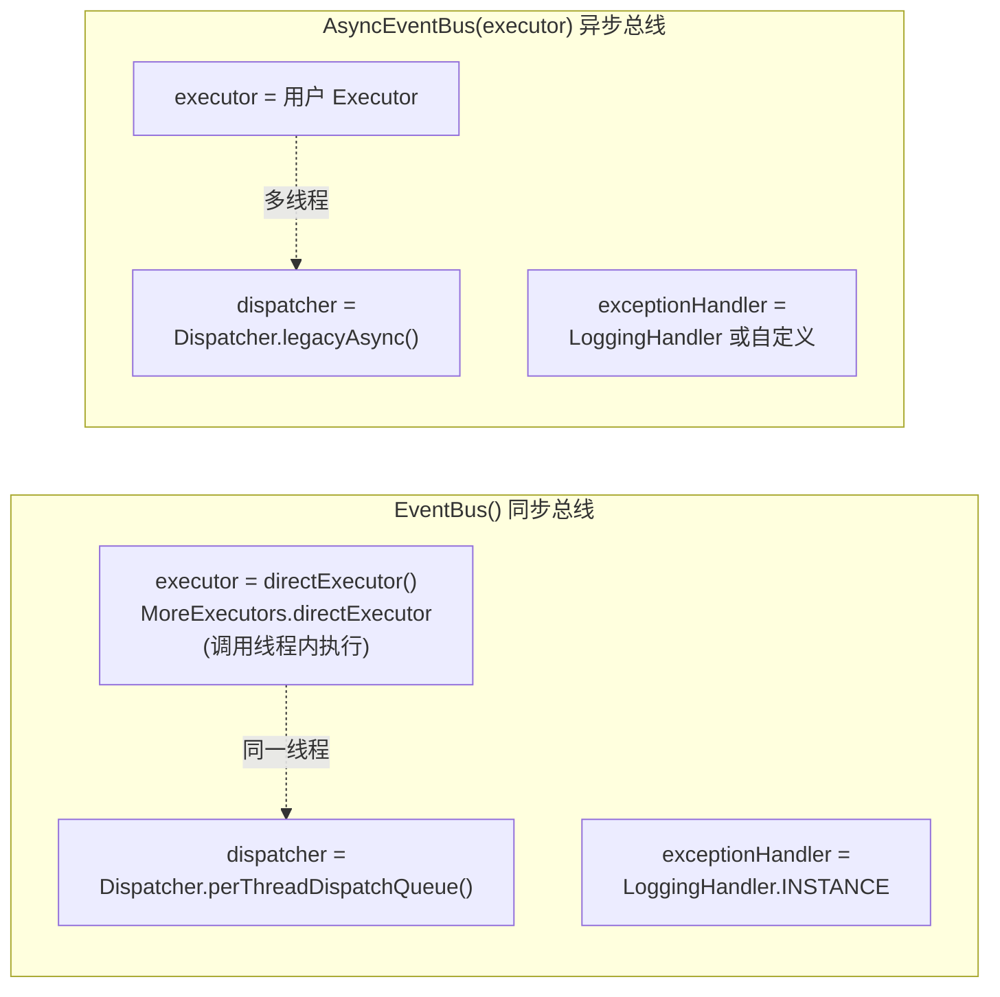
```mermaid
flowchart LR
    subgraph "EventBus() 同步总线"
        E1["executor = directExecutor()<br/>MoreExecutors.directExecutor<br/>(调用线程内执行)"]
        D1["dispatcher =<br/>Dispatcher.perThreadDispatchQueue()"]
        H1["exceptionHandler =<br/>LoggingHandler.INSTANCE"]
    end
    subgraph "AsyncEventBus(executor) 异步总线"
        E2["executor = 用户 Executor"]
        D2["dispatcher =<br/>Dispatcher.legacyAsync()"]
        H2["exceptionHandler =<br/>LoggingHandler 或自定义"]
    end
    E1 -.同一线程.-> D1
    E2 -.多线程.-> D2
```

```java
// EventBus 同步版默认装配
public EventBus(String identifier) {
  this(identifier, directExecutor(), Dispatcher.perThreadDispatchQueue(), LoggingHandler.INSTANCE);
}

// AsyncEventBus 异步版装配
public AsyncEventBus(Executor executor) {
  super("default", executor, Dispatcher.legacyAsync(), LoggingHandler.INSTANCE);
}
```

---

## 三、核心数据结构：SubscriberRegistry

### 3.1 事件类型 → 订阅者集合映射

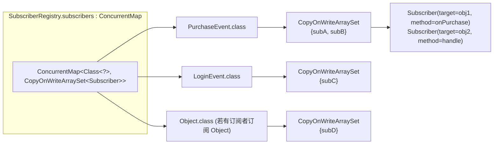
```mermaid
graph LR
    subgraph "SubscriberRegistry.subscribers : ConcurrentMap"
        M["ConcurrentMap&lt;Class&lt;?&gt;, CopyOnWriteArraySet&lt;Subscriber&gt;&gt;"]
    end

    M --> K1["PurchaseEvent.class"]
    M --> K2["LoginEvent.class"]
    M --> K3["Object.class (若有订阅者订阅 Object)"]

    K1 --> S1["CopyOnWriteArraySet<br/>{subA, subB}"]
    K2 --> S2["CopyOnWriteArraySet<br/>{subC}"]
    K3 --> S3["CopyOnWriteArraySet<br/>{subD}"]

    S1 --> A["Subscriber(target=obj1, method=onPurchase)<br/>Subscriber(target=obj2, method=handle)"]
```

```java
// SubscriberRegistry
private final ConcurrentMap<Class<?>, CopyOnWriteArraySet<Subscriber>> subscribers =
    Maps.newConcurrentMap();
```

**为何用 `CopyOnWriteArraySet`？**
- **读远多于写**（`post` 频繁读，`register`/`unregister` 偶尔写）。
- 读**完全无锁**：返回的是不可变快照迭代器，遍历期间不受并发修改影响。
- 写时复制，开销较大但可接受（订阅者注册不频繁）。

### 3.2 两个反射缓存（复用 Guava Cache）

SubscriberRegistry 用两个**静态** `LoadingCache` 缓存反射结果（这正是上一篇 [Guava Cache 原理分析](./Guava-Cache原理分析.md) 中 LocalCache 的应用！）：

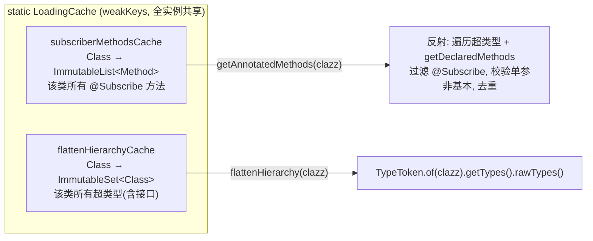
```mermaid
graph LR
    subgraph "static LoadingCache (weakKeys, 全实例共享)"
        C1["subscriberMethodsCache<br/>Class → ImmutableList&lt;Method&gt;<br/>该类所有 @Subscribe 方法"]
        C2["flattenHierarchyCache<br/>Class → ImmutableSet&lt;Class&gt;<br/>该类所有超类型(含接口)"]
    end
    C1 -->|"getAnnotatedMethods(clazz)"| R1["反射: 遍历超类型 + getDeclaredMethods<br/>过滤 @Subscribe, 校验单参非基本, 去重"]
    C2 -->|"flattenHierarchy(clazz)"| R2["TypeToken.of(clazz).getTypes().rawTypes()"]
```

```java
private static final LoadingCache<Class<?>, ImmutableList<Method>> subscriberMethodsCache =
    CacheBuilder.newBuilder()
        .weakKeys()   // 防止类卸载泄漏
        .build(CacheLoader.from(SubscriberRegistry::getAnnotatedMethodsNotCached));

private static final LoadingCache<Class<?>, ImmutableSet<Class<?>>> flattenHierarchyCache =
    CacheBuilder.newBuilder()
        .weakKeys()
        .build(CacheLoader.from(
            concreteClass -> ImmutableSet.copyOf(TypeToken.of(concreteClass).getTypes().rawTypes())));
```

**设计要点**：
- **`static`**：两个缓存是类级静态字段，**所有 EventBus 实例共享**。多个总线注册同一类型对象时只反射一次。
- **`weakKeys()`**：用弱引用持有 Class 对象，避免缓存阻止类卸载（尤其在热部署/动态类加载场景）。这正好利用了 Guava Cache 的 `weakKeys` + ReferenceQueue 清理能力。
- 缓存 value 是 `ImmutableList`/`ImmutableSet`（不可变，线程安全）。

---

## 四、register 注册流程

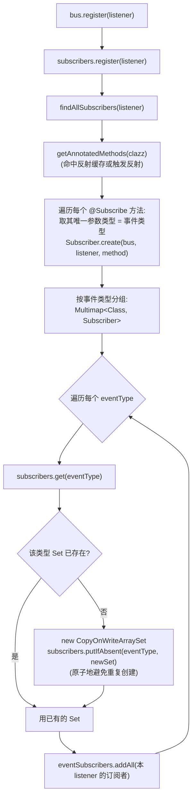
```mermaid
flowchart TD
    A["bus.register(listener)"] --> B["subscribers.register(listener)"]
    B --> C["findAllSubscribers(listener)"]
    C --> D["getAnnotatedMethods(clazz)<br/>(命中反射缓存或触发反射)"]
    D --> E["遍历每个 @Subscribe 方法:<br/>取其唯一参数类型 = 事件类型<br/>Subscriber.create(bus, listener, method)"]
    E --> F["按事件类型分组:<br/>Multimap&lt;Class, Subscriber&gt;"]
    F --> G{"遍历每个 eventType"}
    G --> H["subscribers.get(eventType)"]
    H --> I{"该类型 Set 已存在?"}
    I -- 否 --> J["new CopyOnWriteArraySet<br/>subscribers.putIfAbsent(eventType, newSet)<br/>(原子地避免重复创建)"]
    I -- 是 --> K["用已有的 Set"]
    J --> K
    K --> L["eventSubscribers.addAll(本 listener 的订阅者)"]
    L --> G
```

```java
// SubscriberRegistry.register
void register(Object listener) {
  Multimap<Class<?>, Subscriber> listenerMethods = findAllSubscribers(listener);
  for (Entry<Class<?>, Collection<Subscriber>> entry : listenerMethods.asMap().entrySet()) {
    Class<?> eventType = entry.getKey();
    Collection<Subscriber> eventMethodsInListener = entry.getValue();
    CopyOnWriteArraySet<Subscriber> eventSubscribers = subscribers.get(eventType);
    if (eventSubscribers == null) {
      CopyOnWriteArraySet<Subscriber> newSet = new CopyOnWriteArraySet<>();
      eventSubscribers = MoreObjects.firstNonNull(subscribers.putIfAbsent(eventType, newSet), newSet);
    }
    eventSubscribers.addAll(eventMethodsInListener);   // 写时复制
  }
}
```

### 关键细节

1. **`putIfAbsent` 保证原子性**：两个线程同时为同一 eventType 创建 Set 时，`putIfAbsent` 确保只有一个胜出，`firstNonNull` 取回（可能已被别人放入的）实际 Set。
2. **`addAll` 写时复制**：`CopyOnWriteArraySet.addAll` 复制底层数组，不影响正在遍历的 `post` 线程。
3. **Subscriber 创建时决定同步性**：`Subscriber.create` 根据方法是否有 `@AllowConcurrentEvents` 选择 `Subscriber` 或 `SynchronizedSubscriber`（详见[第十节](#十并发安全allowconcurrentevents-与-synchronizedsubscriber)）。

---

## 五、反射发现 @Subscribe 方法

`getAnnotatedMethodsNotCached` 是反射的核心，由缓存按需触发：

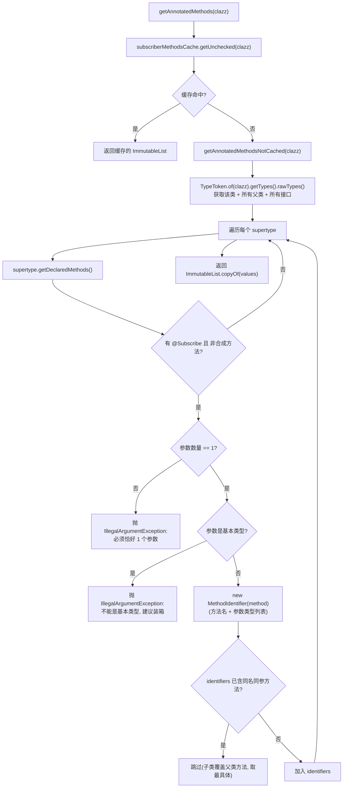
```mermaid
flowchart TD
    A["getAnnotatedMethods(clazz)"] --> B["subscriberMethodsCache.getUnchecked(clazz)"]
    B --> C{"缓存命中?"}
    C -- 是 --> D["返回缓存的 ImmutableList"]
    C -- 否 --> E["getAnnotatedMethodsNotCached(clazz)"]
    E --> F["TypeToken.of(clazz).getTypes().rawTypes()<br/>获取该类 + 所有父类 + 所有接口"]
    F --> G["遍历每个 supertype"]
    G --> H["supertype.getDeclaredMethods()"]
    H --> I{"有 @Subscribe 且 非合成方法?"}
    I -- 否 --> G
    I -- 是 --> J{"参数数量 == 1?"}
    J -- 否 --> ERR1["抛 IllegalArgumentException:<br/>必须恰好 1 个参数"]
    J -- 是 --> K{"参数是基本类型?"}
    K -- 是 --> ERR2["抛 IllegalArgumentException:<br/>不能是基本类型, 建议装箱"]
    K -- 否 --> L["new MethodIdentifier(method)<br/>(方法名 + 参数类型列表)"]
    L --> M{"identifiers 已含同名同参方法?"}
    M -- 是 --> N["跳过(子类覆盖父类方法, 取最具体)"]
    M -- 否 --> O["加入 identifiers"]
    O --> G
    G --> P["返回 ImmutableList.copyOf(values)"]
```

### 关键规则

| 规则 | 说明 |
|------|------|
| **遍历整个类型层级** | `TypeToken.getTypes().rawTypes()` 给出该类 + 所有父类 + 所有接口，故父类/接口上的 `@Subscribe` 也会被发现 |
| **恰好 1 个参数** | 多参数或零参数的 `@Subscribe` 方法在注册时即抛异常（不是运行时才报错） |
| **参数不能是基本类型** | `int` 不行，必须 `Integer`。因为 `post(null)` 无法匹配基本类型，且泛型擦除下基本类型无 Class |
| **去重 MethodIdentifier** | 按"方法名 + 参数类型列表"去重。子类覆盖父类同名同参方法时，只保留一个（具体哪个取决于 `rawTypes()` 顺序，最具体的优先） |
| **跳过 synthetic 方法** | 编译器生成的方法（如 lambda 桥接）不参与 |

### MethodIdentifier 去重

```java
private static final class MethodIdentifier {
  private final String name;
  private final List<Class<?>> parameterTypes;
  // equals: 同名 + 同参数类型列表
}
```

`Map<MethodIdentifier, Method>` 去重：若子类和父类都有 `onEvent(X)`，按方法签名去重，避免同一方法被注册两次。

---

## 六、post 分发流程（核心）

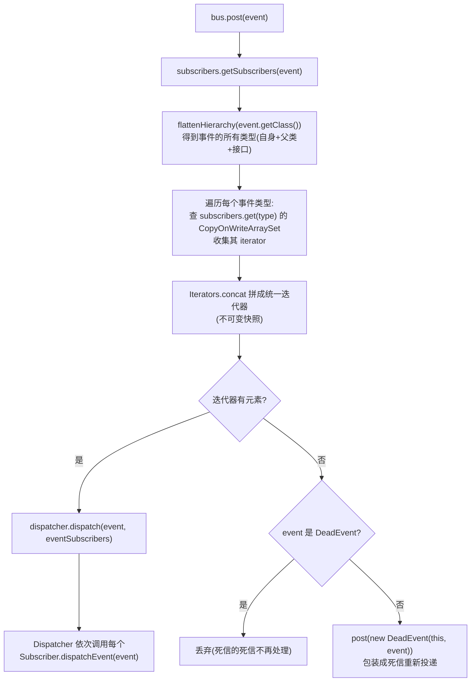
```mermaid
flowchart TD
    A["bus.post(event)"] --> B["subscribers.getSubscribers(event)"]
    B --> C["flattenHierarchy(event.getClass())<br/>得到事件的所有类型(自身+父类+接口)"]
    C --> D["遍历每个事件类型:<br/>查 subscribers.get(type) 的 CopyOnWriteArraySet<br/>收集其 iterator"]
    D --> E["Iterators.concat 拼成统一迭代器<br/>(不可变快照)"]
    E --> F{"迭代器有元素?"}
    F -- 是 --> G["dispatcher.dispatch(event, eventSubscribers)"]
    F -- 否 --> H{"event 是 DeadEvent?"}
    H -- 是 --> I["丢弃(死信的死信不再处理)"]
    H -- 否 --> J["post(new DeadEvent(this, event))<br/>包装成死信重新投递"]
    G --> K["Dispatcher 依次调用每个<br/>Subscriber.dispatchEvent(event)"]
```

```java
// EventBus.post
public void post(Object event) {
  Iterator<Subscriber> eventSubscribers = subscribers.getSubscribers(event);
  if (eventSubscribers.hasNext()) {
    dispatcher.dispatch(event, eventSubscribers);
  } else if (!(event instanceof DeadEvent)) {
    post(new DeadEvent(this, event));   // 死信二次投递
  }
}
```

### post 完整时序

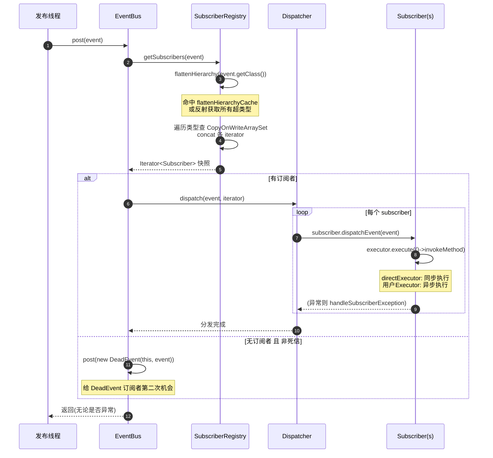
```mermaid
sequenceDiagram
    autonumber
    participant P as 发布线程
    participant EB as EventBus
    participant SR as SubscriberRegistry
    participant Disp as Dispatcher
    participant Sub as Subscriber(s)

    P->>EB: post(event)
    EB->>SR: getSubscribers(event)
    SR->>SR: flattenHierarchy(event.getClass())
    Note over SR: 命中 flattenHierarchyCache<br/>或反射获取所有超类型
    SR->>SR: 遍历类型查 CopyOnWriteArraySet<br/>concat 各 iterator
    SR-->>EB: Iterator<Subscriber> 快照

    alt 有订阅者
        EB->>Disp: dispatch(event, iterator)
        loop 每个 subscriber
            Disp->>Sub: subscriber.dispatchEvent(event)
            Sub->>Sub: executor.execute(()->invokeMethod)
            Note over Sub: directExecutor: 同步执行<br/>用户Executor: 异步执行
            Sub-->>Disp: (异常则 handleSubscriberException)
        end
        Disp-->>EB: 分发完成
    else 无订阅者 且 非死信
        EB->>EB: post(new DeadEvent(this, event))
        Note over EB: 给 DeadEvent 订阅者第二次机会
    end
    EB-->>P: 返回(无论是否异常)
```

### 关键语义

- **`post` 总是正常返回**：无论订阅者是否抛异常，`post` 都成功返回。异常被捕获交给 `exceptionHandler`，**不传播**给发布者。
- **快照遍历**：`getSubscribers` 返回的是基于 `CopyOnWriteArraySet` 的不可变快照迭代器，分发期间即使有 `register`/`unregister` 也不影响本次遍历。
- **死信兜底**：无订阅者时包装成 `DeadEvent` 重投，给系统二次处理机会。

---

## 七、事件类型匹配：flattenHierarchy

事件路由基于**类型可赋值性**：一个事件会被投递给"能接受该事件的任何类型"的订阅者，包括其父类和实现的接口。

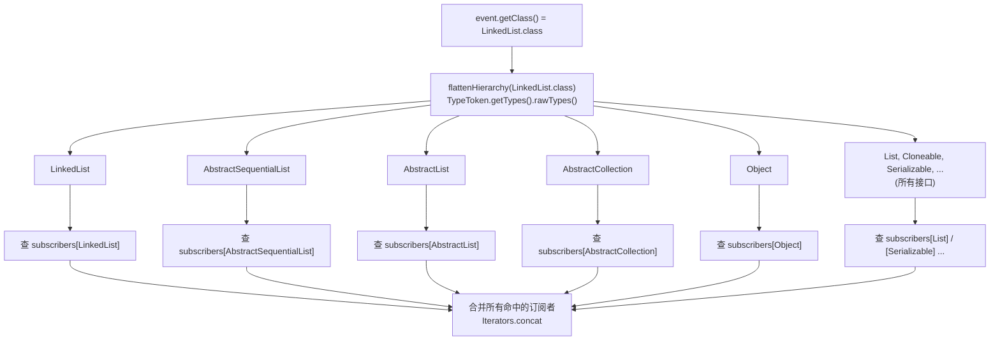
```mermaid
graph TD
    EVT["event.getClass() = LinkedList.class"]
    EVT --> FH["flattenHierarchy(LinkedList.class)<br/>TypeToken.getTypes().rawTypes()"]
    FH --> T1["LinkedList"]
    FH --> T2["AbstractSequentialList"]
    FH --> T3["AbstractList"]
    FH --> T4["AbstractCollection"]
    FH --> T5["Object"]
    FH --> T6["List, Cloneable, Serializable, ...<br/>(所有接口)"]

    T1 --> Q1["查 subscribers[LinkedList]"]
    T2 --> Q2["查 subscribers[AbstractSequentialList]"]
    T3 --> Q3["查 subscribers[AbstractList]"]
    T4 --> Q4["查 subscribers[AbstractCollection]"]
    T5 --> Q5["查 subscribers[Object]"]
    T6 --> Q6["查 subscribers[List] / [Serializable] ..."]

    Q1 --> ALL["合并所有命中的订阅者<br/>Iterators.concat"]
    Q2 --> ALL
    Q3 --> ALL
    Q4 --> ALL
    Q5 --> ALL
    Q6 --> ALL
```

```java
// SubscriberRegistry.getSubscribers
Iterator<Subscriber> getSubscribers(Object event) {
  ImmutableSet<Class<?>> eventTypes = flattenHierarchy(event.getClass());  // 缓存
  List<Iterator<Subscriber>> subscriberIterators = Lists.newArrayListWithCapacity(eventTypes.size());
  for (Class<?> eventType : eventTypes) {
    CopyOnWriteArraySet<Subscriber> eventSubscribers = subscribers.get(eventType);
    if (eventSubscribers != null) {
      subscriberIterators.add(eventSubscribers.iterator());   // 无拷贝快照
    }
  }
  return Iterators.concat(subscriberIterators.iterator());
}
```

### 含义

- 订阅 `Object` 的订阅者会收到**所有**事件（因此 `Object` 订阅者存在时，永远不会有 DeadEvent）。
- 订阅 `List` 的会收到任何 `List` 实现的事件。
- `flattenHierarchy` 结果被 `flattenHierarchyCache` 缓存，避免每次 `post` 都反射。

> **注意**：订阅者顺序在同一事件类型内由 `CopyOnWriteArraySet` 决定（插入序去重），跨类型按 `flattenHierarchy` 返回的 `ImmutableSet` 顺序（`TypeToken.getTypes()` 的遍历序）。**总体不保证严格的订阅优先级**，不应依赖顺序。

---

## 八、Dispatcher 三种分发策略

Dispatcher 是可插拔的分发策略，控制事件投递的**顺序保证**。

### 8.1 三策略对比

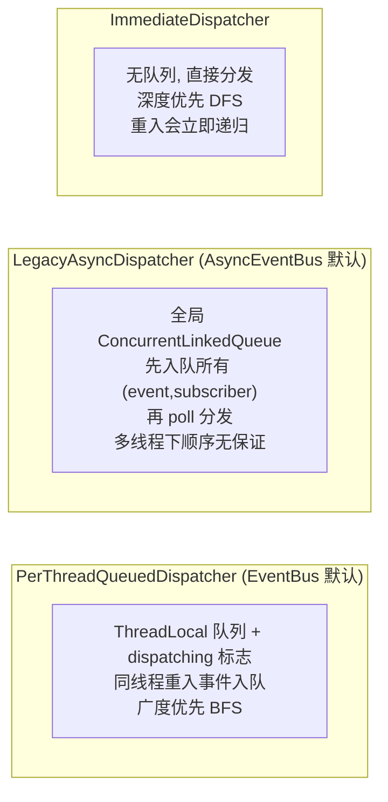
```mermaid
graph LR
    subgraph "PerThreadQueuedDispatcher (EventBus 默认)"
        P1["ThreadLocal 队列 + dispatching 标志<br/>同线程重入事件入队<br/>广度优先 BFS"]
    end
    subgraph "LegacyAsyncDispatcher (AsyncEventBus 默认)"
        P2["全局 ConcurrentLinkedQueue<br/>先入队所有 (event,subscriber)<br/>再 poll 分发<br/>多线程下顺序无保证"]
    end
    subgraph "ImmediateDispatcher"
        P3["无队列, 直接分发<br/>深度优先 DFS<br/>重入会立即递归"]
    end
```

| 策略 | 用于 | 队列 | 重入处理 | 顺序保证 |
|------|------|------|----------|----------|
| **PerThreadQueued** | `EventBus`（同步） | 每线程一个 `ThreadLocal<Queue>` | 重入事件入队，当前事件所有订阅者处理完后再处理 | 同线程内 **FIFO（广度优先）** |
| **LegacyAsync** | `AsyncEventBus` | 全局 `ConcurrentLinkedQueue` | 入队后立即 poll | 多线程下**无严格顺序** |
| **Immediate** | 可手动选用 | 无 | 直接递归调用 | 深度优先，重入立即执行 |

### 8.2 PerThreadQueuedDispatcher：同步总线的核心

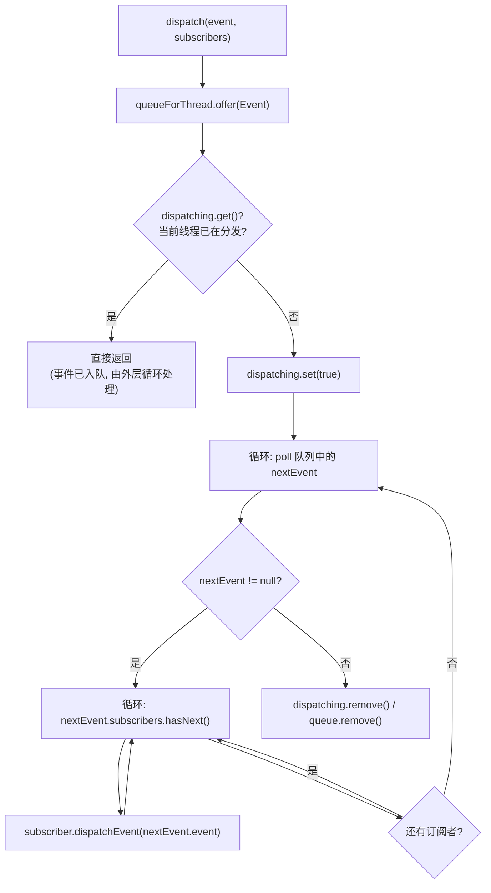
```mermaid
flowchart TD
    A["dispatch(event, subscribers)"] --> B["queueForThread.offer(Event)"]
    B --> C{"dispatching.get()?<br/>当前线程已在分发?"}
    C -- 是 --> D["直接返回<br/>(事件已入队, 由外层循环处理)"]
    C -- 否 --> E["dispatching.set(true)"]
    E --> F["循环: poll 队列中的 nextEvent"]
    F --> G{"nextEvent != null?"}
    G -- 是 --> H["循环: nextEvent.subscribers.hasNext()"]
    H --> I["subscriber.dispatchEvent(nextEvent.event)"]
    I --> H
    H --> J{"还有订阅者?"}
    J -- 是 --> H
    J -- 否 --> F
    G -- 否 --> K["dispatching.remove() / queue.remove()"]
```

```java
// PerThreadQueuedDispatcher.dispatch
void dispatch(Object event, Iterator<Subscriber> subscribers) {
  Queue<Event> queueForThread = queue.get();              // ThreadLocal 队列
  queueForThread.offer(new Event(event, subscribers));    // 入队
  if (!dispatching.get()) {                                // 不在分发中?
    dispatching.set(true);
    try {
      Event nextEvent;
      while ((nextEvent = queueForThread.poll()) != null) {
        while (nextEvent.subscribers.hasNext()) {
          nextEvent.subscribers.next().dispatchEvent(nextEvent.event);  // 调订阅者
        }
      }
    } finally {
      dispatching.remove();
      queue.remove();                                      // 清理 ThreadLocal 防泄漏
    }
  }
}
```

### 8.3 重入与广度优先（BFS）语义

这是 PerThreadQueuedDispatcher 最精妙之处。考虑订阅者 A 处理事件 X 时又 `post` 了事件 Y：

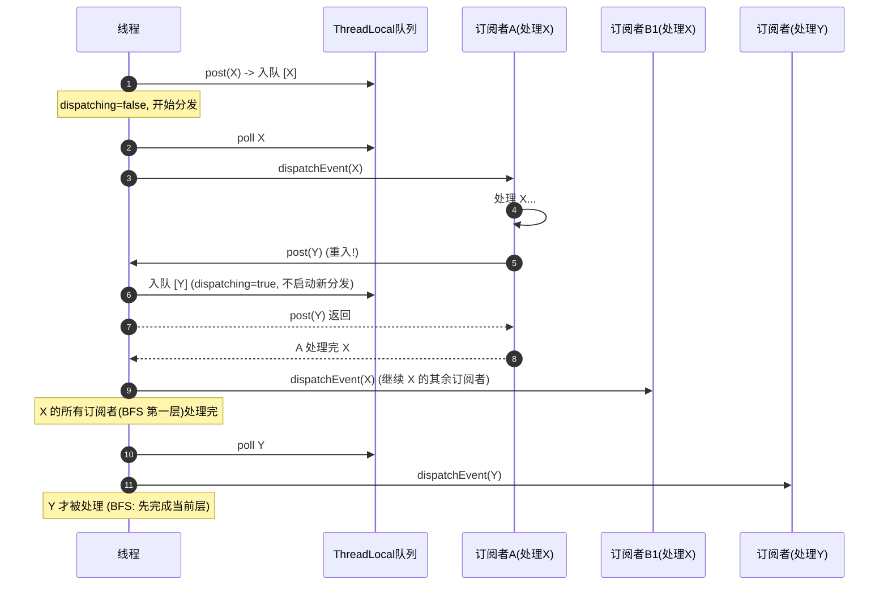
```mermaid
sequenceDiagram
    autonumber
    participant T as 线程
    participant Q as ThreadLocal队列
    participant A as 订阅者A(处理X)
    participant B1 as 订阅者B1(处理X)
    participant Y1 as 订阅者(处理Y)

    T->>Q: post(X) -> 入队 [X]
    Note over T: dispatching=false, 开始分发
    T->>Q: poll X
    T->>A: dispatchEvent(X)
    A->>A: 处理 X...
    A->>T: post(Y) (重入!)
    T->>Q: 入队 [Y] (dispatching=true, 不启动新分发)
    T-->>A: post(Y) 返回
    A-->>T: A 处理完 X
    T->>B1: dispatchEvent(X) (继续 X 的其余订阅者)
    Note over T: X 的所有订阅者(BFS 第一层)处理完
    T->>Q: poll Y
    T->>Y1: dispatchEvent(Y)
    Note over T: Y 才被处理 (BFS: 先完成当前层)
```

**关键点**：
- 订阅者 A 在处理 X 时 `post(Y)`，Y **不会立即递归分发**，而是入队等待。
- 必须等 X 的**所有**订阅者（A、B1...）处理完，才轮到 Y。
- 这是**广度优先（BFS）**：一个事件的所有订阅者，先于其触发的衍生事件。
- `dispatching` ThreadLocal 标志防止重入递归导致栈溢出；只有最外层的 `post` 驱动 while 循环。

### 8.4 LegacyAsyncDispatcher

```java
void dispatch(Object event, Iterator<Subscriber> subscribers) {
  while (subscribers.hasNext()) {
    queue.add(new EventWithSubscriber(event, subscribers.next()));  // 先全入队
  }
  EventWithSubscriber e;
  while ((e = queue.poll()) != null) {
    e.subscriber.dispatchEvent(e.event);                            // 再分发
  }
}
```

使用**全局** `ConcurrentLinkedQueue`。配合异步 Executor，多个线程并发 poll 分发，顺序无保证。源码注释自嘲："All this makes me really wonder if there's any value in queueing here at all"——这个队列意义不大，`immediate()` 通常更好。

### 8.5 ImmediateDispatcher

```java
void dispatch(Object event, Iterator<Subscriber> subscribers) {
  while (subscribers.hasNext()) {
    subscribers.next().dispatchEvent(event);   // 无队列, 直接调
  }
}
```

直接遍历调用，深度优先。订阅者内 `post` 会立即递归。最简单，适合不需要重入保护、且 Executor 已处理并发的场景。

---

## 九、Subscriber：执行器与反射调用

### 9.1 Subscriber 的结构

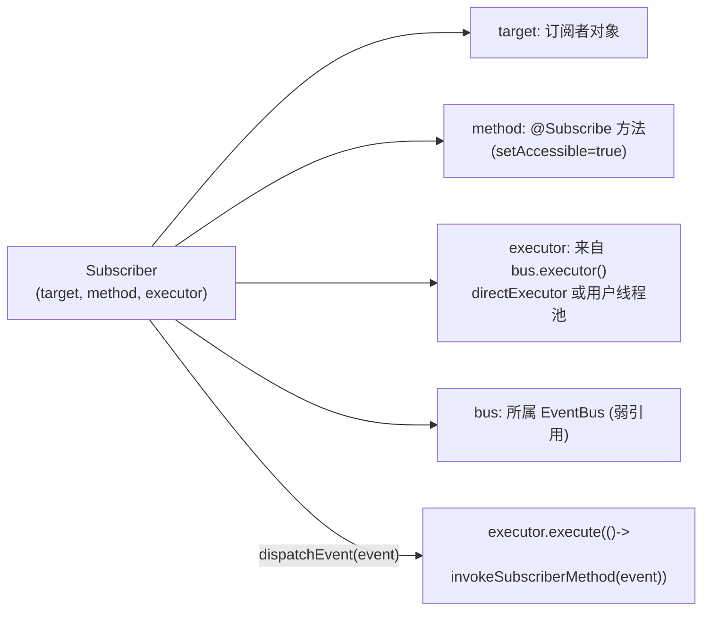
```mermaid
graph LR
    SUB["Subscriber<br/>(target, method, executor)"] --> T["target: 订阅者对象"]
    SUB --> M["method: @Subscribe 方法<br/>(setAccessible=true)"]
    SUB --> EX["executor: 来自 bus.executor()<br/>directExecutor 或用户线程池"]
    SUB --> B["bus: 所属 EventBus (弱引用)"]

    SUB -->|"dispatchEvent(event)"| FLOW["executor.execute(()-><br/>  invokeSubscriberMethod(event))"]
```

### 9.2 dispatchEvent：执行器委派

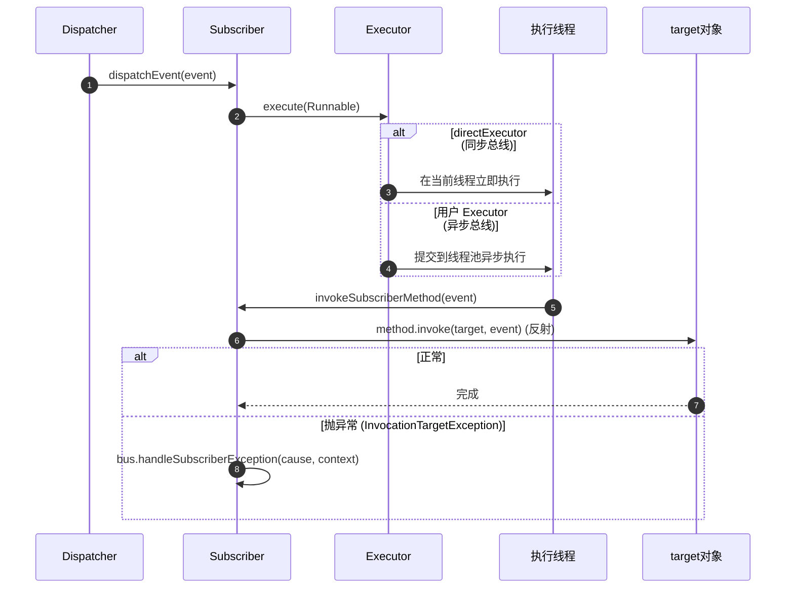
```mermaid
sequenceDiagram
    autonumber
    participant Disp as Dispatcher
    participant Sub as Subscriber
    participant Ex as Executor
    participant Th as 执行线程
    participant T as target对象

    Disp->>Sub: dispatchEvent(event)
    Sub->>Ex: execute(Runnable)
    alt directExecutor (同步总线)
        Ex->>Th: 在当前线程立即执行
    else 用户 Executor (异步总线)
        Ex->>Th: 提交到线程池异步执行
    end
    Th->>Sub: invokeSubscriberMethod(event)
    Sub->>T: method.invoke(target, event) (反射)
    alt 正常
        T-->>Sub: 完成
    else 抛异常 (InvocationTargetException)
        Sub->>Sub: bus.handleSubscriberException(cause, context)
    end
```

```java
// Subscriber.dispatchEvent
final void dispatchEvent(Object event) {
  executor.execute(() -> {                           // 由 Executor 决定线程
    try {
      invokeSubscriberMethod(event);
    } catch (InvocationTargetException e) {
      bus.handleSubscriberException(e.getCause(), context(event));   // 异常不传播
    }
  });
}

// Subscriber.invokeSubscriberMethod
void invokeSubscriberMethod(Object event) throws InvocationTargetException {
  try {
    method.invoke(target, event);                    // 反射调用
  } catch (IllegalArgumentException e) {
    throw new Error("Method rejected target/argument: " + event, e);
  } catch (IllegalAccessException e) {
    throw new Error("Method became inaccessible: " + event, e);
  } catch (InvocationTargetException e) {
    if (e.getCause() instanceof Error) throw (Error) e.getCause();  // Error 直接抛
    throw e;                                          // 异常包装后抛给上层捕获
  }
}
```

### 9.3 Dispatcher vs Executor 正交性（再强调）

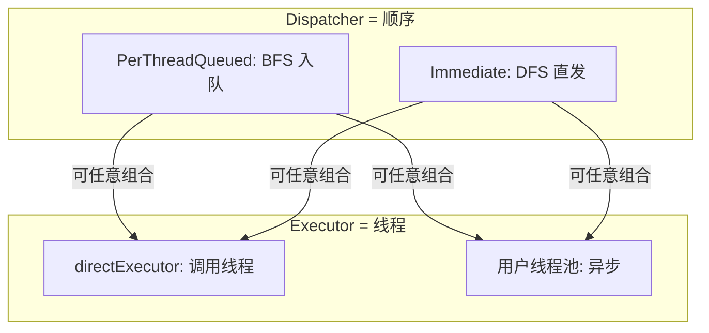
```mermaid
graph TB
    subgraph "Dispatcher = 顺序"
        D1["PerThreadQueued: BFS 入队"]
        D2["Immediate: DFS 直发"]
    end
    subgraph "Executor = 线程"
        E1["directExecutor: 调用线程"]
        E2["用户线程池: 异步"]
    end

    D1 -->|"可任意组合"| E1
    D1 -->|"可任意组合"| E2
    D2 -->|"可任意组合"| E1
    D2 -->|"可任意组合"| E2
```

| 组合 | 效果 |
|------|------|
| PerThreadQueued + directExecutor | **同步 EventBus**：同线程 BFS，顺序确定 |
| LegacyAsync + 用户 Executor | **AsyncEventBus**：多线程并发，顺序不定 |
| Immediate + directExecutor | 同步 DFS，重入立即递归 |
| Immediate + 用户 Executor | 异步直发 |

> `Subscriber` 持有的 `executor` 来自 `bus.executor()`，所以同一总线所有订阅者用同一 Executor。要让不同订阅者用不同线程池，需自定义扩展（标准 EventBus 不直接支持）。

---

## 十、并发安全：AllowConcurrentEvents 与 SynchronizedSubscriber

### 10.1 默认：串行调用保证

源码 Javadoc 明确保证：

> *"The EventBus guarantees that it will not call a subscriber method from multiple threads simultaneously, **unless** the method explicitly allows it by bearing the `AllowConcurrentEvents` annotation."*

### 10.2 实现机制

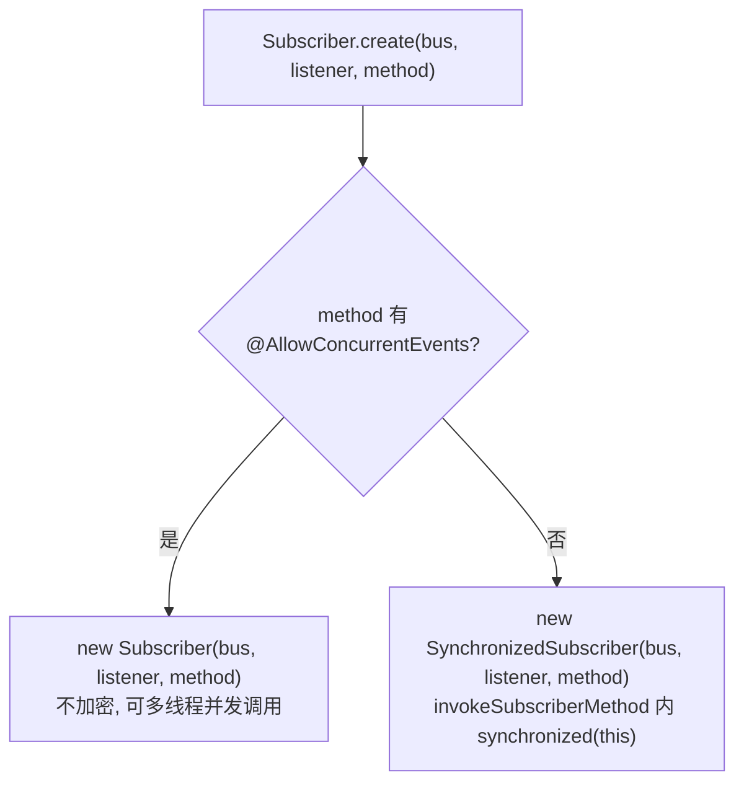
```mermaid
flowchart TD
    A["Subscriber.create(bus, listener, method)"] --> B{"method 有<br/>@AllowConcurrentEvents?"}
    B -- 是 --> C["new Subscriber(bus, listener, method)<br/>不加密, 可多线程并发调用"]
    B -- 否 --> D["new SynchronizedSubscriber(bus, listener, method)<br/>invokeSubscriberMethod 内 synchronized(this)"]
```

```java
// Subscriber.create
static Subscriber create(EventBus bus, Object listener, Method method) {
  return isDeclaredThreadSafe(method)
      ? new Subscriber(bus, listener, method)
      : new SynchronizedSubscriber(bus, listener, method);
}

// SynchronizedSubscriber
static final class SynchronizedSubscriber extends Subscriber {
  @Override
  void invokeSubscriberMethod(Object event) throws InvocationTargetException {
    synchronized (this) {                  // 同一订阅者方法, 同一时刻只一个线程进入
      super.invokeSubscriberMethod(event);
    }
  }
}
```

### 10.3 何时真正生效

- **同步 EventBus**（directExecutor）：本就在同一线程串行调用，`SynchronizedSubscriber` 的锁基本是冗余的。
- **AsyncEventBus**（用户 Executor）：多个事件可能并发投递到同一订阅者方法，此时 `synchronized(this)` 保证该订阅者方法**不被多线程同时进入**。

### 10.4 @AllowConcurrentEvents 的意义

```java
@Subscribe
@AllowConcurrentEvents   // 声明线程安全, 允许并发
void onEvent(Event e) { /* 线程安全实现 */ }
```

加了此注解 → 用普通 `Subscriber`（无锁）→ AsyncEventBus 下可并发调用。订阅者需自行保证线程安全。**不加则强制串行**，订阅者无需考虑重入。

---

## 十一、异常处理机制

### 11.1 异常不传播

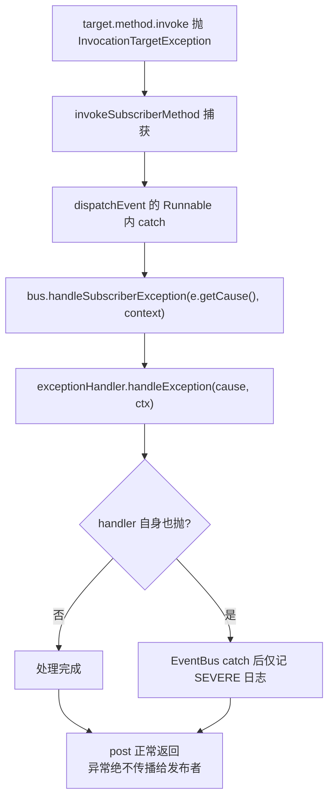
```mermaid
flowchart TD
    A["target.method.invoke 抛 InvocationTargetException"] --> B["invokeSubscriberMethod 捕获"]
    B --> C["dispatchEvent 的 Runnable 内 catch"]
    C --> D["bus.handleSubscriberException(e.getCause(), context)"]
    D --> E["exceptionHandler.handleException(cause, ctx)"]
    E --> F{"handler 自身也抛?"}
    F -- 是 --> G["EventBus catch 后仅记 SEVERE 日志"]
    F -- 否 --> H["处理完成"]
    H --> I["post 正常返回<br/>异常绝不传播给发布者"]
    G --> I
```

```java
// EventBus.handleSubscriberException
void handleSubscriberException(Throwable e, SubscriberExceptionContext context) {
  checkNotNull(e);
  checkNotNull(context);
  try {
    exceptionHandler.handleException(e, context);   // 委托给 handler
  } catch (Throwable e2) {
    // handler 自己也炸了? 只能记日志
    logger.log(Level.SEVERE,
        String.format("Exception %s thrown while handling exception: %s", e2, e), e2);
  }
}
```

### 11.2 默认 LoggingHandler

```java
static final class LoggingHandler implements SubscriberExceptionHandler {
  public void handleException(Throwable exception, SubscriberExceptionContext context) {
    Logger logger = logger(context);
    if (logger.isLoggable(Level.SEVERE)) {
      logger.log(Level.SEVERE, message(context), exception);   // 记 SEVERE 日志
    }
  }
  // message: "Exception thrown by subscriber method onPurchase(PurchaseEvent) on subscriber ... when dispatching event: ..."
}
```

默认行为：**仅记日志，吞掉异常**。订阅者异常不会中断其他订阅者的分发，也不会传给 `post` 调用者。

### 11.3 自定义异常处理

```java
// 提供自定义 handler
EventBus bus = new EventBus((exception, context) -> {
  // context.getEvent() / getSubscriber() / getSubscriberMethod() / getEventBus()
  metrics.increment("subscriber.errors");
  // 可基于错误广播新事件: context.getEventBus().post(new ErrorEvent(...))
});

// SubscriberExceptionContext 提供完整上下文
context.getEventBus();        // 所属总线, 可重新 post
context.getEvent();          // 触发异常的事件
context.getSubscriber();      // 抛异常的订阅者对象
context.getSubscriberMethod();// 抛异常的方法
```

**关键设计**：异常处理被完全解耦为 `SubscriberExceptionHandler` 接口，可注入告警、重试、指标等策略。`handleSubscriberException` 外层再套一层 `try-catch(Throwable)` 保证 handler 异常不会逃逸。

---

## 十二、DeadEvent 死信机制

### 12.1 什么是死信

当一个事件被 `post` 但**没有任何订阅者**能接收它，称为"死信"（Dead Event）。EventBus 不直接丢弃，而是包装成 `DeadEvent` 重新投递，给系统二次处理机会。

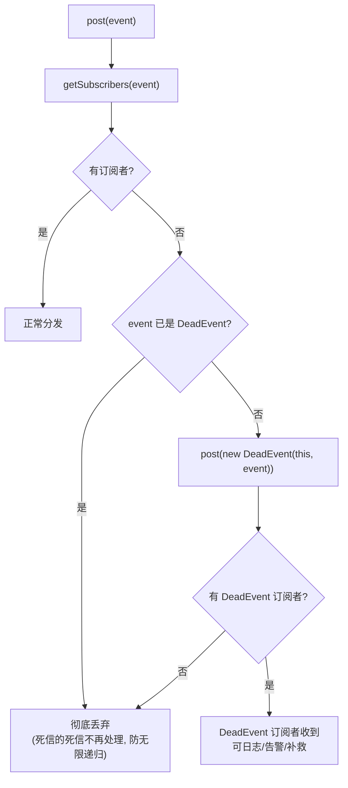
```mermaid
flowchart TD
    A["post(event)"] --> B["getSubscribers(event)"]
    B --> C{"有订阅者?"}
    C -- 是 --> D["正常分发"]
    C -- 否 --> E{"event 已是 DeadEvent?"}
    E -- 是 --> F["彻底丢弃<br/>(死信的死信不再处理, 防无限递归)"]
    E -- 否 --> G["post(new DeadEvent(this, event))"]
    G --> H{"有 DeadEvent 订阅者?"}
    H -- 是 --> I["DeadEvent 订阅者收到<br/>可日志/告警/补救"]
    H -- 否 --> F
```

### 12.2 DeadEvent 结构

```java
public class DeadEvent {
  private final Object source;   // 广播者, 一般是 EventBus
  private final Object event;    // 无法投递的原始事件

  public Object getSource() { return source; }
  public Object getEvent()   { return event; }
}
```

### 12.3 死信订阅的用途

```java
class DeadEventListener {
  @Subscribe
  void handleDeadEvent(DeadEvent dead) {
    log.warn("无人订阅的事件: {}", dead.getEvent());
    // 可用于调试系统配置错误、记录遗漏的事件类型
  }
}
bus.register(new DeadEventListener());
```

### 12.4 重要边界

- **递归保护**：死信的死信（DeadEvent 再次无订阅者）会走 `event instanceof DeadEvent` 分支被**直接丢弃**，不会无限递归。
- **Object 订阅者抑制死信**：若注册了订阅 `Object` 的订阅者，它接收所有事件，**永不产生 DeadEvent**。因此"是否死信"取决于全局是否有任意可接收者，而非特定类型订阅者。
- 注意 Javadoc 的提醒：虽然 `DeadEvent extends Object`，但订阅 `Object` 的订阅者收到的是**原始事件**而非 DeadEvent（因为原始事件先匹配到了 Object 订阅者，根本不会进入死信分支）。

---

## 十三、AsyncEventBus 异步总线

### 13.1 与 EventBus 的差异

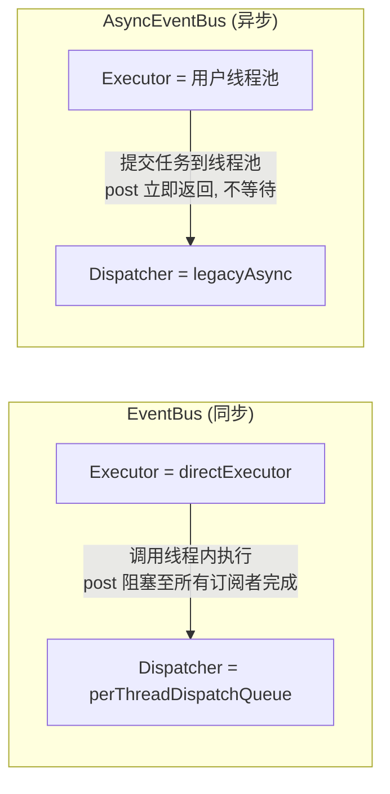
```mermaid
graph LR
    subgraph "EventBus (同步)"
        SE1["Executor = directExecutor"]
        SD1["Dispatcher = perThreadDispatchQueue"]
        SE1 -->|"调用线程内执行<br/>post 阻塞至所有订阅者完成"| SD1
    end
    subgraph "AsyncEventBus (异步)"
        AE1["Executor = 用户线程池"]
        AD1["Dispatcher = legacyAsync"]
        AE1 -->|"提交任务到线程池<br/>post 立即返回, 不等待"| AD1
    end
```

`AsyncEventBus` 仅在构造时换了两个组件：Executor 换成用户的线程池，Dispatcher 换成 `legacyAsync`。其余逻辑完全继承自 `EventBus`。

### 13.2 异步语义

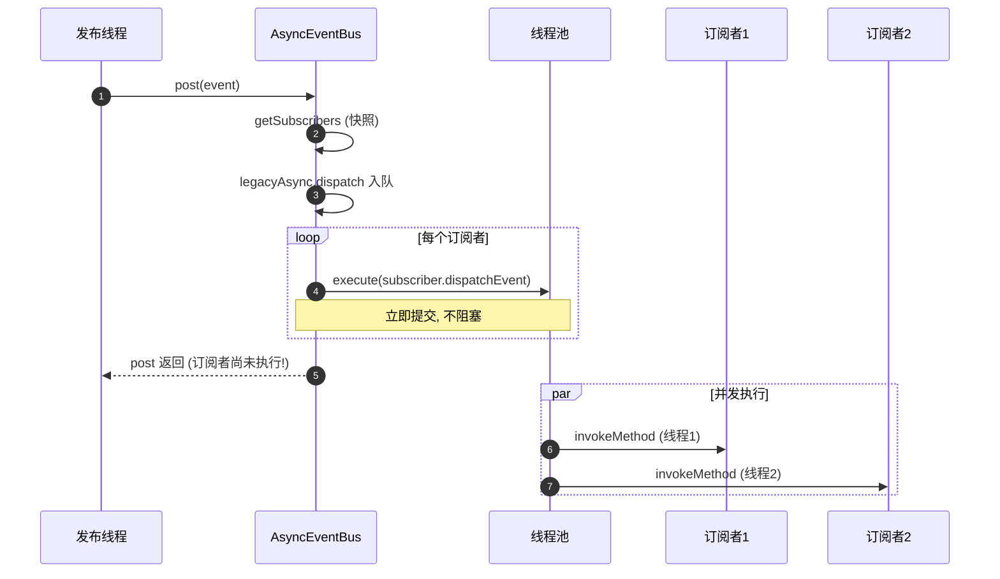
```mermaid
sequenceDiagram
    autonumber
    participant P as 发布线程
    participant AEB as AsyncEventBus
    participant Pool as 线程池
    participant S1 as 订阅者1
    participant S2 as 订阅者2

    P->>AEB: post(event)
    AEB->>AEB: getSubscribers (快照)
    AEB->>AEB: legacyAsync.dispatch 入队
    loop 每个订阅者
        AEB->>Pool: execute(subscriber.dispatchEvent)
        Note over AEB,Pool: 立即提交, 不阻塞
    end
    AEB-->>P: post 返回 (订阅者尚未执行!)
    par 并发执行
        Pool->>S1: invokeMethod (线程1)
        Pool->>S2: invokeMethod (线程2)
    end
```

### 13.3 关键注意点

- **`post` 立即返回**：不等待订阅者执行完。订阅者在 `Executor` 线程上异步运行。
- **线程安全责任转移**：未加 `@AllowConcurrentEvents` 的订阅者方法仍由 `SynchronizedSubscriber` 保证串行；但加了注解的方法可被多线程并发调用，需自行保证线程安全。
- **顺序无保证**：多线程并发分发，订阅者执行顺序不确定。
- **Executor 生命周期**：Javadoc 明确——**调用方负责在最后一个事件 post 后关闭 Executor**。AsyncEventBus 不会管理线程池生命周期。
- **异常处理不变**：仍由 `exceptionHandler` 处理，默认记日志。

---

## 十四、关键设计洞察

### 14.1 正交三组件：注册中心 / 分发器 / 执行器

```mermaid
graph TB
    subgraph "关注点分离"
        R["SubscriberRegistry<br/>注册 & 查找 (What)"]
        D["Dispatcher<br/>分发顺序 (When)"]
        E["Executor<br/>执行线程 (Where)"]
    end
    R -->|"提供订阅者快照"| D
    D -->|"按策略调用"| E
    E -->|"在线程上执行"| M["Subscriber.invokeMethod"]
```

三者职责清晰正交，可独立替换。这是 EventBus 架构最优雅之处。

### 14.2 读无锁：CopyOnWriteArraySet 快照

`post`（高频）读取订阅者集合时**完全无锁**，得益于 `CopyOnWriteArraySet`：
- 读返回不可变快照迭代器，遍历期间并发 `register`/`unregister` 不影响。
- 写时复制，写少读多场景下读极快。

### 14.3 反射结果静态缓存

两个 `static LoadingCache`（`subscriberMethodsCache`、`flattenHierarchyCache`）跨实例共享反射结果，`weakKeys` 防类卸载泄漏。这是 EventBus 性能的关键——反射只发生一次（每类）。**这里直接复用了 Guava Cache**，是上一章分析的最佳实践案例。

### 14.4 ThreadLocal 处理重入

PerThreadQueuedDispatcher 用 `ThreadLocal<Queue>` + `ThreadLocal<Boolean>` 解决重入分发：
- 重入事件入队而非递归，避免栈溢出。
- BFS 语义：一个事件的所有订阅者先于衍生事件。
- `finally` 中 `remove()` 清理 ThreadLocal，防止线程池线程复用导致泄漏/串状态。

### 14.5 异常完全隔离

- 订阅者异常 → 捕获 → `exceptionHandler` → **不传播**给 `post`。
- `exceptionHandler` 自身异常 → 再捕获 → 仅记日志。
- 双层保护确保异常**绝不**影响发布者或其他订阅者。代价是发布者无法感知失败（需自定义 handler 显式处理）。

### 14.6 死信兜底而非静默丢弃

无订阅者的事件不丢弃，包装为 DeadEvent 重投，便于调试/日志。体现"显式优于隐式"的设计哲学。

### 14.7 订阅者身份去重

`Subscriber.equals` 用 `target == that.target`（对象身份，非 equals）+ `method.equals`。这保证：
- 同一对象的同一方法**不会重复注册**（CopyOnWriteArraySet 去重）。
- 不同对象（即使 equal）的订阅者各自独立收到事件。

---

## 十五、官方"不推荐使用"的说明

值得特别强调：**Guava 官方在源码 Javadoc 顶部明确建议不要使用 EventBus**（"Avoid EventBus"）。这是分析时必须了解的背景。

### 官方推荐替代方案

| 场景 | 官方推荐 |
|------|----------|
| 组件解耦 | 依赖注入框架：Dagger（Android）、Guice / Spring（服务端） |
| 响应事件 | 响应式流：RxJava（+RxAndroid）、Project Reactor |
| 异步/流 | Kotlin 协程（Flow、Channels） |

### EventBus 的缺点（官方列举）

```mermaid
graph TD
    EB["EventBus 缺点"] --> P1["生产者-订阅者交叉引用难以追踪<br/>调试复杂, 易意外重入"]
    EB --> P2["反射机制被 R8/Proguard 优化器破坏"]
    EB --> P3["不支持等待多事件 / 批处理"]
    EB --> P4["不支持背压 (backpressure)"]
    EB --> P5["线程控制有限"]
    EB --> P6["几乎无监控"]
    EB --> P7["异常不传播, 难以反应"]
    EB --> P8["与 RxJava/协程互操作差"]
    EB --> P9["生命周期约束: 订阅者移除与新增之间的事件会丢失"]
    EB --> P10["性能次优, 尤其 Android"]
    EB --> P11["不支持参数化类型 (泛型事件)"]
    EB --> P12["Java 8 lambda 后, 比 listener 更啰嗦"]
```

> **结论**：理解 EventBus 的实现原理仍有价值（发布订阅、反射缓存、分发策略、执行器委派等模式可迁移），但**新项目应优先考虑 DI 框架 + 响应式流**。Guava 自身在引导用户迁移。

---

## 十六、总结

### 16.1 架构总览图

```mermaid
graph TB
    subgraph "对外 API"
        API1["EventBus / AsyncEventBus<br/>register / unregister / post"]
    end

    subgraph "SubscriberRegistry (注册中心)"
        SR1["ConcurrentMap&lt;Class, CopyOnWriteArraySet&gt;"]
        SR2["subscriberMethodsCache (反射缓存)"]
        SR3["flattenHierarchyCache (类型层级缓存)"]
    end

    subgraph "Dispatcher (分发策略)"
        D1["PerThreadQueued: ThreadLocal队列 BFS"]
        D2["LegacyAsync: 全局队列"]
        D3["Immediate: 直发 DFS"]
    end

    subgraph "Subscriber (订阅者)"
        S1["Subscriber: 无锁"]
        S2["SynchronizedSubscriber: synchronized"]
        S3["dispatchEvent -> executor.execute"]
    end

    subgraph "Executor (执行线程)"
        E1["directExecutor: 同步"]
        E2["用户线程池: 异步"]
    end

    subgraph "异常 & 死信"
        EH["SubscriberExceptionHandler<br/>(默认 LoggingHandler)"]
        DE["DeadEvent 死信重投"]
    end

    API1 --> SR1
    API1 --> D1
    SR1 -->|"提供快照"| D1
    D1 -->|"调用"| S3
    S3 --> E1
    S3 --> E2
    SR1 --> S1
    SR1 --> S2
    SR2 --> SR1
    SR3 --> API1
    S3 --> EH
    API1 --> DE
```

### 16.2 三句话精髓

1. **正交三组件**：`SubscriberRegistry` 管"谁订阅什么"（`ConcurrentMap<Class, CopyOnWriteArraySet>` + 反射缓存），`Dispatcher` 管"按什么顺序分发"（队列 BFS / 直发 DFS），`Executor` 管"在哪个线程执行"（同步 direct / 异步线程池）。三者可独立替换，是整个设计的骨架。

2. **反射一次、读无锁**：`@Subscribe` 方法通过遍历类型层级反射发现，结果存入**静态共享**的 `LoadingCache`（`weakKeys` 防泄漏，复用 Guava Cache），同一类只反射一次；`post` 读取订阅者集合用 `CopyOnWriteArraySet` 无锁快照，写少读多下读极快。

3. **重入、异常、死信三重兜底**：`PerThreadQueuedDispatcher` 用 `ThreadLocal` 队列把重入事件转为 BFS 入队而非递归；订阅者异常被双层捕获交由可注入的 `exceptionHandler`、**绝不传播**给发布者；无订阅者的事件包装为 `DeadEvent` 重投而非静默丢弃。

### 16.3 与同类对比

| 特性 | Guava EventBus | Spring ApplicationEvent | RxJava |
|------|---------------|------------------------|--------|
| 模型 | 注解反射订阅 | 接口 + 注解 | 流式 + 背压 |
| 线程 | Executor 可配 | 默认同步，可 `@Async` | 调度器丰富 |
| 异步 | AsyncEventBus | @Async | 原生 |
| 背压 | 无 | 无 | 有 |
| 异常 | handler 注入 | ApplicationContext 广播 | 流错误通道 |
| 反射 | 是（被混淆器影响） | 较少 | 否 |
| 官方态度 | **不推荐** | 维护中 | 推荐 |

> **选型建议**：遗留项目维护 Guava EventBus 没问题；新项目解耦用 DI 框架，事件流用 RxJava/Reactor，协程生态用 Kotlin Flow。EventBus 的设计模式（注册中心 + 分发器 + 执行器正交）仍值得学习借鉴。
