# Guava Cache 底层原理深度剖析

> 基于 Guava 33.4.0 源码分析
> 核心源文件：
> - `guava/src/com/google/common/cache/LocalCache.java`（5030 行，核心）
> - `guava/src/com/google/common/cache/CacheBuilder.java`（构建器/工厂）
> - `guava/src/com/google/common/cache/CacheLoader.java`（加载抽象）
> - `guava/src/com/google/common/cache/ReferenceEntry.java`（条目接口）
> - `guava/src/com/google/common/cache/RemovalCause.java`（移除原因）

---

## 目录

1. [一、整体设计思想](#一整体设计思想)
2. [二、类结构与架构图](#二类结构与架构图)
3. [三、分段锁与数据结构](#三分段锁与数据结构)
4. [四、Entry 与 ValueReference 引用体系](#四entry-与-valuereference-引用体系)
5. [五、getIfPresent 读流程](#五getifpresent-读流程)
6. [六、get(K) 加载流程（核心）](#六getk-加载流程核心)
7. [七、单飞机制：并发加载去重](#七单飞机制并发加载去重)
8. [八、异步刷新 refreshAfterWrite](#八异步刷新-refreshafterwrite)
9. [九、put 写流程](#九put-写流程)
10. [十、淘汰机制：分段 LRU](#十淘汰机制分段-lru)
11. [十一、过期机制：时间驱动清理](#十一过期机制时间驱动清理)
12. [十二、读批处理：recencyQueue 优化](#十二读批处理recencyqueue-优化)
13. [十三、清理总协调：读写触发的统一清理](#十三清理总协调读写触发的统一清理)
14. [十四、GC 回收与移除监听](#十四gc-回收与移除监听)
15. [十五、统计信息](#十五统计信息)
16. [十六、关键设计洞察](#十六关键设计洞察)
17. [十七、总结](#十七总结)

---

## 一、整体设计思想

### 1.1 Guava Cache 是什么

Guava Cache 是一个**本地内存型、线程安全、可配置过期与淘汰**的缓存。它不是分布式缓存（无 Redis/Caffeine 那样的 off-heap），而是 JVM 进程内的高性能缓存，核心实现是 `LocalCache`。

源码注释明确指出其血统：

> *"This implementation is heavily derived from revision 1.96 of ConcurrentHashMap.java."* —— `LocalCache` 派生自 Doug Lea 的 `ConcurrentHashMap`。

因此它的核心架构是 **分段（Segment）+ 分段锁**，与早期 `ConcurrentHashMap` 同源。

### 1.2 三大设计目标（源自源码注释）

```
The basic strategy is to subdivide the table among Segments, each of which itself is a
concurrently readable hash table. The map supports non-blocking reads and concurrent
writes across different segments.
```

1. **非阻塞读**：读操作不加锁，依靠 `volatile` 保证可见性。
2. **跨段并发写**：不同 Segment 的写操作互不阻塞。
3. **尽力而为的容量约束**：若设置 `maximumSize`，**每个 Segment 独立做 LRU 淘汰**（非全局 LRU），以避免全局锁。

### 1.3 核心能力一览

| 能力 | 配置 API | 实现机制 |
|------|----------|----------|
| 并发读写 | `concurrencyLevel(n)` | 分段锁 |
| 容量淘汰 | `maximumSize` / `maximumWeight` + `weigher` | 分段 LRU（accessQueue） |
| 写后过期 | `expireAfterWrite(d)` | writeQueue + 时间戳 |
| 访问后过期 | `expireAfterAccess(d)` | accessQueue + 时间戳 |
| 异步刷新 | `refreshAfterWrite(d)` | LoadingValueReference + reload 异步 |
| 弱/软引用 | `weakKeys` / `weakValues` / `softValues` | Reference + ReferenceQueue |
| 移除监听 | `removalListener(...)` | removalNotificationQueue 异步派发 |
| 统计 | `recordStats()` | 分段 StatsCounter + LongAdder |

---

## 二、类结构与架构图

### 2.1 类继承与组合关系

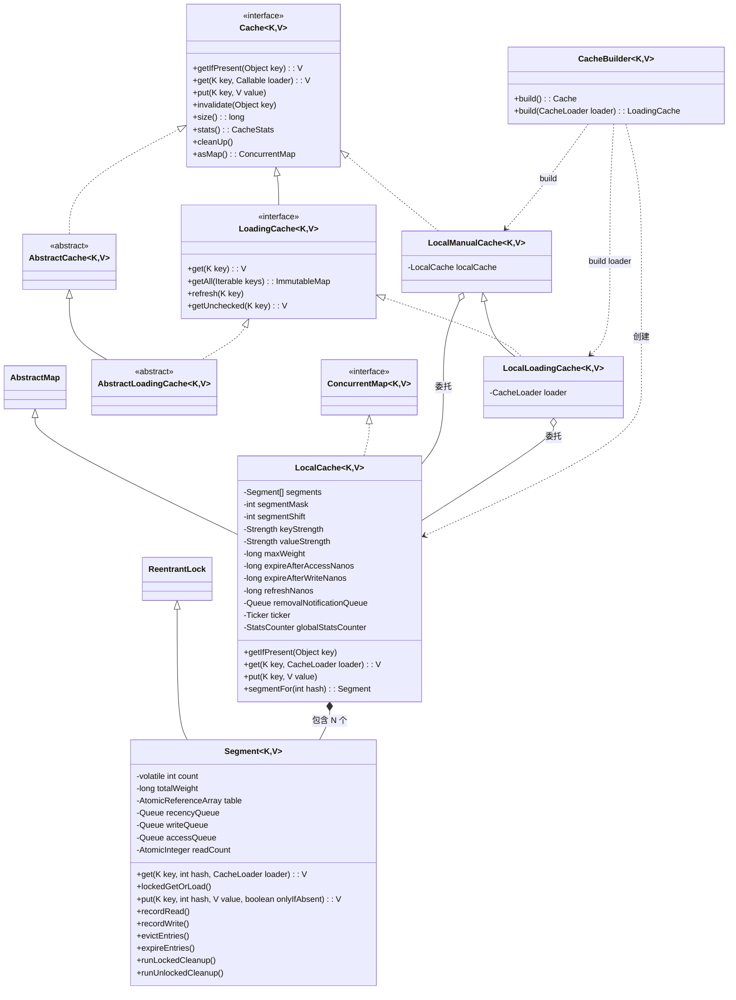

> **关键继承事实**（已与源码核对）：
> - `LocalCache extends AbstractMap<K,V> implements ConcurrentMap<K,V>` -- **它本身不是 `Cache`**，而是一个 `ConcurrentMap`；`asMap()` 直接返回 `this`。
> - `LocalLoadingCache extends LocalManualCache`（复用 `localCache` 字段，仅多一个 `loader`）。
> - `Segment extends ReentrantLock` -- 段本身就是一把锁。
> - `AbstractCache implements Cache`、`AbstractLoadingCache extends AbstractCache implements LoadingCache`（提供 `getUnchecked`/`apply` 等默认实现）。

### 2.2 分层职责

| 层级 | 类 | 职责 |
|------|-----|------|
| 接口 | `Cache` / `LoadingCache` | 对外 API：`getIfPresent`、`get`、`put`、`invalidate`、`stats` 等 |
| 薄包装 | `LocalManualCache` / `LocalLoadingCache` | 仅持有 `LocalCache` 引用并委托；`LocalLoadingCache` 额外持有 `CacheLoader` |
| 核心 | `LocalCache` | `extends AbstractMap implements ConcurrentMap`，真正的并发哈希表，持有 `Segment[]` |
| 分段 | `Segment`（继承 `ReentrantLock`） | 每段一个可并发读的哈希表 + 一把锁，承载所有读写/淘汰/过期/清理逻辑 |
| 条目 | `ReferenceEntry` / `ValueReference` | 条目与值的引用抽象，支持强弱引用与访问/写时间戳 |

> **关键点**：`LocalCache` 本身**就是**一个 `ConcurrentMap`（`asMap()` 直接返回 `this`）。`Cache` 接口的每个方法最终都落到 `LocalCache` 对应方法上。

### 2.3 CacheBuilder 如何决定内部实现

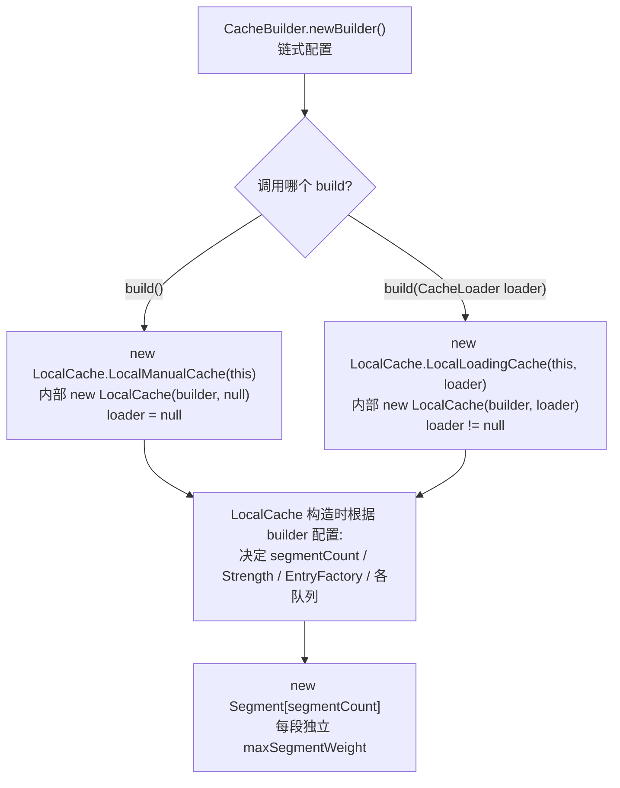

---

## 三、分段锁与数据结构

### 3.1 整体结构

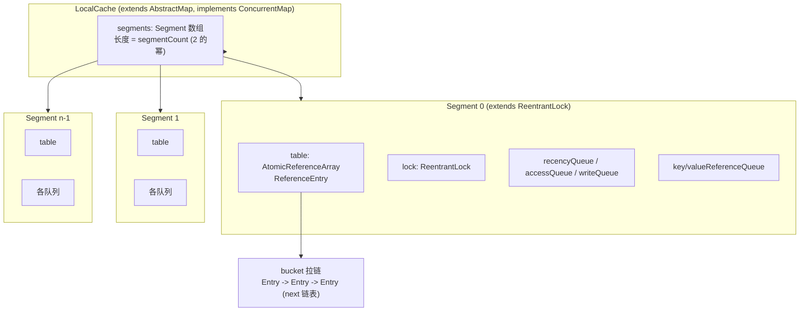

### 3.2 Segment 的核心字段

```java
static class Segment<K, V> extends ReentrantLock {
  @Weak final LocalCache<K, V> map;
  volatile int count;                              // 活元素数(volatile, 读可见性保证)
  @GuardedBy("this") long totalWeight;             // 该段总权重
  int modCount;                                    // 结构修改计数(快照一致性)
  int threshold;                                   // 扩容阈值 = capacity * 0.75
  volatile AtomicReferenceArray<ReferenceEntry<K, V>> table;  // 哈希桶数组
  final long maxSegmentWeight;                     // 该段最大权重

  final ReferenceQueue<K> keyReferenceQueue;       // 弱 key 回收队列
  final ReferenceQueue<V> valueReferenceQueue;     // 软/弱 value 回收队列
  final Queue<ReferenceEntry<K, V>> recencyQueue;  // 读访问的临时记录(无锁)
  final AtomicInteger readCount;                   // 读计数(触发批量清理)
  final Queue<ReferenceEntry<K, V>> writeQueue;    // 按写时间排序(过期)
  final Queue<ReferenceEntry<K, V>> accessQueue;    // 按访问时间排序(过期+LRU)
  final StatsCounter statsCounter;                 // 该段统计
}
```

### 3.3 volatile count 的双重作用（关键设计）

源码注释详述了 `count` 字段为何是核心：

```
- All (unsynchronized) read operations must first read the "count" field,
  and should not look at table entries if it is 0.
- All (synchronized) write operations should write to the "count" field
  after structurally changing any bin.
```

`volatile int count` 同时承担两个角色：
1. **元素计数**：记录该段当前活条目数。
2. **内存屏障**：写操作在结构性修改后、解锁前写入 `count`（`// write-volatile`），读操作先读 `count`（`// read-volatile`），借 volatile 的 happens-before 语义保证读线程能看到写线程对 `table` 的修改。

### 3.4 分段数量与容量分配

```java
// LocalCache 构造函数
int segmentShift = 0;
int segmentCount = 1;
while (segmentCount < concurrencyLevel
    && (!evictsBySize() || segmentCount * 20L <= maxWeight)) {
  ++segmentShift;
  segmentCount <<= 1;
}
```

- `segmentCount` 取**不小于 `concurrencyLevel` 的最小 2 的幂**。
- 若启用了容量淘汰，额外保证 `segmentCount * 20 <= maxWeight`，即**每段至少 ~10 个条目**（`*20` 是因为容量按权重算的余量），避免分段过多导致 LRU 退化成随机淘汰。
- `maxSegmentWeight = maxWeight / segmentCount + 1`，余数 `maxWeight % segmentCount` 分摊到前几段，保证各段权重之和等于全局 `maxWeight`。

### 3.5 路由：如何定位 Segment

```java
Segment<K, V> segmentFor(int hash) {
  return segments[(hash >>> segmentShift) & segmentMask];
}
```

用 hash 的**高位**选段、**低位**选桶，二者独立，减少同段同桶的碰撞。`segmentShift = 32 - log2(segmentCount)`。

---

## 四、Entry 与 ValueReference 引用体系

### 4.1 双层引用模型

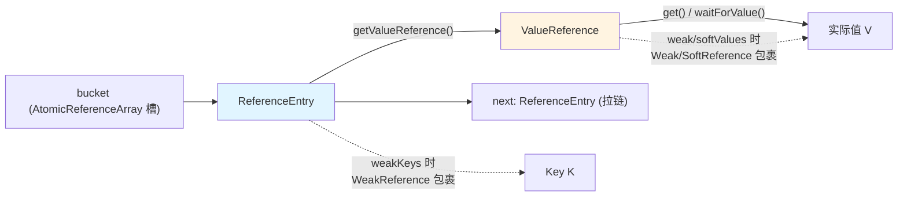

**为何分两层？**
- `ReferenceEntry` 持有桶链表结构、hash、key，以及访问/写时间戳和队列指针。
- `ValueReference` 独立包裹值，便于：① 对值用软/弱引用而不影响条目结构；② 支持"加载中"占位（`LoadingValueReference`，内部含 `SettableFuture`）。

### 4.2 EntryFactory：8 种条目组合

通过位掩码按需组合，避免每个条目都带全字段（省内存）：

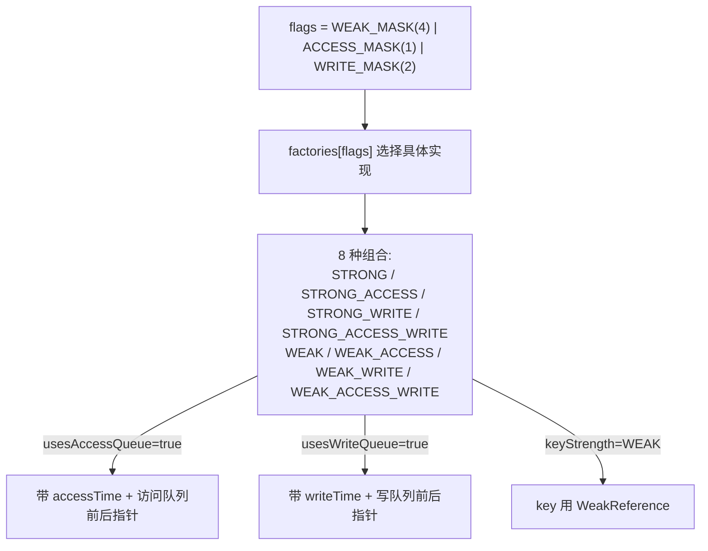

```java
// EntryFactory.getFactory
int flags = ((keyStrength == Strength.WEAK) ? WEAK_MASK : 0)
    | (usesAccessQueue ? ACCESS_MASK : 0)
    | (usesWriteQueue ? WRITE_MASK : 0);
return factories[flags];
```

**判定规则**：
- `usesAccessQueue = expiresAfterAccess() || evictsBySize()` —— 访问后过期**或**容量淘汰都需要访问顺序。
- `usesWriteQueue = expiresAfterWrite()` —— 写后过期需要写顺序。

### 4.3 Strength 枚举：值引用强度

| Strength | 场景 | ValueReference 实现 | 默认 Equivalence |
|----------|------|---------------------|------------------|
| STRONG | 默认 | StrongValueReference | `equals` |
| SOFT | `softValues()` | SoftValueReference（注册到 valueReferenceQueue） | `identity` |
| WEAK | `weakValues()` | WeakValueReference（注册到 valueReferenceQueue） | `identity` |

> **注意**：弱值时用 `identity` 等价比较而非 `equals`——因为软/弱引用的值可能被回收，按对象身份比较更安全。`weakKeys` 类似（key 弱引用 + identity 等价）。

### 4.4 ValueReference 的关键方法

```java
interface ValueReference<K, V> {
  V get();                              // 非阻塞取值(可能为 null=已回收)
  V waitForValue() throws ExecutionException;  // 阻塞等待(用于 LoadingValueReference)
  int getWeight();
  ReferenceEntry<K, V> getEntry();
  ValueReference<K, V> copyFor(ReferenceQueue<V> q, V value, ReferenceEntry<K,V> entry);  // 扩容时复制
  void notifyNewValue(V newValue);     // 通知正在加载的引用:值已被手动写入
  boolean isLoading();                  // 是否加载中
  boolean isActive();                   // 是否持有有效值(含待清理的 dead)
}
```

特殊实例：
- `UNSET`：占位符，表示值尚未设置（刚创建的条目）。
- `LoadingValueReference`：加载占位，内部 `SettableFuture<V>` 让其他线程阻塞等待。
- `ComputingValueReference`：用于 `compute`（`Cache.asMap().compute`），继承自 LoadingValueReference。

---

## 五、getIfPresent 读流程

`getIfPresent` 是不触发加载的纯读。

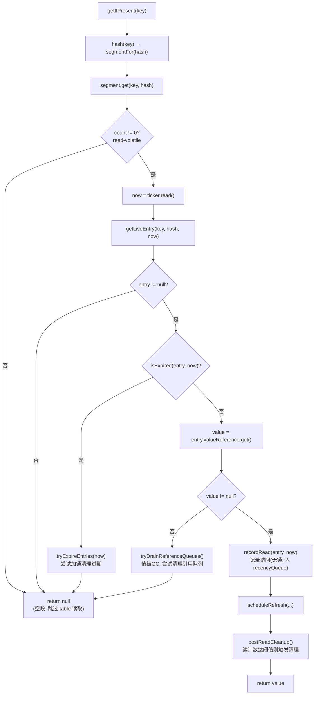

```java
// LocalCache
public V getIfPresent(Object key) {
  int hash = hash(checkNotNull(key));
  V value = segmentFor(hash).get(key, hash);   // 不带 loader
  if (value == null) globalStatsCounter.recordMisses(1);
  else globalStatsCounter.recordHits(1);
  return value;
}

// Segment.get (无 loader 版)
V get(Object key, int hash) {
  if (count != 0) {                          // read-volatile
    long now = map.ticker.read();
    ReferenceEntry<K,V> e = getLiveEntry(key, hash, now);  // 内含过期检查
    if (e == null) return null;
    V value = e.getValueReference().get();
    if (value != null) {
      recordRead(e, now);
      return scheduleRefresh(e, e.getKey(), hash, value, now, map.defaultLoader);
    }
    tryDrainReferenceQueues();               // 值被回收, 尝试清理
  }
  return null;
} finally { postReadCleanup(); }
```

**要点**：
- `getLiveEntry` / `getLiveValue` 内部检测过期或 GC 回收，返回 null 时触发 `tryExpireEntries` / `tryDrainReferenceQueues`（都是 `tryLock`，**非阻塞**，抢不到锁就放弃，下次再清）。
- `recordRead` 只做两件无锁事：更新 accessTime + 把 entry 丢进 `recencyQueue`（详见[第十二节](#十二读批处理recencyqueue-优化)）。

---

## 六、get(K) 加载流程（核心）

`LoadingCache.get(key)` 是最复杂、也是 Guava Cache 最有价值的方法：命中直接返回，未命中则**只由一个线程加载**，其余线程等待结果。

### 6.1 总体流程图

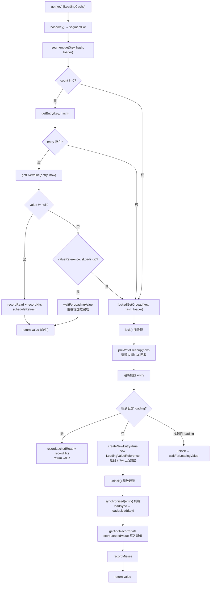

### 6.2 快路径：命中直接返回

```java
// Segment.get(key, hash, loader)
if (count != 0) {                                  // read-volatile
  ReferenceEntry<K,V> e = getEntry(key, hash);    // 不忽略 loading 值
  if (e != null) {
    long now = map.ticker.read();
    V value = getLiveValue(e, now);
    if (value != null) {
      recordRead(e, now);
      statsCounter.recordHits(1);
      return scheduleRefresh(e, key, hash, value, now, loader);  // 可能异步刷新
    }
    ValueReference<K,V> valueReference = e.getValueReference();
    if (valueReference.isLoading()) {
      return waitForLoadingValue(e, key, valueReference);       // 别的线程在加载, 等它
    }
  }
}
// 未命中/过期 → 慢路径
return lockedGetOrLoad(key, hash, loader);
```

### 6.3 慢路径：lockedGetOrLoad

```java
V lockedGetOrLoad(K key, int hash, CacheLoader<? super K, V> loader) {
  // ... 在段锁内
  lock();
  try {
    long now = map.ticker.read();
    preWriteCleanup(now);                          // 清理过期 + GC
    // 遍历桶, 找到 entry
    for (e = first; e != null; e = e.getNext()) {
      if (匹配 key) {
        valueReference = e.getValueReference();
        if (valueReference.isLoading()) {
          createNewEntry = false;                  // 别人在加载, 稍后等待
        } else {
          V value = valueReference.get();
          if (value == null)        → 通知 COLLECTED
          else if (isExpired)       → 通知 EXPIRED
          else { recordLockedRead(e, now); return value; }  // 加载中并发命中
          // 复用无效条目: 从队列移除, count--
        }
        break;
      }
    }
    if (createNewEntry) {
      loadingValueReference = new LoadingValueReference<>();  // 占位!
      if (e == null) { e = newEntry(...); table.set(index, e); }
      e.setValueReference(loadingValueReference);            // 挂占位
    }
  } finally { unlock(); postWriteCleanup(); }

  if (createNewEntry) {
    synchronized (e) {                             // 防 load 递归
      return loadSync(key, hash, loadingValueReference, loader);  // 真正调 loader.load
    }
  } else {
    return waitForLoadingValue(e, key, valueReference);  // 等别人加载
  }
}
```

### 6.4 加载与写入：loadSync → getAndRecordStats → storeLoadedValue

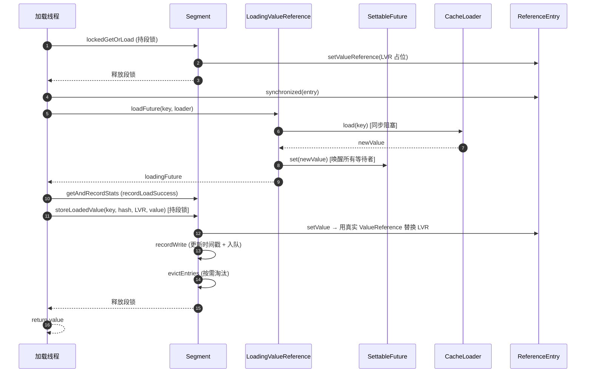

**storeLoadedValue 的关键判定**：加载完成时若发现 entry 的 `valueReference` 已被其他写操作篡改（`oldValueReference != valueReference`），则**不写入**（说明期间有 `put`/`invalidate`），仅发一个 `REPLACED` 通知——避免覆盖更新的值。

---

## 七、单飞机制：并发加载去重

当多个线程同时 `get` 同一个未命中 key 时，Guava 保证**只有一个线程真正执行 `loader.load`**，其余线程阻塞等待其结果。这是通过 `LoadingValueReference` 占位实现的。

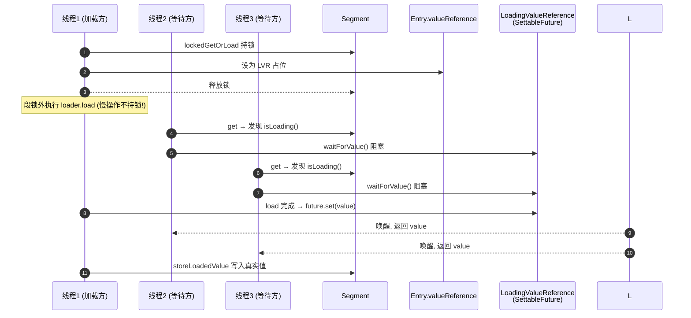

### 7.1 设计精髓：加载在锁外

```java
// 锁内只做"占位"
e.setValueReference(loadingValueReference);
unlock();  // 释放段锁!
// 锁外执行真正的 load (可能是远程调用, 耗时长)
synchronized (e) {
  return loadSync(key, hash, loadingValueReference, loader);
}
```

**关键点**：
1. 段锁**仅在占位时短暂持有**，真正的 `loader.load`（可能很慢的 I/O）在锁外执行，**不阻塞同段其他 key 的读写**。
2. `synchronized(e)` 是为了**递归加载快速失败**——若 `loader.load` 内部又调 `cache.get(同 key)`，`Thread.holdsLock(e)` 会检测到死锁并抛异常。
3. 等待方通过 `valueReference.isLoading()` 判断是否有人在加载，是则 `waitForValue()` 阻塞在 `SettableFuture` 上。

### 7.2 waitForValue：等待方逻辑

```java
V waitForLoadingValue(ReferenceEntry<K,V> e, K key, ValueReference<K,V> valueReference) {
  checkState(!Thread.holdsLock(e), "Recursive load of: %s", key);  // 防递归
  V value = valueReference.waitForValue();      // 阻塞在 future
  if (value == null) throw new InvalidCacheLoadException(...);
  long now = map.ticker.read();
  recordRead(e, now);                           // 等到值也算一次访问
  return value;
}
```

`waitForValue` → `getUninterruptibly(futureValue)`：**不可中断**地等待 future 完成。即等待方即便被 interrupt 也会等到底（这与 `RateLimiter` 的不可中断睡眠类似哲学）。

---

## 八、异步刷新 refreshAfterWrite

`refreshAfterWrite` 与 `expireAfterWrite` 不同：过期会**阻塞**取值线程重新加载；刷新是**异步**的，立即返回旧值，后台加载新值。

### 8.1 触发点：scheduleRefresh

```java
V scheduleRefresh(ReferenceEntry<K,V> entry, K key, int hash, V oldValue, long now, loader) {
  if (map.refreshes()
      && (now - entry.getWriteTime() > map.refreshNanos)   // 超过刷新周期
      && !entry.getValueReference().isLoading()) {          // 且未在加载
    V newValue = refresh(key, hash, loader, true);
    if (newValue != null) return newValue;                  // 同步完成的刷新直接返回新值
  }
  return oldValue;                                           // 否则返回旧值
}
```

### 8.2 refresh：异步单飞

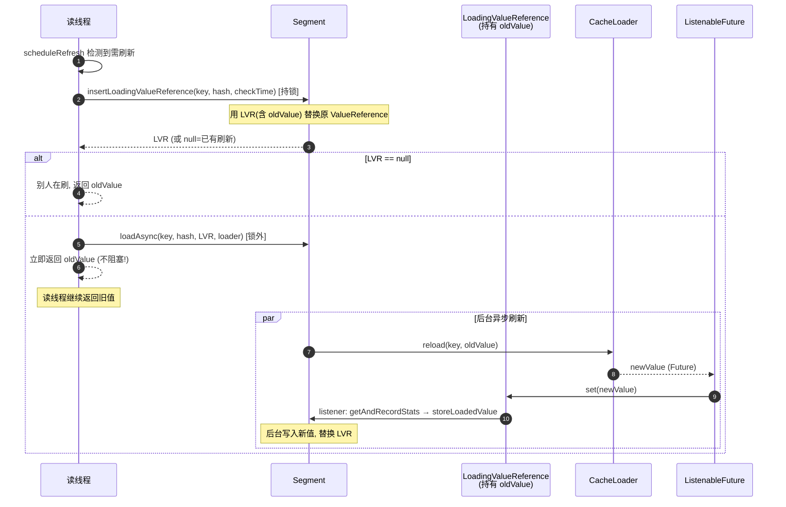

### 8.3 loadFuture 的 load vs reload 分支

```java
public ListenableFuture<V> loadFuture(K key, CacheLoader<? super K, V> loader) {
  stopwatch.start();
  V previousValue = oldValue.get();
  if (previousValue == null) {                    // 首次加载
    V newValue = loader.load(key);                 // 同步
    return set(newValue) ? futureValue : immediateFuture(newValue);
  }
  ListenableFuture<V> newValue = loader.reload(key, previousValue);   // 刷新
  if (newValue == null) return immediateFuture(null);
  return transform(newValue, newResult -> { this.set(newResult); return newResult; }, directExecutor());
}
```

**关键区别**：
- **首次加载**（`load`）：同步阻塞，返回值即结果。
- **刷新**（`reload`）：应返回 `ListenableFuture`，**异步**。`CacheLoader.reload` 默认实现是 `immediateFuture(load(key))`——即默认仍是同步的！要真正异步，**必须重写 `reload`**，或用 `CacheLoader.asyncReloading(loader, executor)` 包装。

### 8.4 刷新 vs 过期对比

| 维度 | expireAfterWrite | refreshAfterWrite |
|------|------------------|-------------------|
| 触发后行为 | **阻塞**取值线程，同步重新 `load` | **不阻塞**，返回旧值，后台异步 `reload` |
| 失败影响 | 抛异常给调用方 | 异常被**记录并吞掉**，保留旧值 |
| 旧值是否可用 | 不可用（已移除） | 一直可用，直到刷新成功 |
| 适用场景 | 数据必须及时，容忍阻塞 | 容忍短暂陈旧，要高可用 |
| 典型用例 | 配置缓存 | 计数器、排行榜、热点数据 |

> **注意**：`refreshAfterWrite` 通常配合 `CacheLoader.reload` 的异步实现使用，否则退化为同步刷新（但仍在加载线程异步执行，不阻塞**其他** key 的读）。

---

## 九、put 写流程

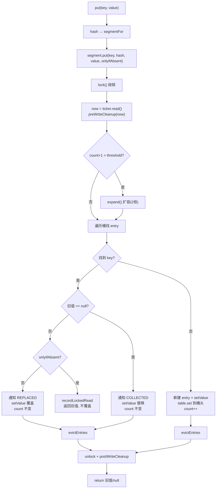

### 9.1 关键细节

```java
V put(K key, int hash, V value, boolean onlyIfAbsent) {
  lock();
  try {
    long now = map.ticker.read();
    preWriteCleanup(now);                          // 写前必清理
    int newCount = this.count + 1;
    if (newCount > this.threshold) expand();      // 扩容
    // 遍历查找
    for (e = first; e != null; e = e.getNext()) {
      if (匹配 key) {
        V entryValue = valueReference.get();
        if (entryValue == null) {                 // 值被 GC
          enqueueNotification(..., RemovalCause.COLLECTED);
          setValue(e, key, value, now);
        } else if (onlyIfAbsent) {                // putIfAbsent 语义
          recordLockedRead(e, now);
          return entryValue;                      // 不覆盖
        } else {                                  // 覆盖
          enqueueNotification(..., RemovalCause.REPLACED);
          setValue(e, key, value, now);
        }
        evictEntries(e);
        return ...;
      }
    }
    // 新建
    ReferenceEntry<K,V> newEntry = newEntry(key, hash, first);
    setValue(newEntry, key, value, now);
    table.set(index, newEntry);                   // 加到桶头
    this.count = newCount;                         // write-volatile
    evictEntries(newEntry);
    return null;
  } finally { unlock(); postWriteCleanup(); }
}
```

### 9.2 setValue：写入并维护元数据

```java
@GuardedBy("this")
void setValue(ReferenceEntry<K,V> entry, K key, V value, long now) {
  ValueReference<K,V> previous = entry.getValueReference();
  int weight = map.weigher.weigh(key, value);
  checkState(weight >= 0, "Weights must be non-negative");
  ValueReference<K,V> valueReference = map.valueStrength.referenceValue(this, entry, value, weight);
  entry.setValueReference(valueReference);
  recordWrite(entry, weight, now);               // 更新时间戳 + 入队
  previous.notifyNewValue(value);                // 通知旧引用(可能是加载中)
}
```

`previous.notifyNewValue(value)` 很巧妙：如果旧值引用是个 `LoadingValueReference`（正在加载），这里会把它 `set(value)`，**唤醒所有正在等待加载的线程**并返回这个新写入的值——即"手动 put 抢占了正在进行的加载"。

### 9.3 扩容 expand（2 倍）

```java
void expand() {
  // oldCapacity << 1 (2 倍)
  // 二的幂扩容: 每个桶的元素要么留原位, 要么移到 原位+oldCapacity
  // 优化: 复用尾部连续同目标桶的节点链, 只 clone 变化点
}
```

采用**二的幂扩容**，每个桶的元素要么留在原索引，要么移到 `原索引 + oldCapacity`。通过识别"连续同目标桶的尾链"直接复用、只克隆变化的节点，默认阈值下仅约 1/6 节点需克隆。旧节点留给可能正在遍历的读线程，随后 GC 回收。

---

## 十、淘汰机制：分段 LRU

### 10.1 算法选择

源码注释明确选择 LRU：

```
The Least Recently Used page replacement algorithm was chosen due to its simplicity,
high hit rate, and ability to be implemented with O(1) time complexity. The initial
LRU implementation operates per-segment rather than globally...
```

**O(1) LRU** 靠双向链表 + 哈希表实现：访问/写入把节点移到链表尾（`O(1)`），淘汰取链表头（`O(1)`）。Guava 用 `AccessQueue`（基于 `ReferenceEntry` 内嵌的前后指针）实现。

### 10.2 分段而非全局

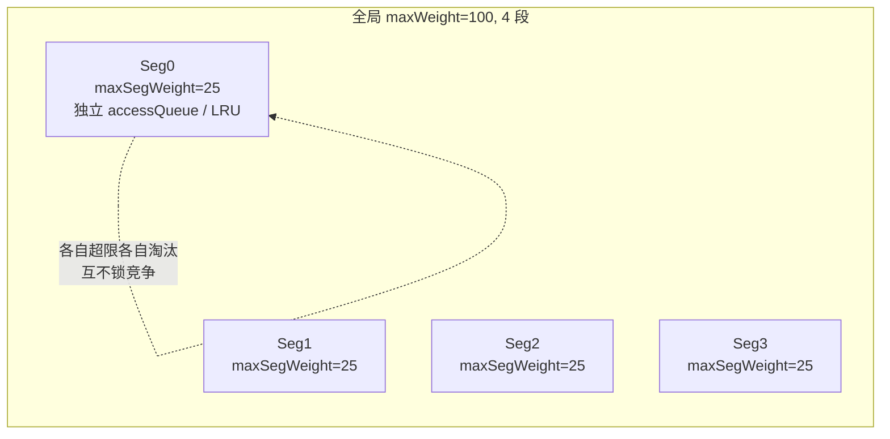

**权衡**：分段 LRU 牺牲一点命中率（某段满了就淘汰，即使别的段还空），换取**无全局锁**的高并发。源码预期命中率与全局 LRU 相近。

### 10.3 evictEntries 流程

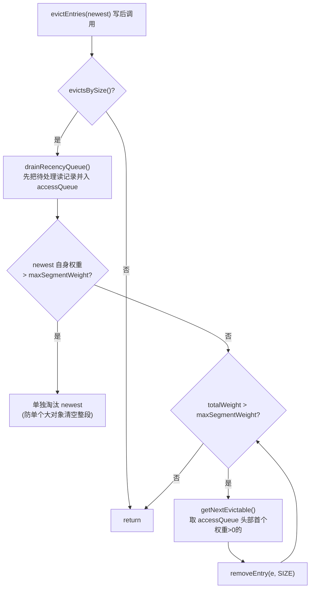

```java
@GuardedBy("this")
void evictEntries(ReferenceEntry<K,V> newest) {
  if (!map.evictsBySize()) return;
  drainRecencyQueue();
  // 单个大对象保护
  if (newest.getValueReference().getWeight() > maxSegmentWeight) {
    removeEntry(newest, newest.getHash(), RemovalCause.SIZE);
  }
  while (totalWeight > maxSegmentWeight) {
    ReferenceEntry<K,V> e = getNextEvictable();   // LRU 头
    removeEntry(e, e.getHash(), RemovalCause.SIZE);
  }
}

ReferenceEntry<K,V> getNextEvictable() {
  for (ReferenceEntry<K,V> e : accessQueue) {     // 从头(LRU)找
    if (e.getValueReference().getWeight() > 0) return e;   // 跳过权重0的
  }
  throw new AssertionError();
}
```

**注意 `getNextEvictable` 跳过 `weight == 0` 的条目**：权重 0 的条目不占容量，永不被淘汰（自定义 Weigher 可返回 0 实现"钉住"某些条目）。

### 10.4 权重记账

`totalWeight` 在 `recordWrite` 时 `+= weight`，在 `enqueueNotification`（移除前）时 `-= weight`，保证段权重实时准确。`maximumWeight` 默认用 `OneWeigher`（每个条目权重 1）。

---

## 十一、过期机制：时间驱动清理

### 11.1 两种过期 + 两个队列

| 过期类型 | 字段 | 维护队列 | 判定 |
|----------|------|----------|------|
| 写后过期 | `expireAfterWriteNanos` | `writeQueue`（按写时间升序） | `now - writeTime >= expireAfterWriteNanos` |
| 访问后过期 | `expireAfterAccessNanos` | `accessQueue`（按访问时间升序） | `now - accessTime >= expireAfterAccessNanos` |

```java
boolean isExpired(ReferenceEntry<K,V> entry, long now) {
  if (expiresAfterAccess() && (now - entry.getAccessTime() >= expireAfterAccessNanos)) return true;
  if (expiresAfterWrite()   && (now - entry.getWriteTime()   >= expireAfterWriteNanos)) return true;
  return false;
}
```

### 11.2 队列的有序性保证（关键优化）

`writeQueue` / `accessQueue` 是**按时间升序**的自定义队列。`expireEntries` 只需从**头部** peek，因为：

> 队列头部是最旧的，若头部都没过期，后面的更不可能过期（时间更晚）。

```java
@GuardedBy("this")
void expireEntries(long now) {
  drainRecencyQueue();
  ReferenceEntry<K,V> e;
  while ((e = writeQueue.peek()) != null && map.isExpired(e, now)) {
    removeEntry(e, e.getHash(), RemovalCause.EXPIRED);
  }
  while ((e = accessQueue.peek()) != null && map.isExpired(e, now)) {
    removeEntry(e, e.getHash(), RemovalCause.EXPIRED);
  }
}
```

### 11.3 惰性过期：无后台线程

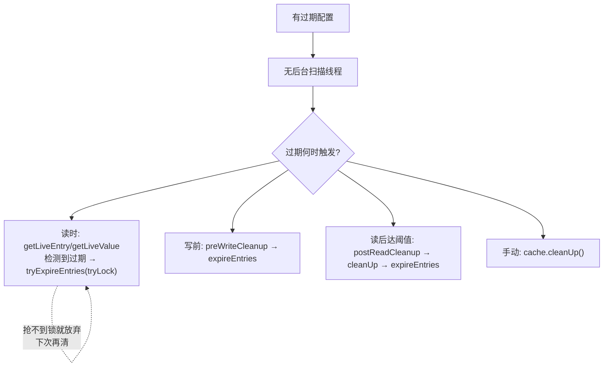

**惰性清理**：过期条目不会被定时移除，而是在**下次访问/写入/清理触发**时才被回收。这意味着：
- 过期条目在过期后仍占内存，直到被触碰或清理。
- `getIfPresent` 对过期 key 返回 null（视为 miss），但**不会立即移除**——只是触发 `tryExpireEntries` 尝试清理。

### 11.4 自定义队列实现

`WriteQueue` / `AccessQueue` 继承 `AbstractQueue`，用 `ReferenceEntry` 内嵌的 `previousInXxxQueue` / `nextInXxxQueue` 指针组成双向链表，**head 节点的 writeTime = Long.MAX_VALUE** 作为哨兵。好处：
1. `copyEntry` 时可在队列中间替换节点（扩容复用）。
2. `contains` 高度优化。

---

## 十二、读批处理：recencyQueue 优化

### 12.1 问题：读若直接维护 LRU 链表，需加锁

LRU 要求每次访问把节点移到队尾（`accessQueue.add`），这是结构性写操作，需持段锁。但读远多于写，每次读都加锁会严重拖慢吞吐。

### 12.2 方案：recencyQueue 缓冲 + 批量回放

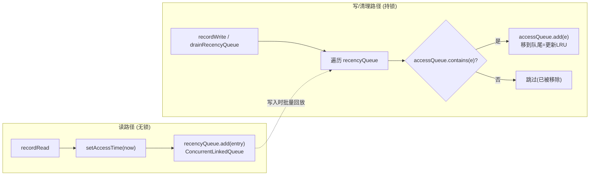

```java
void recordRead(ReferenceEntry<K,V> entry, long now) {
  if (map.recordsAccess()) entry.setAccessTime(now);   // 无锁更新时间戳
  recencyQueue.add(entry);                              // 无锁入临时队列
}

@GuardedBy("this")
void drainRecencyQueue() {
  ReferenceEntry<K,V> e;
  while ((e = recencyQueue.poll()) != null) {
    if (accessQueue.contains(e)) {                      // 还在缓存里?
      accessQueue.add(e);                               // 才更新 LRU 顺序
    }
    // 不在则跳过(已被移除)
  }
}
```

### 12.3 触发回放的时机

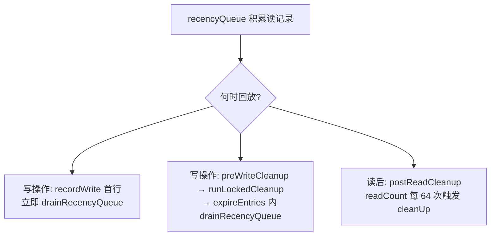

`drainRecencyQueue` 在三个地方被调用：`recordWrite`、`expireEntries`、`evictEntries`——**都在持锁状态**。

### 12.4 读触发清理的频率控制

```java
void postReadCleanup() {
  if ((readCount.incrementAndGet() & DRAIN_THRESHOLD) == 0) {   // DRAIN_THRESHOLD = 0x3F = 63
    cleanUp();
  }
}
```

`readCount` 是 `AtomicInteger`，每读一次自增。`& 0x3F == 0` 即**每 64 次读**触发一次 `cleanUp`（`tryLock` 抢锁清理）。这把清理成本均摊到约 1/64 的读上，避免每次读都清理。

`DRAIN_THRESHOLD = 0x3F` 必须是 `2^n - 1`（用作掩码）。`runLockedCleanup` 内会 `readCount.set(0)` 重置。

---

## 十三、清理总协调：读写触发的统一清理

所有"维护性"操作（过期清理、GC 回收、LRU 回放、监听派发）通过一套统一的清理框架调度。

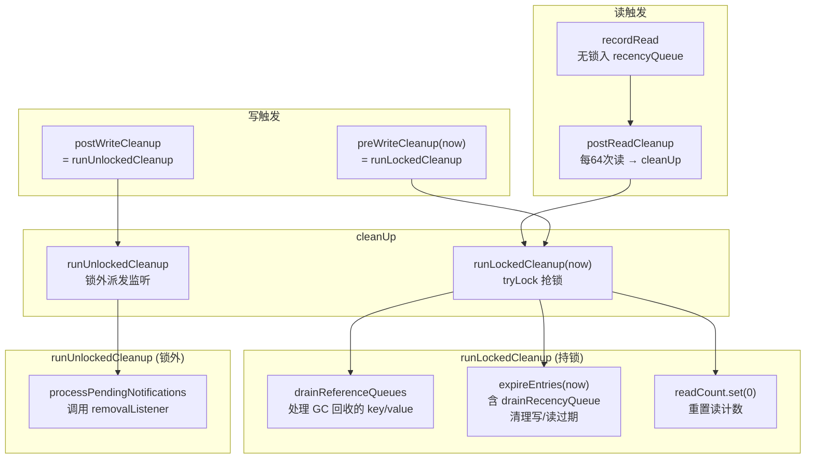

### 13.1 四个清理入口

| 方法 | 何时调用 | 锁? | 做什么 |
|------|----------|-----|--------|
| `preWriteCleanup` | 每次写获锁后首行 | 持锁 | `runLockedCleanup` |
| `postWriteCleanup` | 每次写释放锁后 | 无锁 | `runUnlockedCleanup`（派发监听） |
| `postReadCleanup` | 每次读末尾 | 无锁→tryLock | 每 64 次读触发 `cleanUp` |
| `cleanUp()` | 手动 / 读触发 | tryLock | `runLockedCleanup` + `runUnlockedCleanup` |

### 13.2 runLockedCleanup：tryLock 非阻塞

```java
void runLockedCleanup(long now) {
  if (tryLock()) {                       // 非阻塞! 抢不到就放弃
    try {
      drainReferenceQueues();            // GC 回收的 key/value
      expireEntries(now);                // 过期清理(含 drainRecencyQueue)
      readCount.set(0);                  // 重置读计数
    } finally { unlock(); }
  }
}

void runUnlockedCleanup() {
  if (!isHeldByCurrentThread()) {        // 确保不在锁内
    map.processPendingNotifications();  // 锁外派发监听(避免监听器阻塞缓存)
  }
}
```

**关键设计**：
- `tryLock()` 不阻塞——读线程绝不为清理而等待，抢不到锁就下次再清。
- 监听派发在**锁外**：`removalListener` 可能很慢/出错，绝不能持锁调用，否则拖垮整个段。`processPendingNotifications` 还会 `try-catch` 吞掉监听器异常（仅记日志）。

---

## 十四、GC 回收与移除监听

### 14.1 弱/软引用的 GC 清理

当配置 `weakKeys` / `weakValues` / `softValues` 时，key/value 被 `WeakReference` / `SoftReference` 包裹，并注册到 `ReferenceQueue`。GC 回收后，引用进入队列，缓存需感知并清理。

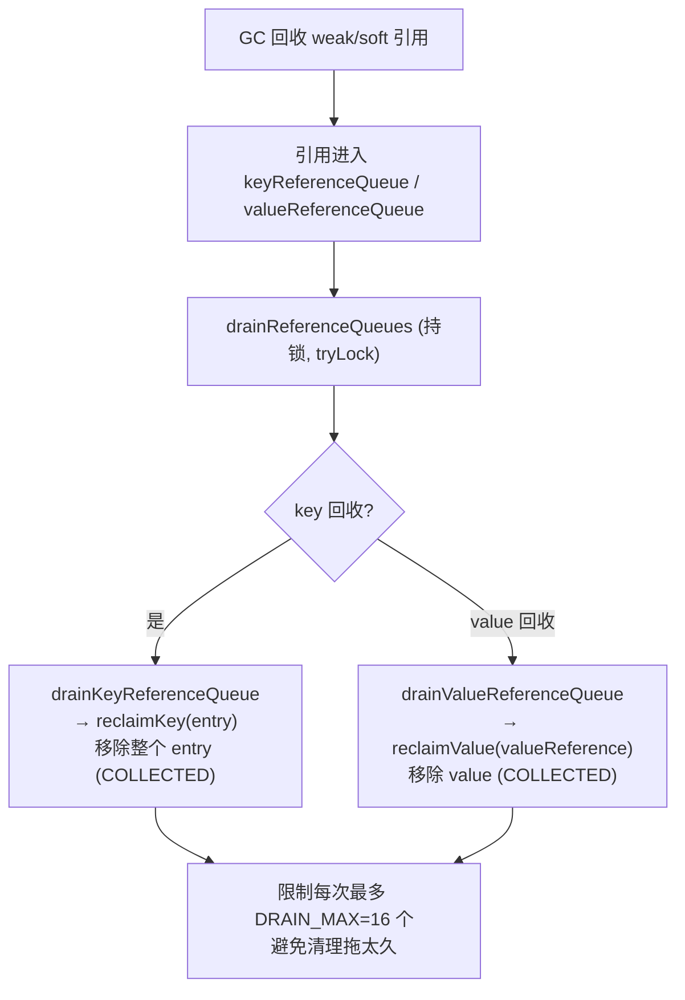

```java
@GuardedBy("this")
void drainKeyReferenceQueue() {
  Reference<? extends K> ref;
  int i = 0;
  while ((ref = keyReferenceQueue.poll()) != null) {
    ReferenceEntry<K,V> entry = (ReferenceEntry<K,V>) ref;
    map.reclaimKey(entry);                    // 移除条目
    if (++i == DRAIN_MAX) break;              // 每次最多 16 个
  }
}
```

**`DRAIN_MAX = 16`**：每次清理最多处理 16 个回收引用，避免一次清理耗时过长影响吞吐，剩余的下次再清。

### 14.2 移除监听派发管道

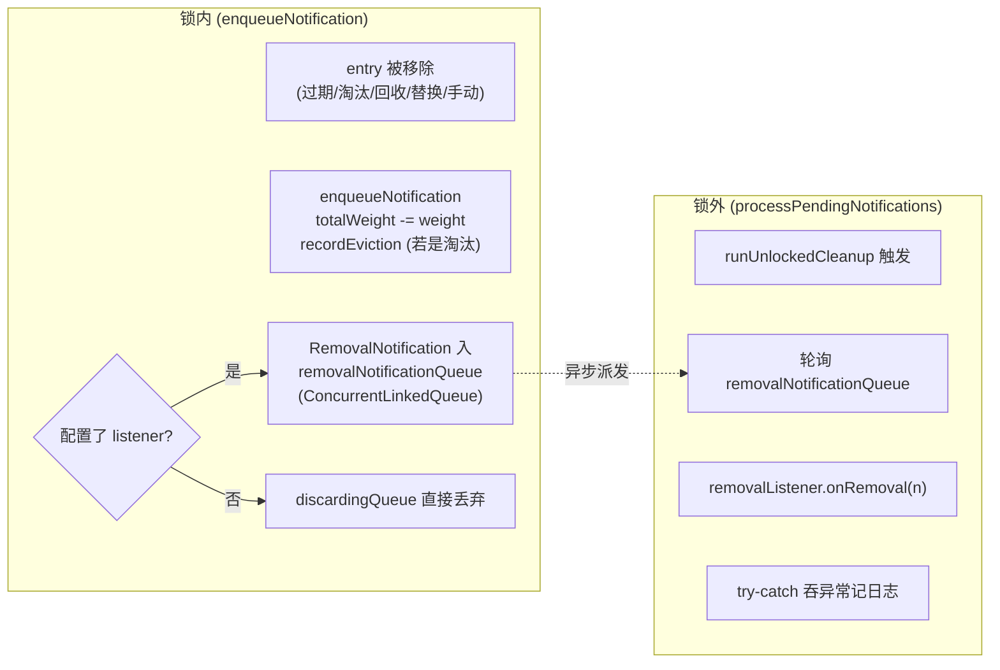

```java
@GuardedBy("this")
void enqueueNotification(K key, int hash, V value, int weight, RemovalCause cause) {
  totalWeight -= weight;
  if (cause.wasEvicted()) statsCounter.recordEviction();   // 自动淘汰才算 eviction 统计
  if (map.removalNotificationQueue != DISCARDING_QUEUE) {
    RemovalNotification<K,V> notification = RemovalNotification.create(key, value, cause);
    map.removalNotificationQueue.offer(notification);      // 入队(锁内, 仅入队不回调)
  }
}

void processPendingNotifications() {
  RemovalNotification<K,V> notification;
  while ((notification = removalNotificationQueue.poll()) != null) {
    try { removalListener.onRemoval(notification); }       // 锁外回调
    catch (Throwable e) { logger.log(Level.WARNING, "Exception thrown by removal listener", e); }
  }
}
```

### 14.3 RemovalCause 五种原因

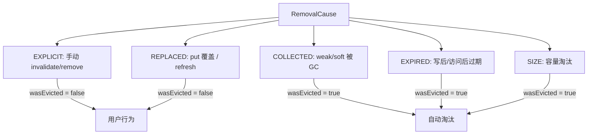

`wasEvicted()` 区分"用户主动移除"与"缓存自动淘汰"——后者才计入 `CacheStats.evictionCount()`。这影响统计语义：手动 `invalidate` 不算淘汰。

---

## 十五、统计信息

### 15.1 分段计数 + 聚合

```mermaid
graph LR
    S0["Segment0.statsCounter<br/>(SimpleStatsCounter)"] --> AGG["stats() 聚合"]
    S1["Segment1.statsCounter"] --> AGG
    Sn["SegmentN.statsCounter"] --> AGG
    G["globalStatsCounter<br/>(getIfPresent/misses)"] --> AGG
    AGG --> CS["CacheStats 快照"]
```

`SimpleStatsCounter` 内部用 `LongAddable`（基于 `LongAdder` 的 striping 计数，减少 CAS 竞争）记录：
- `hitCount` / `missCount`
- `loadSuccessCount` / `loadExceptionCount`
- `totalLoadTime`
- `evictionCount`

```java
public CacheStats stats() {
  SimpleStatsCounter aggregator = new SimpleStatsCounter();
  aggregator.incrementBy(localCache.globalStatsCounter);    // 全局(getIfPresent 的命中/未命中)
  for (Segment<K,V> segment : localCache.segments) {
    aggregator.incrementBy(segment.statsCounter);            // 各段(load 相关)
  }
  return aggregator.snapshot();
}
```

### 15.2 统计归属

| 操作 | 计在哪 | 何时 |
|------|--------|------|
| `getIfPresent` 命中 | `globalStatsCounter.recordHits` | LocalCache 层 |
| `getIfPresent` 未命中 | `globalStatsCounter.recordMisses` | LocalCache 层 |
| `LoadingCache.get` 命中 | `segment.statsCounter.recordHits` | Segment 层 |
| `LoadingCache.get` 未命中 | `segment.statsCounter.recordMisses` | lockedGetOrLoad 后 |
| 加载成功 | `segment.statsCounter.recordLoadSuccess(耗时)` | getAndRecordStats |
| 加载异常 | `segment.statsCounter.recordLoadException(耗时)` | getAndRecordStats finally |
| 淘汰 | `segment.statsCounter.recordEviction` | enqueueNotification (wasEvicted) |

> **注意**：`globalStatsCounter` 只记 `getIfPresent` 的命中/未命中；`LoadingCache.get` 的统计记在 `segment.statsCounter`。这是因为 `getIfPresent` 不进段内统计路径。

---

## 十六、关键设计洞察

### 16.1 非阻塞读的可见性保证

读不加锁，但通过 `volatile count` 提供 happens-before：写线程在解锁前写 `count`（`// write-volatile`），读线程先读 `count`（`// read-volatile`），从而看见 `table` 的最新结构。这是从 `ConcurrentHashMap` 继承的经典无锁读技术。

### 16.2 加载在锁外（单飞不持锁）

`loader.load`（可能很慢）在**段锁外**执行。段锁只用于"原子地插入 LoadingValueReference 占位"。这保证一个慢加载**不会阻塞**同段其他 key 的读写——只有同 key 的并发请求会等待。

### 16.3 三级"过期/回收/监听"分离

| 关注点 | 数据结构 | 何时处理 | 锁? |
|--------|----------|----------|-----|
| 时间过期 | writeQueue/accessQueue | runLockedCleanup | tryLock |
| GC 回收 | key/valueReferenceQueue | drainReferenceQueues | tryLock |
| LRU 顺序 | accessQueue + recencyQueue | drainRecencyQueue | 持锁 |
| 监听派发 | removalNotificationQueue | processPendingNotifications | **锁外** |

监听派发刻意放在锁外，使慢监听器不拖累缓存主路径。

### 16.4 全程 tryLock 的"尽力而为"

过期/GC 清理、读触发清理都 `tryLock`，**抢不到就放弃**。这避免读/清理线程因争锁而阻塞，保证读路径的低延迟。代价是：过期条目可能短暂残留，但最终一致（下次触碰或清理会回收）。

### 16.5 Copy-on-Write 式的结构修改

写操作不原地修改节点，而是**克隆新节点替换**（`copyEntry`）。`next` 指针 `final` 不可变。这让正在遍历的读线程看到的是旧快照，结构一致性自洽，无需读锁。

### 16.6 内存优化：按需组合 Entry 字段

8 种 `EntryFactory` 让不需要访问/写时间的缓存（如纯 `maximumSize` 无过期）不存储时间戳字段，省内存。值引用同理：`weight==1` 时用 `StrongValueReference`（不存 weight），否则用 `WeightedStrongValueReference`。

---

## 十七、总结

### 17.1 架构总览图

```mermaid
graph TB
    subgraph "对外接口层"
        API1["Cache / LoadingCache"]
        API2["LocalManualCache / LocalLoadingCache 薄包装"]
    end

    subgraph "核心并发层 (LocalCache)"
        SEG["Segment[] 分段<br/>volatile count 内存屏障"]
        ROUTE["segmentFor: hash 高位选段"]
    end

    subgraph "Segment 内部 (extends ReentrantLock)"
        TBL["AtomicReferenceArray table 拉链"]
        LOCK["ReentrantLock 段锁"]
        SUB["读写 / 加载 / 淘汰 / 过期 / 清理"]
    end

    subgraph "数据结构层"
        ENTRY["ReferenceEntry (8 种组合)<br/>access/write 时间 + 队列指针"]
        VR["ValueReference (Strong/Soft/Weak/Loading)"]
        AQ["accessQueue / writeQueue (LRU+过期)"]
        RQ["recencyQueue (读批处理)"]
    end

    subgraph "清理与监听"
        CLN["runLockedCleanup: tryLock 清理"]
        NOTIF["runUnlockedCleanup: 锁外监听"]
        GCQ["key/valueReferenceQueue: GC 回收"]
    end

    subgraph "配置与统计"
        CB["CacheBuilder 配置"]
        STAT["分段 StatsCounter + LongAdder"]
    end

    API1 --> API2
    API2 --> SEG
    CB --> SEG
    ROUTE --> SEG
    SEG --> TBL
    SEG --> LOCK
    SEG --> SUB
    SUB --> ENTRY
    ENTRY --> VR
    SUB --> AQ
    SUB --> RQ
    SUB --> CLN
    CLN --> GCQ
    CLN --> NOTIF
    SUB --> STAT
```

### 17.2 核心设计三句话

1. **分段锁 + volatile count**：`LocalCache` 继承自 `ConcurrentHashMap`，用 `Segment[]` + 段锁实现非阻塞读、跨段并发写；`volatile count` 既是计数又是内存屏障，保证无锁读的可见性。

2. **LoadingValueReference 单飞 + 锁外加载**：未命中时，段锁内只插入一个含 `SettableFuture` 的加载占位符，真正的 `loader.load` 在锁外执行。同 key 的并发请求发现 `isLoading()` 后阻塞在 future 上，实现"只加载一次"。慢加载不阻塞同段其他 key。

3. **惰性、批量、tryLock 式清理**：过期/GC/淘汰/监听无后台线程，靠读写触发；读用 `recencyQueue` 缓冲后批量回放 LRU；过期只扫有序队列头部；清理一律 `tryLock` 抢不到就放弃；监听在锁外异步派发。一切为高吞吐低延迟服务，接受最终一致。

### 17.3 性能特征与选型建议

| 特性 | 说明 |
|------|------|
| 读吞吐 | 极高（无锁，仅 volatile 读） |
| 写吞吐 | 高（仅段内锁，跨段并发） |
| 加载并发 | 单飞去重，慢加载不阻塞其他 key |
| 内存开销 | Entry 按需组合字段，相对省 |
| 一致性 | 最终一致（过期/GC 惰性清理） |
| 局限 | 单机内存；分段 LRU 非全局；过期不实时 |

**选型建议**：
- **轻量本地缓存、不需分布式** → Guava Cache 足够。
- **需要 off-heap、更高吞吐、W-TinyLFU 更优命中率、异步刷新原生支持** → 考虑 Caffeine（Guava Cache 作者的下一代作品，API 兼容）。
- **分布式** → Redis / 自建分布式层。

> **延伸**：Caffeine 正是 Guava Cache 作者 Charles Fry 与 Ben Manes 的后续作品，用 W-TinyLFU 取代分段 LRU、用 RingBuffer 取代分段锁、用 Drainer 线程统一异步清理，命中率与吞吐都显著优于 Guava Cache。理解 Guava Cache 的设计是理解 Caffeine 改进的基础。
