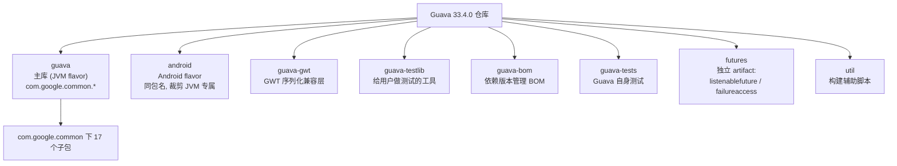
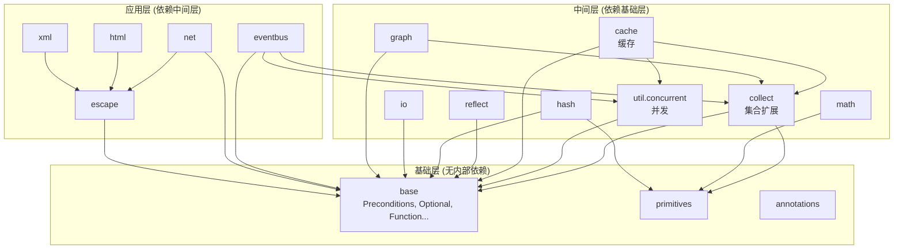
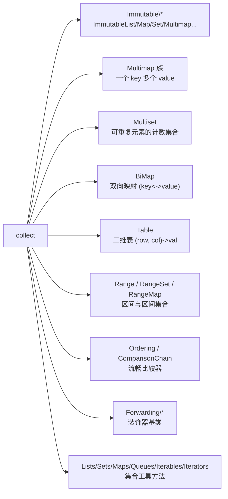
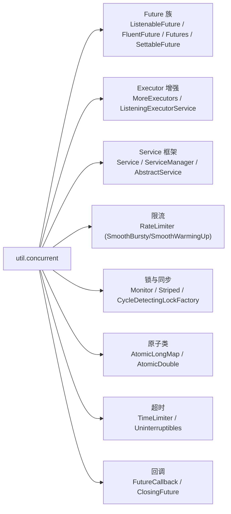
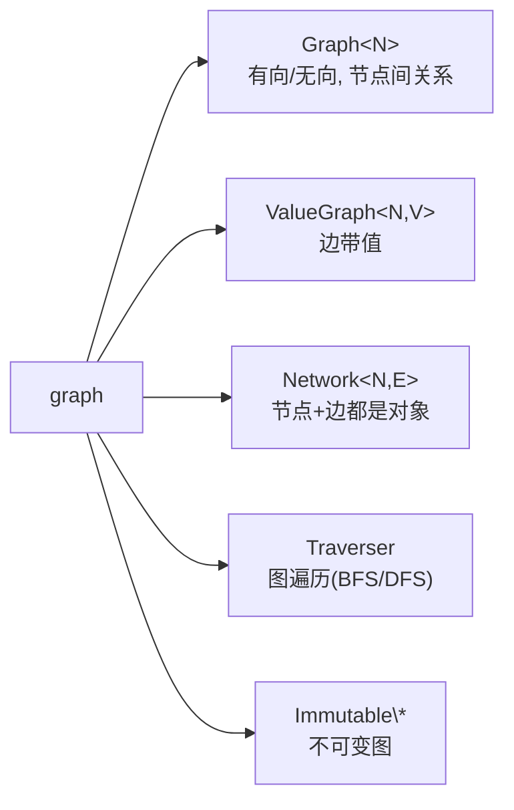
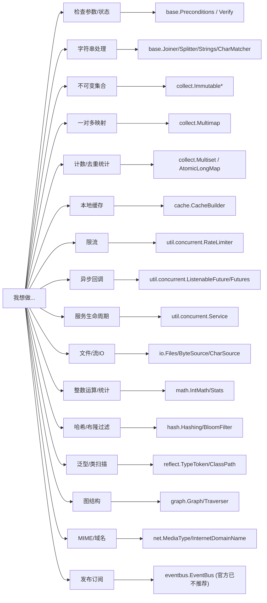
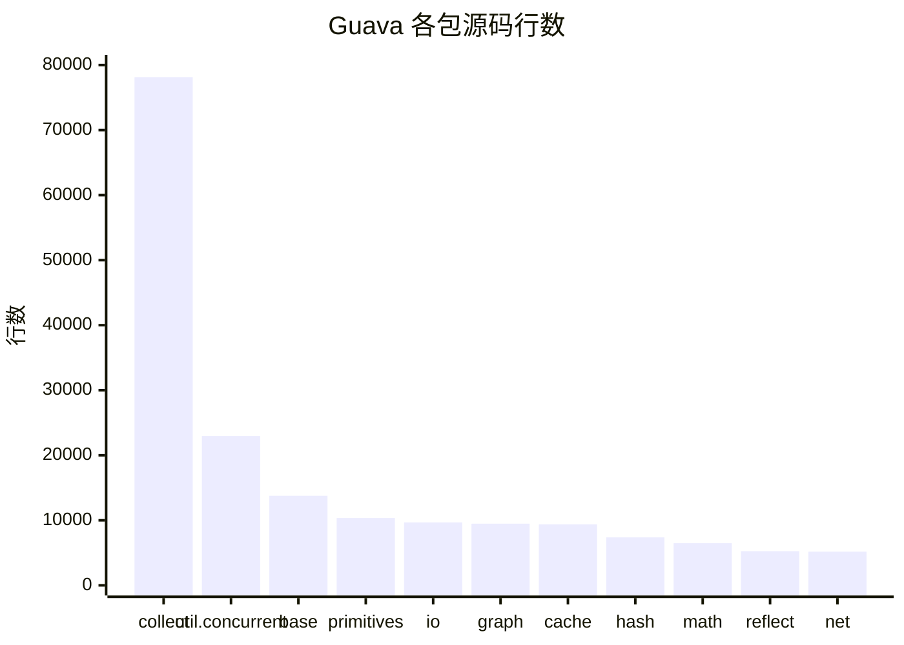

# Guava 主要模块与作用总览

> 基于 Guava 33.4.0 源码梳理
> 源码根包：`com.google.common.*`，共 17 个子包，约 1300+ 个源文件

本文整理 Guava 的整体模块划分、各包职责与核心类，帮助你建立全局认知，并在需要时快速定位。

---

## 目录

1. [一、项目与构建模块](#一项目与构建模块)
2. [二、源码包总览表](#二源码包总览表)
3. [三、模块依赖与分层关系](#三模块依赖与分层关系)
4. [四、各模块详解](#四各模块详解)
5. [五、按使用场景速查](#五按使用场景速查)
6. [六、与已分析组件的关联](#六与已分析组件的关联)

---

## 一、项目与构建模块

Guava 顶层由多个 Maven 子模块构成，源码主体在 `guava` 与 `android` 两套 flavor 中（包名相同，Android 版去掉了 JVM 专属特性）。

| 构建模块 | 作用 |
|----------|------|
| `guava` | **核心库**，标准 JVM 版本，日常 `com.google.guava:guava` 依赖的就是它 |
| `android` | Android 版，包名与 `guava` 完全一致，但去掉了 `java.awt`、NIO 专属等不适用 Android 的代码 |
| `guava-gwt` | 为 GWT（Google Web Toolkit）提供不可变集合等的序列化兼容 |
| `guava-testlib` | 提供给使用者的测试工具（如 `EquivalenceTester`、`TestSuiteBuilder`），用于测试自己的集合实现是否符合契约 |
| `guava-bom` | Bill of Materials，统一管理 Guava 各 artifact 版本 |
| `futures` | 将 `ListenableFuture` API 与 `failureaccess` 拆成**独立 artifact**，便于 JDK9+ 模块化下仅引入 future 部分 |
| `guava-tests` / `util` | Guava 自身的测试代码与构建辅助 |

> **日常开发只需依赖 `com.google.guava:guava`**（Android 用 `guava-android`）。若只想要 Future 能力，可单独依赖 `com.google.guava:listenablefuture`。

---

## 二、源码包总览表

所有源码位于 `com.google.common.*` 下，共 17 个子包，按规模（行数）排序：

| 包 | 文件数 | 行数 | 一句话作用 |
|----|--------|------|-----------|
| `collect` | 223 | 78135 | 集合框架扩展：Immutable\*、Multimap、Multiset、BiMap、Table、Range、Ordering |
| `util.concurrent` | 83 | 22950 | 并发：ListenableFuture、Service、RateLimiter、MoreExecutors、Striped、Monitor |
| `base` | 53 | 13766 | 基础工具：Preconditions、Optional、Joiner/Splitter、Strings、Function/Predicate |
| `primitives` | 27 | 10352 | 基本类型工具：Ints/Longs/Doubles、Unsigned\*、Bytes |
| `io` | 39 | 9665 | I/O：Files、ByteStreams/CharStreams、Source/Sink、BaseEncoding |
| `graph` | 54 | 9482 | 图数据结构：Graph、ValueGraph、Network、Traverser |
| `cache` | 25 | 9366 | 本地缓存：CacheBuilder、LoadingCache、LocalCache |
| `math` | 18 | 6481 | 数学：IntMath/LongMath、Stats、Quantiles、BigIntegerMath |
| `hash` | 37 | 7373 | 哈希：Hashing、BloomFilter、Funnel、Checksum |
| `reflect` | 18 | 5256 | 反射：TypeToken、ClassPath、Invokable、Parameter |
| `net` | 11 | 5175 | 网络：MediaType、InternetDomainName、UrlEscapers、HttpHeaders |
| `escape` | 12 | 1553 | 转义抽象：Escaper、Escapers、CharEscaper |
| `eventbus` | 13 | 1369 | 事件总线：EventBus、AsyncEventBus、Dispatcher |
| `xml` | 4 | 297 | XML 转义（escape 的 XML 子集） |
| `html` | 4 | 225 | HTML 转义（escape 的 HTML 子集） |
| `annotations` | 6 | 260 | 注解：Beta、VisibleForTesting、GwtCompatible 等 |

> `collect` 是绝对大头（占源码近半），其次是 `util.concurrent`。这两个包也是日常使用频率最高的。

---

## 三、模块依赖与分层关系

**观察**：
- `base` 是所有模块的地基，几乎没有内部依赖。
- `collect` 被大量模块依赖（cache、graph、eventbus 等都用集合）。
- `cache` 依赖 `base` + `collect` + `util.concurrent`（如缓存内部用 `ReentrantLock`、`ListenableFuture` 做 refresh）。
- `eventbus` 依赖 `base` + `collect`（用 Guava Cache 做反射缓存）+ `util.concurrent`。
- `escape`/`html`/`xml` 是转义族，`net` 建立在 `escape` 之上。

---

## 四、各模块详解

### 4.1 `base` — 基础工具集

整个 Guava 的地基，提供日常高频使用的小工具。

| 类 | 作用 |
|----|------|
| `Preconditions` | 前置条件检查：`checkArgument`、`checkNotNull`、`checkState`、`checkElementIndex` |
| `Optional<T>` | 可空值包装（注意：Java 8+ 推荐用 `java.util.Optional`） |
| `Objects` / `MoreObjects` | `equal`、`hashCode`、`toStringHelper` |
| `Joiner` / `Splitter` | 比 `String.split` 强大得多的字符串拼接/拆分（支持去除空项、限制、Map 拼接等） |
| `Strings` | `nullToEmpty`、`padStart`/`padEnd`、`repeat`、`commonPrefix` |
| `CharMatcher` | 字符匹配器（函数式字符过滤、保留、折叠等） |
| `CaseFormat` | 命名风格转换：`LOWER_CAMEL` ↔ `UPPER_UNDERSCORE` 等 |
| `Function`/`Predicate`/`Supplier` | 函数式接口（Java 8 前的标准，现多被 `java.util.function` 取代） |
| `Functions`/`Predicates`/`Suppliers` | 上述接口的工具与组合方法 |
| `Throwables` | 异常链处理：`getRootCause`、`getCausalChain`、`propagateIfPossible` |
| `Equivalence` | 等价关系抽象（用于自定义相等/哈希策略，缓存键值比较） |
| `Stopwatch` | 计时器，替代手写 `System.nanoTime` 差值 |
| `Ticker` | 时间源抽象（可注入虚拟时钟，便于测试） |
| `Charsets` | 常量字符集（Java 10 前避免拼写错 `StandardCharsets`） |
| `Verify` / `VerifyException` | 断言（`verify(state, msg)`），比 `assert` 强（默认开启） |
| `Enums` | 枚举工具：`getIfPresent` |
| `StandardSystemProperty` | 标准系统属性枚举（`JAVA_HOME` 等） |

### 4.2 `collect` — 集合框架扩展（最大模块）

| 子领域 | 代表类 | 作用 |
|--------|--------|------|
| **不可变集合** | `ImmutableList/Map/Set/Multiset/Multimap/BiMap/Table/SortedMap/SortedSet/RangeMap/RangeSet` | 不可变、线程安全、常量时间、节省内存的集合 |
| **Multimap** | `ArrayListMultimap`/`HashMultimap`/`LinkedListMultimap`/`TreeMultimap`/`ImmutableMultimap`/`MultimapBuilder` | 一个 key 映射多个 value（替代 `Map<K, List<V>>`） |
| **Multiset** | `HashMultiset`/`TreeMultiset`/`LinkedHashMultiset`/`ConcurrentHashMultiset`/`EnumMultiset` | 计数集合（元素可重复，记录出现次数） |
| **BiMap** | `HashBiMap`/`EnumBiMap`/`EnumHashBiMap`/`ImmutableBiMap` | 双向映射，值唯一，可 `inverse()` 反转 |
| **Table** | `HashBasedTable`/`TreeBasedTable`/`ArrayTable`/`ImmutableTable` | 二维表 `(row, column) -> value` |
| **Range** | `Range`/`RangeSet`/`RangeMap`/`ContiguousSet`/`DiscreteDomain` | 区间 `[a,b)`、`(c,d]` 及区间集合/映射 |
| **排序** | `Ordering`/`ComparisonChain`/`Comparators` | 流畅比较器（链式、nullsFirst、reverse、compound） |
| **工具类** | `Lists`/`Sets`/`Maps`/`Queues`/`Iterables`/`Iterators`/`Collections2`/`FluentIterable`/`Streams` | 集合工厂、变换、过滤、笛卡尔积、分区等 |
| **装饰器** | `Forwarding*`（20+）/`Synchronized`/`Unmodifiable*` | 委托装饰器基类，简化自定义集合 |
| **并发** | `MapMaker`/`ConcurrentHashMultiset` | 并发 Map 构造器（旧 Cache 基础）、并发计数集合 |
| **特殊** | `EvictingQueue`/`MinMaxPriorityQueue`/`Interner`/`Interners`/`ClassToInstanceMap` | 定容队列、双端优先队列、对象驻留、类型实例映射 |

> `collect` 是 Guava 最核心、使用最广的模块。**不可变集合**和 **Multimap/Multiset** 是相比 JDK 最显著的增量。

### 4.3 `util.concurrent` — 并发工具

| 子领域 | 代表类 | 作用 |
|--------|--------|------|
| **Future** | `ListenableFuture`/`FluentFuture`/`Futures`/`SettableFuture`/`ListenableFutureTask` | 可注册回调的 Future（JDK `CompletableFuture` 的前身） |
| **Executor** | `MoreExecutors`/`ListeningExecutorService`/`ListeningScheduledExecutorService`/`DirectExecutor`/`ThreadFactoryBuilder` | 线程池增强、命名线程工厂、直接执行器 |
| **Service** | `Service`/`ServiceManager`/`AbstractService`/`AbstractExecutionThreadService`/`AbstractIdleService`/`AbstractScheduledService` | 生命周期状态机（NEW→STARTING→RUNNING→STOPPING→TERMINATED） |
| **限流** | `RateLimiter`（`SmoothBursty`/`SmoothWarmingUp`） | 令牌桶限流（详见 [RateLimiter 原理分析](./RateLimiter原理分析.md)） |
| **锁** | `Monitor`/`Striped`/`CycleDetectingLockFactory` | 替代 `Condition` 的监视器、分段锁、死锁检测锁 |
| **原子** | `AtomicLongMap`/`AtomicDouble`/`AtomicDoubleArray`/`Atomics` | 并发计数 Map、原子双精度浮点 |
| **超时/不可中断** | `TimeLimiter`/`SimpleTimeLimiter`/`Uninterruptibles`/`TimeoutFuture` | 方法级超时包装、不可中断等待 |
| **回调/组合** | `FutureCallback`/`ClosingFuture`/`ExecutionList`/`ExecutionSequencer`/`AsyncFunction`/`AsyncCallable` | Future 回调、资源安全组合、串行化执行 |
| **其他** | `UncheckedTimeoutException`/`UncheckedExecutionException`/`UncaughtExceptionHandlers` | 异常封装、默认未捕获处理器 |

### 4.4 `cache` — 本地缓存

| 类 | 作用 |
|----|------|
| `CacheBuilder` | 缓存构建器（链式 API：`maximumSize`/`expireAfterWrite`/`weakKeys`/`removalListener`/`recordStats`） |
| `Cache` / `LoadingCache` | 缓存接口（`getIfPresent`/`get(key, loader)`/`put`/`invalidate`/`stats`/`cleanUp`/`asMap`） |
| `CacheLoader` | 加载抽象（`load`/`reload`/`loadAll`），配合 `refreshAfterWrite` |
| `LocalCache` | 核心实现：分段锁 + 单飞加载 + 惰性清理（详见 [Guava Cache 原理分析](./Guava-Cache原理分析.md)） |
| `RemovalListener`/`RemovalNotification`/`RemovalCause` | 移除监听与原因（EXPLICIT/REPLACED/COLLECTED/EXPIRED/SIZE） |
| `CacheStats` | 统计（命中率、加载耗时、淘汰数） |
| `Weigher` | 权重函数（按字节数等自定义容量） |
| `CacheBuilderSpec` | 字符串规格解析（`maximumSize=100,expireAfterWrite=10m`） |

### 4.5 `eventbus` — 事件总线

| 类 | 作用 |
|----|------|
| `EventBus` / `AsyncEventBus` | 发布订阅总线（详见 [EventBus 原理分析](./EventBus原理分析.md)） |
| `SubscriberRegistry` | 订阅者注册中心 + 反射缓存 |
| `Dispatcher` | 分发策略（PerThreadQueued/LegacyAsync/Immediate） |
| `Subscriber` / `SynchronizedSubscriber` | 订阅者封装 + 同步控制 |
| `@Subscribe` / `@AllowConcurrentEvents` | 注解 |
| `DeadEvent` / `SubscriberExceptionContext` / `SubscriberExceptionHandler` | 死信、异常上下文、异常处理 |

> ⚠️ 官方已不推荐使用 EventBus（见 EventBus 分析文档第十五节）。

### 4.6 `io` — I/O 工具

| 类 | 作用 |
|----|------|
| `Files` / `MoreFiles` | 文件操作（读、写、复制、递归删除、遍历目录树） |
| `ByteStreams` / `CharStreams` | 流工具（copy、readBytes、exhaust、skipFully） |
| `ByteSource` / `ByteSink` / `CharSource` / `CharSink` | 抽象 Source/Sink 模型（打开即关闭、可组合、可切片） |
| `BaseEncoding` | Base64/Base32 编解码 |
| `Closer` / `Closeables` / `Flushables` | 资源关闭（异常安全，早于 try-with-resources） |
| `ByteArrayDataInput` / `ByteArrayDataOutput` | 字节序数据读写 |
| `LittleEndianDataInputStream` / `LittleEndianDataOutputStream` | 小端序读写 |
| `Resources` | classpath 资源读取（`getResource`/`copy`/`readLines`） |
| `LineReader` / `LineProcessor` | 逐行读取 |
| `FileBackedOutputStream` | 超过阈值落盘的输出流 |
| `CountingInputStream/OutputStream` | 计数字节流 |

### 4.7 `math` — 数学与统计

| 类 | 作用 |
|----|------|
| `IntMath` / `LongMath` / `BigIntegerMath` | 整数运算（`gcd`、`log2`、`pow`、`sqrt`、`mod`、`isPowerOfTwo`，溢出检查 `checkedAdd`） |
| `BigDecimalMath` / `DoubleMath` | 高精度/浮点运算（`roundToInt`、`isPowerOfTwo`、`log2`） |
| `Stats` / `StatsAccumulator` | 流式统计（均值、方差、样本标准差） |
| `PairedStats` / `PairedStatsAccumulator` | 双变量统计（协方差、相关系数、线性回归） |
| `Quantiles` | 分位数（median、percentile、四分位） |
| `LinearTransformation` | 线性变换（映射函数） |

### 4.8 `primitives` — 基本类型工具

| 类 | 作用 |
|----|------|
| `Ints`/`Longs`/`Doubles`/`Floats`/`Shorts`/`Bytes`/`Chars`/`Booleans` | 装箱/拆箱数组、拼接、最大最小、`tryParse`、集合视图、`concat`、`indexOf` |
| `UnsignedInt`/`UnsignedLong` | 无符号整数包装 |
| `UnsignedInts`/`UnsignedLongs` | 无符号比较、解析、除法 |
| `Primitives` | 所有基本类型 Class 表、`wrap`/`unwrap` |
| `SignedBytes`/`UnsignedBytes` | 字节比较 |

### 4.9 `hash` — 哈希

| 类 | 作用 |
|----|------|
| `Hashing` | 哈希函数入口（`murmur3_128`、`sha256`、`adler32`、`goodFastHash`、`sipHash24`） |
| `HashFunction` / `Hasher` | 哈希函数与流式哈希器 |
| `HashCode` | 哈希值容器（`asBytes`/`asInt`/`toString`） |
| `BloomFilter` | 布隆过滤器（概率成员判定） |
| `Funnel` / `Funnels` | 把对象"漏"进哈希器 |
| `PrimitiveSink` | 哈希器底层接口 |

### 4.10 `graph` — 图数据结构

| 类 | 作用 |
|----|------|
| `Graph`/`ValueGraph`/`Network` | 三种图抽象（是否带边值/是否边独立对象） |
| `MutableGraph`/`MutableValueGraph`/`MutableNetwork` | 可变版本 |
| `ImmutableGraph`/`ImmutableValueGraph`/`ImmutableNetwork` | 不可变版本 |
| `GraphBuilder`/`ValueGraphBuilder`/`NetworkBuilder` | 图构建器（有向/无向、是否允许自环、节点排序） |
| `Graphs` | 图算法（`transpose`、`hasCycle`、`reachableNodes`、`inducedSubgraph`） |
| `Traverser` | 图遍历（`breadthFirst`/`depthFirstPreOrder`/`depthFirstPostOrder`） |
| `EndpointPair` | 有序/无序节点对（表示边） |

### 4.11 `reflect` — 反射增强

| 类 | 作用 |
|----|------|
| `TypeToken<T>` | 泛型类型令牌（运行时保留泛型，解决类型擦除） |
| `ClassPath` | 扫描 classpath 上的所有类/资源 |
| `Invokable` | 增强 `Method`/`Constructor`（类型推断、可见性判断） |
| `Parameter` | 方法参数（带名、类型） |
| `TypeResolver` | 泛型类型变量解析（如 `List<T>` 中 `T`=`String`） |
| `AbstractInvocationHandler` | 简化 `InvocationHandler` |

### 4.12 `net` — 网络与 Web

| 类 | 作用 |
|----|------|
| `MediaType` | 标准/自定义 MIME 类型（`APPLICATION_JSON`、`parse`、`is`、`withCharset`） |
| `InternetDomainName` | 域名解析（`publicSuffix`/`topPrivateDomain`，遵循 RFC） |
| `UrlEscapers` / `PercentEscaper` | URL 编码（form、path、fragment 不同规则） |
| `HttpHeaders` | 标准 HTTP 头名称常量 |
| `InetAddresses` | IP 地址工具（字符串解析、`isInetAddress`、IPv6 转换） |

### 4.13 `escape` / `html` / `xml` — 转义族

| 包 | 类 | 作用 |
|----|----|------|
| `escape` | `Escaper`/`Escapers`/`CharEscaper`/`UnicodeEscaper` | 转义抽象与基础实现 |
| `html` | `HtmlEscapers` | HTML 转义（`&`/`<`/`>`/`"`/`'`） |
| `xml` | `XmlEscapers` | XML 属性/内容转义 |

> 这三个小包都是转义相关，`net` 的 URL 编码也建立在 `escape` 抽象之上。

### 4.14 `annotations` — 注解

| 注解 | 作用 |
|------|------|
| `@Beta` | 标记不稳定 API（可能变更） |
| `@VisibleForTesting` | 标记仅为测试而放宽可见性的成员 |
| `@GwtCompatible` / `@GwtIncompatible` | GWT 兼容性标记 |
| `@J2ktIncompatible` | J2ObjC 转换不兼容标记 |
| `@ElementTypesAreNonnullByDefault` | 默认非空类型注解（Guava 全面 nullness 迁移） |

---

## 五、按使用场景速查

---

## 六、与已分析组件的关联

本文是模块总览，以下三个组件已有**独立深度原理分析**，可对照阅读：

| 组件 | 所在包 | 分析文档 | 关键原理 |
|------|--------|----------|----------|
| **RateLimiter** | `util.concurrent` | [RateLimiter原理分析.md](./RateLimiter原理分析.md) | 令牌桶、预付债务模型、storedPermits 积分、预热梯形函数 |
| **LocalCache** | `cache` | [Guava-Cache原理分析.md](./Guava-Cache原理分析.md) | 分段锁、单飞加载、分段 LRU、惰性清理、recencyQueue 批处理 |
| **EventBus** | `eventbus` | [EventBus原理分析.md](./EventBus原理分析.md) | 正交三组件、反射缓存、Dispatcher 三策略、重入 BFS、死信兜底 |

**三者之间的源码联系**：
- `EventBus` 内部用 `cache.LoadingCache`（`weakKeys`）缓存反射发现的 `@Subscribe` 方法与类型层级--直接复用 `LocalCache`。
- `RateLimiter` 与 `LocalCache` 都在 `util.concurrent` 下，共享 `Uninterruptibles`（不可中断睡眠）等基础设施。
- `LocalCache` 的 refresh 机制用到 `util.concurrent.ListenableFuture`/`SettableFuture`。

这三个组件恰好分别代表了 Guava 在**并发控制**、**内存数据结构**、**组件解耦**三个方向的设计水准，也是 Guava 最值得读源码的部分。

---

## 附：模块规模一览

> `collect`（78k 行）一骑绝尘，是 Guava 体积的主体；其次是 `util.concurrent`（23k）。这两个包也是日常开发最常用的。
