# Guava RateLimiter 限流原理深度剖析

> 基于 Guava 33.4.0 源码分析
> 核心源文件：
> - `guava/src/com/google/common/util/concurrent/RateLimiter.java`
> - `guava/src/com/google/common/util/concurrent/SmoothRateLimiter.java`

---

## 目录

1. [一、整体设计思想](#一整体设计思想)
2. [二、类结构与架构图](#二类结构与架构图)
3. [三、核心概念与状态变量](#三核心概念与状态变量)
4. [四、两种实现：SmoothBursty vs SmoothWarmingUp](#四两种实现smoothbursty-vs-smoothwarmingup)
5. [五、acquire() 完整工作流程](#五acquire-完整工作流程)
6. [六、核心算法逐行解析](#六核心算法逐行解析)
7. [七、tryAcquire() 工作流程](#七tryacquire-工作流程)
8. [八、动态调限 setRate() 流程](#八动态调限-setrate-流程)
9. [九、并发与锁机制](#九并发与锁机制)
10. [十、预热模型的数学原理](#十预热模型的数学原理)
11. [十一、关键设计洞察](#十一关键设计洞察)
12. [十二、数值推演示例](#十二数值推演示例)
13. [十三、总结](#十三总结)

---

## 一、整体设计思想

### 1.1 什么是 RateLimiter

RateLimiter 是一个**令牌桶**风格的限流器。它以可配置的速率（permits per second，即 QPS）"分发令牌（permit）"。调用方通过 `acquire()` 获取令牌，必要时会**阻塞等待**，直到令牌可用。获取到的令牌**无需释放**（这与 `Semaphore` 截然不同）。

> **与 Semaphore 的本质区别**：Semaphore 限制的是**并发数量**（同时持有许可的线程数）；RateLimiter 限制的是**速率**（单位时间内许可的发放数）。两者通过 Little's Law 相关联，但语义不同。

### 1.2 核心设计哲学（源自源码注释）

源码 `SmoothRateLimiter` 开头的注释揭示了三个关键设计决策：

1. **"记下一次请求时间"而非"记上一次请求时间"**
   最朴素的限流思路是记录上次请求的时间戳，确保两次请求间隔 ≥ `1/QPS`。但这种方案对大请求（如 `acquire(100)`）很糟糕——调用方会傻等 100 秒才开始干活。Guava 的做法是：**让当前请求立即开始（预付上一个请求的成本），把等待时间推迟给下一个请求**。因此 RateLimiter 记忆的是"下一次请求最早可被批准的时间"，而不是上次请求时间。

2. **用 `storedPermits`（存储令牌）建模"过去未充分利用"**
   如果限流器长时间空闲，应该如何处理？这取决于业务语义：
   - **网络带宽场景**：空闲=缓冲区几乎空=资源富余，应该**加速**发放令牌。
   - **服务器预热场景**：空闲=缓存失效/服务变冷=应该**减速**发放令牌。
   
   Guava 引入 `storedPermits` 变量来建模这种"过去未充分利用"的程度，并通过一个**可替换的函数**把 storedPermits 翻译成节流时间，从而同时支持上述两种语义。

3. **用积分（integral）保证任意权重请求的等价性**
   节流时间被定义为某个函数的积分。这使得 `acquire(3)` 与 `acquire(1)+acquire(1)+acquire(1)` 产生**完全相同**的总等待时间，无论该函数形状如何——只要能算积分即可。

---

## 二、类结构与架构图

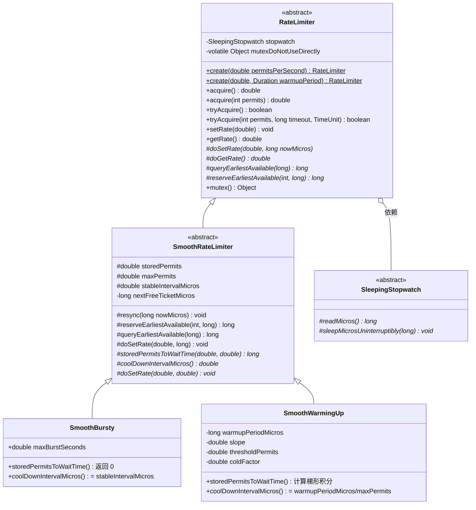

### 分层职责

| 层级 | 类 | 职责 |
|------|-----|------|
| 顶层抽象 | `RateLimiter` | 对外 API、工厂方法、阻塞/超时获取、锁、动态调限的入口编排 |
| 中层抽象 | `SmoothRateLimiter` | "平滑"限流的核心算法：状态维护、`resync`、`reserveEarliestAvailable`、积分框架 |
| 具体实现 | `SmoothBursty` | 突发型：存储令牌免费发放，允许突发 |
| 具体实现 | `SmoothWarmingUp` | 预热型：存储令牌更"贵"，冷启动后逐渐提速 |

---

## 三、核心概念与状态变量

`SmoothRateLimiter` 维护四个核心状态：

```java
/** 当前存储的令牌数（过去空闲时间积累而来）。 */
double storedPermits;

/** 存储令牌的上限。 */
double maxPermits;

/** 稳定速率下，两个单位请求之间的间隔（微秒）。例如 5 QPS → 200000 微秒(200ms)。 */
double stableIntervalMicros;

/** 下一次请求（无论大小）可被批准的时间。授予请求后会被推向未来。 */
private long nextFreeTicketMicros = 0L; // 可以是过去也可以是未来
```

### 状态变量关系图

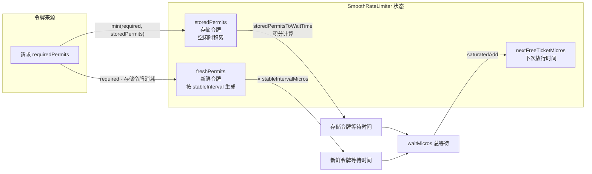

### 关键概念解释

| 概念 | 说明 |
|------|------|
| **stableIntervalMicros** | `1/速率`（微秒）。5 QPS = 每个 permit 间隔 200ms。这是"新鲜令牌"的生成成本。 |
| **storedPermits** | 空闲期间预存的令牌。0 表示无空闲积累，可达 maxPermits。 |
| **nextFreeTicketMicros** | 设计的精髓所在：记录"下次放行时刻"，而不是"上次请求时刻"。可能在过去（表示空闲已积累令牌）或未来（表示有排队债务）。 |
| **预付（prepaid）模型** | 当前请求只等待**上一个请求遗留的债务**；当前请求自身的成本被加到 nextFreeTicketMicros，由**下一个请求**承担。 |

---

## 四、两种实现：SmoothBursty vs SmoothWarmingUp

两种实现共享 `SmoothRateLimiter` 的算法骨架，只在三个抽象方法上不同：
`storedPermitsToWaitTime`、`coolDownIntervalMicros`、`doSetRate(permitsPerSecond, stableIntervalMicros)`。

### 4.1 对比表

| 维度 | SmoothBursty（突发型） | SmoothWarmingUp（预热型） |
|------|------------------------|---------------------------|
| **工厂方法** | `RateLimiter.create(qps)` | `RateLimiter.create(qps, warmupPeriod)` |
| **典型场景** | 网络带宽、API 限流 | 需要预热的外部服务（远程服务器、数据库） |
| **初始状态** | storedPermits = 0（空，无突发额度） | storedPermits = maxPermits（冷态，最慢） |
| **存储令牌发放代价** | **免费**（`storedPermitsToWaitTime` 返回 0） | **更贵**（高于 stableInterval，梯形积分） |
| **空闲后的行为** | **加速**：突发消耗存量令牌，瞬时通过 | **减速**：冷启动，慢速放行后逐渐提速 |
| **maxBurstSeconds** | 默认 1.0（可存 1 秒的令牌） | 不适用 |
| **coldFactor** | 不适用 | 默认 3.0（冷态间隔=稳定间隔×3） |
| **coolDownIntervalMicros** | `stableIntervalMicros` | `warmupPeriodMicros / maxPermits` |

### 4.2 间隔函数对比

下图展示两种实现中"令牌生成间隔"随 storedPermits 变化的函数：

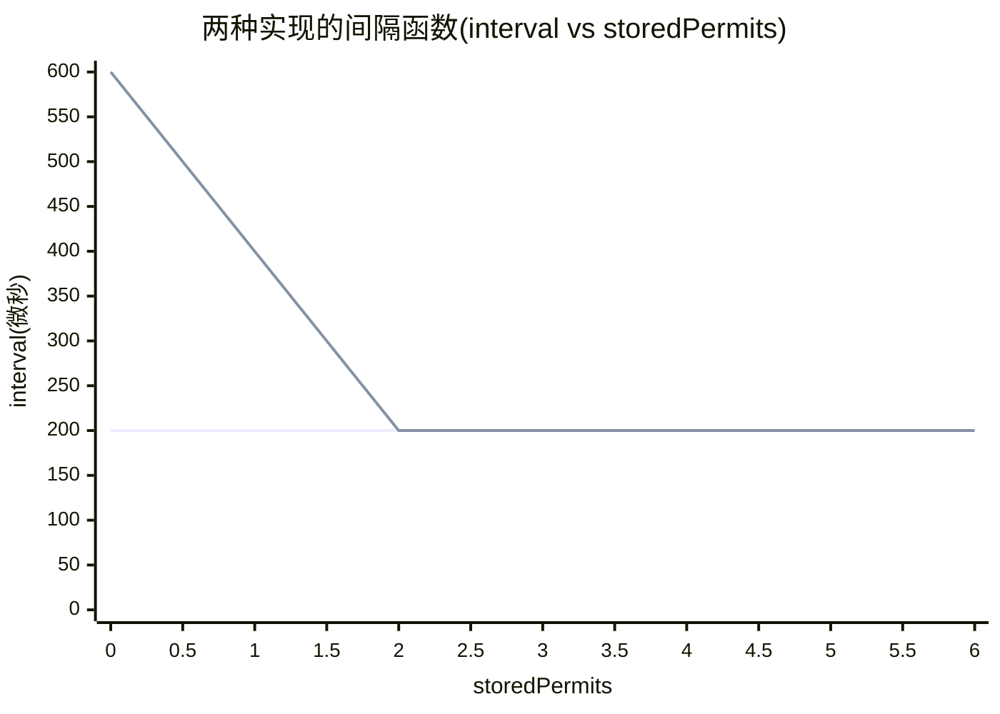

- **SmoothBursty（上线）**：始终是水平线 `stableInterval`。但请注意，存储令牌的 `storedPermitsToWaitTime` 直接返回 0（比这条线**更便宜**，相当于函数退化为 0），所以突发时存储令牌瞬发。
- **SmoothWarmingUp（下线，从右往左看）**：从 0 到 thresholdPermits 是 `stableInterval` 水平段；从 thresholdPermits 到 maxPermits 线性上升到 `coldInterval = coldFactor × stableInterval`。冷态（storedPermits 大）时令牌生成慢，预热后（storedPermits 减小）逐渐回到稳定速率。

> 注：上图横轴数值为示意（以 stableInterval=200μs、coldFactor=3、coldInterval=600μs 为例）。

---

## 五、acquire() 完整工作流程

以 `acquire(int permits)` 为例，这是最核心的限流入口。

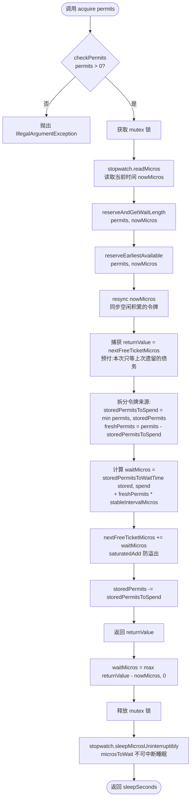

### 流程要点

1. **预付时机**：`returnValue` 在 `resync` 之后、`nextFreeTicketMicros` 被推前**之前**捕获。所以当前线程等待的时间是"截至当前时刻已经累积的债务"，而它自己产生的 `waitMicros` 被加到 `nextFreeTicketMicros`，留给下个请求。
2. **睡眠在锁外**：`sleepMicrosUninterruptibly` 在 `synchronized` 块**之外**执行。这是关键性能设计——一个线程睡眠时不阻塞其他线程预占位置。
3. **不可中断睡眠**：使用 `Uninterruptibles.sleepUninterruptibly`，即使线程被 interrupt 也会睡满。

---

## 六、核心算法逐行解析

### 6.1 入口：acquire / reserve

```java
// RateLimiter.java
public double acquire(int permits) {
  long microsToWait = reserve(permits);                    // ① 计算需要等待的微秒数
  stopwatch.sleepMicrosUninterruptibly(microsToWait);      // ② 锁外睡眠
  return 1.0 * microsToWait / SECONDS.toMicros(1L);       // ③ 返回等待秒数
}

final long reserve(int permits) {
  checkPermits(permits);
  synchronized (mutex()) {                                 // 全程持锁计算
    return reserveAndGetWaitLength(permits, stopwatch.readMicros());
  }
}

final long reserveAndGetWaitLength(int permits, long nowMicros) {
  long momentAvailable = reserveEarliestAvailable(permits, nowMicros);
  return max(momentAvailable - nowMicros, 0);              // 钳为非负
}
```

### 6.2 核心：reserveEarliestAvailable

这是整个限流器的"心脏"：

```java
// SmoothRateLimiter.java
final long reserveEarliestAvailable(int requiredPermits, long nowMicros) {
  resync(nowMicros);                                              // (A) 同步空闲令牌
  long returnValue = nextFreeTicketMicros;                        // (B) 捕获放行时刻(预付!)
  double storedPermitsToSpend = min(requiredPermits, this.storedPermits); // (C) 优先用存储令牌
  double freshPermits = requiredPermits - storedPermitsToSpend;   // (D) 不足部分用新鲜令牌

  long waitMicros =
      storedPermitsToWaitTime(this.storedPermits, storedPermitsToSpend)  // (E) 存储令牌的代价(积分)
          + (long) (freshPermits * stableIntervalMicros);                 // (F) 新鲜令牌的代价(线性)

  this.nextFreeTicketMicros = LongMath.saturatedAdd(nextFreeTicketMicros, waitMicros); // (G) 推后放行时刻
  this.storedPermits -= storedPermitsToSpend;                     // (H) 扣除已消耗的存储令牌
  return returnValue;                                             // (I) 返回"本该放行"的时刻
}
```

| 步骤 | 含义 |
|------|------|
| (A) resync | 若 `nowMicros > nextFreeTicketMicros`（即有空闲），把这段空闲时间换算成新令牌累积进 storedPermits（上限 maxPermits），并把 `nextFreeTicketMicros` 拉回 `now`。 |
| (B) 捕获 returnValue | **预付模型的关键**：返回给调用方的是"当前债务"，而非本次请求的新债务。 |
| (C)(D) 拆分 | 先花存储令牌（便宜/免费的），再花新鲜令牌（按 stableInterval）。 |
| (E) 存储令牌代价 | 由子类决定：Bursty 返回 0（免费）；WarmingUp 算梯形积分（更贵）。 |
| (F) 新鲜令牌代价 | `数量 × stableIntervalMicros`，线性。 |
| (G) 推后 NFT | `saturatedAdd` 防止 long 溢出。新债务累加，下一个请求承担。 |
| (H) 扣存储令牌 | consumed 的 storedPermits 减少。 |
| (I) 返回 | 调用方据此算出 `max(returnValue - nowMicros, 0)` 作为睡眠时长。 |

### 6.3 关键：resync（惰性同步）

```java
// SmoothRateLimiter.java
void resync(long nowMicros) {
  // 如果 nextFreeTicket 已在过去，则同步到当前
  if (nowMicros > nextFreeTicketMicros) {
    double newPermits = (nowMicros - nextFreeTicketMicros) / coolDownIntervalMicros();
    storedPermits = min(maxPermits, storedPermits + newPermits);   // 不超过上限
    nextFreeTicketMicros = nowMicros;                              // 拉回当前
  }
  // 若 nextFreeTicket 在未来(有排队),则不动 —— 仍在还债,无空闲可累积
}
```

**要点**：
- **惰性计算**：令牌不是后台线程定时生成的，而是每次 acquire 时"按需补算"。这避免了后台线程开销。
- **冷却间隔**：`coolDownIntervalMicros()` 决定空闲期间令牌积累速度。
  - Bursty：`stableIntervalMicros`（与正常生成同速）。
  - WarmingUp：`warmupPeriodMicros / maxPermits`（使得从 0 积累到 maxPermits 恰好耗时 warmupPeriod）。
- **未来时刻跳过**：若 `nextFreeTicketMicros > nowMicros`（还在排队还债），resync 啥也不做——没有真正的"空闲"。

### 6.4 storedPermitsToWaitTime（积分计算）

```java
// SmoothBursty: 存储令牌免费
long storedPermitsToWaitTime(double storedPermits, double permitsToTake) {
  return 0L;
}

// SmoothWarmingUp: 梯形积分
long storedPermitsToWaitTime(double storedPermits, double permitsToTake) {
  double availablePermitsAboveThreshold = storedPermits - thresholdPermits;
  long micros = 0;
  // 右侧爬升段(梯形)的积分
  if (availablePermitsAboveThreshold > 0.0) {
    double permitsAboveThresholdToTake = min(availablePermitsAboveThreshold, permitsToTake);
    double length = permitsToTime(availablePermitsAboveThreshold)
                  + permitsToTime(availablePermitsAboveThreshold - permitsAboveThresholdToTake);
    micros = (long) (permitsAboveThresholdToTake * length / 2.0);  // 梯形面积 = 宽×(上底+下底)/2
    permitsToTake -= permitsAboveThresholdToTake;
  }
  // 左侧水平段的积分
  micros += (long) (stableIntervalMicros * permitsToTake);
  return micros;
}

private double permitsToTime(double permits) {
  return stableIntervalMicros + permits * slope;   // 线性函数:在阈值点=stable,在maxPermits=cold
}
```

---

## 七、tryAcquire() 工作流程

`tryAcquire` 提供**非阻塞/超时**获取语义：在指定 timeout 内拿不到就返回 false。

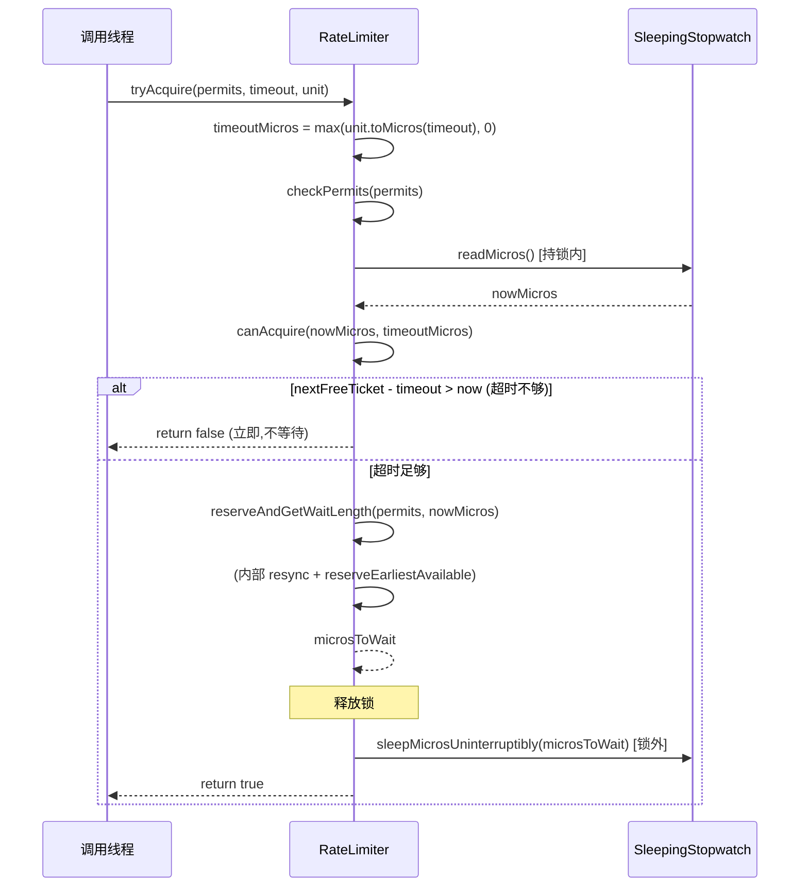

### canAcquire 判定逻辑

```java
private boolean canAcquire(long nowMicros, long timeoutMicros) {
  return queryEarliestAvailable(nowMicros) - timeoutMicros <= nowMicros;
  // 即: nextFreeTicketMicros <= nowMicros + timeoutMicros
  //     下次放行时刻 ≤ 现在+超时  →  在超时窗口内能等到
}
```

**注意**：`canAcquire` 调用的是 `queryEarliestAvailable`，它**直接返回 nextFreeTicketMicros 而不做 resync**。真正补算令牌的 `resync` 发生在之后的 `reserveAndGetWaitLength` 内。这意味着判定基于"当前已知的债务时刻"，是有意为之的保守判断。

---

## 八、动态调限 setRate() 流程

`setRate` 可在运行时改变速率，且线程安全。

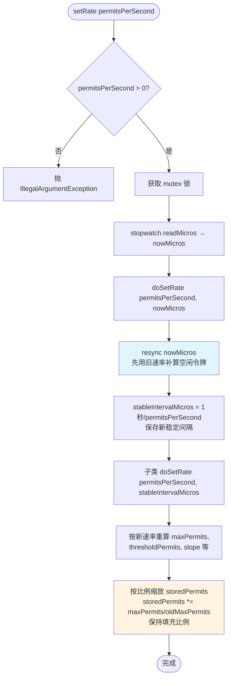

```java
// SmoothRateLimiter.doSetRate
final void doSetRate(double permitsPerSecond, long nowMicros) {
  resync(nowMicros);                                            // 先用旧速率补算
  double stableIntervalMicros = SECONDS.toMicros(1L) / permitsPerSecond;
  this.stableIntervalMicros = stableIntervalMicros;
  doSetRate(permitsPerSecond, stableIntervalMicros);            // 子类重算并按比例缩放 storedPermits
}
```

### 关键语义（源自 Javadoc）

- **当前正在睡眠的线程不会被唤醒**：它们已经按旧速率预留了等待时间，醒后照旧。只有**后续请求**才感知新速率。
- **下一个请求仍偿还上一请求的债务**：由于预付模型，紧接 `setRate` 之后的第一个请求，其等待时间仍由"上一个请求"（旧速率下）遗留的 `nextFreeTicketMicros` 决定。
- **初始状态特殊处理**：`oldMaxPermits == 0.0`（首次设置）时：
  - Bursty → storedPermits = 0（空桶起步）
  - WarmingUp → storedPermits = maxPermits（冷态起步）
- **`oldMaxPermits == POSITIVE_INFINITY`** 特判：避免 `0 * ∞ = NaN`，直接置 0。
- **比例缩放**：调限后 `storedPermits *= maxPermits/oldMaxPermits`，保持令牌桶的"填充比例"不变，避免突刺。

---

## 九、并发与锁机制

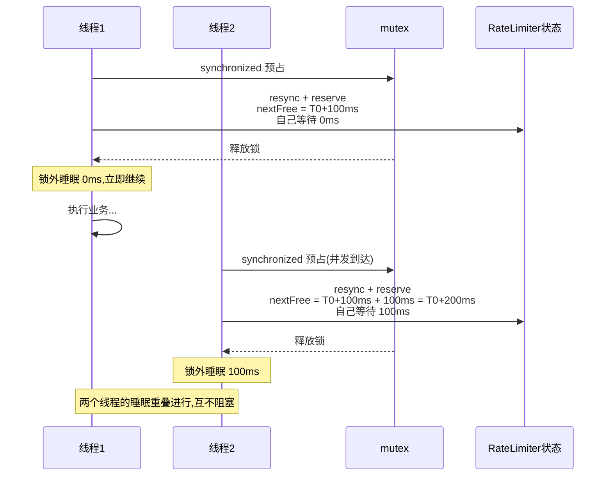

### 锁设计要点

| 设计点 | 实现 | 原因 |
|--------|------|------|
| **互斥对象** | `mutexDoNotUseDirectly`，惰性初始化（DCL 双重检查锁） | 避免在构造函数中初始化（mock 对象不调用构造函数）；分离锁对象减少竞争 |
| **持锁范围** | 仅覆盖状态计算（resync + reserve），**不覆盖睡眠** | 睡眠期间释放锁，其他线程可并发预占，避免单线程瓶颈 |
| **公平性** | **不保证公平**（Javadoc 明确说明） | `synchronized` 本身非公平；线程获锁顺序未必=到达顺序 |
| **时间读取** | 持锁内 `readMicros()` | 保证多次 reserve 看到的时间单调递增 |

> **重要结论**：虽然 `synchronized` 保证状态计算的原子性，但由于睡眠在锁外，多线程限流效果是"各自按预约时刻睡眠"，而非串行排队睡眠。这正是预付模型的价值——预约时刻 `nextFreeTicketMicros` 是唯一的共享"排队凭证"，每次 reserve 都把它单调推后。

---

## 十、预热模型的数学原理

`SmoothWarmingUp` 的间隔函数（源自源码 ASCII 图，转绘为 mermaid）：

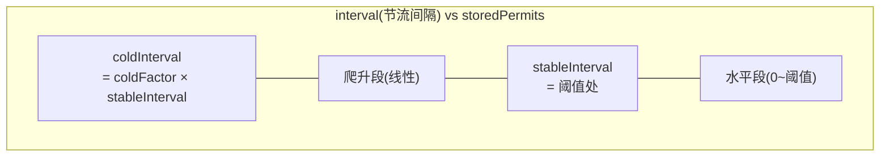

更精确的函数形态（数值示意，stableInterval=200μs，coldFactor=3）：

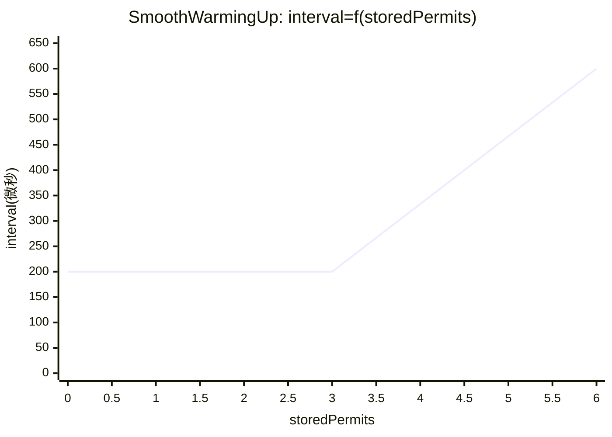

### 源码 ASCII 图（原文保留）

```
          ^ throttling
          |
    cold  +                  /
 interval |                 /.
          |                / .
          |               /  .   ← "warmup period" 是 thresholdPermits
          |              /   .     到 maxPermits 之间梯形的面积
          |             /    .
          |            /     .
          |           /      .
   stable +----------/  WARM .
 interval |          .   UP  .
          |          . PERIOD.
          |          .       .
        0 +----------+-------+---------------> storedPermits
          0 thresholdPermits maxPermits
```

### 数学推导

设 `stableInterval = S`，`coldInterval = C = coldFactor × S`，预热期 `warmupPeriod = W`。

**核心约定**（源码注释明确给出）：
1. 从 `maxPermits` 降到 `thresholdPermits`（消耗梯形段）耗时 = `warmupPeriod`
2. 从 `thresholdPermits` 降到 `0`（消耗水平段）耗时 = `warmupPeriod / 2`（为兼容 coldFactor=3 的原始实现）

**推导 thresholdPermits**：
```
水平段面积 = thresholdPermits × S = W/2
⇒ thresholdPermits = 0.5 × W / S
```

**推导 maxPermits**：
```
梯形面积 = 0.5 × (S + C) × (maxPermits - thresholdPermits) = W
⇒ maxPermits = thresholdPermits + 2 × W / (S + C)
```

**斜率 slope**：
```
slope = (C - S) / (maxPermits - thresholdPermits)
```

### 积分即节流时间

当消耗 K 个存储令牌时，节流时间 = 间隔函数在 `[storedPermits - K, storedPermits]` 上的**积分**。

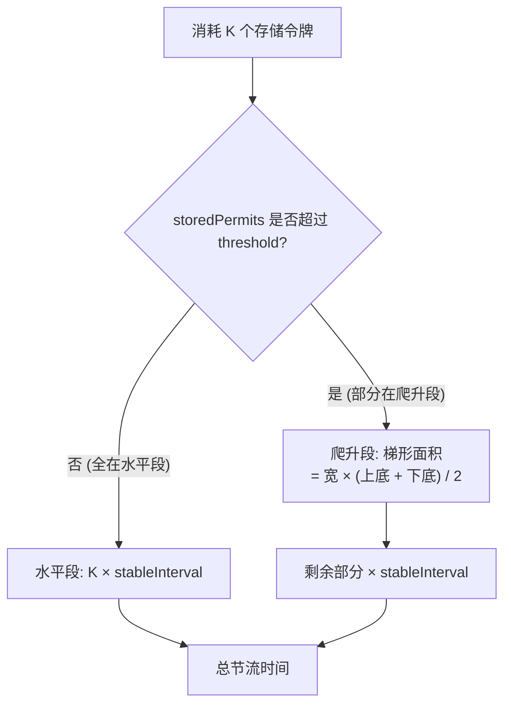

**梯形面积计算**（对应代码）：
- 上底 = `permitsToTime(availableAboveThreshold)`（在 storedPermits 处的间隔，较高）
- 下底 = `permitsToTime(availableAboveThreshold - taken)`（消耗后处的间隔，较低）
- 面积 = `permitsAboveThresholdToTake × (上底 + 下底) / 2`

**积分保证等价性**：由于节流时间是连续函数的积分，`[a, c]` 上的积分 = `[a,b]` + `[b,c]`，因此：
```
acquire(3) 的等待时间 == acquire(1) + acquire(1) + acquire(1) 的总等待时间
```
无论函数形状如何，只要能算积分。这保证了不同权重请求的公平一致性。

### 两种语义的统一解释

源码用一个绝妙技巧统一两种语义：

- **若选水平线在 `1/QPS` 高度**：存储令牌与新鲜令牌同价，函数"无效"。
- **SmoothBursty 选"低于水平线"（实际为 0）**：积分面积更小 → 时间更短 → 存储令牌更便宜 → **空闲后加速**。
- **SmoothWarmingUp 选"高于水平线"（爬升到 coldInterval）**：积分面积更大 → 时间更长 → 存储令牌更贵 → **空闲后减速**。

---

## 十一、关键设计洞察

### 11.1 预付（Prepaid）债务模型

| 传统模型 | Guava 模型 |
|----------|-----------|
| 记录"上次请求时刻" | 记录"下次放行时刻" |
| `acquire(100)` 必须先等 100 秒 | `acquire(100)` 立即开始，下个请求等 100 秒 |
| 大请求阻塞当前调用方 | 大请求的成本转嫁给后续调用方 |

**实现机制**：`reserveEarliestAvailable` 返回 `nextFreeTicketMicros`（捕获于加 wait 之前），当前线程只等 `returnValue - now`，自身 `waitMicros` 加到 NFT 留给下家。

### 11.2 惰性令牌生成

无后台线程、无定时器。令牌数在每次 `acquire`/`resync` 时按 `已过去时间 / coolDownInterval` 实时补算。优点：零后台开销；缺点：长时间无请求时令牌"看起来"在涨，但只在下次访问时才可见。

### 11.3 饱和运算防护

`LongMath.saturatedAdd` 在累加 `waitMicros` 到 `nextFreeTicketMicros` 时防 long 溢出，避免恶意大请求导致时间回绕。`max(momentAvailable - nowMicros, 0)` 钳制负等待。

### 11.4 SleepingStopwatch 抽象

将"读时间"和"睡眠"抽象为 `SleepingStopwatch`，便于单元测试注入**虚拟时钟**（`stopwatch.sleepMillis` 推进虚拟时间），这正是 `RateLimiterTest` 能精确断言等待时长的根基。

### 11.5 突发上限

SmoothBursty 默认 `maxBurstSeconds = 1.0`，即最多积攒 1 秒的令牌。`maxPermits = 1.0 × permitsPerSecond`。这既允许适度突发，又防止无限积压（测试 `testWeCanGetUpTo1SecondOfBurst` 验证突发不超过 1 秒工作量）。

---

## 十二、数值推演示例

### 示例 1：SmoothBursty，5 QPS，空闲后突发

配置：`RateLimiter.create(5.0)` → `stableInterval = 200ms`，`maxPermits = 5`。

| 时刻 | 操作 | resync 后 | returnValue | freshPermits | waitMicros | nextFree | storedPermits | 实际等待 |
|------|------|-----------|-------------|--------------|-----------|----------|---------------|---------|
| t=0 | 构造 | — | — | — | — | 0 | 0 | — |
| t=100ms | acquire(1) | SP+=0.5→0.5, NFT=100ms | 100ms | 0.5 (stored) | 0 (bursty免费) | 100ms | -0.5→0 | max(100-100,0)=0 |
| t=2.1s | acquire(6) | 空闲2s: SP=min(5, 0+2s/0.2s)=5, NFT=2.1s | 2.1s | 6-5=1 fresh | 5×0 + 1×200ms | 2.3s | 5-5=0 | max(2.1s-2.1s,0)=0 |
| t=2.1s+ | acquire(1) | NFT(2.3s)>now, 不resync | 2.3s | 1 fresh | 0+1×200ms | 2.5s | 0 | 200ms |

> 解读：空闲 2 秒攒满 5 个令牌（上限）。`acquire(6)` 立即返回（等 0ms），消耗 5 个存储令牌 + 1 个新鲜令牌（把 NFT 推到 2.3s）。紧接着的 `acquire(1)` 需等 200ms——**这正是"大请求成本转嫁给后续请求"的体现**。

### 示例 2：SmoothWarmingUp，冷启动逐渐提速

配置：`RateLimiter.create(5.0, Duration.ofSeconds(4))`，coldFactor=3。
- `stableInterval S = 200ms`，`coldInterval C = 600ms`
- `thresholdPermits = 0.5 × 4s / 0.2s = 10`
- `maxPermits = 10 + 2 × 4s / (0.2+0.6)s = 10 + 10 = 20`
- 初始 `storedPermits = 20`（冷态）

连续 `acquire()` 序列（饱和请求）：
1. 第 1 个：从 20 降到 19，处于爬升段顶部，间隔≈600ms → 等待≈600ms（最慢）
2. 逐步消耗到 thresholdPermits=10（梯形段）：总耗时 = warmupPeriod = 4s
3. 从 10 降到 0（水平段）：总耗时 = warmupPeriod/2 = 2s
4. 之后进入稳定期：每次 200ms

> 这正是"预热"——前几个请求慢（冷态），随后在 4 秒内逐步加速到稳定速率 5 QPS。若再次空闲满 4 秒，storedPermits 会重新积累到 20，回到冷态。

---

## 十三、总结

### 架构总览图

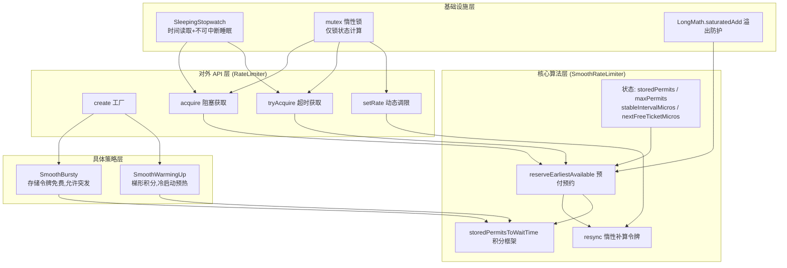

### 三句话精髓

1. **RateLimiter 用"下一次放行时刻" `nextFreeTicketMicros` 单一变量串联所有请求**，配合预付模型让大请求立即开始、成本转嫁后续，实现无锁等待（睡眠在锁外）的高效并发限流。

2. **`storedPermits` 建模过去空闲**，并通过一个可替换的"间隔→时间"积分函数，让 SmoothBursty（积分≈0，空闲后加速）与 SmoothWarmingUp（积分更大，空闲后冷启动预热）两种相反语义共用同一套算法骨架。

3. **全程惰性计算**：无后台线程，令牌在每次 `resync` 时按 `经过时间/冷却间隔` 补算；动态调限按比例缩放 storedPermits 保持填充率，且不惊醒已睡眠线程。

### 适用场景速查

| 场景 | 推荐 | 原因 |
|------|------|------|
| 普通 API 限流、防刷 | `create(qps)` (SmoothBursty) | 允许适度突发，平滑限速 |
| 网络带宽限制（按字节计 permit） | `create(qps)` (SmoothBursty) | 空闲=缓冲空=可加速 |
| 冷启动的服务/数据库保护 | `create(qps, warmupPeriod)` (SmoothWarmingUp) | 预热期逐步加压，避免冷服务被打挂 |
| 严格匀速（无突发）需求 | RateLimiter 不擅长 | 考虑令牌桶+预热或自定义策略 |

> **局限**：RateLimiter 是单机内存限流，不支持分布式；不保证公平；`acquire` 的等待不可被中断。分布式场景需结合 Redis（如 Redisson 的 RRateLimiter）或 Sentinel。
