# Guava 布隆过滤器（BloomFilter）底层实现原理深度解析

> 基于 Guava **33.4.0** 源码（`guava/src/com/google/common/hash/` 目录）
> 核心文件：
> - `BloomFilter.java`
> - `BloomFilterStrategies.java`（含 `LockFreeBitArray`）
> - `Murmur3_128HashFunction.java`
> - `AbstractStreamingHasher.java`
> - `Funnel.java` / `Funnels.java`
> - `HashCode.java` / `Hashing.java`

---

## 目录

1. [布隆过滤器背景知识](#1-布隆过滤器背景知识)
2. [整体架构](#2-整体架构)
3. [核心数据结构：LockFreeBitArray](#3-核心数据结构lockfreebitarray)
4. [Funnel：对象到字节流的桥梁](#4-funnel对象到字节流的桥梁)
5. [Hash 函数设计（一）：MurmurHash3 128 位](#5-hash-函数设计一murmurhash3-128-位)
6. [Hash 函数设计（二）：双重哈希增强（Kirsch–Mitzenmacher）](#6-hash-函数设计二双重哈希增强kirschmitzenmacher)
7. [最优参数计算：数学推导与源码](#7-最优参数计算数学推导与源码)
8. [工作流程详解（create / put / mightContain）](#8-工作流程详解)
9. [并发与线程安全设计](#9-并发与线程安全设计)
10. [统计与估算功能（expectedFpp / approximateElementCount）](#10-统计与估算功能)
11. [序列化设计](#11-序列化设计)
12. [过滤器合并：putAll](#12-过滤器合并putall)
13. [使用示例](#13-使用示例)
14. [设计亮点与局限性总结](#14-设计亮点与局限性总结)

---

## 1. 布隆过滤器背景知识

布隆过滤器（Bloom Filter）是 1970 年由 Burton Howard Bloom 提出的**概率型数据结构**，用于判断一个元素是否在集合中。它的核心特征是**单侧错误（one-sided error）**：

- 判断"**不存在**"→ **100% 准确**（绝无漏报 / no false negative）
- 判断"**存在**"→ **可能误报**（false positive，误报率 FPP 可控）

Guava 类注释原文（`BloomFilter.java:45-47`）：

> A Bloom filter offers an approximate containment test with one-sided error: if it claims that an element is contained in it, this might be in error, but if it claims that an element is *not* contained in it, then this is definitely true.

### 1.1 基本原理

一个布隆过滤器由两部分组成：

1. **一个 m 位的位数组**（bit array），初始全 0
2. **k 个相互独立的哈希函数** h₁, h₂, …, hₖ

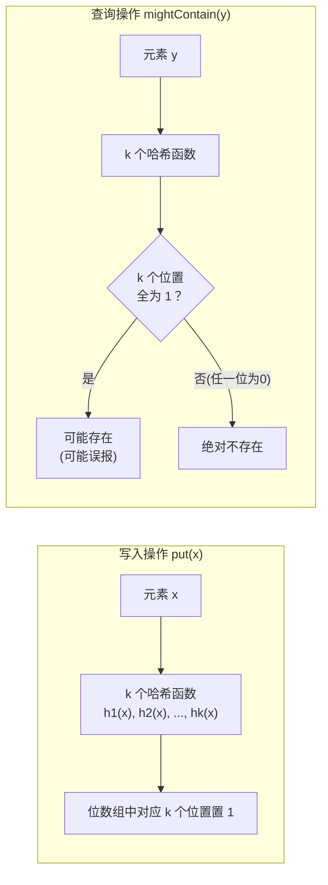

### 1.2 误报率公式

插入 n 个元素后，某一位仍为 0 的概率为：

```
p₀ = (1 - 1/m)^(kn) ≈ e^(-kn/m)
```

误报率（k 个哈希位置全被置 1 的概率）：

```
FPP = (1 - p₀)^k = (1 - e^(-kn/m))^k
```

对 k 求导取极值可得**最优哈希函数个数**：

```
k_opt = (m/n) · ln2
```

代入最优 k 后：

```
FPP_opt = 2^(-k) ≈ 0.6185^(m/n)
```

以及**最优位数组大小**：

```
m_opt = -n·ln(p) / (ln2)²
```

这四个公式正是 Guava 源码中 `BloomFilter.java:501-511` 的"Cheat sheet"注释，后面第 7 节会逐一对应到代码。

---

## 2. 整体架构

### 2.1 架构总览图

Guava 的布隆过滤器采用了经典的**策略模式（Strategy Pattern）**，将"元素 → 位索引"的映射逻辑从过滤器主体中剥离，使得哈希策略可插拔、可序列化。

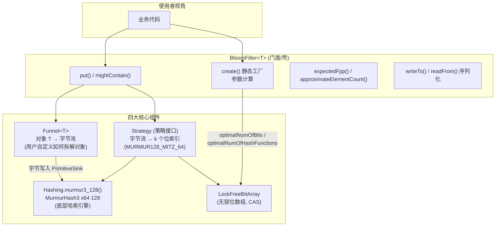

### 2.2 类图

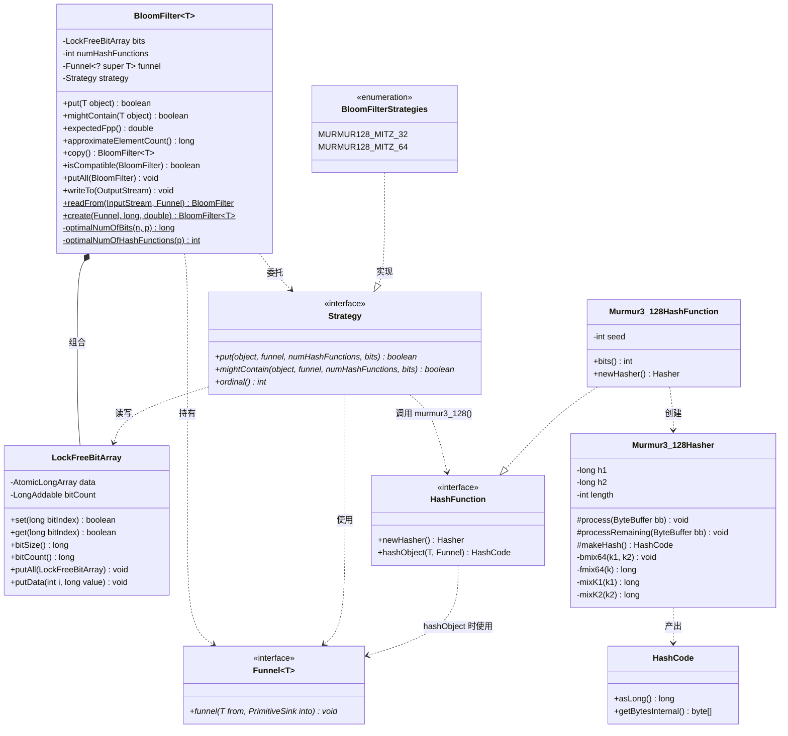

### 2.3 各组件职责表

| 组件 | 源码位置 | 职责 |
|---|---|---|
| `BloomFilter<T>` | `BloomFilter.java:73` | 门面类：对外 API、参数计算（m、k）、序列化、合并、统计估算 |
| `Strategy`（内部接口） | `BloomFilter.java:79` | 策略接口：定义"如何把一个对象映射到 k 个位索引"的契约 |
| `BloomFilterStrategies` | `BloomFilterStrategies.java:41` | 枚举实现两种策略：`MURMUR128_MITZ_32`（遗留）与 `MURMUR128_MITZ_64`（默认） |
| `LockFreeBitArray` | `BloomFilterStrategies.java:162` | 无锁位数组：`AtomicLongArray` + CAS 实现并发安全的位置位/查询 |
| `Funnel<T>` | `Funnel.java:48` | 漏斗接口：用户定义如何把任意对象 T"漏"成字节流 |
| `Murmur3_128HashFunction` | `Murmur3_128HashFunction.java:45` | MurmurHash3 x64 128 位哈希函数实现（seed 固定为 0） |
| `AbstractStreamingHasher` | `AbstractStreamingHasher.java:32` | 流式哈希骨架：缓冲、分块（chunk）处理字节流 |

### 2.4 关键设计决策

1. **策略模式 + 枚举**：`Strategy` 是 `BloomFilter` 的包私有内部接口，实现必须是**纯函数（无状态）**——这一点在接口 Javadoc 中明确要求（`BloomFilter.java:77-78`），因为策略对象要参与序列化。策略的 `ordinal()` 序号被写入紧凑序列化格式，所以**枚举常量的声明顺序永远不能变、不能删除**（`BloomFilterStrategies.java:33-35` 注释）。

2. **为什么用枚举而不是普通类**：枚举天然单例、天然可序列化（JVM 保证反序列化后仍是同一实例），完美契合"策略必须无状态且跨版本稳定"的需求。

3. **位数组不要求 2 的幂**：`BloomFilter.java:112` 特意注释 `The bit set of the BloomFilter (not necessarily power of 2!)`，因此索引映射用的是**取模 `%`** 而非位运算 `& (m-1)`。

---

## 3. 核心数据结构：LockFreeBitArray

`LockFreeBitArray`（`BloomFilterStrategies.java:162`）是整个过滤器的存储核心。Guava 不用 `java.util.BitSet` 的原因写在注释里（`:158-160`）：

> We use this instead of java.util.BitSet because we need access to the array of longs **and we need compare-and-swap**.

即：需要拿到底层 `long[]`（用于序列化），需要 CAS（用于无锁并发写）。

### 3.1 字段定义

```java
// BloomFilterStrategies.java:162-165
static final class LockFreeBitArray {
  private static final int LONG_ADDRESSABLE_BITS = 6;   // log2(64)：long 内位寻址
  final AtomicLongArray data;                            // 真正的位存储
  private final LongAddable bitCount;                    // 已置 1 位数的估计值
```

- **`data`**：`AtomicLongArray`，每个 `long` 存 64 个位。位数组总位数不必是 64 的倍数（末尾 long 可能只用到部分位），`bitSize() = data.length() * 64`。
- **`bitCount`**：`LongAddable`（Guava 对 `LongAdder` 的抽象，在 Android 上退化为 `AtomicLong`）。单独维护已置位数，避免每次统计都全量扫描数组——这是 `expectedFpp()` 和 `approximateElementCount()` 能 O(1) 返回的关键。

### 3.2 构造函数

```java
// BloomFilterStrategies.java:167-186
LockFreeBitArray(long bits) {          // 新建：按位数分配
  checkArgument(bits > 0, "data length is zero!");
  // 注释：避免委托 this(long[])，因为 AtomicLongArray(long[]) 会克隆输入、翻倍内存
  this.data = new AtomicLongArray(
      Ints.checkedCast(LongMath.divide(bits, 64, RoundingMode.CEILING)));
  this.bitCount = LongAddables.create();
}

LockFreeBitArray(long[] data) {        // 反序列化：由已有数据重建
  this.data = new AtomicLongArray(data);
  this.bitCount = LongAddables.create();
  long bitCount = 0;
  for (long value : data) {
    bitCount += Long.bitCount(value);  // 重算置位数
  }
  this.bitCount.add(bitCount);
}
```

### 3.3 位的定位方式（位索引 → long 索引 + 掩码）

```java
// BloomFilterStrategies.java:212-214
boolean get(long bitIndex) {
  return (data.get((int) (bitIndex >>> LONG_ADDRESSABLE_BITS))  // bitIndex / 64 → 第几个 long
          & (1L << bitIndex)) != 0;                              // 低 6 位决定 long 内偏移
}
```

- `bitIndex >>> 6` 等于 `bitIndex / 64`，定位到 `data` 中的 long 槽位；
- `1L << bitIndex` 只关心 `bitIndex` 的低 6 位（Java 移位对 long 自动取模 64），生成掩码。

### 3.4 set 的 CAS 自旋写

```java
// BloomFilterStrategies.java:189-210
boolean set(long bitIndex) {
  if (get(bitIndex)) {              // 快速路径：已置 1，直接返回 false（避免无谓 CAS）
    return false;
  }

  int longIndex = (int) (bitIndex >>> LONG_ADDRESSABLE_BITS);
  long mask = 1L << bitIndex;

  long oldValue;
  long newValue;
  do {
    oldValue = data.get(longIndex);
    newValue = oldValue | mask;    // 按位或：只置 1，永不清 0
    if (oldValue == newValue) {    // 说明别的线程刚置过这一位
      return false;
    }
  } while (!data.compareAndSet(longIndex, oldValue, newValue));  // CAS 失败则自旋重试

  bitCount.increment();            // 只有真正把 0 变成 1 的线程才计数
  return true;
}
```

**CAS 自旋流程图：**

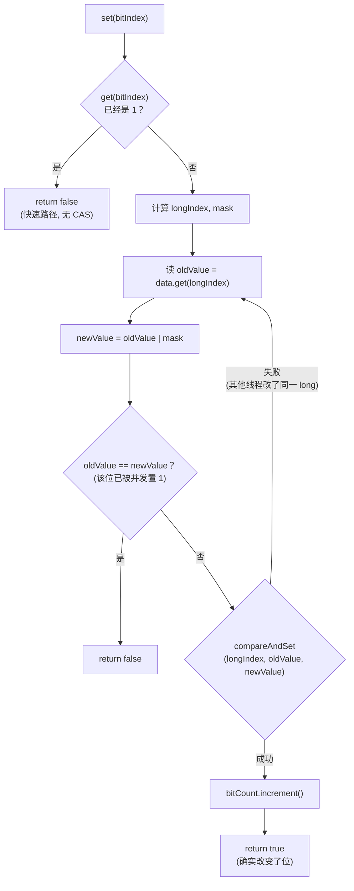

**设计细节：**

- **先检查后 CAS（check-then-act）在此是安全的**：即使 `get` 返回 false 后另一线程抢先置位，CAS 循环内的 `oldValue == newValue` 判断兜底，逻辑依然正确。
- **CAS 粒度是 64 位一个 long**：同一个 long 内不同 bit 位的并发写会互相竞争 CAS（伪冲突），但布隆过滤器置位是幂等的（只 OR 不清零），自旋次数期望极小。
- **返回值语义**：`true` 表示"这次调用确实把某位从 0 翻成了 1"；`false` 表示所有位都已经是 1（对应 `put()` 的返回值）。

### 3.5 bitCount 的弱一致性

Javadoc（`BloomFilterStrategies.java:236-241`）明确说明：

> because of concurrent set calls and uses of atomics, this bitCount is a **(very) close estimate** of the actual number of bits set. … if not exactly accurate, it is **always underestimating, never overestimating**.

原因：两个线程可能同时 CAS 成功设置了同一位的不同 long 槽内……实际上是因为 `increment()` 与 CAS 之间没有原子性（极端时序下可能少计），但绝不会多计。对 `expectedFpp()` 这种本来就是估算的指标完全够用。

---

## 4. Funnel：对象到字节流的桥梁

布隆过滤器要哈希"任意对象 T"，但哈希函数只认字节。`Funnel<T>`（漏斗）就是这中间的适配层：

```java
// Funnel.java:48-57
public interface Funnel<T extends @Nullable Object> extends Serializable {
  void funnel(T from, PrimitiveSink into);
}
```

用户实现 `funnel()` 方法，把对象中**参与判重的字段**依次写入 `PrimitiveSink`（`putInt` / `putLong` / `putString` / `putUnencodedChars` / `putBytes` …）。

Guava 在 `Funnels` 中内置了常见实现：`Funnels.unencryptedChars()`、`Funnels.stringValue()`、`Funnels.byteArrayFunnel()`、`Funnels.longFunnel()`、`Funnels.integerFunnel()` 等。

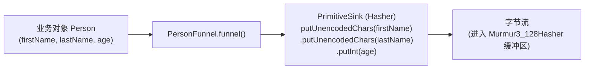

**为什么官方强烈建议用"单元素枚举"实现 Funnel**（`Funnel.java:26-29`、`BloomFilter.java:319-321`）：

1. `BloomFilter.equals()` 和 `putAll()` 的兼容性检查依赖 `funnel.equals(...)`，枚举天然是同一实例，`equals` 恒真；
2. Java 枚举的序列化机制保证反序列化后仍是同一个对象（不会像普通 `Serializable` 类那样产生新副本），避免"序列化后 funnel 不相等导致 putAll 失败"的坑。

**关键约束**：Funnel 写入的字节序列必须**完整、确定**地覆盖所有判重字段，且相同对象必须产生相同字节序（例如不要把 `HashMap` 的迭代顺序漏进去）。

---

## 5. Hash 函数设计（一）：MurmurHash3 128 位

Guava 布隆过滤器默认使用 **MurmurHash3 x64 128**（`Murmur3_128HashFunction.java`），seed 固定为 **0**。

为什么选 Murmur3？

- **非加密哈希中质量极高**：Austin Appleby 的 SMHasher 测试套件中表现优异，雪崩效应好、分布均匀；
- **极快**：无查表、纯乘法/移位/异或，x64 版每个 16 字节块只需少量运算；
- **128 位输出**：一次哈希即可产出两个 64 位值，正好供双重哈希使用（见第 6 节）；
- **确定性**：无随机种子依赖（seed=0），保证跨进程、跨机器、跨序列化后结果一致。

### 5.1 哈希流水线总览

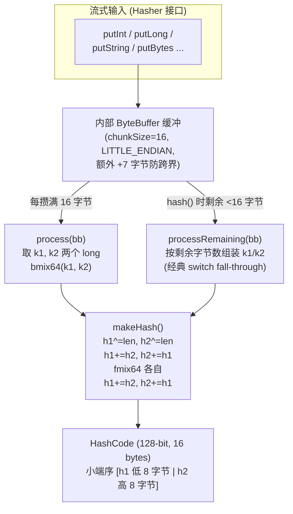

### 5.2 流式骨架：AbstractStreamingHasher

`Murmur3_128Hasher` 继承 `AbstractStreamingHasher`（`AbstractStreamingHasher.java:32`），后者处理所有缓冲逻辑：

```java
// AbstractStreamingHasher.java:62-71
protected AbstractStreamingHasher(int chunkSize, int bufferSize) {
  checkArgument(bufferSize % chunkSize == 0);
  // 永远多留 7 字节空间：保证任意一个基本类型 (long 最大 8 字节)
  // 都能一次 put 进缓冲而不会跨 chunk 边界
  this.buffer = ByteBuffer.allocate(bufferSize + 7).order(ByteOrder.LITTLE_ENDIAN);
  ...
}
```

**核心技巧——`+7` 补位**：缓冲区比标称大小多 7 字节，这样 `putLong()`（8 字节）永远可以直接写入而不被 chunk 边界切断，`munchIfFull()`（`AbstractStreamingHasher.java:206-211`）在剩余空间不足 8 字节时才触发消化（munch）。

`munch()` 的逻辑（`:213-221`）：

```java
private void munch() {
  Java8Compatibility.flip(buffer);
  while (buffer.remaining() >= chunkSize) {
    process(buffer);          // 每次消化一个 16 字节块
  }
  buffer.compact();           // 压缩，保留不足一个 chunk 的尾巴
}
```

对于大输入，`putBytesInternal()`（`:112-135`）还有零拷贝优化：缓冲区填满并消化一次后，**直接从输入 ByteBuffer 调用 `process()`**，跳过中间拷贝。

### 5.3 MurmurHash3 x64 128 核心算法

#### 常量与状态

```java
// Murmur3_128HashFunction.java:87-93
private static final int CHUNK_SIZE = 16;
private static final long C1 = 0x87c37b91114253d5L;
private static final long C2 = 0x4cf5ad432745937fL;
private long h1;      // 128 位状态的低半部分，初始为 seed(=0)
private long h2;      // 128 位状态的高半部分，初始为 seed(=0)
private int length;   // 已处理总字节数（参与最终混淆）
```

#### 每块处理：bmix64

```java
// Murmur3_128HashFunction.java:102-122
protected void process(ByteBuffer bb) {
  long k1 = bb.getLong();     // 本块前 8 字节（小端）
  long k2 = bb.getLong();     // 本块后 8 字节
  bmix64(k1, k2);
  length += CHUNK_SIZE;
}

private void bmix64(long k1, long k2) {
  h1 ^= mixK1(k1);
  h1 = Long.rotateLeft(h1, 27);
  h1 += h2;
  h1 = h1 * 5 + 0x52dce729;   // 魔数来自 MurmurHash3 原始实现

  h2 ^= mixK2(k2);
  h2 = Long.rotateLeft(h2, 31);
  h2 += h1;
  h2 = h2 * 5 + 0x38495ab5;
}
```

#### 消息字混淆：mixK1 / mixK2

```java
// Murmur3_128HashFunction.java:200-212
private static long mixK1(long k1) {
  k1 *= C1;                       // 乘大奇数（扩散低位 → 高位）
  k1 = Long.rotateLeft(k1, 31);   // 循环左移（把高位信息转回低位）
  k1 *= C2;                       // 再乘另一个大奇数
  return k1;
}

private static long mixK2(long k2) {
  k2 *= C2;
  k2 = Long.rotateLeft(k2, 33);   // 注意与 mixK1 的移位量不同（31 vs 33）
  k2 *= C1;                       // 乘数顺序也相反（C2 → C1）
  return k2;
}
```

> k1 与 k2 走**不对称**的混淆路径（乘数顺序、旋转量都不同），避免两个 long 通道产生相关性——这是 128 位输出两个半区彼此独立的关键。

#### 尾块处理：processRemaining

剩余不足 16 字节时（`:124-167`），用经典的 **switch fall-through** 组装出 k1/k2：

```java
protected void processRemaining(ByteBuffer bb) {
  long k1 = 0;
  long k2 = 0;
  length += bb.remaining();
  switch (bb.remaining()) {
    case 15: k2 ^= (long) toInt(bb.get(14)) << 48; // fall through
    case 14: k2 ^= (long) toInt(bb.get(13)) << 40; // fall through
    // ... case 13 ~ 9 依次把字节放入 k2 ...
    case 9:  k2 ^= (long) toInt(bb.get(8));        // fall through
    case 8:  k1 ^= bb.getLong();
             break;
    // case 7 ~ 1 同理把字节放入 k1
  }
  h1 ^= mixK1(k1);   // 注意：尾块只做 XOR 混入，
  h2 ^= mixK2(k2);   // 不做 rotateLeft/乘 5（与 bmix64 不同！）
}
```

> fall-through 技巧：剩余 N 字节就从 `case N` 进入，一路"贯穿"执行到底，恰好把每个存在的字节放到正确位置——N 个 case 共享同一段代码，零分支预测成本。

#### 终局混淆：makeHash + fmix64

```java
// Murmur3_128HashFunction.java:169-198
protected HashCode makeHash() {
  h1 ^= length;        // 混入总长度（区分 "ab" 与 "ab\0" 之类）
  h2 ^= length;

  h1 += h2;            // 两个通道交叉混合（第一次）
  h2 += h1;

  h1 = fmix64(h1);     // 各自最终雪崩混淆
  h2 = fmix64(h2);

  h1 += h2;            // 再次交叉混合（第二次）
  h2 += h1;

  return HashCode.fromBytesNoCopy(
      ByteBuffer.wrap(new byte[16])
          .order(ByteOrder.LITTLE_ENDIAN)   // 小端序输出
          .putLong(h1).putLong(h2).array());
}

private static long fmix64(long k) {   // MurmurHash3 的 finalizer
  k ^= k >>> 33;
  k *= 0xff51afd7ed558ccdL;   // 魔数：φ 的 64 位近似相关常数
  k ^= k >>> 33;
  k *= 0xc4ceb9fe1a85ec53L;
  k ^= k >>> 33;
  return k;
}
```

`fmix64` 是标准的 **xor-shift-multiply 雪崩终局**：三轮 `异或右移 33 + 乘大奇数`，确保输入任何 1 位的变化平均影响输出约一半的位（严格雪崩准则）。

---

## 6. Hash 函数设计（二）：双重哈希增强（Kirsch–Mitzenmacher）

理论上布隆过滤器需要 k 个**独立**哈希函数，但实践中没人这么干。Guava 采用 Kirsch–Mitzenmacher 论文（*"Less Hashing, Same Performance: Building a Better Bloom Filter"*, ESA 2006）的结论：

> 用 2 个独立哈希 h₁(x)、h₂(x) 通过线性组合生成第 i 个哈希：**gᵢ(x) = h₁(x) + i·h₂(x)**，性能几乎无损（FPP 只有极小的理论退化），但只需一次真正的哈希计算。

### 6.1 Guava 的实现（默认策略 MURMUR128_MITZ_64）

```java
// BloomFilterStrategies.java:101-143
MURMUR128_MITZ_64() {
  public <T> boolean put(T object, Funnel<? super T> funnel,
                         int numHashFunctions, LockFreeBitArray bits) {
    long bitSize = bits.bitSize();
    // ① 一次 128 位哈希，拿到 16 字节
    byte[] bytes = Hashing.murmur3_128().hashObject(object, funnel).getBytesInternal();
    long hash1 = lowerEight(bytes);   // 低 8 字节 → hash1
    long hash2 = upperEight(bytes);   // 高 8 字节 → hash2

    boolean bitsChanged = false;
    long combinedHash = hash1;
    for (int i = 0; i < numHashFunctions; i++) {
      // ② 第 i 个位索引 = (combinedHash & Long.MAX_VALUE) % bitSize
      bitsChanged |= bits.set((combinedHash & Long.MAX_VALUE) % bitSize);
      combinedHash += hash2;          // ③ 步进：h1 + i*h2（循环内只有一次加法！）
    }
    return bitsChanged;
  }
  // mightContain 结构完全对称，只是 set 换成 get，任一位为 0 立即短路返回 false
}
```

**三种哈希索引方案对比：**

| | `MURMUR128_MITZ_32`（遗留） | `MURMUR128_MITZ_64`（默认） |
|---|---|---|
| 使用哈希位数 | 只用低 64 位（`asLong()`） | 128 位全用（低/高各 8 字节） |
| 索引类型 | `int`（32 位） | `long`（64 位）→ 支持超大位数组 |
| 组合公式 | `combinedHash = hash1 + i * hash2`（循环内乘法） | `combinedHash += hash2`（循环内只有加法） |
| 负数处理 | `~combinedHash` 按位取反 | `& Long.MAX_VALUE` 清符号位 |
| 循环起点 | `i = 1`（跳过纯 hash1） | `i = 0`（含纯 hash1） |

`MURMUR128_MITZ_64` 的 Javadoc（`:96-100`）亲自解释了差异：

> It looks different from the implementation in MURMUR128_MITZ_32 because we're **avoiding the multiplication in the loop** and doing a (much simpler) `+= hash2`. We're also changing the index to a positive number by **AND'ing with Long.MAX_VALUE** instead of flipping the bits.

### 6.2 位索引生成流程图

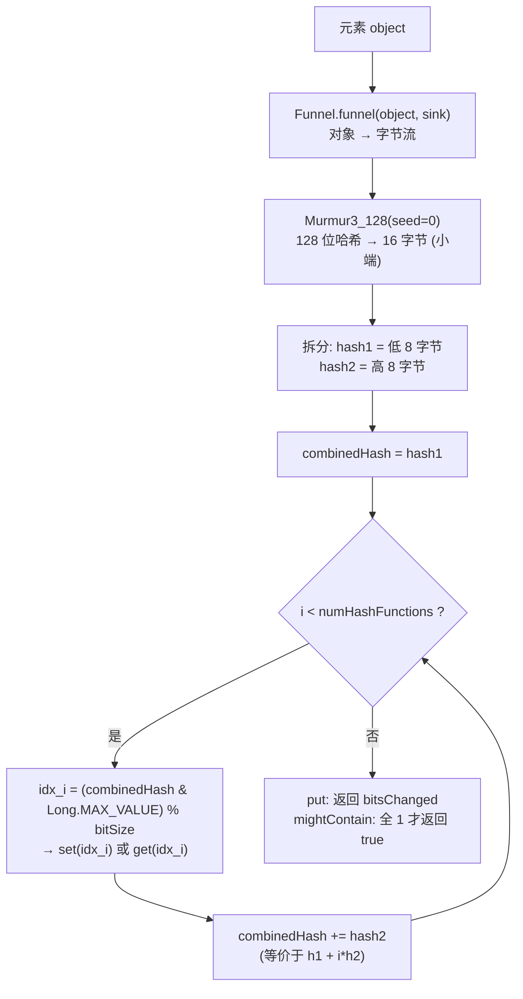

### 6.3 细节剖析

**① `(combinedHash & Long.MAX_VALUE) % bitSize` 两步取正+取模：**
- `& Long.MAX_VALUE`（清掉最高符号位）保证值非负；
- `% bitSize` 把值压进 `[0, bitSize)`——因为位数组大小**不保证是 2 的幂**，只能用除法取模（Guava 特意不把 m 取成 2 的幂，以最大化内存利用率）。

**② 128 位拆两半当两个"独立"哈希，成立吗？**
Murmur3 的 `fmix64` + 双重交叉混合（`h1+=h2; h2+=h1` 两次）让高低 64 位的统计相关性极低，实践上完全够用。这是整个设计中**最聪明的一步**：一次哈希计算（成本 ≈ 1 次函数调用）同时供出 h₁ 和 h₂，k 个索引只花 k 次加法 + k 次取模。

**③ 为什么 `MURMUR128_MITZ_32` 从 i=1 开始而 64 从 i=0 开始？**
纯历史原因：32 位版本当初想避开"裸 hash1"这一项，64 位版本没有这个顾虑。两者互不兼容（位索引不同），所以靠枚举 ordinal 在序列化中区分。

**④ 索引均匀性：**
`(h1 + i·h2) mod m` 当 m 非 2 的幂时，只要 h1、h2 接近均匀分布，取模后仍近似均匀——这是标准结论，Guava 注释引用 Kirsch–Mitzenmacher 论文背书（`:42-46`）。

---

## 7. 最优参数计算：数学推导与源码

`BloomFilter.create()` 静态工厂负责把用户的两个直觉参数——**预期插入量 n** 和 **目标误报率 p**——翻译成最优的 **m（位数）** 和 **k（哈希函数个数）**。

```java
// BloomFilter.java:426-450
static <T> BloomFilter<T> create(Funnel<? super T> funnel,
    long expectedInsertions, double fpp, Strategy strategy) {
  checkNotNull(funnel);
  checkArgument(expectedInsertions >= 0, ...);
  checkArgument(fpp > 0.0, ...);
  checkArgument(fpp < 1.0, ...);
  checkNotNull(strategy);

  if (expectedInsertions == 0) {
    expectedInsertions = 1;          // 0 视为 1，避免 log(1)=0 得到 0 位
  }

  long numBits = optimalNumOfBits(expectedInsertions, fpp);   // → m
  int numHashFunctions = optimalNumOfHashFunctions(fpp);      // → k
  try {
    return new BloomFilter<>(
        new LockFreeBitArray(numBits), numHashFunctions, funnel, strategy);
  } catch (IllegalArgumentException e) {
    throw new IllegalArgumentException(
        "Could not create BloomFilter of " + numBits + " bits", e);
  }
}
```

### 7.1 最优哈希函数个数 k

由最优解 `k = (m/n)·ln2` 与 `m = -n·lnp/(ln2)²` 联立消去 m：

```
k = (-n·lnp / (ln2)²) · (ln2 / n) = -ln(p) / ln(2) = -log₂(p)
```

源码（`BloomFilter.java:520-524`）：

```java
static int optimalNumOfHashFunctions(double p) {
  // -log(p) / log(2), 对结果四舍五入避免截断误差
  return max(1, (int) Math.round(-Math.log(p) / LOG_TWO));
}
```

- **四舍五入**（而非强转截断）：让实际 k 更接近实数最优解；
- **max(1, …)**：p 接近 1 时结果趋近 0，兜底至少 1 个哈希函数。

**验证官方注释**（`BloomFilter.java:498`）：`FYI, for 3%, we always get 5 hash functions` —— `-log₂(0.03) ≈ 5.06 → 5`。✔

### 7.2 最优位数组大小 m

```java
// BloomFilter.java:536-542
static long optimalNumOfBits(long n, double p) {
  if (p == 0) {
    p = Double.MIN_VALUE;   // 防 log(0) = -∞：p=0 时用最小正 double 近似
  }
  return (long) (-n * Math.log(p) / SQUARED_LOG_TWO);   // -n·lnp / (ln2)²
}
```

对应公式 `m = -n·ln(p) / (ln2)²`（`SQUARED_LOG_TWO = ln²2` 是 `:128` 预计算的常量）。

### 7.3 典型参数速查表

| 预期插入 n | 目标 FPP | k（哈希数） | m（位数） | 内存占用 | 每元素比特 b=m/n |
|---:|---:|---:|---:|---:|---:|
| 1,000,000 | 3%（默认） | 5 | 7,298,445 | ≈ 0.87 MB | 7.3 |
| 1,000,000 | 1% | 7 | 9,585,059 | ≈ 1.15 MB | 9.6 |
| 1,000,000 | 0.1% | 10 | 14,377,588 | ≈ 1.72 MB | 14.4 |
| 100,000,000 | 3% | 5 | 729,844,096 | ≈ 87 MB | 7.3 |

> 注意：**k 只由 p 决定，与 n 无关**；m 与 n 成正比、与 ln(1/p) 成正比。这是"误报率每降一个数量级，内存多 ~50%"的来源（ln10/ln2² ≈ 4.8 比特/元素/数量级）。

### 7.4 create 整体流程图

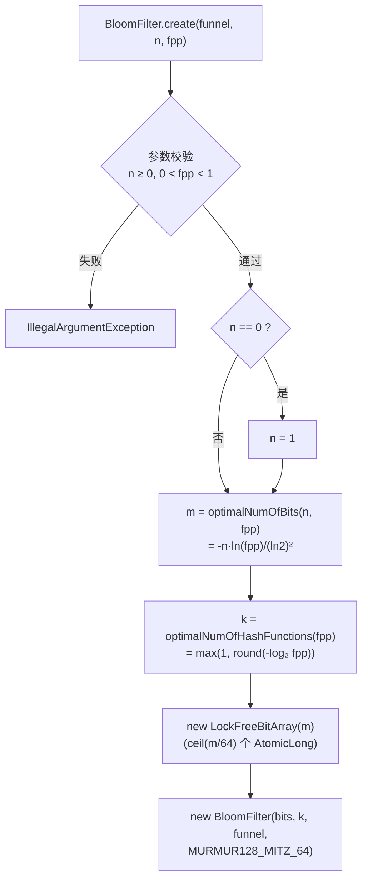

---

## 8. 工作流程详解

### 8.1 put 写入时序图

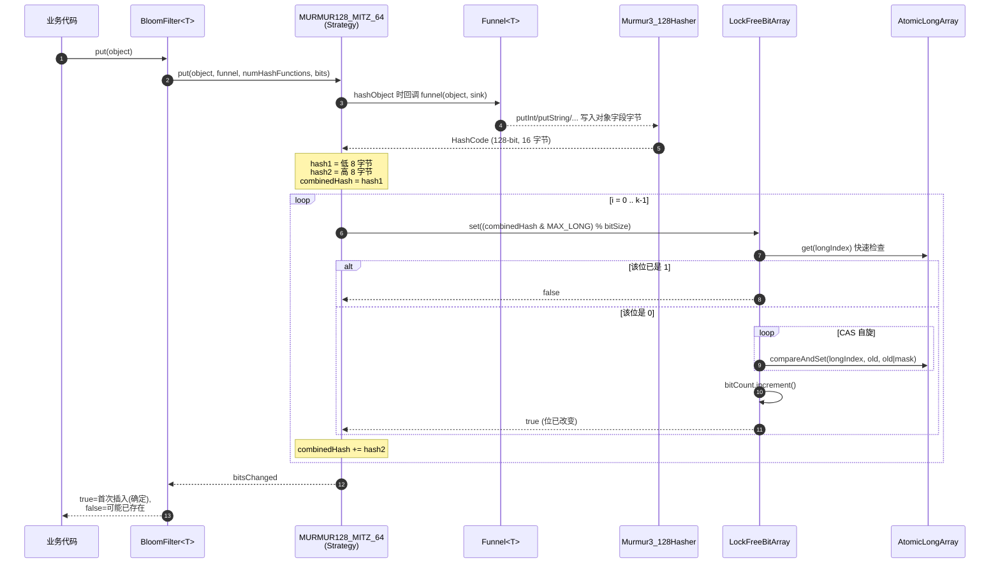

### 8.2 mightContain 查询时序图

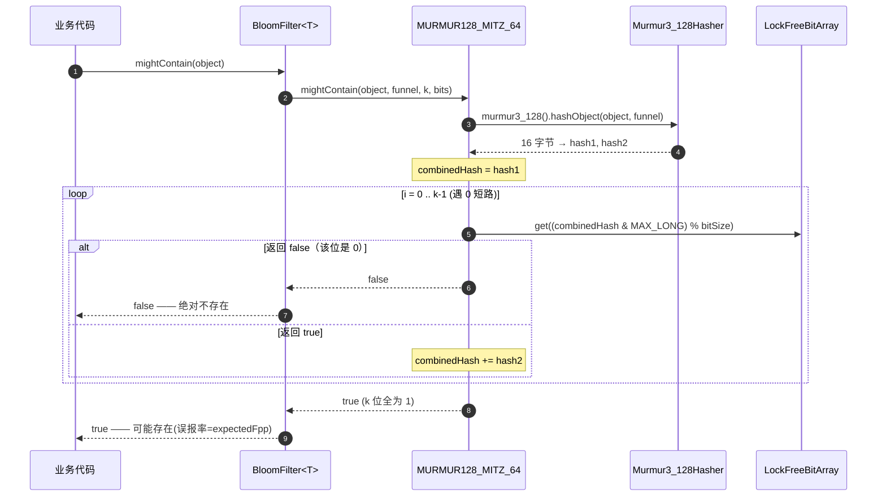

### 8.3 put 与 mightContain 的镜像对称

两个方法的核心循环**完全对称**（`BloomFilterStrategies.java:103-143`）：

| | put | mightContain |
|---|---|---|
| 位操作 | `bits.set(idx)` | `bits.get(idx)` |
| 返回语义 | 所有位都已是 1 → false；否则 true | 任一位是 0 → 立即 **false 短路**；全 1 → true |
| Javadoc 关系 | `put(t)` 的返回值恒等于此刻 `mightContain(t)` 的**相反值**（`BloomFilter.java:178`） | — |

短路设计让"确定不存在"的判断（布隆过滤器最有价值的输出）平均只需检查 `k/2` 个位左右。

---

## 9. 并发与线程安全设计

自 Guava 23.0 起 `BloomFilter` 线程安全且**完全无锁**（lock-free，类 Javadoc `:63-64`）。无锁的层次结构：

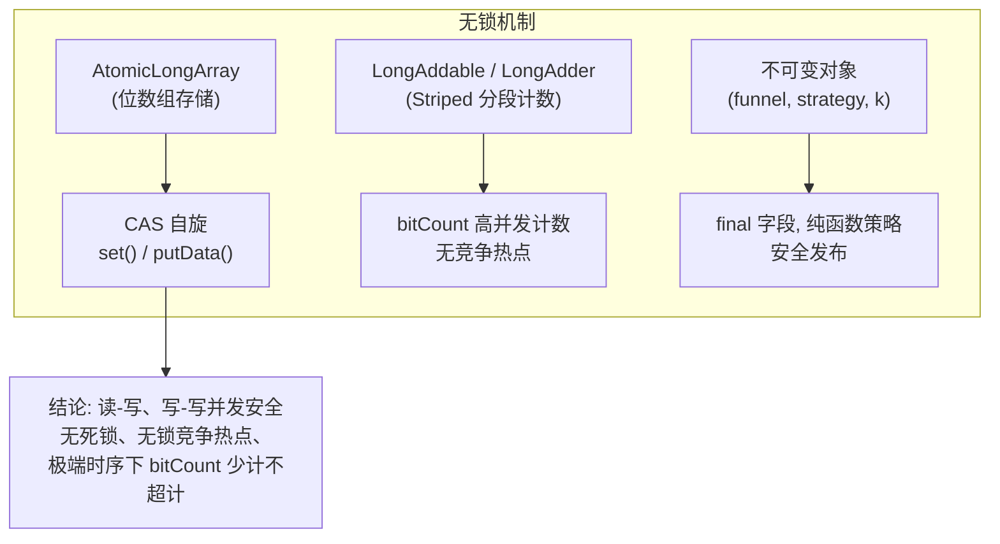

关键点：

1. **set() 用 CAS 而非 `synchronized`**：位级粒度（实际是 64 位 long 粒度）自旋，冲突窗口极小；同一 long 槽内不同位的并发写会伪冲突，但 OR 幂等保证正确性。
2. **bitCount 用 `LongAdder` 思想**：`LongAddables.create()`（`LongAddables.java:53`）在 JVM 上返回基于 `LongAdder` 的实现（分段累加，读时 sum），Android 上退化为 `AtomicLong`——避免所有写线程竞争同一个计数器缓存行。
3. **读操作 `get()` 无锁**：单次 `AtomicLongArray.get` + 位与，线性一致的单 word 读。
4. **弱一致性的边界**：`toPlainArray()` 的 Javadoc（`BloomFilterStrategies.java:215-220`）坦承并发拷贝时结果是"滚动快照"（rolling snapshot）；`putAll` 只保证"方法开始时对方已置的位，结束时一定在我这"。

---

## 10. 统计与估算功能

### 10.1 expectedFpp——当前实际误报率

```java
// BloomFilter.java:197-199
public double expectedFpp() {
  return Math.pow((double) bits.bitCount() / bitSize(), numHashFunctions);
}
```

直接用实测公式 `FPP = (已置位比例)^k`（假设 k 个索引独立均匀，即第 1.2 节公式 `(1-p₀)^k` 的实测版本）。插入超过预期数量时，该值会迅速恶化——这正是官方文档说的"sharp deterioration"。

### 10.2 approximateElementCount——估算已插入元素数

源码含完整数学注释（`BloomFilter.java:208-221`）：

```java
public long approximateElementCount() {
  long bitSize = bits.bitSize();
  long bitCount = bits.bitCount();
  /**
   * 每次插入期望使清零位减少一个 (numHashFunctions/bitSize) 比例因子。
   * 所以 n 次插入后，期望置位数 = bitSize * (1 - (1 - k/m)^n)。
   * 对 n 求解，并用 log1p 精确计算，得：
   */
  double fractionOfBitsSet = (double) bitCount / bitSize;
  return DoubleMath.roundToLong(
      -Math.log1p(-fractionOfBitsSet) * bitSize / numHashFunctions,
      RoundingMode.HALF_UP);
}
```

推导：置位比例 `x = 1 - (1 - k/m)^n`，解出

```
n = -ln(1 - x) · m / k
```

源码用 `Math.log1p(-x)`（即 `ln(1-x)` 的数值稳定形式）计算。**有效条件**：元素数不超过 `expectedInsertions`（此时位置重复率低，公式近似成立）。

---

## 11. 序列化设计

Guava 提供两条序列化路径：

### 11.1 Java 原生序列化（SerialForm）

```java
// BloomFilter.java:544-570
private Object writeReplace() {
  return new SerialForm<T>(this);    // 序列化代理模式
}
private void readObject(ObjectInputStream stream) throws InvalidObjectException {
  throw new InvalidObjectException("Use SerializedForm");  // 防止绕过代理
}

private static class SerialForm<T> implements Serializable {
  final long[] data;                 // 位数组（toPlainArray 拷出）
  final int numHashFunctions;
  final Funnel<? super T> funnel;
  final Strategy strategy;
  ...
}
```

**序列化代理模式（Serialization Proxy Pattern）**的好处：`BloomFilter` 自身不可变字段布局不直接进流，反序列化时由 `SerialForm.readResolve()` 重建，避免了 `final` 字段反序列化注入攻击与版本耦合。

### 11.2 紧凑二进制格式（writeTo / readFrom）

节省约 400 字节（Javadoc `:574-575`），格式如下（`:579-592` 注释）：

```
+--------------------+----------------------------------------------+
| 1 个有符号 byte     | strategy.ordinal()                            |
| 1 个无符号 byte     | numHashFunctions (构造时已校验 ≤ 255)         |
| 1 个大端 int        | 位数组中 long 的个数 dataLength                |
| dataLength 个大端   | 位数组原始数据 longs                          |
| long               |                                              |
+--------------------+----------------------------------------------+
```

**Funnel 不进流**——`readFrom(in, funnel)` 要求调用方传入与写入时行为完全一致的 funnel（Javadoc 用加粗 **Warning** 强调，`BloomFilter.java:598-600`）。

**兼容性承诺**（`:57-61`）：两种格式向后兼容；但新版本写出的流旧版本可能读不了。`Strategy.ordinal()` 的取值范围约定（`:103-108`）：非负值留给 `BloomFilterStrategies` 枚举，负值预留给未来可能有状态的自定义策略。

---

## 12. 过滤器合并：putAll

分布式场景常见需求：各节点各建一个过滤器，最后 OR 合并。前提条件（`isCompatible`，`BloomFilter.java:244-251`）：

1. 不是同一实例
2. `numHashFunctions` 相同
3. `bitSize()` 相同
4. `strategy` 相同（`equals`，枚举单例即同一实例）
5. `funnel` 相同（`equals`）

满足后执行 `bits.putAll(that.bits)`（`BloomFilterStrategies.java:259-268`），底层对每个 long 槽做 **CAS OR**（`putData`，`:274-291`），并把新增置位数 `Long.bitCount(new) - Long.bitCount(old)` 累加进 bitCount——注意这里和 `set()` 不同，一次 CAS 可能补上多个位，所以用差值而非 increment。

`toBloomFilter` Collector（`BloomFilter.java:329-372`）的并行合并 combiner 就是 `putAll`，因此 Stream 并行收集布隆过滤器是安全的（`CONCURRENT` 特性）。

**重要约束**：只有**互不相交**的元素集（如按用户 ID 分片）合并后语义才正确；同一元素写入两个过滤器再合并不会出错（OR 幂等），但 `approximateElementCount` 会失真。

---

## 13. 使用示例

```java
import com.google.common.hash.BloomFilter;
import com.google.common.hash.Funnels;

// 1. 定义 Funnel（推荐单元素枚举, 保证序列化与 equals 语义）
enum UserFunnel implements Funnel<Long> {
  INSTANCE;
  @Override
  public void funnel(Long userId, PrimitiveSink into) {
    into.putLong(userId);
  }
}

// 2. 创建：预期 100 万用户, 误报率 1%
BloomFilter<Long> registered =
    BloomFilter.create(UserFunnel.INSTANCE, 1_000_000, 0.01);
// 内部: m = -1e6 * ln(0.01) / ln²2 ≈ 9,585,059 位 (~1.15MB)
//       k = round(-log2(0.01)) = 7 个哈希索引

registered.put(10001L);                 // 写入
registered.mightContain(10001L);        // true  (刚插入, 必然 true)
registered.mightContain(99999L);        // false (确定不存在) 或 true (~1% 误报)

// 3. 监控指标
double fpp = registered.expectedFpp();          // 实时误报率
long count = registered.approximateElementCount(); // 估算已插入数

// 4. Stream API
BloomFilter<String> bf = users.stream()
    .collect(BloomFilter.toBloomFilter(Funnels.unencryptedChars(), 100_000));
```

---

## 14. 设计亮点与局限性总结

### 14.1 设计亮点

| # | 亮点 | 源码体现 |
|---|---|---|
| 1 | **一次哈希供 k 个索引**（Kirsch–Mitzenmacher 双重哈希） | 循环内只有 `+= hash2` 和一次取模（`BloomFilterStrategies.java:115-119`） |
| 2 | **无锁并发**（CAS + LongAdder），自 Guava 23.0 起线程安全 | `LockFreeBitArray.set()` 自旋、`bitCount` 分段计数 |
| 3 | **策略模式 + 枚举单例**，纯函数策略天然可序列化 | `BloomFilter.Strategy` 接口 + `BloomFilterStrategies` 枚举 |
| 4 | **参数自动最优化**，用户只给业务直觉参数 (n, p) | `optimalNumOfBits` / `optimalNumOfHashFunctions` |
| 5 | **O(1) 统计指标**（bitCount 增量维护），误报率与元素数实时可查 | `expectedFpp()` / `approximateElementCount()` |
| 6 | **双序列化方案**：代理模式的 Java 序列化 + 紧凑二进制格式 | `SerialForm` / `writeTo`/`readFrom` |
| 7 | **流式哈希骨架复用**：+7 字节缓冲技巧，大输入零拷贝直达 process | `AbstractStreamingHasher` |
| 8 | **分布式友好**：isCompatible 校验 + CAS OR 合并 + 并行 Collector | `putAll` / `toBloomFilter` |

### 14.2 局限性（Guava 有意不做的）

| 局限 | 说明 |
|---|---|
| **不支持删除** | 位数组只 OR 不清零；删除需要计数布隆过滤器（Counting BF）或布谷鸟过滤器 |
| **不支持扩容** | m 创建时固定；超出 expectedInsertions 后 FPP 急剧恶化，需重建 |
| **无远程/分布式能力** | 单机内存结构；Redis 场景需换 RedisBloom 等 |
| **误报不可消除** | mightContain 的 true 永远是"可能" |
| **`%` 取模而非位掩码** | 位数组不取 2 的幂以省内存，代价是 64 位除法取模（JIT 可部分优化） |
| **k 上限 255** | 紧凑序列化格式用 1 个无符号 byte 存 k（构造器校验，`BloomFilter.java:135`） |

### 14.3 一图总结全流程

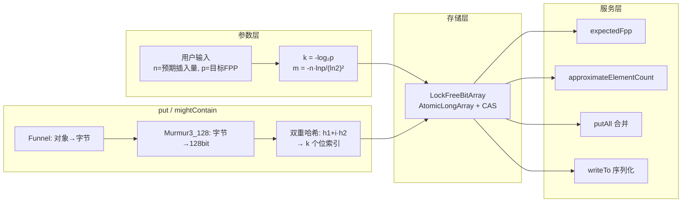

---

## 附录：源码文件索引

| 文件 | 关键行号 | 内容 |
|---|---|---|
| `guava/src/com/google/common/hash/BloomFilter.java` | 73 / 79 / 197 / 208 / 426 / 520 / 536 / 552 / 579 / 606 | 主类、Strategy 接口、统计、工厂、参数公式、双序列化 |
| `guava/src/com/google/common/hash/BloomFilterStrategies.java` | 41 / 47 / 101 / 162 / 189 / 274 | 两种策略、LockFreeBitArray、CAS set/putData |
| `guava/src/com/google/common/hash/Murmur3_128HashFunction.java` | 45 / 87 / 102 / 110 / 124 / 169 / 191 / 200 | Murmur3 x64 128 全部实现 |
| `guava/src/com/google/common/hash/AbstractStreamingHasher.java` | 32 / 62 / 112 / 188 | 流式哈希缓冲骨架 |
| `guava/src/com/google/common/hash/Funnel.java` | 48 | 漏斗接口 |
| `guava/src/com/google/common/hash/Hashing.java` | 98 | `GOOD_FAST_HASH_SEED`（murmur3_128 的 seed 为 0） |
