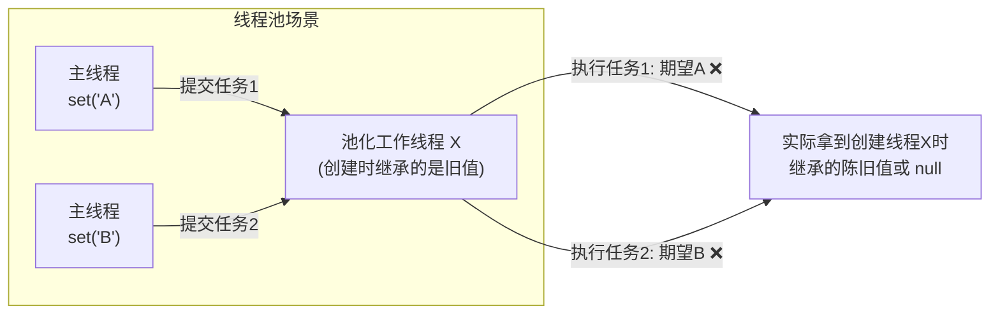
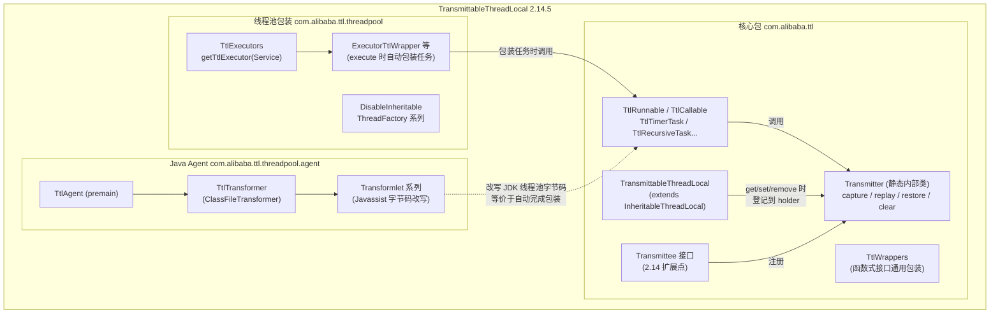
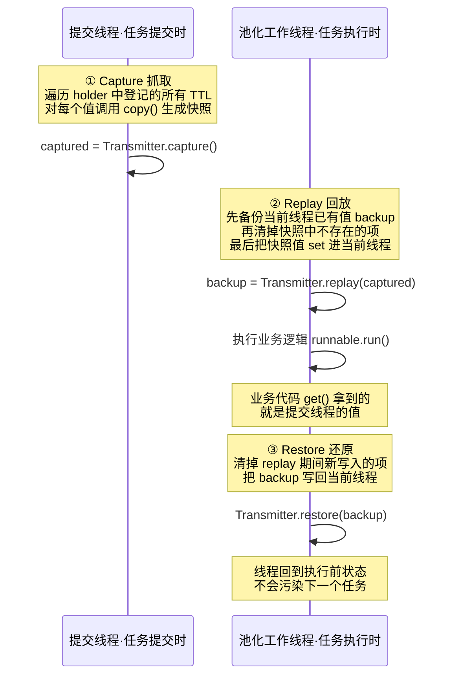
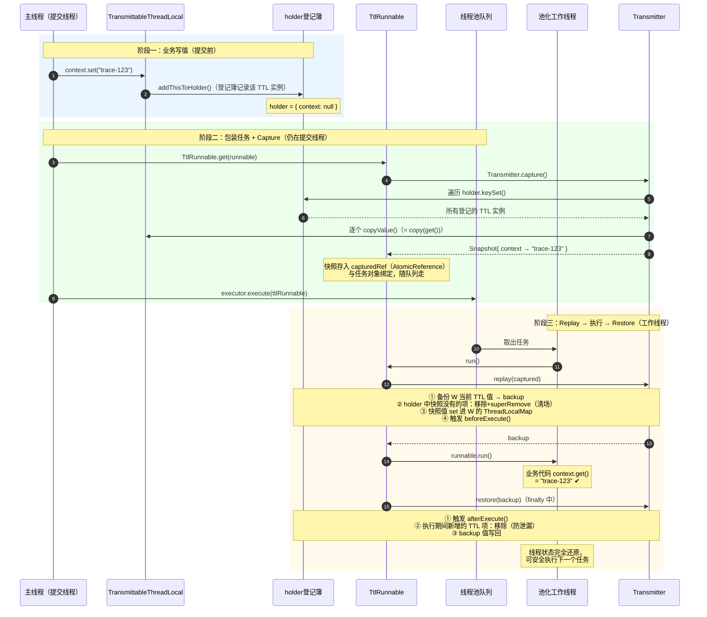
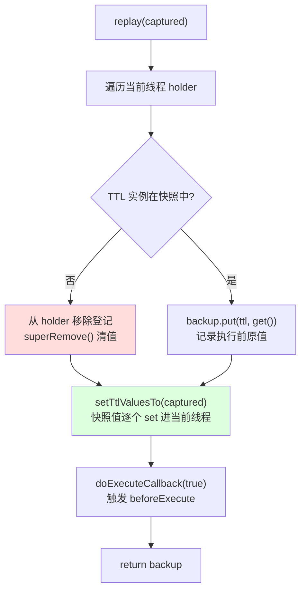
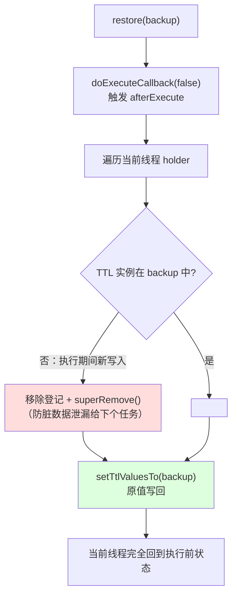
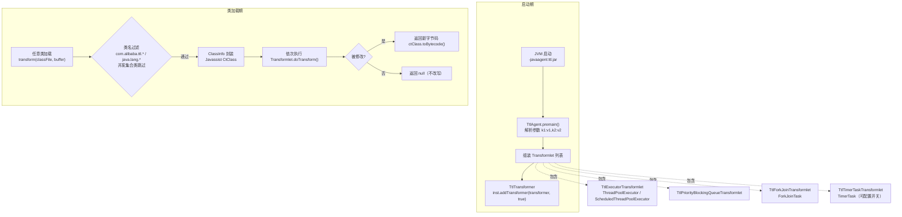
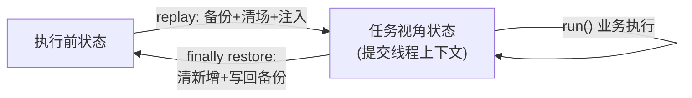

# TransmittableThreadLocal (TTL) 源码深度解析

> 基于源码版本：**transmittable-thread-local 2.14.5**（阿里巴巴开源）
> 源码位置：`src/main/java/com/alibaba/ttl/`

---

## 目录

1. [简介](#1-简介)
2. [功能特性](#2-功能特性)
3. [使用示例](#3-使用示例)
4. [问题背景：为什么需要 TTL](#4-问题背景为什么需要-ttl)
5. [整体架构](#5-整体架构)
6. [核心实现原理：CRR 三部曲](#6-核心实现原理crr-三部曲)
7. [关键源码逐层剖析](#7-关键源码逐层剖析)
8. [完整工作流程（时序图）](#8-完整工作流程时序图)
9. [Java Agent 字节码增强原理](#9-java-agent-字节码增强原理)
10. [设计精妙之处](#10-设计精妙之处)

---

## 1. 简介

**TransmittableThreadLocal（TTL）** 是阿里巴巴开源的一个高性能、低侵入的 Java 类库，用于解决 **ThreadLocal 在线程池场景下上下文传递失效** 的问题。

在分布式链路追踪、日志脱敏、全链路压测、用户会话管理等场景中，我们经常需要把主线程的上下文数据（如 traceId、用户信息、灰度标记）传递给子线程。JDK 自带的 `InheritableThreadLocal` 只在 **线程创建时** 拷贝一次父线程数据，而线程池中的线程是 **预先创建、反复复用** 的，任务提交时的数据根本传不过去。TTL 的目标就是一句话：

> **在使用线程池等会池化复用线程的组件时，将「任务提交时」的 ThreadLocal 值传递到「任务执行时」。**

Maven 坐标：

```xml
<dependency>
    <groupId>com.alibaba</groupId>
    <artifactId>transmittable-thread-local</artifactId>
    <version>2.14.5</version>
</dependency>
```

---

## 2. 功能特性

| 特性 | 说明 |
|---|---|
| **池化线程上下文传递** | 核心能力：`ThreadPoolExecutor`、`ScheduledThreadPoolExecutor`、`ForkJoinPool`、`Timer` 等池化组件中正确传递 ThreadLocal 值 |
| **三种接入方式** | ① 编码式装饰（`TtlRunnable`/`TtlCallable`）② 线程池包装（`TtlExecutors`）③ Java Agent 字节码增强（零代码侵入） |
| **值拷贝可定制** | 通过覆写 `copy()` 决定传递的是「引用」还是「深拷贝」，避免多线程共享可变对象引发的数据错乱 |
| **生命周期回调** | `beforeExecute()` / `afterExecute()` 钩子，可在任务执行前后做资源准备与清理 |
| **存量 ThreadLocal 增强** | `Transmitter.registerThreadLocal()` 让无法改造的第三方 `ThreadLocal` 也获得传递能力 |
| **框架集成 API** | `Transmitter.capture()/replay()/restore()`（CRR）供中间件/框架集成 |
| **Transmittee 扩展点** | 2.14.0 起提供 `Transmittee` 接口，可注册自定义的 CRR 实现，扩展其他 ThreadLocal 变种 |
| **ForkJoin 支持** | `TtlRecursiveTask` / `TtlRecursiveAction`，以及 Agent 对 `ForkJoinTask` 的增强 |
| **防内存泄漏设计** | holder 使用 `WeakHashMap`；`releaseTtlValueReferenceAfterRun` 释放快照引用；`DisableInheritableThreadFactory` 规避线程池继承泄漏 |
| **Ignore-Null-Value 语义** | 默认 `null` 值不参与传递、`set(null)` 等价于 `remove()`，更安全（可通过构造器关闭） |
| **幂等/防重复包装** | `TtlRunnable.get()` 对已包装对象幂等处理，重复包装抛出 `IllegalStateException` 提示 bug |

---

## 3. 使用示例

### 3.1 基本用法：TtlRunnable 装饰任务

```java
TransmittableThreadLocal<String> context = new TransmittableThreadLocal<>();
context.set("value-set-in-parent-thread");

ExecutorService executor = Executors.newFixedThreadPool(3);

// 关键：用 TtlRunnable.get() 包装 Runnable
Runnable task = TtlRunnable.get(() -> {
    // 在池化线程中，也能拿到 "value-set-in-parent-thread"
    System.out.println(context.get());
});

executor.submit(task);
```

`Callable` 同理使用 `TtlCallable.get(callable)`。

### 3.2 装饰线程池：TtlExecutors

```java
ExecutorService ttlExecutor = TtlExecutors.getTtlExecutorService(executorService);

// 提交裸任务即可，无需手工包装
ttlExecutor.submit(() -> System.out.println(context.get()));
```

### 3.3 定制拷贝行为（传递副本而非引用）

```java
// 场景：值是可变对象（如 SimpleDateFormat、Date），多线程并发改会互相干扰
TransmittableThreadLocal<Date> dateTl = new TransmittableThreadLocal<Date>() {
    @Override
    protected Date copy(Date parentValue) {
        // 每次传递时拷贝一份新对象，任务内修改不会影响原线程
        return parentValue == null ? null : new Date(parentValue.getTime());
    }
};
```

JDK 12+ 风格的工厂方法（2.12.2+）：

```java
TransmittableThreadLocal<Context> ctx = TransmittableThreadLocal.withInitialAndCopier(
        Context::createDefault,
        parent -> parent.deepCopy());   // childValue 与 copy 共用同一 Copier
```

### 3.4 Java Agent 方式（推荐，业务零侵入）

```bash
# 启动参数挂载 Agent，业务代码中直接 new ThreadPoolExecutor，无需任何包装
java -javaagent:/path/to/transmittable-thread-local-2.14.5.jar \
     # 可选配置：关闭线程池的 inheritable、开启日志
     # =ttl.agent.disable.inheritable.for.thread.pool:true,ttl.agent.logger:STDOUT \
     -jar your-app.jar
```

### 3.5 框架集成：Transmitter CRR API

```java
// 线程 A（任务提交线程）
Object captured = Transmitter.capture();

// 线程 B（任务执行线程）
String result = Transmitter.runSupplierWithCaptured(captured, () -> {
    // 此代码块中看到的是线程 A 的所有 TTL 值
    return doBizLogic();
}); // 内部自动 replay + restore
```

### 3.6 增强存量 ThreadLocal

```java
// 第三方库里的 private static ThreadLocal，通过反射拿到实例后注册
Field field = ThirdPartyClass.class.getDeclaredField("THE_THREAD_LOCAL");
field.setAccessible(true);
ThreadLocal<String> tl = (ThreadLocal<String>) field.get(null);

Transmitter.registerThreadLocalWithShadowCopier(tl);  // 之后其值即可随 TTL 传递
```

### 3.7 生命周期回调

```java
TransmittableThreadLocal<Connection> connTl = new TransmittableThreadLocal<>() {
    @Override protected void beforeExecute() { /* 任务开始前：如绑定资源 */ }
    @Override protected void afterExecute()  { /* 任务结束后：如清理资源 */ }
};
```

---

## 4. 问题背景：为什么需要 TTL

### 4.1 ThreadLocal 的隔离性

`ThreadLocal` 的值存在每个线程自己的 `Thread.threadLocals`（ThreadLocalMap）中，天然线程隔离——所以跨线程传不了值。

### 4.2 InheritableThreadLocal 只在"诞生"时继承

`InheritableThreadLocal`（ITL）借助 `Thread` 构造函数中的这段逻辑实现继承：

```java
// java.lang.Thread 构造方法（JDK 源码）
if (inheritThreadLocals && parent.inheritableThreadLocals != null)
    this.inheritableThreadLocals =
        ThreadLocal.createInheritedMap(parent.inheritableThreadLocals);
```

即：**只有在 `new Thread()` 创建子线程的那一刻**，才会把父线程的 ITL 值拷贝（`childValue()`）一份给子线程。

### 4.3 线程池：致命场景



线程池的工作线程在**应用启动初期**就已创建完毕，此后的任何任务提交都不会触发继承逻辑。于是：

- 任务 1 期望读到 `A`，任务 2 期望读到 `B`，但线程 X 只持有它**出生时**（可能为空）的快照；
- 即使勉强继承了，线程复用还会导致**上一个任务写入的脏数据**串扰下一个任务。

**结论：继承（inheritable）模型的语义是"出生时快照"，而池化场景需要的是"提交时快照 + 执行时回放 + 执行后还原"。TTL 正是围绕这个语义重建了整套机制。**

---

## 5. 整体架构

### 5.1 模块划分



### 5.2 三种接入方式的统一本质

| 接入方式 | 谁负责 capture | 谁负责 replay/restore |
|---|---|---|
| `TtlRunnable.get()` 手工包装 | 包装对象的**构造函数**（提交线程执行） | 包装对象的 `run()`（工作线程执行） |
| `TtlExecutors` 包装线程池 | `execute()` 内部调用 `TtlRunnable.get()`，仍在提交线程 | 同上 |
| Java Agent | 改写 `ThreadPoolExecutor.execute()` 等方法字节码，在方法体开头插入 `Utils.doAutoWrap($1)` | 同上（自动包装）；ForkJoin 则改写 `doExec()` |

三种方式殊途同归：**全部最终落到 CRR（Capture-Replay-Restore）操作上。**

---

## 6. 核心实现原理：CRR 三部曲

### 6.1 核心思想

TTL 把"跨线程传值"分解为在**正确时间点**执行的三个动作：



三个动作的关键点：

| 操作 | 执行线程 | 时机 | 作用 |
|---|---|---|---|
| **Capture** | 任务提交线程 | `TtlRunnable` 构造时（即任务被创建/提交时） | 把该线程**当前**所有 TTL 值固化为不可变快照，随任务对象一起"携带"到队列中 |
| **Replay** | 任务执行线程 | `run()` 方法开头 | 备份执行线程当前值 → 以快照覆盖之，使业务代码看到提交线程的上下文 |
| **Restore** | 任务执行线程 | `run()` 的 `finally` | 用备份还原执行线程，保证池化线程复用时不残留本任务的上下文 |

> **为什么快照在"提交时"而非"执行时"抓取？** 因为语义就是"传递提交时刻的上下文"；且执行时提交线程可能早已改值，再抓就错了。

### 6.2 CRR 与 InheritableThreadLocal 继承的对比

| 维度 | InheritableThreadLocal | TTL (CRR) |
|---|---|---|
| 拷贝时机 | 线程 `new Thread()` 时一次性 | 任务**每次提交**时 |
| 拷贝入口 | `childValue(parentValue)` | `copy(parentValue)` |
| 池化线程适用 | ❌ 完全失效 | ✅ 每次任务独立 |
| 执行后还原 | 无（写入即污染） | ✅ restore 精确还原 |
| 传递粒度 | 线程级 | 任务级 |

---

## 7. 关键源码逐层剖析

### 7.1 TransmittableThreadLocal：值 + 登记簿

类声明（`TransmittableThreadLocal.java:69`）：

```java
public class TransmittableThreadLocal<T> extends InheritableThreadLocal<T> implements TtlCopier<T>
```

继承 `InheritableThreadLocal` 有两个原因：
1. 复用 `ThreadLocalMap` 的存取能力（TTL 不重写存储结构）；
2. 兼容"非池化、直接 new Thread"场景的继承语义（TTL 首先是一个 ITL）。

**最关键的设计：holder 登记簿**（`TransmittableThreadLocal.java:314-331`）：

```java
private static final InheritableThreadLocal<WeakHashMap<TransmittableThreadLocal<Object>, ?>> holder =
        new InheritableThreadLocal<WeakHashMap<TransmittableThreadLocal<Object>, ?>>() {
            @Override
            protected WeakHashMap<TransmittableThreadLocal<Object>, ?> initialValue() {
                return new WeakHashMap<>();
            }
            @Override
            protected WeakHashMap<TransmittableThreadLocal<Object>, ?> childValue(...) {
                return new WeakHashMap<>(parentValue);  // 新线程复制一份登记簿
            }
        };
```

这是一个"**以 ThreadLocal 实例为 key 的、线程维度的登记簿**"。每个线程都有一份 holder，记录"**本线程当前有哪些 TTL 变量持有值**"。TTL 重写了三个入口方法，在读写值的同时同步维护登记簿：

```java
public final T get() {
    T value = super.get();
    if (disableIgnoreNullValueSemantics || value != null) addThisToHolder();  // 读也登记！
    return value;
}

public final void set(T value) {
    if (!disableIgnoreNullValueSemantics && value == null) {
        remove();                    // set(null) 等价 remove（Ignore-Null-Value 语义）
    } else {
        super.set(value);
        addThisToHolder();           // 写入即登记
    }
}

public final void remove() {
    removeThisFromHolder();          // 移除值同时移除登记
    super.remove();
}
```

**为什么 `get()` 也要登记？** 因为存在这样的用法：父线程 `set` 之后 `remove` 了，但子线程通过 `get()` 触发 `initialValue()` 拿到了值——此时这个 TTL 在本线程"有值"这一事实也必须被 holder 知晓，否则后续 capture 会漏掉它。

**为什么用 `WeakHashMap` 且 value 恒为 null？** 源码注释写得很清楚：WeakHashMap 在这里**被当作 Set 用**（value 永远是 null，仅用 key 集合）。弱引用的 key 保证：当业务代码中某个 TTL 实例不再被强引用（例如是匿名类/局部实例）时，登记簿不会阻止它被 GC，**从机制上杜绝内存泄漏**。

> **capture 的"全量发现"正是靠 holder 实现的**：不需要业务声明要传哪些变量，凡是本线程用过（get/set 过）的 TTL 全部自动在册。

### 7.2 TtlRunnable：快照的携带者

`TtlRunnable.java:37-64`，全类最核心的 30 行：

```java
public final class TtlRunnable implements Runnable, TtlWrapper<Runnable>, TtlEnhanced, TtlAttachments {
    private final AtomicReference<Object> capturedRef;   // 快照容器
    private final Runnable runnable;
    private final boolean releaseTtlValueReferenceAfterRun;

    private TtlRunnable(Runnable runnable, boolean releaseTtlValueReferenceAfterRun) {
        this.capturedRef = new AtomicReference<>(capture());   // ★ 构造时抓快照（提交线程）
        ...
    }

    @Override
    public void run() {
        final Object captured = capturedRef.get();
        if (captured == null || releaseTtlValueReferenceAfterRun
                && !capturedRef.compareAndSet(captured, null)) {
            throw new IllegalStateException("TTL value reference is released after run!");
        }

        final Object backup = replay(captured);   // ★ 回放（工作线程）
        try {
            runnable.run();                       //    业务逻辑
        } finally {
            restore(backup);                      // ★ 还原（工作线程）
        }
    }
}
```

细节解读：

- **capture 发生在构造函数**：`TtlRunnable.get(task)` 在提交线程被调用，快照从此刻固化。之后无论提交线程怎么改 TTL，都不影响已提交的任务。
- **`AtomicReference` + `releaseTtlValueReferenceAfterRun`**：若任务可能被执行多次（如 `scheduleAtFixedRate` 周期任务），开启此选项后首次执行完即把快照置 null，重复执行抛异常——快照本身持有值的强引用，及时释放可避免内存泄漏（周期任务默认不开启，以支持每次执行用同一份快照）。
- **`finally` 保证 restore 必然执行**：业务代码抛异常也不会污染池化线程。
- **`TtlEnhanced` 标记接口 + 幂等检查**：`get()` 时发现入参已实现 `TtlEnhanced` 说明被包装过，默认抛 `IllegalStateException`（重复包装几乎必是 bug），可选幂等模式直接返回原对象。
- **`equals/hashCode` 委托给被包装对象**：保证 TTL 包装透明于 `remove(Runnable)`、`contains` 等队列语义。

`TtlCallable.call()` 的结构完全相同（`TtlCallable.java:56-69`），此处不再赘述。

### 7.3 Transmitter：CRR 的调度中枢

`Transmitter` 是 `TransmittableThreadLocal` 的静态内部类，是面向框架集成的核心 API。

#### 7.3.1 2.14 架构：Transmittee 注册表

2.14.0 起，Transmitter 内部被重构为"**可插拔的 Transmittee 注册表**"模式：

```java
public interface Transmittee<C, B> {
    C capture();
    B replay(C captured);
    B clear();
    void restore(B backup);
}

private static final Set<Transmittee<Object, Object>> transmitteeSet = new CopyOnWriteArraySet<>();

static {
    registerTransmittee(ttlTransmittee);            // TTL 自身的传递逻辑
    registerTransmittee(threadLocalTransmittee);    // 注册的存量 ThreadLocal 的传递逻辑
}
```

顶层 CRR 方法只是把操作**扇出到所有已注册 Transmittee**，并汇总为 `Snapshot`：

```java
public static Object capture() {
    final HashMap<Transmittee<Object, Object>, Object> transmittee2Value = ...;
    for (Transmittee<Object, Object> transmittee : transmitteeSet) {
        try {
            transmittee2Value.put(transmittee, transmittee.capture());  // 异常仅告警不中断
        } catch (Throwable t) { ... }
    }
    return new Snapshot(transmittee2Value);
}
```

`replay`/`restore`/`clear` 同构。**任何第三方 ThreadLocal 变种（如 FastThreadLocal）都可以通过实现 Transmittee 并注册，直接搭上 TTL 的整套传递链路**——这是 2.14 最重要的架构升级。

#### 7.3.2 ttlTransmittee：TTL 值的 CRR 实现

**Capture**（`TransmittableThreadLocal.java:724-730`）：

```java
public HashMap<TransmittableThreadLocal<Object>, Object> capture() {
    final HashMap<TransmittableThreadLocal<Object>, Object> ttl2Value = newHashMap(holder.get().size());
    for (TransmittableThreadLocal<Object> threadLocal : holder.get().keySet()) {
        ttl2Value.put(threadLocal, threadLocal.copyValue());   // copyValue = copy(get())
    }
    return ttl2Value;
}
```

遍历本线程 holder 中所有 TTL 实例，对每个值调用 `copy()`（默认浅拷贝返回原引用，可覆写为深拷贝），生成 `TTL实例 → 值` 的快照 Map。

**Replay**（`TransmittableThreadLocal.java:734-758`）——三个步骤缺一不可：

```java
public HashMap<TransmittableThreadLocal<Object>, Object> replay(HashMap<...> captured) {
    final HashMap<TransmittableThreadLocal<Object>, Object> backup = newHashMap(holder.get().size());

    for (final Iterator<...> iterator = holder.get().keySet().iterator(); iterator.hasNext(); ) {
        TransmittableThreadLocal<Object> threadLocal = iterator.next();
        backup.put(threadLocal, threadLocal.get());          // ① 备份当前线程所有值

        if (!captured.containsKey(threadLocal)) {            // ② 快照里没有的 → 清掉
            iterator.remove();                               //    从 holder 登记簿移除
            threadLocal.superRemove();                       //    从 ThreadLocalMap 移除
        }
    }

    setTtlValuesTo(captured);   // ③ 快照值逐个 set 进当前线程
    doExecuteCallback(true);    // ④ 触发所有 TTL 的 beforeExecute() 回调
    return backup;
}
```

- 步骤② 是容易被忽略的精髓：**replay 是"整组替换"而非"逐项覆盖"**。若只覆盖快照里有的项，上一个任务残留在执行线程上的 TTL 项（快照中没有）就会串扰本次任务。必须先"清场"。
- `superRemove()` 调用 `super.remove()`（即 ITL 的 remove）而不是重写后的 `remove()`，避免重写版本再次操作 holder 造成重复修改。

**Restore**（`TransmittableThreadLocal.java:767-784`）——与 replay 严格镜像：

```java
public void restore(HashMap<...> backup) {
    doExecuteCallback(false);    // ① 触发 afterExecute() 回调

    for (final Iterator<...> iterator = holder.get().keySet().iterator(); iterator.hasNext(); ) {
        TransmittableThreadLocal<Object> threadLocal = iterator.next();
        if (!backup.containsKey(threadLocal)) {   // ② 执行期间新出现的 TTL 项 → 清掉
            iterator.remove();
            threadLocal.superRemove();
        }
    }
    setTtlValuesTo(backup);      // ③ 备份值写回
}
```

步骤② 同样关键：业务代码在任务执行期间可能 `new` 了新的 TTL 并 `set` 了值，这些项在 backup（执行前的状态）中不存在，**必须清除**，否则泄漏给同一线程执行的下一个任务。

#### 7.3.3 threadLocalTransmittee：存量 ThreadLocal 的增强

对通过 `registerThreadLocal(threadLocal, copier)` 注册的普通 `ThreadLocal`：

- **capture**：遍历全局 `threadLocalHolder`（注意这是 `volatile WeakHashMap` + 锁复制的全局表，非线程维度），对每个注册项取 `threadLocal.get()` 并用注册时提供的 `copier` 拷贝；
- **replay**：先备份执行线程当前值，再 set 捕获值；若捕获值为 `threadLocalClearMark` 哨兵对象则执行 `remove()`；
- **clear**：对每个注册项生成哨兵标记再走 replay，语义等价于"全部清空"；
- **restore**：直接用备份 set 回。

注册 API 采用 **copy-on-write 更新全局 WeakHashMap**（`threadLocalHolder = newHolder`），读侧无锁，弱引用防泄漏——与 TTL 实例的 holder 是两套独立机制（前者全局注册表，后者线程级登记簿）。

#### 7.3.4 快捷工具方法

```java
public static <R> R runSupplierWithCaptured(Object captured, Supplier<R> bizLogic) {
    final Object backup = replay(captured);
    try { return bizLogic.get(); }
    finally { restore(backup); }
}
```

以及 `runCallableWithCaptured`（抛检查异常版本）、`runSupplierWithClear` / `runCallableWithClear`（先清空本线程上下文再执行，用于"纯净"执行场景，如异步线程池默认上下文）。

### 7.4 copy() 与 childValue()：两套拷贝语义

| 方法 | 触发场景 | 默认行为 |
|---|---|---|
| `childValue(T parentValue)` | ITL 继承：`new Thread()` 时（JDK 回调） | 返回 `parentValue` 引用 |
| `copy(T parentValue)` | TTL 传递：capture 快照时 | 返回 `parentValue` 引用 |

两者默认都是**浅拷贝（传引用）**。若值不可变（String、Long、不可变 POJO）直接引用传递零开销；若值可变且任务会修改，务必覆写 `copy()` 做深拷贝，否则会出现任务修改影响提交线程的并发问题。可用 `withInitialAndCopier` 统一定制。

### 7.5 TtlExecutors：线程池包装层

`TtlExecutors.getTtlExecutorService(executor)` 返回 `ExecutorServiceTtlWrapper`，其 `submit`/`execute` 系列方法全部形如：

```java
// ExecutorTtlWrapper.java:29-31
public void execute(Runnable command) {
    executor.execute(TtlRunnable.get(command, false, idempotent));  // 提交线程内完成包装+capture
}
```

即：**把"记得包装任务"的职责从业务代码挪到线程池入口**，且 capture 天然发生在正确的线程（提交线程）和正确的时间点（提交时）。

---

## 8. 完整工作流程（时序图）

以「主线程提交任务到线程池，工作线程执行」为例，覆盖三种接入方式共用的底层链路：



**replay 内部的"整组替换"语义**展开为流程图：



**restore 的镜像流程**：



---

## 9. Java Agent 字节码增强原理

### 9.1 为什么需要 Agent

编码式接入（TtlRunnable/TtlExecutors）要求改造所有任务提交点，在大型项目（尤其是有大量遗留代码/第三方组件提交任务时）不现实。Agent 方案在 **JVM 类加载期直接改写线程池相关类的字节码**，把包装逻辑注入到 JDK 类内部，业务与框架零改动。

### 9.2 增强链路



### 9.3 TtlExecutorTransformlet：改写线程池提交方法

对 `java.util.concurrent.ThreadPoolExecutor` 与 `ScheduledThreadPoolExecutor` 的**所有 public 非 static 且有参数的方法**（如 `execute`、`submit`、`schedule`...），在方法体开头插入：

```java
// 参数类型是 Runnable 时（$1 是第一个参数的 Javassist 语法）
$1 = com.alibaba.ttl.threadpool.agent.internal.transformlet.impl.Utils.doAutoWrap($1);
// 参数类型是 Callable 时
$1 = com.alibaba.ttl.threadpool.agent.internal.transformlet.impl.Utils.doAutoWrap($1);
```

`Utils.doAutoWrap` 的实现（`Utils.java:101-110`）：

```java
public static Runnable doAutoWrap(final Runnable runnable) {
    if (runnable == null) return null;
    final TtlRunnable ret = TtlRunnable.get(runnable, false, true);  // 幂等模式
    if (ret != runnable) setAutoWrapperAttachment(ret);   // 打上"自动包装"标记
    return ret;
}
```

效果上，**用户提交的裸 Runnable 在进入线程池的瞬间就被自动包成 TtlRunnable**，等价于用户自己调用了 `TtlExecutors.getTtlExecutor(...)`。

三个精巧的配套处理：

1. **`remove(Runnable)` 特判**（issue #547）：用户拿着裸 Runnable 调 `pool.remove(task)` 时，也要先包装再比较，否则包装后的对象 `equals` 不上（虽然 `TtlRunnable.equals` 委托给了原对象，但 `ScheduledFutureTask` 内部比较类名等，需绕开——对 `ScheduledFutureTask` 类型直接原样返回）。
2. **beforeExecute/afterExecute 解包**：Agent 还会增强 `ThreadPoolExecutor` 的**业务子类**中覆写的 `beforeExecute(Thread, Runnable)` / `afterExecute(Runnable, Throwable)`，在开头插入 `Utils.doUnwrapIfIsAutoWrapper($2)`——若 Runnable 是 Agent 自动包装的（通过 `TtlAttachments.KEY_IS_AUTO_WRAPPER` 附件标记识别），先解包回原始对象，**保证业务子类看到的 Runnable 与用户提交的原生对象一致**，不破坏既有逻辑。
3. **disable.inheritable 选项**：可选地改写 `ThreadPoolExecutor` 构造器，把 `ThreadFactory` 参数替换为 `DisableInheritableThreadFactory` 包装——池化线程本就不该有继承语义，关闭后可规避「线程池工作线程创建瞬间继承大量 ITL 值并长期持有」的内存泄漏风险。

### 9.4 TtlForkJoinTransformlet：改写 ForkJoinTask

ForkJoin 的任务在 worker 间递归提交（fork），无法用"提交入口包装"的方式覆盖，因此 Agent 采取了完全不同的策略——**直接增强 `java.util.concurrent.ForkJoinTask` 类本身**：

1. 给 `ForkJoinTask` 添加字段：

```java
private final Object captured$field$added$by$ttl;
// 初始化为 Utils.doCaptureWhenNotTtlEnhanced(this)
```

   即每个任务对象**构造时**抓一份快照（已是 TTL 增强类如 `TtlRecursiveTask` 的返回 null，避免重复捕获）。

2. 用 Javassist 改写 `doExec()` 方法（改名旧方法 + 新方法包 try/finally，见 `Utils.doTryFinallyForMethod`）：

```java
public final boolean doExec() {
    if (this instanceof TtlEnhanced) return original$doExec$method$renamed$by$ttl($$);  // 已增强，直接执行
    Object backup = Transmitter.replay(captured$field$added$by$ttl);   // 回放快照
    try {
        return original$doExec$method$renamed$by$ttl($$);
    } finally {
        Transmitter.restore(backup);                                    // 还原
    }
}
```

思路与 `TtlRunnable.run()` 完全一致，只是注入点从"任务包装类"变成了"任务基类字节码"。

### 9.5 TtlTransformer 的防御性过滤

`TtlTransformer.transform()` 中写死了一批**永不改写**的类：

- `com.alibaba.ttl.**`、`java.lang.**`（防自增强死循环 / `ClassCircularityError`）；
- `ConcurrentHashMap`、`CopyOnWriteArrayList` 等 JDK 并发集合及其内部类（issue #399 的 `ClassCircularityError` 规避——TTL 自身代码用了这些集合，若增强它们会引发类加载环形依赖）；
- Lambda（`classFile == null`，由 `LambdaMetafactory` 动态生成，无独立 class 文件，**这也是 Agent 方式覆盖不到纯 lambda 提交、需要在提交点拦截的原因之一**——实际上 `execute(Runnable)` 传入的 lambda 会作为参数进入被增强的方法，所以仍能覆盖）。

### 9.6 Boot Classpath

Agent jar 通过 manifest 的 `Boot-Class-Path` 属性自动追加到启动类加载器路径——因为被增强的 `java.util.concurrent.*` 类由 **Bootstrap ClassLoader** 加载，增强代码里调用的 `TtlRunnable`、`Transmitter` 等类必须对 Bootstrap 可见，否则抛 `NoClassDefFoundError`。

---

## 10. 设计精妙之处

### 10.1 快照随任务走（任务级传递粒度）

数据不依附线程而**依附任务对象**：`capturedRef` 是 `TtlRunnable` 的字段，快照的生命周期 = 任务对象的生命周期。同一工作线程先后执行任务 A、B，各自携带各自快照，天然互不干扰——这是与"继承模型"的本质区别。

### 10.2 holder：零声明自动发现

不需要业务枚举"要传哪些上下文"，`get/set` 的副作用自动完成登记，capture 全量遍历。代价是每次 `get()` 都多一次 `WeakHashMap.containsKey` 检查（已登记则跳过 put），换取极强的易用性。

### 10.3 backup + 整组替换 + finally restore：池化线程的状态安全

三重保障让被复用的线程永远"看起来"像是刚出生的干净线程：



### 10.4 弱引用防泄漏的多层设计

| 位置 | 机制 |
|---|---|
| 线程级 holder | `WeakHashMap`，TTL 实例无强引用时登记自动消失 |
| 全局 threadLocalHolder | 同样 `WeakHashMap` + copy-on-write |
| 任务快照 | `releaseTtlValueReferenceAfterRun` 用 CAS 释放 |
| 池化线程 | `DisableInheritableThreadFactory` / Agent 选项关闭继承，避免陈旧 ITL 值长期驻留 |

### 10.5 透明性

- `TtlRunnable.equals/hashCode/toString` 全部委托内部对象——对线程池队列的 `remove`、`contains`、监控 toString 透明；
- Agent 模式在 `beforeExecute/afterExecute` 主动解包，对业务覆写的钩子透明；
- `TtlUnwrap` / `unwrap()` 支持任何场景还原原始对象。

### 10.6 健壮性

- Transmitter 对每个 Transmittee 的 CRR 调用都包 try-catch，**单个扩展的异常不影响整体传递**（仅告警日志）；
- `beforeExecute/afterExecute` 回调异常被吞掉（文档明确"just ignored"），不影响任务执行；
- 重复包装默认快速失败而非静默容错（"idempotent will cover up bugs"）。

### 10.7 语义约束：Ignore-Null-Value

默认 `set(null) == remove()`、null 值不传递（Issue #157 的设计取舍）：显式类型代替 null 表达业务意图、规避 NPE。与 ThreadLocal 语义不兼容的场景可用 `new TransmittableThreadLocal<>(true)` 关闭。

---

## 附：核心类速查表

| 类 | 角色 |
|---|---|
| `TransmittableThreadLocal` | 上下文容器；`holder` 登记；`copy/beforeExecute/afterExecute` 扩展点 |
| `TransmittableThreadLocal.Transmitter` | CRR 静态门面；Transmittee 注册表；registerThreadLocal API |
| `TransmittableThreadLocal.Transmitter.Transmittee` | CRR 扩展点接口（2.14+） |
| `TtlRunnable` / `TtlCallable` | 任务装饰器（构造时 capture，run/call 时 replay+restore） |
| `TtlTimerTask` | `TimerTask` 装饰器 |
| `TtlRecursiveTask` / `TtlRecursiveAction` | ForkJoin 递归任务的 TTL 版本 |
| `TtlWrappers` | `Function/BiFunction/Consumer/Supplier` 等函数式接口的通用包装 |
| `TtlExecutors` | 线程池包装工厂（getTtlExecutor/getTtlExecutorService/...） |
| `DisableInheritableThreadFactory` | 关闭继承的线程工厂（防泄漏） |
| `TtlAgent` / `TtlTransformer` / `*Transformlet` | Java Agent 字节码增强链 |
| `TtlEnhanced` / `TtlWrapper` / `TtlAttachments` / `TtlUnwrap` | SPI 标记、包装、附件与解包工具 |
