# Kafka 4.3.0 源码深度剖析：底层实现原理与设计

> 本文基于 Kafka 4.3.0 源码（源码根目录 `kafka-4.3.0`）逐行分析，所有结论均来自对真实源码的阅读，关键代码片段标注 `文件路径:行号`，架构图/时序图/流程图使用 Mermaid 呈现。Kafka 4.0 起已完全移除 ZooKeeper，KRaft 成为唯一元数据管理模式，因此本文不再涉及 ZK 相关实现。

## 目录

- [一、整体架构与工作流程](#一整体架构与工作流程)
- [二、生产者发送消息流程、优秀设计与客户端网络模型](#二生产者发送消息流程优秀设计与客户端网络模型)
- [三、消费者与 Rebalance 机制](#三消费者与-rebalance-机制)
- [四、消息存储、消息格式与零拷贝](#四消息存储消息格式与零拷贝)
- [五、Kafka 通信协议与服务端网络架构](#五kafka-通信协议与服务端网络架构)
- [六、服务端启动、KRaft 模式与选主机制](#六服务端启动kraft-模式与选主机制)
- [七、时间轮、延时操作与创建 Topic 流程](#七时间轮延时操作与创建-topic-流程)
- [八、Kafka 4.x 新特性与补充深度学习点](#八kafka-4x-新特性与补充深度学习点)
- [九、深入学习建议与延伸阅读](#九深入学习建议与延伸阅读)

---

## 一、整体架构与工作流程

### 1.1 Kafka 是什么

Apache Kafka 是一个分布式流处理平台，集**发布订阅消息系统**、**分布式提交日志**与**流处理引擎**于一体。其核心设计哲学是：以**顺序追加写磁盘 + 零拷贝读取 + 操作系统 Page Cache** 为基础，在普通硬件上实现极高吞吐；通过**分区(Partition)**实现水平扩展与并行；通过**副本(Replica)**与 **ISR** 机制实现容错；通过 **KRaft(Raft)** 协议实现元数据强一致与秒级 Controller 切换。

### 1.2 核心概念

| 概念 | 说明 |
|------|------|
| **Broker** | Kafka 服务节点，接收客户端请求、存储日志、参与副本同步 |
| **Topic** | 逻辑消息分类，生产者向 topic 发送消息，消费者订阅 topic |
| **Partition** | topic 的分区，是一个**有序、不可变、持续追加**的日志；分区是并行度与扩展性的基本单元 |
| **Replica** | 分区副本，分 leader 与 follower；leader 处理读写，follower 向 leader 拉取同步 |
| **ISR** (In-Sync Replicas) | 与 leader 保持同步的副本集合，由 leader 维护并上报 Controller |
| **Producer** | 消息生产者，支持批量、异步、幂等、事务 |
| **Consumer** | 消息消费者，以 consumer group 形式协作消费，组内 rebalance 分配分区 |
| **Coordinator** | GroupCoordinator(消费者组)、TransactionCoordinator(事务)、ShareCoordinator(共享组)，均由对应内部 topic 持久化状态 |
| **Controller** | KRaft quorum 选出的 active controller，负责元数据管理、分区 leader 选举、broker 上下线 |

### 1.3 源码模块结构（Gradle 多模块）

Kafka 4.x 持续把 Scala(`core`) 迁移为 Java，形成清晰分层：

| 模块 | 职责 | 关键类 |
|------|------|--------|
| `clients` | 客户端通用层 | `NetworkClient`、`Selector`、`KafkaChannel`、协议(`ApiKeys`)、`record` 格式(`MemoryRecords`/`DefaultRecordBatch`)、`producer`/`consumer` 客户端 |
| `core` | 服务端 Scala 核心 | `Kafka.scala`(入口)、`KafkaApis`、`SocketServer`、`ReplicaManager`、`Partition`、`DelayedFetch`、`ControllerApis`、`BrokerServer`、`ControllerServer` |
| `server` / `server-common` | Java 化服务端组件 | `SocketServer`(Java 版)、`BrokerLifecycleManager`、`DelayedProduce`、时间轮 `TimingWheel`、`DelayedOperationPurgatory` |
| `storage` | 存储层 | `UnifiedLog`、`LocalLog`、`LogSegment`、`OffsetIndex`/`TimeIndex`、`LogCleaner` |
| `metadata` | 控制器元数据 | `QuorumController`、`PartitionRegistration`、`ReplicationControlManager`、`KRaftMetadataCache` |
| `raft` | KRaft 实现 | `KafkaRaftClient`、`LeaderState`/`CandidateState`/`FollowerState` |
| `coordinator-common`/`group-coordinator`/`transaction-coordinator`/`share-coordinator` | 各协调器 | 新老消费者组协议、事务、共享组 |
| `connect` / `streams` | 生态 | Connect 数据管道、Streams 流处理 |

### 1.4 逻辑架构图

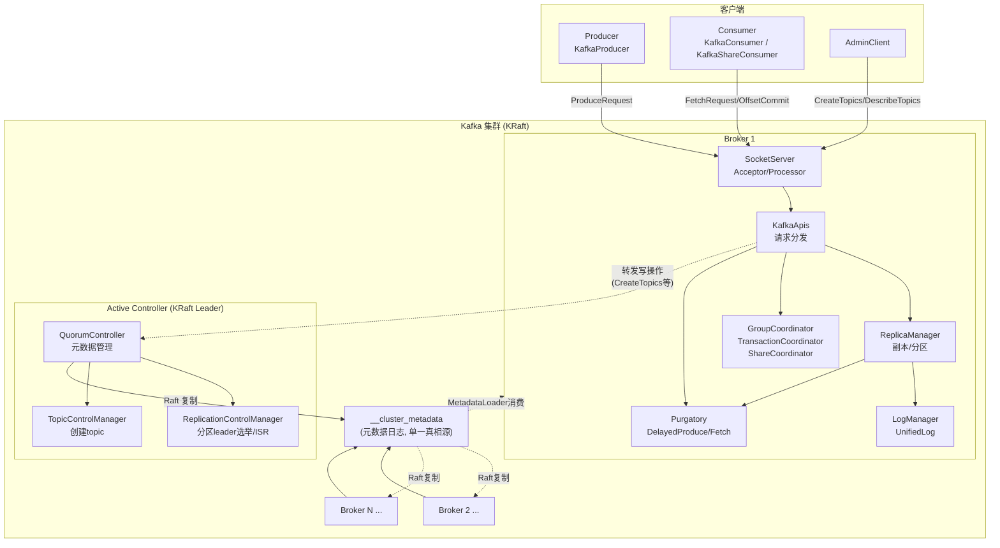
```mermaid
flowchart TB
    subgraph Clients["客户端"]
        P["Producer<br/>KafkaProducer"]
        C["Consumer<br/>KafkaConsumer / KafkaShareConsumer"]
        A["AdminClient"]
    end

    subgraph Cluster["Kafka 集群 (KRaft)"]
        subgraph B1["Broker 1"]
            SS1["SocketServer<br/>Acceptor/Processor"]
            AP1["KafkaApis<br/>请求分发"]
            RM1["ReplicaManager<br/>副本/分区"]
            LM1["LogManager<br/>UnifiedLog"]
            GC1["GroupCoordinator<br/>TransactionCoordinator<br/>ShareCoordinator"]
            Purg1["Purgatory<br/>DelayedProduce/Fetch"]
        end
        B2["Broker 2 ..."]
        Bn["Broker N ..."]

        subgraph Ctrl["Active Controller (KRaft Leader)"]
            QC["QuorumController<br/>元数据管理"]
            RCM["ReplicationControlManager<br/>分区leader选举/ISR"]
            TCM["TopicControlManager<br/>创建topic"]
        end

        MetaLog["__cluster_metadata<br/>(元数据日志, 单一真相源)"]
    end

    P -->|"ProduceRequest"| SS1
    C -->|"FetchRequest/OffsetCommit"| SS1
    A -->|"CreateTopics/DescribeTopics"| SS1
    SS1 --> AP1 --> RM1
    RM1 --> LM1
    AP1 --> GC1
    AP1 --> Purg1
    RM1 --> Purg1

    AP1 -.->|"转发写操作<br/>(CreateTopics等)"| QC
    QC --> RCM
    QC --> TCM
    QC -->|"Raft 复制"| MetaLog
    MetaLog -.->|"MetadataLoader消费"| B1
    MetaLog -.->|"Raft复制"| B2
    MetaLog -.->|"Raft复制"| Bn
    B2 --> MetaLog
    Bn --> MetaLog
```

### 1.5 端到端消息工作流程

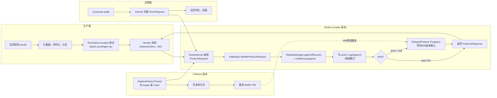
```mermaid
flowchart LR
    subgraph Produce["生产端"]
        P1["应用调用 send()"]
        P2["拦截器→序列化→分区"]
        P3["RecordAccumulator 聚合<br/>(batch.size/linger.ms)"]
        P4["Sender 线程→NetworkClient→NIO"]
    end
    subgraph Broker["Broker (Leader 副本)"]
        B1["SocketServer 接收<br/>ProduceRequest"]
        B2["KafkaApis.handleProduceRequest"]
        B3["ReplicaManager.appendRecords<br/>→ UnifiedLog.append"]
        B4["写 active LogSegment<br/>+稀疏索引"]
        B5{"acks?"}
        B6["DelayedProduce Purgatory<br/>等待ISR副本确认"]
        B7["返回 ProduceResponse"]
    end
    subgraph Replica["Follower 副本"]
        F1["ReplicaFetcherThread<br/>向 leader 发 Fetch"]
        F2["写本地日志"]
        F3["推进 leader HW"]
    end
    subgraph Consume["消费端"]
        C1["Consumer.poll()"]
        C2["Fetcher 拉取 FetchRequest"]
        C3["反序列化→回调"]
    end

    P1 --> P2 --> P3 --> P4 --> B1 --> B2 --> B3 --> B4 --> B5
    B5 -->|"acks=0/1"| B7
    B5 -->|"acks=-1/all"| B6
    F1 --> B1
    F1 --> F2 --> F3
    F3 -.->|"HW推进触发"| B6
    B6 --> B7
    B7 --> P4
    C2 --> B1
    C1 --> C2 --> C3
```

### 1.6 关键内部 Topic

| 内部 Topic | 作用 |
|------------|------|
| `__cluster_metadata` | KRaft 元数据日志，集群单一真相源 |
| `__consumer_offsets` | 消费者组位移与组元数据(classic) |
| `__transaction_state` | 事务状态(TransactionalId→PID/epoch/status) |
| `__share-group-state` | 共享组状态(KIP-932) |
| `__remote_log_metadata` | 分层存储远端日志段元数据 |

### 1.7 分层与线程模型概览

- **客户端**：应用线程(发送/消费) + Sender/ConsumerNetwork 线程，通过 NIO `Selector` 复用连接。
- **服务端网络层**：`Acceptor`(1) → `Processor`(N, `num.network.threads`) → `RequestChannel`(有界队列) → `KafkaRequestHandler`(M, `num.io.threads`) → `KafkaApis`，典型的 Reactor 多线程模型，网络 IO 与业务处理分离。
- **存储层**：`LogManager` 后台线程负责滚动、刷盘、清理；`ReplicaFetcherThread` 负责 follower 拉取；`LogCleaner` 线程池负责 compact。
- **控制器层**：`QuorumController` 单线程事件队列串行处理元数据写操作；KRaft `KafkaRaftClient` 驱动 Raft 状态机。

---

## 二、生产者发送消息流程、优秀设计与客户端网络模型

### 一、生产者发送消息完整流程

Kafka 生产者发送消息采用"主线程写入缓冲 + Sender 后台线程异步网络发送"的双线程架构。整个流程从 `KafkaProducer.send()` 开始，经过拦截器、序列化、分区、累加器聚合，最终由 Sender 线程通过 NetworkClient 与 NIO Selector 写入网络。

#### 1.1 发送入口：KafkaProducer.send()

`send()` 方法是异步的，调用后立即返回 `Future<RecordMetadata>`，不等待网络 IO：

```java
// KafkaProducer.java:959
@Override
public Future<RecordMetadata> send(ProducerRecord<K, V> record, Callback callback) {
    // 拦截器链：在序列化之前调用，可修改 record
    ProducerRecord<K, V> interceptedRecord = this.interceptors.onSend(record);
    return doSend(interceptedRecord, callback);
}
```

核心逻辑在私有方法 `doSend()` 中（`KafkaProducer.java:975`），按顺序执行：

1. **等待元数据**：`waitOnMetadata(record.topic(), record.partition(), nowMs, maxBlockTimeMs)` — 若是首次发送某 topic 或分区不在元数据中，会阻塞等待（最多 `max.block.ms`），期间通过 `sender.wakeup()` 唤醒 Sender 线程发起 MetadataRequest
2. **序列化 key/value**：调用 `keySerializerPlugin.get().serialize(...)` 和 `valueSerializerPlugin.get().serialize(...)`
3. **计算分区**：调用 `partition(record, serializedKey, serializedValue, cluster)`
4. **校验大小**：`ensureValidRecordSize(serializedSize)` 校验不超过 `max.request.size` 和 `buffer.memory`
5. **追加到 RecordAccumulator**：`accumulator.append(...)` 返回 `RecordAppendResult`，其中包含 `FutureRecordMetadata`
6. **唤醒 Sender**：若 `result.batchIsFull || result.newBatchCreated`，调用 `sender.wakeup()`
7. **返回 Future**：`return result.future`

#### 1.2 拦截器链 ProducerInterceptors

```java
// ProducerInterceptors.java:63
public ProducerRecord<K, V> onSend(ProducerRecord<K, V> record) {
    ProducerRecord<K, V> interceptRecord = record;
    for (Plugin<ProducerInterceptor<K, V>> interceptorPlugin : this.interceptorPlugins) {
        try {
            interceptRecord = interceptorPlugin.get().onSend(interceptRecord);
        } catch (Exception e) {
            // 不传播异常，记录日志后继续调用后续拦截器
        }
    }
    return interceptRecord;
}
```

拦截器在两个时机被调用：
- **onSend**：在 `KafkaProducer.send()` 入口、序列化之前调用，可修改消息内容
- **onAcknowledgement**：在 broker 确认后（或发送失败时）通过 `AppendCallbacks.onCompletion()` 触发（`KafkaProducer.java:1589`），在 Sender I/O 线程中执行

#### 1.3 分区器

分区计算逻辑在 `KafkaProducer.partition()` 中（`KafkaProducer.java:1469`）：

```java
private int partition(ProducerRecord<K, V> record, byte[] serializedKey, byte[] serializedValue, Cluster cluster) {
    if (record.partition() != null)
        return record.partition();  // 用户显式指定分区

    if (partitionerPlugin.get() != null) {
        // 自定义 Partitioner
        int customPartition = partitionerPlugin.get().partition(
            record.topic(), record.key(), serializedKey, record.value(), serializedValue, cluster);
        if (customPartition < 0) throw new IllegalArgumentException(...);
        return customPartition;
    }

    if (serializedKey != null && !partitionerIgnoreKeys) {
        // 有 key：使用 murmur2 哈希
        return BuiltInPartitioner.partitionForKey(serializedKey, cluster.partitionsForTopic(record.topic()).size());
    } else {
        // 无 key 或忽略 key：返回 UNKNOWN_PARTITION，交由 RecordAccumulator 内置分区器决定
        return RecordMetadata.UNKNOWN_PARTITION;
    }
}
```

`Partitioner` 接口定义于 `Partitioner.java:30`，继承 `Configurable` 和 `Closeable`。Kafka 内置 `RoundRobinPartitioner`（`RoundRobinPartitioner.java:37`），采用轮询策略，忽略 key。4.x 版本默认不使用自定义分区器时，走 `BuiltInPartitioner` 的 Sticky/Adaptive 逻辑。

#### 1.4 RecordAccumulator 聚合

`RecordAccumulator.append()`（`RecordAccumulator.java:275`）是主线程写入缓冲的核心：

```java
public RecordAppendResult append(String topic, int partition, long timestamp,
        byte[] key, byte[] value, Header[] headers, AppendCallbacks callbacks,
        long maxTimeToBlock, long nowMs, Cluster cluster) throws InterruptedException {
    TopicInfo topicInfo = topicInfoMap.computeIfAbsent(topic, k -> new TopicInfo(createBuiltInPartitioner(...)));
    appendsInProgress.incrementAndGet();
    ByteBuffer buffer = null;
    try {
        while (true) {
            // 1. 若 partition 为 UNKNOWN，用 BuiltInPartitioner 选 sticky 分区
            if (partition == RecordMetadata.UNKNOWN_PARTITION) {
                partitionInfo = topicInfo.builtInPartitioner.peekCurrentPartitionInfo(cluster);
                effectivePartition = partitionInfo.partition();
            }
            setPartition(callbacks, effectivePartition);

            // 2. 获取/创建分区对应的 Deque<ProducerBatch>
            Deque<ProducerBatch> dq = topicInfo.batches.computeIfAbsent(effectivePartition, k -> new ArrayDeque<>());
            synchronized (dq) {
                // 3. 尝试追加到现有 batch 的末尾
                RecordAppendResult appendResult = tryAppend(timestamp, key, value, headers, callbacks, dq, nowMs);
                if (appendResult != null) return appendResult;
            }

            // 4. 现有 batch 已满，从 BufferPool 分配新 ByteBuffer
            if (buffer == null) {
                int size = Math.max(this.batchSize, AbstractRecords.estimateSizeInBytesUpperBound(...));
                buffer = free.allocate(size, maxTimeToBlock);  // 可能阻塞
                nowMs = time.milliseconds();
            }

            // 5. 创建新 batch 并追加
            synchronized (dq) {
                RecordAppendResult appendResult = appendNewBatch(topic, effectivePartition, dq, ...);
                if (appendResult.newBatchCreated) buffer = null;
                return appendResult;
            }
        }
    } finally {
        free.deallocate(buffer);  // 若 buffer 未被使用则归还
        appendsInProgress.decrementAndGet();
    }
}
```

`tryAppend()`（`RecordAccumulator.java:425`）尝试追加到 Deque 最后一个 batch：若 `last.tryAppend` 返回 null（batch 已满），则 `closeForRecordAppends()` 关闭该 batch。

#### 1.5 Sender 线程

Sender 是一个 `Runnable`，在 `KafkaProducer` 构造时启动（`KafkaProducer.java:468`）。`Sender.run()`（`Sender.java:241`）的主循环不断调用 `runOnce()`（`Sender.java:310`）：

```java
void runOnce() {
    if (transactionManager != null) {
        transactionManager.maybeResolveSequences();
        transactionManager.bumpIdempotentEpochAndResetIdIfNeeded();
        if (maybeSendAndPollTransactionalRequest()) return;
    }
    long currentTimeMs = time.milliseconds();
    long pollTimeout = sendProducerData(currentTimeMs);
    client.poll(pollTimeout, currentTimeMs);
}
```

`sendProducerData()`（`Sender.java:380`）流程：
1. `accumulator.ready(metadataSnapshot, now)` — 获取就绪节点列表
2. 遍历就绪节点，移除 `!client.ready(node, now)` 的节点
3. `accumulator.drain(metadataSnapshot, result.readyNodes, this.maxRequestSize, now)` — 抽取各节点的 batch 列表
4. `addToInflightBatches(batches)` — 加入飞行队列跟踪
5. 若 `guaranteeMessageOrder`（`max.in.flight.requests.per.connection == 1`），mute 已抽取的分区
6. `failExpiredBatches(...)` — 处理超时的 batch
7. `sendProduceRequests(batches, now)` — 发送 ProduceRequest

`sendProduceRequest()`（`Sender.java:896`）将 batch 按 TopicPartition 组织成 `ProduceRequestData`，构建 `ProduceRequest`，通过 `client.send(clientRequest, now)` 发出。

#### 1.6 响应处理与回调触发

`handleProduceResponse()`（`Sender.java:580`）处理 broker 响应，成功时调用 `completeBatch()`（`Sender.java:757`）：

```java
private void completeBatch(ProducerBatch batch, ProduceResponse.PartitionResponse response) {
    if (transactionManager != null) {
        transactionManager.handleCompletedBatch(batch, response);
    }
    if (batch.complete(response.baseOffset, response.logAppendTime)) {
        maybeRemoveAndDeallocateBatch(batch);
    } else {
        this.accumulator.deallocate(batch);
    }
}
```

`completeFutureAndFireCallbacks()`（`ProducerBatch.java:297`）触发用户回调：

```java
private void completeFutureAndFireCallbacks(long baseOffset, long logAppendTime,
        Function<Integer, RuntimeException> recordExceptions) {
    produceFuture.set(baseOffset, logAppendTime, recordExceptions);
    for (int i = 0; i < thunks.size(); i++) {
        Thunk thunk = thunks.get(i);
        if (thunk.callback != null) {
            if (recordExceptions == null) {
                RecordMetadata metadata = thunk.future.value();
                thunk.callback.onCompletion(metadata, null);  // 触发用户回调
            } else {
                RuntimeException exception = recordExceptions.apply(i);
                thunk.callback.onCompletion(null, exception);
            }
        }
    }
    produceFuture.done();  // CountDownLatch.countDown()，唤醒等待的 Future.get()
}
```

broker 返回 `baseOffset` 和 `logAppendTime`，结合每条记录在 batch 中的 `batchIndex`，`FutureRecordMetadata.value()` 计算出该记录的绝对 offset（`baseOffset + batchIndex`）。

#### 1.7 生产者发送时序图

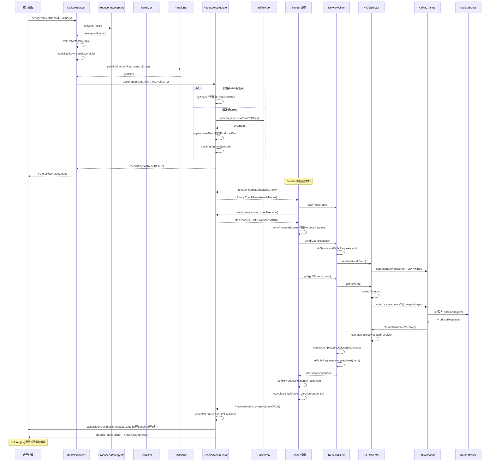
```mermaid
sequenceDiagram
    participant App as 应用线程
    participant KP as KafkaProducer
    participant PI as ProducerInterceptors
    participant Ser as Serializer
    participant Part as Partitioner
    participant RA as RecordAccumulator
    participant BP as BufferPool
    participant Sender as Sender线程
    participant NC as NetworkClient
    participant Sel as NIO Selector
    participant KC as KafkaChannel
    participant Broker as Kafka Broker

    App->>KP: send(ProducerRecord, Callback)
    KP->>PI: onSend(record)
    PI-->>KP: interceptedRecord
    KP->>KP: waitOnMetadata(topic)
    KP->>KP: serialize(key), serialize(value)
    KP->>Part: partition(record, key, value, cluster)
    Part-->>KP: partition
    KP->>RA: append(topic, partition, key, value, ...)
    
    alt 现有batch有空间
        RA->>RA: tryAppend到现有ProducerBatch
    else 需要新batch
        RA->>BP: allocate(size, maxTimeToBlock)
        BP-->>RA: ByteBuffer
        RA->>RA: appendNewBatch创建ProducerBatch
        RA->>RA: batch.tryAppend(record)
    end
    RA-->>KP: RecordAppendResult(future)
    KP-->>App: FutureRecordMetadata
    
    Note over Sender: Sender线程后台循环
    Sender->>RA: ready(metadataSnapshot, now)
    RA-->>Sender: ReadyCheckResult(readyNodes)
    Sender->>NC: ready(node, now)
    Sender->>RA: drain(readyNodes, maxSize, now)
    RA-->>Sender: Map<nodeId, List<ProducerBatch>>
    Sender->>Sender: sendProduceRequest构建ProduceRequest
    Sender->>NC: send(ClientRequest)
    NC->>NC: doSend -> InFlightRequests.add
    NC->>Sel: send(NetworkSend)
    Sel->>KC: setSend(NetworkSend) + OP_WRITE
    
    Sender->>NC: poll(pollTimeout, now)
    NC->>Sel: poll(timeout)
    Sel->>Sel: select(timeout)
    Sel->>KC: write() -> send.writeTo(transportLayer)
    KC->>Broker: TCP写入ProduceRequest
    
    Broker-->>KC: ProduceResponse
    KC->>Sel: maybeCompleteReceive()
    Sel->>Sel: completedReceives.add(receive)
    
    NC->>NC: handleCompletedReceives(responses)
    NC->>NC: inFlightRequests.completeNext(node)
    NC-->>Sender: List<ClientResponse>
    Sender->>Sender: handleProduceResponse(response)
    Sender->>Sender: completeBatch(batch, partitionResponse)
    Sender->>RA: ProducerBatch.complete(baseOffset)
    RA->>RA: completeFutureAndFireCallbacks
    RA->>App: callback.onCompletion(metadata, null) [在Sender线程执行]
    RA->>App: produceFuture.done() -> latch.countDown()
    Note over App: Future.get()返回或回调被触发
```

### 二、生产者优秀设计

#### 2.1 批量发送（batch.size / linger.ms）

每个 `<topic, partition>` 对应一个 `Deque<ProducerBatch>`（`RecordAccumulator.java:1284`），消息追加到 Deque 最后一个 batch。

- **batch.size**：每个 ProducerBatch 的 ByteBuffer 大小（`KafkaProducer.java:437`）。batch 满后 `tryAppend` 返回 null，触发新 batch 创建
- **linger.ms**：batch 等待时间，在 `batchReady()`（`RecordAccumulator.java:608`）中判断：

```java
private long batchReady(boolean exhausted, TopicPartition part, Node leader,
        long waitedTimeMs, boolean backingOff, ...) {
    long timeToWaitMs = backingOff ? retryBackoff.backoff(...) : lingerMs;
    boolean expired = waitedTimeMs >= timeToWaitMs;
    boolean sendable = full || expired || exhausted || closed || flushInProgress() || transactionCompleting;
    if (sendable && !backingOff) {
        readyNodes.add(leader);
    }
}
```

batch 在以下任一条件下变为"可发送"：满了（`full`）、等待超时（`expired`，即 `linger.ms` 到期）、BufferPool 耗尽（`exhausted`）、accumulator 关闭、flush 进行中、事务正在提交。

#### 2.2 BufferPool 内存复用机制

`BufferPool`（`BufferPool.java:45`）是生产者的内存池，大小由 `buffer.memory` 配置：

- **poolableSize**：等于 `batch.size`，此大小的 ByteBuffer 被缓存在 free list 中回收复用
- **free list**：`Deque<ByteBuffer> free`，存放回收的 poolableSize 大小的 buffer
- **nonPooledAvailableMemory**：非池化可用内存，用于分配非 poolableSize 的请求

分配逻辑 `allocate()`（`BufferPool.java:107`）：

```java
public ByteBuffer allocate(int size, long maxTimeToBlockMs) throws InterruptedException {
    // 1. 若 size == poolableSize 且 free list 非空，直接返回池化 buffer
    if (size == poolableSize && !this.free.isEmpty())
        return this.free.pollFirst();

    // 2. 若可用内存足够，freeUp 后直接分配
    if (this.nonPooledAvailableMemory + freeListSize >= size) {
        freeUp(size);
        this.nonPooledAvailableMemory -= size;
    } else {
        // 3. 内存不足，阻塞等待，使用 Condition 公平排队
        Condition moreMemory = this.lock.newCondition();
        this.waiters.addLast(moreMemory);
        while (accumulated < size) {
            moreMemory.await(remainingTimeToBlockNs, TimeUnit.NANOSECONDS);
            // 超时抛出 BufferExhaustedException
        }
    }
    // 唤醒下一个等待者
    if (!(this.nonPooledAvailableMemory == 0 && this.free.isEmpty()) && !this.waiters.isEmpty())
        this.waiters.peekFirst().signal();
    return safeAllocateByteBuffer(size);
}
```

回收逻辑 `deallocate()`（`BufferPool.java:260`）：

```java
public void deallocate(ByteBuffer buffer, int size) {
    if (size == this.poolableSize && size == buffer.capacity()) {
        buffer.clear();        // 清空但保留内存
        this.free.add(buffer); // 放回 free list 复用
    } else {
        this.nonPooledAvailableMemory += size; // 非池化内存归还
    }
    Condition moreMem = this.waiters.peekFirst();
    if (moreMem != null) moreMem.signal(); // 唤醒等待线程
}
```

使用 `ReentrantLock` + `Condition` 实现公平等待，避免线程饥饿。

#### 2.3 异步回调与 Future

每条消息返回 `FutureRecordMetadata`（`FutureRecordMetadata.java:30`），持有对 `ProduceRequestResult`（`ProduceRequestResult.java:36`）的引用。`ProduceRequestResult` 内部使用 `CountDownLatch` 实现等待：

```java
// ProduceRequestResult.java:78
public void done() {
    this.latch.countDown();
}
```

一个 batch 内所有记录共享同一个 `ProduceRequestResult`，通过 `batchIndex` 区分各自 offset。回调在 Sender I/O 线程中执行（`ProducerBatch.java:306`），因此用户回调应快速执行，否则会阻塞发送。

#### 2.4 重试机制

重试由 `retries`、`retry.backoff.ms`、`retry.backoff.max.ms`、`delivery.timeout.ms`、`acks` 共同控制：

```java
// Sender.java:876
private boolean canRetry(ProducerBatch batch, ProduceResponse.PartitionResponse response, long now) {
    return !batch.hasReachedDeliveryTimeout(accumulator.getDeliveryTimeoutMs(), now) &&
        batch.attempts() < this.retries &&
        !batch.isDone() &&
        (transactionManager == null ?
            response.error.exception() instanceof RetriableException :
            transactionManager.canRetry(response, batch));
}
```

- **重新入队**：`reenqueueBatch()`（`Sender.java:751`）调用 `accumulator.reenqueue(batch, currentTimeMs)`，batch 被放回 Deque 头部，重置等待时间
- **退避策略**：使用 `ExponentialBackoff`（`RecordAccumulator.java:135`），指数退避 + 抖动
- **delivery.timeout.ms**：总投递超时，超过后 batch 被 fail 并回调异常
- **batch 拆分**：当 `Errors.MESSAGE_TOO_LARGE` 且 `recordCount > 1` 时，`splitAndReenqueue()` 将大 batch 拆分为小 batch（`RecordAccumulator.java:511`）

#### 2.5 幂等性（Idempotence）

Kafka 4.3.0 默认开启幂等性（`enable.idempotence=true`，`KafkaProducer.java:608`）。核心由 `TransactionManager` + `ProducerIdAndEpoch` + sequence number 实现。

**ProducerIdAndEpoch**（`ProducerIdAndEpoch.java:21`）：

```java
public class ProducerIdAndEpoch {
    public static final ProducerIdAndEpoch NONE = new ProducerIdAndEpoch(
        RecordBatch.NO_PRODUCER_ID, RecordBatch.NO_PRODUCER_EPOCH);
    public final long producerId;
    public final short epoch;
    public boolean isValid() { return RecordBatch.NO_PRODUCER_ID < producerId; }
}
```

**Sequence Number 机制**：在 `RecordAccumulator.drainBatchesForOneNode()`（`RecordAccumulator.java:852`）中，当 batch 被抽取发送时分配 sequence number：

```java
// RecordAccumulator.java:900-924
if (producerIdAndEpoch != null && !batch.hasSequence()) {
    transactionManager.maybeUpdateProducerIdAndEpoch(batch.topicPartition);
    batch.setProducerState(producerIdAndEpoch, 
        transactionManager.sequenceNumber(batch.topicPartition), isTransactional);
    transactionManager.incrementSequenceNumber(batch.topicPartition, batch.recordCount);
    transactionManager.addInFlightBatch(batch);
}
```

**重排序去重**：当需要重试时，`insertInSequenceOrder()`（`RecordAccumulator.java:552`）按 sequence number 顺序将 batch 插入 Deque，保证 broker 收到的消息顺序正确。broker 通过 sequence number 去重，因此 `max.in.flight.requests.per.connection > 1` 时幂等性仍能保证。当 in-flight > 1 时，Sender 会 mute 分区防止重排序问题（`guaranteeMessageOrder = (maxInflightRequests == 1)`，`Sender.java:543`）。

#### 2.6 事务

事务通过 `transactional.id` 配置启用（`KafkaProducer.java:604`）。`TransactionManager` 维护状态机（`TransactionManager.java:151`）：

```
UNINITIALIZED -> INITIALIZING -> READY -> IN_TRANSACTION -> COMMITTING_TRANSACTION -> READY
                                                \-> ABORTING_TRANSACTION -> READY
                          PREPARED_TRANSACTION -> COMMITTING/ABORTING
```

事务请求按优先级排序（`TransactionManager.java:195`）：`FIND_COORDINATOR(0)` -> `INIT_PRODUCER_ID(1)` -> `ADD_PARTITIONS_OR_OFFSETS(2)` -> `END_TXN(3)` -> `EPOCH_BUMP(4)`。

**两阶段提交（2PC）**：4.3.0 新增 `transaction.two.phase.commit.enable` 配置（`KafkaProducer.java:610`）。`prepareTransaction()`（`TransactionManager.java:360`）将事务转为 `PREPARED_TRANSACTION` 状态。

**事务 API 流程**：
1. `initTransactions()`（`KafkaProducer.java:660`）：发送 `InitProducerIdRequest` 获取 PID 和 epoch
2. `beginTransaction()`（`KafkaProducer.java:686`）：状态转为 `IN_TRANSACTION`
3. `send()`：每条消息的分区通过 `transactionManager.maybeAddPartition(tp)` 加入事务
4. `sendOffsetsToTransaction()`（`KafkaProducer.java:743`）：发送 `AddOffsetsToTxnRequest` + `TxnOffsetCommitRequest`
5. `commitTransaction()`（`KafkaProducer.java:790`）：发送 `EndTxnRequest(commit)`
6. `abortTransaction()`（`KafkaProducer.java:824`）：发送 `EndTxnRequest(abort)`

所有事务 API 都是阻塞的，通过 `TransactionalRequestResult.await()` 等待完成。

#### 2.7 分区策略：Sticky / Adaptive / RoundRobin

**BuiltInPartitioner**（`BuiltInPartitioner.java:39`）实现了 KIP-794 的自适应粘性分区：

- **Sticky 分区**：无 key 时，"粘"在一个分区上，直到生产 `stickyBatchSize`（即 `batch.size`）字节后切换：
```java
// BuiltInPartitioner.java:190
if (producedBytes >= stickyBatchSize && enableSwitch || producedBytes >= stickyBatchSize * 2) {
    StickyPartitionInfo newPartitionInfo = new StickyPartitionInfo(nextPartition(cluster));
    stickyPartitionInfo.set(newPartitionInfo);
}
```
- **Adaptive（自适应）**：当 `partitioner.adaptive.partitioning.enable=true`（默认 true），基于各分区队列长度构建累积频率表（CFT），权重反比于队列长度，用二分查找选择分区。队列越短（负载越轻）的分区被选中概率越高。
- **Uniform**：当所有分区队列长度相同时，退化为均匀随机。
- **partitionForKey**：有 key 时使用 `Utils.toPositive(Utils.murmur2(serializedKey)) % numPartitions`。

**Sticky 优化原理**：传统 RoundRobin 每条消息切换分区，导致每个分区只积累 1 条消息就发送，batch 效率低。Sticky 让连续消息"粘"在同一分区，能填满整个 batch，大幅提升吞吐量。

### 三、客户端网络模型

#### 3.1 NetworkClient 连接管理

`NetworkClient`（`NetworkClient.java:77`）实现了 `KafkaClient` 接口，是生产者和消费者共用的网络客户端。核心字段：

```java
// NetworkClient.java:88-98
private final Selectable selector;            // NIO Selector 封装
private final MetadataUpdater metadataUpdater; // 元数据更新器
private final ClusterConnectionStates connectionStates; // 连接状态机
private final InFlightRequests inFlightRequests; // 飞行队列
private final int defaultRequestTimeoutMs;
private final AtomicReference<State> state;  // ACTIVE / CLOSING / CLOSED
```

`isReady()`（`NetworkClient.java:518`）判断节点是否就绪：

```java
public boolean isReady(Node node, long now) {
    return !metadataUpdater.isUpdateDue(now) && canSendRequest(node.idString(), now);
}

private boolean canSendRequest(String node, long now) {
    return connectionStates.isReady(node, now) && selector.isChannelReady(node) 
        && inFlightRequests.canSendMore(node);
}
```

#### 3.2 InFlightRequests 飞行队列

`InFlightRequests`（`InFlightRequests.java:31`）管理已发送但未收到响应的请求：

```java
final class InFlightRequests {
    private final int maxInFlightRequestsPerConnection;
    private final Map<String, Deque<NetworkClient.InFlightRequest>> requests = new HashMap<>();
    private final AtomicInteger inFlightRequestCount = new AtomicInteger(0);
}
```

- **canSendMore**（`InFlightRequests.java:96`）：要求当前飞行请求数 < `max.in.flight.requests.per.connection`
- **add**：将请求加入 Deque 头部（`addFirst`）
- **completeNext**：完成最老的请求（`pollLast`），保证 FIFO 响应顺序

#### 3.3 NIO Selector Reactor 模式

`Selector`（`Selector.java:88`）基于 Java NIO 实现 Reactor 模式。`poll()` 方法（`Selector.java:445`）是 Reactor 核心循环：

```java
public void poll(long timeout) throws IOException {
    clear();  // 清空上次的 completedSends/Receives/disconnected 等
    boolean dataInBuffers = !keysWithBufferedRead.isEmpty();
    if (!immediatelyConnectedKeys.isEmpty() || (madeReadProgressLastCall && dataInBuffers))
        timeout = 0;  // 有待处理数据时不等待

    int numReadyKeys = select(timeout);  // 1. 选择就绪的 key
    
    if (numReadyKeys > 0 || !immediatelyConnectedKeys.isEmpty() || dataInBuffers) {
        Set<SelectionKey> readyKeys = this.nioSelector.selectedKeys();
        if (dataInBuffers) {
            keysWithBufferedRead.removeAll(readyKeys);
            pollSelectionKeys(toPoll, false, endSelect);
        }
        pollSelectionKeys(readyKeys, false, endSelect);  // 2. 处理就绪 channel
        readyKeys.clear();
        pollSelectionKeys(immediatelyConnectedKeys, true, endSelect);
        immediatelyConnectedKeys.clear();
    }
    maybeCloseOldestConnection(endSelect);  // 3. 关闭空闲连接
}
```

`pollSelectionKeys()`（`Selector.java:514`）遍历就绪的 SelectionKey，执行：完成连接（`finishConnect`）、认证（`prepare`）、读（`attemptRead`）、写（`attemptWrite`）。

#### 3.4 KafkaChannel 读写

`KafkaChannel`（`KafkaChannel.java:67`）封装了 TransportLayer（Plaintext/SSL）+ Authenticator + NetworkSend/NetworkReceive：

```java
public void setSend(NetworkSend send) {
    if (this.send != null) throw new IllegalStateException("prior send still in progress");
    this.send = send;
    this.transportLayer.addInterestOps(SelectionKey.OP_WRITE);  // 注册写事件
}

public long write() throws IOException {
    if (send == null) return 0;
    midWrite = true;
    return send.writeTo(transportLayer);  // 委托给 Send.writeTo
}
```

#### 3.5 NetworkSend / SendBuilder 零拷贝组装

`SendBuilder`（`SendBuilder.java:44`）负责构建 Send 对象，支持零拷贝：

```java
// SendBuilder.java:137-148
public void writeRecords(BaseRecords records) {
    if (records instanceof MemoryRecords) {
        flushPendingBuffer();
        addBuffer(((MemoryRecords) records).buffer());  // 直接引用 records 的 buffer，不拷贝
    } else if (records instanceof UnalignedMemoryRecords) {
        ...
    } else {
        flushPendingSend();
        addSend(records.toSend());  // FileRecords 走零拷贝 send
    }
}
```

`writeRecords()` 直接引用 `MemoryRecords` 的 ByteBuffer，避免数据拷贝。`MultiRecordsSend` 将多个 `ByteBufferSend` 组合，通过 `GatheringByteChannel.write(ByteBuffer[])` 实现批量写入（scatter/gather IO）。

#### 3.6 Metadata 更新与 leastLoadedNode

`NetworkClient.leastLoadedNode()`（`NetworkClient.java:759`）选择负载最小的节点用于发送 MetadataRequest，优先级：已连接且无飞行请求 > 已连接且飞行最少 > 正在连接 > 可连接。随机起点（`randOffset`）避免热点。

#### 3.7 ClusterConnectionStates 状态机

连接状态枚举 `ConnectionState`：`DISCONNECTED` -> `CONNECTING` -> `CONNECTED` / `CHECKING_API_VERSIONS` -> `READY`。`reconnectBackoff` 实现重连指数退避，`disconnected` 时清除地址触发重新 DNS 解析。

### 四、客户端 NIO Reactor 网络模型架构图

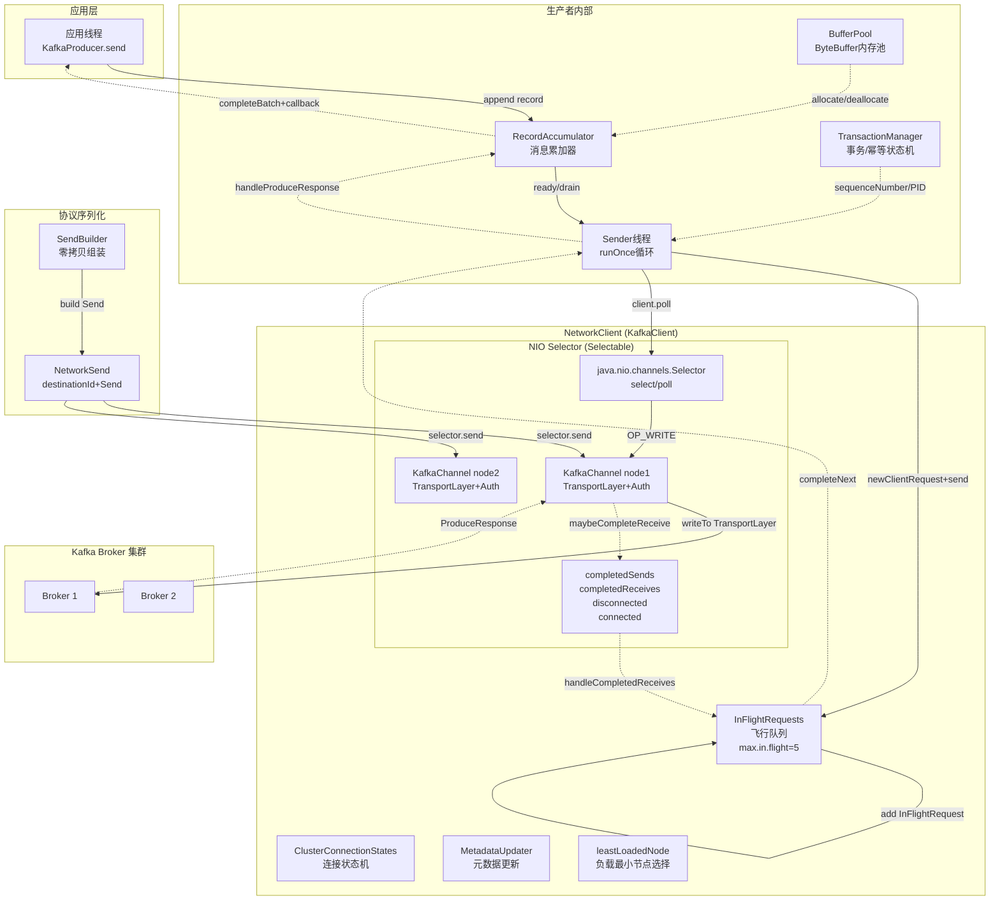
```mermaid
flowchart TB
    subgraph 应用层
        APP["应用线程<br/>KafkaProducer.send"]
    end

    subgraph 生产者核心["生产者内部"]
        RA["RecordAccumulator<br/>消息累加器"]
        BP["BufferPool<br/>ByteBuffer内存池"]
        BP -.->|allocate/deallocate| RA
        SENDER["Sender线程<br/>runOnce循环"]
        TM["TransactionManager<br/>事务/幂等状态机"]
    end

    subgraph 网络客户端["NetworkClient (KafkaClient)"]
        IFR["InFlightRequests<br/>飞行队列<br/>max.in.flight=5"]
        CCS["ClusterConnectionStates<br/>连接状态机"]
        MU["MetadataUpdater<br/>元数据更新"]
        NCL["leastLoadedNode<br/>负载最小节点选择"]
        
        subgraph NIO层["NIO Selector (Selectable)"]
            SEL["java.nio.channels.Selector<br/>select/poll"]
            CH1["KafkaChannel node1<br/>TransportLayer+Auth"]
            CH2["KafkaChannel node2<br/>TransportLayer+Auth"]
            CS["completedSends<br/>completedReceives<br/>disconnected<br/>connected"]
        end
    end

    subgraph 协议层["协议序列化"]
        SB["SendBuilder<br/>零拷贝组装"]
        NS["NetworkSend<br/>destinationId+Send"]
    end

    subgraph Broker["Kafka Broker 集群"]
        B1["Broker 1"]
        B2["Broker 2"]
    end

    APP -->|append record| RA
    RA -->|ready/drain| SENDER
    SENDER -->|newClientRequest+send| IFR
    IFR -->|add InFlightRequest| IFR
    SENDER -->|client.poll| SEL
    
    SB -->|build Send| NS
    NS -->|selector.send| CH1
    NS -->|selector.send| CH2
    
    SEL -->|OP_WRITE| CH1
    CH1 -->|writeTo TransportLayer| B1
    B1 -.->|ProduceResponse| CH1
    CH1 -.->|maybeCompleteReceive| CS
    CS -.->|handleCompletedReceives| IFR
    IFR -.->|completeNext| SENDER
    SENDER -.->|handleProduceResponse| RA
    RA -.->|completeBatch+callback| APP

    TM -.->|sequenceNumber/PID| SENDER
```

### 五、RecordAccumulator/BufferPool/Sender 协作流程

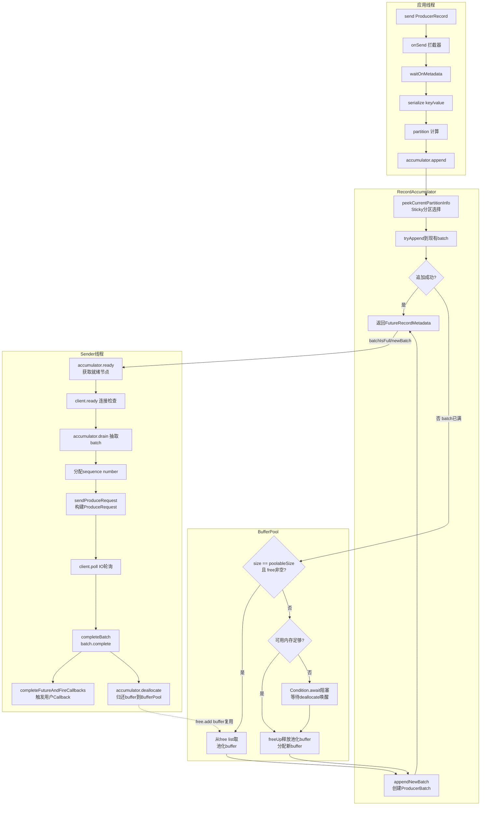
```mermaid
flowchart TD
    subgraph 主线程["应用线程"]
        S1["send ProducerRecord"]
        S2["onSend 拦截器"]
        S3["waitOnMetadata"]
        S4["serialize key/value"]
        S5["partition 计算"]
        S6["accumulator.append"]
    end

    subgraph BufferPool["BufferPool"]
        BP1{"size == poolableSize<br/>且 free非空?"}
        BP2["从free list取<br/>池化buffer"]
        BP3{"可用内存足够?"}
        BP4["freeUp释放池化buffer<br/>分配新buffer"]
        BP5["Condition.await阻塞<br/>等待deallocate唤醒"]
    end

    subgraph Accumulator["RecordAccumulator"]
        RA1["peekCurrentPartitionInfo<br/>Sticky分区选择"]
        RA3["tryAppend到现有batch"]
        RA4{"追加成功?"}
        RA5["appendNewBatch<br/>创建ProducerBatch"]
        RA7["返回FutureRecordMetadata"]
    end

    subgraph SenderThread["Sender线程"]
        SE1["accumulator.ready<br/>获取就绪节点"]
        SE2["client.ready 连接检查"]
        SE3["accumulator.drain 抽取batch"]
        SE4["分配sequence number"]
        SE6["sendProduceRequest<br/>构建ProduceRequest"]
        SE8["client.poll IO轮询"]
        SE10["completeBatch<br/>batch.complete"]
        SE11["completeFutureAndFireCallbacks<br/>触发用户Callback"]
        SE12["accumulator.deallocate<br/>归还buffer到BufferPool"]
    end

    S1 --> S2 --> S3 --> S4 --> S5 --> S6
    S6 --> RA1 --> RA3 --> RA4
    RA4 -->|是| RA7
    RA4 -->|否 batch已满| BP1
    BP1 -->|是| BP2 --> RA5
    BP1 -->|否| BP3
    BP3 -->|是| BP4 --> RA5
    BP3 -->|否| BP5 --> BP4
    RA5 --> RA7
    RA7 -->|batchIsFull/newBatch| SE1

    SE1 --> SE2 --> SE3 --> SE4 --> SE6 --> SE8
    SE8 --> SE10 --> SE11
    SE10 --> SE12
    SE12 -.->|free.add buffer复用| BP2
```

### 六、主线程与 Sender 线程的解耦与线程安全

#### 6.1 通过 RecordAccumulator 解耦

- **主线程**：调用 `accumulator.append()` 向 Deque 中追加消息
- **Sender 线程**：调用 `accumulator.ready()` 和 `accumulator.drain()` 抽取消息
- **BufferPool**：共享内存池，主线程 `allocate()` 申请内存，Sender 线程 `deallocate()` 归还内存

唤醒机制：主线程在 batch 满或创建新 batch 时调用 `sender.wakeup()`，最终 `nioSelector.wakeup()` 中断 Sender 的 `poll`。

#### 6.2 线程安全保证

**RecordAccumulator 中的锁**：
- `topicInfoMap`：使用 `CopyOnWriteMap`
- `TopicInfo.batches`：`ConcurrentMap<Integer, Deque<ProducerBatch>>`，使用 `CopyOnWriteMap`
- **Deque 级别的 synchronized**：每次操作 Deque 时使用 `synchronized (deque)`（`RecordAccumulator.java:314`），最细粒度的锁，每个分区独立加锁

**BufferPool 中的锁**：使用 `ReentrantLock`（`BufferPool.java:72`）+ `Condition`（`Deque<Condition> waiters`）实现公平等待，`Condition.signal()` 唤醒最早等待的线程（FIFO 公平）。

**TransactionManager 的 synchronized**：事务状态转换方法都使用 `synchronized`（如 `beginTransaction()`），保证状态机原子性。`shouldPoisonStateOnInvalidTransition()` 区分应用线程和 Sender 线程：Sender 线程中非法状态转换会将状态置为 `FATAL_ERROR`，应用线程中只抛异常。

**volatile 字段**：`closed`（accumulator 关闭标志）、`producerIdAndEpoch`、`currentState`（事务状态）。

**KafkaProducer 是线程安全的**（文档 `KafkaProducer.java:103`），多个应用线程可以共享同一个 Producer 实例。`ioThread` 引用是 `final`，`running` 是 `volatile`。

---

## 三、消费者与 Rebalance 机制

Kafka 消费者以**消费者组(Consumer Group)**为单位协作消费，组内分区互斥分配，成员变化通过 **Rebalance** 重新协商分区归属。Kafka 4.3.0 同时存在两套消费者组协议：经典的 **JoinGroup/SyncGroup** 协议(下称 classic)与 KIP-848 引入的 **ConsumerGroupHeartbeat** 协议(下称 modern / 新协议)。客户端通过 `group.protocol=classic|consumer` 选择，4.x 默认走新协议。本章逐层剖析客户端 poll 流程、协调器状态机、分区分配策略、服务端 GroupCoordinator 实现以及两套协议的完整 Rebalance 时序。

### 一、消费者整体架构与双协议并存

#### 1.1 Facade + Delegate 模式

`KafkaConsumer` 是一个门面，所有公共方法都委托给 `ConsumerDelegate`：

```java
// KafkaConsumer.java:904
@Override
public ConsumerRecords<K, V> poll(final Duration timeout) {
    return delegate.poll(timeout);
}
```

`ConsumerDelegate` 有两个实现：
- `ClassicKafkaConsumer`(`clients/src/main/java/org/apache/kafka/clients/consumer/internals/ClassicKafkaConsumer.java`)：经典协议，应用线程内同步阻塞 poll
- `AsyncKafkaConsumer`(`clients/src/main/java/org/apache/kafka/clients/consumer/internals/AsyncKafkaConsumer.java`)：新协议，事件驱动 + 后台线程

选择由 `group.protocol` 决定，默认 `consumer`(新协议)。

#### 1.2 经典 vs 新协议对比

| 维度 | classic | modern (KIP-848) |
|------|---------|------------------|
| 加入组 | JoinGroup + SyncGroup 两阶段 | 单一 `ConsumerGroupHeartbeat` 长连接流 |
| 分配执行 | **leader 客户端**执行 assignor | **服务端**执行 assignor |
| 心跳 | 独立的 HeartbeatRequest | 心跳即协议本身(心跳响应携带分配) |
| Rebalance | 全组 stop-the-world | 增量、协作式，仅影响受影响成员 |
| 客户端状态数 | 4(UNJOINED/PREPARING/COMPLETING/STABLE) | 10 |
| leader 概念 | 有(崩溃会卡组) | 无 |
| 4.x 默认 | 否 | 是 |

#### 1.3 消费者类层级图

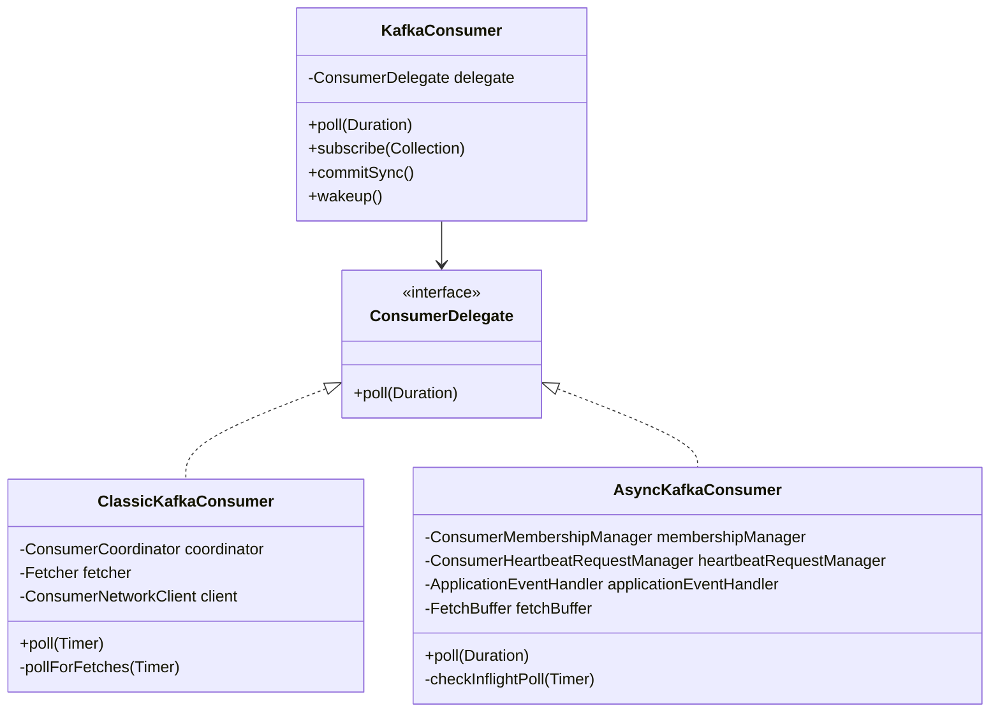
```mermaid
classDiagram
    class KafkaConsumer {
        +poll(Duration)
        +subscribe(Collection)
        +commitSync()
        +wakeup()
        -ConsumerDelegate delegate
    }
    class ConsumerDelegate {
        <<interface>>
        +poll(Duration)
    }
    class ClassicKafkaConsumer {
        -ConsumerCoordinator coordinator
        -Fetcher fetcher
        -ConsumerNetworkClient client
        +poll(Timer)
        -pollForFetches(Timer)
    }
    class AsyncKafkaConsumer {
        -ConsumerMembershipManager membershipManager
        -ConsumerHeartbeatRequestManager heartbeatRequestManager
        -ApplicationEventHandler applicationEventHandler
        -FetchBuffer fetchBuffer
        +poll(Duration)
        -checkInflightPoll(Timer)
    }
    KafkaConsumer --> ConsumerDelegate
    ConsumerDelegate <|.. ClassicKafkaConsumer
    ConsumerDelegate <|.. AsyncKafkaConsumer
```

### 二、KafkaConsumer.poll() 完整流程

#### 2.1 ClassicKafkaConsumer.poll 主循环

`ClassicKafkaConsumer.java:647` 是经典协议的核心：

```java
// ClassicKafkaConsumer.java:647
private ConsumerRecords<K, V> poll(final Timer timer) {
    acquireAndEnsureOpen();           // 加锁，确保未关闭
    try {
        do {
            client.maybeTriggerWakeup();
            updateAssignmentMetadataIfNeeded(timer, false);   // 触发 rebalance / 位移
            final Fetch<K, V> fetch = pollForFetches(timer);
            if (!fetch.isEmpty()) {
                // 流水化：返回数据前预发下一轮 fetch
                if (sendFetches() > 0 || client.hasPendingRequests())
                    client.transmitSends();
                return interceptors.onConsume(new ConsumerRecords<>(fetch.records(), fetch.nextOffsets()));
            }
        } while (timer.notExpired());
        return ConsumerRecords.empty();
    } finally {
        release();
    }
}
```

关键点：
- `acquireAndEnsureOpen()` 使用一把可重入锁 + `wakeupDisabled` 标志实现线程安全与 wakeup 协作；`wakeup()`(`KafkaConsumer.java:1876`)由其它线程调用时若检测到锁被占用则置位 `wakeupPending`，下次 `maybeTriggerWakeup` 抛 `WakeupException`
- `updateAssignmentMetadataIfNeeded`(`ClassicKafkaConsumer.java:695`) 内部调用 `coordinator.poll(timer, waitForJoinGroup)`，是 rebalance 的触发点
- `pollForFetches`(`ClassicKafkaConsumer.java:706`)：先 `collectFetch` 看缓冲区是否已有数据，没有则 `sendFetches()` 后阻塞 `client.poll`，被 `fetcher.hasAvailableFetches()` 唤醒
- 拿到数据后**立即预发下一批 fetch**(`transmitSends()`)，实现流水化

#### 2.2 pollForFetches 与 Fetcher

`Fetcher`(`Fetcher.java:59`) 继承 `AbstractFetch`，自身只负责构造请求与回调：

```java
// Fetcher.java:105
public synchronized int sendFetches() {
    final Map<Node, FetchSessionHandler.FetchRequestData> fetchRequests = prepareFetchRequests();
    sendFetchesInternal(fetchRequests,
        (fetchTarget, data, resp) -> synchronized (Fetcher.this) { handleFetchSuccess(...); },
        (fetchTarget, data, err) -> synchronized (Fetcher.this) { handleFetchFailure(...); });
    return fetchRequests.size();
}
```

`sendFetchesInternal`(`Fetcher.java:183`) 对每个 leader 节点构造 `FetchRequest.Builder`，通过 `client.send(target, request)` 拿到 `RequestFuture<ClientResponse>`，注册 `onSuccess/onFailure`。Fetch 会话(`FetchSessionHandler`)实现 KIP-227 增量 fetch：仅传发生变化的分区，broker 维护 session 状态。

`collectFetch`(`Fetcher.java:145`) 把 `fetchBuffer` 中的 `PartitionRecords` 交给 `FetchCollector`，过滤掉位移已超前的记录、应用 `ConsumerInterceptor.onConsume` 后返回。

#### 2.3 ConsumerNetworkClient

`ConsumerNetworkClient`(`ConsumerNetworkClient.java`)是消费者私用的网络层封装，内置一把 `ReentrantLock` + `unsent` 队列：

```java
// ConsumerNetworkClient.java:262
public void poll(Timer timer, PollCondition pollCondition, boolean disableWakeup) {
    firePendingCompletedRequests();
    lock.lock();
    try {
        handlePendingDisconnects();
        long pollDelayMs = trySend(timer.currentTimeMs());     // 1. 把 unsent 中已 ready 的请求真正发出
        if (pendingCompletion.isEmpty() && (pollCondition == null || pollCondition.shouldBlock())) {
            long pollTimeout = Math.min(timer.remainingMs(), pollDelayMs);
            if (client.inFlightRequestCount() == 0)
                pollTimeout = Math.min(pollTimeout, retryBackoffMs);
            client.poll(pollTimeout, timer.currentTimeMs());   // 2. 阻塞 IO
        } else {
            client.poll(0, timer.currentTimeMs());
        }
        ...
        trySend(timer.currentTimeMs());     // 3. poll 完成后再尝试发一波
        failExpiredRequests(timer.currentTimeMs());
        unsent.clean();
    } finally { lock.unlock(); }
    firePendingCompletedRequests();
    metadata.maybeThrowAnyException();
}
```

`trySend` 把 `unsent` 中目标节点已 ready 的请求通过 `NetworkClient.send` 真正发出；未 ready 的留在 `unsent` 等下次 poll。`wakeup()`(`ConsumerNetworkClient.java:188`) 通过向 `wakeupMessage` 通道写入消息触发 `client.wakeup()`，让阻塞的 `selector.poll` 立即返回。`transmitSends()`(`ConsumerNetworkClient.java:331`) 是 poll 的"轻量版"，只做 trySend 不阻塞、不抛异常、不触发 wakeup，用于 `poll()` 返回前预发请求。

#### 2.4 poll 流程图

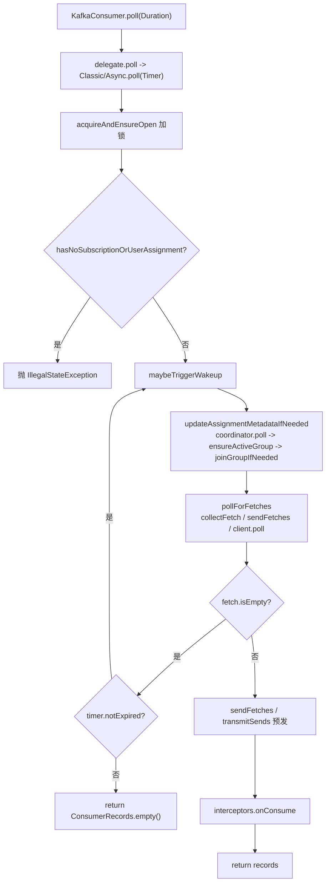
```mermaid
flowchart TD
    A["KafkaConsumer.poll(Duration)"] --> B["delegate.poll -> Classic/Async.poll(Timer)"]
    B --> C["acquireAndEnsureOpen 加锁"]
    C --> D{"hasNoSubscriptionOrUserAssignment?"}
    D -->|"是"| E["抛 IllegalStateException"]
    D -->|"否"| F["maybeTriggerWakeup"]
    F --> G["updateAssignmentMetadataIfNeeded<br/>coordinator.poll -> ensureActiveGroup -> joinGroupIfNeeded"]
    G --> H["pollForFetches<br/>collectFetch / sendFetches / client.poll"]
    H --> I{"fetch.isEmpty?"}
    I -->|"是"| J{"timer.notExpired?"}
    J -->|"是"| F
    J -->|"否"| K["return ConsumerRecords.empty()"]
    I -->|"否"| L["sendFetches / transmitSends 预发"]
    L --> M["interceptors.onConsume"]
    M --> N["return records"]
```

#### 2.5 AsyncKafkaConsumer 事件驱动 poll

新协议消费者有**两个线程**：应用线程(执行 `poll` 与用户回调)与后台 `DefaultBackgroundThread`(发心跳、处理响应)。`AsyncKafkaConsumer.poll`(`AsyncKafkaConsumer.java:913`)把 `AsyncPollEvent` 投递给后台线程，自身只在 `fetchBuffer` 已就绪时返回数据：

```java
// AsyncKafkaConsumer.java:970
private void checkInflightPoll(Timer timer, boolean firstPass) {
    if (inflightPoll == null) {
        inflightPoll = new AsyncPollEvent(calculateDeadlineMs(timer), time.milliseconds());
        applicationEventHandler.add(inflightPoll);   // 提交后台事件
    }
    ...
}
```

事件被后台线程串行处理：`validatePositions` -> `fetch` -> `collectFetch` -> 填充 `fetchBuffer`。应用线程通过 `wakeupTrigger.maybeTriggerWakeup()`(`AsyncKafkaConsumer.java:933`)在事件之间检查唤醒。这种"事件 + 单后台线程"模型避免了 classic 协议中 rebalance 与 fetch 在同一线程的阻塞耦合。

### 三、消费者订阅与位移管理

#### 3.1 三种订阅方式

| API | 含义 | 是否触发 rebalance |
|-----|------|--------------------|
| `subscribe(Collection<String>)`(`KafkaConsumer.java:726`) | 集合订阅，自动分配 | 是 |
| `subscribe(Pattern)`(`KafkaConsumer.java:771`) | 正则订阅，匹配 topic 动态加入 | 是 |
| `assign(Collection<TopicPartition>)`(`KafkaConsumer.java:854`) | 手动分配，自由消费 | 否(不参与组) |

订阅状态保存在 `SubscriptionState`：`subscriptionType`(NONE/AUTO_TOPICS/AUTO_PATTERN/USER_ASSIGNED)、`groupSubscribedTopics`、`assignment`。`subscribe` 会重置 `rebalanceNeeded = true`，下一次 `poll` 进入 `joinGroupIfNeeded`。

#### 3.2 位移提交

```java
// ConsumerCoordinator.java:1142
public boolean commitOffsetsSync(Map<TopicPartition, OffsetAndMetadata> offsets, Timer timer) { ... }

// ConsumerCoordinator.java:1048
public RequestFuture<Void> commitOffsetsAsync(Map<TopicPartition, OffsetAndMetadata> offsets, OffsetCommitCallback callback) { ... }
```

两者最终都构造 `OffsetCommitRequest`(`group-coordinator` 处理)，目标节点是该 group 的 coordinator。自动提交由 `AutoCommitTask` 周期触发(`maybeAutoCommitOffsetsAsync`, `ConsumerCoordinator.java:1198`，间隔 `auto.commit.interval.ms`)。

#### 3.3 `__consumer_offsets` 消息格式

每个消费者组由 `Utils.abs(groupId.hashCode) % groupMetadataTopicPartitionCount` 选定一个 partition 作为它的协调 partition，对应 broker 即该组的 GroupCoordinator。该 partition 的消息有两类：

| Key | Value | 含义 |
|-----|-------|------|
| `OffsetCommitKey(group, topic, partition)` | `OffsetCommitValue(offset, metadata, leaderEpoch, commitTimestamp, expireTimestamp)` | 单分区位移 |
| `GroupMetadataKey(group)` | `GroupMetadataValue(generation, protocolType, protocol, leaderId, members..., state)` | 组元数据 |

服务端 `GroupMetadataManager` 在处理 `OffsetCommit`/`JoinGroup`/`SyncGroup` 时把变更写为 record 追加到该 partition，并维护内存中的 `GroupMetadata` / 位移缓存。崩溃恢复时重放日志重建状态。

### 四、消费者组协调器：AbstractCoordinator 状态机(classic)

#### 4.1 字段与 MemberState

`AbstractCoordinator`(`AbstractCoordinator.java:121`)是 classic 协议客户端协调器的基类，`ConsumerCoordinator` 继承它：

```java
// AbstractCoordinator.java:125
protected enum MemberState {
    UNJOINED,             // 不在任何组中
    PREPARING_REBALANCE,  // 已发 JoinGroup，未收响应
    COMPLETING_REBALANCE, // 已收 JoinGroup 响应，未收分配
    STABLE;               // 已加入并稳定心跳
}
```

核心字段(`AbstractCoordinator.java:160` 起)：`state`(初始 `UNJOINED`)、`generation`、`coordinator`、`heartbeatThread`、`joinFuture`、`rejoinNeeded`、`needsJoinPrepare`、`lastRebalanceStartMs`/`lastRebalanceEndMs`。

#### 4.2 ensureActiveGroup -> joinGroupIfNeeded

`poll()` 调用 `coordinator.poll(...)` 最终走 `ensureActiveGroup`：

```java
// AbstractCoordinator.java:413
boolean ensureActiveGroup(final Timer timer) {
    if (!ensureCoordinatorReady(timer)) return false;       // FindCoordinator
    startHeartbeatThreadIfNeeded();                         // 启动心跳线程
    return joinGroupIfNeeded(timer);                        // 进入 join 流程
}
```

`joinGroupIfNeeded`(`AbstractCoordinator.java:463`)是核心循环：

```java
// AbstractCoordinator.java:463
while (rejoinNeededOrPending()) {
    if (!ensureCoordinatorReady(timer)) return false;
    if (needsJoinPrepare) {
        needsJoinPrepare = false;
        if (!onJoinPrepare(timer, generation.generationId, generation.memberId)) {
            needsJoinPrepare = true; return false;     // 等待位移提交完成
        }
    }
    final RequestFuture<ByteBuffer> future = initiateJoinGroup();
    client.poll(future, timer);                         // 阻塞直到 JoinGroup+SyncGroup 完成
    ...
    if (future.succeeded()) {
        ... onJoinComplete(...); ...
    } else { ... state = MemberState.UNJOINED; 重试 ... }
}
```

`onJoinPrepare`(`ConsumerCoordinator.java:752`)在重平衡前调用用户 `onPartitionsRevoked` 回调、同步提交已消费位移；`onJoinComplete`(`ConsumerCoordinator.java:377`)在分配完成后调用 `onPartitionsAssigned` 并更新 `SubscriptionState.assignment`。

#### 4.3 JoinGroup 请求与响应

`initiateJoinGroup`(`AbstractCoordinator.java:566`)先把状态置为 `PREPARING_REBALANCE`：

```java
// AbstractCoordinator.java:571
state = MemberState.PREPARING_REBALANCE;
joinFuture = sendJoinGroupRequest();
```

`sendJoinGroupRequest`(`AbstractCoordinator.java:606`)构造 `JoinGroupRequestData`，包含 `groupId`、`sessionTimeoutMs`、`memberId`(初始空串)、`groupInstanceId`、`protocolType`、`protocols`(每个 assignor 的订阅元数据)、`rebalanceTimeoutMs`(= `max.poll.interval.ms`)。

`JoinGroupResponseHandler`(`AbstractCoordinator.java:638`)处理响应：
- 成功且本端是 leader：调 `onLeaderElected` 执行 `assignor.assign(...)` 得到分配结果，构造 `SyncGroupRequest`(带分配)发给 coordinator
- 成功且本端是 follower：发空 `SyncGroupRequest`(等 leader 上报分配)
- `REBALANCE_IN_PROGRESS`(`AbstractCoordinator.java:741`)：直接 raise，外层重试
- `UNKNOWN_MEMBER_ID`/`ILLEGAL_GENERATION`：重置 generation 后重试

成功后状态切换：

```java
// AbstractCoordinator.java:661
state = MemberState.COMPLETING_REBALANCE;
// ... 启用 heartbeatThread.enable()
AbstractCoordinator.this.generation = new Generation(
    joinResponse.data().generationId(),
    joinResponse.data().memberId(), joinResponse.data().protocolName());
```

#### 4.4 SyncGroup 响应 -> STABLE

`SyncGroupResponseHandler`(`AbstractCoordinator.java:823`)收到成功响应：

```java
// AbstractCoordinator.java:850
state = MemberState.STABLE;
rejoinNeeded = false;
lastRebalanceEndMs = time.milliseconds();
future.complete(ByteBuffer.wrap(syncResponse.data().assignment()));
```

外层 `joinGroupIfNeeded` 拿到分配后调 `onJoinComplete`，应用分配。失败时(`AbstractCoordinator.java:1064`)重置 `state = MemberState.UNJOINED` 重试。

#### 4.5 classic MemberState 状态机

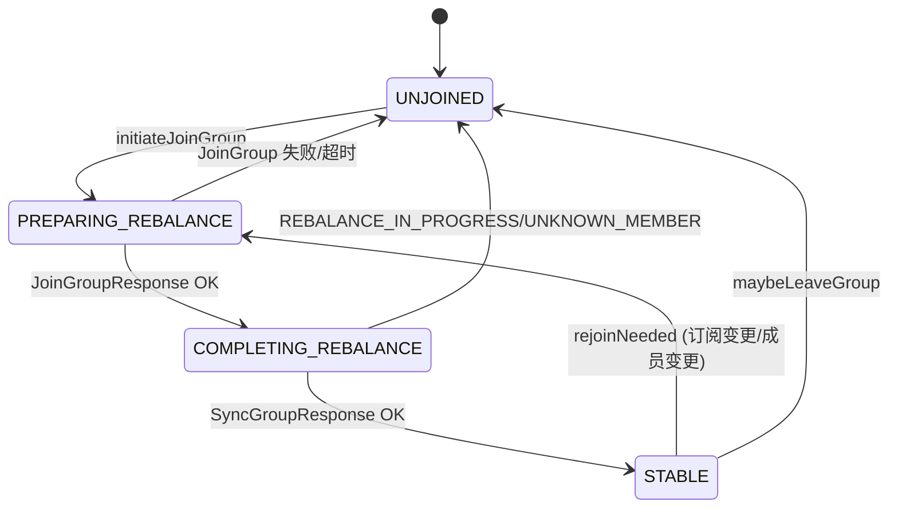
```mermaid
stateDiagram-v2
    [*] --> UNJOINED
    UNJOINED --> PREPARING_REBALANCE: initiateJoinGroup
    PREPARING_REBALANCE --> COMPLETING_REBALANCE: JoinGroupResponse OK
    PREPARING_REBALANCE --> UNJOINED: JoinGroup 失败/超时
    COMPLETING_REBALANCE --> STABLE: SyncGroupResponse OK
    COMPLETING_REBALANCE --> UNJOINED: REBALANCE_IN_PROGRESS/UNKNOWN_MEMBER
    STABLE --> PREPARING_REBALANCE: rejoinNeeded (订阅变更/成员变更)
    STABLE --> UNJOINED: maybeLeaveGroup
```

#### 4.6 HeartbeatThread 心跳线程

`HeartbeatThread`(`AbstractCoordinator.java:1454`)是单独守护线程，周期发送 `HeartbeatRequest`：
- 周期：`heartbeat.interval.ms`
- session 失效：`session.timeout.ms`(coordinator 端若此时间内未收到心跳则把成员踢出)
- 仅在 `state >= COMPLETING_REBALANCE` 时才真正发心跳(`enable()` 在 `JoinGroupResponseHandler` 中被调用)
- 收到 `REBALANCE_IN_PROGRESS`：把 `rejoinNeeded = true`，唤醒 `joinGroupIfNeeded` 重 join
- 收到 `UNKNOWN_MEMBER_ID`/`ILLEGAL_GENERATION`：重置 state 为 `UNJOINED`，下次 poll 重 join

#### 4.7 maybeLeaveGroup

`AbstractCoordinator.java:1170` 在 `close()` 时发 `LeaveGroupRequest`，coordinator 释放该成员并立即触发 rebalance(不必等 session timeout)。

#### 4.8 Rebalance 触发条件

| 触发源 | 客户端侧 | 服务端侧 |
|--------|----------|----------|
| 成员加入/离开 | subscribe/leave 触发 `rejoinNeeded=true` | DelayedJoin 收集成员 |
| 成员超时 | poll 间隔超 `max.poll.interval.ms` | session timeout 移除成员 |
| 订阅变化 | subscribe 新 topic，元数据变更 | leader 上报 protocols 变 |
| 分区数变化 | 元数据刷新感知 | coordinator 推 `REBALANCE_IN_PROGRESS` |
| coordinator 切换 | `markCoordinatorUnknown` | 新 coordinator 加载 `__consumer_offsets` |

### 五、分区分配策略 ConsumerPartitionAssignor

#### 5.1 接口

```java
// ConsumerPartitionAssignor.java:51
public interface ConsumerPartitionAssignor {
    default ByteBuffer subscriptionUserData(Set<String> topics) { return null; }
    GroupAssignment assign(Cluster metadata, GroupSubscription groupSubscription);
    default void onAssignment(Assignment assignment, ConsumerGroupMetadata metadata) {}
    default List<RebalanceProtocol> supportedProtocols() { return Collections.singletonList(RebalanceProtocol.EAGER); }
    ...
}
```

仅 leader 成员执行 `assign`，结果随 `SyncGroupRequest` 上报，coordinator 广播给所有成员。

#### 5.2 EAGER vs COOPERATIVE

| 协议 | 行为 |
|------|------|
| `RebalanceProtocol.EAGER` | 全组撤销所有分区 -> 重新分配 -> 全组再获得。stop-the-world |
| `RebalanceProtocol.COOPERATIVE`(KIP-429) | 增量：仅撤销被回收的分区，已保留分区不中断。需 assignor 支持(如 `CooperativeStickyAssignor`) |

#### 5.3 内置实现

| Assignor | 算法 | 协议 |
|----------|------|------|
| `RangeAssignor`(默认) | 每 topic 按 partition 数 / 成员数均分，余数给前几名 | EAGER |
| `RoundRobinAssignor` | 全 topic partition 按字典序轮转分给成员 | EAGER |
| `StickyAssignor` | 尽量保持上次分配，最小化迁移 | EAGER |
| `CooperativeStickyAssignor` | Sticky 的协作版，支持增量 | COOPERATIVE |

### 六、服务端 GroupCoordinator

#### 6.1 分层架构

Kafka 4.x 把 classic 与 modern 两套协调器合并到 `group-coordinator` 模块，分层如下：

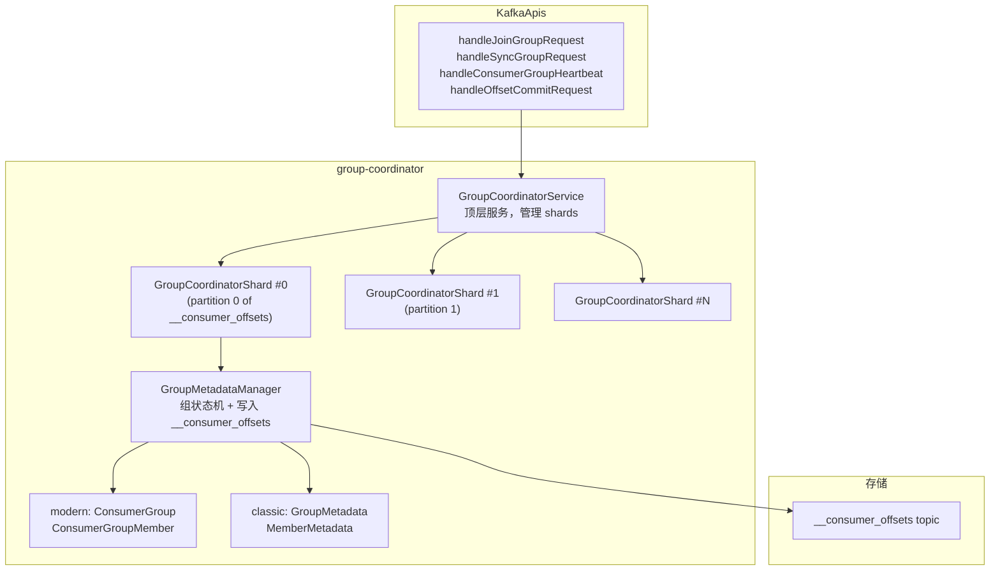
```mermaid
flowchart TB
    subgraph Core["KafkaApis"]
        A["handleJoinGroupRequest<br/>handleSyncGroupRequest<br/>handleConsumerGroupHeartbeat<br/>handleOffsetCommitRequest"]
    end
    subgraph GC["group-coordinator"]
        S["GroupCoordinatorService<br/>顶层服务，管理 shards"]
        SH1["GroupCoordinatorShard #0<br/>(partition 0 of __consumer_offsets)"]
        SH2["GroupCoordinatorShard #1<br/>(partition 1)"]
        SHn["GroupCoordinatorShard #N"]
        MM["GroupMetadataManager<br/>组状态机 + 写入 __consumer_offsets"]
        CG["modern: ConsumerGroup<br/>ConsumerGroupMember"]
        CLG["classic: GroupMetadata<br/>MemberMetadata"]
    end
    subgraph Store["存储"]
        CO["__consumer_offsets topic"]
    end
    A --> S --> SH1 & SH2 & SHn
    SH1 --> MM
    MM --> CLG
    MM --> CG
    MM --> CO
```

- `GroupCoordinatorService`(`group-coordinator/.../GroupCoordinatorService.java`)：管理 N 个 shard，对应 `__consumer_offsets` 的 N 个 partition。请求按 `Utils.abs(groupId.hashCode) % N` 路由到对应 shard
- `GroupCoordinatorShard`：每个 shard 负责一组 group 的状态机，处理 `onElection`(`GroupCoordinator.java:417`)/`onResignation`(`GroupCoordinator.java:432`)领导权变更，并在 `onMetadataUpdate`(`GroupCoordinator.java:443`)时感知分区数变化
- `GroupMetadataManager`：核心业务逻辑，同时支持 classic `GroupMetadata`/`MemberMetadata` 与 modern `ConsumerGroup`/`ConsumerGroupMember`
- `GroupCoordinator` 接口：定义全部对外方法，如 `consumerGroupDescribe`(`GroupCoordinator.java:211`)、`fetchOffsets`(`GroupCoordinator.java:281`)、`deleteGroups`(`GroupCoordinator.java:266`)、`startup`(`GroupCoordinator.java:478`)、`shutdown`(`GroupCoordinator.java:483`)

#### 6.2 classic 服务端处理

`JoinGroupRequest` 处理流程：
1. 鉴权 + 路由到 group 所在 shard
2. 加载/创建 `GroupMetadata`，状态机：`Empty -> PreparingRebalance -> AwaitingSync -> Stable`
3. 成员加入：加入 `members` 集合，若达到 `rebalanceTimeoutMs` 或所有已知成员已加入则完成 join 阶段
4. 选 leader(第一个成员或保留原 leader)，给所有成员回 `JoinGroupResponse`(leader 拿到全部成员的订阅元数据)
5. 进入 `AwaitingSync`，等 leader 发 `SyncGroupRequest` 上报分配
6. 收到 leader sync 后把分配结果广播给每个成员的 `SyncGroupResponse`，状态转 `Stable`

整个 join 阶段由 `DelayedJoin`(基于 `DelayedOperationPurgatory` 时间轮)驱动，等所有成员加入或超时。`__consumer_offsets` 的写入用 produce 路径，等 ISR 确认后才回调客户端。

#### 6.3 服务端 GroupMetadata 状态机(classic)

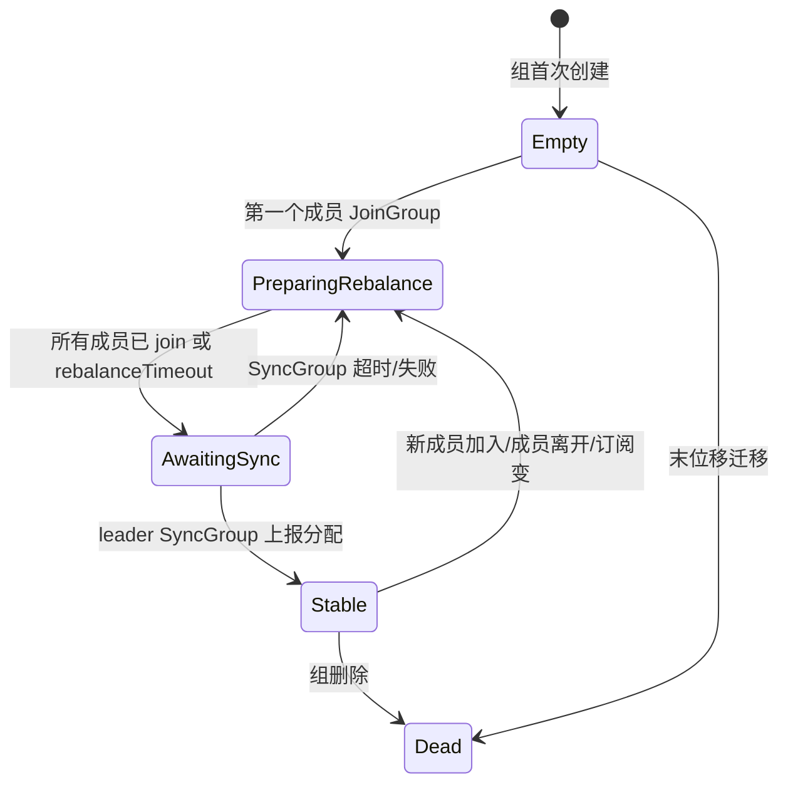
```mermaid
stateDiagram-v2
    [*] --> Empty: 组首次创建
    Empty --> PreparingRebalance: 第一个成员 JoinGroup
    PreparingRebalance --> AwaitingSync: 所有成员已 join 或 rebalanceTimeout
    AwaitingSync --> Stable: leader SyncGroup 上报分配
    Stable --> PreparingRebalance: 新成员加入/成员离开/订阅变
    AwaitingSync --> PreparingRebalance: SyncGroup 超时/失败
    Stable --> Dead: 组删除
    Empty --> Dead: 末位移迁移
```

### 七、新消费者组协议(KIP-848)

#### 7.1 设计动机

classic 协议痛点：
- JoinGroup/SyncGroup 两阶段、stop-the-world
- leader 客户端崩溃会卡住整个组
- 心跳与分配解耦，状态多
- `max.poll.interval.ms` 失效逻辑复杂

KIP-848 把**分配搬到服务端**，用一个长连接的 `ConsumerGroupHeartbeat` 流承载"心跳 + 加入 + 分配 + 确认"全部语义。

#### 7.2 ConsumerGroupHeartbeatRequest

请求/响应对(`ApiKeys.CONSUMER_GROUP_HEARTBEAT`, `ApiKeys.java:116`)字段：
- **请求**：`groupId`、`memberId`、`memberEpoch`、`rackId`、`subscribedTopicNames`/`topicPartners`(订阅)、`serverAssignor`(服务端 assignor 名)、`rebalanceProtocol`、`targetAssignment` 回 ack
- **响应**：`memberId`、`memberEpoch`、`state`(`STABLE/RECONCILING/...`)、`assignment`(分区分配)、`heartbeatIntervalMs`、`error`

#### 7.3 客户端 MemberState 状态机(10 状态)

`MemberState.java:27` 定义 10 个状态，转换表定义在 `MemberState.java:118` 静态块：

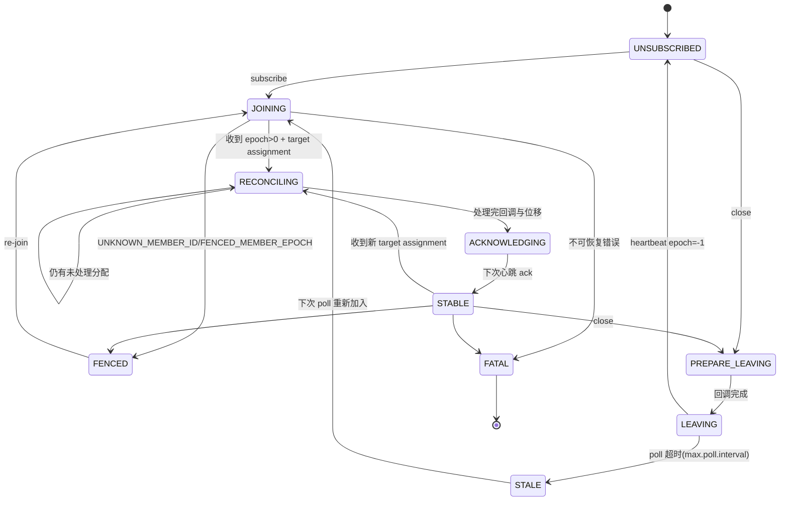
```mermaid
stateDiagram-v2
    [*] --> UNSUBSCRIBED
    UNSUBSCRIBED --> JOINING: subscribe
    JOINING --> RECONCILING: 收到 epoch>0 + target assignment
    RECONCILING --> ACKNOWLEDGING: 处理完回调与位移
    ACKNOWLEDGING --> STABLE: 下次心跳 ack
    STABLE --> RECONCILING: 收到新 target assignment
    RECONCILING --> RECONCILING: 仍有未处理分配
    JOINING --> FENCED: UNKNOWN_MEMBER_ID/FENCED_MEMBER_EPOCH
    STABLE --> FENCED
    FENCED --> JOINING: re-join
    UNSUBSCRIBED --> PREPARE_LEAVING: close
    STABLE --> PREPARE_LEAVING: close
    PREPARE_LEAVING --> LEAVING: 回调完成
    LEAVING --> UNSUBSCRIBED: heartbeat epoch=-1
    LEAVING --> STALE: poll 超时(max.poll.interval)
    STALE --> JOINING: 下次 poll 重新加入
    JOINING --> FATAL: 不可恢复错误
    STABLE --> FATAL
    FATAL --> [*]
```

| 状态 | 触发条件 | 行为 |
|------|----------|------|
| `UNSUBSCRIBED` | 初始/已离开组 | 不发心跳，可提交位移 |
| `JOINING` | 首次 subscribe 或被 fenced | 发心跳 epoch=0 直到收到 epoch>0 |
| `RECONCILING` | 收到新 target assignment | 调用 onPartitionsRevoked/Assigned、提交位移 |
| `ACKNOWLEDGING` | reconcile 完成 | 立即发心跳 ack，不等 interval |
| `STABLE` | ack 完成 | 周期心跳 |
| `FENCED` | 收到 `UNKNOWN_MEMBER_ID`/`FENCED_MEMBER_EPOCH` | 调 onPartitionsLost，转 JOINING |
| `PREPARE_LEAVING` | close | 调回调释放分区 |
| `LEAVING` | 准备发离开心跳 | 发心跳 epoch=-1/-2 |
| `STALE` | `max.poll.interval.ms` 超时 | 发离开心跳，下次 poll 转 JOINING |
| `FATAL` | 不可恢复错误 | 终止 |

#### 7.4 关键客户端类

| 类 | 职责 |
|----|------|
| `ConsumerMembershipManager`(`ConsumerMembershipManager.java`) | 维护 `MemberState`、`memberId`/`memberEpoch`、target/resolved assignment |
| `ConsumerHeartbeatRequestManager`(`ConsumerHeartbeatRequestManager.java`) | 后台 `NetworkClientThread` 事件循环里构造并发 heartbeat |
| `AsyncKafkaConsumer`(`AsyncKafkaConsumer.java:913`) | poll 把 `AsyncPollEvent` 投递给后台线程 |

#### 7.5 服务端 ConsumerGroup / ConsumerGroupMember

| 类 | 职责 |
|----|------|
| `ConsumerGroup`(`group-coordinator/.../modern/consumer/ConsumerGroup.java`) | modern 组状态，成员表、订阅、target/resolved assignment |
| `ConsumerGroupMember`(`group-coordinator/.../modern/consumer/ConsumerGroupMember.java`) | 单成员状态(memberId/epoch/assignment/state) |
| `GroupMetadataManager` 同时管理 | 通过 `ConsumerGroupMigrationPolicy` 在 classic/modern 间迁移 |

服务端收到 `ConsumerGroupHeartbeatRequest`：按 `groupId` 路由到 shard -> `ConsumerGroup` 状态机推进 -> 若订阅变更触发**服务端 assignor**(`UniformAssignor` 等)重算 target assignment -> 响应带回新分配 -> 客户端 reconcile。

#### 7.6 新旧协议对比(再强调)

| 维度 | classic | modern |
|------|---------|--------|
| 状态数 | 4 | 10(更细粒度) |
| 分配位置 | leader 客户端 | 服务端 |
| Rebalance 单位 | 全组 | 增量，仅影响受影响成员 |
| `max.poll.interval` | 影响整个组 | 仅影响单成员 |
| leader 崩溃影响 | 整组卡住 | 无 leader 概念 |
| 网络往返 | JoinGroup+SyncGroup+多次Heartbeat | 单一 heartbeat 流 |

### 八、Rebalance 完整时序

#### 8.1 classic 协议 rebalance 时序

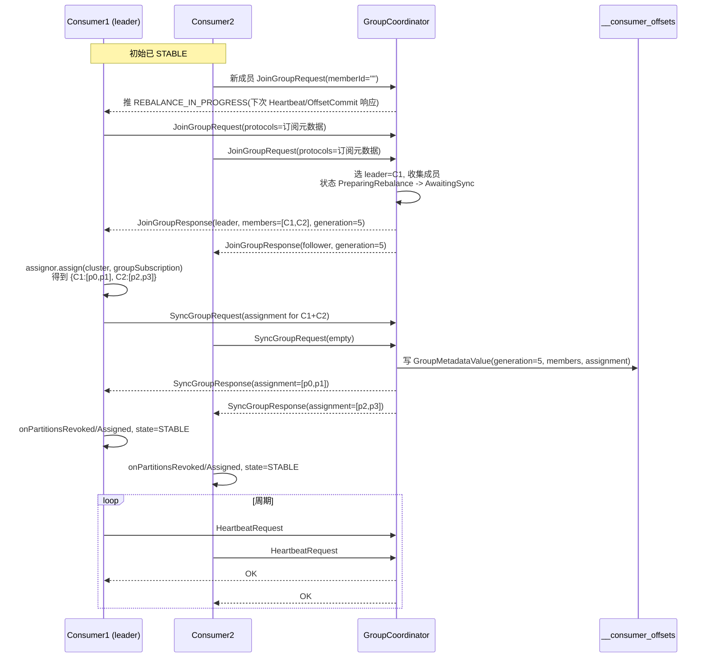
```mermaid
sequenceDiagram
    participant C1 as Consumer1 (leader)
    participant C2 as Consumer2
    participant GC as GroupCoordinator
    participant CD as __consumer_offsets

    Note over C1,C2: 初始已 STABLE
    C2->>GC: 新成员 JoinGroupRequest(memberId="")
    GC-->>C1: 推 REBALANCE_IN_PROGRESS(下次 Heartbeat/OffsetCommit 响应)
    C1->>GC: JoinGroupRequest(protocols=订阅元数据)
    C2->>GC: JoinGroupRequest(protocols=订阅元数据)
    GC->>GC: 选 leader=C1, 收集成员<br/>状态 PreparingRebalance -> AwaitingSync
    GC-->>C1: JoinGroupResponse(leader, members=[C1,C2], generation=5)
    GC-->>C2: JoinGroupResponse(follower, generation=5)
    C1->>C1: assignor.assign(cluster, groupSubscription)<br/>得到 {C1:[p0,p1], C2:[p2,p3]}
    C1->>GC: SyncGroupRequest(assignment for C1+C2)
    C2->>GC: SyncGroupRequest(empty)
    GC->>CD: 写 GroupMetadataValue(generation=5, members, assignment)
    GC-->>C1: SyncGroupResponse(assignment=[p0,p1])
    GC-->>C2: SyncGroupResponse(assignment=[p2,p3])
    C1->>C1: onPartitionsRevoked/Assigned, state=STABLE
    C2->>C2: onPartitionsRevoked/Assigned, state=STABLE
    loop 周期
        C1->>GC: HeartbeatRequest
        C2->>GC: HeartbeatRequest
        GC-->>C1: OK
        GC-->>C2: OK
    end
```

#### 8.2 modern 协议 rebalance 时序

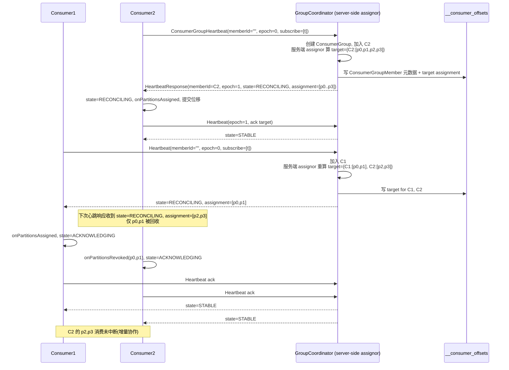
```mermaid
sequenceDiagram
    participant C1 as Consumer1
    participant C2 as Consumer2
    participant GC as GroupCoordinator (server-side assignor)
    participant CD as __consumer_offsets

    C2->>GC: ConsumerGroupHeartbeat(memberId="", epoch=0, subscribe=[t])
    GC->>GC: 创建 ConsumerGroup, 加入 C2<br/>服务端 assignor 算 target={C2:[p0,p1,p2,p3]}
    GC->>CD: 写 ConsumerGroupMember 元数据 + target assignment
    GC-->>C2: HeartbeatResponse(memberId=C2, epoch=1, state=RECONCILING, assignment=[p0..p3])
    C2->>C2: state=RECONCILING, onPartitionsAssigned, 提交位移
    C2->>GC: Heartbeat(epoch=1, ack target)
    GC-->>C2: state=STABLE

    C1->>GC: Heartbeat(memberId="", epoch=0, subscribe=[t])
    GC->>GC: 加入 C1<br/>服务端 assignor 重算 target={C1:[p0,p1], C2:[p2,p3]}
    GC->>CD: 写 target for C1, C2
    GC-->>C1: state=RECONCILING, assignment=[p0,p1]
    Note over C2: 下次心跳响应收到 state=RECONCILING, assignment=[p2,p3]<br/>仅 p0,p1 被回收
    C1->>C1: onPartitionsAssigned, state=ACKNOWLEDGING
    C2->>C2: onPartitionsRevoked(p0,p1), state=ACKNOWLEDGING
    C1->>GC: Heartbeat ack
    C2->>GC: Heartbeat ack
    GC-->>C1: state=STABLE
    GC-->>C2: state=STABLE
    Note over C1,C2: C2 的 p2,p3 消费未中断(增量协作)
```

### 九、关键源码文件清单

| 类别 | 文件 |
|------|------|
| Facade | `clients/src/main/java/org/apache/kafka/clients/consumer/KafkaConsumer.java` |
| Classic 实现 | `clients/src/main/java/org/apache/kafka/clients/consumer/internals/ClassicKafkaConsumer.java` |
| Modern 实现 | `clients/src/main/java/org/apache/kafka/clients/consumer/internals/AsyncKafkaConsumer.java` |
| 网络封装 | `clients/src/main/java/org/apache/kafka/clients/consumer/internals/ConsumerNetworkClient.java` |
| Fetch | `clients/src/main/java/org/apache/kafka/clients/consumer/internals/Fetcher.java`、`AbstractFetch.java`、`FetchCollector.java` |
| Classic Coordinator | `clients/src/main/java/org/apache/kafka/clients/consumer/internals/AbstractCoordinator.java`、`ConsumerCoordinator.java` |
| Modern 状态 | `clients/src/main/java/org/apache/kafka/clients/consumer/internals/MemberState.java`、`ConsumerMembershipManager.java`、`ConsumerHeartbeatRequestManager.java` |
| 分配策略 | `clients/src/main/java/org/apache/kafka/clients/consumer/ConsumerPartitionAssignor.java`、`RangeAssignor`、`RoundRobinAssignor`、`StickyAssignor`、`CooperativeStickyAssignor` |
| 服务端协调器 | `group-coordinator/src/main/java/org/apache/kafka/coordinator/group/GroupCoordinator.java`、`GroupCoordinatorService.java`、`GroupCoordinatorShard.java`、`GroupMetadataManager.java` |
| Modern 服务端 | `group-coordinator/src/main/java/org/apache/kafka/coordinator/group/modern/consumer/ConsumerGroup.java`、`ConsumerGroupMember.java` |
| 协议 | `clients/src/main/java/org/apache/kafka/common/requests/JoinGroupRequest.java`、`SyncGroupRequest.java`、`HeartbeatRequest.java`、`ConsumerGroupHeartbeatRequest.java` |

---

## 四、消息存储、消息格式与零拷贝

### 一、存储整体设计

#### 1.1 层次结构

Kafka 的存储呈 **Topic -> Partition -> LogSegment 序列** 的层次。每个 Partition 在磁盘上对应一个目录，目录名为 `topic-partition`，目录内是该分区所有 LogSegment 的文件集合。

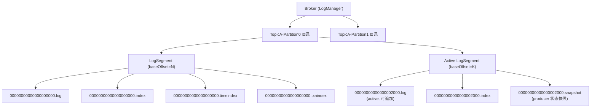
```mermaid
flowchart TD
    Broker["Broker (LogManager)"]
    Broker --> TP1["TopicA-Partition0 目录"]
    Broker --> TP2["TopicA-Partition1 目录"]
    TP1 --> Seg0["LogSegment (baseOffset=N)"]
    TP1 --> SegA["Active LogSegment (baseOffset=K)"]
    Seg0 --> F0["00000000000000000000.log"]
    Seg0 --> I0["00000000000000000000.index"]
    Seg0 --> T0["00000000000000000000.timeindex"]
    Seg0 --> X0["00000000000000000000.txnindex"]
    SegA --> FA["00000000000000002000.log<br/>(active, 可追加)"]
    SegA --> IA["00000000000000002000.index"]
    SegA --> PA["00000000000000002000.snapshot<br/>(producer 状态快照)"]
```

每个 LogSegment 由一组文件组成，文件名前缀是 **20 位零填充的 baseOffset**（`LogFileUtils.filenamePrefixFromOffset`，`LogFileUtils.java:102-108`），保证 `ls` 按数值排序：

| 后缀 | 含义 | 定义位置 |
|------|------|----------|
| `.log` | 实际消息数据（FileRecords） | `LogFileUtils.java:37` |
| `.index` | 偏移量稀疏索引（OffsetIndex） | `LogFileUtils.java:42` |
| `.timeindex` | 时间戳索引（TimeIndex） | `LogFileUtils.java:47` |
| `.txnindex` | 事务索引（TransactionIndex） | `LogFileUtils.java:52` |
| `.snapshot` | Producer 状态快照 | `LogFileUtils.java:27` |
| `.cleaned` | 清理中的临时段 | `LogFileUtils.java:55` |
| `.swap` | 原子替换的临时段 | `LogFileUtils.java:58` |
| `.deleted` | 标记待异步删除 | `LogFileUtils.java:32` |

#### 1.2 职责分层

Kafka 4.x 将存储逻辑从 Scala（`core` 模块）迁移到 Java（`storage` 模块），形成清晰分层：

| 类 | 职责 | 文件 |
|----|------|------|
| `UnifiedLog` | 统一日志视图（本地 + 远程分层存储），对外 API，offset 分配、producer 状态、leader epoch、清理协调 | `storage/.../log/UnifiedLog.java:105` |
| `LocalLog` | 本地段的追加、滚动（roll）、截断、删除、读取；管理 `LogSegments` 与目录 | `storage/.../log/LocalLog.java:68` |
| `LogSegments` | 线程安全的 `ConcurrentSkipListMap<Long baseOffset, LogSegment>`，提供 floor/lower/higher 等导航查询 | `storage/.../log/LogSegments.java:38-42` |
| `LogSegment` | 单个段：`FileRecords log` + `LazyIndex<OffsetIndex>` + `LazyIndex<TimeIndex>` + `TransactionIndex`，负责 append/read/recover/flush | `storage/.../log/LogSegment.java:65` |

`LogSegments` 内部用一个 `ConcurrentSkipListMap` 以 baseOffset 为键存储所有段（`LogSegments.java:42`）。**active segment 永远是键最大的那个**（`LogSegments.java:322-324`）。`floorSegment(offset)` 返回 baseOffset <= 给定 offset 的最大段，是定位段的核心方法。

`UnifiedLog` 封装 `LocalLog`，并在其上叠加：offset 分配（`LogValidator`）、producer 幂等/事务状态校验（`ProducerStateManager`）、leader epoch 缓存、远程分层存储视图。所有修改操作都通过 `UnifiedLog.lock`（`UnifiedLog.java:123`）串行化。

### 二、消息格式 v2（DefaultRecordBatch）

#### 2.1 整体结构

Kafka 4.0 起只写入 magic=2 格式（`RecordBatch.CURRENT_MAGIC_VALUE = MAGIC_VALUE_V2 = 2`，`RecordBatch.java:41,46`）。每个 **RecordBatch** 是写入和读取的最小单元，包含一个固定头部 + N 条 Record。文件前 12 字节是**日志开销**（`Records.java:45-49`），所有 magic 版本通用。

#### 2.2 RecordBatch 头部字节布局（magic v2）

`DefaultRecordBatch` 类以常量精确定义每个字段的偏移（`DefaultRecordBatch.java:104-131`）：

| 偏移(byte) | 长度 | 字段 | 说明 |
|-----------|------|------|------|
| 0 | 8 | BaseOffset (Int64) | 批次第一条消息的 offset（压缩后也保留原始值） |
| 8 | 4 | Length (Int32) | 本批从 PartitionLeaderEpoch 起的字节数（不含前 12 字节日志开销） |
| 12 | 4 | PartitionLeaderEpoch (Int32) | 写入的 leader epoch，**不参与 CRC** |
| 16 | 1 | Magic (Int8) | 固定 2 |
| 17 | 4 | CRC (Uint32) | CRC-32C，覆盖 Attributes 到批末尾 |
| 21 | 2 | Attributes (Int16) | 见下文位定义 |
| 23 | 4 | LastOffsetDelta (Int32) | 最后一条记录相对 baseOffset 的增量 |
| 27 | 8 | BaseTimestamp (Int64) | 第一条记录的时间戳（或 delete horizon） |
| 35 | 8 | MaxTimestamp (Int64) | 批内最大时间戳 |
| 43 | 8 | ProducerId (Int64) | 幂等/事务 producerId，非事务为 -1 |
| 51 | 2 | ProducerEpoch (Int16) | producer epoch，非事务为 -1 |
| 53 | 4 | BaseSequence (Int32) | 基序列号，非幂等为 -1 |
| 57 | 4 | RecordsCount (Int32) | 批内记录数 |
| 61 | 变长 | Records | Record 序列（压缩则整体压缩） |

**头部固定开销 `RECORD_BATCH_OVERHEAD = 61`**（`DefaultRecordBatch.java:131`）。

#### 2.3 Attributes 位定义

`Attributes` 是 2 字节，但当前只用到低字节（`DefaultRecordBatch.java:403-406`）。位布局（`DefaultRecordBatch.java:99-101`）：

```
 ----------------------------------------------------------------------------------------------------------
 | Unused (7-15) | Delete Horizon (6) | Control (5) | Transactional (4) | Timestamp Type (3) | Compression (0-2) |
 ----------------------------------------------------------------------------------------------------------
```

| 位 | 掩码 | 含义 | 定义 |
|----|------|------|------|
| 0-2 | `0x07` | 压缩类型：0=NONE,1=GZIP,2=SNAPPY,3=LZ4,4=ZSTD | `CompressionType.java:30-130` |
| 3 | `0x08` | 时间戳类型：0=CreateTime,1=LogAppendTime | |
| 4 | `0x10` | 事务标记（isTransactional） | |
| 5 | `0x20` | 控制批次（isControlBatch，如 commit/abort marker） | |
| 6 | `0x40` | Delete Horizon 标记（tombstone 删除时点） | `DefaultRecordBatch.java:136` |

位运算在 `computeAttributes`（`DefaultRecordBatch.java:424-440`）中实现。

#### 2.4 Record 字节布局（v2 内层）

`DefaultRecord` 描述了单条记录的格式（`DefaultRecord.java:40-58`），全部使用 **varint/varlong 变长编码**压缩：

| 字段 | 类型 | 说明 |
|------|------|------|
| Length | Varint | 后续 body 的字节数 |
| Attributes | Int8 | 当前未用（全 0） |
| TimestampDelta | Varlong | 相对批 BaseTimestamp 的增量 |
| OffsetDelta | Varint | 相对批 BaseOffset 的增量 |
| KeyLength | Varint | key 长度，-1 表示 null |
| Key | Bytes | key 内容 |
| ValueLength | Varint | value 长度，-1 表示 null（tombstone） |
| Value | Bytes | value 内容 |
| HeadersCount | Varint | header 数量 |
| Headers | [Header] | 每个 header = HeaderKeyLen(varint)+Key(utf8)+HeaderValueLen(varint)+Value |

**变长编码的意义**：offsetDelta、timestampDelta 通常很小，varint 用 1-5 字节表示，相比 v0/v1 的固定 8 字节 offset + 8 字节 timestamp 大幅节省空间。单条记录最小开销 `MAX_RECORD_OVERHEAD = 21`（`DefaultRecord.java:72`）。

#### 2.5 v0/v1 历史格式对比

| 特性 | v0 (magic=0) | v1 (magic=1) | v2 (magic=2) |
|------|-------------|-------------|--------------|
| 时间戳 | 无 | 有 (8B) | 有，存 delta (varlong) |
| 单批记录数 | 未压缩=1，压缩=多 | 同 v0 | 始终可多条 |
| 压缩 | 单条消息压缩 | 单条消息压缩 | 整批压缩 |
| CRC 算法 | CRC32 | CRC32 | CRC32C (Castagnoli) |
| ProducerId/Epoch/Sequence | 无 | 无 | 有 |
| 事务/控制批 | 无 | 无 | 有 |
| Headers | 无 | 无 | 有 |
| offset 存储 | 绝对 (8B) | 绝对 (8B) | 相对 delta (varint) |
| 单条 overhead | 14B (v0) | 22B (v1) | 最小 21B + varint |

v0/v1 每条消息都有独立的 12B 日志开销（offset+size），v2 把这 12B 提到批级别，批内记录共享，极大提升小消息的存储密度。v2 的 CRC 覆盖范围从 `ATTRIBUTES_OFFSET` 到批末尾，**PartitionLeaderEpoch 不在 CRC 内**（`DefaultRecordBatch.java:67-71`），因为该字段在 broker 间转发时会被重新赋值。

### 三、写入流程

#### 3.1 端到端写入链路

写入入口是 `UnifiedLog.appendAsLeader`（`UnifiedLog.java:1020`），核心流程在私有 `append` 方法（`UnifiedLog.java:1115-1292`）：

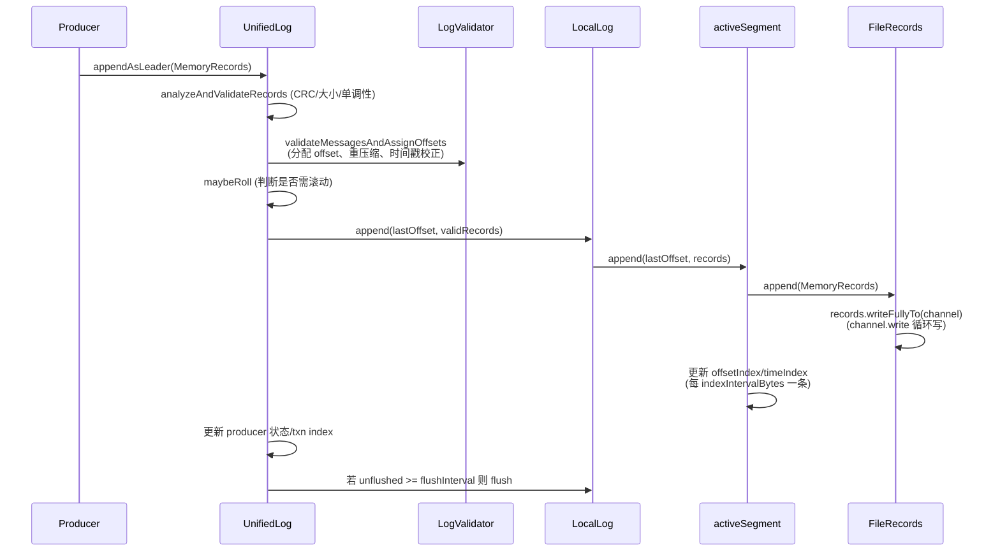
```mermaid
sequenceDiagram
    participant P as Producer
    participant U as UnifiedLog
    participant V as LogValidator
    participant L as LocalLog
    participant S as activeSegment
    participant F as FileRecords

    P->>U: appendAsLeader(MemoryRecords)
    U->>U: analyzeAndValidateRecords (CRC/大小/单调性)
    U->>V: validateMessagesAndAssignOffsets<br/>(分配 offset、重压缩、时间戳校正)
    U->>U: maybeRoll (判断是否需滚动)
    U->>L: append(lastOffset, validRecords)
    L->>S: append(lastOffset, records)
    S->>F: append(MemoryRecords)
    F->>F: records.writeFullyTo(channel)<br/>(channel.write 循环写)
    S->>S: 更新 offsetIndex/timeIndex<br/>(每 indexIntervalBytes 一条)
    U->>U: 更新 producer 状态/txn index
    U->>L: 若 unflushed >= flushInterval 则 flush
```

#### 3.2 追加到 active segment

`LogSegment.append`（`LogSegment.java:250-280`）做三件事：
1. 调 `log.append(records)` 写入 FileRecords
2. 遍历 batch 更新 `maxTimestampAndOffsetSoFar`
3. **稀疏索引**：当 `bytesSinceLastIndexEntry > indexIntervalBytes` 时，向 offsetIndex 和 timeIndex 各追加一条

```java
// LogSegment.java:270-274
if (bytesSinceLastIndexEntry > indexIntervalBytes) {
    offsetIndex().append(batchLastOffset, physicalPosition);
    timeIndex().maybeAppend(maxTimestampSoFar(), shallowOffsetOfMaxTimestampSoFar());
    bytesSinceLastIndexEntry = 0;
}
```

`FileRecords.append` 最终走 `MemoryRecords.writeFullyTo(channel)`，即用 NIO `FileChannel.write` 循环写直到写完（`MemoryRecords.java:84-91`）。

#### 3.3 段滚动（Roll）条件

`LogSegment.shouldRoll`（`LogSegment.java:167-173`）定义滚动条件，满足任一即滚：

```java
// LogSegment.java:167-173
public boolean shouldRoll(RollParams rollParams) throws IOException {
    boolean reachedRollMs = timeWaitedForRoll(rollParams.now(), rollParams.maxTimestampInMessages())
        > rollParams.maxSegmentMs() - rollJitterMs;
    int size = size();
    return size > rollParams.maxSegmentBytes() - rollParams.messagesSize() ||   // ① 大小
        (size > 0 && reachedRollMs) ||                                          // ② 时间
        offsetIndex().isFull() || timeIndex().isFull() ||                      // ③ 索引满
        !canConvertToRelativeOffset(rollParams.maxOffsetInMessages());         // ④ offset 溢出
}
```

| 条件 | 配置项 | 默认值 | 说明 |
|------|--------|--------|------|
| ① segment.bytes | `segment.bytes` | 1GB | 段大小上限 |
| ② segment.ms | `segment.ms` | 168h(7天) | 段时间上限（减去 jitter） |
| ③ index 满 | `segment.index.bytes` | 10MB | offset/time 索引槽用尽 |
| ④ offset 溢出 | 相对 offset 超 Integer.MAX_VALUE | - | 极端场景 |

`timeWaitedForRoll` 优先用**第一条 batch 的时间戳**而非墙上时钟（`LogSegment.java:709-716`），避免 producer 时钟漂移导致误滚。

#### 3.4 刷盘策略

Kafka 默认**依赖 OS Page Cache 而非主动 fsync**。刷盘由两个配置控制：
- `flush.messages`（`LogConfig.flushInterval`）：每追加这么多条消息触发一次 flush
- `flush.ms`：定时刷盘

```java
// UnifiedLog.java:1286
if (localLog.unflushedMessages() >= config().flushInterval) flush(false);
```

`LocalLog.flush` 遍历 [recoveryPoint, offset) 范围的段调 `logSegment.flush()`，最终 `channel.force(true)`（`FileRecords.java:206-208`）。`recoveryPoint` 标记已刷盘 offset，crash 后从此处开始恢复。

### 四、索引设计

#### 4.1 AbstractIndex：mmap + 缓存友好二分

所有索引继承 `AbstractIndex`（`AbstractIndex.java:42`），核心是用 **`MappedByteBuffer mmap`** 映射索引文件到内存（`AbstractIndex.java:72`），所有读写直接走 OS Page Cache，避免用户态拷贝：

```java
// AbstractIndex.java:100-124 (createAndAssignMmap)
RandomAccessFile raf = new RandomAccessFile(file, "rw");
if (newlyCreated) {
    raf.setLength(roundDownToExactMultiple(maxIndexSize, entrySize()));
}
MappedByteBuffer mmap = raf.getChannel().map(FileChannel.MapMode.READ_WRITE, 0, length);
```

**缓存友好的二分查找**（`AbstractIndex.java:330-386` 注释）是 Kafka 索引的一大亮点。标准二分查找在 13 页索引中查找末尾会访问 page 0,6,9,11,12，其中 page 7,10 因长期未访问被换出 Page Cache，导致缺页延迟可达 1 秒。Kafka 的优化：

```
if (target > indexEntry[end - N])   // N = warmEntries = 8192/entrySize
    binarySearch(end - N, end)      // 只在"热区"末尾 N 条内查
else
    binarySearch(begin, end - N)    // 否则查前面的冷区
```

`warmEntries()` 返回 8192/entrySize（`AbstractIndex.java:387-389`），保证热区在每次查找中被触碰的条目能覆盖全部热区页面（4KB 页）。

#### 4.2 OffsetIndex：偏移量->物理位置

`OffsetIndex`（`OffsetIndex.java:54`）每条 **8 字节**：4 字节相对 offset + 4 字节物理位置：

```java
// OffsetIndex.java:143-159 (append)
public void append(long offset, int position) {
    mmap().putInt(relativeOffset(offset));  // 相对 offset = offset - baseOffset
    mmap().putInt(position);                 // 在 .log 文件中的字节位置
    incrementEntries();
    lastOffset = offset;
}
```

**相对 offset**（`AbstractIndex.java:311-315`）：`relativeOffset = offset - baseOffset`，用 int（4B）而非 long（8B）存储。**稀疏索引**：不是每条消息都有索引项，而是每 `index.interval.bytes`（默认 4KB）字节的消息数据插一条。**查找** `lookup(targetOffset)`（`OffsetIndex.java:97-106`）返回 <= targetOffset 的最大条目，即物理位置下界。

#### 4.3 TimeIndex：时间戳->offset

`TimeIndex`（`TimeIndex.java:54`）每条 **12 字节**：8 字节时间戳 + 4 字节相对 offset。语义：一条 (TIMESTAMP, OFFSET) 表示"OFFSET 之前见过的最大时间戳是 TIMESTAMP"。`maybeAppend` 仅在 timestamp > lastEntry.timestamp 时才追加（`TimeIndex.java:203`），保证单调递增。

#### 4.4 TransactionIndex

`TransactionIndex`（`TransactionIndex.java:48`）记录**中止事务**的元数据，供 READ_COMMITTED 消费者过滤。它**不继承 AbstractIndex**，不用 mmap，而是普通的 FileChannel 顺序追加。每条 `AbortedTxn` 记录 producerId、firstOffset、lastOffset、lastStableOffset。

### 五、读取流程

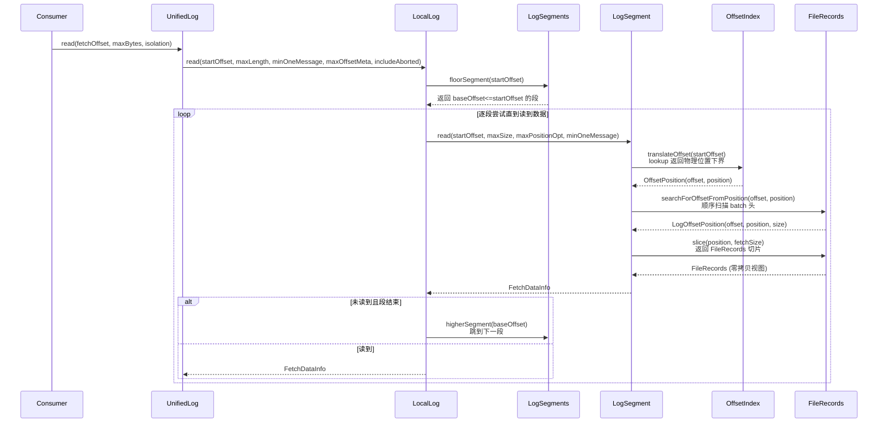
```mermaid
sequenceDiagram
    participant C as Consumer
    participant U as UnifiedLog
    participant L as LocalLog
    participant Segs as LogSegments
    participant Seg as LogSegment
    participant OI as OffsetIndex
    participant FR as FileRecords

    C->>U: read(fetchOffset, maxBytes, isolation)
    U->>L: read(startOffset, maxLength, minOneMessage, maxOffsetMeta, includeAborted)
    L->>Segs: floorSegment(startOffset)
    Segs-->>L: 返回 baseOffset<=startOffset 的段
    loop 逐段尝试直到读到数据
        L->>Seg: read(startOffset, maxSize, maxPositionOpt, minOneMessage)
        Seg->>OI: translateOffset(startOffset)<br/>lookup 返回物理位置下界
        OI-->>Seg: OffsetPosition(offset, position)
        Seg->>FR: searchForOffsetFromPosition(offset, position)<br/>顺序扫描 batch 头
        FR-->>Seg: LogOffsetPosition(offset, position, size)
        Seg->>FR: slice(position, fetchSize)<br/>返回 FileRecords 切片
        FR-->>Seg: FileRecords (零拷贝视图)
        Seg-->>L: FetchDataInfo
        alt 未读到且段结束
            L->>Segs: higherSegment(baseOffset)<br/>跳到下一段
        else 读到
            L-->>U: FetchDataInfo
        end
    end
```

**`LogSegment.translateOffset`**（`LogSegment.java:394-397`）：先用 OffsetIndex 二分得到物理位置下界，再在 .log 中顺序扫描定位包含该 offset 的 batch。**`LogSegment.read`** 定位后用 `log.slice(startPosition, fetchSize)` 返回 FileRecords 切片。**切片不拷贝数据**，只是 (start, end) 视图（`FileRecords.java:143-148`），后续通过 `writeTo` 直接零拷贝发送。

### 六、零拷贝实现

Kafka 在不同路径使用不同的零拷贝/高效 I/O 技术：

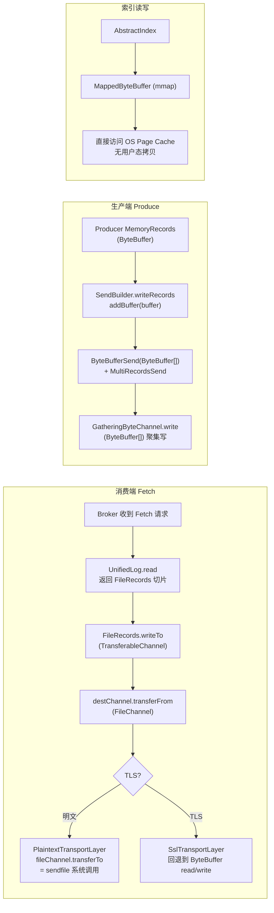
```mermaid
flowchart LR
    subgraph 消费端 Fetch
        A1["Broker 收到 Fetch 请求"] --> A2["UnifiedLog.read<br/>返回 FileRecords 切片"]
        A2 --> A3["FileRecords.writeTo<br/>(TransferableChannel)"]
        A3 --> A4["destChannel.transferFrom<br/>(FileChannel)"]
        A4 --> A5{"TLS?"}
        A5 -->|明文| A6["PlaintextTransportLayer<br/>fileChannel.transferTo<br/>= sendfile 系统调用"]
        A5 -->|TLS| A7["SslTransportLayer<br/>回退到 ByteBuffer read/write"]
    end
    subgraph 生产端 Produce
        B1["Producer MemoryRecords<br/>(ByteBuffer)"] --> B2["SendBuilder.writeRecords<br/>addBuffer(buffer)"]
        B2 --> B3["ByteBufferSend(ByteBuffer[])<br/>+ MultiRecordsSend"]
        B3 --> B4["GatheringByteChannel.write<br/>(ByteBuffer[]) 聚集写"]
    end
    subgraph 索引读写
        C1["AbstractIndex"] --> C2["MappedByteBuffer (mmap)"]
        C2 --> C3["直接访问 OS Page Cache<br/>无用户态拷贝"]
    end
```

#### 6.1 消费端：sendfile

这是 Kafka 最经典的零拷贝路径。消费端 Fetch 响应直接把 .log 文件内容发送到 socket，**全程无用户态数据拷贝**。

```java
// FileRecords.java:291-303
public int writeTo(TransferableChannel destChannel, int offset, int length) throws IOException {
    long position = start + offset;
    int count = Math.min(length, oldSize - offset);
    return (int) destChannel.transferFrom(channel, position, count);
}

// PlaintextTransportLayer.java:213-215
public long transferFrom(FileChannel fileChannel, long position, long count) throws IOException {
    return fileChannel.transferTo(position, count, socketChannel);
}
```

`FileChannel.transferTo` 底层在 Linux 上是 `sendfile(2)` 系统调用：数据从 page cache 经 DMA 直接拷到 socket buffer，**不经过用户态**，2 次上下文切换而非 read+write 的 4 次。TLS 路径（`SslTransportLayer.transferFrom`）无法用 sendfile（数据需加密），退化为 ByteBuffer 读后再加密写。

#### 6.2 生产端：Gathering Writes（Scatter/Gather）

`SendBuilder.writeRecords`（`SendBuilder.java:137-148`）：MemoryRecords 直接把其 buffer 加入待发送列表。`ByteBufferSend` 持有 `ByteBuffer[]`，写入时用 `GatheringByteChannel.write(ByteBuffer[])` 一次系统调用写入多个不连续缓冲区（Scatter/Gather），减少系统调用。

#### 6.3 索引：mmap

`AbstractIndex` 用 `MappedByteBuffer`（`AbstractIndex.java:72`）将索引文件映射到进程地址空间。读取索引项时直接访问 mmap 内存，由 OS 按需缺页调入 Page Cache，**无 read 系统调用、无用户态拷贝**。写入索引也直接写 mmap，由 OS 异步刷盘。

#### 6.4 零拷贝技术对比

| 场景 | 数据源 | 技术 | 系统调用 | 关键类:行号 |
|------|--------|------|----------|------------|
| 消费端 Fetch（明文） | .log 文件 | sendfile | `sendfile(2)` | `PlaintextTransportLayer:214` |
| 消费端 Fetch（TLS） | .log 文件 | 回退 read+write | `read`/`write` | `SslTransportLayer:1003` |
| 生产端 Produce | MemoryRecords (ByteBuffer) | Gathering Write | `writev(2)` | `SendBuilder:154`, `MemoryRecords:88` |
| Follower 复制 | .log 文件切片 | sendfile | `sendfile(2)` | `FileRecords:302`, `MultiRecordsSend:89` |
| 索引读写 | .index/.timeindex | mmap | 缺页异常 | `AbstractIndex:72,378` |
| 日志追加 | MemoryRecords -> .log | 普通 write | `write(2)` | `FileRecords:198`, `MemoryRecords:88` |

### 七、日志清理

#### 7.1 两种清理策略

`cleanup.policy` 配置（`LogConfig.java:320-327`）支持 `delete`、`compact` 或两者组合。`UnifiedLog.deleteOldSegments` 根据策略分发：delete 按时间/大小删除旧段；compact 按 key 保留最新值；混合策略先 compact 再 delete，tombstone 保留 `delete.retention.ms` 后清除。

#### 7.2 Compact 策略

`LogCleaner`（`LogCleaner.java:98`）维护 `CleanerThread` 池。`LogCleanerManager.grabFilthiestCompactedLog` 选择清理点：

- **firstDirtyOffset**：上次清理到的 offset（checkpoint），即"脏数据"起点
- **firstUncleanableOffset**：取 LSO、active 段 baseOffset、`min.compaction.lag.ms` 约束三者最小，clean 不能越过此点
- 过滤出 `cleanableRatio > min.cleanable.dirty.ratio` 或受 `max.compaction.lag.ms` 约束需强制清理的 log

`Cleaner.clean`（`Cleaner.java:138-189`）算法：
1. **构建 OffsetMap**（`SkimpyOffsetMap`）：遍历脏区间所有 batch，对每条有 key 的记录 `map.put(key, offset)` 记录 key->最新 offset
2. **分组**：把相邻小段合并成一组
3. **逐组清理**：创建 `.cleaned` 临时段，对组内每段调 `cleanInto`，用 `MemoryRecords.filterTo` 过滤后写入目标段

**去重原理**：OffsetMap 中存的是每个 key 在脏区间的最大 offset。扫描时，只有 `record.offset() >= map.get(key)` 的记录才保留，即每个 key 只保留最后一次写入。tombstone（value=null）保留 `delete.retention.ms` 后清除。

#### 7.3 段替换（原子交换）

`LocalLog.replaceSegments`（`LocalLog.java:1001-1061`）以崩溃安全的方式替换旧段：新段（`.cleaned`）按 baseOffset 降序改名 `.swap` -> 加入 existingSegments -> 旧段改名 `.deleted` 异步删除 -> `.swap` 改回正式名。崩溃恢复逻辑在 `LogLoader` 中根据残留文件判断操作进行到哪一步，回滚或继续完成。

### 八、关键源码文件索引

| 模块 | 文件路径 |
|------|----------|
| 统一日志 | `storage/src/main/java/org/apache/kafka/storage/internals/log/UnifiedLog.java` |
| 本地日志 | `storage/src/main/java/org/apache/kafka/storage/internals/log/LocalLog.java` |
| 日志段 | `storage/src/main/java/org/apache/kafka/storage/internals/log/LogSegment.java` |
| 段集合 | `storage/src/main/java/org/apache/kafka/storage/internals/log/LogSegments.java` |
| 索引基类 | `storage/src/main/java/org/apache/kafka/storage/internals/log/AbstractIndex.java` |
| 偏移索引 | `storage/src/main/java/org/apache/kafka/storage/internals/log/OffsetIndex.java` |
| 时间索引 | `storage/src/main/java/org/apache/kafka/storage/internals/log/TimeIndex.java` |
| 事务索引 | `storage/src/main/java/org/apache/kafka/storage/internals/log/TransactionIndex.java` |
| 日志清理器 | `storage/src/main/java/org/apache/kafka/storage/internals/log/LogCleaner.java` |
| 清理管理器 | `storage/src/main/java/org/apache/kafka/storage/internals/log/LogCleanerManager.java` |
| Cleaner | `storage/src/main/java/org/apache/kafka/storage/internals/log/Cleaner.java` |
| OffsetMap | `storage/src/main/java/org/apache/kafka/storage/internals/log/SkimpyOffsetMap.java` |
| v2 批格式 | `clients/src/main/java/org/apache/kafka/common/record/internal/DefaultRecordBatch.java` |
| v2 记录格式 | `clients/src/main/java/org/apache/kafka/common/record/internal/DefaultRecord.java` |
| 内存记录 | `clients/src/main/java/org/apache/kafka/common/record/internal/MemoryRecords.java` |
| 文件记录 | `clients/src/main/java/org/apache/kafka/common/record/internal/FileRecords.java` |
| 可传输通道 | `clients/src/main/java/org/apache/kafka/common/network/TransferableChannel.java` |
| 明文传输层 | `clients/src/main/java/org/apache/kafka/common/network/PlaintextTransportLayer.java` |
| SendBuilder | `clients/src/main/java/org/apache/kafka/common/protocol/SendBuilder.java` |

---

## 五、Kafka 通信协议与服务端网络架构

Kafka 自定义了一套基于 TCP 的二进制 RPC 协议，服务端采用经典的 **Reactor 多线程模型**(Acceptor -> Processor -> RequestChannel -> RequestHandler)，客户端用 NIO `Selector` 复用连接、`InFlightRequests` 管理飞行请求。KRaft 模式下进一步把**数据平面**与**控制平面**的监听器分离。本章剖析协议编解码、服务端 Reactor 全链路、客户端网络层、双平面分离与限流机制。

### 一、通信协议总览

#### 1.1 ApiKeys 枚举

所有 API 在 `ApiKeys.java:47` 集中定义，每个 API 有唯一编号、最小/最大版本号、是否集群动作、是否可转发等属性：

```java
// ApiKeys.java:47
public enum ApiKeys {
    PRODUCE(ApiMessageType.PRODUCE),                    // 0
    FETCH(ApiMessageType.FETCH),                        // 1
    ...
    OFFSET_COMMIT(ApiMessageType.OFFSET_COMMIT),        // 8
    OFFSET_FETCH(ApiMessageType.OFFSET_FETCH),          // 9
    ...
    JOIN_GROUP(ApiMessageType.JOIN_GROUP),              // 11
    HEARTBEAT(ApiMessageType.HEARTBEAT),                // 12
    ...
    SYNC_GROUP(ApiMessageType.SYNC_GROUP),              // 14
    ...
    CONSUMER_GROUP_HEARTBEAT(ApiMessageType.CONSUMER_GROUP_HEARTBEAT),  // KIP-848
    ...
    SHARE_GROUP_HEARTBEAT(...),
    STREAMS_GROUP_HEARTBEAT(...);

    ApiKeys(ApiMessageType messageType) { ... }                  // ApiKeys.java:176
    ApiKeys(ApiMessageType, boolean clusterAction) { ... }       // ApiKeys.java:180
    ApiKeys(ApiMessageType, boolean clusterAction, boolean forwardable) { ... }  // ApiKeys.java:184
}
```

`clusterAction=true` 表示该 API 仅 controller 处理(如 `BROKER_HEARTBEAT`(`ApiKeys.java:111`)、`ALLOCATE_PRODUCER_IDS`(`ApiKeys.java:115`))，会被限制在 controller listener。`forwardable=true` 表示可由 broker 转发到 controller(如 `CREATE_TOPICS` 走 `forwardToController`)。

#### 1.2 协议序列化框架

Kafka 4.x 用协议编译器生成请求/响应数据类，统一基于 `Message` 接口：

| 接口/类 | 文件 | 职责 |
|---------|------|------|
| `Message` | `clients/.../protocol/Message.java` | `write()`/`read()`/`size()`，版本化序列化 |
| `ApiMessage` | `clients/.../protocol/ApiMessage.java` | 扩展 `Message`，附加 `apiKey()` |
| `Readable`/`Writable` | `clients/.../protocol/Readable.java`、`Writable.java` | 底层读写接口 |
| `ByteBufferAccessor` | `clients/.../protocol/ByteBufferAccessor.java` | 基于 ByteBuffer 的 `Readable`+`Writable` |
| `RawTaggedField` | `clients/.../protocol/types/RawTaggedField.java` | 未知带标签字段，向前兼容 |
| `Struct` | `clients/.../protocol/types/Struct.java` | 旧版基于 Schema 的结构化容器 |

带标签字段(Tagged Field)是 KIP-482 引入的：高版本协议新增字段用 tag 标识，旧版本读取时跳过未知 tag，实现**前后向兼容**。

#### 1.3 请求/响应格式

每个请求由 **4 字节长度前缀 + 请求头 + 请求体** 组成：

| 部分 | 字段 |
|------|------|
| 长度前缀 | int32，后续总字节数 |
| RequestHeader | `apiKey`(int16)、`apiVersion`(int16)、`correlationId`(int32)、`clientId`(nullable_string) |
| Request Body | 各 API 的 `*RequestData`(由协议编译器生成) |

响应格式对称：**4 字节长度前缀 + ResponseHeader(correlationId) + ResponseBody**。`NetworkReceive`(`clients/.../network/NetworkReceive.java`)负责读取 4 字节长度前缀并组装完整请求。

#### 1.4 协议版本协商

客户端连接 broker 后第一次通常先发 `ApiVersionsRequest`(`ApiKeys.API_VERSIONS`，`ApiKeys.java`)查询该 broker 支持的 API 版本范围，结果缓存在 `NodeApiVersions`(`clients/.../NodeApiVersions.java`)：

```java
// NetworkClient.java:551 (doSend)
NodeApiVersions versionInfo = apiVersions.get(nodeId);
short version;
if (versionInfo == null) {
    version = builder.latestAllowedVersion();        // 未知则用最新
} else {
    version = versionInfo.latestUsableVersion(       // 协商出双方都支持的最高版本
        clientRequest.apiKey(), builder.oldestAllowedVersion(),
        builder.latestAllowedVersion());
}
```

`UnsupportedVersionException` 会被捕获并把响应放入 `abortedSends`，避免阻塞网络(`NetworkClient.java:583`)。

#### 1.5 编解码与零拷贝

请求/响应序列化用 `SendBuilder`(`clients/.../protocol/SendBuilder.java`)，它支持把 `MemoryRecords` 这种"已序列化的内存块"作为引用传递，最终通过 `ByteBufferSend` 或 `MultiRecordsSend` 发出。真正的零拷贝发生在存储层 `FileRecords.writeTo(TransferableChannel)`(详见第四章)，网络层通过 `GatheringByteChannel.write(ByteBuffer[])` 实现分散/聚集 IO，减少用户态拷贝。

### 二、服务端网络层 Reactor 模型

#### 2.1 整体架构

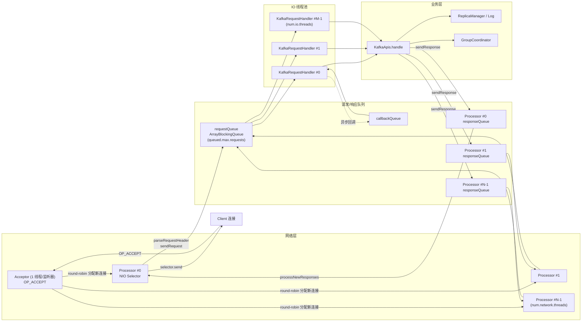
```mermaid
flowchart LR
    subgraph Net["网络层"]
        AC["Acceptor (1 线程/监听器)<br/>OP_ACCEPT"]
        P1["Processor #0<br/>NIO Selector"]
        P2["Processor #1"]
        Pn["Processor #N-1<br/>(num.network.threads)"]
    end
    subgraph Queue["请求/响应队列"]
        RQ["requestQueue<br/>ArrayBlockingQueue<br/>(queued.max.requests)"]
        CQ["callbackQueue"]
        RSP1["Processor #0 responseQueue"]
        RSP2["Processor #1 responseQueue"]
        RSPn["Processor #N-1 responseQueue"]
    end
    subgraph IO["IO 线程池"]
        H1["KafkaRequestHandler #0"]
        H2["KafkaRequestHandler #1"]
        Hm["KafkaRequestHandler #M-1<br/>(num.io.threads)"]
    end
    subgraph Biz["业务层"]
        APIS["KafkaApis.handle"]
        RM["ReplicaManager / Log"]
        GC["GroupCoordinator"]
    end

    Client["Client 连接"] -->|"OP_ACCEPT"| AC
    AC -->|"round-robin 分配新连接"| P1 & P2 & Pn
    P1 -->|"parseRequestHeader<br/>sendRequest"| RQ
    P2 --> RQ
    Pn --> RQ
    RQ --> H1 & H2 & Hm
    H1 --> APIS
    H2 --> APIS
    Hm --> APIS
    APIS --> RM
    APIS --> GC
    APIS -->|"sendResponse"| RSP1 & RSP2 & RSPn
    H1 -.->|"异步回调"| CQ
    CQ --> H1
    RSP1 -->|"processNewResponses"| P1
    RSP2 --> P2
    RSPn --> Pn
    P1 -->|"selector.send"| Client
```

这是经典的 **Acceptor-Processor-Handler** 三段式 Reactor：网络 IO 与业务处理解耦，通过有界队列背压。

#### 2.2 SocketServer

`SocketServer.scala:71` 是服务端网络层入口：

```scala
// SocketServer.scala:85
private val maxQueuedRequests = config.queuedMaxRequests   // requestQueue 容量
// SocketServer.scala:97
private val memoryPool = if (config.queuedMaxBytes > 0)
    new SimpleMemoryPool(config.queuedMaxBytes, config.socketRequestMaxBytes, false, memoryPoolSensor)
  else MemoryPool.NONE
// SocketServer.scala:99
private[network] val dataPlaneAcceptors = new ConcurrentHashMap[Endpoint, DataPlaneAcceptor]()
// SocketServer.scala:100
val dataPlaneRequestChannel = new RequestChannel(maxQueuedRequests, time, apiVersionManager.newRequestMetrics)
```

构造时(`SocketServer.scala:146-150`)根据 `listenerType` 决定为 `CONTROLLER` 还是 `BROKER` 创建 acceptor：controller listener 与 data-plane listener 严格分离。

#### 2.3 Acceptor：接收新连接

`Acceptor`(`SocketServer.scala:458`)每个监听器一个线程，跑 accept 循环：

```scala
// SocketServer.scala:478
private val nioSelector = NSelector.open()      // 独占 NIO Selector

// SocketServer.scala:572
override def run(): Unit = {
  serverChannel.register(nioSelector, SelectionKey.OP_ACCEPT)
  while (shouldRun.get()) {
    acceptNewConnections()       // SocketServer.scala:623
    closeThrottledConnections()
  }
}
```

`acceptNewConnections`(`SocketServer.scala:623`)用 `nioSelector.select(500)` 阻塞 500ms，对每个 `OP_ACCEPT` 就绪的 key 调 `accept(key)` 拿到 `SocketChannel`，然后**轮询(round-robin)分配**给下一个 Processor：

```scala
// SocketServer.scala:638-649
var retriesLeft = synchronized(processors.length)
do {
  retriesLeft -= 1
  processor = synchronized {
    currentProcessorIndex = currentProcessorIndex % processors.length
    processors(currentProcessorIndex)
  }
  currentProcessorIndex += 1
} while (!assignNewConnection(socketChannel, processor, retriesLeft == 0))
```

若所有 Processor 的 `newConnections` 队列都满则阻塞，实现背压。`Acceptor` 自带 `blockedPercentMeter` 统计被阻塞的时间比例。

#### 2.4 Processor：读写 IO 与协议解析

`Processor`(`SocketServer.scala:797`)每个线程一个独立 NIO `KSelector`，主循环(`SocketServer.scala:889`)：

```scala
// SocketServer.scala:889
override def run(): Unit = {
  while (shouldRun.get()) {
    configureNewConnections()     // 注册新连接到 selector
    processNewResponses()         // 把响应写入 channel
    poll()                        // selector.poll
    processCompletedReceives()    // 处理完整请求 -> requestChannel.sendRequest
    processCompletedSends()       // 处理已发送响应
    processDisconnected()
    closeExcessConnections()
  }
}
```

关键字段：

```scala
// SocketServer.scala:827
private val newConnections = new ArrayBlockingQueue[SocketChannel](connectionQueueSize)
private val inflightResponses = mutable.Map[String, RequestChannel.Response]()
private val responseQueue = new LinkedBlockingDeque[RequestChannel.Response]()
// SocketServer.scala:849
private[network] val selector = createSelector(
    ChannelBuilders.serverChannelBuilder(...))   // 根据 securityProtocol 创建 ChannelBuilder
```

**流控 mute/unmute** 是关键：当 `requestQueue` 满或配额触发时，Processor 调 `selector.mute(connectionId)`(`SocketServer.scala:1041`)暂停该 channel 的读，避免继续读取请求把队列压垮；响应发完且无配额时 `tryUnmuteChannel` 恢复读。这保证了 backpressure。

`processCompletedReceives`(`SocketServer.scala:1002`)对每个完整接收：

```scala
// SocketServer.scala:1027
req = new RequestChannel.Request(processor = id, context = context,
    startTimeNanos = nowNanos, memoryPool, receive.payload, requestChannel.metrics, None)
...
requestChannel.sendRequest(req)      // 入 requestQueue
selector.mute(connectionId)         // mute 直到响应发完，防 pipelined 请求压垮
```

`processNewResponses`(`SocketServer.scala:933`)从 `responseQueue` 拉响应，根据类型(`SendResponse`/`NoOpResponse`/`CloseConnectionResponse`/`StartThrottlingResponse`/`EndThrottlingResponse`)处理，`SendResponse` 走 `selector.send(NetworkSend)`(`SocketServer.scala:986`)。

#### 2.5 RequestChannel：解耦队列

`RequestChannel`(`RequestChannel.scala:343`)是网络线程与 IO 线程的解耦点：

```scala
// RequestChannel.scala:353
private val requestQueue = new ArrayBlockingQueue[BaseRequest](queueSize)  // queued.max.requests
private val callbackQueue = new ArrayBlockingQueue[BaseRequest](queueSize) // 异步回调队列
```

核心方法：

| 方法 | 位置 | 作用 |
|------|------|------|
| `sendRequest(request)` | `RequestChannel.scala:379` | Processor 把请求 `put` 入 requestQueue(阻塞) |
| `receiveRequest(timeout)` | `RequestChannel.scala:464` | IO 线程阻塞拉取；优先 poll callbackQueue |
| `sendResponse(response)` | `RequestChannel.scala:420` | IO 线程完成后，按 `processor` 字段路由到对应 Processor 的 responseQueue |
| `sendCallbackRequest(req)` | `RequestChannel.scala:499` | 异步回调任务入 callbackQueue，并通过 `WakeupRequest` 唤醒阻塞的 IO 线程 |

`Request` 对象(`RequestChannel.scala:64`)携带：`processor`、`context`(`RequestContext` 含 header、connectionId、principal、clientAddress)、`startTimeNanos`、`buffer`、`memoryPool`，以及一组 `@volatile` 时间戳记录全链路耗时(`requestDequeueTimeNanos`/`apiLocalCompleteTimeNanos`/`responseCompleteTimeNanos`/`responseDequeueTimeNanos`)用于请求指标。

#### 2.6 KafkaRequestHandler：IO 线程

`KafkaRequestHandler`(`KafkaRequestHandler.scala:88`)的 `run()`(`KafkaRequestHandler.scala:105`)：

```scala
// KafkaRequestHandler.scala:114
val req = requestChannel.receiveRequest(300)    // 阻塞拉取 300ms
req match {
  case ShutdownRequest => completeShutdown(); return
  case callback: CallbackRequest =>            // 异步回调任务
    threadCurrentRequest.set(callback.originalRequest)
    callback.fun(requestLocal)                 // 在 IO 线程执行回调
  case request: RequestChannel.Request =>
    threadCurrentRequest.set(request)
    apis.handle(request, requestLocal)         // 进入 KafkaApis
  case null => // continue
}
```

每个线程持有 `RequestLocal`(`KafkaRequestHandler.scala:102`)，提供线程本地的 `ByteBuffer` 缓存，避免请求处理中的反复分配。`RequestHandlerPool`(`KafkaRequestHandler.scala:223`)管理线程池，支持运行时 `resizeThreadPool`(动态修改 `num.io.threads`)，分别有 `data-plane` 与 `controller` 两套池(由 `nodeName` 区分，`KafkaRequestHandler.scala:239`)。

#### 2.7 KafkaApis 分发

`KafkaApis.handle`(`KafkaApis.scala:152`)是所有请求的总入口，按 `apiKey` 模式匹配路由：

```scala
// KafkaApis.scala:169
request.header.apiKey match {
  case ApiKeys.PRODUCE => handleProduceRequest(request, requestLocal)
  case ApiKeys.FETCH => handleFetchRequest(request)
  case ApiKeys.OFFSET_COMMIT => handleOffsetCommitRequest(request, requestLocal).exceptionally(handleError)
  case ApiKeys.JOIN_GROUP => handleJoinGroupRequest(request, requestLocal).exceptionally(handleError)
  case ApiKeys.HEARTBEAT => handleHeartbeatRequest(request).exceptionally(handleError)
  case ApiKeys.SYNC_GROUP => handleSyncGroupRequest(request, requestLocal).exceptionally(handleError)
  case ApiKeys.CONSUMER_GROUP_HEARTBEAT => handleConsumerGroupHeartbeat(request).exceptionally(handleError)
  ...
  case ApiKeys.CREATE_TOPICS => forwardToController(request)    // 转发到 controller
  case ApiKeys.DELETE_TOPICS => forwardToController(request)
  ...
  case _ => throw new IllegalStateException(s"No handler for request api key ${request.header.apiKey}")
}
```

末尾(`KafkaApis.scala:255-263`)的 `finally` 块调 `replicaManager.tryCompleteActions()` 唤醒延迟操作，并记录 `apiLocalCompleteTimeNanos`。`forwardToController` 把请求通过 `NodeToControllerRequestThread` 转发给 active controller，是数据平面到控制平面的桥。

#### 2.8 Reactor 全链路时序

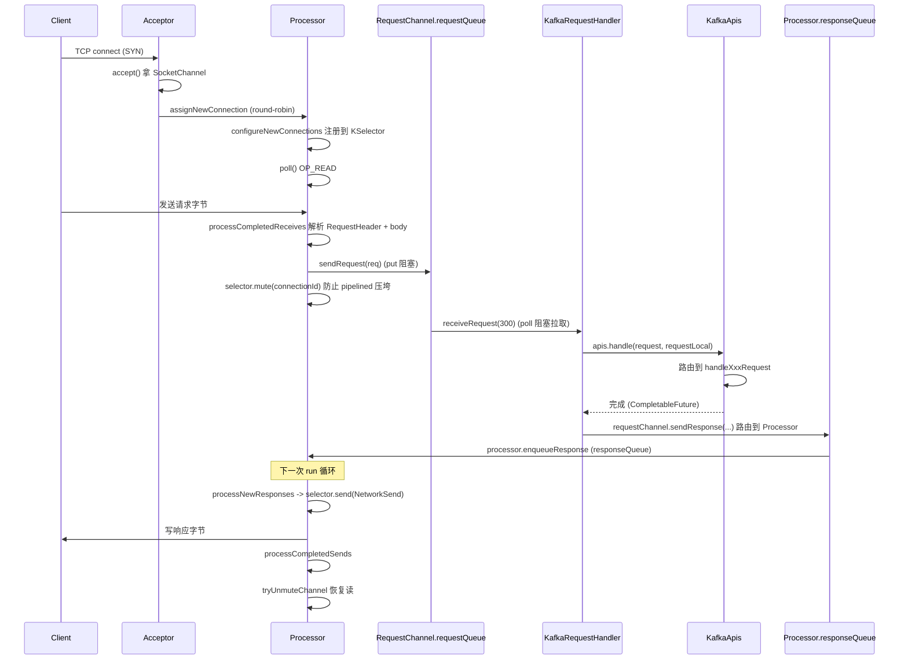
```mermaid
sequenceDiagram
    participant Cli as Client
    participant Ac as Acceptor
    participant Pr as Processor #i
    participant RQ as RequestChannel.requestQueue
    participant IO as KafkaRequestHandler
    participant Apis as KafkaApis
    participant Rsp as Processor.responseQueue

    Cli->>Ac: TCP connect (SYN)
    Ac->>Ac: accept() 拿 SocketChannel
    Ac->>Pr: assignNewConnection (round-robin)
    Pr->>Pr: configureNewConnections 注册到 KSelector
    Pr->>Pr: poll() OP_READ
    Cli->>Pr: 发送请求字节
    Pr->>Pr: processCompletedReceives 解析 RequestHeader + body
    Pr->>RQ: sendRequest(req) (put 阻塞)
    Pr->>Pr: selector.mute(connectionId) 防止 pipelined 压垮
    RQ->>IO: receiveRequest(300) (poll 阻塞拉取)
    IO->>Apis: apis.handle(request, requestLocal)
    Apis->>Apis: 路由到 handleXxxRequest
    Apis-->>IO: 完成 (CompletableFuture)
    IO->>Rsp: requestChannel.sendResponse(...) 路由到 Processor #i
    Rsp->>Pr: processor.enqueueResponse (responseQueue)
    Note over Pr: 下一次 run 循环
    Pr->>Pr: processNewResponses -> selector.send(NetworkSend)
    Pr->>Cli: 写响应字节
    Pr->>Pr: processCompletedSends
    Pr->>Pr: tryUnmuteChannel 恢复读
```

### 三、客户端网络层

#### 3.1 NetworkClient

`NetworkClient`(`clients/.../NetworkClient.java`)是客户端的"网络大脑"，管理连接、发送、接收、元数据更新：

```java
// NetworkClient.java:541
public void send(ClientRequest request, long now) {
    doSend(request, false, now);
}

// NetworkClient.java:551
private void doSend(ClientRequest clientRequest, boolean isInternalRequest, long now) {
    ensureActive();
    String nodeId = clientRequest.destination();
    ...
    AbstractRequest.Builder<?> builder = clientRequest.requestBuilder();
    NodeApiVersions versionInfo = apiVersions.get(nodeId);
    short version = (versionInfo == null) ? builder.latestAllowedVersion()
        : versionInfo.latestUsableVersion(clientRequest.apiKey(), builder.oldestAllowedVersion(),
                                          builder.latestAllowedVersion());
    doSend(clientRequest, isInternalRequest, now, builder.build(version));
}

// NetworkClient.java:601
private void doSend(ClientRequest clientRequest, boolean isInternalRequest, long now, AbstractRequest request) {
    String destination = clientRequest.destination();
    RequestHeader header = clientRequest.makeHeader(request.version());
    Send send = request.toSend(header);
    InFlightRequest inFlightRequest = new InFlightRequest(clientRequest, header, isInternalRequest, request, send, now);
    this.inFlightRequests.add(inFlightRequest);         // 加入飞行队列
    selector.send(new NetworkSend(clientRequest.destination(), send));  // 真正发出
}
```

`poll`(`NetworkClient.java:630`)把"select IO + 元数据更新 + 响应处理"合一：

```java
// NetworkClient.java:630
public List<ClientResponse> poll(long timeout, long now) {
    ensureActive();
    if (!abortedSends.isEmpty()) { ... handleAbortedSends ... }
    long metadataTimeout = metadataUpdater.maybeUpdate(now);     // 元数据按需更新
    long telemetryTimeout = telemetrySender != null ? telemetrySender.maybeUpdate(now) : Integer.MAX_VALUE;
    this.selector.poll(Utils.min(timeout, metadataTimeout, telemetryTimeout, defaultRequestTimeoutMs));
    long updatedNow = this.time.milliseconds();
    List<ClientResponse> responses = new ArrayList<>();
    handleCompletedSends(responses, updatedNow);        // 请求完成发送 -> 触发回调
    handleCompletedReceives(responses, updatedNow);    // 收到响应 -> 解析 + 回调
    handleDisconnections(responses, updatedNow);        // 连接断开 -> 失败所有飞行中请求
    handleConnections();                                // 新连接建立
    handleInitiateApiVersionRequests(updatedNow);       // 新连接发起 ApiVersionsRequest
    handleTimedOutConnections(responses, updatedNow);
    handleTimedOutRequests(responses, updatedNow);
    handleRebootstrap(responses, updatedNow);
    completeResponses(responses);                       // 调用 callback
    return responses;
}
```

`leastLoadedNode`(`NetworkClient.java:759`)挑选"最空闲"节点(飞行请求最少、连接 ready)用于发元数据请求或其它无目标请求。`initiateConnect`(`NetworkClient.java:1136`)负责真正建连。

#### 3.2 Selector NIO 封装

`Selector`(`clients/.../network/Selector.java`)是对 `java.nio.channels.Selector` 的封装：

```java
// Selector.java:445
public void poll(long timeout) throws IOException {
    ...
    int numReadyKeys = select(timeout);    // 阻塞 select
    if (numReadyKeys > 0 || !immediatelyConnectedKeys.isEmpty() || dataInBuffers) {
        // 先处理缓冲中已有数据，再处理就绪 key，最后处理刚连上的 key
        pollSelectionKeys(readyKeys, false, endSelect);
        pollSelectionKeys(immediatelyConnectedKeys, true, endSelect);
    }
    maybeCloseOldestConnection(endSelect);
}
```

`pollSelectionKeys`(`Selector.java:514`)对每个就绪 key：完成连接握手(`finishConnect`)、`attempRead`/`attempWrite`、处理断开。`mute`(`Selector.java:743`)/`unmute`(`Selector.java:755`)通过关闭/打开 channel 的读兴趣位实现流控。

#### 3.3 KafkaChannel 与 TransportLayer

`KafkaChannel`(`clients/.../network/KafkaChannel.java`)封装 `SocketChannel`、`TransportLayer`、`NetworkReceive`、`NetworkSend`：

| TransportLayer 实现 | 场景 |
|---------------------|------|
| `PlaintextTransportLayer` | 明文 TCP |
| `SslTransportLayer` | TLS |

`ChannelBuilder`(`PlaintextChannelBuilder`/`SslChannelBuilder`/`SaslChannelBuilder`)根据 `security.protocol` 创建，负责握手与认证。`TransportLayer.transferFrom` 提供零拷贝文件传输接口(供 `FileRecords.writeTo` 使用)。

#### 3.4 InFlightRequests

`InFlightRequests`(`clients/.../InFlightRequests.java:31`)按节点维护飞行中请求的双端队列：

```java
// InFlightRequests.java:33
private final int maxInFlightRequestsPerConnection;   // max.in.flight.requests.per.connection
private final Map<String, Deque<NetworkClient.InFlightRequest>> requests = new HashMap<>();
```

关键方法：
- `add`(`InFlightRequests.java:45`)：新请求 `addFirst` 入队
- `completeNext`(`InFlightRequests.java:65`)：完成最老请求(响应按 FIFO 顺序到达)
- `canSendMore`(`InFlightRequests.java:96`)：判断能否继续发(队列未超上限且上次 send 已完成)
- `nodesWithTimedOutRequests`(`InFlightRequests.java:171`)：超时检查

`max.in.flight.requests.per.connection=5`(默认)是**幂等 producer 保障顺序**的关键：必须 <= 5 才能保证幂等性(否则重试可能打乱顺序)。

#### 3.5 流控 mute/unmute

| 场景 | 触发 | 位置 |
|------|------|------|
| 服务端请求队列满 | `requestQueue.put` 阻塞前 mute | `Processor.processCompletedReceives` |
| 服务端配额触发 | `QuotaType` 超限 | `Processor.processNewResponses`(StartThrottling/EndThrottling) |
| 响应发完 | `processCompletedSends` 后 unmute | `SocketServer.scala:1077` |
| 客户端飞行请求满 | `canSendMore == false` | `NetworkClient.doSend` 前检查 |

### 四、数据平面 vs 控制平面

#### 4.1 监听器分离

KRaft 模式下监听器严格分离：

| 配置 | 用途 |
|------|------|
| `listeners` / `advertised.listeners` | data-plane，处理客户端 + broker 间数据请求 |
| `controller.listener.names` | controller-plane，仅 quorum 间 Raft 通信 + broker->controller 转发 |
| `inter.broker.listener.name` | broker 间数据请求(如 follower fetch) |

`SocketServer` 构造时(`SocketServer.scala:146-150`)根据 `listenerType` 决定创建哪类 acceptor，`ControllerServer` 与 `BrokerServer` 各自持有独立的 `SocketServer` 与 `RequestChannel`，IO 线程池也完全独立(`KafkaRequestHandlerPool` 的 `nodeName="controller"` 或 `"broker"`，见 `KafkaRequestHandler.scala:239`)。这避免了 controller 的高优先级请求被数据流量挤占。

#### 4.2 forwarding 转发

broker 收到本应由 controller 处理的请求(如 `CREATE_TOPICS`、`DELETE_TOPICS`、`CREATE_ACLS`、`ALTER_CLIENT_QUOTAS` 等，见 `KafkaApis.scala:185-220` 的 `forwardToController`)，通过 `NodeToControllerRequestThread` 把请求用 **EnvelopeRequest** 封装转发给 active controller。controller 端解封处理后再用 EnvelopeResponse 回复。这要求 broker 知道 active controller 的位置(从 `metadataCache` 拿)。

#### 4.3 Quorum 通信

KRaft quorum 内部 Raft 通信(`VoteRequest`/`BeginQuorumEpoch`/`EndQuorumEpoch`/`Fetch`/`Append`)走 controller listener，由 `RaftManager` / `KafkaRaftClient`(`raft` 模块)驱动，复用 `clients` 的 `NetworkClient` 但用独立的 `QuorumRequestManager`。这部分与第二章 KafkaApis 中 `forwardToController(DESCRIBE_QUORUM)`、`ADD_RAFT_VOTER`、`REMOVE_RAFT_VOTER` 等是控制平面 API。

### 五、限流与配额

#### 5.1 ConnectionQuotas

`ConnectionQuotas`(`core/.../network/ConnectionQuotas.scala`)管理多维度连接配额：
- 每 IP 的连接数上限(`max.connections.per.ip`)
- 每 listener 的连接数上限
- 全局连接数上限(`max.connections`)
- broker / controller 分别的连接配额(`max.connections.overridden`)

`Acceptor.accept` 拿到新连接后调 `connectionQuotas.incrant(listenerName, address, now)`，超限则关闭连接或阻塞(配合 `DelayedCloseSocket` 限速队列，`SocketServer.scala:502`)。

#### 5.2 Throttle 机制

配额触发时服务端走"延迟响应"节流而非直接拒绝：

| 响应类型 | 含义 | 处理 |
|----------|------|------|
| `StartThrottlingResponse` | 通知 Processor 该 channel 开始节流，mute 读 | `SocketServer.scala:956` |
| `EndThrottlingResponse` | 节流结束，可 unmute | `SocketServer.scala:958` |
| 普通 `SendResponse` | 携带 `throttleTimeMs` 字段，告知客户端自我节流 | 客户端 `InFlightRequests.incrementThrottleTime` |

客户端收到 `throttleTimeMs > 0` 后(`InFlightRequests.java:182` 的 `incrementThrottleTime`)会给该节点所有飞行请求累加节流时间，避免在节流窗口内继续发请求；`hasExpiredRequest`(`InFlightRequests.java:155`)计算超时时排除节流时间，确保节流期间不误判超时。

### 六、关键源码文件清单

| 类别 | 文件 |
|------|------|
| 协议枚举 | `clients/src/main/java/org/apache/kafka/common/protocol/ApiKeys.java` |
| 序列化 | `clients/src/main/java/org/apache/kafka/common/protocol/Message.java`、`ApiMessage.java`、`ByteBufferAccessor.java`、`Readable.java`、`Writable.java`、`types/RawTaggedField.java`、`types/Struct.java`、`SendBuilder.java` |
| 编解码 | `clients/src/main/java/org/apache/kafka/common/network/NetworkSend.java`、`NetworkReceive.java`、`Send.java`、`ByteBufferSend.java`、`TransferableChannel.java` |
| 版本协商 | `clients/src/main/java/org/apache/kafka/common/requests/ApiVersionsRequest.java`、`ApiVersionsResponse.java`、`clients/src/main/java/org/apache/kafka/clients/NodeApiVersions.java` |
| 压缩 | `clients/src/main/java/org/apache/kafka/common/compress/Compression.java`、`record/internal/CompressionType.java`、`utils/BufferSupplier.java` |
| 服务端网络 | `core/src/main/scala/kafka/network/SocketServer.scala`、`RequestChannel.scala`、`ConnectionQuotas.scala` |
| IO 线程 | `core/src/main/scala/kafka/server/KafkaRequestHandler.scala` |
| 业务分发 | `core/src/main/scala/kafka/server/KafkaApis.scala` |
| 客户端网络 | `clients/src/main/java/org/apache/kafka/clients/NetworkClient.java`、`InFlightRequests.java`、`ClientRequest.java`、`ClientResponse.java` |
| NIO 封装 | `clients/src/main/java/org/apache/kafka/common/network/Selector.java`、`KafkaChannel.java`、`TransportLayer.java`、`PlaintextTransportLayer.java`、`SslTransportLayer.java` |
| ChannelBuilder | `clients/src/main/java/org/apache/kafka/common/network/ChannelBuilders.java`、`PlaintextChannelBuilder.java`、`SslChannelBuilder.java`、`SaslChannelBuilder.java` |
| 控制平面 | `raft/src/main/java/org/apache/kafka/raft/KafkaRaftClient.java`、`metadata/src/main/java/org/apache/kafka/metadata/...`、`server/src/main/java/org/apache/kafka/server/NodeToControllerRequestThread.java` |

---

## 六、服务端启动、KRaft 模式与选主机制

### 一、服务端启动流程

#### 1.1 入口：Kafka.main()

Kafka 4.3.0 的服务端入口位于 `core/src/main/scala/kafka/Kafka.scala:72`，启动流程极其精简：

```scala
// core/src/main/scala/kafka/Kafka.scala:64-70
private def buildServer(props: Properties): Server = {
  val config = KafkaConfig.fromProps(props, doLog = false)
  new KafkaRaftServer(config, Time.SYSTEM)
}

def main(args: Array[String]): Unit = {
  val serverProps = getPropsFromArgs(args)       // 1. 加载 server.properties
  val server = buildServer(serverProps)          // 2. 创建 KafkaRaftServer
  Exit.addShutdownHook("kafka-shutdown-hook", () => server.shutdown())  // 3. 注册关闭钩子
  server.startup()                                 // 4. 启动
  server.awaitShutdown()                           // 5. 等待关闭
}
```

关键点：`buildServer` 直接返回 `KafkaRaftServer`，不再有 ZK 模式的分支。Kafka 4.0 起完全移除 ZooKeeper，4.3.0 中 KRaft 是唯一的元数据管理模式。

#### 1.2 KafkaRaftServer 组合架构

`core/src/main/scala/kafka/server/KafkaRaftServer.scala:47-113` 根据 `process.roles` 配置组合 BrokerServer 与 ControllerServer：

```scala
// core/src/main/scala/kafka/server/KafkaRaftServer.scala:63-88
private val sharedServer = new SharedServer(config, metaPropsEnsemble, time, metrics, ...)

private val broker: Option[BrokerServer] = 
  if (config.processRoles.contains(ProcessRole.BrokerRole))
    Some(new BrokerServer(sharedServer))
  else None

private val controller: Option[ControllerServer] = 
  if (config.processRoles.contains(ProcessRole.ControllerRole))
    Some(new ControllerServer(sharedServer, configSchema, bootstrapMetadata))
  else None
```

启动顺序（`KafkaRaftServer.scala:90-98`）--**Controller 先于 Broker 启动**；关闭顺序相反--**Broker 先于 Controller 关闭**，因为 Controller 关闭时可能还需要为 Broker 的 controlled shutdown 提供服务。

#### 1.3 SharedServer：共享组件层

`core/src/main/scala/kafka/server/SharedServer.scala:95-411` 管理 Broker 和 Controller 共享的组件：**KafkaRaftManager**（Raft 协议管理器）、**MetadataLoader**（元数据加载器）、**SnapshotGenerator**（快照生成器）。

```scala
// core/src/main/scala/kafka/server/SharedServer.scala:291-308
val _raftManager = new KafkaRaftManager[ApiMessageAndVersion](
  clusterId, sharedServerConfig, ..., 
  KafkaRaftServer.MetadataPartition,  // __cluster_metadata-0
  KafkaRaftServer.MetadataTopicId, 
  time, metrics, ...)
raftManager = _raftManager
_raftManager.startup()

// _raftManager.client.register(loader)  // 将 loader 注册为 Raft listener
```

#### 1.4 BrokerServer 启动流程

`core/src/main/scala/kafka/server/BrokerServer.scala:186-620` 的 `startup()` 方法按以下顺序初始化：

1. `sharedServer.startForBroker()` - 启动共享的 RaftManager + MetadataLoader
2. `kafkaScheduler.startup()` - 启动后台调度器
3. `metadataCache = new KRaftMetadataCache` - 创建元数据缓存
4. `logManager = LogManager(...)` - 创建 LogManager（暂不启动）
5. `lifecycleManager = new BrokerLifecycleManager(...)` - 创建生命周期管理器
6. `socketServer = new SocketServer(...)` - 创建 SocketServer
7. `alterPartitionManager = AlterPartitionManager(...)` - 创建 ISR 变更管理器
8. `_replicaManager = new ReplicaManager(...)` - 创建 ReplicaManager
9. `groupCoordinator = createGroupCoordinator()` - 创建 GroupCoordinator
10. `transactionCoordinator = TransactionCoordinator(...)` - 创建事务协调器
11. `dataPlaneRequestProcessor = new KafkaApis(...)` - 创建请求处理器
12. `brokerMetadataPublisher = new BrokerMetadataPublisher(...)` - 创建元数据发布器
13. `lifecycleManager.initialCatchUpFuture` - 等待 Controller 确认 Broker 已追上元数据
14. `brokerMetadataPublisher.firstPublishFuture` - 等待首次元数据发布
15. `lifecycleManager.setReadyToUnfence()` - 通知 Controller 可以 unfence 本 Broker
16. `socketServer.enableRequestProcessing()` - 开始接受客户端请求

```scala
// BrokerServer.scala:541-585
// 等待 Controller 确认追上元数据
FutureUtils.waitWithLogging(..., "the controller to acknowledge that we are caught up",
  lifecycleManager.initialCatchUpFuture, startupDeadline, time)

// 等待首次元数据发布
FutureUtils.waitWithLogging(..., "the initial broker metadata update to be published",
  brokerMetadataPublisher.firstPublishFuture, startupDeadline, time)

// 准备好被 unfence
FutureUtils.waitWithLogging(..., "the broker to be unfenced",
  lifecycleManager.setReadyToUnfence(), startupDeadline, time)
```

#### 1.5 启动阶段流转图

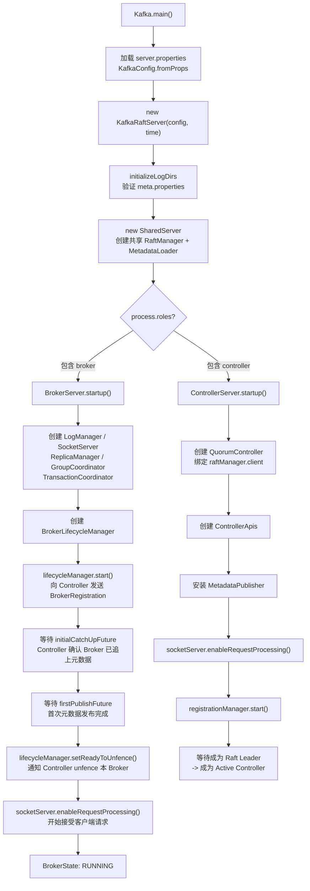
```mermaid
flowchart TD
    A["Kafka.main()"] --> B["加载 server.properties<br/>KafkaConfig.fromProps"]
    B --> C["new KafkaRaftServer(config, time)"]
    C --> D["initializeLogDirs<br/>验证 meta.properties"]
    D --> E["new SharedServer<br/>创建共享 RaftManager + MetadataLoader"]
    E --> F{"process.roles?"}
    
    F -->|"包含 controller"| G["ControllerServer.startup()"]
    G --> G2["创建 QuorumController<br/>绑定 raftManager.client"]
    G2 --> G3["创建 ControllerApis"]
    G3 --> G4["安装 MetadataPublisher"]
    G4 --> G5["socketServer.enableRequestProcessing()"]
    G5 --> G6["registrationManager.start()"]
    
    F -->|"包含 broker"| H["BrokerServer.startup()"]
    H --> H2["创建 LogManager / SocketServer<br/>ReplicaManager / GroupCoordinator<br/>TransactionCoordinator"]
    H2 --> H3["创建 BrokerLifecycleManager"]
    H3 --> H4["lifecycleManager.start()<br/>向 Controller 发送 BrokerRegistration"]
    H4 --> H5["等待 initialCatchUpFuture<br/>Controller 确认 Broker 已追上元数据"]
    H5 --> H6["等待 firstPublishFuture<br/>首次元数据发布完成"]
    H6 --> H7["lifecycleManager.setReadyToUnfence()<br/>通知 Controller unfence 本 Broker"]
    H7 --> H8["socketServer.enableRequestProcessing()<br/>开始接受客户端请求"]
    H8 --> I["BrokerState: RUNNING"]
    
    G6 --> J["等待成为 Raft Leader<br/>-> 成为 Active Controller"]
```

### 二、KRaft 模式

#### 2.1 为什么弃用 ZooKeeper

Kafka 4.0 起完全移除 ZooKeeper（ZK），原因包括：

1. **架构复杂**：ZK + Controller 的双层架构运维复杂，需要维护两套系统
2. **元数据一致性问题**：ZK 中的元数据与 Controller 内存中的元数据可能不一致
3. **Controller failover 慢**：ZK 模式下新 Controller 需要从 ZK 全量加载元数据，大规模集群可达分钟级
4. **扩展瓶颈**：ZK 元数据存储有上限（分区数受 ZK watch 机制限制）

#### 2.2 KRaft 核心设计

KRaft（Kafka Raft）用一条内部 Topic `__cluster_metadata`（partition 0）作为元数据的**单一真相源**（single source of truth）：

```scala
// core/src/main/scala/kafka/server/KafkaRaftServer.scala:116-118
object KafkaRaftServer {
  val MetadataTopic = Topic.CLUSTER_METADATA_TOPIC_NAME  // "__cluster_metadata"
  val MetadataPartition = Topic.CLUSTER_METADATA_TOPIC_PARTITION  // 0
  val MetadataTopicId = Uuid.METADATA_TOPIC_ID
}
```

#### 2.3 部署模式

通过 `process.roles` 配置决定（`KRaftConfigs.java:32-33`）：

- **`broker,controller`（combined 模式）**：同一进程同时充当 Broker 和 Controller，共享同一个 SharedServer 和 RaftManager
- **`broker`（分离模式）**：纯 Broker 节点，不参与 Controller quorum
- **`controller`（分离模式）**：纯 Controller 节点，不托管分区数据

Controller quorum 通常由 3 或 5 个 voter 节点组成，配置项 `controller.quorum.voters`（`QuorumConfig.java:58`）或 `controller.quorum.bootstrap.servers`（`QuorumConfig.java:67`，支持动态 quorum）。

#### 2.4 元数据快照（Snapshot）

SharedServer 中创建 `SnapshotGenerator`（`SharedServer.scala:339-347`），定期生成快照。新启动的节点可以先加载快照再追增量的日志，加速启动。

#### 2.5 KRaft 优势

| 特性 | ZK 模式 | KRaft 模式 |
|------|---------|------------|
| 外部依赖 | 需要 ZooKeeper 集群 | 无外部依赖 |
| 元数据一致性 | ZK + Controller 内存，可能不一致 | 单一日志，线性一致 |
| Controller failover | 分钟级（全量加载元数据） | 秒级（热备，已有元数据） |
| 元数据写入 | ZK 两阶段 | Raft 多数派写入 |
| 分区数上限 | ~20万 | 百万级 |

### 三、Raft 协议实现

#### 3.1 状态机概览

Kafka 的 Raft 实现比标准 Raft 多了几个状态：

| 状态类 | 接口 | 说明 |
|--------|------|------|
| `LeaderState` | EpochState | 当前节点是 leader |
| `CandidateState` | NomineeState -> EpochState | 正在竞选 leader（已增加 epoch） |
| `ProspectiveState` | NomineeState -> EpochState | 预备候选（未增加 epoch，先做 PreVote） |
| `FollowerState` | EpochState | 已知 leader，跟随该 leader |
| `UnattachedState` | EpochState | 知道 epoch 但不知道 leader |
| `ResignedState` | EpochState | 刚卸任 leader，等待新选举 |

#### 3.2 选主流程

Kafka Raft 引入了 **PreVote** 机制，在真正增加 epoch 之前先探测是否有足够的票数，避免不必要的 epoch 递增。

**选举触发条件**：
- FollowerState 的 fetch timeout 过期（默认 `controller.quorum.fetch.timeout.ms=2000`ms）
- UnattachedState 的 election timeout 过期（默认 `controller.quorum.election.timeout.ms=1000`ms）

**状态转换链**：

```
Follower (fetch timeout) -> Prospective (PreVote 探测)
  -> 多数派同意 PreVote -> Candidate (增加 epoch, 发送正式 Vote)
    -> 多数派同意 Vote -> Leader
    -> 收到更高 epoch 的 BeginQuorumEpoch -> Follower
  -> PreVote 被拒绝 -> Follower/Unattached
```

**transitionToCandidate**（`QuorumState.java:638-654`）--增加 epoch 并持久化：

```java
public void transitionToCandidate() {
    checkValidTransitionToCandidate();
    int newEpoch = epoch() + 1;           // epoch 递增
    int electionTimeoutMs = randomElectionTimeoutMs();  // 随机化选举超时
    durableTransitionTo(new CandidateState(
        time, localIdOrThrow(), localDirectoryId,
        newEpoch, partitionState.lastVoterSet(),
        state.highWatermark(), electionTimeoutMs, logContext));
}
```

**随机化选举超时**（`QuorumState.java:745-749`）：`[T, 2T)` 随机，避免活锁。

#### 3.3 Vote 请求与响应

`KafkaRaftClient.handleVoteRequest()`（`KafkaRaftClient.java:829-945`）处理投票请求，各状态的 `canGrantVote` 策略：
- **FollowerState**（`FollowerState.java:228-243`）：PreVote 且尚未从 leader fetch 过时可以同意；否则拒绝
- **CandidateState**（`CandidateState.java:140-159`）：PreVote 且日志更新时可以同意；标准 Vote 一律拒绝（已经投给自己了）
- **LeaderState**（`LeaderState.java:1118-1126`）：一律拒绝

`handleVoteResponse()`（`KafkaRaftClient.java:947-1027`）：投票通过则 `recordGrantedVote`，检查是否获得多数派后 `maybeTransitionForward` 推进（Prospective->Candidate 或 Candidate->Leader）。

#### 3.4 成为 Leader

`onBecomeLeader()`（`KafkaRaftClient.java:645-671`）：

```java
private void onBecomeLeader(long currentTimeMs) {
    long endOffset = log.endOffset().offset();
    BatchAccumulator<T> accumulator = new BatchAccumulator<>(...);
    
    LeaderState<T> state = quorum.transitionToLeader(endOffset, accumulator);
    log.initializeLeaderEpoch(quorum.epoch());
    
    // 写入 LeaderChange 控制记录，确保新 epoch 有记录
    // 这是 Raft 的 commitment 安全保证：新 leader 必须先提交本 epoch 的记录
    state.appendStartOfEpochControlRecords(currentTimeMs);
    
    resetConnections();
    kafkaRaftMetrics.maybeUpdateElectionLatency(currentTimeMs);
}
```

#### 3.5 日志复制

Kafka Raft 与标准 Raft 的关键差异：**不使用单独的 AppendEntries RPC，而是复用 Fetch 请求同时实现心跳和日志复制**。

**Leader 端**：`pollLeader()`（`KafkaRaftClient.java:3172-3204`）驱动 leader 工作：追加日志、发送 BeginQuorumEpoch、检查 quorum 活性（长时间无多数派 fetch 则 resign）。

**高水位（High Watermark）推进**：`LeaderState.maybeUpdateHighWatermark()`（`LeaderState.java:727-786`）将所有 voter 按 fetch offset 降序排列，取第 (N/2) 个 voter 的 endOffset 作为 HW（多数派已复制的 offset）。KRaft 安全保证：新 leader 必须先提交本 epoch 的记录才能暴露前序 epoch 的记录。

**Follower 端**：`pollFollowerAsVoter()`（`KafkaRaftClient.java:3319-3354`）定期发送 Fetch 请求；fetch 超时则转为 Prospective 发起选举。

#### 3.6 脑裂防护

1. **Epoch 递增**：每次选举 epoch 单调递增，旧 epoch 的 leader 无法继续提交记录
2. **拒绝 stale leader**：检查 `replicaEpoch > quorum.epoch()` 时转入 Unattached 状态
3. **LeaderChange 控制记录**：新 leader 必须写入本 epoch 的控制记录并提交后才能暴露之前的记录（`epochStartOffset` 检查）
4. **持久化投票状态**：`durableTransitionTo()` 在每次状态转换时将 ElectionState 持久化到磁盘，防止重启后重复投票

#### 3.7 与标准 Raft 的差异

| 特性 | 标准 Raft | Kafka Raft |
|------|-----------|------------|
| 日志复制 RPC | AppendEntries | Fetch（复用心跳 + 日志拉取） |
| 心跳 | AppendEntries 心跳 | Fetch 请求 + BeginQuorumEpoch |
| PreVote | 不常见 | 默认启用（ProspectiveState） |
| Observer | 非标准 | 原生支持（非 voter 节点可 fetch） |
| 快照传输 | InstallSnapshot | FetchSnapshot |
| 选主超时 | 固定范围随机 | `election.timeout.ms` + 随机抖动 |

#### 3.8 Raft 选主时序图

```mermaid
sequenceDiagram
    participant F1 as Follower (Node 1)
    participant F2 as Follower (Node 2)
    participant F3 as Leader (Node 3)

    Note over F1,F3: 正常运行阶段：Node3 是 Leader

    F1->>F3: Fetch (heartbeat + log replication)
    F2->>F3: Fetch
    F3-->>F1: Fetch Response (含 highWatermark)
    F3-->>F2: Fetch Response

    Note over F3: Leader 超时未收到多数派 Fetch<br/>或进程崩溃

    Note over F1: fetch.timeout.ms 超时 (默认2000ms)
    F1->>F1: FollowerState -> ProspectiveState<br/>(发起 PreVote)
    
    F1->>F2: Vote Request (preVote=true, epoch=N)
    F1->>F3: Vote Request (preVote=true, epoch=N)
    
    F2-->>F1: Vote Response (granted=true)
    Note over F3: Node3 可能无响应或拒绝
    F3-->>F1: Vote Response (granted=false 或超时)

    Note over F1: PreVote 获得多数派同意
    F1->>F1: ProspectiveState -> CandidateState<br/>epoch = N+1 (递增)<br/>持久化投票状态到磁盘

    F1->>F2: Vote Request (preVote=false, epoch=N+1)
    F1->>F3: Vote Request (preVote=false, epoch=N+1)

    F2-->>F1: Vote Response (granted=true)
    Note over F1: 获得多数派选票 (自己 + Node2)

    F1->>F1: CandidateState -> LeaderState<br/>onBecomeLeader()
    F1->>F1: appendStartOfEpochControlRecords()<br/>写入 LeaderChange 控制记录
    F1->>F1: log.initializeLeaderEpoch(N+1)

    F1->>F2: BeginQuorumEpoch (epoch=N+1)
    F1->>F3: BeginQuorumEpoch (epoch=N+1)
    
    Note over F2: 收到 BeginQuorumEpoch<br/>FollowerState -> Follower(epoch=N+1, leader=Node1)
    Note over F3: 收到 BeginQuorumEpoch 或 Fetch Response<br/>epoch=N+1 > N<br/>降级为 Follower

    F2->>F1: Fetch (新 epoch)
    F3->>F1: Fetch (新 epoch)
    F1-->>F2: Fetch Response
    F1-->>F3: Fetch Response

    Note over F1: 更新 voterStates<br/>推进 highWatermark
```

### 四、Controller 选举（集群选主）

KRaft quorum 的 leader 节点自动成为 **active controller**。`QuorumController.java:158` 注释明确说明：

> The node which is the leader of the metadata log becomes the active controller.

`QuorumController` 内部注册了 Raft `LeaderChange` 监听器（`QuorumController.java:1082-1112`）：成为新 leader 时调用 `claim(epoch, newNextWriteOffset)` 激活，失去 leader 地位时 `renounce()`。

```java
private void claim(int epoch, long newNextWriteOffset) {
    curClaimEpoch = epoch;
    offsetControl.activate(newNextWriteOffset);
    clusterControl.activate();
    
    ControllerWriteEvent<Void> activationEvent = new ControllerWriteEvent<>(
        "completeActivation[" + epoch + "]",
        new CompleteActivationEvent(),  // 生成激活记录
        EnumSet.of(DOES_NOT_UPDATE_QUEUE_TIME));
    queue.prepend(activationEvent);
}
```

`isActiveController()` 判断（`QuorumController.java:1130-1136`）：`curClaimEpoch != -1`（初始为 -1）。

**Combined vs Separated 模式**：
- Combined 模式：节点既是 Broker 又是 Controller，赢得 Raft 选举后同时是 active controller 和 broker
- Separated 模式（`process.roles=controller`）：纯 Controller 节点，赢得 Raft 选举后仅成为 active controller
- 纯 Broker 节点：不参与 Raft 选举，只通过 MetadataLoader 消费元数据

### 五、分区 Leader 选举（Partition Leader Election）

#### 5.1 Controller Leader 与 Partition Leader 的区别

| 概念 | Controller Leader | Partition Leader |
|------|-------------------|------------------|
| 选举机制 | KRaft Raft 选举 | 由 Active Controller 指定 |
| 作用范围 | 整个集群的元数据管理 | 单个 Topic-Partition 的读写 |
| 数量 | 集群中 1 个 | 每个 Partition 1 个 |
| 触发条件 | Raft leader 变更 | ISR 变化 / Broker 上下线 / 首选副本均衡 |
| Epoch | Raft epoch（leader epoch） | Partition leader epoch（每个分区独立） |

#### 5.2 分区 Leader 选举流程

Active Controller 通过 `ReplicationControlManager` 管理分区 leader 选举。

**触发场景**：
- **Broker 下线**：Controller 收到 heartbeat 超时，fence 该 broker，触发其作为 leader 的分区重新选举
- **ISR 缩减**：Leader 通过 `AlterPartitionManager` 向 Controller 报告 ISR 缩减
- **首选副本均衡**：`leaderImbalanceCheckIntervalNs` 定时检查
- **手动触发**：`ElectLeaders` API（`QuorumController.java:1863-1873`）

**选举逻辑**（`PartitionChangeBuilder.java:216-284`）：

```java
// 有效 leader 判定（PartitionChangeBuilder.java:318-322）
private boolean isValidNewLeader(int replica) {
    // 有效 leader 应在 ISR 中，或 ISR 为空时在 ELR 中
    return (targetIsr.contains(replica) || 
            (targetIsr.isEmpty() && targetElr.contains(replica))) &&
        isAcceptableLeader.test(replica);  // broker 未被 fence、未在 controlled shutdown
}
```

- **PREFERRED**：优先选 replicas[0]（首选副本），不可用则尝试当前 leader，再尝试其他在线副本
- **ONLINE**：从 ISR 中选第一个有效的
- **UNCLEAN**（`unclean.leader.election.enable=true`）：从所有副本中选（即使不在 ISR 中），可能丢数据

选举结果通过 `PartitionChangeRecord` 写入 `__cluster_metadata`，`PartitionRegistration.merge()`（`PartitionRegistration.java:238-277`）处理变更：leader 变化则 `leaderEpoch + 1`。

#### 5.3 Broker 收到 LeaderAndIsr 后的处理

元数据变更通过日志传播到 Broker 后，`BrokerMetadataPublisher` 调用 `ReplicaManager.applyDelta()`（`BrokerMetadataPublisher.scala:148`）：

```scala
// core/src/main/scala/kafka/server/ReplicaManager.scala:2390-2398
if (!localChanges.leaders.isEmpty) {
  applyLocalLeadersDelta(leaderChangedPartitions, delta, lazyOffsetCheckpoints, 
    localChanges.leaders.asScala, localChanges.directoryIds.asScala)
}
if (!localChanges.followers.isEmpty) {
  applyLocalFollowersDelta(followerChangedPartitions, newImage, delta, lazyOffsetCheckpoints,
    localChanges.followers.asScala, localChanges.directoryIds.asScala)
}
```

`applyLocalLeadersDelta()` 调用 `Partition.makeLeader()`（`Partition.scala:588-664`）：设置 leaderEpochStartOffset、重置 remote replica 状态、开始接受生产请求。`applyLocalFollowersDelta()` 调用 `Partition.makeFollower()`：启动 fetcher 线程从 leader 拉取数据。

#### 5.4 分区 Leader 选举流程图

```mermaid
flowchart TD
    subgraph Controller["Active Controller (KRaft Leader)"]
        C1["ReplicationControlManager"]
        C2["PartitionChangeBuilder.electLeader()"]
        C3["PartitionChangeRecord\n(leader, leaderEpoch+1, isr, partitionEpoch+1)"]
        C4["写入 __cluster_metadata 日志"]
        C1 --> C2
        C2 --> C3
        C3 --> C4
    end
    
    subgraph Triggers["触发场景"]
        T1["Broker heartbeat 超时 -> fence"]
        T2["ISR 缩减/扩展<br/>AlterPartition 请求"]
        T3["首选副本均衡<br/>leaderImbalanceCheckInterval"]
        T4["手动 ElectLeaders API"]
    end
    
    T1 --> C1
    T2 --> C1
    T3 --> C1
    T4 --> C1

    C4 --> R["Raft 复制到多数派"]
    R --> HW["High Watermark 推进"]
    
    HW --> B1["Broker 的 MetadataLoader<br/>消费元数据记录"]
    B1 --> B2["BrokerMetadataPublisher<br/>.onMetadataUpdate()"]
    B2 --> B3["metadataCache.setImage(newImage)"]
    B2 --> B4["replicaManager.applyDelta()"]
    
    B4 --> BL["applyLocalLeadersDelta()<br/>Partition.makeLeader()"]
    B4 --> BF["applyLocalFollowersDelta()<br/>Partition.makeFollower()"]
    
    BL --> BL1["停止 fetcher 线程<br/>设置 leaderEpochStartOffset<br/>开始接受生产请求"]
    BF --> BF1["启动 fetcher 线程<br/>从 leader 拉取数据"]
    
    style C2 fill:#ff9999
    style BL fill:#99ff99
    style BF fill:#9999ff
```

### 六、Broker 生命周期状态机

#### 6.1 BrokerState 枚举

`metadata/src/main/java/org/apache/kafka/metadata/BrokerState.java:43-81`：

```java
public enum BrokerState {
    NOT_RUNNING((byte) 0),              // 初始状态
    STARTING((byte) 1),                 // 正在追上元数据
    RECOVERY((byte) 2),                // 已追上元数据，等待被 unfence
    RUNNING((byte) 3),                 // 正常运行，接受客户端请求
    PENDING_CONTROLLED_SHUTDOWN((byte) 6),  // 正在执行 controlled shutdown
    SHUTTING_DOWN((byte) 7),           // 正在关闭
    UNKNOWN((byte) 127);
}
```

状态转换路径：`NOT_RUNNING -> STARTING -> RECOVERY -> RUNNING -> PENDING_CONTROLLED_SHUTDOWN -> SHUTTING_DOWN`

#### 6.2 BrokerLifecycleManager 状态转换

`server/src/main/java/org/apache/kafka/server/BrokerLifecycleManager.java` 通过单线程事件队列（`KafkaEventQueue`）处理所有状态变更。

**启动注册**（`BrokerLifecycleManager.java:475-501`）：发送 `BrokerRegistrationRequest`，携带 `incarnationId`（每次启动生成新的 UUID）和 `previousBrokerEpoch`（用于 fence 旧实例）。Controller 返回递增的 `brokerEpoch`。

**心跳与状态转换**（`BrokerLifecycleManager.java:645-702`）：

```java
case STARTING -> {
    if (responseData.isCaughtUp()) {
        state = BrokerState.RECOVERY;
        initialCatchUpFuture.complete(null);
    }
}
case RECOVERY -> {
    if (!responseData.isFenced()) {
        state = BrokerState.RUNNING;
        initialUnfenceFuture.complete(null);
    }
}
```

#### 6.3 Fencing 机制

1. **incarnationId**：每次 Broker 启动生成新的 UUID，Controller 区分新旧实例
2. **brokerEpoch 递增**：Controller 为每次注册分配递增的 brokerEpoch，旧 epoch 的 Broker 请求会被 `STALE_BROKER_EPOCH` 拒绝
3. **previousBrokerEpoch**：注册时携带上次的 epoch，Controller 可主动 fence 旧实例

#### 6.4 Controlled Shutdown

`BrokerServer.shutdown()` 中 controlled shutdown 路径（`BrokerServer.scala:779-784`）：
1. Broker 调用 `beginControlledShutdown()`，状态转为 `PENDING_CONTROLLED_SHUTDOWN`
2. 心跳中 `wantShutDown=true`
3. Controller 将该 Broker 上的所有分区 leader 迁移到其他副本，ISR 中移除该 Broker
4. Controller 在心跳响应中返回 `shouldShutDown=true`
5. Broker 收到后调用 `beginShutdown()`，状态转为 `SHUTTING_DOWN`

### 七、元数据传播

```mermaid
flowchart TD
    subgraph CL["Active Controller (Raft Leader)"]
        QC["QuorumController<br/>处理 API 请求<br/>生成元数据记录"]
        RC["ReplicationControlManager<br/>分区 leader 选举 / ISR 管理"]
        QC --> RC
        RC --> WL["写入 Raft 日志<br/>__cluster_metadata-0"]
    end
    
    subgraph RL["Raft Layer"]
        KC["KafkaRaftClient<br/>LeaderState / FollowerState"]
        WL --> KC
        KC -->|Fetch 请求| F1["Follower/Controller Node"]
        KC -->|Fetch 请求| F3["Broker (Observer)"]
    end
    
    subgraph B1["Broker Node 1"]
        ML1["MetadataLoader<br/>消费 Raft 日志"]
        BP1["BrokerMetadataPublisher<br/>onMetadataUpdate()"]
        MC1["KRaftMetadataCache<br/>setImage(newImage)"]
        RM1["ReplicaManager<br/>applyDelta()"]
        
        ML1 --> BP1
        BP1 --> MC1
        BP1 --> RM1
    end
    
    F1 --> ML1
    F3 --> ML1
    
    style QC fill:#ff9999
    style KC fill:#ffcc99
    style BP1 fill:#99ff99
```

**写入路径**：Active Controller 处理 API 请求时，生成元数据记录，通过 `KafkaRaftClient.prepareAppend()` 追加到 `__cluster_metadata` 日志，`schedulePreparedAppend()` 让 Raft 复制到多数派后提交。

**消费路径**：每个节点通过 `MetadataLoader` 消费 Raft 日志，构建 `MetadataDelta` 和 `MetadataImage`，调用所有 `MetadataPublisher` 的 `onMetadataUpdate()`。

**BrokerMetadataPublisher.onMetadataUpdate()**（`BrokerMetadataPublisher.scala:112-249`）是 Broker 端元数据分发核心：更新 `metadataCache.setImage(newImage)`、调用 `replicaManager.applyDelta()`（分区 leader/follower 切换）、通知各协调器（groupCoordinator/txnCoordinator/shareCoordinator）选举与卸任、应用配置/配额/SCRAM/ACL 变更。

### 八、关键配置项

#### KRaft 模式配置（`KRaftConfigs.java`）

| 配置项 | 类型 | 说明 |
|--------|------|------|
| `process.roles` | LIST | `broker`, `controller`, 或 `broker,controller` |
| `node.id` | INT | 节点 ID（全局唯一，非负） |
| `controller.listener.names` | LIST | Controller 通信 listener 名称 |
| `controller.quorum.voters` | LIST | 静态 voter 列表 `1@host:port,2@host:port` |
| `controller.quorum.bootstrap.servers` | LIST | Bootstrap server 列表 `host:port,host:port` |

#### Quorum 协议配置（`QuorumConfig.java`）

| 配置项 | 默认值 | 说明 |
|--------|--------|------|
| `controller.quorum.election.timeout.ms` | 1000 | 选举超时（加随机抖动 [T, 2T)） |
| `controller.quorum.fetch.timeout.ms` | 2000 | Fetch 超时（触发选举） |
| `controller.quorum.election.backoff.max.ms` | 1000 | 选举退避上限 |
| `controller.quorum.append.linger.ms` | 25 | 日志写入 linger |
| `broker.heartbeat.interval.ms` | 2000 | Broker 心跳间隔 |
| `broker.session.timeout.ms` | 9000 | Broker session 超时（Controller fence 依据） |

---

## 七、时间轮、延时操作与创建 Topic 流程

### 1. 分层时间轮（Hierarchical Wheel Timer）

#### 1.1 为什么需要时间轮

Kafka 中存在大量带超时的操作：生产者 acks=-1 等待 ISR 副本确认、消费者 fetch 等待足够数据、DelayedJoin 等待组成员加入、KRaft future 等待超时等。这些延时操作的数量在百万级。若用 `java.util.Timer` 或 `DelayQueue`（堆结构），插入/删除复杂度为 O(log N)，N 很大时开销显著。

时间轮的核心优势如 `TimingWheel.java:34-36` 注释所述：

> A timing wheel has O(1) cost for insert/delete (start-timer/stop-timer) whereas priority queue based timers, such as java.util.concurrent.DelayQueue and java.util.Timer, have O(log n) insert/delete cost.

而单层时间轮的缺陷是它只能覆盖 `[0, n*u)` 的时间区间。分层时间轮（Hierarchical Timing Wheels）通过多层时间轮解决溢出问题：最低层粒度最细，越上层粒度越粗；上层时间轮 tick 时把任务重新下放到下层，最终在最低层精确到期执行（`TimingWheel.java:40-49`）。

#### 1.2 核心字段与层级结构

`TimingWheel` 类的字段定义（`server-common/src/main/java/org/apache/kafka/server/util/timer/TimingWheel.java:97-108`）：

```java
public class TimingWheel {
    private final long tickMs;            // 每一跳的时间跨度（毫秒）
    private final int wheelSize;           // 槽位数
    private final AtomicInteger taskCounter; // 全局任务计数器（跨层共享）
    private final DelayQueue<TimerTaskList> queue; // 驱动到期的 DelayQueue
    private final long interval;           // = tickMs * wheelSize，本层能覆盖的时间跨度
    private final TimerTaskList[] buckets; // 槽位数组
    private long currentTimeMs;            // 本层时钟指针
    private volatile TimingWheel overflowWheel = null; // 上层时间轮，按需创建
}
```

上层时间轮在首次需要时才按需创建（`addOverflowWheel`，`TimingWheel.java:131-141`），其 `tickMs` 即下层的 `interval`，形成层级：

- 第 1 层：`tickMs`，`interval = tickMs * wheelSize`
- 第 2 层：`tickMs = interval_1`，`interval_2 = interval_1 * wheelSize`
- 第 3 层：`tickMs = interval_2`，`interval_3 = interval_2 * wheelSize`

#### 1.3 add 添加任务与降级

`TimingWheel.add`（`TimingWheel.java:143-175`）是核心入队逻辑：

```java
public boolean add(TimerTaskEntry timerTaskEntry) {
    long expiration = timerTaskEntry.expirationMs;
    if (timerTaskEntry.cancelled()) {
        return false;                                  // 已取消
    } else if (expiration < currentTimeMs + tickMs) {
        return false;                                  // 已过期（落在当前 tick 内，直接执行）
    } else if (expiration < currentTimeMs + interval) {
        // Put in its own bucket
        long virtualId = expiration / tickMs;
        int bucketId = (int) (virtualId % (long) wheelSize);
        TimerTaskList bucket = buckets[bucketId];
        bucket.add(timerTaskEntry);
        if (bucket.setExpiration(virtualId * tickMs)) {
            queue.offer(bucket);                       // 仅在过期时间变化时入队 DelayQueue
        }
        return true;
    } else {
        // Out of the interval. Put it into the parent timer
        if (overflowWheel == null) addOverflowWheel();
        return overflowWheel.add(timerTaskEntry);
    }
}
```

要点：
- `expiration < currentTimeMs + tickMs` 视为已过期，返回 `false` 由调用方直接执行
- 落在本层 `interval` 范围内时，按 `expiration / tickMs` 取虚拟槽号，再模 `wheelSize` 得到物理槽位
- `bucket.setExpiration` 用 CAS 设置槽位过期时间；只有过期时间发生变化时才把 bucket 推入 `DelayQueue`，避免同一 bucket 重复入队
- 超出本层范围则委托给 `overflowWheel.add`，逐层向上直到找到能容纳的层

#### 1.4 advanceClock 推进时钟

```java
// TimingWheel.java:177-184
public void advanceClock(long timeMs) {
    if (timeMs >= currentTimeMs + tickMs) {
        currentTimeMs = timeMs - (timeMs % tickMs);
        if (overflowWheel != null) overflowWheel.advanceClock(currentTimeMs);
    }
}
```

推进本层时钟并递归推进上层。上层推进到某个 bucket 时间点时，`SystemTimer` 会调用 `bucket.flush` 把该 bucket 里所有任务重新 `addTimerTaskEntry`--这些任务因为上层粒度较粗，重新插入时往往能落到下层更精确的槽位，或直接到期执行，实现"任务到期重投/对齐"。

#### 1.5 SystemTimer 用 DelayQueue 驱动 expire

`SystemTimer` 默认 **`tickMs = 1ms`，`wheelSize = 20`**（`SystemTimer.java:44-46`），第 1 层 `interval = 20ms`，第 2 层 `interval = 400ms`，第 3 层 `interval = 8000ms`……

`advanceClock`（`SystemTimer.java:89-106`）是驱动核心，用写锁保护：

```java
public boolean advanceClock(long timeoutMs) throws InterruptedException {
    TimerTaskList bucket = delayQueue.poll(timeoutMs, TimeUnit.MILLISECONDS);
    if (bucket != null) {
        writeLock.lock();
        try {
            while (bucket != null) {
                timingWheel.advanceClock(bucket.getExpiration());
                bucket.flush(this::addTimerTaskEntry);   // 把到期 bucket 内任务重新下放
                bucket = delayQueue.poll();
            }
        } finally {
            writeLock.unlock();
        }
        return true;
    } else {
        return false;
    }
}
```

工作机理：每个 `TimerTaskList` 实现了 `Delayed` 接口（`TimerTaskList.java:121-130`）。当某个 bucket 到期时，`DelayQueue.poll` 返回它，`SystemTimer` 推进时间轮时钟并把 bucket 内全部任务 `flush` 出来重新调用 `addTimerTaskEntry`--能落到下层更精确槽位的进入下层，已到期的直接提交线程池执行。

`SystemTimerReaper`（`SystemTimerReaper.java`）封装 `Timer` 并启动一个 reaper 守护线程，每 200ms 调用一次 `advanceClock`。

#### 1.6 默认配置值

| 配置项 | 默认值 | 来源 |
|---|---|---|
| `tickMs`（SystemTimer 默认构造） | `1` ms | `SystemTimer.java:45` |
| `wheelSize`（SystemTimer 默认构造） | `20` | `SystemTimer.java:45` |
| WORK_TIMEOUT_MS（reaper 轮询间隔） | `200` ms | `SystemTimerReaper.java:26` |
| `producer.purgatory.purge.interval.requests` | `1000` | `ReplicationConfigs.java:111` |
| `fetch.purgatory.purge.interval.requests` | `1000` | `ReplicationConfigs.java:107` |

#### 1.7 分层时间轮结构示意图

```mermaid
flowchart TB
    subgraph L1["第 1 层 (tickMs=1ms, wheelSize=20, interval=20ms)"]
        direction LR
        B0["bucket[0]"]
        B1["bucket[1]"]
        Bm["... ..."]
        B19["bucket[19]"]
    end
    subgraph L2["第 2 层 (tickMs=20ms, wheelSize=20, interval=400ms)"]
        direction LR
        O0["bucket[0]"]
        O1["bucket[1]"]
        Om["... ..."]
    end
    subgraph L3["第 3 层 (tickMs=400ms, wheelSize=20, interval=8000ms)"]
        direction LR
        OO0["bucket[0]"]
        OO1["bucket[1]"]
    end

    Task1["TimerTaskEntry<br/>expiration=c+5ms"] -.落第1层.-> B1
    Task2["TimerTaskEntry<br/>expiration=c+50ms"] -.落第2层.-> O2
    Task3["TimerTaskEntry<br/>expiration=c+500ms"] -.落第3层.-> OO1

    L1 -- 超出 interval 上溢 --> L2
    L2 -- 超出 interval 上溢 --> L3
    L3 -- advanceClock<br/>bucket.flush 重投 --> L2
    L2 -- advanceClock<br/>bucket.flush 重投 --> L1
    L1 -- bucket 到期<br/>taskExecutor.submit --> Exec["taskExecutor 线程池执行"]

    DQ["DelayQueue<TimerTaskList><br/>(驱动引擎)"] -- poll 到期 bucket --> L1
    DQ -- poll 到期 bucket --> L2
    DQ -- poll 到期 bucket --> L3
```

### 2. TimerTaskList 双向环形链表

`TimerTaskList` 是时间轮的槽位，本身实现 `Delayed`，内部以一个 dummy root 维护双向循环链表（`TimerTaskList.java:32-35`）。`expiration` 用 `AtomicLong` + `setExpiration` 的 CAS 语义记录槽位到期时间：

```java
public boolean setExpiration(long expirationMs) {
    return expiration.getAndSet(expirationMs) != expirationMs;
}
```

`TimerTaskEntry` 构造时调用 `timerTask.setTimerTaskEntry(this)` 会先把该 `TimerTask` 在旧的 `TimerTaskEntry` 中移除--保证一个 `TimerTask` 全局只被一个 `TimerTaskEntry` 持有，从而实现"取消旧任务再添加新任务"。`cancelled()` 通过比较 `timerTask.timerTaskEntry` 是否仍指向 `this` 判断取消状态。

`TimerTaskList.add`（`TimerTaskList.java:72-96`）使用双检锁（先 `synchronized(this)` 再 `synchronized(timerTaskEntry)`，注释说明这是为了避免死锁，在 sync 块外先 `remove`）。`flush`（`TimerTaskList.java:111-119`）把到期 bucket 内的所有 entry 重新交给 `addTimerTaskEntry` 重投，并重置槽位过期时间便于复用。

### 3. DelayedOperationPurgatory 延时操作炼狱

#### 3.1 整体定位

`DelayedOperationPurgatory<T extends DelayedOperation>`（`server-common/src/main/java/org/apache/kafka/server/purgatory/DelayedOperationPurgatory.java`）是 Kafka 延时操作的中枢：既维护"按 key 监视"的 watchers（用于外部事件触发完成），又把超时任务交给 `Timer`（即 `SystemTimer`/时间轮）驱动到期强制完成。

关键字段（`DelayedOperationPurgatory.java:41-55`）：

```java
private static final int SHARDS = 512; // Shard the watcher list to reduce lock contention
private final List<WatcherList> watcherLists;       // 512 个分片
private final AtomicInteger estimatedTotalOperations = new AtomicInteger(0);
private final ExpiredOperationReaper expirationReaper; // 守护线程
private final Timer timeoutTimer;        // 通常为 SystemTimer
private final int purgeInterval;         // 清理阈值，默认 1000
```

#### 3.2 WatcherList / Watchers 分片监视

`watcherList(key)` 按 `Math.abs(key.hashCode() % 512)` 分片（`DelayedOperationPurgatory.java:105-107`），把同一 key 的 watchers 分到固定分片，降低锁竞争。`Watchers` 是一个基于 `ConcurrentLinkedQueue<T>` 的监视队列，提供 `watch(t)`、`tryCompleteWatched()`、`cancel()`、`purgeCompleted()`。`DelayedOperationKey` 实现为 `TopicPartitionOperationKey`（record，`TopicPartitionOperationKey.java:25`）。

#### 3.3 tryCompleteElseWatch 入口与加锁故事

`tryCompleteElseWatch`（`DelayedOperationPurgatory.java:122-176`）是延时操作进入 purgatory 的入口：

```java
public <K extends DelayedOperationKey> boolean tryCompleteElseWatch(T operation, List<K> watchKeys) {
    if (operation.safeTryCompleteOrElse(() -> {
        watchKeys.forEach(key -> {
            if (!operation.isCompleted())
                watchForOperation(key, operation);
        });
        if (!watchKeys.isEmpty())
            estimatedTotalOperations.incrementAndGet();
    })) {
        return true;
    }
    // if it cannot be completed by now and hence is watched, add to the timeout queue also
    if (!operation.isCompleted()) {
        if (timerEnabled)
            timeoutTimer.add(operation);
        if (operation.isCompleted()) {
            operation.cancel();   // cancel the timer task
        }
    }
    return false;
}
```

设计要点（注释 `DelayedOperationPurgatory.java:127-154` 详解）：
1. 先调用 `safeTryCompleteOrElse`：在持有 `operation.lock` 的情况下先尝试 `tryComplete()`；若失败，执行传入的 `action`（把操作加入所有 watchKeys 的 watchers），再做"最后一次" `tryComplete()`。
2. 这种"先 watch 再 tryComplete"的两阶段是为了避免错过触发事件：若只做一次 `tryComplete` 后再 watch，期间到达的外部事件可能既看不到 watcher 又错过 tryComplete。
3. 加锁顺序非常讲究：`operation.lock` 在持有期间完成 watch + tryComplete，是为了避免与 `checkAndComplete` 调用方形成死锁。
4. 若仍未完成，把 `operation`（它是 `TimerTask` 子类）加入 `timeoutTimer` 启动超时计时。

#### 3.4 checkAndComplete 外部事件触发

外部事件（如副本 ISR 推进、新数据写入、leader 换届）调用 `checkAndComplete`（`DelayedOperationPurgatory.java:184-199`），`watchersLock` 只用于取 `Watchers` 引用，真正的完成逻辑走 `ConcurrentLinkedQueue` 的弱一致迭代 + `safeTryComplete`，锁粒度极小。

#### 3.5 DelayedOperation 抽象基类

`DelayedOperation`（`server-common/src/main/java/org/apache/kafka/server/purgatory/DelayedOperation.java`）继承 `TimerTask`，定义三个抽象钩子：

```java
public abstract class DelayedOperation extends TimerTask {
    private volatile boolean completed = false;
    protected final ReentrantLock lock = new ReentrantLock();

    public boolean forceComplete() {
        if (completed) return false;
        lock.lock();
        try {
            if (!completed) {
                completed = true;
                cancel();         // 取消时间轮上的定时任务
                onComplete();     // 完成回调（恰好一次）
                return true;
            } else return false;
        } finally { lock.unlock(); }
    }

    public abstract void onExpiration();
    public abstract void onComplete();
    public abstract boolean tryComplete();

    @Override
    public void run() {           // 时间轮到期时执行
        if (forceComplete())
            onExpiration();
    }
}
```

完成路径有两条：
- **超时**：时间轮到期 -> `run()` -> `forceComplete()` -> `onComplete()` -> 返回 true 则再 `onExpiration()`
- **外部事件/tryComplete**：`tryComplete()` 返回 true 时内部调用 `forceComplete()` -> `onComplete()`（不会再调 `onExpiration`）

#### 3.6 DelayedOperationPurgatory 工作时序图

```mermaid
sequenceDiagram
    participant Caller as 调用方<br/>(ReplicaManager)
    participant Purg as DelayedOperationPurgatory
    participant Op as DelayedOperation<br/>(DelayedProduce/Fetch)
    participant Watcher as Watchers<br/>(per key)
    participant Timer as SystemTimer<br/>(时间轮)
    participant Reaper as ExpiredOperationReaper

    Caller->>Purg: tryCompleteElseWatch(op, keys)
    Purg->>Op: safeTryCompleteOrElse(action)
    Op->>Op: tryComplete() [持 lock]
    alt 可立即完成
        Op->>Op: forceComplete() -> onComplete()
        Purg-->>Caller: return true
    else 不能立即完成
        Op->>Watcher: watchForOperation(key, op)<br/>(每个 key 都加入)
        Op->>Op: 最后一次 tryComplete()
        alt 仍不完成
            Purg->>Timer: timeoutTimer.add(op)
            Note over Timer: op 作为 TimerTask<br/>进入分层时间轮
            Purg-->>Caller: return false (已进入 purgatory)
        end
    end

    Note over Reaper,Timer: 后台守护线程每 200ms 推进

    alt 路径 A: 外部事件触发完成
        Caller->>Purg: checkAndComplete(key)<br/>(如副本 ACK / 新数据)
        Purg->>Watcher: tryCompleteWatched()
        Watcher->>Op: safeTryComplete()
        alt tryComplete 返回 true
            Op->>Op: forceComplete() -> onComplete()<br/>cancel() 时间轮任务
            Watcher-->>Purg: numCompleted++
        end
        Purg-->>Caller: numCompleted
    end

    alt 路径 B: 超时强制完成
        Reaper->>Timer: advanceClock(200)
        Timer->>Timer: delayQueue.poll 到期 bucket
        Timer->>Timer: advanceClock + flush 重投
        Timer->>Op: taskExecutor.submit(op)<br/>(op.run())
        Op->>Op: forceComplete() -> onComplete()
        Op->>Op: onExpiration()
    end

    Note over Reaper,Purg: 若 estimatedTotal - numDelayed > purgeInterval<br/>触发 watchers.purgeCompleted() 清理残留
```

### 4. DelayedProduce / DelayedFetch 应用

#### 4.1 ReplicaManager 中的 purgatory 实例

`ReplicaManager`（`core/src/main/scala/kafka/server/ReplicaManager.scala:183-207`）初始化多个 purgatory：

```scala
val delayedProducePurgatory = new DelayedOperationPurgatory[DelayedProduce](
    "Produce", config.brokerId, config.producerPurgatoryPurgeIntervalRequests)  // 默认 1000
val delayedFetchPurgatory = new DelayedOperationPurgatory[DelayedFetch](
    "Fetch", config.brokerId, config.fetchPurgatoryPurgeIntervalRequests)        // 默认 1000
val delayedDeleteRecordsPurgatory = ...        // 默认 1
val delayedRemoteFetchPurgatory = ...           // purgeInterval=0 立即释放
val delayedShareFetchPurgatory = new DelayedOperationPurgatory[DelayedShareFetch](...)
```

#### 4.2 appendRecords 与 DelayedProduce 调用链

`ReplicaManager.appendRecords`（`ReplicaManager.scala:637-677`）：
1. `appendRecordsToLeader(...)` 同步追加到本地 leader 日志
2. `maybeAddDelayedProduce`（`ReplicaManager.scala:877-917`）

`delayedProduceRequestRequired`（`ReplicaManager.scala:1360-1366`）：仅当 `requiredAcks == -1` 且至少有一个分区本地追加成功时才需要进入 purgatory：

```scala
private def delayedProduceRequestRequired(requiredAcks: Short, ...): Boolean = {
  requiredAcks == -1 &&
  entriesPerPartition.nonEmpty &&
  localProduceResults.values.count(_.exception().isPresent) < entriesPerPartition.size
}
```

#### 4.3 DelayedProduce.tryComplete 的判定

`DelayedProduce`（`server/src/main/java/org/apache/kafka/server/purgatory/DelayedProduce.java`）的 `tryComplete` 通过 `PartitionStatusValidator` 委托回 `Partition.checkEnoughReplicasReachOffset`（`Partition.scala:947-982`）：

```scala
def checkEnoughReplicasReachOffset(requiredOffset: Long): (Boolean, Errors) = {
  leaderLogIfLocal match {
    case Some(leaderLog) =>
      val minIsr = effectiveMinIsr(leaderLog)
      if (leaderLog.highWatermark >= requiredOffset) {
        if (minIsr <= curMaximalIsr.size) (true, Errors.NONE)
        else (true, Errors.NOT_ENOUGH_REPLICAS_AFTER_APPEND)
      } else (false, Errors.NONE)
    case None => (false, Errors.NOT_LEADER_ORFOLLOWER)
  }
}
```

即 `DelayedProduce.tryComplete` 返回 true 的条件：
- Case A：副本不再属于该分区
- Case B：本 broker 不再是 leader（`NOT_LEADER_ORFOLLOWER`）
- Case C：leader 的高水位 `HW >= requiredOffset` 且 ISR 数量 >= minIsr（足够副本追上）

构造时会把每个分区的 error 预置为 `REQUEST_TIMED_OUT`，`acksPending=true`--若到超时仍未被 `tryComplete` 改写，则响应给客户端的就是超时错误。

#### 4.4 fetchMessages 与 DelayedFetch

`ReplicaManager.fetchMessages`（`ReplicaManager.scala:1664-1747`）：若 `maxWaitMs <= 0` 或已读到 `bytesReadable >= minBytes` 等条件则立即返回，否则构造 `DelayedFetch` 进入 `delayedFetchPurgatory`。

`DelayedFetch`（`core/src/main/scala/kafka/server/DelayedFetch.scala`）的 `tryComplete`（`DelayedFetch.scala:68-144`）枚举完成条件：
- **Case A-D**：本 broker 不再是 leader/follower、不认识分区、目录 offline、leader epoch 被 fence
- **Case E-F**：fetchOffset 落在更老/更新的 segment（截断或新段滚动）
- **Case G**：累计可读字节 `accumulatedSize >= params.minBytes`（核心等待条件）
- **Case H**：发现 diverging epoch，返回响应触发截断

#### 4.5 DelayedProduce / DelayedFetch 真实调用链总览

| 阶段 | Produce (acks=-1) | Fetch (maxWait>0, 数据不足) |
|---|---|---|
| 入口 | `KafkaApis.handleProduceRequest` -> `ReplicaManager.appendRecords` | `KafkaApis.handleFetchRequest` -> `ReplicaManager.fetchMessages` |
| 同步预处理 | `appendRecordsToLeader` 本地追加 | `readFromLog` 读一次 |
| 构造延时操作 | `maybeAddDelayedProduce` -> `new DelayedProduce` | `new DelayedFetch` |
| 入 purgatory | `delayedProducePurgatory.tryCompleteElseWatch` | `delayedFetchPurgatory.tryCompleteElseWatch` |
| 外部触发 | 副本 fetcher 推进 leader HW -> `checkAndComplete` | 新数据写入 leader -> `checkAndComplete` |
| tryComplete 判定 | `Partition.checkEnoughReplicasReachOffset`（HW >= req & ISR >= minIsr） | 累计 bytes >= minBytes / leader 换届 / 错误 / 截断 |
| 完成 | `onComplete` -> `responseCallback` | `onComplete` -> `readFromLog` -> `responseCallback` |
| 超时 | `run()` -> `forceComplete` -> `onExpiration`，响应 REQUEST_TIMED_OUT | `run()` -> `forceComplete` -> `onExpiration` 记指标 |

### 5. KRaft 中时间轮的使用

`TimingWheelExpirationService`（`raft/src/main/java/org/apache/kafka/raft/TimingWheelExpirationService.java`）给 Raft 层提供"future 超时失败"服务，底层复用 `server-common` 的 `Timer`（即时间轮）：

```java
@Override
public <T> CompletableFuture<T> failAfter(long timeoutMs) {
    TimerTaskCompletableFuture<T> task = new TimerTaskCompletableFuture<>(timeoutMs);
    task.future.whenComplete((t, throwable) -> task.cancel());  // 完成后取消时间轮任务
    timer.add(task);
    return task.future;
}
```

- `failAfter(timeoutMs)` 返回一个 `CompletableFuture`，若在 `timeoutMs` 内未被其他逻辑完成，则时间轮到期触发 `run()` 让 future 异常完成 `TimeoutException`
- `whenComplete` 注册的 `task.cancel()` 保证 future 被正常完成后，时间轮上的 `TimerTask` 会被取消，避免泄漏
- 内部 `ExpiredOperationReaper` 守护线程（`raft-expiration-reaper`）每 200ms 调用 `timer.advanceClock`

这表明 KRaft 控制器在等待 Raft 复制 / 等待元数据提交等异步操作时，复用了和 broker 同一套分层时间轮机制。

### 6. 创建 Topic 流程

#### 6.1 总体链路

KRaft 模式下创建 topic 的完整链路：

1. 客户端发送 `CreateTopics` 请求到任意 broker
2. `KafkaApis` 命中 `case ApiKeys.CREATE_TOPICS => forwardToController(request)`（`KafkaApis.scala:185`），通过 `forwardingManager.forwardRequest` 转发到 active controller
3. controller 端 `ControllerApis.handle` 命中 `case ApiKeys.CREATE_TOPICS => handleCreateTopics(request)`（`ControllerApis.scala:99`）
4. `ControllerApis.handleCreateTopics`（`ControllerApis.scala:362-383`）做鉴权与请求组装，调用 `ControllerApis.createTopics`（`ControllerApis.scala:391-449`）
5. 调用 `QuorumController.createTopics`（`QuorumController.java:1789-1799`）
6. `appendWriteEvent` 把操作排入控制器事件队列，最终执行 `replicationControl.createTopics(...)`（`QuorumController.java:1798`）
7. `ReplicationControlManager.createTopics`（`ReplicationControlManager.java:627-711`）做校验、副本放置、生成 `TopicRecord` / `ConfigRecord` / `PartitionRecord`
8. `QuorumController` 把记录通过 `raftClient.prepareAppend` 写入 `__cluster_metadata` 并 `schedulePreparedAppend` 让 Raft 复制（`QuorumController.java:830-847`）
9. Raft 提交后回调 `metaLogListener.handleCommit`（`QuorumController.java:977`），控制器内 `replay` 把记录应用到内存 `MetadataImage`
10. 各 broker 的 `BrokerMetadataPublisher.onMetadataUpdate`（`BrokerMetadataPublisher.scala:112`）收到 `topicsDelta`，调用 `replicaManager.applyDelta(topicsDelta, newImage)`（`BrokerMetadataPublisher.scala:148`）
11. `ReplicaManager.applyDelta`（`ReplicaManager.scala:2359-2415`）计算本 broker 的 localChanges，对新成为 leader/follower 的分区调用 `getOrCreatePartition` + `makeLeader`/`makeFollower`
12. `Partition.makeLeader` 内 `createLogInAssignedDirectoryId` -> `createLogIfNotExists` -> `createLog` -> `logManager.getOrCreateLog`（`Partition.scala:357`）创建本地日志

#### 6.2 ReplicationControlManager.createTopics 实际处理

`createTopic`（`ReplicationControlManager.java:713-858`）分两种副本分配方式：

- **手动分配**（`topic.assignments()` 非空）：逐 partition 校验 brokerId 列表，过滤出活跃 broker 作为 ISR
- **自动分配**：

```java
int numPartitions = topic.numPartitions() == -1 ? defaultNumPartitions : topic.numPartitions();
short replicationFactor = topic.replicationFactor() == -1 ? defaultReplicationFactor : topic.replicationFactor();
TopicAssignment topicAssignment = clusterControl.replicaPlacer().place(
    new PlacementSpec(0, numPartitions, replicationFactor), clusterDescriber);
```

副本放置由 `DefaultReplicaPlacer` 完成，考虑 broker rack、磁盘目录等。`buildPartitionRegistration` 构造 `PartitionRegistration`（leader=isr.get(0)，leaderEpoch=0，partitionEpoch=0）。

#### 6.3 自动创建：AutoTopicCreationManager

`AutoTopicCreationManager`（`AutoTopicCreationManager.scala`）处理"自动创建"场景（消费者 fetch 时遇到 `UNKNOWN_TOPIC_OR_PARTITION` 触发）。当用户未在 broker 配置中显式设置 `num.partitions` / `default.replication.factor` 时，使用 `CreateTopicsRequest.NO_NUM_PARTITIONS`(-1) 传给 controller，由 controller 用 `defaultNumPartitions`（控制器侧默认 1）/ `defaultReplicationFactor`（控制器侧默认 3）兜底。内部 topic（`__consumer_offsets`/`__transaction_state`/`__share-group-state`）则使用各自的专用配置。自动创建使用 `inflightTopics` 与 `ExpiringErrorCache` 做去重与退避，避免对 controller 形成请求风暴。

#### 6.4 创建 Topic 完整时序图

```mermaid
sequenceDiagram
    participant Client as 客户端
    participant Broker as Broker<br/>KafkaApis
    participant FM as ForwardingManager
    participant Ctrl as Active Controller<br/>ControllerApis
    participant QC as QuorumController
    participant RCM as ReplicationControlManager
    participant Raft as RaftClient<br/>__cluster_metadata
    participant BP as BrokerMetadataPublisher<br/>(各 broker)
    participant RM as ReplicaManager
    participant Part as Partition
    participant LM as LogManager

    Client->>Broker: CreateTopicsRequest
    Broker->>Broker: case CREATE_TOPICS => forwardToController
    Broker->>FM: forwardRequest(request)
    FM->>Ctrl: 转发到 active controller

    Ctrl->>Ctrl: handleCreateTopics(request)
    Ctrl->>Ctrl: 鉴权 (CREATE CLUSTER / CREATE TOPIC)
    Ctrl->>QC: controller.createTopics(context, effectiveRequest, ...)
    QC->>QC: appendWriteEvent("createTopics", deadline, ...)
    QC->>RCM: createTopics(context, request, describable, forwarded)

    RCM->>RCM: validateNewTopicNames / 查 topicsByName 去重
    RCM->>RCM: computeConfigChanges (ConfigRecord)
    RCM->>RCM: createTopic(...)
    alt 手动分配
        RCM->>RCM: 校验 assignments, 过滤活跃 broker 为 ISR
    else 自动分配
        RCM->>RCM: clusterControl.replicaPlacer().place(spec)
        RCM->>RCM: buildPartitionRegistration (leader=isr[0], epoch=0)
    end
    RCM->>RCM: 生成 TopicRecord + ConfigRecord + PartitionRecord
    RCM-->>QC: ControllerResult.atomicOf(records, data)

    QC->>Raft: raftClient.prepareAppend(controllerEpoch, records)
    QC->>QC: replay(message) 应用到内存镜像
    QC->>Raft: schedulePreparedAppend() (Raft 复制到其他 controller)
    Raft-->>QC: 多数派提交回调 handleCommit
    QC-->>Ctrl: CompletableFuture<CreateTopicsResponseData> 完成
    Ctrl-->>FM: CreateTopicsResponse
    FM-->>Broker: 转发响应
    Broker-->>Client: CreateTopicsResponse

    Note over Raft,BP: __cluster_metadata 日志条目被各 broker 消费

    Raft->>BP: onMetadataUpdate(delta, newImage)
    BP->>BP: metadataCache.setImage(newImage)
    BP->>RM: replicaManager.applyDelta(topicsDelta, newImage)
    RM->>RM: delta.localChanges(nodeId)
    RM->>RM: stopPartitions(deletes) 先处理删除
    loop 每个 localLeaders / localFollowers 分区
        RM->>RM: getOrCreatePartition(tp, delta, topicId) -> (partition, isNew)
        alt 是 leader
            RM->>Part: makeLeader(partitionRegistration, isNew, ...)
        else 是 follower
            RM->>Part: makeFollower(partitionRegistration, isNew, ...)
        end
        Part->>Part: createLogInAssignedDirectoryId -> createLogIfNotExists
        Part->>LM: getOrCreateLog(topicPartition, isNew, topicId, targetDirId)
        LM->>LM: 选 log 目录 + UnifiedLog.create(...)
        LM-->>Part: UnifiedLog
        Part-->>RM: partition 就绪
    end
    RM->>RM: maybeAddLogDirFetchers(...) 启动/停止 fetcher

    Note over Client,RM: 后续 Produce/Fetch 即可作用于该 topic
```

### 7. 关键文件索引

| 主题 | 文件 |
|---|---|
| 分层时间轮核心 | `server-common/src/main/java/org/apache/kafka/server/util/timer/TimingWheel.java` |
| 槽位双向环形链表 | `server-common/src/main/java/org/apache/kafka/server/util/timer/TimerTaskList.java` |
| DelayQueue 驱动实现 | `server-common/src/main/java/org/apache/kafka/server/util/timer/SystemTimer.java` |
| 守护线程封装 | `server-common/src/main/java/org/apache/kafka/server/util/timer/SystemTimerReaper.java` |
| 延时操作炼狱 | `server-common/src/main/java/org/apache/kafka/server/purgatory/DelayedOperationPurgatory.java` |
| 延时操作基类 | `server-common/src/main/java/org/apache/kafka/server/purgatory/DelayedOperation.java` |
| 延时 produce | `server/src/main/java/org/apache/kafka/server/purgatory/DelayedProduce.java` |
| 延时 fetch | `core/src/main/scala/kafka/server/DelayedFetch.scala` |
| purgatory 使用处 | `core/src/main/scala/kafka/server/ReplicaManager.scala` |
| 分区状态校验 | `core/src/main/scala/kafka/cluster/Partition.scala`（`checkEnoughReplicasReachOffset` @947） |
| KRaft 超时服务 | `raft/src/main/java/org/apache/kafka/raft/TimingWheelExpirationService.java` |
| 请求转发 | `core/src/main/scala/kafka/server/KafkaApis.scala`（`forwardToController` @131） |
| controller 入口 | `core/src/main/scala/kafka/server/ControllerApis.scala`（`handleCreateTopics` @362） |
| 控制器派发 | `metadata/src/main/java/org/apache/kafka/controller/QuorumController.java`（`createTopics` @1789） |
| topic 元数据生成 | `metadata/src/main/java/org/apache/kafka/controller/ReplicationControlManager.java`（`createTopics` @627, `createTopic` @713） |
| 自动创建 | `core/src/main/scala/kafka/server/AutoTopicCreationManager.scala` |
| broker 元数据发布 | `core/src/main/scala/kafka/server/metadata/BrokerMetadataPublisher.scala` |
| 本地日志创建 | `core/src/main/scala/kafka/log/LogManager.scala`（`getOrCreateLog` @1028） |

---

## 八、Kafka 4.x 新特性与补充深度学习点

### 一、Kafka 4.0 / 4.x 重大新特性

#### 1. 完全移除 ZooKeeper，KRaft 成为唯一元数据管理模式

**是什么**：Apache Kafka 4.0 彻底删除了 ZooKeeper（ZK）模式，KRaft（Kafka Raft）成为集群元数据管理的唯一方式。4.0 起不再有 "ZK 模式" 与 "KRaft 模式" 之分，broker 升级到 4.0+ 前必须先处于 KRaft 模式。

**为什么**：ZK 模式存在元数据规模瓶颈（分区数受 ZK 写入约束）、运维双系统、controller failover 慢（需从 ZK 加载全量元数据）等问题。KRaft 把元数据本身作为一个 Raft 复制日志（`__cluster_metadata`）存于 controller 内存，元数据变更以日志记录形式追加，controller 切换秒级完成，支持百万级分区。

**怎么用 / 影响**：
- 升级路径：ZK 集群须先用桥接版本 Kafka 3.9（最后一个 bridge release）迁移到 KRaft，再升级到 4.0.x。参见 `docs/operations/kraft.md:294`。软件与元数据版本必须至少 3.3.x。
- 不再支持的 ZK 配置与命令：`--zookeeper` 参数、`kafka.admin.ZkSecurityMigrator`、`kafka-acls` 的 `--authorizer/--authorizer-properties/--zk-tls-config-file` 选项、独立 `config/kraft` 目录均已移除（`docs/getting-started/upgrade.md:215,239,247`）。节点通过 `process.roles`（`broker`/`controller`/`broker,controller`）与 `controller.quorum.bootstrap.servers` 配置。
- 含元数据变更的版本不可降级。

**源码位置**：
- KRaft quorum 配置：`raft/src/main/java/org/apache/kafka/raft/QuorumConfig.java:62`（`controller.quorum.bootstrap.servers` 取代 `controller.quorum.voters`）。
- Raft 协议实现：`raft/` 模块（`KafkaRaftClient`、`RaftReplica`）。
- broker 向 controller 注册（KIP-919）：`server/src/main/java/org/apache/kafka/server/BrokerLifecycleManager.java`，`broker.session.timeout.ms` 控制离线判定。

#### 2. 新消费者组协议 KIP-848（现代消费者，AsyncKafkaConsumer，服务端驱动 Rebalance）

**是什么**：KIP-848 在 4.0 GA。用全新的**消费者组协议（consumer group protocol，又称 modern）**取代经典协议（classic，即 JoinGroup/SyncGroup/Heartbeat）。核心：
- **服务端驱动 rebalance**：分区分配由 broker 端 group coordinator 计算，消费者不再在客户端运行 assignor。
- **无 stop-the-world 全局屏障**：全增量（fully incremental）设计，rebalance 不再要求所有成员同时到达 barrier，时间大幅下降。
- **百万级消费者组**：coordinator 可管理远超 classic 的成员数。
- 新增 `ConsumerGroupHeartbeatRequest` API：消费者通过单一心跳请求上报订阅、接收分配结果；心跳间隔与会话超时由**服务端**控制。

**为什么**：classic 协议依赖客户端 assignor，需选一个 leader 成员在客户端做全量分配，期间所有成员停止消费（Eager 协议 stop-the-world）；扩展性差，大集群 rebalance 可达分钟级。新协议把分配逻辑收敛到服务端增量推进，rebalance 期间仅迁移中的分区暂停。

**怎么用**：
- 客户端：`group.protocol=consumer` 开启；`subscribe(Pattern)`/`subscribe(Pattern, listener)` 新增（正则在服务端用 RE2J 求值）。开启后不再可用：`heartbeat.interval.ms`、`session.timeout.ms`、`partition.assignment.strategy`、`enforceRebalance()`。
- 服务端：`group.version` feature flag 控制，升级到 4.0 后自动启用。
- 心跳/会话超时改由服务端配置：`group.consumer.heartbeat.interval.ms`、`group.consumer.session.timeout.ms`。
- 服务端 assignor：`group.consumer.assignors`（默认 `uniform`、`range`，可自定义实现 `ConsumerGroupPartitionAssignor`）。客户端通过 `group.remote.assignor` 选择。
- 在线升级：第一个用新协议的消费者加入即把组从 Classic 转 Consumer。演进时间线（KIP-1274）：3.7 EA -> 4.0 GA -> 5.0 默认 Consumer -> 6.0 仅 Consumer。参见 `docs/operations/consumer-rebalance-protocol.md`。

**源码位置**：
- 客户端异步消费者：`clients/src/main/java/org/apache/kafka/clients/consumer/internals/AsyncKafkaConsumer.java:176`（`public class AsyncKafkaConsumer implements ConsumerDelegate`），`poll(Duration)` 在 `:913`，`commitSync()` 在 `:1070`。
- 心跳请求管理：同目录 `ConsumerHeartbeatRequestManager.java`。
- 心跳 API：`clients/src/main/java/org/apache/kafka/common/requests/ConsumerGroupHeartbeatRequest.java`。
- 服务端现代协调器：`group-coordinator/src/main/java/org/apache/kafka/coordinator/group/modern/`：
  - `ModernGroup.java`、`ModernGroupMember.java`、`MemberState.java`（成员状态机）、`Assignment.java`、`TargetAssignmentBuilder.java`（服务端增量分配构建器）、`GroupSpecImpl.java`、`SubscriptionCount.java`、`TopicIds.java`、`UnionSet.java`。
  - 消费者子组 `modern/consumer/`：`ConsumerGroup.java`、`ConsumerGroupMember.java`、`CurrentAssignmentBuilder.java`、`ResolvedRegularExpression.java`、`TopicRegexResolver.java`（正则订阅在服务端解析）。
- `group.coordinator.*` 配置前缀；`group.coordinator.rebalance.protocols`（4.3 废弃，5.0 由 feature flag 控制）。

```mermaid
flowchart TB
    subgraph Classic["Classic 协议（4.0 前）"]
        direction TB
        C1["Consumer 发送 JoinGroupRequest"] --> C2["Coordinator 选出 Leader 成员"]
        C2 --> C3["Leader 在<b>客户端</b>运行 Assignor<br/>（全量元数据）"]
        C3 --> C4["SyncGroup 下发分配结果<br/>期间<b>所有成员停止消费</b>（stop-the-world）"]
        C4 --> C5["Heartbeat 维持"]
    end
    subgraph Modern["Modern 协议 KIP-848（4.0 GA）"]
        direction TB
        M1["Consumer 发送 ConsumerGroupHeartbeatRequest<br/>上报订阅/请求分配"] --> M2["Coordinator 在<b>服务端</b>运行 Assignor<br/>（uniform/range，全增量）"]
        M2 --> M3["心跳响应直接携带<b>增量</b>分配结果<br/>仅迁移中的分区暂停"]
        M3 --> M4["下一次心跳继续推进<br/>无全局屏障"]
    end
    Classic -. "百万级成员瓶颈/分钟级 rebalance" .-> Modern
```

#### 3. Share Groups（KIP-932，KafkaShareConsumer，共享消费语义）

**是什么**：4.1 引入预览，**4.2 生产可用（GA）**。Share Groups 是消费者组之外的全新组类型，提供类似 JMS Queue 的"共享消费"语义：同一 share group 内多个消费者**协作竞争消费**同一组 topic，一个分区可被多个消费者同时消费，记录被**逐条确认（per-record acknowledgement）**并统计**投递次数（delivery attempts）**。

**为什么**：消费者组把分区独占分配给成员，消费者数受分区数限制，且记录一旦交付即位移推进，无法表达"处理失败重投"。Share Groups 面向"逐条处理、无序要求、需要 ack/nack"的传统消息队列场景（任务分发、订单处理），消费者数可超过分区数。

**Queue vs Pub-Sub 对比**：
- Consumer Group：分区独占 + 顺序 + at-least-once（按位移），消费者数 ≤ 分区数。
- Share Group：分区共享 + 无严格顺序 + per-record ack + 投递计数 + 自动重投，消费者数 > 分区数。兼具 pub-sub（多组独立消费）与 queue（组内竞争消费）。

**怎么用**：`kafka-features.sh upgrade --feature share.version=1` 启用。客户端用 `KafkaShareConsumer`：
- `poll(Duration)` 拉取记录，记录获取时带**限时获取锁（acquisition lock）**，默认 30 秒（`share.record.lock.duration.ms`）。
- `acknowledge(record)` / `acknowledge(record, AcknowledgeType)` 处理结果，AcknowledgeType 四种：`ACK`（确认成功，位移推进）、`RELEASE`（释放，可重投）、`REJECT`（拒绝，不可再投）、`RENEW`（续约，延长处理时间）。
- broker 限制每个 topic-partition 被获取的记录数（`group.share.partition.max.record.locks`），锁超时自动释放，保证消费者故障时仍能推进。
- 内部状态主题 `__share_group_state`（4.2，默认 3 副本）。

**源码位置**：
- 客户端：`clients/src/main/java/org/apache/kafka/clients/consumer/KafkaShareConsumer.java:393`（`public class KafkaShareConsumer implements ShareConsumer`），`poll` 在 `:561`，`acknowledge` 在 `:577`/`:594`/`:616`，`commitSync` 在 `:639`。
- AcknowledgeType：`clients/src/main/java/org/apache/kafka/clients/consumer/AcknowledgeType.java:25`（`RELEASE`=`:30`、`REJECT`=`:33`、`RENEW`=`:36`）。
- 请求类：`clients/src/main/java/org/apache/kafka/common/requests/ShareGroupHeartbeatRequest.java`、`ShareFetchRequest.java`、`ShareAcknowledgeRequest.java`。
- 服务端：`group-coordinator/src/main/java/org/apache/kafka/coordinator/group/modern/share/`（share 组协调器子模块）；`share-coordinator/src/main/java/org/apache/kafka/coordinator/share/`（含 `metrics/`，share 组状态管理、persister）。
- `__share_group_state` 主题常量：`clients/src/main/java/org/apache/kafka/common/internals/Topic.java:29`；persister 状态管理 `server-common/src/main/java/org/apache/kafka/server/share/persister/PersisterStateManager.java:318`。
- share 组配置：`share.coordinator.*`、`group.share.*`（4.3 新增 `share.delivery.count.limit`、`share.partition.max.record.locks`、`share.renew.acknowledge.enable`）。

#### 4. 分层存储 Tiered Storage GA（KIP-405 等）

**是什么**：Kafka 集群配置两层存储--**本地热数据**（broker 本地磁盘的 log segment）+ **远程冷存储**（S3/Azure Blob/HDFS 等外部对象存储）。完成的 log segment 异步上传到远端，本地仅保留活跃段与近期热数据；消费者读取超本地保留范围的旧数据时，broker 透明地从远端拉取返回。

**为什么**：Kafka 数据以 tail-read 为主（被 OS page cache 命中），旧数据只是偶尔 backfill/故障恢复。把海量冷数据搬到廉价对象存储，可让 broker 用小容量本地盘支撑超大保留窗口，解耦"计算（broker）与存储（容量）"。

**怎么用**：
- broker：`remote.log.storage.system.enable=true`；配置 `remote.log.storage.manager.class.name`（用户须自实现 `RemoteStorageManager`，Kafka 不提供开箱实现，测试可用 `LocalTieredStorage`）与 `remote.log.metadata.manager.class.name`（默认 `TopicBasedRemoteLogMetadataManager`，把元数据存到内部 topic `__remote_log_metadata`，`remote.log.metadata.manager.listener.name` 必填）。
- topic：`remote.storage.enable=true`；本地保留 `local.retention.ms`/`local.retention.bytes`，远程保留 `retention.ms`/`retention.bytes`。本地段**仅在上传到远端后**才允许删除。
- 4.3 新增：`follower.fetch.last.tiered.offset.enable`（新 follower 无本地数据时直接跳到 leader 上最早待上传 offset，避免重复拉取远端已有数据，加速大 topic 启动）；`ListOffsets` v11 增加 `EARLIEST_PENDING_UPLOAD_TIMESTAMP(-6)`；`remote.log.metadata.topic.min.isr`（默认 2）与 `remote.log.metadata.admin.` 配置前缀。
- 限制：不支持 compacted topic；停用前需先在所有 topic 上禁用。参见 `docs/operations/tiered-storage.md`。

**源码位置**：
- `RemoteLogManager`：`storage/src/main/java/org/apache/kafka/server/log/remote/storage/RemoteLogManager.java:150`（`public class RemoteLogManager implements Closeable, AsyncOffsetReader`）。段拷贝 `copyLogSegmentsToRemote` 在 `:939`、`copyLogSegment` 在 `:1022`；过期任务 `RLMExpirationTask` 在 `:1157`；copier/expiration 线程池默认 10。
- 接口：`storage/api/src/main/java/org/apache/kafka/server/log/remote/storage/RemoteStorageManager.java`、`RemoteLogMetadataManager.java`。
- 默认元数据实现：`storage/src/main/java/org/apache/kafka/server/log/remote/metadata/storage/TopicBasedRemoteLogMetadataManager.java:66`（`REMOTE_LOG_METADATA_TOPIC_NAME` = `__remote_log_metadata`），`ConsumerTask.java:47` 消费元数据 topic。
- 远程读线程池：`RemoteStorageThreadPool`（指标 `kafka.log.remote:type=RemoteStorageThreadPool.*`）。

```mermaid
flowchart LR
    subgraph Broker["Kafka Broker（本地层）"]
        Active["活跃 Log Segment<br/>（本地磁盘 + page cache）"]
        Local["已完成段（热数据）<br/>local.retention.ms/bytes"]
    end
    subgraph Remote["远程层（冷存储）"]
        RSM["RemoteStorageManager<br/>S3 / Azure Blob / HDFS"]
        Segs["已上传的 Log Segment<br/>+ index + snapshot"]
    end
    subgraph Meta["元数据"]
        RLMM["TopicBasedRemoteLogMetadataManager"]
        Topic["__remote_log_metadata<br/>（内部 topic）"]
    end
    Active -- "段滚动完成" --> Copier["RLMCopier<br/>copyLogSegment :1022"]
    Copier --> RSM
    Copier -. "登记元数据" .-> RLMM
    RLMM --> Topic
    Local -- "超过本地保留且已上传" --> Del["本地删除"]
    RSM -- "Fetch 旧 offset 时<br/>远程读取" --> FetchResp["返回给 Consumer"]
    Active --> Local
```

#### 5. KRaft 生产可用 + 配置简化（动态 quorum，KIP-853 / KIP-919）

**是什么**：4.1 引入**动态 controller quorum**（KIP-853），可在不重启集群的情况下动态增删 controller。新配置 `controller.quorum.bootstrap.servers`（功能类似客户端 `bootstrap.servers`）取代静态 `controller.quorum.voters`；4.2 新增 `controller.quorum.auto.join.enable`（controller 自动加入 voter 集合，默认 false）。KIP-919 让 broker 通过向 controller 注册维持活跃会话。

**怎么用**：
- `kraft.version` feature flag：0=静态 quorum，1=动态 quorum。`kafka-features.sh --bootstrap-controller ... describe` 查看。
- 升级：`kafka-features.sh upgrade --feature kraft.version=1`，然后移除 `controller.quorum.voters`，改设 `controller.quorum.bootstrap.servers`。
- 增删 controller：`kafka-metadata-quorum.sh add-controller` / `remove-controller`。
- provision：`kafka-storage.sh format --standalone`（单 voter 引导）/ `--initial-controllers`（多 voter）/ `--no-initial-controllers`（加入已有集群）。参见 `docs/operations/kraft.md`。

**源码位置**：`raft/src/main/java/org/apache/kafka/raft/QuorumConfig.java:62`；动态 voters 记录 `VotersRecord`、`KRaftVersionRecord`；broker 注册 `server/.../BrokerLifecycleManager`。

#### 6. 事务协议增强（KIP-890 服务端防御 + 两阶段提交 2PC）

**是什么**：
- **KIP-890 Transactions Server-Side Defense**（4.0 自动启用）：在每个事务结束时 **bump producer epoch**，确保每个事务只包含预期消息、不会把上个事务的重复消息写入下个事务；服务端合并 AddPartitionsToTxn（客户端一次调用取代"客户端 add + 服务端 verify"两次），并把 `CONCURRENT_TRANSACTIONS` 的 20ms 退避从客户端移到服务端重试。由 `transaction.version` feature flag 控制：`TV_0` 原始、`TV_1` 灵活事务状态记录、`TV_2` 每事务 epoch bump（生产默认 `LATEST_PRODUCTION = TV_2`）。
- **两阶段提交（2PC）**：新增 `transaction.two.phase.commit.enable=true`（broker 端 `TransactionStateManagerConfig` 默认 false，producer 端 `ProducerConfig`），告知 broker 该客户端参与 2PC，**事务永不过期**（开启时禁止设置 `transaction.timeout.ms`）；配合 `prepareTransaction()` 把事务置为 `PREPARED_TRANSACTION` 状态，`PreparedTxnState` 与 `KafkaAdminClient` 支持 2PC 外部协调器。
- 新增 `add.partitions.to.txn.retry.backoff.ms` / `add.partitions.to.txn.retry.backoff.max.ms`。
- 异常体系标准化：`TransactionAbortableException`（应中止事务）、`TimeoutException`（应视作中止）、`RetriableException`/`RefreshRetriableException`（内部处理）、`ApplicationRecoverableException`（需重启 producer）。参见 `docs/operations/transaction-protocol.md` 与 `docs/design/design.md:231`。

**怎么用**：服务端 `kafka-features.sh upgrade --feature transaction.version=2`；producer 设置 `transactional.id` + `transaction.two.phase.commit.enable=true`（此时不可设 `transaction.timeout.ms`）。客户端无需重启即可在下次连接时动态升级协议。

**源码位置**（已逐行核实）：
- feature flag：`server-common/src/main/java/org/apache/kafka/server/common/TransactionVersion.java`：`FEATURE_NAME="transaction.version"`（`:33`）、`TV_0`（`:27`）、`TV_1`（`:29`，KIP-890 灵活记录）、`TV_2`（`:31`，每事务 epoch bump）、`LATEST_PRODUCTION=TV_2`（`:35`）、`supportsEpochBump()`（`:98`，`featureLevel>=2`）。
- 配置：producer 端 `clients/src/main/java/org/apache/kafka/clients/producer/ProducerConfig.java:363`（`TRANSACTION_TWO_PHASE_COMMIT_ENABLE_CONFIG`），校验 `:638`（2PC 时禁止 timeout）；broker 端 `transaction-coordinator/src/main/java/org/apache/kafka/coordinator/transaction/TransactionStateManagerConfig.java:51-53`（`TRANSACTIONS_2PC_ENABLED_CONFIG`，默认 false）。
- producer 端事务管理：`clients/src/main/java/org/apache/kafka/clients/producer/internals/TransactionManager.java`：
  - `beginTransaction()` `:348`、`prepareTransaction()`（2PC）`:360`、`beginCommit()` `:371`、`beginAbort()` `:379`。
  - PID/epoch：`producerIdAndEpoch` 字段 `:143`、`bumpIdempotentProducerEpoch()` `:663`、`sequenceNumber(TopicPartition)` `:700`。
  - 2PC：`enable2PC` 字段 `:148`（构造器赋值 `:249`）、`is2PCEnabled()` `:528`、`preparedTxnState` `:149`。
  - TV2 探测：`maybeUpdateTransactionV2Enabled()` `:510-522`（读 finalized feature `transaction.version` `:516-518`，`>=2` 则启用；升级时置 `clientSideEpochBumpRequired=true` `:521`）。
  - **每事务 epoch bump（TV2）**：`EndTxnHandler.handleResponse` `:1770-1784`--broker 在 `EndTxnResponse`(v5+) 返回新 `producerId/producerEpoch`，若 `!= -1` 则 `setProducerIdAndEpoch`（`:1782`）并 `resetSequenceNumbers`（`:1783`）。
  - `CONCURRENT_TRANSACTIONS` 重试：`AddPartitionsToTxnHandler` `:1559`，收到该错误 `:1597-1600` 调 `maybeOverrideRetryBackoffMs()` `:1657`，仅在新事务首加分区时把退避降到 `ADD_PARTITIONS_RETRY_BACKOFF_MS=20L`（`:134`）。
- 服务端事务协调器：`core/src/main/scala/kafka/coordinator/transaction/TransactionCoordinator.scala:92`（类）：`handleInitProducerId` `:114`（2PC 检查 `:134`）、`handleAddPartitionsToTransaction` `:413`（`CONCURRENT_TRANSACTIONS` 在 `pendingTransitionInProgress` `:440` 或 `PREPARE_COMMIT/ABORT` `:446` 时返回）、`endTransaction` `:755`（按 `supportsEpochBump` 分派，`:763` 非 bump 走 `endTransactionWithTV1` `:540`）、`onElection` `:474`、`onResignation` `:493`。
- PID 分配：`transaction-coordinator/src/main/java/org/apache/kafka/coordinator/transaction/ProducerIdManager.java:32`（`generateProducerId()`，PID 来自 controller，`RPCProducerIdManager`）。
- 事务状态日志：`__transaction_state`（`clients/src/main/java/org/apache/kafka/common/internals/Topic.java:28`）；序列化 `transaction-coordinator/.../TransactionLog.java:43`（强制 `NONE` 压缩 `:50`、`acks=-1` `:51`）；`TransactionLogConfig.java:29`（`transaction.state.log.num.partitions`=50 `:32`、`segment.bytes`=100MB `:36`、`replication.factor`=3 `:40`、`min.isr`=2 `:45`）。
- commit/abort marker 写入：`core/src/main/scala/kafka/coordinator/transaction/TransactionMarkerChannelManager.scala:161`（`addTxnMarkersToSend` `:315`）；broker 处理 `KafkaApis.scala:1711`（`handleWriteTxnMarkersRequest`）。
- AddPartitionsToTxn（KIP-890 批量化）：`clients/src/main/java/org/apache/kafka/common/requests/AddPartitionsToTxnRequest.java`（`LAST_CLIENT_VERSION=3` `:42`、`EARLIEST_BROKER_VERSION=4` `:44`，v4 批量多事务形式 `:66`）；broker 处理 `KafkaApis.scala:1856`；`CONCURRENT_TRANSACTIONS` 错误码 `Errors.java:290`。

#### 7. 4.0 / 4.1 / 4.2 / 4.3 关键变化时间线

| 版本 | 发布定位 | 关键变化 |
|------|---------|---------|
| **4.0** | 里程碑 | **ZK 模式彻底移除**，KRaft 唯一；KIP-848 新消费者组协议 **GA**；KIP-890 事务服务端防御（`transaction.version=2`，每事务 bump epoch）；KIP-966 Part 1 **ELR** 引入；全新 group coordinator 实现；Java 11（client/streams）/Java 17（broker）最低要求，Scala 2.12 移除，Log4j->Log4j2，`linger.ms` 默认 0->5 |
| **4.1** | 增强 | KIP-932 Share Groups **预览**（`share.version=1`）；KIP-1071 Streams Rebalance Protocol Early Access；KIP-966 ELR 默认启用（新集群）；动态 controller quorum（KIP-853）正式支持；`log.cleaner.enable` 废弃 |
| **4.2** | Share GA | KIP-932 Share Groups **生产可用**；KIP-1071 Streams Rebalance Protocol 核心特性 GA；`controller.quorum.auto.join.enable`；MX4J、`PARTITIONER_ADPATIVE` 等多项废弃；LIST 配置校验加严；`cleanup.policy` 支持空值（无限保留） |
| **4.3** | 运维改进 | 动态 quorum controller 动态配置（KAFKA-18928）；`group.coordinator.cached.buffer.max.bytes`/`share.coordinator.cached.buffer.max.bytes`（KIP-1196）；`remote.log.metadata.topic.min.isr`（KIP-1235）、`remote.log.metadata.admin.` 前缀（KIP-1208）；分层存储 follower 跳读（KIP-1023）、`ListOffsets` v11；share 组配置增强（KIP-1240）；`group.coordinator.background.threads`、assignment interval 配置（KIP-1263）；`group.coordinator.rebalance.protocols` 废弃（KIP-1237）；目录 cordoning（KIP-1066）；`kafka-streams-scala` 废弃 |

### 二、值得深入学习的补充设计点

#### 1. 副本机制与 ISR / HW / LEO / Leader Epoch

**原理**：每个分区是一个复制日志--一个 leader + 若干 follower，follower 主动向 leader 发起 fetch 拉取（与普通消费者相同，天然批量）。LEO（Log End Offset）是每个副本日志下一条待写位移；HW（High Watermark）= 所有 ISR 副本 LEO 的最小值，只有 ≤ HW 的消息才对消费者可见、才算 committed。ISR 由 leader 维护：follower 在 `replica.lag.time.max.ms` 内追上 leader LEO 即留在 ISR，否则 shrink；追上后 expand。Leader Epoch 单调递增，follower 重启/切主时用它判断日志分歧点并**截断（truncate）**仅存在于本地但 leader 没有的日志，防止脑裂--这是 Kafka 不依赖 fsync 仍保证一致性的关键。

**关键源码**：
- `Partition`：`core/src/main/scala/kafka/cluster/Partition.scala`（HW 更新、`maybeExpandIsr`/`maybeShrinkIsr`、`updateLeaderAndIsr`）。
- `ReplicaFetcherThread`：`core/src/main/scala/kafka/server/ReplicaFetcherThread.scala` 与基类 `AbstractFetcherThread`：follower fetch 协议、基于 leader epoch 的截断。
- `UnifiedLog`：`storage/src/main/java/org/apache/kafka/storage/internals/log/UnifiedLog.java`（`append`、`updateHighWatermark`、`truncateTo`）。
- ELR（4.0+）：`docs/operations/eligible-leader-replicas.md`--ISR 为空但存在"虽不在 ISR、却已安全可当选"的副本时，KRaft controller 用 `EligibleLeaderReplicas` 字段记录，按 ISR -> ELR -> last known leader 顺序选主。

**为何值得学**：ISR 模型是 Kafka 区别于多数派投票（majority quorum）的核心权衡--用更低副本数（2 副本容 1 故障）换更高吞吐，HW/LEO/Epoch 三者共同构成"committed 定义、消费者可见性、脑裂防护"的基石。

#### 2. Exactly-Once 语义（EOS）与事务

**原理**：Kafka 的 EOS 由三件事支撑：① producer 幂等（PID + epoch + sequence number，broker 端去重）；② 事务（一组 produce + 消费位移提交原子化）；③ `isolation.level=read_committed` 消费者只读已提交事务、过滤 aborted 事务消息（靠 aborted txn index）。事务状态存在 `__transaction_state` 内部 topic（compacted），由 TransactionCoordinator 管理；事务提交/中止时向相关分区写 commit/abort marker。KIP-890（4.0）通过每事务 bump epoch 防止"上个事务的重复消息被写入下个事务"。

**关键源码**（已逐行核实）：
- `TransactionCoordinator`：`core/src/main/scala/kafka/coordinator/transaction/TransactionCoordinator.scala:92`（PID 分配 `handleInitProducerId` `:114`、事务状态机、commit/abort marker 发起）。
- `TransactionManager`：`clients/src/main/java/org/apache/kafka/clients/producer/internals/TransactionManager.java`（`beginTransaction` `:348`、`sendOffsetsToTransaction` `:422`、PID/epoch/sequence 维护 `producerIdAndEpoch` `:143`、`sequenceNumber()` `:700`）。
- `TransactionLog` + `TransactionLogConfig`：`transaction-coordinator/.../TransactionLog.java:43`、`TransactionLogConfig.java:29`（`__transaction_state`，50 分区，3 副本，min.isr=2）。
- aborted 事务索引：`storage/src/main/java/org/apache/kafka/storage/internals/log/AbortedTxn.java:24`（34 字节：version/producerId/firstOffset/lastOffset/lastStableOffset）、`TransactionIndex.java:48`（`append` `:77`、`collectAbortedTxns` `:162`，重叠判定 `lastOffset>=fetchOffset && firstOffset<upperBoundOffset` `:166`）；`LogSegment.collectAbortedTxns` `:534`。
- read_committed fetch 路径：`UnifiedLog.read` `:1649`（`TXN_COMMITTED` 取 `fetchLastStableOffsetMetadata()` `:1657`，传 `includeAbortedTxns=true` `:1659`）；`LocalLog.addAbortedTransactions` `:531`、`collectAbortedTransactions` `:552`。
- 消费者端过滤：`clients/src/main/java/org/apache/kafka/clients/consumer/internals/CompletedFetch.java:203`（`READ_COMMITTED` 时 `consumeAbortedTransactionsUpTo` `:207`、`containsAbortMarker` 移除 `:210`、`isBatchAborted` 跳过 `:212-218`）。
- commit/abort marker：`TransactionMarkerChannelManager.scala:161`（`addTxnMarkersToSend` `:315`）。

**为何值得学**：EOS 是流处理（Kafka Streams）正确性的根基，理解它能学到"如何在不支持 2PC 的下游系统里用事务化位移+输出实现 exactly-once"的经典分布式设计。

#### 3. 限流与配额 Quotas

**原理**：broker 对 (user, client-id) / user / client-id 三级分组施加配额。两类：① 网络带宽配额（byte-rate）；② 请求速率配额（CPU 占用百分比），按 `(num.io.threads + num.network.threads)` 容量的百分比衡量。配额在每个 broker 上独立计量。超额时 broker 计算延迟，返回带 delay 的响应（fetch 不带数据），并 mute 该连接直到延迟结束；客户端收到非零 delay 也停止发送--双向背压。计量用多个小窗口（如 30 个 1 秒窗口）快速检测纠正。

**关键源码**：`server/src/main/java/org/apache/kafka/server/quota/ClientQuotaManager.java`、`ClientQuotaManagerConfig.java`；配额窗口算法 `QuotaUtils`；优先级顺序见 `docs/design/design.md:484`。配额覆盖写入 metadata log，全 broker 立即生效。

**为何值得学**：多租户隔离的核心机制，"小窗口 + 双向 mute"的平滑限流设计很巧妙。

#### 4. 客户端元数据 Metadata 一致性

**原理**：客户端通过 `MetadataUpdater`（`NetworkClient` 内 `DefaultMetadataUpdater`）维护 `MetadataCache`。触发更新：① 连接 broker 失败；② produce/fetch 返回 `NotLeaderOrFollowerException`/`UnknownTopicOrPartitionException`；③ 拓扑变化；④ 定期到期（`metadata.max.age.ms`）。stale metadata 导致请求路由错误，客户端通过错误码被动刷新。KIP-848 后 modern 消费者的正则订阅在服务端求值，减少客户端 metadata 压力。

**关键源码**：`clients/src/main/java/org/apache/kafka/clients/NetworkClient.java`（`DefaultMetadataUpdater` 内部类）、`Metadata`/`MetadataCache`。

**为何值得学**：理解"何时刷新、如何避免抖动"对排查 `NotLeaderForPartition` 类问题至关重要。

#### 5. `__consumer_offsets` 位移管理

**原理**：所有消费者组的提交位移存于 compacted 内部 topic `__consumer_offsets`（分区数 `offsets.topic.num.partitions` 默认 50）。组 -> 分区映射用 group.id 哈希。每个分区由对应 broker 上的 group coordinator 负责。`OffsetCommitRequest` 追加到该 topic，所有副本收到后才返回成功；coordinator 内存缓存位移以快速响应 `OffsetFetchRequest`。coordinator 刚当选时需把 offsets topic 分区加载进缓存，期间返回 `CoordinatorLoadInProgressException`。参见 `docs/implementation/distribution.md`。

**关键源码**：classic 协调器 `group-coordinator/src/main/java/org/apache/kafka/coordinator/group/classic/`（`GroupMetadataManager`，key 哈希映射）；modern 协调器把组状态也写入内部 topic（`modern/ModernGroup`）。

**为何值得学**：位移是"消费进度"的唯一真相源，理解其分区/coordinator 选举/加载机制能解释很多 rebalance 后"位移丢失"类故障。

#### 6. FetchSession 增量 Fetch（KIP-227）

**原理**：消费者周期性 fetch 全部订阅分区，但多数时刻分区集合不变、只有数据前进。FetchSession 让 broker 与 consumer 维护会话，只发送"变化的分区"，未变化分区用 session id + epoch 增量表示。`FetchSessionCache` 在 broker 端缓存会话状态，按 LRU 淘汰，显著降低大订阅集的 fetch 请求体积与 CPU。

**关键源码**：`server/src/main/java/org/apache/kafka/server/FetchSessionCacheShard.java`（4.x 从 `core` 迁移到 `server` 模块）；`FetchRequest`/`FetchResponse` 中的 session id/epoch 字段（`clients/src/main/java/org/apache/kafka/common/requests/`）。

**为何值得学**：增量协议设计的经典案例，理解"全量 vs 增量、缓存淘汰与一致性"权衡。

#### 7. 监控指标 Metrics 体系

**原理**：Kafka 用 Yammer Metrics（`kafka.metrics`）+ JMX（`JmxReporter`，4.0 起默认自动注册，`auto.include.jmx.reporter` 移除）。指标按 `name/group/tags` 唯一。4.2 起 AppInfo 指标加 `client-id` tag 并废弃旧命名；4.2 迁移若干指标到新命名（`kafka.server:`、`kafka.log.remote:` 前缀）；4.2 新增 `ControllerEventManager`/`MetadataLoader` 的 `AvgIdleRatio`。

**关键源码**：`clients/src/main/java/org/apache/kafka/common/metrics/`（`KafkaMetrics`、`JmxReporter`、`Sensor`、`MetricConfig`）；broker 指标定义散布于 `server/`、`core/` 各组件。

**为何值得学**：运维 Kafka 的必备--延迟、滞后、ISR、日志大小、请求队列等指标均出自此体系，且 4.x 命名在迁移，需注意兼容。

#### 8. 网络调优

**原理**：NIO reactor 模型--1 个 acceptor 线程接受连接，`num.network.threads`（默认 3）个 processor 线程处理已连接 socket 的读写，请求放入 `queued.max.requests`（默认 500）大小的队列，由 `num.io.threads`（默认 8）个请求处理线程消费。`num.replica.fetchers`（4.2 起下限为 1）控制 follower 拉取线程数。队列满或被 mute 时形成背压。`socket.send/receive.buffer.bytes` 调节 TCP 缓冲。

**关键源码**：`server/src/main/java/org/apache/kafka/network/SocketServerConfigs.java:143`（`queued.max.requests`）、`:151`（`num.network.threads`）；网络层实现 `server/src/main/java/org/apache/kafka/network/`（`SocketServer`、`Processor`）。参见 `docs/implementation/network-layer.md`。

**为何值得学**：调优吞吐与延迟的入口，线程数配比不当会造成 CPU 空转或请求堆积。

#### 9. Page Cache + 顺序写 + sendfile 零拷贝

**原理**：Kafka 高吞吐的系统级根因：① **顺序写**--日志以 append-only 文件追加，规避随机寻道，线性写吞吐可达数百 MB/s；② **依赖 page cache** 而非 JVM 堆--数据写盘其实只是落入内核 page cache，broker 重启后缓存仍热，且避免 GC 与对象开销，32GB 机器可有 ~28GB 缓存；③ **sendfile 零拷贝**--消费者读取时用 `FileChannel.transferTo`（`TransferableRecords.writeTo`）让内核直接把 page cache 数据送到 NIC，省去"内核->用户态->内核->NIC"的 4 次拷贝与 2 次系统调用，消费速率逼近网络带宽上限。注意：启用 SSL 时因用户态加密，sendfile 不可用。

**关键源码**：`docs/design/design.md:46-111`；`TransferableRecords` 接口及其 `writeTo`（`clients/.../record/`）；网络层 `docs/implementation/network-layer.md:29`。

**为何值得学**：解释"为什么 Kafka 快"的根本，是面试与架构选型的高频考点，也是调优（如保留 page cache、避免直接 IO）的理论基础。

#### 10. Controlled Shutdown、首选副本均衡、Unclean Leader Election

**原理**：
- **Controlled Shutdown**（`controlled.shutdown.enable=true`）：broker 优雅停机时先把所有日志刷盘（省去重启恢复），并把自己作为 leader 的分区迁移到其他副本，使分区不可用时间降到毫秒级。仅当所有分区都有存活副本（RF>1 且有副本在线）才成功。
- **首选副本均衡**（`auto.leader.rebalance.enable=true`，默认开）：replica 列表第一个为"首选 leader"，broker 重启后只做 follower 会造成 leader 不均；集群自动把首选副本恢复为 leader。也可手动 `kafka-leader-election.sh --election-type preferred`。
- **Unclean Leader Election**（`unclean.leader.election.enable`，0.11 起默认 false）：所有 ISR 都死时，是等 ISR 副本回来（保一致性、丢可用性）还是让非 ISR 副本当 leader（保可用性、可能丢已提交消息）的经典 CAP 权衡。

**关键源码/文档**：`docs/operations/basic-kafka-operations.md:90`（graceful shutdown）、`:104`（balancing leadership）；controlled shutdown 请求处理在 controller 侧。

**为何值得学**：理解 leader 选举策略对可用性 vs 一致性的影响，是运维与容灾设计的核心。

#### 11. SASL / SSL / ACL 安全（KIP-504 等）

**原理**：Kafka 支持多套件：SASL（PLAIN/SCRAM/GSSAPI(Kerberos)/OAUTHBEARER/DELEGATION_TOKEN）、SSL 双向认证、ACL 授权（`StandardAuthorizer`，4.x 从 ZK authorizer 迁移到 KRaft 原生）。4.0 起新增 `org.apache.kafka.sasl.oauthbearer.allowed.urls`（默认空，需显式设置 OAUTHBEARER token/jwks 端点白名单）防 SSRF；`org.apache.kafka.allowed.login.modules` 取代 `disallowed.login.modules`（4.2）。`KafkaPrincipalBuilder` 4.2 起扩展 `KafkaPrincipalSerde`。

**关键源码/文档**：`docs/security/`（authentication-using-sasl、encryption-and-authentication-using-ssl、authorization-and-acls）；`StandardAuthorizer`（`metadata/` 或 `server/`）；SASL/SSL 回调处理器在 `clients/src/main/java/org/apache/kafka/common/security/`。

**为何值得学**：生产集群必经之路，4.x 移除 ZK authorizer 后鉴权模型变化大。

#### 12. 消息压缩算法对比与 broker 端解压时机

**原理**：Kafka 支持 `NONE / GZIP / SNAPPY / LZ4 / ZSTD`（record batch 级压缩，整批一起压缩，broker 端保持压缩存储与传输，只在必要时解压）。**broker 端解压时机**：① 校验消息（验证记录数与 batch 头一致、CRC）时需解压；② 压缩格式不匹配/需转换时；③ 配置 `compression.type` 与 producer 不同时 broker 可能 re-compress。消费者收到后解压。端到端批压缩把"多条消息一起压缩"显著提升压缩比。

**算法对比**：LZ4 速度最快、压缩比中等（低延迟首选）；ZSTD 压缩比最高、速度尚可（高保留场景首选）；Snappy 速度快、压缩比一般；GZIP 速度最慢但兼容性好；NONE 不压缩。`linger.ms`（4.0 默认 0->5）越大批次越大、压缩比越高。

**关键源码**：`clients/src/main/java/org/apache/kafka/common/record/internal/CompressionType.java`（算法枚举）、`clients/src/main/java/org/apache/kafka/common/compress/Compression.java`（各算法实现工厂）；broker 端校验解压在 `LogValidator`/`RecordValidationIterator`（`storage/.../log/`）。参见 `docs/design/design.md:113-119`。

**为何值得学**：压缩是吞吐与带宽的关键杠杆，理解"哪里压、哪里解"能避免 broker CPU 飙升（如 producer NONE + broker gzip 的反模式）。

---

## 九、深入学习建议与延伸阅读

阅读源码的推荐顺序与延伸方向见文末补充（待各章节完成后整理）。
