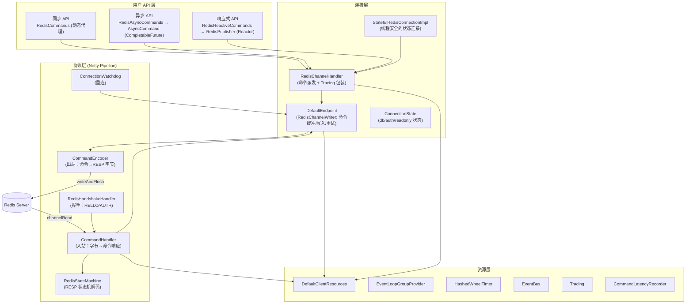
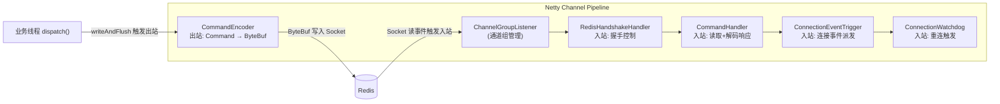
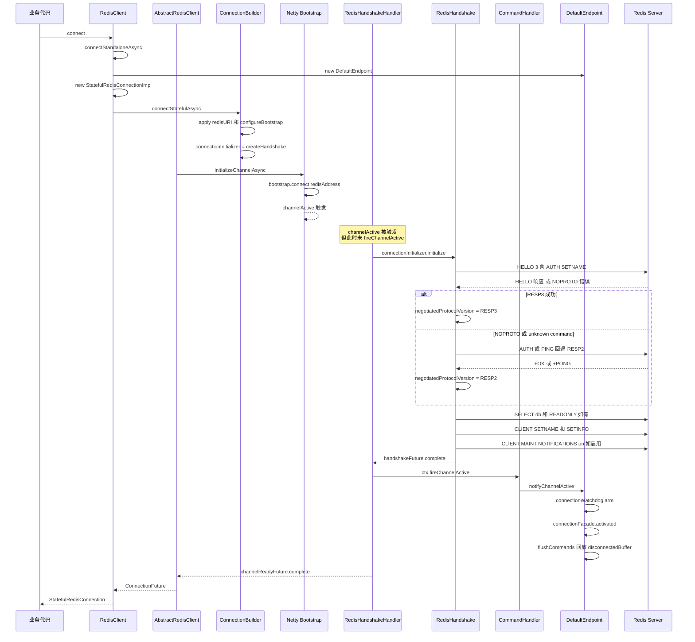
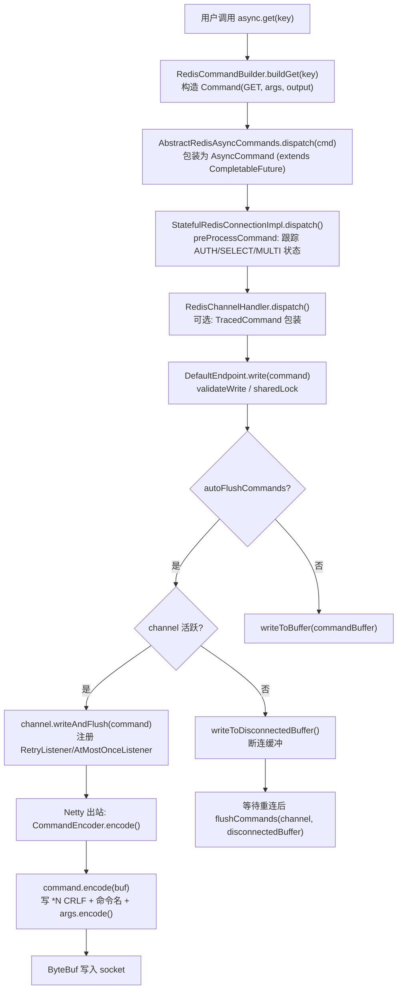
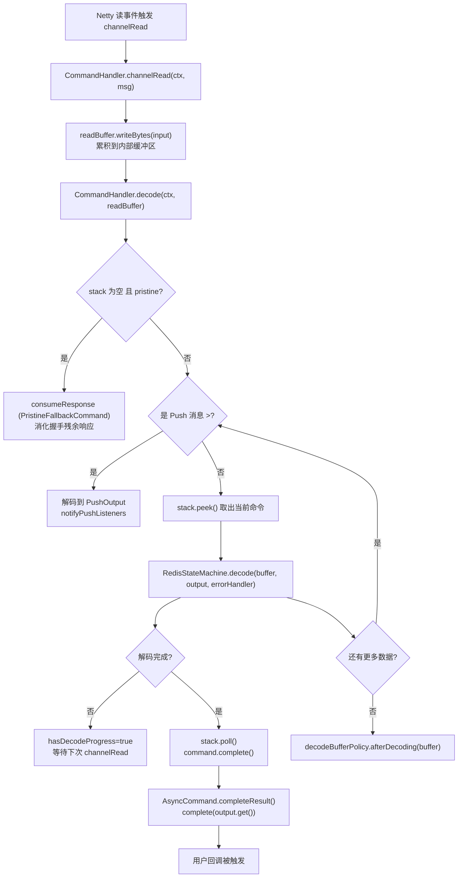
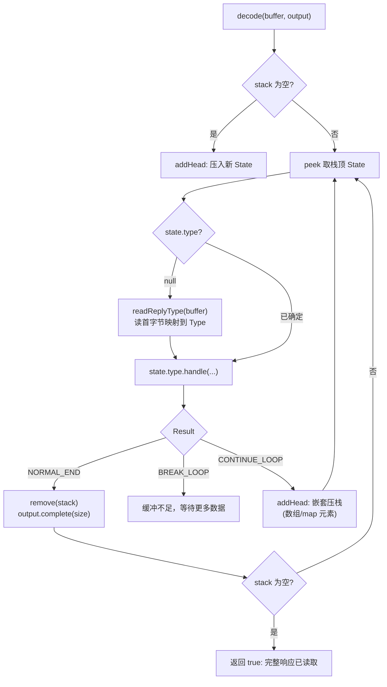
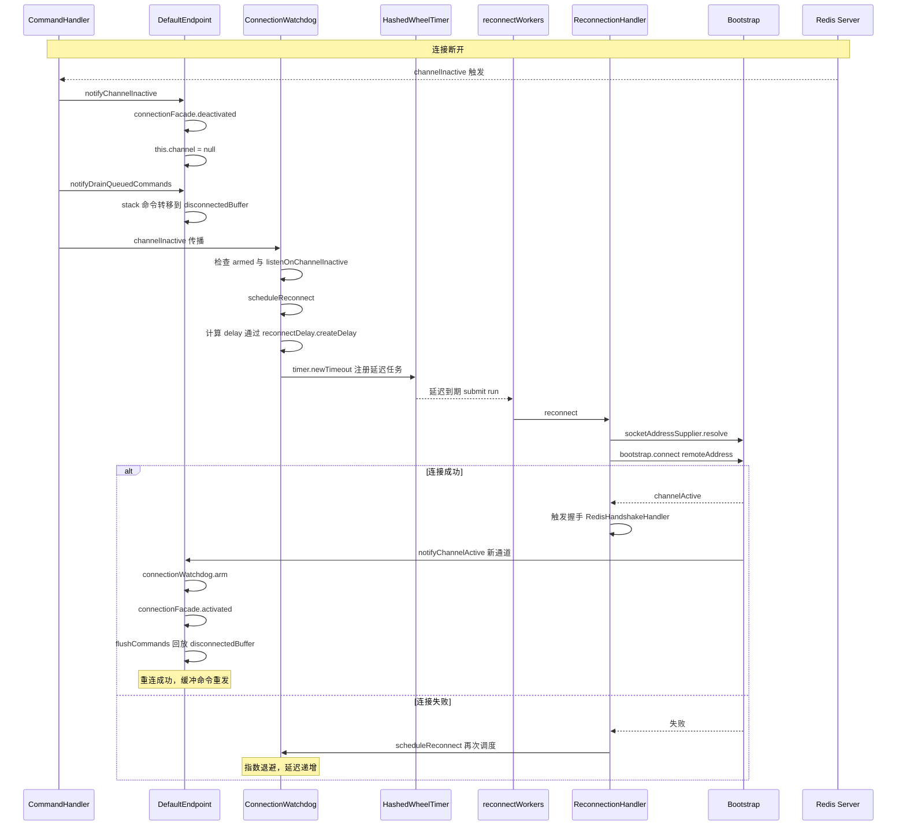
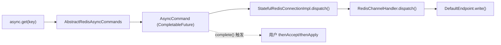
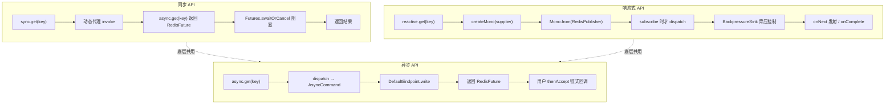

# Lettuce 7.1.3 源码深度解析

> 基于 `lettuce-core 7.1.3.RELEASE` 源码，系统剖析其底层实现原理、与 Redis 通信的完整流程以及核心设计思想。
> 所有流程图与时序图均采用 Mermaid 语法呈现。

---

## 目录

- [一、整体概述](#一整体概述)
- [二、分层架构总览](#二分层架构总览)
- [三、核心组件详解](#三核心组件详解)
- [四、Netty Pipeline 与通信链路](#四netty-pipeline-与通信链路)
- [五、连接建立完整流程](#五连接建立完整流程)
- [六、命令执行完整流程（写路径）](#六命令执行完整流程写路径)
- [七、响应解码完整流程（读路径）](#七响应解码完整流程读路径)
- [八、RESP 协议编解码原理](#八resp-协议编解码原理)
- [九、自动重连机制](#九自动重连机制)
- [十、三种 API 风格的实现原理](#十三种-api-风格的实现原理)
- [十一、可靠性、背压与连接状态管理](#十一可靠性背压与连接状态管理)
- [十二、关键设计亮点](#十二关键设计亮点)

---

## 一、整体概述

Lettuce 是一个基于 Netty 的高性能 Redis Java 客户端，具有以下核心特征：

| 特性 | 说明 |
|------|------|
| 非阻塞 IO | 完全基于 Netty 实现，所有网络 IO 异步驱动 |
| 线程安全 | 单连接可被多线程共享（非阻塞、非事务场景） |
| 三种 API | 同时提供同步、异步（`RedisFuture`）、响应式（Reactor `Mono`/`Flux`）三种编程模型 |
| RESP3 支持 | 支持 RESP2/RESP3 协议自动协商，向后兼容 |
| 自动重连 | 通过 `ConnectionWatchdog` 实现断线检测与指数退避重连 |
| 多拓扑 | 支持 Standalone、Sentinel、Cluster、Pub/Sub、Master/Replica |
| 资源复用 | 通过 `ClientResources` 共享 EventLoopGroup、Timer、EventBus |

---

## 二、分层架构总览

Lettuce 采用清晰的分层架构，从上到下依次为 API 层、连接层、协议层、资源层。



---

## 三、核心组件详解

### 3.1 客户端入口

| 类 | 路径 | 职责 |
|----|------|------|
| `RedisClient` | `io.lettuce.core.RedisClient` | Standalone/Sentinel/PubSub 入口 |
| `AbstractRedisClient` | `io.lettuce.core.AbstractRedisClient` | 抽象基类，持有 `ClientResources`、`ChannelGroup`，提供 `initializeChannelAsync()` |
| `RedisClusterClient` | `io.lettuce.core.cluster.RedisClusterClient` | 集群入口，扩展多节点路由 |

`AbstractRedisClient` 的核心字段（`AbstractRedisClient.java:85-130`）：

```java
private final ClientResources clientResources;        // 共享/独占资源
private final boolean sharedResources;                 // 是否共享资源
protected final ChannelGroup channels;                 // 所有活跃通道
private final Map<Class<? extends EventLoopGroup>, EventLoopGroup> eventLoopGroups;
private volatile ClientOptions clientOptions = ClientOptions.create();
```

### 3.2 连接对象

#### `StatefulRedisConnectionImpl`（`StatefulRedisConnectionImpl.java:57`）

一个**线程安全**的状态连接，内部聚合了三种 API 实现：

```java
protected final RedisCommands<K, V> sync;             // 同步 API（动态代理）
protected final RedisAsyncCommandsImpl<K, V> async;  // 异步 API
protected final RedisReactiveCommandsImpl<K, V> reactive; // 响应式 API
private final ConnectionState state;                  // 连接状态（db、auth、readonly）
private RedisAuthenticationHandler<K, V> authHandler;
```

其 `dispatch()` 方法（`StatefulRedisConnectionImpl.java:185`）是命令派发的核心入口，会先经过 `preProcessCommand` 进行状态跟踪（如 `AUTH`/`SELECT`/`READONLY`/`MULTI`/`EXEC`），再交给父类 `RedisChannelHandler.dispatch()`。

#### `RedisChannelHandler`（`RedisChannelHandler.java:34`）

所有连接的抽象基类，持有 `RedisChannelWriter`（实际为 `DefaultEndpoint`），负责命令派发、超时管理、Tracing 包装与关闭事件：

```java
protected <T> RedisCommand<K, V, T> dispatch(RedisCommand<K, V, T> cmd) {
    if (tracingEnabled) {
        // 包装为 TracedCommand，附加 TraceContext
        return channelWriter.write(commandToSend);
    }
    return channelWriter.write(cmd);
}
```

### 3.3 端点（Endpoint）与命令写入器

#### `DefaultEndpoint`（`DefaultEndpoint.java:66`）

实现 `RedisChannelWriter` 与 `Endpoint` 接口，是命令发送到 Netty Channel 的**最后一跳**，承担：

1. **命令缓冲**：维护两个队列
   - `commandBuffer`：手动 flush 模式下（`autoFlushCommands=false`）的待发送命令
   - `disconnectedBuffer`：断连期间缓存的命令（重连后回放）

2. **可靠性策略**（`DefaultEndpoint.java:1091`）：
   - `AT_MOST_ONCE`（`isAutoReconnect=false`）：写失败即取消命令
   - `AT_LEAST_ONCE`（`isAutoReconnect=true`）：写失败重新入队，重连后重发

3. **写路径核心方法**（`DefaultEndpoint.java:185`）：

```java
public <K, V, T> RedisCommand<K, V, T> write(RedisCommand<K, V, T> command) {
    RedisException validation = validateWrite(1);     // 队列容量、连接状态校验
    if (validation != null) { command.completeExceptionally(validation); return command; }
    sharedLock.incrementWriters();
    try {
        if (inActivation) command = processActivationCommand(command); // 激活期间包装
        if (autoFlushCommands) {
            Channel channel = this.channel;
            if (isConnected(channel)) writeToChannelAndFlush(channel, command);
            else writeToDisconnectedBuffer(command);                  // 断连缓冲
        } else writeToBuffer(command);
    } finally { sharedLock.decrementWriters(); }
    return command;
}
```

4. **写监听器**（`DefaultEndpoint.java:874`、`941`）：使用 Netty `Recycler` 对象池复用 `AtMostOnceWriteListener` 和 `RetryListener`，避免 GC 压力。

### 3.4 协议层组件

| 类 | 角色 | 说明 |
|----|------|------|
| `CommandEncoder` | Netty 出站 Handler | 将 `RedisCommand` 对象编码为 RESP 字节 |
| `CommandHandler` | Netty 入站 Handler | 读取响应、调用状态机解码、维护命令栈 |
| `RedisStateMachine` | RESP 解析器 | 状态机式解析 RESP2/RESP3 响应 |
| `RedisHandshakeHandler` | Netty 入站 Handler | 在 `channelActive` 时执行 HELLO/AUTH 握手 |
| `ConnectionWatchdog` | Netty 入站 Handler（Sharable） | 监听断连，触发重连调度 |
| `Command`/`AsyncCommand` | 命令对象 | 承载命令类型、参数、输出、Future |

---

## 四、Netty Pipeline 与通信链路

`ConnectionBuilder.buildHandlers()`（`ConnectionBuilder.java:118`）定义了 Pipeline 的组装顺序：

```java
List<ChannelHandler> handlers = new ArrayList<>();
handlers.add(new ChannelGroupListener(channelGroup, clientResources.eventBus()));
handlers.add(new CommandEncoder());                                  // 出站编码
handlers.add(getHandshakeHandler());                                 // RedisHandshakeHandler
handlers.add(commandHandlerSupplier.get());                          // CommandHandler
handlers.add(new ConnectionEventTrigger(connectionEvents, ...));    // 事件触发
if (clientOptions.isAutoReconnect()) {
    handlers.add(createConnectionWatchdog());                        // 重连看门狗
}
```

Pipeline 在 Channel 中的排列如下（Netty 的入站自顶向下，出站自底向上）：



- **出站方向**：业务线程调用 `channel.writeAndFlush(command)` → `CommandEncoder.encode()` 将 `Command` 编码为 RESP 字节，写入 socket。
- **入站方向**：Netty 读事件触发 `channelRead`，依次流经各入站 Handler，最终由 `CommandHandler` 解码并完成命令。

---

## 五、连接建立完整流程

### 5.1 时序图



### 5.2 关键源码点

1. **入口**：`RedisClient.connect()` → `connectStandaloneAsync()`（`RedisClient.java:270`），创建 `DefaultEndpoint` 与 `StatefulRedisConnectionImpl`，并最终调用 `initializeChannelAsync()`。

2. **Bootstrap 配置**：`AbstractRedisClient.connectionBuilder()`（`AbstractRedisClient.java:245`）调用 `ConnectionBuilder.configureBootstrap()`，根据 socket 类型选择 NIO/Epoll/KQueue/io_uring 的 `EventLoopGroup` 与 `Channel` 实现，并设置 `TCP_NODELAY`、`SO_KEEPALIVE`、`CONNECT_TIMEOUT_MILLIS` 等。

3. **握手触发**：`AbstractRedisClient.initializeChannelAsync0()`（`AbstractRedisClient.java:379`）调用 `bootstrap.connect()`，连接成功后从 pipeline 取出 `RedisHandshakeHandler`，等待其 `channelInitialized()` Future。

4. **握手实现**：`RedisHandshake.initialize()`（`RedisHandshake.java:98`）的链式流程：
   ```
   tryHandshakeResp3 (失败则回退 RESP2)
     → applyPostHandshake (SELECT db / READONLY)
     → applyConnectionMetadataSafely (CLIENT SETNAME / SETINFO)
     → enableMaintNotifications (CLIENT MAINT NOTIFICATIONS on)
   ```

5. **握手的 RESP3 协商**（`RedisHandshake.java:125`）：当 `requestedProtocolVersion == null`（默认）时，先尝试 `HELLO 3`：
   - 收到 `NOPROTO` 或 `ERR unknown command` → 回退到 RESP2，发起 `AUTH` 或 `PING`
   - 否则协商为 RESP3，从 HELLO 响应中提取 `id`、`mode`、`version`、`role`

6. **激活完成**：握手成功后 `RedisHandshakeHandler.channelActive()` 调用 `ctx.fireChannelActive()`，将事件传播到 `CommandHandler`，后者调用 `endpoint.notifyChannelActive()`（`DefaultEndpoint.java:452`）：
   ```java
   this.channel = channel;
   connectionFacade.activated();              // 触发 RedisChannelHandler.activated()
   flushCommands(channel, disconnectedBuffer); // 回放缓冲命令
   ```

---

## 六、命令执行完整流程（写路径）

以 `async.get(key)` 为例，从用户调用到字节进入 socket 的完整流程：

### 6.1 流程图



### 6.2 关键源码点

1. **命令构造**：`RedisCommandBuilder.get(key)` 构造 `Command<>(CommandType.GET, new ValueOutput<>(codec), args)`，其中 `args` 是 `CommandArgs.addKey(key)`。

2. **AsyncCommand 包装**（`AbstractRedisAsyncCommands.dispatch`）：
   ```java
   public <T> AsyncCommand<K, V, T> dispatch(RedisCommand<K, V, T> cmd) {
       AsyncCommand<K, V, T> asyncCommand = new AsyncCommand<>(cmd);
       RedisCommand<K, V, T> dispatched = connection.dispatch(asyncCommand);
       return (AsyncCommand<K, V, T>) dispatched;
   }
   ```
   `AsyncCommand` 继承 `CompletableFuture<T>` 并实现 `RedisCommand`，是连接用户回调与协议层状态机的桥梁。

3. **状态预处理**（`StatefulRedisConnectionImpl.preProcessCommand`，`StatefulRedisConnectionImpl.java:228`）：
   - `AUTH` 成功 → 保存凭证到 `ConnectionState`
   - `SELECT` 成功 → 更新 `state.db`
   - `READONLY`/`READWRITE` → 更新 `state.readOnly`
   - `MULTI` → 进入事务，后续命令包装为 `TransactionalCommand` 加入 `MultiOutput`
   - `EXEC` → 替换输出为 `MultiOutput`，`DISCARD` → 取消 `MultiOutput`

4. **DefaultEndpoint 写入**（`DefaultEndpoint.java:185`）：
   - `validateWrite()`：检查 closed、bounded queue 上限、断连拒绝策略
   - 连接活跃 → `channel.writeAndFlush(command)` 并注册监听器
   - 断连 → `writeToDisconnectedBuffer()` 入队等待重连

5. **编码**（`CommandEncoder.java:58` → `Command.encode()`，`Command.java:119`）：
   ```java
   public void encode(ByteBuf buf) {
       buf.writeByte('*');                                          // 数组前缀
       CommandArgs.IntegerArgument.writeInteger(buf, 1 + args.count()); // 数组元素个数
       buf.writeBytes(CommandArgs.CRLF);                            // \r\n
       CommandArgs.BytesArgument.writeBytes(buf, type.getBytes());   // 命令名 bulk string
       if (args != null) args.encode(buf);                          // 参数编码
   }
   ```

---

## 七、响应解码完整流程（读路径）

### 7.1 流程图



### 7.2 关键源码点

1. **入站入口**（`CommandHandler.channelRead`，`CommandHandler.java:579`）：
   ```java
   ByteBuf input = (ByteBuf) msg;
   readBuffer.writeBytes(input);  // 累积到 readBuffer（容量 8192*8）
   decode(ctx, readBuffer);
   ```

2. **解码循环**（`CommandHandler.decode`，`CommandHandler.java:617`）：
   - **pristine 状态**：刚建立连接，命令栈为空时，用 `PristineFallbackCommand` 消化握手残余字节（如 `-NOAUTH` 提示等）。
   - **Push 分支**：响应首字节为 `>`（PUSH 类型），解码到 `PushOutput`，通过 `endpoint.getPushListeners()` 通知监听者。
   - **普通命令分支**：从 `stack` 取出队首命令（FIFO，与写顺序一致），交给 `RedisStateMachine.decode()`。
   - **部分解码**：当缓冲区数据不足以完成一个完整响应时，`rsm.decode()` 返回 `false`，设置 `hasDecodeProgress=true`，保留命令在栈顶等待下次 `channelRead`。

3. **命令栈维护**：`CommandHandler` 内部维护 `Queue<RedisCommand<?, ?, ?>> stack`，写入时入栈（`addToStack`），解码完成时出栈（`stack.poll()`），保证响应与请求的顺序对应。

4. **延迟度量**（`CommandHandler.java:786`）：若启用 `latencyMetricsEnabled`，命令被包装为 `LatencyMeteredCommand`，记录 `sent`、`firstResponse`、`completion` 三个时间点，调用 `commandLatencyRecorder.recordCommandLatency()`。

5. **完成命令**（`CommandHandler.complete` → `AsyncCommand.complete`，`AsyncCommand.java:113`）：
   ```java
   public void complete() {
       if (COUNT_UPDATER.decrementAndGet(this) == 0) {
           completeResult();   // 根据 output 状态 complete/completeExceptionally
           command.complete(); // 内部 Command 状态机标记完成
       }
   }
   ```
   `count` 用于支持批量命令（如 `exec` 返回多个结果）。

---

## 八、RESP 协议编解码原理

### 8.1 编码侧（出站）

`CommandArgs` 采用**责任链式参数模型**（`CommandArgs.java:55`）：每个参数是一个 `SingularArgument` 子类，调用 `encode(buffer)` 时按 RESP bulk string 格式写入：

```
$<length>\r\n<bytes>\r\n
```

参数类型与编码策略：

| 参数类型 | 实现 | 缓存优化 |
|----------|------|----------|
| `byte[]` | `BytesArgument` | 无 |
| `String` | `StringArgument` | 无（每次 UTF-8 编码） |
| `char[]` | `CharArrayArgument` | 无（用于密码，避免 String 常驻） |
| `long` | `IntegerArgument` | **有**，`IntegerCache` 缓存 [-128, 128) |
| `double` | `DoubleArgument` | 无 |
| `CommandType` | `ProtocolKeywordArgument` | **有**，`CommandTypeCache` 全枚举缓存 |
| `CommandKeyword` | `ProtocolKeywordArgument` | **有**，`CommandKeywordCache` 全枚举缓存 |
| Key | `KeyArgument` | 委托 `RedisCodec.encodeKey()` |
| Value | `ValueArgument` | 委托 `RedisCodec.encodeValue()` |

**性能亮点**：`IntegerArgument` 和 `ProtocolKeywordArgument` 的缓存避免了高频命令（如 `GET`、`SET`、数字索引）的重复对象分配。

### 8.2 解码侧（入站）

`RedisStateMachine`（`RedisStateMachine.java:47`）是 RESP 解析的核心，采用**栈式状态机**处理嵌套结构。

#### 状态机结构



#### RESP 类型映射

`State.Type` 枚举（`RedisStateMachine.java:88`）通过首字节映射到对应的 handler：

| 首字节 | Type | 解码逻辑 |
|--------|------|----------|
| `+` | SINGLE | `readLine` 读到 `\r\n`，`output.set(bytes)` |
| `-` | ERROR | `readLine`，`output.setError(bytes)` |
| `:` | INTEGER | `findLineEnd` + `Resp2LongProcessor` 解析 long |
| `,` | FLOAT (RESP3) | ASCII 解析 double |
| `#` | BOOLEAN (RESP3) | `t`/`f` 映射 |
| `_` | NULL (RESP3) | 跳过行尾，`output.set(null)` |
| `!` | BULK_ERROR (RESP3) | 读长度 + 字节，`setError` |
| `=` | VERBATIM (RESP3) | 读长度 + 字节，跳过 `txt:`/`mkd:` 前缀 |
| `(` | BIG_NUMBER (RESP3) | `readLine` 读为字符串 |
| `$` | BULK | 读长度 N，若 N=-1 则 null，否则读 N 字节 + `\r\n` |
| `*` | MULTI | 读 count，递归压栈 count 次 |
| `%` | MAP (RESP3) | 读 count，`output.multiMap(count)`，count*2 次压栈 |
| `~` | SET (RESP3) | 读 count，`output.multiSet(count)`，count 次压栈 |
| `>` | PUSH (RESP3) | 读 count，`output.multiPush(count)`，count 次压栈 |
| `@` | HELLO_V3 | 读 count，递归 |
| `\|` | ATTRIBUTE | 暂未实现（抛异常） |

#### 嵌套结构处理

对于嵌套类型（MULTI/MAP/SET/PUSH），`returnDependStateCount`（`RedisStateMachine.java:571`）会：
1. `state.count--` 递减剩余元素数
2. `addHead(stack)` 压入新 State 处理下一个元素
3. 返回 `CONTINUE_LOOP` 让循环继续

栈深度上限为 32（`stack = State.createStates(32)`），足以应对 Redis 的最深嵌套结构。

#### 协议自动发现

`RedisStateMachine.isDiscoverProtocol()`（`RedisStateMachine.java:281`）：当 `protocolVersion == null` 时，若解码过程中遇到 `@`（HELLO_V3）或 `%`（MAP）类型，则判定为 RESP3，否则 RESP2。这与 `RedisHandshake` 的 HELLO 协商相互印证。

#### 零拷贝优化

`readBytes0`（`RedisStateMachine.java:704`）使用 `buffer.internalNioBuffer()` 直接获取 NIO ByteBuffer 视图，仅推进 readerIndex，避免数据拷贝。`Resp2LongProcessor` 通过 `buffer.forEachByte()` 直接在 ByteBuf 上解析数字，无中间字符串。

---

## 九、自动重连机制

### 9.1 时序图



### 9.2 关键源码点

1. **Watchdog 触发**（`ConnectionWatchdog.channelInactive`，`ConnectionWatchdog.java:199`）：
   ```java
   if (!armed) return;
   channel = null;
   if (listenOnChannelInactive && !reconnectionHandler.isReconnectSuspended()) {
       scheduleReconnect();
   }
   ```

2. **延迟调度**（`ConnectionWatchdog.scheduleReconnect`，`ConnectionWatchdog.java:229`）：
   - 使用 `reconnectSchedulerSync` CAS 防止重复调度
   - `reconnectDelay.createDelay(attempt)` 计算延迟（默认 `Delay.exponential()` 指数退避：1s, 2s, 4s, ... 上限 15s）
   - `timer.newTimeout()` 注册到 `HashedWheelTimer`（Netty 高性能时间轮）
   - 到期后 `reconnectWorkers.submit()` 提交到独立线程池执行重连

3. **重连执行**（`ConnectionWatchdog.run`，`ConnectionWatchdog.java:296`）：
   - 发布 `ReconnectAttemptEvent` 到 EventBus
   - 调用 `reconnectionHandler.reconnect()` 实际连接
   - 失败则 `scheduleReconnect()` 递归（attempts 递增，延迟加大）

4. **日志抑制**（`ConnectionWatchdog.java:64`）：`LOGGING_QUIET_TIME_MS = 5s`，频繁重连时 5 秒内只 WARN 一次，避免日志风暴。

5. **MaintenanceAwareConnectionWatchdog**：扩展版本，支持 Redis Cloud 的 `CLIENT MAINT NOTIFICATIONS` 维护通知，在收到维护事件时主动触发重连到新节点。

### 9.3 命令重放与可靠性

`DefaultEndpoint` 的可靠性策略（`DefaultEndpoint.java:1091`）：

| 模式 | 触发条件 | 写失败行为 | 断连后命令 |
|------|----------|-----------|-----------|
| `AT_MOST_ONCE` | `isAutoReconnect=false` | 立即 `completeExceptionally` | 拒绝入队 |
| `AT_LEAST_ONCE` | `isAutoReconnect=true` | `RetryListener.potentiallyRequeueCommands` 重新入队 | 缓冲到 `disconnectedBuffer`，重连后回放 |

`RetryListener`（`DefaultEndpoint.java:941`）在写失败时：
- 过滤已 `done` 的命令
- 过滤被 `replayFilter` 排除的命令（如 `AUTH`、`SELECT` 等维护命令，由握手重发）
- 通过 `channel.eventLoop().submit()` 重新入队

`replayFilter`（`DefaultEndpoint.java:146`）由 `ClientOptions.getReplayFilter()` 提供，避免维护命令在握手和重放中重复执行。

---

## 十、三种 API 风格的实现原理

Lettuce 同时提供三种编程模型，但**底层共用同一套命令派发与协议机制**。

### 10.1 异步 API（基础）

`AbstractRedisAsyncCommands` 是另外两种 API 的基石。其 `dispatch()` 方法（前文已述）返回 `AsyncCommand`，后者继承 `CompletableFuture<T>` 并实现 `RedisCommand`，是连接用户回调与协议层状态机的桥梁。



### 10.2 同步 API（动态代理）

同步 API 通过 **JDK 动态代理** 包装异步 API 实现（`RedisChannelHandler.syncHandler`，`RedisChannelHandler.java:330`）：

```java
protected <T> T syncHandler(Object asyncApi, Class<?>... interfaces) {
    FutureSyncInvocationHandler h = new FutureSyncInvocationHandler(this, asyncApi, interfaces);
    return (T) Proxy.newProxyInstance(AbstractRedisClient.class.getClassLoader(), interfaces, h);
}
```

`FutureSyncInvocationHandler.handleInvocation`（`FutureSyncInvocationHandler.java:62`）：

```java
Method targetMethod = translator.get(method);          // 方法映射
Object result = targetMethod.invoke(asyncApi, args);    // 调用异步 API
if (result instanceof RedisFuture<?>) {
    long timeout = getTimeoutNs(command);                // 获取超时
    return Futures.awaitOrCancel(command, timeout, NANOSECONDS); // 阻塞等待
}
return result;
```

**事务感知**（`FutureSyncInvocationHandler.java:97`）：若 `connection.isMulti()` 且非 `EXEC`/`MULTI`/`DISCARD`/`WATCH` 方法，则直接返回 `null`（不阻塞），因为事务中的命令结果在 `EXEC` 时才返回。

### 10.3 响应式 API（Reactor）

响应式 API 基于 Project Reactor，通过 `RedisPublisher` 将命令转换为 `Mono`/`Flux`。

`createMono`（`AbstractRedisReactiveCommands.java:758`）：

```java
public <T> Mono<T> createMono(Supplier<RedisCommand<K, V, T>> commandSupplier) {
    if (tracingEnabled) {
        return withTraceContext().flatMap(it ->
            Mono.from(new RedisPublisher<>(decorate(commandSupplier, it), connection, false, getScheduler().next())));
    }
    return Mono.from(new RedisPublisher<>(commandSupplier, connection, false, getScheduler().next()));
}
```

`RedisPublisher` 实现了 Reactor 的 `CorePublisher` 与 Netty 的 `DemandAware.Sink`，关键设计：
- **懒执行**：只有在 `subscribe()` 时才真正构造 `Command` 并 dispatch
- **背压支持**：通过 `DemandAware.Sink` 与 `CommandHandler.BackpressureSource` 联动，当订阅者无 demand 时 `channel.config().setAutoRead(false)` 暂停读取，有 demand 时 `requestMore()` 恢复
- **调度器选择**（`getScheduler`，`AbstractRedisReactiveCommands.java:164`）：
  - 默认 `ImmediateEventExecutor.INSTANCE`（在 IO 线程完成回调）
  - `isPublishOnScheduler=true` 时使用 `eventExecutorGroup()`（计算线程池）

`createDissolvingFlux`：用于返回数组/列表的命令，将多结果"溶解"为 `Flux` 逐元素发射。

### 10.4 三种 API 对比



---

## 十一、可靠性、背压与连接状态管理

### 11.1 有界队列与背压

`ClientOptions.getRequestQueueSize()`（默认 `Integer.MAX_VALUE` 无界）控制每个连接的命令栈上限。当设置为有限值时：

- `DefaultEndpoint.validateWrite()`（`DefaultEndpoint.java:290`）校验 `queueSize + commands > requestQueueSize`，超出抛 `RedisException`。
- `CommandHandler.validateWrite()`（`CommandHandler.java:530`）校验 stack 上限。
- 这避免了慢消费场景下命令无限堆积导致 OOM。

**响应式背压**（`CommandHandler.BackpressureSource`，`CommandHandler.java:1021`）：当 `RedisPublisher` 无 demand 时，`channel.config().setAutoRead(false)` 暂停 Netty 读取；有 demand 时 `requestMore()` 通过 `fireUserEventTriggered(EnableAutoRead.INSTANCE)` 恢复。

### 11.2 DecodeBufferPolicy

`ClientOptions.getDecodeBufferPolicy()` 控制解码后的缓冲区处理策略：
- `afterPartialDecode(buffer)`：部分解码后（缓冲不足）
- `afterDecoding(buffer)`：一轮解码完成后
- `afterCommandDecoded(readBuffer)`：单个命令解码后

默认策略会 `discardReadBytes()` 压缩缓冲区，避免内存膨胀。

### 11.3 连接状态恢复

`ConnectionState` 保存：`db`、`readOnly`、`clientName`、`credentials`、`handshakeResponse`。

重连后，`RedisHandshake.initialize()` 链式执行：
1. `initiateHandshakeResp3` / `initiateHandshakeResp2`：HELLO/AUTH
2. `applyPostHandshake`：`SELECT db`（若 db>0）、`READONLY`（若 readOnly）
3. `applyConnectionMetadataSafely`：`CLIENT SETNAME`、`CLIENT SETINFO`
4. `enableMaintNotifications`

`StatefulRedisConnectionImpl.preProcessCommand` 也会在用户主动调用 `AUTH`/`SELECT`/`READONLY` 时更新 `ConnectionState`，确保重连后能正确恢复。

### 11.4 超时管理

`CommandExpiryWriter`（装饰器模式包装 `RedisChannelWriter`）为每个命令注册超时：
- `setTimeout(duration)` 配置连接级超时
- `TimeoutOptions` 支持按命令类型差异化超时
- 超时触发 `RedisCommandTimeoutException` 并取消命令

`FutureSyncInvocationHandler.getTimeoutNs`（`FutureSyncInvocationHandler.java:88`）通过 `TimeoutProvider` 支持命令级超时覆盖。

---

## 十二、关键设计亮点

### 12.1 完全异步、非阻塞

所有网络 IO 通过 Netty EventLoop 异步驱动，业务线程仅负责构造命令对象并写入 `DefaultEndpoint`，不阻塞等待响应。`AsyncCommand` 继承 `CompletableFuture` 提供组合式回调能力。

### 12.2 共享连接的线程安全

单连接可被多线程共享（非事务、非阻塞命令场景），关键在于：
- `CommandHandler.stack` 是线程安全的 `Queue`（`ArrayDeque` 或 `HashIndexedQueue`）
- `DefaultEndpoint` 使用 `SharedLock` 协调写线程
- Netty Channel 的 `writeAndFlush` 本身线程安全，任意线程可调用

### 12.3 对象池化优化

- `AddToStack`、`AtMostOnceWriteListener`、`RetryListener` 使用 Netty `Recycler` 对象池，避免高频回调的 GC 压力。
- `IntegerArgument`、`CommandType`、`CommandKeyword` 静态缓存，减少重复分配。

### 12.4 协议自动协商

- `RedisHandshake` 默认尝试 RESP3，失败回退 RESP2
- `RedisStateMachine` 在解码时通过响应类型自动判定协议版本
- 向后兼容老版本 Redis（< 6.0 仅支持 RESP2）

### 12.5 可靠性分级

通过 `ClientOptions.isAutoReconnect()` 区分：
- `AT_LEAST_ONCE`：命令不丢失（重连后重发），适合幂等命令
- `AT_MOST_ONCE`：命令至多执行一次（失败即取消），避免非幂等命令重复执行
- `replayFilter` 过滤维护命令，避免握手与重放冲突

### 12.6 全链路 Tracing

`TracedCommand` 包装命令并附加 `TraceContext`，在 `CommandHandler.attachTracing()` 中创建 Span，记录命令名与远程 endpoint，集成 Micrometer Tracing、Brave、OpenTelemetry 等。

### 12.7 资源解耦

`ClientResources` 将 EventLoopGroup、Timer、EventBus、Tracing、LatencyRecorder 等资源与客户端解耦，支持多个 `RedisClient` 共享同一套资源，降低多实例开销。

### 12.8 Native Transport 支持

通过 `EpollProvider`、`KqueueProvider`、`IOUringProvider` 自动检测并启用 Linux 的 io_uring/epoll、macOS 的 kqueue，提供比 NIO 更高的性能，并支持 TCP_USER_TIMEOUT、扩展 KeepAlive 等系统级选项。

---

## 附录：核心类索引

| 关注点 | 关键类 |
|--------|--------|
| 客户端入口 | `RedisClient`、`AbstractRedisClient`、`RedisClusterClient` |
| 连接对象 | `StatefulRedisConnectionImpl`、`RedisChannelHandler`、`ConnectionState` |
| 命令写入 | `DefaultEndpoint`、`RedisChannelWriter`、`CommandExpiryWriter`、`CommandListenerWriter` |
| 命令对象 | `Command`、`AsyncCommand`、`CommandArgs`、`RedisCommandBuilder` |
| 协议编解码 | `CommandEncoder`、`RedisStateMachine`、`CommandHandler` |
| 握手 | `RedisHandshake`、`RedisHandshakeHandler`、`ConnectionInitializer` |
| 重连 | `ConnectionWatchdog`、`ReconnectionHandler`、`Delay` |
| 资源 | `DefaultClientResources`、`DefaultEventLoopGroupProvider`、`HashedWheelTimer` |
| 同步 API | `FutureSyncInvocationHandler`、`RedisCommands` |
| 异步 API | `AbstractRedisAsyncCommands`、`RedisAsyncCommandsImpl`、`RedisFuture` |
| 响应式 API | `AbstractRedisReactiveCommands`、`RedisPublisher`、`Operators` |
| 集群 | `RedisClusterClient`、`ClusterTopologyRefreshTask`、`PipelinedRedisFuture` |
| Pub/Sub | `PubSubEndpoint`、`PubSubCommandHandler`、`StatefulRedisPubSubConnectionImpl` |

---

> 本文档基于 lettuce 7.1.3.RELEASE 源码分析整理，所有代码引用均标注了 `文件名:行号`，便于读者按图索骥。
