# Mycat2（v1.22-release）源码深度解析文档

> 基于源码目录：`Mycat2-1.22-2022-6-25`
> 本文档从源码角度剖析 Mycat2 的整体架构、启动流程、MySQL 协议兼容、分库分表、读写分离与执行引擎的实现原理。

---

## 目录

1. [简介](#一简介)
2. [功能特性](#二功能特性)
3. [模块结构](#三模块结构)
4. [整体架构](#四整体架构)
5. [部署步骤](#五部署步骤)
6. [使用示例](#六使用示例)
7. [底层实现原理深入分析](#七底层实现原理深入分析)
   - 7.1 [启动流程源码分析](#71-启动流程源码分析)
   - 7.2 [MySQL 原生协议兼容实现](#72-mysql-原生协议兼容实现)
   - 7.3 [SQL 处理总流程与 Handler 责任链](#73-sql-处理总流程与-handler-责任链)
   - 7.4 [SQL 解析与 Calcite 优化器](#74-sql-解析与-calcite-优化器)
   - 7.5 [分库分表的实现](#75-分库分表的实现)
   - 7.6 [读写分离与副本选择](#76-读写分离与副本选择)
   - 7.7 [执行引擎与结果汇聚](#77-执行引擎与结果汇聚)
   - 7.8 [事务管理](#78-事务管理)
   - 7.9 [线程模型与异步架构](#79-线程模型与异步架构)
   - 7.10 [Calcite 优化规则深度剖析](#710-calcite-优化规则深度剖析)
   - 7.11 [XA 两阶段提交与事务日志深度剖析](#711-xa-两阶段提交与事务日志深度剖析)
   - 7.12 [原生协议后端连接实现深度剖析](#712-原生协议后端连接实现深度剖析)
8. [关键设计总结](#八关键设计总结)

---

## 一、简介

Mycat2 是 Mycat 社区开发的一款**分布式关系型数据库中间件**。它在应用程序与 MySQL 集群之间充当"智能代理"：

- 对**客户端**而言，它就是一台 MySQL 服务器（伪装成 MySQL，走 MySQL 原生通信协议，默认端口 `8066`）；
- 对**后端**而言，它是若干物理 MySQL/JDBC 数据源的"超级客户端"，负责把逻辑 SQL 拆解、路由、下推到多个物理库执行，并把结果归并后返回。

一句话概括其定位：

> **SQL 代理 + SQL 解析器（Druid） + 查询优化器（Apache Calcite） + 分布式执行引擎 + 连接池 + 读写分离器** 的集合体。

与 Mycat1.x 相比，Mycat2 的重大变化：

| 维度 | Mycat1.x | Mycat2 |
|---|---|---|
| SQL 引擎 | 手写规则改写，只做简单路由 | Druid 解析 + Calcite 优化器（CBO/RBO），支持复杂 Join、聚合下推 |
| 网络 | 自研 NIO（Reactor） | Vert.x 事件循环 + 自研 MySQL 协议 codec |
| 执行 | 结果直接透传为主 | 计算下推 + 内存归并（可解释执行 Enumerable） |
| 后端连接 | 仅原生 MySQL 协议 | JDBC（Druid 连接池）与原生协议双通道 |
| 协议 | 部分兼容 | 完整握手/认证/预处理/事务/系统变量等 |

---

## 二、功能特性

来源于 README 与源码实证：

1. **MySQL 协议兼容**
   - 兼容 MySQL 语法与值类型（`MySQLType` 枚举完整覆盖 MySQL 数据类型，`common/src/main/java/io/mycat/beans/mysql/MySQLType.java`）；
   - 支持文本协议（`COM_QUERY`）与二进制协议（`COM_STMT_PREPARE/EXECUTE` 预处理语句）；
   - 支持 `mysql_native_password` 认证、字符集协商、系统变量（`SET`）、`SHOW` 语句重写。
2. **分布式查询引擎**
   - 基于 **Druid** 做 SQL 解析（MySQL 方言），基于 **Apache Calcite** 做校验、规则/代价优化；
   - 独立的物理执行引擎，计算可下推到后端数据库。
3. **分库分表（Sharding）**
   - 支持取模、哈希取模、一致性哈希、日期、范围、枚举（文件映射）等数十种分片算法（`router/src/main/java/io/mycat/router/mycat1xfunction/` 下 20+ 实现）；
   - 支持分片表、全局表、单表、自定义表四种逻辑表模型；
   - 支持按 `dbNum × tableNum` 二维分片（`AutoFunction`，兼容 ShardingSphere 风格的 `MOD_HASH/UNI_HASH/YYYYMM` 等表达式）。
4. **读写分离与高可用**
   - 副本组模型支持 `SINGLE_NODE / MASTER_SLAVE / GARELA_CLUSTER / MGR / MHA` 等集群类型；
   - `BALANCE_ALL / BALANCE_ALL_READ / BALANCE_READ_WRITE / BALANCE_NONE` 四种负载均衡策略；
   - 心跳检测 + 故障自动切换（`switchType: SWITCH`）。
5. **分布式事务**
   - 事务类型可选 `proxy`（透传本地事务）或 `xa`（两阶段提交），另支持集成 Seata。
6. **SQL 计划管理（SPM）**
   - 内置 `mysql.spm_baseline / mysql.spm_plan` 表，可固化执行计划（baseline）。
7. **可扩展性**
   - 分片算法、序列号生成器、负载均衡算法均可自定义加载（`plug` 模块）；
   - 支持 HBT DSL（自定义 DSL 直接操纵物理查询计划）与 SQL 结果缓存。
8. **监控**
   - 内置 Prometheus Exporter（`mycat2/src/main/java/io/mycat/exporter/PrometheusExporter.java`）、SQL 日志监控（`MycatSQLLogMonitor`）、统计模块（`statistic`）。

---

## 三、模块结构

根 `pom.xml` 定义的多模块（Maven，Java 8）：

| 模块 | 路径 | 职责 |
|---|---|---|
| **mycat2** | `mycat2/` | 启动聚合模块：`MycatCore` 入口、Vert.x 服务器、MySQL 协议前端、SQL Handler 责任链、命令实现 |
| **proxy** | `proxy/` | 前端/后端会话抽象、MySQL 包解析器（`MySQLPacketResolver`）、文本/二进制结果集处理器 |
| **router** | `router/` | 分片函数库（`mycat1xfunction`、`function`、`range`、`custom`）、序列号生成、迁移工具 |
| **hbt** | `hbt/` | **核心计算引擎**：`DrdsSqlCompiler`（编译器）、Calcite 集成（`io.mycat.calcite`）、元数据管理（`MysqlMetadataManager`）、执行器（`calcite.executor`）、SPM |
| **datasource** | `datasource/` | JDBC 数据源（Druid 连接池）、`DefaultConnection`、事务会话（`LocalTransactionSession` 等） |
| **replica** | `replica/` | 副本选择器（`ReplicaDataSourceSelector`）、心跳（`heartbeat/`）、实例状态管理 |
| **executor** | `executor/` | Arrow 向量化执行工具（`io.ordinate.engine`，`VectorSchemaRoot` 行批处理） |
| **plug** | `plug/` | 负载均衡策略插件（`LoadBalanceStrategy`：随机/轮询/权重等） |
| **common** | `common/` | MySQL 包定义（`beans/mysql/packet`）、`MySQLPacketUtil` 编解码工具、线程池、上下文（`MetaClusterCurrent`） |
| **va** | `va/` | Vert.x XA 事务实现（`cn.mycat.vertx.xa`，`XaSqlConnection`、事务日志存储） |
| **seata** | `seata/` | Seata AT 模式集成（`SeataTransactionSession`） |
| **statistic** | `statistic/` | 表行数统计（`StatisticCenter`，为代价优化提供统计信息） |
| **assistant** | `assistant/` | JavaFX 图形化配置控制台 |
| **console** | `console/` | 命令行交互控制台 |
| **calcite / linq4j** | `calcite/`, `linq4j/` | **Fork 的 Apache Calcite 源码**（加入 `org.apache.calcite.mycat.MycatBuiltInMethod`、Rx 化的 `RxBuiltInMethod` 等定制），使 Mycat 能深度改造优化器 |

> 关键认知：**Mycat2 直接把 Calcite 源码 fork 进仓库**（根目录 `calcite/`、`linq4j/`），因此可以定制优化器内部行为，这是它区别于一般"调用 Calcite API"项目的地方。

---

## 四、整体架构

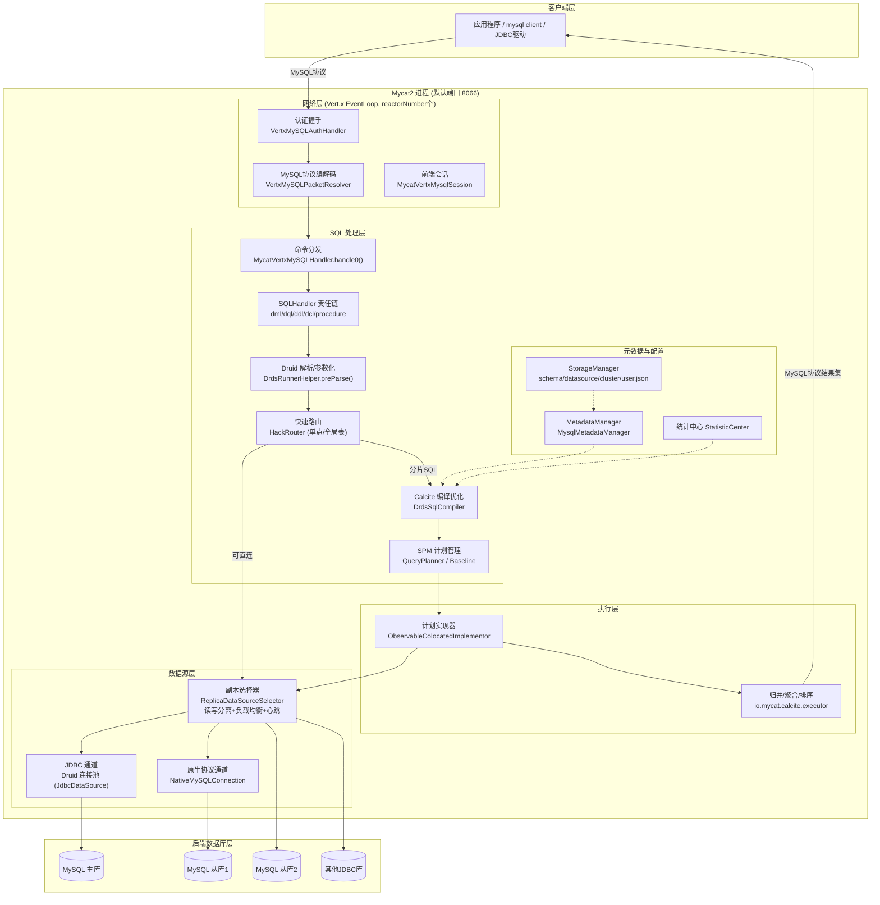

架构分层总结：

- **接入层**：Vert.x NIO 事件循环负责字节流收发，协议层负责握手认证与 MySQL 包拆装；
- **计算层**：Druid 负责"字符串 → AST"，Calcite 负责"AST → 校验 → 逻辑计划 → 物理计划 → 可执行代码"；
- **执行层**：把物理计划翻译成对若干 `Partition`（分片）的并发 IO 请求，并在内存中完成归并；
- **数据源层**：副本选择器决定"读写打到哪个实例"，连接池决定"用什么连接（JDBC/原生协议）"。

---

## 五、部署步骤

### 5.1 环境要求

- JDK 1.8（README 明确：当前仅支持 java8）
- 后端 MySQL 实例（或任意有 JDBC 驱动的数据库）

### 5.2 编译打包

```bash
git clone https://github.com/MyCATApache/Mycat2.git
cd Mycat2
mvn clean package -DskipTests
```

产物为 `mycat2/target/` 下的可运行 jar（single 包），配套启动脚本参考根目录 `start.bat`：

```bat
java -Dfile.encoding=UTF-8 -DMYCAT_HOME=<配置目录> -jar mycat2-xxx-single.jar
```

### 5.3 配置目录（MYCAT_HOME）

Mycat2 采用**元数据目录**式配置，所有配置都是 JSON 文件（源码默认模板见 `mycat2/src/main/resources/`）：

```
MYCAT_HOME/
├── server.json                  # 服务器参数
├── users/root.user.json         # 用户(可多个)
├── datasources/prototypeDs.datasource.json
├── clusters/prototype.cluster.json
├── schemas/xxx.schema.json      # 逻辑库表定义
└── sequences/                   # 序列号配置
```

**① server.json（核心参数）**

```json
{
  "loadBalance": { "defaultLoadBalance": "BalanceRandom", "loadBalances": [] },
  "mode": "local",
  "server": {
    "ip": "0.0.0.0",
    "port": 8066,
    "mycatId": 1,
    "reactorNumber": 8,
    "workerPool": { "corePoolSize": 1, "maxPoolSize": 1024, "taskTimeout": 5, "timeUnit": "MINUTES" },
    "timeWorkerPool": { "maxPoolSize": 2 },
    "rewriteInsertBatchedStatementBatch": 1000,
    "ignoreCast": true
  }
}
```

**② users/root.user.json**

```json
{
  "dialect": "mysql",
  "ip": null,
  "password": "123456",
  "transactionType": "proxy",
  "username": "root"
}
```

`transactionType` 可选 `proxy`（事务透传）/`xa`（分布式事务）。

**③ datasources/prototypeDs.datasource.json**

```json
{
  "dbType": "mysql",
  "idleTimeout": 60000,
  "instanceType": "READ_WRITE",
  "maxCon": 1000,
  "minCon": 1,
  "name": "prototypeDs",
  "password": "123456",
  "type": "JDBC",
  "url": "jdbc:mysql://localhost:3306/mysql?useUnicode=true&serverTimezone=Asia/Shanghai&characterEncoding=UTF-8",
  "user": "root",
  "weight": 0
}
```

**④ clusters/prototype.cluster.json**

```json
{
  "clusterType": "MASTER_SLAVE",
  "heartbeat": { "heartbeatTimeout": 1000, "maxRetry": 3, "minSwitchTimeInterval": 300, "slaveThreshold": 0 },
  "masters": ["prototypeDs"],
  "maxCon": 200,
  "name": "prototype",
  "readBalanceType": "BALANCE_ALL",
  "switchType": "SWITCH"
}
```

**⑤ schemas/db1.schema.json（分片表示例）**

```json
{
  "schemaName": "db1",
  "customTables": {},
  "globalTables": {},
  "normalTables": {},
  "shardingTables": {
    "travelrecord": {
      "createTableSQL": "CREATE TABLE db1.travelrecord (...)",
      "function": {
        "beanName": "builtin:mod-hash-long",
        "properties": { "dbNum": 2, "tableNum": 2 },
        "shardingColumn": "id"
      },
      "partition": {
        "dataNodes": [
          { "targetName": "prototype", "schemaName": "db1", "tableName": "travelrecord_0" },
          { "targetName": "prototype", "schemaName": "db1", "tableName": "travelrecord_1" }
        ]
      }
    }
  }
}
```

### 5.4 启动与验证

```bash
java -DMYCAT_HOME=/path/to/conf -jar mycat2-xxx-single.jar
# 日志出现端口监听即成功（默认 8066）

# 用 mysql 客户端连接验证
mysql -h127.0.0.1 -P8066 -uroot -p123456
```

> 源码提示：`MycatCore.findMycatHome()`（`MycatCore.java:194-211`）在未设置 `MYCAT_HOME` 时会从 jar 所在位置向上找可写目录；若目录下无 `server.json`，会调用 `ConfigUpdater.writeDefaultConfigToFile()` 生成默认配置（`MycatCore.java:168-170`）。

---

## 六、使用示例

### 6.1 建逻辑库表（在 Mycat 中直接执行 DDL）

```sql
-- mysql -h127.0.0.1 -P8066 -uroot -p 连接后执行
CREATE DATABASE db1;
CREATE TABLE db1.travelrecord (
  id      BIGINT NOT NULL,
  user_id VARCHAR(100),
  traveldate DATE,
  fee     DECIMAL(10,2),
  days    INT,
  PRIMARY KEY (id)
) BROADCAST;   -- 不写分片则默认建为全局表
```

使用 `/*+ mycat:addShardingColumn(...) */` 等 hint 或手工编辑 schema.json 定义分片后：

```sql
-- 分片键路由 INSERT：只下发到 id 命中的分片
INSERT INTO db1.travelrecord(id, user_id, traveldate, fee, days)
VALUES (1, 'u1', '2024-01-01', 100.00, 3);

-- 带分片键查询：精确路由
SELECT * FROM db1.travelrecord WHERE id = 1;

-- 不带分片键查询：全分片并行扫描 + 归并
SELECT COUNT(*) FROM db1.travelrecord WHERE fee > 50;

-- 查看分布式执行计划
EXPLAIN SELECT * FROM db1.travelrecord WHERE id = 1;
```

### 6.2 读写分离（配置主从后自动生效）

```sql
-- 写走主库
UPDATE db1.travelrecord SET fee = 200 WHERE id = 1;
-- 读走 BALANCE_ALL 策略选择的从库
SELECT * FROM db1.travelrecord WHERE id = 1;
-- 用 hint 强制读主库
SELECT /*+ mycat:readWriteSeparation=master */ * FROM db1.travelrecord WHERE id = 1;
```

### 6.3 事务

```sql
SET autocommit = 0;
BEGIN;
UPDATE db1.travelrecord SET fee = fee + 1 WHERE id = 1;
UPDATE db1.travelrecord SET fee = fee + 2 WHERE id = 100000001;
COMMIT;   -- transactionType=xa 时此处触发两阶段提交
```

### 6.4 预处理语句（二进制协议）

```java
// JDBC 客户端
try (Connection c = DriverManager.getConnection("jdbc:mysql://127.0.0.1:8066/db1", "root", "123456");
     PreparedStatement ps = c.prepareStatement("SELECT * FROM travelrecord WHERE id = ?")) {
    ps.setLong(1, 1);
    try (ResultSet rs = ps.executeQuery()) { ... }
}
```

对应协议命令 `COM_STMT_PREPARE` / `COM_STMT_EXECUTE`，见下文协议分析。

---

## 七、底层实现原理深入分析

### 7.1 启动流程源码分析

入口：`mycat2/src/main/java/io/mycat/MycatCore.java`

```java
// MycatCore.java:224-239
public static void main(String[] args) throws Exception {
    ... // 解析 -Dxxx=yyy 形式的启动参数写入 System properties
    new MycatCore().startServer();
}

// MycatCore.java:218-222
public void startServer() throws Exception {
    ConfigUpdater.loadConfigFromFile();   // ① 加载全部元数据配置
    mycatServer.start();                  // ② 启动网络服务 (VertxMycatServer)
    new PrometheusExporter().run();       // ③ 启动监控指标暴露
}
```

构造函数（`MycatCore.java:90-171`）做了五件事：

1. **定位 MYCAT_HOME**（`findMycatHome()`，194-211 行）；
2. **加载 server.json** → `MycatServerConfig`，并注册进全局上下文 `MetaClusterCurrent`（一种进程内 IoC 容器，`Maps.of(...)` 注册、`MetaClusterCurrent.wrapper(X.class)` 取用——这是 Mycat2 全代码库的依赖注入方式）；
3. **配置 Vert.x**：`workerPool.maxPoolSize`、`reactorNumber`（事件循环数）→ `VertxOptions`（113-117 行）；
4. **创建 `VertxMycatServer`**（214-216 行）；
5. **创建配置存储管理器**：`FileStorageManagerImpl`（文件读写）+ `StdStorageManagerImpl`（注册 `LogicSchemaConfig / ClusterConfig / DatasourceConfig / UserConfig / SequenceConfig / SqlCacheConfig` 六类配置，152-166 行），首次启动时写默认配置。

启动时序图：

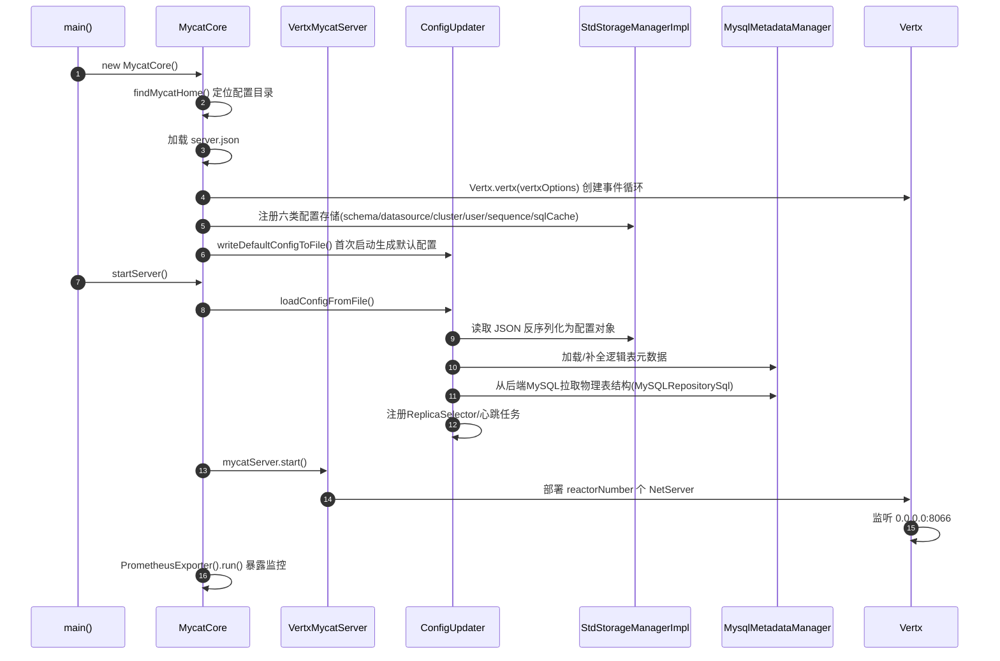

> 元数据细节：`MysqlMetadataManager`（`hbt/src/main/java/io/mycat/MysqlMetadataManager.java`）负责把 schema.json 中的逻辑表配置实例化为 `ShardingTable / GlobalTable / NormalTable`（`hbt/src/main/java/io/mycat/calcite/table/`），并通过 SQL 语句（`MySQLRepositorySql`）从后端 MySQL 的 `information_schema` 拉取真实列信息构建 Calcite `RelDataType`。

### 7.2 MySQL 原生协议兼容实现

Mycat2 "像 MySQL" 的本质是：**实现 MySQL Client/Server 协议的包头解析、握手认证、命令分发、结果集编码四个环节**。

#### 7.2.1 协议包格式与拆包

MySQL 协议每个包格式为：

```
+---------+---------+-----------+
| 3字节长度 | 1字节seq | payload  |
+---------+---------+-----------+
```

关键类：

- `common/src/main/java/io/mycat/beans/mysql/packet/MySQLPacketSplitter.java` —— 按头切包；
- `mycat2/src/main/java/io/mycat/vertx/VertxMySQLPacketResolver.java` / `proxy/src/main/java/io/mycat/proxy/packet/MySQLPacketResolver.java` —— **状态机拆包**：先读 4 字节头（HEAD 状态），再按长度读 payload（PAYLOAD 状态）；当 payload 长度达到 `0xFFFFFF`（16MB）时视为分片包，继续拼接直到出现不足 16MB 的包尾，从而支持超大包（如大 BLOB、批量 INSERT）。
- `common/src/main/java/io/mycat/MySQLPacketUtil.java` —— 生成 OK / ERR / EOF / ColumnDefinition / Row 等响应包。

#### 7.2.2 握手与认证

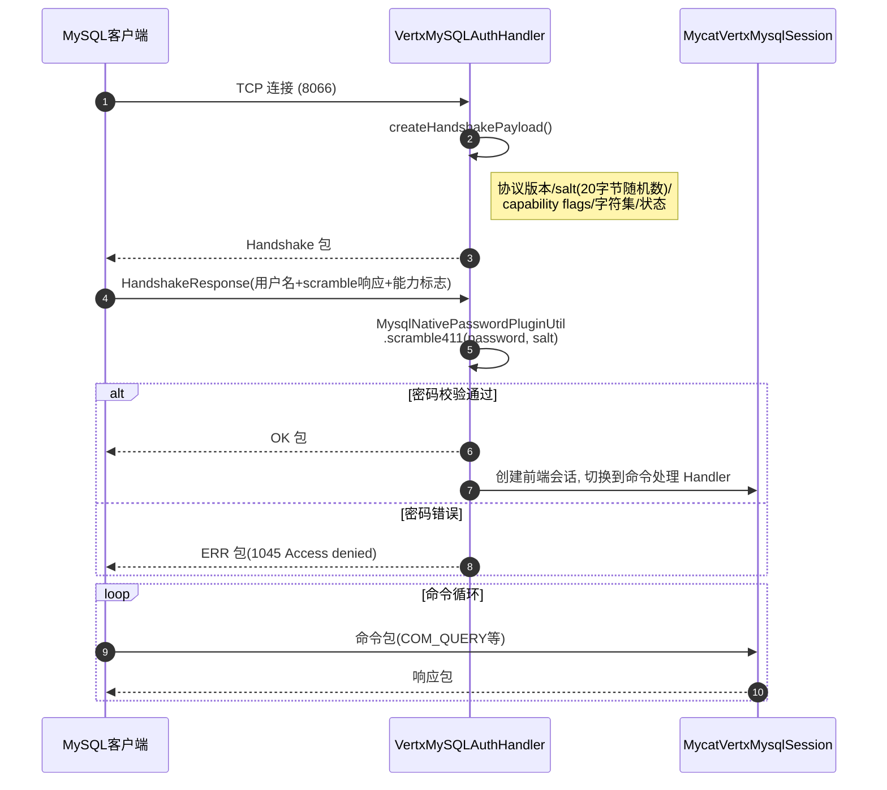

要点：

- 认证算法是 MySQL 标准的 `mysql_native_password`：`SHA1(password) XOR SHA1(salt + SHA1(SHA1(password)))`，因此任意标准 MySQL 客户端无需修改即可连接；
- 能力标志（capability flags）协商决定是否启用压缩（zlib）、`CLIENT_SSL`（SSL 加密通道）、`CLIENT_DEPRECATE_EOF`（源码 `NewMycatConnectionConfig.CLIENT_DEPRECATE_EOF`，`MycatCore.java:111`，即 MySQL 5.7+/8 的无 EOF 模式）；
- 服务器版本可配置伪装（`MySQLVersion.setServerVersion(...)`，`MycatCore.java:101`）。

#### 7.2.3 命令分发

`mycat2/src/main/java/io/mycat/mycatmysql/MycatVertxMySQLHandler.java` 的 `handle0()` 中按命令字节分发（82-194 行）：

```java
switch (command) {
    case MySQLCommandType.COM_QUERY:            // 0x03 文本SQL
    case MySQLCommandType.COM_STMT_PREPARE:     // 0x16 预处理
    case MySQLCommandType.COM_STMT_SEND_LONG_DATA: // 0x18 大参数
    case MySQLCommandType.COM_STMT_EXECUTE:     // 0x17 执行预处理
    case MySQLCommandType.COM_STMT_CLOSE:       // 0x19 关闭
    case MySQLCommandType.COM_STMT_FETCH:       // 0x1C 游标取行
    case MySQLCommandType.COM_STMT_RESET:       // 0x1D 重置
    ...
}
```

文本协议 vs 二进制协议：

| | 文本协议 COM_QUERY | 二进制协议 COM_STMT_* |
|---|---|---|
| 参数 | 内嵌在 SQL 字符串中 | 独立的二进制参数块（按 null 位图 + 类型 + 值编码） |
| 解析 | Druid 每次解析 | prepare 一次解析缓存，execute 只绑定参数 |
| 行格式 | 文本行（所有值转字符串） | 二进制行（`BinaryResultSetHandler` 编码） |

#### 7.2.4 结果集回写

结果集响应包序列：`ColumnCount → N × ColumnDefinition → (EOF) → N × Row → EOF/OK`。Mycat2 有三条回写通道（`ShardingSQLHandler.testExample()`，`ShardingSQLHandler.java:67-88` 可见三种 response API）：

1. **对象结果集**：`ResultSetBuilder` 构造 → 逐行编码为 MySQL 文本/二进制行；
2. **缓冲直通（swapBuffer）**：`response.swapBuffer(Observable<Buffer>)` —— 后端返回的原始 MySQL 包直接转发前端（代理模式，零解码开销）；
3. **向量化（Arrow）**：`response.sendVectorResultSet(meta, Observable<VectorSchemaRoot>)` —— 执行引擎用 Apache Arrow 列式内存做归并计算（`executor` 模块 `io.ordinate.engine`）。

系统变量与字符集：`SetSQLHandler`（`mycat2/src/main/java/io/mycat/sqlhandler/dml/SetSQLHandler.java`）拦截 `SET` 语句维护会话变量（autocommit、transaction_isolation、character_set_results、SQL_SELECT_LIMIT 等），`SHOW` 语句由 `ShowStatementRewriter`（`router/src/main/java/io/mycat/router/ShowStatementRewriter.java`）重写为对元数据库的查询。

### 7.3 SQL 处理总流程与 Handler 责任链

`SQLHandler`（`mycat2/src/main/java/io/mycat/sqlhandler/SQLHandler.java`）是责任链节点接口：

```java
public interface SQLHandler<Statement extends SQLStatement> {
    default Future<Void> execute(SQLRequest<Statement> request,
                                 MycatDataContext dataContext, Response response) { ... }
    Class getStatementClass();   // 以 Druid AST 类型为 key 注册
}
```

`sqlhandler/` 目录按语句类型分包：`dml/`（SELECT/INSERT/UPDATE/DELETE/SET）、`dql/`（EXPLAIN/SHOW）、`ddl/`（CREATE/ALTER/DROP/TRUNCATE）、`dcl/`（用户权限）、`procedure/`。命令分发器解析出 `SQLStatement` 后按其 Class 查表调用对应 Handler。

**一条查询 SQL 的完整生命周期**（以 `ShardingSQLHandler.onExecute()`，`ShardingSQLHandler.java:45-65` 为准）：

```java
DrdsSqlWithParams drdsSqlWithParams = DrdsRunnerHelper.preParse(request.getAst(), schema); // ① Druid解析+参数化
HackRouter hackRouter = new HackRouter(drdsSqlWithParams.getParameterizedStatement(), dataContext);
if (hackRouter.analyse()) {                       // ② 快速路由判定
    Pair<String,String> plan = hackRouter.getPlan();  // ③ 改写表名为物理表
    return response.proxySelect(..., plan.getKey(), plan.getValue(), params); // ④ 单点直连代理
} else {
    return DrdsRunnerHelper.runOnDrds(dataContext, drdsSqlWithParams, response); // ⑤ Calcite完整编译执行
}
```

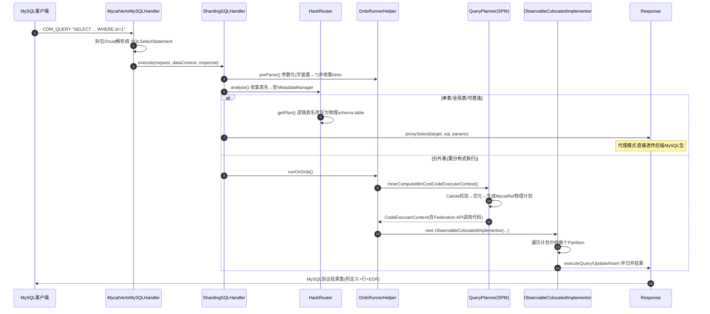

### 7.4 SQL 解析与 Calcite 优化器

#### 7.4.1 双解析器架构

- **Druid（前端层）**：`DrdsRunnerHelper.preParse()`（`hbt/src/main/java/io/mycat/calcite/DrdsRunnerHelper.java:59-112`）调用 `SQLUtils.parseSingleMysqlStatement()` 解析 MySQL 方言；`MycatPreparedStatementUtil.outputToParameterized()` 把字面量改写成 `?` 并收集参数值与 `MycatHint`（`/*+ mycat:... */` 注释）。**参数化是 SPM（计划复用）的前提**：相同模板的 SQL 只编译一次。
- **Calcite（计算层）**：参数化 SQL 再经 Calcite 解析为 `SqlNode`（`MycatCalciteMySqlNodeVisitor` 桥接 MySQL 方言），随后走标准 Calcite 流程。

#### 7.4.2 编译流水线

`DrdsSqlCompiler`（`hbt/src/main/java/io/mycat/DrdsSqlCompiler.java`）核心方法 `dispatch()`（210-295 行）与 `compileQuery()`：

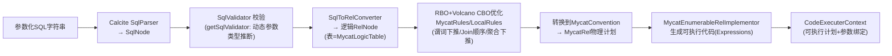

关键定制点（均在 fork 的 calcite 与 `io.mycat.calcite` 包中）：

1. **动态参数类型推断**：`DrdsRunnerHelper.getSqlValidator()`（206-311 行）重写 `deriveType/resolveDynamicParam`，让 `?` 参数使用客户端传来的真实类型（Long→BIGINT 等，`getSqlTypeNames()`，138-181 行），避免"未知类型"校验失败——这是代理型数据库特有的问题。
2. **MycatConvention / MycatRel**：自定义 calling convention。`MycatLogicTable`（包装 `TableHandler`）提供 `Distribution`（数据分布信息：分片键、分片函数、各分片统计），优化器据此判断 Join/聚合能否下推。**如果两张分片表按相同分片键同构分布（ER 关系），优化器会把 Join 直接下推到各分片本地执行**。
3. **`MycatRules` / `LocalRules`**：谓词下推（把 WHERE 推到 TableScan）、投影裁剪、聚合拆分（`SUM → 各分片SUM + 根节点SUM(SUM)`）、跨分片 Join 改写等。
4. **SPM（SQL 计划管理）**：`QueryPlanner.innerComputeMinCostCodeExecuterContext()` 先查 baseline（`mysql.spm_baseline/spm_plan` 表），命中则直接使用固化计划，未命中才完整编译并可回填 baseline——即"计划缓存 + 固化"。

### 7.5 分库分表的实现

#### 7.5.1 表模型与路由判定

`HackRouter.analyse()`（`hbt/src/main/java/io/mycat/prototypeserver/mysql/HackRouter.java:55-127`）是路由分发的"快速通道"：

```java
res = metadataManager.checkVaildNormalRoute(tableNames); // 判断涉及表是否都能单点路由
switch (distribution.type()) {
    case BROADCAST: // 全局表: 从全局数据节点中随机挑一个执行 (112-115行)
        targetName = globalDataNode.get(random).getTargetName(); return true;
    case PHY:       // 单表/普通表: 路由到其唯一数据节点 (118-120行)
        targetName = normalMap.values().iterator().next().getTargetName(); return true;
    case SHARDING:  // 分片表: 放弃快速路由, 走Calcite完整编译 (116-117行)
        return false;
}
```

`getPlan()`（129-146 行）用 visitor 把 SQL 中的逻辑表名替换成 `Partition` 中的物理 `schema.table`，然后由 `response.proxySelect()` **单点透传**。

三种逻辑表的语义：

| 表类型 | 数据分布 | 读路径 | 写路径 |
|---|---|---|---|
| **NormalTable（单表）** | 只存在于一个 target | 直连该 target | 直连该 target |
| **GlobalTable（全局表）** | 每个 target 都有完整副本 | 随机挑一个 target | **广播写全部副本**（`complieGlobalInsert`，`DrdsSqlCompiler.java:297-303`，多节点时走 `MycatInsertRel` 多路插入） |
| **ShardingTable（分片表）** | 按分片函数散列到 N 个 partition | 按条件精确路由或全分片扫描 | 按分片键值路由到具体 partition |

#### 7.5.2 分片函数体系

分片函数继承体系（`router` 模块）：

```
CustomRuleFunction (io.mycat.router)                  // 新接口: calculate(Map<String,RangeVariable>) 支持范围推导
├── Mycat1xSingleValueRuleFunction                    // 旧接口: calculateIndex(String) 单值计算
│   ├── PartitionByMod / PartitionByHashMod / PartitionByString ...
│   └── (mycat1xfunction 包, 20+ 种实现)
└── AutoFunction (function 包)                         // dbNum×tableNum 二维分片
```

**单值取模算法**（`router/src/main/java/io/mycat/router/mycat1xfunction/PartitionByMod.java:42-51`）：

```java
public int calculateIndex(String columnValue) {
    BigInteger bigNum = new BigInteger(columnValue).abs();
    return (bigNum.mod(count)).intValue();   // |value| mod count
}
```

**二维分片算法**（`AutoFunction.calculate(Map<String,RangeVariable>)`，`router/src/main/java/io/mycat/router/function/AutoFunction.java:115+`）：把分片键先经 `finalDbFunction` 计算库序号、再经 `finalTableFunction` 计算表序号，最终映射到 `dbNum × tableNum` 个 partition。支持的表达式即 `extractKey()`（72-107 行）中列出的：`MOD_HASH / UNI_HASH / RIGHT_SHIFT / RANGE_HASH / DD / MM / MMDD / WEEK / YYYYDD / YYYYMM / YYYYWEEK`——这与 ShardingSphere 的分片表达式语法对齐，`AutoFunctionFactory` 负责解析这些表达式构造函数对象。

**范围推导**：新接口 `calculate(Map<String, RangeVariable> values)` 的入参是"分片键 → 取值区间"映射（而非单值），由路由器从 WHERE 条件中抽取（等值→点区间，BETWEEN→闭区间，`>`→开区间）。分片函数据此返回 `List<Partition>`，可以做到**只扫描命中的分片**（例如按日期分片时 `WHERE dt IN ('2024-01')` 只路由到 1 个分片）；当条件无法推导（如对非分片列过滤）时返回全部分片，即**全分片广播（scatter-gather）**，此时 `AsyncMycatDataContextImpl.FULL_TABLE_SCAN_LIMIT`（`MycatCore.java:105`）限制扫描分片数量，超限报错或告警，防止误操作打爆集群。

**ER 分片（绑定表）**：`PartitionByMod.isSameDistribution()` / `getErUniqueID()`（59-71 行）让不同表声明"同构分布"，Calcite 优化器（`ObservableColocatedImplementor`，"Colocated"即同置）据此把两张表的 Join 下推到分片本地执行，避免分布式 Join。

#### 7.5.3 INSERT 的分片路由

`DrdsSqlCompiler.dispatch()`（224-240 行）：分片表 INSERT 构造 `MycatInsertRel`（可附带 `sequenceType` 全局序列生成主键）；多行 VALUES 会被**按行拆分**到各自分片（`rewriteInsertBatchedStatementBatch=1000` 控制批量改写大小）；全局表 INSERT 多节点时同样走 `MycatInsertRel` 广播。

完整分片查询决策流程：

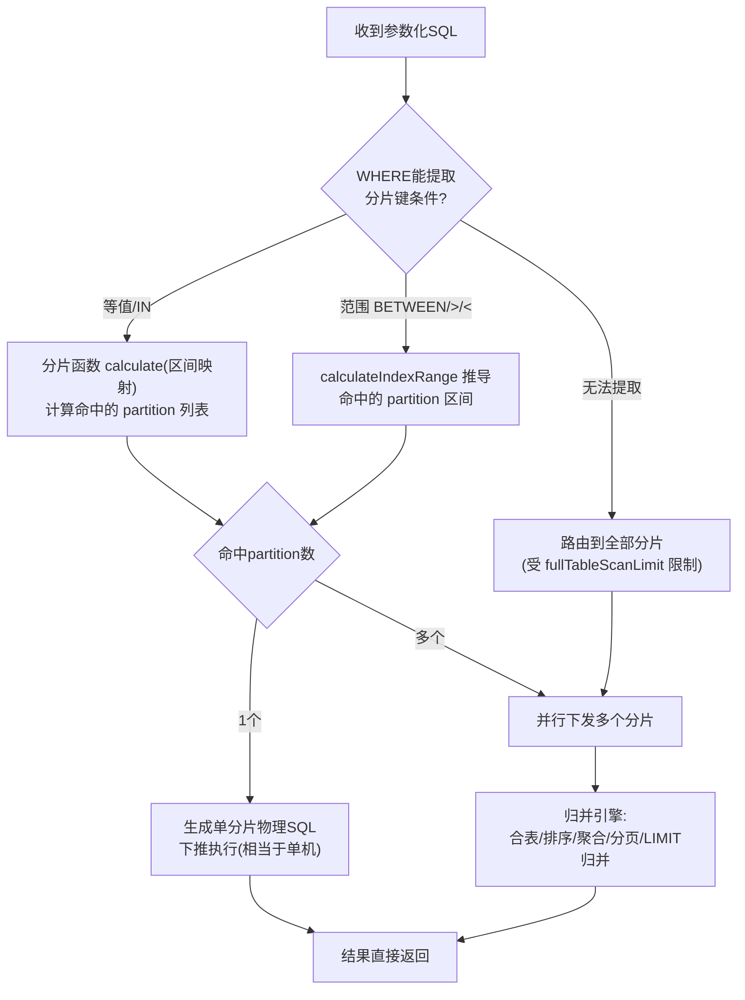

### 7.6 读写分离与副本选择

核心在 `replica` 模块，接口 `ReplicaSelector`（`replica/src/main/java/io/mycat/replica/ReplicaSelector.java`），实现类 `ReplicaDataSourceSelector`。

#### 7.6.1 数据模型

一个 **cluster（如 prototype）** 对应一个 `ReplicaDataSourceSelector`，内部维护：

- `datasourceMap: Map<String, PhysicsInstance>` —— 集群内全部物理实例（`PhysicsInstanceImpl` 含 alive/selectAsRead/isMaster/weight 状态）；
- `writeDataSourceList: List<PhysicsInstance>` —— 写实例列表（**第一个是当前主库**，`getWriteDataSourceByReplicaType()` 174-188 行恒返回 `writeDataSourceList.get(0)`）；
- `readDataSource: List<PhysicsInstance>` —— 可读实例列表；
- `balanceType` + 读写各自的 `LoadBalanceStrategy`（`plug` 模块提供 BalanceRandom 等策略，`server.json` 的 `loadBalance.defaultLoadBalance` 配置）。

#### 7.6.2 读库选择（`getDataSourceByLoadBalacneType()`，158-172 行）

```java
switch (this.balanceType) {
    case BALANCE_ALL:        return getDataSource(this.datasourceMap.values()); // 所有存活实例都可读
    case BALANCE_NONE:       return getWriteDataSourceByReplicaType();          // 只读主库
    case BALANCE_ALL_READ:   return getDataSource(this.readDataSource);         // 只读从库
    case BALANCE_READ_WRITE: List l = getDataSource(this.readDataSource);
                             return l.isEmpty() ? getDataSource(getWriteDataSourceByReplicaType()) : l;
                             // 从库全挂时降级读主库
}
```

其中 `getDataSource()`（120-125 行）过滤条件是 `isAlive() && asSelectRead()`——**心跳状态参与实时过滤**。

#### 7.6.3 心跳与故障切换

构造函数中创建心跳任务（74-88 行），`start()`（92-100 行）用 `ScheduleProvider.scheduleAtFixedRate()` 周期执行：遍历集群内每个数据源的 `HeartbeatFlow.heartbeat()`（`DefaultHeartbeatFlow`，`replica/.../heartbeat/DefaultHeartbeatFlow.java`），检测结果通过 `updateInstanceStatus()`（277-286 行）更新实例 alive/selectAsRead 状态；发现主库故障时调用 `notifySwitchReplicaDataSource()`（292-300 行）→ `switchWriteDataSource()`（190-210 行）：把 `writeDataSourceList` 按存活状态**重排序**（存活实例提到队首，队首即新主库），并调用 `ConfigReporter.reportReplica()` 把切换结果**持久化回 cluster.json**（`updateFile()`，213-221 行），重启后不丢失。

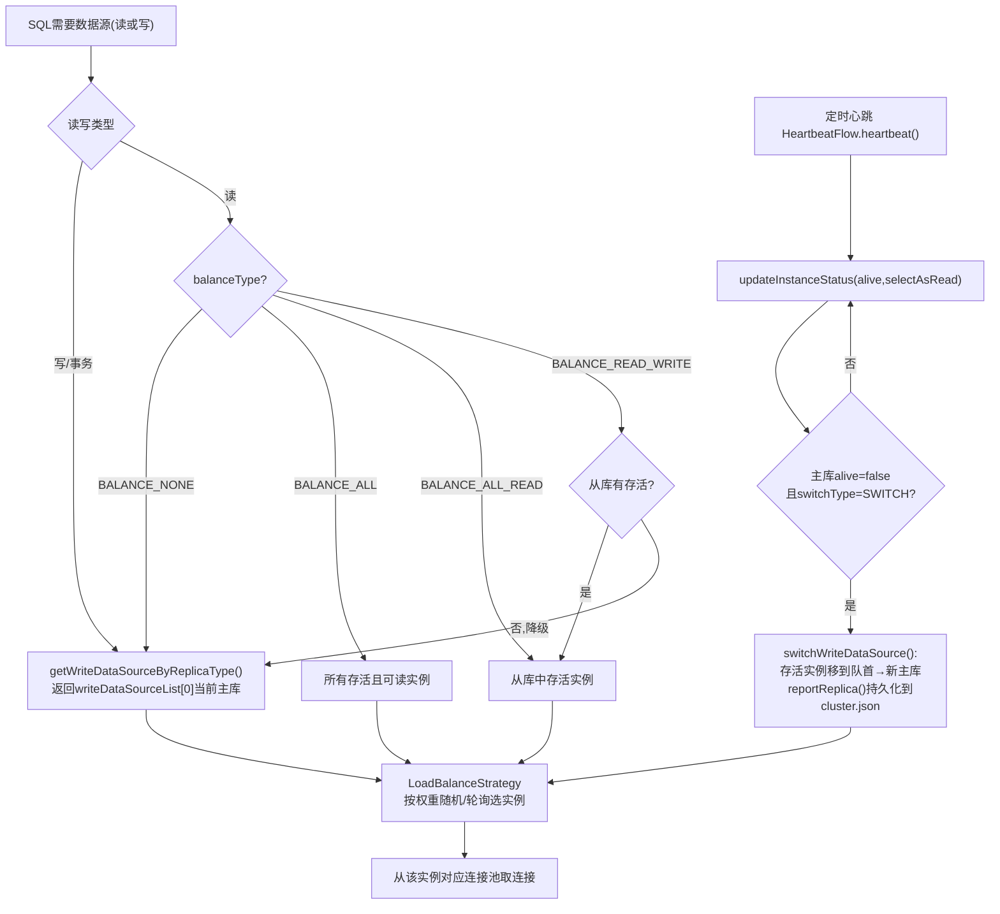

> 细节：`switchType` 取 `SWITCH`/`NOT_SWITCH`；`minSwitchTimeInterval`（默认 300s）防止主从抖动导致频繁切换；`slaveThreshold` 用于主从延迟阈值判断（延迟超阈值的从库不参与读）。

### 7.7 执行引擎与结果汇聚

物理计划（`MycatRel` 树）最终由 `PlanImplementor` 执行：

```java
// DrdsRunnerHelper.java:356-385
public static Future<Void> runOnDrds(dataContext, drdsSqlWithParams, response) {
    PlanImpl plan = getPlan(drdsSqlWithParams);                 // ① 编译获得计划
    PlanImplementor impl = getPlanImplementor(...);             // ② 创建实现器
    return impl(plan, impl);                                    // ③ executeQuery/Update/Insert
}

public static PlanImplementor getPlanImplementor(...) {
    XaSqlConnection transactionSession = (XaSqlConnection) dataContext.getTransactionSession();
    return new ObservableColocatedImplementor(transactionSession, dataContext, drdsSqlWithParams, response);
}
```

`ObservableColocatedImplementor`（`hbt/src/main/java/io/mycat/calcite/plan/ObservableColocatedImplementor.java`）：

- **Colocated（同置）执行**：遍历计划中每个 `Partition`，对同分片的算子合并成一条物理 SQL 下推（保证"能下推的都下推"）；
- **RxJava3 `Observable` 数据流**：每个分片的执行被建模为 `Observable<RowBatch>`（行批，底层可选 Arrow `VectorSchemaRoot` 列式批，`executor` 模块），多分片 `Observable.merge()` 并发汇流；
- **归并算子**在内存中完成：排序归并（ORDER BY，k 路归并）、聚合归并（AVG 拆成 SUM/COUNT 等）、LIMIT/OFFSET 归并（分片各自取 limit+offset 再截断）、跨分片 JOIN（build 侧物化后 probe）；
- 归并后的行经 `Response` 编码回 MySQL 协议返回客户端。

**后端连接通道（二选一）**：

| 通道 | 实现 | 说明 |
|---|---|---|
| JDBC | `datasource/.../JdbcDataSource.java`（内嵌 Druid 连接池，`DruidDatasourceProvider` 为默认 provider，`MycatCore.java:102`） | `DefaultConnection` 包装 `Connection`，maxCon/minCon/idleTimeout 池化 |
| 原生协议 | `mycat2/.../mysqlclient/` 包（`VertxConnection`/`VertxPoolConnectionImpl`/`ConnectHandler`，详见 [7.12 节](#712-原生协议后端连接实现深度剖析)） | Mycat 自己作为 MySQL 客户端走 Vert.x `NetSocket`；按 `datasources/*.json` 的 `type`（`NATIVE`/`NATIVE_JDBC`）启用，或 `-Dserver=native` 强制（`NewMycatConnectionConfig.FORCE_NATIVE_DATASOURCE`，`MycatCore.java:110`）；好处是**可以拿后端原始包直接透传给前端**，零编解码开销 |

### 7.8 事务管理

前端会话持有 `TransactionSession`，用户配置的 `transactionType` 决定实现：

1. **proxy 事务**（默认，`users/*.json: "transactionType": "proxy"`）：事务内语句始终路由到**同一个主库连接**，把事务边界透传给后端 MySQL，Mycat 不做协调——语义与单机一致；
2. **XA 事务**（`va` 模块 `cn.mycat.vertx.xa.LocalXaSqlConnection`）：Mycat 作为事务协调者，跨分片写时对每个后端连接执行 `XA START/XA END/XA PREPARE/XA COMMIT|ROLLBACK` 两阶段提交，提交决定持久化在后端 `mycat.xa_log` 表中用于宕机恢复（详见 [7.11 节](#711-xa-两阶段提交与事务日志深度剖析)）；
3. **Seata**（`seata/.../SeataTransactionSession.java:14-119`）：begin 时注册分支事务，commit/rollback 委托 Seata TC 的全局事务。

### 7.9 线程模型与异步架构

Mycat2 的并发模型是 **"Vert.x EventLoop（IO）+ MycatWorkerPool（计算）+ RxJava3（编排）"** 三层：

- **EventLoop 线程**（数量 = `reactorNumber`）：只做字节收发、协议拆包、handler 分发，绝不阻塞；
- **Worker 线程池**（`workerPool`，maxPoolSize 默认 1024）：承载 Calcite 编译、归并计算等 CPU/阻塞任务；
- **全链路 Future/Observable**：`SQLHandler.execute()` 返回 `Future<Void>`，执行器返回 `Observable<RowBatch>`，没有任何线程阻塞等待连接，单机可支撑高并发连接数（这也是为什么用 Vert.x 而不是传统 BIO/NIO 自研框架）。

依赖注入贯穿全局：`MetaClusterCurrent`（common 模块）是一个线程绑定的上下文容器，`register(Map)` 注册 / `wrapper(Class)` 获取，启动时把 `Vertx / MycatServerConfig / LoadBalanceManager / StorageManager / ExecutorProvider / MycatSQLLogMonitor` 等单例塞入（`MycatCore.java:122-137`），业务代码处处 `MetaClusterCurrent.wrapper(MetadataManager.class)` 解耦取用。

---

### 7.10 Calcite 优化规则深度剖析

> 本节基于 `hbt/src/main/java/io/mycat/DrdsSqlCompiler.java`、`hbt/src/main/java/io/mycat/calcite/MycatRules.java`、`MycatConvention.java`、`localrel/LocalRules.java`、`rewriter/SQLRBORewriter.java` 的逐行核对。

#### 7.10.1 双 Convention 与 Planner 构造

Mycat2 在 Calcite 中注册了**两层执行约定（Convention）**：

| Convention | 位置 | 含义 |
|---|---|---|
| `MycatConvention`（"MYCAT2"） | `hbt/.../calcite/MycatConvention.java` | **分布式物理算子层**：`MycatFilter/MycatProject/MycatNestedLoopJoin/MycatHashAggregate/MycatTopN...`，最终由 `MycatEnumerableRelImplementor` 解释执行 |
| `LocalConvention` | `hbt/.../calcite/localrel/LocalConvention.java` | **可整体下推的"本地计划"层**：`LocalTableScan/LocalFilter/LocalJoin/LocalAggregate...`，整棵子树会被翻译成一条后端 SQL |

`MycatConvention` 的定义（`MycatConvention.java:23-38`）：

```java
public class MycatConvention extends Convention.Impl {
  public static final MycatConvention INSTANCE = new MycatConvention();
  public static final double COST_MULTIPLIER = 0.8d;   // 代价乘数:让下推计划更"便宜"
  public MycatConvention() { super("MYCAT2", MycatRel.class); }
  @Override public void register(RelOptPlanner planner) {
    for (RelOptRule rule : MycatRules.rules()) { planner.addRule(rule); }
  }
}
```

Planner 由 `DrdsSqlCompiler.newCluster()`（`DrdsSqlCompiler.java:653-655`）创建：**`new VolcanoPlanner()`**，Trait 注册 `ConventionTraitDef + RelCollationTraitDef`。即 CBO 阶段是火山优化器的动态规划搜索；RBO 阶段全部使用 HepPlanner。

#### 7.10.2 compileQuery 完整流水线（RBO -> CBO 两段式）

`DrdsSqlCompiler.compileQuery()`（332-372 行）与 `optimizeWithRBO()`（535-609 行）、`optimizeWithCBO()`（440-498 行）拼出如下流水线：

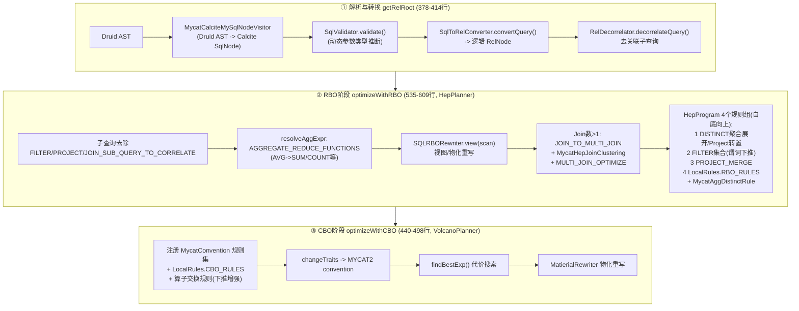

RBO 阶段第 2 组的 `FILTER` 规则集合（`DrdsSqlCompiler.java:517-533`）是谓词下推主力：

```
FILTER_INTO_JOIN, JOIN_CONDITION_PUSH, SORT_JOIN_TRANSPOSE,
PROJECT_CORRELATE_TRANSPOSE, FILTER_AGGREGATE_TRANSPOSE,
FILTER_PROJECT_TRANSPOSE, FILTER_SET_OP_TRANSPOSE, FILTER_MERGE,
JOIN_PUSH_EXPRESSIONS, JOIN_PUSH_TRANSITIVE_PREDICATES(传递谓词推导)
```

CBO 阶段在 Volcano 中追加的"算子交换"规则（448-475 行）用来把算子穿过 Join/Union 压到扫描层：`JOIN_PUSH_EXPRESSIONS`、`FILTER_INTO_JOIN`、`SORT_JOIN_TRANSPOSE(MycatTopN, Join)`（TopN 下推）、`FILTER_SET_OP_TRANSPOSE`、`AGGREGATE_JOIN_TRANSPOSE`、`SORT_PROJECT_TRANSPOSE`、`MycatViewIndexViewRule`（索引选择），以及受 `RBO_BKA_JOIN` 开关控制的 TableLookup 规则族（BKA 连接：`MycatTableLookupSemiJoinRule`、`MycatTableLookupCombineRule`、`MycatJoinTableLookupTransposeRule.LEFT/RIGHT`、`MycatValuesJoinRule`）。

三个 Join 开关来自 server 配置（`MycatRouterConfigOps.java:690-693`）：

```java
DrdsSqlCompiler.RBO_BKA_JOIN = serverConfig.isBkaJoin();        // BKA/TableLookup 连接
DrdsSqlCompiler.RBO_MERGE_JOIN = serverConfig.isSortMergeJoin(); // 归并连接
DrdsSqlCompiler.RBO_PARTITION_KEY_JOIN = serverConfig.isPartitionKeyJoin(); // 分片键连接
DrdsSqlCompiler.BKA_JOIN_LEFT_ROW_COUNT_LIMIT = serverConfig.getBkaJoinLeftRowCountLimit(); // 默认1000行
```

#### 7.10.3 MycatRules：MYCAT2 Convention 的转换规则全集

`MycatRules.rules()`（`hbt/.../calcite/MycatRules.java:166-203`）注册的完整规则清单：

| 规则 | 作用 |
|---|---|
| `CoreRules.AGGREGATE_REDUCE_FUNCTIONS` | AVG/STDDEV 等可分解聚合改写为 SUM/COUNT |
| `MycatJoinRule` | LogicalJoin -> `MycatNestedLoopJoin`（默认连接实现） |
| `MycatMergeJoinRule` | LogicalJoin -> `MycatSortMergeJoin`（归并连接，需两侧有序） |
| `MycatCalcRule` / `CoreRules.CALC_REMOVE` / `CALC_TO_WINDOW` | Calc（Filter+Project 合体）算子的转换/消除/窗口改写 |
| `MycatProjectRule` | LogicalProject -> MycatProject（投影裁剪载体） |
| `MycatFilterRule` | LogicalFilter -> MycatFilter（谓词载体，配合下推） |
| `MycatAggregateRule` | LogicalAggregate -> `MycatHashAggregate` |
| `MycatMemSortRule` | LogicalSort -> `MycatSort`（归并排序节点） |
| `MycatUnionRule` / `MycatIntersectRule` / `MycatMinusRule` | 集合算子转换 |
| `MycatTableModificationRule` | LogicalTableModify -> Mycat DML 节点 |
| `MycatValuesRule` / `MycatValuesJoinRule` | 常量表及其与 Join 的组合 |
| `MycatSortAggRule` | Sort + Aggregate 组合优化 |
| `MycatCorrelateRule` | LogicalCorrelate -> MycatCorrelate（相关子查询） |
| `MycatTopNRule` | LogicalSort(limit) -> `MycatTopN`（每个分片取 Top-N 再归并） |
| `MycatRepeatUnionRule` / `MycatTableSpoolRule` | 递归 CTE（WITH RECURSIVE）支持 |
| `MycatWinodwRule` | 窗口函数节点 |
| `MycatExtraSortRule.RULES` | 额外排序插入规则（保证归并阶段有序性） |

同时 `MycatRules` 定义了一整套 **RelFactories**（55-106 行）：`JOIN_FACTORY` 默认造 `MycatNestedLoopJoin`、`AGGREGATE_FACTORY` 造 `MycatHashAggregate`、`SET_OP_FACTORY` 造 Mycat 集合算子——这保证优化器在改写计划时再生成的节点天然是 Mycat 物理算子。

#### 7.10.4 下推视图机制：MycatView + SQLRBORewriter（核心创新）

Mycat2 下推的本质不是"拼 SQL 字符串"，而是引入 **`MycatView` 节点 = 一段"可整体翻译为后端 SQL 的子计划"**：

- `MycatView` 携带 `Distribution`（数据分布：分片键、分片函数、目标分区），并有 `allowPushdown()` / `banPushdown()` 开关；
- `LocalRules` 中的 `*ViewRule`（`localrel/LocalRules.java:40-61`）在规则匹配 `操作符(MycatView)` 时调用 `SQLRBORewriter` 判断该操作能否**沉入视图**（即并入下推 SQL）：

```java
// LocalRules.JoinViewRule.onMatch() (254-291行)
Optional<RelNode> relNodeOptional =
    SQLRBORewriter.rboJoinRewrite(left, right, LocalJoin.create(join, left, right));
```

`SQLRBORewriter`（`hbt/.../calcite/rewriter/SQLRBORewriter.java`）是全部下推判断的决策中心，入口方法族：`view(scan)/view(input,filter)/view(input,project)/view(input,calc)/view(l,r,join)/tryMergeJoin/aggregate/sort/view(inputs,union)/filter/project`。视图改写完成后，整棵 `Local*` 子树在执行期由 `MycatCalciteSupport.convertToSqlTemplate()` + 各数据源的 `SqlDialect` 生成后端 SQL（见 `DrdsSqlCompiler.doHbt()` 184-193 行对 `MycatTransientSQLTableScan` 的构造示例）。

#### 7.10.5 聚合下推的三种结局（`SQLRBORewriter.aggregate()`，540-617 行）

以分片表聚合为例，函数按数据分布给出三种策略：

1. **直接整推**：分布为 `PHY`（单表）或 `BROADCAST`（全局表）时，整个 Aggregate 复制进视图（556-558 行）；
2. **分组键包含分片键 -> 可整推**：遍历 GROUP BY 列，通过 `RelMetadataQuery.getColumnOrigin()` 追溯列来源，若来源是分片表且覆盖其分片函数所需的全部分片键（`tableHandler.function().requireShardingKeys(shardingKeySet)`，574-580 行），说明**每个分组只存在于一个分片**，聚合可完整下推，无需归并；
3. **两阶段聚合（splitAggregate）**：其余情况先尝试 `MycatAggregateUnionTransposeRule` 做"聚合过 Union"的等价交换（585-612 行）；失败则走 `splitAggregate()`（619-645 行）：

```java
AggregatePushContext aggregateContext = AggregatePushContext.split(aggregate);
// 分片层: partial agg (SUM(x), COUNT(x), 不含 AVG) 下推进视图
MycatView newView = viewNode.changeTo(LogicalAggregate.create(viewNode.getRelNode(),
        ..., aggregateContext.getPartialAggregateCallList()));
// 根层: global agg (SUM(SUM(x)), SUM(COUNT(x)))
LogicalAggregate globalAggregateRelNode = LogicalAggregate.create(newView, ...,
        aggregateContext.getGlobalAggregateCallList());
// 顶层 Project 恢复原始输出 (AVG = SUM/COUNT)
MycatProject projectRelNode = MycatProject.create(globalAggregateRelNode,
        aggregateContext.getProjectExprList(), aggregate.getRowType());
```

这就是经典的 **partial aggregate（下推）+ global aggregate（汇聚）+ final project（还原表达式）** 三段式，AVG/STDDEV 等不可直接归并的函数被 `AggregatePushContext.split` 拆解。

#### 7.10.6 Join 下推与 ER 分片（`SQLRBORewriter.rboJoinRewrite`）

Join 侧的关键判断在 `SQLRBORewriter.java:1056/1094`：

```java
if (lFunction.isSameDistribution(rFunction)) { ... }     // 同分布 -> 分片内连接
erJoin = lFunction.isSameDistribution(rFunction) ...     // ER 表连接
```

`CustomRuleFunction.isSameDistribution()`（分片函数接口方法，如 `PartitionByMod.java:59-66` 比较 `count` 是否一致）判定两张分片表是否**同构分布**。Join 策略矩阵：

| 场景 | 策略 |
|---|---|
| 两表同分布（ER 分片，Join 条件含分片键） | `LocalJoin` 整体下推，每个分片本地 Join（`ObservableColocatedImplementor` 的"Colocated"即此） |
| 一侧为 BROADCAST（全局表/小表） | 广播侧复制到所有分片，与分片表本地 Join |
| 左侧行数 <= `BKA_JOIN_LEFT_ROW_COUNT_LIMIT`(默认1000) | BKA/TableLookup：左结果按分片键分组，到对应分片查右表（`MycatTableLookupSemiJoinRule` 等规则族） |
| 两侧有序且可归并 | `MycatSortMergeJoin`（`tryMergeJoin`，328 行） |
| 其余 | 根节点 `MycatNestedLoopJoin` / Hash Join，内存物化汇聚计算 |

#### 7.10.7 与统计/代价的关系

CBO 的行数估计来自 `RelMetadataQuery`（含 fork calcite 的定制），表行数由 `statistic` 模块 `StatisticCenter`（`analyze table` 收集）提供；`MycatConvention.COST_MULTIPLIER=0.8` 让"能下推的计划"在代价比较中天然占优。

---

### 7.11 XA 两阶段提交与事务日志深度剖析

> 本节基于 `va/src/main/java/cn/mycat/vertx/xa/` 全部源码逐行核对。Mycat2 的 XA 实现**不依赖任何外部事务协调器**：Mycat 进程自己充当 TM（事务管理器），后端 MySQL 是 RM（资源管理器）。

#### 7.11.1 类清单

| 类 | 文件 | 职责 |
|---|---|---|
| `XaSqlConnection` | `va/.../xa/XaSqlConnection.java` | 接口 + **XA 命令模板**（29-35 行）：`XA START/END/PREPARE/COMMIT/ROLLBACK '%s'`、`XA COMMIT '%s' ONE PHASE`、`XA RECOVER` |
| `State` | `va/.../xa/State.java` | 参与者状态枚举：`XA_INITED(0) < XA_STARTED(1) < XA_ENDED(2) < XA_PREPARED(3) < XA_COMMITED(4) / XA_ROLLBACKED(5)` |
| `ImmutableCoordinatorLog` | `va/.../xa/ImmutableCoordinatorLog.java` | 协调者日志（不可变）：`xid + participants[] + commitMarked`，支持 JSON 序列化（117-126 行） |
| `ImmutableParticipantLog` | `va/.../xa/ImmutableParticipantLog.java` | 参与者日志：`target(数据源名) + expires(过期时间) + state` |
| `XaLog` / `XaLogImpl` | `va/.../xa/impl/XaLogImpl.java` | TM 核心：xid 分配、日志读写、**崩溃恢复 readXARecoveryLog()** |
| `Repository` | `va/.../xa/Repository.java` | 日志仓库接口；`writeCommitLog/cancelCommitLog` 是"提交决定"的持久化点（59-71 行） |
| `MemoryRepositoryImpl` | `va/.../impl/MemoryRepositoryImpl.java` | ConcurrentHashMap 内存日志（运行态默认实现） |
| `LocalXaMemoryRepositoryImpl` | `va/.../impl/LocalXaMemoryRepositoryImpl.java` | 内存日志 + 定义 `mycat.xa_log` 持久表结构（43-51 行） |
| `BaseXaSqlConnection` | `va/.../impl/BaseXaSqlConnection.java` | **两阶段提交编排器**（本文重点） |
| `LocalXaSqlConnection` | `va/.../impl/LocalXaSqlConnection.java` | "懒升级 XA"：单分片事务走本地事务，跨分片才启用 XA（生产默认） |
| `OnePhaseXaSqlConnection` | `va/.../impl/OnePhaseXaSqlConnection.java` | 单参与者时的一阶段优化：`XA COMMIT '%s' ONE PHASE` |
| `SavepointSqlConnection` | `va/.../xa/SavepointSqlConnection.java` | 装饰器：补齐 SAVEPOINT 语义 |
| `FileRepositoryImpl` / `XaRepository` | `va/.../impl/` | 文件日志仓库/复合仓库，**本版本已整体注释停用**（保留设计参考） |
| `LocalSqlConnection` | `va/.../impl/LocalSqlConnection.java` | proxy 事务类型：无 XA，直接透传 |

装配关系（`proxy/.../runtime/MycatDataContextImpl.java:127-151`）：

```java
switch (transactionSessionType) {
    case PROXY_TRANSACTION_TYPE:  // user.json: "transactionType": "proxy"
        connection = new LocalSqlConnection(...);   // 纯代理,无XA
        break;
    case JDBC_TRANSACTION_TYPE:   // user.json: "transactionType": "xa"
        connection = new LocalXaSqlConnection(...); // 懒升级XA
        break;
}
connection = new SavepointSqlConnection(connection);          // savepoint装饰
transactionSession = new MycatXaTranscation(connection, type); // TransactionSession适配
```

事务类型可运行时切换：`SET xa = 1/0`（`MycatDataContextImpl.java:167-168` 将变量 `xa` 映射为事务类型开关）。

#### 7.11.2 XID 生成

`XaLogImpl` 构造（51-56 行）：

```java
this.xaIdSeq = new AtomicLong((System.currentTimeMillis() >> 32) + (workerId << 32));
```

`workerId` 即 `server.json` 的 `mycatId`（装配见 `MycatRouterConfigOps.java:648`：`new XaLogImpl(localXaMemoryRepository, serverConfig.getMycatId(), mycatMySQLManager)`）。`nextXid()`（207-215 行）在种子上原子自增，负数时归零，输出十进制字符串作为 xid。**注意**：xid 是全局事务号，所有分片上的分支共用同一个 xid（MySQL 分支事务以 xid 区分），并未使用 gtrid/bqual 两段式 XID 结构。

#### 7.11.3 两阶段提交编排（`BaseXaSqlConnection.commitXa()`，271-351 行）

`commitXa(beforeCommit)` 的完整步骤：

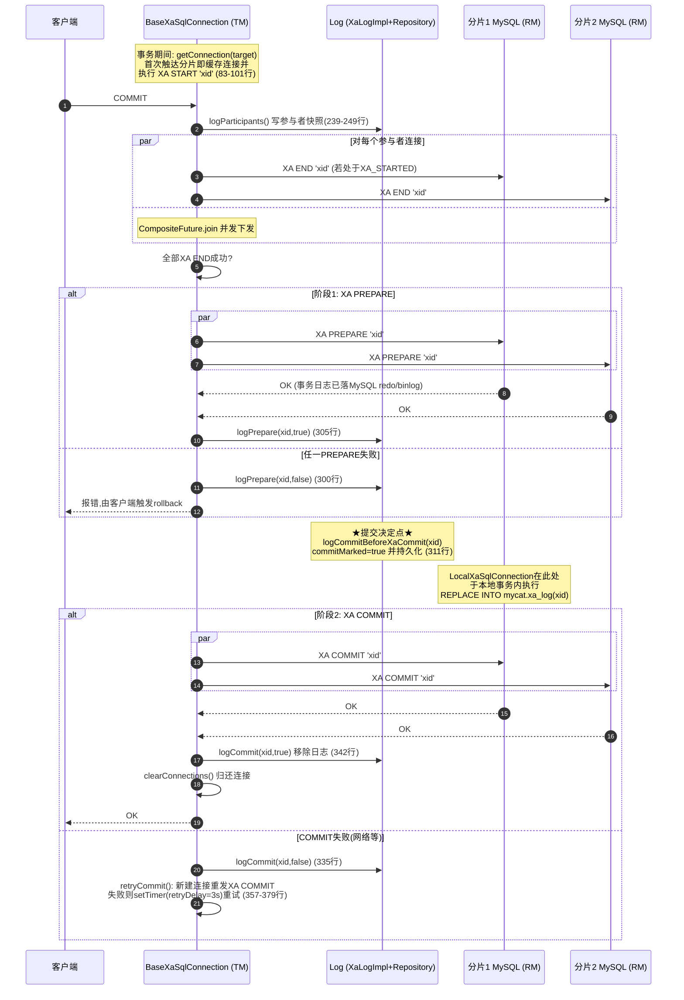

要点提炼：

1. **连接即分支**：事务中首次向某 target 要连接时（`BaseXaSqlConnection.getConnection()`，83-112 行），缓存连接并立刻 `XA START`，后续语句复用同一物理连接（保证分支一致性）；
2. **先记参与者再 PREPARE**：`logParticipants()`（239-249 行）在发出 `XA PREPARE` 前把所有参与者及当前状态写入协调者日志——崩溃恢复时据此知道"哪些库可能有悬挂分支"；
3. **提交决定点是唯一持久化点**：所有分支 PREPARE 成功后，`logCommitBeforeXaCommit(xid)`（`XaLogImpl.java:300-310`）把日志的 `commitMarked` 置 true 并调用 `Repository.writeCommitLog()`（接口注释即 "Atomic, persistent, write the Confirm ready to commit flag log"）。此后即使 Mycat 宕机，恢复逻辑也必须 COMMIT 而不是 ROLLBACK——这是 2PC 的"全局提交点"；
4. **回滚路径对称**（`rollback()`，128-189 行）：按各参与者所处状态决定命令——`XA_INITED` 直接放弃、`XA_STARTED` 先 `XA END` 再 `XA ROLLBACK`、`XA_ENDED/XA_PREPARED` 直接 `XA ROLLBACK`；失败时 `kill()` 抛弃连接并触发 `tryRecovery()`（最多重试 3 次、间隔 1s，191-213 行）。

状态机：

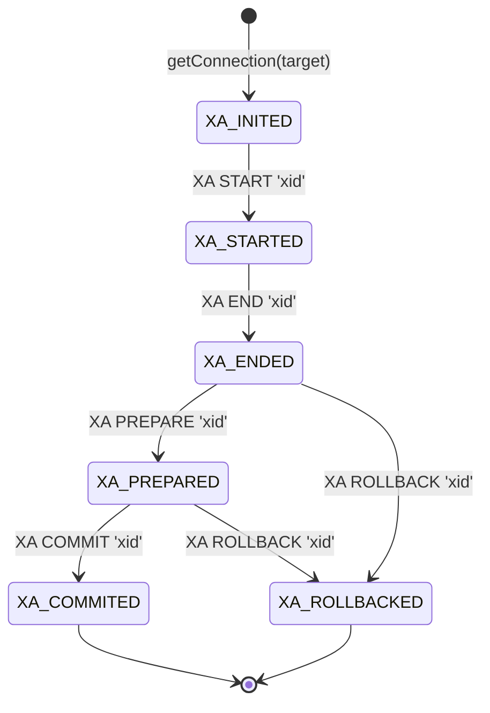

`ImmutableCoordinatorLog.computeMinState()`（57-75 行）取**所有参与者的最小状态**，用于决定恢复时该事务整体处于哪个阶段、下一步该发什么命令。

#### 7.11.4 生产默认实现：LocalXaSqlConnection 的"懒升级"

`LocalXaSqlConnection`（`va/.../impl/LocalXaSqlConnection.java`）是 `transactionType=xa` 时的实际实现，它做了一个重要的性能优化——**XA 只在真正跨分片时才启用**：

- 事务的第一条语句只绑定一个"本地连接"，走普通 `begin;`（110-121 行），**完全不付 XA 开销**；
- 当事务内访问**第二个 target** 时（122-132 行）才分配 xid（`log.nextXid()`）并升级为 XA 分支（`super.getConnection()` 发 `XA START`）；
- 提交时（commit()，54-107 行）：
  - 只有本地连接：直接 `commit;`（72-83 行）；
  - 本地连接 + XA 分支并存：`super.commitXa(coordinatorLog -> 本地连接在【本地事务内】执行 "REPLACE INTO mycat.xa_log (xid) VALUES(...)" )`（84-92 行）——**提交决定被原子地记录在本地库的 mycat.xa_log 表里**（因为该 REPLACE 与业务 SQL 同处一个未提交的本地事务，天然原子）；随后各分片 `XA COMMIT`，最后本地连接 `commit;` 并 `delete from mycat.xa_log`。

`OnePhaseXaSqlConnection`（38-60 行）进一步优化：**参与者只有一个**时跳过 PREPARE，直接 `XA COMMIT '%s' ONE PHASE`。

#### 7.11.5 事务日志的存储结构

| 层 | 实现 | 内容 | 生命周期 |
|---|---|---|---|
| 运行态内存日志 | `MemoryRepositoryImpl`（ConcurrentHashMap） | `ImmutableCoordinatorLog{xid, participants[], commitMarked}` | 事务结束即 `remove`（仅当 minState 为 COMMITED/ROLLBACKED，`MemoryRepositoryImpl.java:93-109`） |
| **持久提交决定** | `mycat.xa_log` 表（建表见 `XaLogImpl.java:147-152`：`create table if not exists mycat.xa_log(xid bigint PRIMARY KEY) ENGINE=InnoDB`） | 仅一列 `xid`——"该 xid 已决定提交" | 提交完成后 DELETE（`LocalXaSqlConnection.java:90`） |
| 注释停用 | `FileRepositoryImpl`（每 xid 一个 JSON 文件 + 定时清理）、`XaRepository`（内存+持久复合） | 全套文件日志设计 | 本版本代码整体注释 |

这套"**内存日志记过程、数据库表记决定**"的设计非常务实：恢复时真正需要的只有"提交 or 回滚"这一个比特，而它被放在最可靠的 InnoDB 里。

#### 7.11.6 崩溃恢复：readXARecoveryLog()

`XaLogImpl.readXARecoveryLog()`（137-203 行）在启动（或手动执行 `/*+ mycat:readXARecoveryLog{} */;` hint，见 `example/src/test/java/io/mycat/xa/XaLogImplTest.java` 的用法）时执行：

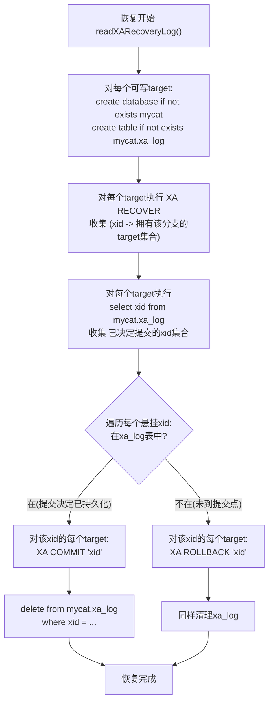

源码核心段（181-199 行）：

```java
if (xidSet.contains(xid)) { sql = "XA COMMIT '" + xid + "'"; }
else                      { sql = "XA ROLLBACK '" + xid + "'"; }
```

容错细节：

- `XA COMMIT/ROLLBACK` 失败仅记 error 日志（195 行注释："已经提交或者回滚了"——分支可能已被先前恢复处理）；
- 调用侧 `BaseXaSqlConnection.tryRecovery()`（191-213 行）对整个恢复流程**最多重试 3 次、每次间隔 1s**，等待数据源恢复；
- 提交/回滚的在线重试由 `retryCommit()/retryRollback()` 用 `mySQLManager.setTimer(log.retryDelay())`（`Repository.retryDelayTime()` 默认 **3 秒**，`Repository.java:35-37`）周期重发，直到成功；
- 事务超时默认 **30 秒**（`Repository.getTimeout()`，31-33 行），参与者日志携带 `expires = timeout + now`（`XaLogImpl.getExpires()`，329-331 行）。

#### 7.11.7 正确性边界（源码可鉴）

1. 提交决定（commitMarked / mycat.xa_log 行）**先于** `XA COMMIT` 写出，保证"PREPARE 成功但崩溃"的事务恢复时必然 COMMIT；
2. `XA RECOVER` 只能发现**已 PREPARE** 的分支；未 PREPARE 的悬挂连接由 MySQL 连接断开后自动回滚（`BaseXaSqlConnection.kill()` 主动 `abandonConnection()` 利用此语义）；
3. 恢复的正确性依赖 `mycat.xa_log` 与业务分片的可用性：xa_log 建在每个可写 target 上（本地库与分片同存活），这是 `LocalXaSqlConnection` 把日志写在"本地连接"上的原因——提交决定与最后一个未升级 XA 的本地分片共命运；
4. 本实现为**单协调者**：Mycat 宕机期间事务悬挂，需等 Mycat 重启执行恢复（代码中 `@todo 注册调度中心,定时恢复`，`BaseXaSqlConnection.java:179` 可见尚未接入中心化调度）。

---

### 7.12 原生协议后端连接实现深度剖析

7.2 节分析了 Mycat **作为服务端**如何对前端客户端讲 MySQL 协议；本节反向深挖 Mycat **作为客户端**如何用原生 MySQL 协议直连后端 MySQL--即不经过 JDBC 驱动的"原生通道"（native channel）。

#### 7.12.1 两代实现与演进现状（先排雷）

仓库中同时存在**两代**后端原生协议实现，阅读源码时极易混淆：

| 代际 | 包位置 | 状态 | 说明 |
|---|---|---|---|
| 第一代 | `mycat2/src/main/java/io/mycat/vertxmycat/` | **基本废弃** | `NativeMySQLConnection.java` **整个文件全部被注释掉（死代码）**；残存的 `AbstractMySqlConnectionImpl` 基于 proxy 模块的 `MySQLClientSession`（前端会话体系）复用实现，仅为兼容保留 |
| 第二代 | `mycat2/src/main/java/io/mycat/mysqlclient/` | **生效** | 自包含的 Vert.x `NetSocket` MySQL 客户端：自己实现握手、包分帧、命令状态机、行解码与连接池，只复用了 vertx-mysql-client 的**认证算法工具类**（`Native41Authenticator`/`CachingSha2Authenticator`）和少量常量 |

第二代（`io.mycat.mysqlclient`）的类清单（全部位于 `mycat2` 模块）：

| 类 | 职责 |
|---|---|
| `commands/MycatMySQLManagerImpl` | 数据源池注册表：按 `DatasourceType` 决定每个 target 用原生池还是 JDBC 池 |
| `mysqlclient/MycatNativeDatasourcePool` | 池适配层：接入监控（QPS/连接数/RT）与泄漏保护 |
| `mysqlclient/VertxPoolConnectionImpl` | 物理连接池：idle 队列 + used 表、maxCon 限制、定时维护 |
| `mysqlclient/VertxConnection` | 单条物理连接：命令串行队列 + recycle 资格判断 |
| `mysqlclient/VertxMycatConnectionPool` | `NewMycatConnection` 适配层：面向执行引擎的查询/更新/关闭 API |
| `mysqlclient/command/ConnectHandler` | 客户端侧握手状态机（INIT→AUTH） |
| `mysqlclient/command/OkCommand` | DML 命令：期待 OK/ERR 响应 |
| `mysqlclient/command/QueryCommand` | COM_QUERY 命令：结果集响应状态机 + 行解码 |
| `mysqlclient/command/ResponseBufferCommand` | 原始报文透传命令：不解码，直接把 Buffer 发给上游 |
| `mysqlclient/decoder/ObjectArrayDecoder` 等 | TEXT 协议行解码为 `Object[]`（另有 `StringArrayDecoder`/`ByteArrayDecoder`） |
| `vertx/VertxMySQLPacketClientResolver` | 报文分帧基类（包头/载荷状态机） |
| `mysqlclient/PacketUtil` | 编解码工具（写 COM_QUERY、OK 包解析、日期/数值文本解码） |
| `mysqlclient/VertxConnectionPool` | 池接口：`getConnection/recycle/kill/close` |

#### 7.12.2 数据源类型选择：池的构建与降级（MycatMySQLManagerImpl）

后端通道的选择在**启动时**完成。`DatasourceConfig.DatasourceType` 枚举（`config/src/main/java/io/mycat/config/DatasourceConfig.java:234-244`）定义了三种类型：

```java
public static enum DatasourceType {
    NATIVE(true, true),      // 纯原生
    JDBC(false, true),       // 纯 JDBC
    NATIVE_JDBC(true, true); // 原生优先，JDBC 兜底
    boolean isJdbc;
    boolean isNative;
```

选择逻辑（`mycat2/src/main/java/io/mycat/commands/MycatMySQLManagerImpl.java:51-89`）：

```java
DatasourceConfig.DatasourceType datasourceType = datasource.computeType();
if (FORCE_NATIVE_DATASOURCE) {          // -Dserver=native 时为 true（MycatCore.java:110）
    switch (datasourceType) {
        case JDBC:
            datasourceType = NATIVE_JDBC; // 强制把 JDBC 升级为"原生优先"
            break;
        // NATIVE / NATIVE_JDBC 不变
    }
}
switch (datasourceType) {
    case NATIVE:
    case NATIVE_JDBC:
        MycatDatasourcePool nativeDatasourcePool = createNativeDatasourcePool(datasource, name);
        futureList.add(nativeDatasourcePool.getConnection()   // ① 探活
                .flatMap(c -> c.close().map(nativeDatasourcePool))
                .recover(throwable ->                        // ② 失败兜底
                        Future.succeededFuture(createJdbcDatasourcePool(name))));
        break;
    case JDBC:
        hashMap.put(name, createJdbcDatasourcePool(name));
        break;
}
CompositeFuture.join((List) futureList).toCompletionStage().toCompletableFuture().get(1, TimeUnit.MINUTES); // ③ 全部就绪，最长等 1 分钟
```

要点：

1. **启动探活 + 自动降级**：`NATIVE`/`NATIVE_JDBC` 类型先建原生池并真实取一条连接再关掉；失败（比如后端不支持所需能力）则**整个池降级为 JDBC 池**（`recover` 分支），这是"NATIVE_JDBC"名字的含义；
2. `FORCE_NATIVE_DATASOURCE` 常量位于 `common/src/main/java/io/mycat/newquery/NewMycatConnectionConfig.java:3-7`：

```java
public class NewMycatConnectionConfig {
    public static boolean PASS_HALF_PACKET = true;      // 半包透传开关
    public static boolean FORCE_NATIVE_DATASOURCE = false;
    public static boolean CLIENT_DEPRECATE_EOF = true;  // 客户端默认协商 DEPRECATE_EOF
}
```

3. `createNativeDatasourcePool()`（`MycatMySQLManagerImpl.java:102-124`）用 **MySQL Connector/J 的 `ConnectionUrlParser`** 解析数据源 URL 得到 host/port/database（复用 JDBC URL 格式配置），把 `maxRetryCount` 映射为连接重试次数、`idleTimeout` 映射为维护定时器周期，最后 `new VertxPoolConnectionImpl(config, vertx)` 建池。

#### 7.12.3 连接建立：客户端侧握手（ConnectHandler）

物理连接的创建入口是 `VertxPoolConnectionImpl.innerCreateConnection()`（170-186 行）：`vertx.createNetClient().connect(port, host)` 拿到裸 `NetSocket`，然后把 socket 的读处理器设为 `ConnectHandler`，进入握手状态机（`command/ConnectHandler.java:79-190`）：

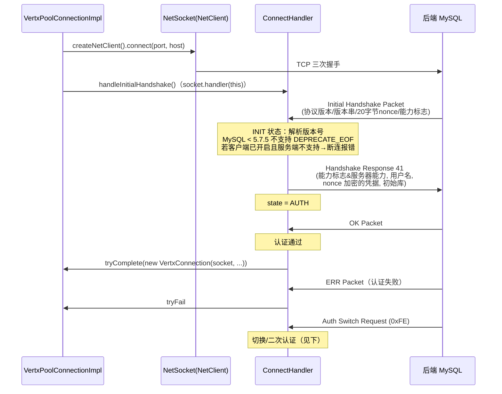

INIT 状态解析握手包的细节（113-168 行）：

- **协议版本** + **服务器版本串**：`MySQLDatabaseMetadata.parse(serverVersion)` 解析出主/次/修订版本。若 `5.(7以下 或 7.5以下)` 则服务器不支持 `CLIENT_DEPRECATE_EOF`；此时若客户端配置了 `clientDeprecateEof=true`，**直接关闭连接并失败**（"serverClientDeprecateEof not support!"，124-128 行）--Mycat2 原生通道对老版本 MySQL 是硬性拒绝的；
- **20 字节 challenge（nonce）**：分两段读取（8 + 12 字节）；
- **能力标志**：低 2 字节 + 高 2 字节拼成 32 位 `serverCapabilitiesFlags`；客户端能力 = `CLIENT_SUPPORTED_CAPABILITIES_FLAGS ∪ (可选: CONNECT_WITH_DB / CONNECT_ATTRS / DEPRECATE_EOF) ∩ serverCapabilitiesFlags`（`initCapabilitiesFlags`，84-96 行）；
- **认证插件名**：决定握手响应里的凭据算法。发送凭据时按插件名分发（222-232 行）：

```java
authResponse = Native41Authenticator.encode(password, nonce);   // mysql_native_password
authResponse = CachingSha2Authenticator.encode(password, nonce); // caching_sha2_password
// mysql_clear_password 则明文
```

AUTH 状态收到 `0xFE` 开头的 Auth Switch Request 会用新插件名重算凭据重发；收到 OK 包则 `promise.tryComplete(new VertxConnection(...))`，一条可用物理连接诞生。

#### 7.12.4 报文分帧基座（VertxMySQLPacketClientResolver）

所有命令处理器都继承 `vertx/VertxMySQLPacketClientResolver`（139 行），它解决 TCP 流式数据到"MySQL 包"的重组：

- **HEAD / PAYLOAD 两态状态机**：先累计 4 字节包头（3 字节长度 + 1 字节序列号），再按长度收载荷；
- **16MB 大包拆分**：当包长 == `MySQLPacketSplitter.MAX_PACKET_SIZE`（0xFFFFFF）标记 `multiPacket`，继续收后续分片并**拼接**成一个完整逻辑包再上抛；
- 子类只需实现 `handle0(packetId, payload, socket)`，见各类的 `handle0`。

#### 7.12.5 命令模型：一条连接上的串行命令队列（VertxConnection）

`VertxConnection`（165 行）是单条物理连接的门面。**核心设计：每条连接同一时刻只跑一个命令**，用 `future.transform()` 链在 `synchronized` 块内串行化（`VertxConnection.java:66-91`）：

```java
public Future<SqlResult> update(String sql) {
    return Future.future(promise -> {
        synchronized (VertxConnection.this) {
            if (future.isComplete()) future = Future.succeededFuture();
            Future<SqlResult> sqlResultFuture = future.transform(unused -> {
                checkException();
                OkCommand queryCommand = new OkCommand(sql, netSocket, promise);
                resultFuture.onComplete(event ->
                        VertxConnection.this.serverstatus = queryCommand.serverstatus); // 回收serverstatus
                netSocket.handler(queryCommand);   // 接管 socket 读
                queryCommand.write();               // 发送 COM_QUERY
                return resultFuture;
            });
            future = sqlResultFuture.mapEmpty();    // 尾部接链，下个命令等它
        }
    });
}
```

这等价于一个**无锁等待队列**：新命令通过 `future.transform` 挂到链尾，前一个命令完成（promise complete）后自动触发。因为 MySQL 协议本身是**请求-响应串行**的（pipelining 需要	stmt fetch 等特殊支持），一条连接上串行是协议正确性的要求，这里用 Future 链优雅地实现了背压与排队。

三种命令通道，对应三类调用：

| VertxConnection 方法 | 命令类 | 行为 |
|---|---|---|
| `update(sql)`（66-91 行） | `OkCommand` | 发 COM_QUERY，期待 OK/ERR；解析 affectedRows/lastInsertId/serverStatusFlags（`OkCommand.java:54-74`） |
| `query(sql, decoder)`（102-129 行） | `QueryCommand` | 发 COM_QUERY，按结果集状态机收包并逐行 `decoder.convert()` 解码，行经 RxJava `emitter.onNext` 上抛 |
| `query(sql)`（132-155 行） | `ResponseBufferCommand` | 发 COM_QUERY，**不解码**，把原始包 Buffer 直接上抛（透传通道，见 7.12.7） |

每条命令结束都会把响应包里的 **serverStatusFlags 存进 `VertxConnection.serverstatus`**，供连接池判断回收资格（见 7.12.8）。socket 异常处理器（59-64 行）会把连接直接 `kill` 出池。

#### 7.12.6 COM_QUERY 响应状态机与行解码（QueryCommand + ObjectArrayDecoder）

`QueryCommand`（141 行）实现 TEXT 协议结果集的接收状态机（83-119 行）：

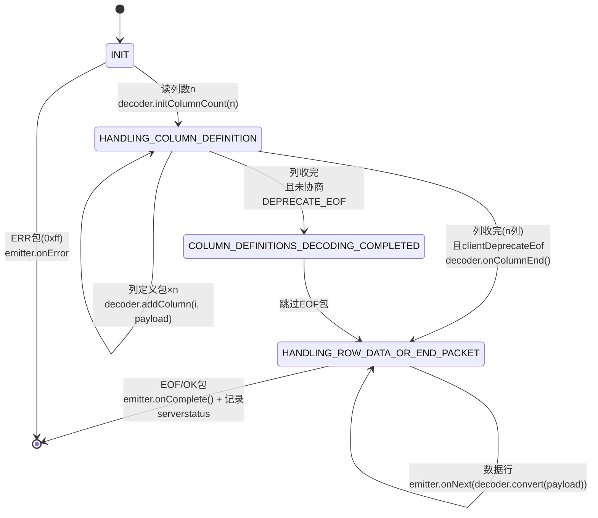

关键分支：若协商了 `CLIENT_DEPRECATE_EOF`（MySQL ≥ 5.7.5，默认开启），列定义之后**没有 EOF 包**，直接进入行数据状态；否则要跳过一个 EOF 分隔包（`QueryCommand.java:105-113`）。行尾判定：`first == EOF_PACKET_HEADER && payload.length() < 0xFFFFFF` 是 EOF（或无列时的 OK）。

`ObjectArrayDecoder`（264 行）负责把 TEXT 行解码成 `Object[]`：

- **长度编码整数**（55-81 行）：`0xFB`=NULL，`0xFC`=后 2 字节，`0xFD`=后 3 字节，`0xFE`=后 8 字节，其余即字面值；
- **按列类型转换**（84-227 行）：整型按 signed/unsigned 收窄（`INT8` unsigned 超长时用 `BigInteger`）；`DOUBLE/FLOAT/NUMERIC` 从文本 parse；字符串看列 charset==63（binary）则返回 `byte[]`；`DATE`（"0000-00-00"→null）、`TIME/DATETIME/TIMESTAMP/YEAR` 走 `PacketUtil.textDecode*`；`BIT` 特殊解码；
- **列定义包解析**（234-262 行）：catalog/schema/table/orgTable/name/orgName/charset/columnLength/type/flags/decimals 全套元数据保存在 `ColumnDefPacketImpl`，最终组装成 `MycatMySQLRowMetaData`（`VertxMycatConnectionPool.query()`，70-93 行）：

```java
Observable<Object[]> query = connection.query(psql, objectArrayDecoder);
Single<RowSet> map = query.subscribeOn(Schedulers.computation()).toList().map(objects -> {
    MycatMySQLRowMetaData metaData =
            new MycatMySQLRowMetaData(Arrays.asList(objectArrayDecoder.getColumnDefPackets()));
    return new RowSet(metaData, objects);   // 行+元数据 = 供上层算子消费的结果集
});
```

注意原生通道**只实现 TEXT 协议（COM_QUERY 文本）**，没有 COM_STMT_PREPARE/EXECUTE 二进制协议。参数化 SQL 由 `VertxMycatConnectionPool.deparameterize()`（95-117 行）处理：用 Druid 解析 SQL，遍历 AST 把每个 `SQLVariantRefExpr("?")` 替换为字面量（`PreparedStatement.fromJavaObject(value)`）再 toString：

```java
public static String deparameterize(String sql, List<Object> params) {
    SQLStatement sqlStatement = SQLUtils.parseSingleMysqlStatement(sql);
    sqlStatement.accept(new MySqlASTVisitorAdapter() {
        int index;
        @Override
        public void endVisit(SQLVariantRefExpr x) {
            if ("?".equalsIgnoreCase(x.getName())) {
                if (index < params.size()) {
                    Object value = params.get(index++);
                    SQLReplaceable parent = (SQLReplaceable) x.getParent();
                    parent.replace(x, PreparedStatement.fromJavaObject(value)); // ? -> 字面量
                }
            }
        }
    });
    return sqlStatement.toString();
}
```

这解释了为什么 7.2 节前端的"参数化+合并"防注入机制在这里不需要原生支持--到原生通道这一层时 SQL 已是字面量化文本。

#### 7.12.7 零解码透传（ResponseBufferCommand）

`ResponseBufferCommand`（411 行）是原生通道最具性能价值的部分，也是 7.2.4 节 proxy 透传路径的后端半边。它**不解析行内容**，只在包级别跟踪结果集阶段（`ComQueryState`：FIRST_PACKET → COLUMN_DEFINITION → COLUMN_END_EOF → RESULTSET_ROW → COMMAND_END），把每个完整包以原始 `Buffer` 切片 `emitter.onNext` 上抛，由前端会话直接写给客户端。

两个开关（`VertxConnection.java:140`）：

- `fullPacket` 参数取 `!NewMycatConnectionConfig.PASS_HALF_PACKET`（默认 false，即**默认允许半包直传**）：false 时进入 `readHalfFull()` 模式，TCP 读到多少转发多少（最低延迟）；true 时 `readFullPacket()` 凑齐完整 MySQL 包再转发（安全但多一次缓冲）；
- 它同样维护 16MB 多分片拼接与 `checkPacketId()` 序列号校验，保证透传流的协议一致性。

链路全景：**后端 MySQL →(MySQL 包)→ ResponseBufferCommand →(原样 Buffer)→ 前端 MySQLSession →(原样写出)→ 客户端**。全程无行解码、无对象分配（仅 Buffer 切片），这是 Mycat2 proxy 模式跑满网卡的关键。

#### 7.12.8 连接池生命周期（VertxPoolConnectionImpl）

`VertxPoolConnectionImpl`（278 行）实现 `VertxConnectionPool` 接口（`getConnection/recycle/kill/close`）：

- **存储结构**：`ConcurrentLinkedQueue<VertxConnection> connections`（idle）+ `ConcurrentHashMap<VertxConnection, ...> used`（在用）；
- **maxCon 限制**：`getConnectionWithMaxCountLimit()`（207-229 行）先 `poll()` idle；无 idle 则 `synchronized` 判 `usedNumber < maxCon` 才 `innerCreateConnection()`，否则直接失败（默认 maxCon=1000，minCon=1，`Config` 59-61 行）；
- **获取重试**：`getConnection()`（190-205 行）在失败时按 `config.retry` 次（数据源 `maxRetryCount`，默认 3）串联 `recover` 重试；
- **定时维护**（128-167 行）：`setPeriodic(config.timer)`（数据源 `idleTimeout`，默认 30s）触发，当池超过 **1 分钟无活动**（`now - lastActiveTime > 1min`，`lastActiveTime` 在每次 `getConnection()` 时刷新）时执行收缩与重建：

```java
this.vertx.setPeriodic(config.timer, event -> {
    long dur = System.currentTimeMillis() - lastActiveTime;
    if (dur > TimeUnit.MINUTES.toMillis(1)) {
        synchronized (VertxPoolConnectionImpl.this) {
            int distance = getAvailableNumber() - config.getMinCon();
            // ① 收缩：取出超出 minCon 的 idle 连接并 kill
            for (int i = 0; i < distance; i++) idleConnections.add(getConnectionWithMaxCountLimit());
            CompositeFuture.join(idleConnections).onSuccess(e ->
                    idleConnections.forEach(f -> f.onSuccess(this::kill)));
            // ② 重建：新建 minCon 条连接，用 "select 1" 探活
            //    成功 -> recycle 归还 idle；失败 -> kill（278行内147-163行）
        }
    }
});
```

- **回收资格检查**（`VertxConnection.java:161-164` + `VertxPoolConnectionImpl.recycle()` 250-263 行）：

```java
public boolean checkVaildForRecycle() {
    boolean autocommit = MySQLServerStatusFlags.statusCheck(serverstatus, MySQLServerStatusFlags.AUTO_COMMIT);
    return autocommit;
}
```

  `recycle()` 只有当连接仍处于 **autocommit 状态**才归还 idle 队列，否则 `kill()`。这依赖 7.12.5 中每个命令完成时回写的 `serverstatus`：任何把连接置为事务中（`begin`/`set autocommit=0`/`XA START`）的操作都会体现在 OK 包的状态位上，从而保证**带未提交事务的连接永远不会被池复用**--防事务泄漏的最后一道闸门。`kill()` 则直接关 socket，由后端 MySQL 依据连接断开自动回滚（与 7.11.7 节 XA 悬挂处理呼应）。

#### 7.12.9 NewMycatConnection 适配层与监控（VertxMycatConnectionPool + MycatNativeDatasourcePool）

执行引擎/事务层只认 `NewMycatConnection` 接口，`VertxMycatConnectionPool`（311 行）把 `VertxConnection` 适配过去：

- **查询串行化**：与 `VertxConnection` 同样的 `queryCloseFuture.transform()` 链（70-93 行），在**逻辑连接**层面再串行一次，`isQuerying()` = `!queryCloseFuture.isComplete()`；
- **生命周期**（264-281 行）：`close()` 等在途查询结束后，成功则 `vertxConnectionPool.recycle(connection)`，失败则 `kill`；`abandonConnection()` 直接 `kill`（泄漏兜底）。

`MycatNativeDatasourcePool.getConnection()`（39-89 行）在逻辑连接外再包两层：

```java
return vertxPoolConnection.getConnection().map(connection -> {
    DatabaseInstanceEntry stat = DatabaseInstanceEntry.stat(targetName);
    stat.plusCon(); stat.plusQps();                       // ① 监控埋点：连接数/QPS
    return new RemoveAbandonedTimeoutConnectionImpl(      // ② 泄漏超时保护（180s默认）
            new VertxMycatConnectionPool(targetName, connection, vertxPoolConnection) {
                long start;
                @Override public void onSend() { start = System.currentTimeMillis(); onActiveTimestamp(start); }
                @Override public void onRev()  { long end = System.currentTimeMillis();
                                                onActiveTimestamp(end); InstanceMonitor.plusPrt(end - start); } // RT
                @Override public Future<Void> close() { stat.decCon(); return super.close(); }
            });
});
```

即包装顺序为：`监控埋点(VERTxMycatConnectionPool匿名子类) → RemoveAbandonedTimeoutConnectionImpl(超时强杀) → 物理VertxConnection`。

**一个重要的源码事实**：原生通道并非全功能。`prepareQuery(sql, params, mycatRelDataType, allocator)`（Arrow 列式路径，152-177 行）和 `call(sql)`（208-227 行）在原生实现里是**临时 new 一个 `JdbcDatasourcePoolImpl` 走 JDBC** 的（用完即关）：

```java
// VertxMycatConnectionPool.java:161-162（Arrow 路径）
JdbcDatasourcePoolImpl jdbcDatasourcePool = new JdbcDatasourcePoolImpl(targetName);
Future<NewMycatConnection> mycatConnectionFuture = jdbcDatasourcePool.getConnection();
```

即：**文本查询/更新/透传走原生 NetSocket，Arrow 列式批与存储过程调用回落 JDBC**。`MycatNativeDatasourcePool` 中对这两个方法同样做了覆盖（67-86 行）。因此 NATIVE_JDBC 类型实际上是"按操作粒度"混用两种通道，而非整体二选一。

#### 7.12.10 原生通道全链路与设计要点

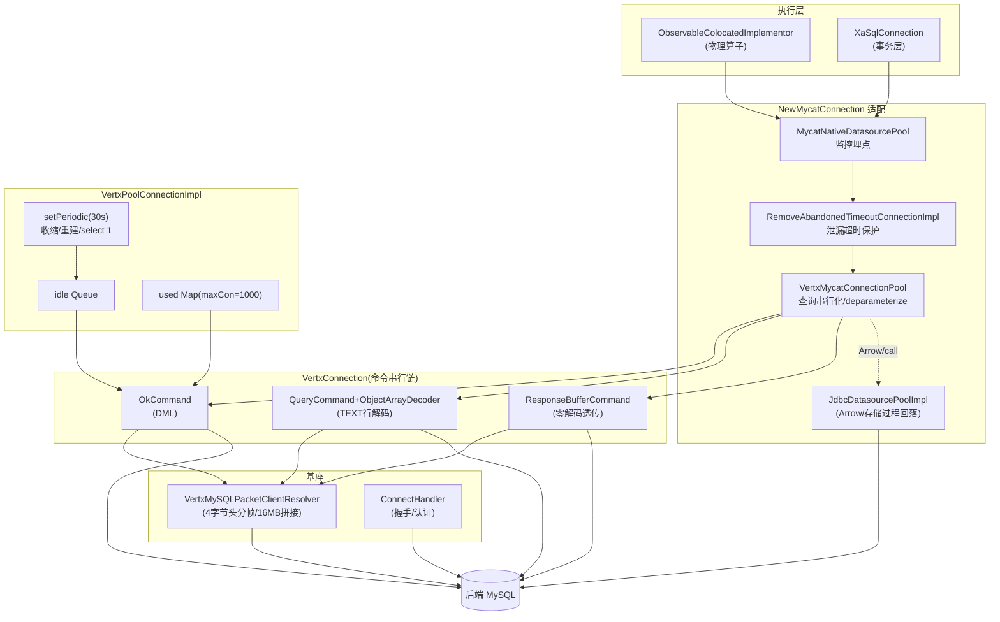

设计要点总结：

1. **协议串行性 = Future 链**：一条物理连接一个命令队列，`future.transform()` 在 synchronized 块内续链，零额外队列数据结构，与 MySQL 请求-响应模型严格对齐；
2. **状态位即回收资格**：不维护事务状态机，而是信任每个响应 OK 包里的 `serverStatusFlags`，`AUTO_COMMIT` 位缺失即 kill--用协议自带的事实代替中间件记账，简单且不会漂移；
3. **透传优先于解码**：同一份包分帧基座上分化出"解码"（QueryCommand+Decoder）与"不解码"（ResponseBufferCommand）两条路径，proxy 快通道全程只搬运字节；
4. **降级路径多层冗余**：启动探活失败→池级降级 JDBC（NATIVE_JDBC）；操作级不支持（Arrow/存储过程）→临时 JDBC 池；认证/版本不满足（DEPRECATE_EOF）→直接失败暴露问题；
5. **可鉴的边界**：无 COM_STMT 二进制协议、无连接属性压缩协商（`needAttrs=false`）、池无获取排队（超 maxCon 立即失败而非等待）、`NATIVE` 类型探活失败也会降级 JDBC（与"纯原生"语义有出入）--这些是读源码才能发现的实现现状。

---

## 八、关键设计总结

1. **"伪装成 MySQL"的代理 + 引擎双形态**：简单 SQL（单点/全局表）走 `HackRouter → proxySelect` **透传通道**（swapBuffer 直接转发后端字节包），复杂 SQL 走 **Calcite 编译执行通道**。快慢两条通道共享同一套协议前端，是性能与功能的折中典范。
2. **Druid 负责解析、Calcite 负责优化、fork 源码获得定制权**：为了解决动态参数类型推断、分片感知的代价估计等问题，Mycat2 直接把 Calcite/linq4j 源码放进仓库改造，而不是黑盒调用。
3. **分片即数据分布（Distribution）**：分片函数被抽象为 `CustomRuleFunction`，其 `calculate(RangeVariable区间)` 返回 `List<Partition>`；分布信息进入优化器后，路由问题被转化为**查询优化问题**（下推、同置 Join、聚合拆分），而不是 Mycat1.x 那种字符串改写。
4. **读写分离 = 副本状态机 + 负载均衡插件**：心跳刷新 `PhysicsInstance` 状态 → `BalanceType` 决定候选集 → `LoadBalanceStrategy` 选实例 → 主库故障时列表重排完成切换并持久化回配置文件。
5. **全异步反应式执行**：Vert.x EventLoop + RxJava Observable + Arrow 向量化行批，多分片 scatter-gather 并发执行、流式归并，避免结果集全量物化。
6. **一切皆元数据**：schema/datasource/cluster/user/sequence 均为 MYCAT_HOME 下 JSON 文件，由 `StorageManager` 统一加载，`UPDATE` 命令或故障切换都会回写文件，配置即状态。

---

*文档基于源码静态分析编写，引用格式为 `文件路径:行号`，行号以本仓库版本（1.22-release, 2022-06-25）为准。*
