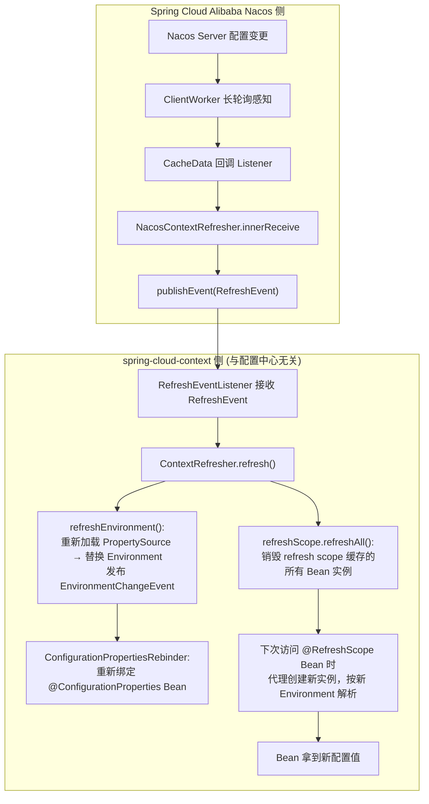
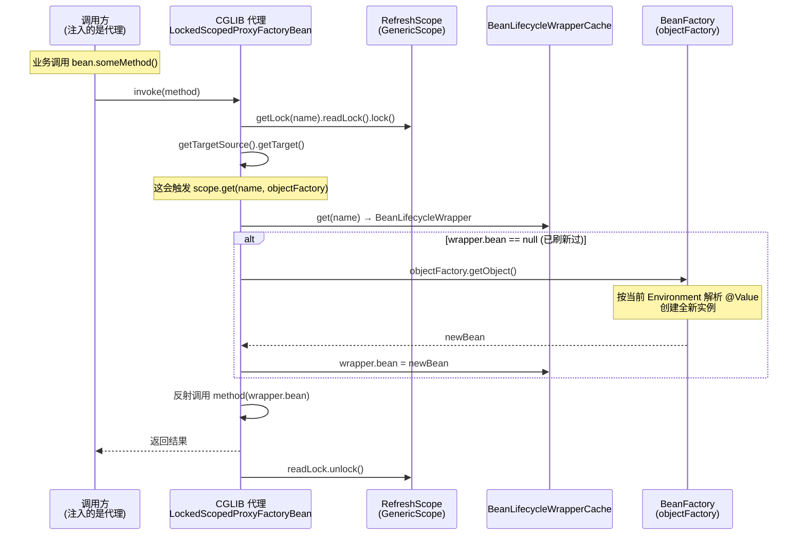
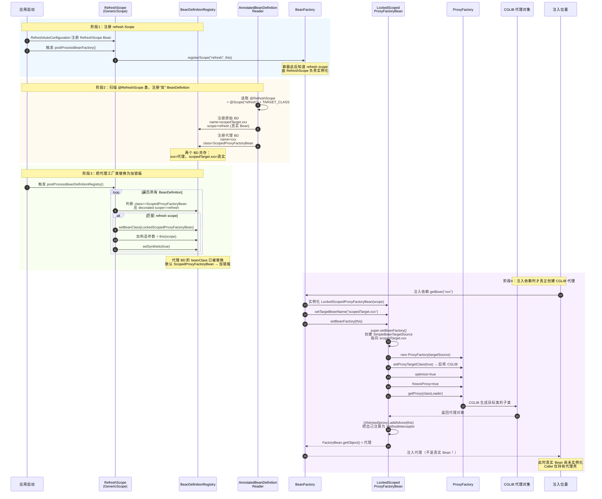
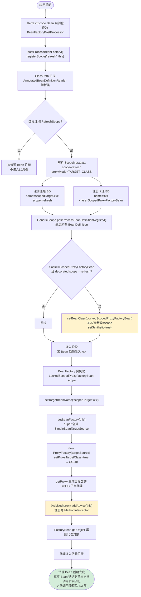
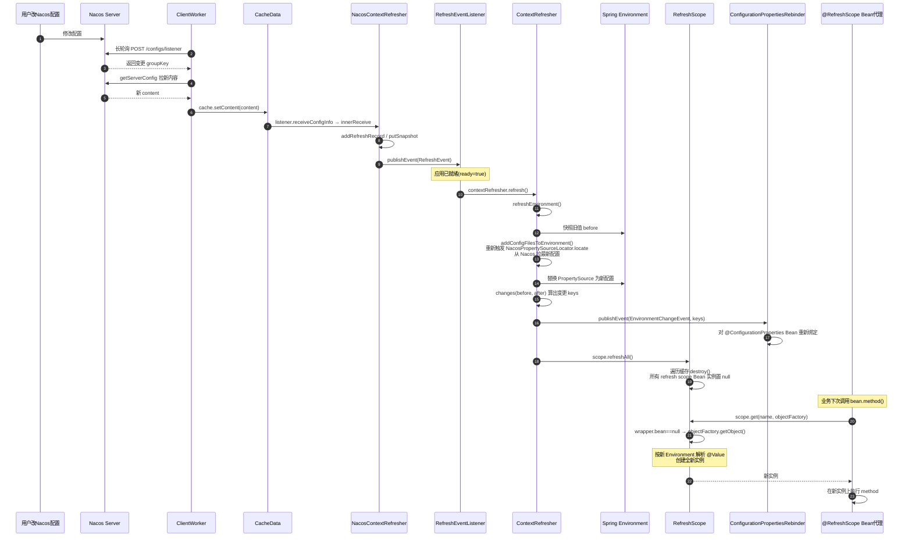

# @RefreshScope 注解实现原理与 Spring Cloud Alibaba Nacos 整合源码分析

> 基于 spring-cloud-context 2.2.9.RELEASE + Spring Cloud Alibaba Nacos Config 2.2.10 源码

---

## 一、整体结论先行

`@RefreshScope` 的本质是：**把 Bean 注册到一个名为 `"refresh"` 的自定义 Scope 中，并用 CGLIB 代理包装 Bean**。配置变更时，销毁该 Scope 缓存里的旧实例，下次访问代理时由代理重新从 BeanFactory 按最新 Environment 创建新实例 —— 从而让 `@Value`、`@ConfigurationProperties` 拿到新值。

它与 Nacos 的整合点只有一个：**Nacos 监听器在配置变更时发布一个 `RefreshEvent`**。剩下的刷新流程全部由 spring-cloud-context 通用机制完成，Nacos 只是个"触发源"。



---

## 二、@RefreshScope 注解本身

```java
// RefreshScope.java (annotation)
@Target({ ElementType.TYPE, ElementType.METHOD })
@Retention(RetentionPolicy.RUNTIME)
@Scope("refresh")                                    // ★ 本质：Spring 标准 @Scope，值为 "refresh"
@Documented
public @interface RefreshScope {
    ScopedProxyMode proxyMode() default ScopedProxyMode.TARGET_CLASS;   // ★ 默认 CGLIB 代理
}
```

关键两点：
1. **`@Scope("refresh")`**：它就是个 Spring 标准 `@Scope`，把 Bean 的作用域设为 `"refresh"`。Spring 容器里本来没有 `"refresh"` 这个 scope，它由 `RefreshScope`（Scope 实现类）在启动时注册。
2. **`ScopedProxyMode.TARGET_CLASS`**：默认用 CGLIB 生成代理类。这是刷新能"生效"的关键 —— 注入到别处的不是 Bean 本身，而是代理；代理在每次方法调用时去 scope 里取"当前实例"。

> 所以 `@RefreshScope` 本身不包含任何逻辑，它只是个标记 + `@Scope` 的语法糖。真正的魔法在 `RefreshScope`（Scope 实现类）和 `GenericScope`（其父类）。

---

## 三、Scope 注册与代理生成机制

### 3.1 RefreshScope 类：注册 "refresh" Scope

```java
// RefreshScope.java (Scope 实现类，继承 GenericScope)
@ManagedResource
public class RefreshScope extends GenericScope implements ApplicationContextAware,
        ApplicationListener<ContextRefreshedEvent>, Ordered {

    public RefreshScope() {
        super.setName("refresh");          // scope 名字 = "refresh"
    }

    @Override
    public void postProcessBeanFactory(ConfigurableListableBeanFactory beanFactory) {
        // （来自父类 GenericScope）
        // beanFactory.registerScope("refresh", this);  ← 注册自定义 scope
    }

    // 应用启动后，eager=true 时，提前实例化所有 refresh scope 的 Bean
    @Override
    public void onApplicationEvent(ContextRefreshedEvent event) {
        start(event);
    }
    private void eagerlyInitialize() {
        for (String name : this.context.getBeanDefinitionNames()) {
            BeanDefinition definition = this.registry.getBeanDefinition(name);
            if (this.getName().equals(definition.getScope()) && !definition.isLazyInit()) {
                Object bean = this.context.getBean(name);   // 触发实例化
            }
        }
    }

    // 销毁指定 Bean 的缓存实例，下次访问重建
    public boolean refresh(String name) {
        if (!name.startsWith(SCOPED_TARGET_PREFIX)) {
            name = SCOPED_TARGET_PREFIX + name;
        }
        if (super.destroy(name)) {
            this.context.publishEvent(new RefreshScopeRefreshedEvent(name));
            return true;
        }
        return false;
    }

    // ★ 销毁 refresh scope 内所有 Bean 的缓存实例
    public void refreshAll() {
        super.destroy();
        this.context.publishEvent(new RefreshScopeRefreshedEvent());
    }
}
```

`RefreshScope` 是个 `BeanFactoryPostProcessor`（通过父类 `GenericScope`），在容器启动时：
- 调用 `beanFactory.registerScope("refresh", this)` 把自己注册为 `"refresh"` scope 的处理器。
- 这样 Spring 在创建 scope=refresh 的 Bean 时，会回调 `scope.get(name, objectFactory)` 来获取实例。

### 3.2 GenericScope：实例缓存 + 代理拦截

这是整个机制的核心。它做两件事：**缓存 Bean 实例** 和 **生成锁定代理**。

#### (1) 实例缓存：`get(name, objectFactory)`

Spring 在创建 scope=refresh 的 Bean 时调用此方法：

```java
// GenericScope.java
@Override
public Object get(String name, ObjectFactory<?> objectFactory) {
    BeanLifecycleWrapper value = this.cache.put(name,
            new BeanLifecycleWrapper(name, objectFactory));   // 包成 wrapper 放进缓存
    this.locks.putIfAbsent(name, new ReentrantReadWriteLock());
    try {
        return value.getBean();                              // 懒加载实例
    } catch (RuntimeException e) {
        this.errors.put(name, e);
        throw e;
    }
}
```

`BeanLifecycleWrapper.getBean()` 是懒加载 + 双重检查锁：

```java
private static class BeanLifecycleWrapper {
    private final String name;
    private final ObjectFactory<?> objectFactory;   // Spring 提供，能按 BeanDefinition 创建实例
    private Object bean;

    public Object getBean() {
        if (this.bean == null) {
            synchronized (this.name) {
                if (this.bean == null) {
                    this.bean = this.objectFactory.getObject();  // ★ 真正创建 Bean 实例
                }
            }
        }
        return this.bean;
    }

    public void destroy() {
        synchronized (this.name) {
            if (this.callback != null) {
                this.callback.run();                  // 执行销毁回调（@PreDestroy 等）
            }
            this.callback = null;
            this.bean = null;                          // ★ 清空实例！下次 getBean 重建
        }
    }
}
```

**这是刷新生效的根本**：
- 实例由 `objectFactory.getObject()` 创建，每次创建都会用**当前 Environment** 重新解析 `@Value`、占位符。
- `destroy()` 把 `bean` 置 null，下次 `getBean()` 就会重新 `objectFactory.getObject()` 创建新实例 → 拿到新配置。

#### (2) 代理生成：`LockedScopedProxyFactoryBean`

因为 `@RefreshScope` 默认 `proxyMode = TARGET_CLASS`，Spring 会为 Bean 生成 CGLIB 代理。`GenericScope` 在 `postProcessBeanDefinitionRegistry` 里把默认的 `ScopedProxyFactoryBean` **替换成自己的 `LockedScopedProxyFactoryBean`**：

```java
// GenericScope.java
@Override
public void postProcessBeanDefinitionRegistry(BeanDefinitionRegistry registry) {
    for (String name : registry.getBeanDefinitionNames()) {
        BeanDefinition definition = registry.getBeanDefinition(name);
        if (definition instanceof RootBeanDefinition) {
            RootBeanDefinition root = (RootBeanDefinition) definition;
            if (root.getDecoratedDefinition() != null && root.hasBeanClass()
                    && root.getBeanClass() == ScopedProxyFactoryBean.class) {
                if (getName().equals(root.getDecoratedDefinition().getBeanDefinition().getScope())) {
                    root.setBeanClass(LockedScopedProxyFactoryBean.class);   // ★ 替换为加锁版代理
                    root.getConstructorArgumentValues().addGenericArgumentValue(this);
                    root.setSynthetic(true);
                }
            }
        }
    }
}
```

`LockedScopedProxyFactoryBean` 是个 `MethodInterceptor`，**每次方法调用都通过 scope 取实例**，并加读锁保证并发安全：

```java
public static class LockedScopedProxyFactoryBean<S extends GenericScope>
        extends ScopedProxyFactoryBean implements MethodInterceptor {

    private final S scope;
    private String targetBeanName;

    @Override
    public Object invoke(MethodInvocation invocation) throws Throwable {
        // equals/toString/hashCode 等直接放行
        ...
        Object proxy = getObject();
        ReadWriteLock readWriteLock = this.scope.getLock(this.targetBeanName);
        Lock lock = readWriteLock.readLock();
        lock.lock();
        try {
            if (proxy instanceof Advised) {
                Advised advised = (Advised) proxy;
                return ReflectionUtils.invokeMethod(method,
                        advised.getTargetSource().getTarget(),   // ★ 每次从 scope 取当前 target
                        invocation.getArguments());
            }
            return invocation.proceed();
        } finally {
            lock.unlock();
        }
    }
}
```

#### (3) 代理与缓存如何配合实现刷新



所以注入到别处的 `@RefreshScope` Bean 是个**代理壳**，真正的实例藏在 scope 缓存里。配置变更 → `refreshAll()` 清空缓存 → 下次方法调用重建实例 → 新配置生效。

### 3.4 代理 Bean 的创建过程

`@RefreshScope` Bean 最终被注入到别处的是一个 CGLIB 代理壳，真实 Bean 延迟到首次方法调用才实例化。整个代理 Bean 的创建横跨四个阶段：**注册 Scope → 扫描注册双 BeanDefinition → 替换代理工厂类 → 注入时生成 CGLIB 代理**。

#### (1) 创建过程时序图



#### (2) 创建过程流程图



#### (3) 关键点说明

| 阶段 | 关键动作 | 涉及组件 |
|------|---------|---------|
| ① 注册 Scope | `registerScope("refresh", this)` 让 Spring 知道 refresh scope 的处理器 | `RefreshScope` / `GenericScope` |
| ② 双 BD 注册 | 一个 `@RefreshScope` 类生成**两个** BeanDefinition：`xxx`（代理）+ `scopedTarget.xxx`（真实 Bean） | `ScopedProxyCreator` |
| ③ 替换工厂类 | 把默认 `ScopedProxyFactoryBean` 换成 `LockedScopedProxyFactoryBean`，注入 scope 引用作为构造参数 | `GenericScope.postProcessBeanDefinitionRegistry` |
| ④ 生成代理 | `LockedScopedProxyFactoryBean` 借父类创建 `ProxyFactory` + CGLIB 代理，再把自身注册为 `MethodInterceptor` | `ScopedProxyFactoryBean` + CGLIB |

> **核心结论**：真实 Bean 在阶段 4 中**没有被实例化**。`ScopedProxyFactoryBean` 只创建了代理壳，其 `SimpleBeanTargetSource` 只持有 `scopedTarget.xxx` 这个名字，要等到运行期方法调用时（见 3.3 节时序图），才通过 `scope.get(name, objectFactory)` 触发真实 Bean 的实例化。这就是为什么"刷新"能生效——重建时走完整 Spring 生命周期、按当前 Environment 重新解析 `@Value`。

---

## 四、刷新流程：ContextRefresher

`RefreshScope` 只负责"销毁实例"，但配置值来自 `Environment`，所以刷新必须**先更新 Environment，再销毁 Bean**。这正是 `ContextRefresher` 的职责。

```java
// ContextRefresher.java
public synchronized Set<String> refresh() {
    Set<String> keys = refreshEnvironment();   // ① 更新 Environment + 发环境变更事件
    this.scope.refreshAll();                   // ② 销毁所有 refresh scope Bean 实例
    return keys;
}

public synchronized Set<String> refreshEnvironment() {
    Map<String, Object> before = extract(this.context.getEnvironment().getPropertySources());  // 旧值快照
    addConfigFilesToEnvironment();             // ★ 重新加载配置到 Environment
    Set<String> keys = changes(before,
            extract(this.context.getEnvironment().getPropertySources())).keySet();             // 算出变更的 key
    this.context.publishEvent(new EnvironmentChangeEvent(this.context, keys));                 // 发变更事件
    return keys;
}
```

### 4.1 `addConfigFilesToEnvironment`：重新加载配置

这是刷新能拿到新值的关键 —— **重新跑一遍启动时的配置加载流程**：

```java
ConfigurableApplicationContext addConfigFilesToEnvironment() {
    StandardEnvironment environment = copyEnvironment(this.context.getEnvironment());
    SpringApplicationBuilder builder = new SpringApplicationBuilder(Empty.class)
            .bannerMode(Mode.OFF).web(WebApplicationType.NONE)
            .environment(environment);
    // 关键：带上 BootstrapApplicationListener 和 ConfigFileApplicationListener
    // → 会重新触发 NacosPropertySourceLocator.locate()，重新从 Nacos 拉取最新配置！
    builder.application().setListeners(Arrays.asList(
            new BootstrapApplicationListener(),
            new ConfigFileApplicationListener()));
    capture = builder.run();
    // 把新加载的 PropertySource 替换/补充进主 context 的 Environment
    MutablePropertySources target = this.context.getEnvironment().getPropertySources();
    for (PropertySource<?> source : environment.getPropertySources()) {
        String name = source.getName();
        if (!this.standardSources.contains(name)) {
            if (target.contains(name)) {
                target.replace(name, source);     // 替换为新的（含 Nacos 新配置）
            } else {
                target.addAfter(targetName, source);
            }
        }
    }
    ...
}
```

> 注意：它起了一个临时的 `SpringApplicationBuilder`，带上 `BootstrapApplicationListener` —— 这会**重新触发 bootstrap 流程，再次调用 `NacosPropertySourceLocator.locate()`**，从而从 Nacos 服务端拉取最新配置，然后把这些 PropertySource 替换进主 context 的 Environment。

### 4.2 `EnvironmentChangeEvent` 的作用

刷新 Environment 后，发布 `EnvironmentChangeEvent`，携带变更的 key 集合。两个监听器响应它：
- **`ConfigurationPropertiesRebinder`**：重新绑定 `@ConfigurationProperties` Bean（见第六节）。
- **`LoggingRebinder`**：重新应用日志级别配置。

### 4.3 `scope.refreshAll()`：销毁实例

调用 `GenericScope.destroy()`，遍历缓存里所有 `BeanLifecycleWrapper`，执行 `destroy()` 把 `bean` 置 null。这样所有 `@RefreshScope` Bean 下次被访问时都会重建。

---

## 五、事件桥接：RefreshEventListener

`RefreshEvent` → `ContextRefresher.refresh()` 的桥梁：

```java
// RefreshEventListener.java
public class RefreshEventListener implements SmartApplicationListener {

    private ContextRefresher refresh;
    private AtomicBoolean ready = new AtomicBoolean(false);   // 应用就绪标志

    @Override
    public boolean supportsEventType(Class<? extends ApplicationEvent> eventType) {
        return ApplicationReadyEvent.class.isAssignableFrom(eventType)
                || RefreshEvent.class.isAssignableFrom(eventType);
    }

    @Override
    public void onApplicationEvent(ApplicationEvent event) {
        if (event instanceof ApplicationReadyEvent) {
            handle((ApplicationReadyEvent) event);     // 就绪后置 ready=true
        } else if (event instanceof RefreshEvent) {
            handle((RefreshEvent) event);              // 收到刷新事件
        }
    }

    public void handle(ApplicationReadyEvent event) {
        this.ready.compareAndSet(false, true);
    }

    public void handle(RefreshEvent event) {
        if (this.ready.get()) {                        // ★ 应用未就绪前不处理，避免过早刷新
            Set<String> keys = this.refresh.refresh(); // 调 ContextRefresher.refresh()
        }
    }
}
```

设计要点：应用启动完成（`ApplicationReadyEvent`）后才允许响应 `RefreshEvent`，防止启动过程中收到刷新事件导致状态混乱。

---

## 六、Bean 装配：RefreshAutoConfiguration

spring-cloud-context 通过 `RefreshAutoConfiguration` 把上述组件装配进容器：

```java
// RefreshAutoConfiguration.java
@Configuration(proxyBeanMethods = false)
@ConditionalOnClass(RefreshScope.class)
@ConditionalOnProperty(name = RefreshAutoConfiguration.REFRESH_SCOPE_ENABLED, matchIfMissing = true)
public class RefreshAutoConfiguration {

    @Bean
    @ConditionalOnMissingBean(RefreshScope.class)
    public static RefreshScope refreshScope() {
        return new RefreshScope();                          // ① Scope 实现类
    }

    @Bean
    @ConditionalOnMissingBean
    public ContextRefresher contextRefresher(ConfigurableApplicationContext context, RefreshScope scope) {
        return new ContextRefresher(context, scope);        // ② 刷新器
    }

    @Bean
    public RefreshEventListener refreshEventListener(ContextRefresher contextRefresher) {
        return new RefreshEventListener(contextRefresher);  // ③ 事件监听器
    }
}
```

三个核心 Bean：`RefreshScope`、`ContextRefresher`、`RefreshEventListener`。它们与配置中心完全解耦 —— 任何发布 `RefreshEvent` 的来源都能触发刷新。

---

## 七、@ConfigurationProperties 的刷新：ConfigurationPropertiesRebinder

`@ConfigurationProperties` Bean **不一定**要加 `@RefreshScope` 也能刷新，靠的是 `ConfigurationPropertiesRebinder` 监听 `EnvironmentChangeEvent`：

```java
// ConfigurationPropertiesRebinder.java (简化)
public class ConfigurationPropertiesRebinder
        implements ApplicationListener<EnvironmentChangeEvent>, ... {

    // 监听到 Environment 变更
    @Override
    public void onApplicationEvent(EnvironmentChangeEvent event) {
        rebind();   // 对所有 @ConfigurationProperties Bean 重新绑定
    }

    public boolean rebind(String name) {
        // 销毁旧 Bean → 用新 Environment 重新 @ConfigurationProperties 绑定
        ...
    }
}
```

所以两类配置属性的刷新路径不同：

| 注解 | 刷新路径 | 是否需要 @RefreshScope |
|------|---------|----------------------|
| `@Value` (在 `@RefreshScope` Bean 中) | `refreshAll()` 销毁实例 → 重建时重新解析 `@Value` | **需要** |
| `@ConfigurationProperties` | `EnvironmentChangeEvent` → `ConfigurationPropertiesRebinder.rebind()` 重新绑定 | 不需要（但加了也行） |
| `@Value` (在普通 singleton 中) | **不会刷新**（singleton 不会重建） | — 这是常见踩坑点 |

---

## 八、SCA Nacos 整合点：只发 RefreshEvent

回到 Nacos。整个整合的"接缝"就是 `NacosContextRefresher` 注册的监听器回调里那一行 `publishEvent`：

```java
// NacosContextRefresher.java (SCA 2.2.10)
private void registerNacosListener(final String groupKey, final String dataKey) {
    Listener listener = listenerMap.computeIfAbsent(key,
            lst -> new AbstractSharedListener() {
                @Override
                public void innerReceive(String dataId, String group, String configInfo) {
                    refreshCountIncrement();
                    nacosRefreshHistory.addRefreshRecord(dataId, group, configInfo);
                    NacosSnapshotConfigManager.putConfigSnapshot(dataId, group, configInfo);
                    // ★★ 唯一接缝：发布 RefreshEvent，把控制权交给 spring-cloud-context
                    applicationContext.publishEvent(
                            new RefreshEvent(this, null, "Refresh Nacos config"));
                }
            });
    configService.addListener(dataKey, groupKey, listener);
}
```

Nacos 侧完全不知道 `@RefreshScope`、`ContextRefresher` 的存在，它只负责：
1. 长轮询感知配置变更（`ClientWorker` + `CacheData`）；
2. 回调监听器 `innerReceive`；
3. 发布 `RefreshEvent`。

之后的全部工作（重新加载 PropertySource、刷新 Environment、销毁 refresh scope Bean、重新绑定 `@ConfigurationProperties`）都是 spring-cloud-context 通用机制。

### SCA 装配的两个配置类

```java
// NacosConfigBootstrapConfiguration —— bootstrap 阶段
// 注册: NacosConfigProperties, NacosConfigManager, NacosPropertySourceLocator
//   → 启动时从 Nacos 拉配置进 Environment

// NacosConfigAutoConfiguration —— 主上下文
// 注册: NacosRefreshHistory, NacosContextRefresher
//   → 应用就绪后注册 Nacos 监听器，配置变更时发 RefreshEvent
```

---

## 九、端到端完整时序图



---

## 十、关键设计总结

### 10.1 为什么用代理 + 缓存，而不是直接改 Bean 字段？
- 直接改字段无法处理"配置项决定 Bean 结构"的场景（如 `@ConditionalOnProperty`、构造器参数）。
- 代理 + 缓存让"刷新"= 销毁旧实例 + 懒重建，复用 Spring 完整的 Bean 生命周期（`@PostConstruct`/`@PreDestroy`/依赖注入），重建出的实例与正常初始化完全一致。
- 代理保证注入到别处的引用不变（始终是代理壳），但每次方法调用取最新实例。

### 10.2 加锁的必要性
`LockedScopedProxyFactoryBean` 给每个 Bean 加 `ReadWriteLock`：
- **读锁**：方法调用时加读锁，允许多线程并发访问同一实例。
- **写锁**：`destroy()`/重建时加写锁，保证销毁过程中不会有线程拿到半成品实例。
- 这是 `GenericScope` 自己实现的并发控制，比 Spring 原生 `SimpleThreadScope` 安全。

### 10.3 @RefreshScope 的代价与限制
- **惰性 + 代理开销**：每次方法调用经代理 + 读锁，有轻微性能开销。
- **只刷新 @RefreshScope Bean 中的 @Value**：普通 singleton 的 `@Value` 不会刷新 —— 这是使用时最容易踩的坑，必须把用到动态配置的 Bean 标注 `@RefreshScope`。
- **全量重建**：`refreshAll()` 销毁所有 refresh scope Bean，即便只有一项配置变了。高频变更场景下重建成本需评估。
- **非线程安全的重建期**：虽有锁保护，但销毁瞬间若有长事务持有旧实例，可能出现短暂不一致。

### 10.4 Nacos 与 spring-cloud-context 的解耦
Nacos 只是众多"配置源触发器"之一（Apollo、Consul、Zookeeper 同理）。`@RefreshScope` 体系完全不感知配置中心类型，只认 `RefreshEvent`。这种解耦让 spring-cloud 的刷新机制成为通用基础设施，配置中心只需实现"配置变更 → 发 RefreshEvent"即可接入。

---

## 十一、源码位置索引

| 关注点 | 文件 | 关键点 |
|--------|------|--------|
| `@RefreshScope` 注解 | `context/config/annotation/RefreshScope.java` | `@Scope("refresh")` + `TARGET_CLASS` 代理 |
| Scope 实现 | `context/scope/refresh/RefreshScope.java` | 注册 "refresh" scope、`refreshAll()` |
| 缓存 + 代理核心 | `context/scope/GenericScope.java` | `get()`/`destroy()`/`BeanLifecycleWrapper`/`LockedScopedProxyFactoryBean` |
| 刷新流程 | `context/refresh/ContextRefresher.java` | `refresh()` = `refreshEnvironment()` + `scope.refreshAll()` |
| 事件桥接 | `endpoint/event/RefreshEventListener.java` | `RefreshEvent` → `refresh()` |
| 自动装配 | `autoconfigure/RefreshAutoConfiguration.java` | 注册三大 Bean |
| CP 重绑定 | `context/properties/ConfigurationPropertiesRebinder.java` | 监听 `EnvironmentChangeEvent` |
| Nacos 接缝 | `com.alibaba.cloud.nacos.refresh.NacosContextRefresher` | `innerReceive` → `publishEvent(RefreshEvent)` |
