# BootstrapApplicationListener 详解

> 基于 spring-cloud-context 2.2.9.RELEASE + Spring Boot 2.2.x 源码。本文是 `Spring-Cloud-Bootstrap启动流程详解.md` 的深度下钻，专门剖析 `BootstrapApplicationListener.onApplicationEvent` 方法与 Bootstrap ApplicationContext 的创建启动全流程。
>
> 注：spring-cloud-context 源码不在本仓库（本仓库是 Nacos 服务端）。本文源码片段基于 2.2.9.RELEASE 还原，为突出主线有适度简化，关键逻辑保留。

---

## 一、`BootstrapApplicationListener` 的角色定位

```java
// org.springframework.cloud.bootstrap.BootstrapApplicationListener
public class BootstrapApplicationListener
        implements ApplicationListener<ApplicationEnvironmentPreparedEvent>, Ordered {

    public static final String BOOTSTRAP_PROPERTY_SOURCE_NAME = "bootstrap";
    public static final int DEFAULT_ORDER = Ordered.HIGHEST_PRECEDENCE + 5;
    private int order = DEFAULT_ORDER;
    ...
}
```

三个关键设计：
1. **监听 `ApplicationEnvironmentPreparedEvent`**：Spring Boot 在 Environment 准备好、context 还没创建时发布此事件——这是 bootstrap 的黄金时机。
2. **`Ordered.HIGHEST_PRECEDENCE + 5`**：优先级比 `ConfigFileApplicationListener`（`+10`）更高，**先于 `application.yml` 加载触发**。这保证了 bootstrap 拉的远程配置在 `application.yml` 加载前就已进入 Environment。
3. **它本身是 `ApplicationListener`，不是 `ApplicationContextInitializer`**：它负责"启动 bootstrap context"，不参与 context 内部初始化。

---

## 二、`onApplicationEvent` 方法职责

该方法是整个 bootstrap 机制的**总入口**，做四件事：
1. **三道防线**：判断是否要执行 bootstrap。
2. **解析配置**：读 `spring.cloud.bootstrap.name` / `location`。
3. **创建 bootstrap context**：调用 `bootstrapServiceContext`。
4. **应用 bootstrap**：调用 `apply`，建立父子关系 + 合并配置。

### 2.1 源码（简化还原）

```java
@Override
public void onApplicationEvent(ApplicationEnvironmentPreparedEvent event) {
    ConfigurableEnvironment environment = event.getEnvironment();

    // ★ 防线1：总开关（默认 true）
    if (!environment.getProperty("spring.cloud.bootstrap.enabled",
            Boolean.class, true)) {
        return;
    }

    // ★ 防线2：防重入——已经在 bootstrap context 内了，直接返回
    if (environment.getPropertySources()
            .contains(BOOTSTRAP_PROPERTY_SOURCE_NAME)) {
        return;
    }

    // 解析 bootstrap 配置名（默认 "bootstrap"）和位置
    String configName = environment.resolvePlaceholders(environment
            .getProperty("spring.cloud.bootstrap.name", "bootstrap"));
    String configLocation = environment.resolvePlaceholders(environment
            .getProperty("spring.cloud.bootstrap.location", null));

    // ★ 防线3：可选的自定义 context 类（spring.context.config.classes）
    ConfigurableApplicationContext context = null;
    for (String contextClass : environment.getProperty(
            "spring.context.config.classes", String[].class, new String[0])) {
        if (context == null) {
            try {
                context = createContext(contextClass, environment,
                        configName, configLocation);
            } catch (Exception e) {
                LOGGER.warn(...);
            }
        }
    }

    // ★ 核心路径：创建 bootstrap context
    if (context == null) {
        context = bootstrapServiceContext(environment,
                event.getSpringApplication(), configName, configLocation);
    }

    // ★ 应用：建立父子关系 + 合并配置到主 Environment
    apply(context, event.getSpringApplication(), environment);
}
```

### 2.2 三道防线决策流程图

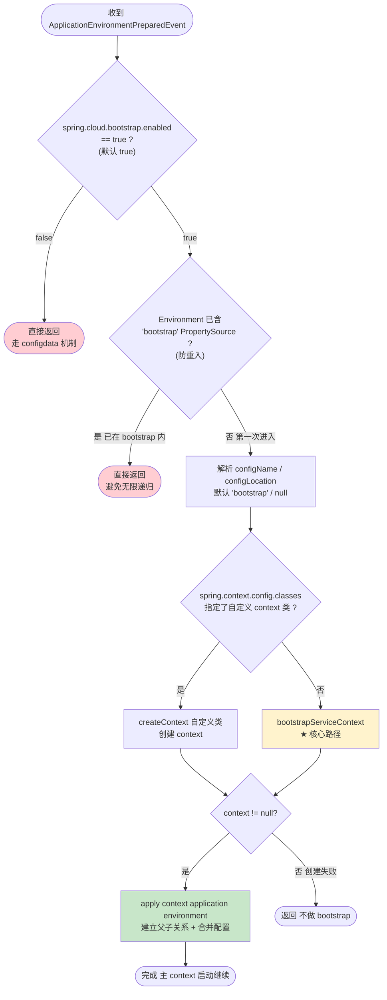

### 2.3 三道防线详解

| 防线 | 检查条件 | 命中后的行为 | 意义 |
|------|---------|-------------|------|
| ① 总开关 | `spring.cloud.bootstrap.enabled != true` | 直接返回 | 允许禁用 bootstrap（Spring Boot 2.4+ 或自定义场景） |
| ② 防重入 | Environment 已含 `bootstrap` PropertySource | 直接返回 | 内层 run 也会发此事件，避免无限递归创建第三层 context |
| ③ 自定义 | `spring.context.config.classes` 指定类 | 用该类创建 context | 扩展点：允许自定义 bootstrap context 实现 |

防线② 是**防止无限递归**的关键：内层 run（bootstrap context 启动）也会发布 `ApplicationEnvironmentPreparedEvent`，`BootstrapApplicationListener` 会再次被触发。此时 `bootstrapServiceContext` 已经把一个名为 `bootstrap` 的 `MapPropertySource` 加进了 bootstrapEnvironment，所以防线②命中、直接返回。详见第十节。

---

## 三、`bootstrapServiceContext`：创建 bootstrap context

这是 `onApplicationEvent` 的核心调用，负责"造一个迷你 Spring 应用并启动"。

### 3.1 源码（简化还原）

```java
private ConfigurableApplicationContext bootstrapServiceContext(
        ConfigurableEnvironment environment, final SpringApplication application,
        String configName, String configLocation) {

    // ① 创建一个干净的 bootstrap Environment
    StandardEnvironment bootstrapEnvironment = new StandardEnvironment();
    MutablePropertySources bootstrapProperties = bootstrapEnvironment.getPropertySources();

    // ② 把主 Environment 里的非标准 PropertySource 搬过来
    //    (排除 systemProperties / systemEnvironment / commandArgs 等标准源)
    for (PropertySource<?> source : environment.getPropertySources()) {
        if (source instanceof EnumerablePropertySource
                && !STANDARD_SOURCES.contains(source.getName())) {
            bootstrapProperties.addLast(source);
        }
    }

    // ③ ★ 名字魔法：把 spring.config.name 设为 "bootstrap"
    //    这会让 ConfigFileApplicationListener 去找 bootstrap.yml 而非 application.yml
    Map<String, Object> bootstrapMap = new HashMap<>();
    bootstrapMap.put("spring.config.name", configName);          // ★★★
    if (StringUtils.hasText(configLocation)) {
        bootstrapMap.put("spring.config.location", configLocation);
    }
    bootstrapProperties.addFirst(
            new MapPropertySource(BOOTSTRAP_PROPERTY_SOURCE_NAME, bootstrapMap));

    // ④ 用 SpringApplicationBuilder 构建 bootstrap 应用
    SpringApplicationBuilder builder = new SpringApplicationBuilder();
    builder.profiles(environment.getProperty("spring.profiles.active")); // 继承 profile
    builder.environment(bootstrapEnvironment);
    builder.application().setApplicationName(configName);  // app name = "bootstrap"
    builder.main(application.getMainApplicationClass());
    builder.sources(BootstrapImportSelectorConfiguration.class);  // ★ 装配入口
    builder.configuration().setAllowCircularReferences(true);      // 允许循环引用

    // ⑤ ★★★ 启动！触发完整的 SpringApplication.run 流程（内层 run）
    final ConfigurableApplicationContext context = builder.run();
    context.setId("bootstrap");

    // ⑥ 注册关闭钩子
    if (context instanceof ConfigurableApplicationContext) {
        context.registerShutdownHook();
    }

    return context;
}
```

### 3.2 创建流程图

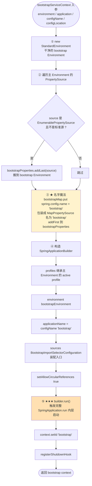

### 3.3 关键设计点

1. **干净的 bootstrapEnvironment**：不复用主 Environment，避免主 Environment 里的业务配置干扰 bootstrap 的配置加载。
2. **搬非标准源**：把主 Environment 里用户自定义的 PropertySource 搬过来，让 bootstrap 能读到用户配置（如 `spring.cloud.nacos.config.*`）。
3. **`spring.config.name = "bootstrap"`（名字魔法）**：这是核心——让 `ConfigFileApplicationListener` 去加载 `bootstrap.yml` 而不是 `application.yml`。复用 Spring Boot 现成机制，不自己写 yml 加载。
4. **继承 profile**：`builder.profiles(...)` 让 `bootstrap-{profile}.yml` 也能被加载（前提是 profile 已在主 Environment 里）。
5. **`BootstrapImportSelectorConfiguration` 作为 source**：这是 bootstrap 装配的入口，会触发 `BootstrapImportSelector` 扫描 `spring.factories`。

---

## 四、`builder.run()`：bootstrap context 的完整启动

`SpringApplicationBuilder.run()` 内部就是一次完整的 `SpringApplication.run()`。这是**内层 run**（见 `Spring-Cloud-Bootstrap启动流程详解.md` 第九节）。下面拆解这次 run 的每一步。

### 4.1 启动时序图

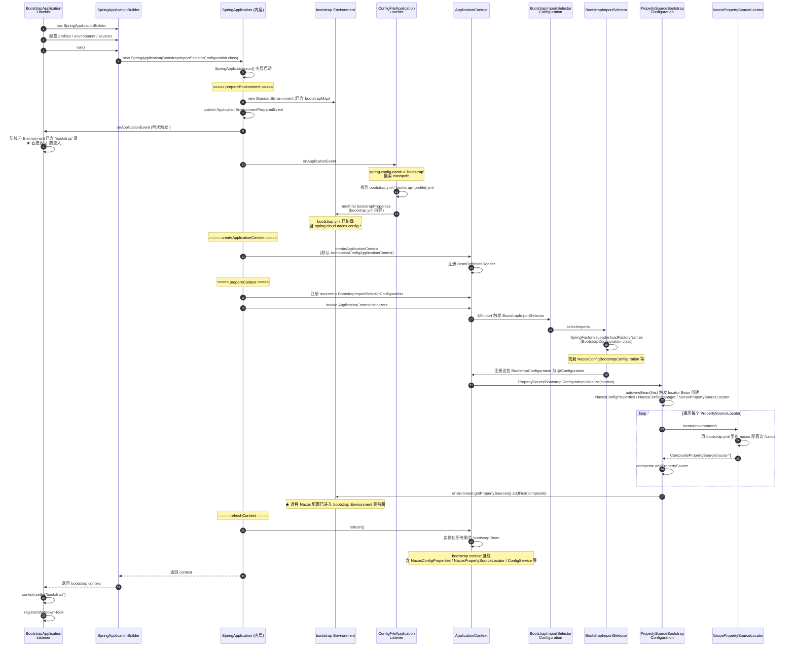

### 4.2 五个阶段拆解

#### 阶段一：`prepareEnvironment`（准备 bootstrap Environment）
- `bootstrapEnvironment` 已被 `bootstrapServiceContext` 第③步注入了 `spring.config.name = "bootstrap"`。
- 发布 `ApplicationEnvironmentPreparedEvent` → `BootstrapApplicationListener` 因防线②返回（防重入）→ `ConfigFileApplicationListener` 加载 `bootstrap.yml`。

#### 阶段二：`createApplicationContext`（创建空 context）
- 创建 `AnnotationConfigApplicationContext`（默认类型）。
- 此时 context 是空的，没有任何业务 Bean，只有 BeanDefinitionReader。

#### 阶段三：`prepareContext`（装配 + 跑 initializer）
- 注册 `BootstrapImportSelectorConfiguration` 作为 source。
- `@Import(BootstrapImportSelector.class)` 触发 `BootstrapImportSelector.selectImports()` → 扫描 `spring.factories` 加载所有 `BootstrapConfiguration`（含 Nacos 的）。
- 跑 `ApplicationContextInitializer`：**`PropertySourceBootstrapConfiguration.initialize(context)`** 在此刻执行——这是 locator 调用的时机（详见第八节）。

#### 阶段四：`refreshContext`（实例化 Bean）
- 实例化所有 `BootstrapConfiguration` 注册的 Bean：`NacosConfigProperties`、`NacosConfigManager`、`NacosPropertySourceLocator`、`ConfigService` 等。
- 注意：locator Bean 在阶段三的 `initialize` 里就已被 `autowireBean` 提前创建，这里只是补齐其他 Bean。

#### 阶段五：返回 context
- `builder.run()` 返回 bootstrap context，`setId("bootstrap")`，注册关闭钩子。

---

## 五、`BootstrapImportSelector` 与 `BootstrapConfiguration` 装配

### 5.1 装配入口链

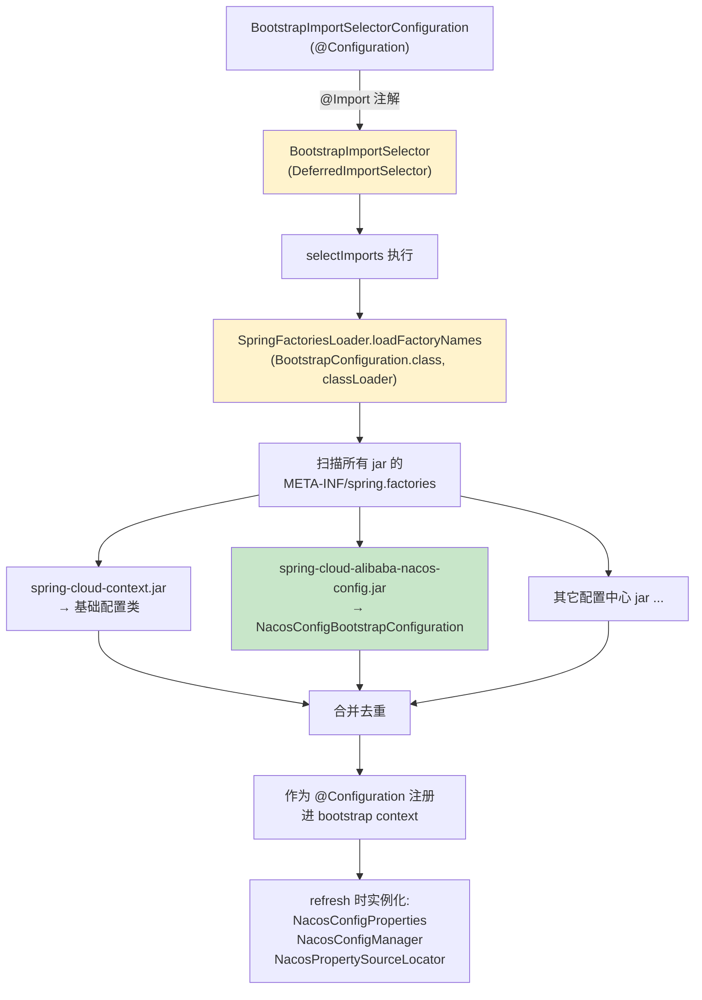

### 5.2 `BootstrapImportSelector` 源码（简化）

```java
public class BootstrapImportSelector
        implements DeferredImportSelector, EnvironmentAware, Ordered {

    private Environment environment;

    @Override
    public String[] selectImports(AnnotationMetadata annotationMetadata) {
        ClassLoader classLoader = Thread.currentThread().getContextClassLoader();
        // ★ 从 spring.factories 读 BootstrapConfiguration 配置项
        List<String> names = new ArrayList<>(SpringFactoriesLoader.loadFactoryNames(
                BootstrapConfiguration.class, classLoader));
        // 用户可通过 spring.cloud.bootstrap.sources 追加
        names.addAll(Arrays.asList(environment.getProperty(
                "spring.cloud.bootstrap.sources", String[].class, new String[0])));
        // ... 注解配置处理
        return names.toArray(new String[0]);
    }

    @Override
    public void setEnvironment(Environment environment) {
        this.environment = environment;
    }
}
```

关键点：
- **`DeferredImportSelector`**：延迟到所有 `@Configuration` 处理完再执行，保证用户配置优先。
- **`SpringFactoriesLoader.loadFactoryNames`**：读所有 jar 的 `META-INF/spring.factories` 里 key = `BootstrapConfiguration` 的配置类。
- **用户扩展点**：`spring.cloud.bootstrap.sources` 可追加自定义配置类。

---

## 六、`PropertySourceBootstrapConfiguration.initialize` 的调用时机

这是一个**容易混淆的关键点**：locator 在哪个阶段执行？

### 6.1 时机澄清

`PropertySourceBootstrapConfiguration` 身兼两职：
1. **`ApplicationContextInitializer`**：在 `prepareContext` 阶段被调用（context 创建后、refresh 前）。
2. **`@Configuration`**：本身也是个配置类，但其 `initialize` 方法是入口。

`initialize` 在 `prepareContext` 阶段执行，但此时 locator Bean 还没经过完整 refresh。`initialize` 通过 `autowireBean(this)` **强制触发 locator Bean 的提前创建**，然后调用 `locate()`。

### 6.2 initialize 流程图

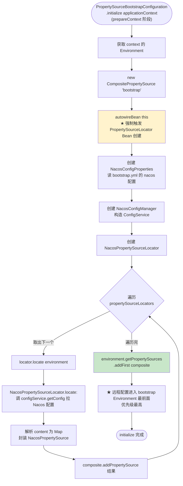

### 6.3 为什么 locator 在 refresh 前执行

因为远程配置要在 bootstrap context 的 refresh 阶段就可用——这样：
- bootstrap context 内的 Bean（如果用 `@Value` 引用远程配置）能在 refresh 时拿到远程值。
- 更重要的是，bootstrap 的 Environment 最终会被 `apply` 合并到主 Environment，让主 context 的 `@Value` 拿到远程值。

如果在 refresh 后才 `locate`，主 context 启动时就来不及看到远程配置了。所以 `initialize`（prepareContext 阶段）是**最晚的可用时机**。

---

## 七、`apply`：建立父子关系 + 合并配置

`bootstrapServiceContext` 返回后，`onApplicationEvent` 调用 `apply`，把 bootstrap context"嫁接"到主应用上。

### 7.1 apply 源码（简化）

```java
private void apply(ConfigurableApplicationContext context,
        SpringApplication application, ConfigurableEnvironment environment) {
    if (context == null) {
        return;
    }
    // ① ★ 注册 initializer：主 context 创建时把 bootstrap 设为父
    application.addInitializers(
            new ParentContextApplicationContextInitializer(context));

    // ② 添加监听器：处理 bootstrap 配置源的传播/过滤
    application.addListeners(new BootstrapSourceFilter(environment));

    // ③ ★ 把 bootstrap context 的配置合并进主 Environment
    environment.getPropertySources().remove(BOOTSTRAP_PROPERTY_SOURCE_NAME);
    if (context.getEnvironment() instanceof ConfigurableEnvironment) {
        ConfigurableEnvironment bootstrapEnv =
                (ConfigurableEnvironment) context.getEnvironment();
        // 把 bootstrap 里非标准源搬到主 Environment
        for (PropertySource<?> source : bootstrapEnv.getPropertySources()) {
            if (!STANDARD_SOURCES.contains(source.getName())
                    && !BOOTSTRAP_PROPERTY_SOURCE_NAME.equals(source.getName())) {
                // 按优先级插入主 Environment
                environment.getPropertySources().addAfter(..., source);
            }
        }
    }
}
```

### 7.2 apply 流程图

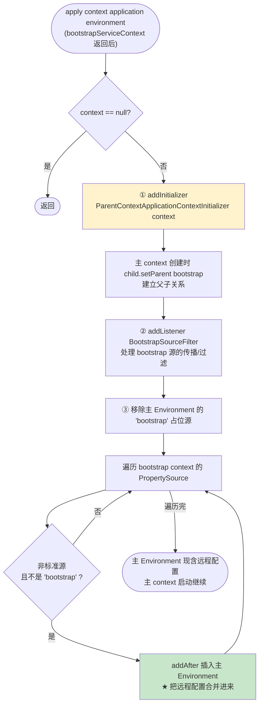

### 7.3 `ParentContextApplicationContextInitializer`：建立父子关系

`apply` 第①步注册的 initializer，在主 context 的 `prepareContext` 阶段执行：

```java
public class ParentContextApplicationContextInitializer
        implements ApplicationContextInitializer<ConfigurableApplicationContext>, Ordered {

    private final ApplicationContext parent;

    public ParentContextApplicationContextInitializer(ApplicationContext parent) {
        this.parent = parent;   // ★ bootstrap context
    }

    @Override
    public void initialize(ConfigurableApplicationContext child) {
        // ★ 主 context (child) 的 parent = bootstrap context
        if (child != this.parent && this.parent != null) {
            child.setParent(this.parent);
        }
    }
}
```

调用时机时序图：

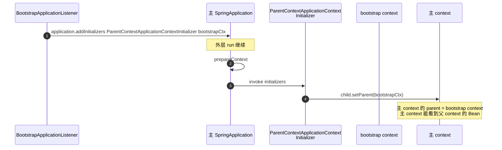

---

## 八、防重入机制详解

这是 bootstrap 机制最微妙的部分：内层 run 会再次触发 `BootstrapApplicationListener`，如何避免无限递归？

### 8.1 递归触发点

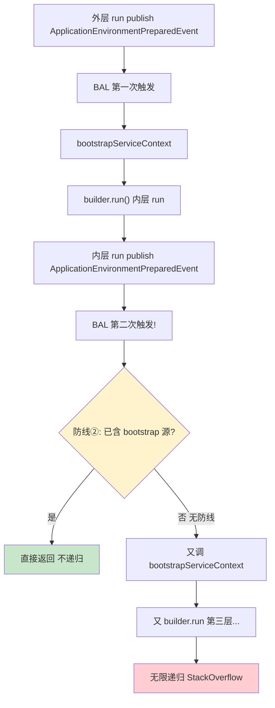

### 8.2 防线②的判定依据

`bootstrapServiceContext` 第③步往 `bootstrapEnvironment` 里 `addFirst` 了一个名为 `bootstrap` 的 `MapPropertySource`（含 `spring.config.name`）。所以内层 run 的 `ApplicationEnvironmentPreparedEvent` 触发时，`environment.getPropertySources().contains("bootstrap")` 为 `true` → 防线②命中 → 直接返回。

> 这就是为什么 `bootstrapServiceContext` 必须把 `bootstrapMap` 包成 `MapPropertySource` 并命名为 `bootstrap`——既是为了传 `spring.config.name`，也是作为防重入标记。

### 8.3 防重入流程图

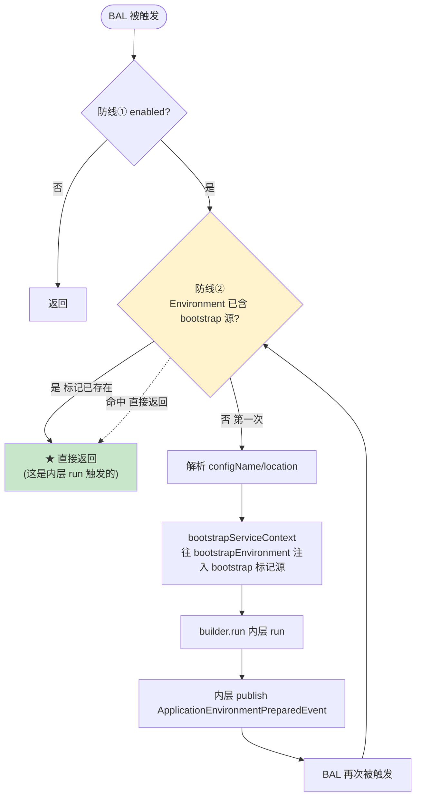

---

## 九、完整端到端时序图

把所有阶段串起来，从 `main()` 到 bootstrap 完成再回到主 context 启动：

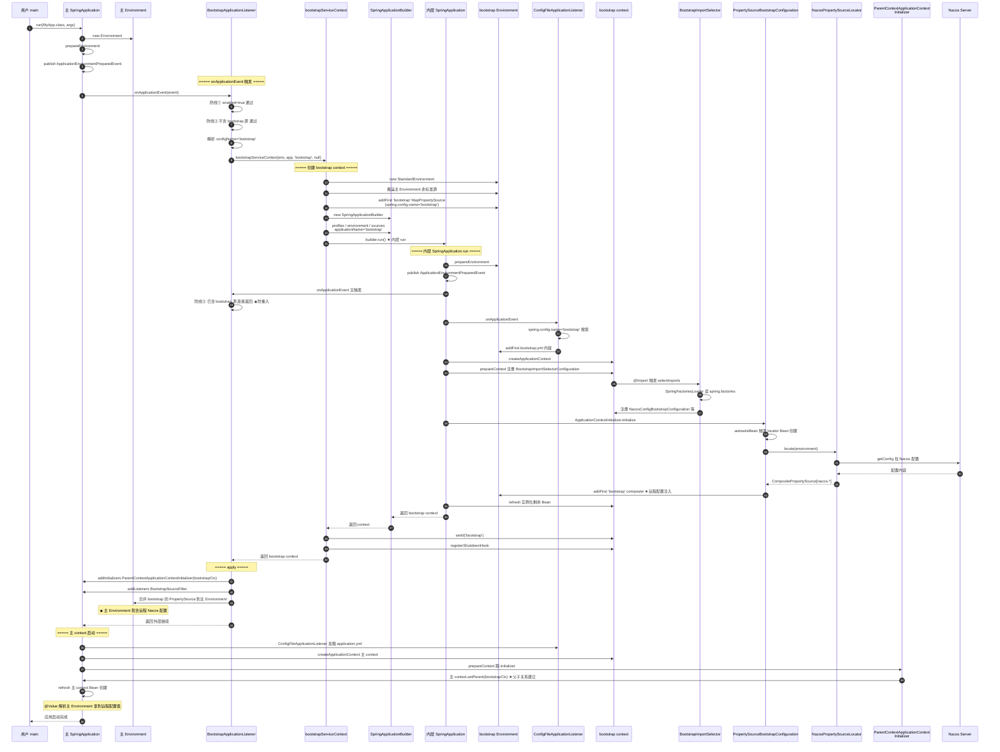

---

## 十、关键设计点总结

### 10.1 `onApplicationEvent` 的设计哲学

| 设计 | 价值 |
|------|------|
| 监听 `ApplicationEnvironmentPreparedEvent` | 主 context 还没创建，是注入远程配置的黄金时机 |
| 优先级 `HIGHEST_PRECEDENCE + 5` | 先于 `ConfigFileApplicationListener`，保证远程配置在 `application.yml` 加载前进入 Environment |
| 三道防线 | 开关 / 防重入 / 扩展点，覆盖禁用、递归、自定义场景 |
| 用 `SpringApplicationBuilder` 嵌套 run | 复用 Spring Boot 完整启动流程，bootstrap context 也是个正规 Spring 应用 |

### 10.2 "名字魔法"是核心创新

`bootstrapServiceContext` 没有自己实现 yml 加载，只往 bootstrapEnvironment 注入 `spring.config.name = "bootstrap"`，就让 Spring Boot 现成的 `ConfigFileApplicationListener` 去加载 `bootstrap.yml`。这是**组合优于重写**的典范——一行配置名切换了整个加载目标。

### 10.3 防重入的巧妙

用 `MapPropertySource` 的**名字** `bootstrap` 作为标记：既承载 `spring.config.name`，又作为防线②的判定依据。一物两用，没有额外引入标志位。

### 10.4 locator 在 `prepareContext` 阶段执行

`PropertySourceBootstrapConfiguration` 作为 `ApplicationContextInitializer`，在 refresh 前通过 `autowireBean` 提前创建 locator 并调用 `locate()`。这保证远程配置在 refresh 前就进入 Environment，让所有后续 Bean 创建都能用上。

### 10.5 `apply` 的两个动作

1. **`ParentContextApplicationContextInitializer`**：建立父子关系，主 context 能继承 bootstrap context 的 Bean。
2. **合并 PropertySource**：把 bootstrap 加载的远程配置塞进主 Environment，让主 context 的 `@Value` 拿到远程值。
3. 两者缺一不可：只有父子关系没合并配置，主 context 看不到远程值；只合并配置没父子关系，bootstrap context 的 Bean 无法被主 context 复用。

---

## 十一、源码位置索引

| 关注点 | 类 | 关键方法 |
|--------|----|---------|
| 入口监听器 | `BootstrapApplicationListener` | `onApplicationEvent` |
| 创建 bootstrap context | `BootstrapApplicationListener` | `bootstrapServiceContext` |
| 应用到主应用 | `BootstrapApplicationListener` | `apply` |
| 装配入口 | `BootstrapImportSelectorConfiguration` | `@Import(BootstrapImportSelector.class)` |
| 扫描 spring.factories | `BootstrapImportSelector` | `selectImports` |
| 配置加载聚合 | `PropertySourceBootstrapConfiguration` | `initialize` |
| 建立父子关系 | `ParentContextApplicationContextInitializer` | `initialize` |
| 配置源过滤 | `BootstrapSourceFilter` | `onApplicationEvent` |
| Nacos 装配 | `NacosConfigBootstrapConfiguration` | `@Configuration` 注册三件套 |
| Nacos 拉配置 | `NacosPropertySourceLocator` | `locate` |

---

## 十二、串联回前序文档

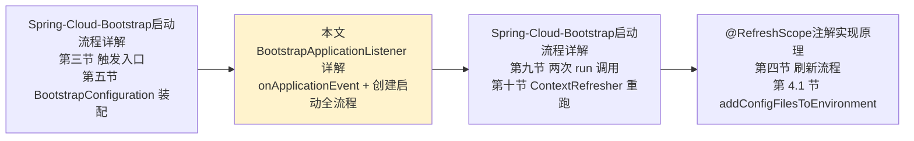

本文是 `Spring-Cloud-Bootstrap启动流程详解.md` 的下钻：
- 该文档第三节讲了 `BootstrapApplicationListener` 的**职责概述**，本文第二节给出 `onApplicationEvent` 的**逐行源码解析**。
- 该文档第四节讲了 bootstrap context 创建的**概要**，本文第三、四节给出 `bootstrapServiceContext` 的**完整源码 + 五阶段启动拆解**。
- 该文档第六节讲了 `PropertySourceBootstrapConfiguration` 聚合，本文第六节补充了**locator 的调用时机**（prepareContext 阶段而非 refresh）。
- 该文档没有专门讲防重入，本文第八节详解了**防线②如何防止无限递归**。

> **一句话总结**：`onApplicationEvent` 通过三道防线判断是否执行、用 `bootstrapServiceContext` 造一个名为 `bootstrap` 的迷你 Spring 应用并完整 `run()` 起来（加载 `bootstrap.yml` → 扫 `spring.factories` 装配 → 跑 locator 拉远程配置），最后 `apply` 把这个 context 设为主 context 的父并把远程配置合并进主 Environment。防重入靠 `bootstrap` 标记源，名字魔法靠 `spring.config.name = "bootstrap"`，两者都是 `bootstrapServiceContext` 第③步那个 `MapPropertySource` 的功劳。