# Nacos 1.4.8 AP 一致性 Distro 协议实现原理源码分析

> 基于 Nacos 1.4.8 源码（分支 `develop-1.4.8`）深入分析 Distro 协议的设计与实现

## 一、概述

### 1.1 什么是 Distro 协议

Distro 是 Nacos 自研的 **AP 模式分布式一致性协议**，专门用于 **临时数据（Ephemeral Data）** 的同步。其核心特征：

- **最终一致性**：不保证强一致，仅保证最终收敛
- **去中心化对等架构**：每个节点都可以处理写入，再同步给其他节点
- **基于 HTTP 传输**：1.4.8 版本使用 HTTP/REST 作为传输层（2.x 改为 gRPC）
- **服务实例导向**：数据同步以服务（Service）为单位，即 `Datum<Instances>`
- **心跳+校验双重机制**：通过周期性同步 + 校验和对账保证数据一致性

### 1.2 适用场景

Distro 协议仅处理 **临时实例数据**（如服务注册的实例列表），**不处理持久化数据**。持久化数据由 JRaft（CP 协议）处理。

### 1.3 核心架构图

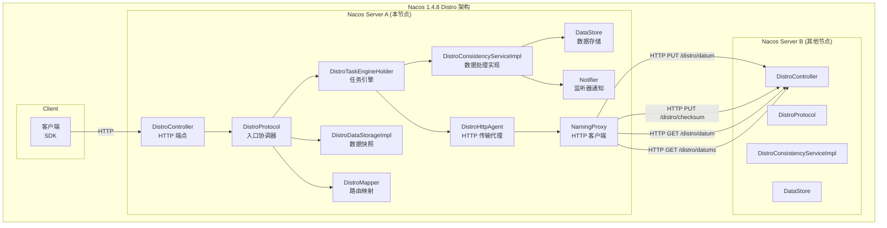

### 1.4 与 2.x 版本的核心差异

| 维度 | Nacos 1.4.8 | Nacos 2.4.2 |
|------|-------------|-------------|
| **传输协议** | HTTP/REST | gRPC（双向流） |
| **数据模型** | 服务实例导向（`Datum<Instances>`） | 客户端导向（`Client` 抽象） |
| **存储** | `DataStore`（`Map<String, Datum>`） | `Client` 持有 `Service` 索引 |
| **批量同步** | Combined Key 批量 HTTP 请求 | 每 Client 一次 gRPC 请求 |
| **校验机制** | checksum 字符串对比 | numeric revision 对比 |
| **资源类型** | 仅 `INSTANCE_LIST_KEY_PREFIX` | 多种（Instance、Metadata 等） |
| **监听器通知** | `Notifier` + `BlockingQueue` | `DistroClientTracker` |
| **失败处理** | 拆分回单 Key 重试 | 直接重试 |

---

## 二、核心组件分析

### 2.1 DistroProtocol —— 入口协调器

**文件路径**：`core/src/main/java/com/alibaba/nacos/core/distributed/distro/DistroProtocol.java`

`DistroProtocol` 是 Distro 协议的入口组件，承担三大职责：
1. 接收数据同步请求并路由到对应处理器
2. 启动周期性校验任务和启动加载任务
3. 触发数据同步到目标节点

```java
@Component
public class DistroProtocol {

    private final DistroComponentHolder componentHolder;
    private final DistroTaskEngineHolder distroTaskEngineHolder;
    private volatile boolean isInitialized = false;

    public DistroProtocol(ServerMemberManager memberManager,
            DistroComponentHolder componentHolder, DistroTaskEngineHolder distroTaskEngineHolder,
            DistroConfig distroConfig) {
        this.memberManager = memberManager;
        this.componentHolder = componentHolder;
        this.distroTaskEngineHolder = distroTaskEngineHolder;
        this.distroConfig = distroConfig;
        startVerifyTask();
        startLoadDataTask();
    }

    // 同步数据到目标节点
    public void sync(DistroKey distroKey, DistroConfig.Action action, long delay) {
        if (null == memberManager.find(distroKey.getTargetServer())) {
            return;
        }
        DistroDelayTask distroDelayTask = new DistroDelayTask(distroKey, action, delay);
        distroTaskEngineHolder.getDelayTaskExecuteEngine().addTask(distroKey, distroDelayTask);
    }

    // 接收数据
    public boolean onReceive(DistroData distroData) {
        DistroDataProcessor dataProcessor = componentHolder.findDataProcessor(distroData.getType());
        return dataProcessor.processData(distroData);
    }

    // 校验数据
    public boolean onVerify(DistroData distroData) {
        DistroDataProcessor dataProcessor = componentHolder.findDataProcessor(distroData.getType());
        return dataProcessor.processVerifyData(distroData);
    }

    // 启动加载完成后设置标志
    public void setInitialized(boolean isInitialized) {
        this.isInitialized = isInitialized;
    }
}
```

**关键设计**：
- 构造函数立即启动 `DistroVerifyTask`（5s 周期）和 `DistroLoadDataTask`（启动时一次性）
- `sync()` 方法不直接发送，而是封装为 `DistroDelayTask` 投入延迟任务引擎
- `isInitialized` 标志位在启动数据加载成功后置为 true

### 2.2 DistroConfig —— 配置中心

**文件路径**：`core/src/main/java/com/alibaba/nacos/core/distributed/distro/DistroConfig.java`

```java
public class DistroConfig {
    @Value("${nacos.core.protocol.distro.data.sync_delay_ms:1000}")
    private long syncDelayMillis = 1000;

    @Value("${nacos.core.protocol.distro.data.sync_retry_delay_ms:3000}")
    private long syncRetryDelayMillis = 3000;

    @Value("${nacos.core.protocol.distro.data.verify_interval_ms:5000}")
    private long verifyIntervalMillis = 5000;

    @Value("${nacos.core.protocol.distro.data.load_data_retry_delay_ms:30000}")
    private long loadDataRetryDelayMillis = 30000;
}
```

**注意**：这些默认值会被 `naming` 模块的 `GlobalConfig` 覆盖。

### 2.3 GlobalConfig —— Naming 模块配置覆盖

**文件路径**：`naming/src/main/java/com/alibaba/nacos/naming/misc/GlobalConfig.java`

```java
@Component
public class GlobalConfig {
    @Value("${nacos.naming.distro.taskDispatchPeriod:2000}")
    private int taskDispatchPeriod = 2000;

    @Value("${nacos.naming.distro.batchSyncKeyCount:1000}")
    private int batchSyncKeyCount = 1000;

    @Value("${nacos.naming.distro.syncRetryDelay:5000}")
    private long syncRetryDelay = 5000L;

    @Value("${nacos.naming.data.warmup:false}")
    private boolean dataWarmup = false;

    @Value("${nacos.naming.expireInstance:true}")
    private boolean expireInstance = true;

    @PostConstruct
    public void printGlobalConfig() {
        Loggers.SRV_LOG.info(toString());
        overrideDistroConfiguration();
    }

    private void overrideDistroConfiguration() {
        distroConfig.setSyncDelayMillis(taskDispatchPeriod);
        distroConfig.setSyncRetryDelayMillis(syncRetryDelay);
        distroConfig.setLoadDataRetryDelayMillis(loadDataRetryDelayMillis);
    }
}
```

**设计意图**：Naming 模块需要更长的同步延迟（2s vs 1s）和更大的批处理量（1000 keys），通过 `@PostConstruct` 在 DistroConfig 初始化后覆盖默认值。

### 2.4 DistroTaskEngineHolder —— 任务引擎持有器

**文件路径**：`core/src/main/java/com/alibaba/nacos/core/distributed/distro/task/DistroTaskEngineHolder.java`

```java
@Component
public class DistroTaskEngineHolder {
    private final DistroDelayTaskExecuteEngine delayTaskExecuteEngine;
    private final NacosExecuteTaskExecuteEngine executeWorkersManager;

    public DistroTaskEngineHolder(ServerMemberManager memberManager, DistroConfig distroConfig) {
        this.delayTaskExecuteEngine = new DistroDelayTaskExecuteEngine();
        this.executeWorkersManager = new NacosExecuteTaskExecuteEngine();
    }

    // 注册自定义任务处理器（按资源类型）
    public void registerNacosTaskProcessor(String resourceType, NacosTaskProcessor processor) {
        delayTaskExecuteEngine.addProcessor(resourceType, processor);
    }
}
```

**两阶段任务执行**：
1. **延迟任务引擎**（`DistroDelayTaskExecuteEngine`）：合并短时间内多次变更，批量执行
2. **执行任务引擎**（`NacosExecuteTaskExecuteEngine`）：实际执行同步任务的线程池

---

## 三、数据模型

### 3.1 KeyBuilder —— 键构建器

**文件路径**：`naming/src/main/java/com/alibaba/nacos/naming/consistency/KeyBuilder.java`

```java
public class KeyBuilder {
    public static final String INSTANCE_LIST_KEY_PREFIX = "com.alibaba.nacos.naming.iplist.";
    public static final String SERVICE_META_KEY_PREFIX = "com.alibaba.nacos.naming.domains.meta.";
    public static final String EPHEMERAL_KEY_PREFIX = "ephemeral.";
    public static final String NAMESPACE_KEY_CONNECTOR = "##";

    // 临时实例键
    public static String buildInstanceListKey(String namespaceId, String serviceName, boolean ephemeral) {
        return (ephemeral ? EPHEMERAL_KEY_PREFIX : "") + namespaceId + NAMESPACE_KEY_CONNECTOR + serviceName;
    }

    // 匹配临时实例键
    public static boolean matchEphemeralInstanceListKey(String key) {
        return key.startsWith(EPHEMERAL_KEY_PREFIX);
    }
}
```

**键格式示例**：
- 临时实例：`ephemeral.public##DEFAULT_GROUP@@service-a`
- 持久实例：`public##DEFAULT_GROUP@@service-a`

### 3.2 Datum —— 数据单元

**文件路径**：`naming/src/main/java/com/alibaba/nacos/naming/consistency/Datum.java`

```java
public class Datum<T extends Record> {
    private String key;
    private T value;
    private AtomicLong timestamp = new AtomicLong(0L);

    public Datum(String key, T value, long timestamp) {
        this.key = key;
        this.value = value;
        this.timestamp.set(timestamp);
    }
}
```

**设计要点**：
- `key`：对应 `KeyBuilder` 构建的键
- `value`：实现 `Record` 接口的数据载体（如 `Instances`）
- `timestamp`：`AtomicLong`，标记数据版本（非严格时钟，用于合并比较）

### 3.3 DataStore —— 数据存储

**文件路径**：`naming/src/main/java/com/alibaba/nacos/naming/consistency/ephemeral/distro/DataStore.java`

```java
@Component
public class DataStore {
    private Map<String, Datum> map = new ConcurrentHashMap<>();

    public void put(String key, Datum value) { map.put(key, value); }
    public Datum get(String key) { return map.get(key); }
    public void remove(String key) { map.remove(key); }
    public Set<String> keys() { return map.keySet(); }

    public Map<String, Datum> batchGet(List<String> keys) {
        Map<String, Datum> result = new HashMap<>(128);
        for (String key : keys) {
            Datum datum = map.get(key);
            if (datum == null) {
                continue;
            }
            result.put(key, datum);
        }
        return result;
    }
}
```

**特点**：简单的 `ConcurrentHashMap` 存储，无持久化（仅内存），无版本索引（仅靠 Datum 的 timestamp）。

---

## 四、任务系统详解

### 4.1 任务执行流程总览

```mermaid
flowchart LR
    A[业务调用<br/>put/remove] --> B[DistroConsistencyServiceImpl]
    B --> C[distroProtocol.sync<br/>创建延迟任务]
    C --> D[DistroDelayTask<br/>延迟任务]
    D --> E[DistroDelayTaskExecuteEngine<br/>延迟引擎合并]
    E --> F{资源类型判断}
    F -->|INSTANCE_LIST_KEY_PREFIX| G[DistroHttpDelayTaskProcessor<br/>自定义处理器]
    F -->|其他| H[DistroDelayTaskProcessor<br/>默认处理器]
    G --> I[DistroHttpCombinedKeyExecuteTask<br/>批量执行任务]
    I --> J[DistroHttpCombinedKeyDelayTask<br/>合并批量键]
    J --> K[DistroSyncChangeTask<br/>同步变更任务]
    K --> L[DistroHttpAgent]
    L --> M[NamingProxy<br/>HTTP 请求]
    M --> N[目标节点 DistroController]
```

### 4.2 DistroDelayTask —— 延迟任务

**文件路径**：`core/src/main/java/com/alibaba/nacos/core/distributed/distro/task/delay/DistroDelayTask.java`

```java
public class DistroDelayTask extends AbstractDelayTask {
    private DistroKey distroKey;
    private DistroConfig.Action action;
    private long createTime;
    private long lastProcessTime;

    @Override
    public void merge(AbstractDelayTask task) {
        DistroDelayTask newTask = (DistroDelayTask) task;
        // 仅当新任务动作不同且更新时才替换
        if (!action.equals(newTask.getAction()) && createTime < newTask.getCreateTime()) {
            this.action = newTask.getAction();
            this.createTime = newTask.getCreateTime();
        }
        this.lastProcessTime = newTask.getLastProcessTime();
    }
}
```

**合并策略**（与 2.x 差异）：
- 1.4.8 **仅比较 createTime**，新任务更新则替换动作
- 2.x 有 DELETE 优先逻辑（DELETE 操作会覆盖 CHANGE）
- 1.4.8 中 `DistroDelayTaskProcessor` 仅处理 CHANGE，DELETE 由其他路径处理

### 4.3 DistroDelayTaskProcessor —— 默认处理器

**文件路径**：`core/src/main/java/com/alibaba/nacos/core/distributed/distro/task/delay/DistroDelayTaskProcessor.java`

```java
public class DistroDelayTaskProcessor implements NacosTaskProcessor {
    @Override
    public boolean process(AbstractDelayTask task) {
        DistroDelayTask distroDelayTask = (DistroDelayTask) task;
        DistroKey distroKey = distroDelayTask.getDistroKey();
        DistroConfig.Action action = distroDelayTask.getAction();

        // 仅处理 CHANGE 动作（无 DELETE 处理逻辑）
        if (DistroConfig.Action.CHANGE.equals(action)) {
            DistroSyncChangeTask syncChangeTask = new DistroSyncChangeTask(distroKey, action);
            distroTaskEngineHolder.getExecuteWorkersManager().addTask(distroKey, syncChangeTask);
            return true;
        }
        return false;
    }
}
```

**关键点**：1.4.8 中**没有对 DELETE 动作的处理**，DELETE 在 `DistroConsistencyServiceImpl.onRemove()` 中直接调用 `Notifier` 通知监听器，不触发 Distro 同步（删除通过周期性 verify 对账来收敛）。

### 4.4 DistroSyncChangeTask —— 同步变更任务

**文件路径**：`core/src/main/java/com/alibaba/nacos/core/distributed/distro/task/execute/DistroSyncChangeTask.java`

```java
public class DistroSyncChangeTask implements Runnable {
    @Override
    public void run() {
        try {
            String type = distroKey.getResourceType();
            DistroData distroData = distroComponentHolder.findDataStorage(type)
                .getDistroData(distroKey);
            if (null == distroData) {
                return;
            }
            // 同步发送，无回调（与 2.x 的 Callback 模式不同）
            boolean syncSuccess = distroComponentHolder.findTransportAgent(type)
                .syncData(distroData, distroKey.getTargetServer());
            if (!syncSuccess) {
                // 失败时通过 FailedTaskHandler 重试
                distroComponentHolder.findFailedTaskHandler(type).retry(distroKey);
            }
        } catch (Exception e) {
            // 异常处理
        }
    }
}
```

**特点**：**同步阻塞式** HTTP 调用，无回调机制（2.x 有 `DistroCallback`）。

### 4.5 DistroVerifyTask —— 周期性校验任务

**文件路径**：`core/src/main/java/com/alibaba/nacos/core/distributed/distro/task/verify/DistroVerifyTask.java`

```java
public class DistroVerifyTask implements Runnable {
    @Override
    public void run() {
        try {
            for (String type : distroComponentHolder.getDataStorageTypes()) {
                DistroData verifyData = distroComponentHolder.findDataStorage(type)
                    .getVerifyData(memberManager);
                if (null == verifyData) {
                    continue;
                }
                // 遍历所有其他成员，发送校验数据
                for (String each : memberManager.allMembersWithoutSelf()) {
                    distroComponentHolder.findTransportAgent(type)
                        .syncVerifyData(verifyData, each);
                }
            }
        } catch (Exception e) {
            // 异常处理
        }
    }
}
```

**机制**：
- 每 5s 执行一次（`verifyIntervalMillis=5000`）
- 遍历所有 DataStorage 类型，获取本节点负责的 checksum 数据
- 同步发送给集群中**所有其他节点**（无回调，与 2.x 的 `DistroVerifyExecuteTask` 不同）

### 4.6 DistroLoadDataTask —— 启动加载任务

**文件路径**`core/src/main/java/com/alibaba/nacos/core/distributed/distro/task/load/DistroLoadDataTask.java`

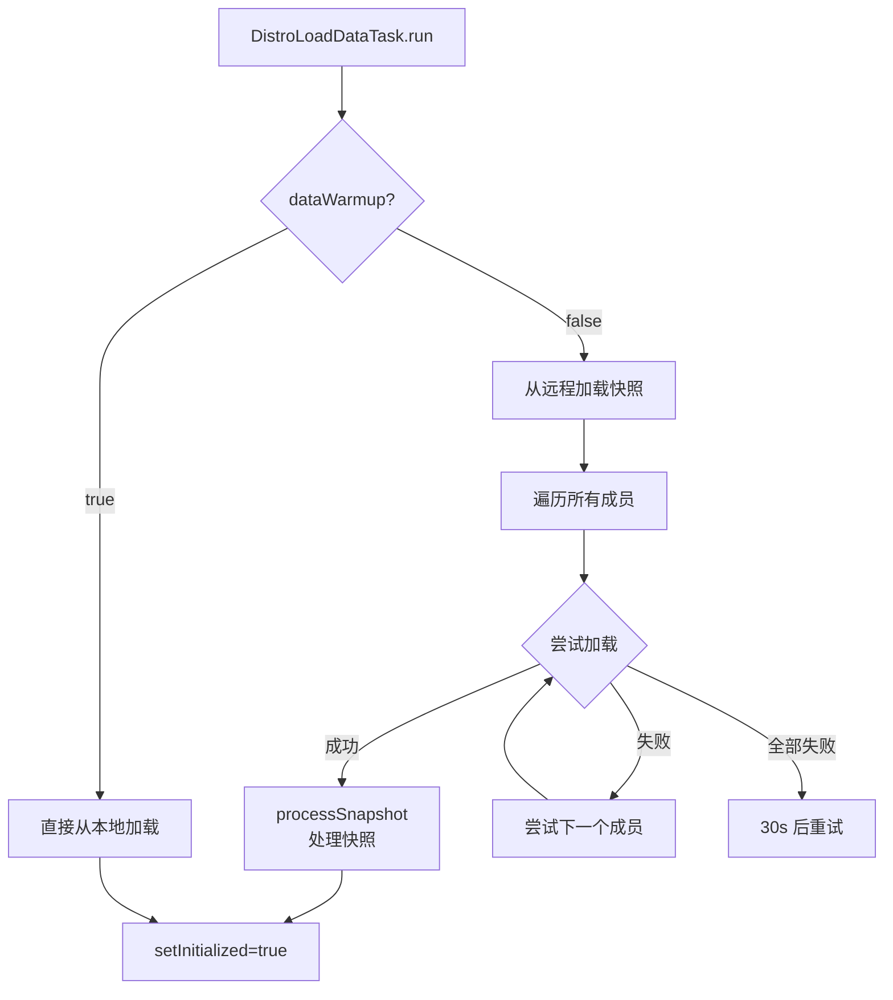

**源码核心逻辑**：
```java
public void run() {
    if (EnvUtil.getStandaloneMode() || globalConfig.isDataWarmup()) {
        loadFromLocal();
    } else {
        loadFromRemote();
    }
}

private void loadFromRemote() {
    for (String each : memberManager.allMembers()) {
        try {
            DistroData snapshot = transportAgent.getDatumSnapshot(each);
            if (snapshot != null) {
                distroProtocol.onSnapshot(snapshot);
                distroProtocol.setInitialized(true);
                return;
            }
        } catch (Exception e) {
            // 尝试下一个成员
        }
    }
    // 全部失败，30s 后重试
    GlobalExecutor.scheduleLoadDataTask(this, distroConfig.getLoadDataRetryDelayMillis());
}
```

---

## 五、HTTP Combined Key 批量同步机制（1.x 独有）

### 5.1 设计动机

1.4.8 使用 HTTP 同步，每次 HTTP 请求都有连接开销。若每个服务实例变更都触发一次 HTTP 请求，会导致：
- 大量小请求，连接数激增
- 网络带宽浪费

**解决方案**：将多个服务 key 合并到单个 HTTP 请求中批量同步。

### 5.2 核心类

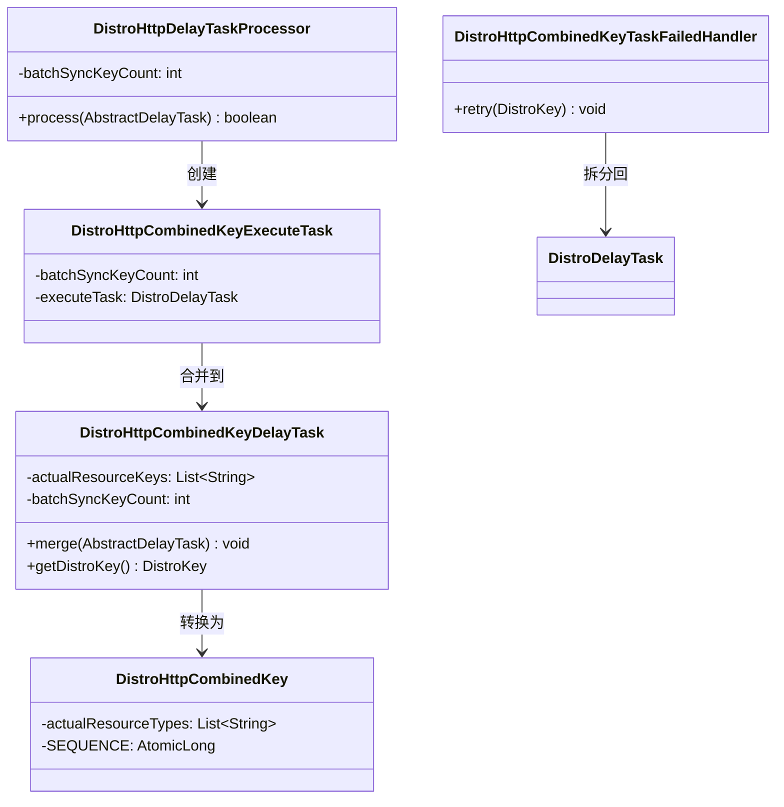

### 5.3 DistroHttpDelayTaskProcessor

**文件路径**：`naming/src/main/java/com/alibaba/nacos/naming/consistency/ephemeral/distro/combined/DistroHttpDelayTaskProcessor.java`

```java
public class DistroHttpDelayTaskProcessor implements NacosTaskProcessor {
    private final int batchSyncKeyCount;
    private final DistroTaskEngineHolder distroTaskEngineHolder;

    public DistroHttpDelayTaskProcessor(DistroTaskEngineHolder distroTaskEngineHolder,
            int batchSyncKeyCount) {
        this.distroTaskEngineHolder = distroTaskEngineHolder;
        this.batchSyncKeyCount = batchSyncKeyCount;
    }

    @Override
    public boolean process(AbstractDelayTask task) {
        DistroDelayTask distroDelayTask = (DistroDelayTask) task;
        // 创建批量执行任务
        DistroHttpCombinedKeyExecuteTask executeTask = new DistroHttpCombinedKeyExecuteTask(
            batchSyncKeyCount, distroDelayTask);
        // 投递到执行引擎
        distroTaskEngineHolder.getExecuteWorkersManager()
            .addTask(distroDelayTask.getDistroKey(), executeTask);
        return true;
    }
}
```

### 5.4 DistroHttpCombinedKeyExecuteTask

```java
public class DistroHttpCombinedKeyExecuteTask implements Runnable {
    @Override
    public void run() {
        DistroKey distroKey = distroDelayTask.getDistroKey();
        // 创建合并延迟任务，并添加到延迟引擎
        DistroHttpCombinedKeyDelayTask combinedTask = new DistroHttpCombinedKeyDelayTask(
            distroKey, distroDelayTask.getAction(), batchSyncKeyCount);
        combinedTask.getActualResourceKeys().add(distroKey.getResourceKey());
        // 重新放回延迟引擎，触发后续合并
        distroTaskEngineHolder.getDelayTaskExecuteEngine()
            .addTask(distroKey, combinedTask);
    }
}
```

### 5.5 DistroHttpCombinedKeyDelayTask

```java
public class DistroHttpCombinedKeyDelayTask extends DistroDelayTask {
    private List<String> actualResourceKeys = new ArrayList<>();
    private final int batchSyncKeyCount;

    @Override
    public void merge(AbstractDelayTask task) {
        DistroHttpCombinedKeyDelayTask newTask = (DistroHttpCombinedKeyDelayTask) task;
        // 合并 keys
        actualResourceKeys.addAll(newTask.getActualResourceKeys());
        // 达到批量阈值，立即触发执行
        if (actualResourceKeys.size() >= batchSyncKeyCount) {
            this.setAction(DistroConfig.Action.CHANGE);
            this.setLastProcessTime(System.currentTimeMillis());
        }
    }

    @Override
    public DistroKey getDistroKey() {
        DistroHttpCombinedKey combinedKey = new DistroHttpCombinedKey(
            distroKey.getResourceType(), distroKey.getTargetServer());
        combinedKey.getActualResourceTypes().addAll(actualResourceKeys);
        return combinedKey;
    }
}
```

### 5.6 批量同步流程

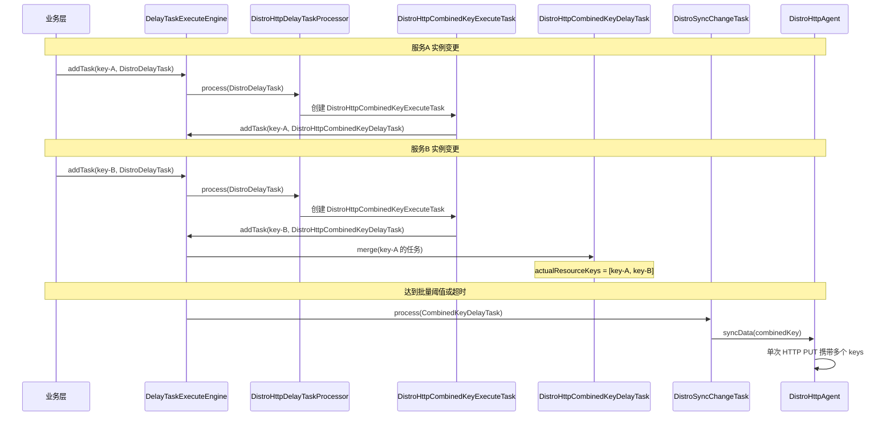

---

## 六、Naming 模块实现

### 6.1 DistroConsistencyServiceImpl —— 核心数据处理

**文件路径**：`naming/src/main/java/com/alibaba/nacos/naming/consistency/ephemeral/distro/DistroConsistencyServiceImpl.java`

这是 Naming 模块对 Distro 协议的核心实现，同时实现 `EphemeralConsistencyService` 和 `DistroDataProcessor` 两个接口。

```java
@Service
public class DistroConsistencyServiceImpl implements EphemeralConsistencyService, DistroDataProcessor {

    @Autowired
    private DistroProtocol distroProtocol;
    @Autowired
    private DataStore dataStore;
    @Autowired
    private DistroMapper distroMapper;

    private final Notifier notifier = new Notifier();

    @PostConstruct
    public void init() {
        GlobalExecutor.executeDistroNotifyTask(notifier);
    }

    // ===== EphemeralConsistencyService 接口实现 =====

    @Override
    public void put(String key, Record value) throws NacosException {
        onPut(key, value);
        // 同步到其他节点，延迟 = taskDispatchPeriod/2 = 1000ms
        distroProtocol.sync(
            new DistroKey(key, KeyBuilder.INSTANCE_LIST_KEY_PREFIX),
            DistroConfig.Action.CHANGE,
            globalConfig.getTaskDispatchPeriod() / 2);
    }

    @Override
    public void remove(String key) {
        onRemove(key);
        // 注意：1.4.8 不触发 distroProtocol.sync DELETE
        // 删除通过周期性 verify 对账来收敛
    }

    @Override
    public Datum get(String key) {
        return dataStore.get(key);
    }

    // ===== 本地数据处理 =====

    public void onPut(String key, Record value) {
        Datum datum = new Datum(key, value, System.currentTimeMillis());
        dataStore.put(key, datum);
        if (!listeners.containsKey(key)) {
            return;
        }
        notifier.addTask(key, DataOperation.CHANGE);
    }

    public void onRemove(String key) {
        dataStore.remove(key);
        if (!listeners.containsKey(key)) {
            return;
        }
        notifier.addTask(key, DataOperation.DELETE);
    }

    // ===== DistroDataProcessor 接口实现 =====

    @Override
    public String processType() {
        return KeyBuilder.INSTANCE_LIST_KEY_PREFIX;
    }

    @Override
    public boolean processData(DistroData distroData) {
        // DistroHttpData 已由 Spring MVC 反序列化
        DistroHttpData httpData = (DistroHttpData) distroData;
        Map<String, Datum<Instances>> datumMap = httpData.getDeserializedContent();
        for (Map.Entry<String, Datum<Instances>> entry : datumMap.entrySet()) {
            // 仅处理本节点不负责的（避免循环）
            if (!distroMapper.responsible(entry.getKey())) {
                onPut(entry.getKey(), entry.getValue().value);
            }
        }
        return true;
    }

    @Override
    public boolean processVerifyData(DistroData distroData) {
        DistroHttpData httpData = (DistroHttpData) distroData;
        Map<String, String> checksumMap = httpData.getDeserializedContent();
        onReceiveChecksums(checksumMap, distroData.getDistroKey().getTargetServer());
        return true;
    }

    @Override
    public boolean processSnapshot(DistroData distroData) {
        // 反序列化整个快照
        Map<String, Datum<Instances>> datumMap = ...;
        for (Map.Entry<String, Datum<Instances>> entry : datumMap.entrySet()) {
            dataStore.put(entry.getKey(), entry.getValue());
            if (listeners.containsKey(entry.getKey())) {
                notifier.addTask(entry.getKey(), DataOperation.CHANGE);
            }
        }
        return true;
    }

    // ===== Checksum 校验逻辑 =====

    public void onReceiveChecksums(Map<String, String> checksumMap, String server) {
        List<String> toUpdateKeys = new ArrayList<>();
        List<String> toRemoveKeys = new ArrayList<>();

        for (Map.Entry<String, String> entry : checksumMap.entrySet()) {
            String key = entry.getKey();
            String remoteChecksum = entry.getValue();
            Datum localDatum = dataStore.get(key);

            if (localDatum == null) {
                // 本地无数据，需要拉取
                toUpdateKeys.add(key);
            } else {
                String localChecksum = localDatum.value.checksum();
                if (!localChecksum.equals(remoteChecksum)) {
                    // checksum 不一致，需要拉取
                    toUpdateKeys.add(key);
                }
            }
        }

        // 检查本地多出的数据（远端没有的）
        for (String localKey : dataStore.keys()) {
            if (!checksumMap.containsKey(localKey)) {
                toRemoveKeys.add(localKey);
            }
        }

        // 拉取不一致的数据
        if (!toUpdateKeys.isEmpty()) {
            DistroKey distroKey = new DistroKey(server, KeyBuilder.INSTANCE_LIST_KEY_PREFIX);
            DistroData remoteData = distroProtocol.queryFromRemote(distroKey, toUpdateKeys);
            if (remoteData != null) {
                processData(remoteData);
            }
        }
    }
}
```

### 6.2 Notifier —— 监听器通知模式

```java
public class Notifier implements Runnable {
    private ConcurrentHashMap<String, String> services = new ConcurrentHashMap<>(10 * 1024);
    private BlockingQueue<Pair<String, DataOperation>> tasks = new LinkedBlockingQueue<>(10 * 1024);

    public void addTask(String key, DataOperation action) {
        if (services.containsKey(key)) {
            return;
        }
        services.put(key, StringUtils.EMPTY);
        tasks.offer(Pair.with(key, action));
    }

    @Override
    public void run() {
        while (true) {
            try {
                Pair<String, DataOperation> pair = tasks.take();
                String key = pair.getValue0();
                DataOperation action = pair.getValue1();
                services.remove(key);

                // 通知所有监听器
                for (RecordListener listener : listeners.get(key)) {
                    if (action == DataOperation.CHANGE) {
                        listener.onChange(key, dataStore.get(key).value);
                    } else if (action == DataOperation.DELETE) {
                        listener.onDelete(key);
                    }
                }
            } catch (Exception e) {
                // 异常处理
            }
        }
    }
}
```

**特点**：
- **单线程消费**：`BlockingQueue` 保证顺序性，避免并发通知监听器
- **去重机制**：`services` Map 用于去重，避免同一 key 大量任务堆积
- **CHANGE/DELETE 双操作**：分别触发 `onChange` 和 `onDelete`

### 6.3 DistroMapper —— 路由映射

**文件路径**：`naming/src/main/java/com/alibaba/nacos/naming/core/DistroMapper.java`

```java
@Component
public class DistroMapper extends MemberChangeListener {
    private volatile List<String> healthyList = new ArrayList<>();

    // 判断本节点是否负责该服务
    public boolean responsible(String serviceName) {
        final List<String> servers = healthyList;
        if (!switchDomain.isDistroEnabled() || EnvUtil.getStandaloneMode()) {
            return true;
        }
        if (CollectionUtils.isEmpty(servers)) {
            return false;
        }
        String localAddress = EnvUtil.getLocalAddress();
        int index = servers.indexOf(localAddress);
        int lastIndex = servers.lastIndexOf(localAddress);
        if (lastIndex < 0 || index < 0) {
            return true;
        }
        int target = distroHash(serviceName) % servers.size();
        return target >= index && target <= lastIndex;
    }

    // 计算服务归属节点
    public String mapSrv(String serviceName) {
        final List<String> servers = healthyList;
        if (CollectionUtils.isEmpty(servers) || !switchDomain.isDistroEnabled()) {
            return EnvUtil.getLocalAddress();
        }
        try {
            int index = distroHash(serviceName) % servers.size();
            return servers.get(index);
        } catch (Throwable e) {
            return EnvUtil.getLocalAddress();
        }
    }

    private int distroHash(String serviceName) {
        return Math.abs(serviceName.hashCode() % Integer.MAX_VALUE);
    }

    @Override
    public void onEvent(MembersChangeEvent event) {
        // 关键：必须排序，保证所有节点列表顺序一致
        List<String> list = MemberUtil.simpleMembers(...);
        Collections.sort(list);
        healthyList = Collections.unmodifiableList(list);
    }
}
```

**关键设计**：
1. **简单 hash 取模**：`Math.abs(serviceName.hashCode()) % servers.size()`，无一致性哈希
2. **列表必须排序**：`Collections.sort(list)` 保证所有节点看到的 server 顺序一致，从而 hash 结果一致
3. **本节点负责判断**：通过 `indexOf` 和 `lastIndexOf` 计算本节点在列表中的范围

### 6.4 DistroDataStorageImpl —— 数据存储与快照

**文件路径**：`naming/src/main/java/com/alibaba/nacos/naming/consistency/ephemeral/distro/component/DistroDataStorageImpl.java`

```java
public class DistroDataStorageImpl implements DistroDataStorage {

    @Override
    public DistroData getDistroData(DistroKey distroKey) {
        // 支持批量 key 获取
        if (distroKey instanceof DistroHttpCombinedKey) {
            DistroHttpCombinedKey combinedKey = (DistroHttpCombinedKey) distroKey;
            List<String> keys = new ArrayList<>(combinedKey.getActualResourceTypes());
            Map<String, Datum> datumMap = dataStore.batchGet(keys);
            byte[] data = JacksonUtils.toJsonBytes(datumMap);
            return new DistroData(distroKey, data);
        }
        // 单 key 获取
        Datum datum = dataStore.get(distroKey.getResourceKey());
        if (null == datum) {
            return null;
        }
        byte[] data = JacksonUtils.toJsonBytes(datum);
        return new DistroData(distroKey, data);
    }

    @Override
    public DistroData getVerifyData(Member member) {
        Map<String, String> checksumMap = new HashMap<>(128);
        // 仅收集本节点负责的服务的 checksum
        for (String key : dataStore.keys()) {
            if (distroMapper.responsible(key)) {
                Datum datum = dataStore.get(key);
                if (datum != null) {
                    checksumMap.put(key, datum.value.checksum());
                }
            }
        }
        return new DistroData(new DistroKey(member.getAddress(),
            KeyBuilder.INSTANCE_LIST_KEY_PREFIX), JacksonUtils.toJsonBytes(checksumMap));
    }

    @Override
    public DistroData getDatumSnapshot() {
        // 序列化整个 dataStore
        Map<String, Datum> map = new HashMap<>(dataStore.getMap());
        byte[] data = JacksonUtils.toJsonBytes(map);
        return new DistroData(new DistroKey("snapshot",
            KeyBuilder.INSTANCE_LIST_KEY_PREFIX), data);
    }
}
```

**重要细节**：
- `getVerifyData()` 只发送**本节点负责的服务的 checksum**，避免全量校验造成网络压力
- `getDistroData()` 区分 CombinedKey 和普通 key，前者批量返回，后者单个返回

### 6.5 DistroHttpAgent —— HTTP 传输代理

**文件路径**：`naming/src/main/java/com/alibaba/nacos/naming/consistency/ephemeral/distro/component/DistroHttpAgent.java`

```java
public class DistroHttpAgent implements DistroTransportAgent {

    @Override
    public boolean syncData(DistroData data, String targetServer) {
        if (!memberManager.hasMember(targetServer)) {
            return true;
        }
        byte[] dataContent = data.getContent();
        return NamingProxy.syncData(dataContent, data.getDistroKey().getTargetServer());
    }

    @Override
    public boolean syncVerifyData(DistroData verifyData, String targetServer) {
        if (!memberManager.hasMember(targetServer)) {
            return true;
        }
        NamingProxy.syncCheckSums(verifyData.getContent(), targetServer);
        return true;
    }

    @Override
    public DistroData getData(DistroKey key, String targetServer) {
        List<String> toUpdateKeys = null;
        if (key instanceof DistroHttpCombinedKey) {
            toUpdateKeys = ((DistroHttpCombinedKey) key).getActualResourceTypes();
        } else {
            toUpdateKeys = new ArrayList<>(1);
            toUpdateKeys.add(key.getResourceKey());
        }
        byte[] queriedData = NamingProxy.getData(toUpdateKeys, key.getTargetServer());
        return new DistroData(key, queriedData);
    }

    @Override
    public DistroData getDatumSnapshot(String targetServer) {
        byte[] allDatum = NamingProxy.getAllData(targetServer);
        return new DistroData(new DistroKey("snapshot",
            KeyBuilder.INSTANCE_LIST_KEY_PREFIX), allDatum);
    }

    // 回调方法为空实现（1.4.8 不支持回调）
    @Override
    public void syncData(DistroData data, String targetServer, DistroCallback callback) {}

    @Override
    public void syncVerifyData(DistroData verifyData, String targetServer, DistroCallback callback) {}
}
```

### 6.6 NamingProxy —— HTTP 客户端

**文件路径**：`naming/src/main/java/com/alibaba/nacos/naming/misc/NamingProxy.java`

```java
public class NamingProxy {
    private static final String DATA_ON_SYNC_URL = "/distro/datum";
    private static final String DATA_GET_URL = "/distro/datum";
    private static final String ALL_DATA_GET_URL = "/distro/datums";
    private static final String TIMESTAMP_SYNC_URL = "/distro/checksum";

    // 同步数据：HTTP PUT
    public static boolean syncData(byte[] data, String curServer) {
        Map<String, String> headers = new HashMap<>(128);
        headers.put(HttpHeaderConsts.CLIENT_VERSION_HEADER, VersionUtils.version);
        headers.put(HttpHeaderConsts.USER_AGENT_HEADER, UtilsAndCommons.SERVER_VERSION);
        headers.put(HttpHeaderConsts.ACCEPT_ENCODING, "gzip,deflate,sdch");
        headers.put(HttpHeaderConsts.CONNECTION, "Keep-Alive");
        headers.put(HttpHeaderConsts.CONTENT_ENCODING, "gzip");  // gzip 压缩

        RestResult<String> result = HttpClient.httpPutLarge(
            "http://" + curServer + EnvUtil.getContextPath()
                + UtilsAndCommons.NACOS_NAMING_CONTEXT + DATA_ON_SYNC_URL,
            headers, data);
        if (result.ok()) {
            return true;
        }
        if (HttpURLConnection.HTTP_NOT_MODIFIED == result.getCode()) {
            return true;  // 304 视为成功
        }
        throw new IOException("failed to req API:... code:" + result.getCode());
    }

    // 同步 checksum：异步 HTTP PUT
    public static void syncCheckSums(byte[] checksums, String server) {
        Map<String, String> headers = new HashMap<>(128);
        headers.put(HttpHeaderConsts.CLIENT_VERSION_HEADER, VersionUtils.version);
        headers.put(HttpHeaderConsts.USER_AGENT_HEADER, UtilsAndCommons.SERVER_VERSION);
        headers.put(HttpHeaderConsts.CONNECTION, "Keep-Alive");

        HttpClient.asyncHttpPutLarge(
            "http://" + server + EnvUtil.getContextPath()
                + UtilsAndCommons.NACOS_NAMING_CONTEXT + TIMESTAMP_SYNC_URL
                + "?source=" + NetUtils.localServer(),
            headers, checksums, new Callback<String>() {
                @Override
                public void onReceive(RestResult<String> result) {
                    if (!result.ok()) {
                        Loggers.DISTRO.error("failed to req API:...");
                    }
                }
                @Override
                public void onError(Throwable throwable) {
                    Loggers.DISTRO.error("failed to req API:...");
                }
                @Override
                public void onCancel() {}
            });
    }

    // 获取数据：HTTP GET
    public static byte[] getData(List<String> keys, String server) throws Exception {
        Map<String, String> params = new HashMap<>(8);
        params.put("keys", StringUtils.join(keys, ","));
        RestResult<String> result = HttpClient.httpGetLarge(
            "http://" + server + EnvUtil.getContextPath()
                + UtilsAndCommons.NACOS_NAMING_CONTEXT + DATA_GET_URL,
            new HashMap<>(8), JacksonUtils.toJson(params));
        if (result.ok()) {
            return result.getData().getBytes();
        }
        throw new IOException("failed to req API:... code:" + result.getCode());
    }

    // 获取全量数据：HTTP GET
    public static byte[] getAllData(String server) throws Exception {
        Map<String, String> params = new HashMap<>(8);
        RestResult<String> result = HttpClient.httpGet(
            "http://" + server + EnvUtil.getContextPath()
                + UtilsAndCommons.NACOS_NAMING_CONTEXT + ALL_DATA_GET_URL,
            new ArrayList<>(), params);
        if (result.ok()) {
            return result.getData().getBytes();
        }
        throw new IOException("failed to req API:... code:" + result.getCode());
    }
}
```

**HTTP 端点映射**：

| 操作 | HTTP 方法 | URL 路径 | 数据载体 |
|------|-----------|----------|----------|
| 同步数据 | PUT | `/distro/datum` | RequestBody（gzip 压缩） |
| 同步校验和 | PUT | `/distro/checksum?source=xxx` | RequestBody |
| 拉取数据 | GET | `/distro/datum` | Body: `{"keys":"key1,key2"}` |
| 全量快照 | GET | `/distro/datums` | 无 |

### 6.7 DistroController —— HTTP 端点

**文件路径**：`naming/src/main/java/com/alibaba/nacos/naming/controllers/DistroController.java`

```java
@RestController
@RequestMapping(UtilsAndCommons.NACOS_NAMING_CONTEXT + "/distro")
public class DistroController {

    @Autowired
    private DistroProtocol distroProtocol;
    @Autowired
    private ServiceManager serviceManager;
    @Autowired
    private SwitchDomain switchDomain;

    // 接收数据同步
    @PutMapping("/datum")
    public ResponseEntity onSyncDatum(@RequestBody Map<String, Datum<Instances>> dataMap)
            throws Exception {
        if (dataMap.isEmpty()) {
            throw new NacosException(NacosException.INVALID_PARAM, "receive empty entity!");
        }
        for (Map.Entry<String, Datum<Instances>> entry : dataMap.entrySet()) {
            if (KeyBuilder.matchEphemeralInstanceListKey(entry.getKey())) {
                String namespaceId = KeyBuilder.getNamespace(entry.getKey());
                String serviceName = KeyBuilder.getServiceName(entry.getKey());
                // 若服务不存在且默认临时，则创建空服务
                if (!serviceManager.containService(namespaceId, serviceName)
                        && switchDomain.isDefaultInstanceEphemeral()) {
                    serviceManager.createEmptyService(namespaceId, serviceName, true);
                }
                DistroHttpData distroHttpData = new DistroHttpData(
                    createDistroKey(entry.getKey()), entry.getValue());
                distroProtocol.onReceive(distroHttpData);
            }
        }
        return ResponseEntity.ok("ok");
    }

    // 接收校验和
    @PutMapping("/checksum")
    public ResponseEntity syncChecksum(@RequestParam String source,
            @RequestBody Map<String, String> dataMap) {
        DistroHttpData distroHttpData = new DistroHttpData(createDistroKey(source), dataMap);
        distroProtocol.onVerify(distroHttpData);
        return ResponseEntity.ok("ok");
    }

    // 查询数据
    @GetMapping("/datum")
    public ResponseEntity get(@RequestBody String body) throws Exception {
        JsonNode bodyNode = JacksonUtils.toObj(body);
        String keys = bodyNode.get("keys").asText();
        DistroHttpCombinedKey distroKey = new DistroHttpCombinedKey(
            KeyBuilder.INSTANCE_LIST_KEY_PREFIX, "");
        for (String key : keys.split(",")) {
            distroKey.getActualResourceTypes().add(key);
        }
        DistroData distroData = distroProtocol.onQuery(distroKey);
        return ResponseEntity.ok(distroData.getContent());
    }

    // 全量快照
    @GetMapping("/datums")
    public ResponseEntity getAllDatums() {
        DistroData distroData = distroProtocol.onSnapshot(KeyBuilder.INSTANCE_LIST_KEY_PREFIX);
        return ResponseEntity.ok(distroData.getContent());
    }
}
```

### 6.8 DistroHttpRegistry —— 注册中心

**文件路径**：`naming/src/main/java/com/alibaba/nacos/naming/consistency/ephemeral/distro/DistroHttpRegistry.java`

```java
@Component
public class DistroHttpRegistry implements DistroRegistry {

    @Autowired
    private DistroProtocol distroProtocol;
    @Autowired
    private DistroComponentHolder componentHolder;
    @Autowired
    private DistroTaskEngineHolder taskEngineHolder;
    @Autowired
    private GlobalConfig globalConfig;
    @Autowired
    private ServerMemberManager memberManager;
    @Autowired
    private DataStore dataStore;
    @Autowired
    private DistroMapper distroMapper;

    @PostConstruct
    public void doRegister() {
        // 1. 注册 DistroDataStorage
        DistroDataStorageImpl dataStorage = new DistroDataStorageImpl(
            dataStore, distroMapper);
        componentHolder.registerDataStorage(KeyBuilder.INSTANCE_LIST_KEY_PREFIX, dataStorage);

        // 2. 注册 DistroTransportAgent
        DistroHttpAgent transportAgent = new DistroHttpAgent(memberManager);
        componentHolder.registerTransportAgent(KeyBuilder.INSTANCE_LIST_KEY_PREFIX, transportAgent);

        // 3. 注册 FailedTaskHandler
        DistroHttpCombinedKeyTaskFailedHandler handler =
            new DistroHttpCombinedKeyTaskFailedHandler(taskEngineHolder);
        componentHolder.registerFailedTaskHandler(
            KeyBuilder.INSTANCE_LIST_KEY_PREFIX, handler);

        // 4. 注册 DelayTaskProcessor（批量处理）
        DistroHttpDelayTaskProcessor processor = new DistroHttpDelayTaskProcessor(
            taskEngineHolder, globalConfig.getBatchSyncKeyCount());
        taskEngineHolder.registerNacosTaskProcessor(
            KeyBuilder.INSTANCE_LIST_KEY_PREFIX, processor);
    }
}
```

**注册的四类组件**：

| 组件 | 实现类 | 职责 |
|------|--------|------|
| DataStorage | DistroDataStorageImpl | 提供数据查询、checksum、快照 |
| TransportAgent | DistroHttpAgent | HTTP 传输 |
| FailedTaskHandler | DistroHttpCombinedKeyTaskFailedHandler | 失败重试（拆分回单 key） |
| DelayTaskProcessor | DistroHttpDelayTaskProcessor | 延迟任务批量处理 |

### 6.9 FailedTaskHandler —— 失败重试

```java
public class DistroHttpCombinedKeyTaskFailedHandler implements DistroFailedTaskHandler {
    @Override
    public void retry(DistroKey distroKey) {
        if (distroKey instanceof DistroHttpCombinedKey) {
            // 批量失败，拆分回单个 key 重新放入延迟引擎
            DistroHttpCombinedKey combinedKey = (DistroHttpCombinedKey) distroKey;
            for (String each : combinedKey.getActualResourceTypes()) {
                DistroKey newKey = new DistroKey(each, distroKey.getResourceType(),
                    distroKey.getTargetServer());
                DistroDelayTask delayTask = new DistroDelayTask(newKey,
                    DistroConfig.Action.CHANGE, 0L);
                distroTaskEngineHolder.getDelayTaskExecuteEngine().addTask(newKey, delayTask);
            }
            return;
        }
        // 单 key 失败，直接重新加入延迟引擎
        DistroDelayTask delayTask = new DistroDelayTask(distroKey,
            DistroConfig.Action.CHANGE, 0L);
        distroTaskEngineHolder.getDelayTaskExecuteEngine().addTask(distroKey, delayTask);
    }
}
```

**设计意图**：批量同步失败时，将合并的 keys **拆分回单 key** 重新进入延迟引擎，避免单次大请求反复失败，让它们各自独立重试。

---

## 七、核心流程详解

### 7.1 数据变更同步流程

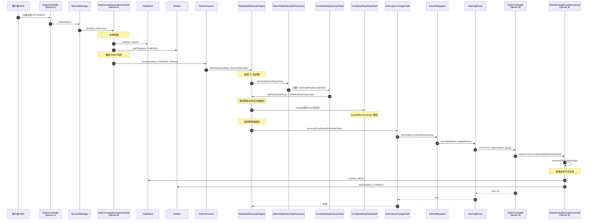

### 7.2 周期性校验流程

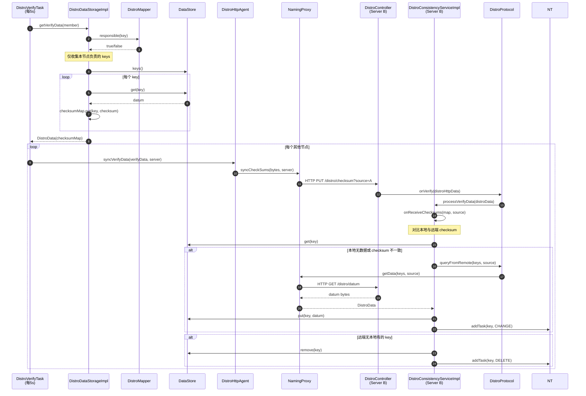

### 7.3 启动加载流程

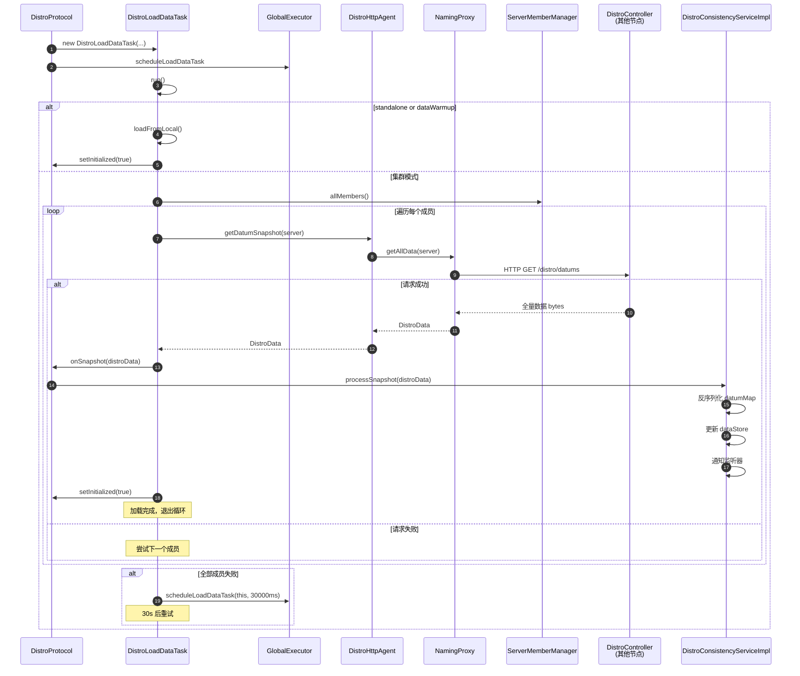

### 7.4 客户端注册触发 Distro 同步完整链路

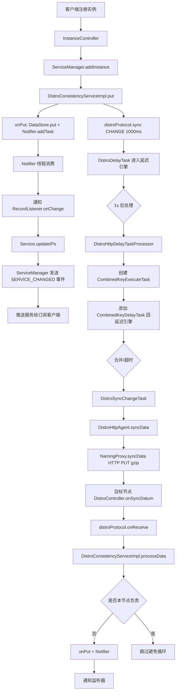

---

## 八、Distro 协议整体架构组件关系

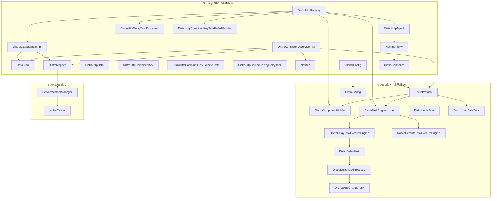

---

## 九、关键设计总结

### 9.1 1.4.8 Distro 协议设计特点

| 设计点 | 实现方式 | 优点 | 局限 |
|--------|----------|------|------|
| **传输** | HTTP + gzip | 简单通用、易调试 | 性能不如 gRPC |
| **批量同步** | Combined Key 合并 | 减少 HTTP 请求次数 | 实现复杂、失败拆分 |
| **校验机制** | checksum 字符串对比 | 简单直观 | 无版本号、无法增量同步 |
| **路由算法** | hash 取模 + 排序列表 | 简单 | 节点变更时全量 rehash |
| **任务合并** | 延迟引擎 merge | 减少 redundant 同步 | 单线程消费可能瓶颈 |
| **监听器通知** | BlockingQueue 单线程 | 顺序保证 | 单点性能瓶颈 |
| **数据存储** | ConcurrentHashMap | 简单高效 | 无持久化、无索引 |
| **失败处理** | 拆分回单 key 重试 | 降低失败影响范围 | 可能产生大量小请求 |

### 9.2 数据一致性保证

1. **最终一致性来源**：
   - 写入路径：本地写立即通知监听器，异步同步到其他节点
   - 校验路径：每 5s 周期校验 checksum，不一致则拉取
   - 启动路径：从其他节点加载全量快照

2. **冲突解决**：
   - 同一服务由单一节点负责（DistroMapper 路由）
   - 非负责节点收到数据后，仅当 `!distroMapper.responsible(key)` 时才接收
   - 避免双向同步导致数据回环

3. **故障容错**：
   - 节点故障：其他节点检测到后从 healthyList 移除，rehash 后接管其负责的服务
   - 网络分区：最终一致性，分区恢复后通过 verify 对账收敛
   - 数据丢失：临时数据不持久化，节点重启后从其他节点加载

### 9.3 1.4.8 与 2.x 的核心差异对比

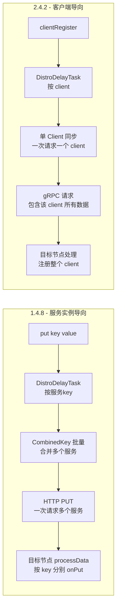

| 维度 | 1.4.8 | 2.4.2 |
|------|-------|-------|
| **同步粒度** | 服务（Service） | 客户端（Client） |
| **批量策略** | Combined Key 合并多个服务 | 单 client 一次同步 |
| **传输方式** | HTTP + gzip | gRPC 双向流 |
| **校验方式** | checksum 字符串 | numeric revision |
| **DELETE 处理** | 不通过 Distro 同步，靠 verify 对账 | 通过 DistroDelayTaskProcessor 处理 |
| **回调支持** | 无（同步阻塞） | 有 DistroCallback |
| **客户端断连** | 心跳超时移除 | ClientDisconnectEvent 触发 |
| **资源类型** | 仅 INSTANCE_LIST | 多种（Instance、Metadata 等） |

### 9.4 性能优化点

1. **延迟任务合并**：`taskDispatchPeriod/2 = 1000ms` 延迟，让短时间多次变更合并为一次同步
2. **Combined Key 批量**：`batchSyncKeyCount=1000`，最多 1000 个服务 key 合并为一次 HTTP 请求
3. **gzip 压缩**：HTTP body 使用 gzip 压缩，减少网络带宽
4. **异步 checksum**：`syncCheckSums` 使用异步 HTTP，不阻塞主流程
5. **只同步负责的数据**：`getVerifyData` 仅发送本节点负责的服务的 checksum，减少校验数据量
6. **Keep-Alive**：HTTP 头部设置 `Connection: Keep-Alive`，复用连接

### 9.5 潜在问题与改进方向

1. **HTTP 性能瓶颈**：高规模集群下 HTTP 连接开销大，2.x 改用 gRPC 解决
2. **无 DELETE 同步**：依赖 verify 对账，删除延迟可能较高
3. **单点 Notifier**：单线程消费，高并发下可能成为瓶颈
4. **hash 取模 rehash**：节点变更时全量 rehash，导致大量数据迁移
5. **无持久化**：临时数据仅内存，节点重启依赖全量加载

---

## 十、附录：核心源码文件索引

### Core 模块

| 文件 | 作用 |
|------|------|
| `core/src/main/java/com/alibaba/nacos/core/distributed/distro/DistroProtocol.java` | Distro 入口协调器 |
| `core/src/main/java/com/alibaba/nacos/core/distributed/distro/DistroConfig.java` | Distro 协议配置 |
| `core/src/main/java/com/alibaba/nacos/core/distributed/distro/DistroComponentHolder.java` | 组件持有器 |
| `core/src/main/java/com/alibaba/nacos/core/distributed/distro/task/DistroTaskEngineHolder.java` | 任务引擎持有器 |
| `core/src/main/java/com/alibaba/nacos/core/distributed/distro/task/delay/DistroDelayTask.java` | 延迟任务 |
| `core/src/main/java/com/alibaba/nacos/core/distributed/distro/task/delay/DistroDelayTaskProcessor.java` | 默认任务处理器 |
| `core/src/main/java/com/alibaba/nacos/core/distributed/distro/task/execute/DistroSyncChangeTask.java` | 同步变更任务 |
| `core/src/main/java/com/alibaba/nacos/core/distributed/distro/task/verify/DistroVerifyTask.java` | 周期校验任务 |
| `core/src/main/java/com/alibaba/nacos/core/distributed/distro/task/load/DistroLoadDataTask.java` | 启动加载任务 |

### Naming 模块

| 文件 | 作用 |
|------|------|
| `naming/src/main/java/com/alibaba/nacos/naming/consistency/ephemeral/distro/DistroConsistencyServiceImpl.java` | 核心数据处理实现 |
| `naming/src/main/java/com/alibaba/nacos/naming/consistency/ephemeral/distro/DataStore.java` | 内存数据存储 |
| `naming/src/main/java/com/alibaba/nacos/naming/consistency/ephemeral/distro/DistroHttpRegistry.java` | 组件注册中心 |
| `naming/src/main/java/com/alibaba/nacos/naming/consistency/ephemeral/distro/DistroHttpData.java` | HTTP 数据载体 |
| `naming/src/main/java/com/alibaba/nacos/naming/consistency/ephemeral/distro/component/DistroHttpAgent.java` | HTTP 传输代理 |
| `naming/src/main/java/com/alibaba/nacos/naming/consistency/ephemeral/distro/component/DistroDataStorageImpl.java` | 数据存储实现 |
| `naming/src/main/java/com/alibaba/nacos/naming/consistency/ephemeral/distro/combined/DistroHttpCombinedKey.java` | 合并键 |
| `naming/src/main/java/com/alibaba/nacos/naming/consistency/ephemeral/distro/combined/DistroHttpDelayTaskProcessor.java` | 批量处理器 |
| `naming/src/main/java/com/alibaba/nacos/naming/consistency/ephemeral/distro/combined/DistroHttpCombinedKeyExecuteTask.java` | 批量执行任务 |
| `naming/src/main/java/com/alibaba/nacos/naming/consistency/ephemeral/distro/combined/DistroHttpCombinedKeyDelayTask.java` | 批量延迟任务 |
| `naming/src/main/java/com/alibaba/nacos/naming/consistency/ephemeral/distro/combined/DistroHttpCombinedKeyTaskFailedHandler.java` | 失败处理器 |
| `naming/src/main/java/com/alibaba/nacos/naming/core/DistroMapper.java` | 路由映射器 |
| `naming/src/main/java/com/alibaba/nacos/naming/misc/NamingProxy.java` | HTTP 客户端 |
| `naming/src/main/java/com/alibaba/nacos/naming/misc/GlobalConfig.java` | Naming 配置覆盖 |
| `naming/src/main/java/com/alibaba/nacos/naming/controllers/DistroController.java` | HTTP 端点控制器 |
| `naming/src/main/java/com/alibaba/nacos/naming/consistency/Datum.java` | 数据单元 |
| `naming/src/main/java/com/alibaba/nacos/naming/consistency/KeyBuilder.java` | 键构建器 |

---

**文档版本**：基于 Nacos 1.4.8（分支 `develop-1.4.8`）源码分析
**最后更新**：2026-07-06
