# Nacos 1.4.8 CP 一致性 JRaft 协议实现原理源码分析

> 基于 Nacos 1.4.8 源码（分支 `develop-1.4.8`）深入分析 CP 一致性协议的设计与实现

## 一、概述

### 1.1 Nacos 1.4.8 CP 协议的特殊性

Nacos 1.4.8 的 CP（Consistency Protocol）实现具有**双实现并存**的特殊架构：

- **旧实现**：`RaftConsistencyServiceImpl` —— 基于 HTTP 的自研 Raft 协议（自 1.0 起沿用）
- **新实现**：`PersistentServiceProcessor` —— 基于 SOFA-JRaft 框架的工业级 Raft 实现

两套实现通过 `ClusterVersionJudgement` 动态切换，目的是**支持集群滚动升级时的版本兼容**。

### 1.2 适用场景

CP 协议仅处理 **持久化数据（Persistent Data）**：
- 持久化服务实例（`ephemeral=false`）
- 服务元数据（Service Metadata）
- SwitchDomain（开关域配置）

**不处理临时数据**，临时数据由 Distro（AP）协议处理。

### 1.3 双实现架构总览

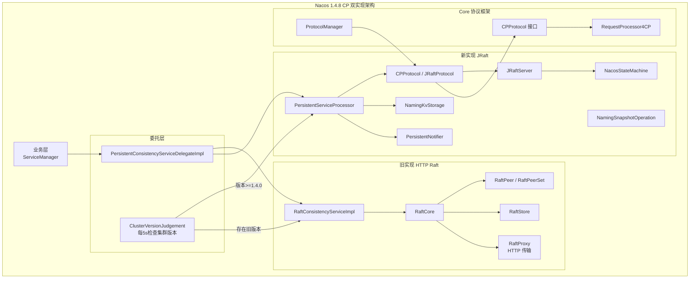
```mermaid
graph TB
    subgraph "Nacos 1.4.8 CP 双实现架构"
        BIZ[业务层<br/>ServiceManager]

        subgraph "委托层"
            DELEGATE[PersistentConsistencyServiceDelegateImpl]
            CVJ[ClusterVersionJudgement<br/>每5s检查集群版本]
        end

        subgraph "旧实现 HTTP Raft"
            OLD[RaftConsistencyServiceImpl]
            RC[RaftCore]
            RP[RaftPeer / RaftPeerSet]
            RS[RaftStore]
            RProxy[RaftProxy<br/>HTTP 传输]
        end

        subgraph "新实现 JRaft"
            NEW[PersistentServiceProcessor]
            CP[CPProtocol / JRaftProtocol]
            JRS[JRaftServer]
            NSM[NacosStateMachine]
            NKV[NamingKvStorage]
            NSO[NamingSnapshotOperation]
            PNOT[PersistentNotifier]
        end

        subgraph "Core 协议框架"
            PM[ProtocolManager]
            CPP[CPProtocol 接口]
            RP4[RequestProcessor4CP]
        end

        BIZ --> DELEGATE
        CVJ -->|版本>=1.4.0| NEW
        CVJ -->|存在旧版本| OLD
        DELEGATE --> OLD
        DELEGATE --> NEW
        OLD --> RC
        RC --> RP
        RC --> RS
        RC --> RProxy
        NEW --> CP
        CP --> JRS
        JRS --> NSM
        NEW --> NKV
        NEW --> PNOT
        PM --> CP
        CP --> CPP
        CPP --> RP4
    end
```

### 1.4 切换机制

`PersistentConsistencyServiceDelegateImpl` 是委托入口：

```java
@Component("persistentConsistencyServiceDelegate")
public class PersistentConsistencyServiceDelegateImpl implements PersistentConsistencyService {

    private final ClusterVersionJudgement versionJudgement;
    private final RaftConsistencyServiceImpl oldPersistentConsistencyService;
    private final BasePersistentServiceProcessor newPersistentConsistencyService;
    private volatile boolean switchNewPersistentService = false;

    public PersistentConsistencyServiceDelegateImpl(ClusterVersionJudgement versionJudgement,
            RaftConsistencyServiceImpl oldPersistentConsistencyService, ProtocolManager protocolManager)
            throws Exception {
        this.versionJudgement = versionJudgement;
        this.oldPersistentConsistencyService = oldPersistentConsistencyService;
        this.newPersistentConsistencyService = createNewPersistentServiceProcessor(protocolManager, versionJudgement);
        init();
    }

    private void init() {
        // 注册版本观察者，当所有节点 >= 1.4.0 时切换到新实现
        this.versionJudgement.registerObserver(isAllNewVersion ->
            switchNewPersistentService = isAllNewVersion, -1);
    }

    private PersistentConsistencyService switchOne() {
        return switchNewPersistentService ? newPersistentConsistencyService : oldPersistentConsistencyService;
    }
}
```

**`ClusterVersionJudgement` 判断逻辑**：

```java
@Component
public class ClusterVersionJudgement {
    private volatile boolean allMemberIsNewVersion = false;

    protected void judge() {
        Collection<Member> members = memberManager.allMembers();
        final String oldVersion = "1.4.0";
        boolean allMemberIsNewVersion = true;
        for (Member member : members) {
            final String curV = (String) member.getExtendVal(MemberMetaDataConstants.VERSION);
            if (StringUtils.isBlank(curV) || VersionUtils.compareVersion(oldVersion, curV) > 0) {
                allMemberIsNewVersion = false;  // 存在旧版本节点
            }
        }
        if (allMemberIsNewVersion && !this.allMemberIsNewVersion) {
            notifyAllListener();  // 触发切换
        }
    }
}
```

**切换时序图**：

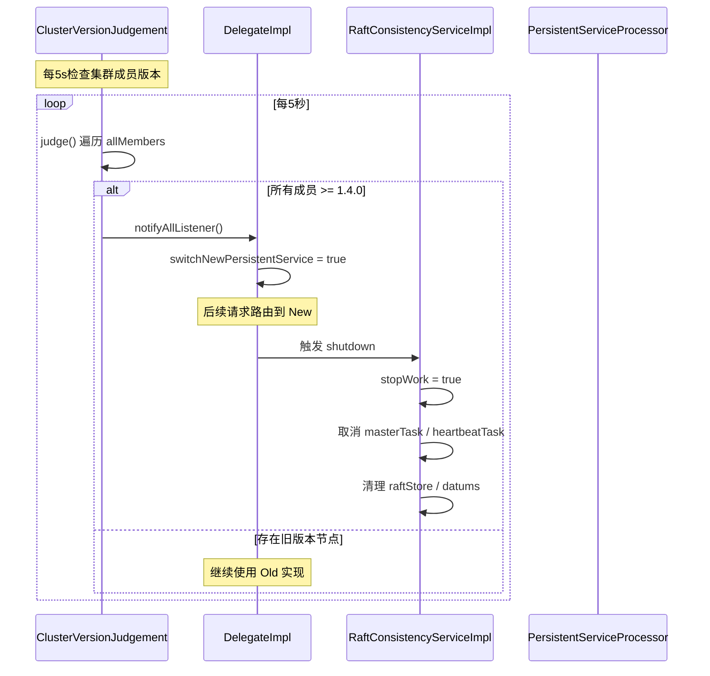
```mermaid
sequenceDiagram
    participant CVJ as ClusterVersionJudgement
    participant Delegate as DelegateImpl
    participant Old as RaftConsistencyServiceImpl
    participant New as PersistentServiceProcessor

    Note over CVJ: 每5s检查集群成员版本
    loop 每5秒
        CVJ->>CVJ: judge() 遍历 allMembers
        alt 所有成员 >= 1.4.0
            CVJ->>Delegate: notifyAllListener()
            Delegate->>Delegate: switchNewPersistentService = true
            Note over Delegate: 后续请求路由到 New
            Delegate->>Old: 触发 shutdown
            Old->>Old: stopWork = true
            Old->>Old: 取消 masterTask / heartbeatTask
            Old->>Old: 清理 raftStore / datums
        else 存在旧版本节点
            Note over Delegate: 继续使用 Old 实现
        end
    end
```

---

## 二、CP 协议接口框架

### 2.1 ConsistencyProtocol 顶层接口

**文件路径**：`consistency/src/main/java/com/alibaba/nacos/consistency/ConsistencyProtocol.java`

```java
public interface ConsistencyProtocol<C extends Config, P extends RequestProcessor> {

    // 初始化协议
    void init(C config, Collection<P> processors) throws Exception;

    // 同步提交数据
    Response submit(WriteRequest request) throws Exception;

    // 异步提交数据
    CompletableFuture<Response> submitAsync(WriteRequest request);

    // 同步获取数据
    Response getData(ReadRequest request) throws Exception;

    // 异步获取数据
    CompletableFuture<Response> aGetData(ReadRequest request);

    // 协议元数据
    ProtocolMetaData protocolMetaData();

    // 添加请求处理器
    void addRequestProcessors(Collection<P> processors);

    // 关闭协议
    void shutdown();
}
```

### 2.2 CPProtocol 接口

**文件路径**：`consistency/src/main/java/com/alibaba/nacos/consistency/cp/CPProtocol.java`

`CPProtocol` 继承 `ConsistencyProtocol`，新增 leader 判断方法：

```java
public interface CPProtocol<C extends Config, P extends RequestProcessor4CP>
        extends ConsistencyProtocol<C, P> {

    // 判断当前节点是否是指定 group 的 leader
    boolean isLeader(String group);

    // 获取指定 group 的 leader 信息
    String leaderDate(String group);
}
```

### 2.3 RequestProcessor4CP 抽象类

**文件路径**：`consistency/src/main/java/com/alibaba/nacos/consistency/cp/RequestProcessor4CP.java`

```java
public abstract class RequestProcessor4CP implements RequestProcessor {

    // 返回该处理器对应的 raft group 名称
    public abstract String group();

    // 处理写请求（应用日志到状态机）
    public abstract Response onApply(WriteRequest request);

    // 处理读请求
    public abstract Response onRequest(ReadRequest request);

    // 快照保存操作
    public abstract List<SnapshotOperation> loadSnapshotOperate();

    // 错误处理
    public void onError(Throwable error) {}

    // 获取业务快照数据
    public byte[] getDataSnapshot() { return new byte[0]; }
}
```

### 2.4 ProtocolMetaData 元数据订阅

**文件路径**：`consistency/src/main/java/com/alibaba/nacos/consistency/ProtocolMetaData.java`

`ProtocolMetaData` 提供线程安全的元数据存储与订阅机制：

```java
public class ProtocolMetaData {
    // groupId -> (key -> value)
    private Map<String, Map<String, Object>> metaDataMap = new ConcurrentHashMap<>();
    // 订阅者列表
    private List<NotifyEvent> subscribeList = new CopyOnWriteArrayList<>();

    // 订阅指定 group 的指定 key 变化
    public void subscribe(String group, String key, Consumer<Object> consumer) {
        subscribeList.add(new NotifyEvent(group, key, consumer));
    }

    // 加载新数据并通知订阅者
    public void load(Map<String, Map<String, Object>> value) {
        metaDataMap.putAll(value);
        for (NotifyEvent event : subscribeList) {
            // 匹配 group 和 key，触发回调
        }
    }

    // ValueItem 包装类
    public static class ValueItem {
        private Object data;
    }
}
```

**关键设计**：通过 `subscribe()` 订阅 leader 变更，业务层（如 `PersistentServiceProcessor`）据此更新 `hasLeader` 状态。

### 2.5 ProtocolManager 协议管理器

**文件路径**：`core/src/main/java/com/alibaba/nacos/core/distributed/ProtocolManager.java`

```java
@Component
public class ProtocolManager implements ApplicationListener<MembersChangeEvent> {

    private CPProtocol cpProtocol;
    private APProtocol apProtocol;

    @PostConstruct
    public void init() {
        // 初始化 CP 协议（JRaftProtocol）
        // 初始化 AP 协议（DistroProtocol）
        // 注册集群成员变更监听
    }

    public CPProtocol getCpProtocol() {
        return cpProtocol;
    }

    @Override
    public void onApplicationEvent(MembersChangeEvent event) {
        // 集群成员变更时通知 CP 和 AP 协议
        cpProtocol.memberChange(...);
        apProtocol.memberChange(...);
    }
}
```

### 2.6 数据模型（Protobuf）

**文件路径**：`consistency/src/main/proto/consistency.proto`

```protobuf
message WriteRequest {
    string group = 1;        // raft group 名称
    string operation = 2;    // 操作类型："Write"、"Delete"
    bytes data = 3;           // 业务数据（序列化后的 BatchWriteRequest）
    string extData = 4;       // 扩展数据
}

message ReadRequest {
    string group = 1;
    bytes data = 2;           // 查询的 keys 列表（序列化后）
}

message Response {
    bool success = 1;
    string errMsg = 2;
    bytes data = 3;            // 返回数据（序列化后的 BatchReadResponse）
}
```

### 2.7 Op 枚举

在 `BasePersistentServiceProcessor` 中定义：

```java
public enum Op {
    Write("Write"),
    Read("Read"),
    Delete("Delete");

    protected final String desc;

    Op(String desc) {
        this.desc = desc;
    }
}
```

### 2.8 NAMING_PERSISTENT_SERVICE_GROUP 常量

**文件路径**：`naming/src/main/java/com/alibaba/nacos/naming/utils/Constants.java`

```java
public static final String OLD_NAMING_RAFT_GROUP = "naming";
public static final String NAMING_PERSISTENT_SERVICE_GROUP = "naming_persistent_service";
public static final String NACOS_NAMING_USE_NEW_RAFT_FIRST = "nacos.naming.use-new-raft.first";
```

---

## 三、新实现：JRaft 协议核心

### 3.1 JRaftServer —— Raft 服务器

**文件路径**：`core/src/main/java/com/alibaba/nacos/core/distributed/raft/JRaftServer.java`

`JRaftServer` 是 JRaft 协议的核心服务器，负责管理所有 Raft Group 的生命周期。

#### 3.1.1 启动流程

```java
public class JRaftServer {
    private RaftConfig raftConfig;
    private NodeOptions nodeOptions;
    private PeerId localPeerId;
    private Configuration conf;
    private RpcServer rpcServer;
    private CliService cliService;
    private CliClientServiceImpl cliClientService;
    private Map<String, RaftGroupTuple> multiRaftGroup = new ConcurrentHashMap<>();
    private volatile boolean isStarted = false;

    void init(RaftConfig config) {
        this.raftConfig = config;
        this.serializer = SerializeFactory.getDefault();
        RaftExecutor.init(config);

        // 解析本地节点信息
        final String self = config.getSelfMember();
        String[] info = IPUtil.splitIPPortStr(self);
        selfIp = info[0];
        selfPort = Integer.parseInt(info[1]);
        localPeerId = PeerId.parsePeer(self);

        // 配置基础节点选项
        nodeOptions = new NodeOptions();
        int electionTimeout = Math.max(
            ConvertUtils.toInt(config.getVal(RaftSysConstants.RAFT_ELECTION_TIMEOUT_MS),
                RaftSysConstants.DEFAULT_ELECTION_TIMEOUT),
            RaftSysConstants.DEFAULT_ELECTION_TIMEOUT);  // 默认 5000ms

        // 共享定时器（多个 raft group 共用）
        nodeOptions.setSharedElectionTimer(true);
        nodeOptions.setSharedVoteTimer(true);
        nodeOptions.setSharedStepDownTimer(true);
        nodeOptions.setSharedSnapshotTimer(true);
        nodeOptions.setElectionTimeoutMs(electionTimeout);

        // 构建 RaftOptions
        RaftOptions raftOptions = RaftOptionsBuilder.initRaftOptions(raftConfig);
        nodeOptions.setRaftOptions(raftOptions);
        nodeOptions.setEnableMetrics(true);

        // 初始化 CLI 服务（用于集群管理）
        CliOptions cliOptions = new CliOptions();
        this.cliService = RaftServiceFactory.createAndInitCliService(cliOptions);
        this.cliClientService = (CliClientServiceImpl)
            ((CliServiceImpl) this.cliService).getCliClientService();
    }

    synchronized void start() {
        if (!isStarted) {
            // 注册所有集群成员地址到 NodeManager
            com.alipay.sofa.jraft.NodeManager raftNodeManager =
                com.alipay.sofa.jraft.NodeManager.getInstance();
            for (String address : raftConfig.getMembers()) {
                PeerId peerId = PeerId.parsePeer(address);
                conf.addPeer(peerId);
                raftNodeManager.addAddress(peerId.getEndpoint());
            }
            nodeOptions.setInitialConf(conf);

            // 初始化 RPC 服务器
            rpcServer = JRaftUtils.initRpcServer(this, localPeerId);
            if (!this.rpcServer.init(null)) {
                throw new RuntimeException("Fail to init [RpcServer].");
            }

            isStarted = true;
            createMultiRaftGroup(processors);
        }
    }
}
```

#### 3.1.2 多 Raft Group 创建

```java
synchronized void createMultiRaftGroup(Collection<RequestProcessor4CP> processors) {
    if (!this.isStarted) {
        this.processors.addAll(processors);  // 缓存直到启动
        return;
    }

    final String parentPath = Paths.get(EnvUtil.getNacosHome(),
        "data/protocol/raft").toString();

    for (RequestProcessor4CP processor : processors) {
        final String groupName = processor.group();
        if (multiRaftGroup.containsKey(groupName)) {
            throw new DuplicateRaftGroupException(groupName);
        }

        // 为每个 group 创建独立目录：log/、snapshot/、meta-data/
        Configuration configuration = conf.copy();
        NodeOptions copy = nodeOptions.copy();
        JRaftUtils.initDirectory(parentPath, groupName, copy);

        // 创建状态机并绑定业务处理器
        NacosStateMachine machine = new NacosStateMachine(this, processor);
        copy.setFsm(machine);
        copy.setInitialConf(configuration);

        // 快照间隔（默认 30 分钟）
        int doSnapshotInterval = ConvertUtils.toInt(
            raftConfig.getVal(RaftSysConstants.RAFT_SNAPSHOT_INTERVAL_SECS),
            RaftSysConstants.DEFAULT_RAFT_SNAPSHOT_INTERVAL_SECS);
        // 若无快照处理器则禁用快照
        doSnapshotInterval = CollectionUtils.isEmpty(processor.loadSnapshotOperate())
            ? 0 : doSnapshotInterval;
        copy.setSnapshotIntervalSecs(doSnapshotInterval);

        // 启动 Raft Group
        RaftGroupService raftGroupService = new RaftGroupService(
            groupName, localPeerId, copy, rpcServer, true);
        Node node = raftGroupService.start(false);
        machine.setNode(node);
        RouteTable.getInstance().updateConfiguration(groupName, configuration);

        // 异步注册到集群
        RaftExecutor.executeByCommon(() ->
            registerSelfToCluster(groupName, localPeerId, configuration));

        // 定时刷新路由表（选举超时 + 随机 5s）
        Random random = new Random();
        long period = nodeOptions.getElectionTimeoutMs() + random.nextInt(5 * 1000);
        RaftExecutor.scheduleRaftMemberRefreshJob(
            () -> refreshRouteTable(groupName),
            nodeOptions.getElectionTimeoutMs(), period, TimeUnit.MILLISECONDS);

        multiRaftGroup.put(groupName,
            new RaftGroupTuple(node, processor, raftGroupService, machine));
    }
}
```

**RaftGroupTuple 内部类**：

```java
class RaftGroupTuple {
    private final Node node;              // JRaft 节点
    private final RequestProcessor4CP processor;  // 业务处理器
    private final RaftGroupService raftGroupService;  // Raft Group 服务
    private final NacosStateMachine machine;  // 状态机
}
```

#### 3.1.3 提交操作到 Raft

```java
CompletableFuture<Response> commit(String group, Message request,
        CompletableFuture<Response> future) {
    final RaftGroupTuple tuple = findTupleByGroup(group);
    if (Objects.isNull(tuple)) {
        future.completeExceptionally(new NoSuchRaftGroupException(group));
        return future;
    }

    if (tuple.getNode().isLeader()) {
        // 当前节点是 Leader，直接应用
        applyOperation(tuple.getNode(), request, closure);
    } else {
        // 非 Leader，转发到 Leader
        invokeToLeader(group, request, rpcRequestTimeoutMs, closure);
    }
    return future;
}

private void applyOperation(Node node, Message request, FailoverClosure closure) {
    // 创建闭包，绑定 CompletableFuture
    NacosClosure nacosClosure = new NacosClosure(request, closure);
    // 提交任务到 Raft 日志
    Task task = new Task();
    task.setData(request.toByteString());
    task.setClosure(nacosClosure);
    node.apply(task);
}
```

#### 3.1.4 转发请求到 Leader

```java
private void invokeToLeader(final String group, final Message request,
        final int timeoutMillis, FailoverClosure closure) {
    // 获取 Leader 节点
    final Endpoint leaderIp = Optional.ofNullable(getLeader(group))
        .orElseThrow(() -> new NoLeaderException(group)).getEndpoint();

    // 异步调用 Leader
    cliClientService.getRpcClient().invokeAsync(leaderIp, request,
        new InvokeCallback() {
            @Override
            public void complete(Object o, Throwable ex) {
                if (Objects.nonNull(ex)) {
                    closure.setThrowable(ex);
                    closure.run(new Status(RaftError.UNKNOWN, ex.getMessage()));
                    return;
                }
                if (!((Response) o).getSuccess()) {
                    closure.setThrowable(new IllegalStateException(
                        ((Response) o).getErrMsg()));
                    closure.run(new Status(RaftError.UNKNOWN,
                        ((Response) o).getErrMsg()));
                    return;
                }
                closure.setResponse((Response) o);
                closure.run(Status.OK());
            }

            @Override
            public Executor executor() {
                return RaftExecutor.getRaftCliServiceExecutor();
            }
        }, timeoutMillis);
}
```

### 3.2 JRaftProtocol —— CP 协议门面

**文件路径**：`core/src/main/java/com/alibaba/nacos/core/distributed/raft/JRaftProtocol.java`

```java
public class JRaftProtocol extends AbstractConsistencyProtocol<RaftConfig, RequestProcessor4CP>
        implements CPProtocol<RaftConfig, RequestProcessor4CP> {

    private final JRaftServer raftServer;
    private final ProtocolMetaData metaData = new ProtocolMetaData();

    @Override
    public void init(RaftConfig config) {
        if (initialized.compareAndSet(false, true)) {
            this.raftConfig = config;
            // 注册 RaftEvent 事件发布器
            NotifyCenter.registerToSharePublisher(RaftEvent.class);
            this.raftServer.init(this.raftConfig);
            this.raftServer.start();

            // 订阅 RaftEvent，更新元数据
            NotifyCenter.registerSubscriber(new Subscriber<RaftEvent>() {
                @Override
                public void onEvent(RaftEvent event) {
                    Map<String, Map<String, Object>> value = new HashMap<>();
                    Map<String, Object> properties = new HashMap<>();
                    properties.put(MetadataKey.LEADER_META_DATA, event.getLeader());
                    properties.put(MetadataKey.TERM_META_DATA, event.getTerm());
                    properties.put(MetadataKey.RAFT_GROUP_MEMBER, event.getRaftClusterInfo());
                    properties.put(MetadataKey.ERR_MSG, event.getErrMsg());
                    value.put(event.getGroupId(), properties);
                    metaData.load(value);  // 触发订阅者回调
                }
            });
        }
    }

    // ===== 写操作 =====
    @Override
    public Response write(WriteRequest request) throws Exception {
        CompletableFuture<Response> future = writeAsync(request);
        return future.get(10_000L, TimeUnit.MILLISECONDS);  // 10s 超时
    }

    @Override
    public CompletableFuture<Response> writeAsync(WriteRequest request) {
        return raftServer.commit(request.getGroup(), request, new CompletableFuture<>());
    }

    // ===== 读操作（ReadIndex 线性一致性） =====
    @Override
    public Response read(ReadRequest request) throws Exception {
        CompletableFuture<Response> future = aRead(request);
        return future.get(10_000L, TimeUnit.MILLISECONDS);
    }

    @Override
    public CompletableFuture<Response> aRead(ReadRequest request) {
        return raftServer.get(request);  // 内部使用 ReadIndex
    }

    // ===== 数据获取 =====
    @Override
    public Response getData(ReadRequest request) throws Exception {
        CompletableFuture<Response> future = aGetData(request);
        return future.get(5_000L, TimeUnit.MILLISECONDS);  // 5s 超时
    }

    @Override
    public CompletableFuture<Response> aGetData(ReadRequest request) {
        return raftServer.get(request);
    }

    @Override
    public boolean isLeader(String group) {
        Node node = raftServer.findNodeByGroup(group);
        if (node == null) {
            throw new NoSuchRaftGroupException(group);
        }
        return node.isLeader();
    }

    @Override
    public void addRequestProcessors(Collection<RequestProcessor4CP> processors) {
        raftServer.createMultiRaftGroup(processors);
    }
}
```

### 3.3 ReadIndex 线性一致性读

`JRaftServer.get()` 方法使用 ReadIndex 实现线性一致性读：

```java
CompletableFuture<Response> get(final ReadRequest request) {
    final String group = request.getGroup();
    CompletableFuture<Response> future = new CompletableFuture<>();
    final RaftGroupTuple tuple = findTupleByGroup(group);
    final Node node = tuple.node;
    final RequestProcessor processor = tuple.processor;

    try {
        node.readIndex(BytesUtil.EMPTY_BYTES, new ReadIndexClosure() {
            @Override
            public void run(Status status, long index, byte[] reqCtx) {
                if (status.isOk()) {
                    // ReadIndex 成功，本地执行读
                    try {
                        Response response = processor.onRequest(request);
                        future.complete(response);
                    } catch (Throwable t) {
                        MetricsMonitor.raftReadIndexFailed();
                        future.completeExceptionally(new ConsistencyException(
                            "The conformance protocol is temporarily unavailable", t));
                    }
                    return;
                }
                // ReadIndex 失败，切换到 Leader 读
                MetricsMonitor.raftReadIndexFailed();
                readFromLeader(request, future);
            }
        });
        return future;
    } catch (Throwable e) {
        // 异常则切换到 Leader 读
        MetricsMonitor.raftReadFromLeader();
        readFromLeader(request, future);
        return future;
    }
}
```

**ReadIndex 流程**：

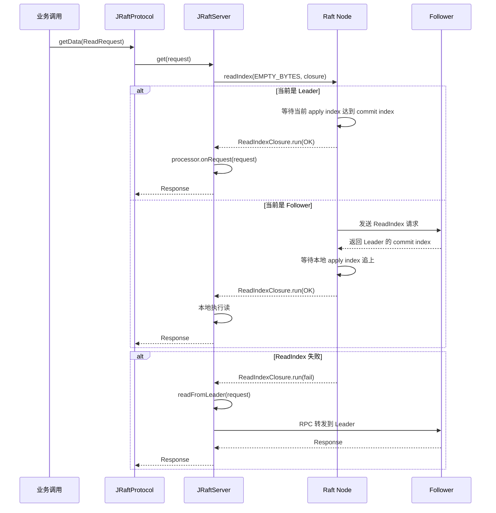
```mermaid
sequenceDiagram
    participant Client as 业务调用
    participant Proto as JRaftProtocol
    participant Server as JRaftServer
    participant Node as Raft Node
    participant Follower as Follower

    Client->>Proto: getData(ReadRequest)
    Proto->>Server: get(request)
    Server->>Node: readIndex(EMPTY_BYTES, closure)

    alt 当前是 Leader
        Node->>Node: 等待当前 apply index 达到 commit index
        Node-->>Server: ReadIndexClosure.run(OK)
        Server->>Server: processor.onRequest(request)
        Server-->>Proto: Response
    else 当前是 Follower
        Node->>Follower: 发送 ReadIndex 请求
        Follower-->>Node: 返回 Leader 的 commit index
        Node->>Node: 等待本地 apply index 追上
        Node-->>Server: ReadIndexClosure.run(OK)
        Server->>Server: 本地执行读
        Server-->>Proto: Response
    end

    alt ReadIndex 失败
        Node-->>Server: ReadIndexClosure.run(fail)
        Server->>Server: readFromLeader(request)
        Server->>Follower: RPC 转发到 Leader
        Follower-->>Server: Response
        Server-->>Proto: Response
    end
```

### 3.4 NacosStateMachine —— 状态机实现

**文件路径**：`core/src/main/java/com/alibaba/nacos/core/distributed/raft/NacosStateMachine.java`

#### 3.4.1 onApply() 应用日志

```java
@Override
public void onApply(Iterator iter) {
    int index = 0;
    int applied = 0;
    Message message;
    NacosClosure closure = null;
    try {
        while (iter.hasNext()) {
            Status status = Status.OK();
            try {
                if (iter.done() != null) {
                    // Leader 路径：闭包携带原始请求
                    closure = (NacosClosure) iter.done();
                    message = closure.getMessage();
                } else {
                    // Follower 路径：从日志数据反序列化
                    final ByteBuffer data = iter.getData();
                    message = ProtoMessageUtil.parse(data.array());
                }

                // 处理写请求
                if (message instanceof WriteRequest) {
                    Response response = processor.onApply((WriteRequest) message);
                    postProcessor(response, closure);
                }
                // 处理读请求
                if (message instanceof ReadRequest) {
                    Response response = processor.onRequest((ReadRequest) message);
                    postProcessor(response, closure);
                }
            } catch (Throwable e) {
                index++;
                status.setError(RaftError.UNKNOWN, e.toString());
                Optional.ofNullable(closure).ifPresent(c -> c.setThrowable(e));
                throw e;
            } finally {
                Optional.ofNullable(closure).ifPresent(c -> c.run(status));
            }
            applied++;
            index++;
            iter.next();
        }
    } catch (Throwable t) {
        // 回滚未应用的日志
        iter.setErrorAndRollback(index - applied,
            new Status(RaftError.ESTATEMACHINE, "StateMachine meet critical error: %s.",
                ExceptionUtil.getStackTrace(t)));
    }
}
```

**关键设计**：
- **Leader 路径**：`iter.done()` 非空，闭包携带原始 `Message`，避免反序列化开销
- **Follower 路径**：从日志字节反序列化 `Message`
- **回滚机制**：异常时通过 `setErrorAndRollback` 回滚

#### 3.4.2 Leader 选举回调

```java
@Override
public void onLeaderStart(final long term) {
    super.onLeaderStart(term);
    this.term = term;
    this.isLeader.set(true);
    this.leaderIp = node.getNodeId().getPeerId().getEndpoint().toString();
    // 发布 RaftEvent 通知业务层
    NotifyCenter.publishEvent(
        RaftEvent.builder()
            .groupId(groupId)
            .leader(leaderIp)
            .term(term)
            .raftClusterInfo(allPeers())
            .build());
}

@Override
public void onLeaderStop(final Status status) {
    super.onLeaderStop(status);
    this.isLeader.set(false);
}

@Override
public void onStartFollowing(LeaderChangeContext ctx) {
    this.term = ctx.getTerm();
    this.leaderIp = ctx.getLeaderId().getEndpoint().toString();
    NotifyCenter.publishEvent(
        RaftEvent.builder()
            .groupId(groupId)
            .leader(leaderIp)
            .term(ctx.getTerm())
            .raftClusterInfo(allPeers())
            .build());
}
```

#### 3.4.3 快照处理

```java
@Override
public void onSnapshotSave(SnapshotWriter writer, Closure done) {
    for (JSnapshotOperation operation : operations) {
        operation.onSnapshotSave(writer, done);
    }
}

@Override
public boolean onSnapshotLoad(SnapshotReader reader) {
    for (JSnapshotOperation operation : operations) {
        if (!operation.onSnapshotLoad(reader)) {
            return false;
        }
    }
    return true;
}
```

#### 3.4.4 错误处理

```java
@Override
public void onError(RaftException e) {
    super.onError(e);
    processor.onError(e);
    NotifyCenter.publishEvent(
        RaftEvent.builder()
            .groupId(groupId)
            .leader(leaderIp)
            .term(term)
            .raftClusterInfo(allPeers())
            .errMsg(e.toString())
            .build());
}
```

### 3.5 NacosClosure —— 闭包实现

**文件路径**：`core/src/main/java/com/alibaba/nacos/core/distributed/raft/NacosClosure.java`

```java
public class NacosClosure implements Closure {
    private Message message;        // 原始请求
    private Closure closure;        // 下游闭包
    private NacosStatus nacosStatus = new NacosStatus();

    public NacosClosure(Message message, Closure closure) {
        this.message = message;
        this.closure = closure;
    }

    @Override
    public void run(Status status) {
        nacosStatus.setStatus(status);
        closure.run(nacosStatus);  // 传递给下游
        clear();
    }
}
```

**FailoverClosureImpl 故障转移闭包**：

```java
public class FailoverClosureImpl implements FailoverClosure {
    private final CompletableFuture<Response> future;
    private Response data;
    private Throwable throwable;

    @Override
    public void run(Status status) {
        if (status.isOk()) {
            future.complete(data);
            return;
        }
        final Throwable t = this.throwable;
        future.completeExceptionally(Objects.nonNull(t)
            ? new ConsistencyException(t.getMessage())
            : new ConsistencyException("operation failure"));
    }
}
```

### 3.6 Processor 体系

#### 3.6.1 AbstractProcessor 抽象处理器

**文件路径**：`core/src/main/java/com/alibaba/nacos/core/distributed/raft/processor/AbstractProcessor.java`

```java
public abstract class AbstractProcessor {
    protected final Serializer serializer;

    protected void handleRequest(final JRaftServer server, final String group,
            final RpcContext rpcCtx, Message message) {
        try {
            final JRaftServer.RaftGroupTuple tuple = server.findTupleByGroup(group);
            if (Objects.isNull(tuple)) {
                rpcCtx.sendResponse(Response.newBuilder()
                    .setSuccess(false)
                    .setErrMsg("Could not find the corresponding Raft Group : " + group)
                    .build());
                return;
            }
            // 仅 Leader 处理请求
            if (tuple.getNode().isLeader()) {
                execute(server, rpcCtx, message, tuple);
            } else {
                rpcCtx.sendResponse(Response.newBuilder()
                    .setSuccess(false)
                    .setErrMsg("Could not find leader : " + group)
                    .build());
            }
        } catch (Throwable e) {
            rpcCtx.sendResponse(Response.newBuilder()
                .setSuccess(false)
                .setErrMsg(e.toString())
                .build());
        }
    }

    protected void execute(JRaftServer server, final RpcContext asyncCtx,
            final Message message, final JRaftServer.RaftGroupTuple tuple) {
        FailoverClosure closure = new FailoverClosure() {
            Response data;
            Throwable ex;

            @Override
            public void setResponse(Response data) { this.data = data; }

            @Override
            public void setThrowable(Throwable throwable) { this.ex = throwable; }

            @Override
            public void run(Status status) {
                if (Objects.nonNull(ex)) {
                    asyncCtx.sendResponse(Response.newBuilder()
                        .setErrMsg(ex.toString()).setSuccess(false).build());
                } else {
                    asyncCtx.sendResponse(data);
                }
            }
        };
        server.applyOperation(tuple.getNode(), message, closure);
    }
}
```

#### 3.6.2 NacosWriteRequestProcessor / NacosReadRequestProcessor

```java
public class NacosWriteRequestProcessor extends AbstractProcessor
        implements RpcProcessor<WriteRequest> {
    private static final String INTEREST_NAME = WriteRequest.class.getName();
    private final JRaftServer server;

    @Override
    public void handleRequest(RpcContext rpcCtx, WriteRequest request) {
        handleRequest(server, request.getGroup(), rpcCtx, request);
    }

    @Override
    public String interest() {
        return INTEREST_NAME;  // 声明处理的消息类型
    }
}

public class NacosReadRequestProcessor extends AbstractProcessor
        implements RpcProcessor<ReadRequest> {
    @Override
    public void handleRequest(RpcContext rpcCtx, ReadRequest request) {
        handleRequest(server, request.getGroup(), rpcCtx, request);
    }
}
```

**RPC 处理流程**：
1. JRaft RPC 服务器接收 `WriteRequest` / `ReadRequest`
2. 路由到对应的 `NacosWriteRequestProcessor` / `NacosReadRequestProcessor`
3. `AbstractProcessor.handleRequest()` 检查是否为 Leader
4. Leader 调用 `server.applyOperation()` 提交到 Raft 日志
5. 非 Leader 返回错误（由客户端侧 `invokeToLeader` 转发）

### 3.7 JRaftUtils 工具类

**文件路径**：`core/src/main/java/com/alibaba/nacos/core/distributed/raft/utils/JRaftUtils.java`

```java
public final class JRaftUtils {
    // 初始化 RPC 服务器并注册处理器
    public static RpcServer initRpcServer(JRaftServer server, PeerId peerId) {
        GrpcRaftRpcFactory raftRpcFactory = (GrpcRaftRpcFactory) RpcFactoryHelper.rpcFactory();

        // 注册 Protobuf 序列化器
        raftRpcFactory.registerProtobufSerializer(
            WriteRequest.class.getName(), WriteRequest.getDefaultInstance());
        raftRpcFactory.registerProtobufSerializer(
            ReadRequest.class.getName(), ReadRequest.getDefaultInstance());
        raftRpcFactory.registerProtobufSerializer(
            Response.class.getName(), Response.getDefaultInstance());

        final RpcServer rpcServer = raftRpcFactory.createRpcServer(peerId.getEndpoint());

        // 添加 JRaft 内置请求处理器
        RaftRpcServerFactory.addRaftRequestProcessors(rpcServer,
            RaftExecutor.getRaftCoreExecutor(),
            RaftExecutor.getRaftCliServiceExecutor());

        // 注册 Nacos 自定义处理器
        rpcServer.registerProcessor(new NacosWriteRequestProcessor(server, ...));
        rpcServer.registerProcessor(new NacosReadRequestProcessor(server, ...));

        return rpcServer;
    }

    // 初始化 Raft Group 目录
    public static void initDirectory(String parentPath, String groupName, NodeOptions copy) {
        final String logUri = Paths.get(parentPath, groupName, "log").toString();
        final String snapshotUri = Paths.get(parentPath, groupName, "snapshot").toString();
        final String metaDataUri = Paths.get(parentPath, groupName, "meta-data").toString();

        DiskUtils.forceMkdir(new File(logUri));
        DiskUtils.forceMkdir(new File(snapshotUri));
        DiskUtils.forceMkdir(new File(metaDataUri));

        copy.setLogUri(logUri);
        copy.setRaftMetaUri(metaDataUri);
        copy.setSnapshotUri(snapshotUri);
    }
}
```

### 3.8 RaftExecutor 线程池

**文件路径**：`core/src/main/java/com/alibaba/nacos/core/distributed/raft/utils/RaftExecutor.java`

```java
public final class RaftExecutor {
    private static ExecutorService raftCoreExecutor;        // Raft 核心逻辑
    private static ExecutorService raftCliServiceExecutor;  // CLI 请求
    private static ScheduledExecutorService raftCommonExecutor;  // 通用定时
    private static ExecutorService raftSnapshotExecutor;    // 快照

    public static void init(RaftConfig config) {
        int raftCoreThreadNum = Integer.parseInt(
            config.getValOfDefault(RaftSysConstants.RAFT_CORE_THREAD_NUM, "8"));
        int raftCliServiceThreadNum = Integer.parseInt(
            config.getValOfDefault(RaftSysConstants.RAFT_CLI_SERVICE_THREAD_NUM, "4"));

        raftCoreExecutor = ExecutorFactory.Managed.newFixedExecutorService(
            OWNER, raftCoreThreadNum, new NameThreadFactory("raft-core"));

        raftCliServiceExecutor = ExecutorFactory.Managed.newFixedExecutorService(
            OWNER, raftCliServiceThreadNum, new NameThreadFactory("raft-cli-service"));

        raftCommonExecutor = ExecutorFactory.Managed.newScheduledExecutorService(
            OWNER, 8, new NameThreadFactory("raft-common"));

        int snapshotNum = raftCoreThreadNum / 2;
        snapshotNum = snapshotNum == 0 ? raftCoreThreadNum : snapshotNum;
        raftSnapshotExecutor = ExecutorFactory.Managed.newFixedExecutorService(
            OWNER, snapshotNum, new NameThreadFactory("raft-snapshot"));
    }
}
```

### 3.9 RaftSysConstants 系统常量

**文件路径**：`core/src/main/java/com/alibaba/nacos/core/distributed/raft/RaftSysConstants.java`

| 常量 | 默认值 | 说明 |
|------|--------|------|
| `DEFAULT_ELECTION_TIMEOUT` | 5000ms | 选举超时 |
| `DEFAULT_RAFT_SNAPSHOT_INTERVAL_SECS` | 1800s（30min） | 快照间隔 |
| `DEFAULT_RAFT_RPC_REQUEST_TIMEOUT_MS` | 5000ms | RPC 请求超时 |
| `DEFAULT_READ_INDEX_TYPE` | ReadOnlySafe | ReadIndex 类型 |
| `DEFAULT_MAX_BYTE_COUNT_PER_RPC` | 128KB | 单次 RPC 最大字节 |
| `DEFAULT_MAX_ENTRIES_SIZE` | 1024 | 单次 RPC 最大日志条目 |
| `DEFAULT_MAX_BODY_SIZE` | 512KB | 日志 body 最大大小 |
| `DEFAULT_MAX_APPEND_BUFFER_SIZE` | 256KB | Append 缓冲区大小 |
| `DEFAULT_APPLY_BATCH` | 32 | 批量应用大小 |
| `DEFAULT_SYNC` | true | 是否同步刷盘 |
| `DEFAULT_REPLICATOR_PIPELINE` | true | 是否启用 Pipeline 复制 |

### 3.10 JRaftOps 维护操作

`JRaftOps` 定义了 Raft 集群维护操作：

| 操作 | 命令 | 说明 |
|------|------|------|
| `TRANSFER_LEADER` | `transferLeader` | 转移 Leader |
| `RESET_RAFT_CLUSTER` | `restRaftCluster` | 重置集群配置 |
| `DO_SNAPSHOT` | `doSnapshot` | 手动触发快照 |
| `REMOVE_PEER` | `removePeer` | 移除单个节点 |
| `REMOVE_PEERS` | `removePeers` | 移除多个节点 |
| `CHANGE_PEERS` | `changePeers` | 变更集群成员 |
| `RESET_PEERS` | `resetPeers` | 重置集群成员 |

---

## 四、Naming 模块新实现：PersistentServiceProcessor

### 4.1 BasePersistentServiceProcessor

**文件路径**：`naming/src/main/java/com/alibaba/nacos/naming/consistency/persistent/impl/BasePersistentServiceProcessor.java`

这是 Naming 模块 CP 实现的基类，继承 `RequestProcessor4CP`，实现 `PersistentConsistencyService`。

#### 4.1.1 核心字段

```java
public abstract class BasePersistentServiceProcessor
        extends RequestProcessor4CP implements PersistentConsistencyService {

    protected final KvStorage kvStorage;          // KV 存储
    protected final Serializer serializer;        // 序列化器
    protected volatile boolean hasError = false;  // 是否有不可恢复错误
    protected volatile String jRaftErrorMsg;     // JRaft 错误信息
    protected volatile boolean startNotify = false;
    protected final ReentrantReadWriteLock lock;  // 读写锁（快照并发控制）
    protected final ClusterVersionJudgement versionJudgement;
    protected final PersistentNotifier notifier;
}
```

#### 4.1.2 afterConstruct 初始化

```java
@Override
public void afterConstruct() {
    // 注册 ValueChangeEvent 事件发布器
    NotifyCenter.registerToPublisher(ValueChangeEvent.class, 16384);
    // 监听旧 Raft 协议关闭事件，切换时注册通知器
    listenOldRaftClose();
}

private void listenOldRaftClose() {
    versionJudgement.registerObserver(isAllNewVersion -> {
        if (isAllNewVersion && !startNotify) {
            // 旧 Raft 关闭后，开始通知监听器
            NotifyCenter.registerSubscriber(notifier);
            try {
                waitLeader();
                startNotify = true;
            } catch (Exception e) {
                Loggers.RAFT.error("listen old raft close fail", e);
            }
        }
    }, 0);  // priority=0，高优先级
}
```

#### 4.1.3 onApply 写请求处理

```java
@Override
public Response onApply(WriteRequest request) {
    final byte[] data = request.getData().toByteArray();
    final BatchWriteRequest bwRequest = serializer.deserialize(data, BatchWriteRequest.class);

    final Op op;
    try {
        op = Op.valueOf(request.getOperation());
    } catch (Exception e) {
        return Response.newBuilder()
            .setSuccess(false)
            .setErrMsg("unsupport operation : " + request.getOperation())
            .build();
    }

    final Lock lock = readLock;
    lock.lock();
    try {
        List<ValueChangeEvent> changeEvents = tryBuildChangeEvents(op, bwRequest);
        switch (op) {
            case Write:
                kvStorage.batchPut(bwRequest.getKeys(), bwRequest.getValues());
                break;
            case Delete:
                kvStorage.batchDelete(bwRequest.getKeys());
                break;
            default:
                return Response.newBuilder()
                    .setSuccess(false)
                    .setErrMsg("unsupport operation : " + op)
                    .build();
        }
        // 发布变更事件通知监听器
        publishValueChangeEvent(changeEvents);
        return Response.newBuilder().setSuccess(true).build();
    } catch (KvStorageException e) {
        return Response.newBuilder()
            .setSuccess(false)
            .setErrMsg(e.getErrMsg())
            .build();
    } finally {
        lock.unlock();
    }
}
```

#### 4.1.4 onRequest 读请求处理

```java
@Override
public Response onRequest(ReadRequest request) {
    final List<byte[]> keys = serializer.deserialize(
        request.getData().toByteArray(), List.class);
    final BatchReadResponse response = new BatchReadResponse();
    final List<byte[]> values = kvStorage.batchGet(keys);
    for (int i = 0; i < keys.size(); i++) {
        response.append(keys.get(i), values.get(i));
    }
    return Response.newBuilder()
        .setSuccess(true)
        .setData(ByteString.copyFrom(serializer.serialize(response)))
        .build();
}
```

#### 4.1.5 类型推断

```java
protected Class<? extends Record> getClassOfRecordFromKey(String key) {
    if (KeyBuilder.matchSwitchKey(key)) {
        return SwitchDomain.class;
    } else if (KeyBuilder.matchServiceMetaKey(key)) {
        return Service.class;
    } else if (KeyBuilder.matchInstanceListKey(key)) {
        return Instances.class;
    }
    return Record.class;
}
```

#### 4.1.6 group() 方法

```java
@Override
public String group() {
    return Constants.NAMING_PERSISTENT_SERVICE_GROUP;  // "naming_persistent_service"
}
```

### 4.2 PersistentServiceProcessor 集群模式

**文件路径**：`naming/src/main/java/com/alibaba/nacos/naming/consistency/persistent/impl/PersistentServiceProcessor.java`

```java
public class PersistentServiceProcessor extends BasePersistentServiceProcessor {
    private final CPProtocol protocol;
    private volatile boolean hasLeader = false;

    public PersistentServiceProcessor(ProtocolManager protocolManager,
            ClusterVersionJudgement versionJudgement) throws Exception {
        super(versionJudgement);
        this.protocol = protocolManager.getCpProtocol();
    }

    @Override
    public void afterConstruct() {
        super.afterConstruct();
        String raftGroup = Constants.NAMING_PERSISTENT_SERVICE_GROUP;

        // 订阅 leader 元数据变化
        this.protocol.protocolMetaData().subscribe(
            raftGroup, MetadataKey.LEADER_META_DATA, o -> {
                if (!(o instanceof ProtocolMetaData.ValueItem)) {
                    return;
                }
                Object leader = ((ProtocolMetaData.ValueItem) o).getData();
                hasLeader = StringUtils.isNotBlank(String.valueOf(leader));
                Loggers.RAFT.info("Raft group {} has leader {}", raftGroup, leader);
            });

        // 注册自身为请求处理器
        this.protocol.addRequestProcessors(Collections.singletonList(this));

        // 是否直接使用新 Raft（跳过兼容）
        if (EnvUtil.getProperty(Constants.NACOS_NAMING_USE_NEW_RAFT_FIRST,
                Boolean.class, false)) {
            NotifyCenter.registerSubscriber(notifier);
            waitLeader();
            startNotify = true;
        }
    }

    // ===== 写操作 =====
    @Override
    public void put(String key, Record value) throws NacosException {
        final BatchWriteRequest req = new BatchWriteRequest();
        Datum datum = Datum.createDatum(key, value);
        req.append(ByteUtils.toBytes(key), serializer.serialize(datum));
        final WriteRequest request = WriteRequest.newBuilder()
            .setData(ByteString.copyFrom(serializer.serialize(req)))
            .setGroup(Constants.NAMING_PERSISTENT_SERVICE_GROUP)
            .setOperation(Op.Write.desc)
            .build();
        try {
            protocol.write(request);  // 提交到 JRaft
        } catch (Exception e) {
            throw new NacosException(ErrorCode.ProtoSubmitError.getCode(), e.getMessage());
        }
    }

    // ===== 删除操作 =====
    @Override
    public void remove(String key) throws NacosException {
        final BatchWriteRequest req = new BatchWriteRequest();
        req.append(ByteUtils.toBytes(key), ByteUtils.EMPTY);
        final WriteRequest request = WriteRequest.newBuilder()
            .setData(ByteString.copyFrom(serializer.serialize(req)))
            .setGroup(Constants.NAMING_PERSISTENT_SERVICE_GROUP)
            .setOperation(Op.Delete.desc)
            .build();
        try {
            protocol.write(request);
        } catch (Exception e) {
            throw new NacosException(ErrorCode.ProtoSubmitError.getCode(), e.getMessage());
        }
    }

    // ===== 读操作 =====
    @Override
    public Datum get(String key) throws NacosException {
        final List<byte[]> keys = new ArrayList<>(1);
        keys.add(ByteUtils.toBytes(key));
        final ReadRequest req = ReadRequest.newBuilder()
            .setGroup(Constants.NAMING_PERSISTENT_SERVICE_GROUP)
            .setData(ByteString.copyFrom(serializer.serialize(keys)))
            .build();
        try {
            Response resp = protocol.getData(req);
            if (resp.getSuccess()) {
                BatchReadResponse response = serializer.deserialize(
                    resp.getData().toByteArray(), BatchReadResponse.class);
                final List<byte[]> rValues = response.getValues();
                return rValues.isEmpty() ? null
                    : serializer.deserialize(rValues.get(0), getDatumTypeFromKey(key));
            }
            throw new NacosException(ErrorCode.ProtoReadError.getCode(), resp.getErrMsg());
        } catch (Throwable e) {
            throw new NacosException(ErrorCode.ProtoReadError.getCode(), e.getMessage());
        }
    }

    @Override
    public boolean isAvailable() {
        return hasLeader && !hasError;
    }
}
```

### 4.3 StandalonePersistentServiceProcessor 单机模式

```java
public class StandalonePersistentServiceProcessor extends BasePersistentServiceProcessor {
    @Override
    public void put(String key, Record value) throws NacosException {
        final BatchWriteRequest req = new BatchWriteRequest();
        Datum datum = Datum.createDatum(key, value);
        req.append(ByteUtils.toBytes(key), serializer.serialize(datum));
        final WriteRequest request = WriteRequest.newBuilder()
            .setData(ByteString.copyFrom(serializer.serialize(req)))
            .setGroup(Constants.NAMING_PERSISTENT_SERVICE_GROUP)
            .setOperation(Op.Write.desc)
            .build();
        // 单机模式直接调用 onApply，不经过 Raft
        try {
            onApply(request);
        } catch (Exception e) {
            throw new NacosException(ErrorCode.ProtoSubmitError.getCode(), e.getMessage());
        }
    }

    @Override
    public boolean isAvailable() {
        return !hasError;  // 仅检查错误状态，无需 leader
    }
}
```

### 4.4 NamingKvStorage —— KV 存储

**文件路径**：`naming/src/main/java/com/alibaba/nacos/naming/consistency/persistent/impl/NamingKvStorage.java`

```java
public class NamingKvStorage extends MemoryKvStorage {
    private final String baseDir;
    private final KvStorage baseDirStorage;  // 实际文件存储
    private final Map<String, KvStorage> namespaceKvStorage;  // 命名空间缓存

    public NamingKvStorage(final String baseDir) throws Exception {
        this.baseDir = baseDir;
        this.baseDirStorage = StorageFactory.createKvStorage(
            KvStorage.KvType.File, "naming-persistent", baseDir);
        this.namespaceKvStorage = new ConcurrentHashMap<>(16);
    }

    @Override
    public byte[] get(byte[] key) throws KvStorageException {
        // 先查内存缓存
        byte[] value = super.get(key);
        if (value != null) {
            return value;
        }
        // 内存未命中，查实际存储
        KvStorage actualStorage = createActualStorageIfAbsent(key);
        value = actualStorage.get(key);
        if (value != null) {
            put(key, value);  // 回填内存
        }
        return value;
    }

    @Override
    public void batchPut(List<byte[]> keys, List<byte[]> values) throws KvStorageException {
        // 按命名空间分组写入
        for (int i = 0; i < keys.size(); i++) {
            byte[] key = keys.get(i);
            byte[] value = values.get(i);
            KvStorage actualStorage = createActualStorageIfAbsent(key);
            actualStorage.put(key, value);
        }
        // 写入内存缓存
        super.batchPut(keys, values);
    }

    // 根据 key 中的命名空间创建对应的存储实例
    private KvStorage createActualStorageIfAbsent(String namespace) throws Exception {
        if (StringUtils.isBlank(namespace)) {
            return baseDirStorage;
        }
        Function<String, KvStorage> kvStorageBuilder = key -> {
            String namespacePath = Paths.get(baseDir, key).toString();
            return StorageFactory.createKvStorage(
                KvType.File, "naming-persistent", namespacePath);
        };
        return namespaceKvStorage.computeIfAbsent(namespace, kvStorageBuilder);
    }

    @Override
    public void doSnapshot(String path) throws KvStorageException {
        baseDirStorage.doSnapshot(path);
    }

    @Override
    public void snapshotLoad(String path) throws KvStorageException {
        baseDirStorage.snapshotLoad(path);
        // 加载到内存缓存
        super.snapshotLoad(path);
    }
}
```

**设计要点**：
- **双层存储**：内存缓存（`MemoryKvStorage`）+ 文件存储
- **命名空间隔离**：每个 namespace 独立文件存储实例
- **快照支持**：委托给底层文件存储

### 4.5 NamingSnapshotOperation —— 快照操作

**文件路径**：`naming/src/main/java/com/alibaba/nacos/naming/consistency/persistent/impl/NamingSnapshotOperation.java`

```java
public class NamingSnapshotOperation implements SnapshotOperation {
    private final KvStorage storage;
    private final Lock writeLock;
    private static final String snapshotDir = "naming_persistent";
    private static final String snapshotArchive = "naming_persistent.zip";
    private static final String checkSumKey = "checkSum";

    @Override
    public void onSnapshotSave(Writer writer, BiConsumer<Boolean, Throwable> callFinally) {
        RaftExecutor.doSnapshot(() -> {
            final Lock lock = writeLock;
            lock.lock();
            try {
                // 创建快照目录
                final String writePath = writer.getPath();
                final String parentPath = Paths.get(writePath, snapshotDir).toString();
                DiskUtils.deleteDirectory(parentPath);
                DiskUtils.forceMkdir(parentPath);

                // 存储快照
                storage.doSnapshot(parentPath);

                // 压缩为 zip 并计算 CRC64 校验和
                final String outputFile = Paths.get(writePath, snapshotArchive).toString();
                final Checksum checksum = new CRC64();
                DiskUtils.compress(writePath, snapshotDir, outputFile, checksum);
                DiskUtils.deleteDirectory(parentPath);

                // 添加元数据
                final LocalFileMeta meta = new LocalFileMeta();
                meta.append(checkSumKey, Long.toHexString(checksum.getValue()));
                callFinally.accept(writer.addFile(snapshotArchive, meta), null);
            } catch (Throwable t) {
                callFinally.accept(false, t);
            } finally {
                lock.unlock();
            }
        });
    }

    @Override
    public boolean onSnapshotLoad(Reader reader) {
        final Lock lock = writeLock;
        lock.lock();
        try {
            final String readerPath = reader.getPath();
            final String sourceFile = Paths.get(readerPath, snapshotArchive).toString();

            // 解压并校验
            final Checksum checksum = new CRC64();
            DiskUtils.decompress(sourceFile, readerPath, checksum);
            LocalFileMeta fileMeta = reader.getFileMeta(snapshotArchive);
            if (fileMeta.getFileMeta().containsKey(checkSumKey)) {
                if (!Objects.equals(Long.toHexString(checksum.getValue()),
                    fileMeta.get(checkSumKey))) {
                    throw new IllegalArgumentException("Snapshot checksum failed");
                }
            }

            // 加载到存储
            final String loadPath = Paths.get(readerPath, snapshotDir).toString();
            storage.snapshotLoad(loadPath);
            return true;
        } catch (Throwable t) {
            return false;
        } finally {
            lock.unlock();
        }
    }
}
```

### 4.6 PersistentNotifier —— 数据变更通知

**文件路径**：`naming/src/main/java/com/alibaba/nacos/naming/consistency/persistent/PersistentNotifier.java`

```java
public class PersistentNotifier implements Subscriber<ValueChangeEvent> {
    private final Map<String, Set<RecordListener>> listenerMap = new ConcurrentHashMap<>();
    private final Function<String, Record> find;

    public void registerListener(final String key, final RecordListener listener) {
        listenerMap.computeIfAbsent(key, s -> new ConcurrentHashSet<>()).add(listener);
    }

    public void deregisterListener(final String key, final RecordListener listener) {
        Set<RecordListener> listeners = listenerMap.get(key);
        if (listeners != null) {
            listeners.remove(listener);
        }
    }

    @Override
    public void onEvent(ValueChangeEvent event) {
        notify(event.getKey(), event.getAction(), find.apply(event.getKey()));
    }

    public <T extends Record> void notify(final String key, final DataOperation action,
            final T value) {
        // 特殊处理服务元数据 key
        if (listenerMap.containsKey(KeyBuilder.SERVICE_META_KEY_PREFIX)) {
            if (KeyBuilder.matchServiceMetaKey(key) && !KeyBuilder.matchSwitchKey(key)) {
                for (RecordListener listener : listenerMap.get(KeyBuilder.SERVICE_META_KEY_PREFIX)) {
                    if (action == DataOperation.CHANGE) {
                        listener.onChange(key, value);
                    } else if (action == DataOperation.DELETE) {
                        listener.onDelete(key);
                    }
                }
            }
        }

        // 普通 key 通知
        Set<RecordListener> listeners = listenerMap.get(key);
        if (listeners == null) {
            return;
        }
        for (RecordListener listener : listeners) {
            if (action == DataOperation.CHANGE) {
                listener.onChange(key, value);
            } else if (action == DataOperation.DELETE) {
                listener.onDelete(key);
            }
        }
    }
}
```

### 4.7 BatchWriteRequest / BatchReadResponse

```java
public class BatchWriteRequest implements Serializable {
    private List<byte[]> keys = new ArrayList<>(16);
    private List<byte[]> values = new ArrayList<>(16);

    public void append(byte[] key, byte[] value) {
        keys.add(key);
        values.add(value);
    }
}

public class BatchReadResponse implements Serializable {
    private List<byte[]> keys = new ArrayList<>(16);
    private List<byte[]> values = new ArrayList<>(16);

    public void append(byte[] key, byte[] value) {
        keys.add(key);
        values.add(value);
    }
}
```

### 4.8 新实现写入流程

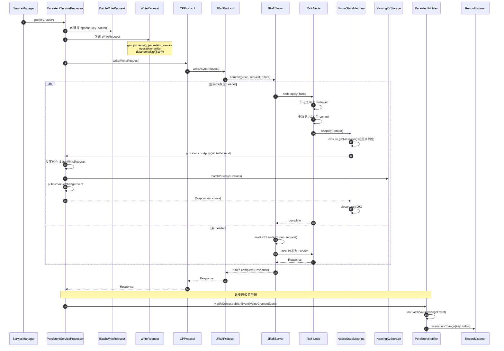
```mermaid
sequenceDiagram
    autonumber
    participant BIZ as ServiceManager
    participant PSP as PersistentServiceProcessor
    participant BWR as BatchWriteRequest
    participant WR as WriteRequest
    participant CP as CPProtocol
    participant JRP as JRaftProtocol
    participant JRS as JRaftServer
    participant Node as Raft Node
    participant FSM as NacosStateMachine
    participant KV as NamingKvStorage
    participant NT as PersistentNotifier
    participant L as RecordListener

    BIZ->>PSP: put(key, value)
    PSP->>BWR: 创建并 append(key, datum)
    PSP->>WR: 创建 WriteRequest
    Note over WR: group=naming_persistent_service<br/>operation=Write<br/>data=serialize(BWR)
    PSP->>CP: write(WriteRequest)
    CP->>JRP: writeAsync(request)
    JRP->>JRS: commit(group, request, future)

    alt 当前节点是 Leader
        JRS->>Node: node.apply(Task)
        Node->>Node: 日志复制到 Follower
        Node->>Node: 多数派 ACK 后 commit
        Node->>FSM: onApply(Iterator)
        FSM->>FSM: closure.getMessage() 或反序列化
        FSM->>PSP: processor.onApply(WriteRequest)
        PSP->>PSP: 反序列化 BatchWriteRequest
        PSP->>KV: batchPut(keys, values)
        PSP->>PSP: publishValueChangeEvent
        PSP-->>FSM: Response(success)
        FSM->>FSM: closure.run(OK)
        Node-->>JRS: complete
    else 非 Leader
        JRS->>JRS: invokeToLeader(group, request)
        JRS->>Node: RPC 转发到 Leader
        Node-->>JRS: Response
    end

    JRS-->>JRP: future.complete(Response)
    JRP-->>CP: Response
    CP-->>PSP: Response

    Note over PSP,NT: 异步通知监听器
    PSP->>NT: NotifyCenter.publishEvent(ValueChangeEvent)
    NT->>NT: onEvent(ValueChangeEvent)
    NT->>L: listener.onChange(key, value)
```

---

## 五、旧实现：自研 Raft 协议

### 5.1 RaftConsistencyServiceImpl

**文件路径**：`naming/src/main/java/com/alibaba/nacos/naming/consistency/persistent/raft/RaftConsistencyServiceImpl.java`

```java
@Deprecated
@Service
public class RaftConsistencyServiceImpl implements PersistentConsistencyService {

    @Autowired
    private RaftCore raftCore;
    @Autowired
    private RaftPeerSet peers;

    @Override
    public void put(String key, Record value) throws NacosException {
        checkIsStopWork();
        try {
            raftCore.signalPublish(key, value);
        } catch (Exception e) {
            throw new NacosException(NacosException.SERVER_ERROR,
                "Raft put failed, key:" + key, e);
        }
    }

    @Override
    public void remove(String key) throws NacosException {
        checkIsStopWork();
        try {
            if (KeyBuilder.matchInstanceListKey(key) && !raftCore.isLeader()) {
                // 非 Leader 处理实例删除，转发到 Leader
                raftCore.onDelete(key, peers.getLeader());
            } else {
                raftCore.signalDelete(key);
            }
            raftCore.unListenAll(key);
        } catch (Exception e) {
            throw new NacosException(NacosException.SERVER_ERROR,
                "Raft remove failed, key:" + key, e);
        }
    }

    @Override
    public Datum get(String key) throws NacosException {
        checkIsStopWork();
        return raftCore.getDatum(key);  // 直接本地读取
    }
}
```

### 5.2 RaftCore —— 旧 Raft 核心

**文件路径**：`naming/src/main/java/com/alibaba/nacos/naming/consistency/persistent/raft/RaftCore.java`

#### 5.2.1 核心字段与初始化

```java
@Deprecated
@DependsOn("ProtocolManager")
@Component
public class RaftCore implements Closeable {
    // HTTP API 端点
    public static final String API_VOTE = UtilsAndCommons.NACOS_NAMING_CONTEXT + "/raft/vote";
    public static final String API_BEAT = UtilsAndCommons.NACOS_NAMING_CONTEXT + "/raft/beat";
    public static final String API_PUB = UtilsAndCommons.NACOS_NAMING_CONTEXT + "/raft/datum";
    public static final String API_ON_PUB = UtilsAndCommons.NACOS_NAMING_CONTEXT + "/raft/datum/commit";
    public static final String API_ON_DEL = UtilsAndCommons.NACOS_NAMING_CONTEXT + "/raft/datum/commit";

    public static final Lock OPERATE_LOCK = new ReentrantLock();
    public static final int PUBLISH_TERM_INCREASE_COUNT = 100;

    private volatile ConcurrentMap<String, Datum> datums = new ConcurrentHashMap<>();
    private RaftPeerSet peers;
    private final RaftProxy raftProxy;
    private final RaftStore raftStore;
    private final PersistentNotifier notifier;
    private volatile boolean stopWork = false;

    private ScheduledFuture masterTask;
    private ScheduledFuture heartbeatTask;

    @PostConstruct
    public void init() throws Exception {
        // 从磁盘加载 datum 数据
        raftStore.loadDatums(notifier, datums);
        // 加载 term
        setTerm(NumberUtils.toLong(raftStore.loadMeta().getProperty("term"), 0L));
        initialized = true;

        // 启动选举任务和心跳任务
        masterTask = GlobalExecutor.registerMasterElection(new MasterElection());
        heartbeatTask = GlobalExecutor.registerHeartbeat(new HeartBeat());

        // 监听集群版本，切换时停止旧 Raft
        versionJudgement.registerObserver(isAllNewVersion -> {
            stopWork = isAllNewVersion;
            if (stopWork) {
                shutdown();
                raftListener.removeOldRaftMetadata();
            }
        }, 100);

        NotifyCenter.registerSubscriber(notifier);
    }
}
```

#### 5.2.2 signalPublish 发布数据

```java
public void signalPublish(String key, Record value) throws Exception {
    if (stopWork) {
        throw new IllegalStateException("old raft protocol already stop work");
    }
    if (!isLeader()) {
        // 非 Leader：转发到 Leader
        ObjectNode params = JacksonUtils.createEmptyJsonNode();
        params.put("key", key);
        params.replace("value", JacksonUtils.transferToJsonNode(value));
        final RaftPeer leader = getLeader();
        raftProxy.proxyPostLarge(leader.ip, API_PUB, params.toString(),
            Collections.singletonMap("key", key));
        return;
    }

    // Leader：本地提交 + 同步 Follower
    OPERATE_LOCK.lock();
    try {
        final Datum datum = new Datum();
        datum.key = key;
        datum.value = value;
        if (getDatum(key) == null) {
            datum.timestamp.set(1L);
        } else {
            datum.timestamp.set(getDatum(key).timestamp.incrementAndGet());
        }

        // 本地先应用
        onPublish(datum, peers.local());

        // 异步发送给所有 Follower，等待多数派 ACK
        final CountDownLatch latch = new CountDownLatch(peers.majorityCount());
        for (final String server : peers.allServersIncludeMyself()) {
            if (isLeader(server)) {
                latch.countDown();  // Leader 自己直接计数
                continue;
            }
            final String url = buildUrl(server, API_ON_PUB);
            HttpClient.asyncHttpPostLarge(url, Arrays.asList("key", key),
                content, new Callback<String>() {
                    @Override
                    public void onReceive(RestResult<String> result) {
                        if (!result.ok()) {
                            Loggers.RAFT.warn("failed to publish data to peer...");
                            return;
                        }
                        latch.countDown();
                    }
                    // ...
                });
        }

        // 等待多数派确认（超时 RAFT_PUBLISH_TIMEOUT）
        if (!latch.await(UtilsAndCommons.RAFT_PUBLISH_TIMEOUT, TimeUnit.MILLISECONDS)) {
            throw new IllegalStateException(
                "data publish failed, caused failed to notify majority, key=" + key);
        }
    } finally {
        OPERATE_LOCK.unlock();
    }
}
```

#### 5.2.3 onPublish 应用发布

```java
public void onPublish(Datum datum, RaftPeer source) throws Exception {
    if (stopWork) {
        throw new IllegalStateException("old raft protocol already stop work");
    }
    RaftPeer local = peers.local();

    // 校验 source 是否为 Leader
    if (!peers.isLeader(source.ip)) {
        throw new IllegalStateException("peer(" + source.ip + ") tried to publish but wasn't leader");
    }

    // 校验 term
    if (source.term.get() < local.term.get()) {
        throw new IllegalStateException("out of date publish, pub-term:" + source.term
            + ", cur-term: " + local.term);
    }

    local.resetLeaderDue();

    // 持久化数据
    if (KeyBuilder.matchPersistentKey(datum.key)) {
        raftStore.write(datum);
    }
    datums.put(datum.key, datum);

    // 更新 term
    if (isLeader()) {
        local.term.addAndGet(PUBLISH_TERM_INCREASE_COUNT);  // +100
    } else {
        if (local.term.get() + PUBLISH_TERM_INCREASE_COUNT > source.term.get()) {
            getLeader().term.set(source.term.get());
            local.term.set(getLeader().term.get());
        } else {
            local.term.addAndGet(PUBLISH_TERM_INCREASE_COUNT);
        }
    }
    raftStore.updateTerm(local.term.get());

    // 发布变更事件
    NotifyCenter.publishEvent(
        ValueChangeEvent.builder().key(datum.key).action(DataOperation.CHANGE).build());
}
```

#### 5.2.4 MasterElection 选举任务

```java
public class MasterElection implements Runnable {
    @Override
    public void run() {
        if (stopWork || !peers.isReady()) {
            return;
        }
        RaftPeer local = peers.local();
        local.leaderDueMs -= GlobalExecutor.TICK_PERIOD_MS;

        if (local.leaderDueMs > 0) {
            return;  // 未到选举超时
        }

        // 重置超时
        local.resetLeaderDue();
        local.resetHeartbeatDue();

        sendVote();  // 发起投票
    }

    private void sendVote() {
        RaftPeer local = peers.get(NetUtils.localServer());
        peers.reset();

        // 自增 term，投票给自己
        local.term.incrementAndGet();
        local.voteFor = local.ip;
        local.state = RaftPeer.State.CANDIDATE;

        // 向所有其他节点发送投票请求
        Map<String, String> params = new HashMap<>(1);
        params.put("vote", JacksonUtils.toJson(local));
        for (final String server : peers.allServersWithoutMySelf()) {
            final String url = buildUrl(server, API_VOTE);
            HttpClient.asyncHttpPost(url, null, params, new Callback<String>() {
                @Override
                public void onReceive(RestResult<String> result) {
                    if (!result.ok()) {
                        return;
                    }
                    RaftPeer peer = JacksonUtils.toObj(result.getData(), RaftPeer.class);
                    peers.decideLeader(peer);  // 决定 Leader
                }
                // ...
            });
        }
    }
}
```

#### 5.2.5 receivedVote 接收投票

```java
public synchronized RaftPeer receivedVote(RaftPeer remote) {
    if (stopWork) {
        throw new IllegalStateException("old raft protocol already stop work");
    }
    RaftPeer local = peers.get(NetUtils.localServer());

    // 拒绝旧 term 的投票
    if (remote.term.get() <= local.term.get()) {
        if (StringUtils.isEmpty(local.voteFor)) {
            local.voteFor = local.ip;
        }
        return local;
    }

    // 接受投票：成为 Follower
    local.resetLeaderDue();
    local.state = RaftPeer.State.FOLLOWER;
    local.voteFor = remote.ip;
    local.term.set(remote.term.get());

    return local;
}
```

#### 5.2.6 HeartBeat 心跳任务

```java
public class HeartBeat implements Runnable {
    @Override
    public void run() {
        if (stopWork || !peers.isReady()) {
            return;
        }
        RaftPeer local = peers.local();
        local.heartbeatDueMs -= GlobalExecutor.TICK_PERIOD_MS;
        if (local.heartbeatDueMs > 0) {
            return;
        }
        local.resetHeartbeatDue();
        sendBeat();
    }

    private void sendBeat() throws IOException {
        RaftPeer local = peers.local();
        if (EnvUtil.getStandaloneMode() || local.state != RaftPeer.State.LEADER) {
            return;
        }
        local.resetLeaderDue();

        // 构建心跳包：peer + datums 摘要（key + timestamp）
        ObjectNode packet = JacksonUtils.createEmptyJsonNode();
        packet.replace("peer", JacksonUtils.transferToJsonNode(local));
        ArrayNode array = JacksonUtils.createEmptyArrayNode();
        for (Datum datum : datums.values()) {
            ObjectNode element = JacksonUtils.createEmptyJsonNode();
            element.put("key", KeyBuilder.briefServiceMetaKey(datum.key));
            element.put("timestamp", datum.timestamp.get());
            array.add(element);
        }
        packet.replace("datums", array);

        // gzip 压缩
        String content = JacksonUtils.toJson(packet);
        ByteArrayOutputStream out = new ByteArrayOutputStream();
        GZIPOutputStream gzip = new GZIPOutputStream(out);
        gzip.write(content.getBytes(StandardCharsets.UTF_8));
        gzip.close();
        byte[] compressedBytes = out.toByteArray();

        // 广播给所有 Follower
        for (final String server : peers.allServersWithoutMySelf()) {
            final String url = buildUrl(server, API_BEAT);
            HttpClient.asyncHttpPostLarge(url, null, compressedBytes, new Callback<String>() {
                @Override
                public void onReceive(RestResult<String> result) {
                    if (result.ok()) {
                        peers.update(JacksonUtils.toObj(result.getData(), RaftPeer.class));
                    }
                }
                // ...
            });
        }
    }
}
```

#### 5.2.7 receivedBeat 接收心跳

Follower 收到 Leader 心跳后：

```java
public RaftPeer receivedBeat(JsonNode beat) throws Exception {
    if (stopWork) {
        throw new IllegalStateException("old raft protocol already stop work");
    }
    final RaftPeer local = peers.local();

    // 解析远端 Leader 信息
    final RaftPeer remote = new RaftPeer();
    JsonNode peer = beat.get("peer");
    remote.ip = peer.get("ip").asText();
    remote.state = RaftPeer.State.valueOf(peer.get("state").asText());
    remote.term.set(peer.get("term").asLong());

    // 校验 Leader 状态
    if (remote.state != RaftPeer.State.LEADER) {
        throw new IllegalArgumentException("invalid state from master");
    }
    // 校验 term
    if (local.term.get() > remote.term.get()) {
        throw new IllegalArgumentException("out of date beat");
    }

    // 成为 Follower
    if (local.state != RaftPeer.State.FOLLOWER) {
        local.state = RaftPeer.State.FOLLOWER;
        local.voteFor = remote.ip;
    }

    local.resetLeaderDue();
    local.resetHeartbeatDue();
    peers.makeLeader(remote);  // 更新 Leader

    // 对比 datums，找出需要同步的 key
    final JsonNode beatDatums = beat.get("datums");
    Map<String, Integer> receivedKeysMap = new HashMap<>(datums.size());
    for (Map.Entry<String, Datum> entry : datums.entrySet()) {
        receivedKeysMap.put(entry.getKey(), 0);
    }

    List<String> batch = new ArrayList<>();
    for (JsonNode datum : beatDatums) {
        String key = KeyBuilder.detailInstanceListkey(datum.get("key").asText());
        long timestamp = datum.get("timestamp").asLong();

        Datum localDatum = datums.get(key);
        if (localDatum == null || localDatum.timestamp.get() < timestamp) {
            // 本地缺失或落后，需要拉取
            batch.add(key);
        }
        receivedKeysMap.put(key, 1);
    }

    // 本地多出的 key（Leader 没有的）
    for (Map.Entry<String, Integer> entry : receivedKeysMap.entrySet()) {
        if (entry.getValue() == 0) {
            // 本地有但 Leader 没有，可能是已删除
            deleteDatum(entry.getKey());
        }
    }

    // 批量拉取不一致的数据
    if (!batch.isEmpty()) {
        // GET 请求到 Leader 拉取数据
        // ...
    }

    return local;
}
```

### 5.3 RaftPeer 节点状态

**文件路径**：`naming/src/main/java/com/alibaba/nacos/naming/consistency/persistent/raft/RaftPeer.java`

```java
@Deprecated
public class RaftPeer {
    public String ip;
    public String voteFor;              // 投票给谁
    public AtomicLong term = new AtomicLong(0L);  // 任期
    public volatile long leaderDueMs;   // 选举超时倒计时
    public volatile long heartbeatDueMs;  // 心跳超时倒计时
    public volatile State state = State.FOLLOWER;

    public enum State {
        LEADER,      // 领导者
        FOLLOWER,    // 跟随者
        CANDIDATE    // 候选人
    }

    public void resetLeaderDue() {
        leaderDueMs = GlobalExecutor.LEADER_TIMEOUT_MS
            + RandomUtils.nextLong(0, GlobalExecutor.RANDOM_MS);
    }

    public void resetHeartbeatDue() {
        heartbeatDueMs = GlobalExecutor.HEARTBEAT_INTERVAL_MS;
    }
}
```

### 5.4 RaftPeerSet 节点集合

**文件路径**：`naming/src/main/java/com/alibaba/nacos/naming/consistency/persistent/raft/RaftPeerSet.java`

```java
@Deprecated
@Component
public class RaftPeerSet {
    private volatile RaftPeer leader = null;
    private volatile Map<String, RaftPeer> peers = new ConcurrentHashMap<>();
    private volatile Set<String> allServers = new HashSet<>();

    public RaftPeer decideLeader(RaftPeer candidate) {
        peers.put(candidate.ip, candidate);
        // 统计票数
        Map<String, Integer> voteCounts = new HashMap<>();
        for (RaftPeer peer : peers.values()) {
            String voteFor = peer.voteFor;
            if (voteFor != null) {
                voteCounts.merge(voteFor, 1, Integer::sum);
            }
        }
        // 找到多数票
        for (Map.Entry<String, Integer> entry : voteCounts.entrySet()) {
            if (entry.getValue() >= majorityCount()) {
                RaftPeer newLeader = peers.get(entry.getKey());
                if (newLeader == null) {
                    newLeader = candidate;
                }
                if (leader == null || !leader.ip.equals(newLeader.ip)) {
                    leader = newLeader;
                    leader.state = RaftPeer.State.LEADER;
                    // 发布 Leader 选举完成事件
                    NotifyCenter.publishEvent(
                        LeaderElectFinishedEvent.builder().leader(leader.ip).build());
                }
                return leader;
            }
        }
        return leader;
    }

    public int majorityCount() {
        return allServers.size() / 2 + 1;  // 多数派
    }

    public void makeLeader(RaftPeer remote) {
        if (!Objects.equals(leader, remote)) {
            leader = remote;
            leader.state = RaftPeer.State.LEADER;
            NotifyCenter.publishEvent(
                MakeLeaderEvent.builder().leader(remote.ip).build());
        }
    }
}
```

### 5.5 RaftStore 数据存储

**文件路径**：`naming/src/main/java/com/alibaba/nacos/naming/consistency/persistent/raft/RaftStore.java`

```java
@Deprecated
@Component
public class RaftStore {
    private final String raftDir = Paths.get(EnvUtil.getNacosHome(), "data/naming/raft").toString();
    private Properties meta = new Properties();

    // 加载所有 datum
    public synchronized void loadDatums(PersistentNotifier notifier,
            Map<String, Datum> datums) {
        File cacheDir = new File(raftDir + "/cache");
        if (!cacheDir.exists()) {
            return;
        }
        for (File cacheFile : cacheDir.listFiles()) {
            // 反序列化每个 datum 文件
            Datum datum = JacksonUtils.toObj(...);
            datums.put(datum.key, datum);
            // 通知监听器
            notifierDatumIfAbsent(notifier, datum.key);
        }
    }

    // 加载 meta（term 等）
    public synchronized Properties loadMeta() {
        File metaFile = new File(raftDir + "/meta.properties");
        if (metaFile.exists()) {
            meta.load(new FileInputStream(metaFile));
        }
        return meta;
    }

    // 持久化 datum
    public synchronized void write(Datum datum) {
        // 写入 cache/{key} 文件
    }

    // 更新 term
    public synchronized void updateTerm(long term) {
        meta.setProperty("term", String.valueOf(term));
        meta.store(...);
    }
}
```

### 5.6 RaftProxy HTTP 代理

**文件路径**：`naming/src/main/java/com/alibaba/nacos/naming/consistency/persistent/raft/RaftProxy.java`

```java
@Deprecated
@Component
public class RaftProxy {
    public void proxy(String server, String api, Map<String, String> params,
            HttpMethod method) throws Exception {
        // 发送 HTTP 请求到指定节点
        switch (method) {
            case GET:
                HttpClient.httpGet("http://" + server + api, ...);
                break;
            case DELETE:
                HttpClient.asyncHttpDelete("http://" + server + api, ...);
                break;
            // ...
        }
    }

    public void proxyPostLarge(String server, String api, String content,
            Map<String, String> headers) throws Exception {
        HttpClient.asyncHttpPostLarge("http://" + server + api,
            headers.entrySet(), content);
    }
}
```

### 5.7 旧 Raft 整体流程

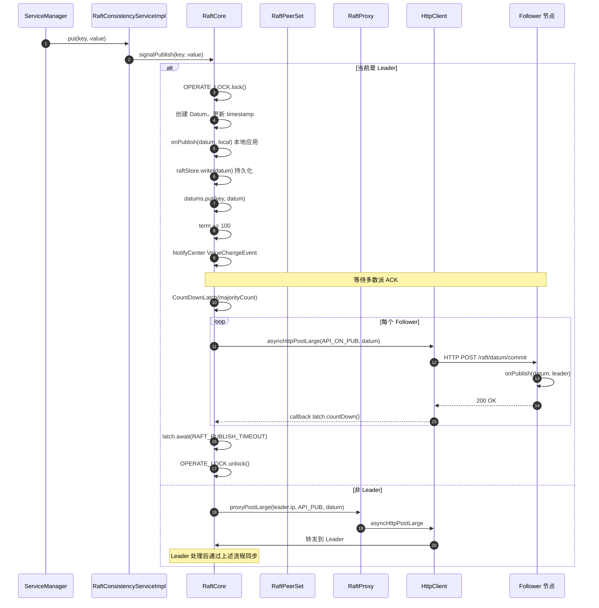
```mermaid
sequenceDiagram
    autonumber
    participant BIZ as ServiceManager
    participant RCS as RaftConsistencyServiceImpl
    participant RC as RaftCore
    participant PS as RaftPeerSet
    participant RP as RaftProxy
    participant HTTP as HttpClient
    participant F as Follower 节点

    BIZ->>RCS: put(key, value)
    RCS->>RC: signalPublish(key, value)

    alt 当前是 Leader
        RC->>RC: OPERATE_LOCK.lock()
        RC->>RC: 创建 Datum，更新 timestamp
        RC->>RC: onPublish(datum, local) 本地应用
        RC->>RC: raftStore.write(datum) 持久化
        RC->>RC: datums.put(key, datum)
        RC->>RC: term += 100
        RC->>RC: NotifyCenter ValueChangeEvent

        Note over RC,F: 等待多数派 ACK
        RC->>RC: CountDownLatch(majorityCount)
        loop 每个 Follower
            RC->>HTTP: asyncHttpPostLarge(API_ON_PUB, datum)
            HTTP->>F: HTTP POST /raft/datum/commit
            F->>F: onPublish(datum, leader)
            F-->>HTTP: 200 OK
            HTTP-->>RC: callback latch.countDown()
        end
        RC->>RC: latch.await(RAFT_PUBLISH_TIMEOUT)
        RC->>RC: OPERATE_LOCK.unlock()
    else 非 Leader
        RC->>RP: proxyPostLarge(leader.ip, API_PUB, datum)
        RP->>HTTP: asyncHttpPostLarge
        HTTP->>RC: 转发到 Leader
        Note over RC: Leader 处理后通过上述流程同步
    end
```

### 5.8 旧 Raft 选举时序

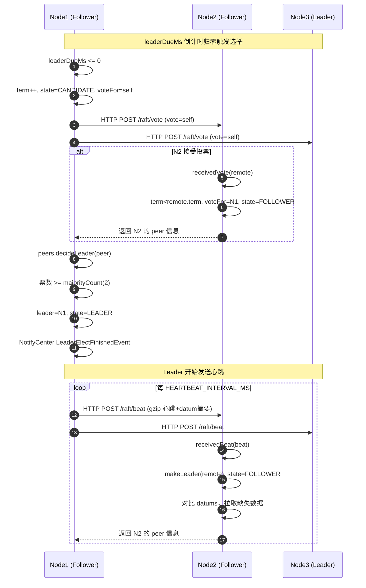
```mermaid
sequenceDiagram
    autonumber
    participant N1 as Node1 (Follower)
    participant N2 as Node2 (Follower)
    participant N3 as Node3 (Leader)

    Note over N1,N3: leaderDueMs 倒计时归零触发选举

    N1->>N1: leaderDueMs <= 0
    N1->>N1: term++, state=CANDIDATE, voteFor=self
    N1->>N2: HTTP POST /raft/vote (vote=self)
    N1->>N3: HTTP POST /raft/vote (vote=self)

    alt N2 接受投票
        N2->>N2: receivedVote(remote)
        N2->>N2: term<remote.term, voteFor=N1, state=FOLLOWER
        N2-->>N1: 返回 N2 的 peer 信息
    end

    N1->>N1: peers.decideLeader(peer)
    N1->>N1: 票数 >= majorityCount(2)
    N1->>N1: leader=N1, state=LEADER
    N1->>N1: NotifyCenter LeaderElectFinishedEvent

    Note over N1,N3: Leader 开始发送心跳
    loop 每 HEARTBEAT_INTERVAL_MS
        N1->>N2: HTTP POST /raft/beat (gzip 心跳+datum摘要)
        N1->>N3: HTTP POST /raft/beat
        N2->>N2: receivedBeat(beat)
        N2->>N2: makeLeader(remote), state=FOLLOWER
        N2->>N2: 对比 datums，拉取缺失数据
        N2-->>N1: 返回 N2 的 peer 信息
    end
```

---

## 六、新旧实现对比

### 6.1 架构对比

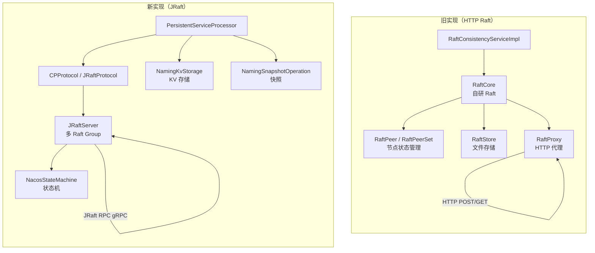
```mermaid
graph TB
    subgraph "旧实现（HTTP Raft）"
        direction TB
        O1[RaftConsistencyServiceImpl]
        O2[RaftCore<br/>自研 Raft]
        O3[RaftPeer / RaftPeerSet<br/>节点状态管理]
        O4[RaftStore<br/>文件存储]
        O5[RaftProxy<br/>HTTP 代理]
        O1 --> O2
        O2 --> O3
        O2 --> O4
        O2 --> O5
        O5 -->|HTTP POST/GET| O5
    end

    subgraph "新实现（JRaft）"
        direction TB
        N1[PersistentServiceProcessor]
        N2[CPProtocol / JRaftProtocol]
        N3[JRaftServer<br/>多 Raft Group]
        N4[NacosStateMachine<br/>状态机]
        N5[NamingKvStorage<br/>KV 存储]
        N6[NamingSnapshotOperation<br/>快照]
        N1 --> N2
        N2 --> N3
        N3 --> N4
        N1 --> N5
        N1 --> N6
        N3 -->|JRaft RPC gRPC| N3
    end
```

### 6.2 核心差异对比表

| 维度 | 旧实现（RaftCore） | 新实现（JRaft） |
|------|-------------------|----------------|
| **传输协议** | HTTP/REST | JRaft RPC（基于 gRPC） |
| **Raft 框架** | 自研 | SOFA-JRaft 工业级框架 |
| **多 Raft Group** | 单一 group | 多 group 隔离 |
| **选举** | 自定义 leaderDueMs 倒计时 + HTTP 投票 | JRaft 标准选举（PreVote、RequestVote） |
| **日志复制** | 全量 datum 同步（gzip 压缩心跳） | JRaft Log 复制（Pipeline 优化） |
| **多数派确认** | CountDownLatch 等待 | JRaft 内置 quorum |
| **持久化** | JSON 文件（每个 datum 一个文件） | JRaft Log + RocksDB + 快照 zip |
| **快照** | 无标准快照机制 | CRC64 校验的 zip 快照 |
| **线性一致性读** | 无（Follower 直接读本地） | ReadIndex 线性一致性读 |
| **状态机** | 无明确状态机抽象 | NacosStateMachine 标准实现 |
| **批量操作** | 单 key 操作 | BatchWriteRequest 批量 |
| **配置** | 硬编码常量 | 可配置（RaftConfig） |
| **维护操作** | 无 | CLI 服务（transferLeader、doSnapshot 等） |
| **错误处理** | 简单异常抛出 | FailoverClosure + 重试 + 降级 Leader 读 |

### 6.3 选举机制对比

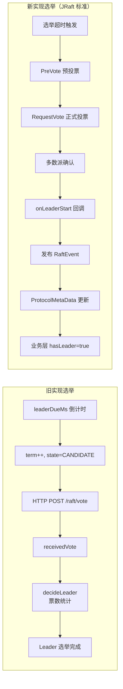
```mermaid
graph LR
    subgraph "旧实现选举"
        A1[leaderDueMs 倒计时]
        A1 --> A2[term++, state=CANDIDATE]
        A2 --> A3[HTTP POST /raft/vote]
        A3 --> A4[receivedVote]
        A4 --> A5[decideLeader<br/>票数统计]
        A5 --> A6[Leader 选举完成]
    end

    subgraph "新实现选举（JRaft 标准）"
        B1[选举超时触发]
        B1 --> B2[PreVote 预投票]
        B2 --> B3[RequestVote 正式投票]
        B3 --> B4[多数派确认]
        B4 --> B5[onLeaderStart 回调]
        B5 --> B6[发布 RaftEvent]
        B6 --> B7[ProtocolMetaData 更新]
        B7 --> B8[业务层 hasLeader=true]
    end
```

### 6.4 数据同步对比

| 特性 | 旧实现 | 新实现 |
|------|--------|--------|
| **Leader 写入** | signalPublish + HTTP 广播 | applyOperation + JRaft Log 复制 |
| **Follower 同步** | receivedBeat 心跳携带 datum 摘要 | JRaft 自动日志复制 |
| **数据格式** | JSON | Protobuf |
| **压缩** | gzip 心跳 | JRaft 内置压缩 |
| **ACK 机制** | CountDownLatch 手动等待 | JRaft quorum 自动 |
| **超时** | RAFT_PUBLISH_TIMEOUT | 10s CompletableFuture |

### 6.5 存储对比

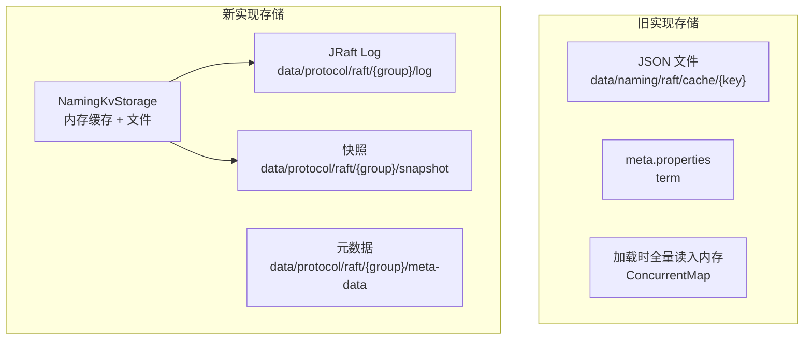
```mermaid
graph TB
    subgraph "旧实现存储"
        O1["JSON 文件<br/>data/naming/raft/cache/{key}"]
        O2["meta.properties<br/>term"]
        O3["加载时全量读入内存<br/>ConcurrentMap"]
    end

    subgraph "新实现存储"
        N1["NamingKvStorage<br/>内存缓存 + 文件"]
        N2["JRaft Log<br/>data/protocol/raft/{group}/log"]
        N3["快照<br/>data/protocol/raft/{group}/snapshot"]
        N4["元数据<br/>data/protocol/raft/{group}/meta-data"]
        N1 --> N2
        N1 --> N3
    end
```

---

## 七、关键设计总结

### 7.1 双实现并存的设计意图

1. **滚动升级兼容**：1.4.8 集群中可能混合 1.3.x 和 1.4.x 节点，旧节点无法理解 JRaft 协议
2. **渐进式迁移**：`ClusterVersionJudgement` 在所有节点升级到 1.4.0+ 后自动切换
3. **回滚安全**：若升级失败，可回退到旧实现

### 7.2 切换时机

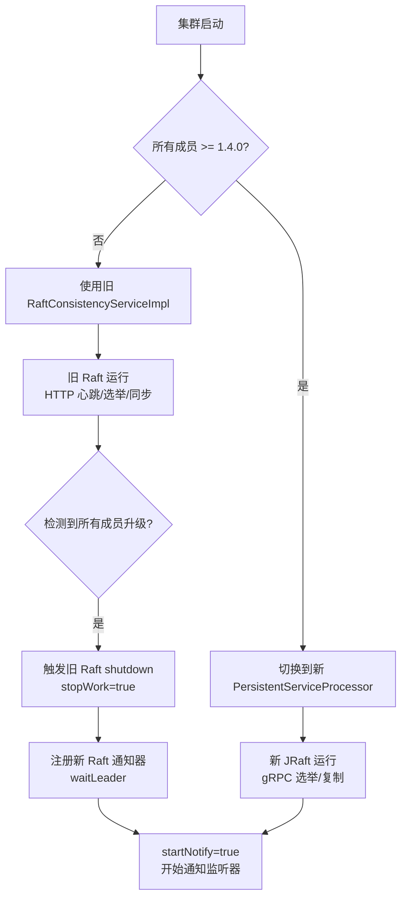
```mermaid
flowchart TD
    A[集群启动] --> B{所有成员 >= 1.4.0?}
    B -->|否| C[使用旧 RaftConsistencyServiceImpl]
    B -->|是| D[切换到新 PersistentServiceProcessor]
    C --> E[旧 Raft 运行<br/>HTTP 心跳/选举/同步]
    D --> F[新 JRaft 运行<br/>gRPC 选举/复制]
    E --> G{检测到所有成员升级?}
    G -->|是| H[触发旧 Raft shutdown<br/>stopWork=true]
    H --> I[注册新 Raft 通知器<br/>waitLeader]
    I --> J[startNotify=true<br/>开始通知监听器]
    F --> J
```

### 7.3 JRaft 多 Group 设计

Nacos 为不同业务创建独立的 Raft Group：

| Group | 业务模块 | 用途 |
|-------|----------|------|
| `naming_persistent_service` | Naming | 持久化服务实例、服务元数据 |
| 其他 | Config、Core 等 | 各自的持久化数据 |

**设计优势**：
- **故障隔离**：一个 group 的故障不影响其他
- **独立配置**：每个 group 可有不同参数
- **并行性能**：不同 group 的日志复制互不阻塞

### 7.4 线性一致性读设计

新实现使用 ReadIndex 保证线性一致性：

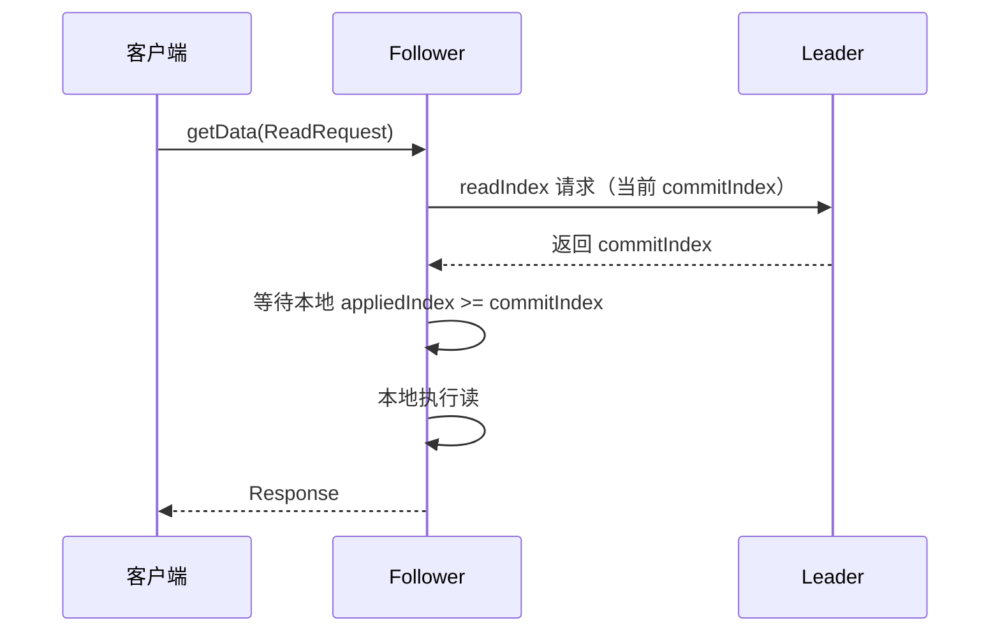
```mermaid
sequenceDiagram
    participant Client as 客户端
    participant Follower as Follower
    participant Leader as Leader

    Client->>Follower: getData(ReadRequest)
    Follower->>Leader: readIndex 请求（当前 commitIndex）
    Leader-->>Follower: 返回 commitIndex
    Follower->>Follower: 等待本地 appliedIndex >= commitIndex
    Follower->>Follower: 本地执行读
    Follower-->>Client: Response
```

**优势**：相比 Leader 读，减少网络跳转；相比 Follower 直接读，保证一致性。

### 7.5 事件驱动通知机制

新实现通过 `NotifyCenter` 实现事件驱动：

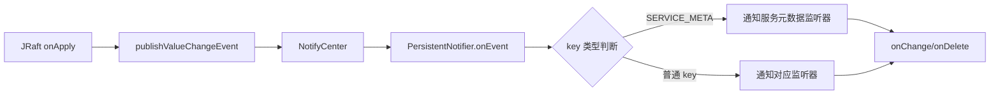
```mermaid
graph LR
    A[JRaft onApply] --> B[publishValueChangeEvent]
    B --> C[NotifyCenter]
    C --> D[PersistentNotifier.onEvent]
    D --> E{key 类型判断}
    E -->|SERVICE_META| F[通知服务元数据监听器]
    E -->|普通 key| G[通知对应监听器]
    F --> H[onChange/onDelete]
    G --> H
```

### 7.6 旧 Raft 的局限性

1. **HTTP 开销大**：每次心跳携带全量 datum 摘要，即使 gzip 压缩也占用带宽
2. **无标准日志复制**：使用 datum 摘要 + 拉取方式，非标准 Raft log
3. **无 ReadIndex**：Follower 直接读本地，可能读到过期数据
4. **单 Group**：所有业务共用一个 Raft 实例，无法隔离
5. **无维护工具**：缺少 transferLeader、doSnapshot 等 CLI 操作

### 7.7 新 JRaft 的改进

1. **工业级框架**：SOFA-JRaft 经过大规模生产验证
2. **标准 Raft**：完整的 Leader 选举、日志复制、快照机制
3. **多 Group 隔离**：每个业务独立 Raft Group
4. **Pipeline 复制**：支持并行日志复制，提升吞吐
5. **ReadIndex**：线性一致性读，兼顾性能和一致性
6. **CLI 维护**：支持在线 transferLeader、changePeers、doSnapshot
7. **共享定时器**：多个 group 共用 election/vote/stepDown 定时器，节省资源

---

## 八、配置参考

### 8.1 JRaft 配置项（`nacos.core.protocol.raft`）

| 配置 Key | 默认值 | 说明 |
|----------|--------|------|
| `election_timeout_ms` | 5000 | 选举超时 |
| `snapshot_interval_secs` | 1800 | 快照间隔（秒） |
| `rpc_request_timeout_ms` | 5000 | RPC 超时 |
| `read_index_type` | ReadOnlySafe | 读类型 |
| `core_thread_num` | 8 | 核心线程数 |
| `cli_service_thread_num` | 4 | CLI 线程数 |
| `max_byte_count_per_rpc` | 131072 | 单次 RPC 最大字节 |
| `max_entries_size` | 1024 | 单次日志条目数 |
| `sync` | true | 是否同步刷盘 |
| `replicator_pipeline` | true | Pipeline 复制 |

### 8.2 Naming 模块配置

| 配置 Key | 默认值 | 说明 |
|----------|--------|------|
| `nacos.naming.use-new-raft.first` | false | 是否优先使用新 Raft |

---

## 九、源码文件索引

### Core 模块

| 文件 | 作用 |
|------|------|
| `core/src/main/java/com/alibaba/nacos/core/distributed/ProtocolManager.java` | 协议管理器 |
| `core/src/main/java/com/alibaba/nacos/core/distributed/raft/JRaftServer.java` | JRaft 服务器 |
| `core/src/main/java/com/alibaba/nacos/core/distributed/raft/JRaftProtocol.java` | CP 协议 JRaft 实现 |
| `core/src/main/java/com/alibaba/nacos/core/distributed/raft/NacosStateMachine.java` | 状态机 |
| `core/src/main/java/com/alibaba/nacos/core/distributed/raft/NacosClosure.java` | 闭包 |
| `core/src/main/java/com/alibaba/nacos/core/distributed/raft/JSnapshotOperation.java` | 快照操作接口 |
| `core/src/main/java/com/alibaba/nacos/core/distributed/raft/RaftConfig.java` | Raft 配置 |
| `core/src/main/java/com/alibaba/nacos/core/distributed/raft/RaftEvent.java` | Raft 事件 |
| `core/src/main/java/com/alibaba/nacos/core/distributed/raft/JRaftMaintainService.java` | 维护服务 |
| `core/src/main/java/com/alibaba/nacos/core/distributed/raft/processor/AbstractProcessor.java` | 抽象处理器 |
| `core/src/main/java/com/alibaba/nacos/core/distributed/raft/processor/NacosWriteRequestProcessor.java` | 写处理器 |
| `core/src/main/java/com/alibaba/nacos/core/distributed/raft/processor/NacosReadRequestProcessor.java` | 读处理器 |
| `core/src/main/java/com/alibaba/nacos/core/distributed/raft/processor/NacosLogProcessor.java` | Log 处理器（废弃） |
| `core/src/main/java/com/alibaba/nacos/core/distributed/raft/utils/JRaftUtils.java` | 工具类 |
| `core/src/main/java/com/alibaba/nacos/core/distributed/raft/utils/RaftExecutor.java` | 线程池 |
| `core/src/main/java/com/alibaba/nacos/core/distributed/raft/utils/RaftOptionsBuilder.java` | RaftOptions 构建 |
| `core/src/main/java/com/alibaba/nacos/core/distributed/raft/utils/JRaftOps.java` | 维护操作枚举 |
| `core/src/main/java/com/alibaba/nacos/core/distributed/raft/utils/FailoverClosureImpl.java` | 故障闭包 |
| `core/src/main/java/com/alibaba/nacos/core/distributed/raft/RaftSysConstants.java` | 系统常量 |

### Consistency 模块

| 文件 | 作用 |
|------|------|
| `consistency/src/main/java/com/alibaba/nacos/consistency/ConsistencyProtocol.java` | 顶层接口 |
| `consistency/src/main/java/com/alibaba/nacos/consistency/cp/CPProtocol.java` | CP 协议接口 |
| `consistency/src/main/java/com/alibaba/nacos/consistency/cp/RequestProcessor4CP.java` | CP 处理器基类 |
| `consistency/src/main/java/com/alibaba/nacos/consistency/cp/MetadataKey.java` | 元数据键 |
| `consistency/src/main/java/com/alibaba/nacos/consistency/ProtocolMetaData.java` | 元数据存储 |
| `consistency/src/main/java/com/alibaba/nacos/consistency/serialize/HessianSerializer.java` | Hessian 序列化 |

### Naming 模块（新实现）

| 文件 | 作用 |
|------|------|
| `naming/src/main/java/com/alibaba/nacos/naming/consistency/persistent/PersistentConsistencyService.java` | 持久化服务接口 |
| `naming/src/main/java/com/alibaba/nacos/naming/consistency/persistent/PersistentConsistencyServiceDelegateImpl.java` | 委托实现 |
| `naming/src/main/java/com/alibaba/nacos/naming/consistency/persistent/ClusterVersionJudgement.java` | 版本判断 |
| `naming/src/main/java/com/alibaba/nacos/naming/consistency/persistent/PersistentNotifier.java` | 通知器 |
| `naming/src/main/java/com/alibaba/nacos/naming/consistency/persistent/impl/BasePersistentServiceProcessor.java` | 基础处理器 |
| `naming/src/main/java/com/alibaba/nacos/naming/consistency/persistent/impl/PersistentServiceProcessor.java` | 集群模式 |
| `naming/src/main/java/com/alibaba/nacos/naming/consistency/persistent/impl/StandalonePersistentServiceProcessor.java` | 单机模式 |
| `naming/src/main/java/com/alibaba/nacos/naming/consistency/persistent/impl/NamingKvStorage.java` | KV 存储 |
| `naming/src/main/java/com/alibaba/nacos/naming/consistency/persistent/impl/NamingSnapshotOperation.java` | 快照操作 |
| `naming/src/main/java/com/alibaba/nacos/naming/consistency/persistent/impl/BatchWriteRequest.java` | 批量写请求 |
| `naming/src/main/java/com/alibaba/nacos/naming/consistency/persistent/impl/BatchReadResponse.java` | 批量读响应 |

### Naming 模块（旧实现）

| 文件 | 作用 |
|------|------|
| `naming/src/main/java/com/alibaba/nacos/naming/consistency/persistent/raft/RaftConsistencyServiceImpl.java` | 旧 Raft 服务 |
| `naming/src/main/java/com/alibaba/nacos/naming/consistency/persistent/raft/RaftCore.java` | Raft 核心 |
| `naming/src/main/java/com/alibaba/nacos/naming/consistency/persistent/raft/RaftPeer.java` | 节点状态 |
| `naming/src/main/java/com/alibaba/nacos/naming/consistency/persistent/raft/RaftPeerSet.java` | 节点集合 |
| `naming/src/main/java/com/alibaba/nacos/naming/consistency/persistent/raft/RaftStore.java` | 数据存储 |
| `naming/src/main/java/com/alibaba/nacos/naming/consistency/persistent/raft/RaftProxy.java` | HTTP 代理 |
| `naming/src/main/java/com/alibaba/nacos/naming/consistency/persistent/raft/RaftListener.java` | 监听器 |
| `naming/src/main/java/com/alibaba/nacos/naming/consistency/persistent/raft/BaseRaftEvent.java` | 基础事件 |
| `naming/src/main/java/com/alibaba/nacos/naming/consistency/persistent/raft/LeaderElectFinishedEvent.java` | 选举完成事件 |
| `naming/src/main/java/com/alibaba/nacos/naming/consistency/persistent/raft/MakeLeaderEvent.java` | 成为 Leader 事件 |

---

**文档版本**：基于 Nacos 1.4.8（分支 `develop-1.4.8`）源码分析
**最后更新**：2026-07-06

---

## 十、Nacos 1.4.8 vs 2.4.2 CP 实现差异对比

Nacos 2.4.2 的 CP（JRaft）实现相比 1.4.8 发生了**根本性的架构重构**。本章节深入对比两个版本的差异。

### 10.1 整体架构对比

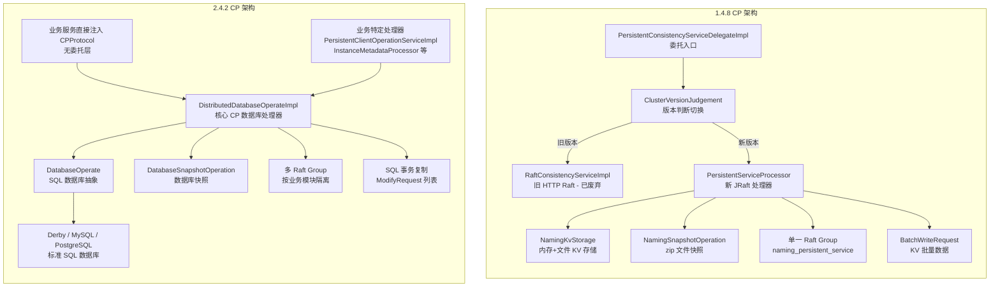
```mermaid
graph TB
    subgraph "1.4.8 CP 架构"
        direction TB
        A1[PersistentConsistencyServiceDelegateImpl<br/>委托入口]
        A2[ClusterVersionJudgement<br/>版本判断切换]
        A3R[RaftConsistencyServiceImpl<br/>旧 HTTP Raft - 已废弃]
        A3N[PersistentServiceProcessor<br/>新 JRaft 处理器]
        A4[NamingKvStorage<br/>内存+文件 KV 存储]
        A5[NamingSnapshotOperation<br/>zip 文件快照]
        A6[单一 Raft Group<br/>naming_persistent_service]
        A7[BatchWriteRequest<br/>KV 批量数据]

        A1 --> A2
        A2 -->|旧版本| A3R
        A2 -->|新版本| A3N
        A3N --> A4
        A3N --> A5
        A3N --> A6
        A3N --> A7
    end

    subgraph "2.4.2 CP 架构"
        direction TB
        B1[业务服务直接注入 CPProtocol<br/>无委托层]
        B2[DistributedDatabaseOperateImpl<br/>核心 CP 数据库处理器]
        B3[DatabaseOperate<br/>SQL 数据库抽象]
        B4[Derby / MySQL / PostgreSQL<br/>标准 SQL 数据库]
        B5[DatabaseSnapshotOperation<br/>数据库快照]
        B6[多 Raft Group<br/>按业务模块隔离]
        B7[业务特定处理器<br/>PersistentClientOperationServiceImpl<br/>InstanceMetadataProcessor 等]
        B8[SQL 事务复制<br/>ModifyRequest 列表]

        B1 --> B2
        B2 --> B3
        B3 --> B4
        B2 --> B5
        B2 --> B6
        B7 --> B2
        B2 --> B8
    end
```

### 10.2 核心架构变化

#### 10.2.1 存储模型的根本性变化

| 维度 | 1.4.8 | 2.4.2 |
|------|-------|-------|
| **存储类型** | KV 存储（`NamingKvStorage`） | SQL 数据库（Derby/MySQL/PostgreSQL） |
| **存储层次** | 内存缓存 + 文件存储双层 | 关系型数据库（JDBC） |
| **数据模型** | `Map<byte[], byte[]>` 键值对 | 关系表（行/列） |
| **查询能力** | 仅 key 查找 | 标准 SQL 查询（支持 WHERE、JOIN 等） |
| **事务支持** | 无事务（单次 batchPut） | 完整 ACID 事务 |
| **持久化引擎** | 自研文件存储 | Spring JdbcTemplate + TransactionTemplate |

**1.4.8 KV 存储示例**（`NamingKvStorage`）：

```java
public class NamingKvStorage extends MemoryKvStorage {
    private final KvStorage baseDirStorage;  // 文件存储
    private final Map<String, KvStorage> namespaceKvStorage;

    public byte[] get(byte[] key) {
        byte[] value = super.get(key);  // 先查内存
        if (value != null) return value;
        // 内存未命中，查文件存储
        KvStorage actualStorage = createActualStorageIfAbsent(key);
        return actualStorage.get(key);
    }
}
```

**2.4.2 SQL 存储示例**（`DistributedDatabaseOperateImpl`）：

```java
public class DistributedDatabaseOperateImpl extends RequestProcessor4CP {
    private final DatabaseOperate databaseOperate;  // SQL 数据库

    @Override
    public Response onApply(WriteRequest request) {
        // 反序列化 SQL 操作列表
        final DistributedDatabaseOperation operation = serializer.deserialize(
            request.getData().toByteArray(), DistributedDatabaseOperation.class);
        // 执行 SQL 事务
        final Boolean success = databaseOperate.update(operation.getRequests());
        return Response.newBuilder().setSuccess(success).build();
    }

    @Override
    public Response onRequest(ReadRequest request) {
        // 直接执行 SQL 查询
        final DistributedDatabaseQuery query = serializer.deserialize(...);
        final List<Map<String, Object>> result = databaseOperate.queryMany(
            query.getSql(), query.getArgs());
        return Response.newBuilder().setSuccess(true).setData(...).build();
    }
}
```

#### 10.2.2 委托层与版本兼容的移除

| 维度 | 1.4.8 | 2.4.2 |
|------|-------|-------|
| **委托层** | `PersistentConsistencyServiceDelegateImpl` | 无（业务直接注入） |
| **版本判断** | `ClusterVersionJudgement` 每 5s 检查 | 移除 |
| **旧 Raft 兼容** | 保留 `RaftConsistencyServiceImpl` | 完全移除 |
| **切换机制** | 动态切换新旧实现 | 无需切换 |

**1.4.8 委托模式**：

```java
public class PersistentConsistencyServiceDelegateImpl {
    private volatile boolean switchNewPersistentService = false;

    private PersistentConsistencyService switchOne() {
        return switchNewPersistentService
            ? newPersistentConsistencyService
            : oldPersistentConsistencyService;
    }
}
```

**2.4.2 直接注入**：业务服务直接通过 `CPProtocol` 接口使用，无需委托层。

#### 10.2.3 多 Raft Group 架构

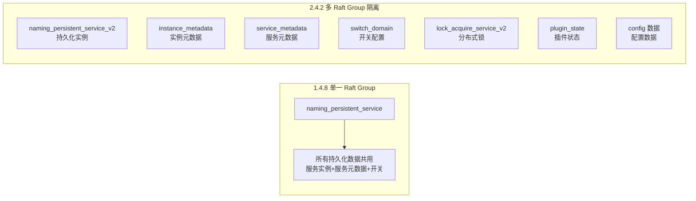
```mermaid
graph LR
    subgraph "1.4.8 单一 Raft Group"
        A1[naming_persistent_service]
        A1 --> A2[所有持久化数据共用<br/>服务实例+服务元数据+开关]
    end

    subgraph "2.4.2 多 Raft Group 隔离"
        B1[naming_persistent_service_v2<br/>持久化实例]
        B2[instance_metadata<br/>实例元数据]
        B3[service_metadata<br/>服务元数据]
        B4[switch_domain<br/>开关配置]
        B5[lock_acquire_service_v2<br/>分布式锁]
        B6[plugin_state<br/>插件状态]
        B7[config 数据<br/>配置数据]
    end
```

**2.4.2 多 Group 优势**：
- **故障隔离**：一个 group 的故障不影响其他业务
- **独立配置**：每个 group 可有不同的 Raft 参数
- **并行性能**：不同 group 的日志复制互不阻塞
- **独立快照**：每个 group 独立管理快照

### 10.3 请求处理器模型变化

#### 10.3.1 1.4.8：集中式处理器

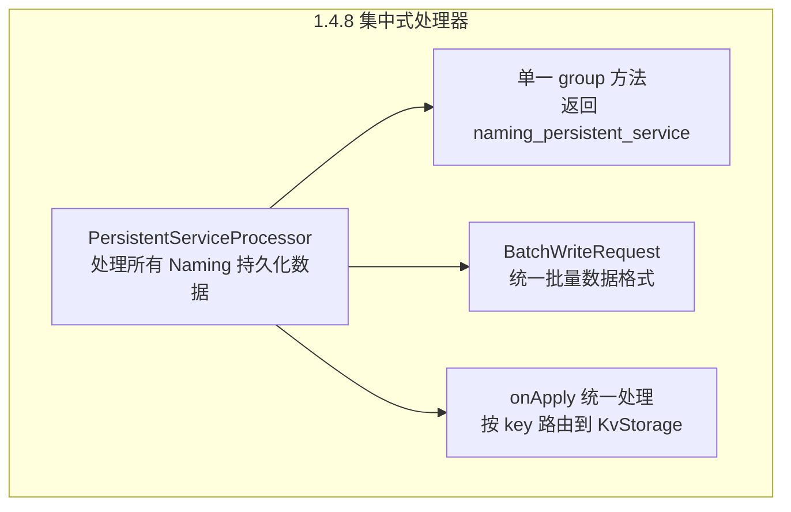
```mermaid
graph TB
    subgraph "1.4.8 集中式处理器"
        A1[PersistentServiceProcessor<br/>处理所有 Naming 持久化数据]
        A2[单一 group 方法<br/>返回 naming_persistent_service]
        A3[BatchWriteRequest<br/>统一批量数据格式]
        A4[onApply 统一处理<br/>按 key 路由到 KvStorage]

        A1 --> A2
        A1 --> A3
        A1 --> A4
    end
```

1.4.8 中所有 Naming 持久化数据由一个 `PersistentServiceProcessor` 处理，通过 `BatchWriteRequest` 统一封装。

#### 10.3.2 2.4.2：分布式业务处理器

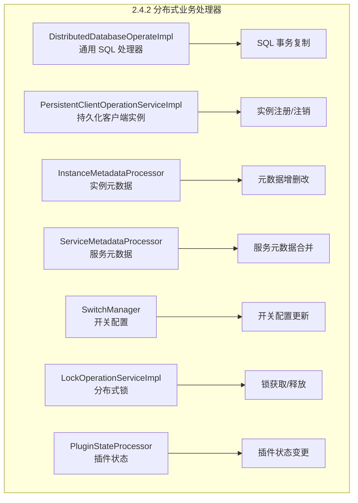
```mermaid
graph TB
    subgraph "2.4.2 分布式业务处理器"
        B1[DistributedDatabaseOperateImpl<br/>通用 SQL 处理器]
        B2[PersistentClientOperationServiceImpl<br/>持久化客户端实例]
        B3[InstanceMetadataProcessor<br/>实例元数据]
        B4[ServiceMetadataProcessor<br/>服务元数据]
        B5[SwitchManager<br/>开关配置]
        B6[LockOperationServiceImpl<br/>分布式锁]
        B7[PluginStateProcessor<br/>插件状态]

        B1 --> B1A[SQL 事务复制]
        B2 --> B2A[实例注册/注销]
        B3 --> B3A[元数据增删改]
        B4 --> B4A[服务元数据合并]
        B5 --> B5A[开关配置更新]
        B6 --> B6A[锁获取/释放]
        B7 --> B7A[插件状态变更]
    end
```

2.4.2 中每个业务模块注册自己的 `RequestProcessor4CP`，拥有独立的 Raft Group 和状态机。

#### 10.3.3 处理器对比

| 处理器 | 1.4.8 | 2.4.2 |
|--------|-------|-------|
| **持久化实例** | PersistentServiceProcessor | PersistentClientOperationServiceImpl |
| **实例元数据** | PersistentServiceProcessor（共用） | InstanceMetadataProcessor |
| **服务元数据** | PersistentServiceProcessor（共用） | ServiceMetadataProcessor |
| **开关配置** | PersistentServiceProcessor（共用） | SwitchManager |
| **分布式锁** | 无 | LockOperationServiceImpl |
| **插件状态** | 无 | PluginStateProcessor |
| **通用 SQL** | 无 | DistributedDatabaseOperateImpl |

### 10.4 数据模型与序列化对比

#### 10.4.1 数据载体

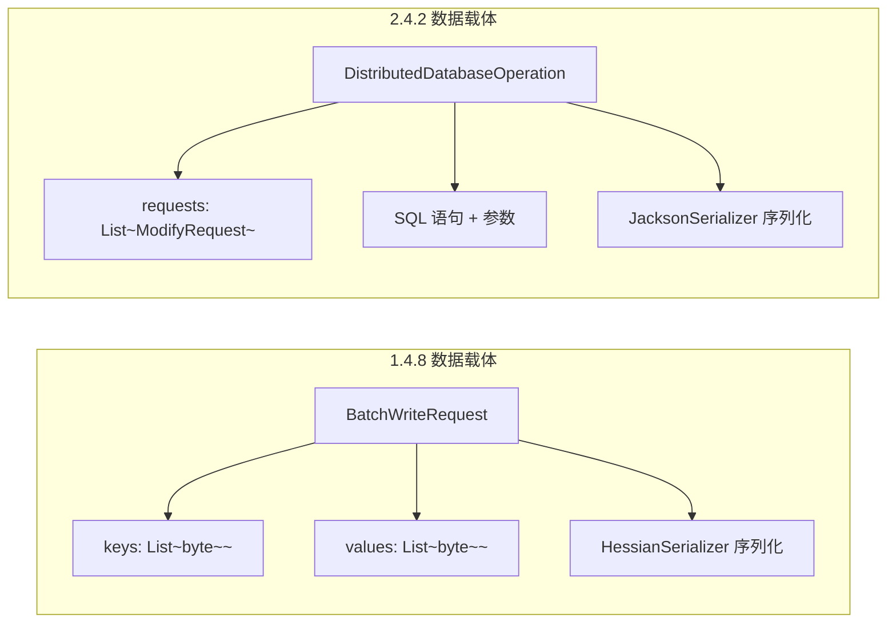
```mermaid
graph LR
    subgraph "1.4.8 数据载体"
        A1[BatchWriteRequest]
        A2[keys: List~byte~~]
        A3[values: List~byte~~]
        A4[HessianSerializer 序列化]
        A1 --> A2
        A1 --> A3
        A1 --> A4
    end

    subgraph "2.4.2 数据载体"
        B1[DistributedDatabaseOperation]
        B2[requests: List~ModifyRequest~]
        B3[SQL 语句 + 参数]
        B4[JacksonSerializer 序列化]
        B1 --> B2
        B1 --> B3
        B1 --> B4
    end
```

#### 10.4.2 SQL 事务复制机制（2.4.2 独有）

2.4.2 的核心创新是**将 SQL 操作作为 Raft 日志的 payload**：

```java
// 2.4.2 写入流程
public void update(String sql, Object... args) {
    // 1. 构建 SQL 修改请求
    ModifyRequest request = new ModifyRequest(sql, args);

    // 2. 封装为 DistributedDatabaseOperation
    DistributedDatabaseOperation operation = new DistributedDatabaseOperation();
    operation.setRequests(Collections.singletonList(request));

    // 3. 创建 WriteRequest
    WriteRequest writeRequest = WriteRequest.newBuilder()
        .setGroup(group)
        .setData(ByteString.copyFrom(serializer.serialize(operation)))
        .build();

    // 4. 提交到 Raft
    protocol.write(writeRequest);

    // 5. Raft 复制后，onApply 在所有节点执行相同的 SQL
}

// onApply 在每个节点执行
@Override
public Response onApply(WriteRequest request) {
    DistributedDatabaseOperation operation = serializer.deserialize(...);
    // 所有节点执行相同的 SQL 语句
    databaseOperate.update(operation.getRequests());
    return Response.newBuilder().setSuccess(true).build();
}
```

**优势**：
- 所有节点执行相同 SQL，保证数据一致性
- 利用数据库 ACID 特性
- 支持 SQL 的所有能力（JOIN、事务、约束）

### 10.5 快照机制对比

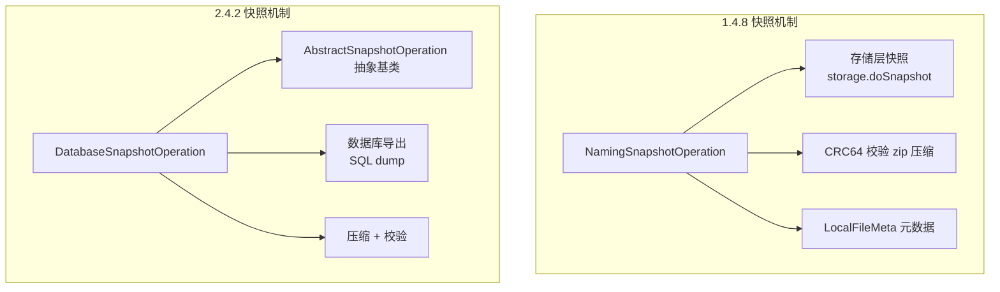
```mermaid
graph TB
    subgraph "1.4.8 快照机制"
        A1[NamingSnapshotOperation]
        A2[存储层快照<br/>storage.doSnapshot]
        A3[CRC64 校验 zip 压缩]
        A4[LocalFileMeta 元数据]
        A1 --> A2
        A1 --> A3
        A1 --> A4
    end

    subgraph "2.4.2 快照机制"
        B1[DatabaseSnapshotOperation]
        B2[AbstractSnapshotOperation 抽象基类]
        B3[数据库导出<br/>SQL dump]
        B4[压缩 + 校验]
        B1 --> B2
        B1 --> B3
        B1 --> B4
    end
```

| 快照维度 | 1.4.8 | 2.4.2 |
|----------|-------|-------|
| **快照类** | NamingSnapshotOperation | DatabaseSnapshotOperation |
| **基类** | 直接实现 SnapshotOperation | 继承 AbstractSnapshotOperation |
| **快照内容** | KV 存储目录 | SQL 数据库 dump |
| **压缩格式** | zip + CRC64 | zip + 校验 |
| **加载方式** | 解压到存储目录 | SQL 导入数据库 |
| **触发间隔** | 30min（可配置） | 可配置 |

### 10.6 读写流程对比

#### 10.6.1 写入流程对比

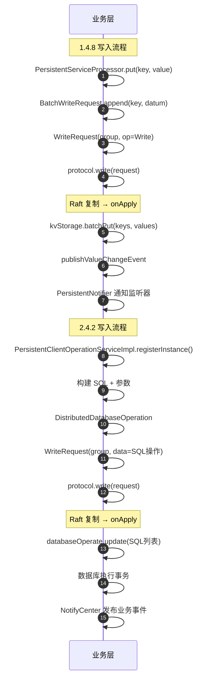
```mermaid
sequenceDiagram
    autonumber
    participant BIZ as 业务层

    Note over BIZ: 1.4.8 写入流程
    BIZ->>BIZ: PersistentServiceProcessor.put(key, value)
    BIZ->>BIZ: BatchWriteRequest.append(key, datum)
    BIZ->>BIZ: WriteRequest(group, op=Write)
    BIZ->>BIZ: protocol.write(request)
    Note over BIZ: Raft 复制 → onApply
    BIZ->>BIZ: kvStorage.batchPut(keys, values)
    BIZ->>BIZ: publishValueChangeEvent
    BIZ->>BIZ: PersistentNotifier 通知监听器

    Note over BIZ: 2.4.2 写入流程
    BIZ->>BIZ: PersistentClientOperationServiceImpl.registerInstance()
    BIZ->>BIZ: 构建 SQL + 参数
    BIZ->>BIZ: DistributedDatabaseOperation
    BIZ->>BIZ: WriteRequest(group, data=SQL操作)
    BIZ->>BIZ: protocol.write(request)
    Note over BIZ: Raft 复制 → onApply
    BIZ->>BIZ: databaseOperate.update(SQL列表)
    BIZ->>BIZ: 数据库执行事务
    BIZ->>BIZ: NotifyCenter 发布业务事件
```

#### 10.6.2 读取流程对比

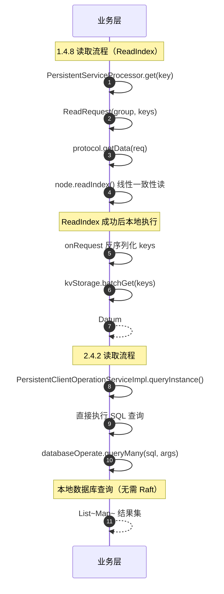
```mermaid
sequenceDiagram
    autonumber
    participant BIZ as 业务层

    Note over BIZ: 1.4.8 读取流程（ReadIndex）
    BIZ->>BIZ: PersistentServiceProcessor.get(key)
    BIZ->>BIZ: ReadRequest(group, keys)
    BIZ->>BIZ: protocol.getData(req)
    BIZ->>BIZ: node.readIndex() 线性一致性读
    Note over BIZ: ReadIndex 成功后本地执行
    BIZ->>BIZ: onRequest 反序列化 keys
    BIZ->>BIZ: kvStorage.batchGet(keys)
    BIZ-->>BIZ: Datum

    Note over BIZ: 2.4.2 读取流程
    BIZ->>BIZ: PersistentClientOperationServiceImpl.queryInstance()
    BIZ->>BIZ: 直接执行 SQL 查询
    BIZ->>BIZ: databaseOperate.queryMany(sql, args)
    Note over BIZ: 本地数据库查询（无需 Raft）
    BIZ-->>BIZ: List~Map~ 结果集
```

**关键差异**：
- **1.4.8**：读操作也通过 Raft ReadIndex（线性一致性读）
- **2.4.2**：读操作直接查本地数据库（最终一致性，性能更高）

### 10.7 旧 Raft 兼容性处理

| 维度 | 1.4.8 | 2.4.2 |
|------|-------|-------|
| **旧 Raft 实现** | 保留 `RaftConsistencyServiceImpl` | 完全移除 |
| **ClusterVersionJudgement** | 存在，管理切换 | 移除 |
| **版本兼容** | 支持 1.3.x 混合集群 | 仅支持 2.x 集群 |
| **旧数据迁移** | 无 | `OldDataOperation` 适配枚举 |
| **元数据清理** | `RaftListener.removeOldRaftMetadata` | 启动时自动清理 |

### 10.8 持久化层抽象（2.4.2 新增）

2.4.2 引入了独立的 `persistence` 模块，提供数据库操作抽象：

```mermaid
graph TB
    subgraph "2.4.2 Persistence 模块"
        A[DatabaseOperate 接口]
        B[BaseDatabaseOperate 抽象实现]
        C[StandaloneDatabaseOperateImpl<br/>单机模式]
        D[ExternalDataSourceServiceImpl<br/>MySQL 外部数据源]
        E[LocalDataSourceServiceImpl<br/>Derby 本地数据源]

        A --> B
        B --> C
        B --> D
        B --> E
    end

    subgraph "核心机制"
        F[EmbeddedApplyHook<br/>Raft 应用后回调]
        G[EmbeddedApplyHookHolder<br/>钩子持有者]
        H[RaftDbErrorEvent<br/>数据库错误事件]
    end

    A --> F
    F --> G
    A --> H
```

**DatabaseOperate 接口**：

```java
public interface DatabaseOperate {
    <T> T queryOne(String sql, Object... args);
    <T> List<T> queryMany(String sql, Object... args);
    Boolean update(List<ModifyRequest> requests);
    void dataImport(Collection<ModifyRequest> requests);
}
```

**EmbeddedApplyHook 机制**：

```java
public abstract class EmbeddedApplyHook {
    protected EmbeddedApplyHook() {
        EmbeddedApplyHookHolder.getInstance().register(this);
    }
    public abstract void afterApply(WriteRequest log);
}
```

业务模块可以注册 `EmbeddedApplyHook`，在 Raft 日志应用后执行回调（如缓存更新、事件发布）。

### 10.9 Raft Group 划分详细对比

| Raft Group | 1.4.8 | 2.4.2 | 用途 |
|------------|-------|-------|------|
| `naming_persistent_service` | ✅ 单一 | - | 所有持久化数据 |
| `naming_persistent_service_v2` | - | ✅ | 持久化实例 |
| `instance_metadata` | - | ✅ | 实例元数据 |
| `service_metadata` | - | ✅ | 服务元数据 |
| `switch_domain` | - | ✅ | 开关配置 |
| `lock_acquire_service_v2` | - | ✅ | 分布式锁 |
| `plugin_state` | - | ✅ | 插件状态 |
| config 相关 | 独立实现 | ✅ | 配置数据 |

### 10.10 核心差异总结表

| 维度 | 1.4.8 | 2.4.2 |
|------|-------|-------|
| **存储模型** | KV 存储（内存+文件） | SQL 数据库（Derby/MySQL/PostgreSQL） |
| **数据格式** | `Map<byte[], byte[]>` | 关系表（SQL） |
| **事务支持** | 无 | ACID 事务 |
| **查询能力** | 仅 key 查找 | 完整 SQL |
| **核心处理器** | PersistentServiceProcessor | DistributedDatabaseOperateImpl |
| **处理器模型** | 集中式（一个处理器处理所有） | 分布式（每业务一个处理器） |
| **Raft Group** | 单一 group | 多 group 隔离 |
| **委托层** | PersistentConsistencyServiceDelegateImpl | 无 |
| **旧 Raft 兼容** | 保留（ClusterVersionJudgement 切换） | 移除 |
| **快照机制** | KV 目录 zip | SQL dump zip |
| **读一致性** | ReadIndex 线性一致性 | 本地数据库读（最终一致） |
| **序列化** | HessianSerializer | JacksonSerializer |
| **数据载体** | BatchWriteRequest | DistributedDatabaseOperation |
| **数据复制的单位** | Datum（key+value） | SQL 操作（ModifyRequest 列表） |
| **持久化引擎** | 自研文件存储 | Spring JdbcTemplate |
| **多数据库支持** | 无 | Derby/MySQL/PostgreSQL |
| **业务隔离** | 无（共用 group） | 有（独立 group） |
| **分布式锁** | 无 | LockOperationServiceImpl |
| **插件状态** | 无 | PluginStateProcessor |
| **EmbeddedApplyHook** | 无 | 有（Raft 应用后回调） |

### 10.11 架构演进的设计意图

#### 10.11.1 为何从 KV 转向 SQL

1. **查询能力**：SQL 支持复杂查询（WHERE、JOIN、聚合），KV 仅支持 key 查找
2. **事务保证**：SQL 提供 ACID 事务，避免部分更新
3. **多数据库支持**：支持 MySQL/PostgreSQL，便于企业部署
4. **数据一致性**：所有节点执行相同 SQL，天然保证一致
5. **运维便利**：SQL 数据库有成熟的备份、监控工具

#### 10.11.2 为何引入多 Raft Group

1. **故障隔离**：锁服务的 Raft 故障不影响服务发现
2. **独立配置**：高频写入的 group 可配置更短的选举超时
3. **并行性能**：不同 group 的日志复制互不阻塞
4. **独立快照**：每个 group 独立管理快照，避免大快照阻塞

#### 10.11.3 为何移除旧 Raft 兼容

1. **简化架构**：双实现并存增加复杂度，移除后代码更清晰
2. **性能提升**：不再需要版本判断和切换开销
3. **维护成本**：旧 Raft 已废弃，维护成本高
4. **版本要求**：2.x 要求所有节点升级到 2.x，无需兼容 1.3.x

#### 10.11.4 读一致性的权衡

```mermaid
graph LR
    subgraph "1.4.8 读一致性"
        A1[ReadIndex 线性一致性读]
        A2[强一致但性能较低]
        A3[每次读需 Raft 确认]
    end

    subgraph "2.4.2 读一致性"
        B1[本地数据库读]
        B2[最终一致但性能高]
        B3[依赖 Raft 复制保证最终一致]
    end
```

2.4.2 选择**最终一致性读**的设计权衡：
- **性能优先**：读操作不经过 Raft，减少网络开销
- **适用场景**：服务发现、配置查询等对实时性要求不高的场景
- **一致性保证**：写操作仍通过 Raft 保证强一致，读操作跟随写入最终收敛

### 10.12 源码文件对比索引

#### 1.4.8 独有（2.4.2 已移除）

| 文件 | 作用 |
|------|------|
| `PersistentConsistencyServiceDelegateImpl` | 委托层 |
| `ClusterVersionJudgement` | 版本判断 |
| `PersistentServiceProcessor` | 集中式处理器 |
| `StandalonePersistentServiceProcessor` | 单机处理器 |
| `BasePersistentServiceProcessor` | 基类 |
| `NamingKvStorage` | KV 存储 |
| `NamingSnapshotOperation` | KV 快照 |
| `PersistentNotifier` | 通知器 |
| `RaftConsistencyServiceImpl` | 旧 Raft 服务 |
| `RaftCore` | 旧 Raft 核心 |
| `RaftPeer` / `RaftPeerSet` | 旧节点管理 |
| `RaftStore` | 旧文件存储 |
| `RaftProxy` | 旧 HTTP 代理 |
| `NacosLogProcessor` | 废弃的 Log 处理器 |
| `NacosGetRequestProcessor` | 废弃的 Get 处理器 |

#### 2.4.2 新增

| 文件 | 作用 |
|------|------|
| `DistributedDatabaseOperateImpl` | 核心 SQL 处理器 |
| `DatabaseOperate` | 数据库操作接口 |
| `BaseDatabaseOperate` | 数据库操作基类 |
| `StandaloneDatabaseOperateImpl` | 单机数据库实现 |
| `EmbeddedApplyHook` | Raft 应用后回调 |
| `EmbeddedApplyHookHolder` | 钩子持有者 |
| `RaftDbErrorEvent` | 数据库错误事件 |
| `PersistentClientOperationServiceImpl` | 持久化客户端 |
| `InstanceMetadataProcessor` | 实例元数据处理器 |
| `ServiceMetadataProcessor` | 服务元数据处理器 |
| `SwitchManager` | 开关管理处理器 |
| `LockOperationServiceImpl` | 分布式锁处理器 |
| `PluginStateProcessor` | 插件状态处理器 |
| `AbstractSnapshotOperation` | 抽象快照基类 |
| `OldDataOperation` | 旧数据适配枚举 |

### 10.13 演进总结

```mermaid
graph LR
    subgraph "Nacos CP 演进路径"
        A[1.4.8<br/>双实现并存<br/>KV 存储<br/>单一 Group]
        B[2.4.2<br/>纯 JRaft<br/>SQL 数据库<br/>多 Group 隔离]

        A -->|存储重构| A1[KV → SQL]
        A -->|架构简化| A2[移除旧 Raft + 委托层]
        A -->|模块化| A3[集中式 → 分布式处理器]
        A -->|隔离性| A4[单一 Group → 多 Group]
        A -->|读一致性| A5[ReadIndex → 本地读]

        A1 --> B
        A2 --> B
        A3 --> B
        A4 --> B
        A5 --> B
    end
```

**核心演进方向**：

1. **存储现代化**：从自研 KV 存储转向标准 SQL 数据库
2. **架构简洁化**：移除双实现并存的兼容包袱
3. **模块隔离化**：多 Raft Group 实现业务隔离
4. **扩展灵活化**：每业务模块注册独立处理器，易于扩展
5. **性能优先化**：读操作本地化，降低 Raft 开销
6. **运维标准化**：支持 MySQL/PostgreSQL，融入企业生态

这一系列演进使得 Nacos 2.4.2 的 CP 实现在**可维护性、扩展性、性能和企业适配性**上都有显著提升，同时为后续的功能扩展（如分布式锁、AI 资源管理等）奠定了坚实基础。

---

**对比章节更新**：2026-07-06
**对比范围**：Nacos 1.4.8（分支 `develop-1.4.8`） vs 2.4.2（分支 `develop`）

---

## 十一、配置 Beta/灰度发布机制

> 本章为配置中心业务功能，与 CP 一致性协议正交——Beta 发布在底层使用外置 MySQL 或内嵌 Derby+JRaft（参见第六章存储模式）时均适用。因同属 Nacos 配置中心范畴，作为扩展章节收录。

### 11.1 概念澄清：Beta 发布即灰度发布

在 Nacos 1.4.8 中，控制台的「Beta 发布」本质就是**基于 IP 列表的配置灰度发布**：发布时附带一组灰度 IP，仅这些 IP 的客户端收到新配置，其余客户端继续使用上一个正式版本。源码中唯一的 "grayscale" 字样出现在参数注释里，直接印证二者等价：

```java
// EmbeddedStorageContextUtils.java
// @param betaIps    Receive client IP for grayscale configuration publishing
```

| 发布类型 | 引入版本 | 灰度粒度 | 1.4.8 是否支持 |
|---------|---------|---------|--------------|
| 正式发布 | 1.x | 全量 | ✅ |
| **Beta 发布** | 1.x | **IP 列表**（`betaIps`） | ✅（本章重点） |
| Tag 发布 | 1.x | 客户端 `tag` 标签 | ✅（见 11.6 附注） |
| Gray 灰度发布 | 2.x+ | 规则表达式（region/version/自定义 label） | ❌ |

> 注：1.4.8 的 Tag 发布是按客户端请求携带的 `tag` 参数推送不同配置，与 Beta 的 IP 灰度是两套独立机制；2.x 引入的 Gray 灰度（`GrayRule`/`grayName`）是基于标签表达式的更细粒度灰度，1.4.8 全仓搜索此类名零命中。

### 11.2 数据模型：ConfigInfo4Beta

**文件路径**：`config/src/main/java/com/alibaba/nacos/config/server/model/ConfigInfo4Beta.java`

Beta 版配置继承正式配置，额外携带 `betaIps` 字段，与正式版**独立存储**（两份数据、两份缓存）：

```java
public class ConfigInfo4Beta extends ConfigInfo {

    private String betaIps;   // 逗号分隔的灰度 IP 列表
}
```

### 11.3 缓存模型：CacheItem 双版本

**文件路径**：`config/src/main/java/com/alibaba/nacos/config/server/model/CacheItem.java`

同一份配置的内存缓存同时持有**正式版与 Beta 版两套 MD5**，互不覆盖：

```java
public volatile String md5 = Constants.NULL;          // 正式版 MD5
public volatile boolean isBeta = false;               // 是否存在 beta 版
public volatile String md54Beta = Constants.NULL;      // beta 版 MD5
public volatile List<String> ips4Beta;               // 灰度 IP 列表
public volatile long lastModifiedTs4Beta;             // beta 版时间戳
```

设计要点：Beta 发布不覆盖正式版 `md5`，停止 Beta 后客户端能立即回退到正式版，无需重新发布。

### 11.4 发布入口：ConfigController.publishConfig

**文件路径**：`config/src/main/java/com/alibaba/nacos/config/server/controller/ConfigController.java`

发布配置时从请求头 `betaIps` 读取灰度 IP，决定走普通发布还是 Beta 发布：

```java
String betaIps = request.getHeader("betaIps");
ConfigInfo configInfo = new ConfigInfo(dataId, group, tenant, appName, content);
if (StringUtils.isBlank(betaIps)) {
    // 普通发布：insertOrUpdate，通知全量变更
    persistService.insertOrUpdate(srcIp, srcUser, configInfo, time, configAdvanceInfo, true);
    ConfigChangePublisher.notifyConfigChange(new ConfigDataChangeEvent(false, dataId, group, tenant, time.getTime()));
} else {
    // beta 发布：insertOrUpdateBeta，通知 beta 变更
    persistService.insertOrUpdateBeta(configInfo, betaIps, srcIp, srcUser, time, true);
    ConfigChangePublisher.notifyConfigChange(new ConfigDataChangeEvent(true, dataId, group, tenant, time.getTime()));
}
```

`ConfigDataChangeEvent(true, ...)` 的第一个布尔参数 `beta=true` 是 Beta 变更的标识。

### 11.5 落盘与缓存更新：dumpBeta / updateBetaMd5

**文件路径**：`config/src/main/java/com/alibaba/nacos/config/server/service/ConfigCacheService.java`

Beta 配置单独落盘，并更新 `CacheItem` 的 beta 字段，随后发布 `LocalDataChangeEvent`：

```java
public static boolean dumpBeta(String dataId, String group, String tenant, String content,
        long lastModifiedTs, String betaIps) {
    // ... 写锁
    DiskUtil.saveBetaToDisk(dataId, group, tenant, content);   // 单独存 beta 文件
    String[] betaIpsArr = betaIps.split(",");
    updateBetaMd5(groupKey, md5, Arrays.asList(betaIpsArr), lastModifiedTs);
}

public static void updateBetaMd5(String groupKey, String md5, List<String> ips4Beta, long lastModifiedTs) {
    final CacheItem cache = CACHE.get(groupKey);
    if (cache.md54Beta == null || !cache.md54Beta.equals(md5) || !ips4Beta.equals(cache.ips4Beta)) {
        cache.isBeta = true;
        cache.md54Beta = md5;
        cache.lastModifiedTs4Beta = lastModifiedTs;
        cache.ips4Beta = ips4Beta;
        // 发布变更事件：isBeta=true，附带灰度 IP
        NotifyCenter.publishEvent(new LocalDataChangeEvent(groupKey, true, ips4Beta));
    }
}
```

### 11.6 推送过滤：LongPollingService.DataChangeTask

**文件路径**：`config/src/main/java/com/alibaba/nacos/config/server/service/LongPollingService.java`

Beta 变更事件触发 `DataChangeTask`，遍历所有长轮询客户端，**逐个 IP 过滤**——不在灰度名单中的客户端被跳过，收不到任何通知：

```java
ConfigExecutor.executeLongPolling(new DataChangeTask(evt.groupKey, evt.isBeta, evt.betaIps));

class DataChangeTask implements Runnable {
    public void run() {
        for (Iterator<ClientLongPolling> iter = allSubs.iterator(); iter.hasNext(); ) {
            ClientLongPolling clientSub = iter.next();
            if (clientSub.clientMd5Map.containsKey(groupKey)) {
                // 非灰度 IP 直接跳过，不发变更通知
                if (isBeta && !CollectionUtils.contains(betaIps, clientSub.ip)) {
                    continue;
                }
                // ... 通知该客户端配置变更
                clientSub.sendResponse(Arrays.asList(groupKey));
            }
        }
    }
}
```

> 附注（Tag 发布）：同一处还有 `tag` 过滤逻辑——`if (StringUtils.isNotBlank(tag) && !tag.equals(clientSub.tag)) continue;`，这是 1.4.8 的另一种定向推送机制，按客户端携带的 `tag` 推送不同配置内容，与 Beta 的 IP 灰度并列。

### 11.7 拉取分发：getContentMd5

**文件路径**：`config/src/main/java/com/alibaba/nacos/config/server/service/ConfigCacheService.java`

客户端发起长轮询/拉取配置时，服务端按请求 IP 返回不同版本的 MD5，从而让灰度客户端与普通客户端看到不同配置：

```java
public static String getContentMd5(String groupKey, String ip, String tag) {
    CacheItem item = CACHE.get(groupKey);
    if (item != null && item.isBeta) {
        if (item.ips4Beta.contains(ip)) {
            return item.md54Beta;   // 灰度 IP → 返回 beta 版 MD5
        }
    }
    // ... tag 分支
    return (null != item) ? item.md5 : Constants.NULL;   // 否则返回正式版 MD5
}
```

灰度客户端比对 MD5 发现不一致 → 主动拉取 beta 版配置内容；普通客户端 MD5 一致 → 无感知。

### 11.8 停止 Beta：stopBeta

**文件路径**：`config/src/main/java/com/alibaba/nacos/config/server/controller/ConfigController.java`

```java
@DeleteMapping(params = "beta=true")
public RestResult<Boolean> stopBeta(@RequestParam("dataId") String dataId,
        @RequestParam("group") String group, @RequestParam(value = "tenant", required = false) String tenant) {
    persistService.removeConfigInfo4Beta(dataId, group, tenant);
}
```

`ConfigCacheService.removeBeta` 清空 beta 缓存并通知灰度客户端回退：

```java
public static boolean removeBeta(String dataId, String group, String tenant) {
    // ... 写锁
    DiskUtil.removeConfigInfo4Beta(dataId, group, tenant);
    NotifyCenter.publishEvent(new LocalDataChangeEvent(groupKey, true, CACHE.get(groupKey).getIps4Beta()));
    CACHE.get(groupKey).setBeta(false);
    CACHE.get(groupKey).setIps4Beta(null);
    CACHE.get(groupKey).setMd54Beta(Constants.NULL);
}
```

灰度客户端收到回退通知后，再次拉取时返回正式版 MD5，自动回退到正式版本。

### 11.9 整体流程

```mermaid
flowchart TD
    A["控制台 Beta 发布<br/>header: betaIps"] --> B["insertOrUpdateBeta<br/>存 ConfigInfo4Beta"]
    B --> C["dumpBeta 落盘<br/>+ updateBetaMd5 更新 CacheItem"]
    C --> D["发布 LocalDataChangeEvent<br/>isBeta=true, ips4Beta"]
    D --> E["DataChangeTask 遍历长轮询客户端"]
    E --> F{"客户端 IP ∈ betaIps?"}
    F -->|是| G["通知该客户端配置变更"]
    F -->|否| H["跳过<br/>客户端无感知，仍用正式版"]
    G --> I["灰度客户端拉取<br/>getContentMd5 返回 md54Beta"]
    I --> J["客户端比对 MD5 不一致<br/>拉取 beta 版配置内容"]
    K["stopBeta 停止灰度"] --> L["removeConfigInfo4Beta<br/>+ 清空 CacheItem beta 字段"]
    L --> M["通知灰度客户端回退"]
    M --> N["灰度客户端再次拉取<br/>返回正式版 md5，回退"]
```

### 11.10 源码文件索引（配置 Beta 相关）

| 文件 | 职责 |
|------|------|
| `ConfigController.java` | 发布/查询/停止 Beta 的 HTTP 入口 |
| `ConfigInfo4Beta.java` | Beta 版配置数据模型 |
| `CacheItem.java` | 内存缓存，双版本 MD5 |
| `ConfigCacheService.java` | dumpBeta / updateBetaMd5 / getContentMd5 / removeBeta |
| `LongPollingService.java` | DataChangeTask，按 IP 过滤推送 |
| `DiskUtil.java` | Beta 配置文件落盘 |
| `PersistService` | insertOrUpdateBeta / removeConfigInfo4Beta / findConfigInfo4Beta |
| `DumpAllBetaProcessor.java` | 全量 dump 时处理 Beta 配置 |

---

**章节更新**：2026-07-07
**适用范围**：Nacos 1.4.8（分支 `develop-1.4.8`）配置中心 Beta 发布机制
