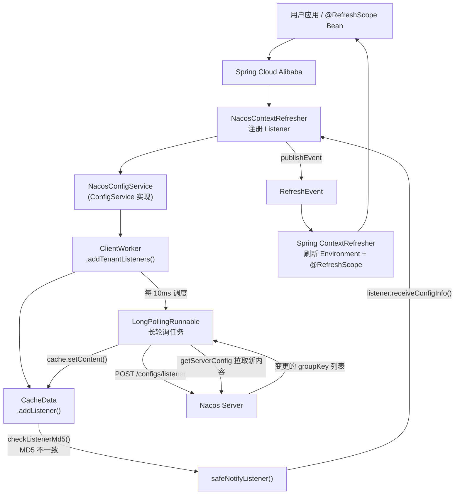
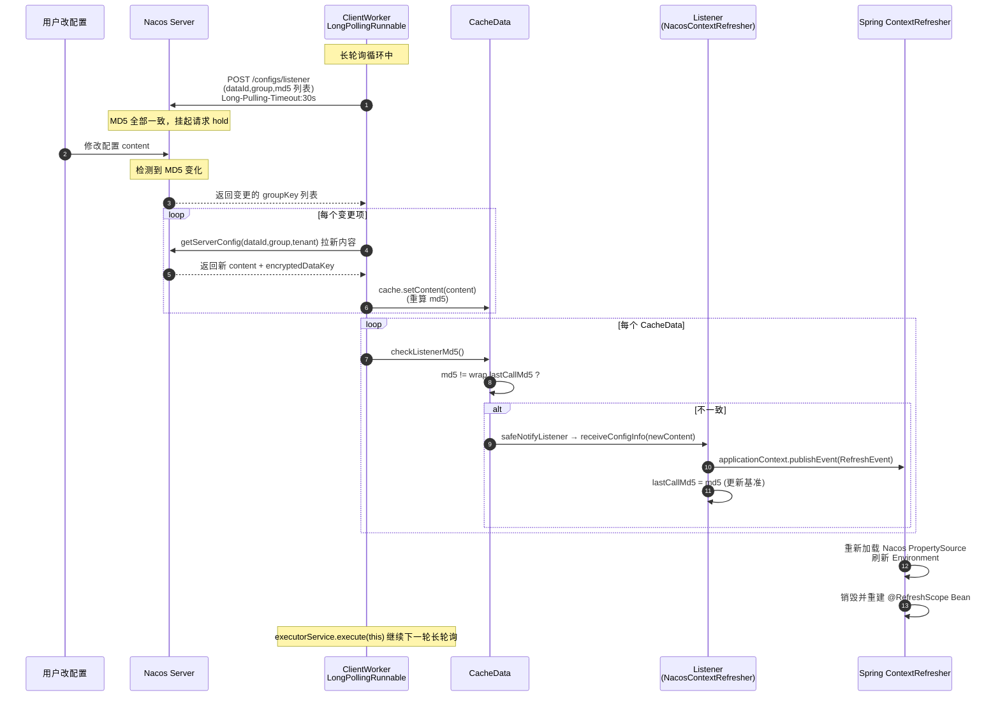
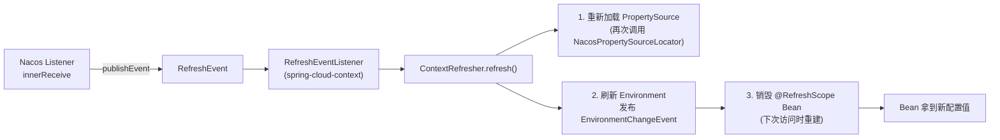
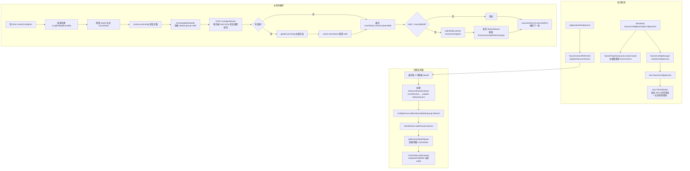

# Nacos 客户端配置变更实现原理深度源码分析

> 基于 Nacos 1.4.8 客户端源码 + Spring Cloud Alibaba Nacos Config 2.2.10 源码

---

## 一、整体架构概览

Nacos 客户端配置变更的核心机制是**长轮询（Long Polling）**。客户端并不是被动接收服务端推送，而是主动通过长轮询感知配置变化，然后回调用户注册的监听器。

涉及的核心组件：

| 组件 | 所在包 | 职责 |
|------|--------|------|
| `NacosConfigService` | `com.alibaba.nacos.client.config.impl` | 对外门面，提供 `getConfig` / `addListener` 等接口 |
| `ClientWorker` | `com.alibaba.nacos.client.config.impl` | 配置变更的核心引擎，负责长轮询、拉取变更、通知 |
| `CacheData` | `com.alibaba.nacos.client.config.impl` | 单个 `dataId+group+tenant` 的本地缓存 + 监听器管理 |
| `Listener` | `com.alibaba.nacos.api.config.listener` | 用户侧配置变更回调接口 |
| `NacosContextRefresher` | `com.alibaba.cloud.nacos.refresh` | SCA 整合入口，把 Nacos 监听器桥接到 Spring `RefreshEvent` |

### 整体调用链路图



---

## 二、CacheData 与 ClientWorker 的关系

这是理解整个配置变更机制的钥匙。

### 2.1 CacheData：单个配置的本地缓存单元

`CacheData` 是对一个 `dataId + group + tenant` 配置项的本地缓存封装，它持有：

```java
// CacheData.java 核心字段
public final String dataId;
public final String group;
public final String tenant;

private final CopyOnWriteArrayList<ManagerListenerWrap> listeners;  // 监听器列表

private volatile String md5;                  // 当前内容的 MD5
private volatile String content;              // 当前配置内容
private volatile String encryptedDataKey;     // 加密密钥
private volatile boolean isUseLocalConfig;    // 是否使用本地灾备
private volatile boolean isInitializing;      // 是否首次初始化
private int taskId;                           // 归属哪个长轮询任务
```

关键方法 `setContent` —— 写入新内容时**自动重算 MD5**：

```java
public void setContent(String content) {
    this.content = content;
    this.md5 = getMd5String(this.content, this.encryptedDataKey);  // 重算 MD5
}
```

> MD5 是变更检测的核心：服务端比对 MD5 判断是否变更，客户端也用 MD5 判断是否需要通知监听器。

### 2.2 ClientWorker：所有 CacheData 的管理者 + 长轮询引擎

`ClientWorker` 内部维护一个全局的 `cacheMap`，存放所有被监听配置的 `CacheData`：

```java
// ClientWorker.java
private final ConcurrentHashMap<String, CacheData> cacheMap = new ConcurrentHashMap<String, CacheData>();
```

- **key** = `GroupKey.getKeyTenant(dataId, group, tenant)`，全局唯一标识一个配置。
- **value** = 该配置对应的 `CacheData`。

#### 关系总结

```
ClientWorker (1) ──管理──> (N) CacheData (1) ──持有──> (N) Listener
                  │                        │
                  │ 长轮询拉取变更           │ 比对 MD5 触发回调
                  ▼                        ▼
            Nacos Server              用户业务逻辑
```

- **ClientWorker 负责"发现变更"**：通过长轮询从服务端拿到哪些配置变了，然后调用对应 `CacheData.setContent()` 更新内容。
- **CacheData 负责"通知监听器"**：内容更新后 MD5 变化，遍历监听器，对 MD5 不一致的执行回调。

### 2.3 添加监听器的入口：`addTenantListeners`

当用户调用 `configService.addListener(dataId, group, listener)`，最终走到 `ClientWorker.addTenantListeners`：

```java
// ClientWorker.java
public void addTenantListeners(String dataId, String group, List<? extends Listener> listeners)
        throws NacosException {
    group = blank2defaultGroup(group);
    String tenant = agent.getTenant();
    CacheData cache = addCacheDataIfAbsent(dataId, group, tenant);  // 1. 拿到/创建 CacheData
    for (Listener listener : listeners) {
        cache.addListener(listener);                                // 2. 把监听器加进 CacheData
    }
}
```

#### `addCacheDataIfAbsent`：注册 CacheData（线程安全）

```java
public CacheData addCacheDataIfAbsent(String dataId, String group, String tenant) throws NacosException {
    String key = GroupKey.getKeyTenant(dataId, group, tenant);
    CacheData cacheData = cacheMap.get(key);
    if (cacheData != null) {
        return cacheData;                                   // 已存在直接返回
    }

    cacheData = new CacheData(configFilterChainManager, agent.getName(), dataId, group, tenant);
    // 用 putIfAbsent 解决并发注册同一配置的竞态
    CacheData lastCacheData = cacheMap.putIfAbsent(key, cacheData);
    if (lastCacheData == null) {
        // 新建的 CacheData：可选立即同步一次服务端内容
        if (enableRemoteSyncConfig) {
            ConfigResponse response = getServerConfig(dataId, group, tenant, 3000L);
            cacheData.setContent(response.getContent());
        }
        // 按 3000 个配置一批，分配长轮询任务 taskId
        int taskId = cacheMap.size() / (int) ParamUtil.getPerTaskConfigSize();
        cacheData.setTaskId(taskId);
        lastCacheData = cacheData;
    }

    lastCacheData.setInitializing(true);   // 标记为初始化态，首次长轮询不挂起
    MetricsMonitor.getListenConfigCountMonitor().set(cacheMap.size());
    return lastCacheData;
}
```

要点：
1. **`putIfAbsent`** 保证多线程并发为同一 `dataId` 注册时，`cacheMap` 中只会有一个 `CacheData`。
2. **taskId 分片**：`cacheMap.size() / 3000`，监听的配置越多，长轮询任务越多（分片并发拉取）。
3. **`setInitializing(true)`**：让首次长轮询带上 `No-Hangup` 头，立即返回而不是挂起 29.5s，保证首次注册能快速拿到初始内容。

#### `CacheData.addListener`：注册监听器（带初始 MD5）

```java
// CacheData.java
public void addListener(Listener listener) {
    if (null == listener) {
        throw new IllegalArgumentException("listener is null");
    }
    ManagerListenerWrap wrap =
            (listener instanceof AbstractConfigChangeListener)
                ? new ManagerListenerWrap(listener, md5, content)
                : new ManagerListenerWrap(listener, md5);

    if (listeners.addIfAbsent(wrap)) {        // CopyOnWriteArrayList 去重添加
        LOGGER.info("[{}] [add-listener] ok, ...", name, ...);
    }
}
```

监听器被包装成 `ManagerListenerWrap`，其中保存了**注册时的 MD5** (`lastCallMd5`)。这就是变更比对的基准：

```java
private static class ManagerListenerWrap {
    final Listener listener;
    String lastCallMd5 = CacheData.getMd5String(null, null);  // 默认 null 的 MD5
    String lastContent = null;
    // 构造时把当前 cache 的 md5 赋给 lastCallMd5
}
```

> 注意：注册时 `lastCallMd5 = 当前 md5`，所以**注册瞬间不会触发回调**。只有后续 `setContent` 导致 `md5` 变化、与 `lastCallMd5` 不一致时才通知。

---

## 三、ClientWorker 长轮询实现原理

### 3.1 构造方法：启动两个线程池 + 定时检查

```java
public ClientWorker(final HttpAgent agent, final ConfigFilterChainManager configFilterChainManager,
        final Properties properties) {
    this.agent = agent;
    this.configFilterChainManager = configFilterManager;
    init(properties);   // 加载超时参数：长轮询超时30s、重试惩罚5s

    // ① 单线程调度池：每 10ms 执行一次 checkConfigInfo()
    this.executor = Executors.newScheduledThreadPool(1, ...);

    // ② 多线程调度池：执行长轮询任务 LongPollingRunnable（核心数个线程）
    this.executorService = Executors.newScheduledThreadPool(
            Runtime.getRuntime().availableProcessors(), ...);

    // 启动定时任务：延迟 1ms，每 10ms 执行一次 checkConfigInfo
    this.executor.scheduleWithFixedDelay(new Runnable() {
        public void run() {
            try { checkConfigInfo(); }
            catch (Throwable e) { LOGGER.error("...rotate check error", e); }
        }
    }, 1L, 10L, TimeUnit.MILLISECONDS);
}
```

- `executor`：**轮询调度器**，每 10ms 检查一次是否需要新增长轮询任务。
- `executorService`：**长轮询执行器**，真正跑 `LongPollingRunnable`。

### 3.2 `checkConfigInfo`：按需创建长轮询任务

```java
public void checkConfigInfo() {
    int listenerSize = cacheMap.size();
    // 监听配置数 / 3000，向上取整 = 长轮询任务数量
    int longingTaskCount = (int) Math.ceil(listenerSize / ParamUtil.getPerTaskConfigSize());
    // 任务数增长时才创建新任务
    if (longingTaskCount > currentLongingTaskCount) {
        for (int i = (int) currentLongingTaskCount; i < longingTaskCount; i++) {
            executorService.execute(new LongPollingRunnable(i));   // 提交长轮询任务
        }
        currentLongingTaskCount = longingTaskCount;
    }
}
```

- 每个长轮询任务 `LongPollingRunnable(taskId)` 只处理 `cacheData.getTaskId() == taskId` 的那些配置。
- 默认 3000 个配置共享一个长轮询任务，配置量再大就自动分片。

### 3.3 `LongPollingRunnable.run`：长轮询核心逻辑

```java
class LongPollingRunnable implements Runnable {
    public void run() {
        List<CacheData> cacheDatas = new ArrayList<>();
        List<String> inInitializingCacheList = new ArrayList<>();
        try {
            // ① 收集本 taskId 的所有 CacheData，并检查本地灾备配置
            for (CacheData cacheData : cacheMap.values()) {
                if (cacheData.getTaskId() == taskId) {
                    cacheDatas.add(cacheData);
                    checkLocalConfig(cacheData);                    // 检查本地 failover 文件
                    if (cacheData.isUseLocalConfigInfo()) {
                        cacheData.checkListenerMd5();               // 本地配置变了也通知
                    }
                }
            }

            // ② 发起长轮询请求，拿到发生变更的 groupKey 列表
            List<String> changedGroupKeys = checkUpdateDataIds(cacheDatas, inInitializingCacheList);
            if (!CollectionUtils.isEmpty(changedGroupKeys)) {
                LOGGER.info("get changedGroupKeys:" + changedGroupKeys);
            }

            // ③ 对每个变更项，向服务端拉取最新内容，更新 CacheData
            for (String groupKey : changedGroupKeys) {
                String[] key = GroupKey.parseKey(groupKey);
                String dataId = key[0], group = key[1], tenant = key.length == 3 ? key[2] : null;
                try {
                    ConfigResponse response = getServerConfig(dataId, group, tenant, 3000L);
                    CacheData cache = cacheMap.get(GroupKey.getKeyTenant(dataId, group, tenant));
                    cache.setEncryptedDataKey(response.getEncryptedDataKey());
                    cache.setContent(response.getContent());        // 更新内容 + 重算 MD5
                    cache.setType(response.getConfigType());
                } catch (NacosException ioe) {
                    LOGGER.error("[get-update] get changed config exception...", ioe);
                }
            }

            // ④ 遍历所有 CacheData，比对 MD5 通知监听器
            for (CacheData cacheData : cacheDatas) {
                if (!cacheData.isInitializing() || inInitializingCacheList.contains(...)) {
                    cacheData.checkListenerMd5();                   // 触发回调
                    cacheData.setInitializing(false);
                }
            }
            inInitializingCacheList.clear();

            // ⑤ 立即再次执行自己 —— 形成持续长轮询循环
            executorService.execute(this);

        } catch (Throwable e) {
            // 异常时延迟 taskPenaltyTime(默认5s) 后重试
            LOGGER.error("longPolling error : ", e);
            executorService.schedule(this, taskPenaltyTime, TimeUnit.MILLISECONDS);
        }
    }
}
```

### 3.4 长轮询请求：`checkUpdateDataIds` → `checkUpdateConfigStr`

**第一步**：把本任务所有配置的 `dataId + group + md5 (+tenant)` 拼成探测串：

```java
List<String> checkUpdateDataIds(List<CacheData> cacheDatas, List<String> inInitializingCacheList) {
    StringBuilder sb = new StringBuilder();
    for (CacheData cacheData : cacheDatas) {
        if (!cacheData.isUseLocalConfigInfo()) {        // 不使用本地灾备的才上报
            sb.append(cacheData.dataId).append(WORD_SEPARATOR);   // \x02
            sb.append(cacheData.group).append(WORD_SEPARATOR);
            if (StringUtils.isBlank(cacheData.tenant)) {
                sb.append(cacheData.getMd5()).append(LINE_SEPARATOR);  // \x01
            } else {
                sb.append(cacheData.getMd5()).append(WORD_SEPARATOR);
                sb.append(cacheData.getTenant()).append(LINE_SEPARATOR);
            }
            if (cacheData.isInitializing()) {
                inInitializingCacheList.add(GroupKey.getKeyTenant(...));
            }
        }
    }
    boolean isInitializingCacheList = !inInitializingCacheList.isEmpty();
    return checkUpdateConfigStr(sb.toString(), isInitializingCacheList);
}
```

**第二步**：POST 请求 `/v1/cs/configs/listener`：

```java
List<String> checkUpdateConfigStr(String probeUpdateString, boolean isInitializingCacheList) throws Exception {
    Map<String, String> params = new HashMap<>();
    params.put(Constants.PROBE_MODIFY_REQUEST, probeUpdateString);   // 探测串
    Map<String, String> headers = new HashMap<>();
    headers.put("Long-Pulling-Timeout", "" + timeout);               // 30s

    // 首次请求：不让服务端挂起，立即返回
    if (isInitializingCacheList) {
        headers.put("Long-Pulling-Timeout-No-Hangup", "true");
    }
    if (StringUtils.isBlank(probeUpdateString)) {
        return Collections.emptyList();
    }

    // readTimeout = 30s + 15s = 45s（服务端最多挂 29.5s）
    long readTimeoutMs = timeout + (long) Math.round(timeout >> 1);
    HttpRestResult<String> result = agent.httpPost(
            Constants.CONFIG_CONTROLLER_PATH + "/listener", headers, params, agent.getEncode(), readTimeoutMs);
    if (result.ok()) {
        setHealthServer(true);
        return parseUpdateDataIdResponse(result.getData());
    } else {
        setHealthServer(false);
        ...
    }
    return Collections.emptyList();
}
```

#### 长轮询的"长"体现在哪里

- 客户端把**所有监听配置的 MD5** 一次性发给服务端。
- 服务端比对：**有任何一个 MD5 不一致 → 立即返回变更列表**。
- **全部一致 → 服务端挂起请求（hold 住 29.5s）**，期间一旦有配置被修改，立即返回；超时则返回空。
- 客户端 `readTimeout=45s` > 服务端 29.5s，保证不会客户端先超时。

这样既实现了"准实时"感知（服务端有变更立刻返回），又避免了高频轮询（无变更时 30s 才一次请求）。

---

## 四、监听器通知机制：MD5 比对 + safeNotifyListener

### 4.1 `checkListenerMd5`：遍历监听器比对 MD5

```java
// CacheData.java
void checkListenerMd5() {
    for (ManagerListenerWrap wrap : listeners) {
        // 当前 md5 与监听器上次通知的 lastCallMd5 不同 → 变更了
        if (!md5.equals(wrap.lastCallMd5)) {
            safeNotifyListener(dataId, group, content, type, md5, encryptedDataKey, wrap);
        }
    }
}
```

### 4.2 `safeNotifyListener`：异步/同步触发回调

```java
private void safeNotifyListener(final String dataId, final String group, final String content,
        final String type, final String md5, final String encryptedDataKey,
        final ManagerListenerWrap listenerWrap) {
    final Listener listener = listenerWrap.listener;
    Runnable job = new Runnable() {
        public void run() {
            ClassLoader myClassLoader = Thread.currentThread().getContextClassLoader();
            ClassLoader appClassLoader = listener.getClass().getClassLoader();
            try {
                if (listener instanceof AbstractSharedListener) {
                    ((AbstractSharedListener) listener).fillContext(dataId, group);
                }
                // 切换 ClassLoader，避免多应用 SPI 加载错乱
                Thread.currentThread().setContextClassLoader(appClassLoader);

                // 过滤器链处理（解密等）
                ConfigResponse cr = new ConfigResponse();
                cr.setDataId(dataId); cr.setGroup(group);
                cr.setContent(content); cr.setEncryptedDataKey(encryptedDataKey);
                configFilterChainManager.doFilter(null, cr);
                String contentTmp = cr.getContent();

                // ★ 回调用户监听器
                listener.receiveConfigInfo(contentTmp);

                // 增量变更监听器：计算变更差异
                if (listener instanceof AbstractConfigChangeListener) {
                    Map data = ConfigChangeHandler.getInstance()
                            .parseChangeData(listenerWrap.lastContent, content, type);
                    ((AbstractConfigChangeListener) listener).receiveConfigChange(new ConfigChangeEvent(data));
                    listenerWrap.lastContent = content;
                }
                listenerWrap.lastCallMd5 = md5;    // 更新基准 MD5
            } catch (Throwable t) {
                LOGGER.error("[notify-error] ...", t);
            } finally {
                Thread.currentThread().setContextClassLoader(myClassLoader);
            }
        }
    };

    // 监听器自带 Executor → 异步；否则在当前线程同步执行
    if (null != listener.getExecutor()) {
        listener.getExecutor().execute(job);
    } else {
        job.run();   // 同步执行
    }
}
```

要点：
1. **`lastCallMd5 = md5`**：通知完成后更新基准，保证下次只在真正变更时才回调。
2. **ClassLoader 切换**：多 webapp 部署时回调中 SPI 加载正确。
3. **过滤器链**：通知前对 content 做解密等处理，回调拿到的是明文。
4. **异步/同步**：由 `listener.getExecutor()` 决定，没有自定义线程池则在长轮询线程同步执行（注意阻塞风险）。

---

## 五、完整时序图：一次配置变更的全过程



---

## 六、Spring Cloud Alibaba 如何整合 Nacos 实现配置变更

SCA 的整合目标是：**把 Nacos 的 `Listener` 机制桥接到 Spring 的 `RefreshEvent`，从而刷新 `Environment` 和 `@RefreshScope` Bean。**

### 6.1 自动装配：两个关键配置类

通过 `META-INF/spring.factories` 注册：

- **`NacosConfigBootstrapConfiguration`**（bootstrap 阶段）：注册 `NacosConfigProperties`、`NacosConfigManager`、`NacosPropertySourceLocator`。负责**启动时加载**远程配置到 Environment。
- **`NacosConfigAutoConfiguration`**（主上下文）：注册 `NacosRefreshHistory`、`NacosContextRefresher`。负责**运行时监听变更**。

### 6.2 `NacosConfigManager`：单例持有 ConfigService

```java
// NacosConfigManager.java
private static ConfigService service = null;

static ConfigService createConfigService(NacosConfigProperties nacosConfigProperties) {
    if (Objects.isNull(service)) {
        synchronized (NacosConfigManager.class) {
            if (Objects.isNull(service)) {
                // 通过 NacosFactory 创建 NacosConfigService（内部 new ClientWorker）
                service = NacosFactory.createConfigService(
                        nacosConfigProperties.assembleConfigServiceProperties());
            }
        }
    }
    return service;
}
```

`ConfigService` 的创建会触发 `NacosConfigService` 构造，进而 `new ClientWorker(...)` —— 长轮询引擎此时已启动。

### 6.3 启动时加载配置：`NacosPropertySourceLocator`

在 bootstrap 阶段实现 Spring Cloud 的 `PropertySourceLocator`，把 Nacos 配置拉进 Environment：

```java
// 简化逻辑
private void loadApplicationConfiguration(CompositePropertySource composite, String dataIdPrefix,
        NacosConfigProperties properties, Environment environment) {
    String fileExtension = properties.getFileExtension();
    String group = properties.getGroup();
    // 加载 dataId = prefix
    loadNacosDataIfPresent(composite, dataIdPrefix, group, fileExtension, true);
    // 加载 dataId = prefix.ext
    loadNacosDataIfPresent(composite, dataIdPrefix + DOT + fileExtension, group, fileExtension, true);
    // 加载 profile 维度 dataId = prefix-profile.ext
    for (String profile : environment.getActiveProfiles()) {
        loadNacosDataIfPresent(composite, dataIdPrefix + SEP1 + profile + DOT + fileExtension,
                group, fileExtension, true);
    }
}
```

> 注意：`NacosPropertySourceLocator` 阶段**只加载配置，不注册监听器**。监听器注册发生在应用就绪后。

### 6.4 运行时注册监听器：`NacosContextRefresher`

这是 SCA 整合的**核心**。它实现 `ApplicationListener<ApplicationReadyEvent>`，在应用就绪后为每个可刷新的配置项注册 Nacos 监听器。

```java
public class NacosContextRefresher
        implements ApplicationListener<ApplicationReadyEvent>, ApplicationContextAware {

    private final boolean isRefreshEnabled;
    private Map<String, Listener> listenerMap = new ConcurrentHashMap<>(16);

    @Override
    public void onApplicationEvent(ApplicationReadyEvent event) {
        // 多 Spring 上下文时只注册一次
        if (this.ready.compareAndSet(false, true)) {
            this.registerNacosListenersForApplications();
        }
    }

    private void registerNacosListenersForApplications() {
        if (isRefreshEnabled()) {
            // 遍历启动时加载的所有 NacosPropertySource
            for (NacosPropertySource propertySource : NacosPropertySourceRepository.getAll()) {
                if (!propertySource.isRefreshable()) {
                    continue;                       // 不可刷新的跳过
                }
                String dataId = propertySource.getDataId();
                registerNacosListener(propertySource.getGroup(), dataId);
            }
        }
    }

    private void registerNacosListener(final String groupKey, final String dataKey) {
        String key = NacosPropertySourceRepository.getMapKey(dataKey, groupKey);
        // 用 AbstractSharedListener 创建监听器（去重，同一 dataId 只注册一次）
        Listener listener = listenerMap.computeIfAbsent(key,
                lst -> new AbstractSharedListener() {
                    @Override
                    public void innerReceive(String dataId, String group, String configInfo) {
                        refreshCountIncrement();
                        nacosRefreshHistory.addRefreshRecord(dataId, group, configInfo);  // 记录历史
                        NacosSnapshotConfigManager.putConfigSnapshot(dataId, group, configInfo);
                        // ★ 发布 Spring Cloud RefreshEvent
                        applicationContext.publishEvent(
                                new RefreshEvent(this, null, "Refresh Nacos config"));
                    }
                });
        try {
            if (configService == null && configManager != null) {
                configService = configManager.getConfigService();
            }
            // ★ 把监听器注册到 Nacos ConfigService（最终走到 ClientWorker → CacheData）
            configService.addListener(dataKey, groupKey, listener);
        } catch (NacosException e) {
            log.warn("register fail for nacos listener ...", e);
        }
    }
}
```

#### 这里回答了"是怎么添加 Config 监听器的"

1. **时机**：`ApplicationReadyEvent`（应用就绪）后，由 `NacosContextRefresher.onApplicationEvent` 触发。
2. **对象**：遍历 `NacosPropertySourceRepository.getAll()` 中所有 `isRefreshable()` 的配置项。
3. **方式**：为每个 `dataId+group` 创建一个 `AbstractSharedListener`（匿名子类，重写 `innerReceive`），通过 `configService.addListener(dataKey, groupKey, listener)` 注册。
4. **去重**：`listenerMap.computeIfAbsent` 保证同一配置只注册一个监听器。
5. **桥接**：监听器回调 `innerReceive` 中**不直接刷新 Bean**，而是 `publishEvent(new RefreshEvent(...))`，把刷新工作交给 Spring Cloud。

### 6.5 `RefreshEvent` → 刷新 Environment + @RefreshScope

`RefreshEvent` 由 spring-cloud-context 的 `RefreshEventListener` 接收，调用 `ContextRefresher.refresh()`：



- **`@RefreshScope` Bean**：被代理，刷新时销毁实例，下次注入/访问时重建 → 拿到新值。
- **`@ConfigurationProperties` Bean**：监听 `EnvironmentChangeEvent`，通过 `ConfigurationPropertiesRebinder` 重新绑定属性。
- **`@Value` 普通字段**：**不会自动刷新**（除非所在 Bean 是 `@RefreshScope`），这是常见踩坑点。

---

## 七、客户端长轮询与监听器注册的完整流程图



---

## 八、关键设计总结

### 8.1 为什么用长轮询而不是长连接推送？

| 方案 | 优点 | 缺点 |
|------|------|------|
| 长轮询 (Nacos 1.x) | 实现简单、兼容 HTTP、穿透防火墙好 | 有 29.5s 的"空窗期"、每次请求带全量 MD5 |
| 长连接推送 (Nacos 2.x gRPC) | 实时性好、流量小 | 需要维护连接、复杂度高 |

Nacos 1.4.8 用长轮询是权衡后的选择，足以满足大多数配置变更场景（秒级延迟）。

### 8.2 MD5 的双重作用

1. **客户端 ↔ 服务端**：长轮询时客户端上报 MD5，服务端比对判断是否变更，**减少全量内容传输**。
2. **CacheData ↔ Listener**：`md5` 与 `lastCallMd5` 比对，决定是否触发回调，**避免重复通知**。

### 8.3 线程模型

| 线程池 | 线程数 | 职责 |
|--------|--------|------|
| `executor` | 1 | 每 10ms 调度 `checkConfigInfo`，按需创建长轮询任务 |
| `executorService` | CPU 核数 | 执行 `LongPollingRunnable` 长轮询循环 |
| `listener.getExecutor()` | 用户自定义 | 异步执行监听器回调；未设置则在长轮询线程同步执行 |

> ⚠️ 如果监听器没设置 `Executor`，回调在长轮询线程同步执行 —— **回调阻塞会拖慢整个长轮询**，所以耗时业务应自定义线程池或异步处理。

### 8.4 容错机制

- **首次注册不挂起**：`Long-Pulling-Timeout-No-Hangup` 头，立即返回初始内容。
- **异常惩罚重试**：长轮询抛异常后延迟 `taskPenaltyTime`（默认 5s）再重试，避免疯狂打挂服务端。
- **本地灾备兜底**：`checkLocalConfig` 优先用 failover/snapshot，服务端挂了也能感知本地配置变化。
- **健康标记**：`setHealthServer(true/false)` 反映与服务端连通性，供健康检查使用。

### 8.5 SCA 整合的解耦点

SCA 没有把刷新逻辑写死在 Nacos 监听器里，而是**只发 `RefreshEvent`**，具体刷新由 spring-cloud-context 的 `ContextRefresher` 完成。这样：
- Nacos 监听器只关心"配置变了"；
- 刷新策略（全量/增量、`@RefreshScope`/`@ConfigurationProperties`）由 Spring Cloud 统一管理，可替换、可扩展。

---

## 九、附录：核心源码位置索引

| 关注点 | 文件 | 关键方法/行 |
|--------|------|------------|
| 添加监听器入口 | `ClientWorker.java` | `addTenantListeners` (L75) |
| 注册 CacheData | `ClientWorker.java` | `addCacheDataIfAbsent` (L140) |
| 长轮询调度 | `ClientWorker.java` | `checkConfigInfo` (L302) |
| 长轮询请求构造 | `ClientWorker.java` | `checkUpdateDataIds` (L325) / `checkUpdateConfigStr` (L356) |
| 长轮询主循环 | `ClientWorker.java` | `LongPollingRunnable.run` |
| MD5 比对触发回调 | `CacheData.java` | `checkListenerMd5` (L177) |
| 执行监听器回调 | `CacheData.java` | `safeNotifyListener` (L203) |
| 监听器包装 | `CacheData.java` | `ManagerListenerWrap` (L375) |
| SCA 监听器注册 | `NacosContextRefresher.java` | `registerNacosListener` (L133) |
| SCA 触发刷新 | `NacosContextRefresher.java` | `innerReceive` → `publishEvent(RefreshEvent)` |
| ConfigService 创建 | `NacosConfigManager.java` | `createConfigService` |
| 启动加载配置 | `NacosPropertySourceLocator.java` | `locate` / `loadApplicationConfiguration` |
