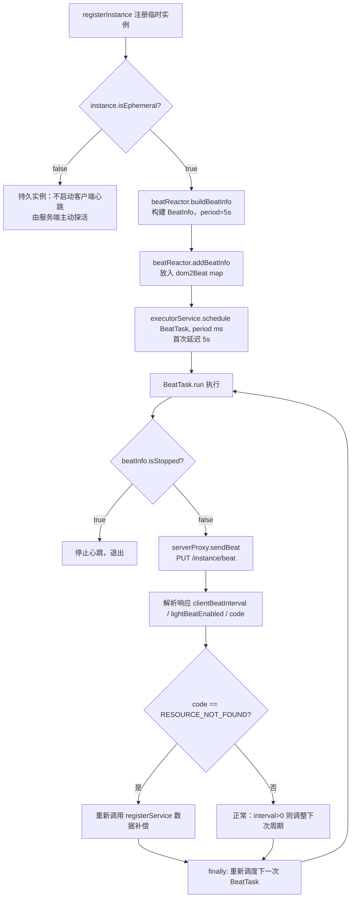
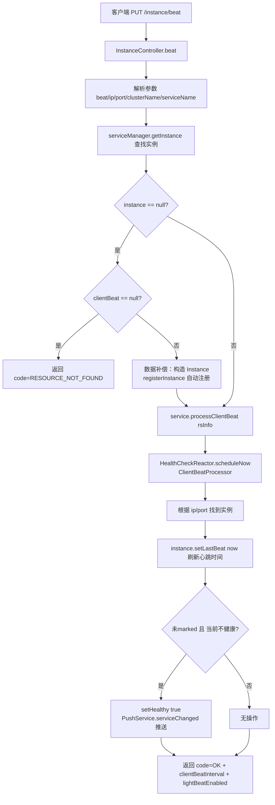
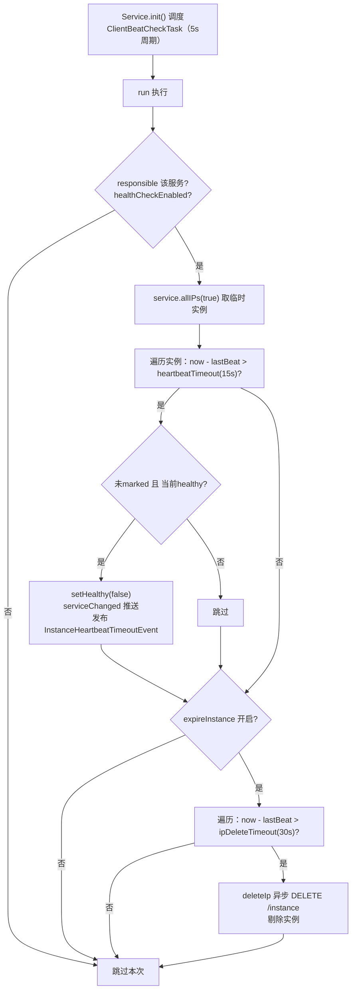
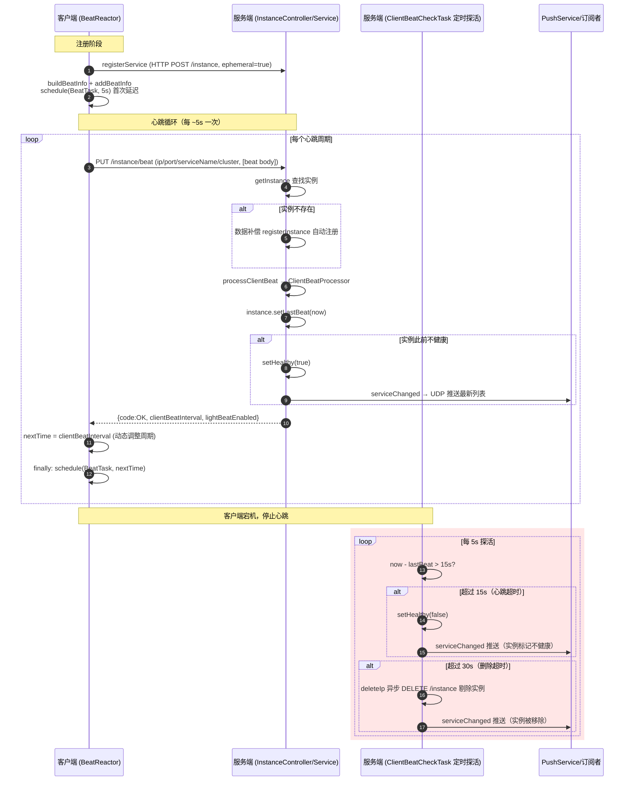
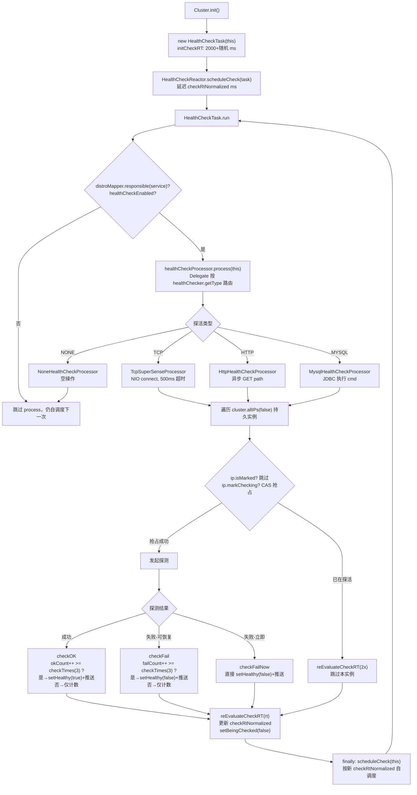
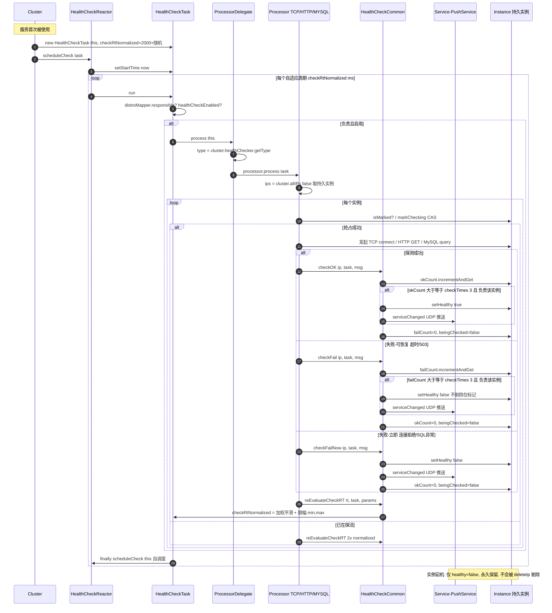
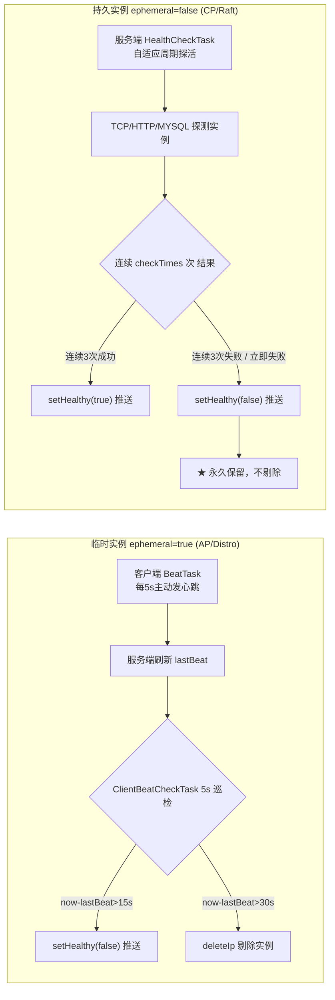

# Nacos 1.4.8 心跳检测流程源码分析

> 基于 Nacos `develop-1.4.8` 分支源码，分析**临时实例（ephemeral=true）**心跳检测的完整流程，涵盖客户端发送心跳与服务端接收/探活两端实现。

## 1. 总体概述

Nacos 1.4.x 采用 **AP 架构（Distro 协议）** 管理临时实例。临时实例由**客户端主动发送心跳**维持其在服务端的注册状态；服务端则通过**定时健康检查任务**判断实例是否超时，超时先标记为不健康，再超时则剔除实例。

| 维度 | 临时实例 (ephemeral=true) | 持久实例 (ephemeral=false) |
|------|--------------------------|--------------------------|
| 心跳发送方 | **客户端主动发送** | 服务端主动探活（TCP/HTTP） |
| 存储协议 | Distro（内存，AP） | Raft（磁盘，CP） |
| 客户端下线 | 不健康→自动剔除 | 永久保留 |
| 心跳间隔 | 默认 5s，可动态调整 | 由服务端 HealthCheckTask 控制 |

### 核心常量（`api/.../Constants.java`）

| 常量 | 值 | 含义 |
|------|----|----|
| `DEFAULT_HEART_BEAT_INTERVAL` | 5s | 心跳间隔（客户端发送周期） |
| `DEFAULT_HEART_BEAT_TIMEOUT` | 15s | 心跳超时（超此时间未收到心跳→标记不健康） |
| `DEFAULT_IP_DELETE_TIMEOUT` | 30s | 删除超时（超此时间未收到心跳→剔除实例） |

---

## 2. 客户端流程

### 2.1 关键类与职责

| 类 | 路径 | 职责 |
|----|------|----|
| `NacosNamingService` | `client/.../naming/NacosNamingService.java` | 注册入口，决定是否启用客户端心跳 |
| `BeatReactor` | `client/.../naming/beat/BeatReactor.java` | 心跳调度核心，管理 `BeatInfo` 与线程池 |
| `BeatTask` | `BeatReactor` 内部类 | 单次心跳发送任务（Runnable） |
| `BeatInfo` | `client/.../naming/beat/BeatInfo.java` | 心跳数据载体 |
| `NamingProxy` | `client/.../naming/net/NamingProxy.java` | HTTP 请求封装，`sendBeat` 实际发送 |

### 2.2 心跳数据结构 `BeatInfo`

```java
// client/.../naming/beat/BeatInfo.java
public class BeatInfo {
    private int port;                    // 实例端口
    private String ip;                   // 实例IP
    private double weight;               // 权重
    private String serviceName;          // 服务名（含 group: group@@serviceName）
    private String cluster;              // 集群名
    private Map<String, String> metadata;// 元数据
    private volatile boolean scheduled;  // 是否已调度
    private volatile long period;        // 心跳周期（ms）
    private volatile boolean stopped;    // 是否停止
}
```

### 2.3 注册时启用心跳

`NacosNamingService.registerInstance` 在实例为临时实例时，构建并注册 `BeatInfo`，触发首次心跳调度：

```java
// client/.../naming/NacosNamingService.java:212-221
public void registerInstance(String serviceName, String groupName, Instance instance) throws NacosException {
    NamingUtils.checkInstanceIsLegal(instance);
    String groupedServiceName = NamingUtils.getGroupedName(serviceName, groupName);
    if (instance.isEphemeral()) {                                   // 仅临时实例才启用客户端心跳
        BeatInfo beatInfo = beatReactor.buildBeatInfo(groupedServiceName, instance);
        beatReactor.addBeatInfo(groupedServiceName, beatInfo);
    }
    serverProxy.registerService(groupedServiceName, groupName, instance);
}
```

> 关键点：`ephemeral=true` 才走客户端心跳；`ephemeral=false`（持久实例）由服务端 `HealthCheckTask` 主动探活，客户端不参与。

### 2.4 心跳调度 `BeatReactor`

```java
// client/.../naming/beat/BeatReactor.java:61-72
public BeatReactor(NamingProxy serverProxy, int threadCount) {
    this.serverProxy = serverProxy;
    this.executorService = new ScheduledThreadPoolExecutor(threadCount, ...);
    // 线程数：Runtime.getRuntime().availableProcessors() / 2，至少 1
}
```

```java
// client/.../naming/beat/BeatReactor.java:80-90
public void addBeatInfo(String serviceName, BeatInfo beatInfo) {
    String key = buildKey(serviceName, beatInfo.getIp(), beatInfo.getPort());
    BeatInfo existBeat = null;
    if ((existBeat = dom2Beat.put(key, beatInfo)) != null) {  // 同一实例重复注册，停止旧任务
        existBeat.setStopped(true);
    }
    // 首次延迟 = beatInfo.getPeriod()（默认 5s），即注册后 5s 发第一拍
    executorService.schedule(new BeatTask(beatInfo), beatInfo.getPeriod(), TimeUnit.MILLISECONDS);
}
```

> 注意：客户端用的是 `schedule`（一次性），而非 `scheduleAtFixedRate`。每次心跳执行完，在 `finally` 中根据服务端响应**重新调度下一次**，从而实现周期可被服务端动态调整。

### 2.5 心跳发送 `BeatTask` 与 `sendBeat`

```java
// client/.../naming/beat/BeatReactor.java:159-206
class BeatTask implements Runnable {
    public void run() {
        if (beatInfo.isStopped()) return;                    // 已注销，停止
        long nextTime = beatInfo.getPeriod();                // 默认下次间隔
        try {
            JsonNode result = serverProxy.sendBeat(beatInfo, BeatReactor.this.lightBeatEnabled);
            long interval = result.get("clientBeatInterval").asLong();  // 服务端下发的间隔
            if (result.has(CommonParams.LIGHT_BEAT_ENABLED)) {
                BeatReactor.this.lightBeatEnabled = result.get(CommonParams.LIGHT_BEAT_ENABLED).asBoolean();
            }
            if (interval > 0) { nextTime = interval; }       // 动态调整心跳周期
            int code = result.has(CommonParams.CODE) ? result.get(CommonParams.CODE).asInt() : NamingResponseCode.OK;
            if (code == NamingResponseCode.RESOURCE_NOT_FOUND) {  // 服务端实例已被剔除
                // 重新注册实例，做数据补偿
                Instance instance = new Instance();
                ...
                instance.setEphemeral(true);
                serverProxy.registerService(...);
            }
        } catch (NacosException ex) {
            NAMING_LOGGER.warn("[CLIENT-BEAT] failed to send beat ...");
        } catch (Exception unknownEx) {
            NAMING_LOGGER.error("[CLIENT-BEAT] failed to send beat ...");
        } finally {
            // 无论成功失败，按 nextTime 重新调度下一次心跳
            executorService.schedule(new BeatTask(beatInfo), nextTime, TimeUnit.MILLISECONDS);
        }
    }
}
```

HTTP 请求实际发送（`NamingProxy.sendBeat`）：

```java
// client/.../naming/net/NamingProxy.java:426-443
public JsonNode sendBeat(BeatInfo beatInfo, boolean lightBeatEnabled) throws NacosException {
    Map<String, String> params = new HashMap<>(8);
    Map<String, String> bodyMap = new HashMap<>(2);
    if (!lightBeatEnabled) {
        bodyMap.put("beat", JacksonUtils.toJson(beatInfo));   // 非 light 模式，心跳体放 body
    }
    params.put(CommonParams.NAMESPACE_ID, namespaceId);
    params.put(CommonParams.SERVICE_NAME, beatInfo.getServiceName());
    params.put(CommonParams.CLUSTER_NAME, beatInfo.getCluster());
    params.put("ip", beatInfo.getIp());
    params.put("port", String.valueOf(beatInfo.getPort()));
    // PUT http://{server}/nacos/v1/ns/instance/beat
    String result = reqApi(UtilAndComs.nacosUrlBase + "/instance/beat", params, bodyMap, HttpMethod.PUT);
    return JacksonUtils.toObj(result);
}
```

> **轻量心跳（lightBeat）**：开启后客户端不再发送完整 `beat` JSON body，只发 ip/port/serviceName/cluster 参数，降低带宽。是否启用由服务端在响应中通过 `lightBeatEnabled` 字段下发，客户端首次按 `false` 发送，之后跟随服务端值。

### 2.6 客户端心跳流程图



---

## 3. 服务端流程

### 3.1 关键类与职责

| 类 | 路径 | 职责 |
|----|------|----|
| `InstanceController` | `naming/.../controllers/InstanceController.java` | 接收心跳的 HTTP 入口 `beat()` |
| `ServiceManager` | `naming/.../core/ServiceManager.java` | 实例查找/注册 |
| `Service` | `naming/.../core/Service.java` | 处理心跳入口 `processClientBeat`，持有 `ClientBeatCheckTask` |
| `ClientBeatProcessor` | `naming/.../healthcheck/ClientBeatProcessor.java` | 更新 `lastBeat`、恢复健康状态 |
| `ClientBeatCheckTask` | `naming/.../healthcheck/ClientBeatCheckTask.java` | 定时探活：超时标记不健康、剔除 |
| `HealthCheckReactor` | `naming/.../healthcheck/HealthCheckReactor.java` | 调度器 |
| `PushService` | `naming/.../push/PushService.java` | 状态变更后 UDP 推送给订阅者 |

### 3.2 心跳接收入口 `InstanceController.beat`

```java
// naming/.../controllers/InstanceController.java:464-539
@CanDistro                                            // 标记走 Distro 协议（可转发到对应节点）
@PutMapping("/beat")
@Secured(parser = NamingResourceParser.class, action = ActionTypes.WRITE)
public ObjectNode beat(HttpServletRequest request) throws Exception {
    ObjectNode result = JacksonUtils.createEmptyJsonNode();
    result.put(SwitchEntry.CLIENT_BEAT_INTERVAL, switchDomain.getClientBeatInterval()); // 默认下发的间隔

    // 1. 解析参数
    String beat = WebUtils.optional(request, "beat", StringUtils.EMPTY);
    RsInfo clientBeat = StringUtils.isNotBlank(beat) ? JacksonUtils.toObj(beat, RsInfo.class) : null;
    String clusterName = WebUtils.optional(request, CommonParams.CLUSTER_NAME, UtilsAndCommons.DEFAULT_CLUSTER_NAME);
    String ip = WebUtils.optional(request, "ip", StringUtils.EMPTY);
    int port = Integer.parseInt(WebUtils.optional(request, "port", "0"));
    ...
    String serviceName = WebUtils.required(request, CommonParams.SERVICE_NAME);
    NamingUtils.checkServiceNameFormat(serviceName);

    // 2. 查找实例
    Instance instance = serviceManager.getInstance(namespaceId, serviceName, clusterName, ip, port);

    // 3. 实例不存在 → 数据补偿：自动注册（首次心跳或实例被剔除后重新上线）
    if (instance == null) {
        if (clientBeat == null) {
            result.put(CommonParams.CODE, NamingResponseCode.RESOURCE_NOT_FOUND);
            return result;
        }
        instance = new Instance();
        instance.setPort(clientBeat.getPort());
        instance.setIp(clientBeat.getIp());
        ...
        instance.setEphemeral(clientBeat.isEphemeral());
        serviceManager.registerInstance(namespaceId, serviceName, instance);  // 重新注册
    }

    // 4. 交给 Service 处理心跳
    Service service = serviceManager.getService(namespaceId, serviceName);
    if (service == null) {
        throw new NacosException(NacosException.SERVER_ERROR, "service not found: " + serviceName + "@" + namespaceId);
    }
    if (clientBeat == null) {
        clientBeat = new RsInfo();
        clientBeat.setIp(ip); clientBeat.setPort(port); clientBeat.setCluster(clusterName);
    }
    service.processClientBeat(clientBeat);   // 异步处理

    // 5. 构造响应：code + clientBeatInterval + lightBeatEnabled
    result.put(CommonParams.CODE, NamingResponseCode.OK);
    if (instance.containsMetadata(PreservedMetadataKeys.HEART_BEAT_INTERVAL)) {
        result.put(SwitchEntry.CLIENT_BEAT_INTERVAL, instance.getInstanceHeartBeatInterval()); // 实例级自定义间隔
    }
    result.put(SwitchEntry.LIGHT_BEAT_ENABLED, switchDomain.isLightBeatEnabled());
    return result;
}
```

> **动态调整心跳周期**：服务端优先返回实例元数据 `preserved.heart-beat-interval` 指定的间隔，否则返回全局 `switchDomain.clientBeatInterval`。客户端据此更新 `nextTime`，从而实现心跳周期可按实例/全局动态调节。

### 3.3 心跳处理 `Service.processClientBeat` → `ClientBeatProcessor`

```java
// naming/.../core/Service.java:126-131
public void processClientBeat(final RsInfo rsInfo) {
    ClientBeatProcessor clientBeatProcessor = new ClientBeatProcessor();
    clientBeatProcessor.setService(this);
    clientBeatProcessor.setRsInfo(rsInfo);
    HealthCheckReactor.scheduleNow(clientBeatProcessor);  // 立即异步执行
}
```

```java
// naming/.../healthcheck/ClientBeatProcessor.java:65-94
public void run() {
    Service service = this.service;
    String ip = rsInfo.getIp();
    String clusterName = rsInfo.getCluster();
    int port = rsInfo.getPort();
    Cluster cluster = service.getClusterMap().get(clusterName);
    List<Instance> instances = cluster.allIPs(true);   // 仅临时实例

    for (Instance instance : instances) {
        if (instance.getIp().equals(ip) && instance.getPort() == port) {
            instance.setLastBeat(System.currentTimeMillis());   // ★ 刷新最后心跳时间
            if (!instance.isMarked() && !instance.isHealthy()) { // 当前不健康（之前超时被标记）
                instance.setHealthy(true);                        // ★ 恢复健康
                getPushService().serviceChanged(service);         // 推送变更给订阅者
            }
        }
    }
}
```

> 关键：心跳的核心动作是**刷新 `lastBeat` 时间戳**。若实例此前因超时被标记为不健康，收到心跳后恢复为健康并推送变更。`marked` 实例（手动标记的）不受自动健康恢复影响。

### 3.4 定时探活 `ClientBeatCheckTask`

由 `Service.init()` 调度，固定 5s 周期执行：

```java
// naming/.../core/Service.java:295-301
public void init() {
    HealthCheckReactor.scheduleCheck(clientBeatCheckTask);
    ...
}
```

```java
// naming/.../healthcheck/HealthCheckReactor.java:53-56
public static void scheduleCheck(ClientBeatCheckTask task) {
    futureMap.computeIfAbsent(task.taskKey(),
        k -> GlobalExecutor.scheduleNamingHealth(task, 5000, 5000, TimeUnit.MILLISECONDS)); // 延迟5s，周期5s
}
```

探活逻辑（两阶段：标记不健康 → 剔除）：

```java
// naming/.../healthcheck/ClientBeatCheckTask.java:76-130
public void run() {
    try {
        if (!getDistroMapper().responsible(service.getName())) return;  // 仅负责该服务的节点执行
        if (!getSwitchDomain().isHealthCheckEnabled()) return;

        List<Instance> instances = service.allIPs(true);

        // 第一阶段：超时未心跳 → 标记不健康（超时时间默认 15s）
        for (Instance instance : instances) {
            if (System.currentTimeMillis() - instance.getLastBeat() > instance.getInstanceHeartBeatTimeOut()) {
                if (!instance.isMarked()) {
                    if (instance.isHealthy()) {
                        instance.setHealthy(false);
                        getPushService().serviceChanged(service);
                        ApplicationUtils.publishEvent(new InstanceHeartbeatTimeoutEvent(this, instance));
                    }
                }
            }
        }

        if (!getGlobalConfig().isExpireInstance()) return;  // 未开启自动剔除则跳过

        // 第二阶段：超时更久 → 删除实例（删除超时默认 30s）
        for (Instance instance : instances) {
            if (instance.isMarked()) continue;
            if (System.currentTimeMillis() - instance.getLastBeat() > instance.getIpDeleteTimeout()) {
                deleteIp(instance);   // 异步 HTTP DELETE 自身 /instance 接口
            }
        }
    } catch (Exception e) {
        Loggers.SRV_LOG.warn("Exception while processing client beat time out.", e);
    }
}
```

### 3.5 状态变更推送 `PushService`

`serviceChanged(service)` 发布 `ServiceChangeEvent`，由监听器通过 **UDP** 将最新实例列表推送给所有订阅该服务的客户端（订阅者），客户端据此更新本地服务列表缓存。

### 3.6 服务端流程图



### 3.7 服务端定时探活流程图



---

## 4. 完整时序图（客户端 ↔ 服务端）



---

## 5. 关键机制总结

### 5.1 双向时间驱动
- **客户端推**：`BeatTask` 每周期主动发心跳，刷新服务端 `lastBeat`。
- **服务端拉/判**：`ClientBeatCheckTask` 每 5s 巡检，基于 `lastBeat` 判定超时。

### 5.2 心跳周期的动态调整链路
```
实例元数据 preserved.heart-beat-interval (优先)
        └─ 否 → switchDomain.clientBeatInterval (全局开关, 默认5s)
                 └─ 服务端在 beat 响应中通过 clientBeatInterval 下发
                    └─ 客户端 BeatTask 用该值作为下一次 schedule 的 nextTime
```

### 5.3 健康状态机（临时实例）
```
[首次注册/自动补偿] healthy=true, lastBeat=now
        │ 收到心跳（<15s）
        ▼
    healthy=true ◄──────────┐ 收到心跳恢复
        │ >15s 无心跳        │
        ▼                    │
    healthy=false ───────────┘
        │ >30s 无心跳
        ▼
    实例被剔除（deleteIp）
```

### 5.4 数据补偿与自愈
- **服务端**：心跳到达但实例不存在时，`beat()` 自动重新注册实例（`registerInstance`），保证实例不会因临时被剔除而永久丢失。
- **客户端**：收到 `RESOURCE_NOT_FOUND` 响应码时，`BeatTask` 主动重新 `registerService`，与服务端形成双重补偿。

### 5.5 关键文件索引

| 关注点 | 文件:行号 |
|--------|----------|
| 客户端注册启用心跳 | `NacosNamingService.java:212-221` |
| 客户端心跳调度核心 | `BeatReactor.java:80-90, 159-206` |
| 客户端 HTTP 发送 | `NamingProxy.java:426-443` |
| 心跳数据结构 | `BeatInfo.java:26-45` |
| 服务端心跳入口 | `InstanceController.java:464-539` |
| 服务端心跳处理 | `Service.java:126-131` + `ClientBeatProcessor.java:65-94` |
| 服务端定时探活 | `ClientBeatCheckTask.java:76-130` |
| 探活调度 | `HealthCheckReactor.java:53-56` + `Service.java:295-301` |
| 默认超时常量 | `Constants.java:169-173` |

---

## 6. 持久实例健康探测流程（ephemeral=false）

> 以下补充针对**持久实例（persistent instance，ephemeral=false）**的健康探测机制。与临时实例"客户端推心跳"不同，持久实例由**服务端主动发起探活（TCP/HTTP/MYSQL）**，且实例元数据通过 **Raft 协议**持久化到磁盘，实例下线后**不会被自动剔除**，仅切换健康状态。

### 6.1 总体原理

| 维度 | 持久实例 (ephemeral=false) |
|------|---------------------------|
| 探活发起方 | **服务端主动探活**（客户端不参与） |
| 探活方式 | TCP 连接探测 / HTTP 请求 / MySQL 查询 / NONE（不探活） |
| 存储协议 | Raft（磁盘持久化，CP） |
| 实例下线行为 | 仅标记 `healthy=false`，**永久保留**，不自动剔除 |
| 调度入口 | `Cluster.init()` → `HealthCheckTask` |
| 调度周期 | **自适应**，由 `checkRtNormalized` 决定（基于历史探测 RT 加权平滑） |
| 状态翻转阈值 | 连续 `checkTimes`（默认 3 次）成功/失败才翻转健康状态 |
| 负责节点判定 | `DistroMapper.responsible(serviceName)`，仅负责节点执行 |

持久实例的探活是一个**服务端拉（pull）**模型：每个 `Cluster` 持有一个 `HealthCheckTask`，周期性地遍历该 Cluster 下的所有持久实例，委托给对应的 `HealthCheckProcessor` 发起真正的探测，再由 `HealthCheckCommon` 根据连续成功/失败计数翻转实例健康状态。

### 6.2 关键类与职责

| 类 | 路径 | 职责 |
|----|------|----|
| `Cluster` | `naming/.../core/Cluster.java` | 持有 `HealthCheckTask`，在 `init()` 中创建并首次调度 |
| `HealthCheckTask` | `naming/.../healthcheck/HealthCheckTask.java` | 探活调度载体（Runnable），自调度、记录 RT 统计 |
| `HealthCheckReactor` | `naming/.../healthcheck/HealthCheckReactor.java` | 调度器，`scheduleCheck(task)` 按 `checkRtNormalized` 延迟调度 |
| `HealthCheckProcessor` | `naming/.../healthcheck/HealthCheckProcessor.java` | 探活处理器接口（`process`/`getType`） |
| `HealthCheckProcessorDelegate` | `naming/.../healthcheck/HealthCheckProcessorDelegate.java` | 按 `cluster.healthChecker.type` 路由到具体 Processor |
| `TcpSuperSenseProcessor` | `naming/.../healthcheck/TcpSuperSenseProcessor.java` | TCP 探活（NIO 非阻塞连接） |
| `HttpHealthCheckProcessor` | `naming/.../healthcheck/HttpHealthCheckProcessor.java` | HTTP 异步 GET 探活 |
| `MysqlHealthCheckProcessor` | `naming/.../healthcheck/MysqlHealthCheckProcessor.java` | MySQL JDBC 探活 |
| `NoneHealthCheckProcessor` | `naming/.../healthcheck/NoneHealthCheckProcessor.java` | 不探活（空实现） |
| `HealthCheckCommon` | `naming/.../healthcheck/HealthCheckCommon.java` | 状态翻转（`checkOK`/`checkFail`/`checkFailNow`）、RT 重估 |
| `HealthCheckStatus` | `naming/.../healthcheck/HealthCheckStatus.java` | 实例级探活状态（`isBeingChecked`/`checkOkCount`/`checkFailCount`/`checkRt`） |
| `SwitchDomain` | `naming/.../misc/SwitchDomain.java` | 全局开关与探活参数（`checkTimes`、各 `HealthParams`） |

### 6.3 探活类型与 HealthChecker 配置

探活类型由 Cluster 的 `healthChecker` 字段决定，对应枚举 `HealthCheckType`：

```java
// api/.../naming/pojo/healthcheck/HealthCheckType.java
public enum HealthCheckType {
    TCP(Tcp.class),      // TCP 连接探测
    HTTP(Http.class),    // HTTP 请求探测（可配 path、自定义 header）
    MYSQL(Mysql.class),  // MySQL 探测（可配 user/pwd/cmd）
    NONE(AbstractHealthChecker.None.class); // 不探活
}
```

可通过 Open API 在创建/修改服务时指定，例如：
```
POST /nacos/v1/ns/service?healthCheckMode=TCP&...
```

### 6.4 调度入口：Cluster.init()

`Cluster.init()` 在 Cluster 首次被使用时创建 `HealthCheckTask` 并提交首次调度：

```java
// naming/.../core/Cluster.java:143-151
public synchronized void init() {
    if (inited) {
        return;
    }
    checkTask = new HealthCheckTask(this);
    HealthCheckReactor.scheduleCheck(checkTask);   // 首次调度
    inited = true;
}

public void destroy() {
    if (checkTask != null) {
        checkTask.setCancelled(true);              // 取消自调度
    }
}
```

### 6.5 调度器 HealthCheckReactor.scheduleCheck

注意与临时实例的 `scheduleCheck(ClientBeatCheckTask)`（固定 5s 周期）不同，持久实例的 `scheduleCheck(HealthCheckTask)` 是**一次性调度**，延迟 = `task.getCheckRtNormalized()`（自适应 RT）：

```java
// naming/.../healthcheck/HealthCheckReactor.java:43-46
public static ScheduledFuture<?> scheduleCheck(HealthCheckTask task) {
    task.setStartTime(System.currentTimeMillis());
    return GlobalExecutor.scheduleNamingHealth(task, task.getCheckRtNormalized(), TimeUnit.MILLISECONDS);
}
```

### 6.6 HealthCheckTask.run（自调度 + 委托）

```java
// naming/.../healthcheck/HealthCheckTask.java:60-116
public HealthCheckTask(Cluster cluster) {
    this.cluster = cluster;
    distroMapper = ApplicationUtils.getBean(DistroMapper.class);
    switchDomain = ApplicationUtils.getBean(SwitchDomain.class);
    healthCheckProcessor = ApplicationUtils.getBean(HealthCheckProcessorDelegate.class);
    initCheckRT();   // checkRtNormalized = 2000 + 随机(0, tcpHealthParams.max)
}

private void initCheckRT() {
    // 首次探活延迟：2s + 随机抖动，避免集群同时探活造成惊群
    checkRtNormalized = 2000 + RandomUtils.nextInt(0, RandomUtils.nextInt(0, switchDomain.getTcpHealthParams().getMax()));
    checkRtBest = Long.MAX_VALUE;
    checkRtWorst = 0L;
}

@Override
public void run() {
    try {
        // 仅由负责该 service 的节点执行，且该 service 未被禁用健康检查
        if (distroMapper.responsible(cluster.getService().getName())
                && switchDomain.isHealthCheckEnabled(cluster.getService().getName())) {
            healthCheckProcessor.process(this);   // ★ 委托给具体 Processor
        }
    } catch (Throwable e) {
        Loggers.SRV_LOG.error("[HEALTH-CHECK] error while process health check for {}:{}",
                cluster.getService().getName(), cluster.getName(), e);
    } finally {
        if (!cancelled) {
            HealthCheckReactor.scheduleCheck(this);  // ★ 自调度下一次（延迟=checkRtNormalized）
            // ... RT 抖动日志（CHECK_RT）
        }
    }
}
```

关键点：
- **责任判定**：`distroMapper.responsible(serviceName)` 决定哪个 Nacos 节点负责探活该 service，避免多节点重复探活。
- **自调度**：`finally` 中再次 `scheduleCheck(this)`，延迟由 `checkRtNormalized` 决定，实现**周期自适应**。
- **RT 统计**：维护 `checkRtBest/Worst/Last/LastLast/Normalized`，用于平滑调整下次探活间隔。

### 6.7 路由委托 HealthCheckProcessorDelegate

```java
// naming/.../healthcheck/HealthCheckProcessorDelegate.java:48-58
@Override
public void process(HealthCheckTask task) {
    String type = task.getCluster().getHealthChecker().getType();   // TCP/HTTP/MYSQL/NONE
    HealthCheckProcessor processor = healthCheckProcessorMap.get(type);
    if (processor == null) {
        processor = healthCheckProcessorMap.get(NoneHealthCheckProcessor.TYPE);  // 兜底 NONE
    }
    processor.process(task);
}
```

所有 `HealthCheckProcessor` 实现通过 Spring `@Component` 注入，按 `getType()` 收集到 map。

### 6.8 TCP 探活：TcpSuperSenseProcessor（NIO 实现）

TCP 探活用 NIO 非阻塞连接，**只要 TCP 三次握手成功即认为健康**，连接超时 500ms。

```java
// naming/.../healthcheck/TcpSuperSenseProcessor.java:102-132
@Override
public void process(HealthCheckTask task) {
    List<Instance> ips = task.getCluster().allIPs(false);   // ★ 仅持久实例
    if (CollectionUtils.isEmpty(ips)) return;

    for (Instance ip : ips) {
        if (ip.isMarked()) continue;                         // 手动标记的实例跳过
        if (!ip.markChecking()) {                            // ★ CAS 防止并发重复探活
            healthCheckCommon.reEvaluateCheckRT(task.getCheckRtNormalized() * 2, task, switchDomain.getTcpHealthParams());
            continue;
        }
        Beat beat = new Beat(ip, task);
        taskQueue.add(beat);                                 // 投入 NIO 任务队列
        MetricsMonitor.getTcpHealthCheckMonitor().incrementAndGet();
    }
}
```

NIO 主循环（独立线程）从 `taskQueue` 取出 Beat，发起非阻塞 connect，注册 `OP_CONNECT|OP_READ` 到 Selector，并调度 500ms 超时任务：

```java
// naming/.../healthcheck/TcpSuperSenseProcessor.java:364-419  (TaskProcessor.call)
channel = SocketChannel.open();
channel.configureBlocking(false);
channel.socket().setSoLinger(false, -1);
channel.socket().setReuseAddress(true);
channel.socket().setKeepAlive(true);
channel.socket().setTcpNoDelay(true);

int port = cluster.isUseIPPort4Check() ? instance.getPort() : cluster.getDefCkport();
channel.connect(new InetSocketAddress(instance.getIp(), port));

SelectionKey key = channel.register(selector, SelectionKey.OP_CONNECT | SelectionKey.OP_READ);
key.attach(beat);
keyMap.put(beat.toString(), new BeatKey(key));
beat.setStartTime(System.currentTimeMillis());

GlobalExecutor.scheduleTcpSuperSenseTask(new TimeOutTask(key), CONNECT_TIMEOUT_MS, TimeUnit.MILLISECONDS); // 500ms
```

连接就绪后由 `PostProcessor` 处理结果：

```java
// naming/.../healthcheck/TcpSuperSenseProcessor.java:196-200
if (key.isValid() && key.isConnectable()) {
    channel.finishConnect();
    beat.finishCheck(true, false, System.currentTimeMillis() - beat.getTask().getStartTime(), "tcp:ok+");
}
```

`Beat.finishCheck` 根据 success/now 调用 `HealthCheckCommon` 的不同方法：

```java
// naming/.../healthcheck/TcpSuperSenseProcessor.java:270-286
public void finishCheck(boolean success, boolean now, long rt, String msg) {
    ip.setCheckRt(System.currentTimeMillis() - startTime);
    if (success) {
        healthCheckCommon.checkOK(ip, task, msg);
    } else {
        if (now) {
            healthCheckCommon.checkFailNow(ip, task, msg);   // 立即判失败（如连接拒绝）
        } else {
            healthCheckCommon.checkFail(ip, task, msg);       // 累计失败次数
        }
        keyMap.remove(task.toString());
    }
    healthCheckCommon.reEvaluateCheckRT(rt, task, switchDomain.getTcpHealthParams());
}
```

超时（500ms 内未连上）由 `TimeOutTask` 兜底，调用 `checkFail`（`tcp:timeout`）；连接被拒（`ConnectException`）调用 `checkFailNow`（`tcp:unable2connect`），立即判失败。

### 6.9 HTTP 探活：HttpHealthCheckProcessor（异步 GET）

```java
// naming/.../healthcheck/HttpHealthCheckProcessor.java:66-117
@Override
public void process(HealthCheckTask task) {
    List<Instance> ips = task.getCluster().allIPs(false);
    if (CollectionUtils.isEmpty(ips)) return;
    if (!switchDomain.isHealthCheckEnabled()) return;

    for (Instance ip : ips) {
        if (ip.isMarked()) continue;
        if (!ip.markChecking()) { ... continue; }            // 并发保护

        Http healthChecker = (Http) cluster.getHealthChecker();
        int ckPort = cluster.isUseIPPort4Check() ? ip.getPort() : cluster.getDefCkport();
        URL host = new URL("http://" + ip.getIp() + ":" + ckPort);
        URL target = new URL(host, healthChecker.getPath()); // 配置的探测路径
        Header header = Header.newInstance();
        header.addAll(healthChecker.getCustomHeaders());

        ASYNC_REST_TEMPLATE.get(target.toString(), header, Query.EMPTY, String.class,
                new HttpHealthCheckCallback(ip, task));       // ★ 异步回调
    }
}
```

回调中按 HTTP 状态码分流：

```java
// HttpHealthCheckProcessor.java:133-184
@Override
public void onReceive(RestResult<String> result) {
    int httpCode = result.getCode();
    if (HttpURLConnection.HTTP_OK == httpCode) {              // 200 → checkOK
        healthCheckCommon.checkOK(ip, task, "http:" + httpCode);
    } else if (HTTP_UNAVAILABLE == httpCode || HTTP_MOVED_TEMP == httpCode) {
        healthCheckCommon.checkFail(ip, task, "http:" + httpCode);  // 503/302 → 累计失败
    } else {
        healthCheckCommon.checkFailNow(ip, task, "http:" + httpCode); // 其他 → 立即判失败
    }
}

@Override
public void onError(Throwable t) {
    // 超时 → checkFail；ConnectException → checkFailNow；其他 → checkFail
}
```

### 6.10 MySQL 探活：MysqlHealthCheckProcessor

通过 JDBC 建立连接并执行配置的 SQL（默认 `show global variables where variable_name='read_only'`），还会区分主从：

```java
// naming/.../healthcheck/MysqlHealthCheckProcessor.java:130-167
Connection connection = CONNECTION_POOL.get(key);
if (connection == null || connection.isClosed()) {
    String url = "jdbc:mysql://" + ip.getIp() + ":" + ip.getPort()
            + "?connectTimeout=500&socketTimeout=500&loginTimeout=1";
    connection = DriverManager.getConnection(url, config.getUser(), config.getPwd());
    CONNECTION_POOL.put(key, connection);                     // 连接复用
}
statement = connection.createStatement();
statement.setQueryTimeout(1);
resultSet = statement.executeQuery(config.getCmd());

if (CHECK_MYSQL_MASTER_SQL.equals(config.getCmd())) {
    resultSet.next();
    if (MYSQL_SLAVE_READONLY.equals(resultSet.getString(2))) {
        throw new IllegalStateException("current node is slave!");  // 从库判失败
    }
}
healthCheckCommon.checkOK(ip, task, "mysql:+ok");
```

异常分流：`SQLException` → `checkFailNow`（立即失败）；超时类异常 → `checkFail`（累计）；其他 → `checkFail`。

### 6.11 状态翻转：HealthCheckCommon

持久实例的健康状态翻转有**连续次数阈值**（`switchDomain.checkTimes`，默认 3），避免单次抖动导致状态频繁切换：

```java
// naming/.../healthcheck/HealthCheckCommon.java:147-186
public void checkOK(Instance ip, HealthCheckTask task, String msg) {
    Cluster cluster = task.getCluster();
    try {
        if (!ip.isHealthy() || !ip.isMockValid()) {
            if (ip.getOkCount().incrementAndGet() >= switchDomain.getCheckTimes()) {  // ★ 连续 N 次成功
                if (distroMapper.responsible(cluster, ip)) {
                    ip.setHealthy(true);
                    ip.setMockValid(true);
                    Service service = cluster.getService();
                    service.setLastModifiedMillis(System.currentTimeMillis());
                    pushService.serviceChanged(service);       // 推送变更
                    addResult(new HealthCheckResult(service.getName(), ip));
                } else {
                    if (!ip.isMockValid()) ip.setMockValid(true);  // 非负责节点仅更新 mockValid
                }
            }
        }
    } finally {
        ip.getFailCount().set(0);   // 成功则清零失败计数
        ip.setBeingChecked(false);  // 释放探活锁
    }
}
```

```java
// HealthCheckCommon.java:195-235
public void checkFail(Instance ip, HealthCheckTask task, String msg) {
    if (ip.isHealthy() || ip.isMockValid()) {
        if (ip.getFailCount().incrementAndGet() >= switchDomain.getCheckTimes()) {  // ★ 连续 N 次失败
            if (distroMapper.responsible(cluster, ip)) {
                ip.setHealthy(false);
                ip.setMockValid(false);
                pushService.serviceChanged(service);
                addResult(new HealthCheckResult(service.getName(), ip));
            }
        }
    }
    ip.getOkCount().set(0);
    ip.setBeingChecked(false);
}
```

```java
// HealthCheckCommon.java:244-279  立即判失败（连接拒绝、SQLException 等）
public void checkFailNow(Instance ip, HealthCheckTask task, String msg) {
    if (ip.isHealthy() || ip.isMockValid()) {
        if (distroMapper.responsible(cluster, ip)) {
            ip.setHealthy(false);
            ip.setMockValid(false);
            pushService.serviceChanged(service);
            addResult(new HealthCheckResult(service.getName(), ip));
        }
    }
    ip.getOkCount().set(0);
    ip.setBeingChecked(false);
}
```

> 注意：持久实例**不会因探活失败而被剔除**（无 `deleteIp` 逻辑），只会 `setHealthy(false)`。这与临时实例的"超时 → 剔除"形成鲜明对比。

### 6.12 探活间隔自适应：reEvaluateCheckRT

每次探活结束后，根据本次 RT 重新计算下一次调度间隔：

```java
// naming/.../healthcheck/HealthCheckCommon.java:116-138
public void reEvaluateCheckRT(long checkRT, HealthCheckTask task, SwitchDomain.HealthParams params) {
    task.setCheckRtLast(checkRT);
    if (checkRT > task.getCheckRtWorst()) task.setCheckRtWorst(checkRT);
    if (checkRT < task.getCheckRtBest())  task.setCheckRtBest(checkRT);

    // 加权平滑：factor * 旧值 + (1-factor) * 本次值
    checkRT = (long) (params.getFactor() * task.getCheckRtNormalized() + (1 - params.getFactor()) * checkRT);
    if (checkRT > params.getMax()) checkRT = params.getMax();   // 限幅
    if (checkRT < params.getMin()) checkRT = params.getMin();
    task.setCheckRtNormalized(checkRT);   // ★ 作为下次 scheduleCheck 的延迟
}
```

各探活类型的默认参数（`SwitchDomain` 内部类）：

| 类型 | min | max | factor |
|------|-----|-----|--------|
| TCP | 1000ms | 5000ms | 0.85 |
| HTTP | 500ms | 5000ms | 0.85 |
| MySQL | 2000ms | 3000ms | 0.65 |
| 首次 `checkRtNormalized` | 2000ms + 随机抖动（基于 `tcpHealthParams.max`） | | |

> 含义：探活越快，下次间隔越小（但受 min 限制）；探活越慢/超时，下次间隔越大（受 max 限制）。factor 越大越平滑（对新值反应迟钝）。

### 6.13 并发保护：markChecking

每个实例有 `isBeingChecked` 标志，探活前用 CAS 抢占：

```java
// naming/.../core/Instance.java:277-279
public boolean markChecking() {
    return HealthCheckStatus.get(this).isBeingChecked.compareAndSet(false, true);
}
```

若上一次探活未结束（`markChecking` 返回 false），本次跳过并把 RT 翻倍重估，避免对同一实例并发探测。探活结束在 `checkOK/checkFail/checkFailNow` 的 `setBeingChecked(false)` 释放。

### 6.14 持久实例健康探测流程图



### 6.15 持久实例探活时序图



### 6.16 临时实例 vs 持久实例对比



### 6.17 持久实例健康状态机

```
[注册/写入] healthy=true (Raft 持久化)
      │
      │  探活连续 checkTimes(3) 次失败  或  checkFailNow(连接拒绝/SQL异常)
      ▼
  healthy=false ─────────────────────────┐
      │  探活连续 checkTimes(3) 次成功    │
      ▼                                  │
  healthy=true ◄─────────────────────────┘
      │  （任何状态都不会触发剔除）
      ▼
  永久保留（仅手动 deregister 或 Raft 删除才会移除）
```

### 6.18 关键机制总结

- **服务端拉模型**：`HealthCheckTask` 周期性主动探活，客户端无需参与，适合无心跳能力的存量服务（如数据库、第三方系统）。
- **周期自适应**：`reEvaluateCheckRT` 用加权平滑（factor）+ 限幅（min/max）动态调整 `checkRtNormalized`，作为下次 `scheduleCheck` 的延迟，探得快则间隔小、探得慢则间隔大。
- **状态翻转去抖**：连续 `checkTimes`（默认 3）次同向结果才翻转 `healthy`，避免单次网络抖动造成状态颠簸；`checkFailNow` 用于连接拒绝等确定性失败，绕过计数直接翻转。
- **并发保护**：`markChecking` CAS 保证同一实例不会被并发探活；`marked` 实例跳过自动探活（由管理员手动管控）。
- **责任隔离**：`DistroMapper.responsible` 决定唯一负责节点，非负责节点仅维护 `mockValid`（探测态），不修改真实 `healthy`，避免多节点重复探活与状态冲突。
- **CP 持久化**：持久实例的注册数据经 Raft 写入磁盘，实例下线仅 `healthy=false`，**永不自动剔除**，需手动注销——这是与临时实例（AP，超时即剔除）最本质的区别。
- **探活结果同步**：`HealthCheckCommon.init()` 起独立定时任务，每 500ms 将 `healthCheckResults` 队列中的状态变更批量 POST 给集群其它节点（`/api/healthCheckResult`），用于增量同步（仅对 `incrementalList` 中的服务）。

### 6.19 持久实例探活关键文件索引

| 关注点 | 文件:行号 |
|--------|----------|
| 调度入口 | `Cluster.java:143-151` |
| 探活任务自调度 | `HealthCheckTask.java:60-116` |
| 调度器（自适应延迟） | `HealthCheckReactor.java:43-46` |
| 处理器路由 | `HealthCheckProcessorDelegate.java:48-58` |
| TCP NIO 探活 | `TcpSuperSenseProcessor.java:102-132, 364-419` |
| HTTP 异步探活 | `HttpHealthCheckProcessor.java:66-184` |
| MySQL JDBC 探活 | `MysqlHealthCheckProcessor.java:78-209` |
| NONE 空探活 | `NoneHealthCheckProcessor.java:33-34` |
| 状态翻转（OK/Fail/FailNow） | `HealthCheckCommon.java:147-279` |
| RT 自适应重估 | `HealthCheckCommon.java:116-138` |
| 并发探活保护 | `Instance.java:273-279` |
| 探活参数默认值 | `SwitchDomain.java:63, 431-529` |
| 探活类型枚举 | `HealthCheckType.java:33-49` |
| 探活结果集群同步 | `HealthCheckCommon.java:73-107` |
