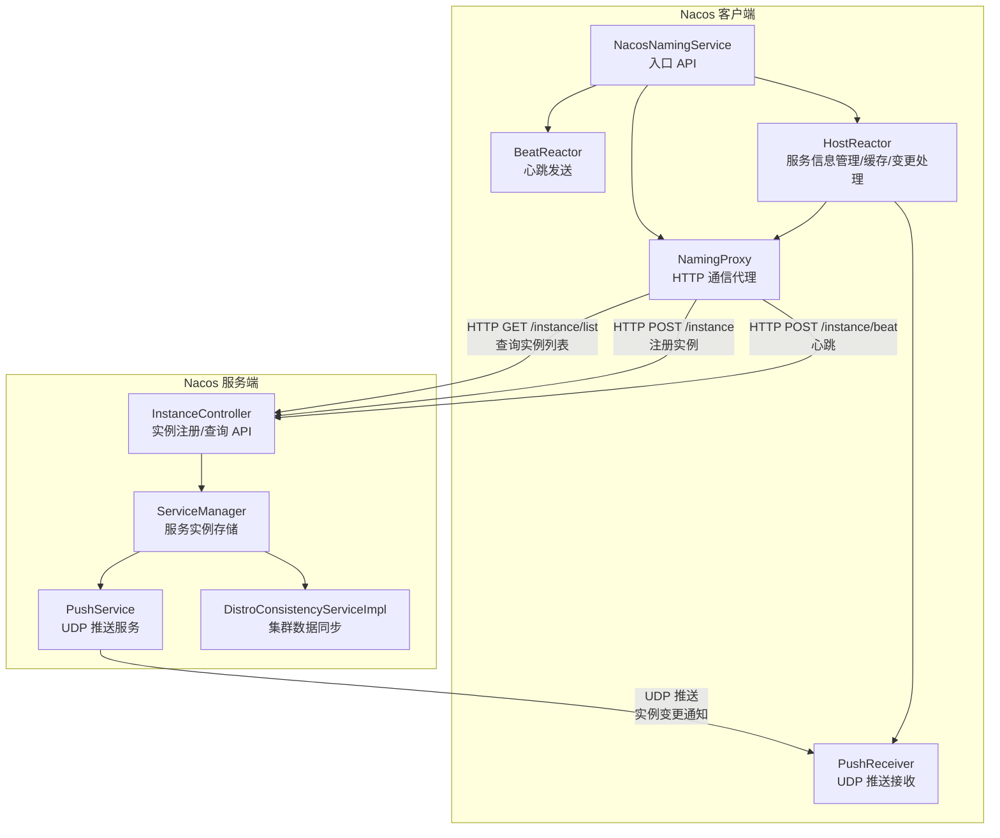
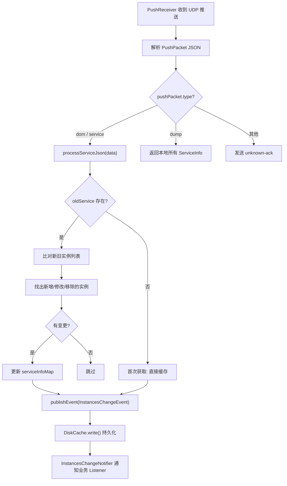
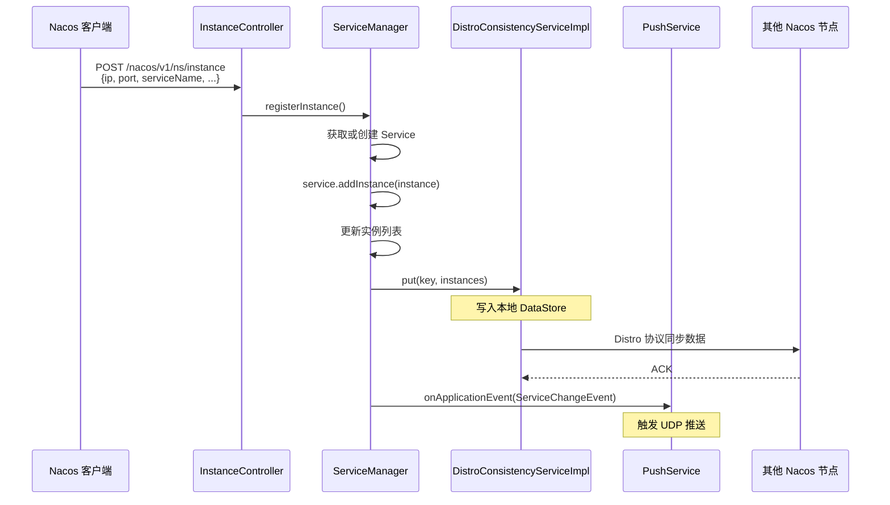
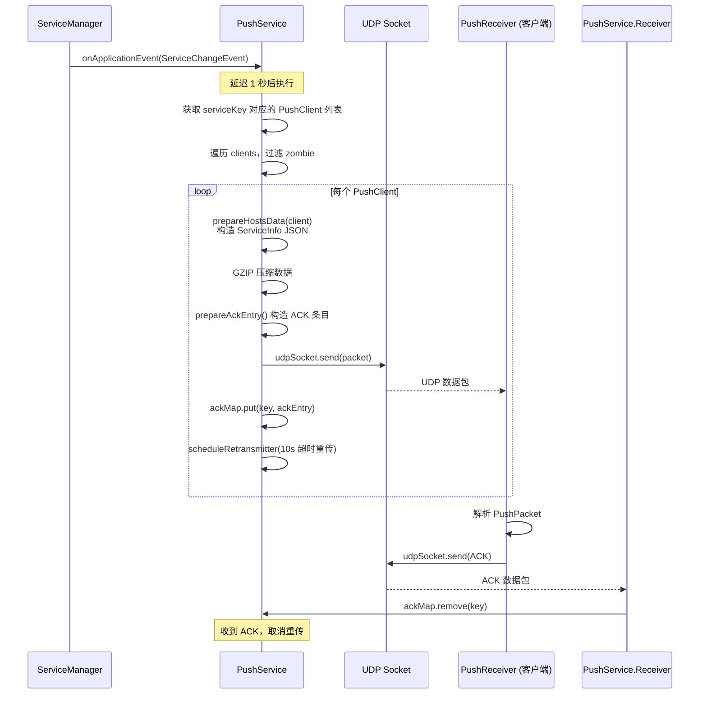
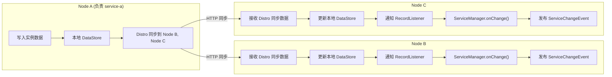
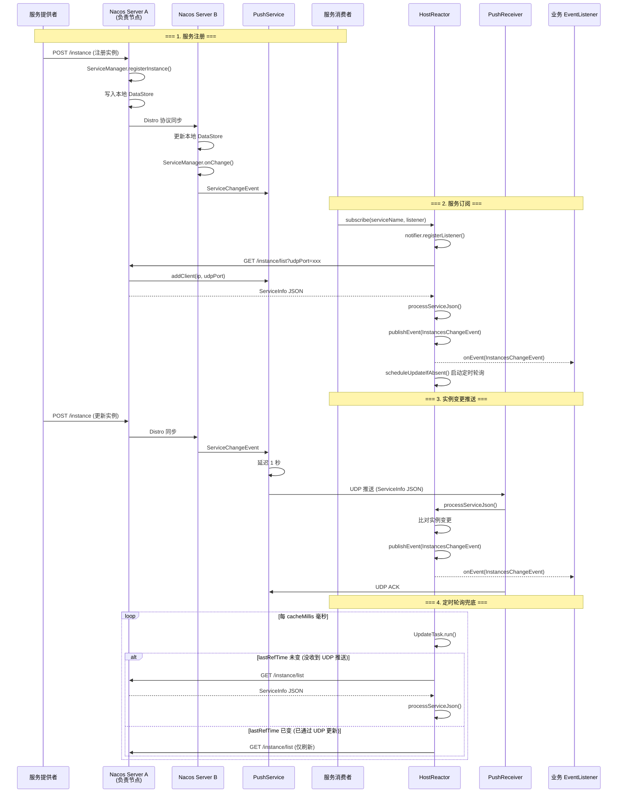

# Nacos 服务发现、服务订阅与实例变更通知深度源码分析

## 目录

1. [概述](#1-概述)
2. [整体架构](#2-整体架构)
3. [客户端：服务发现与订阅](#3-客户端服务发现与订阅)
4. [客户端：UDP 推送接收 (PushReceiver)](#4-客户端udp-推送接收-pushreceiver)
5. [客户端：定时轮询兜底 (UpdateTask)](#5-客户端定时轮询兜底-updatetask)
6. [客户端：实例变更通知 (InstancesChangeNotifier)](#6-客户端实例变更通知-instanceschangenotifier)
7. [服务端：服务注册与实例管理](#7-服务端服务注册与实例管理)
8. [服务端：UDP 推送服务 (PushService)](#8-服务端udp-推送服务-pushservice)
9. [服务端：Distro 一致性协议同步](#9-服务端distro-一致性协议同步)
10. [完整流程时序图](#10-完整流程时序图)
11. [总结](#11-总结)

---

## 1. 概述

Nacos 1.4.x 的服务发现基于 **HTTP + UDP 推送** 的混合模式实现，核心机制包括：

- **服务注册**：客户端通过 HTTP POST 向服务端注册实例，服务端通过 Distro 协议在集群间同步
- **服务发现**：客户端通过 HTTP GET 拉取服务实例列表
- **服务订阅**：客户端向服务端注册订阅关系，服务端记录客户端 UDP 地址
- **实例变更通知**：服务端通过 **UDP 推送** 主动通知客户端变更，客户端通过 **定时轮询** 兜底

核心源码位置：

| 模块 | 文件 | 职责 |
|------|------|------|
| 客户端 | `NacosNamingService.java` | 客户端入口 |
| 客户端 | `HostReactor.java` | 服务信息管理、缓存、变更处理 |
| 客户端 | `PushReceiver.java` | UDP 推送接收器 |
| 客户端 | `NamingProxy.java` | HTTP 通信代理 |
| 服务端 | `ServiceManager.java` | 服务实例存储与管理 |
| 服务端 | `PushService.java` | UDP 推送服务 |
| 服务端 | `DistroConsistencyServiceImpl.java` | Distro 一致性协议 |

---

## 2. 整体架构



---

## 3. 客户端：服务发现与订阅

### 3.1 NacosNamingService 初始化

[NacosNamingService.java](file:///d:/workspace/java_projects/source_projects/nacos/client/src/main/java/com/alibaba/nacos/client/naming/NacosNamingService.java)

```java
public class NacosNamingService implements NamingService {

    private HostReactor hostReactor;      // 服务信息管理核心
    private BeatReactor beatReactor;      // 心跳发送
    private NamingProxy serverProxy;      // HTTP 通信代理

    private void init(Properties properties) throws NacosException {
        this.namespace = InitUtils.initNamespaceForNaming(properties);
        this.serverProxy = new NamingProxy(namespace, endpoint, serverList, properties);
        this.beatReactor = new BeatReactor(serverProxy, initClientBeatThreadCount(properties));
        this.hostReactor = new HostReactor(serverProxy, beatReactor, cacheDir,
            isLoadCacheAtStart(properties), isPushEmptyProtect(properties),
            initPollingThreadCount(properties));
    }
}
```

### 3.2 HostReactor 初始化

[HostReactor.java](file:///d:/workspace/java_projects/source_projects/nacos/client/src/main/java/com/alibaba/nacos/client/naming/core/HostReactor.java)

```java
public class HostReactor implements Closeable {

    // serviceKey → ServiceInfo，核心缓存
    private final Map<String, ServiceInfo> serviceInfoMap;

    // serviceKey → ScheduledFuture，定时轮询任务
    private final Map<String, ScheduledFuture<?>> futureMap;

    // UDP 推送接收器
    private final PushReceiver pushReceiver;

    // 实例变更通知器
    private final InstancesChangeNotifier notifier;

    // 定时轮询线程池
    private final ScheduledExecutorService executor;

    public HostReactor(NamingProxy serverProxy, BeatReactor beatReactor, String cacheDir,
            boolean loadCacheAtStart, boolean pushEmptyProtection, int pollingThreadCount) {

        this.executor = new ScheduledThreadPoolExecutor(pollingThreadCount, r -> {
            Thread thread = new Thread(r);
            thread.setDaemon(true);
            thread.setName("com.alibaba.nacos.client.naming.updater");
            return thread;
        });

        // 从磁盘加载缓存（如果启用）
        if (loadCacheAtStart) {
            this.serviceInfoMap = new ConcurrentHashMap<>(DiskCache.read(cacheDir));
        } else {
            this.serviceInfoMap = new ConcurrentHashMap<>(16);
        }

        this.pushReceiver = new PushReceiver(this);  // 启动 UDP 监听
        this.failoverReactor = new FailoverReactor(this, cacheDir);
        this.notifier = new InstancesChangeNotifier(notifierEventScope);

        // 注册 InstancesChangeEvent 发布者
        NotifyCenter.registerToPublisher(InstancesChangeEvent.class, 16384);
        NotifyCenter.registerSubscriber(notifier);
    }
}
```

### 3.3 subscribe — 服务订阅入口

```java
public void subscribe(String serviceName, String clusters, EventListener eventListener) {
    // 1. 注册 Listener
    notifier.registerListener(serviceName, clusters, eventListener);
    // 2. 立即获取服务信息（触发首次拉取）
    getServiceInfo(serviceName, clusters);
}
```

### 3.4 getServiceInfo — 获取服务信息

```java
public ServiceInfo getServiceInfo(final String serviceName, final String clusters) {

    String key = ServiceInfo.getKey(serviceName, clusters);

    // 1. 检查 failover 模式
    if (failoverReactor.isFailoverSwitch()) {
        return failoverReactor.getService(key);
    }

    // 2. 从缓存获取
    ServiceInfo serviceObj = getServiceInfo0(serviceName, clusters);

    if (null == serviceObj) {
        // 3. 首次获取：立即从服务端拉取
        serviceObj = new ServiceInfo(serviceName, clusters);
        serviceInfoMap.put(serviceObj.getKey(), serviceObj);

        updatingMap.put(serviceName, new Object());
        updateServiceNow(serviceName, clusters);  // 同步拉取
        updatingMap.remove(serviceName);

    } else if (updatingMap.containsKey(serviceName)) {
        // 4. 正在更新中，等待最多 5 秒
        synchronized (serviceObj) {
            try {
                serviceObj.wait(UPDATE_HOLD_INTERVAL);  // 5000ms
            } catch (InterruptedException e) { ... }
        }
    }

    // 5. 启动定时轮询任务
    scheduleUpdateIfAbsent(serviceName, clusters);

    return serviceInfoMap.get(serviceObj.getKey());
}
```

### 3.5 scheduleUpdateIfAbsent — 启动定时轮询

```java
public void scheduleUpdateIfAbsent(String serviceName, String clusters) {
    String key = ServiceInfo.getKey(serviceName, clusters);
    if (futureMap.get(key) != null) return;

    synchronized (futureMap) {
        if (futureMap.get(key) != null) return;

        // 创建 UpdateTask 并提交到线程池，延迟 1 秒后执行
        ScheduledFuture<?> future = addTask(new UpdateTask(serviceName, clusters));
        futureMap.put(key, future);
    }
}
```

---

## 4. 客户端：UDP 推送接收 (PushReceiver)

[PushReceiver.java](file:///d:/workspace/java_projects/source_projects/nacos/client/src/main/java/com/alibaba/nacos/client/naming/core/PushReceiver.java)

客户端启动时创建一个 UDP Socket，持续监听服务端推送的实例变更通知：

```java
public class PushReceiver implements Runnable, Closeable {

    private DatagramSocket udpSocket;
    private HostReactor hostReactor;

    public PushReceiver(HostReactor hostReactor) {
        this.hostReactor = hostReactor;
        // 创建 UDP Socket（随机端口或指定端口）
        String udpPort = getPushReceiverUdpPort();
        if (StringUtils.isEmpty(udpPort)) {
            this.udpSocket = new DatagramSocket();  // 随机端口
        } else {
            this.udpSocket = new DatagramSocket(
                new InetSocketAddress(Integer.parseInt(udpPort)));
        }

        // 启动接收线程
        this.executorService = new ScheduledThreadPoolExecutor(1, ...);
        this.executorService.execute(this);
    }

    @Override
    public void run() {
        while (!closed) {
            // 1. 接收 UDP 数据包（阻塞）
            byte[] buffer = new byte[UDP_MSS];  // 64KB
            DatagramPacket packet = new DatagramPacket(buffer, buffer.length);
            udpSocket.receive(packet);

            // 2. 解压缩并解析 JSON
            String json = new String(IoUtils.tryDecompress(packet.getData()), UTF_8).trim();
            PushPacket pushPacket = JacksonUtils.toObj(json, PushPacket.class);

            // 3. 处理推送数据
            if ("dom".equals(pushPacket.type) || "service".equals(pushPacket.type)) {
                // ★ 服务实例变更：更新本地缓存
                hostReactor.processServiceJson(pushPacket.data);

                // 发送 ACK
                ack = "{\"type\": \"push-ack\", \"lastRefTime\":\"" + pushPacket.lastRefTime
                    + "\", \"data\":\"\"}";
            } else if ("dump".equals(pushPacket.type)) {
                // 全量 dump：返回本地所有服务信息
                ack = "{\"type\": \"dump-ack\", \"lastRefTime\": \"" + pushPacket.lastRefTime
                    + "\", \"data\":\"" + JacksonUtils.toJson(hostReactor.getServiceInfoMap())
                    + "\"}";
            }

            // 4. 发送 ACK 给服务端
            udpSocket.send(new DatagramPacket(ack.getBytes(UTF_8),
                ack.getBytes(UTF_8).length, packet.getSocketAddress()));
        }
    }
}
```

**PushPacket 结构：**

```java
public static class PushPacket {
    public String type;       // "dom" / "service" / "dump"
    public long lastRefTime;  // 最后修改时间
    public String data;       // ServiceInfo 的 JSON
}
```

### 4.1 processServiceJson — 处理推送数据

[HostReactor.processServiceJson()](file:///d:/workspace/java_projects/source_projects/nacos/client/src/main/java/com/alibaba/nacos/client/naming/core/HostReactor.java#L170-L280)

```java
public ServiceInfo processServiceJson(String json) {
    ServiceInfo serviceInfo = JacksonUtils.toObj(json, ServiceInfo.class);
    String serviceKey = serviceInfo.getKey();
    ServiceInfo oldService = serviceInfoMap.get(serviceKey);

    // 空推送保护
    if (pushEmptyProtection && !serviceInfo.validate()) {
        return oldService;
    }

    boolean changed = false;

    if (oldService != null) {
        // 比对新旧实例列表
        Map<String, Instance> oldHostMap = ...;
        Map<String, Instance> newHostMap = ...;

        Set<Instance> modHosts = new HashSet<>();  // 修改的实例
        Set<Instance> newHosts = new HashSet<>();  // 新增的实例
        Set<Instance> remvHosts = new HashSet<>(); // 移除的实例

        // 遍历新实例列表，找出新增和修改的
        for (Instance host : newHostMap.values()) {
            if (oldHostMap.containsKey(key) && !equals(host, oldHostMap.get(key))) {
                modHosts.add(host);
            } else if (!oldHostMap.containsKey(key)) {
                newHosts.add(host);
            }
        }

        // 遍历旧实例列表，找出移除的
        for (Instance host : oldHostMap.values()) {
            if (!newHostMap.containsKey(key)) {
                remvHosts.add(host);
            }
        }

        // 更新缓存
        serviceInfoMap.put(serviceInfo.getKey(), serviceInfo);

        if (newHosts.size() > 0 || remvHosts.size() > 0 || modHosts.size() > 0) {
            changed = true;
            // ★ 发布 InstancesChangeEvent，通知业务 Listener
            NotifyCenter.publishEvent(new InstancesChangeEvent(
                notifierEventScope, serviceInfo.getName(),
                serviceInfo.getGroupName(), serviceInfo.getClusters(),
                serviceInfo.getHosts()));
            // 持久化到磁盘
            DiskCache.write(serviceInfo, cacheDir);
        }
    } else {
        // 首次获取
        changed = true;
        serviceInfoMap.put(serviceInfo.getKey(), serviceInfo);
        NotifyCenter.publishEvent(new InstancesChangeEvent(...));
        DiskCache.write(serviceInfo, cacheDir);
    }

    return serviceInfo;
}
```



---

## 5. 客户端：定时轮询兜底 (UpdateTask)

[HostReactor.UpdateTask](file:///d:/workspace/java_projects/source_projects/nacos/client/src/main/java/com/alibaba/nacos/client/naming/core/HostReactor.java#L420-L500)

UDP 推送可能丢包，因此客户端还有定时轮询作为兜底：

```java
public class UpdateTask implements Runnable {

    long lastRefTime = Long.MAX_VALUE;
    private int failCount = 0;

    @Override
    public void run() {
        long delayTime = DEFAULT_DELAY;  // 1000ms

        try {
            ServiceInfo serviceObj = serviceInfoMap.get(
                ServiceInfo.getKey(serviceName, clusters));

            if (serviceObj == null) {
                updateService(serviceName, clusters);  // 首次拉取
                return;
            }

            // ★ 关键判断：如果 lastRefTime 没变，说明没有收到 UDP 推送
            if (serviceObj.getLastRefTime() <= lastRefTime) {
                updateService(serviceName, clusters);  // 主动拉取
            } else {
                // 已经通过 UDP 推送更新过了，只刷新不覆盖
                refreshOnly(serviceName, clusters);
            }

            lastRefTime = serviceObj.getLastRefTime();

            // 检查是否还需要继续轮询
            if (!notifier.isSubscribed(serviceName, clusters) && ...) {
                serviceInfoMap.remove(key);  // 无人订阅，停止轮询
                return;
            }

            // 实例为空，递增失败计数
            if (CollectionUtils.isEmpty(serviceObj.getHosts())) {
                incFailCount();
                return;
            }

            // 使用服务端返回的 cacheMillis 作为下次轮询间隔
            delayTime = serviceObj.getCacheMillis();
            resetFailCount();

        } catch (Exception e) {
            incFailCount();
            // 失败次数越多，延迟越长（指数退避）
            delayTime = Math.min(DEFAULT_DELAY << failCount, 60 * 1000L);
        } finally {
            // ★ 递归调度下一次轮询
            executor.schedule(this, delayTime, TimeUnit.MILLISECONDS);
        }
    }
}
```

**轮询间隔策略：**

| 情况 | 延迟 |
|------|------|
| 正常 | `serviceObj.getCacheMillis()`（服务端返回，默认 10s） |
| 失败 1 次 | 2000ms |
| 失败 2 次 | 4000ms |
| 失败 3 次 | 8000ms |
| 失败 4 次 | 16000ms |
| 失败 5 次 | 32000ms |
| 失败 6+ 次 | 60000ms（上限） |

### 5.1 updateService — 主动拉取

```java
public void updateService(String serviceName, String clusters) throws NacosException {
    ServiceInfo oldService = getServiceInfo0(serviceName, clusters);
    try {
        // ★ 向服务端发起 HTTP GET 请求，携带 UDP 端口
        String result = serverProxy.queryList(serviceName, clusters,
            pushReceiver.getUdpPort(), false);

        if (StringUtils.isNotEmpty(result)) {
            processServiceJson(result);  // 复用同一处理逻辑
        }
    } finally {
        if (oldService != null) {
            synchronized (oldService) {
                oldService.notifyAll();  // 唤醒等待的 getServiceInfo()
            }
        }
    }
}
```

### 5.2 NamingProxy.queryList — HTTP 请求

```java
public String queryList(String serviceName, String clusters, int udpPort, boolean healthyOnly)
        throws NacosException {

    final Map<String, String> params = new HashMap<>(8);
    params.put(CommonParams.NAMESPACE_ID, namespaceId);
    params.put(CommonParams.SERVICE_NAME, serviceName);
    params.put("clusters", clusters);
    params.put("udpPort", String.valueOf(udpPort));  // ★ 关键：上报 UDP 端口
    params.put("clientIP", NetUtils.localIP());
    params.put("healthyOnly", String.valueOf(healthyOnly));

    // GET /nacos/v1/ns/instance/list?...
    return reqApi(UtilAndComs.nacosUrlBase + "/instance/list", params, HttpMethod.GET);
}
```

---

## 6. 客户端：实例变更通知 (InstancesChangeNotifier)

当 `processServiceJson()` 检测到实例变更后，通过 `NotifyCenter` 发布 `InstancesChangeEvent`，`InstancesChangeNotifier` 订阅该事件并回调业务 Listener：

```java
// InstancesChangeNotifier 订阅 InstancesChangeEvent
public class InstancesChangeNotifier extends Subscriber<InstancesChangeEvent> {

    // serviceName@@groupName@@clusters → List<EventListener>
    private Map<String, List<EventListener>> listenerMap;

    @Override
    public void onEvent(InstancesChangeEvent event) {
        String key = ServiceInfo.getKey(event.getServiceName(), event.getClusters());
        List<EventListener> listeners = listenerMap.get(key);
        if (listeners != null) {
            for (EventListener listener : listeners) {
                // ★ 回调业务 Listener
                listener.onEvent(event);
            }
        }
    }
}
```

---

## 7. 服务端：服务注册与实例管理

### 7.1 ServiceManager — 服务存储

[ServiceManager.java](file:///d:/workspace/java_projects/source_projects/nacos/naming/src/main/java/com/alibaba/nacos/naming/core/ServiceManager.java)

```java
@Component
public class ServiceManager implements RecordListener<Service> {

    // namespaceId → (group::serviceName → Service)
    private final Map<String, Map<String, Service>> serviceMap = new ConcurrentHashMap<>();

    // 待更新服务队列
    private final LinkedBlockingDeque<ServiceKey> toBeUpdatedServicesQueue =
        new LinkedBlockingDeque<>(1024 * 1024);

    @Resource(name = "consistencyDelegate")
    private ConsistencyService consistencyService;  // Distro 一致性服务

    private final PushService pushService;  // UDP 推送服务
}
```

### 7.2 服务注册流程



### 7.3 实例查询流程

服务端收到客户端的 `/instance/list` 请求时：

```java
// 服务端处理查询请求
// 1. 从 ServiceManager 获取 Service
Service service = serviceManager.getService(namespaceId, serviceName);

// 2. 获取所有健康实例
List<Instance> instances = service.allIPs();

// 3. 构造 ServiceInfo 返回
ServiceInfo serviceInfo = new ServiceInfo();
serviceInfo.setName(serviceName);
serviceInfo.setHosts(instances);
serviceInfo.setCacheMillis(switchDomain.getDefaultPushCacheMillis());  // 缓存时间

// 4. ★ 将客户端加入 PushService 的推送列表
pushService.addClient(namespaceId, serviceName, clusters, agent,
    new InetSocketAddress(clientIP, udpPort), ...);
```

---

## 8. 服务端：UDP 推送服务 (PushService)

[PushService.java](file:///d:/workspace/java_projects/source_projects/nacos/naming/src/main/java/com/alibaba/nacos/naming/push/PushService.java)

`PushService` 是服务端推送的核心，它实现了 `ApplicationListener<ServiceChangeEvent>`，当服务实例发生变化时自动触发推送。

### 8.1 推送客户端管理

```java
@Component
public class PushService implements ApplicationContextAware,
    ApplicationListener<ServiceChangeEvent> {

    // serviceKey → (clientKey → PushClient)
    private static ConcurrentMap<String, ConcurrentMap<String, PushClient>> clientMap =
        new ConcurrentHashMap<>();

    // ACK 确认映射
    private static volatile ConcurrentMap<String, Receiver.AckEntry> ackMap =
        new ConcurrentHashMap<>();

    private static DatagramSocket udpSocket;

    static {
        udpSocket = new DatagramSocket();
        // 启动 ACK 接收线程
        Receiver receiver = new Receiver();
        Thread inThread = new Thread(receiver);
        inThread.setDaemon(true);
        inThread.setName("com.alibaba.nacos.naming.push.receiver");
        inThread.start();

        // 定期清理僵尸客户端（每 20 秒）
        GlobalExecutor.scheduleRetransmitter(() -> removeClientIfZombie(),
            0, 20, TimeUnit.SECONDS);
    }
}
```

### 8.2 addClient — 注册推送目标

```java
public void addClient(String namespaceId, String serviceName, String clusters,
        String agent, InetSocketAddress socketAddr, DataSource dataSource,
        String tenant, String app) {

    PushClient client = new PushClient(namespaceId, serviceName, clusters,
        agent, socketAddr, dataSource, tenant, app);
    addClient(client);
}

public void addClient(PushClient client) {
    String serviceKey = UtilsAndCommons.assembleFullServiceName(
        client.getNamespaceId(), client.getServiceName());

    ConcurrentMap<String, PushClient> clients = clientMap.get(serviceKey);
    if (clients == null) {
        clientMap.putIfAbsent(serviceKey, new ConcurrentHashMap<>(1024));
        clients = clientMap.get(serviceKey);
    }

    PushClient oldClient = clients.get(client.toString());
    if (oldClient != null) {
        oldClient.refresh();  // 刷新心跳时间
    } else {
        clients.putIfAbsent(client.toString(), client);
    }
}
```

### 8.3 onApplicationEvent — 服务变更触发推送

```java
@Override
public void onApplicationEvent(ServiceChangeEvent event) {
    Service service = event.getService();
    String serviceName = service.getName();
    String namespaceId = service.getNamespaceId();

    // 延迟 1 秒后执行推送（等待数据稳定）
    Future future = GlobalExecutor.scheduleUdpSender(() -> {
        try {
            ConcurrentMap<String, PushClient> clients = clientMap.get(
                UtilsAndCommons.assembleFullServiceName(namespaceId, serviceName));

            if (MapUtils.isEmpty(clients)) return;

            Map<String, Object> cache = new HashMap<>(16);
            long lastRefTime = System.nanoTime();

            for (PushClient client : clients.values()) {
                if (client.zombie()) {
                    clients.remove(client.toString());
                    continue;
                }

                // 准备推送数据（支持缓存压缩数据）
                Receiver.AckEntry ackEntry;
                String key = getPushCacheKey(serviceName, client.getIp(), client.getAgent());
                byte[] compressData = null;

                if (switchDomain.getDefaultPushCacheMillis() >= 20000 && cache.containsKey(key)) {
                    // 命中缓存，使用压缩数据
                    Pair pair = (Pair) cache.get(key);
                    compressData = (byte[]) pair.getValue0();
                    ackEntry = prepareAckEntry(client, compressData, data, lastRefTime);
                } else {
                    // 准备主机数据并压缩
                    ackEntry = prepareAckEntry(client, prepareHostsData(client), lastRefTime);
                    if (ackEntry != null) {
                        cache.put(key, new Pair<>(ackEntry.origin.getData(), ackEntry.data));
                    }
                }

                // ★ 通过 UDP 发送推送
                udpPush(ackEntry);
            }
        } catch (Exception e) {
            Loggers.PUSH.error("failed to push serviceName: {} to client", serviceName, e);
        }
    }, 1000, TimeUnit.MILLISECONDS);
}
```

### 8.4 udpPush — UDP 发送

```java
private static void udpPush(Receiver.AckEntry ackEntry) {
    if (ackEntry == null) return;

    DatagramPacket packet = new DatagramPacket(
        ackEntry.origin.getData(), ackEntry.origin.getData().length,
        ackEntry.origin.getSocketAddr());

    try {
        udpSocket.send(packet);  // 发送 UDP 数据包
        totalPush++;

        // 加入 ACK 等待队列
        ackEntry.increaseRetryTime();
        ackMap.put(ackEntry.key, ackEntry);

        // 设置超时重传任务
        GlobalExecutor.scheduleRetransmitter(new Retransmitter(ackEntry),
            TimeUnit.NANOSECONDS.toMillis(ACK_TIMEOUT_NANOS),  // 10 秒
            TimeUnit.MILLISECONDS);

    } catch (IOException e) {
        failedPush++;
    }
}
```

### 8.5 Receiver — ACK 接收

```java
public static class Receiver implements Runnable {
    @Override
    public void run() {
        while (true) {
            byte[] buffer = new byte[UDP_MSS];
            DatagramPacket packet = new DatagramPacket(buffer, buffer.length);
            udpSocket.receive(packet);

            String json = new String(packet.getData(), 0, packet.getLength(), UTF_8).trim();
            PushAck pushAck = JacksonUtils.toObj(json, PushAck.class);

            if ("push-ack".equals(pushAck.type)) {
                // 收到客户端 ACK，从 ackMap 移除
                ackMap.remove(pushAck.key);
            } else if ("dump-ack".equals(pushAck.type)) {
                // 收到客户端 dump 数据
                // ...
            }
        }
    }
}
```

### 8.6 Retransmitter — 超时重传

```java
public static class Retransmitter implements Runnable {
    private Receiver.AckEntry ackEntry;

    @Override
    public void run() {
        if (ackMap.containsKey(ackEntry.key)) {
            // 未收到 ACK，重传
            if (ackEntry.getRetryTimes() > MAX_RETRY_TIMES) {
                // 超过最大重试次数，放弃
                ackMap.remove(ackEntry.key);
                return;
            }
            // 重新发送
            udpPush(ackEntry);
        }
    }
}
```



---

## 9. 服务端：Distro 一致性协议同步

[DistroConsistencyServiceImpl.java](file:///d:/workspace/java_projects/source_projects/nacos/naming/src/main/java/com/alibaba/nacos/naming/consistency/ephemeral/distro/DistroConsistencyServiceImpl.java)

Nacos 集群中，每个节点只负责一部分服务数据的写入（通过 Distro 算法分片），但所有节点都需要同步完整数据。



### 9.1 Distro 数据同步流程

```java
// DistroConsistencyServiceImpl
@Override
public void put(String key, Record value) throws NacosException {
    // 1. 写入本地 DataStore
    onPut(key, value);

    // 2. 如果当前节点是该 key 的负责节点，同步到其他节点
    if (distroMapper.responsible(KeyBuilder.getServiceName(key))) {
        distroProtocol.sync(new DistroKey(key, DataOperation.CHANGE), ...);
    }
}

public void onPut(String key, Record value) {
    // 写入本地
    dataStore.put(key, value);

    // 通知所有注册的 RecordListener
    notifier.addTask(key, DataOperation.CHANGE);
}
```

### 9.2 Notifier — 通知监听器

```java
public class Notifier {
    private ConcurrentHashMap<String, String> services = new ConcurrentHashMap<>();
    private BlockingQueue<Pair<String, DataOperation>> tasks =
        new ArrayBlockingQueue<>(1024 * 1024);

    public void addTask(String datumKey, DataOperation action) {
        services.put(datumKey, ON_RECEIVE_CHECKSUMS_PROCESSING_TAG);
        tasks.offer(new Pair<>(datumKey, action));
    }

    // 后台线程处理
    public void run() {
        while (true) {
            Pair<String, DataOperation> pair = tasks.take();
            String datumKey = pair.getValue0();
            // 通知所有监听该 key 的 RecordListener
            for (RecordListener listener : listeners.get(datumKey)) {
                listener.onChange(datumKey, dataStore.get(datumKey).value);
            }
        }
    }
}
```

---

## 10. 完整流程时序图



---

## 11. 总结

Nacos 1.4.x 的服务发现与实例变更通知采用 **"UDP 推送 + 定时轮询兜底"** 的双通道机制：

### 核心流程

```
服务注册: Client → HTTP POST → ServiceManager → Distro 同步 → ServiceChangeEvent
服务订阅: Client → HTTP GET /instance/list → 上报 UDP 端口 → PushService.addClient()
实例变更: ServiceChangeEvent → PushService → UDP 推送 → PushReceiver → processServiceJson() → InstancesChangeEvent → 业务 Listener
定时兜底: UpdateTask → HTTP GET /instance/list → processServiceJson() → 同上
```

### 关键设计

| 设计 | 说明 |
|------|------|
| **UDP 推送** | 服务端主动推送变更，延迟低（秒级），但可能丢包 |
| **定时轮询兜底** | 客户端定时拉取，确保最终一致性，间隔由服务端 cacheMillis 控制 |
| **lastRefTime 去重** | 如果已通过 UDP 更新，轮询时只刷新不覆盖，避免数据倒退 |
| **GZIP 压缩** | 推送数据经过 GZIP 压缩，减少 UDP 包大小 |
| **ACK + 重传** | 服务端推送后等待 ACK，10 秒未收到则重传（最多 1 次） |
| **zombie 清理** | 每 20 秒清理超时的 PushClient |
| **Distro 一致性** | 集群节点间通过 Distro 协议同步实例数据 |
| **磁盘缓存** | 客户端将 ServiceInfo 持久化到磁盘，重启后可快速恢复 |
| **failover 机制** | 支持本地容灾文件，服务端不可用时使用本地缓存 |
