# Nacos 服务端事件发布-订阅机制源码深度解析

> 基于 Nacos 1.4.8 服务端源码（`common` / `core` / `config` / `naming` / `sys` 模块）
> 核心代码位置：`common/src/main/java/com/alibaba/nacos/common/notify/`

---

## 一、核心结论先行

Nacos 服务端**没有直接复用 Spring 的 `ApplicationEvent`**来承担内部核心事件总线（命名、配置、一致性、集群），而是自研了一套**轻量级、按事件类型隔离、单线程消费、阻塞队列缓冲**的事件发布-订阅框架，核心入口是 `NotifyCenter`。

它的本质可以用一句话概括：

> **`NotifyCenter` 为每一类普通 `Event` 维护一个独立的 `DefaultPublisher`（一个守护线程 + 一个 `ArrayBlockingQueue`），所有 `SlowEvent` 子类共享一个 `DefaultSharePublisher`。发布者调 `NotifyCenter.publishEvent(event)` 把事件塞进对应 Publisher 的队列；Publisher 的单消费线程从队列取出事件，遍历该事件类型下的所有 `Subscriber`，依次（或按 Subscriber 自定义 Executor）回调 `onEvent()`。**

这套机制与"配置中心感知配置变更""集群成员变更感知""Raft/持久化数据变更感知""长轮询客户端推送"等核心流程深度耦合，是 Nacos 服务端解耦的关键基础设施。

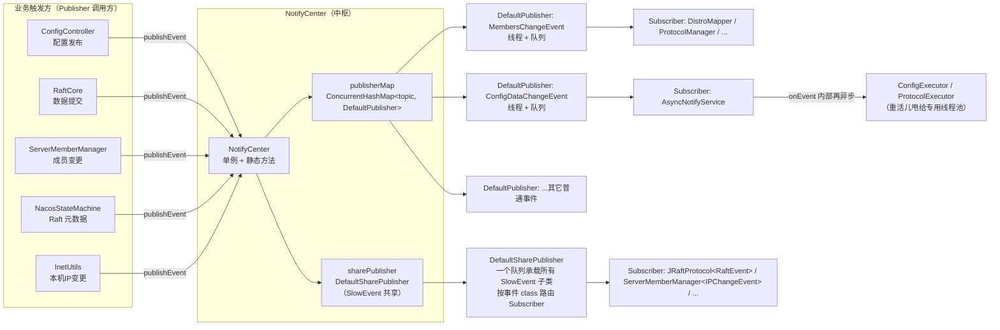

---

## 二、整体架构

### 2.1 三层结构

整套机制分为三层：**事件模型层**、**中枢调度层**、**消费执行层**。

| 层次 | 核心组件 | 职责 |
|------|---------|------|
| 事件模型层 | `Event` / `SlowEvent` / `Subscriber` / `SmartSubscriber` | 定义"事件是什么"和"订阅者长什么样" |
| 中枢调度层 | `NotifyCenter` / `EventPublisher` | 事件总线入口、Publisher 管理（按 topic 路由）、注册/反注册、生命周期 |
| 消费执行层 | `DefaultPublisher` / `DefaultSharePublisher` | 每个事件类型一个独立线程 + 阻塞队列，单线程串行消费，回调 Subscriber |

### 2.2 两条并行总线

Nacos 把事件分成两类，走两条不同的总线：

| 总线 | 适用事件 | Publisher | 队列模型 | 路由方式 |
|------|---------|-----------|---------|---------|
| **普通总线** | `extends Event`（非 SlowEvent） | 每个事件类型**一个独立 `DefaultPublisher`** | 一对一：一个事件类型 ↔ 一个队列 ↔ 一个消费线程 | 按 `event.getClass().getCanonicalName()` 作 topic 直接定位 Publisher |
| **共享总线** | `extends SlowEvent` | **全局唯一 `DefaultSharePublisher`** | 多对一：所有 SlowEvent 子类共用一个队列、一个消费线程 | 队列取出后，按 `event.getClass()` 在 `subMappings` 中 O(1) 查找该类型的 Subscriber 集合 |

> **设计意图**：`SlowEvent` 顾名思义是"慢事件"——处理可能耗时（如 Raft 元数据刷新、DB 错误降级）。把所有慢事件塞进一个共享队列、用单线程串行消费，避免为每种慢事件各开一个线程，同时天然避免慢事件之间互相阻塞普通事件。代价是：慢事件之间会互相排队。

### 2.3 与 Spring ApplicationEvent 的关系（重要澄清）

Nacos 服务端实际存在**两套**事件机制，容易混淆：

| 机制 | 事件基类 | 发布入口 | 订阅入口 | 用途 |
|------|---------|---------|---------|------|
| **自研事件总线** | `com.alibaba.nacos.common.notify.Event` | `NotifyCenter.publishEvent()` | `NotifyCenter.registerSubscriber()` | 配置变更、集群成员变更、Raft/持久化数据变更、DB 降级等**核心解耦** |
| Spring ApplicationEvent | `org.springframework.context.ApplicationEvent` | `applicationContext.publishEvent()` | `ApplicationListener` / `@EventListener` | Naming 模块的 `ServiceChangeEvent`、`InstanceHeartbeatTimeoutEvent`、`MakeLeaderEvent`、`LeaderElectFinishedEvent` 等 |

本文聚焦自研事件总线（`NotifyCenter`）。Spring ApplicationEvent 仅在命名模块的"服务变更推送""心跳超时""Raft 选主"等场景作为补充出现，属另一套机制。

---

## 三、核心组件源码解析

### 3.1 `Event`：事件基类

```java
// common/src/main/java/com/alibaba/nacos/common/notify/Event.java
public abstract class Event implements Serializable {

    private static final AtomicLong SEQUENCE = new AtomicLong(0);

    private final long sequence = SEQUENCE.getAndIncrement();   // ★ 全局自增序号，单调

    public long sequence() {
        return sequence;
    }

    public String scope() {        // 事件作用域，默认 null（对所有订阅者可见）
        return null;
    }
}
```

关键点：
- **`sequence`**：每个普通事件构造时拿到一个全局自增序号，用于"过期事件过滤"（见 3.3）。
- **`scope()`**：默认 `null`。`Subscriber.scopeMatches()` 默认实现是 `event.scope() == null`，即默认全部匹配。Nacos 1.4.8 服务端**没有任何事件/订阅者覆写过 scope**，该机制预留未用。

### 3.2 `SlowEvent`：慢事件标记

```java
// common/src/main/java/com/alibaba/nacos/common/notify/SlowEvent.java
public abstract class SlowEvent extends Event {

    @Override
    public long sequence() {
        return 0;          // ★ 慢事件序号恒为 0
    }
}
```

`SlowEvent` 只是个**标记基类**——继承它的事件会被 `NotifyCenter` 路由到共享 Publisher。它的 `sequence()` 恒返回 `0`，意味着慢事件不参与序号过期过滤。

### 3.3 `DefaultPublisher`：单事件类型消费引擎

这是整个机制的**心脏**。它本身是一个 `Thread`：

```java
// common/src/main/java/com/alibaba/nacos/common/notify/DefaultPublisher.java
public class DefaultPublisher extends Thread implements EventPublisher {

    protected final ConcurrentHashSet<Subscriber> subscribers = new ConcurrentHashSet<>();  // 订阅者集合
    private BlockingQueue<Event> queue;                  // 事件暂存队列
    protected volatile Long lastEventSequence = -1L;     // 已处理的最大事件序号
    private volatile boolean shutdown = false;

    @Override
    public void init(Class<? extends Event> type, int bufferSize) {
        setDaemon(true);
        setName("nacos.publisher-" + type.getName());    // 线程名：nacos.publisher-<事件全类名>
        this.queue = new ArrayBlockingQueue<Event>(bufferSize);  // ★ 阻塞队列，默认容量 16384
        start();                                          // 启动消费线程
    }
```

#### (1) 消费主循环：`openEventHandler()`

```java
void openEventHandler() {
    try {
        int waitTimes = 60;
        // ★ 启动时最多等 60 秒，等第一个 Subscriber 注册进来再开始消费，避免事件丢失
        for (; ; ) {
            if (shutdown || hasSubscriber() || waitTimes <= 0) break;
            ThreadUtils.sleep(1000L);
            waitTimes--;
        }
        // 主循环：不断从队列取事件、分发
        for (; ; ) {
            if (shutdown) break;
            final Event event = queue.take();             // ★ 阻塞拉取
            receiveEvent(event);                          // 同步分发
            UPDATER.compareAndSet(this, lastEventSequence,
                    Math.max(lastEventSequence, event.sequence()));  // 更新已处理序号
        }
    } catch (Throwable ex) {
        LOGGER.error("Event listener exception : ", ex);
    }
}
```

#### (2) 发布：`publish()`

```java
@Override
public boolean publish(Event event) {
    checkIsStart();
    boolean success = this.queue.offer(event);           // ★ 非阻塞入队
    if (!success) {
        // 队列满 → 退化为同步直接分发，保证不丢事件（但会阻塞发布线程）
        LOGGER.warn("Unable to plug in due to interruption, synchronize sending time, event : {}", event);
        receiveEvent(event);
        return true;
    }
    return true;
}
```

> **关键设计**：`offer` 是非阻塞的——队列满时**不阻塞消费线程也不丢事件**，而是退化为在**发布者线程**内同步调用 `receiveEvent`。这是一个"背压"降级策略：用牺牲发布者吞吐来换取不丢消息。

#### (3) 分发：`receiveEvent()` → `notifySubscriber()`

```java
void receiveEvent(Event event) {
    final long currentEventSequence = event.sequence();
    for (Subscriber subscriber : subscribers) {
        if (!subscriber.scopeMatches(event)) continue;          // scope 过滤

        // ★ 过期事件过滤：若订阅者要求忽略过期事件，且当前事件序号小于已处理序号，则跳过
        if (subscriber.ignoreExpireEvent() && lastEventSequence > currentEventSequence) {
            continue;
        }
        notifySubscriber(subscriber, event);
    }
}

@Override
public void notifySubscriber(final Subscriber subscriber, final Event event) {
    final Runnable job = () -> subscriber.onEvent(event);   // ★ 真正的业务回调
    final Executor executor = subscriber.executor();
    if (executor != null) {
        executor.execute(job);           // 订阅者指定了线程池 → 异步执行
    } else {
        try {
            job.run();                    // ★ 否则同步执行：在 Publisher 消费线程内直接跑 onEvent
        } catch (Throwable e) {
            LOGGER.error("Event callback exception : ", e);
        }
    }
}
```

> **关键设计**：
> - 默认 `executor()` 返回 `null`，所以 **`onEvent` 在 Publisher 的单消费线程内同步执行**。这意味着：(a) 一个订阅者抛异常**不会影响**其它订阅者（被 try-catch 兜住）；(b) 但**一个订阅者卡住会阻塞整个事件类型队列**的消费。因此订阅者必须把重活儿甩给专用线程池。
> - `ignoreExpireEvent()`：当订阅者开启且事件乱序到达（序号小于已处理最大值），跳过该事件。单线程串行消费下一般不会乱序，这是兜底保护。

### 3.4 `DefaultSharePublisher`：慢事件共享总线

```java
// common/src/main/java/com/alibaba/nacos/common/notify/DefaultSharePublisher.java
public class DefaultSharePublisher extends DefaultPublisher {

    // ★ 按 SlowEvent 的具体 Class 分桶存放订阅者集合
    private final Map<Class<? extends SlowEvent>, Set<Subscriber>> subMappings
            = new ConcurrentHashMap<>();

    public void addSubscriber(Subscriber subscriber, Class<? extends Event> subscribeType) {
        // 既加入父类 subscribers（统一集合），也按事件类型分桶到 subMappings
        subscribers.add(subscriber);
        lock.lock();
        try {
            subMappings.computeIfAbsent((Class<? extends SlowEvent>) subscribeType,
                    k -> new ConcurrentHashSet<>()).add(subscriber);
        } finally { lock.unlock(); }
    }

    @Override
    public void receiveEvent(Event event) {
        final long currentEventSequence = event.sequence();   // SlowEvent 恒为 0
        // ★ 按 event.getClass() O(1) 定位本类订阅者集合（而非遍历全部 subscribers）
        final Set<Subscriber> subscribers = subMappings.get((Class<? extends SlowEvent>) event.getClass());
        if (null == subscribers) return;
        for (Subscriber subscriber : subscribers) {
            if (subscriber.ignoreExpireEvent() && lastEventSequence > currentEventSequence) continue;
            notifySubscriber(subscriber, event);
        }
    }
}
```

> **与 `DefaultPublisher` 的差异**：父类 `receiveEvent` 遍历**该 Publisher 下所有订阅者**（因为它一个 Publisher 只服务一个事件类型）；共享 Publisher 服务**多种** SlowEvent，所以必须在 `receiveEvent` 里按 `event.getClass()` 在 `subMappings` 中精确分桶——否则一个 `RaftEvent` 会误触发监听 `RaftDbErrorEvent` 的订阅者。

### 3.5 `NotifyCenter`：事件总线中枢

`NotifyCenter` 是个**单例 + 全静态方法**的门面，承担三件事：Publisher 管理、注册/反注册、发布。

```java
// common/src/main/java/com/alibaba/nacos/common/notify/NotifyCenter.java
public class NotifyCenter {

    public static int ringBufferSize = 16384;        // 普通 Publisher 队列容量
    public static int shareBufferSize = 1024;       // 共享 Publisher 队列容量

    private static final NotifyCenter INSTANCE = new NotifyCenter();
    private DefaultSharePublisher sharePublisher;                                   // 慢事件共享总线
    private final Map<String, EventPublisher> publisherMap = new ConcurrentHashMap<>();  // 普通 topic → Publisher
    private static Class<? extends EventPublisher> clazz = null;                    // Publisher 实现类（SPI）

    static {
        // 读 JVM 参数覆盖默认 buffer 大小
        ringBufferSize = Integer.getInteger("nacos.core.notify.ring-buffer-size", 16384);
        shareBufferSize = Integer.getInteger("nacos.core.notify.share-buffer-size", 1024);

        // ★ SPI 加载 EventPublisher 实现；没配 SPI 就用 DefaultPublisher
        final ServiceLoader<EventPublisher> loader = ServiceLoader.load(EventPublisher.class);
        clazz = loader.iterator().hasNext() ? loader.next().getClass() : DefaultPublisher.class;

        // ★ Publisher 工厂：clazz.newInstance() → init(事件类型, buffer)
        publisherFactory = (cls, buffer) -> {
            EventPublisher publisher = clazz.newInstance();
            publisher.init(cls, buffer);
            return publisher;
        };

        // ★ 启动即创建共享 Publisher，绑定 SlowEvent.class
        INSTANCE.sharePublisher = new DefaultSharePublisher();
        INSTANCE.sharePublisher.init(SlowEvent.class, shareBufferSize);

        ThreadUtils.addShutdownHook(NotifyCenter::shutdown);   // JVM 退出时清理
    }
```

> **SPI 扩展点**：`ServiceLoader.load(EventPublisher.class)` 允许通过 `META-INF/services/com.alibaba.nacos.common.notify.EventPublisher` 替换 Publisher 实现。1.4.8 默认无该 SPI 文件 → 用 `DefaultPublisher`。

#### (1) 注册订阅者

```java
public static <T> void registerSubscriber(final Subscriber consumer) {
    if (consumer instanceof SmartSubscriber) {
        // SmartSubscriber 可订阅多类事件，逐个注册
        for (Class<? extends Event> t : ((SmartSubscriber) consumer).subscribeTypes()) {
            if (ClassUtils.isAssignableFrom(SlowEvent.class, t))
                INSTANCE.sharePublisher.addSubscriber(consumer, t);   // 慢事件 → 共享总线
            else
                addSubscriber(consumer, t);                          // 普通 → 独立 Publisher
        }
        return;
    }
    final Class<? extends Event> subscribeType = consumer.subscribeType();
    if (ClassUtils.isAssignableFrom(SlowEvent.class, subscribeType))
        INSTANCE.sharePublisher.addSubscriber(consumer, subscribeType);
    else
        addSubscriber(consumer, subscribeType);
}

private static void addSubscriber(Subscriber consumer, Class<? extends Event> subscribeType) {
    final String topic = ClassUtils.getCanonicalName(subscribeType);
    synchronized (NotifyCenter.class) {
        // ★ 懒创建：该 topic 的 Publisher 还不存在就按工厂新建一个（容量 = ringBufferSize）
        MapUtils.computeIfAbsent(INSTANCE.publisherMap, topic, publisherFactory, subscribeType, ringBufferSize);
    }
    INSTANCE.publisherMap.get(topic).addSubscriber(consumer);
}
```

> **懒加载**：普通事件的 Publisher **在第一个订阅者注册时才创建并启动线程**（或被显式 `registerToPublisher` 创建）。这也解释了 `DefaultPublisher.openEventHandler` 为什么要等 60 秒首个订阅者——因为 Publisher 可能先于订阅者被创建。

#### (2) 发布事件

```java
public static boolean publishEvent(final Event event) {
    return publishEvent(event.getClass(), event);
}

private static boolean publishEvent(Class<? extends Event> eventType, Event event) {
    if (ClassUtils.isAssignableFrom(SlowEvent.class, eventType))
        return INSTANCE.sharePublisher.publish(event);              // ★ 慢事件走共享总线
    final String topic = ClassUtils.getCanonicalName(eventType);
    EventPublisher publisher = INSTANCE.publisherMap.get(topic);
    if (publisher != null)
        return publisher.publish(event);
    LOGGER.warn("There are no [{}] publishers for this event, please register", topic);  // 没人订阅→丢弃+告警
    return false;
}
```

> **关键**：若某事件类型既未注册 Publisher、共享总线也不接管（非 SlowEvent），则 `publishEvent` **直接告警并丢弃**（`return false`）。所以普通事件发布前必须确保有订阅者或显式 `registerToPublisher`。

#### (3) 显式注册 Publisher

```java
public static EventPublisher registerToPublisher(Class<? extends Event> eventType, int queueMaxSize) {
    if (ClassUtils.isAssignableFrom(SlowEvent.class, eventType)) return INSTANCE.sharePublisher;
    final String topic = ClassUtils.getCanonicalName(eventType);
    synchronized (NotifyCenter.class) {
        MapUtils.computeIfAbsent(INSTANCE.publisherMap, topic, publisherFactory, eventType, queueMaxSize);
    }
    return INSTANCE.publisherMap.get(topic);
}

public static EventPublisher registerToSharePublisher(Class<? extends SlowEvent> eventType) {
    return INSTANCE.sharePublisher;     // 慢事件共享总线本就全局唯一，这里实际是 no-op（仅返回引用）
}
```

### 3.6 `Subscriber` / `SmartSubscriber`：订阅者

```java
// common/src/main/java/com/alibaba/nacos/common/notify/listener/Subscriber.java
public abstract class Subscriber<T extends Event> {
    public abstract void onEvent(T event);                         // ★ 业务回调
    public abstract Class<? extends Event> subscribeType();        // ★ 订阅的事件类型
    public Executor executor() { return null; }                    // 默认 null → 同步在消费线程执行
    public boolean ignoreExpireEvent() { return false; }           // 默认不过滤过期事件
    public boolean scopeMatches(T event) { return event.scope() == null; }
}

// common/src/main/java/com/alibaba/nacos/common/notify/listener/SmartSubscriber.java
public abstract class SmartSubscriber extends Subscriber {
    public abstract List<Class<? extends Event>> subscribeTypes(); // ★ 订阅多个事件类型
    @Override public final Class<? extends Event> subscribeType() { return null; }
    @Override public final boolean ignoreExpireEvent() { return false; }  // SmartSubscriber 恒不过滤过期事件
}
```

- **`Subscriber`**：订阅单类事件，可覆写 `executor()`/`ignoreExpireEvent()`/`scopeMatches()`。
- **`SmartSubscriber`**：订阅多类事件，`subscribeType()` 被 final 置 null，`ignoreExpireEvent()` 被 final 置 false（不可改）。

---

## 四、执行流程

### 4.1 启动注册流程

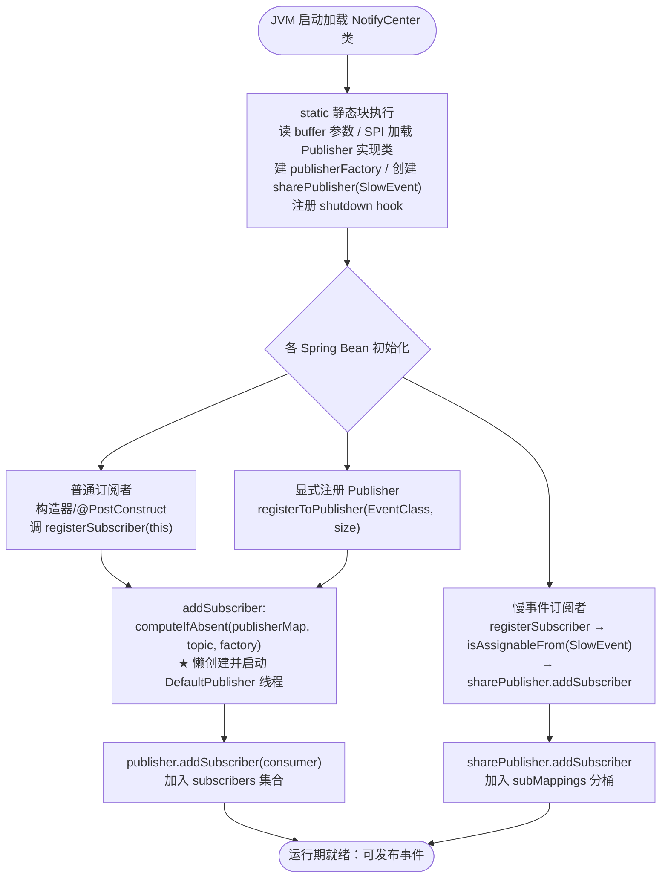

### 4.2 发布-分发时序

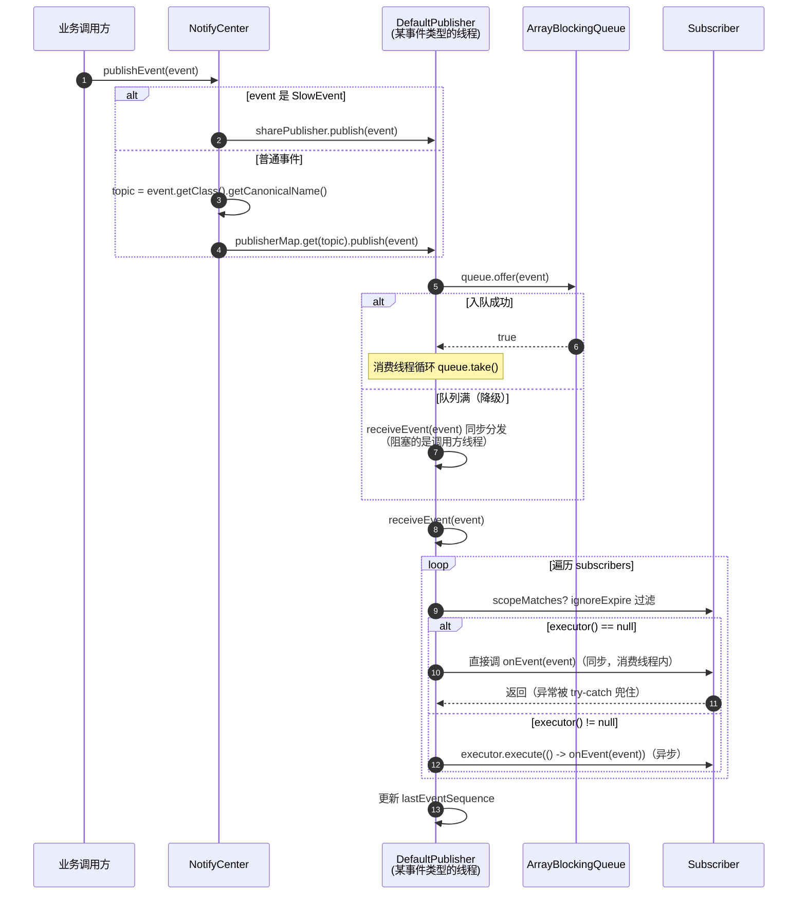

### 4.3 订阅者注册的三种姿势

| 姿势 | 示例 | 说明 |
|------|------|------|
| **Spring Bean 自注册** | `ProtocolManager` 构造器、`DistroMapper` `@PostConstruct`、`ServerListManager` 构造器 | Bean 初始化时 `NotifyCenter.registerSubscriber(this)` |
| **外部注册非 Spring 实例** | `DumpConfigHandler`（由 `DistributedDatabaseOperateImpl.init` 注册）、`PersistentNotifier`（由 `RaftCore.init` / Processor 注册） | 订阅者本身不是 Bean，由宿主 Bean 在初始化时 `new` 出来注册 |
| **匿名内部类就地注册** | `AsyncNotifyService`、`LongPollingService`、`CurcuitFilter`、`ServerMemberManager`、`JRaftProtocol`、`DistributedDatabaseOperateImpl` 中的匿名 `Subscriber`/`SmartSubscriber` | 宿主 Bean 构造时 `new Subscriber(){...}` 直接注册 |

---

## 五、服务端事件全景清单

### 5.1 普通 `Event`（独立 Publisher）

| # | 事件类 | 模块 | 业务含义 | Publisher 注册点 | 发布点 | 订阅者 |
|---|--------|------|---------|-----------------|--------|--------|
| 1 | `MembersChangeEvent` | core | 集群成员列表变更（members） | `ServerMemberManager:165` | `ServerMemberManager:227`、`:340` | `ProtocolManager`、`ServerListManager`、`DistroMapper`、`RaftPeerSet`（均经 `MemberChangeListener`，`ignoreExpireEvent=true`） |
| 2 | `ConfigDataChangeEvent` | config | 配置数据变更（dataId/group/tenant/tag/isBeta/lastModifiedTs） | `AsyncNotifyService:65` | `ConfigController` 经 `ConfigChangePublisher.notifyConfigChange`（:174/178/184/262/285/428/626/863）、`MergeTaskProcessor:104` | `AsyncNotifyService` 匿名（向集群成员 HTTP 通知） |
| 3 | `ConfigDumpEvent` | config | 配置 dump 指令（写本地磁盘缓存+MD5） | `DistributedDatabaseOperateImpl:211` | `DistributedDatabaseOperateImpl:576`（反序列化 raft 提交的 JSON） | `DumpConfigHandler`（dump 到 `ConfigCacheService`） |
| 4 | `LocalDataChangeEvent` | config | 本机配置数据变更（groupKey/isBeta/betaIps/tag） | `LongPollingService:289` | `ConfigCacheService:520`（×2） | `LongPollingService` 匿名（`DataChangeTask` 唤醒长轮询客户端） |
| 5 | `ValueChangeEvent` | naming | 持久化数据变更（key/Record value/DataOperation CHANGE/DELETE） | `BasePersistentServiceProcessor:132`、`RaftCore:149` | `RaftCore:401/1043/1072`、`RaftStore:87`、`BasePersistentServiceProcessor:219` | `PersistentNotifier`（桥接到 `RecordListener.onChange/onDelete`） |
| 6 | `RaftErrorEvent` | core | Raft Group 异常（groupName） | —（无显式注册/懒加载） | —（1.4.8 未发现发布点） | —（1.4.8 未发现订阅者） |
| 7 | `RaftDbErrorRecoverEvent` | config | Raft DB 恢复 | —（懒加载） | —（1.4.8 未发现发布点） | `CurcuitFilter` 匿名 `SmartSubscriber`（置 `isDowngrading=false`） |

> 注：`RaftErrorEvent`、`RaftDbErrorRecoverEvent` 在 1.4.8 中定义且（后者）被订阅，但未发现实际发布点，属预留/未接线状态。

### 5.2 `SlowEvent`（共享 Publisher）

| # | 事件类 | 模块 | 业务含义 | 共享总线注册点 | 发布点 | 订阅者 |
|---|--------|------|---------|---------------|--------|--------|
| 8 | `RaftEvent` | core | Raft 元数据变更（groupId/leader/term/errMsg/raftClusterInfo） | `JRaftProtocol:120` | `NacosStateMachine:184/198/205/213` | `JRaftProtocol` 匿名（加载 `ProtocolMetaData`：leader/term/members） |
| 9 | `RaftDbErrorEvent` | config | Raft DB 异常（Throwable ex） | `DistributedDatabaseOperateImpl:195` | `DistributedDatabaseOperateImpl:564` | `CurcuitFilter` 匿名（置 `isDowngrading=true`）+ `DistributedDatabaseOperateImpl` 匿名（`setHealthStatus("DOWN")`） |
| 10 | `DerbyLoadEvent` | config | Derby 加载完成（单例 INSTANCE） | `DistributedDatabaseOperateImpl:197` | `DerbySnapshotOperation:142` | —（1.4.8 未发现订阅者） |
| 11 | `DerbyImportEvent` | config | Derby 数据导入（finished） | `EmbeddedStoragePersistServiceImpl:139` | `ConfigOpsController:144/146` | —（1.4.8 未发现订阅者） |
| 12 | `IPChangeEvent` | sys | 本机网卡 IP 变更 | `InetUtils:69` | `InetUtils:129` | `ServerMemberManager` 匿名（重建 localAddress、更新 self Member） |

> 注：`DerbyLoadEvent`、`DerbyImportEvent` 已注册到共享总线并被发布，但 1.4.8 未发现实际订阅者，可视为系统级"信号"事件。

### 5.3 服务端订阅者全景

| # | 订阅者 | 模块 | 订阅事件 | `ignoreExpireEvent` | `onEvent` 行为 | 注册方式 |
|---|--------|------|---------|--------------------|---------------|---------|
| 1 | `MemberChangeListener`（抽象基类） | core | `MembersChangeEvent` | **`true`** | 抽象 | 不注册（基类） |
| 2 | `ProtocolManager` | core | `MembersChangeEvent` | 继承 `true` | 把新成员集分别甩给 AP/CP 协议线程池（`ProtocolExecutor.apMemberChange`/`cpMemberChange`） | 构造器自注册 |
| 3 | `ServerListManager` | naming | `MembersChangeEvent` | 继承 `true` | 用新成员集替换缓存的 `servers` 列表 | 构造器自注册 |
| 4 | `DistroMapper` | naming | `MembersChangeEvent` | 重写 `true` | 用 UP/SUSPICIOUS 成员重建并**排序** `healthyList`（保证全集群 distro 哈希桶一致） | `@PostConstruct` 自注册 |
| 5 | `RaftPeerSet` | naming | `MembersChangeEvent` | 继承 `true` | 检测新成员，调 `changePeers` 重建 `peers` 映射 | `@PostConstruct` 自注册 |
| 6 | `PersistentNotifier` | naming | `ValueChangeEvent` | 默认 `false` | 按 key 查 `Record`，`DataOperation.CHANGE`→`listener.onChange`，`DELETE`→`listener.onDelete` | 外部注册（`RaftCore.init` / `BasePersistentServiceProcessor` / `PersistentServiceProcessor`） |
| 7 | `DumpConfigHandler` | config | `ConfigDumpEvent` | 默认 `false` | 调 `ConfigCacheService.dump/remove(beta/tag)` 写磁盘缓存+MD5，重载特殊 metadata dataId，写 trace | 外部注册（`DistributedDatabaseOperateImpl.init:212`） |
| 8 | `CurcuitFilter` 匿名 `SmartSubscriber` | config | `RaftDbErrorEvent`、`RaftDbErrorRecoverEvent` | final `false` | 错误→`isDowngrading=true`；恢复→`isDowngrading=false`（写请求降级开关） | `@PostConstruct` 内匿名注册 |
| 9 | `DistributedDatabaseOperateImpl` 匿名 | config | `RaftDbErrorEvent` | 默认 `false` | `dataSourceService.setHealthStatus("DOWN")` | `init()` 内匿名注册 |
| 10 | `LongPollingService` 匿名 | config | `LocalDataChangeEvent` | 默认 `false` | 提交 `DataChangeTask` 到 `ConfigExecutor.executeLongPolling`，唤醒匹配的长轮询客户端 | 构造器内匿名注册 |
| 11 | `AsyncNotifyService` 匿名 | config | `ConfigDataChangeEvent` | 默认 `false` | 为每个集群成员构造 `NotifySingleTask`，提交 `AsyncTask` 到 `ConfigExecutor.executeAsyncNotify`，异步 HTTP `GET /dataChange` | 构造器内匿名注册 |
| 12 | `JRaftProtocol` 匿名 | core | `RaftEvent`（SlowEvent） | 默认 `false` | 组装 `leader/term/raftClusterInfo` 元数据 map，`metaData.load` 注入协议元数据 | `init()` 内匿名注册 |
| 13 | `ServerMemberManager` 匿名 | core | `IPChangeEvent`（SlowEvent） | 默认 `false` | 重建 `localAddress`，更新 `self` Member 的 IP，刷新 `serverList`/`memberAddressInfos` | `registerClusterEvent()` 内匿名注册 |

> **横切观察**：
> - **没有任何订阅者覆写 `executor()`** → 所有 `onEvent` 默认在 Publisher 单消费线程内**同步**执行。
> - **没有任何订阅者覆写 `scopeMatches`** → scope 机制在 1.4.8 全未启用。
> - **只有 `MembersChangeEvent` 家族**（`MemberChangeListener` 基类 + `DistroMapper` 重申）开启 `ignoreExpireEvent=true`：成员列表只认最新，过期事件必须丢弃。
> - 重活儿订阅者（配置通知、协议成员变更）都在 `onEvent` 内把任务甩给**专用线程池**（`ConfigExecutor`、`ProtocolExecutor`），避免阻塞消费线程。

---

## 六、典型端到端流程案例

### 6.1 案例一：配置发布 → 集群通知 + 长轮询客户端推送

这是最核心的配置中心流程。一次 `POST /nacos/v1/cs/configs`（`ConfigController.publishConfig`）会触发**两条事件链**。

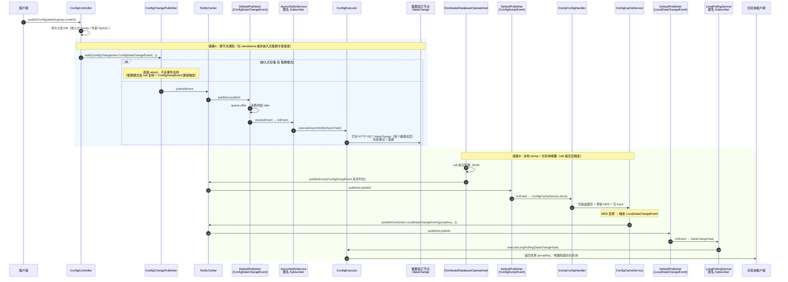

**两条链路分工**：
- **链路 A（`ConfigDataChangeEvent`）**：负责把"配置变了"这个信号广播给**集群内其它 Nacos 节点**（异步 HTTP `/dataChange`），让它们各自去 dump。**注意短路**：嵌入式存储 + 集群模式下 `notifyConfigChange` 直接 return——因为此时配置变更已通过 raft 复制到各节点，各节点 raft apply 时自然走 `ConfigDumpEvent` 路径，无需再发 `ConfigDataChangeEvent`。
- **链路 B（`ConfigDumpEvent` → `LocalDataChangeEvent`）**：负责**本节点**落盘缓存 + 更新 MD5 + 唤醒挂在本节点长轮询上的客户端。

### 6.2 案例二：集群成员变更 → Distro/Raft/协议感知

`ServerMemberManager` 是集群成员管理的核心。成员变更（心跳更新、配置文件变更、节点上下线）会发布 `MembersChangeEvent`，四类订阅者并行反应。

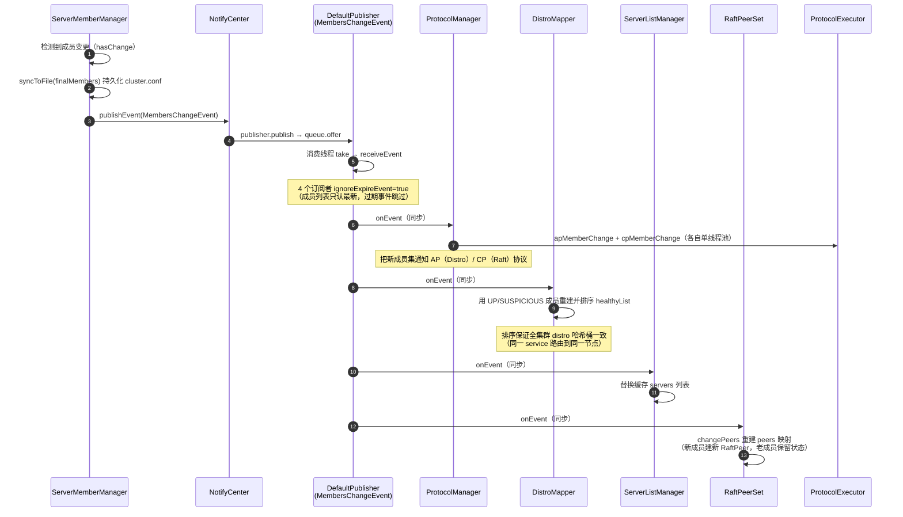

> **设计要点**：四个订阅者**串行**在同一消费线程内执行（`executor()` 均为 null）。它们都很轻（只更新内存数据结构），重活（协议成员变更）被 `ProtocolManager` 甩给了 `ProtocolExecutor`，所以串行不会成为瓶颈。

### 6.3 案例三：Naming 持久化数据变更 → RecordListener

Naming 模块的持久化数据（服务实例、心跳）经 Raft 提交后，通过 `ValueChangeEvent` 通知业务侧的 `RecordListener`。

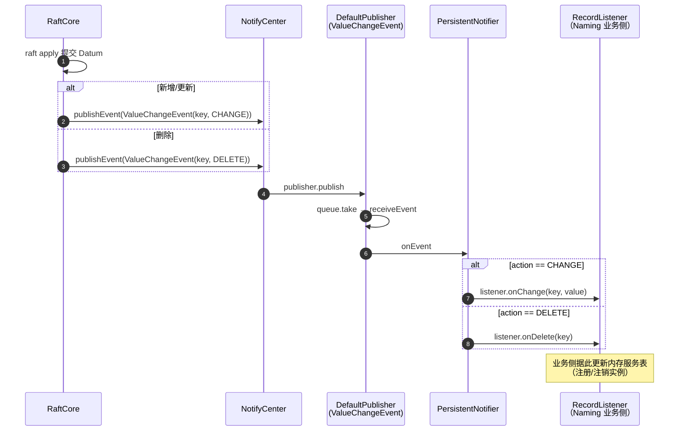

> `PersistentNotifier` 本身不处理业务，它是**通用桥接器**：把 NotifyCenter 事件总线翻译成 Naming 内部更细粒度的 per-key `RecordListener` 回调机制。

### 6.4 案例四：Raft 元数据变更（共享总线）

Raft 选主、成员变更产生 `RaftEvent`（`SlowEvent`），走共享总线。`JRaftProtocol` 订阅它来更新协议元数据。

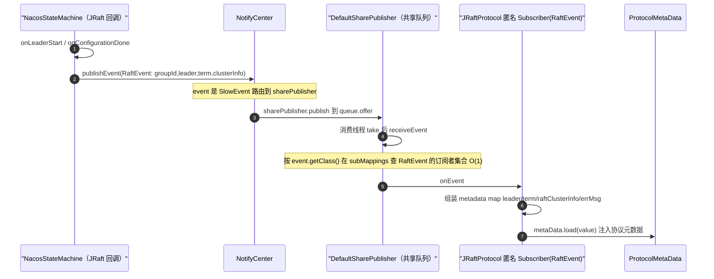

### 6.5 案例五：Raft DB 错误 → 降级（共享总线）

嵌入式 Derby raft DB 出错时发布 `RaftDbErrorEvent`，两个订阅者协同把服务切到降级模式。

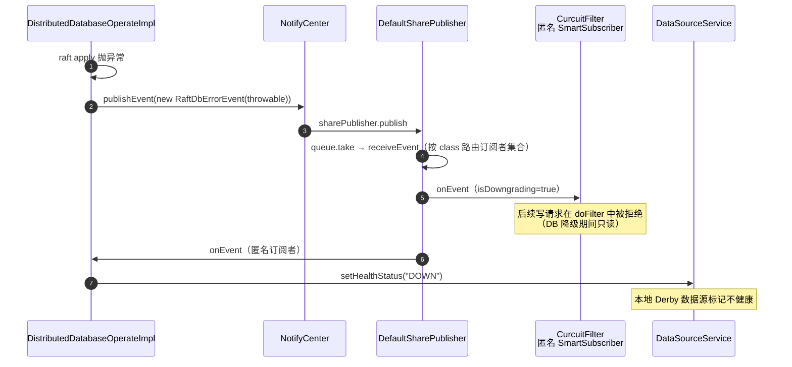

> 注意：`RaftDbErrorRecoverEvent`（恢复）在 1.4.8 被 `CurcuitFilter` 订阅（置 `isDowngrading=false`），但**未发现发布点**，恢复路径目前未完全接线。

### 6.6 案例六：本机 IP 变更（共享总线）

`InetUtils` 监测到本机网卡 IP 变化时发布 `IPChangeEvent`，`ServerMemberManager` 据此修正集群对自身的认知。

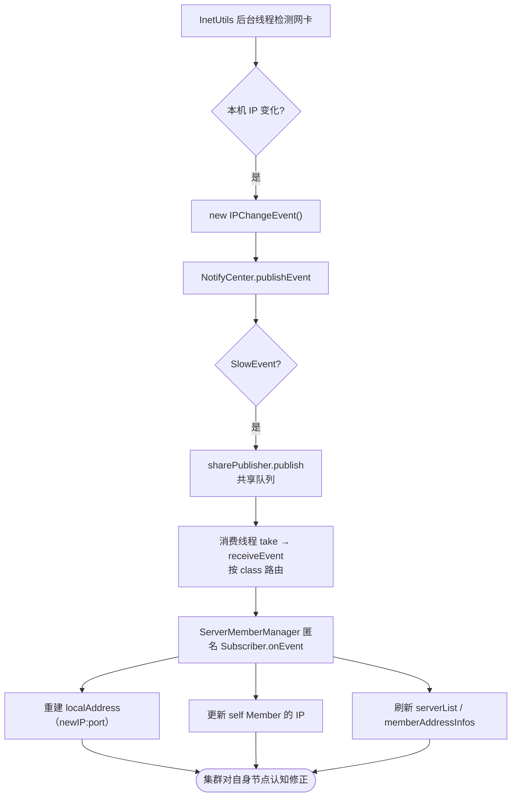

---

## 七、关键设计点与并发模型

### 7.1 线程模型

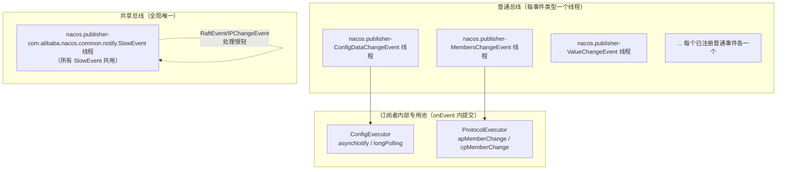

- **每事件类型一个守护线程**：事件类型之间天然隔离、互不阻塞。
- **共享总线单线程**：所有慢事件串行，避免为每种慢事件开线程，但慢事件之间会互相排队。
- **`onEvent` 默认同步**：订阅者必须非阻塞；重活甩给 `ConfigExecutor`/`ProtocolExecutor` 等专用池。

### 7.2 不丢事件的两道保险

1. **启动等待**：`DefaultPublisher.openEventHandler` 启动时最多等 60 秒首个订阅者，避免 Publisher 先于订阅者启动时丢事件。
2. **队列满降级**：`publish` 中 `queue.offer` 失败时，退化为在调用方线程同步 `receiveEvent`，宁可牺牲发布者吞吐也不丢事件。

### 7.3 过期事件过滤

`ignoreExpireEvent` + `lastEventSequence` 机制：单线程串行消费下事件本应有序，该机制是兜底——当订阅者开启且事件序号小于已处理最大值时跳过。`MembersChangeEvent` 家族开启它（成员列表只认最新）。`SmartSubscriber` 被 final 锁死为 `false`。`SlowEvent` 因 `sequence()` 恒为 0，该机制对其无效。

### 7.4 路由的两种策略对比

| 维度 | `DefaultPublisher`（普通） | `DefaultSharePublisher`（共享） |
|------|---------------------------|--------------------------------|
| Publisher 数量 | 每事件类型 1 个 | 全局 1 个 |
| 队列 | 1 对 1 | 多类事件共用 1 个 |
| 订阅者查找 | 直接遍历 `subscribers`（该 Publisher 只服务一种事件） | `receiveEvent` 内按 `event.getClass()` 在 `subMappings` O(1) 查桶 |
| 隔离性 | 事件类型间完全隔离 | 慢事件间互相排队 |
| 适用 | 高频/需隔离（配置变更、数据变更、成员变更） | 低频/可容忍排队（Raft 元数据、DB 降级、IP 变更） |

### 7.5 优势与代价

**优势**
- **轻量**：纯 JDK 实现，无第三方依赖，启动即用。
- **隔离**：按事件类型分线程，避免互相阻塞。
- **可扩展**：`EventPublisher` SPI 可替换实现（如换 Disruptor）。
- **解耦**：发布者完全不感知谁订阅，便于模块间解耦。

**代价 / 注意点**
- **同步 `onEvent` 风险**：订阅者 `executor()` 返回 null 时在消费线程内同步执行，**一个慢订阅者会拖垮整个事件类型队列**——必须把重活甩出去。
- **共享总线排队**：慢事件间互相阻塞，若某类慢事件处理慢会饿死其它慢事件。
- **无订阅者则丢弃**：普通事件若无订阅者/未注册 Publisher，`publishEvent` 告警并丢弃。
- **无广播语义保证**：单线程串行，订阅者执行顺序即注册顺序，但 API 不保证顺序契约。

---

## 八、源码位置索引

| 关注点 | 文件路径 | 关键行 |
|--------|---------|--------|
| 事件总线中枢 | `common/src/main/java/com/alibaba/nacos/common/notify/NotifyCenter.java` | 静态块 68-118；`registerSubscriber` 172；`publishEvent` 267-295；`registerToPublisher` 313 |
| 普通 Publisher | `common/src/main/java/com/alibaba/nacos/common/notify/DefaultPublisher.java` | `init` 62；`openEventHandler` 98；`publish` 141；`receiveEvent` 173；`notifySubscriber` 196 |
| 共享 Publisher | `common/src/main/java/com/alibaba/nacos/common/notify/DefaultSharePublisher.java` | `addSubscriber` 45；`receiveEvent` 90 |
| 事件基类 | `common/src/main/java/com/alibaba/nacos/common/notify/Event.java` | `sequence` 31 |
| 慢事件标记 | `common/src/main/java/com/alibaba/nacos/common/notify/SlowEvent.java` | `sequence()→0` 29 |
| 订阅者基类 | `common/src/main/java/com/alibaba/nacos/common/notify/listener/Subscriber.java` | `onEvent`/`executor` 37-73 |
| 多事件订阅者 | `common/src/main/java/com/alibaba/nacos/common/notify/listener/SmartSubscriber.java` | `subscribeTypes` 37 |
| 集群成员事件 | `core/src/main/java/com/alibaba/nacos/core/cluster/MembersChangeEvent.java` | `extends Event` 34 |
| 集群成员管理（发布+订阅） | `core/src/main/java/com/alibaba/nacos/core/cluster/ServerMemberManager.java` | 注册 Publisher 165；订阅 IPChange 170；发布 227/340 |
| 协议管理（订阅） | `core/src/main/java/com/alibaba/nacos/core/distributed/ProtocolManager.java` | 自注册 63；`onEvent` 147 |
| Raft 元数据事件 | `core/src/main/java/com/alibaba/nacos/core/distributed/raft/RaftEvent.java` | `extends SlowEvent` 30 |
| JRaft 协议（订阅+发布 RaftEvent） | `core/src/main/java/com/alibaba/nacos/core/distributed/raft/JRaftProtocol.java` | 注册共享 120；订阅 126 |
| Raft 状态机（发布 RaftEvent） | `core/src/main/java/com/alibaba/nacos/core/distributed/raft/NacosStateMachine.java` | 发布 184/198/205/213 |
| 配置变更事件 | `config/src/main/java/com/alibaba/nacos/config/server/model/event/ConfigDataChangeEvent.java` | `extends Event` 27 |
| 配置变更发布门面 | `config/src/main/java/com/alibaba/nacos/config/server/service/ConfigChangePublisher.java` | `notifyConfigChange` 36 |
| 集群异步通知（订阅） | `config/src/main/java/com/alibaba/nacos/config/server/service/notify/AsyncNotifyService.java` | 注册 Publisher 65；订阅 68 |
| 配置 dump 事件 | `config/src/main/java/com/alibaba/nacos/config/server/model/event/ConfigDumpEvent.java` | `extends Event` 26 |
| Dump 处理器（订阅） | `config/src/main/java/com/alibaba/nacos/config/server/service/dump/DumpConfigHandler.java` | `onEvent`/`configDump` 42-126 |
| 嵌入式 DB 操作（发布 Dump/Error） | `config/src/main/java/com/alibaba/nacos/config/server/service/repository/embedded/DistributedDatabaseOperateImpl.java` | 注册 195/197/211；订阅 199/212；发布 564/576 |
| 本地数据变更事件 | `config/src/main/java/com/alibaba/nacos/config/server/model/event/LocalDataChangeEvent.java` | `extends Event` 28 |
| 长轮询服务（订阅） | `config/src/main/java/com/alibaba/nacos/config/server/service/LongPollingService.java` | 注册 Publisher 289；订阅 292 |
| 配置缓存（发布 LocalDataChange） | `config/src/main/java/com/alibaba/nacos/config/server/service/ConfigCacheService.java` | 发布 520 |
| 降级过滤器（订阅 Error/Recover） | `config/src/main/java/com/alibaba/nacos/config/server/filter/CurcuitFilter.java` | 订阅 130 |
| Naming 持久化值变更事件 | `naming/src/main/java/com/alibaba/nacos/naming/consistency/ValueChangeEvent.java` | `extends Event` 28 |
| Naming 持久化通知器（订阅） | `naming/src/main/java/com/alibaba/nacos/naming/consistency/persistent/PersistentNotifier.java` | `onEvent` 131 |
| 旧 Raft 核心（发布+注册 ValueChange） | `naming/src/main/java/com/alibaba/nacos/naming/consistency/persistent/raft/RaftCore.java` | 注册 Publisher 149；订阅 188；发布 401/1043/1072 |
| 新 Raft 处理器（注册+发布） | `naming/src/main/java/com/alibaba/nacos/naming/consistency/persistent/impl/BasePersistentServiceProcessor.java` | 注册 132；发布 219 |
| Distro 路由（订阅 MembersChange） | `naming/src/main/java/com/alibaba/nacos/naming/core/DistroMapper.java` | 自注册 68；`onEvent` 134 |
| 本机 IP 变更事件（发布） | `sys/src/main/java/com/alibaba/nacos/sys/utils/InetUtils.java` | 注册共享 69；发布 129 |

---

## 九、一图总览

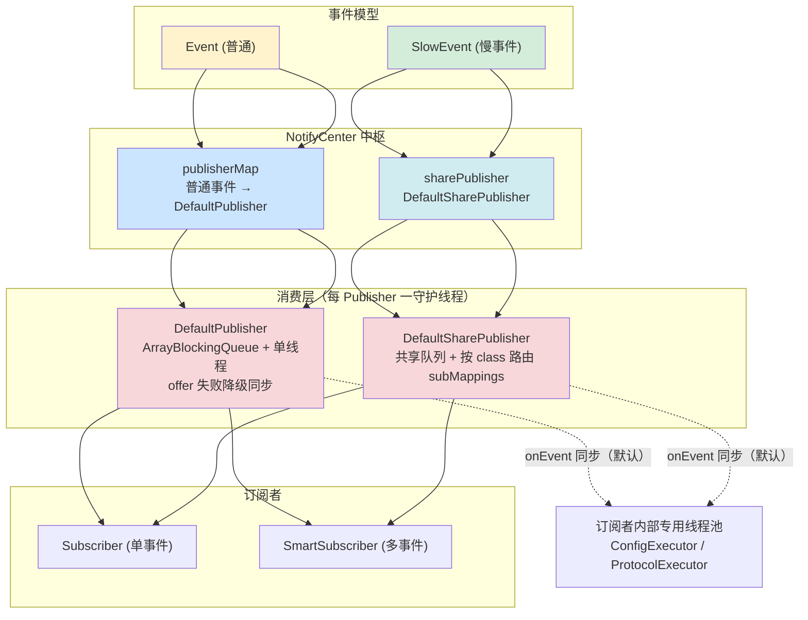

> **一句话总结**：`NotifyCenter` 把事件按"普通 / 慢"分流——普通事件每类一个 `DefaultPublisher` 独占线程队列，慢事件共享一个 `DefaultSharePublisher` 队列按 class 路由；发布者只管 `publishEvent`，Publisher 单线程串行消费、遍历订阅者同步调 `onEvent`，订阅者再把重活甩给专用线程池——以此实现 Nacos 服务端配置变更、集群成员变更、Raft/持久化数据变更、DB 降级等核心流程的彻底解耦。
