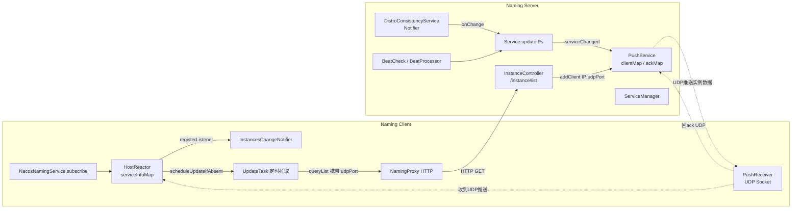
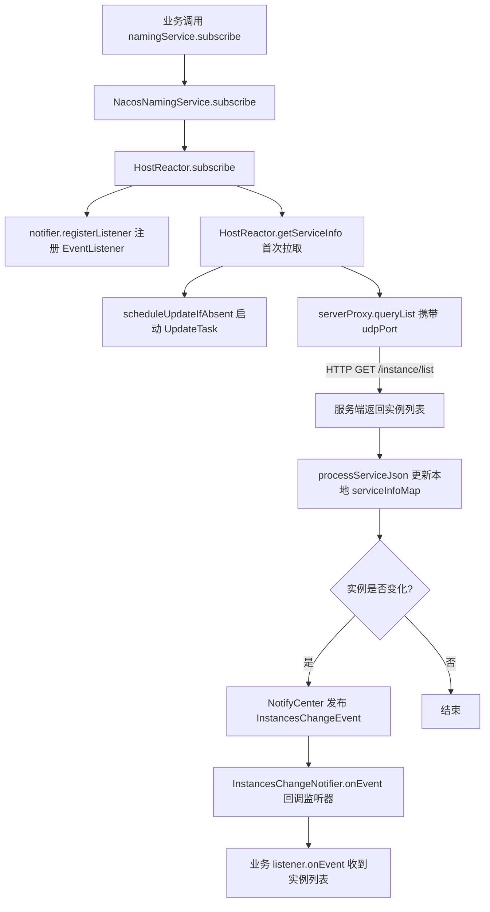
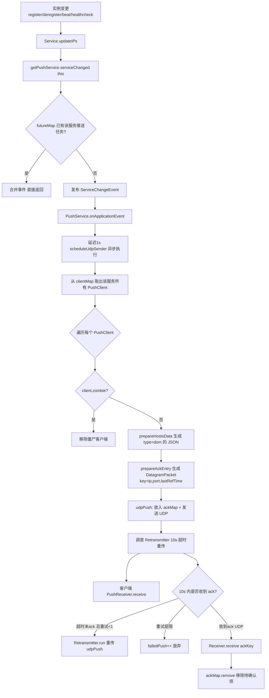
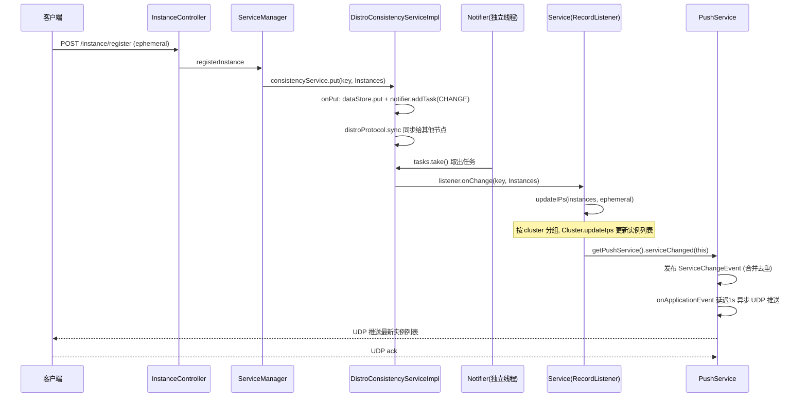
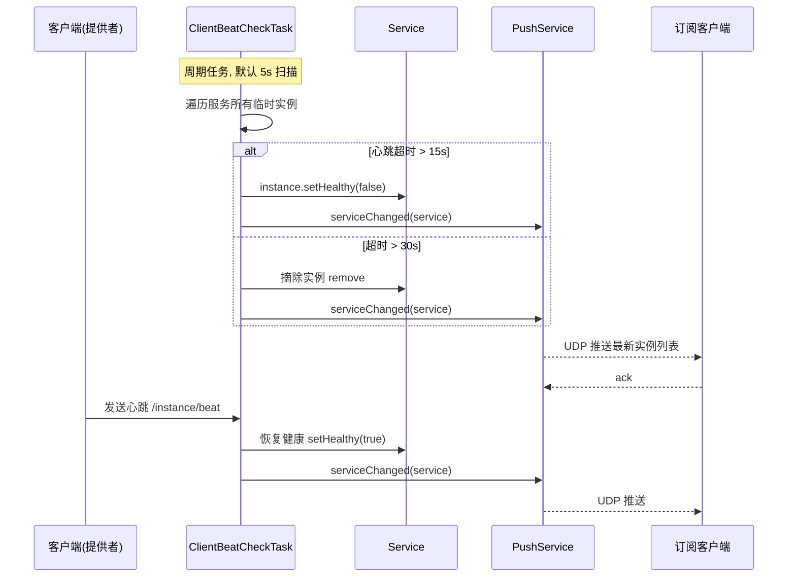
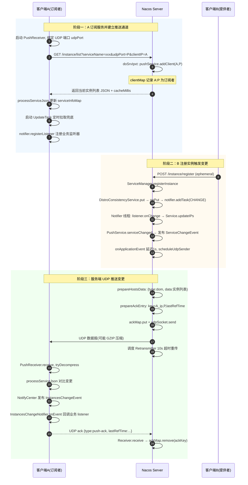

# Nacos 1.4.8 服务订阅原理与服务实例变更推送源码分析

> 基于 Nacos 1.4.8 源码（commit `f4373de72`）。
> Nacos 1.x 命名服务（Naming）的订阅模型采用 **UDP 推送 + 定时拉取（轮询）** 的混合模式：服务端在实例变更时主动通过 UDP 把最新服务列表推给订阅客户端；客户端同时以定时任务做补偿兜底。
> 注：1.x **不依赖长连接**（gRPC 长连接是 2.x 才引入的）。

---

## 一、整体架构与核心概念

### 1.1 推送模型总览

- **HTTP（拉）**：客户端通过 `/nacos/v1/ns/instance/list` 拉取实例列表，拉取时把**本地 UDP 端口**上报给服务端，服务端借此建立「订阅者表」。订阅没有独立 RPC，本质就是「带 UDP 端口的服务查询」。
- **UDP（推）**：服务端感知到实例变更时，向订阅者表中所有客户端的 UDP 端口发送最新实例数据；客户端收到后回 `ack`，未收到 `ack` 则服务端超时重传。

### 1.2 核心组件

| 角色 | 类 | 位置 | 职责 |
|---|---|---|---|
| 客户端订阅入口 | `NacosNamingService` | `client/.../naming/NacosNamingService.java` | 暴露 `subscribe` API，注册 `EventListener` |
| 客户端核心 | `HostReactor` | `client/.../naming/core/HostReactor.java` | 维护本地 `serviceInfoMap`、处理变更、通知监听器、调度定时拉取 |
| 客户端监听器管理 | `InstancesChangeNotifier` | `client/.../naming/core/InstancesChangeNotifier.java` | 以 `listenerMap` 维护服务→监听器集合，收到变更事件回调 |
| 客户端 UDP 接收 | `PushReceiver` | `client/.../naming/core/PushReceiver.java` | 监听本地 UDP 端口，解析推送报文并回 `ack` |
| 客户端 HTTP 代理 | `NamingProxy` | `client/.../naming/net/NamingProxy.java` | 发起 `queryList` 请求，携带 `udpPort` |
| 服务端推送服务 | `PushService` | `naming/.../push/PushService.java` | 维护订阅者表 `clientMap`、发送 UDP、处理 `ack`、重传 |
| 服务端查询入口 | `InstanceController` | `naming/.../controllers/InstanceController.java` | `/instance/list` 接口，登记 `PushClient` |
| 服务端服务管理 | `ServiceManager` | `naming/.../core/ServiceManager.java` | `serviceMap` 管理，实例变更触发推送 |
| 服务实体 | `Service` | `naming/.../core/Service.java` | `updateIPs` 末尾调用 `serviceChanged` |
| 临时实例一致性 | `DistroConsistencyServiceImpl` | `naming/.../consistency/ephemeral/distro/DistroConsistencyServiceImpl.java` | AP 协议，`onPut` → `Notifier` → `listener.onChange` |
| 心跳检查 | `ClientBeatCheckTask` / `ClientBeatProcessor` | `naming/.../healthcheck/` | 心跳超时摘除实例并触发推送 |

### 1.3 整体架构图



---

## 二、客户端订阅流程

### 2.1 订阅入口

`NacosNamingService.subscribe` 所有重载最终委托给 `HostReactor.subscribe`：

```java
// NacosNamingService.java:463
@Override
public void subscribe(String serviceName, String groupName, List<String> clusters, EventListener listener)
        throws NacosException {
    hostReactor.subscribe(NamingUtils.getGroupedName(serviceName, groupName),
            StringUtils.join(clusters, ","), listener);
}
```

```java
// HostReactor.java:141
public void subscribe(String serviceName, String clusters, EventListener eventListener) {
    notifier.registerListener(serviceName, clusters, eventListener);  // 1. 注册监听器
    getServiceInfo(serviceName, clusters);                            // 2. 首次拉取并启动定时任务
}
```

### 2.2 监听器注册（InstancesChangeNotifier）

监听器以 `服务key + 集群` 为维度存入 `listenerMap`：

```java
// InstancesChangeNotifier.java:58
public void registerListener(String serviceName, String clusters, EventListener listener) {
    String key = ServiceInfo.getKey(serviceName, clusters);
    ConcurrentHashSet<EventListener> eventListeners = listenerMap.get(key);
    if (eventListeners == null) {
        synchronized (lock) {
            eventListeners = listenerMap.get(key);
            if (eventListeners == null) {
                eventListeners = new ConcurrentHashSet<EventListener>();
                listenerMap.put(key, eventListeners);
            }
        }
    }
    eventListeners.add(listener);
}
```

### 2.3 首次拉取与定时任务调度

`HostReactor.getServiceInfo` → `scheduleUpdateIfAbsent` 启动 `UpdateTask`，并通过 `serverProxy.queryList` 向服务端发起首次 HTTP 拉取（**携带本地 UDP 端口**，见 §4.1）：

```java
// HostReactor.java:367
public void scheduleUpdateIfAbsent(String serviceName, String clusters) {
    if (futureMap.get(ServiceInfo.getKey(serviceName, clusters)) != null) {
        return;
    }
    synchronized (futureMap) {
        if (futureMap.get(ServiceInfo.getKey(serviceName, clusters)) != null) {
            return;
        }
        ScheduledFuture<?> future = addTask(new UpdateTask(serviceName, clusters));
        futureMap.put(ServiceInfo.getKey(serviceName, clusters), future);
    }
}
```

### 2.4 客户端订阅流程图



---

## 三、服务端如何建立订阅者表

客户端发起 `/instance/list` 查询时携带 `udpPort`，服务端在该接口里把客户端登记为推送目标。

### 3.1 查询入口（InstanceController）

```java
// InstanceController.java:393
int udpPort = Integer.parseInt(WebUtils.optional(request, "udpPort", "0"));
...
return doSrvIpxt(namespaceId, serviceName, agent, clusters, clientIP, udpPort, ...);
```

### 3.2 登记 PushClient（doSrvIpxt）

```java
// InstanceController.java:666
public ObjectNode doSrvIpxt(...) throws Exception {
    ...
    // now try to enable the push
    try {
        if (udpPort > 0 && pushService.canEnablePush(agent)) {
            pushService.addClient(namespaceId, serviceName, clusters, agent,
                    new InetSocketAddress(clientIP, udpPort), pushDataSource, tid, app);
            cacheMillis = switchDomain.getPushCacheMillis(serviceName);
        }
    } catch (Exception e) {
        Loggers.SRV_LOG.error("[NACOS-API] failed to added push client {}, {}:{}", clientInfo, clientIP, udpPort, e);
        cacheMillis = switchDomain.getDefaultCacheMillis();
    }
    ...
}
```

`canEnablePush` 根据客户端 `agent`（Java/Go/C/C#/DNS）类型与版本判断是否支持 UDP 推送（`PushService.java:389`）。

### 3.3 PushService.addClient —— 订阅者表 clientMap

`clientMap` 是一个两级 `ConcurrentHashMap`：

- 外层 key：`namespaceId@@serviceName`（`UtilsAndCommons.assembleFullServiceName`）
- 内层 key：`PushClient.toString()`（含 `serviceName / clusters / address(socketAddr) / agent`）
- value：`PushClient`（持有 `InetSocketAddress socketAddr`，即客户端 IP+UDP 端口、`lastRefTime` 存活时间戳、`DataSource`）

```java
// PushService.java:218
public void addClient(PushClient client) {
    // client is stored by key 'serviceName' because notify event is driven by serviceName change
    String serviceKey = UtilsAndCommons.assembleFullServiceName(client.getNamespaceId(), client.getServiceName());
    ConcurrentMap<String, PushClient> clients = clientMap.get(serviceKey);
    if (clients == null) {
        clientMap.putIfAbsent(serviceKey, new ConcurrentHashMap<>(1024));
        clients = clientMap.get(serviceKey);
    }
    PushClient oldClient = clients.get(client.toString());
    if (oldClient != null) {
        oldClient.refresh();                 // 已存在则刷新存活时间 lastRefTime = now
    } else {
        clients.putIfAbsent(client.toString(), client);
    }
}
```

```java
// PushService.java:479  判活与刷新
public boolean zombie() {
    return System.currentTimeMillis() - lastRefTime > switchDomain.getPushCacheMillis(serviceName);
}
public void refresh() {
    lastRefTime = System.currentTimeMillis();
}
```

> **僵尸客户端清理**：`PushService` 静态初始化块中调度 `removeClientIfZombie()`，每 20s 扫描 `clientMap`，超时未刷新（`zombie()`，默认阈值 10s）的 PushClient 被移除，防止向已下线客户端无效推送。

---

## 四、服务端推送实例变更的核心机制

### 4.1 服务变更事件触发推送

任何导致实例列表变化的入口，最终都会调用 `PushService.serviceChanged(service)`：

```java
// PushService.java:373
public void serviceChanged(Service service) {
    // merge some change events to reduce the push frequency:
    if (futureMap.containsKey(
            UtilsAndCommons.assembleFullServiceName(service.getNamespaceId(), service.getName()))) {
        return;   // 已有未完成的推送任务则合并，降低推送频率
    }
    this.applicationContext.publishEvent(new ServiceChangeEvent(this, service));
}
```

`PushService` 同时是 `ApplicationListener<ServiceChangeEvent>`，收到事件后通过 `GlobalExecutor.scheduleUdpSender` 异步执行推送：

```java
// PushService.java:119
@Override
public void onApplicationEvent(ServiceChangeEvent event) {
    Service service = event.getService();
    String serviceName = service.getName();
    String namespaceId = service.getNamespaceId();

    Future future = GlobalExecutor.scheduleUdpSender(() -> {
        try {
            Loggers.PUSH.info(serviceName + " is changed, add it to push queue.");
            ConcurrentMap<String, PushClient> clients = clientMap
                    .get(UtilsAndCommons.assembleFullServiceName(namespaceId, serviceName));
            if (MapUtils.isEmpty(clients)) {
                return;     // 没有订阅者，直接返回
            }
            Map<String, Object> cache = new HashMap<>(16);
            long lastRefTime = System.nanoTime();   // 作为本次推送序列号，用于 ack 匹配
            for (PushClient client : clients.values()) {
                if (client.zombie()) {
                    clients.remove(client.toString());   // 顺带清理僵尸客户端
                    continue;
                }
                Receiver.AckEntry ackEntry;
                String key = getPushCacheKey(serviceName, client.getIp(), client.getAgent());
                // 推送缓存：同一服务+agent 在短时间内只生成一次报文，多个客户端复用
                if (switchDomain.getDefaultPushCacheMillis() >= 20000 && cache.containsKey(key)) {
                    org.javatuples.Pair pair = (org.javatuples.Pair) cache.get(key);
                    ackEntry = prepareAckEntry(client, (byte[]) pair.getValue0(),
                            (Map<String, Object>) pair.getValue1(), lastRefTime);
                } else {
                    ackEntry = prepareAckEntry(client, prepareHostsData(client), lastRefTime);
                    if (ackEntry != null) {
                        cache.put(key, new org.javatuples.Pair<>(ackEntry.origin.getData(), ackEntry.data));
                    }
                }
                udpPush(ackEntry);
            }
        } catch (Exception e) {
            Loggers.PUSH.error("[NACOS-PUSH] failed to push serviceName: {} to client, error: {}", serviceName, e);
        } finally {
            futureMap.remove(UtilsAndCommons.assembleFullServiceName(namespaceId, serviceName));
        }
    }, 1000, TimeUnit.MILLISECONDS);   // 延迟 1s，便于合并短时间内的多次变更

    futureMap.put(UtilsAndCommons.assembleFullServiceName(namespaceId, serviceName), future);
}
```

### 4.2 推送数据格式（prepareHostsData）

推送报文是一个 JSON，`type` 标识为 `dom`（domain），`data` 为完整实例列表序列化结果：

```java
// PushService.java:585
private static Map<String, Object> prepareHostsData(PushClient client) throws Exception {
    Map<String, Object> cmd = new HashMap<String, Object>(2);
    cmd.put("type", "dom");
    cmd.put("data", client.getDataSource().getData(client));  // 由 InstanceController 内部 pushDataSource 提供
    return cmd;
}
```

`pushDataSource.getData`（`InstanceController.java:94`）最终调用 `doSrvIpxt(..., udpPort=0, ...)` 生成与 `/instance/list` 相同结构的实例 JSON。报文大于 1KB 时做 GZIP 压缩：

```java
// PushService.java:570
private static byte[] compressIfNecessary(byte[] dataBytes) throws IOException {
    int maxDataSizeUncompress = 1024;
    if (dataBytes.length < maxDataSizeUncompress) {
        return dataBytes;
    }
    ByteArrayOutputStream out = new ByteArrayOutputStream();
    GZIPOutputStream gzip = new GZIPOutputStream(out);
    gzip.write(dataBytes);
    gzip.close();
    return out.toByteArray();
}
```

### 4.3 构造 AckEntry（prepareAckEntry）

`lastRefTime` 作为推送序列号写入数据，并据此生成 `ackKey = host,port,lastRefTime`，组装 `DatagramPacket`：

```java
// PushService.java:310
private static Receiver.AckEntry prepareAckEntry(PushClient client, Map<String, Object> data, long lastRefTime) {
    if (MapUtils.isEmpty(data)) { return null; }
    data.put("lastRefTime", lastRefTime);
    String key = getAckKey(client.getSocketAddr().getAddress().getHostAddress(),
            client.getSocketAddr().getPort(), lastRefTime);
    String dataStr = JacksonUtils.toJson(data);
    byte[] dataBytes = dataStr.getBytes(StandardCharsets.UTF_8);
    dataBytes = compressIfNecessary(dataBytes);
    DatagramPacket packet = new DatagramPacket(dataBytes, dataBytes.length, client.socketAddr);
    Receiver.AckEntry ackEntry = new Receiver.AckEntry(key, packet);
    ackEntry.data = data;
    return ackEntry;
}
```

```java
// PushService.java:634
private static String getAckKey(String host, int port, long lastRefTime) {
    return StringUtils.strip(host) + "," + port + "," + lastRefTime;
}
```

### 4.4 发送 UDP 与重试（udpPush）

```java
// PushService.java:593
private static Receiver.AckEntry udpPush(Receiver.AckEntry ackEntry) {
    if (ackEntry == null) { return null; }
    if (ackEntry.getRetryTimes() > MAX_RETRY_TIMES) {     // MAX_RETRY_TIMES = 1，超过则放弃
        Loggers.PUSH.warn("max re-push times reached, retry times {}, key: {}", ackEntry.retryTimes, ackEntry.key);
        ackMap.remove(ackEntry.key);
        udpSendTimeMap.remove(ackEntry.key);
        failedPush += 1;
        return ackEntry;
    }
    try {
        if (!ackMap.containsKey(ackEntry.key)) { totalPush++; }
        ackMap.put(ackEntry.key, ackEntry);               // 放入 ackMap，等待客户端 ack
        udpSendTimeMap.put(ackEntry.key, System.currentTimeMillis());
        Loggers.PUSH.info("send udp packet: " + ackEntry.key);
        udpSocket.send(ackEntry.origin);                  // 发送 UDP 数据报
        ackEntry.increaseRetryTime();
        // 调度重传任务：ACK_TIMEOUT_NANOS(10s) 内未收到 ack 则重传
        GlobalExecutor.scheduleRetransmitter(new Retransmitter(ackEntry),
                TimeUnit.NANOSECONDS.toMillis(ACK_TIMEOUT_NANOS), TimeUnit.MILLISECONDS);
        return ackEntry;
    } catch (Exception e) {
        ackMap.remove(ackEntry.key);
        udpSendTimeMap.remove(ackEntry.key);
        failedPush += 1;
        return null;
    }
}
```

```java
// PushService.java:638  重传任务
public static class Retransmitter implements Runnable {
    Receiver.AckEntry ackEntry;
    public Retransmitter(Receiver.AckEntry ackEntry) { this.ackEntry = ackEntry; }
    @Override
    public void run() {
        if (ackMap.containsKey(ackEntry.key)) {   // 还在 ackMap 说明尚未收到 ack
            Loggers.PUSH.info("retry to push data, key: " + ackEntry.key);
            udpPush(ackEntry);                    // 重新发送
        }
    }
}
```

### 4.5 ACK 接收（Receiver）

服务端在静态块中启动 `Receiver` 守护线程，监听 UDP 接收客户端回的 `ack`，按 `IP,port,lastRefTime` 三元组从 `ackMap` 移除：

```java
// PushService.java:655
public static class Receiver implements Runnable {
    @Override
    public void run() {
        while (true) {
            byte[] buffer = new byte[1024 * 64];
            DatagramPacket packet = new DatagramPacket(buffer, buffer.length);
            try {
                udpSocket.receive(packet);
                String json = new String(packet.getData(), 0, packet.getLength(), StandardCharsets.UTF_8).trim();
                AckPacket ackPacket = JacksonUtils.toObj(json, AckPacket.class);

                InetSocketAddress socketAddress = (InetSocketAddress) packet.getSocketAddress();
                String ip = socketAddress.getAddress().getHostAddress();
                int port = socketAddress.getPort();

                if (System.nanoTime() - ackPacket.lastRefTime > ACK_TIMEOUT_NANOS) {
                    Loggers.PUSH.warn("ack takes too long from {} ack json: {}", packet.getSocketAddress(), json);
                }
                String ackKey = getAckKey(ip, port, ackPacket.lastRefTime);  // host,port,lastRefTime
                AckEntry ackEntry = ackMap.remove(ackKey);                   // 收到 ack，移除待确认项
                if (ackEntry == null) {
                    throw new IllegalStateException("unable to find ackEntry for key: " + ackKey + ", ack json: " + json);
                }
                long pushCost = System.currentTimeMillis() - udpSendTimeMap.get(ackKey);
                Loggers.PUSH.info("received ack: {} from: {}:{}, cost: {} ms, unacked: {}, total push: {}",
                        json, ip, port, pushCost, ackMap.size(), totalPush);
                pushCostMap.put(ackKey, pushCost);
                udpSendTimeMap.remove(ackKey);
            } catch (Throwable e) {
                Loggers.PUSH.error("[NACOS-PUSH] error while receiving ack data", e);
            }
        }
    }
}
```

```java
// PushService.java:724  AckPacket 结构
public static class AckPacket {
    public String type;
    public long lastRefTime;
    public String data;
}
```

### 4.6 服务端推送流程图



---

## 五、服务实例变更触发推送的完整链路

实例变更有多条入口，最终都汇聚到 `Service.updateIPs → serviceChanged`。

### 5.1 链路一：客户端注册/注销临时实例（Distro AP 协议）



关键代码：

```java
// DistroConsistencyServiceImpl.java:108
public void put(String key, Record value) throws NacosException {
    onPut(key, value);
    distroProtocol.sync(new DistroKey(key, KeyBuilder.INSTANCE_LIST_KEY_PREFIX), DataOperation.CHANGE,
            globalConfig.getTaskDispatchPeriod() / 2);   // 异步同步到集群其它节点
}

public void onPut(String key, Record value) {
    if (KeyBuilder.matchEphemeralInstanceListKey(key)) {
        Datum<Instances> datum = new Datum<>();
        datum.value = (Instances) value;
        datum.key = key;
        datum.timestamp.incrementAndGet();
        dataStore.put(key, datum);
    }
    if (!listeners.containsKey(key)) { return; }
    notifier.addTask(key, DataOperation.CHANGE);   // 投递到 Notifier 阻塞队列
}
```

`Notifier` 是独立线程，从阻塞队列 `tasks` 取出任务回调 `RecordListener.onChange`（`Service`）：

```java
// DistroConsistencyServiceImpl.java  Notifier.handle
for (RecordListener listener : recordListeners) {
    if (action == DataOperation.CHANGE) {
        Datum datum = dataStore.get(datumKey);
        if (datum != null) {
            listener.onChange(datumKey, datum.value);
        }
        ...
    }
}
```

```java
// Service.java:176
public void onChange(String key, Instances value) throws Exception {
    ...
    updateIPs(value.getInstanceList(), KeyBuilder.matchEphemeralInstanceListKey(key));
    recalculateChecksum();
}

// Service.java:235
public void updateIPs(Collection<Instance> instances, boolean ephemeral) {
    Map<String, List<Instance>> ipMap = new HashMap<>(clusterMap.size());
    for (String clusterName : clusterMap.keySet()) { ipMap.put(clusterName, new ArrayList<>()); }
    for (Instance instance : instances) {
        ...  // 按 clusterName 分组
        clusterIPs.add(instance);
    }
    for (Map.Entry<String, List<Instance>> entry : ipMap.entrySet()) {
        clusterMap.get(entry.getKey()).updateIps(entry.getValue(), ephemeral);  // 真正更新 cluster 实例列表
    }
    setLastModifiedMillis(System.currentTimeMillis());
    getPushService().serviceChanged(this);   // 触发推送
}
```

### 5.2 链路二：心跳超时摘除实例

临时实例依赖客户端心跳保活。服务端 `ClientBeatCheckTask` 周期性检查，超时则标记不健康或摘除，并触发推送：

```java
// ClientBeatCheckTask.java:100  实例超时不健康
getPushService().serviceChanged(service);

// ClientBeatProcessor.java:90  收到心跳后恢复健康
getPushService().serviceChanged(service);
```

`ServiceManager` 中校验健康状态变更后也会触发推送（`ServiceManager.java:354`）：

```java
if (changed) {
    pushService.serviceChanged(service);
    ...
}
```



### 5.3 链路三：持久化实例（Raft CP 协议）

持久化实例走 `RaftConsistencyServiceImpl`，经 Raft 协议写入后由 `RaftStore` 通知 `ServiceManager.onChange`（`ServiceManager.java:200`），该方法调用 `oldDom.update(service)` 更新服务元数据；实例列表变更仍由 `Service.onChange(Instances)` → `updateIPs` → `serviceChanged` 触发推送。对推送层而言，临时与持久实例的推送路径完全一致。

---

## 六、客户端接收推送与通知监听器

### 6.1 PushReceiver 接收 UDP

客户端启动时创建一个 `DatagramSocket`（默认随机端口，可指定），并启动接收线程：

```java
// PushReceiver.java:63
String udpPort = getPushReceiverUdpPort();
if (StringUtils.isEmpty(udpPort)) {
    this.udpSocket = new DatagramSocket();           // 随机端口
} else {
    this.udpSocket = new DatagramSocket(new InetSocketAddress(Integer.parseInt(udpPort)));
}
```

```java
// PushReceiver.java:86
public void run() {
    while (!closed) {
        try {
            byte[] buffer = new byte[UDP_MSS];
            DatagramPacket packet = new DatagramPacket(buffer, buffer.length);
            udpSocket.receive(packet);

            String json = new String(IoUtils.tryDecompress(packet.getData()), UTF_8).trim();
            NAMING_LOGGER.info("received push data: " + json + " from " + packet.getAddress().toString());

            PushPacket pushPacket = JacksonUtils.toObj(json, PushPacket.class);
            String ack;
            if ("dom".equals(pushPacket.type) || "service".equals(pushPacket.type)) {
                hostReactor.processServiceJson(pushPacket.data);    // 更新本地服务列表
                ack = "{\"type\": \"push-ack\"" + ", \"lastRefTime\":\"" + pushPacket.lastRefTime + "\", \"data\":\"\"}";
            } else if ("dump".equals(pushPacket.type)) {
                // 把本地 serviceInfoMap 回传给服务端用于诊断
                ack = "{\"type\": \"dump-ack\"" + ", \"lastRefTime\": \"" + pushPacket.lastRefTime + "\", \"data\":\""
                        + StringUtils.escapeJavaScript(JacksonUtils.toJson(hostReactor.getServiceInfoMap())) + "\"}";
            } else {
                ack = "{\"type\": \"unknown-ack\"" + ", \"lastRefTime\":\"" + pushPacket.lastRefTime + "\", \"data\":\"\"}";
            }
            udpSocket.send(new DatagramPacket(ack.getBytes(UTF_8), ack.getBytes(UTF_8).length,
                    packet.getSocketAddress()));   // 回 ack
        } catch (Exception e) {
            if (closed) { return; }
            NAMING_LOGGER.error("[NA] error while receiving push data", e);
        }
    }
}
```

```java
// PushReceiver.java:139  报文结构
public static class PushPacket {
    public String type;
    public long lastRefTime;
    public String data;
}
```

### 6.2 HostReactor.processServiceJson 处理变更

对比新旧 `ServiceInfo`，发现实例变化时通过 `NotifyCenter` 发布 `InstancesChangeEvent`，并写本地磁盘缓存：

```java
// HostReactor.java:173
public ServiceInfo processServiceJson(String json) {
    ServiceInfo serviceInfo = JacksonUtils.toObj(json, ServiceInfo.class);
    String serviceKey = serviceInfo.getKey();
    if (serviceKey == null) { return null; }
    ServiceInfo oldService = serviceInfoMap.get(serviceKey);
    ...  // 对比 hosts，判断是否 changed（新增/删除/修改）
    if (changed) {
        NotifyCenter.publishEvent(new InstancesChangeEvent(this.notifierEventScope,
                serviceInfo.getName(), serviceInfo.getGroupName(),
                serviceInfo.getClusters(), serviceInfo.getHosts()));
        DiskCache.write(serviceInfo, cacheDir);    // 持久化到本地磁盘
    }
    return serviceInfo;
}
```

### 6.3 InstancesChangeNotifier 回调业务监听器

```java
// InstancesChangeNotifier.java:113
@Override
public void onEvent(InstancesChangeEvent event) {
    String key = ServiceInfo.getKey(event.getServiceName(), event.getClusters());
    ConcurrentHashSet<EventListener> eventListeners = listenerMap.get(key);
    if (CollectionUtils.isEmpty(eventListeners)) { return; }
    for (final EventListener listener : eventListeners) {
        final com.alibaba.nacos.api.naming.listener.Event namingEvent = transferToNamingEvent(event);
        // 若监听器自带 Executor，则异步回调，否则同步回调
        if (listener instanceof AbstractEventListener
                && ((AbstractEventListener) listener).getExecutor() != null) {
            ((AbstractEventListener) listener).getExecutor().execute(() -> listener.onEvent(namingEvent));
        } else {
            listener.onEvent(namingEvent);
        }
    }
}
```

---

## 七、定时拉取（补偿机制）

UDP 是不可靠协议，可能丢包；且推送依赖订阅者表准确。因此客户端同时启动 `UpdateTask` 周期性主动拉取作为兜底：

```java
// HostReactor.java:431
public class UpdateTask implements Runnable {
    @Override
    public void run() {
        boolean stop = false;
        long delayTime = DEFAULT_DELAY;
        try {
            ServiceInfo serviceObj = serviceInfoMap.get(ServiceInfo.getKey(serviceName, clusters));
            if (serviceObj == null) {
                updateService(serviceName, clusters);     // 本地无缓存，立即拉取
                return;
            }
            if (serviceObj.getLastRefTime() <= lastRefTime) {
                updateService(serviceName, clusters);     // 长时间未收到推送，主动拉取
                serviceObj = serviceInfoMap.get(ServiceInfo.getKey(serviceName, clusters));
            } else {
                refreshOnly(serviceName, clusters);       // 推送正常，仅刷新（重新登记 udpPort）
            }
            delayTime = serviceObj.getCacheMillis();      // 服务端返回的缓存有效期
        } finally {
            if (!stop) {
                // 指数退避：失败越多间隔越长，上限 60s
                executor.schedule(this, Math.min(delayTime << failCount, DEFAULT_DELAY * 60), TimeUnit.MILLISECONDS);
            }
        }
    }
}
```

`updateService` 通过 `NamingProxy.queryList` 携带 `udpPort` 重新拉取并刷新订阅者表：

```java
// HostReactor.java:388
public void updateService(String serviceName, String clusters) throws NacosException {
    ServiceInfo oldService = getServiceInfo0(serviceName, clusters);
    try {
        String result = serverProxy.queryList(serviceName, clusters, pushReceiver.getUdpPort(), false);
        if (StringUtils.isNotEmpty(result)) {
            processServiceJson(result);
        }
    } finally {
        if (oldService != null) {
            synchronized (oldService) { oldService.notifyAll(); }   // 唤醒首次拉取等待者
        }
    }
}
```

```java
// NamingProxy.java:404
public String queryList(String serviceName, String clusters, int udpPort, boolean healthyOnly) throws NacosException {
    final Map<String, String> params = new HashMap<String, String>(8);
    params.put(CommonParams.NAMESPACE_ID, namespaceId);
    params.put(CommonParams.SERVICE_NAME, serviceName);
    params.put("clusters", clusters);
    params.put("udpPort", String.valueOf(udpPort));     // 上报本地 UDP 端口
    params.put("clientIP", NetUtils.localIP());
    params.put("healthyOnly", String.valueOf(healthyOnly));
    return reqApi(UtilAndComs.nacosUrlBase + "/instance/list", params, HttpMethod.GET);
}
```

---

## 八、整体端到端时序图

以「客户端 A 订阅服务 → 客户端 B 注册该服务实例 → 客户端 A 收到推送」为例：



---

## 九、关键设计要点总结

1. **推送与拉取混合**：UDP 推送保证实时性，定时拉取（`UpdateTask` + 指数退避，上限 60s）保证最终一致性，弥补 UDP 不可靠与订阅者表漂移。

2. **订阅者表是「拉取时顺便建立」的**：客户端每次 `queryList` 都携带 `udpPort`，服务端在 `/instance/list` 里 `addClient`。因此**订阅的本质是「带 UDP 端口的服务查询」**，没有独立的订阅 RPC。

3. **推送由 Spring 事件驱动**：`serviceChanged` 发布 `ServiceChangeEvent`，`PushService` 作为 `ApplicationListener` 消费；通过 `futureMap` + 1s 延迟合并短时间内的多次变更，降低推送频率。

4. **ack + 重传保证可靠**：以 `lastRefTime`（`System.nanoTime()`）作为序列号，`ackKey = host,port,lastRefTime`；发送时放入 `ackMap`，超时（`ACK_TIMEOUT_NANOS = 10s`）由 `Retransmitter` 重传，收到 `ack` 后移除；超过 `MAX_RETRY_TIMES = 1`（共 2 次发送）计入 `failedPush`。

5. **推送报文复用缓存**：同一 `serviceName+agent` 在一次推送批次内只生成一次报文（`defaultPushCacheMillis >= 20000` 时启用），多个订阅客户端复用同一份 `compressData`/`data`。

6. **僵尸客户端清理**：`removeClientIfZombie` 每 20s 扫描 `clientMap`，移除超时未刷新（默认 10s）的订阅者，防止向已下线客户端无效推送。

7. **统一变更入口**：无论注册/注销（Distro）、心跳超时/恢复（`ClientBeatCheckTask`/`ClientBeatProcessor`）、健康检查（`HealthCheckCommon`）、健康状态校验（`ServiceManager`），最终都收敛到 `Service.updateIPs` → `PushService.serviceChanged`，保证推送路径单一。

8. **临时 vs 持久**：临时实例走 Distro（AP，内存 + 心跳），持久实例走 Raft（CP，磁盘）。两者实例列表变更都经 `Service.onChange` → `updateIPs` 触发推送，对推送层透明。

---

## 十、关键源码索引

| 关注点 | 文件 | 关键位置 |
|---|---|---|
| 客户端订阅入口 | `client/.../naming/NacosNamingService.java` | `subscribe` L463 |
| 监听器注册 | `client/.../naming/core/InstancesChangeNotifier.java` | `registerListener` L58, `onEvent` L113 |
| 本地服务列表/变更处理 | `client/.../naming/core/HostReactor.java` | `subscribe` L141, `processServiceJson` L173, `scheduleUpdateIfAbsent` L367, `updateService` L388, `UpdateTask` L431 |
| 客户端 UDP 接收 | `client/.../naming/core/PushReceiver.java` | 端口绑定 L63, `run` L86, `PushPacket` L139 |
| HTTP 查询携带 udpPort | `client/.../naming/net/NamingProxy.java` | `queryList` L404 |
| 服务端订阅登记 | `naming/.../controllers/InstanceController.java` | `doSrvIpxt` L666, `addClient` L678, `pushDataSource` L94 |
| 推送核心 | `naming/.../push/PushService.java` | `clientMap` L76, `ackMap` L74, 常量 L70/72, `addClient` L218, `serviceChanged` L373, `onApplicationEvent` L119, `prepareHostsData` L585, `compressIfNecessary` L570, `prepareAckEntry` L310, `udpPush` L593, `Retransmitter` L638, `Receiver` L655, `AckPacket` L724, `zombie/refresh` L479/564 |
| 实例变更触发推送 | `naming/.../core/Service.java` | `onChange` L176, `updateIPs` L235, `serviceChanged` 调用 L280 |
| 服务管理 | `naming/.../core/ServiceManager.java` | `onChange` L200, `registerInstance` L503, `addInstance` L646, 健康变更推送 L354 |
| Distro 一致性 | `naming/.../consistency/ephemeral/distro/DistroConsistencyServiceImpl.java` | `put` L108, `onPut` L132, `Notifier` L380+ |
| 心跳检查推送 | `naming/.../healthcheck/ClientBeatCheckTask.java` L100, `ClientBeatProcessor.java` L90, `HealthCheckCommon.java` L159/209/255 |
| 开关配置 | `naming/.../misc/SwitchDomain.java` | `defaultPushCacheMillis=10s` L45, `defaultCacheMillis=3s` L49 |