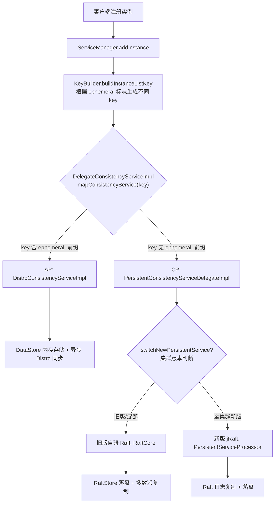
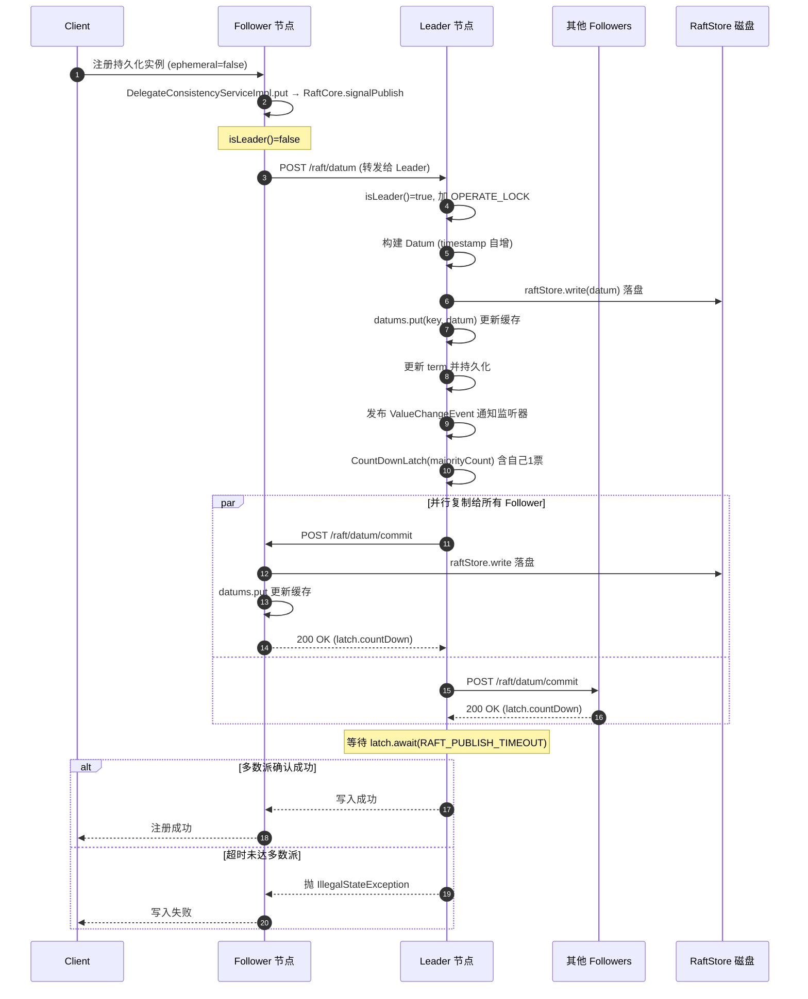
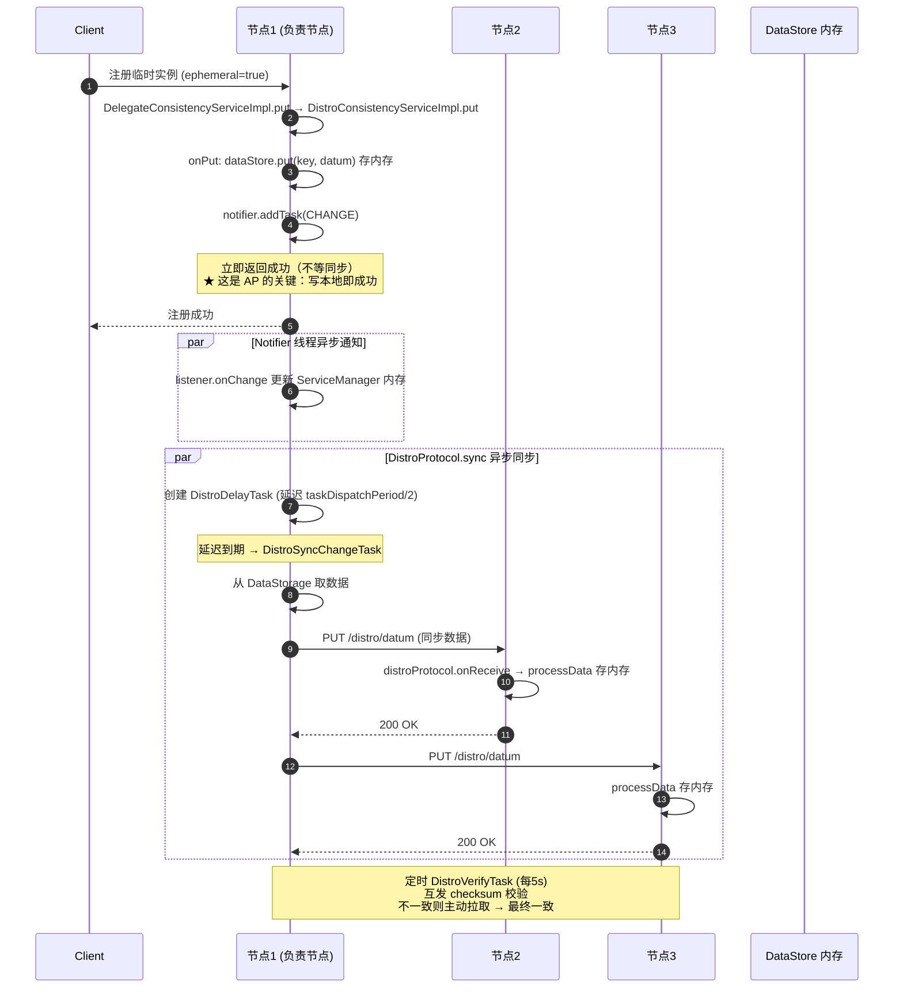
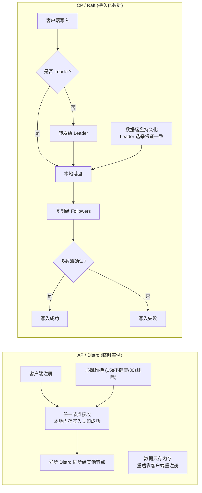
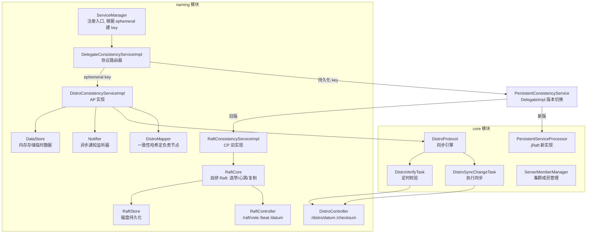

# Nacos AP 与 CP 一致性协议实现原理深度源码分析

> 基于 Nacos 1.4.8 源码（naming 模块 + core 模块）
>
> - **AP 协议 = Distro**：用于临时实例（ephemeral），客户端心跳维持，高可用优先，最终一致。
> - **CP 协议 = Raft**：用于持久化数据（持久化实例、服务元数据），强一致优先，Leader 写入。

---

## 一、CAP 理论与 Nacos 的取舍

CAP 定理指出分布式系统在 Consistency（一致性）、Availability（可用性）、Partition tolerance（分区容错性）三者中只能取其二。网络分区不可避免，所以实际是在 C 和 A 之间权衡：

| 协议 | 一致性 | 可用性 | 适用数据 | Nacos 场景 |
|------|--------|--------|---------|-----------|
| **Distro (AP)** | 最终一致 | 高可用（分区时各节点仍可读写） | 临时实例（ephemeral） | 服务发现，实例靠心跳存活 |
| **Raft (CP)** | 强一致 | 牺牲部分可用性（需多数派存活） | 持久化实例、服务元数据 | 配置/服务元数据，需持久化 |

Nacos 设计哲学：**同一集群同时支持两种协议**，根据数据类型自动路由。临时实例数据量大、变更频繁、可由心跳重建，用 AP；持久化数据需要可靠一致，用 CP。



---

## 二、统一入口：DelegateConsistencyServiceImpl（协议路由器）

所有命名空间的数据写入/读取都先经过这个委托类，它根据 **key 的前缀**路由到 AP 或 CP 实现。

```java
// DelegateConsistencyServiceImpl.java
@DependsOn("ProtocolManager")
@Service("consistencyDelegate")
public class DelegateConsistencyServiceImpl implements ConsistencyService {

    private final PersistentConsistencyServiceDelegateImpl persistentConsistencyService;  // CP
    private final EphemeralConsistencyService ephemeralConsistencyService;                // AP

    @Override
    public void put(String key, Record value) throws NacosException {
        mapConsistencyService(key).put(key, value);
    }

    @Override
    public void remove(String key) throws NacosException {
        mapConsistencyService(key).remove(key);
    }

    @Override
    public Datum get(String key) throws NacosException {
        return mapConsistencyService(key).get(key);
    }

    // ★ 路由核心：根据 key 是否含 ephemeral. 前缀选择协议
    private ConsistencyService mapConsistencyService(String key) {
        return KeyBuilder.matchEphemeralKey(key) ? ephemeralConsistencyService : persistentConsistencyService;
    }
}
```

### 2.1 KeyBuilder：通过 key 前缀区分协议

`Instance.ephemeral` 布尔字段决定实例是临时还是持久化，进而决定 key 格式：

```java
// KeyBuilder 关键前缀
// AP 临时实例 key：  com.alibaba.nacos.naming.iplist.ephemeral.{namespace}##{service}
// CP 持久化实例 key：com.alibaba.nacos.naming.iplist.{namespace}##{service}

public static boolean matchEphemeralInstanceListKey(String key) {
    return key.startsWith(INSTANCE_LIST_KEY_PREFIX + EPHEMERAL_KEY_PREFIX);
    // 即 iplist. 前缀后跟 ephemeral.
}

public static boolean matchEphemeralKey(String key) {
    return key.startsWith(EPHEMERAL_KEY_PREFIX) || matchEphemeralInstanceListKey(key);
}
```

`ServiceManager.addInstance` 中构建 key：

```java
// ServiceManager.java
String key = KeyBuilder.buildInstanceListKey(namespaceId, serviceName, ephemeral);
consistencyService.put(key, instances);   // consistencyService = DelegateConsistencyServiceImpl
```

> 所以一个实例走 AP 还是 CP，**完全由 `Instance.ephemeral` 字段决定**。注册时 `ephemeral=true`（默认）→ AP/Distro；`ephemeral=false` → CP/Raft。

---

## 三、CP 协议：Raft 实现

Nacos 1.4.8 的 CP 有两套实现，由 `PersistentConsistencyServiceDelegateImpl` 根据集群版本切换：

```java
// PersistentConsistencyServiceDelegateImpl.java
@Component("persistentConsistencyServiceDelegate")
public class PersistentConsistencyServiceDelegateImpl implements PersistentConsistencyService {

    private final RaftConsistencyServiceImpl oldPersistentConsistencyService;       // 旧版自研 Raft
    private final BasePersistentServiceProcessor newPersistentServiceService;       // 新版 jRaft
    private volatile boolean switchNewPersistentService = false;

    // ★ 根据集群版本（ClusterVersionJudgement）切换
    private PersistentConsistencyService switchOne() {
        return switchNewPersistentService ? newPersistentConsistencyService : oldPersistentConsistencyService;
    }

    @Override
    public void put(String key, Record value) throws NacosException {
        switchOne().put(key, value);
    }
}
```

- **旧版自研 Raft**（`RaftCore`）：Nacos 早期自己实现的简化 Raft，在 naming 模块。
- **新版 jRaft**（`PersistentServiceProcessor`）：基于 SOFA-JRaft 实现的标准 Raft，在 core 模块。
- 切换依据：`ClusterVersionJudgement` 判断集群内所有节点是否都升级到新版本。混部期间用旧版（保证兼容），全集群新版后切到 jRaft。

下面以**旧版自研 Raft** 为例深入分析（理解它就理解了 Raft 在 Nacos 的落地；jRaft 是标准实现，原理一致）。

### 3.1 RaftConsistencyServiceImpl：薄封装层

```java
// RaftConsistencyServiceImpl.java
@Override
public void put(String key, Record value) throws NacosException {
    raftCore.signalPublish(key, value);     // 全部委托给 RaftCore
}

@Override
public Datum get(String key) throws NacosException {
    return raftCore.getDatum(key);
}

@Override
public void remove(String key) throws NacosException {
    // 实例列表 key 或非 Leader 节点走 onDelete；否则 signalDelete
    ...
    raftCore.signalDelete(key);
}
```

### 3.2 RaftCore：Raft 核心引擎

#### 3.2.1 初始化：加载磁盘数据 + 启动选举/心跳定时任务

```java
// RaftCore.java
@PostConstruct
public void init() throws Exception {
    Loggers.RAFT.info("initializing Raft sub-system");

    // 1. 从磁盘加载已持久化的 datum（持久化数据）
    raftStore.loadDatums(notifier, datums);

    // 2. 加载当前任期 term
    setTerm(NumberUtils.toLong(raftStore.loadMeta().getProperty("term"), 0L));

    initialized = true;

    // 3. 启动两个核心定时任务（每 500ms 执行一次）
    masterTask = GlobalExecutor.registerMasterElection(new MasterElection());   // Leader 选举
    heartbeatTask = GlobalExecutor.registerHeartbeat(new HeartBeat());           // 心跳
    ...
}
```

定时参数（`GlobalExecutor`）：

| 常量 | 值 | 含义 |
|------|----|------|
| `TICK_PERIOD_MS` | 500ms | 选举/心跳任务调度周期 |
| `LEADER_TIMEOUT_MS` | 15000ms | Leader 超时基准（触发重新选举） |
| `RANDOM_MS` | 5000ms | 随机抖动（15s + 0~5s 随机，避免活锁） |
| `HEARTBEAT_INTERVAL_MS` | 5000ms | 心跳间隔 |

#### 3.2.2 RaftPeer：节点状态模型

```java
// RaftPeer.java
public class RaftPeer {
    public String ip;                              // 节点地址
    public String voteFor;                         // 本任期投给谁
    public AtomicLong term = new AtomicLong(0L);   // 当前任期
    public volatile long leaderDueMs;              // 距下次触发选举的剩余时间
    public volatile long heartbeatDueMs;           // 距下次心跳的剩余时间
    public volatile State state = State.FOLLOWER;  // LEADER / FOLLOWER / CANDIDATE

    public enum State { LEADER, FOLLOWER, CANDIDATE }

    public void resetLeaderDue() {
        // 15s + 随机 0~5s
        leaderDueMs = GlobalExecutor.LEADER_TIMEOUT_MS + RandomUtils.nextLong(0, GlobalExecutor.RANDOM_MS);
    }
    public void resetHeartbeatDue() {
        heartbeatDueMs = GlobalExecutor.HEARTBEAT_INTERVAL_MS;   // 5s
    }
}
```

#### 3.2.3 Leader 选举：MasterElection

每 500ms 执行一次，倒计时 `leaderDueMs`，归零则发起选举：

```java
// RaftCore.MasterElection
public class MasterElection implements Runnable {
    @Override
    public void run() {
        if (stopWork || !peers.isReady()) return;

        RaftPeer local = peers.local();
        local.leaderDueMs -= GlobalExecutor.TICK_PERIOD_MS;   // 每 tick 递减
        if (local.leaderDueMs > 0) return;                    // 还没超时，不选举

        local.resetLeaderDue();      // 重置选举超时
        local.resetHeartbeatDue();
        sendVote();                  // 发起投票
    }

    private void sendVote() {
        RaftPeer local = peers.get(NetUtils.localServer());
        peers.reset();

        local.term.incrementAndGet();                  // 任期 +1
        local.voteFor = local.ip;                      // 投自己
        local.state = RaftPeer.State.CANDIDATE;        // 成为候选人

        Map<String, String> params = new HashMap<>(1);
        params.put("vote", JacksonUtils.toJson(local));
        // 向所有其他节点发投票请求 POST /v1/ns/raft/vote
        for (final String server : peers.allServersWithoutMySelf()) {
            final String url = buildUrl(server, API_VOTE);
            HttpClient.asyncHttpPost(url, null, params, new Callback<String>() {
                @Override
                public void onReceive(RestResult<String> result) {
                    if (!result.ok()) return;
                    RaftPeer peer = JacksonUtils.toObj(result.getData(), RaftPeer.class);
                    peers.decideLeader(peer);    // 统计票数决定 Leader
                }
                ...
            });
        }
    }
}
```

**收到投票请求**（`receivedVote`）：比较任期，任期更大才认可：

```java
// RaftCore.java
public synchronized RaftPeer receivedVote(RaftPeer remote) {
    RaftPeer local = peers.get(NetUtils.localServer());
    if (remote.term.get() <= local.term.get()) {
        // 对方任期不比自己高 → 拒绝（投自己）
        if (StringUtils.isEmpty(local.voteFor)) {
            local.voteFor = local.ip;
        }
        return local;
    }
    // 对方任期更高 → 认可，自己变 FOLLOWER
    local.resetLeaderDue();
    local.state = RaftPeer.State.FOLLOWER;
    local.voteFor = remote.ip;
    local.term.set(remote.term.get());
    return local;
}
```

`peers.decideLeader(peer)` 统计票数：得票超过半数（`majorityCount = peers.size()/2 + 1`）的候选人成为 Leader。

> **随机抖动防活锁**：`resetLeaderDue` = 15s + 0~5s 随机，使各节点选举超时时间不同，避免多个节点同时发起选举导致一直没人拿到多数票。

#### 3.2.4 心跳：HeartBeat

只有 Leader 发送心跳，每 5s 一次：

```java
// RaftCore.HeartBeat
public class HeartBeat implements Runnable {
    @Override
    public void run() {
        if (stopWork || !peers.isReady()) return;
        RaftPeer local = peers.local();
        local.heartbeatDueMs -= GlobalExecutor.TICK_PERIOD_MS;
        if (local.heartbeatDueMs > 0) return;

        local.resetHeartbeatDue();
        sendBeat();
    }

    private void sendBeat() throws IOException, InterruptedException {
        RaftPeer local = peers.local();
        // 单机或非 Leader → 不发心跳
        if (EnvUtil.getStandaloneMode() || local.state != RaftPeer.State.LEADER) {
            return;
        }
        local.resetLeaderDue();

        // 构建心跳包：本节点 peer 信息 + 所有 datum 的 key+timestamp
        ObjectNode packet = JacksonUtils.createEmptyJsonNode();
        packet.replace("peer", JacksonUtils.transferToJsonNode(local));
        ArrayNode array = JacksonUtils.createEmptyArrayNode();
        if (!switchDomain.isSendBeatOnly()) {
            for (Datum datum : datums.values()) {
                ObjectNode element = JacksonUtils.createEmptyJsonNode();
                element.put("key", ...);
                element.put("timestamp", datum.timestamp.get());
                array.add(element);
            }
        }
        packet.replace("datums", array);

        // GZIP 压缩后广播给所有 Follower：POST /v1/ns/raft/beat
        byte[] compressedBytes = ...;   // GZIP 压缩
        for (final String server : peers.allServersWithoutMySelf()) {
            final String url = buildUrl(server, API_BEAT);
            HttpClient.asyncHttpPostLarge(url, null, compressedBytes, new Callback<String>() {
                @Override
                public void onReceive(RestResult<String> result) {
                    if (!result.ok()) return;
                    peers.update(JacksonUtils.toObj(result.getData(), RaftPeer.class));
                }
                ...
            });
        }
    }
}
```

**Follower 收到心跳**（`receivedBeat`）：
1. 校验心跳来自当前 Leader（或任期更高的 Leader）。
2. 重置自己的 `leaderDueMs`（证明 Leader 还活着，不发起新选举）。
3. 比对心跳中的 datum 列表与本地：本地缺失或 timestamp 更旧的 → 向 Leader 拉取最新数据（GET `/raft/datum`），保证最终一致。

> **心跳带 datum 元信息**：Nacos 的心跳不只是保活，还携带数据版本（key+timestamp），Follower 据此发现数据落后并主动拉取 —— 这是简化 Raft 的"附加日志"机制。

#### 3.2.5 写入流程：signalPublish（强一致核心）

```java
// RaftCore.java
public void signalPublish(String key, Record value) throws Exception {
    if (stopWork) throw new IllegalStateException("old raft protocol already stop work");

    // ① 非 Leader：转发给 Leader 处理（保证只能 Leader 写）
    if (!isLeader()) {
        ObjectNode params = JacksonUtils.createEmptyJsonNode();
        params.put("key", key);
        params.replace("value", JacksonUtils.transferToJsonNode(value));
        final RaftPeer leader = getLeader();
        raftProxy.proxyPostLarge(leader.ip, API_PUB, params.toString(), parameters);
        return;
    }

    // ② Leader 处理
    OPERATE_LOCK.lock();
    try {
        final Datum datum = new Datum();
        datum.key = key;
        datum.value = value;
        datum.timestamp.set(getDatum(key) == null ? 1L : getDatum(key).timestamp.incrementAndGet());

        ObjectNode json = JacksonUtils.createEmptyJsonNode();
        json.replace("datum", JacksonUtils.transferToJsonNode(datum));
        json.replace("source", JacksonUtils.transferToJsonNode(peers.local()));

        // ②-a 先在本地提交（落盘 + 更新缓存 + 通知监听器）
        onPublish(datum, peers.local());

        // ②-b 异步复制给所有 Follower，等多数派确认
        final CountDownLatch latch = new CountDownLatch(peers.majorityCount());
        for (final String server : peers.allServersIncludeMyself()) {
            if (isLeader(server)) {
                latch.countDown();        // 自己算一票
                continue;
            }
            final String url = buildUrl(server, API_ON_PUB);   // POST /v1/ns/raft/datum/commit
            HttpClient.asyncHttpPostLarge(url, Arrays.asList("key", key), content, new Callback<String>() {
                @Override
                public void onReceive(RestResult<String> result) {
                    if (!result.ok()) return;
                    latch.countDown();    // 收到 Follower 确认
                }
                ...
            });
        }

        // ②-c 等待多数派确认，超时则抛异常（写失败）
        if (!latch.await(UtilsAndCommons.RAFT_PUBLISH_TIMEOUT, TimeUnit.MILLISECONDS)) {
            throw new IllegalStateException("data publish failed, caused failed to notify majority, key=" + key);
        }
    } finally {
        OPERATE_LOCK.unlock();
    }
}
```

**`onPublish` 本地提交**：

```java
public void onPublish(Datum datum, RaftPeer source) throws Exception {
    // 校验来源是当前 Leader 且任期正确
    ...
    // 1. 落盘（持久化）
    raftStore.write(datum);
    // 2. 更新内存缓存
    datums.put(datum.key, datum);
    // 3. 更新任期并持久化
    if (source.term.get() > peers.getTerm()) {
        peers.setTerm(source.term.get());
        raftStore.updateTerm(source.term.get());
    }
    // 4. 发布变更事件，通知监听器（如 ServiceManager）
    NotifyCenter.publishEvent(new ValueChangeEvent(datum.key, DataOperation.CHANGE));
}
```

#### 3.2.6 RaftStore：磁盘持久化

```java
// RaftStore.java
// datum 存储为 JSON 文件：{DATA_BASE_DIR}/data/{key编码}.json
// key 中的 ':' 替换为 '#' 避免文件系统问题
public void write(Datum datum) throws IOException {
    // 序列化 datum 为 JSON，写入磁盘文件
    ...
}

// meta.properties 存储当前 term
public Properties loadMeta() { ... }
public void updateTerm(long term) { ... }
```

#### 3.2.7 Raft HTTP 端点（RaftController）

节点间通信全部走 HTTP：

| 端点 | 方法 | 作用 |
|------|------|------|
| `/v1/ns/raft/vote` | POST | 投票请求 → `raftCore.receivedVote()` |
| `/v1/ns/raft/beat` | POST | Leader 心跳 → `raftCore.receivedBeat()` |
| `/v1/ns/raft/datum` | POST | 转发写入请求到 Leader → `consistencyService.put()` |
| `/v1/ns/raft/datum/commit` | POST | Follower 提交复制数据 → `consistencyService.onPut()` |
| `/v1/ns/raft/datum` | DELETE | 删除数据 |
| `/v1/ns/raft/leader` | GET | 查询当前 Leader |

### 3.3 CP/Raft 写入完整时序图



### 3.4 CP 的核心特征

1. **Leader 写**：所有写请求必须经 Leader，Follower 收到后转发。
2. **多数派确认**：Leader 写入前要等多数 Follower 复制成功（`CountDownLatch + majorityCount`），保证强一致。
3. **持久化**：数据先落盘再响应（`raftStore.write`），重启不丢。
4. **牺牲可用性**：少数派节点分区时无法达成多数派 → 写入失败（不可用），但保证一致。

---

## 四、AP 协议：Distro 实现

Distro 是 Nacos 自研的 AP 协议，特点是：**每个节点平等，都能处理任何请求；但每个服务只有一个"负责节点"，负责节点异步同步数据给其他节点**。

### 4.1 DistroConsistencyServiceImpl：AP 写入

```java
// DistroConsistencyServiceImpl.java
@Override
public void put(String key, Record value) throws NacosException {
    onPut(key, value);    // ① 本地写入（内存）
    // ② 异步同步给集群其他节点
    distroProtocol.sync(new DistroKey(key, KeyBuilder.INSTANCE_LIST_KEY_PREFIX),
            DataOperation.CHANGE,
            globalConfig.getTaskDispatchPeriod() / 2);   // 延迟 = 任务分发周期/2
}

public void onPut(String key, Record value) {
    if (KeyBuilder.matchEphemeralInstanceListKey(key)) {
        Datum<Instances> datum = new Datum<>();
        datum.value = (Instances) value;
        datum.key = key;
        datum.timestamp.incrementAndGet();
        dataStore.put(key, datum);    // ★ 只存内存 DataStore，不落盘！
    }
    if (!listeners.containsKey(key)) return;
    notifier.addTask(key, DataOperation.CHANGE);   // 异步通知监听器
}
```

**关键区别**：临时实例数据**只存内存**（`DataStore` 内部就是 `Map`），不落盘。节点重启后临时数据丢失，靠客户端重新注册 + 心跳重建 —— 这正是 AP 的体现（牺牲持久一致换可用）。

### 4.2 Notifier：异步通知监听器

```java
// DistroConsistencyServiceImpl.Notifier
public class Notifier implements Runnable {
    private BlockingQueue<Pair<String, DataOperation>> tasks = new ArrayBlockingQueue<>(1024 * 1024);

    @Override
    public void run() {
        Loggers.DISTRO.info("distro notifier started");
        for (;;) {                          // 死循环消费
            try {
                Pair<String, DataOperation> pair = tasks.take();
                handle(pair);
            } catch (Throwable e) {
                Loggers.DISTRO.error("[NACOS-DISTRO] Error while handling notifying task", e);
            }
        }
    }

    public void addTask(String datumKey, DataOperation action) {
        if (services.containsKey(datumKey) && action == DataOperation.CHANGE) {
            return;     // 去重：已有待处理任务则跳过
        }
        if (action == DataOperation.CHANGE) {
            services.put(datumKey, StringUtils.EMPTY);
        }
        tasks.offer(Pair.with(datumKey, action));
    }

    private void handle(Pair<String, DataOperation> pair) {
        String datumKey = pair.getValue0();
        DataOperation action = pair.getValue1();
        services.remove(datumKey);

        ConcurrentLinkedQueue<RecordListener> recordListeners = listeners.get(datumKey);
        for (RecordListener listener : recordListeners) {
            if (action == DataOperation.CHANGE) {
                Datum datum = dataStore.get(datumKey);
                listener.onChange(datumKey, datum.value);   // 通知 ServiceManager 更新内存
            } else if (action == DataOperation.DELETE) {
                listener.onDelete(datumKey);
            }
        }
    }
}
```

`Notifier` 由独立线程驱动（`GlobalExecutor.submitDistroNotifyTask(notifier)`），把"写数据"和"通知监听器"解耦，避免阻塞写入。

### 4.3 DistroProtocol：数据同步引擎

新版 Distro 协议位于 core 模块（`com.alibaba.nacos.core.distributed.distro.DistroProtocol`）。

#### 4.3.1 初始化：启动验证任务

```java
// DistroProtocol.java (core 模块)
public DistroProtocol(ServerMemberManager memberManager, DistroComponentHolder distroComponentHolder,
        DistroTaskEngineHolder distroTaskEngineHolder, DistroConfig distroConfig) {
    ...
    startDistroTask();
}

private void startDistroTask() {
    if (EnvUtil.getStandaloneMode()) {     // 单机模式不需要同步
        isInitialized = true;
        return;
    }
    startVerifyTask();   // 定时校验任务
    startLoadTask();     // 启动时全量拉取任务
}

private void startVerifyTask() {
    // 周期性执行 DistroVerifyTask（默认每 5s）
    GlobalExecutor.schedulePartitionDataTimedSync(
        new DistroVerifyTask(memberManager, distroComponentHolder),
        distroConfig.getVerifyIntervalMillis());
}
```

#### 4.3.2 sync：异步同步给所有其他节点

```java
// DistroProtocol.java
public void sync(DistroKey distroKey, DataOperation action, long delay) {
    // 遍历除自己外的所有节点
    for (Member each : memberManager.allMembersWithoutSelf()) {
        DistroKey distroKeyWithTarget = new DistroKey(
            distroKey.getResourceKey(), distroKey.getResourceType(), each.getAddress());
        // 创建延迟任务，交由延迟任务引擎执行
        DistroDelayTask distroDelayTask = new DistroDelayTask(distroKeyWithTarget, action, delay);
        distroTaskEngineHolder.getDelayTaskExecuteEngine().addTask(distroKeyWithTarget, distroDelayTask);
    }
}
```

#### 4.3.3 DistroSyncChangeTask：真正执行同步

延迟任务到期后转化为 `DistroSyncChangeTask` 执行：

```java
// DistroSyncChangeTask.java
@Override
public void run() {
    try {
        String type = getDistroKey().getResourceType();
        // 1. 从本地 DataStorage 取出要同步的数据
        DistroData distroData = distroComponentHolder.findDataStorage(type).getDistroData(getDistroKey());
        distroData.setType(DataOperation.CHANGE);
        // 2. 通过 HTTP 发送给目标节点：PUT /v1/ns/distro/datum
        boolean result = distroComponentHolder.findTransportAgent(type)
            .syncData(distroData, getDistroKey().getTargetServer());
        if (!result) {
            handleFailedTask();   // 失败处理（重试）
        }
    } catch (Exception e) {
        handleFailedTask();
    }
}
```

#### 4.3.4 DistroVerifyTask：定时校验一致性

```java
// DistroVerifyTask.java
@Override
public void run() {
    List<Member> targetServer = serverMemberManager.allMembersWithoutSelf();
    for (String each : distroComponentHolder.getDataStorageTypes()) {
        verifyForDataStorage(each, targetServer);
    }
}

private void verifyForDataStorage(String type, List<Member> targetServer) {
    // 取校验数据（各 datum 的 checksum/MD5）
    DistroData distroData = distroComponentHolder.findDataStorage(type).getVerifyData();
    distroData.setType(DataOperation.VERIFY);
    for (Member member : targetServer) {
        // 发送 checksum 给对端：PUT /v1/ns/distro/checksum
        distroComponentHolder.findTransportAgent(type).syncVerifyData(distroData, member.getAddress());
    }
}
```

对端收到 checksum 后比对本地：发现不一致则主动拉取缺失数据（最终一致保证）。

### 4.4 DistroController：HTTP 端点

```java
// DistroController.java
// 接收同步数据
@PutMapping("/datum")
public ResponseEntity onSyncDatum(@RequestBody Map<String, Datum<Instances>> dataMap) {
    for (Map.Entry<String, Datum<Instances>> entry : dataMap.entrySet()) {
        if (KeyBuilder.matchEphemeralInstanceListKey(entry.getKey())) {
            ...
            DistroHttpData distroHttpData = new DistroHttpData(createDistroKey(entry.getKey()), entry.getValue());
            distroProtocol.onReceive(distroHttpData);   // 处理收到的数据
        }
    }
    return ResponseEntity.ok("ok");
}

// 接收校验请求
@PutMapping("/checksum")
public ResponseEntity syncChecksum(@RequestParam String source, @RequestBody Map<String, String> dataMap) {
    DistroHttpData distroHttpData = new DistroHttpData(createDistroKey(source), dataMap);
    distroProtocol.onVerify(distroHttpData);
    return ResponseEntity.ok("ok");
}

// 查询指定 key 数据
@GetMapping("/datum")
public ResponseEntity get(@RequestBody String body) { ... }

// 查询全量快照（启动时全量拉取用）
@GetMapping("/datums")
public ResponseEntity getAllDatums() {
    DistroData distroData = distroProtocol.onSnapshot(KeyBuilder.INSTANCE_LIST_KEY_PREFIX);
    return ResponseEntity.ok(distroData.getContent());
}
```

### 4.5 Distro 的"负责节点"机制：DistroMapper

Distro 不是每个节点同步全量数据，而是**每个服务由一个确定的"负责节点"管理**，负责节点处理该服务的写请求并同步给其他节点。负责节点通过一致性哈希确定：

```java
// DistroMapper.java
public boolean responsible(String serviceName) {
    final List<String> servers = healthyList;   // 健康节点列表

    if (!switchDomain.isDistroEnabled() || EnvUtil.getStandaloneMode()) {
        return true;     // 单机或关闭 distro → 自己负责
    }
    if (CollectionUtils.isEmpty(servers)) return false;

    String localAddress = EnvUtil.getLocalAddress();
    int index = servers.indexOf(localAddress);
    int lastIndex = servers.lastIndexOf(localAddress);
    if (lastIndex < 0 || index < 0) return true;

    // ★ 一致性哈希：serviceName 哈希取模，落在自己的区间则负责
    int target = distroHash(serviceName) % servers.size();
    return target >= index && target <= lastIndex;
}

private int distroHash(String serviceName) {
    return Math.abs(serviceName.hashCode() % Integer.MAX_VALUE);
}
```

工作流程：
1. 客户端向任意节点注册临时实例。
2. 节点判断 `DistroMapper.responsible(serviceName)`：
   - **是负责节点** → 本地写入 + 异步同步给其他节点。
   - **不是负责节点** → 仍接收，但由负责节点主导同步（客户端心跳时若发现负责节点变更，会被引导切换）。
3. 节点扩缩容时，`healthyList` 变化 → 负责节点重新分配 → 触发数据迁移。

### 4.6 临时实例心跳机制（AP 的可用性基础）

临时实例靠客户端心跳维持，不依赖服务端持久化：

```java
// ClientBeatProcessor.java —— 处理客户端心跳
@Override
public void run() {
    Service service = this.service;
    String ip = rsInfo.getIp();
    String clusterName = rsInfo.getCluster();
    int port = rsInfo.getPort();
    Cluster cluster = service.getClusterMap().get(clusterName);
    List<Instance> instances = cluster.allIPs(true);   // true=临时实例

    for (Instance instance : instances) {
        if (instance.getIp().equals(ip) && instance.getPort() == port) {
            instance.setLastBeat(System.currentTimeMillis());   // 更新最后心跳时间
            if (!instance.isMarked() && !instance.isHealthy()) {
                instance.setHealthy(true);    // 心跳恢复 → 重新标记健康
                getPushService().serviceChanged(service);
            }
        }
    }
}
```

心跳判定（`ClientBeatCheckTask`）：
- **15s** 未收到心跳 → 标记不健康（`healthy=false`）。
- **30s** 未收到心跳 → 从注册列表删除。

> 由于临时实例只存内存 + 心跳维持，节点重启后客户端重新注册即可恢复 —— 天然 AP，无需复杂持久化恢复逻辑。

### 4.7 AP/Distro 写入完整时序图



---

## 五、AP 与 CP 对比



| 维度 | AP / Distro | CP / Raft |
|------|-------------|-----------|
| 一致性 | 最终一致 | 强一致 |
| 可用性 | 高（分区仍可读写） | 牺牲部分（需多数派） |
| 数据存储 | 内存（不落盘） | 磁盘持久化 |
| 写入确认 | 本地写即成功，异步同步 | 多数派确认才成功 |
| 节点角色 | 平等，每个服务有负责节点 | Leader/Follower |
| 选举 | 无 Leader 选举 | 有 Leader 选举（15s+随机超时） |
| 数据同步 | 异步全量+增量+定时校验 | Leader 心跳 + 日志复制 |
| 适用数据 | 临时实例（ephemeral） | 持久化实例、服务元数据 |
| 数据量 | 大、变更频繁 | 相对小、需可靠 |

---

## 六、整体架构图



---

## 七、关键问题深入

### 7.1 为什么 Nacos 要同时支持 AP 和 CP？

- **服务发现场景**：实例频繁上下线，数据可由心跳重建，对一致性要求不高，但对可用性要求极高（注册中心挂了影响全链路）→ AP。
- **配置/元数据场景**：数据需要可靠持久化，不能丢失或不一致 → CP。
- 单一协议无法兼顾，所以 Nacos 按数据类型分流：临时实例 AP，持久化数据 CP。

### 7.2 临时实例和持久化实例的区别

| 特性 | 临时实例 (ephemeral=true) | 持久化实例 (ephemeral=false) |
|------|--------------------------|----------------------------|
| 一致性协议 | Distro (AP) | Raft (CP) |
| 存储 | 内存 | 磁盘 |
| 健康检查 | 客户端主动心跳 | 服务端主动探测 (TCP/HTTP) |
| 实例移除 | 心跳超时自动删除 | 不会自动删除，需手动下线 |
| 节点重启 | 实例丢失，客户端重注册 | 实例保留，从磁盘恢复 |
| 适用 | 微服务注册（默认） | 数据库、缓存等基础设施工注册 |

### 7.3 Raft 如何保证强一致？

1. **Leader 唯一写入点**：所有写都经 Leader，避免多写冲突。
2. **多数派确认**（`CountDownLatch + majorityCount`）：Leader 本地写后，需多数 Follower 复制成功才返回成功。
3. **任期 (term) 机制**：每次选举 term+1，旧 Leader 分区恢复后因 term 低无法继续写入。
4. **持久化优先**：`raftStore.write` 先落盘再响应，宕机不丢已提交数据。
5. **随机选举超时**：15s + 0~5s 随机，避免多个节点同时竞选导致活锁。

### 7.4 Distro 如何保证最终一致？

1. **写入即同步**：`put` 后立即触发 `distroProtocol.sync`（异步延迟同步）。
2. **定时校验**：`DistroVerifyTask` 每 5s 互发 checksum，发现差异主动拉取。
3. **全量拉取**：节点启动时 `startLoadTask` 全量拉取其他节点数据。
4. **去重合并**：基于 timestamp 的 Datum 版本，新数据覆盖旧数据。

### 7.5 集群版本切换（旧 Raft → jRaft）

1.4.8 引入 `ClusterVersionJudgement`：滚动升级时混部期间用旧 Raft（兼容），全集群升级完成后 `switchNewPersistentService = true` 切到 jRaft。同时旧 RaftCore 通过 `versionJudgement.registerObserver` 监听到全集群新版后调用 `shutdown()` 停止旧任务并清理旧元数据。这是为了平滑升级的标准做法。

---

## 八、源码位置索引

| 组件 | 路径 | 关键点 |
|------|------|--------|
| 协议路由 | `naming/.../consistency/DelegateConsistencyServiceImpl.java` | `mapConsistencyService` 按 key 路由 |
| Key 构建 | `naming/.../consistency/KeyBuilder.java` | `matchEphemeralKey` 区分 AP/CP |
| CP 版本切换 | `naming/.../consistency/persistent/PersistentConsistencyServiceDelegateImpl.java` | `switchOne` 旧/新 Raft |
| CP 旧实现入口 | `naming/.../consistency/persistent/raft/RaftConsistencyServiceImpl.java` | 委托 RaftCore |
| **CP 核心** | `naming/.../consistency/persistent/raft/RaftCore.java` | `init`/`signalPublish`/`MasterElection`/`HeartBeat`/`receivedVote`/`receivedBeat` |
| CP 节点状态 | `naming/.../consistency/persistent/raft/RaftPeer.java` | term/state/leaderDueMs |
| CP 集群管理 | `naming/.../consistency/persistent/raft/RaftPeerSet.java` | `decideLeader`/`majorityCount` |
| CP 持久化 | `naming/.../consistency/persistent/raft/RaftStore.java` | `write`/`loadDatums`/`updateTerm` |
| CP HTTP | `naming/.../controllers/RaftController.java` | /vote /beat /datum |
| CP 新实现 | `naming/.../consistency/persistent/impl/PersistentServiceProcessor.java` | jRaft |
| AP 入口 | `naming/.../consistency/ephemeral/distro/DistroConsistencyServiceImpl.java` | `put`/`onPut`/`Notifier` |
| AP 负责节点 | `naming/.../core/DistroMapper.java` | `responsible` 一致性哈希 |
| AP 同步引擎 | `core/.../distributed/distro/DistroProtocol.java` | `sync`/`startVerifyTask` |
| AP 校验任务 | `core/.../distributed/distro/task/verify/DistroVerifyTask.java` | 定时 checksum |
| AP 同步任务 | `core/.../distributed/distro/task/execute/DistroSyncChangeTask.java` | 执行 syncData |
| AP HTTP | `naming/.../controllers/DistroController.java` | /datum /checksum |
| 心跳处理 | `naming/.../healthcheck/ClientBeatProcessor.java` | 处理客户端心跳 |
| 心跳检查 | `naming/.../healthcheck/ClientBeatCheckTask.java` | 15s/30s 判定 |
| 注册入口 | `naming/.../core/ServiceManager.java` | `addInstance` 建 key + put |
