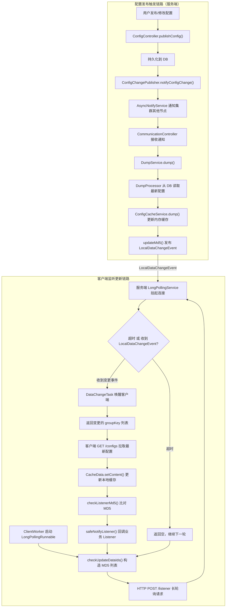
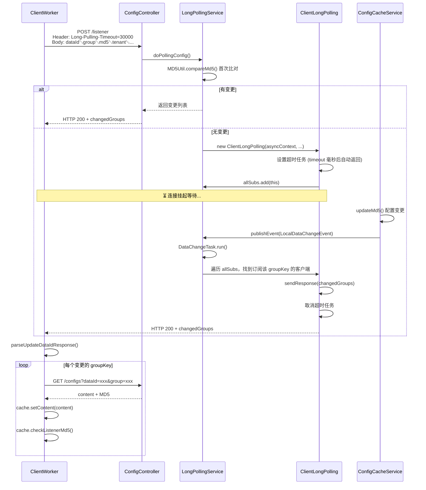
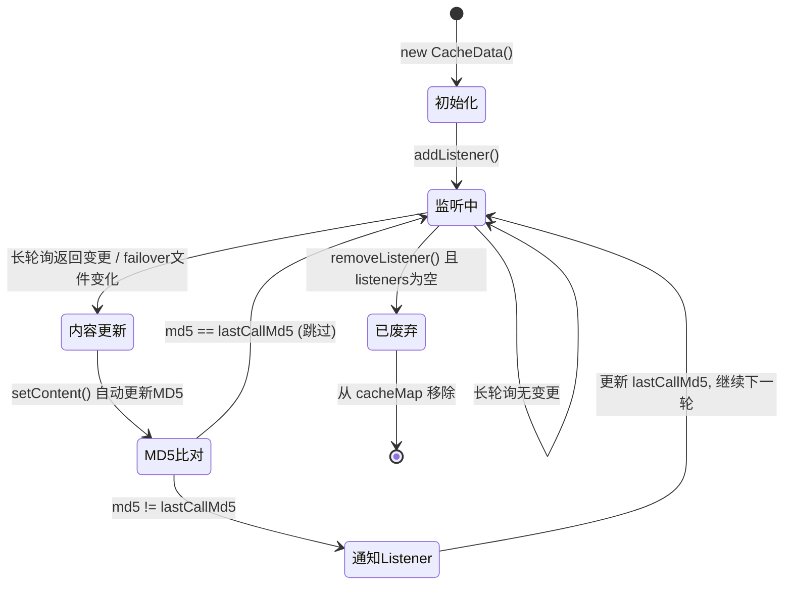

# Nacos 1.4.8 配置动态更新原理深度分析

## 一、整体架构概览

Nacos 配置中心的动态更新基于 **长轮询（Long Polling）** 机制实现，核心思想是：

- **客户端** 向服务端发起一个 HTTP 长连接，携带当前所有订阅配置的 MD5 值
- **服务端** 比较客户端 MD5 与本地缓存 MD5，若有变化立即返回；若无变化则挂起连接直到超时或有新变更
- **配置变更时**，服务端通过事件驱动机制唤醒挂起的客户端连接，推送变更的配置 key 列表
- **客户端** 收到变更列表后，主动拉取最新配置内容，并通过 MD5 比对通知业务 Listener

整体流程分为 **配置发布触发链路** 和 **客户端监听更新链路** 两条主线。



---

## 二、核心模块与关键类

### 2.1 客户端核心类

| 类名 | 路径 | 职责 |
|------|------|------|
| `NacosConfigService` | `client/.../config/NacosConfigService.java` | 客户端入口，实现 `ConfigService` 接口，封装 getConfig / addListener / publishConfig 等 API |
| `ClientWorker` | `client/.../config/impl/ClientWorker.java` | **长轮询引擎**，管理 CacheData 集合，调度 LongPollingRunnable 执行长轮询 |
| `CacheData` | `client/.../config/impl/CacheData.java` | 单个配置的本地缓存，持有 content、MD5、Listener 列表，负责 MD5 比对和回调通知 |
| `ServerHttpAgent` | `client/.../config/http/ServerHttpAgent.java` | HTTP 通信层，封装与服务端的 HTTP 请求 |
| `LocalConfigInfoProcessor` | `client/.../config/impl/LocalConfigInfoProcessor.java` | 本地快照（snapshot）和容灾文件（failover）管理 |

### 2.2 服务端核心类

| 类名 | 路径 | 职责 |
|------|------|------|
| `ConfigController` | `config/.../controller/ConfigController.java` | REST 控制器，处理配置 CRUD 和 listener 长轮询请求 |
| `ConfigServletInner` | `config/.../controller/ConfigServletInner.java` | 核心逻辑处理：`doPollingConfig()` 处理长轮询，`doGetConfig()` 处理配置读取 |
| `LongPollingService` | `config/.../service/LongPollingService.java` | **长轮询服务**，管理所有客户端长连接（`ClientLongPolling`），订阅 `LocalDataChangeEvent` 唤醒连接 |
| `ConfigCacheService` | `config/.../service/ConfigCacheService.java` | **配置内存缓存**，以 `ConcurrentHashMap` 存储 groupKey -> CacheItem 映射，维护 MD5、读写锁 |
| `ConfigChangePublisher` | `config/.../service/ConfigChangePublisher.java` | 发布 `ConfigDataChangeEvent` 事件 |
| `AsyncNotifyService` | `config/.../service/notify/AsyncNotifyService.java` | **集群通知服务**，订阅 `ConfigDataChangeEvent`，异步通知集群其他节点 |
| `DumpService` | `config/.../service/dump/DumpService.java` | **配置 Dump 服务**，将 DB 中的配置 dump 到磁盘文件和内存缓存 |
| `DumpProcessor` | `config/.../service/dump/processor/DumpProcessor.java` | 处理单个 DumpTask，从 DB 读取配置，更新缓存 |
| `CommunicationController` | `config/.../controller/CommunicationController.java` | 集群节点间通信接口，接收其他节点的 `/dataChange` 通知 |
| `MD5Util` | `config/.../utils/MD5Util.java` | MD5 比较工具，解析客户端上报的 MD5 映射，比对服务端缓存 MD5 |

---

## 三、配置发布触发链路（服务端）

当用户通过控制台或 API 发布/修改/删除配置时，触发以下链路：

### 3.1 第一步：ConfigController 接收发布请求

```java
// ConfigController.java - publishConfig()
@PostMapping
public Boolean publishConfig(...) throws NacosException {
    // 1. 参数校验
    // 2. 构造 ConfigInfo 对象
    ConfigInfo configInfo = new ConfigInfo(dataId, group, tenant, appName, content);
    
    // 3. 持久化到数据库
    persistService.insertOrUpdate(srcIp, srcUser, configInfo, time, configAdvanceInfo, true);
    
    // 4. 发布 ConfigDataChangeEvent 事件
    ConfigChangePublisher.notifyConfigChange(
        new ConfigDataChangeEvent(false, dataId, group, tenant, time.getTime()));
}
```

### 3.2 第二步：ConfigChangePublisher 发布事件

```java
// ConfigChangePublisher.java
public static void notifyConfigChange(ConfigDataChangeEvent event) {
    // 嵌入式存储集群模式下直接返回（由 Raft 协议保证一致性）
    if (PropertyUtil.isEmbeddedStorage() && !EnvUtil.getStandaloneMode()) {
        return;
    }
    // 通过 NotifyCenter 发布事件
    NotifyCenter.publishEvent(event);
}
```

### 3.3 第三步：AsyncNotifyService 处理集群通知

`AsyncNotifyService` 在构造时订阅了 `ConfigDataChangeEvent`：

```java
// AsyncNotifyService 构造函数中注册的订阅者
NotifyCenter.registerSubscriber(new Subscriber() {
    @Override
    public void onEvent(Event event) {
        if (event instanceof ConfigDataChangeEvent) {
            ConfigDataChangeEvent evt = (ConfigDataChangeEvent) event;
            // 获取集群所有成员
            Collection<Member> ipList = memberManager.allMembers();
            // 为每个成员创建通知任务
            Queue<NotifySingleTask> queue = new LinkedList<>();
            for (Member member : ipList) {
                queue.add(new NotifySingleTask(dataId, group, tenant, tag, dumpTs, 
                    member.getAddress(), evt.isBeta));
            }
            // 异步执行通知
            ConfigExecutor.executeAsyncNotify(new AsyncTask(nacosAsyncRestTemplate, queue));
        }
    }
});
```

`AsyncTask` 遍历队列，对每个集群节点发起 HTTP GET 请求到：

```
http://{targetIp}:{port}/v1/cs/communication/dataChange?dataId=xxx&group=xxx&tenant=xxx
```

请求头携带 `Last-Modified` 时间戳和操作节点 IP。

### 3.4 第四步：CommunicationController 接收通知

```java
// CommunicationController.java
@GetMapping("/dataChange")
public Boolean notifyConfigInfo(HttpServletRequest request, 
        @RequestParam("dataId") String dataId,
        @RequestParam("group") String group,
        @RequestParam("tenant") String tenant,
        @RequestParam("tag") String tag) {
    
    String lastModified = request.getHeader(NotifyService.NOTIFY_HEADER_LAST_MODIFIED);
    long lastModifiedTs = Long.parseLong(lastModified);
    String handleIp = request.getHeader(NotifyService.NOTIFY_HEADER_OP_HANDLE_IP);
    
    // 触发 DumpService 执行 dump 操作
    dumpService.dump(dataId, group, tenant, tag, lastModifiedTs, handleIp);
    return true;
}
```

### 3.5 第五步：DumpService 执行 Dump 任务

```java
// DumpService.java
public void dump(String dataId, String group, String tenant, String tag, 
        long lastModified, String handleIp, boolean isBeta) {
    String groupKey = GroupKey2.getKey(dataId, group, tenant);
    String taskKey = String.join("+", dataId, group, tenant, String.valueOf(isBeta), tag);
    // 将 DumpTask 加入 TaskManager 异步执行
    dumpTaskMgr.addTask(taskKey, new DumpTask(groupKey, tag, lastModified, handleIp, isBeta));
}
```

### 3.6 第六步：DumpProcessor 处理 DumpTask

```java
// DumpProcessor.java
public boolean process(NacosTask task) {
    DumpTask dumpTask = (DumpTask) task;
    // 从 DB 读取最新配置
    ConfigInfo cf = persistService.findConfigInfo(dataId, group, tenant);
    // 构造 ConfigDumpEvent
    ConfigDumpEvent build = ConfigDumpEvent.builder()
        .dataId(dataId).group(group).namespaceId(tenant)
        .content(cf.getContent()).lastModifiedTs(lastModified)
        .build();
    // 执行 dump
    return DumpConfigHandler.configDump(build);
}
```

### 3.7 第七步：DumpConfigHandler 更新缓存并发布 LocalDataChangeEvent

```java
// DumpConfigHandler.java
public static boolean configDump(ConfigDumpEvent event) {
    // 更新 ConfigCacheService 内存缓存 + 磁盘文件
    boolean result = ConfigCacheService.dump(dataId, group, namespaceId, content, lastModified, type);
    return result;
}
```

### 3.8 第八步：ConfigCacheService 更新 MD5 并发布 LocalDataChangeEvent

```java
// ConfigCacheService.java
public static boolean dump(String dataId, String group, String tenant, 
        String content, long lastModifiedTs, String type) {
    // 1. 计算新 MD5
    final String md5 = MD5Utils.md5Hex(content, Constants.ENCODE);
    // 2. 保存到磁盘
    DiskUtil.saveToDisk(dataId, group, tenant, content);
    // 3. 更新内存缓存 MD5（内部发布 LocalDataChangeEvent）
    updateMd5(groupKey, md5, lastModifiedTs);
    return true;
}

public static void updateMd5(String groupKey, String md5, long lastModifiedTs) {
    CacheItem cache = makeSure(groupKey);
    if (cache.md5 == null || !cache.md5.equals(md5)) {
        cache.md5 = md5;
        cache.lastModifiedTs = lastModifiedTs;
        // ★★★ 关键：发布 LocalDataChangeEvent，唤醒长轮询客户端 ★★★
        NotifyCenter.publishEvent(new LocalDataChangeEvent(groupKey));
    }
}
```

---

## 四、客户端监听更新链路

### 4.1 第一步：客户端注册 Listener

```java
// NacosConfigService.java
@Override
public void addListener(String dataId, String group, Listener listener) throws NacosException {
    worker.addTenantListeners(dataId, group, Arrays.asList(listener));
}
```

```java
// ClientWorker.java
public void addTenantListeners(String dataId, String group, List<? extends Listener> listeners) {
    String tenant = agent.getTenant();
    // 1. 获取或创建 CacheData
    CacheData cache = addCacheDataIfAbsent(dataId, group, tenant);
    // 2. 将 Listener 注册到 CacheData
    for (Listener listener : listeners) {
        cache.addListener(listener);
    }
}
```

### 4.2 第二步：CacheData 管理 Listener

```java
// CacheData.java
public void addListener(Listener listener) {
    // 包装 Listener，记录 lastCallMd5
    ManagerListenerWrap wrap = new ManagerListenerWrap(listener, md5);
    // 加入 CopyOnWriteArrayList
    listeners.addIfAbsent(wrap);
}
```

### 4.3 第三步：ClientWorker 启动长轮询调度

`ClientWorker` 构造函数中启动了两个线程池：

```java
// ClientWorker.java 构造函数
public ClientWorker(final HttpAgent agent, ...) {
    // 定时调度线程：每 10ms 执行一次 checkConfigInfo()
    this.executor.scheduleWithFixedDelay(new Runnable() {
        @Override
        public void run() {
            checkConfigInfo();
        }
    }, 1L, 10L, TimeUnit.MILLISECONDS);

    // 长轮询执行线程池：CPU 核数个线程
    this.executorService = Executors.newScheduledThreadPool(
        Runtime.getRuntime().availableProcessors(), ...);
}
```

### 4.4 第四步：checkConfigInfo() 分配长轮询任务

```java
// ClientWorker.java
public void checkConfigInfo() {
    int listenerSize = cacheMap.size();
    // 按 PerTaskConfigSize（默认 3000）计算需要的长轮询任务数
    int longingTaskCount = (int) Math.ceil(listenerSize / ParamUtil.getPerTaskConfigSize());
    // 如果任务数增加，创建新的 LongPollingRunnable
    if (longingTaskCount > currentLongingTaskCount) {
        for (int i = (int) currentLongingTaskCount; i < longingTaskCount; i++) {
            executorService.execute(new LongPollingRunnable(i));
        }
        currentLongingTaskCount = longingTaskCount;
    }
}
```

每个 `CacheData` 通过 `cacheMap.size() / PerTaskConfigSize` 计算所属的 `taskId`，同一个 taskId 的 CacheData 由同一个 `LongPollingRunnable` 处理。

### 4.5 第五步：LongPollingRunnable 执行长轮询

```java
// ClientWorker.LongPollingRunnable.run()
public void run() {
    List<CacheData> cacheDatas = new ArrayList<>();
    List<String> inInitializingCacheList = new ArrayList<>();
    
    // 1. 检查本地容灾文件
    for (CacheData cacheData : cacheMap.values()) {
        if (cacheData.getTaskId() == taskId) {
            cacheDatas.add(cacheData);
            checkLocalConfig(cacheData);  // 检查 failover 文件
            if (cacheData.isUseLocalConfigInfo()) {
                cacheData.checkListenerMd5();  // 本地配置变更直接通知
            }
        }
    }
    
    // 2. ★★★ 核心：向服务端发起长轮询，检查哪些配置发生了变化 ★★★
    List<String> changedGroupKeys = checkUpdateDataIds(cacheDatas, inInitializingCacheList);
    
    // 3. 对每个变更的 groupKey，拉取最新配置
    for (String groupKey : changedGroupKeys) {
        ConfigResponse response = getServerConfig(dataId, group, tenant, 3000L);
        CacheData cache = cacheMap.get(GroupKey.getKeyTenant(dataId, group, tenant));
        cache.setContent(response.getContent());  // 更新内容，自动更新 MD5
    }
    
    // 4. 检查 MD5 变化，通知 Listener
    for (CacheData cacheData : cacheDatas) {
        cacheData.checkListenerMd5();
        cacheData.setInitializing(false);
    }
    
    // 5. 递归调度，继续下一轮长轮询
    executorService.execute(this);
}
```

### 4.6 第六步：checkUpdateDataIds() 构造请求体

```java
// ClientWorker.checkUpdateDataIds()
List<String> checkUpdateDataIds(List<CacheData> cacheDatas, ...) {
    StringBuilder sb = new StringBuilder();
    for (CacheData cacheData : cacheDatas) {
        if (!cacheData.isUseLocalConfigInfo()) {
            // 格式: dataId{分隔符}group{分隔符}md5{分隔符}tenant{换行符}
            sb.append(cacheData.dataId).append(WORD_SEPARATOR);   // \u0002
            sb.append(cacheData.group).append(WORD_SEPARATOR);
            sb.append(cacheData.getMd5()).append(WORD_SEPARATOR);
            sb.append(cacheData.getTenant()).append(LINE_SEPARATOR); // \u0001
        }
    }
    return checkUpdateConfigStr(sb.toString(), isInitializingCacheList);
}
```

### 4.7 第七步：checkUpdateConfigStr() 发起 HTTP 长轮询

```java
// ClientWorker.checkUpdateConfigStr()
List<String> checkUpdateConfigStr(String probeUpdateString, boolean isInitializingCacheList) {
    Map<String, String> params = new HashMap<>(2);
    params.put("Listening-Configs", probeUpdateString);  // 请求参数
    
    Map<String, String> headers = new HashMap<>(2);
    headers.put("Long-Pulling-Timeout", "" + timeout);  // 长轮询超时时间（默认 30s）
    
    // 如果有新初始化的缓存，告诉服务端不要挂起
    if (isInitializingCacheList) {
        headers.put("Long-Pulling-Timeout-No-Hangup", "true");
    }
    
    // 发起 POST 请求到 /v1/cs/configs/listener
    long readTimeoutMs = timeout + (long) Math.round(timeout >> 1);  // 1.5 倍超时
    HttpRestResult<String> result = agent.httpPost(
        Constants.CONFIG_CONTROLLER_PATH + "/listener",  // /v1/cs/configs/listener
        headers, params, agent.getEncode(), readTimeoutMs);
    
    // 解析返回的变更 groupKey 列表
    return parseUpdateDataIdResponse(result.getData());
}
```

### 4.8 第八步：服务端 ConfigController.listener() 处理长轮询

```java
// ConfigController.java
@PostMapping("/listener")
public void listener(HttpServletRequest request, HttpServletResponse response) {
    request.setAttribute("org.apache.catalina.ASYNC_SUPPORTED", true);
    
    // 解析客户端上报的 MD5 映射
    String probeModify = request.getParameter("Listening-Configs");
    probeModify = URLDecoder.decode(probeModify, Constants.ENCODE);
    Map<String, String> clientMd5Map = MD5Util.getClientMd5Map(probeModify);
    
    // 进入长轮询处理
    inner.doPollingConfig(request, response, clientMd5Map, probeModify.length());
}
```

### 4.9 第九步：ConfigServletInner.doPollingConfig() 分流处理

```java
// ConfigServletInner.java
public String doPollingConfig(HttpServletRequest request, HttpServletResponse response,
        Map<String, String> clientMd5Map, int probeRequestSize) {
    
    // 如果支持长轮询（请求头包含 Long-Pulling-Timeout）
    if (LongPollingService.isSupportLongPolling(request)) {
        // ★★★ 进入长轮询模式 ★★★
        longPollingService.addLongPollingClient(request, response, clientMd5Map, probeRequestSize);
        return HttpServletResponse.SC_OK + "";
    }
    
    // 兼容短轮询模式：直接比较 MD5 并返回
    List<String> changedGroups = MD5Util.compareMd5(request, response, clientMd5Map);
    // ...
}
```

### 4.10 第十步：LongPollingService.addLongPollingClient() 管理长连接

```java
// LongPollingService.java
public void addLongPollingClient(HttpServletRequest req, HttpServletResponse rsp,
        Map<String, String> clientMd5Map, int probeRequestSize) {
    
    String str = req.getHeader(LONG_POLLING_HEADER);  // Long-Pulling-Timeout
    String noHangUpFlag = req.getHeader(LONG_POLLING_NO_HANG_UP_HEADER);
    
    long timeout = Math.max(10000, Long.parseLong(str) - 500);  // 提前 500ms 返回
    
    if (!isFixedPolling()) {
        // 非固定频率轮询：先比较一次 MD5
        List<String> changedGroups = MD5Util.compareMd5(req, rsp, clientMd5Map);
        if (changedGroups.size() > 0) {
            // 有变更，立即返回
            generateResponse(req, rsp, changedGroups);
            return;
        } else if (noHangUpFlag != null && noHangUpFlag.equalsIgnoreCase(TRUE_STR)) {
            // 客户端有新的初始化缓存，不挂起，直接返回空
            return;
        }
    }
    
    // ★★★ 没有变更，挂起连接 ★★★
    final AsyncContext asyncContext = req.startAsync();
    asyncContext.setTimeout(0L);  // 由自己控制超时
    
    // 创建 ClientLongPolling 并提交到线程池
    ConfigExecutor.executeLongPolling(
        new ClientLongPolling(asyncContext, clientMd5Map, ip, probeRequestSize, timeout, appName, tag));
}
```

### 4.11 第十一步：ClientLongPolling 挂起等待



```java
// LongPollingService.ClientLongPolling.run()
public void run() {
    // ★★★ 设置超时任务：timeout 毫秒后自动返回 ★★★
    asyncTimeoutFuture = ConfigExecutor.scheduleLongPolling(new Runnable() {
        @Override
        public void run() {
            // 超时处理
            allSubs.remove(ClientLongPolling.this);
            if (isFixedPolling()) {
                // 固定频率模式：超时后再比较一次 MD5
                List<String> changedGroups = MD5Util.compareMd5(...);
                if (changedGroups.size() > 0) {
                    sendResponse(changedGroups);
                } else {
                    sendResponse(null);  // 返回空，表示无变更
                }
            } else {
                sendResponse(null);  // 返回空
            }
        }
    }, timeoutTime, TimeUnit.MILLISECONDS);
    
    // ★★★ 将当前 ClientLongPolling 加入 allSubs 队列 ★★★
    allSubs.add(this);
}
```

### 4.12 第十二步：DataChangeTask 唤醒挂起连接

当配置变更触发 `LocalDataChangeEvent` 时，`LongPollingService` 中注册的订阅者被调用：

```java
// LongPollingService 构造函数中注册
NotifyCenter.registerSubscriber(new Subscriber() {
    @Override
    public void onEvent(Event event) {
        if (event instanceof LocalDataChangeEvent) {
            LocalDataChangeEvent evt = (LocalDataChangeEvent) event;
            // 执行 DataChangeTask
            ConfigExecutor.executeLongPolling(
                new DataChangeTask(evt.groupKey, evt.isBeta, evt.betaIps));
        }
    }
});
```

```java
// LongPollingService.DataChangeTask.run()
public void run() {
    // 遍历所有挂起的 ClientLongPolling
    for (Iterator<ClientLongPolling> iter = allSubs.iterator(); iter.hasNext(); ) {
        ClientLongPolling clientSub = iter.next();
        // 如果该客户端订阅了变更的 groupKey
        if (clientSub.clientMd5Map.containsKey(groupKey)) {
            // 从 allSubs 中移除
            iter.remove();
            // ★★★ 立即发送响应，唤醒客户端 ★★★
            clientSub.sendResponse(Arrays.asList(groupKey));
        }
    }
}
```

```java
// ClientLongPolling.sendResponse()
void sendResponse(List<String> changedGroups) {
    // 取消超时任务
    if (null != asyncTimeoutFuture) {
        asyncTimeoutFuture.cancel(false);
    }
    generateResponse(changedGroups);
}

void generateResponse(List<String> changedGroups) {
    HttpServletResponse response = (HttpServletResponse) asyncContext.getResponse();
    // 构造响应：dataId{分隔符}group{分隔符}tenant{换行符}
    final String respString = MD5Util.compareMd5ResultString(changedGroups);
    response.setHeader("Pragma", "no-cache");
    response.setStatus(HttpServletResponse.SC_OK);
    response.getWriter().println(respString);
    asyncContext.complete();  // 完成异步响应
}
```

### 4.13 第十三步：客户端解析响应并拉取最新配置

```java
// ClientWorker.parseUpdateDataIdResponse()
private List<String> parseUpdateDataIdResponse(String response) {
    List<String> updateList = new LinkedList<>();
    // 按 LINE_SEPARATOR(\u0001) 分割
    for (String dataIdAndGroup : response.split(LINE_SEPARATOR)) {
        // 按 WORD_SEPARATOR(\u0002) 分割
        String[] keyArr = dataIdAndGroup.split(WORD_SEPARATOR);
        String dataId = keyArr[0];
        String group = keyArr[1];
        if (keyArr.length == 2) {
            updateList.add(GroupKey.getKey(dataId, group));
        } else if (keyArr.length == 3) {
            String tenant = keyArr[2];
            updateList.add(GroupKey.getKeyTenant(dataId, group, tenant));
        }
    }
    return updateList;
}
```

收到变更的 groupKey 列表后，`LongPollingRunnable` 对每个变更 key 发起 GET 请求拉取最新配置：

```java
// ClientWorker.getServerConfig()
public ConfigResponse getServerConfig(String dataId, String group, String tenant, long readTimeout) {
    Map<String, String> params = new HashMap<>();
    params.put("dataId", dataId);
    params.put("group", group);
    params.put("tenant", tenant);
    // GET /v1/cs/configs?dataId=xxx&group=xxx&tenant=xxx
    result = agent.httpGet(Constants.CONFIG_CONTROLLER_PATH, null, params, agent.getEncode(), readTimeout);
    
    // 保存本地快照
    LocalConfigInfoProcessor.saveSnapshot(agent.getName(), dataId, group, tenant, result.getData());
    configResponse.setContent(result.getData());
    return configResponse;
}
```

### 4.14 第十四步：CacheData 通知业务 Listener



```java
// CacheData.checkListenerMd5()
void checkListenerMd5() {
    for (ManagerListenerWrap wrap : listeners) {
        // 比较当前 MD5 与上次回调时的 MD5
        if (!md5.equals(wrap.lastCallMd5)) {
            safeNotifyListener(dataId, group, content, type, md5, encryptedDataKey, wrap);
        }
    }
}
```

```java
// CacheData.safeNotifyListener()
private void safeNotifyListener(..., ManagerListenerWrap listenerWrap) {
    final Listener listener = listenerWrap.listener;
    Runnable job = () -> {
        // 1. 设置线程上下文 ClassLoader
        Thread.currentThread().setContextClassLoader(appClassLoader);
        
        // 2. 执行配置过滤器链
        ConfigResponse cr = new ConfigResponse();
        cr.setContent(content);
        configFilterChainManager.doFilter(null, cr);
        
        // 3. ★★★ 回调业务 Listener ★★★
        listener.receiveConfigInfo(contentTmp);
        
        // 4. 如果是 AbstractConfigChangeListener，解析变更内容
        if (listener instanceof AbstractConfigChangeListener) {
            Map data = ConfigChangeHandler.getInstance()
                .parseChangeData(listenerWrap.lastContent, content, type);
            ConfigChangeEvent event = new ConfigChangeEvent(data);
            ((AbstractConfigChangeListener) listener).receiveConfigChange(event);
            listenerWrap.lastContent = content;
        }
        
        // 5. 更新 lastCallMd5
        listenerWrap.lastCallMd5 = md5;
    };
    
    // 如果 Listener 指定了 Executor，用其执行；否则同步执行
    if (null != listener.getExecutor()) {
        listener.getExecutor().execute(job);
    } else {
        job.run();
    }
}
```

---

## 五、完整通信时序图

```
客户端(ClientWorker)                    服务端(ConfigController)               服务端(LongPollingService)         服务端(ConfigCacheService)
      │                                        │                                      │                                  │
      │  POST /v1/cs/configs/listener          │                                      │                                  │
      │  Header: Long-Pulling-Timeout=30000    │                                      │                                  │
      │  Body: Listening-Configs=dataId␂grp␂md5␂tenant␁... │                         │                                  │
      │───────────────────────────────────────>│                                      │                                  │
      │                                        │  doPollingConfig()                   │                                  │
      │                                        │─────────────────────────────────────>│                                  │
      │                                        │                                      │  addLongPollingClient()          │
      │                                        │                                      │  - compareMd5() 比较MD5          │
      │                                        │                                      │  - 无变更: startAsync() 挂起      │
      │                                        │                                      │  - 加入 allSubs 队列              │
      │                                        │                                      │  - 设置超时任务                   │
      │                                        │                                      │                                  │
      │  ⏳ 连接挂起等待...                      │                                      │  ⏳ 等待超时或数据变更...            │
      │                                        │                                      │                                  │
      │                                        │                                      │                                  │
      │  ═══════════ 配置变更触发 ═══════════    │                                      │                                  │
      │                                        │                                      │                                  │
      │                                        │                                      │  LocalDataChangeEvent             │
      │                                        │                                      │<─────────────────────────────────│
      │                                        │                                      │  (updateMd5 发布)                 │
      │                                        │                                      │                                  │
      │                                        │                                      │  DataChangeTask.run()             │
      │                                        │                                      │  - 遍历 allSubs                   │
      │                                        │                                      │  - 找到订阅该 groupKey 的客户端     │
      │                                        │                                      │  - sendResponse(changedGroups)    │
      │                                        │                                      │                                  │
      │  ◀── HTTP 200                          │                                      │                                  │
      │  Body: dataId␂group␂tenant␁...         │                                      │                                  │
      │                                        │                                      │                                  │
      │  parseUpdateDataIdResponse()           │                                      │                                  │
      │  解析变更的 groupKey 列表                │                                      │                                  │
      │                                        │                                      │                                  │
      │  GET /v1/cs/configs                    │                                      │                                  │
      │  ?dataId=xxx&group=xxx&tenant=xxx      │                                      │                                  │
      │───────────────────────────────────────>│                                      │                                  │
      │                                        │  doGetConfig()                       │                                  │
      │                                        │  - tryConfigReadLock()               │                                  │
      │                                        │  - 从磁盘/DB 读取配置内容              │                                  │
      │                                        │  - 返回 content + MD5                │                                  │
      │  ◀── HTTP 200 + content                │                                      │                                  │
      │                                        │                                      │                                  │
      │  cache.setContent(content)             │                                      │                                  │
      │  cache.checkListenerMd5()              │                                      │                                  │
      │  - MD5 不同 → safeNotifyListener()     │                                      │                                  │
      │  - listener.receiveConfigInfo()        │                                      │                                  │
      │                                        │                                      │                                  │
      │  继续下一轮长轮询...                     │                                      │                                  │
```

---

## 六、关键设计细节

### 6.1 MD5 比对机制

- 客户端维护每个 `CacheData` 的 MD5 值，服务端维护 `CacheItem` 的 MD5 值
- 长轮询时客户端将所有 `dataId+group+MD5` 上报给服务端
- 服务端逐个比对：`ConfigCacheService.isUptodate(groupKey, clientMd5, ip, tag)`
- 返回 MD5 不一致的 groupKey 列表
- 客户端拉取最新配置后，`CacheData.setContent()` 自动重新计算 MD5
- `checkListenerMd5()` 比对当前 MD5 与 `lastCallMd5`，决定是否回调 Listener

### 6.2 长轮询超时控制

- 默认超时时间 30 秒（可通过 `CONFIG_LONG_POLL_TIMEOUT` 配置）
- 服务端提前 500ms 返回，避免客户端超时
- 客户端 readTimeout 设置为 1.5 倍超时时间
- 超时后客户端立即发起下一轮长轮询，实现"伪实时"推送

### 6.3 任务分片机制

- 客户端按 `cacheMap.size() / PerTaskConfigSize`（默认 3000）计算需要的长轮询任务数
- 每个 `CacheData` 通过 `taskId` 分配到对应的 `LongPollingRunnable`
- 多个 `LongPollingRunnable` 并行执行，提高大规模配置订阅的吞吐量

### 6.4 本地容灾机制

- **Snapshot（快照）**：每次从服务端获取配置后，保存到本地文件
- **Failover（容灾）**：当服务端不可用时，使用本地容灾文件
- 客户端在长轮询前先检查 failover 文件是否存在，存在则优先使用本地配置
- 服务端不可用时，`getConfig()` 降级返回本地 snapshot

### 6.5 集群间数据同步

- 配置变更时，`AsyncNotifyService` 异步通知集群所有节点
- 通过 `/v1/cs/communication/dataChange` 接口传递变更信息
- 每个节点独立执行 Dump 操作，更新本地缓存和磁盘文件
- 支持重试机制：通知失败时延迟重试

### 6.6 读写锁保护

`ConfigCacheService` 使用自定义 `SimpleReadWriteLock` 保护每个 `CacheItem`：

- **读锁**：客户端获取配置时加读锁（`tryConfigReadLock`，最多重试 10 次）
- **写锁**：Dump 更新缓存时加写锁（`tryWriteLock`）
- 读写互斥，保证配置读取的一致性

### 6.7 通信协议格式

客户端与服务端使用不可见字符作为分隔符：

- `WORD_SEPARATOR` = `\u0002`（字段分隔符）
- `LINE_SEPARATOR` = `\u0001`（记录分隔符）

请求格式：
```
dataId␂group␂md5␂tenant␁dataId2␂group2␂md52␂tenant2␁...
```

响应格式：
```
dataId␂group␂tenant␁dataId2␂group2␁...
```

---

## 七、配置获取流程（getConfig）

除了长轮询监听，客户端首次获取配置也有完整的降级链路：

```
1. 优先读取本地 Failover 文件（容灾模式）
   ↓ 不存在
2. 向服务端发起 GET /v1/cs/configs 请求
   ↓ 失败
3. 读取本地 Snapshot 快照文件
```

服务端处理 `doGetConfig()` 时：
1. 加读锁获取 `CacheItem`
2. 判断是否为 Beta 发布（检查客户端 IP 是否在 betaIps 列表中）
3. 判断是否为 Tag 发布
4. 从磁盘文件或数据库读取配置内容
5. 返回 content + MD5 + Config-Type

---

## 八、总结

Nacos 配置动态更新的核心原理可以概括为：

1. **配置发布** → `ConfigDataChangeEvent` → 集群通知 → Dump 更新缓存 → `LocalDataChangeEvent`
2. **LocalDataChangeEvent** → `DataChangeTask` 唤醒挂起的长轮询连接 → 返回变更 key 列表
3. **客户端收到变更** → 拉取最新配置 → 更新 `CacheData` → MD5 比对 → 回调业务 `Listener`

整个链路通过 **事件驱动 + 长轮询** 实现了配置的准实时推送，同时通过 **本地快照 + 容灾文件** 保证了高可用性。这种设计避免了短轮询的资源浪费，也避免了真正长连接（WebSocket/TCP）的复杂性，是一种经典的折中方案。
