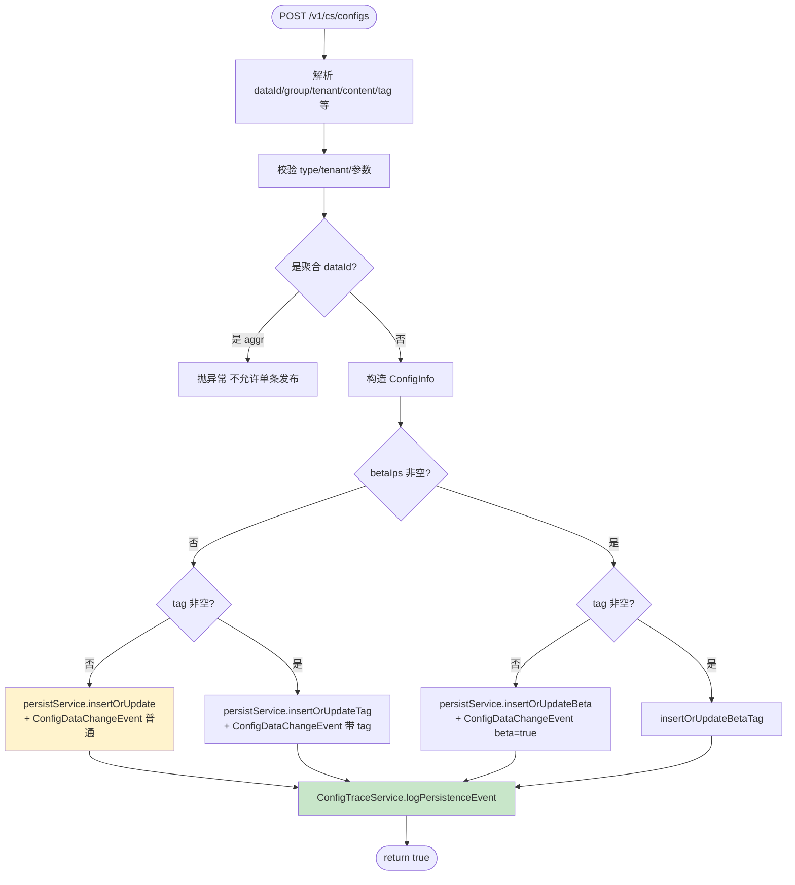
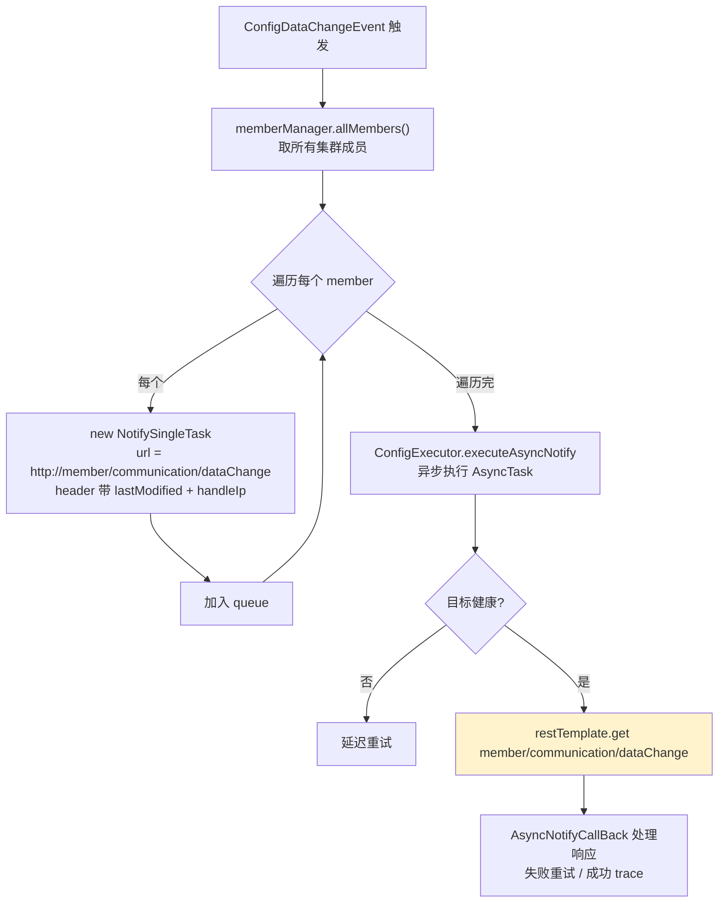
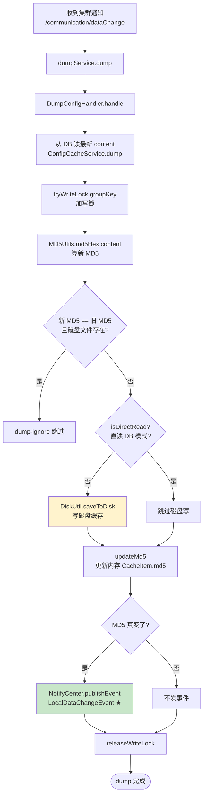
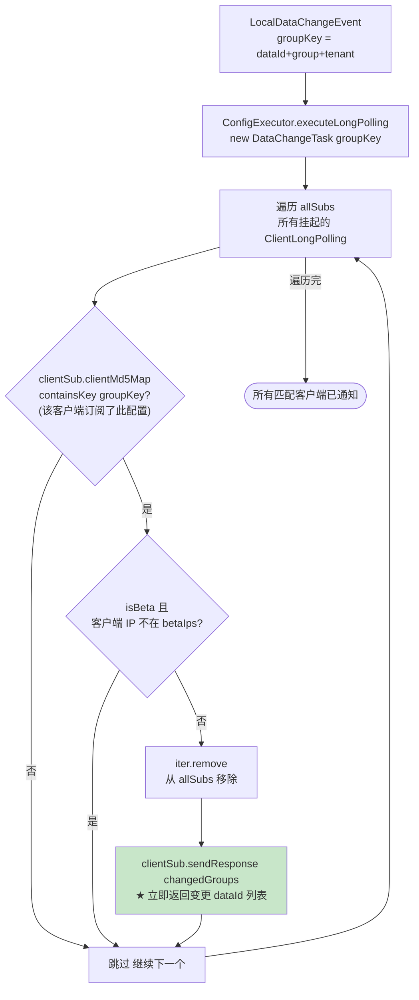
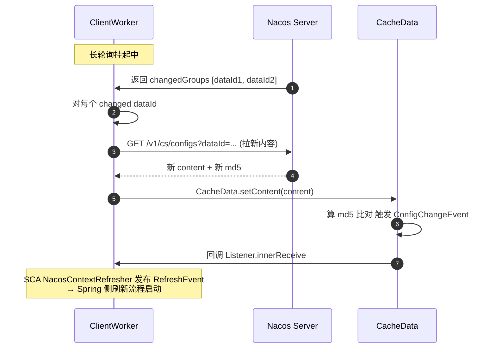
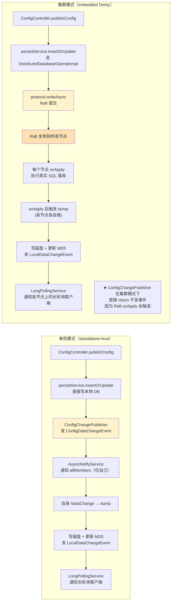
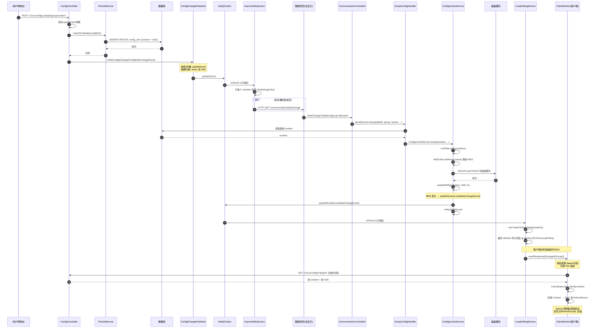
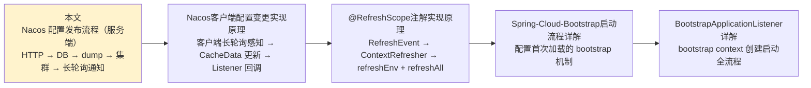

# Nacos 配置发布流程详解（服务端）

> 基于 Nacos 2.x 源码（本仓库）。本文是 `Nacos客户端配置变更实现原理.md` 的姊妹篇：那篇讲客户端如何感知变更，本文讲**服务端配置发布后的完整流程**——从 HTTP 请求到 DB 落盘、磁盘缓存、集群同步、长轮询客户端通知。

---

## 一、整体流程概览

用户在 Nacos 控制台（或 SDK）点"发布"后，服务端做五件事：**落 DB → 算 MD5 → 写磁盘缓存 → 通知集群各节点 dump → 长轮询客户端感知并拉新配置**。

```mermaid
flowchart LR
    A[用户发布配置] --> B["HTTP POST /v1/cs/configs<br/>ConfigController.publishConfig"]
    B --> C["persistService.insertOrUpdate<br/>写 DB + 算 MD5"]
    C --> D["ConfigChangePublisher.notifyConfigChange<br/>发布 ConfigDataChangeEvent"]
    D --> E["AsyncNotifyService 订阅者<br/>HTTP 通知所有集群节点"]
    E --> F["每个节点 CommunicationController<br/>/dataChange 触发 dump"]
    F --> G["ConfigCacheService.dump<br/>写磁盘 + 更新 MD5 缓存<br/>发布 LocalDataChangeEvent"]
    G --> H["LongPollingService 订阅者<br/>DataChangeTask 遍历 allSubs"]
    H --> I["长轮询客户端收到变更 dataId<br/>ClientWorker 拉 getServerConfig"]
    I --> J[CacheData.content 更新<br/>触发 Spring 侧 RefreshEvent]

    style C fill:#fff3cd
    style D fill:#ffe0b2
    style G fill:#c8e6c9
    style H fill:#c8e6c9
```



两类事件是关键纽带：
- **`ConfigDataChangeEvent`**：跨节点通知，触发各节点 dump。
- **`LocalDataChangeEvent`**：本节点 dump 完成后触发，通知长轮询客户端。

---

## 二、HTTP 入口：`ConfigController.publishConfig`

### 2.1 端点与签名

**文件**：`config/src/main/java/com/alibaba/nacos/config/server/controller/ConfigController.java:124-189`

```java
@PostMapping                                          // 路径 = Constants.CONFIG_CONTROLLER_PATH = "/v1/cs/configs"
@Secured(action = ActionTypes.WRITE, parser = ConfigResourceParser.class)
public Boolean publishConfig(HttpServletRequest request, HttpServletResponse response,
        @RequestParam("dataId") String dataId,
        @RequestParam("group") String group,
        @RequestParam(value = "tenant", required = false, defaultValue = StringUtils.EMPTY) String tenant,
        @RequestParam("content") String content,
        @RequestParam(value = "tag", required = false) String tag,
        @RequestParam(value = "appName", required = false) String appName,
        @RequestParam(value = "src_user", required = false) String srcUser,
        @RequestParam(value = "config_tags", required = false) String configTags,
        @RequestParam(value = "desc", required = false) String desc,
        @RequestParam(value = "use", required = false) String use,
        @RequestParam(value = "effect", required = false) String effect,
        @RequestParam(value = "type", required = false) String type,
        @RequestParam(value = "schema", required = false) String schema) throws NacosException {
```

POST 表单参数，核心是 `dataId/group/tenant/content`，其余是元数据（tag、beta、描述、类型等）。

### 2.2 处理逻辑

```java
final String srcIp = RequestUtil.getRemoteIp(request);
// ① 校验 type / tenant / 参数合法性
if (!ConfigType.isValidType(type)) { type = ConfigType.getDefaultType().getType(); }
ParamUtils.checkTenant(tenant);
ParamUtils.checkParam(dataId, group, "datumId", content);

// ② 聚合 dataId 不允许走单条发布
if (AggrWhitelist.isAggrDataId(dataId)) {
    throw new NacosException(NO_RIGHT, "dataId:" + dataId + " is aggr");
}

final Timestamp time = TimeUtils.getCurrentTime();
String betaIps = request.getHeader("betaIps");          // beta 发布的灰度 IP
ConfigInfo configInfo = new ConfigInfo(dataId, group, tenant, appName, content);
configInfo.setType(type);

// ③ 三种发布路径：普通 / Tag / Beta
if (StringUtils.isBlank(betaIps)) {
    if (StringUtils.isBlank(tag)) {
        // ★ 普通发布：insertOrUpdate + 发 ConfigDataChangeEvent
        persistService.insertOrUpdate(srcIp, srcUser, configInfo, time, configAdvanceInfo, true);
        ConfigChangePublisher.notifyConfigChange(
                new ConfigDataChangeEvent(false, dataId, group, tenant, time.getTime()));
    } else {
        // ★ Tag 发布
        persistService.insertOrUpdateTag(configInfo, tag, srcIp, srcUser, time, true);
        ConfigChangePublisher.notifyConfigChange(
                new ConfigDataChangeEvent(false, dataId, group, tenant, tag, time.getTime()));
    }
} else {
    // ★ Beta 灰度发布
    persistService.insertOrUpdateBeta(configInfo, betaIps, srcIp, srcUser, time, true);
    ConfigChangePublisher.notifyConfigChange(
            new ConfigDataChangeEvent(true, dataId, group, tenant, time.getTime()));
}

// ④ 记录 trace
ConfigTraceService.logPersistenceEvent(dataId, group, tenant, requestIpApp, time.getTime(),
        InetUtils.getSelfIP(), ConfigTraceService.PERSISTENCE_EVENT_PUB, content);
return true;
```

### 2.3 控制器处理流程图



---

## 三、持久化：`persistService.insertOrUpdate`

### 3.1 两条实现路径

`PersistService` 是接口，按部署模式有两套实现：

| 模式 | 实现类 | DB | 适用场景 |
|------|--------|----|---------|
| 外置存储 | `ExternalStoragePersistServiceImpl` | MySQL 等外部 DB | 生产集群 |
| 内嵌存储 | `EmbeddedStoragePersistServiceImpl` | Derby + Raft | 单机/嵌入式集群 |

### 3.2 MD5 计算与落库

外置存储下，`insertOrUpdate` 最终调 `addConfigInfoAtomic` / `updateConfigInfoAtomic`：

**文件**：`config/.../repository/external/ExternalStoragePersistServiceImpl.java`

```java
// addConfigInfoAtomic（简化）
configInfo.getMd5() = MD5Utils.md5Hex(configInfo.getContent(), Constants.ENCODE);  // ★ 算 MD5
// INSERT INTO config_info (data_id, group_id, tenant_id, content, md5, gmt_create, ...)
jdbcTemplate.update(INSERT_SQL, ps -> {
    ps.setString(1, configInfo.getDataId());
    ...
    ps.setString(5, configInfo.getContent());
    ps.setString(6, configInfo.getMd5());     // ★ MD5 入库
    ...
});
```

落库的关键点：
- **MD5 在服务端算**，不是客户端传的。客户端只传 content，服务端 `MD5Utils.md5Hex` 算 MD5 一起入库。
- 同时写 `config_info`（主表）+ `his_config_info`（历史表），保证可追溯。
- 外置存储是**同步** JDBC 写入，Raft 模式下走 `DistributedDatabaseOperateImpl` 异步复制。

### 3.3 内嵌 Derby + Raft（集群模式）

**文件**：`config/.../repository/embedded/DistributedDatabaseOperateImpl.java`

```java
// 写操作通过 Raft 协议提交
protocol.writeAsync(request);   // 或 protocol.write(request) 同步等
// Raft 提交后，所有节点的 onApply 执行真实 SQL
```

每个节点的 `onApply` 回放 SQL，保证集群一致性。这是内嵌存储模式下"集群同步"的底层——不是应用层通知，而是 Raft 强一致复制。

---

## 四、事件发布：`ConfigDataChangeEvent`

### 4.1 `ConfigChangePublisher`

**文件**：`config/.../service/ConfigChangePublisher.java:36-41`

```java
public static void notifyConfigChange(ConfigDataChangeEvent event) {
    if (PropertyUtil.isEmbeddedStorage() && !EnvUtil.getStandaloneMode()) {
        return;     // ★ 内嵌集群模式：不在 controller 直接发事件
    }
    NotifyCenter.publishEvent(event);
}
```

**关键分支**：
- **单机 / 外置存储**：controller 直接 `NotifyCenter.publishEvent` → 触发后续 dump 链。
- **内嵌存储集群**：return，**不在 controller 发事件**。因为写走 Raft，dump 会在 Raft `onApply` 后由各节点本地触发（见第七节末尾）。

### 4.2 `NotifyCenter` 事件总线

`NotifyCenter` 是 Nacos 自研的轻量事件总线：
- 发布者注册：`NotifyCenter.registerToPublisher(EventClass, bufferSize)`
- 订阅者注册：`NotifyCenter.registerSubscriber(subscriber)`
- 发布：`NotifyCenter.publishEvent(event)` → 异步派发给所有订阅者

`AsyncNotifyService` 在初始化时注册了 `ConfigDataChangeEvent` 的发布者和订阅者（见第五节）。

---

## 五、集群通知：`AsyncNotifyService`

### 5.1 订阅者逻辑

**文件**：`config/.../service/notify/AsyncNotifyService.java:58-97`

```java
@Service
public class AsyncNotifyService {
    @Autowired
    public AsyncNotifyService(ServerMemberManager memberManager) {
        this.memberManager = memberManager;
        // 注册 ConfigDataChangeEvent 的发布者
        NotifyCenter.registerToPublisher(ConfigDataChangeEvent.class, NotifyCenter.ringBufferSize);
        // 注册订阅者
        NotifyCenter.registerSubscriber(new Subscriber() {
            @Override
            public void onEvent(Event event) {
                if (event instanceof ConfigDataChangeEvent) {
                    ConfigDataChangeEvent evt = (ConfigDataChangeEvent) event;
                    Collection<Member> ipList = memberManager.allMembers();  // ★ 所有集群成员
                    Queue<NotifySingleTask> queue = new LinkedList<>();
                    for (Member member : ipList) {
                        queue.add(new NotifySingleTask(dataId, group, tenant, tag,
                                dumpTs, member.getAddress(), evt.isBeta));   // ★ 每个成员一个 task
                    }
                    ConfigExecutor.executeAsyncNotify(new AsyncTask(nacosAsyncRestTemplate, queue));
                }
            }
            @Override public Class<? extends Event> subscribeType() { return ConfigDataChangeEvent.class; }
        });
    }
}
```

### 5.2 异步通知执行

`AsyncTask.run()` 遍历 queue，对每个成员发 HTTP GET：

```java
private void executeAsyncInvoke() {
    while (!queue.isEmpty()) {
        NotifySingleTask task = queue.poll();
        String targetIp = task.getTargetIP();
        if (memberManager.hasMember(targetIp)) {
            boolean unHealthNeedDelay = memberManager.isUnHealth(targetIp);
            if (unHealthNeedDelay) {
                asyncTaskExecute(task);     // 不健康 → 延迟重试
            } else {
                // ★ 发 HTTP GET 到目标节点的 /communication/dataChange
                restTemplate.get(task.url, header, Query.EMPTY, String.class, new AsyncNotifyCallBack(task));
            }
        }
    }
}
```

### 5.3 集群通知流程图



关键点：
- **异步**：不阻塞 controller 返回，HTTP 通知在独立线程池跑。
- **每节点一个 task**：失败可单独重试。
- **健康检查**：不健康节点延迟重试，避免雪崩。
- **包含自身**：`allMembers()` 包含自己，所以自身也会收到 `/dataChange` 触发本地 dump（保证 dump 路径统一）。

---

## 六、节点本地 dump：`CommunicationController` → `ConfigCacheService.dump`

### 6.1 接收集群通知

**文件**：`config/.../controller/CommunicationController.java:61-78`

```java
@GetMapping("/dataChange")
public Boolean notifyConfigInfo(HttpServletRequest request,
        @RequestParam("dataId") String dataId,
        @RequestParam("group") String group,
        @RequestParam(value = "tenant", required = false, defaultValue = StringUtils.EMPTY) String tenant,
        @RequestParam(value = "tag", required = false) String tag) {
    String lastModified = request.getHeader(NotifyService.NOTIFY_HEADER_LAST_MODIFIED);
    long lastModifiedTs = StringUtils.isEmpty(lastModified) ? -1 : Long.parseLong(lastModified);
    String handleIp = request.getHeader(NotifyService.NOTIFY_HEADER_OP_HANDLE_IP);
    String isBetaStr = request.getHeader("isBeta");
    if (StringUtils.isNotBlank(isBetaStr) && trueStr.equals(isBetaStr)) {
        dumpService.dump(dataId, group, tenant, lastModifiedTs, handleIp, true);
    } else {
        dumpService.dump(dataId, group, tenant, tag, lastModifiedTs, handleIp);  // ★ 触发 dump
    }
    return true;
}
```

`DumpService.dump` 最终走到 `DumpConfigHandler` → `ConfigCacheService.dump`。

### 6.2 `ConfigCacheService.dump` 核心

**文件**：`config/.../service/ConfigCacheService.java:78-104`

```java
public static boolean dump(String dataId, String group, String tenant, String content,
        long lastModifiedTs, String type) {
    String groupKey = GroupKey2.getKey(dataId, group, tenant);
    CacheItem ci = makeSure(groupKey);                 // 确保 CacheItem 存在
    ci.setType(type);
    final int lockResult = tryWriteLock(groupKey);     // ★ 写锁
    if (lockResult < 0) { return false; }              // 加锁失败
    try {
        final String md5 = MD5Utils.md5Hex(content, Constants.ENCODE);    // ★ 算 MD5
        if (md5.equals(getContentMd5(groupKey))
                && DiskUtil.targetFile(dataId, group, tenant).exists()) {
            // MD5 没变 且 磁盘文件存在 → 跳过
            DUMP_LOG.warn("[dump-ignore] ...");
        } else if (!PropertyUtil.isDirectRead()) {
            DiskUtil.saveToDisk(dataId, group, tenant, content);          // ★ 写磁盘
        }
        updateMd5(groupKey, md5, lastModifiedTs);      // ★ 更新内存 MD5 → 发 LocalDataChangeEvent
        return true;
    } catch (IOException ioe) { ... }
    finally { releaseWriteLock(groupKey); }
}
```

### 6.3 磁盘缓存路径

**文件**：`config/.../utils/DiskUtil.java`

| 类型 | 路径 |
|------|------|
| 普通配置 | `${NACOS_HOME}/data/config-data/{tenant}/{group}/{dataId}` |
| Beta 配置 | `${NACOS_HOME}/data/beta-data/{tenant}/{group}/{dataId}` |
| Tag 配置 | `${NACOS_HOME}/data/tag-data/{tenant}/{group}/{dataId}/{tag}` |

磁盘缓存的作用：服务端重启后能快速恢复 CacheItem，不必全量从 DB 读。`isDirectRead()` 为 true 时（某些部署模式）直接读 DB 不写磁盘。

### 6.4 `updateMd5` → 发布 `LocalDataChangeEvent`

**文件**：`config/.../service/ConfigCacheService.java:465-472`

```java
public static void updateMd5(String groupKey, String md5, long lastModifiedTs) {
    CacheItem cache = makeSure(groupKey);
    if (cache.md5 == null || !cache.md5.equals(md5)) {     // ★ MD5 真变了才发事件
        cache.md5 = md5;
        cache.lastModifiedTs = lastModifiedTs;
        NotifyCenter.publishEvent(new LocalDataChangeEvent(groupKey));   // ★ 通知长轮询
    }
}
```

**这是连接"配置变更"和"客户端通知"的桥梁**：dump 完更新 MD5，MD5 变化触发 `LocalDataChangeEvent`，下一节的长轮询订阅者捕获它去通知客户端。

### 6.5 dump 流程图



---

## 七、长轮询客户端通知：`LongPollingService`

### 7.1 订阅 `LocalDataChangeEvent`

**文件**：`config/.../service/LongPollingService.java:288-315`

```java
allSubs = new ConcurrentLinkedQueue<ClientLongPolling>();    // ★ 所有挂起的长轮询连接

// 注册 LocalDataChangeEvent 发布者
NotifyCenter.registerToPublisher(LocalDataChangeEvent.class, NotifyCenter.ringBufferSize);

// 注册订阅者
NotifyCenter.registerSubscriber(new Subscriber() {
    @Override
    public void onEvent(Event event) {
        if (event instanceof LocalDataChangeEvent) {
            LocalDataChangeEvent evt = (LocalDataChangeEvent) event;
            ConfigExecutor.executeLongPolling(
                    new DataChangeTask(evt.groupKey, evt.isBeta, evt.betaIps));   // ★ 启动 DataChangeTask
        }
    }
    @Override public Class<? extends Event> subscribeType() { return LocalDataChangeEvent.class; }
});
```

### 7.2 `ClientLongPolling`：挂起的长轮询连接

客户端发 `POST /v1/cs/listener`（带自己订阅的 dataId→MD5 映射），服务端把它包装成 `ClientLongPolling` 放进 `allSubs` 队列，**挂起 30s**（默认长轮询超时）：

```java
class ClientLongPolling implements Runnable {
    public void run() {
        asyncTimeoutFuture = scheduler.schedule(() -> {
            // 超时没收到变更 → 返回空 changedGroups，客户端重新发起长轮询
            allSubs.remove(ClientLongPolling.this);
            sendResponse(null);
        }, 30L, TimeUnit.SECONDS);
        allSubs.add(this);     // ★ 加入挂起队列
    }
    void sendResponse(List<String> changedGroups) { /* 返回响应给客户端 */ }
}
```

### 7.3 `DataChangeTask`：变更通知

**文件**：`config/.../service/LongPollingService.java:327-390`

```java
class DataChangeTask implements Runnable {
    @Override
    public void run() {
        for (Iterator<ClientLongPolling> iter = allSubs.iterator(); iter.hasNext(); ) {
            ClientLongPolling clientSub = iter.next();
            if (clientSub.clientMd5Map.containsKey(groupKey)) {    // ★ 该客户端订阅了这个配置
                // beta 灰度判断
                if (isBeta && !betaIps.contains(clientSub.ip)) { continue; }
                iter.remove();                                       // 从挂起队列移除
                clientSub.sendResponse(changedGroups);               // ★ 立即返回变更 dataId 列表
            }
        }
    }
}
```

`DataChangeTask` 遍历所有挂起的 `ClientLongPolling`，找到订阅了该 groupKey 的客户端，立即把响应返回（打破 30s 挂起），客户端收到变更 dataId 列表后去拉新内容。

### 7.4 长轮询通知流程图



---

## 八、客户端拉取新配置（衔接客户端文档）

服务端通知到这一步结束。客户端收到变更 dataId 后：



> 客户端侧的详细流程见 `Nacos客户端配置变更实现原理.md`。本文到 `CacheData.setContent` 即服务端职责的终点。

---

## 九、单机 vs 集群模式差异

### 9.1 流程对比



### 9.2 关键差异点

| 维度 | 单机 / 外置存储 | 内嵌存储集群 |
|------|---------------|-------------|
| DB 写 | 直接 JDBC | Raft 协议复制 |
| `ConfigDataChangeEvent` | controller 直接发 | **不发**（return），由 Raft onApply 触发 |
| 集群 dump 触发 | `AsyncNotifyService` HTTP 通知 | Raft onApply 后本地触发 |
| 一致性 | 最终一致（异步通知） | 强一致（Raft） |
| 性能 | 高（无 Raft 开销） | 略低（Raft 复制开销） |

---

## 十、完整端到端时序图

以单机模式为例（最常见），展示从用户发布到客户端收到通知的完整链路：



---

## 十一、关键设计点总结

### 11.1 双事件模型

| 事件 | 触发点 | 订阅者 | 作用域 |
|------|--------|--------|--------|
| `ConfigDataChangeEvent` | controller 发布后 | `AsyncNotifyService` | **跨节点**：触发集群各成员 dump |
| `LocalDataChangeEvent` | dump 完成、MD5 更新后 | `LongPollingService` | **本节点**：通知挂起的长轮询客户端 |

两层事件解耦了"集群同步"和"客户端通知"：集群各节点 dump 各自独立，每个节点 dump 完只通知挂在自己节点上的客户端。

### 11.2 MD5 是变更检测的核心

- 服务端：发布时算 MD5 入库，dump 时再算一次比对（`dump-ignore` 优化）。
- 客户端长轮询：带自己的 MD5，服务端比对，只通知 MD5 不一致的客户端。
- `updateMd5` 里 `md5.equals(old)` 判断，避免无变更时误发事件。

### 11.3 写磁盘的意义

- 启动时从磁盘恢复 CacheItem，不必全量读 DB。
- `isDirectRead=true` 模式下跳过磁盘（直读 DB）。
- 磁盘 + 内存 CacheItem 双层：内存服务长轮询比对，磁盘服务持久化恢复。

### 11.4 异步与解耦

- **controller 异步**：`ConfigExecutor.executeAsyncNotify` 集群通知在独立线程池，不阻塞 controller 返回。
- **dump 异步**：`AsyncNotifyCallBack` 失败重试不阻塞主流程。
- **长轮询通知异步**：`ConfigExecutor.executeLongPolling(new DataChangeTask)` 独立线程池。
- **事件总线异步**：`NotifyCenter` 异步派发，发布者不等待订阅者。

### 11.5 负载均衡的隐含设计

长轮询客户端随机连一个 Nacos 节点，挂在该节点的 `allSubs` 上。配置发布后：
- 集群所有节点都 dump（通过 `AsyncNotifyService` 通知）。
- 每个节点只通知挂在自己 `allSubs` 上的客户端。
- 这样**客户端通知的负载在集群间天然均衡**——无需集中调度，各节点各管自己的客户端。

---

## 十二、源码位置索引

| 关注点 | 文件 | 关键方法 / 行 |
|--------|------|--------------|
| HTTP 入口 | `config/.../controller/ConfigController.java` | `publishConfig` :124-189 |
| 持久化接口 | `config/.../service/repository/PersistService.java` | `insertOrUpdate` |
| 外置存储实现 | `config/.../repository/external/ExternalStoragePersistServiceImpl.java` | `addConfigInfoAtomic` / `updateConfigInfoAtomic` |
| 内嵌 Raft 实现 | `config/.../repository/embedded/DistributedDatabaseOperateImpl.java` | `protocol.writeAsync` / `onApply` |
| 事件发布 | `config/.../service/ConfigChangePublisher.java` | `notifyConfigChange` :36-41 |
| 集群通知 | `config/.../service/notify/AsyncNotifyService.java` | 订阅者 :68-96 / `AsyncTask` :105-148 |
| 集群通知接收 | `config/.../controller/CommunicationController.java` | `notifyConfigInfo` :61-78 |
| Dump 处理 | `config/.../service/dump/DumpConfigHandler.java` | `handle` :85 |
| 磁盘 + MD5 缓存 | `config/.../service/ConfigCacheService.java` | `dump` :78-104 / `updateMd5` :465-472 |
| 磁盘工具 | `config/.../utils/DiskUtil.java` | `saveToDisk` |
| 长轮询服务 | `config/.../service/LongPollingService.java` | 订阅 :296-314 / `DataChangeTask` :327-390 / `ClientLongPolling` |
| 事件总线 | `common/.../notify/NotifyCenter.java` | `publishEvent` / `registerSubscriber` |

---

## 十三、串联回前序文档



**完整知识链**：
- **本文**：服务端从发布到通知客户端（`CacheData.setContent` 之前）。
- `Nacos客户端配置变更实现原理.md`：客户端从收到通知到 `CacheData.setContent` + Listener 回调。
- `@RefreshScope注解实现原理.md`：SCA 监听器回调 → 发 `RefreshEvent` → Spring 刷新 Environment + 销毁 Bean。
- `Spring-Cloud-Bootstrap启动流程详解.md` + `BootstrapApplicationListener详解.md`：首次启动时配置如何进入 Environment。

> **一句话总结**：Nacos 配置发布后，服务端走 `HTTP → 落 DB（带 MD5）→ 发 ConfigDataChangeEvent → AsyncNotifyService 通知集群各节点 → 各节点 dump（写磁盘 + 更新内存 MD5）→ 发 LocalDataChangeEvent → LongPollingService 的 DataChangeTask 遍历 allSubs 立即响应订阅了该配置的长轮询客户端 → 客户端拉新内容更新 CacheData → 触发 Spring 侧刷新。双事件（ConfigDataChangeEvent 跨节点 / LocalDataChangeEvent 本节点）+ MD5 比对 + 异步通知是设计的三个关键点。