# Nacos 1.4.8 集群启动源码深度解析

> 基于 `nacos-cluster-1.4.8` 源码（Spring Boot 2.7.x）。本文自 JVM 启动脚本开始，沿 Spring Boot 生命周期逐层下钻，覆盖引导初始化、集群成员管理、一致性协议层（CP/Raft + AP/Distro）、Naming 模块数据加载与恢复、Config 模块 dump，直至服务对外可用，并包含关闭流程。所有结论均标注源码文件与行号，便于对照阅读。

---

## 目录

- [一、整体架构与启动总览](#一整体架构与启动总览)
- [二、启动前置：脚本、配置与扩展点注册](#二启动前置脚本配置与扩展点注册)
- [三、Spring Boot 引导阶段](#三spring-boot-引导阶段)
- [四、集群成员管理启动（ServerMemberManager）](#四集群成员管理启动servermembermanager)
- [五、一致性协议层启动（ProtocolManager / Raft / Distro）](#五一致性协议层启动protocolmanager--raft--distro)
- [六、Naming 模块启动与数据恢复](#六naming-模块启动与数据恢复)
- [七、Config 模块启动（补充）](#七config-模块启动补充)
- [八、关键 Bean 初始化顺序总览](#八关键-bean-初始化顺序总览)
- [九、关闭流程](#九关闭流程)
- [十、关键配置项与文件索引](#十关键配置项与文件索引)

---

## 一、整体架构与启动总览

### 1.1 模块划分

Nacos 服务端由多个 Maven 模块组成，启动相关核心模块：

| 模块 | 职责 |
|------|------|
| `console` | 启动入口 `Nacos.java` 所在模块，聚合各模块打成可执行 jar |
| `sys` | 系统环境工具：`EnvUtil`、`ApplicationUtils`、`InetUtils`、`WatchFileCenter` |
| `core` | 集群核心：`ServerMemberManager`、`ProtocolManager`、Raft/Distro 协议实现、`GlobalExecutor` |
| `consistency` | 一致性协议抽象接口：`ConsistencyProtocol`、`CPProtocol`、`APProtocol`、`RequestProcessor` |
| `naming` | 服务发现：服务/实例管理、新老 Raft 一致性服务、Distro 集成、健康检查、推送 |
| `config` | 配置中心：配置 dump、嵌入式分布式存储（Derby + Raft）|
| `auth` | 鉴权 |

### 1.2 关键架构事实（先建立认知）

在深入源码前，有几个易混淆的架构事实需要明确：

1. **`ProtocolManager` 没有 `@PostConstruct`**。CP 协议（JRaft）采用**懒加载**，只有首次调用 `getCpProtocol()` 时才初始化。
2. **1.4.8 中只有 CP 协议（JRaft）通过 `ProtocolManager` 管理**。AP 协议（`DistroProtocol`）是普通 Spring `@Component`，被 `DistroConsistencyServiceImpl` 直接注入，**并未实现 `APProtocol` 接口**（全仓库无任何 `APProtocol` 实现类，`getApProtocol()` 是死代码）。
3. **CP/AP 路由不在 `ProtocolManager`，而在 naming 的 `DelegateConsistencyServiceImpl.mapConsistencyService(key)`**，依据是 **key 前缀**（`com.alibaba.nacos.naming.iplist.ephemeral.` 走 Distro/AP，其余走 Raft/CP）。
4. **CP 协议以 `RequestProcessor.group()` 作为 RaftGroup key**：naming 新 Raft 用 `naming_persistent_service`，config 用 `nacos_config`，各 group 拥有独立状态机和日志目录。
5. **Naming 同时存在新老两套 Raft**：
   - 老 Raft（`naming.consistency.persistent.raft.*`，`@Deprecated`）：自研简化版 Raft。
   - 新 Raft / jRaft（`naming.consistency.persistent.impl.*`）：基于 SOFA-JRaft，由 `ClusterVersionJudgement` 判定全集群 ≥ 1.4.0 后切换。
6. **raft 端口 = 主端口 - 1000**（如 8848 → 7848），由 `MemberUtil.calculateRaftPort()` 计算。

### 1.3 启动总览流程图

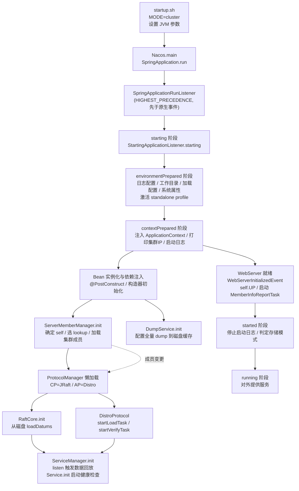

### 1.4 CP 与 AP 协议对比

| 维度 | CP（JRaft） | AP（Distro） |
|------|-----------|------------|
| 一致性模型 | 强一致性，基于 Raft 共识 | 最终一致性，基于数据同步 + 校验 |
| 写入路径 | 走 Raft apply，多数节点持久化才返回 | 本地写入后异步同步到其他节点 |
| 读取路径 | 线性读 ReadIndex（确认 Leader） | 本地直接读 |
| Leader | 需 Leader 选举，只有 Leader 可写 | 无 Leader，按 DistroMapper 哈希分片负责 |
| 启动数据加载 | 加载本地快照恢复状态机 | 从其他节点拉取全量数据 `getDatumSnapshot` |
| 数据校验 | Raft 日志复制保证一致 | 定时 `DistroVerifyTask` 发 checksum 校验 |
| 适用场景 | 持久化数据：配置、服务元数据、持久实例 | 临时数据：临时实例列表 |
| 协议管理 | 通过 `ProtocolManager` 懒加载 | 普通 `@Component` 直接注入 |

---

## 二、启动前置：脚本、配置与扩展点注册

### 2.1 启动脚本 `distribution/bin/startup.sh`

默认以集群模式启动，关键参数：

```bash
export MODE="cluster"            # 默认集群；-m standalone 切单机
export FUNCTION_MODE="all"       # -f config|naming 可只起部分功能
export EMBEDDED_STORAGE=""        # -p embedded 启用内嵌存储

# 集群模式 JVM 参数
JAVA_OPT="${JAVA_OPT} -server -Xms2g -Xmx2g -Xmn1g -XX:MetaspaceSize=128m -XX:MaxMetaspaceSize=320m"
JAVA_OPT="${JAVA_OPT} -XX:+HeapDumpOnOutOfMemoryError -XX:HeapDumpPath=${BASE_DIR}/logs/java_heapdump.hprof"

# 单机模式
if [[ "${MODE}" == "standalone" ]]; then
    JAVA_OPT="${JAVA_OPT} -Xms512m -Xmx512m -Xmn256m"
    JAVA_OPT="${JAVA_OPT} -Dnacos.standalone=true"      # 关键系统属性
fi

# 内嵌存储
if [[ "${EMBEDDED_STORAGE}" == "embedded" ]]; then
    JAVA_OPT="${JAVA_OPT} -DembeddedStorage=true"
fi

# 功能模式
if [[ "${FUNCTION_MODE}" == "config" ]]; then
    JAVA_OPT="${JAVA_OPT} -Dnacos.functionMode=config"
elif [[ "${FUNCTION_MODE}" == "naming" ]]; then
    JAVA_OPT="${JAVA_OPT} -Dnacos.functionMode=naming"
fi

JAVA_OPT="${JAVA_OPT} -Dnacos.member.list=${MEMBER_LIST}"          # -c 指定成员列表
JAVA_OPT="${JAVA_OPT} -Dloader.path=${BASE_DIR}/plugins/health,${BASE_DIR}/plugins/cmdb"
JAVA_OPT="${JAVA_OPT} -Dnacos.home=${BASE_DIR}"
JAVA_OPT="${JAVA_OPT} -jar ${BASE_DIR}/target/${SERVER}.jar"
JAVA_OPT="${JAVA_OPT} --spring.config.additional-location=${CUSTOM_SEARCH_LOCATIONS}"  # file:.../conf/
JAVA_OPT="${JAVA_OPT} --logging.config=${BASE_DIR}/conf/nacos-logback.xml"
```

要点：
- `MODE` 默认 `cluster`；`-m standalone` 触发 `-Dnacos.standalone=true`，这是 standalone/cluster 分支的总开关。
- `-Dnacos.home` 指向 `BASE_DIR`，决定 `logs/conf/data` 工作目录。
- `--spring.config.additional-location=file:.../conf/` 让外部 `conf/application.properties` 优先于 jar 内置配置。
- `-Dloader.path=plugins/health,plugins/cmdb` 加载健康检查/CMDB 插件。
- `-Dnacos.member.list` 可直接在命令行指定集群成员（覆盖 cluster.conf）。

### 2.2 `spring.factories` 扩展点注册

Nacos 通过三个模块的 `META-INF/spring.factories` 注册 Spring Boot 扩展点：

**`core` 模块**（`core/src/main/resources/META-INF/spring.factories`）：
```properties
org.springframework.context.ApplicationListener=\
com.alibaba.nacos.core.code.StandaloneProfileApplicationListener
org.springframework.boot.SpringApplicationRunListener=\
com.alibaba.nacos.core.code.SpringApplicationRunListener
```

**`sys` 模块**（`sys/src/main/resources/META-INF/spring.factories`）：
```properties
org.springframework.boot.env.EnvironmentPostProcessor=\
com.alibaba.nacos.sys.env.NacosDefaultPropertySourceEnvironmentPostProcessor
org.springframework.context.ApplicationContextInitializer=\
  com.alibaba.nacos.sys.utils.ApplicationUtils
```

**`config` 模块**（`config/src/main/resources/META-INF/spring.factories`）：
```properties
org.springframework.context.ApplicationContextInitializer=\
  com.alibaba.nacos.config.server.utils.PropertyUtil
```

| 扩展点类型 | 触发阶段 | 作用 |
|-----------|---------|------|
| `SpringApplicationRunListener` | starting→failed 全生命周期 | 包装两个 `NacosApplicationListener` 回调 |
| `ApplicationListener`（`StandaloneProfileApplicationListener`） | `ApplicationEnvironmentPreparedEvent` | 激活 `standalone` profile |
| `EnvironmentPostProcessor` | environmentPrepared 后处理 | 加载 `nacos-default.properties` 兜底 |
| `ApplicationContextInitializer` | contextPrepared（refresh 前） | 注入 ApplicationContext / 预读属性 |

### 2.3 关键配置文件

- `conf/application.properties`：`server.port=8848`、`server.servlet.contextPath=/nacos`、数据源、distro/raft 调参、鉴权、空服务清理等。
- `conf/cluster.conf`：集群成员列表，每行一个 `ip:port`（端口可省默认 8848），支持 `#` 注释与逗号分隔多节点。
- `conf/nacos-logback.xml`：日志配置。

---

## 三、Spring Boot 引导阶段

### 3.1 启动入口

**`console/src/main/java/com/alibaba/nacos/Nacos.java`**：
```java
@SpringBootApplication(scanBasePackages = "com.alibaba.nacos")
@ServletComponentScan
@EnableScheduling
public class Nacos {
    public static void main(String[] args) {
        SpringApplication.run(Nacos.class, args);
    }
}
```

| 注解 | 作用 |
|------|------|
| `@SpringBootApplication(scanBasePackages = "com.alibaba.nacos")` | 自动配置 + 组件扫描，覆盖 console/config/naming/core 等所有模块 |
| `@ServletComponentScan` | 扫描 `@WebFilter`/`@WebServlet`/`@WebListener` 注册到嵌入式容器 |
| `@EnableScheduling` | 开启 `@Scheduled` 定时任务（心跳、dump、成员上报等大量依赖） |

### 3.2 自定义 RunListener 调度器

Nacos 没有直接用 Spring Boot 默认的 `EventPublishingRunListener` 单通道，而是自定义了 `SpringApplicationRunListener`，内部持有一组 `NacosApplicationListener`。

**`core/.../core/code/SpringApplicationRunListener.java`**：
```java
public class SpringApplicationRunListener
        implements org.springframework.boot.SpringApplicationRunListener, Ordered {

    private List<NacosApplicationListener> nacosApplicationListeners = new ArrayList<>();

    {
        nacosApplicationListeners.add(new LoggingApplicationListener());
        nacosApplicationListeners.add(new StartingApplicationListener());
    }

    @Override
    public void starting(ConfigurableBootstrapContext bootstrapContext) {
        for (NacosApplicationListener l : nacosApplicationListeners) l.starting();
    }
    // environmentPrepared / contextPrepared / contextLoaded / started / running / failed 同构

    @Override
    public int getOrder() { return HIGHEST_PRECEDENCE; }   // 先于 EventPublishingRunListener
}
```

- `getOrder()` 返回 `HIGHEST_PRECEDENCE`，确保 **先于** Spring 原生 `EventPublishingRunListener` 执行，即 `NacosApplicationListener` 回调先于原生 `ApplicationEvent` 发布。
- 顺序：先 `LoggingApplicationListener`（日志先就绪），后 `StartingApplicationListener`。

### 3.3 `NacosApplicationListener` 接口

**`core/.../core/listener/NacosApplicationListener.java`**：定义与 Spring Boot 7 个生命周期回调一一对应的方法：`starting` / `environmentPrepared` / `contextPrepared` / `contextLoaded` / `started` / `running` / `failed`。

### 3.4 `LoggingApplicationListener`（日志配置兜底）

**`core/.../core/listener/LoggingApplicationListener.java`**：仅在 `environmentPrepared` 做事：
```java
@Override
public void environmentPrepared(ConfigurableEnvironment environment) {
    if (!environment.containsProperty(CONFIG_PROPERTY)) {
        System.setProperty(CONFIG_PROPERTY, DEFAULT_NACOS_LOGBACK_LOCATION);
        // CONFIG_PROPERTY = "logging.config"，默认值 classpath:META-INF/logback/nacos.xml
    }
}
```
未显式指定日志配置时兜底设置 logback 路径（`startup.sh` 已用 `--logging.config` 指定外部配置，故此为兜底）。

### 3.5 `StartingApplicationListener`（环境与目录初始化，核心）

**`core/.../core/listener/StartingApplicationListener.java`**，横跨多个阶段：

**`starting()`**：设置 `starting = true` 标志位，供后续定时日志判断。

**`environmentPrepared()`**（最密集初始化）：
```java
@Override
public void environmentPrepared(ConfigurableEnvironment environment) {
    makeWorkDir();              // 1. 创建 logs/conf/data 工作目录
    injectEnvironment(environment);  // 2. EnvUtil.setEnvironment(environment)
    loadPreProperties(environment);   // 3. 加载 application.properties + 注册文件热更新
    initSystemProperty();       // 4. 写 nacos.mode / nacos.function.mode / nacos.local.ip
}
```

1. `makeWorkDir()`：在 `nacos.home` 下创建 `logs`、`conf`、`data` 三目录。
2. `injectEnvironment()`：`EnvUtil.setEnvironment(environment)`，让全局工具类持有 Environment。
3. `loadPreProperties()`：加载 `application.properties`（优先外部 conf 目录，回退 classpath）作为最低优先级 PropertySource；`registerWatcher()` 通过 `WatchFileCenter` 监听 `conf` 目录，实现配置热更新。
4. `initSystemProperty()`：写入系统属性 `nacos.mode`（stand alone/cluster）、`nacos.function.mode`、`nacos.local.ip`。

**`contextPrepared()`**：`logClusterConf()`（集群模式打印 cluster.conf IP 列表）+ `logStarting()`（启动 "Nacos is starting..." 定时日志，每秒一次直到 started）。

**`started()`**：`starting=false`、`closeExecutor()`（停止启动日志）、`judgeStorageMode()`（判定并打印存储模式：external MySQL / embedded）。

**`failed()`**：重建工作目录、打印错误、关闭 `ThreadPoolManager`/`WatchFileCenter`/`NotifyCenter`、关闭 context。

### 3.6 `StandaloneProfileApplicationListener`（profile 激活）

**`core/.../core/code/StandaloneProfileApplicationListener.java`**：标准 Spring Boot `ApplicationListener<ApplicationEnvironmentPreparedEvent>`，`PriorityOrdered` + `HIGHEST_PRECEDENCE`：
```java
@Override
public void onApplicationEvent(ApplicationEnvironmentPreparedEvent event) {
    ConfigurableEnvironment environment = event.getEnvironment();
    if (environment.getProperty(STANDALONE_MODE_PROPERTY_NAME, boolean.class, false)) {
        environment.addActiveProfile(STANDALONE_SPRING_PROFILE);  // 激活 "standalone" profile
    }
}
```

### 3.7 `sys` 模块扩展

- `NacosDefaultPropertySourceEnvironmentPostProcessor`（`@Deprecated`）：加载 `classpath*:META-INF/nacos-default.properties` 作为最低优先级 PropertySource。
- `ApplicationUtils`：作为 `ApplicationContextInitializer`，在 `contextPrepared` 把 ApplicationContext 注入静态字段，使非 Spring 管理对象可 `ApplicationUtils.getBean(...)`。

### 3.8 standalone / cluster 判定链路

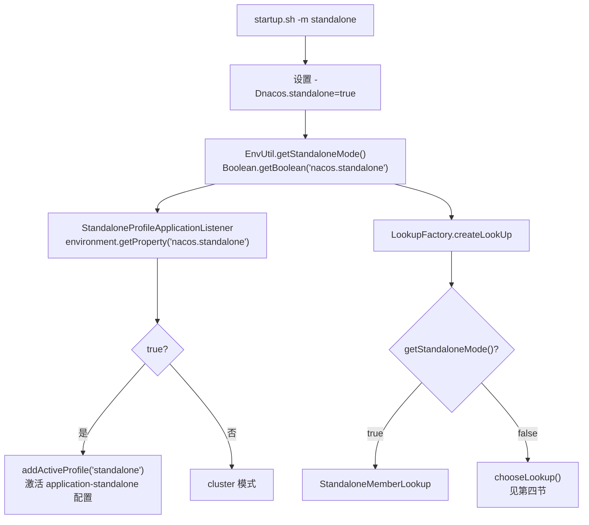

### 3.9 Spring Boot 启动阶段时序图

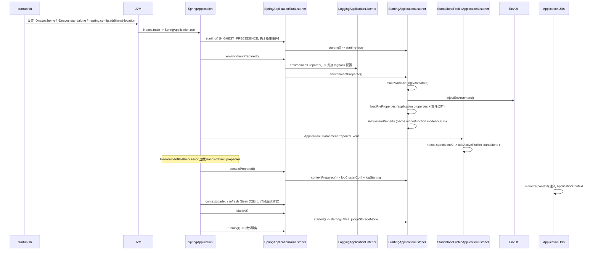

---

## 四、集群成员管理启动（ServerMemberManager）

### 4.1 核心类与初始化方式

**`core/.../core/cluster/ServerMemberManager.java`**：
```java
@Component(value = "serverMemberManager")
public class ServerMemberManager implements ApplicationListener<WebServerInitializedEvent> {

    private volatile ConcurrentSkipListMap<String, Member> serverList;   // 按地址排序的成员表
    private volatile Set<String> memberAddressInfos = new ConcurrentHashSet<>();  // UP 节点地址集合
    private volatile Member self;
    private MemberLookup lookup;
    private final MemberInfoReportTask infoReportTask = new MemberInfoReportTask();

    public ServerMemberManager(ServletContext servletContext) throws Exception {
        this.serverList = new ConcurrentSkipListMap<>();
        EnvUtil.setContextPath(servletContext.getContextPath());
        init();   // 注意：构造器内初始化，而非 @PostConstruct
    }
}
```

要点：
- `@Component`，被 `NacosClusterController`、`ProtocolManager`、`DistroProtocol` 等注入。
- 实现 `ApplicationListener<WebServerInitializedEvent>`：Web 服务器就绪后回调，是「自身对外服务」与「启动心跳上报」的触发点。
- **初始化在构造器**（非 `@PostConstruct`），Bean 实例化阶段即完成集群资源初始化。

### 4.2 `init()` 方法

```java
protected void init() throws NacosException {
    this.port = EnvUtil.getProperty("server.port", Integer.class, 8848);
    this.localAddress = InetUtils.getSelfIP() + ":" + port;
    this.self = MemberUtil.singleParse(this.localAddress);
    this.self.setExtendVal(MemberMetaDataConstants.VERSION, VersionUtils.version);
    serverList.put(self.getAddress(), self);

    registerClusterEvent();      // 注册 MembersChangeEvent 发布器 + IPChangeEvent 订阅者
    initAndStartLookup();        // 选 lookup 并 start

    if (serverList.isEmpty()) {
        throw new NacosException(SERVER_ERROR, "cannot get serverlist, so exit.");
    }
}
```

`init()` 做了 5 件事：
1. **确定端口**：`server.port`（默认 8848）。
2. **确定自身地址**：`InetUtils.getSelfIP()` 取本机 IP，拼 `ip:port`。
3. **构造 self Member**：`MemberUtil.singleParse()` 解析出 Member（默认 `UP`，含 `raftPort=port-1000`），设置 `version`，放入 `serverList`。
4. **注册集群事件**：`registerClusterEvent()`。
5. **初始化并启动寻址**：`initAndStartLookup()` → `LookupFactory.createLookUp(this)` → `lookup.start()`。

### 4.3 `registerClusterEvent()` —— 事件机制

```java
private void registerClusterEvent() {
    // 1. 注册 MembersChangeEvent 发布器（队列默认 128）
    NotifyCenter.registerToPublisher(MembersChangeEvent.class,
            EnvUtil.getProperty("nacos.member-change-event.queue.size", Integer.class, 128));

    // 2. 订阅 IPChangeEvent：本机 IP 变化时修正 self / serverList
    NotifyCenter.registerSubscriber(new Subscriber<InetUtils.IPChangeEvent>() {
        public void onEvent(IPChangeEvent event) {
            String newAddress = event.getNewIP() + ":" + port;
            ServerMemberManager.this.localAddress = newAddress;
            Member self = ServerMemberManager.this.self;
            self.setIp(event.getNewIP());
            serverList.remove(event.getOldIP() + ":" + port);
            serverList.put(newAddress, self);
            memberAddressInfos.remove(event.getOldIP() + ":" + port);
            memberAddressInfos.add(newAddress);
        }
        // ...
    });
}
```

### 4.4 三种寻址模式（LookupFactory）

**`core/.../core/cluster/lookup/LookupFactory.java`**：
```java
public static MemberLookup createLookUp(ServerMemberManager memberManager) throws NacosException {
    if (!EnvUtil.getStandaloneMode()) {
        String lookupType = EnvUtil.getProperty(LOOKUP_MODE_TYPE);  // nacos.core.member.lookup.type
        LookupType type = chooseLookup(lookupType);
        LOOK_UP = find(type);
    } else {
        LOOK_UP = new StandaloneMemberLookup();
    }
    LOOK_UP.injectMemberManager(memberManager);
    return LOOK_UP;
}

private static LookupType chooseLookup(String lookupType) {
    if (StringUtils.isNotBlank(lookupType)) {
        LookupType type = LookupType.sourceOf(lookupType);
        if (Objects.nonNull(type)) return type;
    }
    File file = new File(EnvUtil.getClusterConfFilePath());
    if (file.exists() || StringUtils.isNotBlank(EnvUtil.getMemberList())) {
        return LookupType.FILE_CONFIG;
    }
    return LookupType.ADDRESS_SERVER;
}
```

| 条件 | Lookup | 说明 |
|------|--------|------|
| `nacos.standalone=true` | `StandaloneMemberLookup` | 只含 self |
| 集群 + `lookup.type=file` | `FileConfigMemberLookup` | 读 cluster.conf |
| 集群 + `lookup.type=address-server` | `AddressServerMemberLookup` | 拉地址服务器 |
| 集群 + 未指定 + cluster.conf 存在 / `nacos.member.list` 非空 | `FileConfigMemberLookup` | 兜底文件 |
| 集群 + 未指定 + 以上都不满足 | `AddressServerMemberLookup` | 兜底地址服务器 |

- **`FileConfigMemberLookup.doStart()`**：`readClusterConfFromDisk()` 读 `cluster.conf` → `afterLookup` → `memberChange`；并 `WatchFileCenter.registerWatcher` 监听文件变化实现热更新。
- **`AddressServerMemberLookup.doStart()`**：组装地址服务器 URL（默认 `jmenv.tbsite.net:8080/{contextPath}/serverlist`）→ `run()` 同步拉取（重试 5 次）→ `afterLookup`；调度 `AddressServerSyncTask` 每 5s 拉取一次。
- **`StandaloneMemberLookup.doStart()`**：只把自己 `afterLookup`。

### 4.5 `memberChange()` —— 全量成员变更核心

```java
synchronized boolean memberChange(Collection<Member> members) {
    // 1. 自检：不含自己则补 self
    boolean isContainSelfIp = members.stream().anyMatch(m -> Objects.equals(localAddress, m.getAddress()));
    if (!isContainSelfIp) { isInIpList = false; members.add(this.self); }

    // 2. 变更检测：大小不同或存在新地址
    boolean hasChange = members.size() != serverList.size();
    ConcurrentSkipListMap<String, Member> tmpMap = new ConcurrentSkipListMap<>();
    Set<String> tmpAddressInfo = new ConcurrentHashSet<>();
    for (Member member : members) {
        if (!serverList.containsKey(member.getAddress())) {
            hasChange = true;
            member.setState(NodeState.DOWN);    // 新成员先置 DOWN，待探测后转 UP
        } else {
            member.setState(serverList.get(member.getAddress()).getState());  // 继承旧状态 (fix #4925)
        }
        tmpMap.put(member.getAddress(), member);
        if (NodeState.UP.equals(member.getState())) tmpAddressInfo.add(member.getAddress());
    }
    serverList = tmpMap;
    memberAddressInfos = tmpAddressInfo;

    // 3. 持久化 + 事件（同步块内保证顺序）
    if (hasChange) {
        MemberUtil.syncToFile(allMembers());    // 写回 cluster.conf
        NotifyCenter.publishEvent(MembersChangeEvent.builder().members(allMembers()).build());
    }
    return hasChange;
}
```

### 4.6 成员变更事件订阅者

`MembersChangeEvent` 的订阅者（继承 `MemberChangeListener`）：

| 订阅者 | 文件 | 作用 |
|--------|------|------|
| `ProtocolManager` | `core/.../distributed/ProtocolManager.java` | 通知 CP/AP 协议成员变更 |
| `DistroMapper` | `naming/.../core/DistroMapper.java` | 重算 Naming 数据分区 |
| `RaftPeerSet` | `naming/.../consistency/persistent/raft/RaftPeerSet.java` | 重算老 Raft peers |
| `ServerListManager` | `naming/.../cluster/ServerListManager.java` | 更新 Naming 服务器列表 |

### 4.7 节点状态机 `NodeState`

**`core/.../core/cluster/NodeState.java`**：`STARTING` / `UP` / `SUSPICIOUS` / `DOWN` / `ISOLATION`。

状态流转：
- 启动：Member 默认 `UP`。
- Web 就绪：`onApplicationEvent` 显式 `getSelf().setState(UP)`。
- 心跳失败：`MemberUtil.onFail` → `SUSPICIOUS`，连续失败 > `nacos.core.member.fail-access-cnt`（默认 3）或连接被拒 → `DOWN`。
- 心跳成功：`MemberUtil.onSuccess` → `UP`，`failAccessCnt` 清零。

### 4.8 `MemberInfoReportTask` —— 心跳/健康检查

`ServerMemberManager` 内部类，继承 `Task`：
```java
class MemberInfoReportTask extends Task {
    private int cursor = 0;

    @Override
    protected void executeBody() {
        List<Member> members = ServerMemberManager.this.allMembersWithoutSelf();
        if (members.isEmpty()) return;
        this.cursor = (this.cursor + 1) % members.size();
        Member target = members.get(cursor);
        String url = HttpUtils.buildUrl(false, target.getAddress(), EnvUtil.getContextPath(),
                Commons.NACOS_CORE_CONTEXT, "/cluster/report");   // /v1/core/cluster/report
        Header header = Header.newInstance().addParam(Constants.NACOS_SERVER_HEADER, VersionUtils.version);
        AuthHeaderUtil.addIdentityToHeader(header);
        asyncRestTemplate.post(url, header, Query.EMPTY, getSelf(), reference.getType(), new Callback<String>() {
            public void onReceive(RestResult<String> result) {
                if (result.ok()) MemberUtil.onSuccess(ServerMemberManager.this, target);
                else MemberUtil.onFail(ServerMemberManager.this, target);
            }
            public void onError(Throwable t) { MemberUtil.onFail(ServerMemberManager.this, target, t); }
        });
    }

    @Override
    protected void after() {
        GlobalExecutor.scheduleByCommon(this, 2_000L);   // 每 2s 自调度
    }
}
```

- **轮询上报**：每次选一个对端，POST 自身 Member 到 `/v1/core/cluster/report`。
- **启动时机**：`onApplicationEvent`（Web 就绪）首次延迟 5s 调度，之后每 2s；**仅集群模式**启动。
- **接收方** `NacosClusterController.report()`：校验后强制置上报方 `UP`、`failAccessCnt=0`，调用 `memberManager.update(node)`（基本信息变化则 `notifyMemberChange`）。

### 4.9 `cluster.conf` 加载

**`sys/.../sys/env/EnvUtil.java`**：
- 路径：`{nacos.home}/conf/cluster.conf`（`getClusterConfFilePath()`）。
- `readClusterConf()`：读文件，文件不存在则回退到 `nacos.member.list` 属性。
- `analyzeClusterConf(reader)`：按行解析，支持 `#` 整行/行内注释、逗号分隔多节点。
- 加载时机：Bean 构造早期（`ServerMemberManager.init` → `initAndStartLookup` → `FileConfigMemberLookup.doStart`）。

### 4.10 成员初始化与心跳时序图

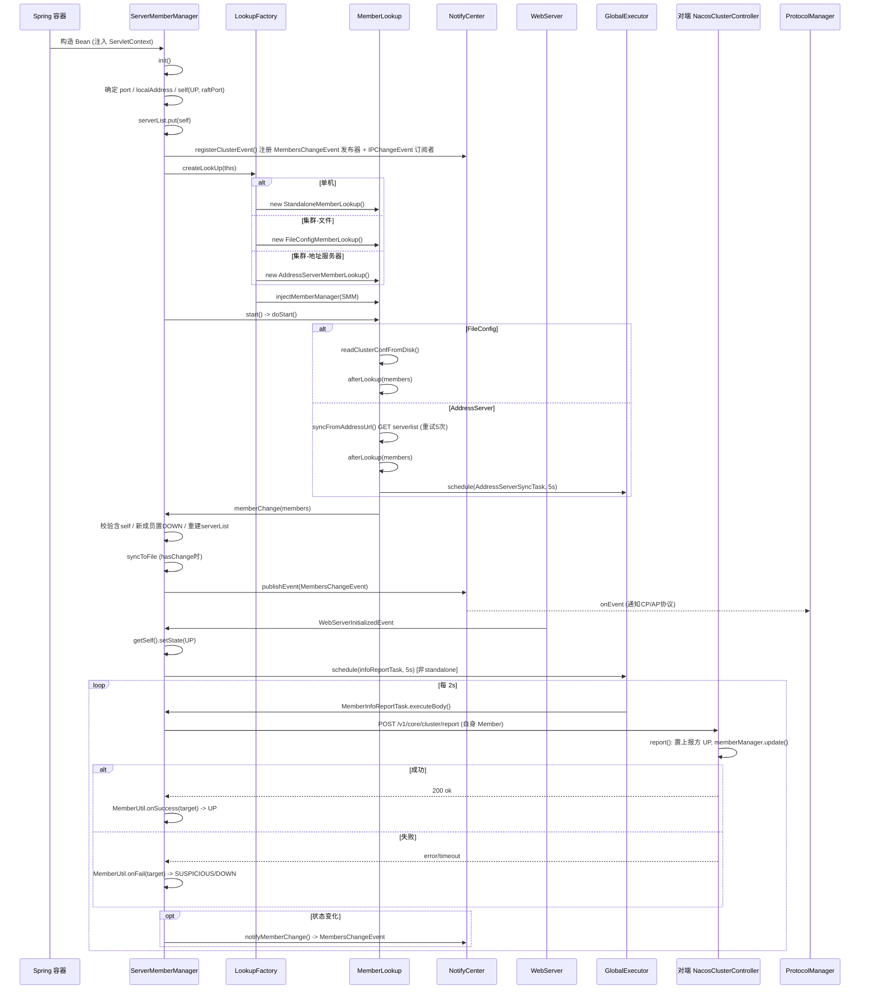

### 4.11 Lookup 选择流程图

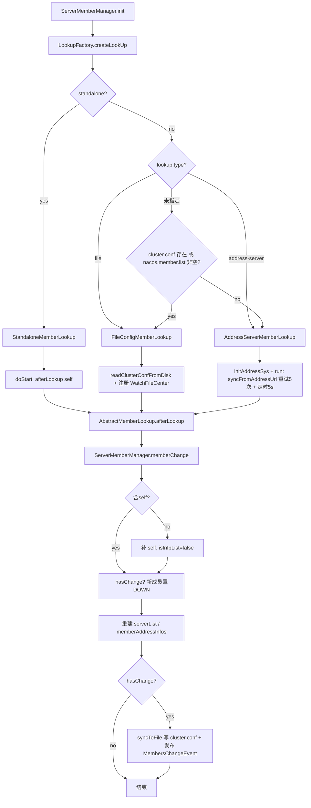

---

## 五、一致性协议层启动（ProtocolManager / Raft / Distro）

### 5.1 `ProtocolManager` —— 协议管理器（懒加载）

**`core/.../core/distributed/ProtocolManager.java`**：`@Component("ProtocolManager")`，`extends MemberChangeListener implements DisposableBean`。**没有 `@PostConstruct`**。

```java
public ProtocolManager(ServerMemberManager memberManager) {
    this.memberManager = memberManager;
    NotifyCenter.registerSubscriber(this);   // 订阅 MembersChangeEvent
}

public CPProtocol getCpProtocol() {            // 懒加载入口
    synchronized (this) {
        if (!cpInit) {
            initCPProtocol();
            cpInit = true;
        }
    }
    return cpProtocol;
}

private void initCPProtocol() {
    ApplicationUtils.getBeanIfExist(CPProtocol.class, protocol -> {
        Class configType = ClassUtils.resolveGenericType(protocol.getClass());  // 解析出 RaftConfig
        Config config = (Config) ApplicationUtils.getBean(configType);
        injectMembers4CP(config);      // 注入 ip:raftPort 成员
        protocol.init(config);         // 启动 JRaft
        ProtocolManager.this.cpProtocol = protocol;
    });
}

@Override
public void onEvent(MembersChangeEvent event) {
    if (Objects.nonNull(cpProtocol)) {
        ProtocolExecutor.cpMemberChange(() -> cpProtocol.memberChange(toCPMembersInfo(event.getMembers())));
    }
}
```

- `getCpProtocol()` 由 naming 的 `PersistentServiceProcessor` 与 config 的 `DistributedDatabaseOperateImpl` 构造时触发。
- CP 成员用 `ip:raftPort`（raftPort = port - 1000）。
- 成员变更通过 `ProtocolExecutor` 的独立单线程池通知，保证同一协议顺序执行、CP/AP 互不阻塞。

### 5.2 CP 协议 Bean 工厂

**`core/.../core/distributed/ConsistencyConfiguration.java`**：
```java
@Bean(value = "strongAgreementProtocol")
public CPProtocol strongAgreementProtocol(ServerMemberManager memberManager) throws Exception {
    return getProtocol(CPProtocol.class, () -> new JRaftProtocol(memberManager));
}

private <T> T getProtocol(Class<T> cls, Callable<T> builder) throws Exception {
    ServiceLoader<T> protocols = ServiceLoader.load(cls);
    Iterator<T> iterator = protocols.iterator();
    return iterator.hasNext() ? iterator.next() : builder.call();  // SPI 优先，无则 JRaftProtocol
}
```
仓库无 `META-INF/services/...CPProtocol` 文件，故始终用 `JRaftProtocol`。**此配置类只创建 CP Bean，无 AP Bean 定义**。

### 5.3 JRaft 启动初始化

#### 5.3.1 `JRaftProtocol.init()`

**`core/.../core/distributed/raft/JRaftProtocol.java`**（无 `@PostConstruct`，`init` 由 `ProtocolManager` 同步调用）：
```java
@Override
public void init(RaftConfig config) {
    if (initialized.compareAndSet(false, true)) {
        this.raftConfig = config;
        NotifyCenter.registerToSharePublisher(RaftEvent.class);
        this.raftServer.init(this.raftConfig);   // NodeOptions / CliService / 线程池
        this.raftServer.start();                  // RPC 启动
        NotifyCenter.registerSubscriber(new Subscriber<RaftEvent>() {  // 更新 ProtocolMetaData
            public void onEvent(RaftEvent event) {
                // 把 leader/term/raftClusterInfo 写入 metaData 并 injectProtocolMetaData
            }
        });
    }
}

@Override
public void addRequestProcessors(Collection<RequestProcessor4CP> processors) {
    raftServer.createMultiRaftGroup(processors);   // RaftGroup 实际创建触发点
}
```

#### 5.3.2 `JRaftServer` 三阶段

**`core/.../core/distributed/raft/JRaftServer.java`**：

**`init(config)`**：`RaftExecutor.init` 创建四个线程池（raftCore=8、raftCliService=4、raftCommon=8、raftSnapshot=core/2）→ 解析 `localPeerId` → 创建 `NodeOptions`（选举超时取配置与 5000ms 较大者，默认 5s）→ 开启共享 Timer → 构建 `RaftOptions` → 创建并初始化 `CliService`。

**`start()`**：遍历集群成员填充 `conf` 并注册到 `NodeManager` → `setInitialConf` → `JRaftUtils.initRpcServer` 创建 gRPC RPC Server（注册 5 个 Protobuf 序列化器 + JRaft 内置 Raft 请求处理器 + Nacos 4 个业务 Processor）→ `rpcServer.init()` → `isStarted=true` → `createMultiRaftGroup(processors)`（首次 processors 为空，仅缓存）。

**`createMultiRaftGroup(processors)`**（`isStarted=true` 后，极关键）：
```java
synchronized void createMultiRaftGroup(Collection<RequestProcessor4CP> processors) {
    if (!this.isStarted) { this.processors.addAll(processors); return; }
    final String parentPath = Paths.get(EnvUtil.getNacosHome(), "data/protocol/raft").toString();
    for (RequestProcessor4CP processor : processors) {
        final String groupName = processor.group();           // naming_persistent_service / nacos_config
        if (multiRaftGroup.containsKey(groupName)) throw new DuplicateRaftGroupException(groupName);
        Configuration configuration = conf.copy();
        NodeOptions copy = nodeOptions.copy();
        JRaftUtils.initDirectory(parentPath, groupName, copy); // data/protocol/raft/{group}/{log,snapshot,meta-data}
        NacosStateMachine machine = new NacosStateMachine(this, processor);
        copy.setFsm(machine);
        copy.setInitialConf(configuration);
        int doSnapshotInterval = ConvertUtils.toInt(...DEFAULT_RAFT_SNAPSHOT_INTERVAL_SECS);  // 1800s
        doSnapshotInterval = CollectionUtils.isEmpty(processor.loadSnapshotOperate()) ? 0 : doSnapshotInterval;
        copy.setSnapshotIntervalSecs(doSnapshotInterval);
        RaftGroupService raftGroupService = new RaftGroupService(groupName, localPeerId, copy, rpcServer, true);
        Node node = raftGroupService.start(false);    // 创建 NodeImpl，触发 Leader 选举计时器
        machine.setNode(node);
        RouteTable.getInstance().updateConfiguration(groupName, configuration);
        RaftExecutor.executeByCommon(() -> registerSelfToCluster(groupName, localPeerId, configuration));  // 加入集群
        long period = nodeOptions.getElectionTimeoutMs() + new Random().nextInt(5 * 1000);
        RaftExecutor.scheduleRaftMemberRefreshJob(() -> refreshRouteTable(groupName),
                nodeOptions.getElectionTimeoutMs(), period, TimeUnit.MILLISECONDS);  // 定时刷新 Leader
        multiRaftGroup.put(groupName, new RaftGroupTuple(node, processor, raftGroupService, machine));
    }
}
```

#### 5.3.3 `NacosStateMachine`

**`core/.../core/distributed/raft/NacosStateMachine.java`**：
- `onApply(Iterator)`：日志应用核心。Leader 走 `closure.getMessage()`，Follower 走 `iter.getData()` 反序列化，分发到 `processor.onApply(WriteRequest)` / `processor.onRequest(ReadRequest)`。
- `onSnapshotLoad(SnapshotReader)`：**启动时加载快照入口**。JRaft 在 Node 启动阶段（选举前）检测本地快照，存在则调用，遍历 `JSnapshotOperation` 逐个恢复。
- `onSnapshotSave(SnapshotWriter, Closure)`：定时快照保存。
- `onLeaderStart(term)`：当选 Leader 时发布 `RaftEvent`（含 groupId/leader/term）。
- `onStartFollowing(ctx)`：Follower 跟随新 Leader 时更新 term、leaderIp 并发布 `RaftEvent`（非 Leader 节点感知 Leader 的主要途径）。

> 关键时序：**快照恢复（onSnapshotLoad）发生在 Leader 选举之前** —— 先恢复状态机，再开始日志回放和选举。

#### 5.3.4 Raft 配置默认值

**`core/.../core/distributed/raft/RaftSysConstants.java`**：

| 常量 | 值 | 含义 |
|------|----|----|
| `DEFAULT_ELECTION_TIMEOUT` | 5000 | 选举超时 5s |
| `DEFAULT_RAFT_SNAPSHOT_INTERVAL_SECS` | 1800 | 快照间隔 30min |
| `DEFAULT_RAFT_RPC_REQUEST_TIMEOUT_MS` | 5000 | RPC 超时 5s |
| `DEFAULT_READ_INDEX_TYPE` | ReadOnlySafe | 线性读策略 |
| `DEFAULT_SYNC` | true | 写日志 fsync |
| `DEFAULT_REPLICATOR_PIPELINE` | true | pipeline 复制优化 |

### 5.4 CP/JRaft 启动时序图

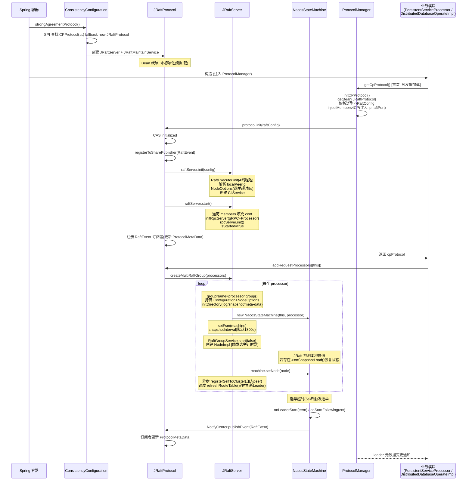

### 5.5 AP 协议 Distro 启动

#### 5.5.1 `DistroProtocol`（构造器初始化，非 @PostConstruct）

**`core/.../core/distributed/distro/DistroProtocol.java`**：
```java
@Component
public class DistroProtocol {
    private volatile boolean isInitialized = false;

    public DistroProtocol(ServerMemberManager memberManager, DistroComponentHolder distroComponentHolder,
            DistroTaskEngineHolder distroTaskEngineHolder, DistroConfig distroConfig) {
        // 注入四个依赖
        startDistroTask();   // 构造器内直接启动
    }

    private void startDistroTask() {
        if (EnvUtil.getStandaloneMode()) { isInitialized = true; return; }   // 单机直接完成
        startVerifyTask();
        startLoadTask();
    }

    private void startLoadTask() {
        DistroCallback loadCallback = new DistroCallback() {
            public void onSuccess() { isInitialized = true; }
            public void onFailed(Throwable t) { isInitialized = false; }
        };
        GlobalExecutor.submitLoadDataTask(
                new DistroLoadDataTask(memberManager, distroComponentHolder, distroConfig, loadCallback));
    }

    private void startVerifyTask() {
        GlobalExecutor.schedulePartitionDataTimedSync(
                new DistroVerifyTask(memberManager, distroComponentHolder),
                distroConfig.getVerifyIntervalMillis());   // 默认 5000ms
    }
}
```

#### 5.5.2 `DistroConfig` 默认值

| 字段 | 配置键 | 默认值 |
|------|--------|--------|
| `syncDelayMillis` | `nacos.core.protocol.distro.data.sync_delay_ms` | 1000 |
| `syncRetryDelayMillis` | `nacos.core.protocol.distro.data.sync_retry_delay_ms` | 3000 |
| `verifyIntervalMillis` | `nacos.core.protocol.distro.data.verify_interval_ms` | 5000 |
| `loadDataRetryDelayMillis` | `nacos.core.protocol.distro.data.load_retry_delay_ms` | 30000 |

#### 5.5.3 `DistroLoadDataTask`（启动全量拉取，极关键）

**`core/.../core/distributed/distro/task/load/DistroLoadDataTask.java`**：
```java
@Override
public void run() {
    try {
        load();
        if (!checkCompleted()) {
            GlobalExecutor.submitLoadDataTask(this, distroConfig.getLoadDataRetryDelayMillis());  // 失败 30s 重试
        } else {
            loadCallback.onSuccess();   // 全部成功 -> isInitialized=true
        }
    } catch (Exception e) {
        loadCallback.onFailed(e);
    }
}

private void load() throws Exception {
    while (memberManager.allMembersWithoutSelf().isEmpty()) {   // 阻塞等待集群成员就绪
        TimeUnit.SECONDS.sleep(1);
    }
    while (distroComponentHolder.getDataStorageTypes().isEmpty()) {  // 阻塞等待 DistroHttpRegistry 注册完成
        TimeUnit.SECONDS.sleep(1);
    }
    for (String each : distroComponentHolder.getDataStorageTypes()) {
        if (!loadCompletedMap.containsKey(each) || !loadCompletedMap.get(each)) {
            loadCompletedMap.put(each, loadAllDataSnapshotFromRemote(each));
        }
    }
}

private boolean loadAllDataSnapshotFromRemote(String resourceType) {
    DistroTransportAgent transportAgent = distroComponentHolder.findTransportAgent(resourceType);
    DistroDataProcessor dataProcessor = distroComponentHolder.findDataProcessor(resourceType);
    for (Member each : memberManager.allMembersWithoutSelf()) {
        DistroData distroData = transportAgent.getDatumSnapshot(each.getAddress());  // GET /distro/datums
        boolean result = dataProcessor.processSnapshot(distroData);   // 反序列化 -> dataStore.put + 通知 listener
        if (result) return true;   // 一个节点成功即止
    }
    return false;
}
```

#### 5.5.4 `DistroVerifyTask`（周期校验）

**`core/.../core/distributed/distro/task/verify/DistroVerifyTask.java`**：每 5s 执行，对每个 dataStorage 类型取本节点负责数据的 checksum，发给所有其他节点（PUT `/distro/checksum`）。

#### 5.5.5 `DistroComponentHolder` / `DistroTaskEngineHolder`

- `DistroComponentHolder`：4 个 Map 按 type 存储 `TransportAgent` / `DataStorage` / `FailedTaskHandler` / `DataProcessor`。
- `DistroTaskEngineHolder`：`DistroDelayTaskExecuteEngine`（100ms 周期处理线程，合并同 key 任务）+ `DistroExecuteTaskExecuteEngine`（CPU 核数 worker）。

### 5.6 AP/Distro 数据加载时序图

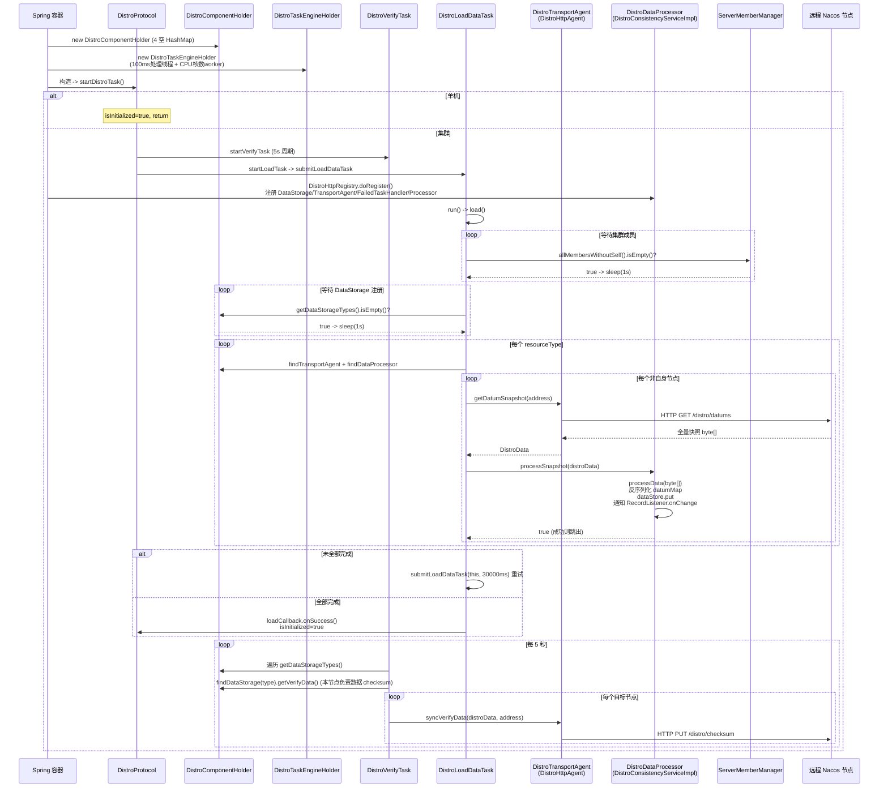

### 5.7 IdGenerator（雪花算法，补充）

- `IdGeneratorManager`（`@Component`）：`ConcurrentHashMap<String, IdGenerator>`，SPI 查找 `IdGenerator` 实现，无则 `new SnowFlowerIdGenerator()`。
- `SnowFlowerIdGenerator`：时间戳(高位，起始纪元 2018-08-05) + workerId(10 位，可配 `nacos.core.snowflake.worker-id`，默认从本机 IP 推导) + sequence(12 位)。`nextId()` 含时钟回拨检测。
- **唯一注册点**：`EmbeddedStoragePersistServiceImpl.init()`（config 模块，`@Conditional` 嵌入式存储）注册 9 个资源类型。

---

## 六、Naming 模块启动与数据恢复

### 6.1 启动入口与 Filter 注册

**`naming/.../naming/NamingApp.java`**（独立启动入口，console 聚合时扫描包覆盖）：
```java
@SpringBootApplication(scanBasePackages = {"com.alibaba.nacos.naming", "com.alibaba.nacos.core"})
public class NamingApp { ... }
```

**`naming/.../naming/web/NamingConfig.java`**：注册两个 Filter
- `DistroFilter`（order=6）：判断当前节点是否为该服务 Distro 负责节点，否则代理转发。
- `TrafficReviseFilter`（order=1）：节点非 UP 状态时拦截/重定向流量。

### 6.2 一致性服务路由

**`naming/.../naming/consistency/KeyBuilder.java`** key 前缀体系：
```
com.alibaba.nacos.naming.domains.meta.{ns}##{svc}   服务元信息 -> 持久化(Raft)
com.alibaba.nacos.naming.iplist.{ns}##{svc}         持久实例列表 -> 持久化(Raft)
com.alibaba.nacos.naming.iplist.ephemeral.{ns}##{svc}  临时实例列表 -> Distro(AP)
```

**`naming/.../naming/consistency/DelegateConsistencyServiceImpl.java`**：
```java
private ConsistencyService mapConsistencyService(String key) {
    return KeyBuilder.matchEphemeralKey(key) ? ephemeralConsistencyService : persistentConsistencyService;
}
// matchEphemeralKey: key 以 "com.alibaba.nacos.naming.iplist.ephemeral." 开头
```

服务元信息 key 前缀 `SERVICE_META_KEY_PREFIX` 同时注册到持久化和临时两套服务（`listen()` 特殊处理）。

### 6.3 老 Raft 路径（默认，混合版本集群）

#### 6.3.1 `RaftCore.init()`

**`naming/.../naming/consistency/persistent/raft/RaftCore.java`**（`@PostConstruct`）：
```java
@PostConstruct
public void init() throws Exception {
    raftStore.loadDatums(notifier, datums);                    // ① 从磁盘加载所有 datum 到内存
    setTerm(NumberUtils.toLong(raftStore.loadMeta().getProperty("term"), 0L));  // ② 加载 term
    initialized = true;
    masterTask = GlobalExecutor.registerMasterElection(new MasterElection());  // ③ 主选举(每500ms tick)
    heartbeatTask = GlobalExecutor.registerHeartbeat(new HeartBeat());          // ④ 心跳(每500ms tick)
    NotifyCenter.registerSubscriber(notifier);                  // ⑤ 注册 ValueChangeEvent 订阅者
}
```

`RaftStore.loadDatums` 遍历 `${nacos.home}/data/naming/data/` 目录，逐文件反序列化为 `Datum<Service>`/`Datum<Instances>`/`Datum<SwitchDomain>` 放入 `datums` 内存 map。

#### 6.3.2 `RaftCore.listen()` —— 磁盘数据灌入 ServiceManager 的关键

```java
public void listen(String key, RecordListener listener) {
    notifier.registerListener(key, listener);
    for (Datum datum : datums.values()) {       // 遍历磁盘已加载的全部 datum
        if (!listener.interests(datum.key)) continue;
        listener.onChange(datum.key, datum.value);   // 立即通知
    }
}
```

当 `ServiceManager.init()` 调用 `consistencyService.listen(SERVICE_META_KEY_PREFIX, this)` 时，最终走到 `RaftCore.listen`，遍历已加载 datum，对 ServiceManager 感兴趣的服务元信息 key 调用 `ServiceManager.onChange` → `putServiceAndInit` → `service.init()`，把磁盘服务恢复到内存并启动健康检查。

### 6.4 新 Raft（jRaft）路径

#### 6.4.1 `PersistentServiceProcessor`

**`naming/.../naming/consistency/persistent/impl/PersistentServiceProcessor.java`**：
```java
public PersistentServiceProcessor(ProtocolManager protocolManager, ClusterVersionJudgement versionJudgement)
        throws Exception {
    super(versionJudgement);
    this.protocol = protocolManager.getCpProtocol();   // 触发 CP 协议懒加载
}

@Override
public void afterConstruct() {
    super.afterConstruct();
    String raftGroup = Constants.NAMING_PERSISTENT_SERVICE_GROUP;   // "naming_persistent_service"
    this.protocol.protocolMetaData().subscribe(raftGroup, MetadataKey.LEADER_META_DATA, o -> { /* hasLeader */ });
    this.protocol.addRequestProcessors(Collections.singletonList(this));   // 注册为 CP 请求处理器
    if (EnvUtil.getProperty(Constants.NACOS_NAMING_USE_NEW_RAFT_FIRST, Boolean.class, false)) {
        NotifyCenter.registerSubscriber(notifier);
        waitLeader();
        startNotify = true;
    }
}
```

`group()` 返回 `Constants.NAMING_PERSISTENT_SERVICE_GROUP = "naming_persistent_service"`。磁盘存储用 `NamingKvStorage`（`data/naming/data/`，RocksDB），快照加载由 `NamingSnapshotOperation.onSnapshotLoad` 实现。

#### 6.4.2 `ClusterVersionJudgement` —— 新老切换

**`naming/.../naming/consistency/persistent/ClusterVersionJudgement.java`**：构造器 5s 后首次判定，每 5s 轮询，检查所有成员版本是否 > 1.4.0，全部新版本时触发一次观察者通知（按优先级降序）：
- 优先级 `1000`：`RaftConsistencyServiceImpl` / `RaftCore` → 老 raft `shutdown()`。
- 优先级 `10`：`BasePersistentServiceProcessor.listenOldRaftClose` → `startNotify=true`。
- 优先级 `-1`：`PersistentConsistencyServiceDelegateImpl` → `switchNewPersistentService=true`。

### 6.5 Distro 集成

#### 6.5.1 `DistroHttpRegistry.doRegister()` —— 注册四大组件

**`naming/.../naming/consistency/ephemeral/distro/DistroHttpRegistry.java`**（`@PostConstruct`）：
```java
@PostConstruct
public void doRegister() {
    componentHolder.registerDataStorage(KeyBuilder.INSTANCE_LIST_KEY_PREFIX,
            new DistroDataStorageImpl(dataStore, distroMapper));          // 数据存储
    componentHolder.registerTransportAgent(KeyBuilder.INSTANCE_LIST_KEY_PREFIX,
            new DistroHttpAgent(memberManager));                          // HTTP 传输代理
    componentHolder.registerFailedTaskHandler(KeyBuilder.INSTANCE_LIST_KEY_PREFIX,
            new DistroHttpCombinedKeyTaskFailedHandler(...));             // 失败重试
    taskEngineHolder.registerNacosTaskProcessor(KeyBuilder.INSTANCE_LIST_KEY_PREFIX,
            new DistroHttpDelayTaskProcessor(...));                       // 延迟任务处理器
    componentHolder.registerDataProcessor(consistencyService);            // 数据处理器(DistroConsistencyServiceImpl)
}
```

#### 6.5.2 `DistroConsistencyServiceImpl`

**`naming/.../naming/consistency/ephemeral/distro/DistroConsistencyServiceImpl.java`**：`implements EphemeralConsistencyService, DistroDataProcessor`。
- 构造器**直接注入 `DistroProtocol` Spring bean**（不通过 `ProtocolManager.getApProtocol()`）。
- `@PostConstruct init()`：启动 Notifier 单线程循环消费变更任务。
- `put(key, value)`：`onPut`（写 DataStore + 加入 Notifier 队列）+ `distroProtocol.sync`（触发 Distro 同步）。
- `processType()` 返回 `INSTANCE_LIST_KEY_PREFIX`。
- `processSnapshot(distroData)`：启动加载终点，反序列化 → `dataStore.put` → 通知 `RecordListener.onChange`。

### 6.6 `ServiceManager.init()` —— 服务管理核心

**`naming/.../naming/core/ServiceManager.java`**（`@Component`，`implements RecordListener<Service>`）：
```java
@PostConstruct
public void init() {
    GlobalExecutor.scheduleServiceReporter(new ServiceReporter(), 60000, TimeUnit.MILLISECONDS);  // 60s 汇报
    GlobalExecutor.submitServiceUpdateManager(new UpdatedServiceProcessor());   // 消费待更新队列
    if (emptyServiceAutoClean) { /* 空服务清理, 默认开启 */ }
    consistencyService.listen(KeyBuilder.SERVICE_META_KEY_PREFIX, this);   // 注册监听 -> 触发数据回放
}

@Override
public void onChange(String key, Service service) throws Exception {
    Service oldDom = getService(service.getNamespaceId(), service.getName());
    if (oldDom != null) {
        oldDom.update(service);
    } else {
        putServiceAndInit(service);   // 新服务: 放入内存 + 初始化(启动健康检查)
    }
}

private void putServiceAndInit(Service service) throws NacosException {
    putService(service);
    service = getService(service.getNamespaceId(), service.getName());
    service.init();   // 启动 ClientBeatCheckTask + 各 Cluster.init()
    consistencyService.listen(KeyBuilder.buildInstanceListKey(..., true), service);   // 监听临时实例
    consistencyService.listen(KeyBuilder.buildInstanceListKey(..., false), service); // 监听持久实例
}
```

### 6.7 健康检查启动

**`naming/.../naming/healthcheck/HealthCheckReactor.java`**：调度器，底层用 `GlobalExecutor.NAMING_HEALTH_EXECUTOR`。

启动链路（服务恢复时间接触发）：
1. `ServiceManager.onChange` → `putServiceAndInit` → `Service.init()`：
   ```java
   public void init() {
       HealthCheckReactor.scheduleCheck(clientBeatCheckTask);   // ClientBeatCheckTask, 延迟5s周期5s
       for (Map.Entry<String, Cluster> entry : clusterMap.entrySet()) {
           entry.getValue().setService(this);
           entry.getValue().init();                              // 各 Cluster 启动 HealthCheckTask
       }
   }
   ```
2. `Cluster.init()` → `new HealthCheckTask(this)` → `HealthCheckReactor.scheduleCheck`。
3. `HealthCheckTask.run()`：若 `distroMapper.responsible` 且健康检查开启，委托 `HealthCheckProcessorDelegate.process`，之后自重新调度。

**`HealthCheckProcessorDelegate`** 按 `cluster.getHealthChecker().getType()` 分发：

| 处理器 | getType() | 说明 |
|--------|-----------|------|
| `TcpSuperSenseProcessor` | `TCP` | 构造器启动 NIO Selector 常驻线程 |
| `HttpHealthCheckProcessor` | `HTTP` | HTTP 探活 |
| `MysqlHealthCheckProcessor` | `MYSQL` | MySQL 探活 |
| `NoneHealthCheckProcessor` | `NONE` | 默认空检查 |

**`ClientBeatCheckTask`**：5s 周期，只检查本节点负责的服务，临时实例心跳超时标记不健康/自动摘除。

### 6.8 `PushService` —— UDP 推送

**`naming/.../naming/push/PushService.java`**：
```java
static {
    udpSocket = new DatagramSocket();           // 创建 UDP Socket
    Receiver receiver = new Receiver();
    Thread inThread = new Thread(receiver);     // 启动 UDP ACK 接收线程
    inThread.setDaemon(true);
    inThread.start();
    GlobalExecutor.scheduleRetransmitter(() -> removeClientIfZombie(), 0, 20, TimeUnit.SECONDS);  // 20s 清理僵尸 client
}
```
`static` 块在类加载时（早于 Bean 初始化）就启动 UDP 接收线程。监听 `ServiceChangeEvent`，延迟 1s 合并后异步 UDP 推送，10s 未 ACK 重传。

### 6.9 Naming 启动磁盘数据加载流程

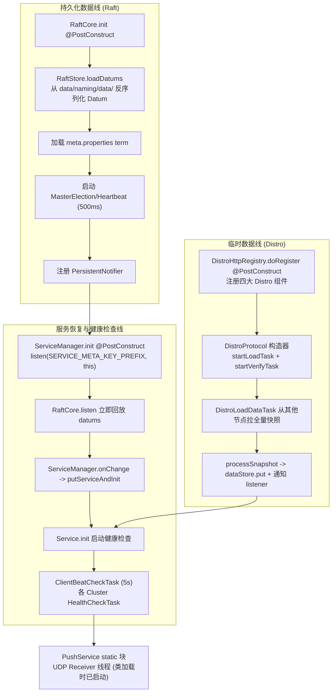

### 6.10 Naming 数据加载时序图

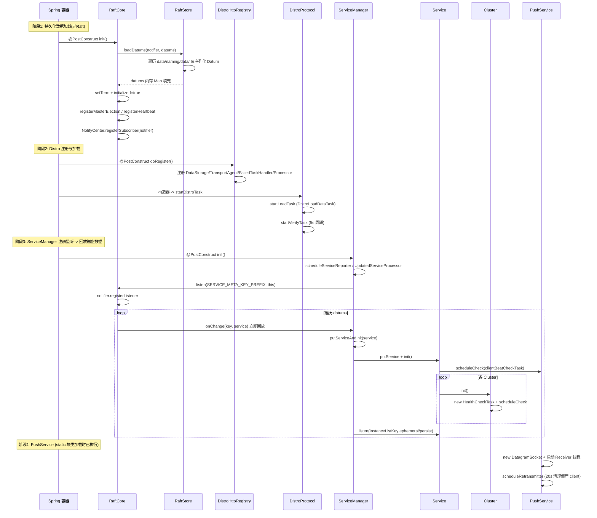

---

## 七、Config 模块启动（补充）

### 7.1 `DistributedDatabaseOperateImpl`（嵌入式分布式存储）

**`config/.../service/repository/embedded/DistributedDatabaseOperateImpl.java`**：`@Conditional(ConditionDistributedEmbedStorage.class)`，`extends RequestProcessor4CP`。
```java
public DistributedDatabaseOperateImpl(ServerMemberManager memberManager, ProtocolManager protocolManager)
        throws Exception {
    this.memberManager = memberManager;
    this.protocol = protocolManager.getCpProtocol();   // 触发 CP 懒加载
    init();
}

protected void init() throws Exception {
    this.dataSourceService = (LocalDataSourceServiceImpl) DynamicDataSource.getInstance().getDataSource();
    this.dataSourceService.cleanAndReopenDerby();   // Raft+Derby 依赖日志回放与快照恢复, 清空旧数据
    this.jdbcTemplate = dataSourceService.getJdbcTemplate();
    NotifyCenter.registerToSharePublisher(RaftDbErrorEvent.class);
    NotifyCenter.registerToSharePublisher(DerbyLoadEvent.class);
    NotifyCenter.registerSubscriber(new Subscriber<RaftDbErrorEvent>() { /* 节点降级 */ });
    NotifyCenter.registerToPublisher(ConfigDumpEvent.class, NotifyCenter.ringBufferSize);
    NotifyCenter.registerSubscriber(new DumpConfigHandler());
    this.protocol.addRequestProcessors(Collections.singletonList(this));   // 注册到 nacos_config raft group
}
```

`group()` 返回 `Constants.CONFIG_MODEL_RAFT_GROUP = "nacos_config"`。

### 7.2 `DumpService` —— 配置全量 dump

**`config/.../service/dump/DumpService.java`**（抽象）+ `ExternalDumpService`（MySQL）/ `EmbeddedDumpService`（Raft）。

`EmbeddedDumpService.init()`（`@PostConstruct`）：
- 单机：直接 `dumpOperate`。
- 集群：订阅 raft leader 元数据，**等待 leader 选出后**触发 `dumpOperate`（把 DB 配置全量 dump 到本地磁盘缓存），用 `CountDownLatch` 等待完成。

### 7.3 协议 group 汇总

| 模块 | group 名称 | Raft 类型 |
|------|-----------|-----------|
| Naming CP（新 jRaft） | `naming_persistent_service` | SOFA-JRaft |
| Naming CP（老 Raft） | `naming` | 自研简化版 |
| Config CP | `nacos_config` | SOFA-JRaft |
| Distro AP | `com.alibaba.nacos.naming.iplist.` | 无（哈希分片） |

---

## 八、关键 Bean 初始化顺序总览

基于 Spring 构造注入 + `@DependsOn` + `@PostConstruct` 的依赖关系推断（`@DependsOn("ProtocolManager")` 强制多个 Bean 在 `ProtocolManager` 之后初始化）：

| 阶段 | Bean | 触发动作 |
|------|------|---------|
| 1 | `ServerMemberManager`（构造器） | 加载集群成员列表 |
| 2 | `RaftPeerSet` @PostConstruct | 注册成员变更订阅，初始化 peers |
| 3 | `ProtocolManager`（构造器仅注册订阅者） | CP/AP 协议懒加载，本身不初始化 |
| 4 | `RaftCore` @PostConstruct | **loadDatums 从磁盘加载**；启动选举/心跳 |
| 5 | `RaftConsistencyServiceImpl` @PostConstruct | 若强制新 raft 则 shutdown 老 raft |
| 6 | `PersistentConsistencyServiceDelegateImpl`（构造器） | 创建新 `PersistentServiceProcessor` 并 `afterConstruct`（注册为 CP 处理器、订阅 leader，触发 `getCpProtocol` 懒加载） |
| 7 | `DistributedDatabaseOperateImpl`（构造器，config） | cleanAndReopenDerby + 注册到 `nacos_config` raft group |
| 8 | `DistroMapper` @PostConstruct | 初始化健康节点列表 |
| 9 | `DistroProtocol`（构造器） | **startDistroTask**：提交 DistroLoadDataTask + DistroVerifyTask |
| 10 | `DistroHttpRegistry` @PostConstruct | **注册 Distro 四大组件** |
| 11 | `DistroConsistencyServiceImpl` @PostConstruct | 启动 Notifier 线程 |
| 12 | `DelegateConsistencyServiceImpl` | 装配完成 |
| 13 | `PushService`（static 块早已执行） | UDP 接收线程已在运行 |
| 14 | `SwitchManager` @PostConstruct | 监听 switch key |
| 15 | `ServiceManager` @PostConstruct | 调度 ServiceReporter；**listen(SERVICE_META_KEY_PREFIX)** → 触发 RaftCore.listen 回放 → putServiceAndInit → **Service.init() 启动健康检查** |
| 16 | `HealthCheckProcessorDelegate`（构造器） | 注入各 HealthCheckProcessor（TcpSuperSenseProcessor 构造器已启动 NIO 线程） |
| 17 | `ClusterVersionJudgement`（构造器） | 5s 后首次判定版本，触发新老 raft 切换 |
| 18 | `ServerListManager` @PostConstruct | 启动 ServerStatusReporter / ServerInfoUpdater |
| 19 | `DumpService` @PostConstruct | 配置全量 dump（嵌入式模式需等 raft leader） |

> 注意：`ClusterVersionJudgement` 的观察者通知是**异步**的（构造后 5s 才首次执行），新老 raft 实际切换发生在启动后若干秒。`DistroLoadDataTask` 也是异步阻塞等待成员列表与 DistroHttpRegistry 注册就绪。

### 完整启动链路流程图

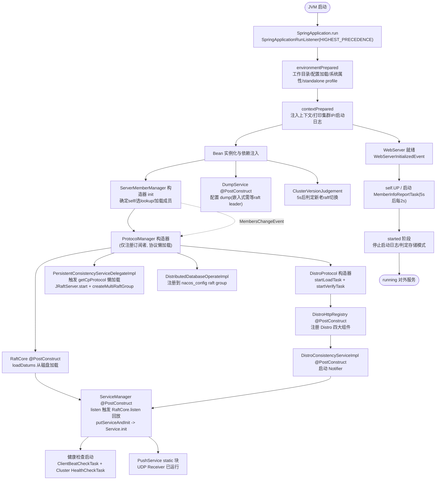

---

## 九、关闭流程

Nacos 关闭采用**两层机制**：JVM `ShutdownHook` + Spring `@PreDestroy`。

### 9.1 `@PreDestroy`（Spring 容器销毁回调）

| Bean | 方法 | 动作 |
|------|------|------|
| `ProtocolManager` | `destroy()` | `apProtocol.shutdown()` + `cpProtocol.shutdown()`（关闭 JRaftServer） |
| `ServerMemberManager` | `shutdown()` | 清空 serverList/memberAddressInfos、停 infoReportTask、`LookupFactory.destroy()` |

### 9.2 JVM ShutdownHook（`ThreadUtils.addShutdownHook`）

`kill`（SIGTERM）触发 JVM，并行执行所有 ShutdownHook：

| 组件 | 关闭动作 |
|------|---------|
| `NotifyCenter` | 关闭所有 EventPublisher / sharePublisher |
| `ThreadPoolManager` | 关闭所有注册线程池 |
| `WatchFileCenter` | 停止所有文件监听器 |
| `HttpClientBeanHolder` / 各 `HttpClientManager` | 关闭 HTTP 客户端 |

### 9.3 关闭流程图

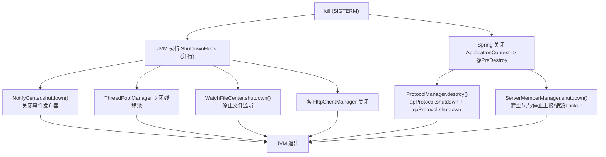

> 注：1.4.8 中配置 dump（落盘）主要发生在**启动阶段**与**定时任务**（`dumpAll` 每 10 分钟），关闭钩子中主要是释放资源而非显式落盘。

---

## 十、关键配置项与文件索引

### 10.1 关键配置项

| 配置项 | 默认值 | 说明 |
|--------|--------|------|
| `nacos.standalone`（系统属性） | false | 单机模式总开关 |
| `nacos.home`（系统属性） | `${user.home}/nacos` | 工作根目录 |
| `nacos.functionMode`（系统属性） | all | 功能模式 all/config/naming |
| `embeddedStorage`（系统属性） | false | 内嵌存储（Derby + Raft） |
| `server.port` | 8848 | 主端口 |
| `nacos.core.member.lookup.type` | 自动 | file / address-server |
| `nacos.member.list` | - | 命令行/属性指定成员列表 |
| `nacos.core.member.fail-access-cnt` | 3 | 心跳连续失败上限 |
| `nacos.core.protocol.raft.data.election_timeout_ms` | 5000 | Raft 选举超时 |
| `nacos.core.protocol.raft.data.snapshot_interval_secs` | 1800 | Raft 快照间隔 |
| `nacos.core.protocol.distro.data.verify_interval_ms` | 5000 | Distro 校验间隔 |
| `nacos.core.protocol.distro.data.load_retry_delay_ms` | 30000 | Distro 加载重试延迟 |
| `nacos.naming.distro.taskDispatchPeriod` | 200 | Distro 任务派发周期 |
| `nacos.naming.empty-service.auto-clean` | true | 空服务自动清理 |
| `nacos.naming.use.new.raft.first` | false | 强制新 raft |
| `nacos.core.snowflake.worker-id` | -1(自动推导) | 雪花 workerId |

### 10.2 磁盘路径

| 路径 | 内容 |
|------|------|
| `${nacos.home}/conf/` | application.properties、cluster.conf、nacos-logback.xml |
| `${nacos.home}/logs/` | 日志 |
| `${nacos.home}/data/naming/data/` | Naming 持久化数据（老 Raft datum 文件 / 新 Raft RocksDB） |
| `${nacos.home}/data/naming/meta.properties` | 老 Raft term |
| `${nacos.home}/data/protocol/raft/{group}/` | JRaft 日志/快照/元数据（`log`/`snapshot`/`meta-data`） |
| `${nacos.home}/data/config-data/` | Config 磁盘缓存 |

### 10.3 关键源码文件索引

**引导与监听器**
- `console/src/main/java/com/alibaba/nacos/Nacos.java` — 启动入口
- `core/.../core/code/SpringApplicationRunListener.java` — RunListener 调度器
- `core/.../core/listener/NacosApplicationListener.java` — 监听器接口
- `core/.../core/listener/StartingApplicationListener.java` — 环境/目录初始化
- `core/.../core/listener/LoggingApplicationListener.java` — 日志兜底
- `core/.../core/code/StandaloneProfileApplicationListener.java` — standalone profile
- `sys/.../sys/env/EnvUtil.java` — 环境工具（standalone 判定、cluster.conf、配置加载）
- `sys/.../sys/utils/ApplicationUtils.java` — 全局上下文持有器

**集群成员管理**
- `core/.../core/cluster/ServerMemberManager.java` — 核心门面
- `core/.../core/cluster/lookup/LookupFactory.java` — 寻址工厂
- `core/.../core/cluster/lookup/FileConfigMemberLookup.java` — cluster.conf 寻址
- `core/.../core/cluster/lookup/AddressServerMemberLookup.java` — 地址服务器寻址
- `core/.../core/cluster/MemberUtil.java` — 成员工具（解析/健康/持久化）
- `core/.../core/cluster/NodeState.java` — 节点状态枚举
- `core/.../core/controller/NacosClusterController.java` — /cluster/report 接口

**一致性协议层**
- `core/.../core/distributed/ProtocolManager.java` — 协议管理器（懒加载）
- `core/.../core/distributed/ConsistencyConfiguration.java` — CP Bean 工厂
- `core/.../core/distributed/raft/JRaftProtocol.java` — CP 协议实现
- `core/.../core/distributed/raft/JRaftServer.java` — Raft 引擎核心
- `core/.../core/distributed/raft/NacosStateMachine.java` — 状态机
- `core/.../core/distributed/raft/RaftSysConstants.java` — Raft 常量
- `core/.../core/distributed/distro/DistroProtocol.java` — AP 协议入口
- `core/.../core/distributed/distro/DistroConfig.java` — Distro 配置
- `core/.../core/distributed/distro/component/DistroComponentHolder.java` — 组件注册中心
- `core/.../core/distributed/distro/task/load/DistroLoadDataTask.java` — 全量加载
- `core/.../core/distributed/distro/task/verify/DistroVerifyTask.java` — 周期校验
- `core/.../core/distributed/id/IdGeneratorManager.java` — Id 生成器

**Naming 模块**
- `naming/.../naming/NamingApp.java` — Naming 启动入口
- `naming/.../naming/web/NamingConfig.java` — Filter 注册
- `naming/.../naming/core/ServiceManager.java` — 服务管理核心
- `naming/.../naming/core/DistroMapper.java` — Distro 路由判定
- `naming/.../naming/consistency/KeyBuilder.java` — key 前缀体系
- `naming/.../naming/consistency/DelegateConsistencyServiceImpl.java` — 一致性服务路由
- `naming/.../naming/consistency/ephemeral/distro/DistroHttpRegistry.java` — Distro 组件注册入口
- `naming/.../naming/consistency/ephemeral/distro/DistroConsistencyServiceImpl.java` — Distro AP 实现
- `naming/.../naming/consistency/persistent/raft/RaftCore.java` — 老 Raft 核心
- `naming/.../naming/consistency/persistent/raft/RaftStore.java` — 磁盘读写
- `naming/.../naming/consistency/persistent/ClusterVersionJudgement.java` — 新老切换判定
- `naming/.../naming/consistency/persistent/impl/PersistentServiceProcessor.java` — 新 Raft (jRaft)
- `naming/.../naming/healthcheck/HealthCheckReactor.java` — 健康检查调度
- `naming/.../naming/healthcheck/HealthCheckProcessorDelegate.java` — 处理器委托
- `naming/.../naming/push/PushService.java` — UDP 推送

**Config 模块**
- `config/.../service/repository/embedded/DistributedDatabaseOperateImpl.java` — 嵌入式分布式存储
- `config/.../service/dump/DumpService.java` — 配置 dump 抽象
- `config/.../service/dump/EmbeddedDumpService.java` — 嵌入式 dump（等 raft leader）

**脚本与配置**
- `distribution/bin/startup.sh` / `shutdown.sh` — 启动/关闭脚本
- `distribution/conf/application.properties` — 主配置
- `distribution/conf/cluster.conf.example` — 集群成员配置示例

---

## 总结

Nacos 1.4.8 集群启动是一个精心编排的多阶段过程，核心思路是**在 Spring Boot 标准 7 阶段生命周期的早期阶段（starting / environmentPrepared / contextPrepared）完成基础设施初始化**，再通过 **Bean 构造器 + `@PostConstruct` + `@DependsOn`** 的依赖关系编排一致性协议与业务数据的加载。整体可归纳为五条并行/串行的加载线：

1. **引导线**：`startup.sh` 设置 JVM 参数 → `SpringApplicationRunListener`（HIGHEST_PRECEDENCE）在 `environmentPrepared` 完成工作目录、配置加载、系统属性、standalone profile 激活。
2. **成员线**：`ServerMemberManager` 构造器 `init` → 选 lookup（standalone/file/address-server）→ 加载集群成员 → Web 就绪后启动 `MemberInfoReportTask` 心跳。
3. **CP 协议线（JRaft）**：`ProtocolManager` 懒加载 → `JRaftServer.init/start` → `createMultiRaftGroup` 创建各 raft group（naming_persistent_service / nacos_config）→ 快照恢复 → 选举超时后 Leader 选举。
4. **AP 协议线（Distro）**：`DistroHttpRegistry.doRegister` 注册四大组件 → `DistroProtocol` 构造器启动 `DistroLoadDataTask`（从其他节点拉全量临时实例快照）+ `DistroVerifyTask`（5s 周期校验）。
5. **业务恢复线（Naming）**：老 Raft `RaftCore.init` 从磁盘 `loadDatums` → `ServiceManager.init` 注册监听触发 `RaftCore.listen` 立即回放 → `putServiceAndInit` → `Service.init` 启动健康检查；`PushService` 静态块启动 UDP 推送。

五条线通过 `DelegateConsistencyServiceImpl` 的 key 前缀路由统一对外暴露，实现 AP（Distro）与 CP（新老 Raft）的混合一致性模型。关闭时通过 JVM ShutdownHook + Spring `@PreDestroy` 双层机制释放协议、线程池、HTTP 客户端等资源。
