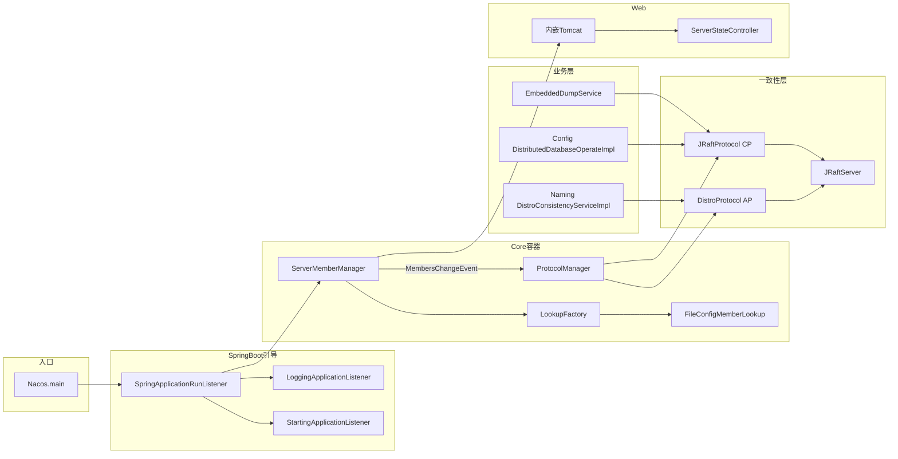
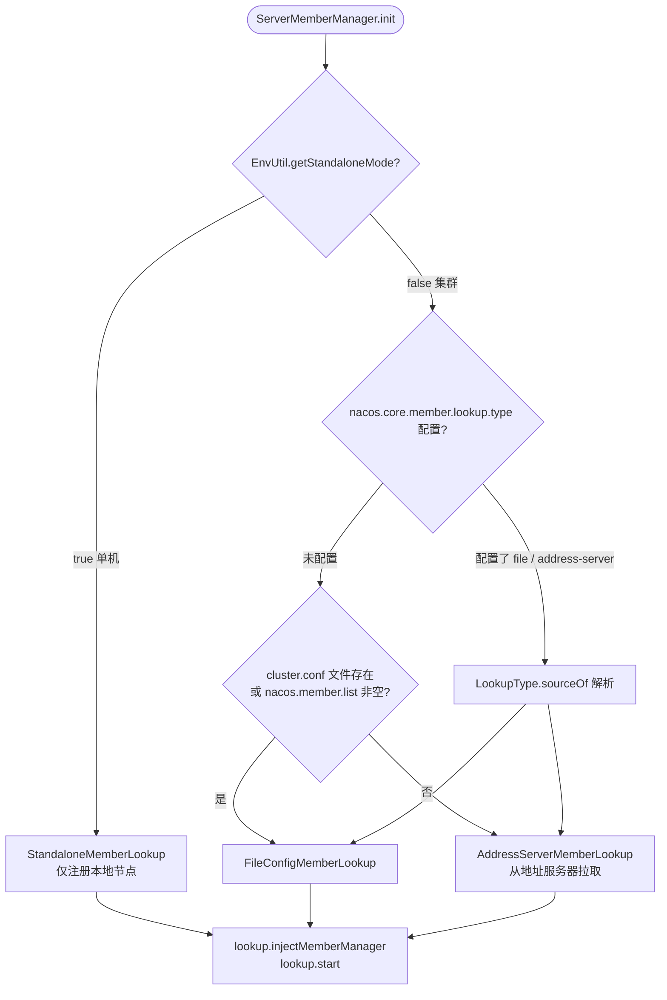
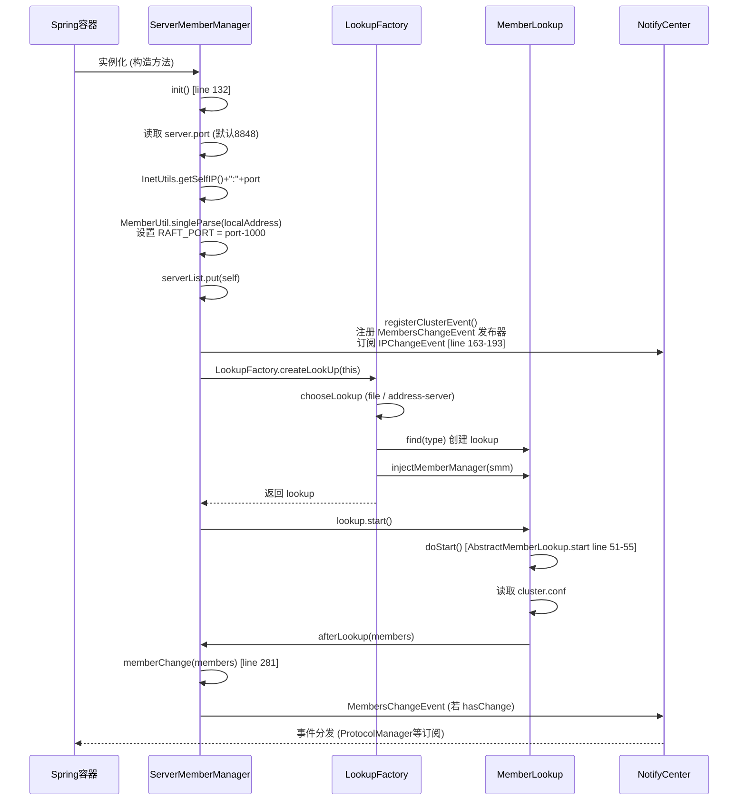
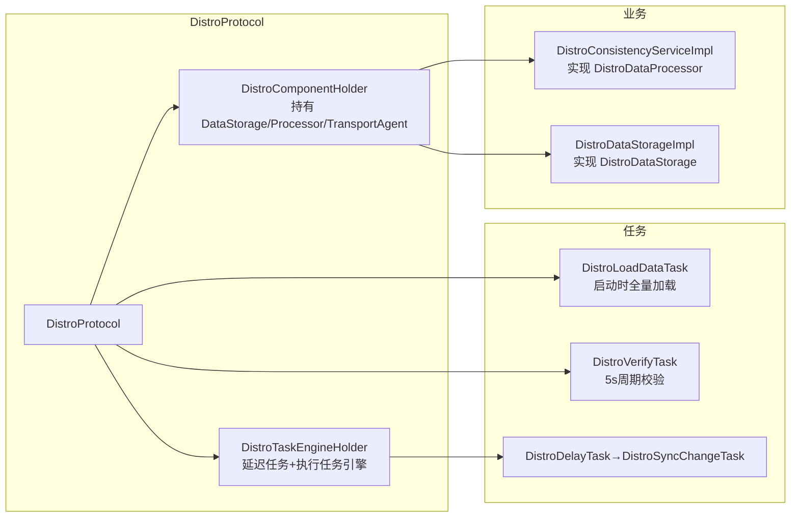
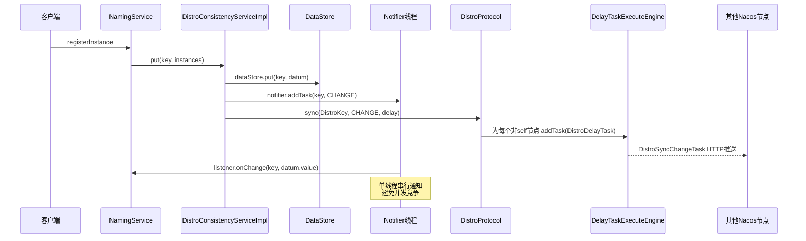
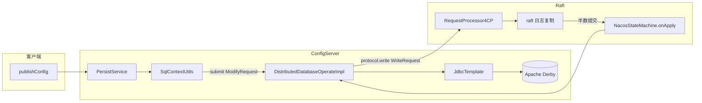
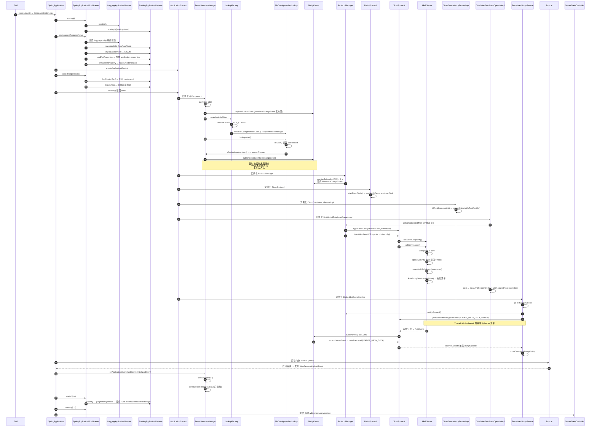

# Nacos 1.4.8 集群模式启动流程深度分析

> 基于 `nacos-cluster-1.4.8` 源码（含 8848 / 8858 / 8868 三节点本地集群样例配置）
> 所有结论均经过源码逐行核实，标注了类名、文件路径与行号

---

## 目录

1. [总览](#1-总览)
2. [启动入口与 Spring Boot 引导阶段](#2-启动入口与-spring-boot-引导阶段)
3. [集群模式识别与配置加载](#3-集群模式识别与配置加载)
4. [Core 模块：集群成员管理](#4-core-模块集群成员管理)
5. [一致性协议层（CP / AP）](#5-一致性协议层cp--ap)
6. [Naming 模块的集群集成](#6-naming-模块的集群集成)
7. [Config 模块的集群集成](#7-config-模块的集群集成)
8. [Web 容器启动与节点就绪](#8-web-容器启动与节点就绪)
9. [完整启动时序图](#9-完整启动时序图)
10. [关键配置项与端口速查](#10-关键配置项与端口速查)
11. [启动阶段流程图](#11-启动阶段流程图)
12. [总结与设计要点](#12-总结与设计要点)

---

## 1. 总览

Nacos 1.4.8 Server 是一个标准的 Spring Boot 应用，但在 Spring Boot 生命周期之上叠加了 **集群成员管理 + 双一致性协议（CP Raft / AP Distro）** 的复杂初始化逻辑。整个集群启动可归纳为 6 个阶段：

| 阶段 | 关键组件 | 触发时机 |
|------|----------|----------|
| ① 引导启动 | `Nacos.main()` → `SpringApplication.run` | JVM 入口 |
| ② 环境准备 | `SpringApplicationRunListener` + 两个 `NacosApplicationListener` | Spring Boot 启动早期 |
| ③ Bean 装配 | `ServerMemberManager` / `ProtocolManager` / `DistroProtocol` 等被 Spring 容器实例化 | ApplicationContext 刷新 |
| ④ 协议启动 | `JRaftServer.start()` / Distro 加载与校验任务 | 业务模块触发 `getCpProtocol()`/`getApProtocol()` |
| ⑤ Web 就绪 | 内嵌 Tomcat 启动 → `WebServerInitializedEvent` | Tomcat 启动后 |
| ⑥ 集群同步 | MemberInfoReportTask、DistroVerifyTask、Raft 心跳 | 定时调度 |

### 整体架构



---

## 2. 启动入口与 Spring Boot 引导阶段

### 2.1 入口类

`console/src/main/java/com/alibaba/nacos/Nacos.java:29-37`

```java
@SpringBootApplication(scanBasePackages = "com.alibaba.nacos")
@ServletComponentScan
@EnableScheduling
public class Nacos {
    public static void main(String[] args) {
        SpringApplication.run(Nacos.class, args);
    }
}
```

- 扫描根包：`com.alibaba.nacos`，覆盖 console / core / config / naming / consistency / sys / auth / cmdb 等所有子模块
- `@ServletComponentScan`：注册 Filter（AuthFilter、XssFilter、TrafficReviseFilter 等）与 Servlet
- `@EnableScheduling`：开启 `@Scheduled` 定时任务支持

### 2.2 core 模块的 spring.factories

`core/src/main/resources/META-INF/spring.factories`

```properties
# ApplicationListener
org.springframework.context.ApplicationListener=\
com.alibaba.nacos.core.code.StandaloneProfileApplicationListener
# SpringApplicationRunListener
org.springframework.boot.SpringApplicationRunListener=\
com.alibaba.nacos.core.code.SpringApplicationRunListener
```

> **重要修正**：core 模块**只**通过 `spring.factories` 注册了 2 个组件。`LoggingApplicationListener` 和 `StartingApplicationListener` 并不直接通过 `spring.factories` 注册，而是由自定义 `SpringApplicationRunListener` 在内部以代码方式聚合调用（详见 2.3）。

### 2.3 自定义 SpringApplicationRunListener（聚合调度两个 Nacos 监听器）

`core/src/main/java/com/alibaba/nacos/core/code/SpringApplicationRunListener.java:38-115`

```java
public class SpringApplicationRunListener
        implements org.springframework.boot.SpringApplicationRunListener, Ordered {

    private final List<NacosApplicationListener> nacosApplicationListeners = new ArrayList<>();

    {
        nacosApplicationListeners.add(new LoggingApplicationListener());
        nacosApplicationListeners.add(new StartingApplicationListener());
    }

    @Override public void starting(ConfigurableBootstrapContext ctx)            { foreach(NacosApplicationListener::starting); }
    @Override public void environmentPrepared(ConfigurableBootstrapContext ctx, ConfigurableEnvironment env) { foreach(::environmentPrepared); }
    @Override public void contextPrepared(ConfigurableApplicationContext ctx)  { foreach(::contextPrepared); }
    @Override public void contextLoaded(ConfigurableApplicationContext ctx)     { foreach(::contextLoaded); }
    @Override public void started(ConfigurableApplicationContext ctx)          { foreach(::started); }
    @Override public void running(ConfigurableApplicationContext ctx)           { foreach(::running); }
    @Override public void failed(ConfigurableApplicationContext ctx, Throwable ex) { foreach(::failed); }

    @Override public int getOrder() { return HIGHEST_PRECEDENCE; }
}
```

- 优先级 `HIGHEST_PRECEDENCE`，在 Spring 默认的 `EventPublishingRunListener` 之前执行
- 这保证了 Nacos 的环境/日志/工作目录准备工作先于 Spring Boot 内置监听器执行

### 2.4 单机 Profile 激活：StandaloneProfileApplicationListener

`core/src/main/java/com/alibaba/nacos/core/code/StandaloneProfileApplicationListener.java:40-65`

```java
public class StandaloneProfileApplicationListener
        implements ApplicationListener<ApplicationEnvironmentPreparedEvent>, PriorityOrdered {

    @Override
    public void onApplicationEvent(ApplicationEnvironmentPreparedEvent event) {
        ConfigurableEnvironment environment = event.getEnvironment();
        if (environment.getProperty(STANDALONE_MODE_PROPERTY_NAME, boolean.class, false)) {
            environment.addActiveProfile(STANDALONE_SPRING_PROFILE);  // 激活 "standalone" profile
        }
    }
    @Override public int getOrder() { return HIGHEST_PRECEDENCE; }
}
```

- 仅当 `-Dnacos.standalone=true` 时激活 `standalone` Spring Profile
- 集群模式不激活该 profile，对应单机专属 Bean（如内嵌 Derby 直连）不会装配

### 2.5 LoggingApplicationListener：日志系统初始化

`core/src/main/java/com/alibaba/nacos/core/listener/LoggingApplicationListener.java:33-80`

```java
@Override
public void environmentPrepared(ConfigurableEnvironment environment) {
    if (!environment.containsProperty(CONFIG_PROPERTY)) {
        // 默认使用 classpath:META-INF/logback/nacos.xml
        System.setProperty(CONFIG_PROPERTY, DEFAULT_NACOS_LOGBACK_LOCATION);
    }
}
```

- 仅在 `environmentPrepared` 阶段做一件事：若 Spring 环境没有指定 `logging.config`，则把 Nacos 自带的 logback 配置注入到系统属性中
- 后续 Spring Boot 的 `LoggingApplicationListener` 读取该系统属性完成日志系统初始化

### 2.6 StartingApplicationListener：核心环境准备器

`core/src/main/java/com/alibaba/nacos/core/listener/StartingApplicationListener.java:53-249`

这是启动流程中**最关键的引导监听器**，按 Spring Boot 阶段切分职责：

| Spring Boot 阶段 | StartingApplicationListener 动作 | 行号 |
|------------------|----------------------------------|------|
| `environmentPrepared` | ① `makeWorkDir()` 创建 `logs/conf/data` 三大工作目录<br>② `injectEnvironment()` 把 Environment 注入 `EnvUtil`<br>③ `loadPreProperties()` 加载 `application.properties`，注册 `WatchFileCenter` 文件监听<br>④ `initSystemProperty()` 设置 `nacos.mode`、`nacos.function.mode`、`nacos.local.ip` 系统属性 | 77-85, 201-211, 135-165, 167-182 |
| `contextPrepared` | ① `logClusterConf()` 集群模式下读取并打印 `cluster.conf`<br>② `logStarting()` 启动"Nacos is starting..."周期日志（每 1 秒） | 88-92, 184-225 |
| `started` | `judgeStorageMode()` 判定并打印存储模式（外部 MySQL / 内嵌 Derby） | 100-106, 227-248 |
| `failed` | 关闭线程池、文件监听、NotifyCenter，并 `context.close()` | 113-129 |

关键代码：

```java
// StartingApplicationListener.java:167-182
private void initSystemProperty() {
    if (EnvUtil.getStandaloneMode()) {
        System.setProperty(MODE_PROPERTY_KEY_STAND_MODE, "stand alone");
    } else {
        System.setProperty(MODE_PROPERTY_KEY_STAND_MODE, "cluster");   // ← 集群模式标志
    }
    // ... function_mode 设置
    System.setProperty(LOCAL_IP_PROPERTY_KEY, InetUtils.getSelfIP());
}

// StartingApplicationListener.java:227-248
private void judgeStorageMode(ConfigurableEnvironment env) {
    boolean useExternalStorage = ("mysql".equalsIgnoreCase(env.getProperty("spring.datasource.platform", "")));
    if (!useExternalStorage) {
        boolean embeddedStorage = EnvUtil.getStandaloneMode() || Boolean.getBoolean("embeddedStorage");
        if (!embeddedStorage) {
            useExternalStorage = true;   // 集群模式 + 未启用 embeddedStorage → 强制外部存储
        }
    }
    LOGGER.info("Nacos started successfully in {} mode. use {} storage",
            System.getProperty(MODE_PROPERTY_KEY_STAND_MODE), useExternalStorage ? "external" : "embedded");
}
```

> **关键决策点**：集群模式默认必须使用外部 MySQL；只有显式开启 `-DembeddedStorage=true` 才会在集群模式下启用 Raft + 内嵌 Derby 的分布式存储引擎。

---

## 3. 集群模式识别与配置加载

### 3.1 单机 / 集群判定

`sys/src/main/java/com/alibaba/nacos/sys/env/EnvUtil.java`

```java
public static boolean getStandaloneMode() {
    if (Objects.isNull(isStandalone)) {
        isStandalone = Boolean.getBoolean(Constants.STANDALONE_MODE_PROPERTY_NAME);  // -Dnacos.standalone
    }
    return isStandalone;
}
```

- 系统属性 `nacos.standalone=true` → 单机
- 未设置或 `false` → **集群**（默认）

### 3.2 cluster.conf 路径与读取

`EnvUtil`：

```java
public static String getClusterConfFilePath() {
    return Paths.get(getNacosHome(), "conf", "cluster.conf").toString();
}

public static List<String> readClusterConf() throws IOException {
    try (Reader reader = new InputStreamReader(new FileInputStream(getClusterConfFilePath()), UTF_8)) {
        return analyzeClusterConf(reader);                            // 优先读 ${nacos.home}/conf/cluster.conf
    } catch (FileNotFoundException ignore) {
        List<String> tmp = new ArrayList<>();
        String clusters = EnvUtil.getMemberList();                   // 回退到 -Dnacos.member.list
        if (StringUtils.isNotBlank(clusters)) {
            for (String item : clusters.split(",")) tmp.add(item.trim());
        }
        return tmp;
    }
}
```

样例 `nacos-cluster/nacos-8848/conf/cluster.conf`（已通过源码目录核实）：

```text
#2026-08-05T20:49:51.775
127.0.0.1:8848
127.0.0.1:8858
127.0.0.1:8868
```

### 3.3 寻址模式选择决策

`core/src/main/java/com/alibaba/nacos/core/cluster/lookup/LookupFactory.java:51-121`



> **关键**：默认情况下，本地存在 `cluster.conf` 即走 `FileConfigMemberLookup`；若没有且未配置 `nacos.member.list`，则走 `AddressServerMemberLookup`（适用于 K8s 等动态环境，依赖 Nacos 自带的 address 模块）。

---

## 4. Core 模块：集群成员管理

### 4.1 ServerMemberManager 总览

`core/src/main/java/com/alibaba/nacos/core/cluster/ServerMemberManager.java:79-518`

- 装配方式：`@Component(value = "serverMemberManager")`
- 实现：`ApplicationListener<WebServerInitializedEvent>`
- 核心字段：

| 字段 | 类型 | 行号 | 作用 |
|------|------|------|------|
| `serverList` | `ConcurrentSkipListMap<String, Member>` | 88 | 集群节点字典（按地址排序） |
| `self` | `Member` | 113 | 本地节点信息 |
| `lookup` | `MemberLookup` | 108 | 寻址器实例 |
| `memberAddressInfos` | `Set<String>` | 118 | 健康节点地址集合 |
| `infoReportTask` | `MemberInfoReportTask` | 123 | 节点信息上报任务 |

### 4.2 ServerMemberManager 初始化流程



关键代码：

```java
// ServerMemberManager.java:125-156
public ServerMemberManager(ServletContext servletContext) throws Exception {
    this.serverList = new ConcurrentSkipListMap<>();
    EnvUtil.setContextPath(servletContext.getContextPath());
    init();
}

protected void init() throws NacosException {
    this.port = EnvUtil.getProperty("server.port", Integer.class, 8848);
    this.localAddress = InetUtils.getSelfIP() + ":" + port;
    this.self = MemberUtil.singleParse(this.localAddress);
    this.self.setExtendVal(MemberMetaDataConstants.VERSION, VersionUtils.version);
    serverList.put(self.getAddress(), self);

    registerClusterEvent();          // 注册事件
    initAndStartLookup();            // 创建并启动寻址
    if (serverList.isEmpty()) throw new NacosException(...);
}

private void initAndStartLookup() throws NacosException {
    this.lookup = LookupFactory.createLookUp(this);
    this.lookup.start();
}
```

### 4.3 RAFT 端口计算（关键修正）

`core/src/main/java/com/alibaba/nacos/core/cluster/MemberUtil.java:85-92`

```java
extendInfo.put(MemberMetaDataConstants.RAFT_PORT, String.valueOf(calculateRaftPort(target)));
...
public static int calculateRaftPort(Member member) {
    return member.getPort() - 1000;   // ← 8848 → 7848
}
```

> **重要修正**：Raft 协议端口 = **HTTP 端口 - 1000**。本样例 8848/8858/8868 对应 Raft 端口 7848/7858/7868（部分二手资料误传为 +1000，源码确证是减号）。

### 4.4 成员变更核心：memberChange

`ServerMemberManager.java:281-345`

```java
synchronized boolean memberChange(Collection<Member> members) {
    if (members == null || members.isEmpty()) return false;

    boolean isContainSelfIp = members.stream()
            .anyMatch(ip -> Objects.equals(localAddress, ip.getAddress()));
    if (!isContainSelfIp) {
        isInIpList = false;
        members.add(this.self);   // 自己不在列表里也强补进去
    }

    boolean hasChange = members.size() != serverList.size();
    ConcurrentSkipListMap<String, Member> tmpMap = new ConcurrentSkipListMap<>();
    Set<String> tmpAddressInfo = new ConcurrentHashSet<>();
    for (Member member : members) {
        if (!serverList.containsKey(address)) {
            hasChange = true;
            member.setState(NodeState.DOWN);   // 新节点先 DOWN，等心跳上报后转 UP
        } else {
            member.setState(serverList.get(address).getState());
        }
        tmpMap.put(address, member);
        if (NodeState.UP.equals(member.getState())) tmpAddressInfo.add(address);
    }
    serverList = tmpMap;
    memberAddressInfos = tmpAddressInfo;

    if (hasChange) {
        MemberUtil.syncToFile(allMembers());          // 持久化到 cluster.conf
        Event event = MembersChangeEvent.builder().members(allMembers()).build();
        NotifyCenter.publishEvent(event);             // ← 触发协议层 memberChange
    }
    return hasChange;
}
```

- 同步块保证事件按序发布
- `MembersChangeEvent` 是触发 `ProtocolManager` 重新通知 CP/AP 协议的关键事件

### 4.5 FileConfigMemberLookup：cluster.conf 寻址实现

`core/src/main/java/com/alibaba/nacos/core/cluster/lookup/FileConfigMemberLookup.java:39-83`

```java
public class FileConfigMemberLookup extends AbstractMemberLookup {

    private FileWatcher watcher = new FileWatcher() {
        @Override public void onChange(FileChangeEvent event) { readClusterConfFromDisk(); }
        @Override public boolean interest(String context) { return StringUtils.contains(context, "cluster.conf"); }
    };

    @Override
    public void doStart() throws NacosException {
        readClusterConfFromDisk();
        WatchFileCenter.registerWatcher(EnvUtil.getConfPath(), watcher);   // inotify 监听 cluster.conf
    }

    private void readClusterConfFromDisk() {
        List<String> tmp = EnvUtil.readClusterConf();
        Collection<Member> tmpMembers = MemberUtil.readServerConf(tmp);
        afterLookup(tmpMembers);   // → 调用 ServerMemberManager.memberChange
    }
}
```

`AbstractMemberLookup.java:35-55` 模板方法：

```java
@Override public void afterLookup(Collection<Member> members) {
    this.memberManager.memberChange(members);   // ← 寻址结果回写
}

@Override public void start() throws NacosException {
    if (start.compareAndSet(false, true)) doStart();   // 一次性启动
}
```

### 4.6 节点信息上报与健康检查：MemberInfoReportTask

`ServerMemberManager.java:443-516`

```java
class MemberInfoReportTask extends Task {
    private int cursor = 0;

    @Override
    protected void executeBody() {
        List<Member> members = allMembersWithoutSelf();
        if (members.isEmpty()) return;
        this.cursor = (this.cursor + 1) % members.size();   // 轮询目标节点
        Member target = members.get(cursor);

        String url = HttpUtils.buildUrl(false, target.getAddress(),
                EnvUtil.getContextPath(), Commons.NACOS_CORE_CONTEXT, "/cluster/report");

        asyncRestTemplate.post(url, header, Query.EMPTY, getSelf(),
                reference.getType(), new Callback<String>() {
            @Override public void onReceive(RestResult<String> result) {
                if (result.ok()) MemberUtil.onSuccess(ServerMemberManager.this, target);
                else             MemberUtil.onFail(ServerMemberManager.this, target);
            }
            @Override public void onError(Throwable t) { MemberUtil.onFail(...); }
        });
    }

    @Override protected void after() {
        GlobalExecutor.scheduleByCommon(this, 2_000L);   // 每 2 秒一次
    }
}
```

- 通过 HTTP `/nacos/v1/core/cluster/report` 上报自身元数据
- 接收方据此更新本地缓存的 member 状态，触发 `MembersChangeEvent`（仅当 `isBasicInfoChanged`）

### 4.7 WebServerInitializedEvent：节点 UP 与定时上报启动

`ServerMemberManager.java:389-398`

```java
@Override
public void onApplicationEvent(WebServerInitializedEvent event) {
    getSelf().setState(NodeState.UP);                              // Tomcat 启动后才标 UP
    if (!EnvUtil.getStandaloneMode()) {
        GlobalExecutor.scheduleByCommon(this.infoReportTask, 5_000L);  // 集群模式 5 秒后启动上报
    }
    EnvUtil.setPort(event.getWebServer().getPort());
    EnvUtil.setLocalAddress(this.localAddress);
    Loggers.CLUSTER.info("This node is ready to provide external services");
}
```

> 这是关键的"集群就绪"分水岭——只有 Tomcat 起来后才认为自身可对外服务。

---

## 5. 一致性协议层（CP / AP）

### 5.1 ProtocolManager：统一协议管理器

`core/src/main/java/com/alibaba/nacos/core/distributed/ProtocolManager.java:47-163`

```java
@Component(value = "ProtocolManager")
public class ProtocolManager extends MemberChangeListener implements DisposableBean {

    private CPProtocol cpProtocol;
    private APProtocol apProtocol;
    private final ServerMemberManager memberManager;
    private boolean apInit = false;
    private boolean cpInit = false;

    public ProtocolManager(ServerMemberManager memberManager) {
        this.memberManager = memberManager;
        NotifyCenter.registerSubscriber(this);    // ← 订阅 MembersChangeEvent
    }

    // 懒加载：首次被业务模块调用时才初始化
    public CPProtocol getCpProtocol() {
        synchronized (this) {
            if (!cpInit) { initCPProtocol(); cpInit = true; }
        }
        return cpProtocol;
    }
    public APProtocol getApProtocol() {
        synchronized (this) {
            if (!apInit) { initAPProtocol(); apInit = true; }
        }
        return apProtocol;
    }

    private void initAPProtocol() {
        ApplicationUtils.getBeanIfExist(APProtocol.class, protocol -> {
            Class configType = ClassUtils.resolveGenericType(protocol.getClass());
            Config config = (Config) ApplicationUtils.getBean(configType);
            injectMembers4AP(config);                  // 注入 self + others
            protocol.init(config);                     // → DistroProtocol.init
            this.apProtocol = protocol;
        });
    }
    // initCPProtocol 同理

    // 成员变更触发协议层重新配置
    @Override
    public void onEvent(MembersChangeEvent event) {
        if (Objects.nonNull(apProtocol))
            ProtocolExecutor.apMemberChange(() -> apProtocol.memberChange(toAPMembersInfo(event.getMembers())));
        if (Objects.nonNull(cpProtocol))
            ProtocolExecutor.cpMemberChange(() -> cpProtocol.memberChange(toCPMembersInfo(event.getMembers())));
    }
}
```

要点：

- **懒加载**：CP/AP 协议在业务模块第一次调用 `getCpProtocol()`/`getApProtocol()` 时才初始化
- 构造方法只做事件订阅，不主动启动协议
- 成员变更通过 `ProtocolExecutor` 单线程池隔离通知，避免互相阻塞

### 5.2 AP 协议：DistroProtocol

`core/src/main/java/com/alibaba/nacos/core/distributed/distro/DistroProtocol.java:43-209`

```java
@Component
public class DistroProtocol {

    public DistroProtocol(ServerMemberManager memberManager,
                          DistroComponentHolder distroComponentHolder,
                          DistroTaskEngineHolder distroTaskEngineHolder,
                          DistroConfig distroConfig) {
        this.memberManager = memberManager;
        this.distroComponentHolder = distroComponentHolder;
        this.distroTaskEngineHolder = distroTaskEngineHolder;
        this.distroConfig = distroConfig;
        startDistroTask();   // ← 构造方法末尾立即启动
    }

    private void startDistroTask() {
        if (EnvUtil.getStandaloneMode()) { isInitialized = true; return; }   // 单机直接跳过
        startVerifyTask();   // 周期校验任务
        startLoadTask();     // 启动时全量数据加载
    }

    private void startLoadTask() {
        DistroCallback loadCallback = new DistroCallback() {
            @Override public void onSuccess()  { isInitialized = true; }
            @Override public void onError(Throwable t) { isInitialized = false; }
        };
        GlobalExecutor.submitLoadDataTask(
            new DistroLoadDataTask(memberManager, distroComponentHolder, distroConfig, loadCallback));
    }

    private void startVerifyTask() {
        GlobalExecutor.schedulePartitionDataTimedSync(
            new DistroVerifyTask(memberManager, distroComponentHolder),
            distroConfig.getVerifyIntervalMillis());   // 默认 5 秒一次
    }

    // 数据变更后异步同步到所有非自身节点
    public void sync(DistroKey distroKey, DataOperation action, long delay) {
        for (Member each : memberManager.allMembersWithoutSelf()) {
            DistroKey distroKeyWithTarget = new DistroKey(
                distroKey.getResourceKey(), distroKey.getResourceType(), each.getAddress());
            DistroDelayTask distroDelayTask = new DistroDelayTask(distroKeyWithTarget, action, delay);
            distroTaskEngineHolder.getDelayTaskExecuteEngine().addTask(distroKeyWithTarget, distroDelayTask);
        }
    }
}
```

Distro 协议组件关系：



### 5.3 CP 协议：JRaftProtocol + JRaftServer

#### 5.3.1 JRaftProtocol.init

`core/src/main/java/com/alibaba/nacos/core/distributed/raft/JRaftProtocol.java:92-159`

```java
public class JRaftProtocol extends AbstractConsistencyProtocol<RaftConfig, RequestProcessor4CP>
        implements CPProtocol<RaftConfig, RequestProcessor4CP> {

    public JRaftProtocol(ServerMemberManager memberManager) throws Exception {
        this.memberManager = memberManager;
        this.raftServer = new JRaftServer();
        this.jRaftMaintainService = new JRaftMaintainService(raftServer);
    }

    @Override
    public void init(RaftConfig config) {
        if (initialized.compareAndSet(false, true)) {
            this.raftConfig = config;
            NotifyCenter.registerToSharePublisher(RaftEvent.class);
            this.raftServer.init(this.raftConfig);   // 解析 selfIp / 选举超时 / cliService
            this.raftServer.start();                  // 启动 RPC server + createMultiRaftGroup

            // 订阅 RaftEvent，把 leader/term 信息注入 ProtocolMetaData
            NotifyCenter.registerSubscriber(new Subscriber<RaftEvent>() {
                @Override public void onEvent(RaftEvent event) {
                    Map<String, Object> properties = new HashMap<>();
                    MapUtils.putIfValNoEmpty(properties, MetadataKey.LEADER_META_DATA, event.getLeader());
                    MapUtils.putIfValNoNull(properties, MetadataKey.TERM_META_DATA, event.getTerm());
                    value.put(event.getGroupId(), properties);
                    metaData.load(value);
                    injectProtocolMetaData(metaData);
                }
                @Override public Class<? extends Event> subscribeType() { return RaftEvent.class; }
            });
        }
    }

    @Override
    public void addRequestProcessors(Collection<RequestProcessor4CP> processors) {
        raftServer.createMultiRaftGroup(processors);   // 为每个 processor 创建独立 raft group
    }
}
```

#### 5.3.2 JRaftServer 启动流程

`core/src/main/java/com/alibaba/nacos/core/distributed/raft/JRaftServer.java:105-282`

```java
void init(RaftConfig config) {
    this.raftConfig = config;
    RaftExecutor.init(config);

    final String self = config.getSelfMember();     // ip:raftPort
    String[] info = IPUtil.splitIPPortStr(self);
    selfIp = info[0];
    selfPort = Integer.parseInt(info[1]);
    localPeerId = PeerId.parsePeer(self);

    nodeOptions = new NodeOptions();
    int electionTimeout = Math.max(
        ConvertUtils.toInt(config.getVal(RaftSysConstants.RAFT_ELECTION_TIMEOUT_MS),
                           RaftSysConstants.DEFAULT_ELECTION_TIMEOUT),    // 默认 5 秒
        RaftSysConstants.DEFAULT_ELECTION_TIMEOUT);
    nodeOptions.setElectionTimeoutMs(electionTimeout);
    nodeOptions.setSharedElectionTimer(true);    // 共享定时器
    nodeOptions.setSharedVoteTimer(true);
    nodeOptions.setSharedStepDownTimer(true);
    nodeOptions.setSharedSnapshotTimer(true);
    nodeOptions.setEnableMetrics(true);

    cliService = RaftServiceFactory.createAndInitCliService(new CliOptions());
    cliClientService = (CliClientServiceImpl) ((CliServiceImpl) cliService).getCliClientService();
}

synchronized void start() {
    if (!isStarted) {
        com.alipay.sofa.jraft.NodeManager raftNodeManager = com.alipay.sofa.jraft.NodeManager.getInstance();
        for (String address : raftConfig.getMembers()) {        // 把集群成员加到 Configuration
            PeerId peerId = PeerId.parsePeer(address);
            conf.addPeer(peerId);
            raftNodeManager.addAddress(peerId.getEndpoint());
        }
        nodeOptions.setInitialConf(conf);

        rpcServer = JRaftUtils.initRpcServer(this, localPeerId);   // 基于 bolt 的 RPC server
        if (!this.rpcServer.init(null)) throw new RuntimeException("Fail to init [RpcServer].");

        isStarted = true;
        createMultiRaftGroup(processors);   // 为每个 RequestProcessor4CP 创建 RaftGroup
    }
}

synchronized void createMultiRaftGroup(Collection<RequestProcessor4CP> processors) {
    if (!this.isStarted) { this.processors.addAll(processors); return; }

    final String parentPath = Paths.get(EnvUtil.getNacosHome(), "data/protocol/raft").toString();
    for (RequestProcessor4CP processor : processors) {
        final String groupName = processor.group();          // 如 nacos_config / nacos_naming_persistent
        if (multiRaftGroup.containsKey(groupName)) throw new DuplicateRaftGroupException(groupName);

        Configuration configuration = conf.copy();
        NodeOptions copy = nodeOptions.copy();
        JRaftUtils.initDirectory(parentPath, groupName, copy);

        NacosStateMachine machine = new NacosStateMachine(this, processor);  // 状态机委托给 processor
        copy.setFsm(machine);
        copy.setInitialConf(configuration);

        int doSnapshotInterval = ConvertUtils.toInt(
            raftConfig.getVal(RaftSysConstants.RAFT_SNAPSHOT_INTERVAL_SECS),
            RaftSysConstants.DEFAULT_RAFT_SNAPSHOT_INTERVAL_SECS);   // 默认 1800 秒
        doSnapshotInterval = CollectionUtils.isEmpty(processor.loadSnapshotOperate()) ? 0 : doSnapshotInterval;
        copy.setSnapshotIntervalSecs(doSnapshotInterval);

        RaftGroupService raftGroupService = new RaftGroupService(groupName, localPeerId, copy, rpcServer, true);
        Node node = raftGroupService.start(false);    // ← 真正启动 raft 节点，触发选举
        machine.setNode(node);
        RouteTable.getInstance().updateConfiguration(groupName, configuration);

        RaftExecutor.executeByCommon(() -> registerSelfToCluster(groupName, localPeerId, configuration));

        Random random = new Random();
        long period = nodeOptions.getElectionTimeoutMs() + random.nextInt(5 * 1000);
        RaftExecutor.scheduleRaftMemberRefreshJob(() -> refreshRouteTable(groupName),
                nodeOptions.getElectionTimeoutMs(), period, TimeUnit.MILLISECONDS);

        multiRaftGroup.put(groupName, new RaftGroupTuple(node, processor, raftGroupService, machine));
    }
}
```

关键设计点：

- **每个业务模块一个独立 raft group**（如 `nacos_config`、`nacos_naming_persistent`），互不影响
- **共享 RPC Server**：所有 raft group 复用同一个 bolt RPC server（绑定 raft 端口）
- 默认选举超时 5 秒，启动后各节点随机等待，最先超时的发起选举
- 启动后通过 `RaftEvent` 把 leader 信息回写到 `ProtocolMetaData`，业务模块可订阅此变化

#### 5.3.3 CP 选举触发时机

1. 节点启动：`raftGroupService.start(false)` 后立即开始选举
2. 心跳超时：follower 在 `electionTimeoutMs`（默认 5s）内未收到 leader 心跳，转 candidate
3. 成员变更：`ProtocolManager.onEvent` → `cpProtocol.memberChange(...)` → `JRaftProtocol.memberChange` → 重试 `raftServer.peerChange`

---

## 6. Naming 模块的集群集成

### 6.1 双一致性服务策略

Naming 同时使用 AP 与 CP：

| 数据类型 | 协议 | 实现类 | 路径 |
|----------|------|--------|------|
| 临时实例（ephemeral） | Distro (AP) | `DistroConsistencyServiceImpl` | `naming/.../consistency/ephemeral/distro/DistroConsistencyServiceImpl.java` |
| 持久化数据（服务元数据） | Raft (CP) | `RaftConsistencyServiceImpl` (已 @Deprecated) | `naming/.../consistency/persistent/raft/RaftConsistencyServiceImpl.java` |

### 6.2 DistroConsistencyServiceImpl：临时实例一致性服务

`naming/src/main/java/com/alibaba/nacos/naming/consistency/ephemeral/distro/DistroConsistencyServiceImpl.java:69-469`

```java
@DependsOn("ProtocolManager")
@Service("distroConsistencyService")
public class DistroConsistencyServiceImpl implements EphemeralConsistencyService, DistroDataProcessor {

    public DistroConsistencyServiceImpl(DistroMapper distroMapper, DataStore dataStore,
            Serializer serializer, SwitchDomain switchDomain, GlobalConfig globalConfig,
            DistroProtocol distroProtocol) {
        // 构造注入
        this.distroProtocol = distroProtocol;
    }

    @PostConstruct
    public void init() {
        GlobalExecutor.submitDistroNotifyTask(notifier);   // 启动本地数据变更通知线程
    }

    // 服务注册入口
    @Override
    public void put(String key, Record value) throws NacosException {
        onPut(key, value);                                            // 1. 本地 dataStore 写入
        distroProtocol.sync(new DistroKey(key, KeyBuilder.INSTANCE_LIST_KEY_PREFIX),
                DataOperation.CHANGE,
                globalConfig.getTaskDispatchPeriod() / 2);            // 2. 异步同步到其他节点
    }

    public void onPut(String key, Record value) {
        if (KeyBuilder.matchEphemeralInstanceListKey(key)) {
            Datum<Instances> datum = new Datum<>();
            datum.value = (Instances) value;
            datum.key = key;
            datum.timestamp.incrementAndGet();
            dataStore.put(key, datum);
        }
        if (!listeners.containsKey(key)) return;
        notifier.addTask(key, DataOperation.CHANGE);                  // 3. 触发本地 RecordListener
    }

    @Override public boolean isAvailable() {
        return isInitialized() || ServerStatus.UP.name().equals(switchDomain.getOverriddenServerStatus());
    }

    public boolean isInitialized() {
        return distroProtocol.isInitialized() || !globalConfig.isDataWarmup();
    }
}
```

注册流程时序：



### 6.3 ServiceManager.init @PostConstruct

`naming/src/main/java/com/alibaba/nacos/naming/core/ServiceManager.java:134-161`

```java
@PostConstruct
public void init() {
    GlobalExecutor.scheduleServiceReporter(new ServiceReporter(), 60000, TimeUnit.MILLISECONDS);   // 60s 服务上报
    GlobalExecutor.submitServiceUpdateManager(new UpdatedServiceProcessor());                     // 服务更新消费者

    if (emptyServiceAutoClean) {
        GlobalExecutor.scheduleServiceAutoClean(new EmptyServiceAutoClean(),
                cleanEmptyServiceDelay, cleanEmptyServicePeriod);    // 默认 delay 60s, period 20s
    }

    try {
        Loggers.SRV_LOG.info("listen for service meta change");
        consistencyService.listen(KeyBuilder.SERVICE_META_KEY_PREFIX, this);   // 订阅服务元数据变更
    } catch (NacosException e) {
        Loggers.SRV_LOG.error("listen for service meta change failed!");
    }
}
```

### 6.4 ServerStatusManager

`naming/.../cluster/ServerStatusManager.java`

- `@PostConstruct init()` 中注册 `ServerStatusUpdater`，每 5 秒刷新一次
- 状态判定：`consistencyService.isAvailable()` 为 UP，否则 DOWN；可被 `SwitchDomain.overriddenServerStatus` 强制覆盖
- Naming 客户端通过 `/nacos/v1/ns/operator/server/status` 拉取，做路由决策

---

## 7. Config 模块的集群集成

### 7.1 config 模块 spring.factories

`config/src/main/resources/META-INF/spring.factories`

```properties
org.springframework.context.ApplicationContextInitializer=\
  com.alibaba.nacos.config.server.utils.PropertyUtil
```

- 仅注册 `PropertyUtil` 作为 `ApplicationContextInitializer`，在 Spring 上下文刷新前完成配置属性绑定（如 `db.num`、`db.url` 等读取）

### 7.2 存储模式与条件装配

| 模式 | 触发条件 | 装配 Bean |
|------|----------|-----------|
| 外部 MySQL | `spring.datasource.platform=mysql` | `ExternalDataSourceServiceImpl` |
| 内嵌 Derby（单机） | `nacos.standalone=true` | `LocalDataSourceServiceImpl` + `EmbeddedDumpService` |
| 内嵌 Derby（集群） | `nacos.standalone=false` + `-DembeddedStorage=true` | `LocalDataSourceServiceImpl` + `DistributedDatabaseOperateImpl`（Raft 同步） |

判定逻辑见 `StartingApplicationListener.judgeStorageMode`（第 3.2 节已展开）。

### 7.3 DistributedDatabaseOperateImpl：Raft + Derby 强一致存储

`config/src/main/java/com/alibaba/nacos/config/server/service/repository/embedded/DistributedDatabaseOperateImpl.java:145-216`

```java
@Conditional(ConditionDistributedEmbedStorage.class)
@Component
public class DistributedDatabaseOperateImpl extends RequestProcessor4CP implements BaseDatabaseOperate {

    public DistributedDatabaseOperateImpl(ServerMemberManager memberManager,
                                          ProtocolManager protocolManager) throws Exception {
        this.memberManager = memberManager;
        this.protocol = protocolManager.getCpProtocol();    // ← 构造时即触发 CP 协议懒加载
        sqlLimiter = new SqlTypeLimiter();
        init();
    }

    protected void init() throws Exception {
        this.dataSourceService = (LocalDataSourceServiceImpl) DynamicDataSource.getInstance().getDataSource();
        this.dataSourceService.cleanAndReopenDerby();       // 集群模式下清空并重开 Derby（依赖 raft 重放）
        this.jdbcTemplate = dataSourceService.getJdbcTemplate();
        this.transactionTemplate = dataSourceService.getTransactionTemplate();

        NotifyCenter.registerToSharePublisher(RaftDbErrorEvent.class);
        NotifyCenter.registerToSharePublisher(DerbyLoadEvent.class);
        NotifyCenter.registerSubscriber(new Subscriber<RaftDbErrorEvent>() {
            @Override public void onEvent(RaftDbErrorEvent event) { dataSourceService.setHealthStatus("DOWN"); }
            @Override public Class<? extends Event> subscribeType() { return RaftDbErrorEvent.class; }
        });

        NotifyCenter.registerToPublisher(ConfigDumpEvent.class, NotifyCenter.ringBufferSize);
        NotifyCenter.registerSubscriber(new DumpConfigHandler());

        this.protocol.addRequestProcessors(Collections.singletonList(this));  // ← 注册为 CP 处理器
    }

    @Override
    public Response onApply(WriteRequest log) {
        List<ModifyRequest> sqlContext = serializer.deserialize(log.getData().toByteArray(), List.class);
        return update(transactionTemplate, jdbcTemplate, sqlContext);   // 应用 SQL 到本地 Derby
    }
}
```

数据流：



### 7.4 EmbeddedDumpService：Leader 选举后才转储

`config/src/main/java/com/alibaba/nacos/config/server/service/dump/EmbeddedDumpService.java:47-170`

```java
@Conditional(ConditionOnEmbeddedStorage.class)
@Component
public class EmbeddedDumpService extends DumpService {

    public EmbeddedDumpService(PersistService persistService, ServerMemberManager memberManager,
            ProtocolManager protocolManager) {
        super(persistService, memberManager);
        this.protocolManager = protocolManager;
    }

    @PostConstruct
    @Override
    protected void init() throws Throwable {
        if (EnvUtil.getStandaloneMode()) {                       // 单机直接 dump
            dumpOperate(processor, dumpAllProcessor, dumpAllBetaProcessor, dumpAllTagProcessor);
            return;
        }

        // 集群模式：等待成为 leader
        CPProtocol protocol = protocolManager.getCpProtocol();
        CountDownLatch waitDumpFinish = new CountDownLatch(1);

        Observer observer = new Observer() {
            @Override public void update(Observable o) {
                if (!(o instanceof ProtocolMetaData.ValueItem)) return;
                final Object arg = ((ProtocolMetaData.ValueItem) o).getData();
                GlobalExecutor.executeByCommon(() -> {
                    if (Objects.isNull(arg)) return;
                    EmbeddedStorageContextUtils.putExtendInfo(Constants.EXTEND_NEED_READ_UNTIL_HAVE_DATA, "true");
                    boolean canEnd = false;
                    for (;;) {
                        try {
                            dumpOperate(processor, dumpAllProcessor, dumpAllBetaProcessor, dumpAllTagProcessor);
                            protocol.protocolMetaData().unSubscribe(CONFIG_MODEL_RAFT_GROUP, LEADER_META_DATA, this);
                            canEnd = true;
                        } catch (Throwable ex) {
                            if (!shouldRetry(ex)) { errorReference.set(ex); canEnd = true; }
                        }
                        if (canEnd) { ThreadUtils.countDown(waitDumpFinish); break; }
                        ThreadUtils.sleep(500L);
                    }
                });
            }
        };

        protocol.protocolMetaData().subscribe(CONFIG_MODEL_RAFT_GROUP, MetadataKey.LEADER_META_DATA, observer);
        ThreadUtils.latchAwait(waitDumpFinish);    // ← 阻塞主线程，直到 leader 选举完成并 dump 成功

        if (Objects.nonNull(errorReference.get())) throw errorReference.get();
    }

    @Override
    protected boolean canExecute() {
        if (EnvUtil.getStandaloneMode()) return true;
        return protocolManager.getCpProtocol().isLeader(Constants.CONFIG_MODEL_RAFT_GROUP);
    }
}
```

> **关键设计**：Config 模块在 Raft + Derby 模式下，**只有 leader 节点才会执行配置数据的全量 dump**（避免 follower 重复加载缓存）。follower 通过 raft 日志重放保持一致。

---

## 8. Web 容器启动与节点就绪

### 8.1 内嵌 Tomcat 启动

- Spring Boot 默认使用内嵌 Tomcat，端口通过 `server.port`（默认 8848）配置
- 启动完成后 Spring 发布 `WebServerInitializedEvent`

### 8.2 Filter 与 Servlet 注册（@ServletComponentScan）

通过 `@ServletComponentScan` 自动扫描以下组件（部分）：

| 组件 | 模块 | 作用 |
|------|------|------|
| `AuthFilter` | auth | 鉴权过滤器 |
| `XssFilter` | core | XSS 防御 |
| `TrafficReviseFilter` | core | 流量控制（在 server 不健康时拒绝请求） |
| `NacosHttpSqlFilter` / `DistroFilter` | core/naming | Distro 数据同步入口 |

### 8.3 ServerStateController：状态暴露

`console/src/main/java/com/alibaba/nacos/console/controller/ServerStateController.java:34-55`

```java
@RestController
@RequestMapping("/v1/console/server")
public class ServerStateController {

    @GetMapping("/state")
    public ResponseEntity serverState() {
        Map<String, String> serverState = new HashMap<>(3);
        serverState.put("standalone_mode",
                EnvUtil.getStandaloneMode() ? EnvUtil.STANDALONE_MODE_ALONE : EnvUtil.STANDALONE_MODE_CLUSTER);
        serverState.put("function_mode", EnvUtil.getFunctionMode());
        serverState.put("version", VersionUtils.version);
        return ResponseEntity.ok().body(serverState);
    }
}
```

- 集群模式返回 `standalone_mode: "cluster"`
- 健康检查接口可被负载均衡器（如 Nginx、SLB）作为探活目标

---

## 9. 完整启动时序图



---

## 10. 关键配置项与端口速查

### 10.1 端口约定

| 端口 | 默认值 | 用途 | 来源 |
|------|--------|------|------|
| `server.port` | 8848 | HTTP 主端口 | application.properties |
| Raft 端口 | `server.port - 1000` = **7848** | bolt RPC（CP 协议通信） | `MemberUtil.calculateRaftPort:90-92` |

> 8848/8858/8868 三节点对应 Raft 端口 7848/7858/7868

### 10.2 关键系统属性

| 属性 | 默认值 | 作用 | 设置位置 |
|------|--------|------|----------|
| `nacos.standalone` | false | true=单机 / false=集群 | `EnvUtil.getStandaloneMode` |
| `nacos.home` | ~/nacos | 工作根目录 | `EnvUtil.getNacosHome` |
| `nacos.member.list` | - | 集群节点列表（逗号分隔），cluster.conf 不存在时回退 | `EnvUtil.getMemberList` |
| `nacos.core.member.lookup.type` | 自动 | 显式指定 `file` / `address-server` | `LookupFactory.LOOKUP_MODE_TYPE` |
| `embeddedStorage` | false | 集群模式启用内嵌 Derby + Raft | `StartingApplicationListener.judgeStorageMode` |
| `spring.datasource.platform` | - | `mysql` 时使用外部 MySQL | 同上 |
| `raft.election_timeout_ms` | 5000 | Raft 选举超时 | `RaftSysConstants.DEFAULT_ELECTION_TIMEOUT` |
| `raft.snapshot_interval_secs` | 1800 | Raft 快照间隔 | `RaftSysConstants.DEFAULT_RAFT_SNAPSHOT_INTERVAL_SECS` |
| `nacos.member-change-event.queue.size` | 128 | MembersChangeEvent 队列大小 | `ServerMemberManager.registerClusterEvent` |

### 10.3 关键文件路径

| 路径 | 作用 |
|------|------|
| `${nacos.home}/conf/cluster.conf` | 集群成员列表 |
| `${nacos.home}/conf/application.properties` | 主配置（被 `WatchFileCenter` 监听热更新） |
| `${nacos.home}/logs/` | 日志目录 |
| `${nacos.home}/data/protocol/raft/<group>/` | Raft 日志与快照目录 |
| `${nacos.home}/data/derby-db/` | 内嵌 Derby 数据库 |

---

## 11. 启动阶段流程图

### 11.1 Bean 装配依赖图

```mermaid
flowchart TD
    subgraph Spring引导
        R[SpringApplicationRunListener<br/>+ LoggingAL + StartingAL]
    end
    subgraph Core
        SMM[ServerMemberManager]
        LF[LookupFactory]
        FCL[FileConfigMemberLookup]
        PM[ProtocolManager]
    end
    subgraph 协议
        DP[DistroProtocol]
        RP[RaftConfig]
        JP[JRaftProtocol]
        JS[JRaftServer]
    end
    subgraph Naming
        DCS[DistroConsistencyServiceImpl<br/>@DependsOn ProtocolManager]
        SM2[ServiceManager]
        SSM[ServerStatusManager]
    end
    subgraph Config
        DDO[DistributedDatabaseOperateImpl<br/>@Conditional distributed embed]
        EDS[EmbeddedDumpService<br/>@Conditional embedded storage]
        PU[PropertyUtil<br/>ApplicationContextInitializer]
    end

    R --> SMM
    SMM --> LF --> FCL
    FCL -->|afterLookup → memberChange| SMM
    SMM -->|MembersChangeEvent| PM
    SMM --> DP
    SMM --> JP
    JP --> JS
    PM -.->|懒加载| JP
    PM -.->|懒加载| DP
    DDO -->|getCpProtocol| PM
    EDS -->|getCpProtocol| PM
    DCS --> DP
    SM2 --> DCS
```

### 11.2 启动阶段时间轴

```mermaid
gantt
    title Nacos 1.4.8 集群启动时间轴
    dateFormat X
    axisFormat %s秒
    section 引导
    SpringApplication.run     :0, 1
    environmentPrepared        :1, 2
    section 上下文
    contextPrepared            :2, 3
    Bean装配(SMM/PM)           :3, 5
    section 协议
    Distro启动+LoadDataTask    :4, 8
    JRaftServer.start          :5, 7
    Raft选举(~5s)              :7, 12
    section 业务
    Config dump(等leader)      :7, 13
    Naming服务监听              :5, 6
    section Web
    Tomcat启动                  :6, 8
    节点UP(WebServerInit)      :8, 9
    section 后台
    MemberInfoReportTask(2s)   :9, 100
    DistroVerifyTask(5s)       :9, 100
```



---

## 12. 总结与设计要点

### 12.1 关键设计哲学

1. **CP/AP 双协议并存**：根据业务特性选择
   - 配置数据（强一致）→ Raft
   - 服务发现（高可用）→ Distro
   - 协议互不影响，单协议故障不波及另一个

2. **懒加载协议**：`ProtocolManager.getCpProtocol()/getApProtocol()` 在业务模块首次需要时才真正启动协议，避免无用启动开销

3. **每个业务模块独立 Raft Group**：`nacos_config`、`nacos_naming_persistent` 等分组互不影响，单模块状态机异常不会阻塞其他模块

4. **共享 RPC Server**：所有 raft group 复用同一个 bolt RpcServer（基于 raft 端口），减少端口占用与连接开销

5. **Leader 才执行重活**：Config 模块只在 leader 节点执行全量 dump，follower 通过 raft 日志重放保持一致；这避免了多节点重复加载缓存

6. **事件驱动解耦**：`NotifyCenter` 作为事件总线，`ServerMemberManager`、`ProtocolManager`、业务模块通过订阅 `MembersChangeEvent` 解耦

7. **Web 就绪才标 UP**：`self.setState(UP)` 在 `WebServerInitializedEvent` 后才设置，避免节点未就绪就被路由

### 12.2 启动顺序关键约束

| 约束 | 实现机制 |
|------|----------|
| `ProtocolManager` 早于 `DistroConsistencyServiceImpl` | `@DependsOn("ProtocolManager")` |
| `ServerMemberManager` 早于 `ProtocolManager` | 构造参数注入 |
| `JRaftServer.start()` 在 `addRequestProcessors` 之前 | `JRaftProtocol.init` 内 `raftServer.start()` 先执行 |
| `DistributedDatabaseOperateImpl.init()` 阻塞 leader 选举完成 | `CountDownLatch + Observer` 等待 `LEADER_META_DATA` |
| Tomcat 就绪后才标记节点 UP | `ApplicationListener<WebServerInitializedEvent>` |

### 12.3 与 2.x 版本的核心差异

- 1.4.8 使用 **HTTP + bolt RPC**，未使用 gRPC（2.x 才引入 gRPC）
- 1.4.8 仍保留 `RaftConsistencyServiceImpl`（基于自研 Raft，已 `@Deprecated`）和 `DistroConsistencyServiceImpl` 双轨
- 1.4.8 的 Distro 协议数据传输基于 HTTP，2.x 后逐步切到 gRPC

### 12.4 启动失败排查清单

| 现象 | 可能原因 | 排查点 |
|------|----------|--------|
| 启动卡住无输出 | Raft 选举超时 / leader 选不出 | 检查 `cluster.conf` 节点是否都可达、raft 端口（7848）是否开放 |
| `cannot get serverlist, so exit` | cluster.conf 不存在且未配 `nacos.member.list` | 检查 `${nacos.home}/conf/cluster.conf` |
| Config 服务一直 DOWN | leader 节点 dump 失败 | 查看日志 `nacos.log` 中 dump 异常，确认 Derby 数据目录权限 |
| 节点状态一直 DOWN | `MemberInfoReportTask` 失败 | 检查 `/cluster/report` HTTP 互通，目标节点 8848 是否可达 |
| 多次重试 Raft 同步失败 | raft 端口冲突或防火墙 | 确认 7848/7858/7868 端口互通 |

---

## 附录：核心类速查表

| 模块 | 类名 | 路径 | 关键行号 |
|------|------|------|----------|
| 入口 | `Nacos` | `console/.../Nacos.java` | 32-37 |
| 引导 | `SpringApplicationRunListener` | `core/.../code/SpringApplicationRunListener.java` | 38-115 |
| 引导 | `StandaloneProfileApplicationListener` | `core/.../code/StandaloneProfileApplicationListener.java` | 40-65 |
| 引导 | `LoggingApplicationListener` | `core/.../listener/LoggingApplicationListener.java` | 33-80 |
| 引导 | `StartingApplicationListener` | `core/.../listener/StartingApplicationListener.java` | 53-249 |
| 集群 | `ServerMemberManager` | `core/.../cluster/ServerMemberManager.java` | 79-518 |
| 集群 | `LookupFactory` | `core/.../cluster/lookup/LookupFactory.java` | 35-181 |
| 集群 | `FileConfigMemberLookup` | `core/.../cluster/lookup/FileConfigMemberLookup.java` | 39-83 |
| 集群 | `AbstractMemberLookup` | `core/.../cluster/AbstractMemberLookup.java` | 29-62 |
| 集群 | `MemberUtil` (RAFT_PORT 计算) | `core/.../cluster/MemberUtil.java` | 85-92 |
| 协议 | `ProtocolManager` | `core/.../distributed/ProtocolManager.java` | 47-163 |
| 协议 | `DistroProtocol` | `core/.../distributed/distro/DistroProtocol.java` | 43-209 |
| 协议 | `JRaftProtocol` | `core/.../distributed/raft/JRaftProtocol.java` | 92-227 |
| 协议 | `JRaftServer` | `core/.../distributed/raft/JRaftServer.java` | 105-282 |
| Naming | `DistroConsistencyServiceImpl` | `naming/.../consistency/ephemeral/distro/DistroConsistencyServiceImpl.java` | 69-469 |
| Naming | `ServiceManager` | `naming/.../core/ServiceManager.java` | 134-161 |
| Config | `DistributedDatabaseOperateImpl` | `config/.../service/repository/embedded/DistributedDatabaseOperateImpl.java` | 145-216 |
| Config | `EmbeddedDumpService` | `config/.../service/dump/EmbeddedDumpService.java` | 47-170 |
| Web | `ServerStateController` | `console/.../controller/ServerStateController.java` | 34-55 |

---

*本文档基于 nacos-cluster-1.4.8 源码逐行核实，所有行号与代码均与源码对应。如发现偏差请以源码为准。*
