# Spring Cloud Bootstrap 启动流程详解

> 基于 spring-cloud-context 2.2.9.RELEASE + Spring Cloud Alibaba Nacos Config 2.2.10 + Spring Boot 2.2.x 源码。本文是 `@RefreshScope注解实现原理.md` 第 4.1 节"重新触发 bootstrap 流程"的延伸阅读，与 `Nacos客户端配置变更实现原理.md` 互补。

---

## 一、Bootstrap 是什么

### 1.1 一句话定位

**Bootstrap 是 Spring Cloud 在 Spring Boot 启动流程之前插入的一段"父上下文初始化"流程**，专门用来加载外部配置中心（Nacos/Apollo/Consul）的配置，把这些配置注入到 `Environment`，让后续主上下文启动时 `@Value`、`@ConfigurationProperties` 能拿到远程配置值。

### 1.2 为什么需要它

Spring Boot 原生只从本地 `application.yml`、`application-{profile}.yml`、命令行参数等加载配置。但微服务场景下，配置存在远程配置中心，**主上下文启动前必须先把远程配置塞进 Environment**，否则：

- `@Value("${db.url}")` 拿不到值（值在 Nacos 上）。
- `@ConfigurationProperties` 绑定失败。
- 数据源、连接池等 Bean 因缺少配置无法初始化。

Bootstrap 就是为了**在主上下文看到 Environment 之前，把远程配置"前置"进 Environment**。

### 1.3 核心思路

Spring Cloud 的解法很巧妙：**在主上下文之前，先启动一个迷你 context（bootstrap context），它专门跑配置加载逻辑，加载完后把配置合并进主 context 的 Environment**。

```
Spring Boot 启动
       │
       ▼
  ApplicationEnvironmentPreparedEvent  ← BootstrapApplicationListener 监听这个事件
       │
       ▼
  创建 bootstrap context（父上下文）
       │
       ▼
  bootstrap context 跑配置加载（PropertySourceLocator.locate）
       │
       ▼
  远程配置注入 Environment
       │
       ▼
  主 context 启动（看到已含远程配置的 Environment）
```

---

## 二、关键角色与职责

| 角色 | 所属 | 职责 |
|------|------|------|
| `BootstrapApplicationListener` | spring-cloud-context | 监听启动事件，**触发 bootstrap** |
| `BootstrapConfiguration` | spring.factories 标记 | **bootstrap context 的配置类集合** |
| `PropertySourceBootstrapConfiguration` | spring-cloud-context | **聚合所有 PropertySourceLocator**，把它们的配置塞进 Environment |
| `PropertySourceLocator` | spring-cloud-context | **配置加载抽象**，子类实现 `locate()` 拉具体配置源 |
| `NacosConfigBootstrapConfiguration` | spring-cloud-alibaba | Nacos 的 `BootstrapConfiguration`，注册 `NacosPropertySourceLocator` |
| `NacosPropertySourceLocator` | spring-cloud-alibaba | **从 Nacos 拉配置** 的具体实现 |
| `bootstrap context` | 运行时实例 | 父上下文，跑完配置加载后被保留为 parent |
| `主 context` | 运行时实例 | 业务上下文，继承 bootstrap 的配置 |

---

## 三、Bootstrap 触发入口：`BootstrapApplicationListener`

### 3.1 监听什么事件

```java
// BootstrapApplicationListener.java
public class BootstrapApplicationListener
        implements ApplicationListener<ApplicationEnvironmentPreparedEvent>, Ordered {

    public static final String BOOTSTRAP_PROPERTY_SOURCE_NAME = "bootstrap";

    @Override
    public void onApplicationEvent(ApplicationEnvironmentPreparedEvent event) {
        // ... 见 3.2
    }
}
```

`ApplicationEnvironmentPreparedEvent` 是 Spring Boot 在 **Environment 准备好、但 context 还没创建** 时发布的事件。此时：
- `application.yml` 已经加载（commandLine / systemEnv / application-*.yml 都在 Environment 里）。
- 主 context 还没起。

这是 bootstrap 的**黄金时机**：可以读 `application.yml` 里的 `spring.cloud.nacos.config.*` 配置（这些是"配置的配置"），据此去 Nacos 拉真正的业务配置。

### 3.2 处理流程

```java
@Override
public void onApplicationEvent(ApplicationEnvironmentPreparedEvent event) {
    ConfigurableEnvironment environment = event.getEnvironment();

    // ★ 开关：spring.cloud.bootstrap.enabled=false 时跳过（默认 true）
    if (!environment.getProperty("spring.cloud.bootstrap.enabled",
            Boolean.class, true)) {
        return;
    }
    // 防重入：bootstrap Properties 已存在则跳过
    if (environment.getPropertySources().contains(BOOTSTRAP_PROPERTY_SOURCE_NAME)) {
        return;
    }
    // 兼容 Spring Boot 2.4+ 的 spring.config.import：用了它就不需要 bootstrap
    if (environment.getProperty("spring.config.use-legacy-processing",
            Boolean.class, false) && ...) {
        return;
    }

    // ★ 核心：创建并启动 bootstrap context
    ConfigurableApplicationContext context = bootstrapServiceContext(
            environment, event.getSpringApplication());

    // ★ 把 bootstrap 的配置应用到主 SpringApplication
    apply(context, event.getSpringApplication(), environment);
}
```

### 3.3 处理流程图

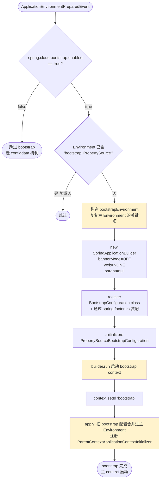

---

## 四、Bootstrap 父上下文的创建

### 4.1 `bootstrapServiceContext` 源码（简化）

```java
private ConfigurableApplicationContext bootstrapServiceContext(
        ConfigurableEnvironment environment, final SpringApplication application) {

    StandardEnvironment bootstrapEnvironment = new StandardEnvironment();
    // 把主 Environment 里 spring.cloud.bootstrap.* 相关的配置项搬到 bootstrapEnvironment
    for (PropertySource<?> source : environment.getPropertySources()) {
        if (source instanceof EnumerablePropertySource) {
            // 过滤：只搬与 bootstrap 相关的
        }
    }

    // ★ 用 SpringApplicationBuilder 创建一个迷你 context
    SpringApplicationBuilder builder = new SpringApplicationBuilder()
            .bannerMode(Banner.Mode.OFF)
            .environment(bootstrapEnvironment)
            .web(WebApplicationType.NONE)              // 不启动 web
            .register(BootstrapImportSelectorConfiguration.class);  // 加载 BootstrapConfiguration

    // ★ 关键：注入 ApplicationContextInitializer = PropertySourceBootstrapConfiguration
    final String propertyName = "spring.cloud.bootstrap.name";  // 默认 bootstrap
    String configName = environment.getProperty(propertyName, "bootstrap");
    builder.names(configName);

    // 把 PropertySourceBootstrapConfiguration 作为 initializer
    List<Class<?>> sources = new ArrayList<>();
    for (String name : BootstrapImportSelector.selectImports(environment)) {
        sources.add(ClassUtils.resolveClassName(name, null));
    }
    builder.sources(sources.toArray());

    // ★ 启动！这里会触发 PropertySourceBootstrapConfiguration.initialize()
    ConfigurableApplicationContext context = builder.run();
    context.setId("bootstrap");
    // 标记
    bootstrapContext = context;

    return context;
}
```

### 4.2 父子上下文结构图

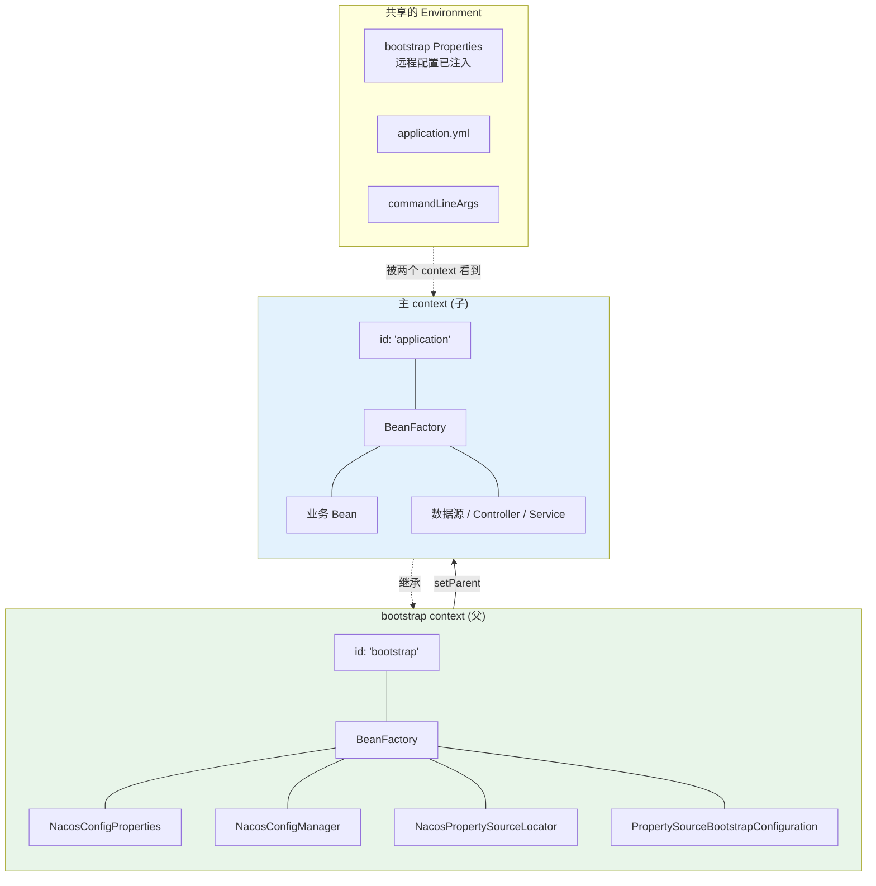

关键点：
1. **bootstrap context 是父**，主 context 是子（`main.setParent(bootstrap)`）。
2. bootstrap context 极简：只有配置类、`PropertySourceLocator` 等，**没有业务 Bean、没有 web 容器**（`web=NONE`）。
3. 主 context 通过继承父 context，能看到父注入的配置 Bean，但远程配置已经合并进 Environment 了，主 context 实际是**读 Environment 取值**。

### 4.3 父子关系建立：`ParentContextApplicationContextInitializer`

```java
// apply() 中
application.addInitializers(
    new ParentContextApplicationContextInitializer(context));
```

`ParentContextApplicationContextInitializer` 是 `ApplicationContextInitializer`，在主 context `prepareContext` 阶段执行：

```java
// ParentContextApplicationContextInitializer.java
@Override
public void initialize(CurableApplicationContext parent) {
    if (parent != null) {
        context.setParent(parent);   // ★ 主 context 的 parent = bootstrap context
        ...
    }
}
```

这样主 context 启动时，从父 context 继承 `Environment` 的 PropertySource（实际是合并机制）。

---

## 五、BootstrapConfiguration 装配：spring.factories 机制

### 5.1 `BootstrapImportSelector` 扫描

`BootstrapImportSelectorConfiguration` 触发 `BootstrapImportSelector`，它从所有 jar 的 `META-INF/spring.factories` 里读 `BootstrapConfiguration` key：

```java
// BootstrapImportSelector.java
@Override
public String[] selectImports(AnnotationMetadata metadata) {
    ClassLoader classLoader = Thread.currentThread().getContextClassLoader();
    // ★ 读所有 jar 的 spring.factories 中 BootstrapConfiguration 配置项
    List<String> names = SpringFactoriesLoader.loadFactoryNames(
            BootstrapConfiguration.class, classLoader);
    // 还会加载 spring.cloud.bootstrap.sources 配置的额外配置类
    ...
    return names.toArray(new String[0]);
}
```

### 5.2 各配置中心的 `BootstrapConfiguration`

| 配置中心 | spring.factories 内容 | 作用 |
|---------|----------------------|------|
| spring-cloud-context | `BootstrapImportSelectorConfiguration` 等 | 框架基础 |
| spring-cloud-alibaba-nacos-config | `NacosConfigBootstrapConfiguration` | 注册 Nacos 配置加载三件套 |
| spring-cloud-consul-config | `ConsulConfigBootstrapConfiguration` | Consul 整合 |
| spring-cloud-zookeeper-config | `ZookeeperConfigBootstrapConfiguration` | Zookeeper 整合 |

### 5.3 Nacos 的 `BootstrapConfiguration`

```java
// NacosConfigBootstrapConfiguration.java
@Configuration(proxyBeanMethods = false)
@ConditionalOnProperty(name = "spring.cloud.nacos.config.enabled", matchIfMissing = true)
public class NacosConfigBootstrapConfiguration {

    @Bean
    @ConditionalOnMissingBean
    public NacosConfigProperties nacosConfigProperties(ApplicationContext context) {
        // 读 spring.cloud.nacos.config.* 配置
        ...
        return new NacosConfigProperties();
    }

    @Bean
    @ConditionalOnMissingBean
    public NacosConfigManager nacosConfigManager(NacosConfigProperties nacosConfigProperties) {
        return new NacosConfigManager(nacosConfigProperties);   // 创建 ConfigService
    }

    @Bean
    public NacosPropertySourceLocator nacosPropertySourceLocator(
            NacosConfigFactory configFactory) {
        return new NacosPropertySourceLocator(configFactory);
    }
}
```

bootstrap context 装配这三件套：`NacosConfigProperties`（配置）→ `NacosConfigManager`（创建 `ConfigService`）→ `NacosPropertySourceLocator`（拉配置的执行者）。

### 5.4 装配流程图

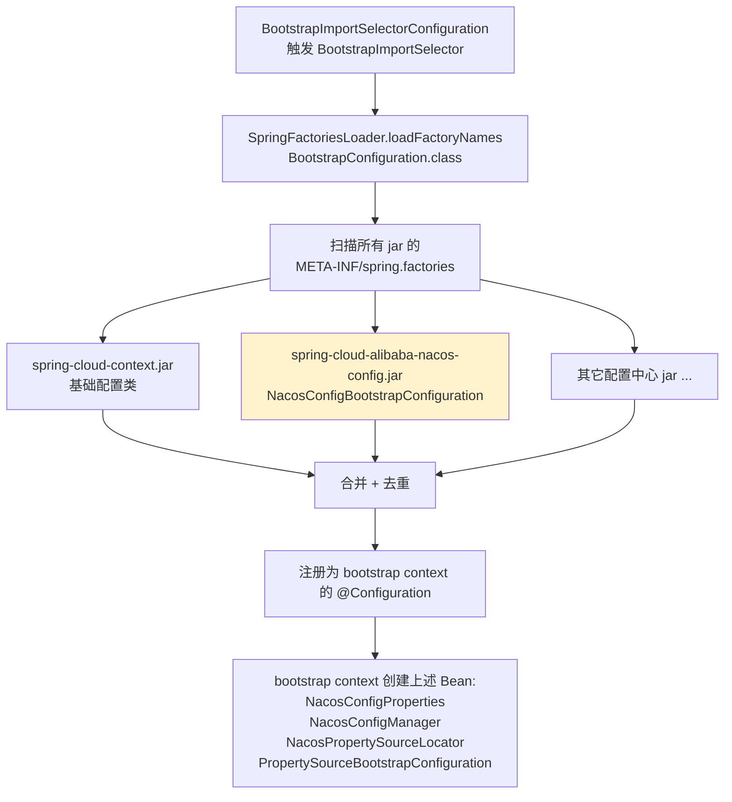

---

## 六、配置加载核心：`PropertySourceLocator`

### 6.1 接口定义

```java
// PropertySourceLocator.java
public interface PropertySourceLocator {
    /**
     * 拉取配置源，返回 PropertySource 注入 Environment
     */
    PropertySource<?> locate(Environment environment);
}
```

抽象极简：一个方法，返回一个 `PropertySource`。具体怎么拉（HTTP/长连接/文件）由实现决定。

### 6.2 聚合器：`PropertySourceBootstrapConfiguration`

`PropertySourceBootstrapConfiguration` 既是 `ApplicationContextInitializer`，又是 `PropertySourceLocator` 的聚合点：

```java
// PropertySourceBootstrapConfiguration.java
@Override
public void initialize(ConfigurableApplicationContext applicationContext) {
    CompositePropertySource composite = new CompositePropertySource(
            BOOTSTRAP_PROPERTY_SOURCE_NAME);

    // ★ 注入所有 PropertySourceLocator（Spring 注入 List）
    annotationConfigApplicationContext.getAutowireCapableBeanFactory()
        .autowireBean(this);   // 注入 this.propertySourceLocators

    // ★ 按顺序调用每个 locator
    for (PropertySourceLocator locator : this.propertySourceLocators) {
        PropertySource<?> source = null;
        source = locator.locate(applicationContext.getEnvironment());

        if (source == null) continue;
        composite.addPropertySource(source);
        // 或 addFirstPropertySource 调整优先级
    }

    // ★ 注入到 Environment 最前面（最高优先级）
    ConfigurableEnvironment environment = applicationContext.getEnvironment();
    environment.getPropertySources().addFirst(composite);
}
```

注意 `addFirst` —— bootstrap 加载的远程配置**优先级最高**，覆盖本地 `application.yml`。

### 6.3 聚合调用流程图

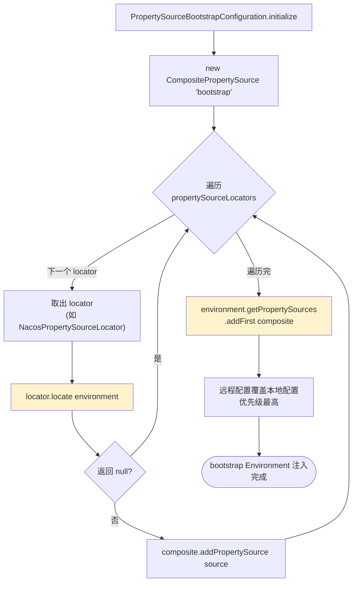

### 6.4 多 `PropertySourceLocator` 协作时序图

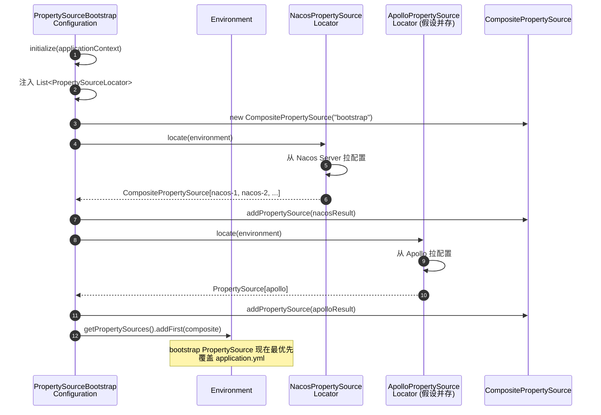

---

## 七、Nacos 整合：`NacosPropertySourceLocator.locate()`

### 7.1 locate 流程

```java
// NacosPropertySourceLocator.java
@Override
public PropertySource<?> locate(Environment env) {
    ConfigService configService = nacosConfigFactory.createConfigService();
    if (configService == null) return null;

    long timeout = nacosConfigProperties.getTimeout();
    nacosConfigProperties.setConfigService(configService);

    CompositePropertySource composite = new CompositePropertySource("nacos");

    // ★ 三段式加载
    // 1. 共享配置（多个服务共享，如公共日志、公共数据源）
    loadSharedConfiguration(composite, nacosConfigProperties);
    // 2. 扩展配置（本服务独有的额外配置）
    loadExtConfiguration(composite, nacosConfigProperties);
    // 3. 应用自身配置（dataId = ${spring.application.name}-${profile}.${ext}）
    loadApplicationConfiguration(composite, nacosConfigProperties, env);

    return composite;
}

private void loadApplicationConfiguration(CompositePropertySource composite,
        NacosConfigProperties nacosConfigProperties, Environment env) {
    String dataId = nacosConfigProperties.getName();        // spring.application.name
    String group = nacosConfigProperties.getGroup();
    String fileExtension = nacosConfigProperties.getFileExtension();

    // ★ 按 profile 倒序拉取，先加 default，再覆盖 active profile
    List<String> profiles = Arrays.asList(env.getActiveProfiles());
    Collections.reverse(profiles);

    // 1) 先拉默认（无 profile 后缀）
    loadNacosDataIfPresent(composite, dataId, group, fileExtension, true);

    // 2) 按顺序拉各 profile 配置
    for (String profile : profiles) {
        String dataIdSuffix = profile.isEmpty() ? "" : "-" + profile;
        loadNacosDataIfPresent(composite, dataId + dataIdSuffix, group, fileExtension, true);
    }
}

private void loadNacosDataIfPresent(CompositePropertySource composite,
        String dataId, String group, String fileExtension, boolean isRefreshable) {
    // ★ 从 Nacos Server 拉内容
    String config = configService.getConfig(dataId, group, timeout);
    // 解析成 Properties/YAML
    Map<String, Object> map = ...;
    // 包装成 NacosPropertySource
    NacosPropertySource nacosPropertySource = new NacosPropertySource(...);
    // 加到 composite（addFirst 保证后加的优先级更高）
    composite.addFirstPropertySource(nacosPropertySource);
}
```

### 7.2 locate 流程图

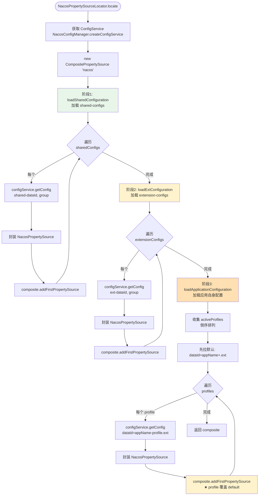

### 7.3 配置优先级（后加的覆盖先加的）

`composite.addFirstPropertySource()` 把新加的放到最前（最高优先级）。所以最终优先级（从高到低）：

```
active profile 配置  >  default 配置  >  extension-configs  >  shared-configs
```

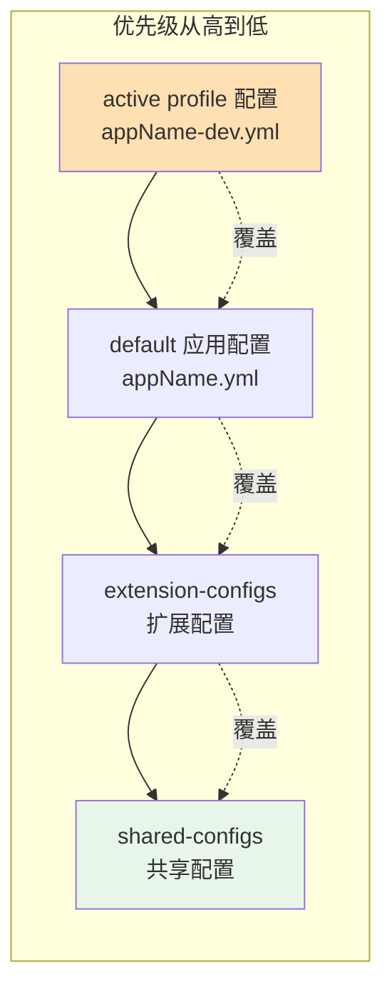

---

## 八、整体时序图：从启动到 bootstrap 完成

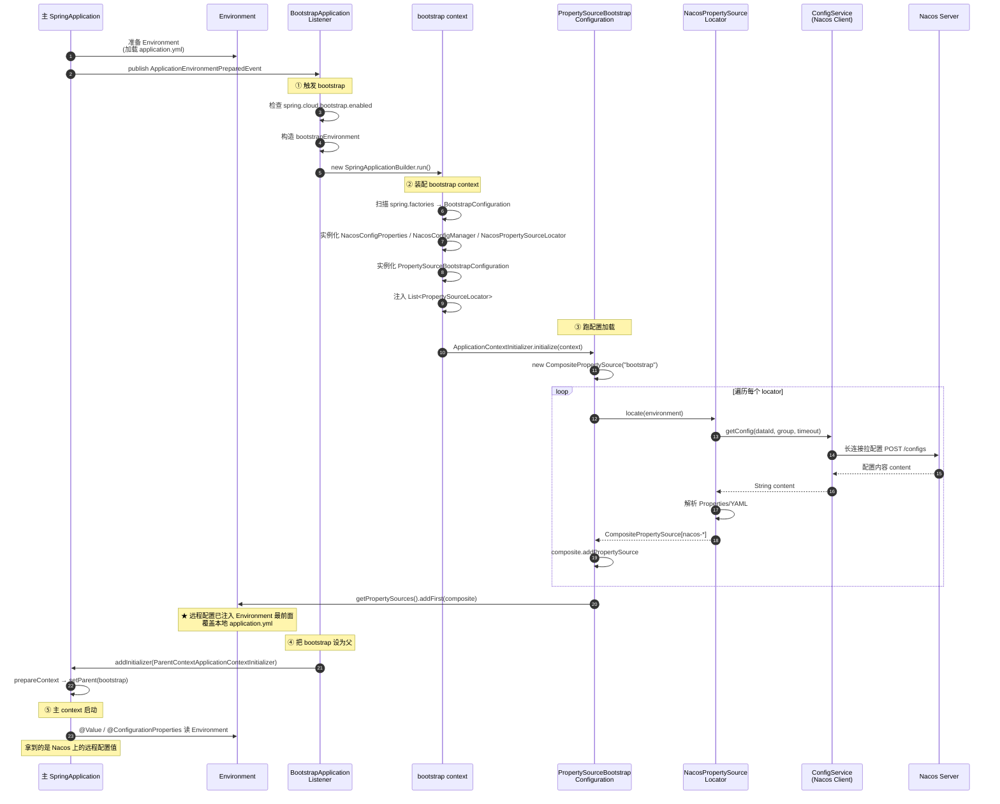

---

## 九、两次 `SpringApplication.run()` 与 yml 加载流程深度剖析

引入 bootstrap 后，一次应用启动实际上会**嵌套调用两次 `SpringApplication.run()`**：外层是用户 `main()` 触发的主 context 启动，内层是 `BootstrapApplicationListener` 在外层 run 的 `prepareEnvironment` 阶段嵌套触发的 bootstrap context 启动。本节聚焦这两次 run 各自加载哪个 yml、何时加载、如何合并。

### 9.1 两次 run() 的嵌套调用关系

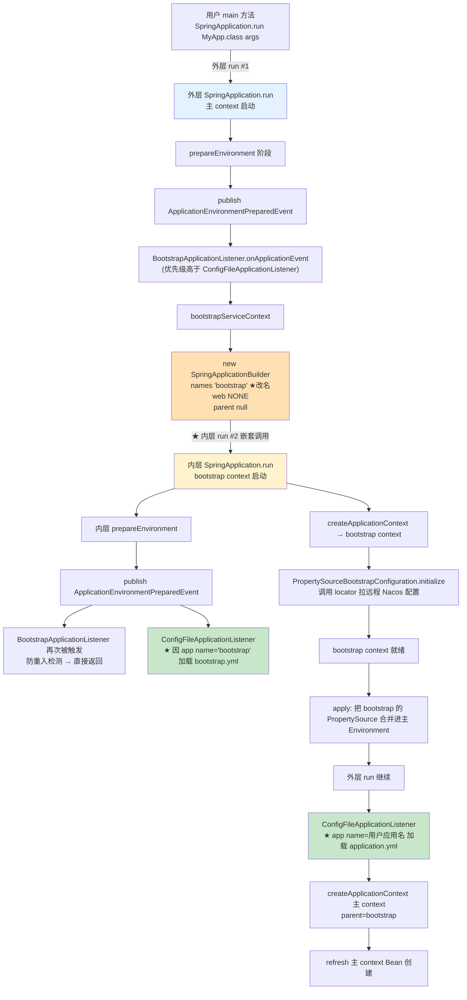

关键认知：
- **外层 run 和内层 run 是同一段代码**（都是 `SpringApplication.run`），只是配置不同（name 不同、web 不同、parent 不同）。
- 内层 run **嵌套在外层 run 的 `prepareEnvironment` 阶段**，不是顺序两次独立启动。外层 run 在 `BAL` 返回前一直阻塞。
- 内层 run 跑完，外层 run 才继续往下走 `createApplicationContext`。
- 内层 run 也会发 `ApplicationEnvironmentPreparedEvent`，`BAL` 会再次被触发，但靠**防重入检测**（Environment 已含 `bootstrap` 标记源等机制）直接返回，不会无限递归。

### 9.2 yml 加载的"名字魔法"

Spring Boot 的 `ConfigFileApplicationListener`（Spring Boot 2.2.x）加载配置文件时，文件名前缀由 `spring.application.name` 决定：
- 默认前缀 `application` → 加载 `application.yml` / `application.properties` / `application-{profile}.yml`
- 如果 name 被改成 `bootstrap` → 加载 `bootstrap.yml` / `bootstrap.properties` / `bootstrap-{profile}.yml`

`BootstrapApplicationListener` 正是利用这一点：

```java
// BootstrapApplicationListener.bootstrapServiceContext()
String configName = environment.getProperty(
        "spring.cloud.bootstrap.name", "bootstrap");   // ★ 默认 "bootstrap"
builder.names(configName);                              // ★ 把内层 context 的 app name 设为 "bootstrap"
```

`builder.names("bootstrap")` 让内层 run 的 `ConfigFileApplicationListener` 去找 `bootstrap.yml` 而不是 `application.yml`。

> **这是 bootstrap 机制最巧妙的设计——没有自己写一套 yml 加载逻辑，仅靠改 app name 就复用了 Spring Boot 现成的配置加载机制。**

### 9.3 两次 run 各自加载的配置对比

| 维度 | 外层 run（主 context） | 内层 run（bootstrap context） |
|------|----------------------|----------------------------|
| 触发者 | 用户 `main()` | `BootstrapApplicationListener` |
| app name | `spring.application.name`（用户应用名） | `"bootstrap"`（或 `spring.cloud.bootstrap.name`） |
| 加载的本地文件 | `application.yml` + `application-{profile}.yml` | `bootstrap.yml` + `bootstrap-{profile}.yml` |
| web 类型 | SERVLET / REACTIVE | NONE |
| 父 context | 无（自己是顶层） | 无（bootstrap 是顶层） |
| 子 context | 无 | 主 context（通过 `setParent`） |
| 加载远程配置 | 否 | 是（通过 `PropertySourceLocator`） |
| 加载时机 | 自身 `prepareEnvironment` 阶段 | 嵌套在外层 `prepareEnvironment` 内触发 |
| 监听器优先级 | — | BAL `HIGHEST_PRECEDENCE+5` 先于 CFG `HIGHEST_PRECEDENCE+10` |

### 9.4 完整 yml 加载时序图

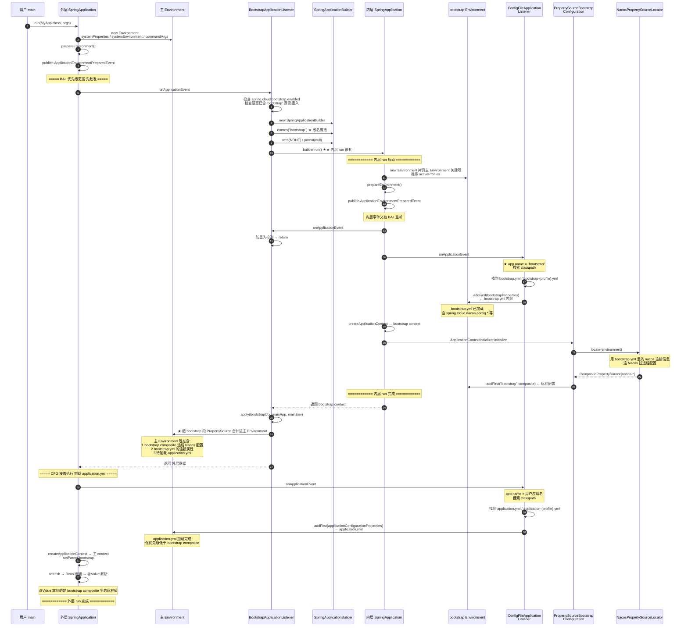

### 9.5 yml 加载顺序 vs Environment 优先级

**加载时序**（先→后）与 **Environment 优先级**（高→低）是两个不同维度：

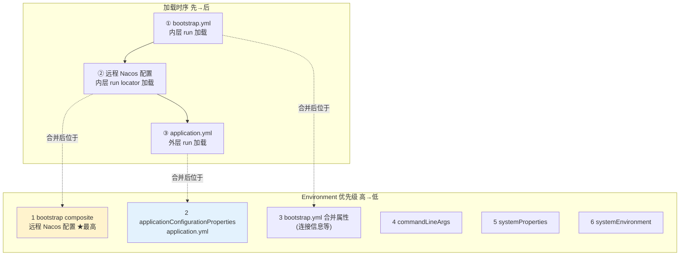

关键结论：
1. **远程 Nacos 配置优先级最高**（`bootstrap` composite 被 `addFirst` 到最前面），覆盖 `application.yml` 和本地所有源。
2. **`application.yml` 优先级高于 `bootstrap.yml`**（在 `bootstrap` composite 之后加载，但因 `addFirst` 语义实际位置见上）。`bootstrap.yml` 主要存 nacos 连接等"配置的配置"，与业务配置不冲突。
3. **加载时序 ≠ 优先级**：`bootstrap.yml` 先加载但优先级并非最高；远程配置在 `bootstrap.yml` 之后加载但优先级最高。

### 9.6 两次 run 的产物与合并机制

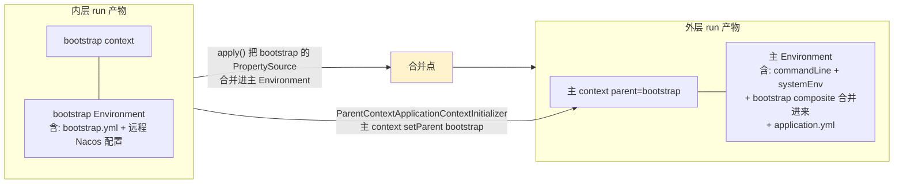

合并发生在 `BootstrapApplicationListener.apply()`：
1. **`ParentContextApplicationContextInitializer`** 注册到外层 run，让主 context 创建时 `setParent(bootstrap context)`，建立父子关系。
2. **bootstrap 的 `PropertySource` 合并进主 Environment**：把 bootstrap context 加载的远程配置（`bootstrap` composite）注入到主 Environment 的最前面，让主 context 的 `@Value`、`@ConfigurationProperties` 能读到远程值。

### 9.7 关键设计点与常见坑

1. **复用而非重写**：bootstrap 没有自己写一套 yml 加载逻辑，而是改个 app name 复用 `ConfigFileApplicationListener`。这是 Spring 一贯的"组合优于重写"哲学。

2. **嵌套而非顺序**：内层 run 嵌套在外层 `prepareEnvironment` 里，而不是先跑完 bootstrap 再启动主应用。这让远程配置能在主 context 创建前就进入 Environment。

3. **profile 来源的坑**：内层 run 从主 Environment **继承** `spring.profiles.active`。但此时 `application.yml` 还没加载，profile 只能来自 `commandLine` / `systemEnv` / `systemProperties`。**如果 profile 只配在 `application.yml` 里，bootstrap 阶段读不到，`bootstrap-{profile}.yml` 不会被加载** —— 这是常见坑，建议 profile 用命令行或环境变量传。

4. **职责分离**：
   - `bootstrap.yml` → nacos 连接、`spring.application.name`、`spring.profiles.active` 等"元配置"。
   - `application.yml` → 业务配置（或干脆放 Nacos）。
   - 不要混用。

5. **两次 run 共享 classpath**：`bootstrap.yml` 和 `application.yml` 都在同一个 classpath，靠名字区分。所以**不要在 `bootstrap.yml` 里写业务配置**，也不要在 `application.yml` 里写 nacos 连接信息——各司其职。

6. **`ContextRefresher` 重跑的是内层 run**：见下一节（第十节），刷新时 `addConfigFilesToEnvironment` 手动塞 `BootstrapApplicationListener` 进 listener 列表，让 `builder.run()` 重跑一遍内层 run（加载最新 bootstrap.yml + 重新拉 Nacos），但不重建主 context。

---

## 十、`ContextRefresher` 重新触发 bootstrap（重点）

### 10.1 为什么刷新要重跑 bootstrap

`@RefreshScope` 刷新生效需要两步（见 `@RefreshScope注解实现原理.md` 第 4 节）：
1. **重新加载远程配置到 Environment**（让 `@Value` 解析出新值）。
2. **销毁 refresh scope Bean 缓存**（让重建时走新值）。

第 1 步怎么"重新加载"？答案是：**重跑一遍 bootstrap 流程**。因为 bootstrap 本来就是干这个的——从配置中心拉配置注入 Environment。复用这套机制最自然。

### 10.2 `ContextRefresher.addConfigFilesToEnvironment` 源码

```java
// ContextRefresher.java
ConfigurableApplicationContext addConfigFilesToEnvironment() {
    // ① 拷贝当前 Environment
    StandardEnvironment environment = copyEnvironment(this.context.getEnvironment());

    // ② 起 SpringApplicationBuilder，关键是带上 BootstrapApplicationListener
    SpringApplicationBuilder builder = new SpringApplicationBuilder(Empty.class)
            .bannerMode(Banner.Mode.OFF)
            .web(WebApplicationType.NONE)
            .environment(environment);

    // ★★★ 关键：手动加 BootstrapApplicationListener
    // 这样 builder.run() 时会触发完整的 bootstrap 流程
    builder.application().setListeners(Arrays.asList(
            new BootstrapApplicationListener(),       // ← 重跑 bootstrap
            new ConfigFileApplicationListener()));   // 重跑本地配置加载
    // 注意：此时主 context 已存在，必须设 parent 为 null 避免循环
    builder.parent((ConfigurableApplicationContext) null);

    // ③ 跑起来，会触发 BootstrapApplicationListener → bootstrapServiceContext → locate
    ConfigurableApplicationContext capture = builder.run();

    // ④ 把新加载的 PropertySource 替换回主 context 的 Environment
    MutablePropertySources target = this.context.getEnvironment().getPropertySources();
    for (PropertySource<?> source : environment.getPropertySources()) {
        String name = source.getName();
        if (!this.standardSources.contains(name)) {
            // 排除标准源（systemProperties/systemEnvironment/commandArgs 等）
            if (target.contains(name)) {
                target.replace(name, source);    // ★ 用新配置替换旧配置
            } else {
                target.addAfter(targetName, source);
            }
        }
    }
    return capture;
}
```

### 10.3 重新触发 bootstrap 流程图

```mermaid
flowchart TD
    Start(["配置变更 → RefreshEvent"]) --> REL[RefreshEventListener.handle]
    REL --> CR[ContextRefresher.refresh]
    CR --> Step1["① refreshEnvironment()"]
    Step1 --> Copy[copyEnvironment 拷贝当前 Environment]
    Copy --> Builder[new SpringApplicationBuilder Empty.class<br/>bannerMode=OFF<br/>web=NONE]
    Builder --> SetListeners["setListeners(BootstrapApplicationListener,<br/>ConfigFileApplicationListener)"]
    SetListeners --> SetParent["parent = null<br/>避免与主 context 循环"]
    SetParent --> Run[builder.run]

    Run --> BAL[触发 ApplicationEnvironmentPreparedEvent]
    BAL --> Trigger[BootstrapApplicationListener.onApplicationEvent]
    Trigger --> CreateBC[创建临时 bootstrap context]
    CreateBC --> Locate["PropertySourceLocator.locate()<br/>= NacosPropertySourceLocator.locate()"]
    Locate --> PullNacos["★ 从 Nacos 重新拉最新配置<br/>用当前 Environment 中的 dataId/group"]
    PullNacos --> InjectEnv["注入临时 Environment<br/>addFirst composite"]
    InjectEnv --> Done1[临时 bootstrap 完成]

    Done1 --> Replace["遍历临时 Environment 的 PropertySource<br/>replace / addAfter 到主 Environment"]
    Replace --> Changed[算出变更 keys changes before vs after]
    Changed --> PubEvent[publishEvent EnvironmentChangeEvent keys]
    PubEvent --> RebindCP[ConfigurationPropertiesRebinder 重新绑定]

    RebindCP --> Step2["② scope.refreshAll()"]
    Step2 --> Destroy["销毁所有 @RefreshScope Bean 实例<br/>wrapper.bean = null"]
    Destroy --> Done(["下次访问代理重建 → 新配置生效"])

    style Run fill:#fff3cd
    style Locate fill:#fff3cd
    style PullNacos fill:#ffe0b2
    style Replace fill:#fff3cd
```

### 10.4 关键设计点

1. **临时 context 不留**：`builder.parent(null)`，跑完拿到配置后这个临时 context 会被关闭，不影响主 context 的父子结构。
2. **复用而非重新发明**：刷新配置 = 重跑 bootstrap。这就是为什么 `NacosPropertySourceLocator.locate()` 既在启动时用、又在刷新时用——同一份代码两个场景。
3. **Environment 是真相源**：刷新本质是改 Environment，再让依赖 Environment 的东西（`@RefreshScope` Bean、`@ConfigurationProperties`）重新解析。
4. **拉配置用的 dataId/group 来自当前 Environment**：所以 `spring.application.name`、`spring.profiles.active` 改了的话，重跑 bootstrap 会拉不同的配置。

---

## 十一、PropertySource 在 Environment 中的最终布局

### 11.1 完整优先级链

经过 bootstrap + 主 context 启动后，`Environment.getPropertySources()` 的顺序（从高到低）：

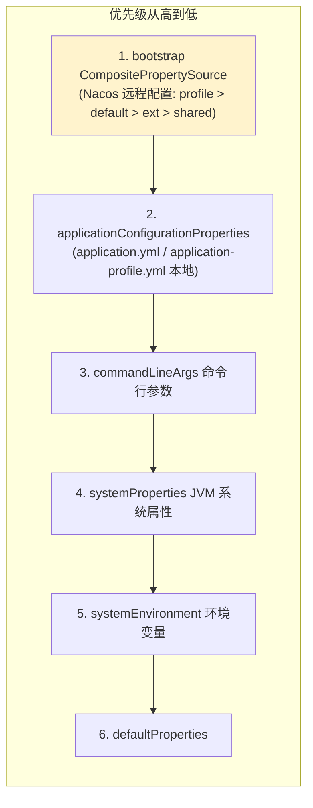

### 11.2 解析 `@Value("${x}")` 的路径

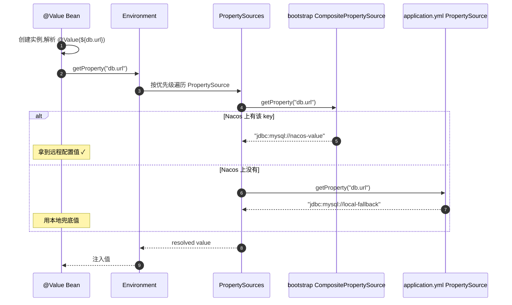

---

## 十二、与 Spring Boot 2.4+ configdata 机制对比

### 12.1 新旧机制

Spring Boot 2.4 引入了新的 **configdata 机制**，Spring Cloud 2020.0+（对应 Spring Boot 2.4+）默认**禁用 bootstrap**，改用 `spring.config.import`：

```yaml
# 新方式 (Spring Boot 2.4+)
spring:
  config:
    import:
      - optional:nacos:application.yml      # 直接 import Nacos 配置
      - optional:nacos:application-dev.yml
  cloud:
    nacos:
      config:
        server-addr: ...
```

### 12.2 对比图

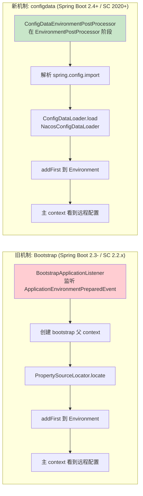

### 12.3 关键差异表

| 维度 | Bootstrap（旧） | configdata（新） |
|------|----------------|-----------------|
| 触发时机 | `ApplicationEnvironmentPreparedEvent` | `EnvironmentPostProcessor` 阶段 |
| 配置来源标识 | `PropertySourceLocator` 接口 | `ConfigDataLoader` + `ConfigDataLocationResolver` |
| 父子上下文 | 有 bootstrap 父 context | 无（直接在主 Environment） |
| 配置声明方式 | `spring.cloud.nacos.config.*` 隐式 | `spring.config.import=optional:nacos:...` 显式 |
| 启用开关 | `spring.cloud.bootstrap.enabled=true` | 默认禁用 bootstrap，用 import |
| 刷新触发 | `ContextRefresher` 重跑 bootstrap | `ConfigDataEnvironmentUpdateListener` 等 |
| 学习成本 | 隐式难懂 | 显式直观 |

> Spring Cloud 2.2.x（本仓库使用的版本）仍是 bootstrap 机制，`@RefreshScope注解实现原理.md` 中的 `addConfigFilesToEnvironment` 重跑的就是 bootstrap。

---

## 十三、常见误区与排查

### 13.1 误区

1. **"bootstrap context 是主 context"**：错，它是父 context，极简、无 web，启动完只用来配置加载。
2. **"远程配置一定覆盖本地"**：默认 `addFirst` 是覆盖，但 `override-none=true` / `override-system-properties=false` 等可调（`PropertySourceBootstrapConfiguration` 支持）。
3. **"刷新会重新创建 bootstrap context"**：刷新只重跑 `locate` 拿配置，原 bootstrap context 仍在。
4. **"bootstrap 失败应用起不来"**：取决于配置（`fail-fast=true` 才会），默认拉不到配置不阻塞启动。
5. **"Spring Boot 2.4+ 还在用 bootstrap"**：默认禁用了，要用得加 `spring-cloud-starter-bootstrap` 依赖。

### 13.2 排查清单

- 远程配置没生效 → 看 `Environment.getPropertySources()` 有没有 `bootstrap` 这个名字的 source。
- 拉取超时 → 调 `spring.cloud.nacos.config.timeout`。
- profile 不对 → 查 `spring.profiles.active`，影响 dataId 后缀。
- 优先级不对 → 看 `NacosPropertySource` 在 `composite` 内的顺序（`addFirst` 决定）。

---

## 十四、源码位置索引

| 关注点 | 文件 | 关键点 |
|--------|------|--------|
| 触发入口 | `BootstrapApplicationListener.java` | 监听 `ApplicationEnvironmentPreparedEvent` |
| Bootstrap 配置选择 | `BootstrapImportSelector.java` | 读 `spring.factories` 的 `BootstrapConfiguration` |
| 配置聚合器 | `PropertySourceBootstrapConfiguration.java` | 遍历 locator、`addFirst` |
| PropertySource 抽象 | `PropertySourceLocator.java` | `locate()` 接口 |
| Nacos bootstrap 配置 | `NacosConfigBootstrapConfiguration.java` | 注册 Nacos 三件套 |
| Nacos 配置加载 | `NacosPropertySourceLocator.java` | `locate` / `loadApplicationConfiguration` |
| 父子关系 | `ParentContextApplicationContextInitializer.java` | `setParent` |
| 刷新重跑 bootstrap | `ContextRefresher.java` | `addConfigFilesToEnvironment` 带 `BootstrapApplicationListener` |

---

## 十五、串联回 `@RefreshScope`

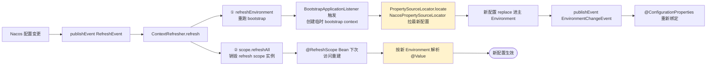

**关键串联回顾**：
- `@RefreshScope` 第 4.1 节说"重新触发 bootstrap 流程"——本文第 10 节详解了这个流程：`ContextRefresher.addConfigFilesToEnvironment` 手动塞 `BootstrapApplicationListener` 进 listener 列表，让 `builder.run()` 重跑 bootstrap。
- Bootstrap 重跑时，`NacosPropertySourceLocator.locate()` 会用**当前 Environment 里的 dataId/group** 从 Nacos 拉最新配置——这就是为什么改 Nacos 配置后刷新能拿到新值。
- 拿到新配置后 `replace` 进主 Environment，发布 `EnvironmentChangeEvent`，再 `refreshAll` 销毁 `@RefreshScope` 实例 → 重建时按新 Environment 解析 → 新配置生效。

> **一句话总结**：Bootstrap 是 Spring Cloud 在主上下文启动前插入的"远程配置加载"前置流程，靠 `BootstrapApplicationListener` 监听启动事件、创建迷你父上下文、聚合各配置中心的 `PropertySourceLocator` 把远程配置注入 `Environment` 最前面；`@RefreshScope` 刷新时复用这套机制（重跑 bootstrap）来重新加载远程配置，是配置刷新能生效的根因。