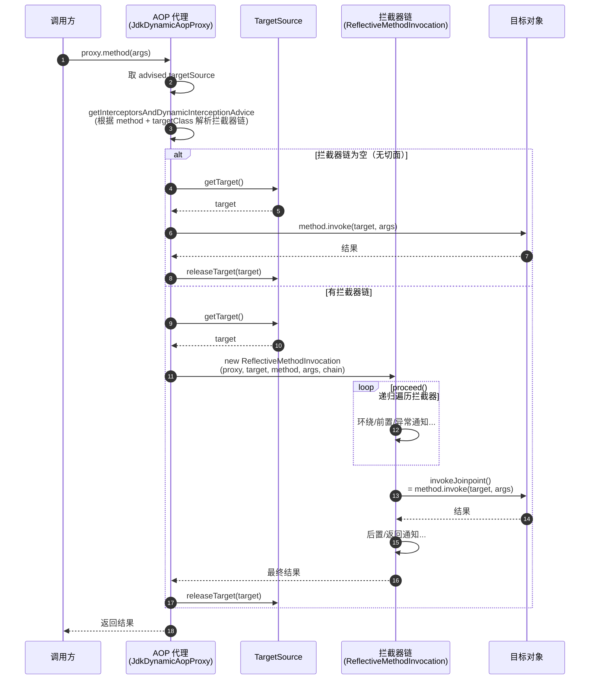
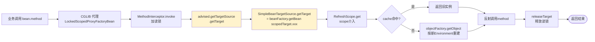

# Spring TargetSource 详解

> 以 Spring Framework 5.2.x + spring-cloud-context 2.2.9.RELEASE 源码为基准。本文是 `@RefreshScope注解实现原理.md` 中 `SimpleBeanTargetSource` 的延伸阅读。

---

## 一、一句话定位

`TargetSource` 是 Spring AOP 中**"目标对象的来源"**的抽象接口。AOP 代理对象本身不持有真实对象，而是持有一个 `TargetSource`，每次方法调用时由它"提供"被代理的真实实例。

> 代理 = 拦截器链（Advice/Advisor） + TargetSource（目标来源）
> TargetSource 回答的是："这个方法最终要在哪个对象上反射执行？"

---

## 二、为什么设计这个接口

### 2.1 没有 TargetSource 会怎样

假设 AOP 代理直接持有一个 `Object target` 字段：

```java
class Proxy {
    private Object target;          // 硬编码持有
    private List<Advice> advices;
    public Object invoke(method, args) {
        // 跑拦截器链
        ...
        return method.invoke(target, args);   // 反射调用目标
    }
}
```

这只能描述"目标对象固定不变"的场景。但实际需求远不止于此：

| 需求 | 目标对象的特征 |
|------|---------------|
| prototype Bean 注入到 singleton | 每次方法调用都拿**新实例** |
| `@RefreshScope` Bean | 配置刷新后下次调用拿**新实例**，旧实例销毁 |
| 对象池（数据库连接、远程 stub） | 每次借一个，用完归还池 |
| ThreadLocal 隔离 | 每个线程一个独立实例 |
| 热部署 | 运行时**替换**实现类 |
| 延迟初始化 | 首次调用才真正创建 |

如果让代理直接 `target` 字段，这些策略只能写死在代理类里，每加一种就改代理实现 —— 严重违反开闭原则。

### 2.2 TargetSource 的解耦价值

把"取目标对象"的策略抽成接口后，职责清晰分离：

- **代理（`JdkDynamicAopProxy` / `CglibAopProxy`）**：只关心"拦截 + 反射调用"，机械地在方法前后跑拦截器链，最后反射调用 `target`。
- **TargetSource**：只关心"取/还目标对象"的策略，不知道也不关心有哪些 Advice。

二者通过 `getTarget()` / `releaseTarget()` 两个方法协作。代理的算法稳定不变，新增"取对象策略"只需要新增一个 `TargetSource` 实现，无需改代理源码。

> 这正是**策略模式**的典型应用，且把"对象生命周期管理"完全从 AOP 框架核心剥离开来。

### 2.3 设计哲学

Spring AOP 的核心抽象是 `Advised` 接口，它把"一个代理的所有配置"打包：

```java
public interface Advised extends TargetClassAware {
    Class<?> getTargetClass();
    boolean isProxyTargetClass();           // CGLIB 还是 JDK 动态代理
    Advisor[] getAdvisors();                // 切面/拦截器链
    TargetSource getTargetSource();         // ★ 目标来源
    void setTargetSource(TargetSource targetSource);  // ★ 可运行时替换
    boolean isFrozen();
    boolean isExposeProxy();
    ...
}
```

注意 `setTargetSource` —— **TargetSource 可以在运行时被替换**。这意味着代理壳不变，但"取目标"的策略可以动态切换，这是 `HotSwappableTargetSource` 等实现的理论基础。

---

## 三、接口定义

```java
package org.springframework.aop;

public interface TargetSource extends TargetClassAware {
    // ① 目标对象的类型（用于反射、匹配切点、生成代理）
    @Override
    Class<?> getTargetClass();

    // ② 是否静态
    //    true  = 目标对象固定不变，可缓存 targetClass，getTarget() 返回值恒定
    //    false = 目标对象可变（池、prototype、scope），每次都要 getTarget()
    boolean isStatic();

    // ③ 获取目标对象（每次方法调用前由代理调用）
    //    返回的实例随后被反射调用方法
    Object getTarget() throws Exception;

    // ④ 释放目标对象（方法执行完由代理调用）
    //    池化场景归还池；prototype 场景可能触发 destroy；singleton 场景空实现
    void releaseTarget(Object target) throws Exception;
}
```

四个方法两两配对：
- `getTargetClass()` / `isStatic()` 是**元信息**，代理启动时使用，决定是否可优化缓存。
- `getTarget()` / `releaseTarget()` 是**运行时配对调用**，每个方法调用都执行一次 `get → 反射 → release`。

---

## 四、在 AOP 调用链中的位置

### 4.1 调用全流程时序图



### 4.2 关键源码片段（`JdkDynamicAopProxy.invoke`）

```java
// JdkDynamicAopProxy.java (简化)
public Object invoke(Object proxy, Method method, Object[] args) throws Throwable {
    MethodInvocation invocation;
    // ★ 每次调用都从 advised 拿当前 TargetSource（运行时可被替换）
    TargetSource targetSource = this.advised.targetSource;
    Object target = null;
    try {
        // 只对用户方法做 AOP，equals/hashCode/toString 等不走链
        if (!this.advised.opaque && method.getDeclaringClass() == DecoratingProxy.class) { ... }

        Class<?> targetClass = (targetSource != null ? targetSource.getTargetClass() : null);

        // 解析当前方法的拦截器链（带缓存）
        List<Object> chain = this.advised.getInterceptorsAndDynamicInterceptionAdvice(method, targetClass);

        if (chain.isEmpty()) {
            // 无切面：直接反射调用
            Object[] argsToUse = AopProxyUtils.adaptArgumentsIfNecessary(method, args);
            // ★ 通过 TargetSource 拿 target
            target = targetSource.getTarget();
            Class<?> targetClassToUse = (targetClass != null ? targetClass : target.getClass());
            return AopUtils.invokeJoinpointUsingReflection(target, method, argsToUse);
        } else {
            // 有切面：构造 MethodInvocation，链式 proceed
            target = targetSource.getTarget();
            Class<?> targetClassToUse = (targetClass != null ? targetClass : target.getClass());
            invocation = new ReflectiveMethodInvocation(
                    proxy, target, method, args, targetClassToUse, chain);
            Object retVal = invocation.proceed();
            // 处理返回值（@Async、协变返回类型等）
            ...
            return retVal;
        }
    } finally {
        // ★ 一定要 release（池化/原型场景依赖此回调做资源管理）
        if (target != null && targetSource != null) {
            targetSource.releaseTarget(target);
        }
    }
}
```

两个关键点：
1. **`targetSource` 在每次 `invoke` 时从 `advised` 重新取** —— 允许运行时替换 TargetSource。
2. **`target` 在 finally 中 release** —— 保证异常路径也归还池/销毁原型。

### 4.3 `ReflectiveMethodInvocation.invokeJoinpoint()`

拦截器链跑到底，最终落到目标对象上反射：

```java
// ReflectiveMethodInvocation.java
protected Object invokeJoinpoint() throws Throwable {
    // this.target 就是 TargetSource.getTarget() 返回的对象
    return AopUtils.invokeJoinpointUsingReflection(this.target, this.method, this.arguments);
}
```

所以 `target` 在 `ReflectiveMethodInvocation` 构造时就被固定下来（来自 `TargetSource.getTarget()`），整个拦截器链共用这一个 target。

---

## 五、静态 vs 动态：`isStatic()` 的含义

`isStatic()` 返回值直接影响代理的性能优化路径：

| 返回值 | 含义 | 代理优化 |
|--------|------|---------|
| `true` | 目标对象恒定不变（singleton） | `targetClass` 可缓存；部分场景可绕过 `getTarget()` 走快速路径；不需要每次 release |
| `false` | 目标对象可变（prototype / 池 / scope） | 每次方法调用必须 `getTarget()` + `releaseTarget()`，无法缓存 targetClass |

`AdvisedSupport.getTargetClass()` 的实现：

```java
public Class<?> getTargetClass() {
    Class<?> targetClass = this.targetClass;
    if (targetClass == null && this.targetSource != null) {
        // ★ 仅当 TargetSource.isStatic()==true 才缓存
        targetClass = this.targetSource.getTargetClass();
        if (this.targetSource.isStatic()) {
            this.targetClass = targetClass;
        }
    }
    return targetClass;
}
```

动态 TargetSource 不会缓存 `targetClass` —— 因为每次 `getTarget()` 返回的类型可能不同（虽然通常相同，但框架不能假设）。

> 写自定义 TargetSource 时要诚实：如果目标类型真的恒定就返回 `true`，否则务必返回 `false`，否则切点匹配会拿到过期的类型信息。

---

## 六、Spring 内置 TargetSource 详解

Spring 在 `org.springframework.aop.target` 包下提供了丰富的内置实现。

### 6.1 SingletonTargetSource —— 最常用

```java
package org.springframework.aop.target;

public final class SingletonTargetSource extends AbstractLazyCreationTargetSource {
    private final Object target;

    public SingletonTargetSource(Object target) {
        Assert.notNull(target, "Target object must not be null");
        this.target = target;
    }

    @Override
    public Class<?> getTargetClass() {
        return this.target.getClass();
    }

    @Override
    public Object getTarget() {
        return this.target;        // 永远返回同一个对象
    }

    @Override
    public void releaseTarget(Object target) {
        // 空实现：单例无需释放
    }

    @Override
    public boolean isStatic() {
        return true;               // ★ 静态，可缓存
    }
}
```

- **用途**：单例 Bean 的默认 TargetSource。`ProxyFactory` 不显式 set 时，`setTarget(obj)` 会自动包装成 `SingletonTargetSource`。
- **特点**：`isStatic()=true`，性能最优。绝大多数业务代理都是它。

### 6.2 AbstractBeanFactoryBasedTargetSource —— BeanFactory 派系基类

这是一个抽象基类，所有"通过 BeanFactory + beanName 拿目标"的实现都继承它：

```java
public abstract class AbstractBeanFactoryBasedTargetSource
        implements TargetSource, Serializable {

    private BeanFactory beanFactory;     // 持有 BeanFactory
    private String targetBeanName;       // 目标 Bean 的名字

    @Override
    public Object getTarget() throws BeansException {
        // 默认实现：每次 getBean
        return getBeanFactory().getBean(getTargetBeanName());
    }

    @Override
    public void releaseTarget(Object target) throws Exception {
        // 默认空实现，子类覆盖
    }

    @Override
    public boolean isStatic() {
        return false;                   // ★ 默认动态
    }
}
```

它的核心思想：**代理不直接持有目标对象，只持有"目标 Bean 的名字"，需要时再 `getBean()`**。这正是 Spring scope 代理的底层基石。

### 6.3 SimpleBeanTargetSource —— scope 代理的核心

```java
public class SimpleBeanTargetSource extends AbstractBeanFactoryBasedTargetSource {

    @Override
    public Object getTarget() throws Exception {
        return getBeanFactory().getBean(getTargetBeanName());
    }
}
```

**最简单的子类，但承载了 `@RefreshScope` 等所有自定义 scope 代理**。原理：

- 代理持有 `beanName = "scopedTarget.xxx"`（注意是被改名后的真实 Bean 名）。
- 每次 `getTarget()` → `getBean("scopedTarget.xxx")`。
- Spring 看到 BeanDefinition 的 scope=refresh → 委托给 `RefreshScope.get(name, objectFactory)`。
- `RefreshScope`（GenericScope）从缓存拿或通过 objectFactory 重建。

> 详见 `@RefreshScope注解实现原理.md` 第 3.3 节时序图。`SimpleBeanTargetSource` 就是图中 `getTargetSource().getTarget()` 这一步的实现。

### 6.4 PrototypeTargetSource —— 每次新实例

```java
public class PrototypeTargetSource extends AbstractBeanFactoryBasedTargetSource {

    @Override
    public Object getTarget() throws BeansException {
        beforeGetTarget();
        // ★ 每次 getBean，对 prototype = 每次都创建新实例
        Object target = getBeanFactory().getBean(getTargetBeanName());
        afterGetTarget();
        return target;
    }

    @Override
    public void releaseTarget(Object target) throws Exception {
        // ★ 方法执行完销毁这个 prototype 实例（触发 @PreDestroy 等）
        ((ConfigurableBeanFactory) getBeanFactory())
                .destroyBean(getTargetBeanName(), target);
    }
}
```

**用途**：把 prototype Bean 注入到 singleton Bean 中，让每次方法调用都拿到全新实例。

注意 `releaseTarget` 会触发销毁回调 —— 这与 prototype 的语义一致（Spring 不管理 prototype 的完整生命周期，但 TargetSource 借了就还，所以主动 destroy）。

### 6.5 ThreadLocalTargetSource —— 线程隔离

```java
public class ThreadLocalTargetSource
        extends AbstractBeanFactoryBasedTargetSource implements DisposableBean {

    private final ThreadLocal<Object> targetInThread =
            new NamedThreadLocal<>("TargetSource for target bean '" + getTargetBeanName() + "'");

    // 所有线程持有的实例集合（用于 destroy 时统一清理）
    private final Set<Object> targetSet =
            Collections.newSetFromMap(new ConcurrentHashMap<>(16));

    @Override
    public Object getTarget() throws BeansException {
        Object target = this.targetInThread.get();
        if (target == null) {
            // 当前线程第一次调用：创建并绑定到 ThreadLocal
            target = getBeanFactory().getBean(getTargetBeanName());
            this.targetInThread.set(target);
            this.targetSet.add(target);
        }
        return target;
    }

    @Override
    public void releaseTarget(Object target) {
        // 空实现：实例留在 ThreadLocal 里供同线程下次复用
    }

    @Override
    public void destroy() {
        // ★ 容器销毁时，清理所有线程持有的实例
        for (Object target : this.targetSet) {
            ((ConfigurableBeanFactory) getBeanFactory())
                    .destroyBean(getTargetBeanName(), target);
        }
        this.targetInThread.remove();
    }
}
```

**用途**：每个线程一个独立实例，线程内复用，线程间隔离。典型场景：
- 非线程安全的 service（如带状态的 Formatter、Parser）。
- 每线程独立的事务上下文、用户上下文。

### 6.6 CommonsPool2TargetSource —— 对象池

```java
public class CommonsPool2TargetSource
        extends AbstractPoolingTargetSource implements PooledObjectFactory<Object> {

    private GenericObjectPool<Object> pool;

    @Override
    public Object getTarget() throws Exception {
        return this.pool.borrowObject();       // ★ 从池借出
    }

    @Override
    public void releaseTarget(Object target) throws Exception {
        this.pool.returnObject(target);         // ★ 归还池
    }

    // 通用对象池配置：maxSize、maxIdle、minIdle、maxWait 等
    public void setMaxSize(int maxSize) { ... }
}
```

**用途**：昂贵的、可复用的对象池化。每次方法调用借一个、用完归还，避免频繁创建销毁。典型场景：
- 远程服务 stub（EJB、WebService）。
- 资源密集型 worker。
- 数据库连接（不过实际多用专门的连接池 DataSource）。

依赖 `commons-pool2`，未引入则类不存在。

### 6.7 HotSwappableTargetSource —— 热替换

```java
public class HotSwappableTargetSource implements TargetSource, Serializable {

    private Object target;     // volatile 或 synchronized

    public HotSwappableTargetSource(Object target) {
        Assert.notNull(target, "Target object must not be null");
        this.target = target;
    }

    @Override
    public synchronized Object getTarget() {
        return this.target;
    }

    /** ★ 原子替换目标对象，返回旧对象 */
    public synchronized Object swap(Object newTarget) {
        Assert.notNull(newTarget, "Target object must not be null");
        Object old = this.target;
        this.target = newTarget;
        return old;
    }

    @Override
    public void releaseTarget(Object target) throws Exception {}

    @Override
    public boolean isStatic() {
        return false;        // ★ 可热替换，所以非静态
    }
}
```

**用途**：运行时不停机替换实现类。代理壳不变（注入到别处的引用有效），但 `swap()` 后下次方法调用走新实现。

典型场景：
- 灰度发布：A 实现切换到 B 实现。
- 规则引擎：动态加载新规则实现。
- 故障转移：主实现挂了切备实现。

注意 `isStatic()` 返回 `false` —— 因为虽然每次返回的实例类型可能不同，但实际很多场景类型相同，可考虑重写为 `true` 以优化（前提是新旧类型兼容）。

### 6.8 LazyInitTargetSource —— 延迟初始化

```java
public class LazyInitTargetSource extends AbstractLazyCreationTargetSource {

    private Object target;

    @Override
    public synchronized Object getTarget() {
        if (this.target == null) {
            this.target = doGetTarget();   // 首次调用才创建
        }
        return this.target;
    }
    ...
}
```

**用途**：Bean 声明了 lazy-init，或代理目标需要延迟到首次方法调用才初始化。与单例配合时 `isStatic()=true`。

### 6.9 AbstractRefreshableTargetSource —— 可定时刷新

```java
public abstract class AbstractRefreshableTargetSource
        extends AbstractLazyCreationTargetSource {

    private long refreshCheckDelay = -1;     // 刷新检查间隔

    public void setRefreshCheckDelay(long refreshCheckDelay) {
        this.refreshCheckDelay = refreshCheckDelay;
    }

    @Override
    protected Object freshTarget() {
        synchronized (this.monitor) {
            // 子类实现具体刷新逻辑
            return freshTarget();
        }
    }

    protected abstract Object freshTarget();
}
```

**用途**：目标对象需要定期重新加载（如从外部源读最新配置/规则）。子类实现 `freshTarget()` 决定如何刷新。

### 6.10 各实现对比总览

| 实现类 | isStatic | getTarget 行为 | releaseTarget 行为 | 典型场景 |
|--------|----------|----------------|-------------------|---------|
| SingletonTargetSource | `true` | 返回固定对象 | 空 | 普通单例 Bean（默认） |
| SimpleBeanTargetSource | `false` | `getBean(name)` | 空 | scope 代理（refresh/自定义 scope） |
| PrototypeTargetSource | `false` | `getBean(name)` 每次 new | `destroyBean` 销毁 | prototype 注入到 singleton |
| ThreadLocalTargetSource | `false` | ThreadLocal 取或建 | 空（留 ThreadLocal） | 线程隔离 |
| CommonsPool2TargetSource | `false` | `pool.borrowObject` | `pool.returnObject` | 昂贵对象复用 |
| HotSwappableTargetSource | `false` | 返回当前 target | 空 | 运行时热替换实现 |
| LazyInitTargetSource | `true` | 首次才创建 | 空 | 延迟初始化 |
| AbstractRefreshableTargetSource | `true` | 首次创建 + 定时刷新 | 空 | 动态规则/配置 |

---

## 七、典型应用场景

### 7.1 场景一：`@RefreshScope` 配置刷新（核心）

这是本仓库 `@RefreshScope注解实现原理.md` 的底层支撑。`ScopedProxyFactoryBean` 创建代理时，用 `SimpleBeanTargetSource` 指向改名后的 `scopedTarget.xxx`：

```
业务调用 → CGLIB 代理(LockedScopedProxyFactoryBean)
        → SimpleBeanTargetSource.getTarget()
        → beanFactory.getBean("scopedTarget.xxx")
        → RefreshScope.get(name, objectFactory)   ← scope 介入
        → BeanLifecycleWrapper: 缓存命中返回旧实例，否则 objectFactory.getObject() 重建
```

刷新时 `RefreshScope.refreshAll()` 销毁缓存，下次 `getTarget()` 重建。**TargetSource 在这里把"AOP 代理"和"Spring scope"两个体系桥接起来**。

### 7.2 场景二：scope 代理（通用）

任何 `@Scope(value="xxx", proxyMode=INTERFACES/TARGET_CLASS)` 都用 `SimpleBeanTargetSource` + 改名 BeanDefinition 实现。例如：
- `@SessionScope`：每个 HTTP Session 一个实例。
- `@RequestScope`：每个 HTTP 请求一个实例。
- 自定义 scope。

代理壳是 singleton，但每次 `getTarget()` 通过 scope 拿"当前上下文"对应的实例。

### 7.3 场景三：prototype 注入到 singleton

```java
@Service
public class SingletonService {
    @Autowired
    private PrototypeWorker worker;   // ❌ 注入的是首次创建的固定实例，不是每次 new

    public void doWork() {
        worker.run();                  // 永远同一个 prototype 实例
    }
}
```

**问题**：singleton 注入 prototype，默认只注入一次，prototype 失去意义。

**方案 A：`@Lookup` 注解**（Spring 用 CGLIB 重写方法 + `getBean`）。
**方案 B：scope 代理**：

```java
@Service
public class SingletonService {
    @Autowired
    private PrototypeWorker worker;   // 注入的是代理

    public void doWork() {
        worker.run();   // 代理每次 getTarget → PrototypeTargetSource → getBean → new
    }
}

@Component
@Scope(value = ConfigurableBeanFactory.SCOPE_PROTOTYPE,
       proxyMode = ScopedProxyMode.TARGET_CLASS)
public class PrototypeWorker { ... }
```

此时 `PrototypeTargetSource` 每次方法调用都 `getBean` 创建新实例，方法执行完 `releaseTarget` 销毁。**这是 TargetSource 最经典的应用**。

### 7.4 场景四：对象池化

昂贵资源用 `CommonsPool2TargetSource`，配置 `maxSize` 等参数：

```java
@Configuration
public class PoolConfig {
    @Bean
    public ProxyFactoryBean pooledService() {
        ProxyFactoryBean pfb = new ProxyFactoryBean();
        pfb.setTargetSource(poolTargetSource());
        pfb.setInterfaces(ExpensiveService.class);
        return pfb;
    }

    @Bean
    public CommonsPool2TargetSource poolTargetSource() {
        CommonsPool2TargetSource ts = new CommonsPool2TargetSource();
        ts.setTargetBeanName("expensiveServiceImpl");
        ts.setMaxSize(10);
        ts.setMaxIdle(5);
        ts.setMinIdle(2);
        return ts;
    }
}
```

每次调用 `pooledService().method()` 从池借一个，方法结束归还。

### 7.5 场景五：热部署

```java
HotSwappableTargetSource ts = new HotSwappableTargetSource(new ImplV1());
ProxyFactory pf = new ProxyFactory();
pf.setTargetSource(ts);
pf.setInterfaces(MyService.class);
MyService proxy = (MyService) pf.getProxy();

// 业务用 proxy.method()，走 ImplV1

// 灰度切换
ts.swap(new ImplV2());   // 不停机切换

// 业务继续用 proxy.method()，走 ImplV2
```

代理引用不变，实现类换了。适用于规则引擎、策略热更新、故障转移。

### 7.6 场景六：线程隔离

```java
ThreadLocalTargetSource ts = new ThreadLocalTargetSource();
ts.setTargetBeanName("userContext");
ts.setBeanFactory(beanFactory);
// 每个线程一个 UserContext 实例，线程内复用
```

### 7.7 场景七：动态数据源（间接）

`AbstractRoutingDataSource` 不是 TargetSource，但**思想完全一致**：把"取哪个对象"的策略抽象出去。一些 ORM/分库分表框架（如 ShardingSphere 早期版本）内部用 `HotSwappableTargetSource` 或 `AbstractRefreshableTargetSource` 做数据源切换。

---

## 八、如何自定义 TargetSource

### 8.1 实现接口

```java
public class CachedTargetSource implements TargetSource {
    private final Object target;

    public CachedTargetSource(Object target) {
        this.target = target;
    }

    @Override public Class<?> getTargetClass() { return target.getClass(); }
    @Override public boolean isStatic() { return true; }
    @Override public Object getTarget() { return target; }
    @Override public void releaseTarget(Object target) { }
}
```

### 8.2 通过 `ProxyFactory` 组装

```java
ProxyFactory pf = new ProxyFactory();
pf.setInterfaces(MyService.class);
pf.setTargetSource(myTargetSource);          // ★ 关键：setTargetSource 而非 setTarget
pf.addAdvice(new MyInterceptor());
MyService proxy = (MyService) pf.getProxy();
```

### 8.3 通过 `BeanNameAutoProxyCreator` + `TargetSourceCreator` 自动应用

Spring 提供 `TargetSourceCreator` 扩展点，可在 Bean 创建时自动套上自定义 TargetSource：

```java
public interface TargetSourceCreator {
    TargetSource getTargetSource(Class<?> beanClass, String beanName);
}
```

实现后注册到 `DefaultAdvisorAutoProxyCreator` 即可对一批 Bean 自动应用池化等策略。`CommonsPool2TargetSource` 配合 `PoolConfig` 就是这么用的。

---

## 九、如何运行时替换 Bean 的 TargetSource

代理对象本身实现 `Advised` 接口，可强转后替换：

```java
MyService proxy = ctx.getBean(MyService.class);
Advised advised = (Advised) proxy;

// 原 TargetSource 是 SingletonTargetSource
TargetSource old = advised.getTargetSource();

// 替换为热替换版
HotSwappableTargetSource newTs = new HotSwappableTargetSource(new MyServiceImplV2());
advised.setTargetSource(newTs);

// 之后调用走新实现，代理壳不变
proxy.doSomething();
```

**注意**：仅对 `proxyTargetClass=false`（JDK 动态代理）或 CGLIB 代理且未 `freezeProxy` 时生效。`advised.isFrozen()=true` 时禁止修改。

---

## 十、与 Spring Scope 的关系（重点澄清）

很多人混淆 TargetSource 和 Scope，这里明确区分：

| 维度 | TargetSource | Scope |
|------|-------------|-------|
| 所属 | Spring AOP（`spring-aop`） | Spring BeanFactory（`spring-beans`） |
| 职责 | 给代理"提供目标对象" | 管理 Bean 的实例化/缓存/销毁 |
| 抽象层级 | AOP 层 | IoC 容器层 |
| 调用时机 | 代理每次方法调用 | `getBean` 时 |
| 关系 | TargetSource 通常委托给 Scope | Scope 不感知 TargetSource |

**桥梁**：`SimpleBeanTargetSource.getTarget()` 调 `beanFactory.getBean(name)`，而 `getBean` 看到 scope=refresh 就调 `RefreshScope.get()`。所以：

```
TargetSource (AOP)  ──getBean──>  BeanFactory  ──scope──>  RefreshScope (scope)
```

TargetSource 是 AOP 体系访问 IoC/Scope 体系的"门面"。`@RefreshScope` 能刷新生效，本质就是这条链：代理每次问 TargetSource 要对象 → TargetSource 问 BeanFactory → BeanFactory 问 Scope → Scope 从缓存给或重建。

---

## 十一、性能考量

1. **静态优先**：`isStatic()=true` 时代理可缓存 `targetClass`、跳过部分解析。能用 `SingletonTargetSource` 就别用动态的。
2. **动态 TargetSource 的开销**：每次方法调用都 `getTarget()` + `releaseTarget()`，对高频方法有累积成本。`SimpleBeanTargetSource` 每次都 `getBean`（虽然有三级缓存加速，仍非零成本）。
3. **池化 TargetSource 的阻塞**：`CommonsPool2TargetSource.borrowObject()` 池满时会阻塞等待，可能成为吞吐瓶颈，需配置 `maxWait` 和合理 `maxSize`。
4. **`@RefreshScope` 的代价**：默认 `LockedScopedProxyFactoryBean` 还加了 `ReadWriteLock` —— 读锁每次方法调用都加，写锁在销毁/重建时加。详见 `@RefreshScope注解实现原理.md` 第 10.2 节。
5. **避免不必要的代理**：能用 `@Lookup` 解决的 prototype 注入，就别上 scope 代理（更轻量）。

---

## 十二、常见误区

### 误区 1："代理就是 target 的包装"
代理持有的是 `TargetSource`，不是直接持有 `target`。`target` 可能在每次方法调用时都不同。`@RefreshScope` 代理在刷新前后引用不变，但内部 target 已经换。

### 误区 2："`@Autowired` 注入的就是真实 Bean"
对 scope/proxy Bean，注入的是**代理**，代理背后才是 `TargetSource` 拿到的真实实例。直接 `instanceof` 检查可能拿到代理类型而非真实类型。

### 误区 3："TargetSource 是 scope 的替代品"
二者不同层，不能互替。TargetSource 委托给 scope（通过 `getBean`），不是替代。自定义 scope 仍要 `beanFactory.registerScope`，TargetSource 只是把 AOP 接到这条链上。

### 误区 4："isStatic 永远返回 true 没问题"
若 target 实际可变却返回 `true`，会导致切点匹配用旧 targetClass、可能漏匹配新增方法的切面。诚实返回。

### 误区 5："releaseTarget 是可选的"
对池化/原型 TargetSource，`releaseTarget` 是资源归还/销毁的关键。代理在 finally 中调用，自定义实现必须保证异常路径也安全。

---

## 十三、源码位置索引

| 关注点 | 文件 | 关键点 |
|--------|------|--------|
| 接口定义 | `aop/TargetSource.java` | 四个方法 + 继承 `TargetClassAware` |
| 代理调用入口 | `aop/framework/JdkDynamicAopProxy.java` | `invoke()` 中 `targetSource.getTarget()` |
| CGLIB 代理 | `aop/framework/CglibAopProxy.java` | `DynamicAdvisedInterceptor.intercept()` |
| 方法调用链 | `aop/framework/ReflectiveMethodInvocation.java` | `invokeJoinpoint()` 反射调用 target |
| 单例 | `aop/target/SingletonTargetSource.java` | 默认实现 |
| BeanFactory 基类 | `aop/target/AbstractBeanFactoryBasedTargetSource.java` | `getBean(name)` |
| scope 代理 | `aop/target/SimpleBeanTargetSource.java` | `@RefreshScope` 底层 |
| prototype | `aop/target/PrototypeTargetSource.java` | release 销毁 |
| ThreadLocal | `aop/target/ThreadLocalTargetSource.java` | 线程隔离 |
| 对象池 | `aop/target/CommonsPool2TargetSource.java` | commons-pool2 |
| 热替换 | `aop/target/HotSwappableTargetSource.java` | `swap()` |
| 延迟初始化 | `aop/target/LazyInitTargetSource.java` | 首次创建 |
| 可刷新 | `aop/target/AbstractRefreshableTargetSource.java` | 定时刷新 |
| ScopedProxyFactoryBean | `aop/scope/ScopedProxyFactoryBean.java` | 创建 SimpleBeanTargetSource |
| LockedScopedProxyFactoryBean | spring-cloud-context `GenericScope` | `@RefreshScope` 加锁版 |

---

## 十四、回到 `@RefreshScope`

把本文与 `@RefreshScope注解实现原理.md` 串起来：



图中黄色两步就是 **TargetSource 的领地**：它把 AOP 代理的"取目标"动作，转交给 BeanFactory，再交给 Scope。没有 TargetSource 这层抽象，`@RefreshScope` 这种"代理壳不变、内部实例刷新"的模式就无法优雅实现。

> **一句话总结**：TargetSource 是 Spring AOP 与 IoC 容器之间的"对象供给"抽象层，让代理保持稳定的同时，把目标对象的生命周期管理完全解耦出去 —— 这是 scope 代理、对象池、热部署、线程隔离等高级特性的共同基石。