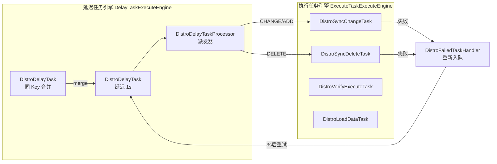
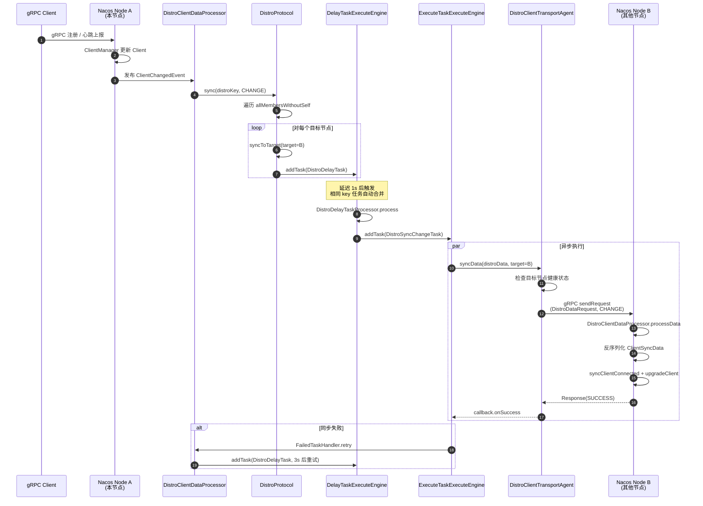
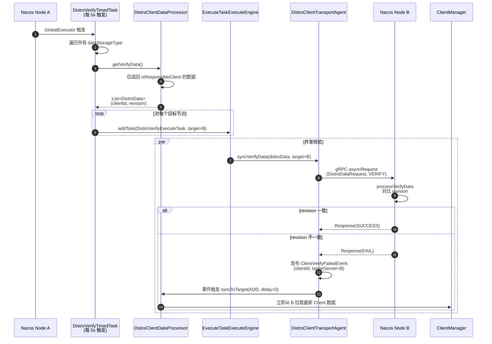
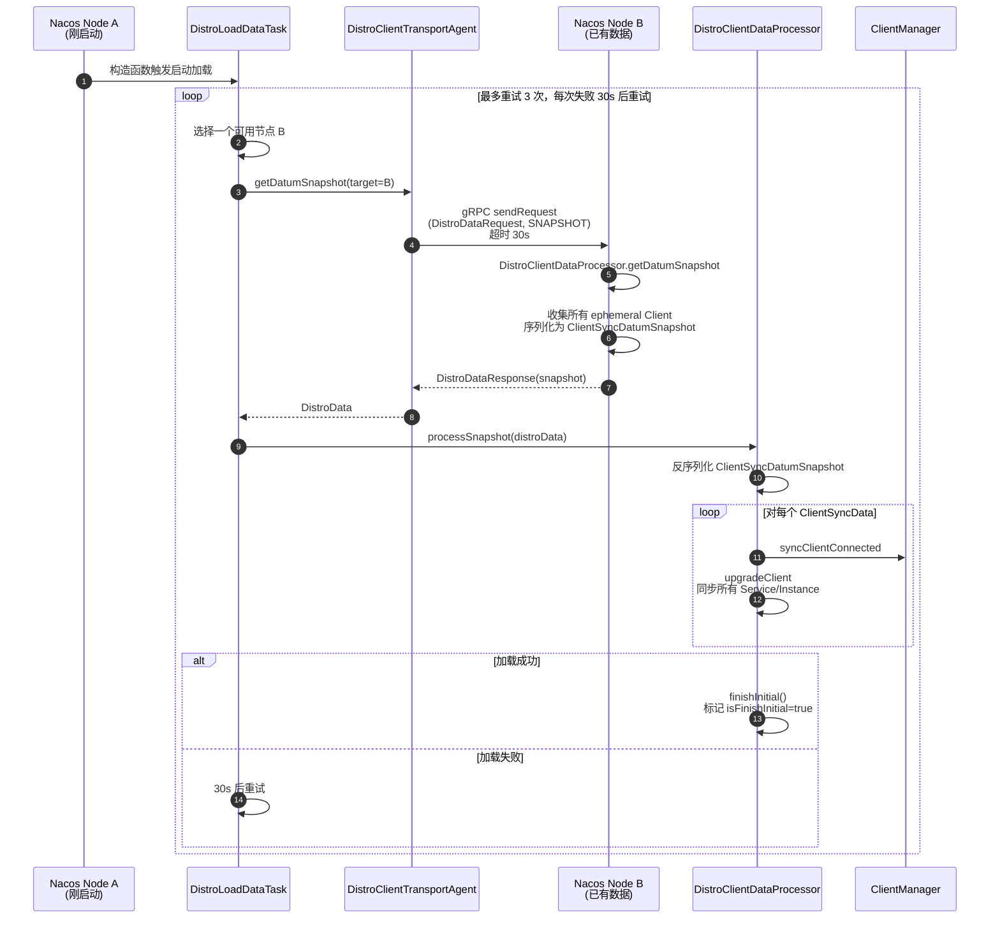
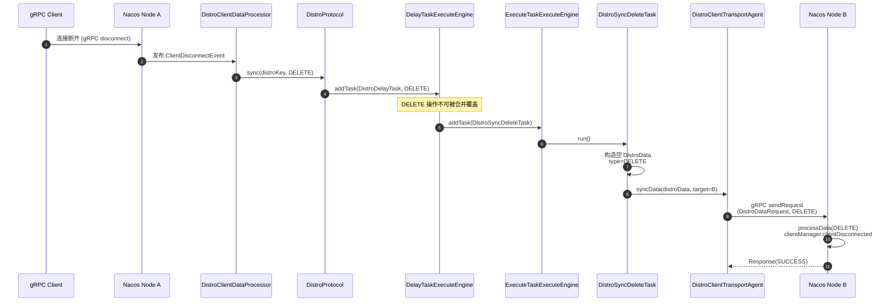
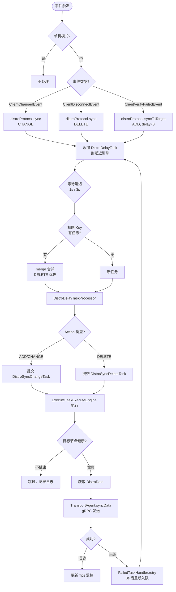
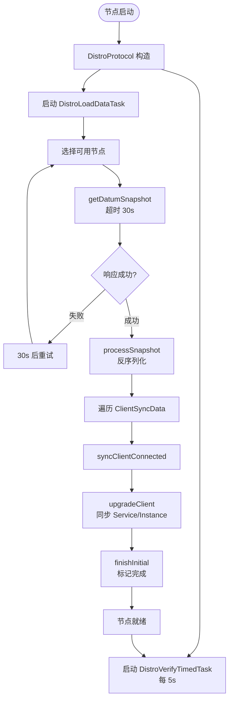
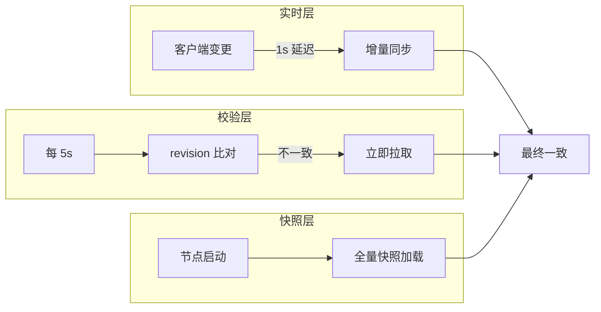

# Nacos AP 一致性（Distro 协议）实现原理源码深度分析

> 基于 Nacos 2.4.2 源码分析
> 分析对象：`core` 模块 Distro 协议核心 + `naming` 模块 v2 Distro 实现
> 输出包含：架构图、流程图、时序图（Mermaid 呈现）

---

## 一、概述

### 1.1 什么是 Distro 协议

Distro 是 Nacos 自主设计的 **AP（Available & Partition Tolerant）** 分布式一致性协议，专门用于 **临时数据（Ephemeral Data）** 的多节点同步。它的核心思想是：

- **每个节点负责一部分数据**：通过哈希取模将数据分配到不同节点
- **节点对等（Peer-to-Peer）**：所有节点地位平等，无 Leader
- **最终一致性**：通过增量同步 + 定时校验实现
- **去中心化**：任何节点都可接受写入，并同步到其他节点

与 CP 协议（基于 Raft 的 `JRafteeProtocol`）不同，Distro 不需要持久化日志、不需要 Leader 选举，在网络分区时仍可写入，是 Nacos Naming 模块临时实例同步的核心。

### 1.2 适用场景

| 数据类型 | 协议 | 示例 |
|---------|------|------|
| 临时实例（Ephemeral Instance） | **Distro (AP)** | gRPC 客户端注册的实例 |
| 持久实例（Persistent Instance） | JRaft (CP) | HTTP 注册的持久实例 |
| 配置数据 | 持久化 + JRaft | 配置中心数据 |

### 1.3 整体架构图

```mermaid
graph TB
    subgraph "Client"
        C1[gRPC Client]
    end

    subgraph "Nacos Server Node A (本节点)"
        subgraph "Naming 模块"
            NCA[ClientManager<br/>管理 Client]
            DCR[DistroClientComponentRegistry<br/>注册 Distro 组件]
            DCDP[DistroClientDataProcessor<br/>数据存储与处理]
            DCTA[DistroClientTransportAgent<br/>gRPC 传输代理]
            DCTFH[DistroClientTaskFailedHandler<br/>失败重试处理器]
        end

        subgraph "Core 模块"
            DP[DistroProtocol<br/>协议入口]
            DCH[DistroComponentHolder<br/>组件容器]
            DTEH[DistroTaskEngineHolder<br/>任务引擎容器]
            DLEE[DistroDelayTaskExecuteEngine<br/>延迟任务引擎]
            DEEE[DistroExecuteTaskExecuteEngine<br/>执行任务引擎]
            DVTT[DistroVerifyTimedTask<br/>定时校验任务 5s]
            DLDT[DistroLoadDataTask<br/>启动加载数据]
            DM[DistroMapper<br/>哈希路由]
            DF[DistroFilter<br/>HTTP 请求路由]
        end
    end

    subgraph "Nacos Server Node B/C (其他节点)"
        N2[对等节点<br/>相同架构]
    end

    C1 -->|gRPC 注册| NCA
    NCA --> DCR
    DCR -->|注册| DCH
    DCH --> DCDP
    DCH --> DCTA
    DCH --> DCTFH
    DCH --> DP

    NCA -->|事件触发| DCDP
    DCDP -->|sync| DP
    DP --> DLEE
    DLEE -->|派发| DEEE
    DEEE --> DCTA
    DCTA -->|gRPC 同步| N2

    DVTT -->|周期触发| DLEE
    DLDT -->|启动加载| DCTA
    DCTA -->|获取快照| N2

    DF --> DM
    DM -->|@CanDistro 路由| N2
```

---

## 二、核心组件

### 2.1 DistroProtocol — 协议入口

`core/src/main/java/com/alibaba/nacos/core/distributed/distro/DistroProtocol.java`

`DistroProtocol` 是 Distro 协议的对外入口，由 Spring 自动注入。构造函数中启动两个关键任务：

```java
@Component
public class DistroProtocol {

    public DistroProtocol(ServerMemberManager memberManager,
            DistroComponentHolder distroComponentHolder,
            DistroTaskEngineHolder distroTaskEngineHolder,
            DistroDataStorage dataStorage) {
        this.memberManager = memberManager;
        this.distroComponentHolder = distroComponentHolder;
        this.distroTaskEngineHolder = distroTaskEngineHolder;

        // 启动定时校验任务（每 5 秒一次）
        DistroVerifyTimedTask verifyTimedTask = new DistroVerifyTimedTask(
                distroComponentHolder, distroTaskEngineHolder, memberManager);
        GlobalExecutor.schedulePartitionDataTimedTask(verifyTimedTask,
                DistroConfig.getInstance().getVerifyIntervalMillis());

        // 启动加载任务（启动时加载快照）
        DistroLoadDataTask loadDataTask = new DistroLoadDataTask(
                memberManager, distroComponentHolder, distroTaskEngineHolder,
                new DistroCallback() {
                    @Override
                    public void onSuccess() { /* ... */ }
                    @Override
                    public void onFailed(Throwable throwable) { /* ... */ }
                });
        GlobalExecutor.submitLoadDataTask(loadDataTask);
    }
}
```

#### 核心方法

```java
// 同步数据到所有其他节点
public void sync(DistroKey distroKey, DataOperation action) {
    for (Member each : memberManager.allMembersWithoutSelf()) {
        syncToTarget(distroKey, action, each.getAddress(), DistroConfig.getInstance().getSyncDelayMillis());
    }
}

// 同步数据到指定目标节点
public void syncToTarget(DistroKey distroKey, DataOperation action,
                          String targetServer, long delayMillis) {
    DistroKey targetDistroKey = new DistroKey(distroKey.getResourceKey(),
            distroKey.getResourceType(), targetServer);
    DistroDelayTask distroDelayTask = new DistroDelayTask(targetDistroKey, action, delayMillis);
    distroTaskEngineHolder.getDelayTaskExecuteEngine().addTask(targetDistroKey, distroDelayTask);
}

// 接收其他节点的同步数据
public boolean onReceive(DistroData distroData, String sourceAddress) {
    DistroDataProcessor dataProcessor = distroComponentHolder.findDataProcessor(
            distroData.getDistroKey().getResourceType());
    return dataProcessor.processData(distroData);
}

// 校验数据
public boolean onVerify(DistroData distroData, String sourceAddress) {
    DistroDataProcessor dataProcessor = distroComponentHolder.findDataProcessor(
            distroData.getDistroKey().getResourceType());
    return dataProcessor.processVerifyData(distroData, sourceAddress);
}
```

### 2.2 DistroComponentHolder — 组件容器

`core/.../component/DistroComponentHolder.java`

按 `resourceType` 维度持有四类可插拔组件：

```java
public class DistroComponentHolder {

    private final Map<String, DistroTransportAgent> transportAgentMap = new ConcurrentHashMap<>();
    private final Map<String, DistroDataStorage> dataStorageMap = new ConcurrentHashMap<>();
    private final Map<String, DistroFailedTaskHandler> failedTaskHandlerMap = new ConcurrentHashMap<>();
    private final Map<String, DistroDataProcessor> dataProcessorMap = new ConcurrentHashMap<>();

    public void registerTransportAgent(String type, DistroTransportAgent agent) { ... }
    public void registerDataStorage(String type, DistroDataStorage storage) { ... }
    public void registerDataProcessor(DistroDataProcessor processor) { ... }
    public void registerFailedTaskHandler(String type, DistroFailedTaskHandler handler) { ... }
}
```

### 2.3 DistroTaskEngineHolder — 任务引擎容器

`core/.../task/DistroTaskEngineHolder.java`

```java
@Component
public class DistroTaskEngineHolder {

    private final DistroDelayTaskExecuteEngine delayTaskExecuteEngine;
    private final DistroExecuteTaskExecuteEngine executeTaskExecuteEngine;

    public DistroTaskEngineHolder(DistroComponentHolder componentHolder) {
        DistroDelayTaskProcessor defaultDelayTaskProcessor = new DistroDelayTaskProcessor(componentHolder, this);
        delayTaskExecuteEngine = new DistroDelayTaskExecuteEngine(defaultDelayTaskProcessor);
        executeTaskExecuteEngine = new DistroExecuteTaskExecuteEngine(componentHolder);
    }
}
```

### 2.4 DistroConfig — 配置

`core/.../DistroConfig.java` 默认参数：

| 参数 | 默认值 | 说明 |
|------|--------|------|
| `syncDelayMillis` | 1000ms | 数据变更同步延迟 |
| `syncTimeoutMillis` | 3000ms | 同步超时 |
| `syncRetryDelayMillis` | 3000ms | 失败重试延迟 |
| `verifyIntervalMillis` | 5000ms | 校验周期 |
| `verifyTimeoutMillis` | 3000ms | 校验超时 |
| `loadDataRetryDelayMillis` | 30000ms | 启动加载重试延迟 |
| `loadDataTimeoutMillis` | 30000ms | 启动加载超时 |

---

## 三、数据模型

### 3.1 DistroKey — 数据定位键

`core/.../entity/DistroKey.java`

```java
public class DistroKey {

    private String resourceKey;       // 资源键，如 clientId
    private String resourceType;      // 资源类型，如 "Nacos:Naming:v2:ClientData"
    private String targetServer;      // 目标服务器地址

    // 用于任务引擎中的任务合并、去重
}
```

### 3.2 DistroData — 传输数据

`core/.../entity/DistroData.java`

```java
public class DistroData {

    private DistroKey distroKey;
    private DataOperation type;   // ADD / CHANGE / DELETE / VERIFY / QUERY / SNAPSHOT
    private byte[] content;       // 序列化后的字节内容
}
```

### 3.3 DataOperation — 操作枚举

```java
public enum DataOperation {
    ADD,      // 添加
    CHANGE,   // 变更
    DELETE,   // 删除
    VERIFY,   // 校验
    QUERY,    // 查询
    SNAPSHOT  // 快照
}
```

---

## 四、任务体系

Distro 协议采用 **两级任务引擎** 设计：延迟任务引擎合并去重，执行任务引擎异步并发。



### 4.1 DistroDelayTask — 延迟任务

`core/.../task/delay/DistroDelayTask.java`

```java
public class DistroDelayTask extends AbstractDelayTask {

    private final DistroKey distroKey;
    private final DataOperation action;
    private long createTime;

    public DistroDelayTask(DistroKey distroKey, DataOperation action, long delayTime) {
        this.distroKey = distroKey;
        this.action = action;
        this.setTaskInterval(delayTime);
        this.setLastProcessTime(System.currentTimeMillis());
        this.createTime = System.currentTimeMillis();
    }

    /**
     * 任务合并：相同 key 的任务会被合并
     * DELETE 优先级最高，会覆盖其他操作
     */
    @Override
    public void merge(AbstractDelayTask task) {
        if (!(task instanceof DistroDelayTask)) {
            return;
        }
        DistroDelayTask newTask = (DistroDelayTask) task;
        if (!action.equals(newTask.getAction())) {
            if (DataOperation.DELETE.equals(newTask.getAction())
                    || DataOperation.DELETE.equals(action)) {
                action = DataOperation.DELETE;
            } else {
                action = DataOperation.CHANGE;
            }
        }
        // 取较晚的创建时间
        this.createTime = Math.max(this.createTime, newTask.createTime);
    }
}
```

**关键设计**：相同 `DistroKey` 的任务自动合并，避免短时间重复同步；DELETE 操作不可被覆盖。

### 4.2 DistroDelayTaskProcessor — 延迟任务派发器

`core/.../task/delay/DistroDelayTaskProcessor.java`

```java
public class DistroDelayTaskProcessor implements NacosTaskProcessor {

    @Override
    public boolean process(AbstractDelayTask task) {
        if (!(task instanceof DistroDelayTask)) {
            return false;
        }
        DistroDelayTask distroDelayTask = (DistroDelayTask) task;
        DistroKey distroKey = distroDelayTask.getDistroKey();
        DistroDataStorage dataStorage =
                distroComponentHolder.findDataStorage(distroKey.getResourceType());

        switch (distroDelayTask.getAction()) {
            case DELETE:
                // 构造删除任务
                DistroSyncDeleteTask deleteTask = new DistroSyncDeleteTask(
                        distroKey, distroComponentHolder, distroTaskEngineHolder);
                distroTaskEngineHolder.getExecuteTaskExecuteEngine().addTask(distroKey, deleteTask);
                break;
            case ADD:
            case CHANGE:
                // 构造变更同步任务
                DistroSyncChangeTask changeTask = new DistroSyncChangeTask(
                        distroKey, distroComponentHolder, distroTaskEngineHolder);
                distroTaskEngineHolder.getExecuteTaskExecuteEngine().addTask(distroKey, changeTask);
                break;
            default:
                return false;
        }
        return true;
    }
}
```

### 4.3 AbstractDistroExecuteTask — 执行任务基类

`core/.../task/execute/AbstractDistroExecuteTask.java`

```java
public abstract class AbstractDistroExecuteTask implements NacosTask {

    @Override
    public void run() {
        DistroTransportAgent transportAgent =
                distroComponentHolder.findTransportAgent(distroKey.getResourceType());
        if (transportAgent.supportCallbackTransport()) {
            // 支持回调：异步执行
            doExecuteWithCallback(new DistroExecuteCallback());
        } else {
            // 同步执行
            boolean result = doExecute();
            if (!result) {
                handleFail();
            }
        }
    }

    private class DistroExecuteCallback implements DistroCallback {
        @Override
        public void onSuccess() { /* ... */ }
        @Override
        public void onFailed(Throwable throwable) { handleFail(); }
    }

    private void handleFail() {
        // 失败时通过 FailedTaskHandler 重新入队（延迟 3s）
        DistroFailedTaskHandler failedTaskHandler =
                distroComponentHolder.findFailedTaskHandler(distroKey.getResourceType());
        failedTaskHandler.retry(distroKey, getAction());
    }
}
```

### 4.4 DistroSyncChangeTask — 变更同步任务

`core/.../task/execute/DistroSyncChangeTask.java`

```java
public class DistroSyncChangeTask extends AbstractDistroExecuteTask {

    @Override
    protected boolean doExecute() {
        DistroData distroData = distroComponentHolder
                .findDataStorage(distroKey.getResourceType()).getDistroData(distroKey);
        return distroComponentHolder
                .findTransportAgent(distroKey.getResourceType())
                .syncData(distroData, distroKey.getTargetServer());
    }

    @Override
    protected void doExecuteWithCallback(DistroCallback callback) {
        DistroData distroData = distroComponentHolder
                .findDataStorage(distroKey.getResourceType()).getDistroData(distroKey);
        distroComponentHolder
                .findTransportAgent(distroKey.getResourceType())
                .syncData(distroData, distroKey.getTargetServer(), callback);
    }

    @Override
    protected DataOperation getAction() {
        return DataOperation.CHANGE;
    }
}
```

### 4.5 DistroVerifyTimedTask — 定时校验任务

`core/.../task/verify/DistroVerifyTimedTask.java`

每 5 秒触发，对每个 resourceType 获取本校验数据，分发到所有其他节点。

```java
public class DistroVerifyTimedTask implements Runnable {

    @Override
    public void run() {
        for (String each : distroComponentHolder.getDataStorageTypes()) {
            DistroDataStorage dataStorage = distroComponentHolder.findDataStorage(each);
            List<DistroData> verifyData = dataStorage.getVerifyData();
            if (CollectionUtils.isEmpty(verifyData)) {
                continue;
            }
            // 对每个目标节点提交校验任务
            for (Member member : memberManager.allMembersWithoutSelf()) {
                for (DistroData data : verifyData) {
                    DistroKey distroKey = new DistroKey(
                            data.getDistroKey().getResourceKey(),
                            data.getDistroKey().getResourceType(),
                            member.getAddress());
                    DistroVerifyExecuteTask task = new DistroVerifyExecuteTask(
                            distroKey, data, distroComponentHolder, distroTaskEngineHolder);
                    distroTaskEngineHolder.getExecuteTaskExecuteEngine().addTask(distroKey, task);
                }
            }
        }
    }
}
```

### 4.6 DistroVerifyExecuteTask — 校验执行任务

`core/.../task/verify/DistroVerifyExecuteTask.java`

```java
public class DistroVerifyExecuteTask extends AbstractDistroExecuteTask {

    @Override
    protected boolean doExecute() {
        return distroComponentHolder
                .findTransportAgent(distroKey.getResourceType())
                .syncVerifyData(distroData, distroKey.getTargetServer());
    }

    @Override
    protected DataOperation getAction() {
        return DataOperation.VERIFY;
    }
}
```

### 4.7 DistroLoadDataTask — 启动加载任务

`core/.../task/load/DistroLoadDataTask.java`

启动时从其他节点加载完整快照，失败则每 30s 重试。

```java
public class DistroLoadDataTask implements Runnable {

    @Override
    public void run() {
        try {
            loadAllData();
            // 加载成功，标记初始化完成
            distroComponentHolder.findDataStorage(...).finishInitial();
        } catch (Exception e) {
            // 失败，30s 后重试
            GlobalExecutor.submitLoadDataTask(this,
                    DistroConfig.getInstance().getLoadDataRetryDelayMillis());
        }
    }

    private void loadAllData() {
        // 1. 选择一个可用节点
        // 2. 获取快照：transportAgent.getDatumSnapshot(targetServer)
        // 3. 处理快照：dataProcessor.processSnapshot(distroData)
    }
}
```

---

## 五、Naming 模块 v2 实现

Naming 模块通过 `DistroClientComponentRegistry` 把自身实现注册到 Distro 协议中，资源类型为 `"Nacos:Naming:v2:ClientData"`。

### 5.1 DistroClientComponentRegistry — 组件注册

`naming/.../consistency/ephemeral/distro/v2/DistroClientComponentRegistry.java`

```java
@Component
public class DistroClientComponentRegistry {

    @PostConstruct
    public void doRegister() {
        DistroClientDataProcessor dataProcessor =
                new DistroClientDataProcessor(clientManager, distroProtocol);
        DistroTransportAgent transportAgent =
                new DistroClientTransportAgent(clusterRpcClientProxy, serverMemberManager);
        DistroClientTaskFailedHandler taskFailedHandler =
                new DistroClientTaskFailedHandler(taskEngineHolder);

        // 注册到 DistroComponentHolder
        componentHolder.registerDataStorage(DistroClientDataProcessor.TYPE, dataProcessor);
        componentHolder.registerDataProcessor(dataProcessor);
        componentHolder.registerTransportAgent(DistroClientDataProcessor.TYPE, transportAgent);
        componentHolder.registerFailedTaskHandler(DistroClientDataProcessor.TYPE, taskFailedHandler);
    }
}
```

### 5.2 DistroClientDataProcessor — 数据存储与处理器

`naming/.../consistency/ephemeral/distro/v2/DistroClientDataProcessor.java`

同时实现 `DistroDataStorage`（生产同步数据）和 `DistroDataProcessor`（消费同步数据），并订阅客户端事件。

```java
public class DistroClientDataProcessor extends SmartSubscriber
        implements DistroDataStorage, DistroDataProcessor {

    public static final String TYPE = "Nacos:Naming:v2:ClientData";

    // === 事件订阅：客户端变更触发同步 ===
    @Override
    public void onEvent(Event event) {
        if (EnvUtil.getStandaloneMode()) {
            return;  // 单机模式不同步
        }
        if (event instanceof ClientEvent.ClientVerifyFailedEvent) {
            syncToVerifyFailedServer((ClientEvent.ClientVerifyFailedEvent) event);
        } else {
            syncToAllServer((ClientEvent) event);
        }
    }

    private void syncToAllServer(ClientEvent event) {
        Client client = event.getClient();
        if (isInvalidClient(client)) {
            return;
        }
        if (event instanceof ClientEvent.ClientDisconnectEvent) {
            // 客户端断开：删除同步
            DistroKey distroKey = new DistroKey(client.getClientId(), TYPE);
            distroProtocol.sync(distroKey, DataOperation.DELETE);
        } else if (event instanceof ClientEvent.ClientChangedEvent) {
            // 客户端变更：变更同步
            DistroKey distroKey = new DistroKey(client.getClientId(), TYPE);
            distroProtocol.sync(distroKey, DataOperation.CHANGE);
        }
    }

    private void syncToVerifyFailedServer(ClientEvent.ClientVerifyFailedEvent event) {
        Client client = clientManager.getClient(event.getClientId());
        if (isInvalidClient(client)) {
            return;
        }
        DistroKey distroKey = new DistroKey(client.getClientId(), TYPE);
        // 校验失败：立即同步到目标节点（延迟 0）
        distroProtocol.syncToTarget(distroKey, DataOperation.ADD, event.getTargetServer(), 0L);
    }

    // === DistroDataProcessor：处理接收的数据 ===
    @Override
    public boolean processData(DistroData distroData) {
        switch (distroData.getType()) {
            case ADD:
            case CHANGE:
                ClientSyncData clientSyncData = ApplicationUtils.getBean(Serializer.class)
                        .deserialize(distroData.getContent(), ClientSyncData.class);
                handlerClientSyncData(clientSyncData);
                return true;
            case DELETE:
                String deleteClientId = distroData.getDistroKey().getResourceKey();
                clientManager.clientDisconnected(deleteClientId);
                return true;
            default:
                return false;
        }
    }

    @Override
    public boolean processVerifyData(DistroData distroData, String sourceAddress) {
        DistroClientVerifyInfo verifyData = ApplicationUtils.getBean(Serializer.class)
                .deserialize(distroData.getContent(), DistroClientVerifyInfo.class);
        return clientManager.verifyClient(verifyData);
    }

    // === DistroDataStorage：生产同步数据 ===
    @Override
    public DistroData getDistroData(DistroKey distroKey) {
        Client client = clientManager.getClient(distroKey.getResourceKey());
        if (null == client) {
            return null;
        }
        byte[] data = ApplicationUtils.getBean(Serializer.class)
                .serialize(client.generateSyncData());
        return new DistroData(distroKey, data);
    }

    @Override
    public List<DistroData> getVerifyData() {
        List<DistroData> result = null;
        for (String each : clientManager.allClientId()) {
            Client client = clientManager.getClient(each);
            if (null == client || !client.isEphemeral()) {
                continue;
            }
            // 仅同步本节点负责的客户端
            if (clientManager.isResponsibleClient(client)) {
                DistroClientVerifyInfo verifyData =
                        new DistroClientVerifyInfo(client.getClientId(), client.getRevision());
                DistroKey distroKey = new DistroKey(client.getClientId(), TYPE);
                DistroData data = new DistroData(distroKey,
                        ApplicationUtils.getBean(Serializer.class).serialize(verifyData));
                data.setType(DataOperation.VERIFY);
                if (result == null) {
                    result = new LinkedList<>();
                }
                result.add(data);
            }
        }
        return result;
    }
}
```

### 5.3 DistroClientVerifyInfo — 校验数据

`naming/.../consistency/ephemeral/distro/v2/DistroClientVerifyInfo.java`

```java
public class DistroClientVerifyInfo implements Serializable {

    private String clientId;
    private long revision;   // 客户端数据版本号，用于快速比对

    public DistroClientVerifyInfo(String clientId, long revision) {
        this.clientId = clientId;
        this.revision = revision;
    }
}
```

**校验机制**：通过 `revision` 数值比对，若本节点 revision 与远端不一致，则触发 `ClientVerifyFailedEvent`，立即拉取最新数据。

### 5.4 DistroClientTransportAgent — gRPC 传输代理

`naming/.../consistency/ephemeral/distro/v2/DistroClientTransportAgent.java`

```java
public class DistroClientTransportAgent implements DistroTransportAgent {

    @Override
    public boolean supportCallbackTransport() {
        return true;   // 支持异步回调
    }

    // 同步数据到目标节点
    @Override
    public boolean syncData(DistroData data, String targetServer) {
        if (isNoExistTarget(targetServer)) {
            return true;
        }
        DistroDataRequest request = new DistroDataRequest(data, data.getType());
        Member member = memberManager.find(targetServer);
        if (checkTargetServerStatusUnhealthy(member)) {
            return false;
        }
        try {
            Response response = clusterRpcClientProxy.sendRequest(member, request);
            return checkResponse(response);
        } catch (NacosException e) {
            Loggers.DISTRO.error("[DISTRO-FAILED] Sync distro data failed! key: {}", data.getDistroKey(), e);
        }
        return false;
    }

    // 同步校验数据：失败时发布 ClientVerifyFailedEvent
    @Override
    public void syncVerifyData(DistroData verifyData, String targetServer, DistroCallback callback) {
        DistroDataRequest request = new DistroDataRequest(verifyData, DataOperation.VERIFY);
        Member member = memberManager.find(targetServer);
        DistroVerifyCallbackWrapper wrapper = new DistroVerifyCallbackWrapper(
                targetServer, verifyData.getDistroKey().getResourceKey(), callback, member);
        clusterRpcClientProxy.asyncRequest(member, request, wrapper);
    }

    // 校验回调：失败时通知重新同步
    private class DistroVerifyCallbackWrapper implements RequestCallBack<Response> {
        @Override
        public void onResponse(Response response) {
            if (checkResponse(response)) {
                NamingTpsMonitor.distroVerifySuccess(member.getAddress(), member.getIp());
                distroCallback.onSuccess();
            } else {
                // 校验失败：发布事件触发立即同步
                Loggers.DISTRO.info("Target {} verify client {} failed, sync new client",
                        targetServer, clientId);
                NotifyCenter.publishEvent(
                        new ClientEvent.ClientVerifyFailedEvent(clientId, targetServer));
                distroCallback.onFailed(null);
            }
        }
    }
}
```

### 5.5 DistroClientTaskFailedHandler — 失败重试

`naming/.../consistency/ephemeral/distro/v2/DistroClientTaskFailedHandler.java`

```java
public class DistroClientTaskFailedHandler implements DistroFailedTaskHandler {

    @Override
    public void retry(DistroKey distroKey, DataOperation action) {
        // 重新构造延迟任务，3s 后再次执行
        DistroDelayTask retryTask = new DistroDelayTask(distroKey, action,
                DistroConfig.getInstance().getSyncRetryDelayMillis());
        distroTaskEngineHolder.getDelayTaskExecuteEngine().addTask(distroKey, retryTask);
    }
}
```

---

## 六、HTTP 请求路由：DistroFilter + DistroMapper

对于带 `@CanDistro` 注解的 HTTP 接口（如 v1 注册接口），Distro 通过 `DistroFilter` 将请求路由到真正负责该资源的节点。

### 6.1 DistroMapper — 哈希路由

`naming/.../core/DistroMapper.java`

```java
public class DistroMapper {

    // 哈希取模：abs(tag.hashCode() % Integer.MAX_VALUE) % servers.size()
    public String map(String tag) {
        List<String> servers = getHealthyList();
        int index = distroHash(tag) % servers.size();
        return servers.get(index);
    }

    public boolean responsible(String tag) {
        List<String> servers = getHealthyList();
        return servers.get(distroHash(tag) % servers.size()).equals(memberManager.getSelf().getAddress());
    }
}
```

> **注意**：Distro 使用的是 **简单哈希取模**，不是一致性哈希环。当节点列表变化时，数据分布会重新计算，需要全量重新同步。

### 6.2 DistroFilter — 请求重定向

`naming/.../core/DistroFilter.java`

```java
public class DistroFilter implements Filter {

    @Override
    public void doFilter(ServletRequest request, ServletResponse response, FilterChain chain) {
        HttpServletRequest req = (HttpServletRequest) request;
        // 检查方法是否有 @CanDistro
        if (!isDistroRequest(req)) {
            chain.doFilter(request, response);
            return;
        }

        // 计算资源对应的负责节点
        String targetServer = distroMapper.map(resourceTag);
        if (targetServer.equals(memberManager.getSelf().getAddress())) {
            // 当前节点负责：放行
            chain.doFilter(request, response);
        } else {
            // 转发到负责节点
            proxyRequest(req, (HttpServletResponse) response, targetServer);
        }
    }
}
```

---

## 七、核心流程时序图

### 7.1 数据变更同步流程

客户端注册/变更触发数据同步的完整流程：



### 7.2 定时校验流程



### 7.3 启动加载数据流程



### 7.4 客户端断开删除流程



---

## 八、整体工作流程图

### 8.1 完整同步流程



### 8.2 节点启动初始化流程



---

## 九、设计要点与总结

### 9.1 Distro 协议关键设计

| 设计点 | 实现方式 | 优势 |
|--------|---------|------|
| **AP 语义** | 无 Leader、节点对等、写入即可响应 | 高可用、低延迟 |
| **数据分区** | `DistroMapper` 简单哈希取模 | 实现简单、分布均匀 |
| **增量同步** | 事件驱动，仅同步变化的 Client | 减少网络流量 |
| **任务合并** | `DistroDelayTask.merge()` | 高频变更下合并请求 |
| **异步回调** | `supportCallbackTransport=true` | 不阻塞工作线程 |
| **失败重试** | `DistroFailedTaskHandler` 重新入队 | 容错、最终一致 |
| **定时校验** | 5s 周期 + revision 对比 | 兜底一致性修复 |
| **快速修复** | `ClientVerifyFailedEvent` 立即同步 | 校验失败时立即拉取 |
| **启动加载** | 从其他节点拉取全量快照 | 新节点快速就绪 |
| **组件化** | `DistroComponentHolder` 按类型注册 | 解耦协议核心与业务实现 |

### 9.2 与 CP（Raft）协议对比

| 维度 | Distro (AP) | JRaft (CP) |
|------|-------------|------------|
| 一致性 | 最终一致 | 强一致 |
| 可用性 | 分区下仍可写 | 多数派失败则不可用 |
| Leader | 无 | 有 |
| 持久化 | 内存 | 日志持久化 |
| 同步方式 | 推（事件驱动）+ 拉（校验/快照） | 日志复制 |
| 适用数据 | 临时数据 | 持久数据 |
| 性能 | 高（无共识开销） | 相对低（共识开销） |

### 9.3 一致性保证机制

Distro 通过 **三层机制** 保证最终一致性：

1. **实时层**：客户端变更立即触发 `sync(CHANGE)`，1s 延迟后异步推送
2. **校验层**：每 5s 全节点 revision 比对，发现差异立即修复
3. **快照层**：节点启动时全量拉取快照，保证新节点数据完整



### 9.4 Naming 模块 Distro 完整调用链

```
gRPC Client 注册
  └─> ClientManager.syncClientConnected / updateClient
       └─> NotifyCenter.publishEvent(ClientChangedEvent)
            └─> DistroClientDataProcessor.onEvent
                 └─> DistroProtocol.sync(distroKey, CHANGE)
                      └─> DistroProtocol.syncToTarget(对每个非本节点)
                           └─> DelayTaskExecuteEngine.addTask(DistroDelayTask)
                                └─> (1s 后) DistroDelayTaskProcessor.process
                                     └─> ExecuteTaskExecuteEngine.addTask(DistroSyncChangeTask)
                                          └─> DistroSyncChangeTask.doExecuteWithCallback
                                               └─> DistroClientTransportAgent.syncData
                                                    └─> ClusterRpcClientProxy.asyncRequest (gRPC)
                                                         └─> 远端 DistroDataRequestHandler
                                                              └─> DistroProtocol.onReceive
                                                                   └─> DistroClientDataProcessor.processData
                                                                        └─> handlerClientSyncData
                                                                             └─> ClientManager.syncClientConnected + upgradeClient
```

### 9.5 关键源码文件索引

| 模块 | 文件 | 作用 |
|------|------|------|
| core | `distributed/distro/DistroProtocol.java` | 协议入口 |
| core | `distributed/distro/DistroConfig.java` | 配置 |
| core | `distributed/distro/DistroConstants.java` | 常量 |
| core | `distributed/distro/component/DistroComponentHolder.java` | 组件容器 |
| core | `distributed/distro/task/DistroTaskEngineHolder.java` | 任务引擎容器 |
| core | `distributed/distro/task/delay/DistroDelayTask.java` | 延迟任务 |
| core | `distributed/distro/task/delay/DistroDelayTaskProcessor.java` | 延迟任务派发 |
| core | `distributed/distro/task/execute/AbstractDistroExecuteTask.java` | 执行任务基类 |
| core | `distributed/distro/task/execute/DistroSyncChangeTask.java` | 变更同步任务 |
| core | `distributed/distro/task/execute/DistroSyncDeleteTask.java` | 删除同步任务 |
| core | `distributed/distro/task/verify/DistroVerifyTimedTask.java` | 定时校验任务 |
| core | `distributed/distro/task/verify/DistroVerifyExecuteTask.java` | 校验执行任务 |
| core | `distributed/distro/task/load/DistroLoadDataTask.java` | 启动加载任务 |
| core | `distributed/distro/entity/DistroKey.java` | 数据键 |
| core | `distributed/distro/entity/DistroData.java` | 传输数据 |
| naming | `consistency/ephemeral/distro/v2/DistroClientComponentRegistry.java` | 组件注册 |
| naming | `consistency/ephemeral/distro/v2/DistroClientDataProcessor.java` | 数据存储与处理 |
| naming | `consistency/ephemeral/distro/v2/DistroClientTransportAgent.java` | gRPC 传输 |
| naming | `consistency/ephemeral/distro/v2/DistroClientTaskFailedHandler.java` | 失败重试 |
| naming | `consistency/ephemeral/distro/v2/DistroClientVerifyInfo.java` | 校验信息 |
| naming | `core/DistroMapper.java` | 哈希路由 |
| naming | `core/DistroFilter.java` | HTTP 请求路由 |

---

## 十、总结

Nacos Distro 协议是 **面向临时数据场景精心设计的 AP 协议**，其核心特点：

1. **去中心化对等架构**：无 Leader，任何节点都能写入，通过哈希取模确定数据归属
2. **事件驱动 + 延迟合并**：客户端变更立即触发，延迟 1s 合并相同 key 任务，避免高频同步
3. **两级任务引擎**：延迟引擎负责任务合并、执行引擎负责任务并发，职责清晰
4. **三重一致性保障**：实时增量同步 + 5s 定时校验 + 启动全量快照
5. **快速修复机制**：校验失败时通过 `ClientVerifyFailedEvent` 立即拉取（延迟 0），不等待下个周期
6. **组件化设计**：`DistroComponentHolder` 按资源类型注册，Core 与业务模块解耦，Naming 通过 `DistroClientComponentRegistry` 接入
7. **gRPC 异步回调**：基于 `ClusterRpcClientProxy` 实现非阻塞传输，配合 `RequestCallBack` 完成回调
8. **完善的容错**：失败 3s 重试、启动 30s 重试、健康检查前置，多层级容错保证最终一致

通过 Distro 协议，Nacos 在 **可用性、性能、一致性** 之间取得了良好平衡：分区容忍下保持高可用、事件驱动下保持低延迟、三重校验下保证最终一致，是 Naming 临时实例同步的基石。
