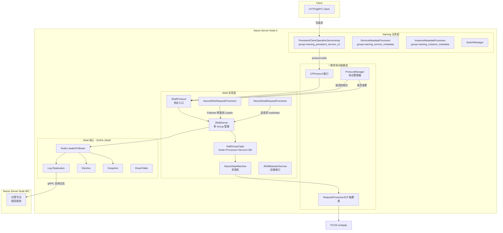
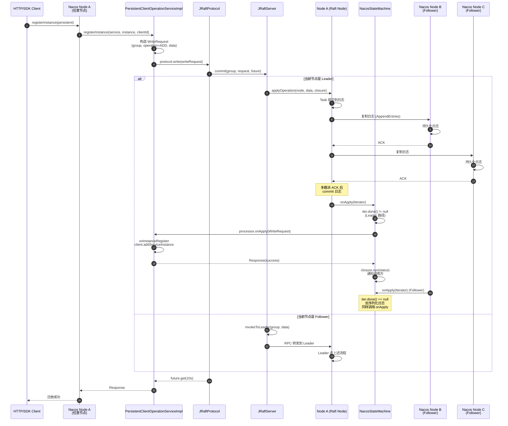
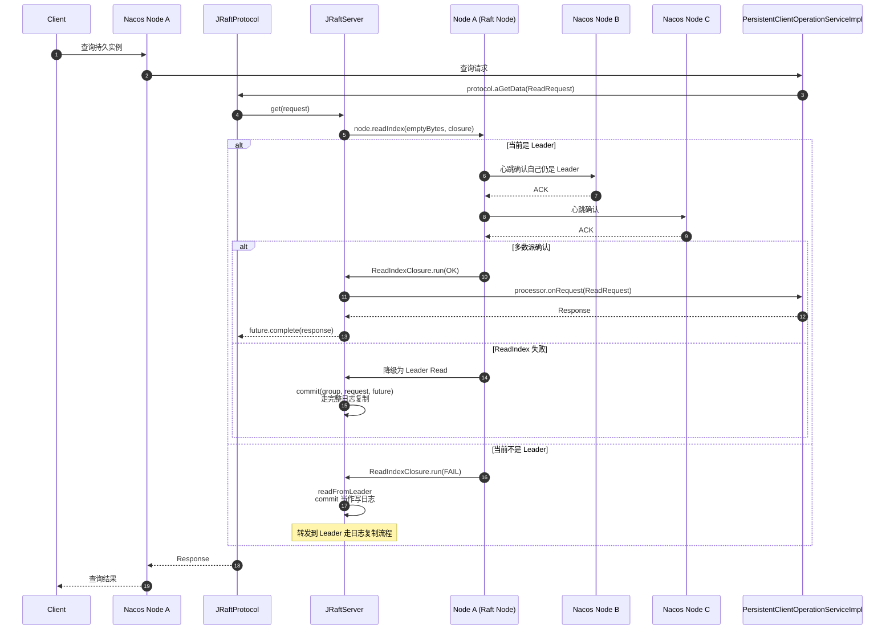
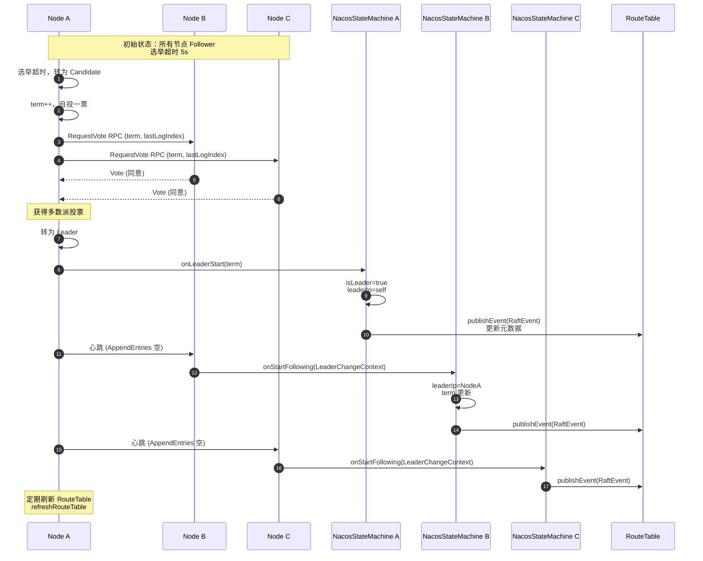
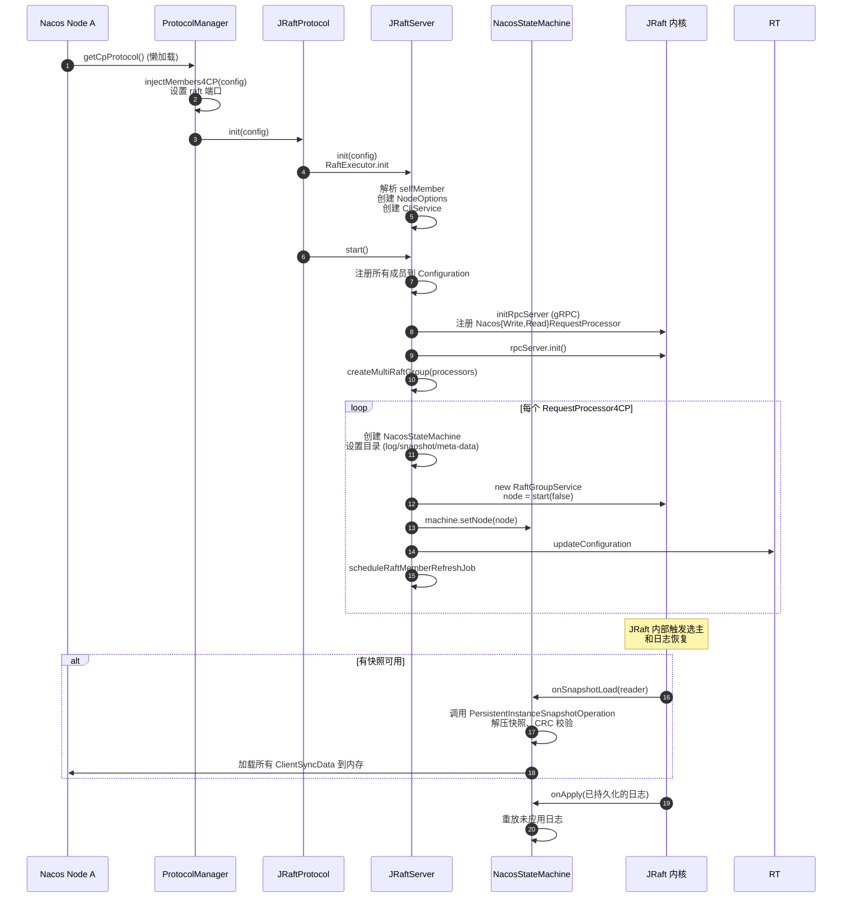
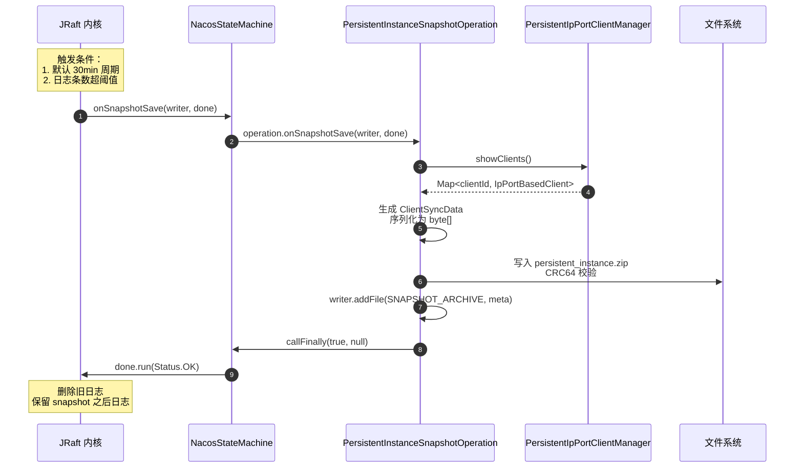
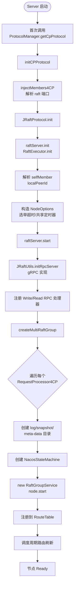
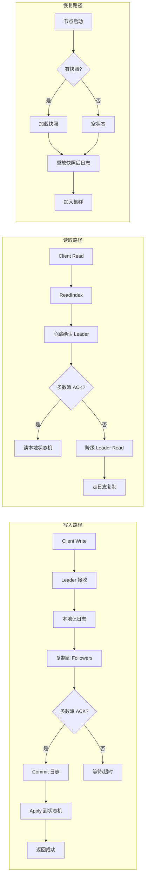
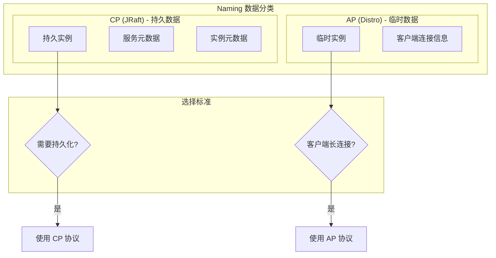

# Nacos CP 一致性（JRaft 协议）实现原理源码深度分析

> 基于 Nacos 2.4.2 源码分析
> 分析对象：`consistency` 模块 CP 协议接口 + `core` 模块 JRaft 实现 + `naming` 模块 CP 业务接入
> 输出包含：架构图、流程图、时序图（Mermaid 呈现）

---

## 一、概述

### 1.1 什么是 Nacos CP 协议

Nacos 的 CP（Consistency & Partition tolerance）一致性协议基于 **SOFA-JRaft** 实现，用于 **持久化数据** 的强一致同步。其核心特征：

- **强一致性（Linearizability）**：所有读写都经过 Leader，保证全局有序
- **基于 Raft 共识**：Leader 选举、日志复制、多数派提交
- **多 Raft Group**：不同业务模块使用独立 Raft Group，互不影响
- **持久化日志**：所有写操作先记日志再 apply 到状态机，故障恢复后可重放
- **Snapshot 机制**：定期快照压缩日志，加速节点启动恢复

与 AP（Distro）协议不同，CP 协议在网络分区且多数派不可达时**拒绝写入**，但保证各节点数据强一致。

### 1.2 适用场景

| 数据类型 | 协议 | 示例 |
|---------|------|------|
| 持久实例（Persistent Instance） | **JRaft (CP)** | HTTP/SDK 注册的持久实例 |
| 服务元数据（Service Metadata） | **JRaft (CP)** | 服务保护阈值、选择器等 |
| 实例元数据（Instance Metadata） | **JRaft (CP)** | 实例自定义元数据 |
| Switch 元数据 | **JRaft (CP)** | Naming 开关数据 |
| 临时实例（Ephemeral Instance） | Distro (AP) | gRPC 客户端注册的临时实例 |

### 1.3 整体架构图



---

## 二、协议抽象层

CP 协议在 `consistency` 模块定义接口，在 `core` 模块提供 JRaft 实现。

### 2.1 ConsistencyProtocol — 协议顶层接口

`consistency/.../ConsistencyProtocol.java`

```java
public interface ConsistencyProtocol<T extends Config, P extends RequestProcessor>
        extends CommandOperations {

    void init(T config);

    void addRequestProcessors(Collection<P> processors);

    ProtocolMetaData protocolMetaData();

    // 同步读
    Response getData(ReadRequest request) throws Exception;

    // 异步读
    CompletableFuture<Response> aGetData(ReadRequest request);

    // 同步写
    Response write(WriteRequest request) throws Exception;

    // 异步写
    CompletableFuture<Response> writeAsync(WriteRequest request);

    // 成员变更
    void memberChange(Set<String> addresses);

    boolean isReady();

    void shutdown();
}
```

### 2.2 CPProtocol — CP 协议特化接口

`consistency/.../cp/CPProtocol.java`

```java
public interface CPProtocol<C extends Config, P extends RequestProcessor4CP>
        extends ConsistencyProtocol<C, P> {

    /** 判断当前节点是否是指定 group 的 Leader */
    boolean isLeader(String group);
}
```

### 2.3 RequestProcessor / RequestProcessor4CP — 业务处理器

`consistency/.../RequestProcessor.java` + `consistency/.../cp/RequestProcessor4CP.java`

```java
public abstract class RequestProcessor {

    /** 处理读请求 */
    public abstract Response onRequest(ReadRequest request);

    /** 处理已提交的写日志（apply） */
    public abstract Response onApply(WriteRequest log);

    /** 不可恢复错误回调 */
    public void onError(Throwable error) {}

    /** 业务唯一标识，对应 Raft Group 名 */
    public abstract String group();
}

public abstract class RequestProcessor4CP extends RequestProcessor {

    /** 业务自定义快照操作 */
    public List<SnapshotOperation> loadSnapshotOperate() {
        return Collections.emptyList();
    }
}
```

> **关键设计**：每个 `RequestProcessor4CP` 实例对应一个独立 Raft Group，`group()` 返回值即 Raft Group ID。这样不同业务模块（持久实例、服务元数据、实例元数据）的日志互不影响，一个模块异常不会阻塞其他模块。

### 2.4 ProtocolManager — 协议管理器

`core/.../distributed/ProtocolManager.java`

Spring 单例 Bean，**懒加载**初始化 CP/AP 协议，并监听成员变更。

```java
@Component("ProtocolManager")
public class ProtocolManager extends MemberChangeListener implements DisposableBean {

    private CPProtocol cpProtocol;
    private volatile boolean cpInit = false;

    public CPProtocol getCpProtocol() {
        if (!cpInit) {
            synchronized (cpLock) {
                if (!cpInit) {
                    initCPProtocol();
                    cpInit = true;
                }
            }
        }
        return cpProtocol;
    }

    private void initCPProtocol() {
        ApplicationUtils.getBeanIfExist(CPProtocol.class, protocol -> {
            Class configType = ClassUtils.resolveGenericType(protocol.getClass());
            Config config = (Config) ApplicationUtils.getBean(configType);
            injectMembers4CP(config);
            protocol.init(config);
            ProtocolManager.this.cpProtocol = protocol;
        });
    }

    /** CP 协议使用 raft 端口（默认 7848） */
    private void injectMembers4CP(Config config) {
        final Member selfMember = memberManager.getSelf();
        final String self = selfMember.getIp() + ":" +
                Integer.parseInt(String.valueOf(selfMember.getExtendVal(MemberMetaDataConstants.RAFT_PORT)));
        Set<String> others = toCPMembersInfo(memberManager.allMembers());
        config.setMembers(self, others);
    }

    @Override
    public void onEvent(MembersChangeEvent event) {
        if (Objects.nonNull(cpProtocol)) {
            ProtocolExecutor.cpMemberChange(
                    () -> cpProtocol.memberChange(toCPMembersInfo(event.getMembers())));
        }
    }
}
```

> **注意**：CP 协议使用 **独立的 raft 端口**（默认 7848），与 gRPC 主端口（9848/9849）解耦，避免 Raft 选举/日志复制流量影响业务请求。

---

## 三、JRaft 实现核心

### 3.1 JRaftProtocol — CP 协议实现入口

`core/.../distributed/raft/JRaftProtocol.java`

```java
public class JRaftProtocol extends AbstractConsistencyProtocol<RaftConfig, RequestProcessor4CP>
        implements CPProtocol<RaftConfig, RequestProcessor4CP> {

    private final JRaftServer raftServer;
    private final JRaftMaintainService jRaftMaintainService;

    public JRaftProtocol(ServerMemberManager memberManager) throws Exception {
        this.memberManager = memberManager;
        this.raftServer = new JRaftServer();
        this.jRaftMaintainService = new JRaftMaintainService(raftServer);
    }

    @Override
    public void init(RaftConfig config) {
        if (initialized.compareAndSet(false, true)) {
            this.raftConfig = config;
            NotifyCenter.registerToSharePublisher(RaftEvent.class);
            this.raftServer.init(this.raftConfig);
            this.raftServer.start();

            // 监听 RaftEvent，更新协议元数据（leader/term/peers）
            NotifyCenter.registerSubscriber(new Subscriber<RaftEvent>() {
                @Override
                public void onEvent(RaftEvent event) {
                    Map<String, Object> properties = new HashMap<>();
                    MapUtil.putIfValNoEmpty(properties, MetadataKey.LEADER_META_DATA, event.getLeader());
                    MapUtil.putIfValNoNull(properties, MetadataKey.TERM_META_DATA, event.getTerm());
                    MapUtil.putIfValNoEmpty(properties, MetadataKey.RAFT_GROUP_MEMBER, event.getRaftClusterInfo());
                    Map<String, Map<String, Object>> value = new HashMap<>();
                    value.put(event.getGroupId(), properties);
                    metaData.load(value);
                    injectProtocolMetaData(metaData);
                }
                @Override
                public Class<? extends Event> subscribeType() {
                    return RaftEvent.class;
                }
            });
        }
    }

    @Override
    public void addRequestProcessors(Collection<RequestProcessor4CP> processors) {
        // 每个 processor 创建一个独立 Raft Group
        raftServer.createMultiRaftGroup(processors);
    }

    @Override
    public Response write(WriteRequest request) throws Exception {
        CompletableFuture<Response> future = writeAsync(request);
        // 同步等待 10s
        return future.get(10_000L, TimeUnit.MILLISECONDS);
    }

    @Override
    public CompletableFuture<Response> writeAsync(WriteRequest request) {
        return raftServer.commit(request.getGroup(), request, new CompletableFuture<>());
    }

    @Override
    public Response getData(ReadRequest request) throws Exception {
        return aGetData(request).get(5_000L, TimeUnit.MILLISECONDS);
    }

    @Override
    public CompletableFuture<Response> aGetData(ReadRequest request) {
        return raftServer.get(request);
    }

    @Override
    public boolean isLeader(String group) {
        Node node = raftServer.findNodeByGroup(group);
        if (node == null) {
            throw new NoSuchRaftGroupException(group);
        }
        return node.isLeader();
    }

    @Override
    public void memberChange(Set<String> addresses) {
        for (int i = 0; i < 5; i++) {
            if (this.raftServer.peerChange(jRaftMaintainService, addresses)) {
                return;
            }
            ThreadUtils.sleep(100L);
        }
    }
}
```

### 3.2 JRaftServer — 多 Raft Group 管理核心

`core/.../distributed/raft/JRaftServer.java`

JRaftServer 是整个 JRaft 协议的**核心引擎**，管理多个 Raft Group。**不进入 Spring IOC**，由 `JRaftProtocol` 直接持有。

#### 3.2.1 初始化

```java
public class JRaftServer {

    private RpcServer rpcServer;
    private CliService cliService;
    private Map<String, RaftGroupTuple> multiRaftGroup = new ConcurrentHashMap<>();
    private NodeOptions nodeOptions;
    private PeerId localPeerId;

    void init(RaftConfig config) {
        this.raftConfig = config;
        RaftExecutor.init(config);

        final String self = config.getSelfMember();  // ip:raftPort
        localPeerId = PeerId.parsePeer(self);
        nodeOptions = new NodeOptions();

        // 选举超时（默认 5s）
        int electionTimeout = Math.max(
                ConvertUtils.toInt(config.getVal(RaftSysConstants.RAFT_ELECTION_TIMEOUT_MS),
                        RaftSysConstants.DEFAULT_ELECTION_TIMEOUT),
                RaftSysConstants.DEFAULT_ELECTION_TIMEOUT);

        // 共享定时器，降低多 Group 资源开销
        nodeOptions.setSharedElectionTimer(true);
        nodeOptions.setSharedVoteTimer(true);
        nodeOptions.setSharedStepDownTimer(true);
        nodeOptions.setSharedSnapshotTimer(true);
        nodeOptions.setElectionTimeoutMs(electionTimeout);
        nodeOptions.setRaftOptions(RaftOptionsBuilder.initRaftOptions(raftConfig));
        nodeOptions.setEnableMetrics(true);

        this.cliService = RaftServiceFactory.createAndInitCliService(new CliOptions());
    }
}
```

#### 3.2.2 启动并创建多 Raft Group

```java
synchronized void start() {
    if (!isStarted) {
        com.alipay.sofa.jraft.NodeManager raftNodeManager = com.alipay.sofa.jraft.NodeManager.getInstance();
        // 把所有成员加入 Raft 集群配置
        for (String address : raftConfig.getMembers()) {
            PeerId peerId = PeerId.parsePeer(address);
            conf.addPeer(peerId);
            raftNodeManager.addAddress(peerId.getEndpoint());
        }
        nodeOptions.setInitialConf(conf);

        // 初始化 JRaft RPC Server（gRPC 实现）
        rpcServer = JRaftUtils.initRpcServer(this, localPeerId);
        if (!this.rpcServer.init(null)) {
            throw new RuntimeException("Fail to init [BaseRpcServer].");
        }

        isStarted = true;
        createMultiRaftGroup(processors);
    }
}

synchronized void createMultiRaftGroup(Collection<RequestProcessor4CP> processors) {
    final String parentPath = Paths.get(EnvUtil.getNacosHome(), "data/protocol/raft").toString();

    for (RequestProcessor4CP processor : processors) {
        final String groupName = processor.group();
        if (multiRaftGroup.containsKey(groupName)) {
            throw new DuplicateRaftGroupException(groupName);
        }

        // 每个 Group 独立的 Configuration、NodeOptions、目录
        Configuration configuration = conf.copy();
        NodeOptions copy = nodeOptions.copy();
        // 日志、快照、元数据目录分离
        JRaftUtils.initDirectory(parentPath, groupName, copy);

        // 创建状态机，将 processor 注入
        NacosStateMachine machine = new NacosStateMachine(this, processor);
        copy.setFsm(machine);
        copy.setInitialConf(configuration);

        // 快照间隔（默认 1800s = 30min），未实现快照处理器则关闭
        int doSnapshotInterval = ConvertUtils.toInt(
                raftConfig.getVal(RaftSysConstants.RAFT_SNAPSHOT_INTERVAL_SECS),
                RaftSysConstants.DEFAULT_RAFT_SNAPSHOT_INTERVAL_SECS);
        doSnapshotInterval = CollectionUtils.isEmpty(processor.loadSnapshotOperate())
                ? 0 : doSnapshotInterval;
        copy.setSnapshotIntervalSecs(doSnapshotInterval);

        RaftGroupService raftGroupService =
                new RaftGroupService(groupName, localPeerId, copy, rpcServer, true);
        Node node = raftGroupService.start(false);
        machine.setNode(node);
        RouteTable.getInstance().updateConfiguration(groupName, configuration);

        // 异步将自己注册到集群
        RaftExecutor.executeByCommon(() -> registerSelfToCluster(groupName, localPeerId, configuration));

        // 周期性刷新 Leader 路由表（选举超时 + 随机抖动）
        Random random = new Random();
        long period = nodeOptions.getElectionTimeoutMs() + random.nextInt(5 * 1000);
        RaftExecutor.scheduleRaftMemberRefreshJob(
                () -> refreshRouteTable(groupName),
                nodeOptions.getElectionTimeoutMs(), period, TimeUnit.MILLISECONDS);

        multiRaftGroup.put(groupName, new RaftGroupTuple(node, processor, raftGroupService, machine));
    }
}
```

> **关键设计**：
> - **共享 RPC Server**：所有 Raft Group 共用同一个 `RpcServer`，节省端口和线程资源
> - **独立目录**：每个 Group 有独立的 `log/`、`snapshot/`、`meta-data/` 目录
> - **共享定时器**：`sharedElectionTimer=true` 等设置，多 Group 共享选举/投票/快照定时器，降低开销

#### 3.2.3 写入流程：commit

```java
public CompletableFuture<Response> commit(final String group, final Message data,
        final CompletableFuture<Response> future) {
    final RaftGroupTuple tuple = findTupleByGroup(group);
    if (tuple == null) {
        future.completeExceptionally(new IllegalArgumentException("No corresponding Raft Group found : " + group));
        return future;
    }

    FailoverClosureImpl closure = new FailoverClosureImpl(future);

    final Node node = tuple.node;
    if (node.isLeader()) {
        // Leader 直接 apply
        applyOperation(node, data, closure);
    } else {
        // Follower 转发到 Leader
        invokeToLeader(group, data, rpcRequestTimeoutMs, closure);
    }
    return future;
}

public void applyOperation(Node node, Message data, FailoverClosure closure) {
    final Task task = new Task();
    task.setDone(new NacosClosure(data, status -> {
        NacosClosure.NacosStatus nacosStatus = (NacosClosure.NacosStatus) status;
        closure.setThrowable(nacosStatus.getThrowable());
        closure.setResponse(nacosStatus.getResponse());
        closure.run(nacosStatus);
    }));

    // 在 task 数据头部加入 2 字节请求类型标识，方便 onApply 反序列化
    byte[] requestTypeFieldBytes = new byte[2];
    requestTypeFieldBytes[0] = ProtoMessageUtil.REQUEST_TYPE_FIELD_TAG;
    requestTypeFieldBytes[1] = (data instanceof ReadRequest)
            ? ProtoMessageUtil.REQUEST_TYPE_READ
            : ProtoMessageUtil.REQUEST_TYPE_WRITE;

    byte[] dataBytes = data.toByteArray();
    task.setData((ByteBuffer) ByteBuffer.allocate(requestTypeFieldBytes.length + dataBytes.length)
            .put(requestTypeFieldBytes).put(dataBytes).position(0));
    node.apply(task);
}

private void invokeToLeader(final String group, final Message request, final int timeoutMillis,
        FailoverClosure closure) {
    final Endpoint leaderIp = Optional.ofNullable(getLeader(group))
            .orElseThrow(() -> new NoLeaderException(group)).getEndpoint();
    cliClientService.getRpcClient().invokeAsync(leaderIp, request, new InvokeCallback() {
        @Override
        public void complete(Object o, Throwable ex) {
            if (Objects.nonNull(ex)) {
                closure.setThrowable(ex);
                closure.run(new Status(RaftError.UNKNOWN, ex.getMessage()));
                return;
            }
            if (!((Response) o).getSuccess()) {
                closure.setThrowable(new IllegalStateException(((Response) o).getErrMsg()));
                closure.run(new Status(RaftError.UNKNOWN, ((Response) o).getErrMsg()));
                return;
            }
            closure.setResponse((Response) o);
            closure.run(Status.OK());
        }
        @Override
        public Executor executor() {
            return RaftExecutor.getRaftCliServiceExecutor();
        }
    }, timeoutMillis);
}
```

#### 3.2.4 读取流程：get（线性一致性读）

```java
CompletableFuture<Response> get(final ReadRequest request) {
    final String group = request.getGroup();
    CompletableFuture<Response> future = new CompletableFuture<>();
    final RaftGroupTuple tuple = findTupleByGroup(group);
    final Node node = tuple.node;
    final RequestProcessor processor = tuple.processor;

    // 通过 ReadIndex 实现线性一致性读
    node.readIndex(BytesUtil.EMPTY_BYTES, new ReadIndexClosure() {
        @Override
        public void run(Status status, long index, byte[] reqCtx) {
            if (status.isOk()) {
                // ReadIndex 成功，本地直接读
                try {
                    Response response = processor.onRequest(request);
                    future.complete(response);
                } catch (Throwable t) {
                    MetricsMonitor.raftReadIndexFailed();
                    future.completeExceptionally(new ConsistencyException(
                            "The conformance protocol is temporarily unavailable for reading", t));
                }
                return;
            }
            MetricsMonitor.raftReadIndexFailed();
            // ReadIndex 失败，降级为 Leader Read
            readFromLeader(request, future);
        }
    });
    return future;
}

public void readFromLeader(final ReadRequest request, final CompletableFuture<Response> future) {
    // 把读请求当作 log 提交，走完整的日志复制流程
    commit(request.getGroup(), request, future);
}
```

> **线性一致性读**：默认使用 `ReadOnlySafe` 策略，Leader 需先向多数派发心跳确认自己仍是 Leader，再读本地状态机。失败时降级为走日志复制的 Leader Read。

### 3.3 NacosStateMachine — 状态机

`core/.../distributed/raft/NacosStateMachine.java`

继承 `StateMachineAdapter`，是日志 apply / Leader 变更 / 快照触发等回调的入口。

```java
class NacosStateMachine extends StateMachineAdapter {

    protected final JRaftServer server;
    protected final RequestProcessor processor;  // 业务 processor
    private final AtomicBoolean isLeader = new AtomicBoolean(false);
    private final String groupId;
    private Node node;
    private volatile long term = -1;
    private volatile String leaderIp = "unknown";

    @Override
    public void onApply(Iterator iter) {
        int index = 0;
        int applied = 0;
        Message message;
        NacosClosure closure = null;
        try {
            while (iter.hasNext()) {
                Status status = Status.OK();
                try {
                    if (iter.done() != null) {
                        // Leader 路径：closure 不为空，可直接拿到原 Message
                        closure = (NacosClosure) iter.done();
                        message = closure.getMessage();
                    } else {
                        // Follower 路径：从日志数据反序列化
                        final ByteBuffer data = iter.getData();
                        message = ProtoMessageUtil.parse(data.array());
                        if (message instanceof ReadRequest) {
                            // Follower 忽略读请求（只有 Leader 处理读）
                            applied++; index++; iter.next();
                            continue;
                        }
                    }

                    if (message instanceof WriteRequest) {
                        Response response = processor.onApply((WriteRequest) message);
                        postProcessor(response, closure);
                    }
                    if (message instanceof ReadRequest) {
                        Response response = processor.onRequest((ReadRequest) message);
                        postProcessor(response, closure);
                    }
                } catch (Throwable e) {
                    index++;
                    status.setError(RaftError.UNKNOWN, e.toString());
                    Optional.ofNullable(closure).ifPresent(closure1 -> closure1.setThrowable(e));
                    throw e;
                } finally {
                    // 触发 closure 通知调用方
                    Optional.ofNullable(closure).ifPresent(closure1 -> closure1.run(status));
                }
                applied++; index++; iter.next();
            }
        } catch (Throwable t) {
            // 状态机异常，回滚未 apply 的日志
            iter.setErrorAndRollback(index - applied,
                    new Status(RaftError.ESTATEMACHINE, "StateMachine meet critical error: %s.",
                            ExceptionUtil.getStackTrace(t)));
        }
    }

    @Override
    public void onLeaderStart(final long term) {
        super.onLeaderStart(term);
        this.term = term;
        this.isLeader.set(true);
        this.leaderIp = node.getNodeId().getPeerId().getEndpoint().toString();
        // 发布 RaftEvent，更新协议元数据
        NotifyCenter.publishEvent(
                RaftEvent.builder().groupId(groupId).leader(leaderIp).term(term)
                        .raftClusterInfo(allPeers()).build());
    }

    @Override
    public void onLeaderStop(final Status status) {
        super.onLeaderStop(status);
        this.isLeader.set(false);
    }

    @Override
    public void onStartFollowing(LeaderChangeContext ctx) {
        this.term = ctx.getTerm();
        this.leaderIp = ctx.getLeaderId().getEndpoint().toString();
        NotifyCenter.publishEvent(
                RaftEvent.builder().groupId(groupId).leader(leaderIp).term(ctx.getTerm())
                        .raftClusterInfo(allPeers()).build());
    }

    @Override
    public void onSnapshotSave(SnapshotWriter writer, Closure done) {
        for (JSnapshotOperation operation : operations) {
            operation.onSnapshotSave(writer, done);
        }
    }

    @Override
    public boolean onSnapshotLoad(SnapshotReader reader) {
        for (JSnapshotOperation operation : operations) {
            if (!operation.onSnapshotLoad(reader)) {
                return false;
            }
        }
        return true;
    }

    @Override
    public void onError(RaftException e) {
        super.onError(e);
        processor.onError(e);
        NotifyCenter.publishEvent(
                RaftEvent.builder().groupId(groupId).leader(leaderIp).term(term)
                        .raftClusterInfo(allPeers()).errMsg(e.toString()).build());
    }
}
```

> **关键点：onApply 的两条路径**
> - **Leader 路径**：`iter.done() != null`，closure 携带原 Message，无需反序列化
> - **Follower 路径**：`iter.done() == null`，从 log 字节流反序列化；若是 ReadRequest，Follower 直接跳过

### 3.4 RPC 处理器

#### 3.4.1 NacosWriteRequestProcessor / NacosReadRequestProcessor

`core/.../distributed/raft/processor/NacosWriteRequestProcessor.java`

```java
public class NacosWriteRequestProcessor extends AbstractProcessor
        implements RpcProcessor<WriteRequest> {

    private static final String INTEREST_NAME = WriteRequest.class.getName();
    private final JRaftServer server;

    @Override
    public void handleRequest(RpcContext rpcCtx, WriteRequest request) {
        handleRequest(server, request.getGroup(), rpcCtx, request);
    }

    @Override
    public String interest() {
        return INTEREST_NAME;  // JRaft 按此注册到 RPC Server
    }
}
```

#### 3.4.2 AbstractProcessor — 路由到 Leader

```java
public abstract class AbstractProcessor {

    protected void handleRequest(final JRaftServer server, final String group,
            final RpcContext rpcCtx, Message message) {
        final JRaftServer.RaftGroupTuple tuple = server.findTupleByGroup(group);
        if (Objects.isNull(tuple)) {
            rpcCtx.sendResponse(Response.newBuilder().setSuccess(false)
                    .setErrMsg("Could not find the corresponding Raft Group : " + group).build());
            return;
        }
        if (tuple.getNode().isLeader()) {
            // 当前节点是 Leader，直接 apply
            execute(server, rpcCtx, message, tuple);
        } else {
            // 非 Leader，返回错误，让客户端重试或转发
            rpcCtx.sendResponse(Response.newBuilder().setSuccess(false)
                    .setErrMsg("Could not find leader : " + group).build());
        }
    }

    protected void execute(JRaftServer server, final RpcContext asyncCtx,
            final Message message, final JRaftServer.RaftGroupTuple tuple) {
        FailoverClosure closure = new FailoverClosure() { /* ... */ };
        server.applyOperation(tuple.getNode(), message, closure);
    }
}
```

### 3.5 NacosClosure / FailoverClosureImpl — 回调机制

`NacosClosure`：包装 JRaft `Closure`，携带原 Message 和 Response/Throwable。

```java
public class NacosClosure implements Closure {
    private Message message;
    private Closure closure;
    private NacosStatus nacosStatus = new NacosStatus();

    @Override
    public void run(Status status) {
        nacosStatus.setStatus(status);
        closure.run(nacosStatus);
        clear();
    }
    // ...
    public static class NacosStatus extends Status {
        private Response response;
        private Throwable throwable;
        // ...
    }
}
```

`FailoverClosureImpl`：将 closure 结果写入 `CompletableFuture`，让调用方异步等待。

```java
public class FailoverClosureImpl implements FailoverClosure {

    private final CompletableFuture<Response> future;
    private volatile Response data;
    private volatile Throwable throwable;

    @Override
    public void run(Status status) {
        if (status.isOk()) {
            future.complete(data);
            return;
        }
        future.completeExceptionally(Objects.nonNull(throwable)
                ? new ConsistencyException(throwable.getMessage())
                : new ConsistencyException("operation failure"));
    }
}
```

### 3.6 配置与常量

#### 3.6.1 RaftConfig

```java
@Component
@ConfigurationProperties(prefix = RaftSysConstants.RAFT_CONFIG_PREFIX)
public class RaftConfig implements Config<RequestProcessor4CP> {
    private Map<String, String> data = Collections.synchronizedMap(new HashMap<>());
    private String selfAddress;
    private Set<String> members = Collections.synchronizedSet(new HashSet<>());
    private boolean strictMode;  // 严格模式：所有 group 都需选主后才 ready
    // ...
}
```

#### 3.6.2 RaftSysConstants 关键默认值

| 参数 | 默认值 | 说明 |
|------|--------|------|
| `DEFAULT_ELECTION_TIMEOUT` | 5000ms | 选举超时 |
| `DEFAULT_RAFT_SNAPSHOT_INTERVAL_SECS` | 1800s (30min) | 快照间隔 |
| `DEFAULT_RAFT_RPC_REQUEST_TIMEOUT_MS` | 5000ms | RPC 请求超时 |
| `DEFAULT_RAFT_CLI_SERVICE_THREAD_NUM` | 4 | CLI 线程数 |
| `DEFAULT_READ_INDEX_TYPE` | ReadOnlySafe | 线性读策略 |
| `DEFAULT_MAX_BYTE_COUNT_PER_RPC` | 128KB | 单次快照 RPC 最大字节 |
| `DEFAULT_MAX_ENTRIES_SIZE` | 1024 | Leader→Follower 单次日志最大条数 |
| `DEFAULT_MAX_BODY_SIZE` | 512KB | Leader→Follower 单次日志最大 body |
| `DEFAULT_MAX_APPEND_BUFFER_SIZE` | 256KB | 日志存储缓冲区最大值 |
| `DEFAULT_MAX_ELECTION_DELAY_MS` | 1000ms | 选举随机抖动最大值 |
| `DEFAULT_ELECTION_HEARTBEAT_FACTOR` | 10 | 心跳间隔 = 选举超时 / 10 |
| `DEFAULT_APPLY_BATCH` | 32 | 批量 apply 最大任务数 |
| `DEFAULT_SYNC` | true | 写日志时调用 fsync |
| `DEFAULT_REPLICATOR_PIPELINE` | true | 启用 pipeline 复制优化 |
| `DEFAULT_MAX_REPLICATOR_INFLIGHT_MSGS` | 256 | pipeline 最大 in-flight 请求数 |
| `DEFAULT_DISRUPTOR_BUFFER_SIZE` | 16384 | 内部 disruptor buffer 大小 |

#### 3.6.3 RaftExecutor — 线程池

```java
public final class RaftExecutor {
    private static ExecutorService raftCoreExecutor;       // 核心线程池（默认 8）
    private static ExecutorService raftCliServiceExecutor; // CLI 线程池（默认 4）
    private static ScheduledExecutorService raftCommonExecutor; // 通用调度（8）
    private static ExecutorService raftSnapshotExecutor;   // 快照线程池（默认 4）
}
```

### 3.7 目录与快照结构

```
${nacos.home}/data/protocol/raft/
├── naming_persistent_service_v2/    # 持久实例 Group
│   ├── log/                          # Raft 日志
│   ├── snapshot/                     # 快照
│   │   └── persistent_instance.zip   # 持久实例快照压缩包
│   └── meta-data/                    # Raft 元数据
├── naming_service_metadata/          # 服务元数据 Group
│   ├── log/
│   ├── snapshot/
│   └── meta-data/
└── naming_instance_metadata/         # 实例元数据 Group
    ├── log/
    ├── snapshot/
    └── meta-data/
```

---

## 四、Naming 模块 CP 实现

Naming 模块通过继承 `RequestProcessor4CP` 接入 CP 协议。每个 processor 在构造时调用 `protocol.addRequestProcessors(this)` 自动注册到 JRaftServer，**每个 processor 对应一个独立 Raft Group**。

### 4.1 三个核心 CP 处理器

| 处理器 | Group ID | 职责 |
|--------|---------|------|
| `PersistentClientOperationServiceImpl` | `naming_persistent_service_v2` | 持久实例的注册/注销/更新 |
| `ServiceMetadataProcessor` | `naming_service_metadata` | 服务元数据（保护阈值、选择器、扩展数据） |
| `InstanceMetadataProcessor` | `naming_instance_metadata` | 实例自定义元数据 |

### 4.2 PersistentClientOperationServiceImpl — 持久实例处理器

`naming/.../core/v2/service/impl/PersistentClientOperationServiceImpl.java`

#### 4.2.1 类定义与注册

```java
@Component("persistentClientOperationServiceImpl")
public class PersistentClientOperationServiceImpl extends RequestProcessor4CP
        implements ClientOperationService {

    private final PersistentIpPortClientManager clientManager;
    private final CPProtocol protocol;

    public PersistentClientOperationServiceImpl(final PersistentIpPortClientManager clientManager) {
        this.clientManager = clientManager;
        this.protocol = ApplicationUtils.getBean(ProtocolManager.class).getCpProtocol();
        // 关键：把自己注册到 CP 协议，会创建对应的 Raft Group
        this.protocol.addRequestProcessors(Collections.singletonList(this));
    }

    @Override
    public String group() {
        return Constants.NAMING_PERSISTENT_SERVICE_GROUP_V2;  // "naming_persistent_service_v2"
    }
}
```

#### 4.2.2 写请求：构造 WriteRequest 提交到 Raft

```java
@Override
public void registerInstance(Service service, Instance instance, String clientId) {
    Service singleton = ServiceManager.getInstance().getSingleton(service);
    if (singleton.isEphemeral()) {
        throw new NacosRuntimeException(NacosException.INVALID_PARAM,
                "Current service is ephemeral service, can't register persistent instance.");
    }
    final InstanceStoreRequest request = new InstanceStoreRequest();
    request.setService(service);
    request.setInstance(instance);
    request.setClientId(clientId);

    // 构造 WriteRequest（group=naming_persistent_service_v2, operation=ADD）
    final WriteRequest writeRequest = WriteRequest.newBuilder()
            .setGroup(group())
            .setData(ByteString.copyFrom(serializer.serialize(request)))
            .setOperation(DataOperation.ADD.name())
            .build();

    // 同步写入：会阻塞最多 10s 等待日志提交
    protocol.write(writeRequest);
}
```

#### 4.2.3 状态机应用：onApply

```java
@Override
public Response onApply(WriteRequest request) {
    final Lock lock = readLock;
    lock.lock();
    try {
        final InstanceStoreRequest instanceRequest =
                serializer.deserialize(request.getData().toByteArray());
        final DataOperation operation = DataOperation.valueOf(request.getOperation());
        switch (operation) {
            case ADD:
                onInstanceRegister(instanceRequest.service, instanceRequest.instance,
                        instanceRequest.getClientId());
                break;
            case DELETE:
                onInstanceDeregister(instanceRequest.service, instanceRequest.getClientId());
                break;
            case CHANGE:
                if (instanceAndServiceExist(instanceRequest)) {
                    onInstanceRegister(instanceRequest.service, instanceRequest.instance,
                            instanceRequest.getClientId());
                }
                break;
            default:
                return Response.newBuilder().setSuccess(false)
                        .setErrMsg("unsupport operation : " + operation).build();
        }
        return Response.newBuilder().setSuccess(true).build();
    } catch (Exception e) {
        return Response.newBuilder().setSuccess(false)
                .setErrMsg("Persistent client operation failed. " + e.getMessage()).build();
    } finally {
        lock.unlock();
    }
}

private void onInstanceRegister(Service service, Instance instance, String clientId) {
    Service singleton = ServiceManager.getInstance().getSingleton(service);
    if (!clientManager.contains(clientId)) {
        clientManager.clientConnected(clientId, new ClientAttributes());
    }
    Client client = clientManager.getClient(clientId);
    InstancePublishInfo instancePublishInfo = getPublishInfo(instance);
    client.addServiceInstance(singleton, instancePublishInfo);
    client.setLastUpdatedTime();
    NotifyCenter.publishEvent(new ClientOperationEvent.ClientRegisterServiceEvent(singleton, clientId));
}
```

#### 4.2.4 快照处理

```java
@Override
public List<SnapshotOperation> loadSnapshotOperate() {
    return Collections.singletonList(new PersistentInstanceSnapshotOperation(lock));
}

private class PersistentInstanceSnapshotOperation extends AbstractSnapshotOperation {

    private static final String SNAPSHOT_ARCHIVE = "persistent_instance.zip";

    @Override
    protected boolean writeSnapshot(Writer writer) throws IOException {
        // 把所有 client 的 syncData 序列化为 zip
        Map<String, IpPortBasedClient> clientMap = clientManager.showClients();
        ConcurrentHashMap<String, ClientSyncData> clone = new ConcurrentHashMap<>(INITIAL_CAPACITY);
        clientMap.forEach((clientId, client) -> clone.put(clientId, client.generateSyncData()));
        try (InputStream inputStream = new ByteArrayInputStream(serializer.serialize(clone))) {
            DiskUtils.compressIntoZipFile("instance", inputStream, outputFile, checksum);
        }
        // CRC64 校验
        meta.append(CHECK_SUM_KEY, Long.toHexString(checksum.getValue()));
        return writer.addFile(SNAPSHOT_ARCHIVE, meta);
    }

    @Override
    protected boolean readSnapshot(Reader reader) throws Exception {
        byte[] snapshotBytes = DiskUtils.decompress(sourceFile, checksum);
        // CRC 校验
        if (!Objects.equals(Long.toHexString(checksum.getValue()), fileMeta.get(CHECK_SUM_KEY))) {
            throw new IllegalArgumentException("Snapshot checksum failed");
        }
        // 加载快照到内存：add/update/remove
        loadSnapshot(snapshotBytes);
        return true;
    }
}
```

> **快照机制要点**：
> - 默认 30min 触发一次快照
> - 快照内容是所有持久化 client 的 `ClientSyncData`
> - 使用 CRC64 校验保证快照完整性
> - 加载快照时区分新增/更新/失效三种情况

### 4.3 ServiceMetadataProcessor — 服务元数据处理器

`naming/.../core/v2/metadata/ServiceMetadataProcessor.java`

```java
@Component
public class ServiceMetadataProcessor extends RequestProcessor4CP {

    public ServiceMetadataProcessor(NamingMetadataManager namingMetadataManager,
            ProtocolManager protocolManager, ServiceStorage serviceStorage) {
        // ...
        protocolManager.getCpProtocol().addRequestProcessors(Collections.singletonList(this));
    }

    @Override
    public Response onApply(WriteRequest request) {
        readLock.lock();
        try {
            MetadataOperation<ServiceMetadata> op =
                    serializer.deserialize(request.getData().toByteArray(), processType);
            switch (DataOperation.valueOf(request.getOperation())) {
                case ADD:
                    addClusterMetadataToService(op);
                    break;
                case CHANGE:
                    updateServiceMetadata(op);
                    break;
                case DELETE:
                    deleteServiceMetadata(op);
                    break;
                default:
                    return Response.newBuilder().setSuccess(false)
                            .setErrMsg("Unsupported operation " + request.getOperation()).build();
            }
            return Response.newBuilder().setSuccess(true).build();
        } finally {
            readLock.unlock();
        }
    }

    @Override
    public String group() {
        return Constants.SERVICE_METADATA;  // "naming_service_metadata"
    }
}
```

### 4.4 InstanceMetadataProcessor — 实例元数据处理器

`naming/.../core/v2/metadata/InstanceMetadataProcessor.java`

结构与 ServiceMetadataProcessor 几乎相同，区别在于：
- group = `naming_instance_metadata`
- 处理的 MetadataOperation 携带 `tag`（实例标识，如 ip:port）
- onApply 中区分 ADD/CHANGE → updateInstanceMetadata，DELETE → deleteInstanceMetadata

### 4.5 MetadataOperation — 元数据操作数据模型

```java
public class MetadataOperation<T> implements Serializable {
    private String namespace;
    private String group;
    private String serviceName;
    private String tag;        // 实例/集群标识
    private T metadata;        // ServiceMetadata 或 InstanceMetadata
}
```

---

## 五、核心流程时序图

### 5.1 持久实例注册（写入）流程



### 5.2 持久实例读取流程（线性一致性读）



### 5.3 Leader 选举流程



### 5.4 启动与快照加载流程



### 5.5 快照保存流程



---

## 六、整体工作流程图

### 6.1 写入完整流程图

```mermaid
flowchart TD
    Start([业务调用 write]) --> BuildReq[构造 WriteRequest<br/>group/operation/data]
    BuildReq --> CallProtocol[protocol.write<br/>JRaftProtocol]
    CallProtocol --> Commit[raftServer.commit]
    Commit --> FindGroup{找到<br/>Raft Group?}
    FindGroup -->|否| ErrGroup[异常: NoSuchRaftGroup]
    FindGroup -->|是| CheckLeader{当前节点<br/>是 Leader?}

    CheckLeader -->|是| ApplyOp[applyOperation<br/>node.apply Task]
    CheckLeader -->|否| InvokeLeader[invokeToLeader<br/>RPC 转发]

    ApplyOp --> AppendLog[Leader 写入本地日志]
    AppendLog --> Replicate[并行复制到 Followers]
    Replicate --> WaitQuorum{等待多数派<br/>ACK?}
    WaitQuorum -->|超时/失败| FailApply[closure.run(FAIL)<br/>future.completeExceptionally]
    WaitQuorum -->|成功| CommitLog[JRaft commit 日志]

    CommitLog --> OnApply[状态机 onApply]
    OnApply --> CheckDone{iter.done()<br/>是否为 null?}
    CheckDone -->|Leader: 不为 null| GetMsgLeader[closure.getMessage<br/>直接拿原对象]
    CheckDone -->|Follower: 为 null| ParseBytes[ProtoMessageUtil.parse<br/>反序列化字节]

    GetMsgLeader --> ProcessOp[processor.onApply<br/>业务处理]
    ParseBytes --> CheckType{请求类型?}
    CheckType -->|ReadRequest| SkipFollower[Follower 跳过读]
    CheckType -->|WriteRequest| ProcessOp

    ProcessOp --> Result{业务成功?}
    Result -->|成功| SetResp[closure.setResponse<br/>Response success]
    Result -->|失败| SetErr[closure.setResponse<br/>Response fail]
    SetResp --> RunClosure[closure.run Status.OK]
    SetErr --> RunClosure
    RunClosure --> CompleteFuture[future.complete<br/>返回调用方]
```

### 6.2 节点启动初始化流程图



---

## 七、与 AP（Distro）协议对比

| 维度 | CP (JRaft) | AP (Distro) |
|------|------------|-------------|
| **一致性** | 强一致（线性化） | 最终一致 |
| **可用性** | 多数派失败则不可用 | 分区下仍可写 |
| **Leader** | 有，单点写入 | 无，节点对等 |
| **持久化** | 日志持久化 + 快照 | 内存 |
| **数据流向** | Leader → Follower 推/拉 | 节点对等互推 |
| **读方式** | ReadIndex 线性化读 | 本地直读 |
| **同步触发** | 客户端写入即同步 | 事件驱动 + 5s 校验 |
| **故障恢复** | 重放日志 + 加载快照 | 拉取全量快照 |
| **适用数据** | 持久数据 | 临时数据 |
| **RPC 端口** | 7848 (raft) | 9848 (gRPC 主端口) |
| **协议引擎** | SOFA-JRaft | Nacos 自研 |

---

## 八、设计要点与总结

### 8.1 关键设计

| 设计点 | 实现方式 | 优势 |
|--------|---------|------|
| **多 Raft Group** | 每个 `RequestProcessor4CP` 一个 Group | 业务隔离、单模块故障不影响其他 |
| **共享 RPC Server** | 多 Group 共用同一个 `RpcServer` | 节省端口和线程资源 |
| **共享定时器** | `sharedElectionTimer=true` 等 | 多 Group 共享选举/投票定时器，降低开销 |
| **独立目录** | `${nacos.home}/data/protocol/raft/{group}/` | 日志/快照/元数据分离，便于运维 |
| **线性一致性读** | `ReadOnlySafe` ReadIndex | 严格保证读到最新已提交数据 |
| **Leader Read 降级** | ReadIndex 失败时走日志复制 | 保证可用性的同时优先读性能 |
| **快照压缩** | ZIP + CRC64 校验 | 减小快照体积、保证完整性 |
| **回调机制** | `NacosClosure` + `FailoverClosureImpl` | 异步通知调用方，配合 CompletableFuture |
| **元数据发布** | `RaftEvent` → NotifyCenter | Leader 变更对外可见，便于做相应处理 |
| **懒加载** | `ProtocolManager.getCpProtocol()` | 不使用 CP 时不初始化，节省资源 |
| **严格模式** | `strictMode=true` 时所有 group 须有 Leader | 启动期严格保证一致性 |

### 8.2 一致性保证机制

JRaft 通过 **Raft 共识算法** 提供强一致性保证：

1. **Leader 选举**：选举超时（5s）后触发，候选人需获多数派投票
2. **日志复制**：所有写操作先记日志，Leader 复制到多数派后才 commit
3. **线性化读**：ReadIndex 通过心跳确认 Leader 身份，再读本地状态机
4. **快照恢复**：周期性快照（30min）压缩日志，新节点通过快照+日志增量恢复
5. **故障恢复**：节点重启后从快照加载，再重放快照后的日志
6. **成员变更**：通过 `CliService.addPeer/removePeer` 动态调整集群成员



### 8.3 调用链总结

**写入调用链**：
```
HTTP/SDK Client
  └─> PersistentClientOperationServiceImpl.registerInstance
       └─> 构造 WriteRequest (group, operation, data)
            └─> CPProtocol.write (JRaftProtocol)
                 └─> JRaftServer.commit
                      ├─ [Leader] applyOperation → node.apply(Task)
                      │    └─> JRaft 复制日志到多数派
                      │         └─> commit 后 NacosStateMachine.onApply
                      │              └─> PersistentClientOperationServiceImpl.onApply
                      │                   └─> onInstanceRegister (更新内存)
                      └─ [Follower] invokeToLeader → RPC 转发到 Leader
```

**读取调用链**：
```
HTTP/SDK Client
  └─> CPProtocol.aGetData (JRaftProtocol)
       └─> JRaftServer.get
            └─> node.readIndex (ReadOnlySafe)
                 ├─ [Leader + 多数派确认] processor.onRequest → 读本地
                 └─ [失败降级] readFromLeader → commit (走日志复制)
```

### 8.4 关键源码文件索引

| 模块 | 文件 | 作用 |
|------|------|------|
| consistency | `ConsistencyProtocol.java` | 协议顶层接口 |
| consistency | `RequestProcessor.java` | 业务处理器抽象类 |
| consistency | `cp/CPProtocol.java` | CP 协议接口（增加 isLeader） |
| consistency | `cp/RequestProcessor4CP.java` | CP 业务处理器抽象类（含快照） |
| consistency | `snapshot/SnapshotOperation.java` | 快照操作接口 |
| consistency | `ProtoMessageUtil.java` | protobuf 消息解析（带类型 tag） |
| core | `distributed/ProtocolManager.java` | 协议管理器（懒加载、成员变更） |
| core | `distributed/AbstractConsistencyProtocol.java` | 协议基类（持有 metaData） |
| core | `distributed/raft/JRaftProtocol.java` | CP 协议实现入口 |
| core | `distributed/raft/JRaftServer.java` | 多 Raft Group 管理（核心） |
| core | `distributed/raft/NacosStateMachine.java` | 状态机（onApply/Leader/快照） |
| core | `distributed/raft/RaftConfig.java` | 配置 |
| core | `distributed/raft/RaftSysConstants.java` | 常量与默认值 |
| core | `distributed/raft/NacosClosure.java` | Closure 包装 |
| core | `distributed/raft/JSnapshotOperation.java` | 快照操作适配 |
| core | `distributed/raft/JRaftMaintainService.java` | 运维接口 |
| core | `distributed/raft/RaftEvent.java` | Raft 元数据变更事件 |
| core | `distributed/raft/processor/AbstractProcessor.java` | RPC 处理器基类 |
| core | `distributed/raft/processor/NacosWriteRequestProcessor.java` | 写请求 RPC 处理 |
| core | `distributed/raft/processor/NacosReadRequestProcessor.java` | 读请求 RPC 处理 |
| core | `distributed/raft/utils/JRaftUtils.java` | 工具（initRpcServer、目录） |
| core | `distributed/raft/utils/RaftExecutor.java` | 线程池管理 |
| core | `distributed/raft/utils/RaftOptionsBuilder.java` | RaftOptions 构建 |
| core | `distributed/raft/utils/FailoverClosure.java` | 失败回调接口 |
| core | `distributed/raft/utils/FailoverClosureImpl.java` | 失败回调实现（含 future） |
| naming | `core/v2/service/impl/PersistentClientOperationServiceImpl.java` | 持久实例处理器 |
| naming | `core/v2/metadata/ServiceMetadataProcessor.java` | 服务元数据处理器 |
| naming | `core/v2/metadata/InstanceMetadataProcessor.java` | 实例元数据处理器 |
| naming | `core/v2/metadata/MetadataOperation.java` | 元数据操作数据模型 |
| naming | `consistency/persistent/impl/AbstractSnapshotOperation.java` | 快照操作抽象基类 |

---

## 九、总结

Nacos CP 协议是 **基于 SOFA-JRaft 实现的强一致性协议**，专门用于持久化数据的强一致同步，与 AP（Distro）协议形成互补。其核心特点：

1. **基于成熟 Raft 实现**：直接采用 SOFA-JRaft，避免重复造轮子，享受 Raft 算法的所有正确性保证
2. **多 Group 隔离**：每个业务模块（持久实例、服务元数据、实例元数据）独立 Raft Group，故障互不影响
3. **严格的强一致性**：Leader 单点写入 + 多数派日志复制 + ReadIndex 线性化读，保证全局一致顺序
4. **完整的快照机制**：周期性快照压缩日志（30min），CRC64 校验完整性，加速节点恢复
5. **优雅的回调机制**：`NacosClosure` 包装 JRaft Closure，配合 `CompletableFuture` 实现同步/异步双模式
6. **业务零侵入**：业务模块只需继承 `RequestProcessor4CP` 并实现 `onApply/group/loadSnapshotOperate`，无需关心 Raft 细节
7. **元数据广播**：Leader 变更、成员变更通过 `RaftEvent` + `NotifyCenter` 广播，便于上层感知
8. **懒加载与严格模式**：`ProtocolManager` 懒加载 CP 协议；`strictMode` 启动期强制等待所有 Group 选主完成

### 与 AP 协议的协作

Nacos 通过 **CP + AP 双协议并存** 实现对不同场景的最优支持：



通过 CP 协议，Nacos 在持久实例、服务/实例元数据等场景下提供 **强一致、可靠、可恢复** 的数据同步保证，是 Nacos 多协议一致性体系的重要支柱。
