# Nacos 2.4.2 gRPC通信底层原理深度分析

## 1. 概述

Nacos 2.4.2以gRPC作为核心远程通信协议，完全替代了1.x版本的HTTP长轮询机制。gRPC基于HTTP/2协议，利用Protobuf序列化、双向流、多路复用等特性，实现了高性能、低延迟的服务发现与配置管理通信。

### 1.1 整体架构

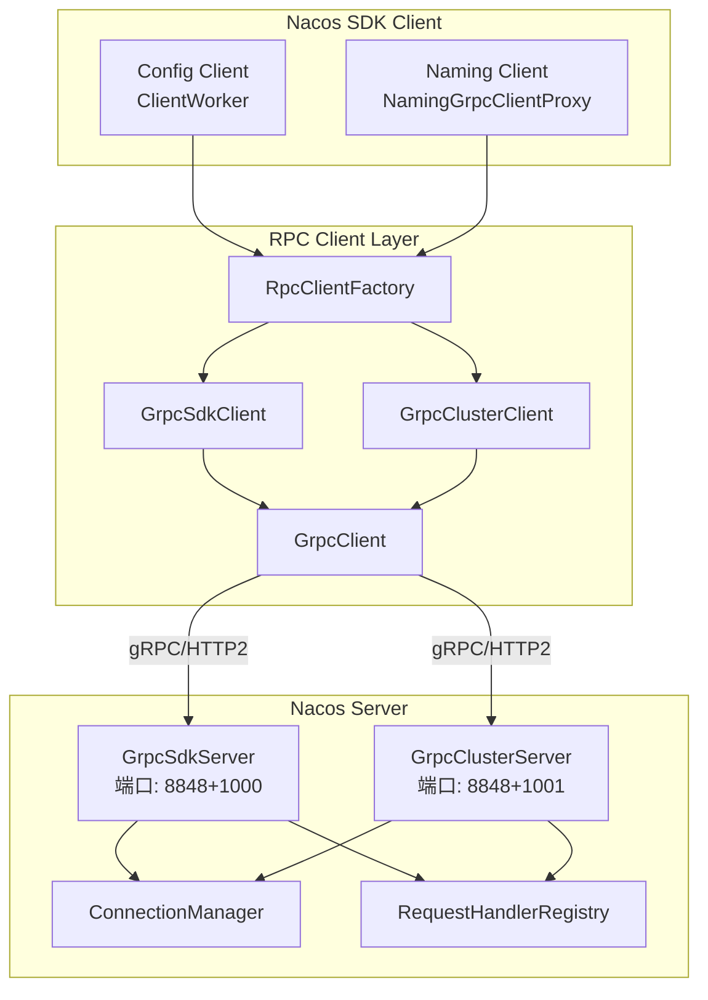
```mermaid
graph TB
    subgraph "Nacos SDK Client"
        CC[Config Client<br/>ClientWorker]
        NC[Naming Client<br/>NamingGrpcClientProxy]
    end

    subgraph "RPC Client Layer"
        RF[RpcClientFactory]
        GSC[GrpcSdkClient]
        GCC[GrpcClusterClient]
        GC[GrpcClient]
    end

    subgraph "Nacos Server"
        GSS[GrpcSdkServer<br/>端口: 8848+1000]
        GCS[GrpcClusterServer<br/>端口: 8848+1001]
        CM[ConnectionManager]
        RHR[RequestHandlerRegistry]
    end

    CC --> RF
    NC --> RF
    RF --> GSC
    RF --> GCC
    GSC --> GC
    GCC --> GC
    GC -->|gRPC/HTTP2| GSS
    GC -->|gRPC/HTTP2| GCS
    GSS --> CM
    GCS --> CM
    GSS --> RHR
    GCS --> RHR
```

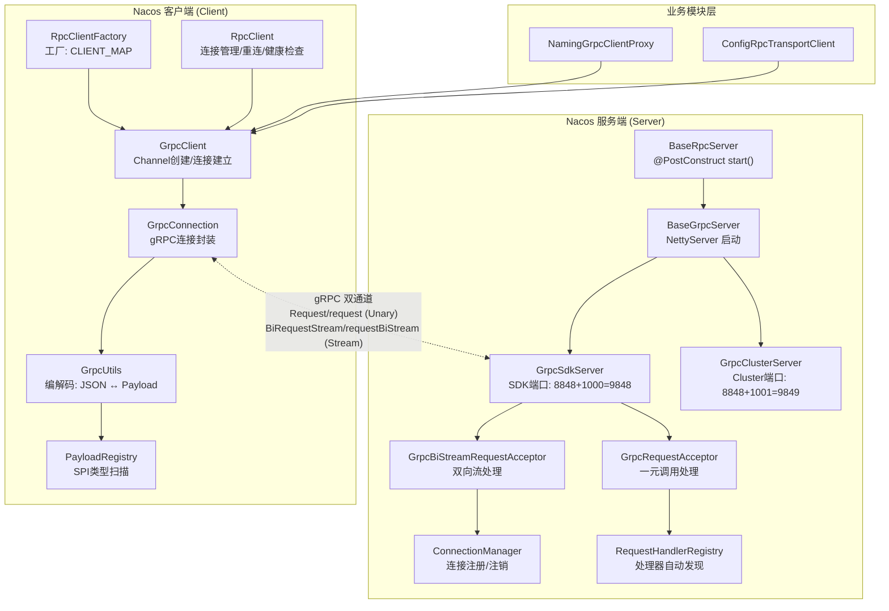
```mermaid
graph TB
    subgraph "Nacos 服务端 (Server)"
        BaseRpcServer["BaseRpcServer<br/>@PostConstruct start()"]
        BaseGrpcServer["BaseGrpcServer<br/>NettyServer 启动"]
        GrpcSdkServer["GrpcSdkServer<br/>SDK端口: 8848+1000=9848"]
        GrpcClusterServer["GrpcClusterServer<br/>Cluster端口: 8848+1001=9849"]
        GrpcReqAcceptor["GrpcRequestAcceptor<br/>一元调用处理"]
        GrpcBiAcceptor["GrpcBiStreamRequestAcceptor<br/>双向流处理"]
        ConnMgr["ConnectionManager<br/>连接注册/注销"]
        HandlerReg["RequestHandlerRegistry<br/>处理器自动发现"]

        BaseRpcServer --> BaseGrpcServer
        BaseGrpcServer --> GrpcSdkServer
        BaseGrpcServer --> GrpcClusterServer
        GrpcSdkServer --> GrpcReqAcceptor
        GrpcSdkServer --> GrpcBiAcceptor
        GrpcBiAcceptor --> ConnMgr
        GrpcReqAcceptor --> HandlerReg
    end

    subgraph "Nacos 客户端 (Client)"
        RpcClientFactory["RpcClientFactory<br/>工厂: CLIENT_MAP"]
        RpcClient["RpcClient<br/>连接管理/重连/健康检查"]
        GrpcClient["GrpcClient<br/>Channel创建/连接建立"]
        GrpcConnection["GrpcConnection<br/>gRPC连接封装"]
        GrpcUtils["GrpcUtils<br/>编解码: JSON ↔ Payload"]
        PayloadRegistry["PayloadRegistry<br/>SPI类型扫描"]

        RpcClientFactory --> GrpcClient
        RpcClient --> GrpcClient
        GrpcClient --> GrpcConnection
        GrpcConnection --> GrpcUtils
        GrpcUtils --> PayloadRegistry
    end
    subgraph "业务模块层"
        Naming["NamingGrpcClientProxy"]
        Config["ConfigRpcTransportClient"]
    end
    Naming --> GrpcClient
    Config --> GrpcClient

    GrpcConnection <-.->|"gRPC 双通道<br/>Request/request (Unary)<br/>BiRequestStream/requestBiStream (Stream)"| GrpcSdkServer
```

---

## 2. gRPC协议定义与消息结构

### 2.1 Proto定义

文件位置：`api/src/main/proto/nacos_grpc_service.proto`

```protobuf
syntax = "proto3";

import "google/protobuf/any.proto";
import "google/protobuf/timestamp.proto";

option java_multiple_files = true;
option java_package = "com.alibaba.nacos.api.grpc.auto";

message Metadata {
  string type = 3;              // 消息类型（Java类名）
  string clientIp = 8;          // 客户端IP
  map<string, string> headers = 7; // 请求头
}

message Payload {
  Metadata metadata = 2;        // 元数据
  google.protobuf.Any body = 3; // 消息体（JSON序列化）
}

// 单向RPC：客户端→服务端请求
service Request {
  rpc request (Payload) returns (Payload) {}
}

// 双向流RPC：服务端推送 + 客户端响应
service BiRequestStream {
  rpc requestBiStream (stream Payload) returns (stream Payload) {}
}
```

### 2.2 消息序列化机制

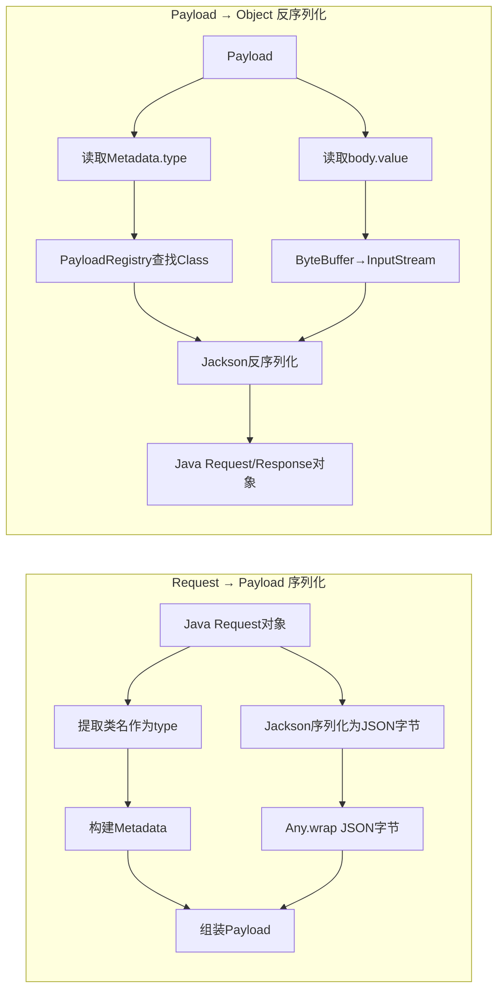
```mermaid
flowchart LR
    subgraph "Request → Payload 序列化"
        A1[Java Request对象] --> A2[提取类名作为type]
        A1 --> A3[Jackson序列化为JSON字节]
        A2 --> A4[构建Metadata]
        A3 --> A5[Any.wrap JSON字节]
        A4 --> A6[组装Payload]
        A5 --> A6
    end

    subgraph "Payload → Object 反序列化"
        B1[Payload] --> B2[读取Metadata.type]
        B1 --> B3[读取body.value]
        B2 --> B4[PayloadRegistry查找Class]
        B3 --> B5[ByteBuffer→InputStream]
        B4 --> B6[Jackson反序列化]
        B5 --> B6
        B6 --> B7[Java Request/Response对象]
    end
```

**核心代码**（`GrpcUtils.java`）：

```java
// Request → Payload
public static Payload convert(Request request) {
    Metadata newMeta = Metadata.newBuilder()
        .setType(request.getClass().getSimpleName())  // 类型标识
        .setClientIp(NetUtils.localIP())
        .putAllHeaders(request.getHeaders())
        .build();
    byte[] jsonBytes = JacksonUtils.toJsonBytes(request);
    return Payload.newBuilder()
        .setBody(Any.newBuilder().setValue(UnsafeByteOperations.unsafeWrap(jsonBytes)))
        .setMetadata(newMeta).build();
}

// Payload → Object
public static Object parse(Payload payload) {
    Class classType = PayloadRegistry.getClassByType(payload.getMetadata().getType());
    ByteString byteString = payload.getBody().getValue();
    ByteBuffer byteBuffer = byteString.asReadOnlyByteBuffer();
    return JacksonUtils.toObj(new ByteBufferBackedInputStream(byteBuffer), classType);
}
```

### 2.3 PayloadRegistry - 类型注册中心

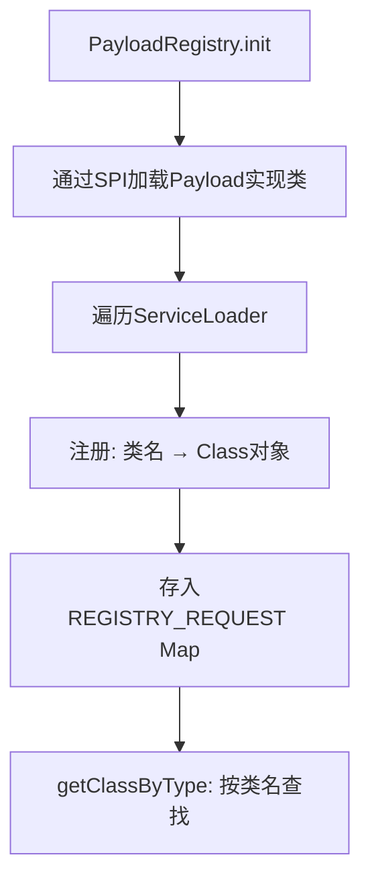
```mermaid
flowchart TD
    A[PayloadRegistry.init] --> B[通过SPI加载Payload实现类]
    B --> C[遍历ServiceLoader]
    C --> D[注册: 类名 → Class对象]
    D --> E[存入REGISTRY_REQUEST Map]
    E --> F[getClassByType: 按类名查找]
```

`PayloadRegistry` 在静态初始化时通过Java SPI机制扫描所有 `Payload` 接口的实现类，建立 **类名→Class对象** 的映射表。这样在反序列化时，通过 `Metadata.type` 即可找到对应的Java类型进行反序列化。

---

## 3. 服务端初始化流程

### 3.1 服务端启动时序

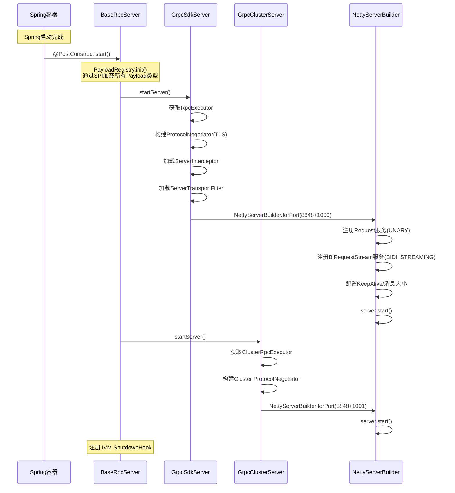
```mermaid
sequenceDiagram
    participant Spring as Spring容器
    participant Base as BaseRpcServer
    participant SDK as GrpcSdkServer
    participant Cluster as GrpcClusterServer
    participant Netty as NettyServerBuilder

    Note over Spring: Spring启动完成
    Spring->>Base: @PostConstruct start()

    Note over Base: PayloadRegistry.init()<br/>通过SPI加载所有Payload类型

    Base->>SDK: startServer()
    SDK->>SDK: 获取RpcExecutor
    SDK->>SDK: 构建ProtocolNegotiator(TLS)
    SDK->>SDK: 加载ServerInterceptor
    SDK->>SDK: 加载ServerTransportFilter

    SDK->>Netty: NettyServerBuilder.forPort(8848+1000)
    Netty->>Netty: 注册Request服务(UNARY)
    Netty->>Netty: 注册BiRequestStream服务(BIDI_STREAMING)
    Netty->>Netty: 配置KeepAlive/消息大小
    Netty->>Netty: server.start()

    Base->>Cluster: startServer()
    Cluster->>Cluster: 获取ClusterRpcExecutor
    Cluster->>Cluster: 构建Cluster ProtocolNegotiator
    Cluster->>Netty: NettyServerBuilder.forPort(8848+1001)
    Netty->>Netty: server.start()

    Note over Base: 注册JVM ShutdownHook
```

### 3.2 服务端端口分配

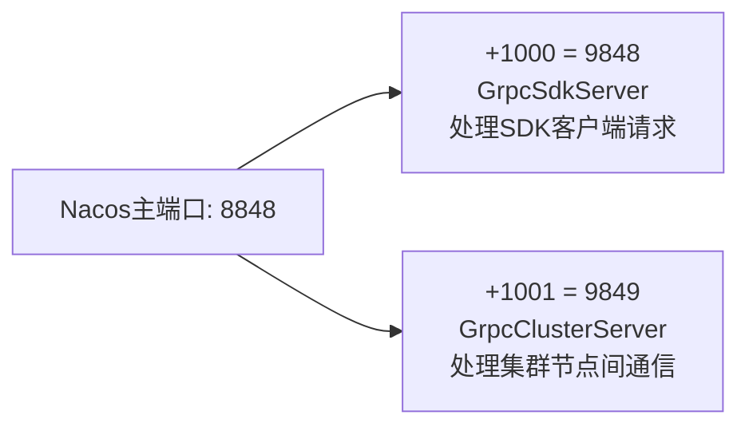
```mermaid
flowchart LR
    A[Nacos主端口: 8848] --> B["+1000 = 9848<br/>GrpcSdkServer<br/>处理SDK客户端请求"]
    A --> C["+1001 = 9849<br/>GrpcClusterServer<br/>处理集群节点间通信"]
```

### 3.3 服务注册机制

`BaseGrpcServer.addServices()` 通过 `MutableHandlerRegistry` 动态注册两个gRPC服务：

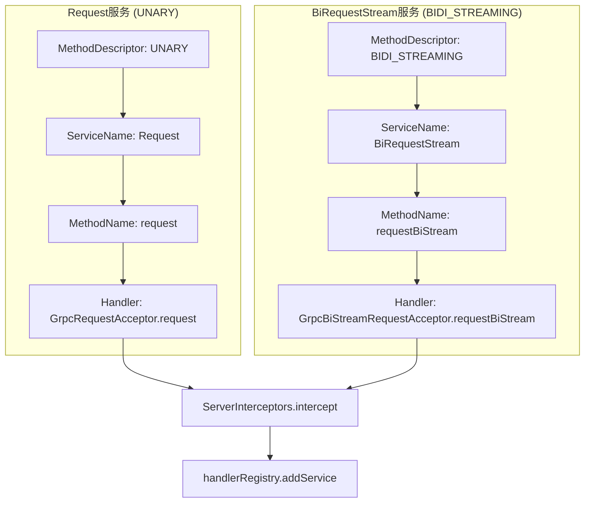
```mermaid
flowchart TD
    subgraph "Request服务 (UNARY)"
        A1[MethodDescriptor: UNARY] --> A2[ServiceName: Request]
        A2 --> A3[MethodName: request]
        A3 --> A4[Handler: GrpcRequestAcceptor.request]
    end

    subgraph "BiRequestStream服务 (BIDI_STREAMING)"
        B1[MethodDescriptor: BIDI_STREAMING] --> B2[ServiceName: BiRequestStream]
        B2 --> B3[MethodName: requestBiStream]
        B3 --> B4[Handler: GrpcBiStreamRequestAcceptor.requestBiStream]
    end

    A4 --> C[ServerInterceptors.intercept]
    B4 --> C
    C --> D[handlerRegistry.addService]
```

### 3.4 RequestHandler注册机制

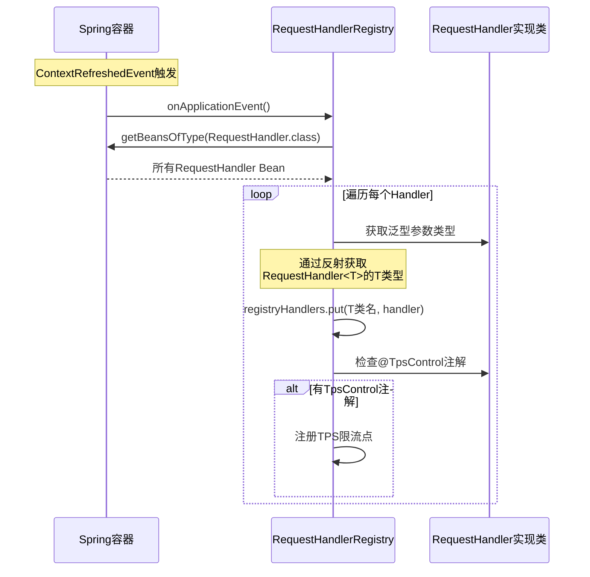
```mermaid
sequenceDiagram
    participant Spring as Spring容器
    participant RHR as RequestHandlerRegistry
    participant Handler as RequestHandler实现类

    Note over Spring: ContextRefreshedEvent触发
    Spring->>RHR: onApplicationEvent()
    RHR->>Spring: getBeansOfType(RequestHandler.class)
    Spring-->>RHR: 所有RequestHandler Bean

    loop 遍历每个Handler
        RHR->>Handler: 获取泛型参数类型
        Note over RHR: 通过反射获取<br/>RequestHandler<T>的T类型
        RHR->>RHR: registryHandlers.put(T类名, handler)
        RHR->>Handler: 检查@TpsControl注解
        alt 有TpsControl注解
            RHR->>RHR: 注册TPS限流点
        end
    end
```

---

## 4. 客户端初始化流程

### 4.1 客户端整体架构

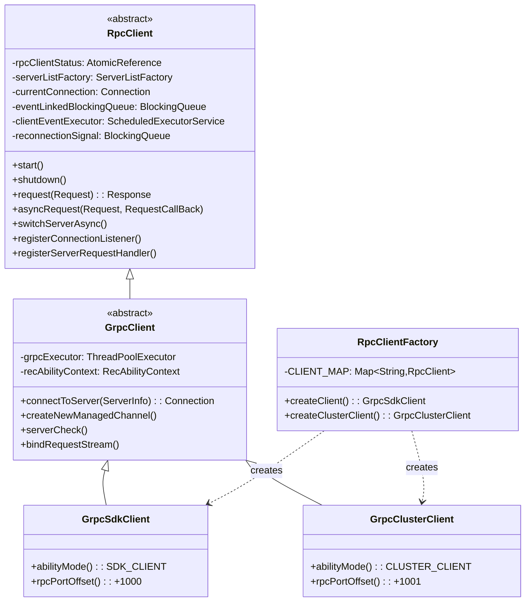
```mermaid
classDiagram
    class RpcClient {
        <<abstract>>
        -rpcClientStatus: AtomicReference
        -serverListFactory: ServerListFactory
        -currentConnection: Connection
        -eventLinkedBlockingQueue: BlockingQueue
        -clientEventExecutor: ScheduledExecutorService
        -reconnectionSignal: BlockingQueue
        +start()
        +shutdown()
        +request(Request): Response
        +asyncRequest(Request, RequestCallBack)
        +switchServerAsync()
        +registerConnectionListener()
        +registerServerRequestHandler()
    }

    class GrpcClient {
        <<abstract>>
        -grpcExecutor: ThreadPoolExecutor
        -recAbilityContext: RecAbilityContext
        +connectToServer(ServerInfo): Connection
        +createNewManagedChannel()
        +serverCheck()
        +bindRequestStream()
    }

    class GrpcSdkClient {
        +abilityMode(): SDK_CLIENT
        +rpcPortOffset(): +1000
    }

    class GrpcClusterClient {
        +abilityMode(): CLUSTER_CLIENT
        +rpcPortOffset(): +1001
    }

    class RpcClientFactory {
        -CLIENT_MAP: Map~String,RpcClient~
        +createClient(): GrpcSdkClient
        +createClusterClient(): GrpcClusterClient
    }

    RpcClient <|-- GrpcClient
    GrpcClient <|-- GrpcSdkClient
    GrpcClient <|-- GrpcClusterClient
    RpcClientFactory ..> GrpcSdkClient : creates
    RpcClientFactory ..> GrpcClusterClient : creates
```

### 4.2 配置中心客户端初始化

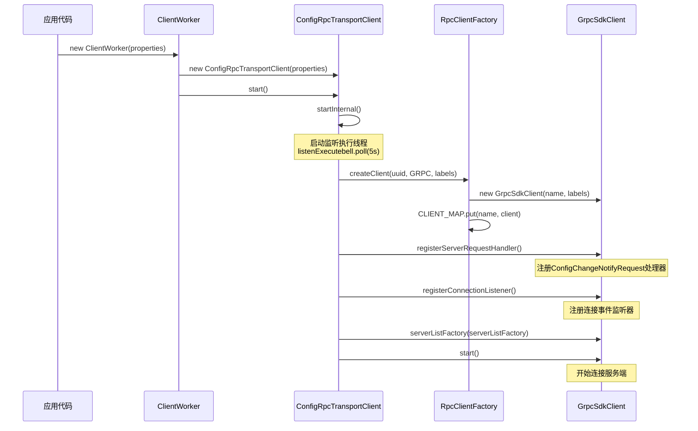
```mermaid
sequenceDiagram
    participant App as 应用代码
    participant CW as ClientWorker
    participant CRTC as ConfigRpcTransportClient
    participant RF as RpcClientFactory
    participant GSC as GrpcSdkClient

    App->>CW: new ClientWorker(properties)
    CW->>CRTC: new ConfigRpcTransportClient(properties)
    CW->>CRTC: start()

    CRTC->>CRTC: startInternal()
    Note over CRTC: 启动监听执行线程<br/>listenExecutebell.poll(5s)

    CRTC->>RF: createClient(uuid, GRPC, labels)
    RF->>GSC: new GrpcSdkClient(name, labels)
    RF->>RF: CLIENT_MAP.put(name, client)

    CRTC->>GSC: registerServerRequestHandler()
    Note over GSC: 注册ConfigChangeNotifyRequest处理器

    CRTC->>GSC: registerConnectionListener()
    Note over GSC: 注册连接事件监听器

    CRTC->>GSC: serverListFactory(serverListFactory)
    CRTC->>GSC: start()
    Note over GSC: 开始连接服务端
```

### 4.3 服务发现客户端初始化

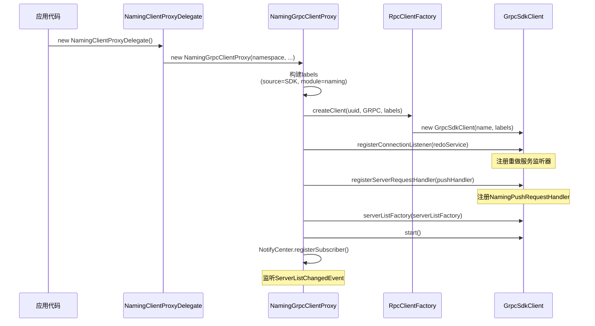
```mermaid
sequenceDiagram
    participant App as 应用代码
    participant Delegate as NamingClientProxyDelegate
    participant NGCP as NamingGrpcClientProxy
    participant RF as RpcClientFactory
    participant GSC as GrpcSdkClient

    App->>Delegate: new NamingClientProxyDelegate()
    Delegate->>NGCP: new NamingGrpcClientProxy(namespace, ...)

    NGCP->>NGCP: 构建labels<br/>(source=SDK, module=naming)
    NGCP->>RF: createClient(uuid, GRPC, labels)
    RF->>GSC: new GrpcSdkClient(name, labels)

    NGCP->>GSC: registerConnectionListener(redoService)
    Note over GSC: 注册重做服务监听器

    NGCP->>GSC: registerServerRequestHandler(pushHandler)
    Note over GSC: 注册NamingPushRequestHandler

    NGCP->>GSC: serverListFactory(serverListFactory)
    NGCP->>GSC: start()

    NGCP->>NGCP: NotifyCenter.registerSubscriber()
    Note over NGCP: 监听ServerListChangedEvent
```

### 4.4 客户端启动完整流程

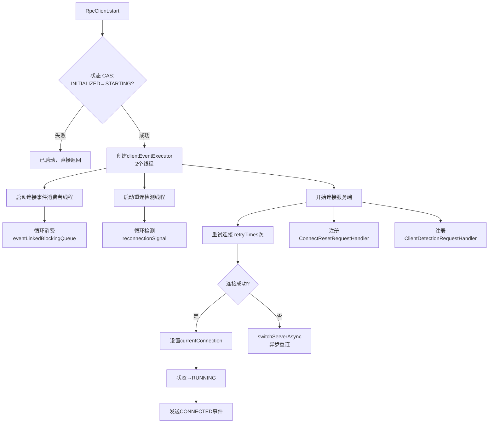
```mermaid
flowchart TD
    A[RpcClient.start] --> B{状态 CAS:<br/>INITIALIZED→STARTING?}
    B -->|失败| C[已启动，直接返回]
    B -->|成功| D[创建clientEventExecutor<br/>2个线程]

    D --> E[启动连接事件消费者线程]
    D --> F[启动重连检测线程]

    E --> G[循环消费eventLinkedBlockingQueue]
    F --> H[循环检测reconnectionSignal]

    D --> I[开始连接服务端]
    I --> J[重试连接 retryTimes次]

    J --> K{连接成功?}
    K -->|是| L[设置currentConnection]
    L --> M[状态→RUNNING]
    M --> N[发送CONNECTED事件]

    K -->|否| O[switchServerAsync<br/>异步重连]

    I --> P[注册ConnectResetRequestHandler]
    I --> Q[注册ClientDetectionRequestHandler]
```

---

## 5. 通信流程详解

### 5.1 连接建立完整流程

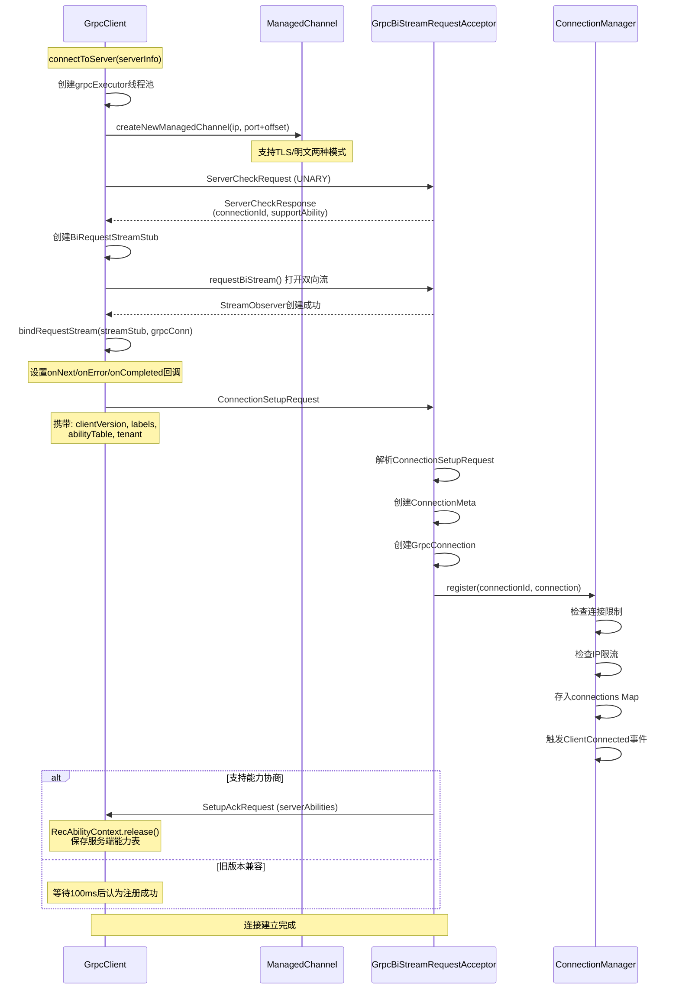
```mermaid
sequenceDiagram
    participant Client as GrpcClient
    participant Channel as ManagedChannel
    participant Server as GrpcBiStreamRequestAcceptor
    participant CM as ConnectionManager

    Note over Client: connectToServer(serverInfo)

    Client->>Client: 创建grpcExecutor线程池
    Client->>Channel: createNewManagedChannel(ip, port+offset)
    Note over Channel: 支持TLS/明文两种模式

    Client->>Server: ServerCheckRequest (UNARY)
    Server-->>Client: ServerCheckResponse<br/>(connectionId, supportAbility)

    Client->>Client: 创建BiRequestStreamStub
    Client->>Server: requestBiStream() 打开双向流
    Server-->>Client: StreamObserver创建成功

    Client->>Client: bindRequestStream(streamStub, grpcConn)
    Note over Client: 设置onNext/onError/onCompleted回调

    Client->>Server: ConnectionSetupRequest
    Note over Client: 携带: clientVersion, labels,<br/>abilityTable, tenant

    Server->>Server: 解析ConnectionSetupRequest
    Server->>Server: 创建ConnectionMeta
    Server->>Server: 创建GrpcConnection

    Server->>CM: register(connectionId, connection)
    CM->>CM: 检查连接限制
    CM->>CM: 检查IP限流
    CM->>CM: 存入connections Map
    CM->>CM: 触发ClientConnected事件

    alt 支持能力协商
        Server->>Client: SetupAckRequest (serverAbilities)
        Note over Client: RecAbilityContext.release()<br/>保存服务端能力表
    else 旧版本兼容
        Note over Client: 等待100ms后认为注册成功
    end

    Note over Client,Server: 连接建立完成
```

### 5.2 同步请求/响应流程

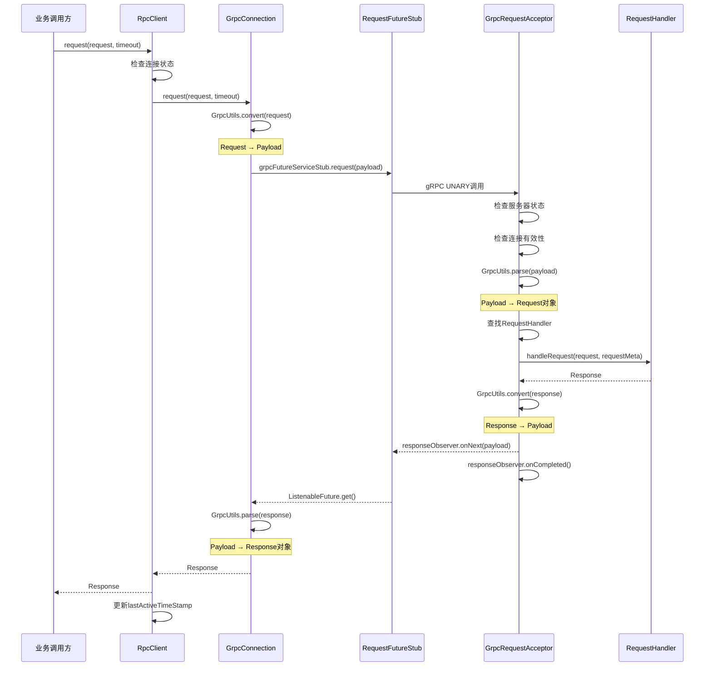
```mermaid
sequenceDiagram
    participant Caller as 业务调用方
    participant RC as RpcClient
    participant GC as GrpcConnection
    participant Stub as RequestFutureStub
    participant Server as GrpcRequestAcceptor
    participant Handler as RequestHandler

    Caller->>RC: request(request, timeout)
    RC->>RC: 检查连接状态
    RC->>GC: request(request, timeout)

    GC->>GC: GrpcUtils.convert(request)
    Note over GC: Request → Payload

    GC->>Stub: grpcFutureServiceStub.request(payload)
    Stub->>Server: gRPC UNARY调用

    Server->>Server: 检查服务器状态
    Server->>Server: 检查连接有效性
    Server->>Server: GrpcUtils.parse(payload)
    Note over Server: Payload → Request对象

    Server->>Server: 查找RequestHandler
    Server->>Handler: handleRequest(request, requestMeta)
    Handler-->>Server: Response

    Server->>Server: GrpcUtils.convert(response)
    Note over Server: Response → Payload

    Server-->>Stub: responseObserver.onNext(payload)
    Server->>Server: responseObserver.onCompleted()

    Stub-->>GC: ListenableFuture.get()
    GC->>GC: GrpcUtils.parse(response)
    Note over GC: Payload → Response对象

    GC-->>RC: Response
    RC-->>Caller: Response

    RC->>RC: 更新lastActiveTimeStamp
```

### 5.3 服务端推送流程（配置变更通知）

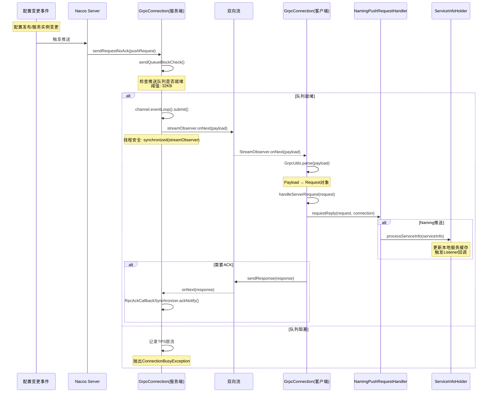
```mermaid
sequenceDiagram
    participant Config as 配置变更事件
    participant Server as Nacos Server
    participant Conn as GrpcConnection(服务端)
    participant BiStream as 双向流
    participant Client as GrpcConnection(客户端)
    participant Handler as NamingPushRequestHandler
    participant Cache as ServiceInfoHolder

    Note over Config: 配置发布/服务实例变更

    Config->>Server: 触发推送

    Server->>Conn: sendRequestNoAck(pushRequest)
    Conn->>Conn: sendQueueBlockCheck()
    Note over Conn: 检查推送队列是否就绪<br/>阈值: 32KB

    alt 队列就绪
        Conn->>Conn: channel.eventLoop().submit()
        Conn->>BiStream: streamObserver.onNext(payload)
        Note over Conn: 线程安全: synchronized(streamObserver)

        BiStream-->>Client: StreamObserver.onNext(payload)
        Client->>Client: GrpcUtils.parse(payload)
        Note over Client: Payload → Request对象

        Client->>Client: handleServerRequest(request)
        Client->>Handler: requestReply(request, connection)

        alt Naming推送
            Handler->>Cache: processServiceInfo(serviceInfo)
            Note over Cache: 更新本地服务缓存<br/>触发Listener回调
        end

        alt 需要ACK
            Client->>BiStream: sendResponse(response)
            BiStream-->>Conn: onNext(response)
            Conn->>Conn: RpcAckCallbackSynchronizer.ackNotify()
        end

    else 队列阻塞
        Conn->>Conn: 记录TPS限流
        Note over Conn: 抛出ConnectionBusyException
    end
```

### 5.4 配置监听流程（Config Change Notify）

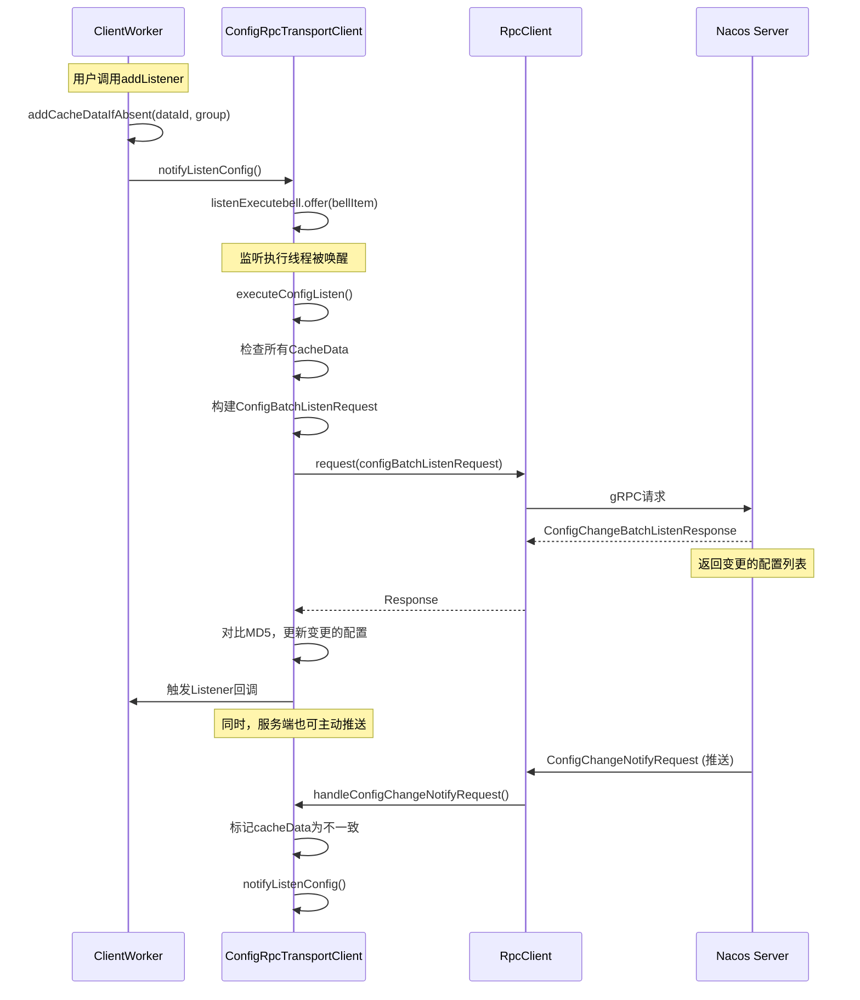
```mermaid
sequenceDiagram
    participant CW as ClientWorker
    participant CRTC as ConfigRpcTransportClient
    participant RC as RpcClient
    participant Server as Nacos Server

    Note over CW: 用户调用addListener

    CW->>CW: addCacheDataIfAbsent(dataId, group)
    CW->>CRTC: notifyListenConfig()
    CRTC->>CRTC: listenExecutebell.offer(bellItem)

    Note over CRTC: 监听执行线程被唤醒

    CRTC->>CRTC: executeConfigListen()
    CRTC->>CRTC: 检查所有CacheData
    CRTC->>CRTC: 构建ConfigBatchListenRequest

    CRTC->>RC: request(configBatchListenRequest)
    RC->>Server: gRPC请求

    Server-->>RC: ConfigChangeBatchListenResponse
    Note over Server: 返回变更的配置列表

    RC-->>CRTC: Response
    CRTC->>CRTC: 对比MD5，更新变更的配置
    CRTC->>CW: 触发Listener回调

    Note over CRTC: 同时，服务端也可主动推送

    Server->>RC: ConfigChangeNotifyRequest (推送)
    RC->>CRTC: handleConfigChangeNotifyRequest()
    CRTC->>CRTC: 标记cacheData为不一致
    CRTC->>CRTC: notifyListenConfig()
```

### 5.5 服务发现订阅与推送流程

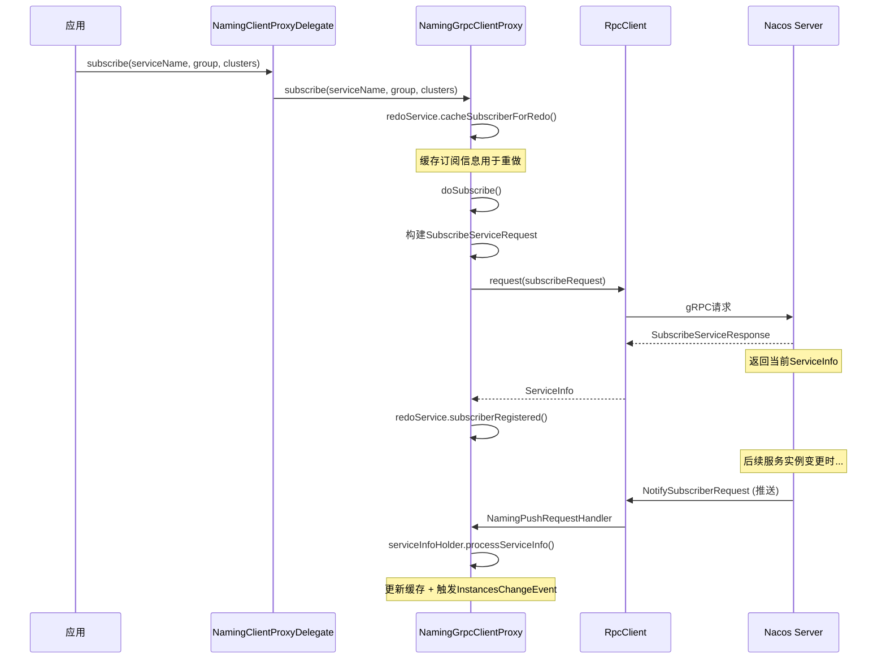
```mermaid
sequenceDiagram
    participant App as 应用
    participant Delegate as NamingClientProxyDelegate
    participant NGCP as NamingGrpcClientProxy
    participant RC as RpcClient
    participant Server as Nacos Server

    App->>Delegate: subscribe(serviceName, group, clusters)
    Delegate->>NGCP: subscribe(serviceName, group, clusters)

    NGCP->>NGCP: redoService.cacheSubscriberForRedo()
    Note over NGCP: 缓存订阅信息用于重做

    NGCP->>NGCP: doSubscribe()
    NGCP->>NGCP: 构建SubscribeServiceRequest
    NGCP->>RC: request(subscribeRequest)
    RC->>Server: gRPC请求

    Server-->>RC: SubscribeServiceResponse
    Note over Server: 返回当前ServiceInfo

    RC-->>NGCP: ServiceInfo
    NGCP->>NGCP: redoService.subscriberRegistered()

    Note over Server: 后续服务实例变更时...

    Server->>RC: NotifySubscriberRequest (推送)
    RC->>NGCP: NamingPushRequestHandler
    NGCP->>NGCP: serviceInfoHolder.processServiceInfo()
    Note over NGCP: 更新缓存 + 触发InstancesChangeEvent
```

---

## 6. 拦截器与过滤器链

### 6.1 请求处理管道

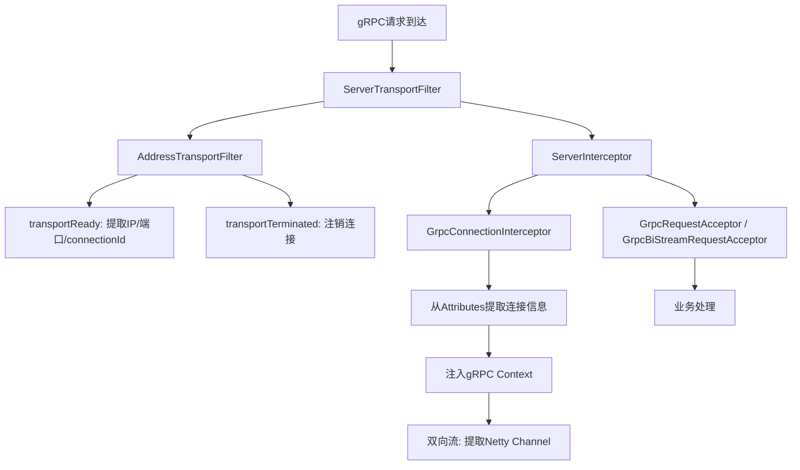
```mermaid
flowchart TD
    A[gRPC请求到达] --> B[ServerTransportFilter]
    B --> B1[AddressTransportFilter]
    B1 --> B2[transportReady: 提取IP/端口/connectionId]
    B1 --> B3[transportTerminated: 注销连接]

    B --> C[ServerInterceptor]
    C --> C1[GrpcConnectionInterceptor]
    C1 --> C2[从Attributes提取连接信息]
    C2 --> C3[注入gRPC Context]
    C3 --> C4[双向流: 提取Netty Channel]

    C --> D[GrpcRequestAcceptor / GrpcBiStreamRequestAcceptor]
    D --> E[业务处理]
```

### 6.2 GrpcConnectionInterceptor 详解

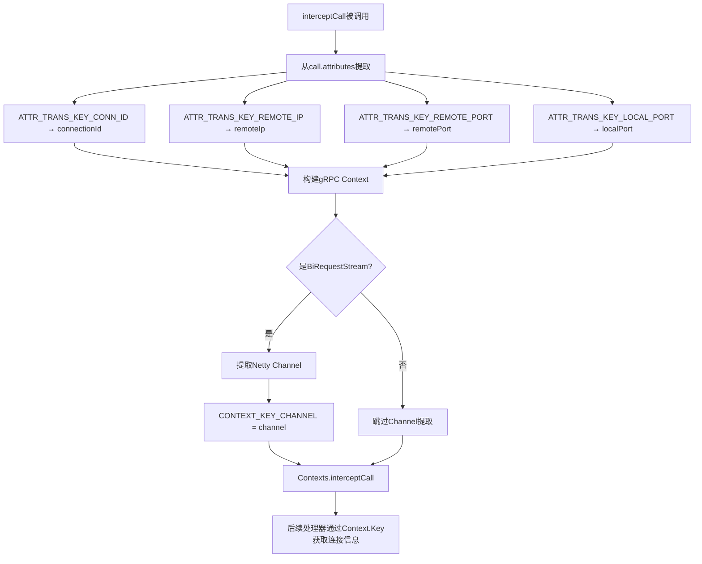
```mermaid
flowchart TD
    A[interceptCall被调用] --> B[从call.attributes提取]
    B --> B1[ATTR_TRANS_KEY_CONN_ID → connectionId]
    B --> B2[ATTR_TRANS_KEY_REMOTE_IP → remoteIp]
    B --> B3[ATTR_TRANS_KEY_REMOTE_PORT → remotePort]
    B --> B4[ATTR_TRANS_KEY_LOCAL_PORT → localPort]

    B1 --> C[构建gRPC Context]
    B2 --> C
    B3 --> C
    B4 --> C

    C --> D{是BiRequestStream?}
    D -->|是| E[提取Netty Channel]
    E --> F[CONTEXT_KEY_CHANNEL = channel]
    D -->|否| G[跳过Channel提取]

    F --> H[Contexts.interceptCall]
    G --> H
    H --> I[后续处理器通过Context.Key获取连接信息]
```

### 6.3 AddressTransportFilter 详解

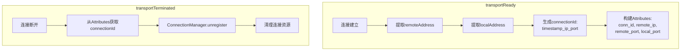
```mermaid
flowchart TD
    subgraph "transportReady"
        A1[连接建立] --> A2[提取remoteAddress]
        A2 --> A3[提取localAddress]
        A3 --> A4[生成connectionId:<br/>timestamp_ip_port]
        A4 --> A5[构建Attributes:<br/>conn_id, remote_ip,<br/>remote_port, local_port]
    end

    subgraph "transportTerminated"
        B1[连接断开] --> B2[从Attributes获取connectionId]
        B2 --> B3[ConnectionManager.unregister]
        B3 --> B4[清理连接资源]
    end
```

---

## 7. 核心组件详解

### 7.1 ConnectionManager - 连接管理器

```mermaid
flowchart TD
    subgraph "连接注册 register()"
        A1[新连接] --> A2{连接是否活跃?}
        A2 -->|否| A3[拒绝]
        A2 -->|是| A4{已存在?}
        A4 -->|是| A5[返回true]
        A4 -->|否| A6{连接限制检查}
        A6 -->|超限| A3
        A6 -->|通过| A7[存入connections Map]
        A7 --> A8[更新connectionForClientIp计数]
        A8 --> A9[通知ClientConnected事件]
    end

    subgraph "连接驱逐 定时任务"
        B1[每3秒执行] --> B2[runtimeConnectionEjector.doEject]
        B2 --> B3[检查连接超时]
        B3 --> B4[关闭超时连接]
        B4 --> B5[更新Metrics]
    end

    subgraph "连接监控"
        C1[每15秒执行] --> C2[遍历connections]
        C2 --> C3[按module统计连接数]
        C3 --> C4[refreshModuleConnectionCount]
    end
```

### 7.2 RpcAckCallbackSynchronizer - 推送ACK同步器

```mermaid
flowchart TD
    subgraph "服务端发送推送"
        A1[创建PushRequest] --> A2[生成requestId]
        A2 --> A3[创建DefaultRequestFuture]
        A3 --> A4[syncCallback: 存入CALLBACK_CONTEXT]
        A4 --> A5[sendRequestNoAck: 发送请求]
        A5 --> A6[等待ACK或超时]
    end

    subgraph "客户端响应ACK"
        B1[收到Response] --> B2[通过双向流发送Response]
        B2 --> B3[服务端收到Response]
        B3 --> B4[ackNotify: 查找Future]
        B4 --> B5[setResponse或setFailResult]
    end

    subgraph "超时处理"
        C1[CALLBACK_CONTEXT LRU淘汰] --> C2[触发listener回调]
        C2 --> C3[setFailResult: TimeoutException]
    end
```

### 7.3 能力协商机制

```mermaid
sequenceDiagram
    participant Client as 客户端
    participant Server as 服务端

    Note over Client: 构建ConnectionSetupRequest
    Client->>Client: abilityTable = getCurrentNodeAbilities(SDK_CLIENT)
    Note over Client: 例如: {SERVER_SUPPORT_PERSISTENT_INSTANCE_BY_GRPC: true}

    Client->>Server: ConnectionSetupRequest(abilityTable)

    Server->>Server: 检查abilityTable是否非null
    alt abilityTable != null (支持能力协商)
        Server->>Server: connection.setAbilityTable(clientAbilities)
        Server->>Server: 获取服务端能力
        Note over Server: getCurrentNodeAbilities(SERVER)
        Server->>Client: SetupAckRequest(serverAbilities)

        Client->>Client: RecAbilityContext.release(serverAbilities)
        Note over Client: 保存服务端能力表<br/>供后续业务判断使用
    else abilityTable == null (旧版本)
        Note over Server: 跳过能力协商
        Note over Client: 等待100ms后认为注册成功
    end
```

### 7.4 GrpcConnection 服务端推送机制

```mermaid
flowchart TD
    subgraph "sendRequestNoAck - 无ACK推送"
        A1[构造Request] --> A2[sendQueueBlockCheck]
        A2 --> A3{isReady?}
        A3 -->|否| A4[记录TPS限流<br/>抛出ConnectionBusyException]
        A3 -->|是| A5[channel.eventLoop().submit]
        A5 --> A6[synchronized: streamObserver.onNext]
        Note over A6: 线程安全保护<br/>防止直接内存泄漏
    end

    subgraph "request - 带ACK推送"
        B1[构造Request] --> B2[生成requestId]
        B2 --> B3[创建DefaultRequestFuture]
        B3 --> B4[RpcAckCallbackSynchronizer.syncCallback]
        B4 --> B5[sendRequestNoAck]
        B5 --> B6[pushFuture.get(timeout)]
        B6 --> B7{收到ACK?}
        B7 -->|是| B8[返回Response]
        B7 -->|超时| B9[抛出异常]
    end
```

---

## 8. 重连与故障转移机制

### 8.1 重连触发条件

```mermaid
flowchart TD
    A[重连触发条件] --> B[双向流异常]
    A --> C[健康检查失败]
    A --> D[请求返回UN_REGISTER]
    A --> E[服务端发送ConnectResetRequest]
    A --> F[服务器列表变更]

    B --> G[onError/onCompleted回调]
    G --> H[CAS: RUNNING→UNHEALTHY]
    H --> I[switchServerAsync]

    C --> J[定期健康检查]
    J --> K{HealthCheckRequest成功?}
    K -->|否| H

    D --> L[收到ErrorResponse]
    L --> H

    E --> M[ConnectResetRequestHandler]
    M --> N[switchServerAsync + afterReset]

    F --> O[onServerListChange]
    O --> P{当前服务器在列表中?}
    P -->|否| H
```

### 8.2 重连执行流程

```mermaid
flowchart TD
    A[reconnect开始] --> B{onRequestFail且健康检查成功?}
    B -->|是| C[保持当前连接，返回RUNNING]
    B -->|否| D[开始重连循环]

    D --> E{有推荐服务器?}
    E -->|是| F[使用推荐服务器]
    E -->|否| G[nextRpcServer: 从列表选择]

    F --> H[connectToServer]
    G --> H

    H --> I{连接成功?}
    I -->|是| J[关闭旧连接]
    J --> K[更新currentConnection]
    K --> L[状态→RUNNING]
    L --> M[发送CONNECTED事件]
    M --> N[重连完成]

    I -->|否| O{达到重试上限?}
    O -->|否| P[指数退避等待]
    Note over P: delay = min(retryTurns+1, 50) × 100ms
    P --> E

    O -->|是| Q{客户端已关闭?}
    Q -->|是| R[停止重连]
    Q -->|否| E
```

### 8.3 健康检查机制

```mermaid
sequenceDiagram
    participant Timer as 定时器
    participant RC as RpcClient
    participant Conn as Connection
    participant Server as 服务端

    Note over Timer: 每connectionKeepAlive(30s)检测

    Timer->>RC: 检查lastActiveTimeStamp
    RC->>RC: 计算距上次活跃时间

    alt 超过keepAlive时间
        RC->>Conn: healthCheck()
        Note over Conn: 发送HealthCheckRequest

        loop 重试healthCheckRetryTimes次
            Conn->>Server: HealthCheckRequest
            alt 成功
                Server-->>Conn: Response(success)
                Conn-->>RC: true
                RC->>RC: 更新lastActiveTimeStamp
            else 失败
                Note over Conn: 随机等待0-500ms后重试
            end
        end

        alt 全部失败
            RC->>RC: CAS: RUNNING→UNHEALTHY
            RC->>RC: 触发reconnect
        end
    end
```

---

## 9. 配置参数详解

### 9.1 客户端配置

| 配置项 | 属性Key | 默认值 | 说明 |
|--------|---------|--------|------|
| 线程池核心大小 | `nacos.remote.client.grpc.pool.core.size` | 2 | gRPC执行器核心线程 |
| 线程池最大大小 | `nacos.remote.client.grpc.pool.max.size` | 8 | gRPC执行器最大线程 |
| 线程池队列大小 | `nacos.remote.client.grpc.queue.size` | Integer.MAX | 任务队列容量 |
| 超时时间 | `nacos.remote.client.grpc.timeout` | 3000ms | 请求超时 |
| 重试次数 | `nacos.remote.client.grpc.retry.times` | 3 | 请求失败重试次数 |
| 通道保活时间 | `nacos.remote.client.grpc.channel.keep.alive` | 30000ms | gRPC通道keepalive |
| 通道保活超时 | `nacos.remote.client.grpc.channel.keep.alive.timeout` | 20000ms | keepalive超时 |
| 最大入站消息 | `nacos.remote.client.grpc.maxinbound.message.size` | 10MB | 最大消息大小 |
| 服务器检测超时 | `nacos.remote.client.grpc.server.check.timeout` | 3000ms | ServerCheck超时 |
| 能力协商超时 | `nacos.remote.client.grpc.channel.capability.negotiation.timeout` | 3000ms | 能力协商超时 |
| 健康检查重试 | `nacos.remote.client.grpc.health.retry` | 3 | 健康检查重试次数 |
| 健康检查超时 | `nacos.remote.client.grpc.health.timeout` | 3000ms | 健康检查超时 |

### 9.2 服务端配置

| 配置项 | 属性Key | 默认值 | 说明 |
|--------|---------|--------|------|
| SDK最大入站消息 | `nacos.remote.server.grpc.sdk.max-inbound-message-size` | 10MB | SDK消息大小限制 |
| SDK保活时间 | `nacos.remote.server.grpc.sdk.keep-alive-time` | 7200s | SDK连接保活 |
| SDK保活超时 | `nacos.remote.server.grpc.sdk.keep-alive-timeout` | 20s | SDK保活超时 |
| SDK允许保活 | `nacos.remote.server.grpc.sdk.permit-keep-alive-time` | 5min | SDK最小保活间隔 |
| Cluster最大入站消息 | `nacos.remote.server.grpc.cluster.max-inbound-message-size` | 10MB | 集群消息大小限制 |
| Cluster保活时间 | `nacos.remote.server.grpc.cluster.keep-alive-time` | 7200s | 集群连接保活 |
| Cluster保活超时 | `nacos.remote.server.grpc.cluster.keep-alive-timeout` | 20s | 集群保活超时 |
| Cluster允许保活 | `nacos.remote.server.grpc.cluster.permit-keep-alive-time` | 5min | 集群最小保活间隔 |

### 9.3 端口偏移配置

| 配置项 | 属性Key | 默认值 |
|--------|---------|--------|
| gRPC端口偏移 | `nacos.server.grpc.port.offset` | SDK:1000, Cluster:1001 |

---

## 10. 设计亮点与技术亮点

### 10.1 架构设计亮点

```mermaid
mindmap
  root((Nacos gRPC<br/>设计亮点))
    双通道架构
      SDK通道: 8848+1000
      Cluster通道: 8848+1001
      物理隔离，互不影响
    连接复用
      单连接多路复用
      HTTP/2多Stream
      减少连接开销
    双向流推送
      服务端主动推送
      配置变更实时通知
      服务实例变更推送
    能力协商
      版本兼容
      特性发现
      渐进式升级
    分层设计
      RpcClient抽象层
      GrpcClient实现层
      GrpcSdkClient/GrpcClusterClient
    插件化扩展
      SPI加载Interceptor
      SPI加载TransportFilter
      SPI加载ProtocolNegotiator
```

### 10.2 技术亮点详解

#### 10.2.1 双通道物理隔离

```mermaid
graph LR
    subgraph "SDK通道 (9848)"
        A1[GrpcSdkServer] --> A2[GlobalExecutor.sdkRpcExecutor]
        A1 --> A3[SdkProtocolNegotiator]
        A1 --> A4[SDK Interceptors]
    end

    subgraph "Cluster通道 (9849)"
        B1[GrpcClusterServer] --> B2[GlobalExecutor.clusterRpcExecutor]
        B1 --> B3[ClusterProtocolNegotiator]
        B1 --> B4[Cluster Interceptors]
    end

    C[SDK客户端] --> A1
    D[集群节点] --> B1
```

SDK客户端和集群节点使用不同的端口、线程池、拦截器和协议协商器，实现了完全的物理隔离，互不影响。

#### 10.2.2 线程安全设计

```mermaid
flowchart TD
    subgraph "服务端推送线程安全"
        A1[多线程并发推送] --> A2[channel.eventLoop().submit]
        A2 --> A3[synchronized: streamObserver]
        Note over A3: StreamObserver.onNext()<br/>非线程安全<br/>必须同步保护
    end

    subgraph "客户端连接状态安全"
        B1[多线程状态变更] --> B2[AtomicReference: rpcClientStatus]
        B2 --> B3[CAS原子操作]
        Note over B3: RUNNING↔UNHEALTHY<br/>状态转换原子性
    end

    subgraph "连接注册安全"
        C1[并发注册] --> C2[synchronized: register]
        C2 --> C3[ConcurrentHashMap: connections]
    end
```

#### 10.2.3 推送队列流控

```mermaid
flowchart TD
    A[服务端准备推送] --> B{ServerCallStreamObserver.isReady?}
    B -->|就绪| C[发送消息]
    B -->|未就绪| D[记录TPS限流指标]
    D --> E[抛出ConnectionBusyException]
    Note over E: 上层捕获后可重试<br/>或丢弃消息

    C --> F{消息发送成功?}
    F -->|StatusRuntimeException| G[ConnectionAlreadyClosedException]
    F -->|IllegalStateException| G
    Note over G: 连接已关闭，触发清理
```

gRPC内部维护一个写入队列，默认阈值为32KB。当队列积压超过阈值时，`isReady()` 返回false，Nacos通过TPS限流机制保护系统。

#### 10.2.4 重做机制（RedoService）

```mermaid
flowchart TD
    subgraph "NamingGrpcRedoService"
        A[服务注册/订阅操作] --> B[缓存到RedoService]
        B --> C[执行实际操作]
        C --> D{操作成功?}
        D -->|是| E[标记已完成]
        D -->|否| F[保留Redo数据]

        G[连接重新建立] --> H[RedoScheduledTask触发]
        H --> I[遍历Redo数据]
        I --> J[重新执行注册/订阅]
    end
```

当客户端与服务端断开连接后重新建立时，RedoService会自动重新执行之前失败的注册和订阅操作，确保数据最终一致性。

#### 10.2.5 TLS协议协商

```mermaid
flowchart TD
    A[服务端启动] --> B[AbstractProtocolNegotiatorBuilderSingleton]
    B --> C[读取配置: nacos.remote.server.rpc.protocol.negotiator.type]
    C --> D[通过SPI加载ProtocolNegotiatorBuilder]
    D --> E{找到匹配的Builder?}
    E -->|是| F[使用SPI加载的Builder]
    E -->|否| G[使用默认TLS Builder]
    F --> H[build ProtocolNegotiator]
    G --> H
    H --> I[NettyServerBuilder.protocolNegotiator]
```

#### 10.2.6 连接驱逐策略

```mermaid
flowchart TD
    A[NacosRuntimeConnectionEjector.doEject] --> B[遍历所有连接]
    B --> C{连接超时?}
    C -->|是| D[unregister连接]
    C -->|否| E{需要负载迁移?}
    E -->|是| F[发送ConnectResetRequest]
    F --> G[客户端切换到新服务器]
    E -->|否| H[跳过]
```

---

## 11. 与1.x版本对比

| 维度 | 1.x HTTP长轮询 | 2.x gRPC |
|------|---------------|----------|
| **协议** | HTTP/1.1 | HTTP/2 |
| **序列化** | JSON文本 | Protobuf + JSON |
| **连接模型** | 短连接/长轮询 | 长连接 + 多路复用 |
| **推送方式** | 客户端轮询 | 服务端主动推送 |
| **延迟** | 取决于轮询间隔(通常1-30s) | 实时推送(毫秒级) |
| **资源消耗** | 每个监听一个HTTP连接 | 单连接支持所有监听 |
| **服务发现** | UDP + HTTP | gRPC双向流 |
| **配置管理** | HTTP长轮询 | gRPC双向流 |
| **集群通信** | HTTP | gRPC双向流 |
| **TLS支持** | 基础支持 | 完善支持 + 双向认证 |

---

## 12. 总结

Nacos 2.4.2的gRPC通信架构是一个精心设计的分布式通信系统，核心特点包括：

1. **双通道物理隔离**：SDK和Cluster使用独立端口、线程池和拦截器链
2. **双向流推送**：基于HTTP/2的Bidi-Streaming实现服务端主动推送
3. **能力协商**：客户端和服务端通过SetupAck交换能力表，实现版本兼容
4. **完善的故障恢复**：多层重连机制 + RedoService保证数据最终一致性
5. **推送流控保护**：基于gRPC内置队列的TPS限流，防止系统过载
6. **插件化扩展**：Interceptor、TransportFilter、ProtocolNegotiator均支持SPI扩展
7. **线程安全设计**：CAS状态机 + synchronized保护 + ConcurrentHashMap
8. **Payload类型系统**：通过PayloadRegistry实现类型安全的序列化/反序列化
