# Nacos 1.x 与 2.x 心跳检测、健康检查机制差异对比

> 基于 Nacos `2.4.2` 源码（分支 develop）分析。2.4.2 仓库中 v1 核心类已基本移除，仅保留 HTTP `/instance/beat` 兼容端点。本文通过对比 v1 历史架构与 v2 现有实现，梳理两者差异。

---

## 目录

1. [架构总览对比](#1-架构总览对比)
2. [通信协议：HTTP vs gRPC](#2-通信协议http-vs-grpc)
3. [客户端心跳机制对比](#3-客户端心跳机制对比)
4. [服务端 Beat 检查对比](#4-服务端-beat-检查对比)
5. [服务端主动健康检查对比](#5-服务端主动健康检查对比)
6. [数据模型与存储对比](#6-数据模型与存储对比)
7. [Distro 集群同步对比](#7-distro-集群同步对比)
8. [断线恢复机制对比](#8-断线恢复机制对比)
9. [完整流程对比图](#9-完整流程对比图)
10. [参数与默认值对比](#10-参数与默认值对比)
11. [总结对比表](#11-总结对比表)

---

## 1. 架构总览对比

### 1.1 Nacos 1.x 架构（HTTP 心跳模型）

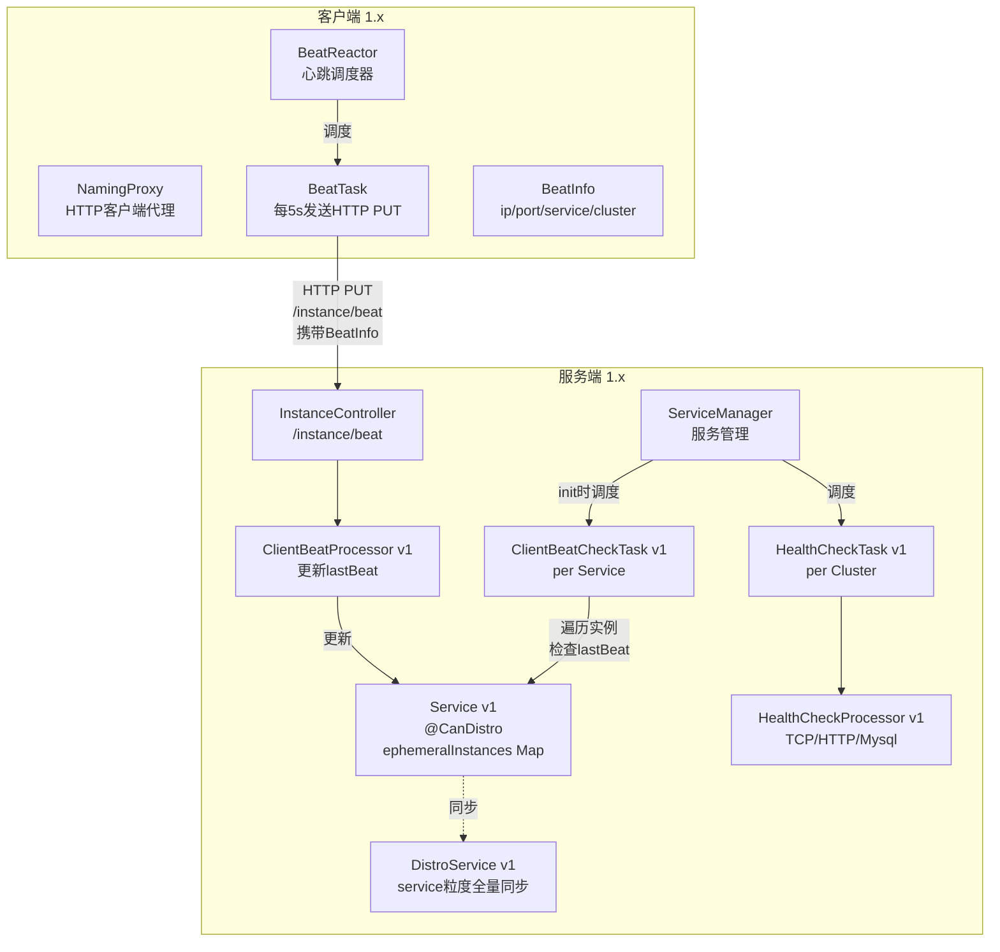

### 1.2 Nacos 2.x 架构（gRPC 长连接模型）

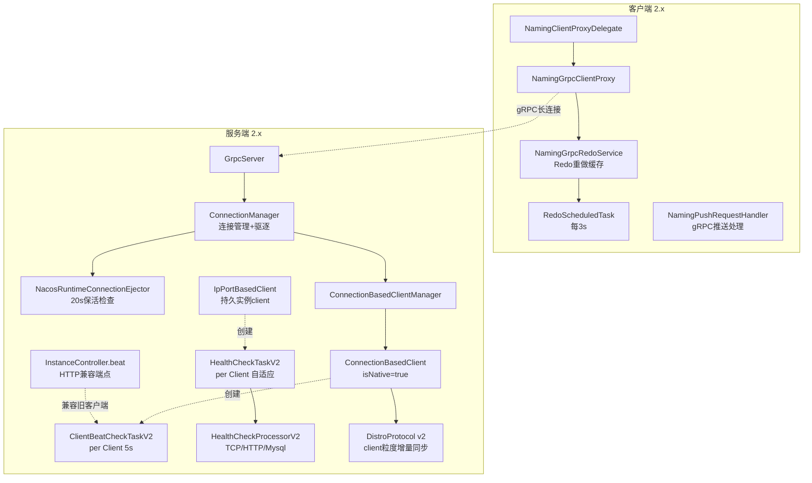

### 1.3 核心范式转变

> **1.x**：客户端**主动定期**通过 HTTP 发送心跳包 → 服务端**被动**接收并更新 lastBeat → 服务端定期检查 lastBeat 是否超时
>
> **2.x**：客户端**维持 gRPC 长连接**（连接即心跳）→ 服务端**主动**管理连接生命周期 → 连接断开即触发实例清理

这是从"**应用层心跳**"到"**传输层心跳**"的根本性转变。

---

## 2. 通信协议：HTTP vs gRPC

### 2.1 1.x：HTTP 短连接

| 特性 | 1.x |
|------|-----|
| 协议 | HTTP/1.1 |
| 连接模式 | 短连接（每次请求新建连接） |
| 心跳通道 | 独立 HTTP 请求 `PUT /instance/beat` |
| 注册通道 | HTTP `POST /instance` |
| 推送通道 | UDP 推送 + HTTP 长轮询 |
| 序列化 | JSON |
| 开销 | 每次心跳 TCP 握手 + HTTP 头 |

**问题**：
- 每个实例每 5s 一次 HTTP 请求，服务端连接数高、QPS 压力大
- 短连接频繁建连，TCP 握手开销显著
- UDP 推送不可靠，长轮询延迟高

### 2.2 2.x：gRPC 长连接

| 特性 | 2.x |
|------|-----|
| 协议 | HTTP/2 + Protobuf（gRPC） |
| 连接模式 | 长连接（多路复用） |
| 心跳通道 | gRPC 连接保活（无显式心跳包） |
| 注册通道 | gRPC `InstanceRequest` |
| 推送通道 | gRPC server stream（`NotifySubscriberRequest`） |
| 序列化 | Protobuf |
| 开销 | 单连接复用，无握手开销 |

**优势**：
- 一个客户端一个长连接，服务端连接数降低一个数量级
- 连接本身就是心跳，无需额外心跳包
- gRPC 双向流支持服务端主动推送，实时性更好
- Protobuf 比 JSON 更高效

---

## 3. 客户端心跳机制对比

### 3.1 1.x：BeatReactor + BeatTask（显式心跳）

**1.x 客户端类结构**（已在 2.4.2 中移除）：

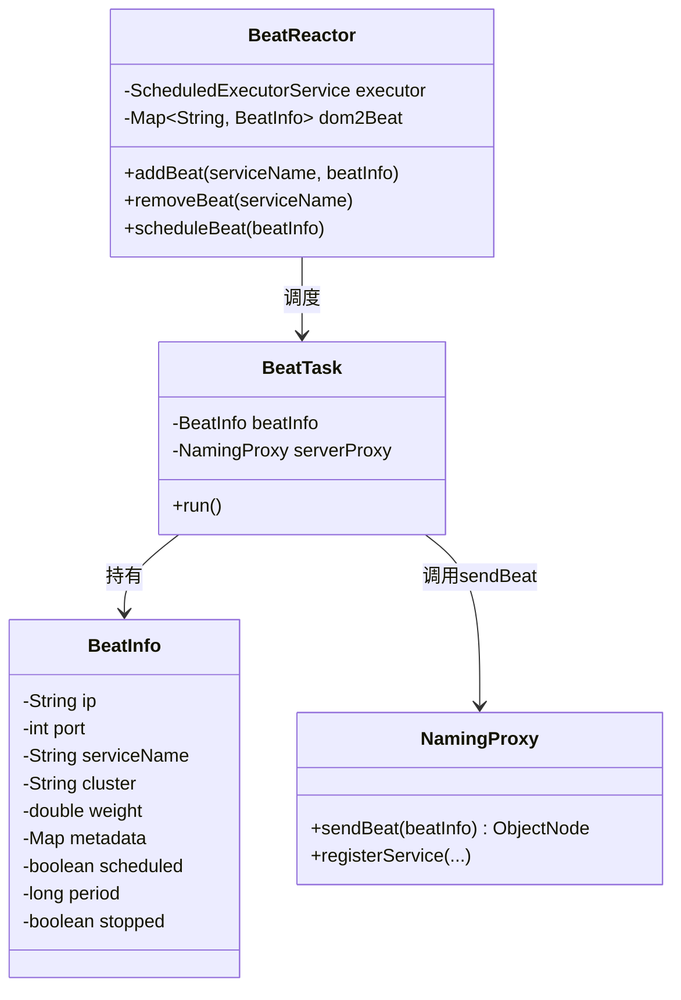

**1.x 心跳流程**：
1. 客户端 `registerService` 时，`BeatReactor.addBeat()` 注册 `BeatInfo`
2. `BeatReactor` 用 `ScheduledExecutorService` 调度 `BeatTask`，周期默认 5s
3. `BeatTask.run()` 调用 `NamingProxy.sendBeat(beatInfo)`，HTTP PUT `/instance/beat`
4. 服务端返回 `clientBeatInterval`，客户端据此调整周期
5. 客户端停止时 `BeatReactor.removeBeat()` 取消调度

### 3.2 2.x：gRPC 长连接 + Redo（隐式心跳）

**2.x 客户端类结构**（已验证存在）：

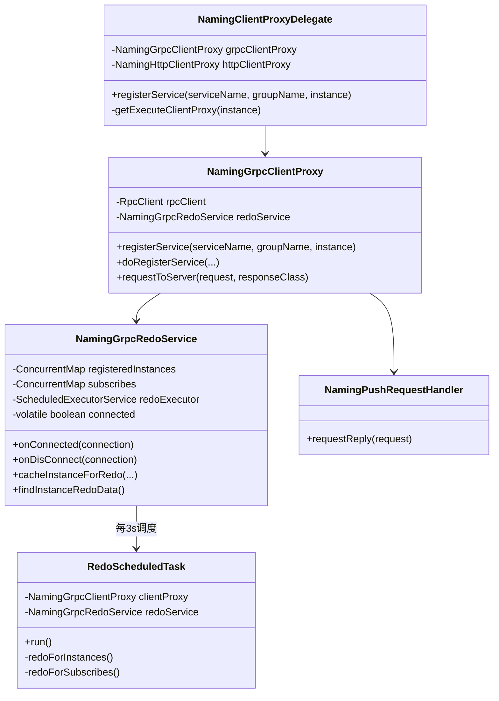

**2.x 心跳流程**：
1. 客户端 `registerService` 时，`redoService.cacheInstanceForRedo()` 缓存 + `doRegisterService()` 发送 gRPC 请求
2. gRPC 连接保持活跃 = 心跳（无需定期发送心跳包）
3. 连接断开 → `onDisConnect()` 标记所有 RedoData `registered=false`
4. 连接恢复 → `RedoScheduledTask`（3s 周期）自动补注册

### 3.3 关键差异

| 维度 | 1.x BeatReactor | 2.x gRPC + Redo |
|------|----------------|-----------------|
| **心跳本质** | 应用层显式 HTTP 请求 | 传输层 gRPC 连接保活 |
| **心跳频率** | 每 5s 一次 HTTP 请求 | 无请求（连接持续） |
| **网络开销** | 高（每实例每 5s 一个 HTTP 包） | 极低（连接复用） |
| **断线感知** | 心跳请求失败（被动） | 连接事件回调（主动、即时） |
| **断线恢复** | 重新注册（无自动机制） | Redo 自动补注册 |
| **服务端压力** | 高 QPS（N 实例 × 0.2 QPS） | 低（仅连接管理） |

---

## 4. 服务端 Beat 检查对比

### 4.1 1.x：ClientBeatCheckTask（per Service）

**1.x 实现**（已在 2.4.2 中移除）：

- 每个 `Service` 对象在 `init()` 时创建一个 `ClientBeatCheckTask`
- 由 `ServiceManager` 调度，周期 5s
- 遍历该 service 下所有 ephemeral instance
- 检查 `instance.getLastBeat()` 是否超时
- 超时 15s → 标记 unhealthy；超时 30s → 摘除

**特点**：
- 以 **Service** 为单位组织检查任务
- 实例存储在 `Service.ephemeralInstances`（`Map<cluster, List<Instance>>`）
- 每个实例有 `lastBeat` 字段，由 `ClientBeatProcessor` 更新

### 4.2 2.x：ClientBeatCheckTaskV2（per Client）

**2.x 实现**（已验证）：

```java
// naming/.../healthcheck/heartbeat/ClientBeatCheckTaskV2.java:65-76
@Override
public void doHealthCheck() {
    try {
        Collection<Service> services = client.getAllPublishedService();
        for (Service each : services) {
            HealthCheckInstancePublishInfo instance = (HealthCheckInstancePublishInfo) client
                    .getInstancePublishInfo(each);
            interceptorChain.doInterceptor(new InstanceBeatCheckTask(client, each, instance));
        }
    } catch (Exception e) {
        Loggers.SRV_LOG.warn("Exception while processing client beat time out.", e);
    }
}
```

```java
// naming/.../core/v2/client/impl/IpPortBasedClient.java:133-141
public void init() {
    if (ephemeral) {
        beatCheckTask = new ClientBeatCheckTaskV2(this);
        HealthCheckReactor.scheduleCheck(beatCheckTask);   // 5s 周期
    } else {
        healthCheckTaskV2 = new HealthCheckTaskV2(this);
        HealthCheckReactor.scheduleCheck(healthCheckTaskV2);
    }
}
```

**特点**：
- 以 **Client** 为单位组织检查任务
- 实例存储在 `Client.publishers`（`Map<Service, InstancePublishInfo>`）
- 引入**拦截器链**（`InstanceBeatCheckTaskInterceptorChain`）：服务开关 / 实例开关 / Distro 责任
- 引入 **SPI 扩展**（`InstanceBeatChecker`）

### 4.3 数据组织维度变化

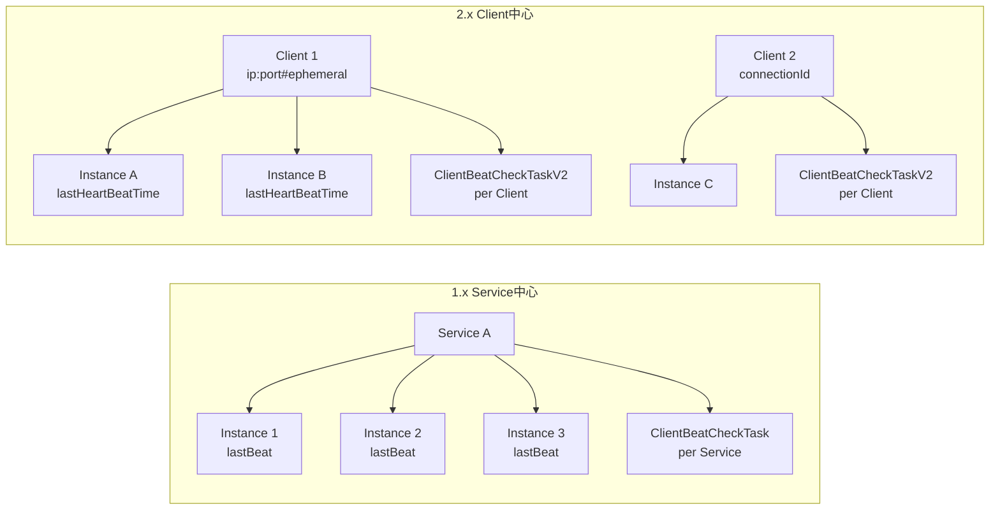

> **关键变化**：1.x 以 Service 为聚合，2.x 以 Client 为聚合。一个 Client 可发布多个 Service 的实例，Client 维度的检查更高效（一次遍历该 client 所有实例）。

### 4.4 HTTP 心跳端点的演进

**1.x**：`/instance/beat` 是核心心跳入口，所有客户端依赖它

**2.x**：`/instance/beat` 退化为**兼容端点**，仅供旧客户端或外部系统使用：

```java
// naming/.../controllers/InstanceController.java:389-427
@CanDistro
@PutMapping("/beat")
@TpsControl(pointName = "HttpHealthCheck", name = "HttpHealthCheck")
@Secured(action = ActionTypes.WRITE)
public ObjectNode beat(HttpServletRequest request) throws Exception {
    // ... 解析 RsInfo
    int resultCode = getInstanceOperator().handleBeat(namespaceId, serviceName, ip, port, clusterName, clientBeat, builder);
    // 返回 clientBeatInterval（默认 5s）
}
```

```java
// naming/.../core/InstanceOperatorClientImpl.java:221-249
public int handleBeat(...) {
    // ...
    ClientBeatProcessorV2 beatProcessor = new ClientBeatProcessorV2(namespaceId, clientBeat, client);
    HealthCheckReactor.scheduleNow(beatProcessor);
    client.setLastUpdatedTime();
    return NamingResponseCode.OK;
}
```

> 2.x 的 HTTP beat 端点最终也调用 `ClientBeatProcessorV2`（v2 实现），只是入口兼容 HTTP。

---

## 5. 服务端主动健康检查对比

### 5.1 架构对比

| 维度 | 1.x | 2.x |
|------|-----|-----|
| **接口** | `HealthCheckProcessor`（无 V2 后缀） | `HealthCheckProcessorV2` |
| **任务** | `HealthCheckTask`（per Cluster） | `HealthCheckTaskV2`（per Client） |
| **处理器** | `TcpHealthCheckProcessor` 等（v1） | `TcpHealthCheckProcessor` 等（v2，NIO 重写） |
| **调度单位** | Cluster | Client |
| **TCP 实现** | 阻塞 Socket | NIO Selector（非阻塞） |
| **HTTP 实现** | 同步 HTTP | 异步 HTTP（`NacosAsyncRestTemplate`） |
| **状态同步** | 直接修改 Instance | `PersistentHealthStatusSynchronizer`（Raft） |

### 5.2 1.x 主动健康检查

**1.x 实现**（已在 2.4.2 中移除）：

- 每个 `Cluster` 持有一个 `HealthCheckTask`
- `HealthCheckTask` 调用 `HealthCheckProcessor.process()`
- 处理器类型：`TcpHealthCheckProcessor`、`HttpHealthCheckProcessor`、`MysqlHealthCheckProcessor`
- TCP 检查使用阻塞 Socket connect
- HTTP 检查使用同步 HTTP 请求
- 状态变更直接修改 `Instance.healthy` 字段

### 5.3 2.x 主动健康检查

**2.x 实现**（已验证）：

- 每个 `IpPortBasedClient`（持久）持有一个 `HealthCheckTaskV2`
- `HealthCheckTaskV2` 调用 `HealthCheckProcessorV2Delegate.process()`
- 委托给具体处理器：`TcpHealthCheckProcessor`（NIO）、`HttpHealthCheckProcessor`（异步）、`MysqlHealthCheckProcessor`、`NoneHealthCheckProcessor`
- **TCP 用 NIO Selector**，单线程处理多连接（`NIO_THREAD_COUNT = CPU/2`）
- **HTTP 用异步回调**（`NacosAsyncRestTemplate` + `Callback`）
- 状态变更通过 `PersistentHealthStatusSynchronizer` 走 Raft CP 协议

```java
// naming/.../healthcheck/v2/processor/TcpHealthCheckProcessor.java:62-93
public static final int CONNECT_TIMEOUT_MS = 500;
private static final int NIO_THREAD_COUNT = EnvUtil.getAvailableProcessors(0.5);  // 半数CPU核
private final BlockingQueue<Beat> taskQueue = new LinkedBlockingQueue<>();
private final Selector selector;

public TcpHealthCheckProcessor(...) {
    selector = Selector.open();
    GlobalExecutor.submitTcpCheck(this);   // NIO 事件循环
}
```

```java
// naming/.../healthcheck/v2/PersistentHealthStatusSynchronizer.java:41-47
public void instanceHealthStatusChange(boolean isHealthy, Client client, Service service, InstancePublishInfo instance) {
    Instance updateInstance = InstanceUtil.parseToApiInstance(service, instance);
    updateInstance.setHealthy(isHealthy);
    persistentClientOperationService.updateInstance(service, updateInstance, client.getClientId());  // Raft
}
```

### 5.4 性能改进

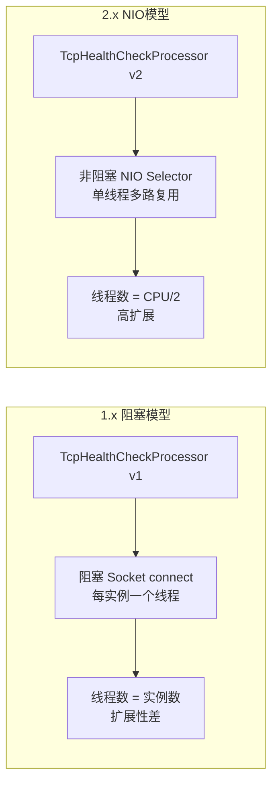

---

## 6. 数据模型与存储对比

### 6.1 1.x：Service 中心化

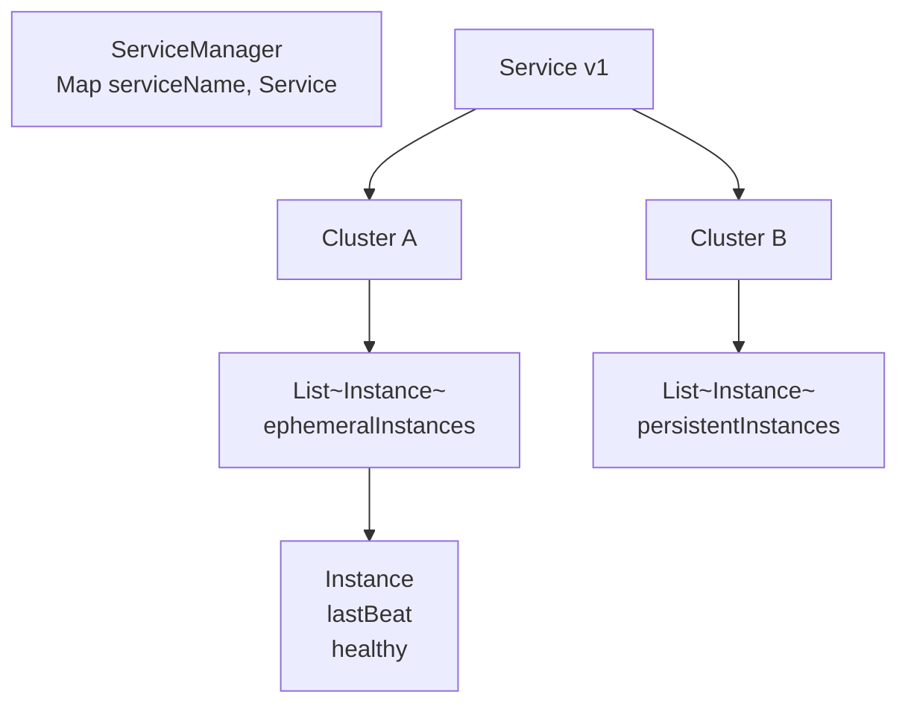

**1.x 关键类**（已移除）：
- `ServiceManager`：管理所有 service，`Map<String, Service>`
- `Service` v1：每个 service 内含 `Map<String, List<Instance>>`（按 cluster）
- `Instance`：`lastBeat` 字段记录最后心跳时间

### 6.2 2.x：Client 中心化

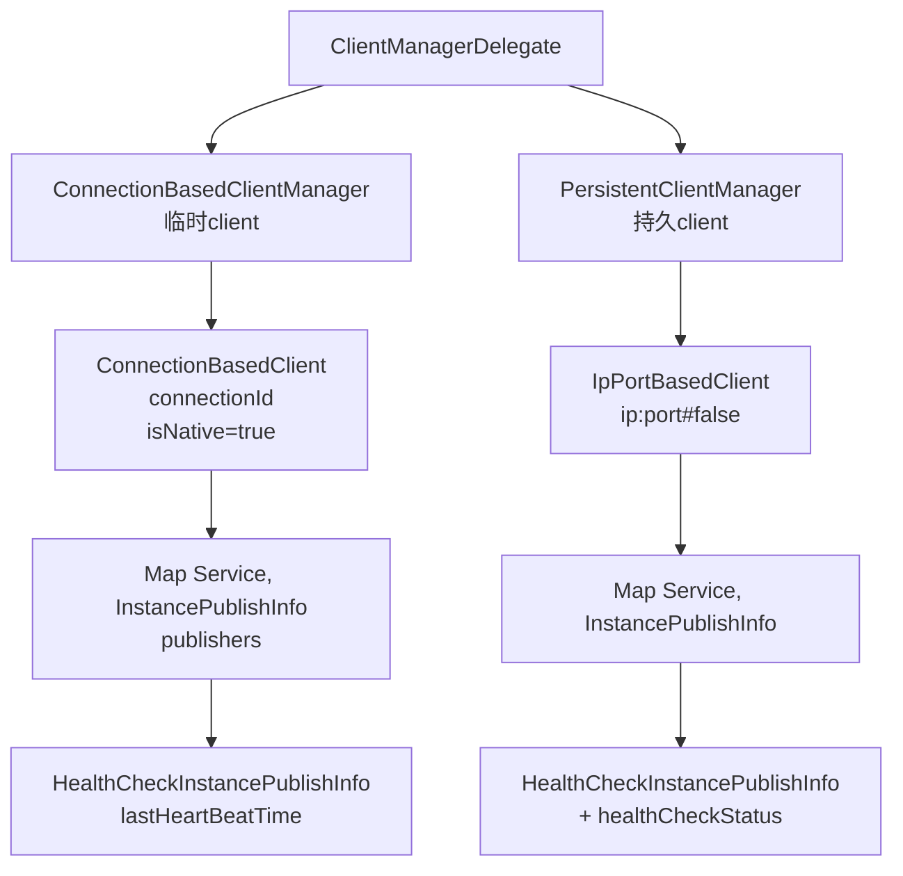

**2.x 关键类**（已验证）：
- `ClientManagerDelegate` → `ConnectionBasedClientManager` + `PersistentClientManager`
- `ConnectionBasedClient`：绑定 gRPC 连接，`isNative=true` 直连
- `IpPortBasedClient`：绑定 ip:port，可临时可持久
- `AbstractClient.publishers`：`Map<Service, InstancePublishInfo>`
- `HealthCheckInstancePublishInfo`：`lastHeartBeatTime`、`okCount`、`failCount`

### 6.3 核心差异

| 维度 | 1.x | 2.x |
|------|-----|-----|
| **聚合维度** | Service | Client |
| **实例存储** | `Service.ephemeralInstances` | `Client.publishers` |
| **心跳字段** | `Instance.lastBeat` | `HealthCheckInstancePublishInfo.lastHeartBeatTime` |
| **连接关联** | 无（每次 HTTP 请求独立） | Client 绑定 gRPC 连接 |
| **多实例支持** | 每实例独立 | 单 Client 可发布多 Service 实例 |

---

## 7. Distro 集群同步对比

### 7.1 1.x：Service 粒度全量同步

**1.x Distro**：
- `DistroService` + `DistroProtocol` v1
- 同步单位：**Service**（按 serviceName 分片）
- 同步内容：`List<Instance>` 全量数据
- 同步方式：HTTP 异步推送 + 定期全量校验
- 新节点加入：全量拉取所有 service 数据

**问题**：
- 全量同步带宽高
- service 粒度粗，变更同步范围大

### 7.2 2.x：Client 粒度增量同步

**2.x Distro**：
- `DistroProtocol` v2 + `DistroClientTransport`
- 同步单位：**Client**（按 clientId 分片，一致性哈希）
- 同步内容：`ClientSyncData`（增量）
- 同步方式：gRPC 异步推送 + 周期 verify（revision 校验）
- 新节点加入：快照传输（全量 client 列表）

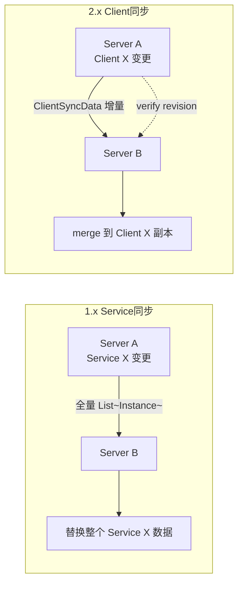

### 7.3 责任划分演进

| 维度 | 1.x | 2.x |
|------|-----|-----|
| **分片键** | serviceName | clientId（一致性哈希） |
| **同步粒度** | Service 全量实例 | Client 增量变更 |
| **校验机制** | 全量数据比对 | revision 哈希校验 |
| **新节点同步** | 全量拉取 | 快照 + 增量 |

---

## 8. 断线恢复机制对比

### 8.1 1.x：无自动恢复

**1.x 断线行为**：
1. 客户端网络中断 → `BeatTask` HTTP 请求失败
2. 心跳停止 → 服务端 `lastBeat` 不更新
3. 15s 后服务端标记 unhealthy，30s 后摘除实例
4. 客户端恢复后需**重新调用 `registerService`**
5. 重新注册前服务已不可见

**问题**：
- 恢复延迟大（需等重新注册）
- 客户端需感知断线并主动重试
- 短暂网络抖动也会导致实例摘除

### 8.2 2.x：Redo 自动恢复

**2.x 断线行为**（已验证）：

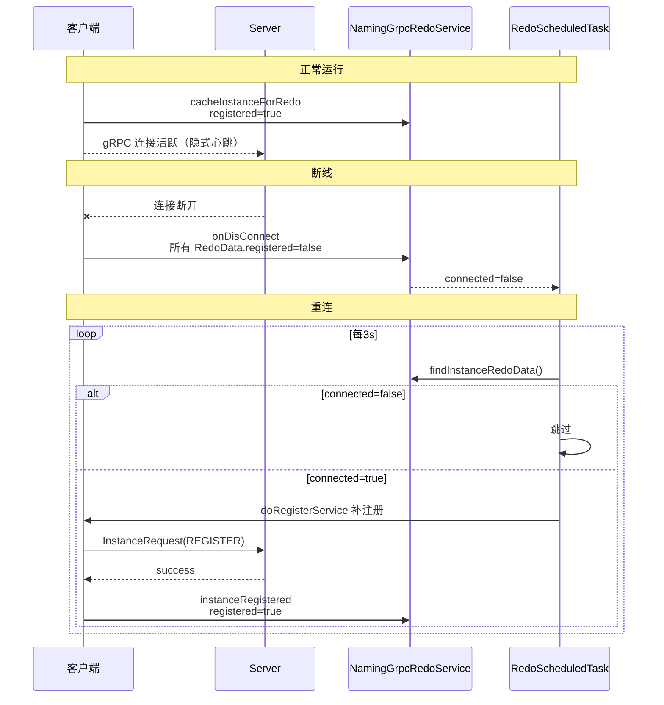

**2.x 优势**：
- 断线即时感知（连接事件回调）
- 自动补注册（Redo 机制）
- 短暂抖动不影响注册状态（Redo 快速恢复）
- 客户端无需业务层干预

### 8.3 服务端断线清理对比

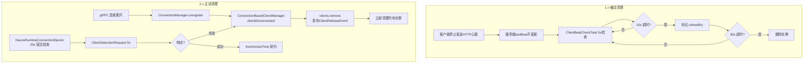

> **关键差异**：1.x 实例摘除延迟 30s（被动）；2.x 连接断开即清理（主动、秒级）。

---

## 9. 完整流程对比图

### 9.1 临时实例完整生命周期对比

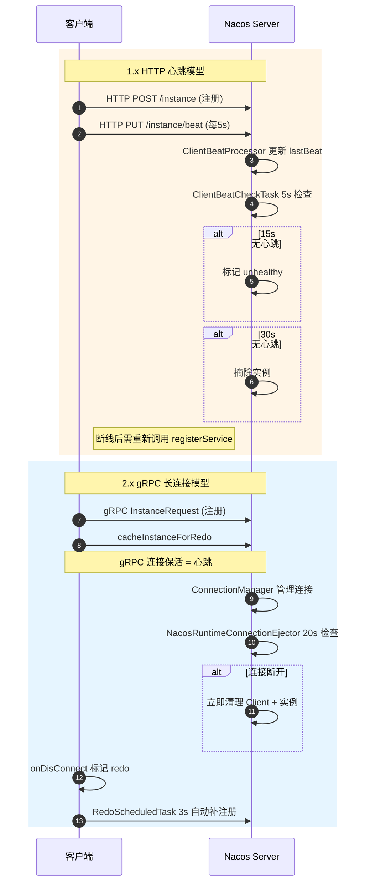

### 9.2 持久实例健康检查对比

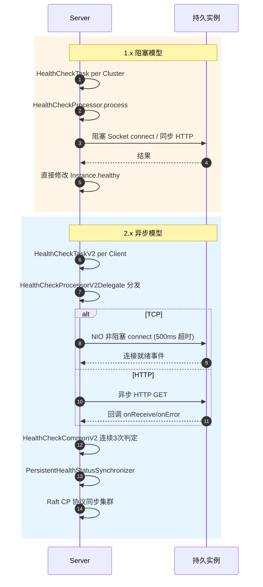

---

## 10. 参数与默认值对比

| 参数 | 1.x 默认 | 2.x 默认 | 说明 |
|------|---------|---------|------|
| 客户端心跳间隔 | 5s（`clientBeatInterval`） | 无显式心跳（gRPC 保活） | 2.x 连接即心跳 |
| 客户端 Redo 周期 | 无 | 3s（`DEFAULT_REDO_DELAY_TIME`） | 2.x 新增 |
| Beat 检查周期 | 5s（per Service） | 5s（per Client） | 单位变化 |
| 心跳超时（不健康） | 15s | 15s（`DEFAULT_HEART_BEAT_TIMEOUT`） | 相同 |
| 实例摘除超时 | 30s | 30s（`DEFAULT_IP_DELETE_TIMEOUT`） | 相同 |
| 连接保活检查 | 无 | 20s（`KEEP_ALIVE_TIME`） | 2.x 新增 |
| ClientDetection 超时 | 无 | 5s | 2.x 新增 |
| 客户端过期兜底 | 无 | 3 分钟（`DEFAULT_CLIENT_EXPIRED_TIME`） | 2.x 新增 |
| 持久检查首次延迟 | 固定 | 2000 + [0, 5000) ms 随机 | 2.x 防雪崩 |
| 状态切换阈值 | 3 次 | 3 次（`checkTimes`） | 相同 |
| TCP 超时 | 无统一标准 | 500ms（`CONNECT_TIMEOUT_MS`） | 2.x 标准化 |
| TCP NIO 线程 | 无（阻塞模型） | CPU/2 | 2.x 新增 |

---

## 11. 总结对比表

### 11.1 客户端对比

| 维度 | 1.x | 2.x |
|------|-----|-----|
| 通信协议 | HTTP/1.1 | gRPC（HTTP/2 + Protobuf） |
| 心跳方式 | 显式 HTTP beat（每 5s） | gRPC 长连接保活（无显式包） |
| 心跳类 | `BeatReactor` + `BeatTask` + `BeatInfo` | `RpcClient` + `NamingGrpcRedoService` |
| 推送方式 | UDP + HTTP 长轮询 | gRPC server stream |
| 断线恢复 | 手动重新注册 | `RedoScheduledTask` 自动补注册 |
| 状态缓存 | 无 | `RedoData` 状态机 |

### 11.2 服务端对比

| 维度 | 1.x | 2.x |
|------|-----|-----|
| 数据聚合 | Service | Client |
| Beat 检查 | `ClientBeatCheckTask`（per Service） | `ClientBeatCheckTaskV2`（per Client） |
| 健康检查 | `HealthCheckTask` + `HealthCheckProcessor`（per Cluster） | `HealthCheckTaskV2` + `HealthCheckProcessorV2`（per Client） |
| TCP 探测 | 阻塞 Socket | NIO Selector |
| HTTP 探测 | 同步 | 异步回调 |
| 状态同步 | 直接修改 Instance | `PersistentHealthStatusSynchronizer`（Raft） |
| 扩展性 | 接口固定 | 拦截器链 + SPI |
| 连接管理 | 无 | `ConnectionManager` + 驱逐器 |

### 11.3 集群同步对比

| 维度 | 1.x | 2.x |
|------|-----|-----|
| Distro 同步粒度 | Service 全量 | Client 增量 |
| 分片方式 | serviceName | clientId（一致性哈希） |
| 校验方式 | 全量数据比对 | revision 哈希 |
| 新节点加入 | 全量拉取 | 快照 + 增量 |

### 11.4 核心改进总结

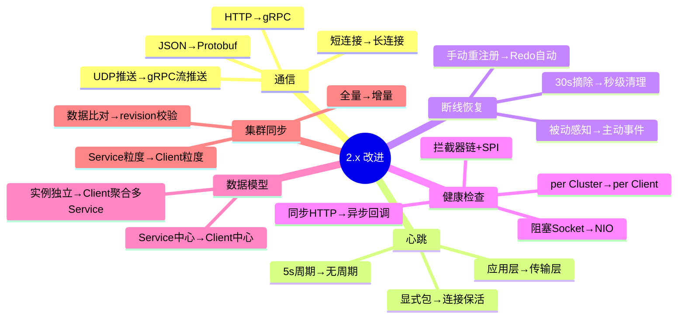

### 11.5 兼容性说明

Nacos 2.x 保留了以下 1.x 兼容能力：

1. **HTTP `/instance/beat` 端点**：旧客户端仍可发送 HTTP 心跳，服务端通过 `ClientBeatProcessorV2` 处理
2. **HTTP 注册端点**：`InstanceController` 的 v1 HTTP API 保留
3. **`NamingHttpClientProxy`**：客户端保留 HTTP 代理，持久实例在服务端不支持 gRPC 时回退

但 2.x 服务端内部已完全重构为 v2 架构，HTTP 请求最终被适配到 v2 的 `Client` / `InstancePublishInfo` 模型上。

---

## 附录：源码移除确认

通过源码搜索确认以下 1.x 类在 2.4.2 中**已完全移除**：

| 类名 | 搜索结果 |
|------|---------|
| `client/**/beat/*.java`（BeatReactor/BeatTask/BeatInfo） | 无匹配 |
| `client/**/Beat*.java` | 无匹配 |
| `naming/**/healthcheck/ClientBeatCheckTask.java`（v1） | 无匹配 |
| `NamingHttpClientProxy.sendBeat` | 无匹配 |

以下 1.x 兼容能力在 2.4.2 中**保留**：

| 能力 | 位置 |
|------|------|
| HTTP `/instance/beat` 端点 | `InstanceController.java:389` |
| `RsInfo` 心跳数据结构 | `naming/.../healthcheck/RsInfo.java` |
| `ClientBeatProcessorV2`（替代 v1 `ClientBeatProcessor`） | `naming/.../healthcheck/heartbeat/ClientBeatProcessorV2.java` |
| `switchDomain.getClientBeatInterval()`（默认 5s） | `SwitchDomain.java:47` |

---

*文档生成时间：2026-07-02  |  Nacos 版本：2.4.2  |  分支：develop*
