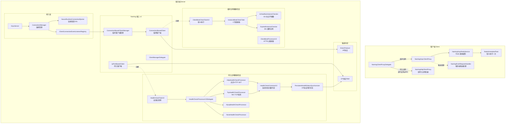
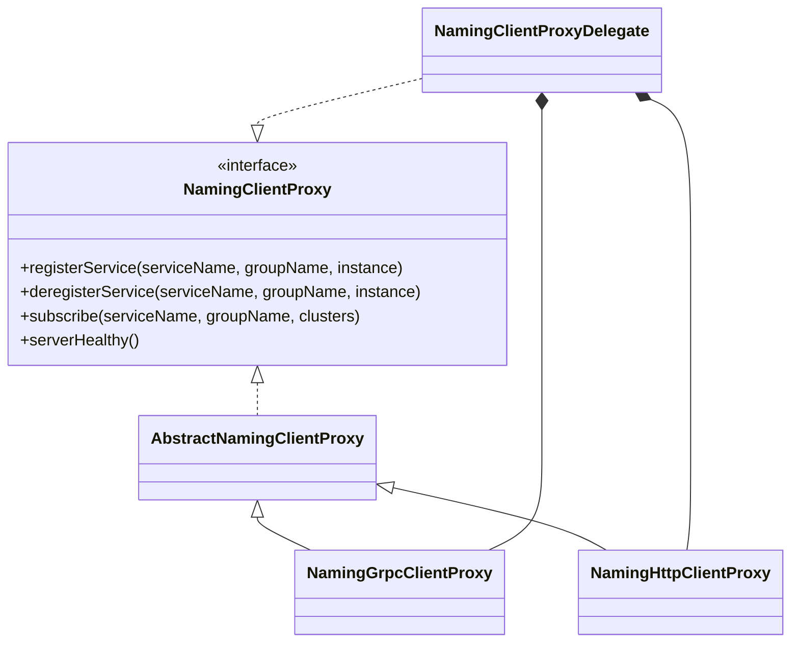
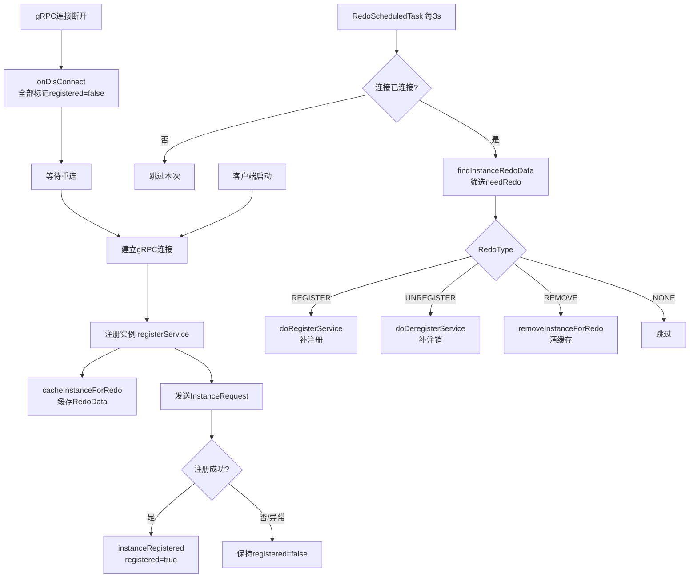
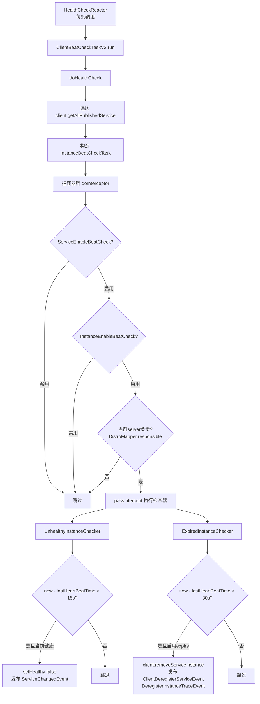
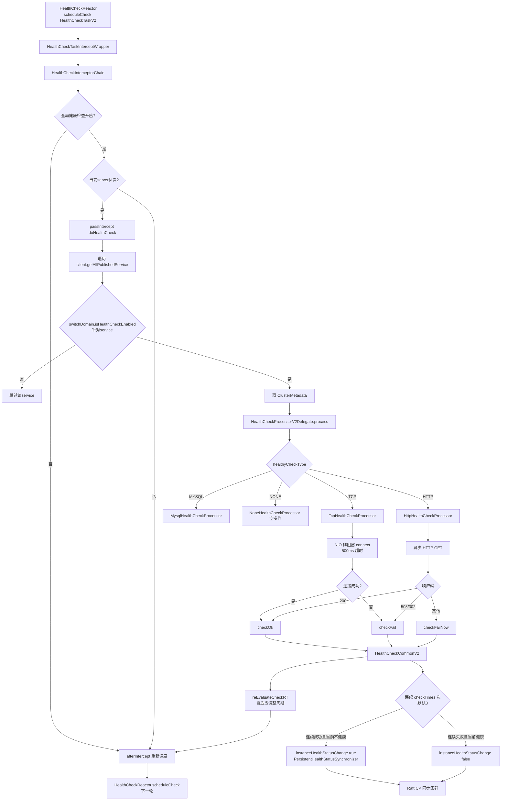
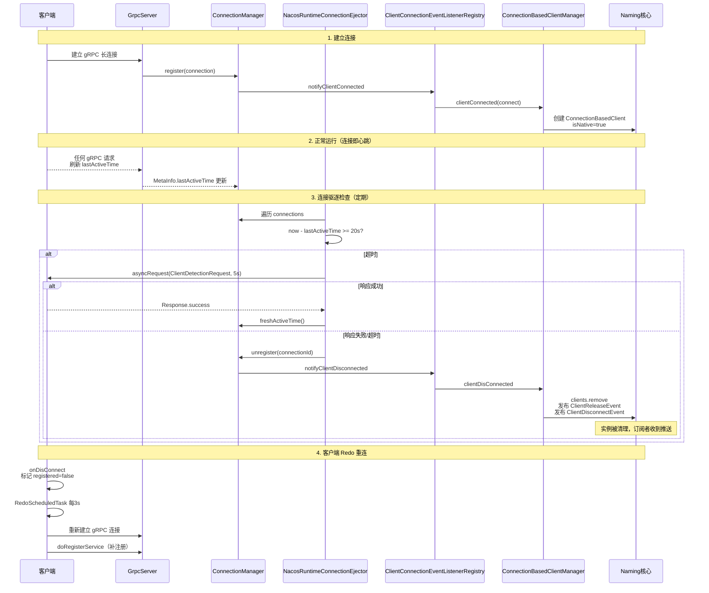
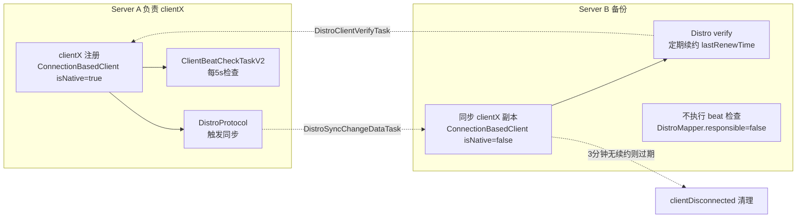
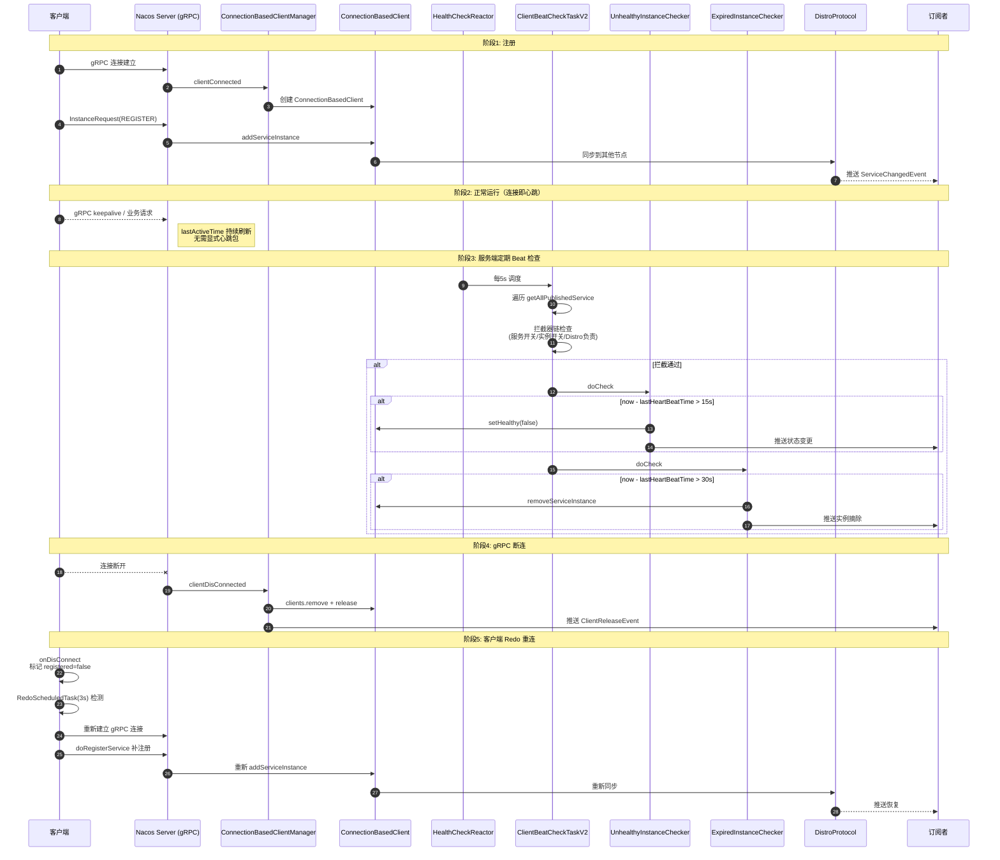
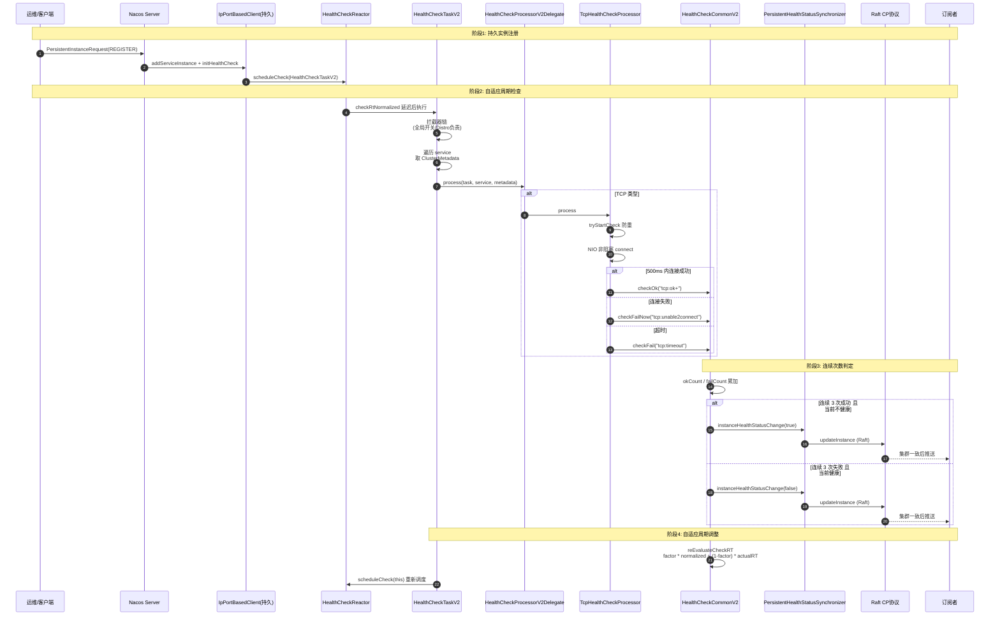
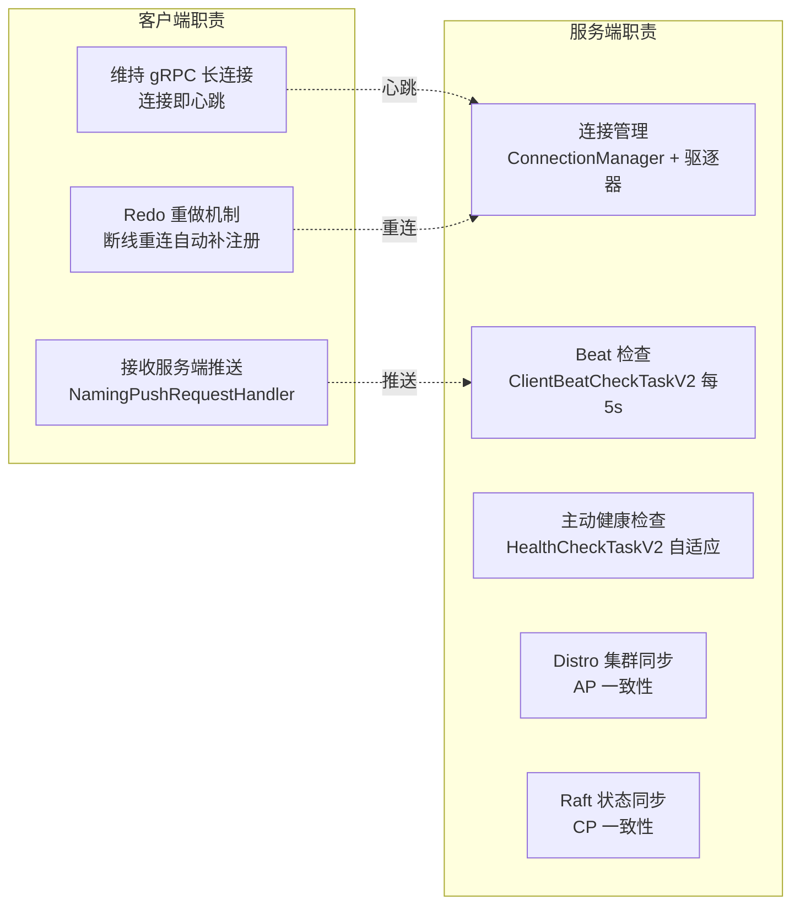

# Nacos 2.4.2 心跳检测与健康检查源码深度剖析

> 基于 Nacos `2.4.2`（revision = 2.4.2，分支 develop）源码，深入梳理 Naming 模块的心跳检测（Heartbeat / Beat）与健康检查（Health Check）的完整流程、原理与源码实现。
>
> 所有结论均标注源码路径与行号，便于追溯。

---

## 目录

1. [核心概念与整体架构](#1-核心概念与整体架构)
2. [临时实例心跳机制（客户端侧）](#2-临时实例心跳机制客户端侧)
3. [服务端临时实例 Beat 检查](#3-服务端临时实例-beat-检查)
4. [服务端持久实例主动健康检查](#4-服务端持久实例主动健康检查)
5. [gRPC 连接生命周期与连接驱逐](#5-grpc-连接生命周期与连接驱逐)
6. [Distro 协议与集群间数据同步](#6-distro-协议与集群间数据同步)
7. [完整时序图](#7-完整时序图)
8. [关键参数与默认值](#8-关键参数与默认值)
9. [总结对比](#9-总结对比)

---

## 1. 核心概念与整体架构

### 1.1 两类实例、两套机制

Nacos 中的服务实例分为 **临时实例（Ephemeral）** 与 **持久实例（Persistent）**，二者采用完全不同的健康检查机制：

| 实例类型 | 存储位置 | 健康检查方式 | 一致性协议 | 注册方式 |
|---------|---------|-------------|-----------|---------|
| **临时实例** | 内存（`ConnectionBasedClient`） | **被动**：客户端维持 gRPC 长连接，连接即心跳；服务端定期检查 `lastHeartBeatTime` | **AP（Distro）** | gRPC `InstanceRequest` |
| **持久实例** | 磁盘（Raft 日志） | **主动**：服务端发起 TCP/HTTP/Mysql 探测 | **CP（Raft）** | gRPC `PersistentInstanceRequest` / HTTP |

### 1.2 整体架构图



### 1.3 关键设计思想

> **临时实例没有"显式心跳包"**：在 2.x 架构中，客户端通过维持 gRPC 长连接来证明存活，**gRPC 连接本身就是心跳**。服务端不再要求客户端定期发送 `InstanceRequest`。当 gRPC 连接断开，服务端通过连接事件感知并清理实例。
>
> **持久实例不需要客户端维持连接**：注册后即持久化，服务端按配置周期主动探测（TCP/HTTP/Mysql）。

---

## 2. 临时实例心跳机制（客户端侧）

### 2.1 客户端代理层级



`NamingClientProxyDelegate` 是入口代理，根据实例类型分发请求：

```java
// client/.../NamingClientProxyDelegate.java:194-199
private NamingClientProxy getExecuteClientProxy(Instance instance) {
    if (instance.isEphemeral() || grpcClientProxy.isAbilitySupportedByServer(
            AbilityKey.SERVER_SUPPORT_PERSISTENT_INSTANCE_BY_GRPC)) {
        return grpcClientProxy;
    }
    return httpClientProxy;
}
```

- **临时实例** → 永远走 `NamingGrpcClientProxy`
- **持久实例** → 优先 gRPC（若服务端支持），否则回退 HTTP

### 2.2 注册流程（gRPC）

```java
// client/.../gprc/NamingGrpcClientProxy.java:132-146
@Override
public void registerService(String serviceName, String groupName, Instance instance) throws NacosException {
    NAMING_LOGGER.info("[REGISTER-SERVICE] {} registering service {} with instance {}", namespaceId, serviceName, instance);
    if (instance.isEphemeral()) {
        registerServiceForEphemeral(serviceName, groupName, instance);
    } else {
        doRegisterServiceForPersistent(serviceName, groupName, instance);
    }
}

private void registerServiceForEphemeral(String serviceName, String groupName, Instance instance) throws NacosException {
    redoService.cacheInstanceForRedo(serviceName, groupName, instance);   // 1. 缓存到 Redo
    doRegisterService(serviceName, groupName, instance);                   // 2. 发送 gRPC 请求
}
```

```java
// client/.../gprc/NamingGrpcClientProxy.java:247-252
public void doRegisterService(String serviceName, String groupName, Instance instance) throws NacosException {
    InstanceRequest request = new InstanceRequest(namespaceId, serviceName, groupName,
            NamingRemoteConstants.REGISTER_INSTANCE, instance);
    requestToServer(request, Response.class);
    redoService.instanceRegistered(serviceName, groupName);   // 注册成功后标记 registered=true
}
```

### 2.3 Redo 重做机制（断线重连的核心）

`NamingGrpcRedoService` 是客户端维持注册状态的"心跳保障"：当 gRPC 断连时，所有已注册实例被标记为"待重做"，重连后定时任务自动补注册。

```java
// client/.../gprc/redo/NamingGrpcRedoService.java:50-71
public class NamingGrpcRedoService implements ConnectionEventListener {
    private final ConcurrentMap<String, InstanceRedoData> registeredInstances = new ConcurrentHashMap<>();
    private final ConcurrentMap<String, SubscriberRedoData> subscribes = new ConcurrentHashMap<>();
    private final ScheduledExecutorService redoExecutor;
    private volatile boolean connected = false;

    public NamingGrpcRedoService(NamingGrpcClientProxy clientProxy, NacosClientProperties properties) {
        setProperties(properties);
        this.redoExecutor = new ScheduledThreadPoolExecutor(redoThreadCount, new NameThreadFactory(REDO_THREAD_NAME));
        this.redoExecutor.scheduleWithFixedDelay(new RedoScheduledTask(clientProxy, this),
                redoDelayTime, redoDelayTime, TimeUnit.MILLISECONDS);   // 默认 3000ms
    }
}
```

**断连时标记重做**：

```java
// client/.../gprc/redo/NamingGrpcRedoService.java:93-104
@Override
public void onDisConnect(Connection connection) {
    connected = false;
    LogUtils.NAMING_LOGGER.warn("Grpc connection disconnect, mark to redo");
    synchronized (registeredInstances) {
        registeredInstances.values().forEach(instanceRedoData -> instanceRedoData.setRegistered(false));
    }
    synchronized (subscribes) {
        subscribes.values().forEach(subscriberRedoData -> subscriberRedoData.setRegistered(false));
    }
    LogUtils.NAMING_LOGGER.warn("mark to redo completed");
}
```

### 2.4 RedoScheduledTask 重做任务

```java
// client/.../gprc/redo/RedoScheduledTask.java:44-56
@Override
public void run() {
    if (!redoService.isConnected()) {
        LogUtils.NAMING_LOGGER.warn("Grpc Connection is disconnect, skip current redo task");
        return;
    }
    try {
        redoForInstances();
        redoForSubscribes();
    } catch (Exception e) {
        LogUtils.NAMING_LOGGER.warn("Redo task run with unexpected exception: ", e);
    }
}
```

**RedoType 状态机**（`RedoData.java:127-137`）：

| registered | unregistering | expectedRegistered | RedoType | 含义 |
|:---:|:---:|:---:|---|---|
| true  | false | true  | **NONE**     | 已注册且应保持，无需操作 |
| true  | false | false | **UNREGISTER** | 已注册但应注销 |
| true  | true  | *     | **UNREGISTER** | 注销中 |
| false | false | *     | **REGISTER** | 未注册，需补注册 |
| false | true  | true  | **REGISTER** | 未注册且应注册 |
| false | true  | false | **REMOVE**   | 已注销完成，移除缓存 |

```java
// client/.../gprc/redo/data/RedoData.java:127-137
public RedoType getRedoType() {
    if (isRegistered() && !isUnregistering()) {
        return expectedRegistered ? RedoType.NONE : RedoType.UNREGISTER;
    } else if (isRegistered() && isUnregistering()) {
        return RedoType.UNREGISTER;
    } else if (!isRegistered() && !isUnregistering()) {
        return RedoType.REGISTER;
    } else {
        return expectedRegistered ? RedoType.REGISTER : RedoType.REMOVE;
    }
}
```

### 2.5 客户端 Redo 流程图



---

## 3. 服务端临时实例 Beat 检查

### 3.1 任务调度入口

`IpPortBasedClient` 在初始化时根据实例类型创建不同的检查任务：

```java
// naming/.../core/v2/client/impl/IpPortBasedClient.java:133-141
public void init() {
    if (ephemeral) {
        beatCheckTask = new ClientBeatCheckTaskV2(this);
        HealthCheckReactor.scheduleCheck(beatCheckTask);
    } else {
        healthCheckTaskV2 = new HealthCheckTaskV2(this);
        HealthCheckReactor.scheduleCheck(healthCheckTaskV2);
    }
}
```

```java
// naming/.../healthcheck/HealthCheckReactor.java:56-62
public static void scheduleCheck(BeatCheckTask task) {
    Runnable wrapperTask =
            task instanceof NacosHealthCheckTask ? new HealthCheckTaskInterceptWrapper((NacosHealthCheckTask) task) : task;
    futureMap.computeIfAbsent(task.taskKey(),
            k -> GlobalExecutor.scheduleNamingHealth(wrapperTask, 5000, 5000, TimeUnit.MILLISECONDS));  // 5s 周期
}
```

> **重要**：临时实例的 beat 检查周期固定 **5 秒**，由 `HealthCheckReactor` 通过 `GlobalExecutor.scheduleNamingHealth` 调度。

### 3.2 ClientBeatCheckTaskV2 核心逻辑

```java
// naming/.../healthcheck/heartbeat/ClientBeatCheckTaskV2.java:65-76
@Override
public void doHealthCheck() {
    try {
        Collection<Service> services = client.getAllPublishedService();
        for (Service each : services) {
            HealthCheckInstancePublishInfo instance = (HealthCheckInstancePublishInfo) client
                    .getInstancePublishInfo(each);
            interceptorChain.doInterceptor(new InstanceBeatCheckTask(client, each, instance));
        }
    } catch (Exception e) {
        Loggers.SRV_LOG.warn("Exception while processing client beat time out.", e);
    }
}
```

逻辑：
1. 遍历该 client 发布的所有 service
2. 取出每个 instance 的 `HealthCheckInstancePublishInfo`
3. 包装成 `InstanceBeatCheckTask` 交给拦截器链

### 3.3 InstanceBeatCheckTask 与拦截器链

```java
// naming/.../healthcheck/heartbeat/InstanceBeatCheckTask.java:33-60
public class InstanceBeatCheckTask implements Interceptable {
    private static final List<InstanceBeatChecker> CHECKERS = new LinkedList<>();

    static {
        CHECKERS.add(new UnhealthyInstanceChecker());   // 1. 先判不健康
        CHECKERS.add(new ExpiredInstanceChecker());      // 2. 再判过期摘除
        CHECKERS.addAll(NacosServiceLoader.load(InstanceBeatChecker.class));  // SPI 扩展
    }

    @Override
    public void passIntercept() {
        for (InstanceBeatChecker each : CHECKERS) {
            each.doCheck(client, service, instancePublishInfo);   // 拦截器全部通过后执行检查
        }
    }
}
```

**拦截器链**（顺序由 `order()` 决定）：

| 拦截器 | order | 作用 |
|--------|------|------|
| `ServiceEnableBeatCheckInterceptor` | MIN_VALUE | 服务级开关：`enableClientBeat` 元数据 |
| `InstanceEnableBeatCheckInterceptor` | MIN_VALUE+1 | 实例级开关 |
| `InstanceBeatCheckResponsibleInterceptor` | MIN_VALUE+2 | 当前 server 是否负责该 client（Distro 一致性哈希） |

```java
// naming/.../healthcheck/heartbeat/InstanceBeatCheckResponsibleInterceptor.java:31-33
@Override
public boolean intercept(InstanceBeatCheckTask object) {
    return !ApplicationUtils.getBean(DistroMapper.class).responsible(object.getClient().getResponsibleId());
}
```

> `intercept()` 返回 `true` 表示"拦截"（跳过本次检查），返回 `false` 表示放行走 `passIntercept()`。

### 3.4 UnhealthyInstanceChecker —— 标记不健康

```java
// naming/.../healthcheck/heartbeat/UnhealthyInstanceChecker.java:47-52
@Override
public void doCheck(Client client, Service service, HealthCheckInstancePublishInfo instance) {
    if (instance.isHealthy() && isUnhealthy(service, instance)) {
        changeHealthyStatus(client, service, instance);
    }
}

private boolean isUnhealthy(Service service, HealthCheckInstancePublishInfo instance) {
    long beatTimeout = getTimeout(service, instance);
    return System.currentTimeMillis() - instance.getLastHeartBeatTime() > beatTimeout;
}
```

```java
// naming/.../healthcheck/heartbeat/UnhealthyInstanceChecker.java:59-64
private long getTimeout(Service service, InstancePublishInfo instance) {
    Optional<Object> timeout = getTimeoutFromMetadata(service, instance);
    if (!timeout.isPresent()) {
        timeout = Optional.ofNullable(instance.getExtendDatum().get(PreservedMetadataKeys.HEART_BEAT_TIMEOUT));
    }
    return timeout.map(ConvertUtils::toLong).orElse(Constants.DEFAULT_HEART_BEAT_TIMEOUT);   // 默认 15s
}
```

变更状态后发布三个事件：`ServiceChangedEvent`、`ClientChangedEvent`、`HealthStateChangeTraceEvent`。

### 3.5 ExpiredInstanceChecker —— 摘除实例

```java
// naming/.../healthcheck/heartbeat/ExpiredInstanceChecker.java:50-55
@Override
public void doCheck(Client client, Service service, HealthCheckInstancePublishInfo instance) {
    boolean expireInstance = ApplicationUtils.getBean(GlobalConfig.class).isExpireInstance();
    if (expireInstance && isExpireInstance(service, instance)) {
        deleteIp(client, service, instance);
    }
}

private boolean isExpireInstance(Service service, HealthCheckInstancePublishInfo instance) {
    long deleteTimeout = getTimeout(service, instance);
    return System.currentTimeMillis() - instance.getLastHeartBeatTime() > deleteTimeout;  // 默认 30s
}
```

```java
// naming/.../healthcheck/heartbeat/ExpiredInstanceChecker.java:76-84
private void deleteIp(Client client, Service service, InstancePublishInfo instance) {
    Loggers.SRV_LOG.info("[AUTO-DELETE-IP] service: {}, ip: {}", service.toString(), JacksonUtils.toJson(instance));
    client.removeServiceInstance(service);
    NotifyCenter.publishEvent(new ClientOperationEvent.ClientDeregisterServiceEvent(service, client.getClientId()));
    NotifyCenter.publishEvent(new MetadataEvent.InstanceMetadataEvent(service, instance.getMetadataId(), true));
    NotifyCenter.publishEvent(new DeregisterInstanceTraceEvent(System.currentTimeMillis(), "",
            false, DeregisterInstanceReason.HEARTBEAT_EXPIRE, service.getNamespace(), service.getGroup(),
            service.getName(), instance.getIp(), instance.getPort()));
}
```

### 3.6 临时实例健康检查流程图



### 3.7 HTTP 心跳入口（旧版兼容）

虽然 2.x 客户端默认走 gRPC，但服务端仍保留 HTTP `/v1/ns/instance/beat` 端点用于兼容旧客户端或外部健康上报：

```java
// naming/.../controllers/InstanceController.java:389-...
@CanDistro
@PutMapping("/beat")
@TpsControl(pointName = "HttpHealthCheck", name = "HttpHealthCheck")
@Secured(action = ActionTypes.WRITE)
public ObjectNode beat(HttpServletRequest request) throws Exception {
    ObjectNode result = JacksonUtils.createEmptyJsonNode();
    result.put(SwitchEntry.CLIENT_BEAT_INTERVAL, switchDomain.getClientBeatInterval());
    // ... 解析 beat 参数（ip/port/cluster/serviceName）
    // 最终调度 ClientBeatProcessorV2 刷新 lastHeartBeatTime
}
```

`ClientBeatProcessorV2.run()` 的核心：

```java
// naming/.../healthcheck/heartbeat/ClientBeatProcessorV2.java:60-76
if (instance.getIp().equals(ip) && instance.getPort() == port) {
    instance.setLastHeartBeatTime(System.currentTimeMillis());   // 刷新心跳时间
    if (!instance.isHealthy()) {
        instance.setHealthy(true);                                // 恢复健康
        NotifyCenter.publishEvent(new ServiceEvent.ServiceChangedEvent(service));
        NotifyCenter.publishEvent(new ClientEvent.ClientChangedEvent(client));
        NotifyCenter.publishEvent(new HealthStateChangeTraceEvent(..., true, "client_beat"));
    }
}
```

`ClientBeatUpdateTask`（批量刷新心跳，用于 Distro 同步过来的 client）：

```java
// naming/.../healthcheck/heartbeat/ClientBeatUpdateTask.java:38-44
@Override
public void run() {
    long currentTime = System.currentTimeMillis();
    for (InstancePublishInfo each : client.getAllInstancePublishInfo()) {
        ((HealthCheckInstancePublishInfo) each).setLastHeartBeatTime(currentTime);
    }
    client.setLastUpdatedTime();
}
```

---

## 4. 服务端持久实例主动健康检查

### 4.1 HealthCheckTaskV2 调度与自适应周期

```java
// naming/.../healthcheck/v2/HealthCheckTaskV2.java:86-98
private void initCheckRT() {
    if (-1 != checkRtNormalized) {
        return;
    }
    if (null != switchDomain) {
        checkRtNormalized = LOWER_CHECK_RT + RandomUtils.nextInt(0,
                RandomUtils.nextInt(0, switchDomain.getTcpHealthParams().getMax()));
    } else {
        checkRtNormalized = LOWER_CHECK_RT + RandomUtils.nextInt(0, UPPER_RANDOM_CHECK_RT);  // 2000 + [0,5000)
    }
    checkRtBest = Long.MAX_VALUE;
    checkRtWorst = 0L;
}
```

```java
// naming/.../healthcheck/v2/HealthCheckTaskV2.java:110-145
@Override
public void doHealthCheck() {
    try {
        initIfNecessary();
        for (Service each : client.getAllPublishedService()) {
            if (switchDomain.isHealthCheckEnabled(each.getGroupedServiceName())) {
                InstancePublishInfo instancePublishInfo = client.getInstancePublishInfo(each);
                ClusterMetadata metadata = getClusterMetadata(each, instancePublishInfo);
                ApplicationUtils.getBean(HealthCheckProcessorV2Delegate.class).process(this, each, metadata);
            }
        }
    } catch (Throwable e) {
        Loggers.SRV_LOG.error("[HEALTH-CHECK] error while process health check for {}", client.getClientId(), e);
    } finally {
        if (!cancelled) {
            initCheckRT();
            HealthCheckReactor.scheduleCheck(this);   // 自我重新调度，周期由 checkRtNormalized 决定
        }
    }
}
```

> **自适应周期**：每次执行后通过 `HealthCheckCommonV2.reEvaluateCheckRT` 重新计算下一次的 `checkRtNormalized`，公式：
> `checkRT = factor * checkRtNormalized + (1 - factor) * actualRT`，并 clamp 到 `[min, max]` 区间。

### 4.2 HealthCheckTaskInterceptWrapper 拦截

```java
// naming/.../healthcheck/interceptor/HealthCheckTaskInterceptWrapper.java:40-46
@Override
public void run() {
    try {
        interceptorChain.doInterceptor(task);
    } catch (Exception e) {
        Loggers.SRV_LOG.info("Interceptor health check task {} failed", task.getTaskId(), e);
    }
}
```

`HealthCheckInterceptorChain` 包含两个拦截器：
- `HealthCheckEnableInterceptor`（order=MIN_VALUE）：检查 `SwitchDomain.isHealthCheckEnabled()` 全局开关
- `HealthCheckResponsibleInterceptor`：检查当前 server 是否负责

### 4.3 HealthCheckProcessorV2Delegate 策略分发

```java
// naming/.../healthcheck/v2/processor/HealthCheckProcessorV2Delegate.java:54-62
@Override
public void process(HealthCheckTaskV2 task, Service service, ClusterMetadata metadata) {
    String type = metadata.getHealthyCheckType();
    HealthCheckProcessorV2 processor = healthCheckProcessorMap.get(type);
    if (processor == null) {
        processor = healthCheckProcessorMap.get(NoneHealthCheckProcessor.TYPE);
    }
    processor.process(task, service, metadata);
}
```

通过 `ClusterMetadata.healthyCheckType`（TCP / HTTP / MYSQL / NONE）路由到具体处理器。

### 4.4 TcpHealthCheckProcessor（NIO 实现）

```java
// naming/.../healthcheck/v2/processor/TcpHealthCheckProcessor.java:62-93
public static final int CONNECT_TIMEOUT_MS = 500;
private static final int NIO_THREAD_COUNT = EnvUtil.getAvailableProcessors(0.5);   // 一半 CPU 核数
private final BlockingQueue<Beat> taskQueue = new LinkedBlockingQueue<>();
private final Selector selector;

public TcpHealthCheckProcessor(HealthCheckCommonV2 healthCheckCommon, SwitchDomain switchDomain) {
    // ...
    selector = Selector.open();
    GlobalExecutor.submitTcpCheck(this);   // 启动 NIO 选择循环
}

@Override
public void process(HealthCheckTaskV2 task, Service service, ClusterMetadata metadata) {
    HealthCheckInstancePublishInfo instance = (HealthCheckInstancePublishInfo) task.getClient().getInstancePublishInfo(service);
    if (null == instance) return;
    if (!instance.tryStartCheck()) {   // 防止重复检查
        // 重新评估周期为 2 倍
        return;
    }
    taskQueue.add(new Beat(task, service, metadata, instance));
    MetricsMonitor.getTcpHealthCheckMonitor().incrementAndGet();
}
```

**NIO 主循环**（`run()` 方法）：
1. `processTask()`：从队列取出 Beat，发起非阻塞 connect，注册 `OP_CONNECT | OP_READ`
2. `selector.selectNow()`：检查就绪事件
3. `PostProcessor`：处理连接成功/失败结果

```java
// naming/.../healthcheck/v2/processor/TcpHealthCheckProcessor.java:181-186
if (key.isValid() && key.isConnectable()) {
    channel.finishConnect();
    beat.finishCheck(true, false, System.currentTimeMillis() - beat.getTask().getStartTime(), "tcp:ok+");
}
```

```java
// naming/.../healthcheck/v2/processor/TcpHealthCheckProcessor.java:200-206
} catch (ConnectException e) {
    // 无法连接，端口未开放
    beat.finishCheck(false, true, switchDomain.getTcpHealthParams().getMax(), "tcp:unable2connect:" + e.getMessage());
} catch (Exception e) {
    beat.finishCheck(false, false, switchDomain.getTcpHealthParams().getMax(), "tcp:error:" + e.getMessage());
}
```

`TimeOutTask`（500ms 超时）：

```java
// naming/.../healthcheck/v2/processor/TcpHealthCheckProcessor.java:330-345
if (channel.isConnected()) return;
try { channel.finishConnect(); } catch (Exception ignore) {}
try {
    beat.finishCheck(false, false, beat.getTask().getCheckRtNormalized() * 2, "tcp:timeout");
    key.cancel(); key.channel().close();
} catch (Exception ignore) {}
```

### 4.5 HttpHealthCheckProcessor（异步 HTTP）

```java
// naming/.../healthcheck/v2/processor/HttpHealthCheckProcessor.java:68-101
@Override
public void process(HealthCheckTaskV2 task, Service service, ClusterMetadata metadata) {
    // ...
    if (!instance.tryStartCheck()) {
        healthCheckCommon.reEvaluateCheckRT(task.getCheckRtNormalized() * 2, task, switchDomain.getHttpHealthParams());
        return;
    }
    Http healthChecker = (Http) metadata.getHealthChecker();
    int ckPort = metadata.isUseInstancePortForCheck() ? instance.getPort() : metadata.getHealthyCheckPort();
    URL host = new URL(HTTP_PREFIX + instance.getIp() + ":" + ckPort);
    URL target = new URL(host, healthChecker.getPath());
    // ...
    ASYNC_REST_TEMPLATE.get(target.toString(), header, Query.EMPTY, String.class,
            new HttpHealthCheckCallback(instance, task, service));
}
```

**回调判定**（`HttpHealthCheckCallback`）：
- HTTP 200 → `checkOk`
- 503 / 302 → `checkFail`（服务繁忙，待验证）
- 其他码 → `checkFailNow`（状态文件可能被移除）
- `ConnectException` → `checkFailNow`（不可达）
- 超时异常 → `checkFail`
- 其他异常 → `checkFail`

### 4.6 HealthCheckCommonV2 —— 连续次数判定

```java
// naming/.../healthcheck/v2/processor/HealthCheckCommonV2.java:91-125
public void checkOk(HealthCheckTaskV2 task, Service service, String msg) {
    HealthCheckInstancePublishInfo instance = ...;
    if (!instance.isHealthy()) {
        if (instance.getOkCount().incrementAndGet() >= switchDomain.getCheckTimes()) {   // 默认 3 次
            if (switchDomain.isHealthCheckEnabled(serviceName) && !task.isCancelled()
                    && distroMapper.responsible(task.getClient().getResponsibleId())) {
                healthStatusSynchronizer.instanceHealthStatusChange(true, task.getClient(), service, instance);
                // 发布 IP-ENABLED 事件与 HealthStateChangeTraceEvent
            }
        }
    }
    instance.resetFailCount();
    instance.finishCheck();
}
```

```java
// naming/.../healthcheck/v2/processor/HealthCheckCommonV2.java:134-170
public void checkFail(HealthCheckTaskV2 task, Service service, String msg) {
    // ...
    if (instance.isHealthy()) {
        if (instance.getFailCount().incrementAndGet() >= switchDomain.getCheckTimes()) {   // 连续失败 3 次
            healthStatusSynchronizer.instanceHealthStatusChange(false, ...);   // 标记不健康
        }
    }
    instance.resetOkCount();
    instance.finishCheck();
}
```

> **关键**：连续 `checkTimes`（默认 3 次）成功/失败才会切换健康状态，避免单次抖动导致误判。

### 4.7 PersistentHealthStatusSynchronizer —— CP 协议同步

```java
// naming/.../healthcheck/v2/PersistentHealthStatusSynchronizer.java:41-47
@Override
public void instanceHealthStatusChange(boolean isHealthy, Client client, Service service, InstancePublishInfo instance) {
    Instance updateInstance = InstanceUtil.parseToApiInstance(service, instance);
    updateInstance.setHealthy(isHealthy);
    persistentClientOperationService.updateInstance(service, updateInstance, client.getClientId());   // 走 Raft
}
```

> 持久实例的健康状态变更通过 `PersistentClientOperationServiceImpl` 写入 Raft 日志，集群内强一致。

### 4.8 持久实例健康检查流程图



---

## 5. gRPC 连接生命周期与连接驱逐

### 5.1 连接即心跳的本质

在 2.x 架构中，临时实例的"心跳"由两层机制保障：

1. **gRPC 连接保活**：gRPC 自身的 keepalive 机制 + Nacos 的 `ClientDetectionRequest` 探测
2. **客户端 Redo**：断连后客户端自动重连并补注册

服务端不再要求客户端定期发送 `InstanceRequest` 心跳包。`ConnectionBasedClient` 的存活完全绑定到 gRPC 连接：

```java
// naming/.../core/v2/client/impl/ConnectionBasedClient.java:73-76
@Override
public boolean isExpire(long currentTime) {
    return !isNative() && currentTime - getLastRenewTime() > ClientConfig.getInstance().getClientExpiredTime();
}
```

> `isNative=true` 表示直连本机的客户端，**永不主动过期**（依赖连接断开事件清理）；`isNative=false` 表示从其他 server 同步过来的客户端，依赖 Distro verify 续约（默认 3 分钟超时）。

### 5.2 ConnectionManager 与连接驱逐

`NacosRuntimeConnectionEjector` 定期检查连接活跃度：

```java
// core/.../remote/NacosRuntimeConnectionEjector.java:59-81
private void ejectOutdatedConnection() {
    Map<String, Connection> connections = connectionManager.connections;
    Set<String> outDatedConnections = new HashSet<>();
    long now = System.currentTimeMillis();
    for (Map.Entry<String, Connection> entry : connections.entrySet()) {
        Connection client = entry.getValue();
        if (now - client.getMetaInfo().getLastActiveTime() >= KEEP_ALIVE_TIME) {   // 20000ms = 20s
            outDatedConnections.add(client.getMetaInfo().getConnectionId());
        } else if (client.getMetaInfo().pushQueueBlockTimesLastOver(300 * 1000)) {  // 推送阻塞 5 分钟
            outDatedConnections.add(client.getMetaInfo().getConnectionId());
        }
    }
    // ...
}
```

```java
// core/.../remote/RuntimeConnectionEjector.java:32
public static final long KEEP_ALIVE_TIME = 20000L;   // 20 秒
```

**驱逐流程**：
1. 收集超过 20s 未活跃的连接
2. 向每个连接发送 `ClientDetectionRequest`（5s 超时）
3. 响应成功 → `freshActiveTime()` 续约
4. 响应失败/超时 → `connectionManager.unregister(connectionId)`

### 5.3 连接事件传播

`ConnectionManager.unregister` 触发 `ClientConnectionEventListenerRegistry.notifyClientDisconnected`，最终调用 `ConnectionBasedClientManager.clientDisconnected`：

```java
// naming/.../core/v2/client/manager/impl/ConnectionBasedClientManager.java:99-110
@Override
public boolean clientDisconnected(String clientId) {
    Loggers.SRV_LOG.info("Client connection {} disconnect, remove instances and subscribers", clientId);
    ConnectionBasedClient client = clients.remove(clientId);
    if (null == client) return true;
    client.release();
    boolean isResponsible = isResponsibleClient(client);
    NotifyCenter.publishEvent(new ClientOperationEvent.ClientReleaseEvent(client, isResponsible));
    NotifyCenter.publishEvent(new ClientEvent.ClientDisconnectEvent(client, isResponsible));
    return true;
}
```

### 5.4 ExpiredClientCleaner 兜底

```java
// naming/.../core/v2/client/manager/impl/ConnectionBasedClientManager.java:53-57
public ConnectionBasedClientManager() {
    GlobalExecutor.scheduleExpiredClientCleaner(new ExpiredClientCleaner(this), 0,
            Constants.DEFAULT_HEART_BEAT_INTERVAL, TimeUnit.MILLISECONDS);   // 每 5s 跑一次
}

private static class ExpiredClientCleaner implements Runnable {
    @Override
    public void run() {
        long currentTime = System.currentTimeMillis();
        for (String each : clientManager.allClientId()) {
            ConnectionBasedClient client = (ConnectionBasedClient) clientManager.getClient(each);
            if (null != client && client.isExpire(currentTime)) {
                clientManager.clientDisconnected(each);
            }
        }
    }
}
```

### 5.5 gRPC 连接生命周期时序图



---

## 6. Distro 协议与集群间数据同步

### 6.1 Distro 的角色

临时实例数据存储在内存中，不持久化。集群间通过 **Distro 协议（AP）** 同步：

- **一致性哈希**：每个 client 由一个"负责 server"管理（基于 `responsibleId`）
- **数据同步**：client 数据变更时，负责 server 异步同步给其他节点
- **周期校验**：Distro verify 任务定期校验数据一致性

### 6.2 Distro 与心跳检查的关系

`InstanceBeatCheckResponsibleInterceptor` 与 `HealthCheckResponsibleInterceptor` 都通过 `DistroMapper.responsible()` 判断：

- 只有**负责该 client 的 server** 才执行 beat 检查 / 主动健康检查
- 其他 server 仅持有数据副本，不进行检查，避免重复探测

`ConnectionBasedClient.verifyClient` 在收到 Distro verify 请求时续约：

```java
// naming/.../core/v2/client/manager/impl/ConnectionBasedClientManager.java:133-146
@Override
public boolean verifyClient(DistroClientVerifyInfo verifyData) {
    ConnectionBasedClient client = clients.get(verifyData.getClientId());
    if (null != client) {
        if (0 == verifyData.getRevision() || client.getRevision() == verifyData.getRevision()) {
            client.setLastRenewTime();   // 续约（非 native client）
            return true;
        }
    }
    return false;
}
```

### 6.3 Distro 同步流程图



---

## 7. 完整时序图

### 7.1 临时实例完整生命周期时序图



### 7.2 持久实例健康检查时序图



---

## 8. 关键参数与默认值

### 8.1 临时实例参数

| 参数 | 默认值 | 来源 | 说明 |
|------|--------|------|------|
| Beat 检查周期 | **5s** | `HealthCheckReactor.scheduleCheck`（`5000ms`） | `ClientBeatCheckTaskV2` 调度间隔 |
| 心跳超时（标记不健康） | **15s** | `Constants.DEFAULT_HEART_BEAT_TIMEOUT` | 超过后 `UnhealthyInstanceChecker` 标记 unhealthy |
| 实例摘除超时 | **30s** | `Constants.DEFAULT_IP_DELETE_TIMEOUT` | 超过后 `ExpiredInstanceChecker` 删除实例 |
| 连接保活时间 | **20s** | `RuntimeConnectionEjector.KEEP_ALIVE_TIME` | 超过后发起 `ClientDetectionRequest` 探测 |
| ClientDetectionRequest 超时 | **5s** | `NacosRuntimeConnectionEjector` 硬编码 | 探测无响应则驱逐连接 |
| 客户端过期时间 | **3 分钟** | `ClientConstants.DEFAULT_CLIENT_EXPIRED_TIME` | 非 native client 的 Distro verify 续约超时 |
| ExpiredClientCleaner 周期 | **5s** | `Constants.DEFAULT_HEART_BEAT_INTERVAL` | 兜底清理过期 client |
| 客户端 Redo 周期 | **3s** | `Constants.DEFAULT_REDO_DELAY_TIME` | `RedoScheduledTask` 执行间隔 |
| 推送阻塞超时 | **5 分钟** | `NacosRuntimeConnectionEjector`（`300*1000`） | 推送队列阻塞超时则驱逐 |

实例级可覆盖（通过 metadata / extendDatum）：
- `PreservedMetadataKeys.HEART_BEAT_TIMEOUT` → 覆盖 15s
- `PreservedMetadataKeys.IP_DELETE_TIMEOUT` → 覆盖 30s

### 8.2 持久实例参数

| 参数 | 默认值 | 来源 | 说明 |
|------|--------|------|------|
| 首次检查延迟 | **2000 + [0, 5000) ms** | `HealthCheckTaskV2.LOWER_CHECK_RT / UPPER_RANDOM_CHECK_RT` | 随机化避免雪崩 |
| 连续成功/失败阈值 | **3 次** | `SwitchDomain.checkTimes` | 状态切换需连续次数 |
| TCP 连接超时 | **500ms** | `TcpHealthCheckProcessor.CONNECT_TIMEOUT_MS` | NIO connect 超时 |
| TCP NIO 线程数 | **CPU/2** | `EnvUtil.getAvailableProcessors(0.5)` | NIO 选择器线程 |
| 健康检查参数（min/max/factor） | 见 `SwitchDomain.TcpHealthParams` / `HttpHealthParams` | `SwitchDomain` | 自适应周期计算 |

### 8.3 TCP/HTTP 健康检查参数（SwitchDomain）

```java
// naming/.../misc/SwitchDomain.java:63-67
private int checkTimes = 3;
private HttpHealthParams httpHealthParams = new HttpHealthParams();
private TcpHealthParams tcpHealthParams = new TcpHealthParams();
```

`HealthParams` 含 `min`、`max`、`factor` 三个参数，用于 `reEvaluateCheckRT`：

```
newCheckRT = factor * oldNormalized + (1 - factor) * actualRT
若 newCheckRT > max 则取 max
若 newCheckRT < min 则取 min
```

---

## 9. 总结对比

### 9.1 临时实例 vs 持久实例

| 维度 | 临时实例（Ephemeral） | 持久实例（Persistent） |
|------|----------------------|----------------------|
| **心跳发起方** | 客户端（维持 gRPC 连接） | 服务端（主动探测） |
| **检查机制** | `ClientBeatCheckTaskV2`（5s） | `HealthCheckTaskV2`（自适应周期） |
| **检查内容** | `lastHeartBeatTime` 是否超时 | TCP connect / HTTP GET / Mysql ping |
| **状态变更** | 标记 unhealthy / 摘除实例 | `PersistentHealthStatusSynchronizer` |
| **一致性协议** | AP（Distro） | CP（Raft） |
| **存储** | 内存 | 磁盘（Raft 日志） |
| **断连行为** | 自动清理（连接断开即摘除） | 保留（需主动注销或探测失败） |
| **客户端要求** | 必须维持 gRPC 长连接 | 无需维持连接 |
| **适用场景** | 微服务自动注册 | 数据库、固定地址服务等 |

### 9.2 客户端 vs 服务端职责



### 9.3 核心源码索引

| 模块 | 关键类 | 路径 |
|------|--------|------|
| **客户端代理** | `NamingClientProxyDelegate` | `client/.../naming/remote/NamingClientProxyDelegate.java` |
| | `NamingGrpcClientProxy` | `client/.../naming/remote/gprc/NamingGrpcClientProxy.java` |
| **客户端 Redo** | `NamingGrpcRedoService` | `client/.../naming/remote/gprc/redo/NamingGrpcRedoService.java` |
| | `RedoScheduledTask` | `client/.../naming/remote/gprc/redo/RedoScheduledTask.java` |
| | `RedoData` | `client/.../naming/remote/gprc/redo/data/RedoData.java` |
| **服务端临时检查** | `ClientBeatCheckTaskV2` | `naming/.../healthcheck/heartbeat/ClientBeatCheckTaskV2.java` |
| | `InstanceBeatCheckTask` | `naming/.../healthcheck/heartbeat/InstanceBeatCheckTask.java` |
| | `UnhealthyInstanceChecker` | `naming/.../healthcheck/heartbeat/UnhealthyInstanceChecker.java` |
| | `ExpiredInstanceChecker` | `naming/.../healthcheck/heartbeat/ExpiredInstanceChecker.java` |
| | `ClientBeatProcessorV2` | `naming/.../healthcheck/heartbeat/ClientBeatProcessorV2.java` |
| | `HealthCheckReactor` | `naming/.../healthcheck/HealthCheckReactor.java` |
| **服务端持久检查** | `HealthCheckTaskV2` | `naming/.../healthcheck/v2/HealthCheckTaskV2.java` |
| | `HealthCheckProcessorV2Delegate` | `naming/.../healthcheck/v2/processor/HealthCheckProcessorV2Delegate.java` |
| | `TcpHealthCheckProcessor` | `naming/.../healthcheck/v2/processor/TcpHealthCheckProcessor.java` |
| | `HttpHealthCheckProcessor` | `naming/.../healthcheck/v2/processor/HttpHealthCheckProcessor.java` |
| | `HealthCheckCommonV2` | `naming/.../healthcheck/v2/processor/HealthCheckCommonV2.java` |
| | `PersistentHealthStatusSynchronizer` | `naming/.../healthcheck/v2/PersistentHealthStatusSynchronizer.java` |
| **连接管理** | `ConnectionBasedClientManager` | `naming/.../core/v2/client/manager/impl/ConnectionBasedClientManager.java` |
| | `ConnectionBasedClient` | `naming/.../core/v2/client/impl/ConnectionBasedClient.java` |
| | `IpPortBasedClient` | `naming/.../core/v2/client/impl/IpPortBasedClient.java` |
| | `AbstractClient` | `naming/.../core/v2/client/AbstractClient.java` |
| | `NacosRuntimeConnectionEjector` | `core/.../remote/NacosRuntimeConnectionEjector.java` |
| **HTTP 心跳端点** | `InstanceController.beat` | `naming/.../controllers/InstanceController.java:389` |

---

## 附录：设计哲学

Nacos 2.4.2 心跳与健康检查机制体现了几个关键设计思想：

1. **连接即心跳**：2.x 用 gRPC 长连接替代 1.x 的 HTTP 定时心跳，将"心跳"从应用层下沉到传输层，大幅减少请求量。
2. **职责分离**：客户端只负责"维持连接 + Redo 重做"，服务端负责"检查 + 清理"，逻辑边界清晰。
3. **两阶段健康判定**：先标记 unhealthy（15s），再摘除（30s），给客户端恢复窗口。
4. **连续次数阈值**：持久实例需连续 3 次成功/失败才切换状态，避免网络抖动误判。
5. **自适应周期**：持久实例检查周期根据实际响应时间动态调整（factor 平滑），平衡及时性与负载。
6. **Distro 责任划分**：通过一致性哈希确定唯一负责 server，避免集群内重复检查。
7. **拦截器链 + SPI 扩展**：`InstanceBeatChecker`、`HealthCheckProcessorV2` 均支持 SPI 扩展，便于自定义健康检查策略。

---

*文档生成时间：2026-07-02  |  Nacos 版本：2.4.2  |  分支：develop*
