# Nacos 2.4.2 插件机制深度源码分析

> 本文档基于 Nacos 2.4.2 源码，深入剖析其插件化架构的实现原理、各类型插件的作用与加载流程，并以 Mermaid 图形化呈现整体架构、加载流程与关键时序。

---

## 目录

- [一、概述](#一概述)
- [二、插件机制整体架构](#二插件机制整体架构)
- [三、SPI 核心加载机制：NacosServiceLoader](#三spi-核心加载机制nacosserviceloader)
- [四、七大插件模块详解](#四七大插件模块详解)
  - [4.1 认证插件 (auth)](#41-认证插件-auth)
  - [4.2 配置变更插件 (config)](#42-配置变更插件-config)
  - [4.3 加密插件 (encryption)](#43-加密插件-encryption)
  - [4.4 控制插件 (control)](#44-控制插件-control)
  - [4.5 Trace 插件 (trace)](#45-trace-插件-trace)
  - [4.6 数据源插件 (datasource)](#46-数据源插件-datasource)
  - [4.7 环境插件 (environment)](#47-环境插件-environment)
- [五、默认插件实现 (plugin-default-impl)](#五默认插件实现-plugin-default-impl)
- [六、关键流程时序图](#六关键流程时序图)
- [七、自定义插件扩展指南](#七自定义插件扩展指南)
- [八、总结](#八总结)

---

## 一、概述

Nacos 从 2.x 开始引入了完善的插件化架构，将原本耦合在核心代码中的认证、限流、数据源、加密等能力抽象为标准的 SPI（Service Provider Interface）扩展点。开发者可以按照统一的契约实现自己的插件，无需修改 Nacos 主干代码即可替换默认行为。

### 插件模块总览

Nacos 的插件相关源码集中在两个顶级 Maven 模块：

| 模块路径 | 作用 |
|---------|------|
| `plugin/` | 定义所有插件的 SPI 接口、数据模型与插件管理器（仅契约，不含实现） |
| `plugin-default-impl/` | 提供认证、控制两类插件的官方默认实现 |

`plugin/pom.xml` 中声明了 7 个子模块（对应 7 类插件）：

```
auth / encryption / trace / datasource / environment / control / config
```

### 七大插件作用速览

| 插件类型 | SPI 接口 | 作用 | 默认实现 |
|---------|---------|------|---------|
| 认证 (auth) | `AuthPluginService` / `ClientAuthService` | 身份认证与权限校验 | `NacosAuthPluginService`、`LdapAuthPluginService` |
| 配置变更 (config) | `ConfigChangePluginService` | 拦截配置发布/删除前后切点 | 无（用户扩展） |
| 加密 (encryption) | `EncryptionPluginService` | 配置内容加解密 | 无（用户扩展，推荐 AES） |
| 控制 (control) | `ControlManagerBuilder` | 连接控制、TPS 限流 | `NacosControlManagerBuilder` |
| Trace (trace) | `NacosTraceSubscriber` | 订阅内部跟踪事件 | 无（用户扩展） |
| 数据源 (datasource) | `Mapper` | 多数据库 SQL 适配 | MySQL、Derby 内置实现 |
| 环境 (environment) | `CustomEnvironmentPluginService` | 注入/改写环境配置 | 无（用户扩展） |

---

## 二、插件机制整体架构

### 2.1 整体分层架构

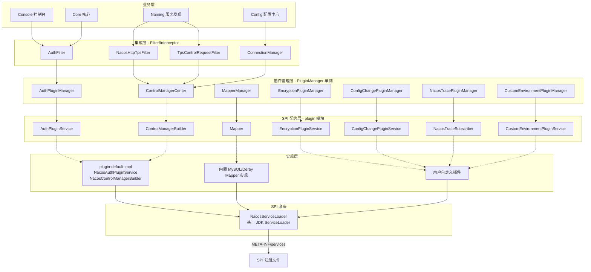

### 2.2 模块依赖关系

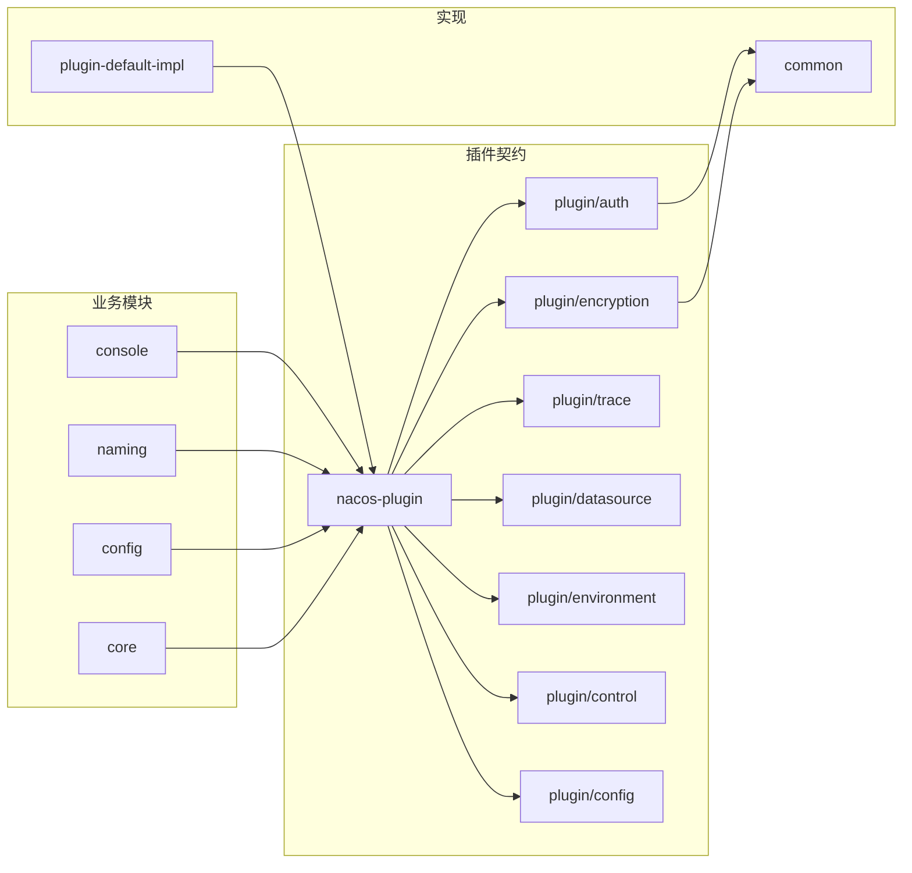

---

## 三、SPI 核心加载机制：NacosServiceLoader

所有插件最终都通过 `com.alibaba.nacos.common.spi.NacosServiceLoader` 加载。它在 JDK 标准 `ServiceLoader` 基础上做了**类缓存优化**。

### 3.1 源码核心

文件：`common/src/main/java/com/alibaba/nacos/common/spi/NacosServiceLoader.java`

```java
public class NacosServiceLoader {

    // 类缓存：service -> 已加载的实现类集合（避免重复扫描资源文件）
    private static final Map<Class<?>, Collection<Class<?>>> SERVICES = new ConcurrentHashMap<>();

    public static <T> Collection<T> load(final Class<T> service) {
        if (SERVICES.containsKey(service)) {
            return newServiceInstances(service);  // 命中缓存则直接反射创建新实例
        }
        Collection<T> result = new LinkedHashSet<>();
        for (T each : ServiceLoader.load(service)) {
            result.add(each);
            cacheServiceClass(service, each);  // 缓存 Class 对象
        }
        return result;
    }
}
```

### 3.2 与标准 Java SPI 的差异

| 维度 | JDK ServiceLoader | NacosServiceLoader |
|------|------------------|-------------------|
| 加载位置 | `META-INF/services/` | `META-INF/services/`（一致） |
| 缓存策略 | 每次重新扫描配置文件并实例化 | 仅首次扫描，后续直接反射 `newInstance()` 创建新实例 |
| 实例隔离 | 单例 ServiceLoader 共享实例 | 每次调用 `load()` 返回**全新实例**，避免状态污染 |
| 容错性 | 单个实现加载失败会抛异常 | 通过 `LinkedHashSet` 保证去重，失败由 `ServiceLoaderException` 包装 |

### 3.3 SPI 加载流程图

```mermaid
flowchart TD
    A[插件管理器初始化] --> B[NacosServiceLoader.load&#40;SPI.class&#41;]
    B --> C{SERVICES 缓存命中?}
    C -- 是 --> D[从缓存取出 Class 集合]
    D --> E[反射 newInstance 创建新实例]
    C -- 否 --> F[JDK ServiceLoader.load 扫描 META-INF/services]
    F --> G{还有未加载的实现?}
    G -- 是 --> H[读取一行实现类全限定名]
    H --> I[Class.forName 加载并实例化]
    I --> J[加入 result 集合 + 缓存 Class]
    J --> G
    G -- 否 --> K[返回所有实例]
    E --> K
    K --> L[插件管理器按 name/key 注册到内部 Map]
    L --> M[业务代码按需调用]
```

---

## 四、七大插件模块详解

### 4.1 认证插件 (auth)

#### 4.1.1 模块定位

`plugin/auth` 模块定义了 Nacos 服务端与客户端的统一认证契约，支持身份认证（你是谁）与权限校验（你能做什么）。

#### 4.1.2 核心 SPI 接口

**服务端 SPI**：`plugin/auth/src/main/java/com/alibaba/nacos/plugin/auth/spi/server/AuthPluginService.java`

```java
public interface AuthPluginService {
    // 声明本插件需要从请求中提取哪些身份字段（username、password、accessToken 等）
    Collection<String> identityNames();

    // 判断是否对指定操作/资源类型启用认证
    boolean enableAuth(ActionTypes action, String type);

    // 身份认证（你是谁）
    boolean validateIdentity(IdentityContext identityContext, Resource resource) throws AccessException;

    // 权限校验（你能做什么）
    Boolean validateAuthority(IdentityContext identityContext, Permission permission) throws AccessException;

    // 插件唯一标识，与配置项 nacos.core.auth.system.type 匹配
    String getAuthServiceName();

    default boolean isLoginEnabled() { return false; }
    default boolean isAdminRequest() { return false; }
}
```

**客户端 SPI**：`plugin/auth/src/main/java/com/alibaba/nacos/plugin/auth/spi/client/ClientAuthService.java`
- `login()`：客户端登录，获取 `LoginIdentityContext`
- `getLoginIdentityContext()`：每次请求前获取身份上下文（如 token、ak/sk 签名）

#### 4.1.3 核心数据模型

| 类 | 作用 |
|----|------|
| `IdentityContext` | 身份上下文容器，HashMap 存储，认证流程中传递用户身份 |
| `Resource` | 受保护资源，含 namespaceId、group、name、type 等 |
| `Permission` | 权限封装，含 resource + action（READ 'r' / WRITE 'w'） |
| `RequestResource` | 客户端请求资源标识，支持 Naming / Config 两类 |
| `LoginIdentityContext` | 客户端登录后身份上下文 |
| `ActionTypes` | READ("r")、WRITE("w") |
| `SignType` | NAMING / CONFIG / CONSOLE / SPECIFIED |

#### 4.1.4 插件管理器

`AuthPluginManager`（`plugin/auth/.../spi/server/AuthPluginManager.java`）单例：

```java
private void initAuthServices() {
    Collection<AuthPluginService> authPluginServices = NacosServiceLoader.load(AuthPluginService.class);
    for (AuthPluginService each : authPluginServices) {
        authServiceMap.put(each.getAuthServiceName(), each);  // 按 name 注册
    }
}
```

#### 4.1.5 认证执行流程

```mermaid
flowchart TD
    A[HTTP 请求到达 AuthFilter] --> B{authEnabled?}
    B -- 否 --> Z[直接放行]
    B -- 是 --> C{服务器身份校验<br/>userAgent / identity key-value}
    C -- 校验通过 --> Z
    C -- 普通请求 --> D[methodsCache.getMethod&#40;req&#41;]
    D --> E{方法有 @Secured 注解?}
    E -- 否 --> Z
    E -- 是 --> F[protocolAuthService.parseResource&#40;req, secured&#41;]
    F --> G[protocolAuthService.parseIdentity&#40;req&#41;]
    G --> H[构建 IdentityContext]
    H --> I[AuthPluginService.validateIdentity&#40;identity, resource&#41;]
    I --> J{身份验证通过?}
    J -- 否 --> K[抛 AccessException<br/>HTTP 403]
    J -- 是 --> L[AuthPluginService.validateAuthority&#40;identity, permission&#41;]
    L --> M{权限校验通过?}
    M -- 否 --> K
    M -- 是 --> Z
```

---

### 4.2 配置变更插件 (config)

#### 4.2.1 模块定位

`plugin/config` 提供**配置发布/删除**前后的切面扩展能力，类似 AOP 切面。可做配置审计、内容校验、灰度发布等。

#### 4.2.2 核心 SPI 接口

文件：`plugin/config/src/main/java/com/alibaba/nacos/plugin/config/spi/ConfigChangePluginService.java`

```java
public interface ConfigChangePluginService {
    // 插件核心逻辑
    void execute(ConfigChangeRequest configChangeRequest, ConfigChangeResponse configChangeResponse);

    // 执行时机：前置 / 后置
    ConfigChangeExecuteTypes executeType();

    // 插件类型标识
    String getServiceType();

    // 加载顺序，值越小优先级越高
    int getOrder();

    // 拦截的切点方法（HTTP发布 / RPC发布 / HTTP删除 / RPC删除 等）
    ConfigChangePointCutTypes[] pointcutMethodNames();
}
```

#### 4.2.3 关键枚举

- `ConfigChangePointCutTypes`：切点类型（HTTP_PUBLISH、RPC_PUBLISH、HTTP_REMOVE、RPC_REMOVE 等）
- `ConfigChangeExecuteTypes`：`BEFORE_EXECUTE`（前置）、`AFTER_EXECUTE`（后置）

#### 4.2.4 插件管理器

`ConfigChangePluginManager` 通过 `NacosServiceLoader.load(ConfigChangePluginService.class)` 加载，并按 **服务类型 + 切点类型** 二级组织，同切点内按 `getOrder()` 升序执行。

#### 4.2.5 配置变更插件执行流程

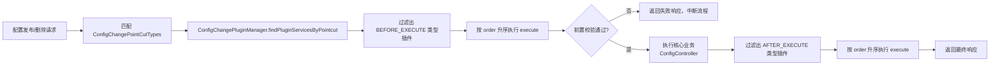

---

### 4.3 加密插件 (encryption)

#### 4.3.1 模块定位

`plugin/encryption` 提供配置内容的加解密能力，支持对敏感配置（如数据库密码、密钥）落库前加密、读取时解密。通过 dataId 前缀 `cipher-` 触发。

#### 4.3.2 核心 SPI 接口

文件：`plugin/encryption/src/main/java/com/alibaba/nacos/plugin/encryption/spi/EncryptionPluginService.java`

```java
public interface EncryptionPluginService {
    String encrypt(String secretKey, String content);   // 用密钥加密配置内容
    String decrypt(String secretKey, String content);   // 用密钥解密密文
    String generateSecretKey();                          // 生成算法对应的随机密钥
    String algorithmName();                               // 算法名（插件唯一标识）
    String encryptSecretKey(String secretKey);           // 加密密钥本身（用于安全存储/传输）
    String decryptSecretKey(String secretKey);           // 解密被加密的密钥
}
```

#### 4.3.3 触发规则与算法解析

文件：`plugin/encryption/src/main/java/com/alibaba/nacos/plugin/encryption/handler/EncryptionHandler.java`

- **触发前缀**：dataId 以 `cipher-` 开头才进入加解密流程
- **算法解析**：从 dataId 中按 `-` 切割，第 2 段即为算法名
  - 例：`cipher-AES-db.password` → 算法名 `AES`
- **密钥传递**：解密时通过 HTTP 响应头 `Encrypted-Data-Key` 传递加密后的密钥

#### 4.3.4 加密/解密流程图

```mermaid
flowchart TD
    subgraph 发布配置-加密流程
        P1[客户端发布配置<br/>dataId=cipher-AES-xxx] --> P2[ConfigController.publishConfig]
        P2 --> P3{dataId 以 cipher- 开头?}
        P3 -- 否 --> P4[直接存储明文]
        P3 -- 是 --> P5[EncryptionHandler.encryptHandler]
        P5 --> P6[解析算法名 AES]
        P6 --> P7[EncryptionPluginManager.findEncryptionService&#40;AES&#41;]
        P7 --> P8[plugin.generateSecretKey&#40;&#41; 生成随机密钥]
        P8 --> P9[plugin.encrypt&#40;secretKey, content&#41; 加密内容]
        P9 --> P10[plugin.encryptSecretKey&#40;secretKey&#41; 加密密钥]
        P10 --> P11[存储加密内容 + 加密密钥]
    end

    subgraph 获取配置-解密流程
        G1[客户端请求配置] --> G2[ConfigServletInner.doGetConfig]
        G2 --> G3[读取加密内容 + 加密密钥]
        G3 --> G4{dataId 以 cipher- 开头?}
        G4 -- 否 --> G5[返回明文]
        G4 -- 是 --> G6[EncryptionHandler.decryptHandler]
        G6 --> G7[解析算法名]
        G7 --> G8[EncryptionPluginManager.findEncryptionService]
        G8 --> G9[plugin.decryptSecretKey&#40;encKey&#41; 解密密钥]
        G9 --> G10[plugin.decrypt&#40;secretKey, content&#41; 解密内容]
        G10 --> G11[设置响应头 Encrypted-Data-Key]
        G11 --> G12[返回解密后的明文]
    end
```

---

### 4.4 控制插件 (control)

#### 4.4.1 模块定位

`plugin/control` 是 Nacos 的**流量控制与连接控制**核心，提供 TPS 限流、连接数控制能力，是 Nacos 自我保护的关键。

#### 4.4.2 核心 SPI 与抽象类

| 类/接口 | 作用 |
|--------|------|
| `ControlManagerBuilder` | 控制插件构建器 SPI，构建连接/TPS 管理器 |
| `ControlManagerCenter` | 控制插件中央访问点，单例，SPI 加载 Builder |
| `ConnectionControlManager` | 连接控制管理器抽象类 |
| `TpsControlManager` | TPS 控制管理器抽象类 |
| `TpsBarrier` | TPS 屏障，每个控制点一个实例，实际执行限流 |
| `RuleStorageProxy` | 规则存储代理（本地磁盘 + 外部存储） |
| `ExternalRuleStorage` | 外部规则存储 SPI（可对接配置中心） |
| `RuleParser` | 规则解析器 SPI |
| `ConnectionMetricsCollector` | 连接指标收集器 SPI |

#### 4.4.3 限流规则与执行

- **规则加载**：`RuleStorageProxy` 代理本地磁盘（`LocalDiskRuleStorage`）与外部存储（`ExternalRuleStorage` SPI），通过 `RuleParser` 解析为 `ConnectionControlRule` / `TpsControlRule`
- **TPS 限流执行**：`TpsControlManager.check()` → 对应控制点的 `TpsBarrier.applyTps()` → `RuleBarrier.apply()` 实际限流
- **连接控制执行**：`ConnectionControlManager.check()` 统计所有 `ConnectionMetricsCollector` 的总连接数，与 `countLimit` 比较

#### 4.4.4 默认实现

`NacosControlManagerBuilder` 构建：
- `NacosConnectionControlManager`：默认连接控制，规则未配置时允许所有连接
- `NacosTpsControlManager`：管理多个 TPS 控制点，内置定时上报
- `DefaultNacosTpsBarrier` + `LocalSimpleCountRuleBarrier` + `LocalSimpleCountRateCounter`：基于本地计数的限流

#### 4.4.5 控制插件架构与集成

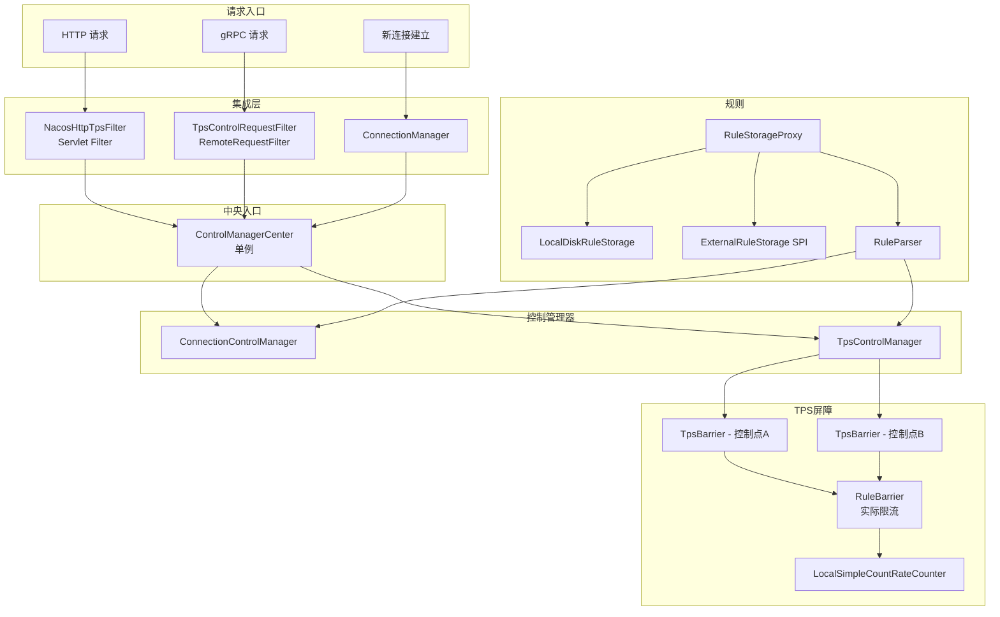

#### 4.4.6 TPS 限流执行流程

```mermaid
flowchart TD
    A[请求到达 Filter] --> B[检查 @TpsControl 注解]
    B --> C{有注解且启用限流?}
    C -- 否 --> Z[放行]
    C -- 是 --> D[Parser 构造 TpsCheckRequest]
    D --> E[ControlManagerCenter.getTpsControlManager&#40;&#41;.check&#40;&#41;]
    E --> F[根据 pointName 找到 TpsBarrier]
    F --> G[TpsBarrier.applyTps&#40;&#41;]
    G --> H[RuleBarrier.apply&#40;&#41;]
    H --> I[LocalSimpleCountRateCounter 计数]
    I --> J{当前 TPS 超限?}
    J -- 是 --> K[返回 TPSResultCode.DENY<br/>请求被拒绝]
    J -- 否 --> Z
```

---

### 4.5 Trace 插件 (trace)

#### 4.5.1 模块定位

`plugin/trace` 提供内部跟踪事件的订阅能力。Nacos 在关键路径（配置变更、实例变更、连接事件等）会产生 `TraceEvent`，第三方插件可订阅并做审计、监控、告警。

#### 4.5.2 核心 SPI 接口

文件：`plugin/trace/src/main/java/com/alibaba/nacos/plugin/trace/spi/NacosTraceSubscriber.java`

```java
public interface NacosTraceSubscriber {
    String getName();                                             // 插件名
    void onEvent(TraceEvent event);                               // 事件回调
    List<Class<? extends TraceEvent>> subscribeTypes();           // 订阅的事件类型
    default Executor executor() { return null; }                 // 异步执行器（默认同步）
}
```

#### 4.5.3 插件管理器

`NacosTracePluginManager`（`plugin/trace/.../NacosTracePluginManager.java`）单例：

```java
private NacosTracePluginManager() {
    this.traceSubscribers = new ConcurrentHashMap<>();
    Collection<NacosTraceSubscriber> plugins = NacosServiceLoader.load(NacosTraceSubscriber.class);
    for (NacosTraceSubscriber each : plugins) {
        this.traceSubscribers.put(each.getName(), each);
    }
}
```

#### 4.5.4 Trace 事件分发流程

```mermaid
flowchart LR
    A[业务代码产生事件] --> B[NacosTrace.publish&#40;TraceEvent&#41;]
    B --> C[NacosTracePluginManager 遍历订阅者]
    C --> D{订阅者 subscribeTypes 匹配?}
    D -- 是 --> E{有自定义 executor?}
    E -- 是 --> F[异步线程池执行 onEvent]
    E -- 否 --> G[同步执行 onEvent]
    D -- 否 --> H[跳过]
```

---

### 4.6 数据源插件 (datasource)

#### 4.6.1 模块定位

`plugin/datasource` 通过 SPI 屏蔽不同数据库的 SQL 差异，支持 MySQL、Derby，并允许扩展 PostgreSQL、Oracle 等。

#### 4.6.2 核心 SPI 接口

文件：`plugin/datasource/src/main/java/com/alibaba/nacos/plugin/datasource/mapper/Mapper.java`

```java
public interface Mapper {
    String select(List<String> columns, List<String> where);
    String insert(List<String> columns);
    String update(List<String> columns, List<String> where);
    String delete(List<String> params);
    String count(List<String> where);
    String getTableName();
    String getDataSource();              // 返回数据库类型："mysql" / "derby"
    String[] getPrimaryKeyGeneratedKeys();
    String getFunction(String functionName);
}
```

#### 4.6.3 多数据库适配层次

```mermaid
graph TD
    MAPPER[Mapper SPI 接口]
    ABS[AbstractMapper<br/>通用 CRUD 实现]
    ABS_MYSQL[AbstractMapperByMysql<br/>MySQL 函数适配 NOW→NOW&#40;3&#41;]
    ABS_DERBY[AbstractMapperByDerby<br/>Derby 函数适配]

    MAPPER --> ABS
    ABS --> ABS_MYSQL
    ABS --> ABS_DERBY

    ABS_MYSQL --> CI_MYSQL[ConfigInfoMapperByMySql]
    ABS_MYSQL --> TAG_MYSQL[ConfigInfoTagMapperByMySql]
    ABS_MYSQL --> HIS_MYSQL[HistoryConfigInfoMapperByMySql]
    ABS_MYSQL --> OTHER_MYSQL[...其他 9 个表]

    ABS_DERBY --> CI_DERBY[ConfigInfoMapperByDerby]
    ABS_DERBY --> TAG_DERBY[ConfigInfoTagMapperByDerby]
    ABS_DERBY --> OTHER_DERBY[...其他表]
```

#### 4.6.4 插件管理器与注册

`MapperManager` 单例：
- `loadInitial()`：`NacosServiceLoader.load(Mapper.class)` 加载所有 Mapper
- 按 **数据源类型 → 表名** 二级 Map 缓存（`MAPPER_SPI_MAP`）
- 提供 `findMapper(dataSourceType, tableName)` 与 `join(Mapper)` 动态注册

#### 4.6.5 SQL 生成调用链

```mermaid
flowchart LR
    A[业务层] --> B[DynamicDataSource 获取当前数据源类型 mysql/derby]
    B --> C[MapperManager.findMapper&#40;type, tableName&#41;]
    C --> D[具体 Mapper 生成 SQL]
    D --> E[JdbcTemplate.execute&#40;sql&#41;]
    E --> F[数据库]
```

---

### 4.7 环境插件 (environment)

#### 4.7.1 模块定位

`plugin/environment` 允许在 Nacos 启动阶段注入或改写环境配置，典型场景：从外部密钥管理服务（KMS）拉取密钥并注入到 Spring Environment。

#### 4.7.2 核心 SPI 接口

文件：`plugin/environment/src/main/java/com/alibaba/nacos/plugin/environment/spi/CustomEnvironmentPluginService.java`

```java
public interface CustomEnvironmentPluginService {
    // 处理自定义配置值（可新增配置项）
    Map<String, Object> customValue(Map<String, Object> property);

    // 本插件关注的配置 key 集合
    Set<String> propertyKey();

    // 优先级，值越大优先级越高
    Integer order();

    // 插件名
    String pluginName();
}
```

#### 4.7.3 配置注入流程

`CustomEnvironmentPluginManager.getCustomValues()`：
1. 按优先级排序所有插件
2. 对每个插件，从源配置中提取 `propertyKey()` 关注的属性
3. 调用 `customValue()` 处理，得到目标配置 Map
4. 从结果中移除原本就关注的 key，**只保留新增的配置项**
5. 合并到 Nacos 上下文

#### 4.7.4 环境插件执行流程

```mermaid
flowchart TD
    A[Nacos 启动] --> B[加载系统配置 sourceProperty]
    B --> C[CustomEnvironmentPluginManager 加载所有插件]
    C --> D[按 order 降序排序]
    D --> E{遍历每个插件}
    E --> F[提取 propertyKey 关注的属性]
    F --> G[plugin.customValue&#40;propertyMap&#41;]
    G --> H[移除原有的 key，保留新增项]
    H --> E
    E -- 遍历完成 --> I[合并 customValuesMap 到 Nacos 上下文]
    I --> J[业务组件使用注入后的配置]
```

---

## 五、默认插件实现 (plugin-default-impl)

`plugin-default-impl` 聚合了官方提供的默认实现，通过 `nacos-default-plugin-all` 统一打包。

### 5.1 默认认证插件 (nacos-default-auth-plugin)

SPI 注册文件：`META-INF/services/com.alibaba.nacos.plugin.auth.spi.server.AuthPluginService`

```
com.alibaba.nacos.plugin.auth.impl.NacosAuthPluginService
com.alibaba.nacos.plugin.auth.impl.LdapAuthPluginService
```

#### 核心组件

| 组件 | 作用 |
|------|------|
| `NacosAuthPluginService` | 默认认证插件实现，集成 Spring Security |
| `LdapAuthPluginService` | LDAP 认证插件实现 |
| `JwtTokenManager` | JWT token 生成/解析，监听配置变更动态更新密钥 |
| `IAuthenticationManager` / `AbstractAuthenticationManager` | 认证管理器顶层接口与抽象实现 |
| `DefaultAuthenticationManager` | 默认认证：用户名密码 + token |
| `LdapAuthenticationManager` | LDAP 认证实现 |
| `JwtAuthenticationTokenFilter` | HTTP 过滤器，提取并校验 JWT，设置 Spring Security 上下文 |
| `NacosUserDetailsServiceImpl` | 从数据库加载用户详情 |
| `NacosRoleServiceImpl` | 角色权限校验（`hasPermission`） |
| `PasswordEncoderUtil` | 密码加密工具 |

#### 认证方式

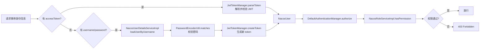

### 5.2 默认控制插件 (nacos-default-control-plugin)

SPI 注册文件：`META-INF/services/com.alibaba.nacos.plugin.control.spi.ControlManagerBuilder`

```
com.alibaba.nacos.plugin.control.impl.NacosControlManagerBuilder
```

提供 `NacosConnectionControlManager`、`NacosTpsControlManager` 及本地计数限流实现。

---

## 六、关键流程时序图

### 6.1 HTTP 请求认证授权完整时序

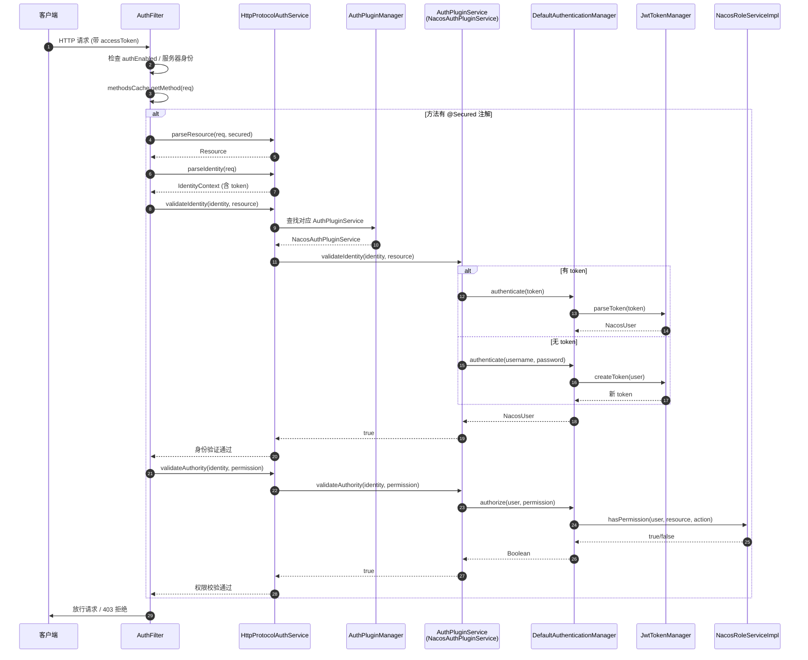

### 6.2 配置加密发布与解密读取时序

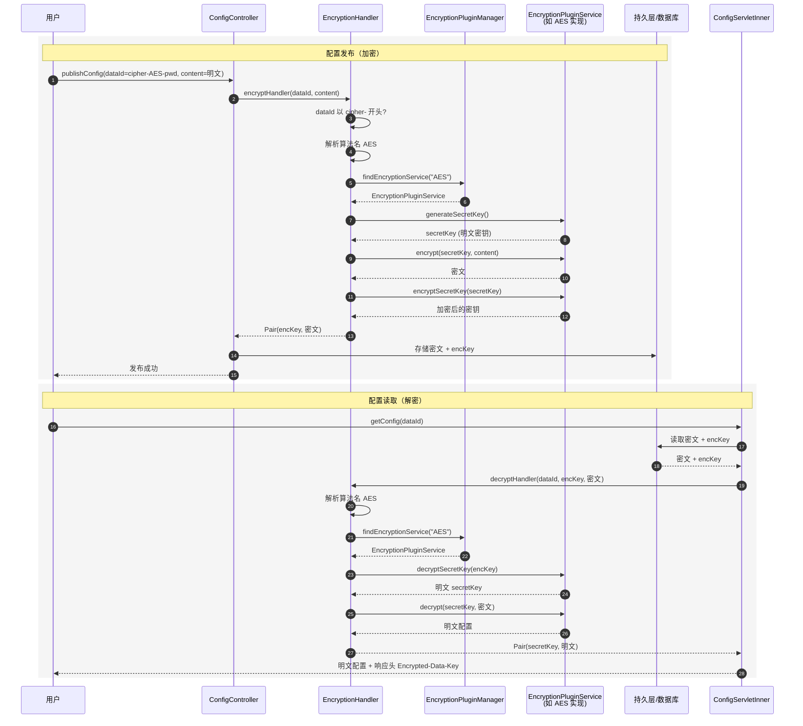

### 6.3 TPS 限流时序

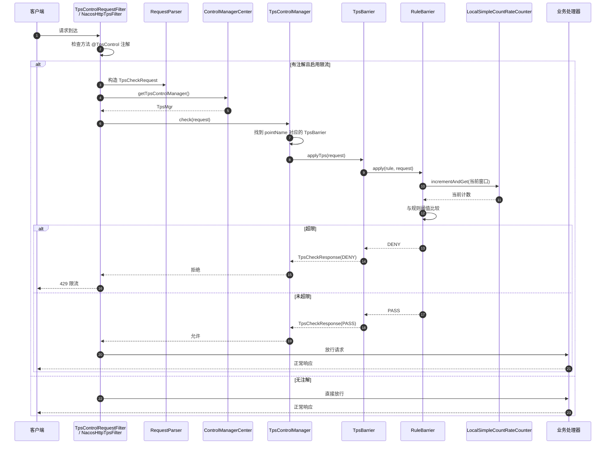

### 6.4 数据源 SQL 生成时序

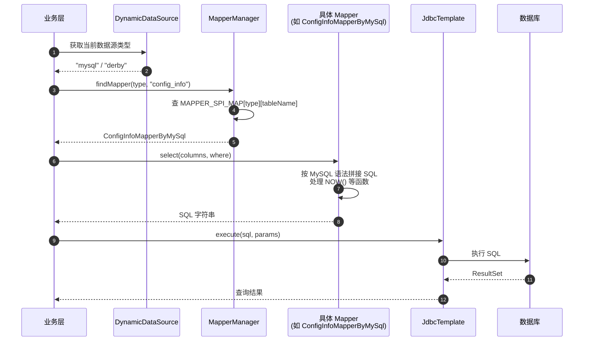

### 6.5 插件启动加载时序

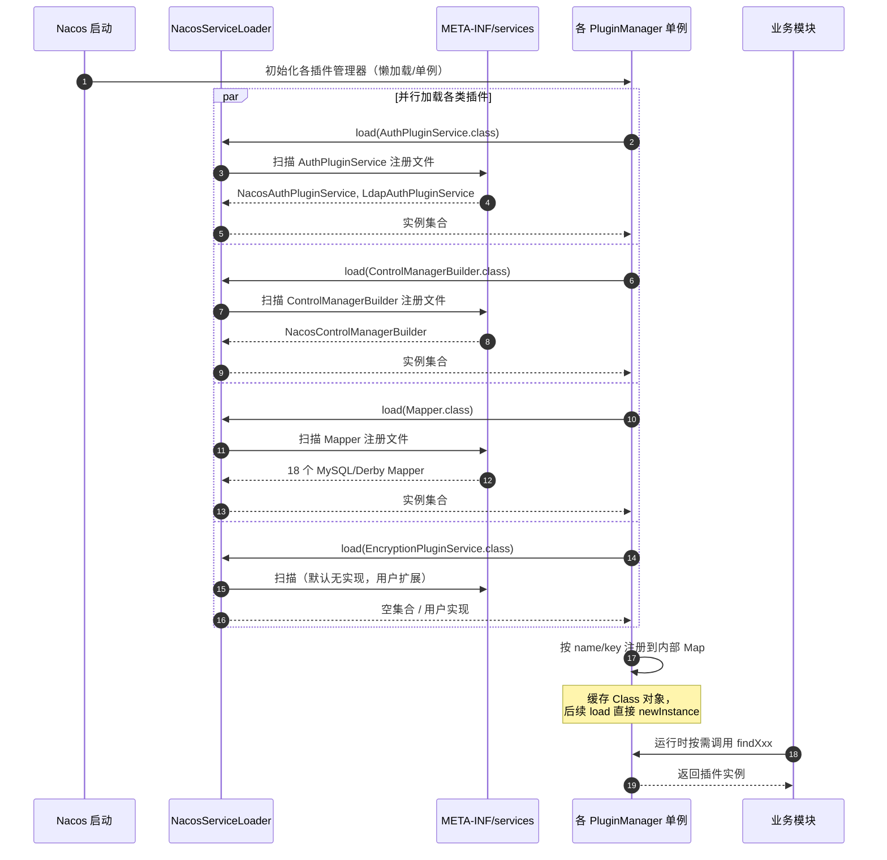

---

## 七、自定义插件扩展指南

### 7.1 通用步骤

1. **引入依赖**：在自定义插件工程中引入对应 `nacos-plugin` 子模块（仅 SPI 契约，scope 为 `provided` 或 `compile`）。
2. **实现 SPI 接口**：实现对应接口，注意 `getXxxName()` 返回的唯一标识。
3. **注册 SPI**：在 `src/main/resources/META-INF/services/` 下创建以 SPI 接口全限定名为文件名的文件，每行写一个实现类全限定名。
4. **打包部署**：将插件 jar 放入 Nacos 的 `plugins/` 目录或通过 classpath 加载，重启生效。

### 7.2 各插件扩展速查

| 插件 | SPI 接口 | 注册文件名 | 触发/选择方式 |
|------|---------|-----------|--------------|
| 认证 | `AuthPluginService` | `com.alibaba.nacos.plugin.auth.spi.server.AuthPluginService` | 配置 `nacos.core.auth.system.type=${getAuthServiceName}` |
| 配置变更 | `ConfigChangePluginService` | `com.alibaba.nacos.plugin.config.spi.ConfigChangePluginService` | 按 `pointcutMethodNames` 自动匹配切点 |
| 加密 | `EncryptionPluginService` | `com.alibaba.nacos.plugin.encryption.spi.EncryptionPluginService` | dataId 前缀 `cipher-${algorithmName}-` |
| 控制 | `ControlManagerBuilder` | `com.alibaba.nacos.plugin.control.spi.ControlManagerBuilder` | 默认加载第一个，或配置选择 |
| Trace | `NacosTraceSubscriber` | `com.alibaba.nacos.plugin.trace.spi.NacosTraceSubscriber` | 按 `subscribeTypes()` 自动分发 |
| 数据源 | `Mapper` | `com.alibaba.nacos.plugin.datasource.mapper.Mapper` | 按 `getDataSource()` + `getTableName()` 自动匹配 |
| 环境 | `CustomEnvironmentPluginService` | `com.alibaba.nacos.plugin.environment.spi.CustomEnvironmentPluginService` | 按 `propertyKey()` 自动处理 |

### 7.3 扩展示例：自定义 AES 加密插件

```java
public class AesEncryptionPluginService implements EncryptionPluginService {
    @Override
    public String algorithmName() { return "AES"; }

    @Override
    public String generateSecretKey() { /* 生成 AES 密钥 */ }

    @Override
    public String encrypt(String secretKey, String content) { /* AES 加密 */ }

    @Override
    public String decrypt(String secretKey, String content) { /* AES 解密 */ }

    @Override
    public String encryptSecretKey(String secretKey) { /* 用主密钥加密 secretKey */ }

    @Override
    public String decryptSecretKey(String secretKey) { /* 用主密钥解密 secretKey */ }
}
```

注册文件 `META-INF/services/com.alibaba.nacos.plugin.encryption.spi.EncryptionPluginService`：
```
com.example.AesEncryptionPluginService
```

使用：以 `cipher-AES-` 开头命名 dataId 发布配置即可触发加解密。

---

## 八、总结

### 8.1 设计特点

1. **契约与实现分离**：`plugin` 模块仅定义 SPI 契约与数据模型，不含实现；默认实现在 `plugin-default-impl`，用户实现可独立打包。这保证了核心代码稳定，扩展能力开放。
2. **统一 SPI 底座**：所有插件通过 `NacosServiceLoader` 加载，类缓存优化避免重复扫描资源文件，每次调用返回新实例避免状态污染。
3. **单例管理器模式**：每个插件类型对应一个 `XxxPluginManager` 单例，负责加载、注册、按名查找，业务代码只与 Manager 交互。
4. **多种集成方式**：HTTP 通过 Servlet Filter（`AuthFilter`、`NacosHttpTpsFilter`）、RPC 通过 RemoteRequestFilter（`TpsControlRequestFilter`）、注解驱动（`@Secured`、`@TpsControl`）、配置约定（`cipher-` 前缀）。
5. **分级扩展粒度**：从细（一个 SQL Mapper）到粗（一整套认证体系）覆盖不同扩展需求。

### 8.2 插件全景图

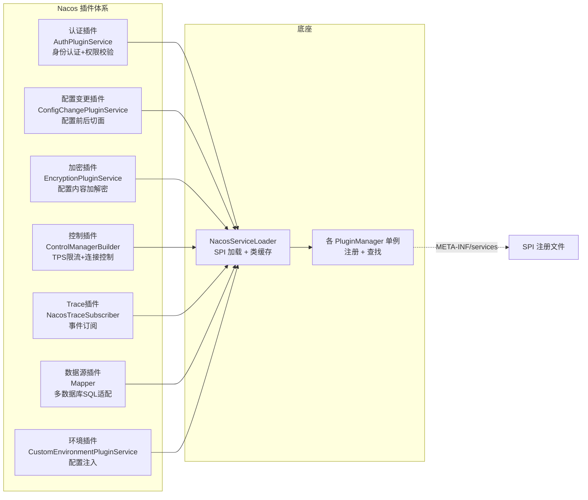

### 8.3 关键源码索引

| 关注点 | 文件路径 |
|-------|---------|
| SPI 加载器 | `common/src/main/java/com/alibaba/nacos/common/spi/NacosServiceLoader.java` |
| 认证入口 Filter | `core/src/main/java/com/alibaba/nacos/core/auth/AuthFilter.java` |
| 认证 SPI 接口 | `plugin/auth/src/main/java/com/alibaba/nacos/plugin/auth/spi/server/AuthPluginService.java` |
| 认证插件管理器 | `plugin/auth/src/main/java/com/alibaba/nacos/plugin/auth/spi/server/AuthPluginManager.java` |
| 默认认证实现 | `plugin-default-impl/nacos-default-auth-plugin/src/main/java/com/alibaba/nacos/plugin/auth/impl/NacosAuthPluginService.java` |
| JWT 管理 | `plugin-default-impl/nacos-default-auth-plugin/src/main/java/com/alibaba/nacos/plugin/auth/impl/token/impl/JwtTokenManager.java` |
| 配置变更 SPI | `plugin/config/src/main/java/com/alibaba/nacos/plugin/config/spi/ConfigChangePluginService.java` |
| 加密 SPI | `plugin/encryption/src/main/java/com/alibaba/nacos/plugin/encryption/spi/EncryptionPluginService.java` |
| 加密处理入口 | `plugin/encryption/src/main/java/com/alibaba/nacos/plugin/encryption/handler/EncryptionHandler.java` |
| 控制中央入口 | `plugin/control/src/main/java/com/alibaba/nacos/plugin/control/ControlManagerCenter.java` |
| TPS 控制管理器 | `plugin/control/src/main/java/com/alibaba/nacos/plugin/control/tps/TpsControlManager.java` |
| TPS 屏障 | `plugin/control/src/main/java/com/alibaba/nacos/plugin/control/tps/barrier/TpsBarrier.java` |
| 默认控制实现 | `plugin-default-impl/nacos-default-control-plugin/src/main/java/com/alibaba/nacos/plugin/control/impl/NacosControlManagerBuilder.java` |
| HTTP TPS Filter | `core/src/main/java/com/alibaba/nacos/core/control/http/NacosHttpTpsFilter.java` |
| 远程 TPS Filter | `core/src/main/java/com/alibaba/nacos/core/control/remote/TpsControlRequestFilter.java` |
| Trace SPI | `plugin/trace/src/main/java/com/alibaba/nacos/plugin/trace/spi/NacosTraceSubscriber.java` |
| Trace 管理器 | `plugin/trace/src/main/java/com/alibaba/nacos/plugin/trace/NacosTracePluginManager.java` |
| 数据源 Mapper SPI | `plugin/datasource/src/main/java/com/alibaba/nacos/plugin/datasource/mapper/Mapper.java` |
| Mapper 管理器 | `plugin/datasource/src/main/java/com/alibaba/nacos/plugin/datasource/mapper/MapperManager.java` |
| 环境 SPI | `plugin/environment/src/main/java/com/alibaba/nacos/plugin/environment/spi/CustomEnvironmentPluginService.java` |
| 环境管理器 | `plugin/environment/src/main/java/com/alibaba/nacos/plugin/environment/CustomEnvironmentPluginManager.java` |

---

> 本文档基于 Nacos 2.4.2 源码梳理，如需扩展特定插件，请遵循「实现 SPI 接口 → 注册 META-INF/services → 打包放入 plugins 目录」的三步流程。
