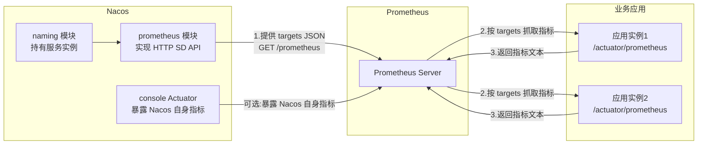
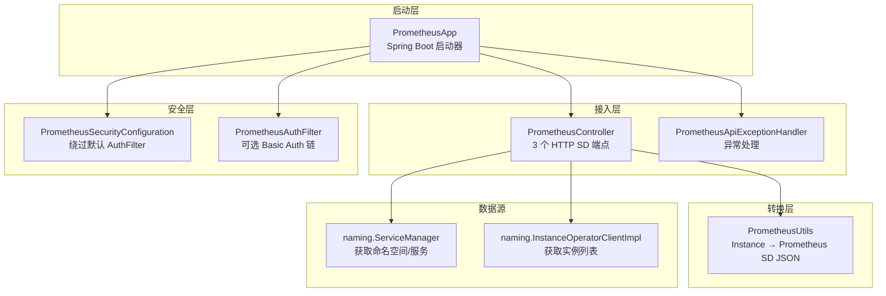
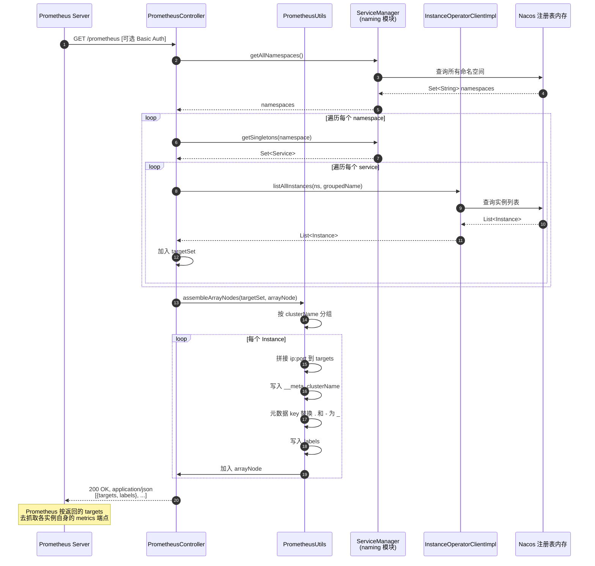
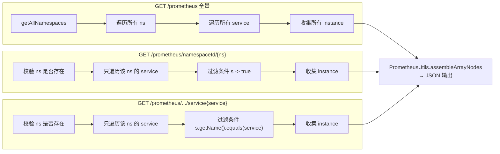
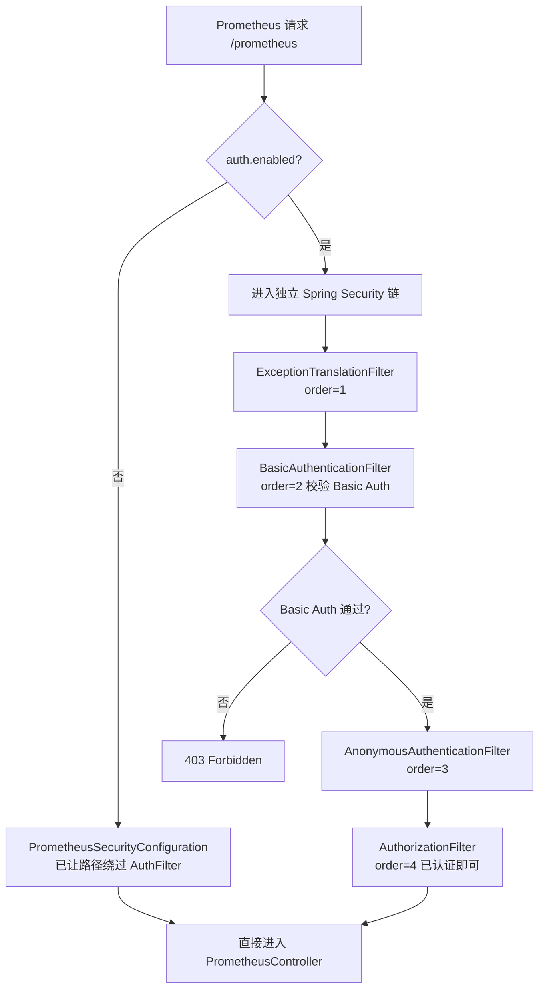
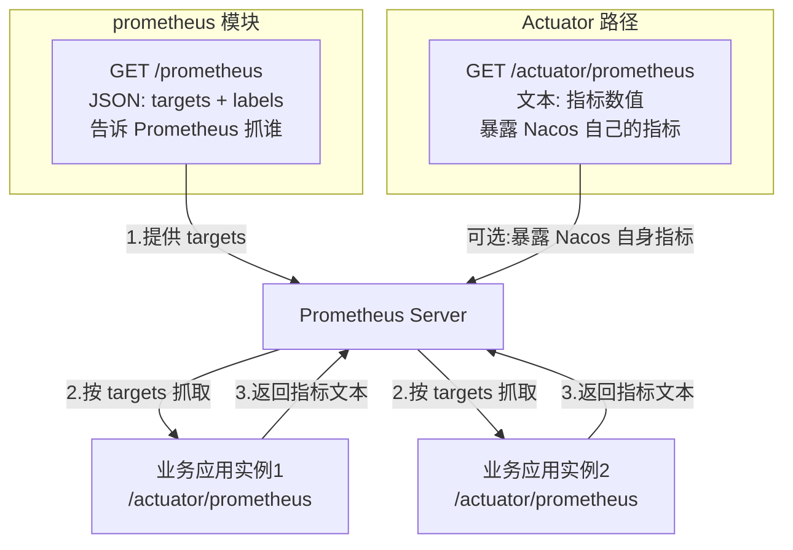

# Nacos 2.4.2 Prometheus 模块源码分析

> 本文档基于 Nacos 2.4.2 源码，深入剖析 `prometheus` 模块的整体结构、JSON 数据暴露机制、可用指标/标签，并以 Mermaid 图形化呈现数据流转流程。

---

## 目录

- [一、模块概述](#一模块概述)
- [二、模块整体结构](#二模块整体结构)
- [三、核心组件详解](#三核心组件详解)
- [四、JSON 格式暴露机制](#四json-格式暴露机制)
- [五、暴露的字段与标签清单](#五暴露的字段与标签清单)
- [六、完整数据流转流程](#六完整数据流转流程)
- [七、配置与启用方式](#七配置与启用方式)
- [八、Prometheus 端接入示例](#八prometheus-端接入示例)
- [九、与 Actuator 指标路径的对比](#九与-actuator-指标路径的对比)
- [十、关键源码索引](#十关键源码索引)
- [十一、总结](#十一总结)

---

## 一、模块概述

### 1.1 模块定位

Nacos 的 `prometheus` 模块是一个**独立 Spring Boot 应用**，实现了 **Prometheus HTTP Service Discovery（SD）协议**。它的核心职责是：**把 Nacos 注册中心中的服务实例信息，转换成 Prometheus 能识别的 JSON 格式**，作为 Prometheus 抓取目标的来源。

> **关键澄清**：prometheus 模块暴露的是**抓取目标列表（targets）**，而不是指标数据本身。它告诉 Prometheus "该去抓谁"，实际的指标数值由各业务应用实例自身的 metrics 端点（如 Spring Boot 的 `/actuator/prometheus`）提供。

### 1.2 在 Nacos 体系中的位置



---

## 二、模块整体结构

### 2.1 目录结构

```
prometheus/
└── src/main/java/com/alibaba/nacos/prometheus/
    ├── PrometheusApp.java                          # Spring Boot 启动器
    ├── api/
    │   └── ApiConstants.java                        # API 路径常量
    ├── conf/
    │   └── PrometheusSecurityConfiguration.java    # 安全配置：绕过默认 AuthFilter
    ├── controller/
    │   └── PrometheusController.java               # 核心控制器：3 个 SD 端点
    ├── exception/
    │   └── PrometheusApiExceptionHandler.java      # 异常处理
    ├── filter/
    │   └── PrometheusAuthFilter.java               # 独立 Basic Auth 过滤链
    └── utils/
        └── PrometheusUtils.java                    # 数据格式转换工具

prometheus/src/test/java/com/alibaba/nacos/prometheus/controller/
    ├── PrometheusControllerTest.java               # 控制器单测
    └── exception/
        └── PrometheusApiExceptionHandlerTest.java   # 异常处理单测
```

### 2.2 组件分层



---

## 三、核心组件详解

### 3.1 `PrometheusApp` —— 启动器

文件：`prometheus/src/main/java/com/alibaba/nacos/prometheus/PrometheusApp.java`

```java
@EnableScheduling
@SpringBootApplication(scanBasePackages = {"com.alibaba.nacos"})
public class PrometheusApp {
    public static void main(String[] args) {
        SpringApplication.run(PrometheusApp.class, args);
    }
}
```

- 独立 Spring Boot 应用入口
- `scanBasePackages = "com.alibaba.nacos"` 扫描整个 Nacos 包，复用 naming、core 等模块的 Bean

### 3.2 `ApiConstants` —— 端点路径常量

文件：`prometheus/src/main/java/com/alibaba/nacos/prometheus/api/ApiConstants.java`

```java
public class ApiConstants {
    public static final String PROMETHEUS_CONTROLLER_PATH = "/prometheus";
    public static final String PROMETHEUS_CONTROLLER_NAMESPACE_PATH = "/prometheus/namespaceId/{namespaceId}";
    public static final String PROMETHEUS_CONTROLLER_SERVICE_PATH = "/prometheus/namespaceId/{namespaceId}/service/{service}";
}
```

### 3.3 `PrometheusController` —— 核心控制器

文件：`prometheus/src/main/java/com/alibaba/nacos/prometheus/controller/PrometheusController.java`

提供 3 个 HTTP GET 端点，返回 `application/json; charset=UTF-8`：

| 端点 | 方法 | 作用 |
|------|------|------|
| `GET /prometheus` | `metric()` | 返回**所有命名空间**的所有服务实例 |
| `GET /prometheus/namespaceId/{namespaceId}` | `metricNamespace(ns)` | 返回**指定命名空间**的所有服务实例 |
| `GET /prometheus/namespaceId/{namespaceId}/service/{service}` | `metricNamespaceService(ns, svc)` | 返回**指定命名空间+服务**的实例 |

启用条件：
```java
@RestController
@ConditionalOnProperty(name = "nacos.prometheus.metrics.enabled", havingValue = "true")
public class PrometheusController { ... }
```

核心方法 `metric()`：

```java
@GetMapping(value = ApiConstants.PROMETHEUS_CONTROLLER_PATH, produces = "application/json; charset=UTF-8")
public ResponseEntity<String> metric() throws NacosException {
    ArrayNode arrayNode = JacksonUtils.createEmptyArrayNode();
    Set<Instance> targetSet = new HashSet<>();
    Set<String> allNamespaces = serviceManager.getAllNamespaces();
    for (String namespace : allNamespaces) {
        Set<Service> singletons = serviceManager.getSingletons(namespace);
        for (Service service : singletons) {
            List<? extends Instance> instances = instanceServiceV2.listAllInstances(
                namespace, service.getGroupedServiceName());
            targetSet.addAll(instances);
        }
    }
    PrometheusUtils.assembleArrayNodes(targetSet, arrayNode);
    return ResponseEntity.ok().body(arrayNode.toString());
}
```

### 3.4 `PrometheusUtils` —— 数据格式转换器

文件：`prometheus/src/main/java/com/alibaba/nacos/prometheus/utils/PrometheusUtils.java`

这是**最核心的转换逻辑**，把 Nacos `Instance` 转成 Prometheus SD 协议的 JSON 节点。

```java
public static void assembleArrayNodes(Set<Instance> targetSet, ArrayNode arrayNode) {
    // 1. 按 clusterName 分组
    Map<String, List<Instance>> groupingInsMap =
        targetSet.stream().collect(groupingBy(Instance::getClusterName));
    // 2. 每个实例转成一个 SD 节点
    groupingInsMap.forEach((key, value) -> {
        for (Instance instance : value) {
            ObjectNode jsonNode = assembleInstanceToArrayNode(key, instance);
            arrayNode.add(jsonNode);
        }
    });
}

private static ObjectNode assembleInstanceToArrayNode(String clusterName, Instance instance) {
    // targets: ip:port
    ArrayNode targetsNode = JacksonUtils.createEmptyArrayNode();
    targetsNode.add(instance.getIp() + ":" + instance.getPort());

    // labels: __meta_clusterName + 元数据
    ObjectNode labelNode = JacksonUtils.createEmptyJsonNode();
    labelNode.put("__meta_clusterName", clusterName);

    // 元数据 key 中 "." 和 "-" 替换为 "_"（Prometheus label 命名规则限制）
    Map<String, String> metadata = instance.getMetadata().entrySet().stream()
        .collect(Collectors.toMap(
            e -> e.getKey().replace(".", "_").replace("-", "_"),
            e -> e.getValue()));
    metadata.forEach(labelNode::put);

    // 组装最终节点
    ObjectNode jsonNode = JacksonUtils.createEmptyJsonNode();
    jsonNode.replace("targets", targetsNode);
    jsonNode.replace("labels", labelNode);
    return jsonNode;
}
```

### 3.5 `PrometheusSecurityConfiguration` —— 安全配置

文件：`prometheus/src/main/java/com/alibaba/nacos/prometheus/conf/PrometheusSecurityConfiguration.java`

```java
@Configuration
public class PrometheusSecurityConfiguration {
    @Bean
    public WebSecurityCustomizer prometheusWebSecurityCustomizer() {
        return web -> {
            web.ignoring().mvcMatchers(PROMETHEUS_CONTROLLER_PATH);
            web.ignoring().mvcMatchers(PROMETHEUS_CONTROLLER_NAMESPACE_PATH);
            web.ignoring().mvcMatchers(PROMETHEUS_CONTROLLER_SERVICE_PATH);
        };
    }
}
```

作用：让 `/prometheus` 路径**绕过 Nacos 默认的 AuthFilter（JWT token 校验）**，因为 Prometheus 不像浏览器能登录拿 token。

### 3.6 `PrometheusAuthFilter` —— 独立 Basic Auth 链

文件：`prometheus/src/main/java/com/alibaba/nacos/prometheus/filter/PrometheusAuthFilter.java`

仅在 `nacos.core.auth.enabled=true` 时生效，给 `/prometheus` 挂一套独立的 Spring Security 过滤链，支持 **HTTP Basic Auth**：

| Filter | order | 作用 |
|--------|-------|------|
| `ExceptionTranslationFilter` | 1 | 异常翻译（403 入口） |
| `BasicAuthenticationFilter` | 2 | HTTP Basic Auth 校验 |
| `AnonymousAuthenticationFilter` | 3 | 匿名身份兜底 |
| `AuthorizationFilter` | 4 | 授权（已认证即可访问） |

### 3.7 `PrometheusApiExceptionHandler` —— 异常处理

文件：`prometheus/src/main/java/com/alibaba/nacos/prometheus/exception/PrometheusApiExceptionHandler.java`

```java
@Order(-1)
@ControllerAdvice(basePackages = {"com.alibaba.nacos.prometheus.controller"})
@ResponseBody
public class PrometheusApiExceptionHandler {
    @ExceptionHandler(NacosException.class)         // → 500 + 错误消息
    @ExceptionHandler(NacosRuntimeException.class)  // → 自定义状态码 + 错误消息
}
```

仅作用于 prometheus.controller 包，优先级 `-1` 高于全局异常处理器。

---

## 四、JSON 格式暴露机制

### 4.1 Prometheus HTTP SD 协议规范

Prometheus 的 **HTTP Service Discovery** 协议要求：端点返回一个 JSON 数组，数组中每个元素必须包含 `targets` 和 `labels` 两个字段：

```json
[
  {
    "targets": [ "<host>:<port>", ... ],
    "labels": { "<label_name>": "<label_value>", ... }
  },
  ...
]
```

Prometheus 会定期（默认 30s）请求该端点，把返回的 targets 合并到抓取目标列表，并把 labels 作为每个 target 的标签附加到抓取的指标上。

### 4.2 Nacos 到 Prometheus SD 的字段映射

| Nacos `Instance` 字段 | Prometheus SD 字段 | 转换规则 |
|----------------------|-------------------|----------|
| `ip` + `port` | `targets[0]` | 拼接为 `"ip:port"` 字符串 |
| `clusterName` | `labels.__meta_clusterName` | 固定前缀 `__meta_` |
| `metadata` 的每个 KV | `labels.{key}` | key 中 `.`→`_`、`-`→`_` |
| — | `labels` 中无 namespace/group | **注意：当前实现未暴露 namespace 和 group** |

### 4.3 元数据 key 转换规则

Prometheus label 命名规则：**只能包含字母、数字、下划线，且不能以数字开头**。Nacos 实例元数据的 key 可能包含 `.` 和 `-`，因此必须替换：

| 原 metadata key | 转换后 label key |
|----------------|------------------|
| `version` | `version` |
| `app.name` | `app_name` |
| `app-name` | `app_name` |
| `env-level` | `env_level` |

> **注意**：仅替换 `.` 和 `-`，其他非法字符未做处理，可能仍会导致 Prometheus 拒绝该 label。

### 4.4 完整 JSON 输出示例

假设 Nacos 中注册了以下实例：

```
namespace: production
service: order-service
├─ instance1: ip=10.0.0.1, port=8080, clusterName=DEFAULT
│            metadata={version=1.0, env=prod, region=hangzhou}
└─ instance2: ip=10.0.0.2, port=8080, clusterName=DEFAULT
             metadata={version=1.0, env=prod, region=hangzhou}
```

`GET /prometheus` 返回：

```json
[
  {
    "targets": ["10.0.0.1:8080"],
    "labels": {
      "__meta_clusterName": "DEFAULT",
      "version": "1_0",
      "env": "prod",
      "region": "hangzhou"
    }
  },
  {
    "targets": ["10.0.0.2:8080"],
    "labels": {
      "__meta_clusterName": "DEFAULT",
      "version": "1_0",
      "env": "prod",
      "region": "hangzhou"
    }
  }
]
```

### 4.5 JSON 拼装流程

```mermaid
flowchart TD
    A["创建空 ArrayNode"] --> B["按 clusterName 分组<br/>groupingBy&#40;Instance::getClusterName&#41;"]
    B --> C["遍历每个分组"]
    C --> D["遍历组内每个 Instance"]
    D --> E["创建 targets 数组<br/>加入 'ip:port'"]
    E --> F["创建 labels 对象"]
    F --> G["写入 __meta_clusterName"]
    G --> H["遍历 instance.metadata"]
    H --> I["key 替换 . 和 - 为 _"]
    I --> J["写入 labelNode"]
    J --> K["组装 {targets, labels} 节点"]
    K --> L["加入 ArrayNode"]
    L --> M{还有实例?}
    M -- 是 --> D
    M -- 否 --> N{还有分组?}
    N -- 是 --> C
    N -- 否 --> O["返回 JSON 数组字符串"]
```



---

## 五、暴露的字段与标签清单

### 5.1 Prometheus SD 暴露的"指标"本质

**重要说明**：prometheus 模块**不暴露指标数值**，它暴露的是**服务发现元数据**。下表列出所有暴露的字段：

#### 5.1.1 targets 字段

| 字段 | 来源 | 格式 | 示例 |
|------|------|------|------|
| `targets[0]` | `Instance.ip` + `Instance.port` | `"<ip>:<port>"` | `"10.0.0.1:8080"` |

#### 5.1.2 labels 字段

| label 名 | 来源 | 是否固定 | 说明 |
|----------|------|---------|------|
| `__meta_clusterName` | `Instance.clusterName` | ✅ 固定 | 集群名，前缀 `__meta_` 是 Prometheus SD 规范约定 |
| `<metadata_key>` | `Instance.metadata` 中的每个 key | ❌ 动态 | key 已替换 `.`/`-` 为 `_` |

#### 5.1.3 未暴露的 Nacos 信息

以下信息**当前实现未输出**到 Prometheus SD：

| Nacos 字段 | 是否暴露 | 备注 |
|-----------|---------|------|
| `namespace` | ❌ 未暴露 | 无法在 label 中区分命名空间 |
| `group` | ❌ 未暴露 | 无法区分服务分组 |
| `service name` | ❌ 未暴露 | 无法在 label 中标识服务名 |
| `instanceId` | ❌ 未暴露 | |
| `weight` | ❌ 未暴露 | |
| `healthy` | ❌ 未暴露 | unhealthy 实例仍会被列出 |
| `enabled` | ❌ 未暴露 | |
| `ephemeral` | ❌ 未暴露 | |

> **局限提示**：当前实现只暴露了 `clusterName` 和元数据，namespace/group/service 等关键信息缺失。若需补充，可自定义扩展或通过 `metadata` 间接传递。

### 5.2 Nacos Instance 完整字段参考

`com.alibaba.nacos.api.naming.pojo.Instance` 可用字段：

| 字段 | 类型 | 是否被 prometheus 模块使用 |
|------|------|---------------------------|
| `instanceId` | String | ❌ |
| `ip` | String | ✅ 拼入 targets |
| `port` | int | ✅ 拼入 targets |
| `weight` | double | ❌ |
| `healthy` | boolean | ❌ |
| `enabled` | boolean | ❌ |
| `ephemeral` | boolean | ❌ |
| `clusterName` | String | ✅ 写入 labels.__meta_clusterName |
| `serviceName` | String | ❌ |
| `metadata` | Map<String,String> | ✅ 全部写入 labels（key 转换后） |

---

## 六、完整数据流转流程

### 6.1 端到端流程



### 6.2 三个端点的处理差异



### 6.3 安全过滤链处理



---

## 七、配置与启用方式

### 7.1 关键配置项

在 `distribution/conf/application.properties` 中：

```properties
# 启用 prometheus 模块的 SD 端点
nacos.prometheus.metrics.enabled=true

# 可选：暴露 Nacos 自身的 Actuator 指标（另一条路径）
# management.endpoints.web.exposure.include=prometheus,health

# 可选：开启 Nacos 认证后，/prometheus 走 Basic Auth
# nacos.core.auth.enabled=true
```

### 7.2 启用条件汇总

| 配置项 | 默认值 | 作用 | 影响组件 |
|--------|--------|------|---------|
| `nacos.prometheus.metrics.enabled` | `false` | 启用 PrometheusController | `PrometheusController` |
| `nacos.core.auth.enabled` | `false` | 启用认证 | `PrometheusAuthFilter` 生效 |
| `management.endpoints.web.exposure.include` | 空 | 暴露 Actuator 端点 | Spring Boot Actuator（与 prometheus 模块无关）|

### 7.3 启用后的端点

| 端点 | 启用条件 | 认证方式 |
|------|---------|---------|
| `GET /prometheus` | `nacos.prometheus.metrics.enabled=true` | auth 关闭时无认证；auth 开启时 Basic Auth |
| `GET /prometheus/namespaceId/{ns}` | 同上 | 同上 |
| `GET /prometheus/namespaceId/{ns}/service/{svc}` | 同上 | 同上 |
| `GET /actuator/prometheus` | `management.endpoints.web.exposure.include` 含 `prometheus` | 走 Nacos 标准 AuthFilter |

---

## 八、Prometheus 端接入示例

### 8.1 基础配置（无认证）

`prometheus.yml`：

```yaml
scrape_configs:
  - job_name: 'nacos-sd'
    http_sd_configs:
      - url: 'http://nacos-host:8848/prometheus'
    metrics_path: /actuator/prometheus   # 各业务应用自己的 metrics 路径
```

### 8.2 按命名空间抓取

```yaml
scrape_configs:
  - job_name: 'nacos-production'
    http_sd_configs:
      - url: 'http://nacos-host:8848/prometheus/namespaceId/production'
    metrics_path: /actuator/prometheus
```

### 8.3 带 Basic Auth（Nacos 开启认证时）

```yaml
scrape_configs:
  - job_name: 'nacos-sd'
    http_sd_configs:
      - url: 'http://nacos-host:8848/prometheus'
        basic_auth:
          username: nacos
          password: nacos
    metrics_path: /actuator/prometheus
```

### 8.4 利用 labels 做筛选

返回的 `__meta_clusterName` 和元数据 label 可用于 Prometheus relabel：

```yaml
scrape_configs:
  - job_name: 'nacos-sd'
    http_sd_configs:
      - url: 'http://nacos-host:8848/prometheus'
    metrics_path: /actuator/prometheus
    relabel_configs:
      - source_labels: [__meta_clusterName]
        target_label: cluster
      - source_labels: [env]
        target_label: env
        regex: prod
        action: keep      # 只抓 env=prod 的实例
```

---

## 九、与 Actuator 指标路径的对比

Nacos 与 Prometheus 集成有**两条路径**，必须区分清楚：

### 9.1 对比表

| 维度 | prometheus 模块（SD API） | Actuator 路径 |
|------|--------------------------|---------------|
| **暴露内容** | 抓取目标列表（targets） | Nacos 服务器自身的指标数值 |
| **数据格式** | JSON（Prometheus SD 协议） | Prometheus exposition 文本格式 |
| **端点** | `GET /prometheus` | `GET /actuator/prometheus` |
| **配置项** | `nacos.prometheus.metrics.enabled=true` | `management.endpoints.web.exposure.include=prometheus` |
| **来源模块** | `prometheus/` | `console/`（Spring Boot Actuator） |
| **认证方式** | Basic Auth（独立链） | JWT token（走 AuthFilter） |
| **典型输出** | `[{targets, labels}]` | `metric_name{labels} value` |

### 9.2 Actuator 输出示例

```
# HELP jvm_memory_used_bytes ...
jvm_memory_used_bytes{area="heap",id="G1 Old Gen"} 1.234567E7
# HELP nacos_config_count_total ...
nacos_config_count_total 1024
# HELP nacos_service_count ...
nacos_service_count{namespace="public"} 56
```

### 9.3 两者协作关系



---

## 十、关键源码索引

| 关注点 | 文件路径 |
|-------|---------|
| 启动器 | `prometheus/src/main/java/com/alibaba/nacos/prometheus/PrometheusApp.java` |
| 端点路径常量 | `prometheus/src/main/java/com/alibaba/nacos/prometheus/api/ApiConstants.java` |
| 核心控制器 | `prometheus/src/main/java/com/alibaba/nacos/prometheus/controller/PrometheusController.java` |
| 数据格式转换 | `prometheus/src/main/java/com/alibaba/nacos/prometheus/utils/PrometheusUtils.java` |
| 安全配置（绕过 AuthFilter） | `prometheus/src/main/java/com/alibaba/nacos/prometheus/conf/PrometheusSecurityConfiguration.java` |
| Basic Auth 过滤链 | `prometheus/src/main/java/com/alibaba/nacos/prometheus/filter/PrometheusAuthFilter.java` |
| 异常处理 | `prometheus/src/main/java/com/alibaba/nacos/prometheus/exception/PrometheusApiExceptionHandler.java` |
| 控制器单测 | `prometheus/src/test/java/com/alibaba/nacos/prometheus/controller/PrometheusControllerTest.java` |
| 数据源：ServiceManager | `naming/src/main/java/com/alibaba/nacos/naming/core/v2/ServiceManager.java` |
| 数据源：InstanceOperator | `naming/src/main/java/com/alibaba/nacos/naming/core/InstanceOperatorClientImpl.java` |
| 数据源：Instance POJO | `api/src/main/java/com/alibaba/nacos/api/naming/pojo/Instance.java` |
| 启用配置 | `distribution/conf/application.properties`（`nacos.prometheus.metrics.enabled`） |

---

## 十一、总结

### 11.1 一句话概括

Nacos 的 `prometheus` 模块是一个独立 Spring Boot 应用，实现了 **Prometheus HTTP Service Discovery 协议**，通过 3 个 HTTP 端点把 Nacos 注册中心的服务实例**转换成 Prometheus 能识别的 JSON 格式**（`[{targets, labels}]`），让 Prometheus 自动发现该抓取哪些目标。

### 11.2 核心机制要点

1. **数据来源**：直接复用 naming 模块的 `ServiceManager` + `InstanceOperatorClientImpl`，从内存注册表读取实例，无额外存储。
2. **格式转换**：`PrometheusUtils.assembleInstanceToArrayNode` 是核心——拼接 `ip:port` 到 targets，写入 `__meta_clusterName`，把 metadata 全部转成 label（key 中 `.`/`-` 替换为 `_`）。
3. **认证特殊处理**：`PrometheusSecurityConfiguration` 让 `/prometheus` 绕过 Nacos 默认 JWT AuthFilter；`PrometheusAuthFilter` 在认证开启时挂独立 Spring Security 链支持 Basic Auth，解决 Prometheus 无法登录拿 token 的问题。
4. **条件启用**：默认关闭，需 `nacos.prometheus.metrics.enabled=true` 才生效。

### 11.3 局限性

- **未暴露 namespace / group / service name**：当前实现只输出 `clusterName` 和元数据，缺少服务维度的标识，需通过 relabel 或元数据间接补充。
- **未过滤 unhealthy 实例**：不健康的实例仍会被列入 targets，Prometheus 抓取会失败。
- **元数据 key 转换不完整**：仅替换 `.` 和 `-`，其他 Prometheus 非法字符未处理。
- **无指标数值**：prometheus 模块只提供服务发现，Nacos 自身指标需走 Actuator 路径。

### 11.4 设计亮点


通过实现标准 Prometheus HTTP SD 协议，Nacos 无需引入任何 Prometheus 客户端库，仅靠一个 Controller + 一个工具类，就让 Prometheus 能自动发现 Nacos 中的所有服务实例，是**注册中心与监控系统解耦集成**的典型范例。
