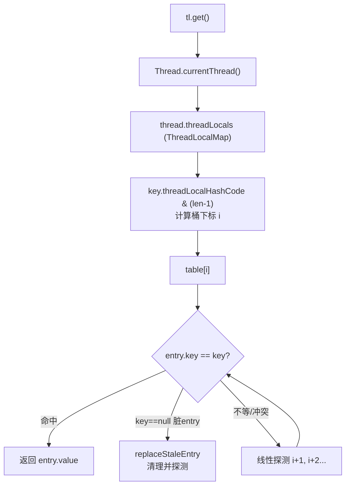
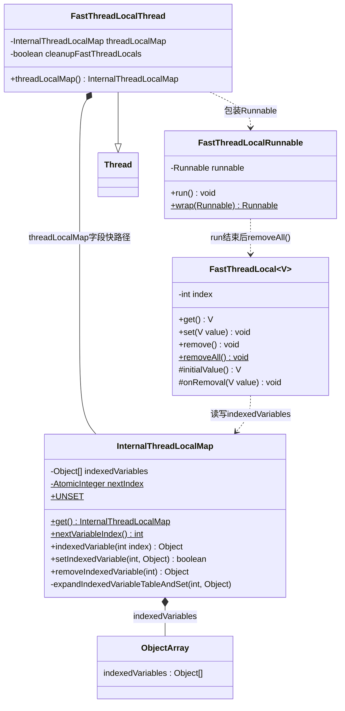
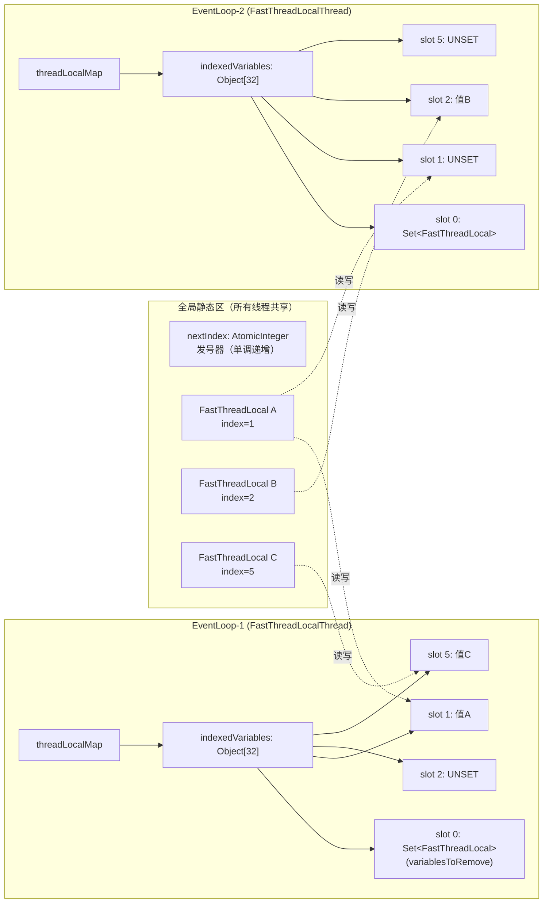
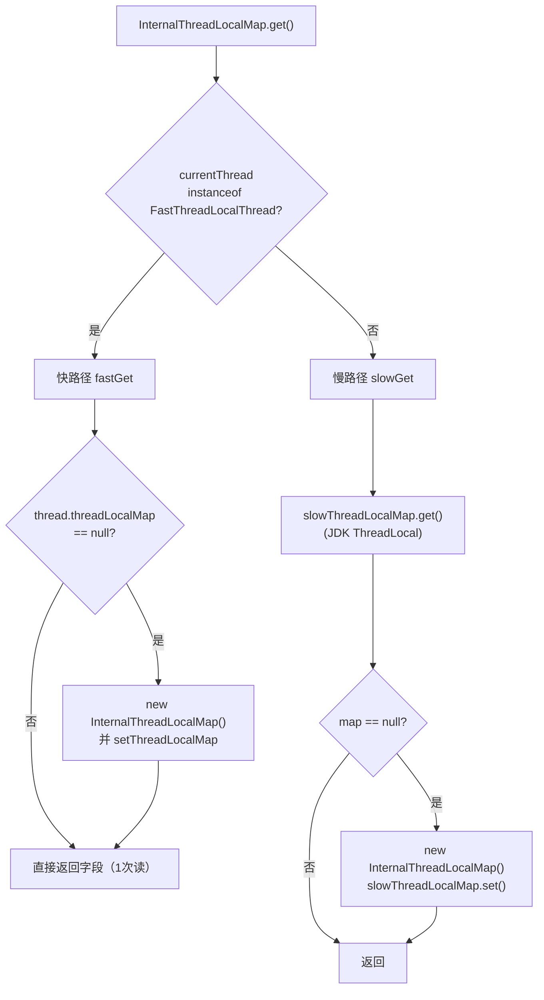
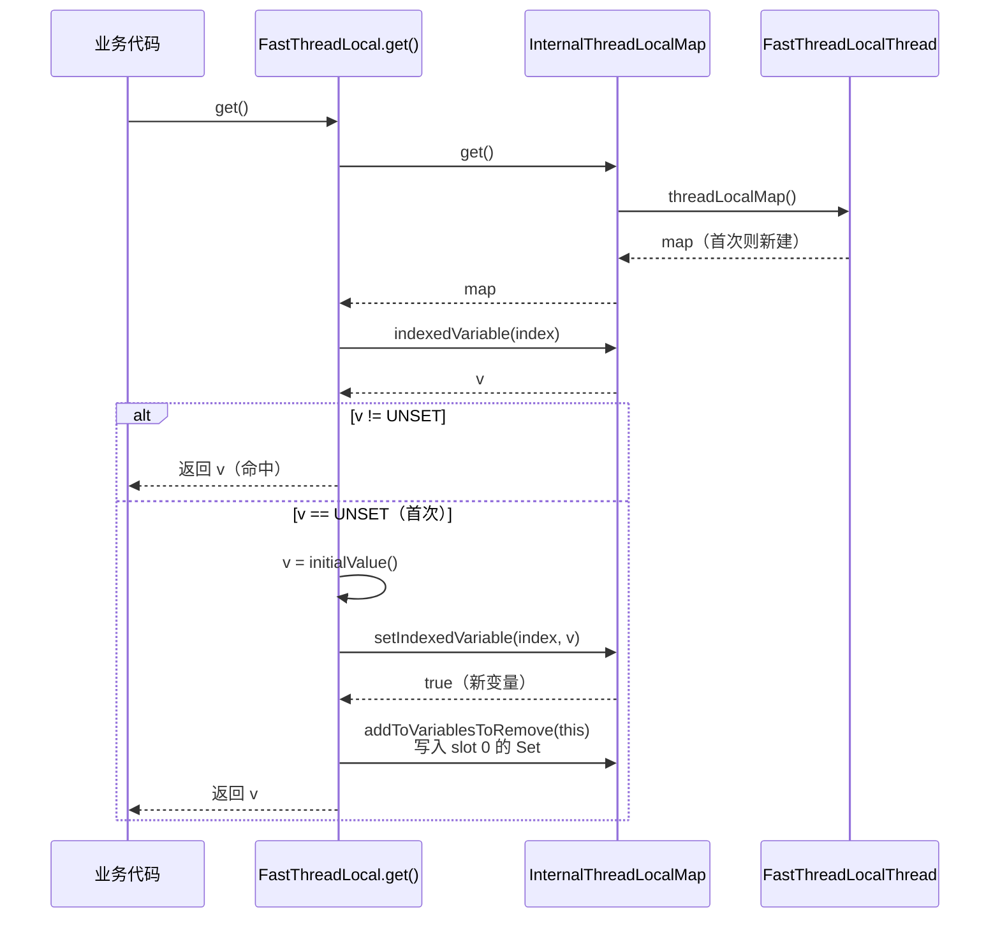
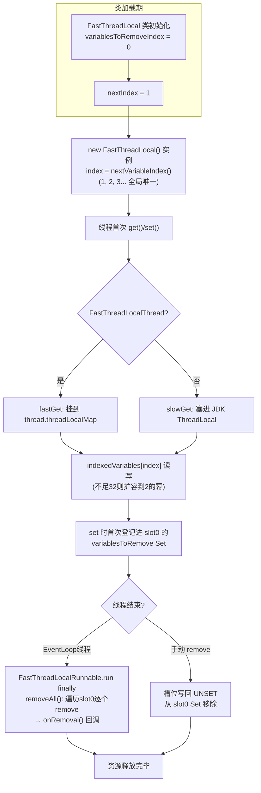
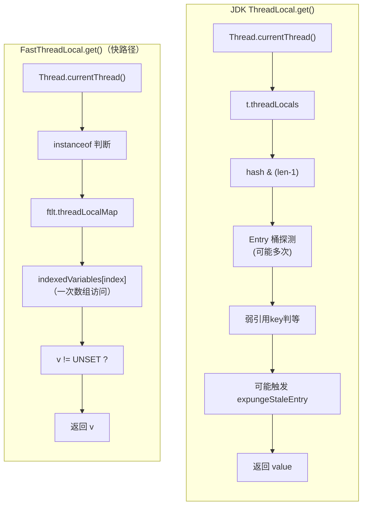

# Netty 源码剖析（一）：FastThreadLocal

> 源码版本：Netty 4.1.65
> 涉及类：
> - `io.netty.util.concurrent.FastThreadLocal`
> - `io.netty.util.concurrent.FastThreadLocalThread`
> - `io.netty.util.concurrent.FastThreadLocalRunnable`
> - `io.netty.util.internal.InternalThreadLocalMap`

---

## 1. FastThreadLocal 是什么

`FastThreadLocal` 是 Netty 对 JDK `ThreadLocal` 的一个**高性能替代实现**。它的核心思想是：

> **用"数组下标直接定位"取代"哈希表探测定位"**。

JDK `ThreadLocal` 的读写路径是：`ThreadLocalHashCode → 与 table 长度按位与 → 哈希桶 → 线性探测解决冲突 → 遍历 Entry 链/表`。而 `FastThreadLocal` 在构造时就通过一个**全局静态原子递增的 index** 为自己分配了一个**固定不变的数组下标**，读写时只需：

```
当前线程 → threadLocalMap 字段 → indexedVariables[index]
```

一次指针解引用 + 一次数组访问，O(1) 且**无哈希计算、无冲突、无探测**。

类注释原文（`FastThreadLocal.java:26-39`）也说明了这一点：

> Internally, a `FastThreadLocal` uses a constant index in an array, instead of using hash code and hash table, to look for a variable. Although seemingly very subtle, it yields slight performance advantage over using a hash table, and it is useful when accessed frequently.

需要注意两点：

1. **快速路径只对 `FastThreadLocalThread` 生效**。普通线程访问 `FastThreadLocal` 会退化（fallback）为普通 `ThreadLocal` 行为（slow path）。
2. Netty 自己创建的线程（`DefaultThreadFactory` 产出的 `FastThreadLocalThread`，即 Netty 的所有 EventLoop 线程）默认走快路径，因此在 Netty 内部高并发、高频访问场景（如 `Recycler` 对象池、`PlatformDependent` 编解码缓存等）收益显著。

---

## 2. 为什么已有 ThreadLocal 还要重新设计

### 2.1 JDK ThreadLocal 的设计回顾

JDK 的实现（4.1.65 对应 JDK8 时代）：

- 每个 `Thread` 持有一个 `ThreadLocalMap`；
- `ThreadLocalMap` 内部是 `Entry[] table`，`Entry` 是**弱引用 key**（`WeakReference<ThreadLocal<?>>`）；
- key 的 hash 是 `threadLocalHashCode`（每个 ThreadLocal 对象构造时原子递增 `0x61c88647` 黄金分割增量），与 `(table.length - 1)` 按位与定位桶；
- 冲突时**线性探测（开放寻址）**。



### 2.2 JDK ThreadLocal 的性能问题

| # | 问题 | 说明 |
|---|------|------|
| 1 | **哈希探测开销** | 每次读写都要计算 hash、按位与、可能线性探测遍历多个桶；`get()` 平均需要多次内存访问 |
| 2 | **内存布局不友好** | `Entry` 是包裹对象（对象头 16B + 弱引用 + value 引用），实际数据散落在堆上，**缓存不友好**；而 FastThreadLocal 用裸 `Object[]`，连续内存 |
| 3 | **需要防御性清理** | 弱引用 key 会产生 stale entry，get/set 时触发 `expungeStaleEntry` 等清理逻辑，最坏 O(n) |
| 4 | **侵入 Thread 类** | JDK 方案把 map 挂在 `Thread` 的字段上，无法自定义 |

### 2.3 FastThreadLocal 的应对

| 维度 | JDK ThreadLocal | FastThreadLocal |
|------|-----------------|-----------------|
| 定位方式 | hash + 位运算 + 线性探测 | **常量数组下标**，一次数组访问 |
| 底层结构 | `Entry[]`（弱引用包装） | **裸 `Object[]`**，无包装对象 |
| 冲突 | 有（开放寻址） | **无**（index 全局唯一） |
| 扩容 | rehash 全表 | 仅 `Arrays.copyOf` + 填 `UNSET` |
| Hash 计算 | 每次访问 | **零哈希** |
| 依赖线程类型 | 任意 Thread | 快路径需 `FastThreadLocalThread` |
| 清理 | 弱引用 + expunge | `variablesToRemove` Set（IdentityHashMap）+ `removeAll()` |

在 Netty 的 I/O 线程中，`Recycler`（对象池）、`PlatformDependent` 的 `CharsetEncoder/Decoder` 缓存、`AbstractByteBuf` 的 `StringBuilder`（`InternalThreadLocalMap#stringBuilder()`，见 `InternalThreadLocalMap.java:207-218`）等都在**每条消息、每个事件**的处理路径上访问 ThreadLocal，这种"细微"的差距乘以事件吞吐量后非常可观——这正是类注释所说的 *"useful when accessed frequently"*。

---

## 3. 整体架构与核心类



三个角色分工：

- **`FastThreadLocal`**：对外 API。每个实例持有一个 `final int index`（全局唯一下标）。
- **`FastThreadLocalThread`**：在 `Thread` 上"开洞"，直接持有 `InternalThreadLocalMap` 字段，避免走 JDK `ThreadLocalMap`。
- **`InternalThreadLocalMap`**：真正的存储结构，核心是 `Object[] indexedVariables` 数组 + 全局 `AtomicInteger nextIndex` 发号器。它还顺带缓存了 Netty 内部常用的一些线程级数据（`StringBuilder`、`CharsetEncoder/Decoder` 缓存、`handlerSharableCache` 等），进一步减少哈希查询。

---

## 4. 底层数据结构详解

### 4.1 index 分配：全局发号器

```java
// FastThreadLocal.java:46
private static final int variablesToRemoveIndex = InternalThreadLocalMap.nextVariableIndex();

// FastThreadLocal.java:127-129
public FastThreadLocal() {
    index = InternalThreadLocalMap.nextVariableIndex();
}

// InternalThreadLocalMap.java:136-143
public static int nextVariableIndex() {
    int index = nextIndex.getAndIncrement();
    if (index < 0) {
        nextIndex.decrementAndGet();
        throw new IllegalStateException("too many thread-local indexed variables");
    }
    return index;
}
```

关键点：

1. **类加载顺序**：`FastThreadLocal` 类自身的静态字段 `variablesToRemoveIndex` 最先初始化，因此它**永远拿到 index = 0**。
2 每新建一个 `FastThreadLocal` 实例（任意线程、任意时间），index 全局唯一递增，**永不复用**（即使该 FastThreadLocal 被 GC）。
3. index 溢出为负时直接抛异常，防止下标越界语义被破坏（最多约 2^31 个变量，实际远用不到）。

### 4.2 存储结构：`Object[] indexedVariables`

```java
// InternalThreadLocalMap.java:51-56
private static final int INDEXED_VARIABLE_TABLE_INITIAL_SIZE = 32;
public static final Object UNSET = new Object();   // 哨兵：未初始化标记
private Object[] indexedVariables;

// InternalThreadLocalMap.java:149-157
private InternalThreadLocalMap() {
    indexedVariables = newIndexedVariableTable();
}
private static Object[] newIndexedVariableTable() {
    Object[] array = new Object[INDEXED_VARIABLE_TABLE_INITIAL_SIZE];
    Arrays.fill(array, UNSET);
    return array;
}
```

**每个线程一个 `Object[]`，所有 `FastThreadLocal` 实例共享这张"全局下标空间"，但各自读写自己下标对应的槽位。**



要点：

- **index=0 恒为 `Set<FastThreadLocal>`（`IdentityHashMap` 后端的 Set）**，登记该线程上所有"已设置值"的 FastThreadLocal，用于 `removeAll()` 时批量清理（见 `InternalThreadLocalMap.java:202-204` 的注释）。
- **`UNSET` 哨兵**：区分"槽位未使用"和"值为 null"。`v != UNSET` 是唯一的判断逻辑，没有 hash、没有 equals。
- 数组初始 32，扩容见 §5.4。

### 4.3 为什么用 `IdentityHashMap` 做 variablesToRemove

`addToVariablesToRemove`（`FastThreadLocal.java:98-109`）使用 `Collections.newSetFromMap(new IdentityHashMap<>())`：以**对象身份（==）**判重，避免不同 FastThreadLocal 实例因 `equals()` 相等而互相覆盖，也避免调用业务可能重写的 `hashCode/equals`。每个 FastThreadLocal 的 index 本来就唯一，身份语义是最自然且最快的。

### 4.4 缓存行填充的残留

`InternalThreadLocalMap extends UnpaddedInternalThreadLocalMap`，且保留了 `public long rp1..rp9`（`InternalThreadLocalMap.java:77-78`）。早期版本中 `UnpaddedInternalThreadLocalMap` 存放非 padding 字段、子类用 long 字段做**缓存行填充（cache line padding）**以避免 `nextIndex` 等热点字段伪共享（false sharing）。4.1.65 中该父类已掏空（`UnpaddedInternalThreadLocalMap.java:21-23` 仅剩空类），padding 字段被标记 `@deprecated`，仅为了二进制兼容保留——这是阅读源码时容易疑惑的一个"化石"。

---

## 5. 核心流程源码分析

### 5.1 定位 map：get() 的双路径

```java
// InternalThreadLocalMap.java:97-121
public static InternalThreadLocalMap get() {
    Thread thread = Thread.currentThread();
    if (thread instanceof FastThreadLocalThread) {
        return fastGet((FastThreadLocalThread) thread);   // 快路径
    } else {
        return slowGet();                                  // 慢路径
    }
}

private static InternalThreadLocalMap fastGet(FastThreadLocalThread thread) {
    InternalThreadLocalMap threadLocalMap = thread.threadLocalMap();
    if (threadLocalMap == null) {
        thread.setThreadLocalMap(threadLocalMap = new InternalThreadLocalMap());
    }
    return threadLocalMap;
}

private static InternalThreadLocalMap slowGet() {
    InternalThreadLocalMap ret = slowThreadLocalMap.get();   // 普通ThreadLocal<InternalThreadLocalMap>
    if (ret == null) {
        ret = new InternalThreadLocalMap();
        slowThreadLocalMap.set(ret);
    }
    return ret;
}
```



**慢路径的设计很聪明**：对普通线程，整个 `InternalThreadLocalMap` 作为一个值存进 JDK `ThreadLocal`。这样数组下标方案仍然生效（只是外层多套了一层 JDK ThreadLocal 的哈希查找），语义完全一致，只是性能退回 JDK 水平。Netty 因此可以放心地在任何代码路径中使用 `FastThreadLocal`。

### 5.2 读取：FastThreadLocal.get()

```java
// FastThreadLocal.java:135-143
public final V get() {
    InternalThreadLocalMap threadLocalMap = InternalThreadLocalMap.get();
    Object v = threadLocalMap.indexedVariable(index);      // 数组下标直接取
    if (v != InternalThreadLocalMap.UNSET) {
        return (V) v;                                       // 命中，直接返回
    }
    return initialize(threadLocalMap);                      // 首次访问，惰性初始化
}

// InternalThreadLocalMap.java:311-314
public Object indexedVariable(int index) {
    Object[] lookup = indexedVariables;
    return index < lookup.length ? lookup[index] : UNSET;   // 越界视为未设置
}
```

未命中时的初始化（`FastThreadLocal.java:174-185`）：

```java
private V initialize(InternalThreadLocalMap threadLocalMap) {
    V v = null;
    try {
        v = initialValue();                 // 模板方法，默认返回 null
    } catch (Exception e) {
        PlatformDependent.throwException(e); // 受检异常转抛（避免get()签名throws）
    }
    threadLocalMap.setIndexedVariable(index, v);
    addToVariablesToRemove(threadLocalMap, this);  // 登记到 index=0 的 Set
    return v;
}
```

注意 `initialValue()` 与 JDK 不同：它**允许抛出受检异常**，通过 `PlatformDependent.throwException` 这个"万能转发"技巧绕过 Java 的受检异常检查。



### 5.3 写入：set()

```java
// FastThreadLocal.java:190-217
public final void set(V value) {
    if (value != InternalThreadLocalMap.UNSET) {
        InternalThreadLocalMap threadLocalMap = InternalThreadLocalMap.get();
        setKnownNotUnset(threadLocalMap, value);
    } else {
        remove();    // set(UNSET) 语义上等于删除（用户几乎不可能构造出UNSET，防御性代码）
    }
}

private void setKnownNotUnset(InternalThreadLocalMap threadLocalMap, V value) {
    if (threadLocalMap.setIndexedVariable(index, value)) {
        addToVariablesToRemove(threadLocalMap, this);  // 仅首次set时登记
    }
}
```

`setIndexedVariable` 返回值表示"是否是新变量"（旧值是否为 UNSET），只有新变量才需要登记进 variablesToRemove，避免重复 Set.add。

### 5.4 扩容：expandIndexedVariableTableAndSet

```java
// InternalThreadLocalMap.java:319-346
public boolean setIndexedVariable(int index, Object value) {
    Object[] lookup = indexedVariables;
    if (index < lookup.length) {
        Object oldValue = lookup[index];
        lookup[index] = value;
        return oldValue == UNSET;
    } else {
        expandIndexedVariableTableAndSet(index, value);
        return true;
    }
}

private void expandIndexedVariableTableAndSet(int index, Object value) {
    Object[] oldArray = indexedVariables;
    final int oldCapacity = oldArray.length;
    int newCapacity = index;
    // 位运算：把最高位1铺满低位，再加1 => 大于index的最小2的幂
    newCapacity |= newCapacity >>>  1;
    newCapacity |= newCapacity >>>  2;
    newCapacity |= newCapacity >>>  4;
    newCapacity |= newCapacity >>>  8;
    newCapacity |= newCapacity >>> 16;
    newCapacity ++;

    Object[] newArray = Arrays.copyOf(oldArray, newCapacity);
    Arrays.fill(newArray, oldCapacity, newArray.length, UNSET);
    newArray[index] = value;
    indexedVariables = newArray;
}
```

细节：

- 扩容为**大于 index 的最小 2 的幂**（HashMap 同款位技巧，`HashMap.roundUpToPowerOfTwo` 的内联版）。
- 扩的是**当前线程自己的数组**——下标空间是全局的，但数组是按需、按线程懒扩容的：某个线程从没碰过 index=100 的变量，它的数组可能始终只有 32。
- 对比 JDK ThreadLocalMap 扩容要 rehash 全表所有 entry，这里只是 copyOf + fill，**无需重定位任何元素**（下标永不改变）。

### 5.5 删除：remove / removeAll 与线程退出清理

单个删除（`FastThreadLocal.java:247-262`）：

```java
public final void remove(InternalThreadLocalMap threadLocalMap) {
    if (threadLocalMap == null) return;
    Object v = threadLocalMap.removeIndexedVariable(index);  // 槽位写回 UNSET
    removeFromVariablesToRemove(threadLocalMap, this);       // 从 slot0 Set 移除
    if (v != InternalThreadLocalMap.UNSET) {
        onRemoval((V) v);    // 回调，供用户释放资源
    }
}
```

批量清理（`FastThreadLocal.java:53-73`）——**这是 FastThreadLocal 生命周期管理的核心**：

```java
public static void removeAll() {
    InternalThreadLocalMap threadLocalMap = InternalThreadLocalMap.getIfSet();
    if (threadLocalMap == null) return;
    try {
        Object v = threadLocalMap.indexedVariable(variablesToRemoveIndex);  // slot 0
        if (v != null && v != InternalThreadLocalMap.UNSET) {
            Set<FastThreadLocal<?>> variablesToRemove = (Set) v;
            // 先拷贝成数组再遍历：防止 onRemoval 回调里又修改 Set（ConcurrentModification）
            FastThreadLocal<?>[] variablesToRemoveArray = variablesToRemove.toArray(new FastThreadLocal[0]);
            for (FastThreadLocal<?> tlv : variablesToRemoveArray) {
                tlv.remove(threadLocalMap);   // 逐个 remove，触发 onRemoval 回调
            }
        }
    } finally {
        InternalThreadLocalMap.remove();      // 快路径置null / 慢路径ThreadLocal.remove()
    }
}
```

### 5.6 线程退出时的自动清理：FastThreadLocalRunnable

```java
// FastThreadLocalRunnable.java:27-38
@Override
public void run() {
    try {
        runnable.run();
    } finally {
        FastThreadLocal.removeAll();   // 线程结束前统一清理
    }
}
```

`FastThreadLocalThread` 的所有带 `Runnable` 参数的构造器都会用 `FastThreadLocalRunnable.wrap(target)` 包装（`FastThreadLocalThread.java:34-37` 等），并把 `cleanupFastThreadLocals` 置为 true。也就是说：

- **EventLoop 线程（NioEventLoop）退出时会自动 `removeAll()`**，这是 JDK ThreadLocal 做不到的（JDK 只靠弱引用被动清理 value，且 Entry 的 value 是强引用，容易泄漏）。
- Netty 的 `DefaultThreadFactory` 创建的线程默认就是 `FastThreadLocalThread`，所以 Netty 内部线程天然具备这个保障。
- 注意 `onRemoval` 的 javadoc 警告（`FastThreadLocal.java:272-275`）：如果是**用户自己 `new FastThreadLocalThread(无Runnable)`** 或线程被池化复用，清理时机不保证，仍需手动 `removeAll()`。

### 5.7 全生命周期总览



---

## 6. 与 JDK ThreadLocal 全景对比



| 对比项 | JDK ThreadLocal | FastThreadLocal |
|--------|-----------------|-----------------|
| get 热路径操作数 | hash 计算 + 位与 + ≥1 次桶探测 + key 判等 | 1 次 instanceof + 1 次字段读 + 1 次数组读 |
| 哈希冲突 | 线性探测 | 不存在 |
| value 存储 | Entry 包装对象（弱引用 key） | 裸 Object[] 槽位，连续内存 |
| 内存泄漏防护 | 弱引用 key + 被动 expunge（value 仍可能短暂泄漏） | 主动 removeAll + 线程退出清理 |
| initialValue 异常 | 不能抛受检异常 | 可以（PlatformDependent.throwException 转发） |
| 批量清理 | 无 API | `removeAll()` |
| 局限 | — | index 不回收；快路径要求 FastThreadLocalThread；普通线程反而多一层封装 |

---

## 7. 性能基准佐证

仓库自带 microbench（`microbench/`）：

- `FastThreadLocalFastPathBenchmark.java` —— `FastThreadLocalThread` 上的访问（快路径）
- `FastThreadLocalSlowPathBenchmark.java` —— 普通线程上的访问（慢路径，含 JDK ThreadLocal 对照）

官方 JMH 结果通常显示快路径相对 JDK `ThreadLocal` 有稳定的小幅优势（每次访问节省的是纳秒级，但热路径访问频度极高）。核心收益来源可以归纳为三点：

1. **零哈希、零冲突**：常量下标直接寻址；
2. **零包装、缓存友好**：`Object[]` 连续内存，无 Entry 对象头开销，无指针跳转；
3. **无弱引用清理负担**：不依赖 GC 引用机制做正确性清理。

---

## 8. 设计精髓总结

1. **空间换时间的下标直查**：把"运行时哈希查找"前移到"构造时全局发号"，用 AtomicInteger 的 CAS 换掉每次访问的探测成本。
2. **读写分离的双路径**：快路径寄生于自定义 Thread 子类的字段；慢路径优雅降级为"JDK ThreadLocal 包一层 InternalThreadLocalMap"，保证了 API 在任何线程下语义一致。
3. **slot 0 的登记簿模式**：`variablesToRemove` Set 使 O(1) 数组结构也能支持 O(n) 的批量枚举清理，弥补了数组结构"无法反向遍历谁被设置过"的短板。
4. **确定性生命周期**：通过 `FastThreadLocalRunnable` 在线程退出时 `removeAll()`，变 JDK 的"被动弱引用清理"为"主动确定性清理"，这对 `Recycler` 这类持有堆外/池化资源的场景至关重要。
5. **顺手的聚合优化**：`InternalThreadLocalMap` 不只是数组，还把 Netty 内部十来个热点 ThreadLocal（StringBuilder、编解码器缓存、随机数等）做成**类字段直接访问**，比 FastThreadLocal 数组还快一档——同一份 map 服务多个层次的优化。

---

## 附：阅读源码时的快问快答

**Q：index 会被回收复用吗？**
不会。`nextIndex` 单调递增，FastThreadLocal 被 GC 后下标永久作废（数组槽位还回 UNSET 但下标不复用），防止旧值串号。

**Q：为什么 `set(UNSET)` 等价于 `remove()`？**
`UNSET` 是内部哨兵，若允许存入会破坏 `v != UNSET` 的判定语义，所以干脆定义为删除。

**Q：`getIfExists()` 和 `get()` 的区别？**
`getIfExists` 不触发 `initialValue()` 初始化，未设置返回 null；`get` 首次会惰性初始化。

**Q：普通线程用 FastThreadLocal 会不会出错？**
不会，只是走 `slowGet()` 慢路径，正确性完全一致。

**Q：哪里能看到 removeAll 的实际调用？**
`NioEventLoop.run()` 所在线程退出路径、`FastThreadLocalRunnable.run()`，以及容器环境下用户手动调用（`destroy()` 用于应用卸载）。
