# Netty 源码剖析（二）：ByteBuf 与内存管理

> 源码版本：Netty 4.1.65
> 涉及模块：`buffer/`（ByteBuf 家族、池化分配器）、`common/`（泄漏检测、引用计数）
> 涉及核心类：
> - `io.netty.buffer.ByteBuf` / `AbstractByteBuf` / `AbstractReferenceCountedByteBuf`
> - `io.netty.buffer.ByteBufAllocator` / `AbstractByteBufAllocator` / `PooledByteBufAllocator` / `UnpooledByteBufAllocator`
> - `io.netty.buffer.PoolArena` / `PoolChunk` / `PoolSubpage` / `PoolChunkList` / `PoolThreadCache`
> - `io.netty.buffer.CompositeByteBuf` / `SlicedByteBuf` / `DuplicatedByteBuf`
> - `io.netty.util.ResourceLeakDetector` / `AdvancedLeakAwareByteBuf`
> - `io.netty.util.internal.ReferenceCountUpdater` / `Recycler`

---

## 1. ByteBuf 是什么：为什么不用 JDK ByteBuffer

`ByteBuf` 是 Netty 自己设计的字节容器，是整个数据流转的载体（编解码器、`ChannelPipeline`、`ByteBufHolder` 消息全部围绕它）。Netty 重造它的动机（`ByteBuf.java` 开头 javadoc 有完整论述）：

| 痛点 | JDK ByteBuffer | ByteBuf 方案 |
|------|----------------|--------------|
| 读写模式切换 | 一个 `position` 指针，读写切换必须 `flip()`，忘掉就出 bug | **读写双索引** `readerIndex` / `writerIndex`，无需 flip |
| 动态扩容 | 定长，不够要手动新建+拷贝 | `ensureWritable()` 自动扩容（有 maxCapacity 上限） |
| 内存复用 | 无引用计数，DirectBuffer 靠 Cleaner 被动回收，时机不可控 | **引用计数**主动生命周期管理 |
| 零拷贝组合 | 无 | `slice()/duplicate()/retainedSlice()` 视图 + `CompositeByteBuf` 逻辑拼接 |
| 类型支持 | 基本类型 + 小端 | 基本类型 + medium(24bit) + 小端(LE 后缀) + 字符串/枚举 |
| 池化 | 无 | jemalloc 风格的 `PooledByteBufAllocator` |

### 1.1 索引模型（一切 API 的基础）

```
      +-------------------+------------------+------------------+
      | discardable bytes |  readable bytes  |  writable bytes  |
      |                   |     (内容)        |                  |
      +-------------------+------------------+------------------+
      |                   |                  |                  |
      0 <=        readerIndex   <=    writerIndex    <=    capacity
```

三个区域、两个游标：

- **discardable**：`0 ~ readerIndex`，已消费区域，可用 `discardReadBytes()` 回收
- **readable**：`readerIndex ~ writerIndex`，有效数据，`readableBytes()`
- **writable**：`writerIndex ~ capacity`，`writableBytes()`

`clear()` 不清数据，只把两个索引归零。`mark/reset` 支持游标回退（典型场景：先读 4 字节长度字段，发现剩余数据不完整，`resetReaderIndex()` 回退等待下次读全）。

### 1.2 API 矩阵

| 维度 | 读 | 写 | 说明 |
|------|----|----|------|
| 顺序（动索引） | `readXxx()` | `writeXxx()` | 自动推进 readerIndex/writerIndex |
| 随机（不动索引） | `getXxx(index)` | `setXxx(index, v)` | 指定绝对位置 |
| 视图（零拷贝） | `slice/retainedSlice` | `duplicate/retainedDuplicate` | 共享底层内存 |
| 拷贝 | `copy()` | — | 深拷贝，独立内存 |
| JDK 互转 | `nioBuffer()` | `writeBytes(ByteBuffer)` | 零拷贝视图 |

---

## 2. 类体系架构

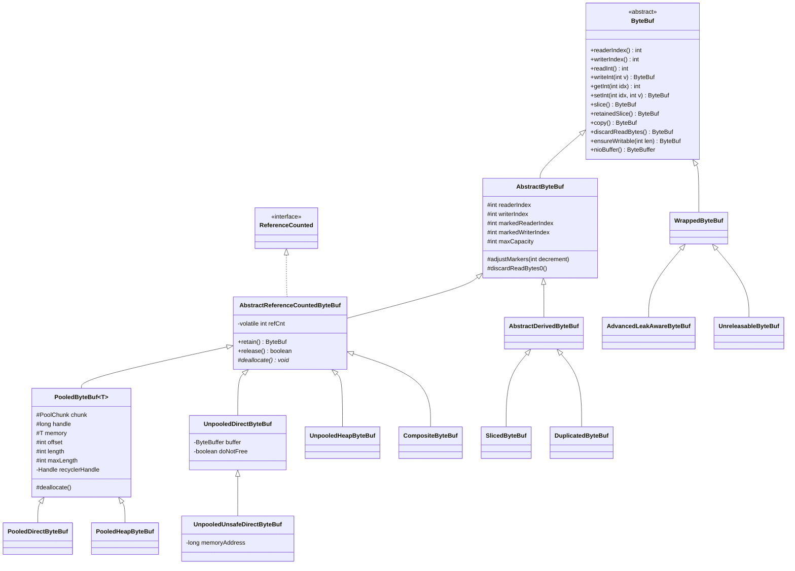

分层职责：

- **`ByteBuf`**：接口，140+ 方法（一半以上是 8 种基本类型 × 顺序/随机 × 大端/小端的组合展开）。
- **`AbstractByteBuf`**：实现全部索引逻辑、边界检查、`slice/duplicate/discardReadBytes` 模板。
- **`AbstractReferenceCountedByteBuf`**：实现引用计数；释放时回调抽象方法 `deallocate()` 交还给"提供内存的一方"（池化→归还池；非池化→释放内存）。
- **两棵继承树**：池化（`PooledByteBuf<T>`，T=byte[] 或 ByteBuffer，泛型统一堆/直接两套代码）与非池化（`UnpooledXxxByteBuf`）。
- **装饰器家族**（`WrappedByteBuf` 子类）：`AdvancedLeakAwareByteBuf`（泄漏追踪）、`UnreleasableByteBuf`（禁止释放）等——分配器出口处统一 `toLeakAwareBuffer(buf)` 包装。

---

## 3. AbstractByteBuf：索引与读写骨架

### 3.1 核心字段

```java
// AbstractByteBuf.java
int readerIndex;
int writerIndex;
private int markedReaderIndex;   // readXxx 前的 mark
private int markedWriterIndex;
private int maxCapacity;         // 扩容上限
```

注意 `readerIndex/writerIndex` 是**普通 int**（非 volatile）：ByteBuf 的设计约定**默认非线程安全**（"同一个 ByteBuf 不应被多线程并发访问"，Netty 通过 EventLoop 串行化保证），只有 `DuplicatedByteBuf` 等特殊场景需要注意。

### 3.2 读写的模板流程（以 writeInt 为例）

```java
// AbstractByteBuf.java
@Override
public ByteBuf writeInt(int value) {
    ensureWritable0(4);              // ① 保证可写（可能扩容）
    _setInt(writerIndex, value);     // ② 平台相关写入（Unsafe/数组），子类实现
    writerIndex += 4;                // ③ 推进写索引
    return this;
}
```

`readInt()` 对称：`checkReadableBytes0(4)` → `_getInt` → `readerIndex += 4`。所有 `read/write` 都是这三步组合，真正的字节操作全部下沉到 `_get/_set` 原语（这是 Netty 里非常干净的模板方法模式）。

### 3.3 扩容：ensureWritable0 与 calculateNewCapacity

```java
// AbstractByteBufAllocator.java — Netty 的容量增长策略
public int calculateNewCapacity(int minNewCapacity, int maxCapacity) {
    final int threshold = CALCULATE_THRESHOLD; // 4 MiB page
    if (minNewCapacity > threshold) {
        // 超过 4MiB：按 4MiB 对齐步进，而不是翻倍（避免过度浪费）
        int newCapacity = minNewCapacity / threshold * threshold;
        if (newCapacity > maxCapacity - threshold) {
            newCapacity = maxCapacity;
        } else {
            newCapacity += threshold;
        }
        return newCapacity;
    }
    // 小于 4MiB：从 64 开始翻倍，直到满足（经典二倍增长）
    int newCapacity = 64;
    while (newCapacity < minNewCapacity) {
        newCapacity <<= 1;
    }
    return Math.min(newCapacity, maxCapacity);
}
```

设计取舍：小 buffer 翻倍（均摊 O(1)），大 buffer 4MiB 步进（控制浪费率上限约 25%）。

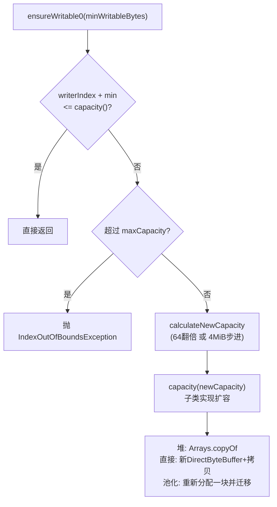

### 3.4 discardReadBytes：空间回收与碎片

`discardReadBytes()` 把 `[readerIndex, writerIndex)` 的数据搬到数组头部，释放"已读区"。实现细节（`AbstractByteBuf#discardReadBytes0`）：

1. `copy(0, readerIndex, readableBytes())`；
2. 若 `readerIndex == writableBytes()` 直接 `writerIndex(0)`，否则 `adjustMarkers(readerIndex)`（mark 索引同步前移，负数归 0）；
3. `readerIndex = writerIndex = 0`。

**注意 javadoc 的警告**：它可能引发 `System.arraycopy` 大量内存搬移，频繁调用会带来越来越大的 memmove 开销（数据越长拷贝越贵）。Netty 自己的策略是**优先让 PooledByteBufAllocator 直接归还内存**，只在非池化/无内存可借时才用它（如 `AbstractNioByteChannel` 处理半包时对旧版 buffer 的处理）。`discardSomeReadBytes()` 是折中：只搬移相对便宜的情况（已读区占一半以上才动）。

### 3.5 slice / duplicate / copy / retained

| 方法 | 底层内存 | 索引 | 引用计数 |
|------|---------|------|---------|
| `slice()` | 共享 | 独立（限制在切片范围内，0..length） | **不变**（不持有） |
| `retainedSlice()` | 共享 | 同上 | `+1`（切片持有） |
| `duplicate()` | 共享 | 独立完整副本 | 不变 |
| `copy()` | **深拷贝** | 独立 | 新对象独立计数 |

`AbstractDerivedByteBuf` 是 slice/duplicate 的共同基类（容量来自父 buf 的范围）；`AbstractUnpooledSlicedByteBuf` 里最重要的字段：

```java
final ByteBuf buffer;   // 父缓冲区
final int adjustment;   // 逻辑 index -> 物理 index 的固定偏移
```

所有 `_get/_set` 都是 `buffer._get(adjustment + index)` 直通父对象。**最容易踩的坑**：`slice()` 之后父 buf 被 `release()` → 底层内存已被池回收/释放 → 切片访问到脏数据或抛异常。规则：**谁传 slice 谁负责生命周期，跨方法边界传递必须 `retainedSlice()`**。

### 3.6 nioBuffer：与 JDK 互通（零拷贝）

各实现的差异：

| 实现 | 方式 | 是否拷贝 |
|------|------|---------|
| 堆 buf | `ByteBuffer.wrap(array(), offset+index, length)` | 否 |
| 直接 buf（非Unsafe） | `buffer.duplicate().clear().position(index).limit(index+length).slice()` | 否 |
| 池化直接 buf | 基于 `memory` 切出 nioBuffer（chunk 级复用 cachedNioBuffers） | 否 |
| `CompositeByteBuf` | 无法单块表达 → **只能给 `nioBuffers()` 数组** | 否 |

这是 `SocketChannel` 最终写网络时的通道：ByteBuf 的零拷贝链路终点就是这几个 `nioBuffer*` 视图交给 JDK NIO。

---

## 4. 引用计数：AbstractReferenceCountedByteBuf

引用计数是 ByteBuf 与 ByteBuffer 的**本质分水岭**——有了它才可能有池化。

### 4.1 语义

- `retain()`：计数 +1，表示"又有一个持有者"
- `release()`：计数 -1；**减到 0 时调用 `deallocate()` 真正释放**
- 最后一个 release 的持有者负责释放（"谁最后用完谁关灯"）

### 4.2 4.1.65 的奇偶编码优化（ReferenceCountUpdater）

```java
// ReferenceCountUpdater.java:58-75
public final int initialValue() {
    return 2;                        // 真实计数1，raw值 = 真实 << 1
}
private static int realRefCnt(int rawCnt) {
    return rawCnt != 2 && rawCnt != 4 && (rawCnt & 1) != 0 ? 0 : rawCnt >>> 1;
}
private static int toLiveRealRefCnt(int rawCnt, int decrement) {
    if (rawCnt == 2 || rawCnt == 4 || (rawCnt & 1) == 0) {
        return rawCnt >>> 1;
    }
    // 奇数 rawCnt => 已经销毁
    throw new IllegalReferenceCountException(0, -decrement);
}
```

raw `refCnt` 字段的编码规则：**真实计数 × 2（偶数）；奇数代表已销毁**。这是 Netty 4.1 后期引入的精妙设计：

1. **retain 用 `getAndAdd` 不用 CAS 循环**（`retain0`，`ReferenceCountUpdater.java:120-121`）：

```java
private T retain0(T instance, final int increment, final int rawIncrement) {
    int oldRef = updater().getAndAdd(instance, rawIncrement);   // xadd 一条原子指令
    if (oldRef != 2 && oldRef != 4 && (oldRef & 1) != 0) {
        throw new IllegalReferenceCountException(0, increment);  // 已死，事后补救
    }
    ...
}
```

无竞争时 xadd 一条 lock xadd 指令搞定，比 CAS 自旋更快；如果恰好对已销毁对象 retain 了，再回滚抛异常（xadd 的副作用无害——奇数状态本身就是"死"标记）。

2. **release 快路径先非 volatile 读**（`release()`，`ReferenceCountUpdater.java:135-139`）：

```java
public final boolean release(T instance) {
    int rawCnt = nonVolatileRawCnt(instance);        // 普通读，避免 volatile 开销
    return rawCnt == 2 ? tryFinalRelease0(instance, 2) || retryRelease0(instance, 1)
            : nonFinalRelease0(instance, 1, rawCnt, toLiveRealRefCnt(rawCnt, 1));
}
private boolean tryFinalRelease0(T instance, int expectRawCnt) {
    return updater().compareAndSet(instance, expectRawCnt, 1);  // 2 -> 1(奇数=死)
}
```

最常见的 `refCnt==1` 时单次 CAS（2→1）即完成销毁判定。

3. **溢出保护**：`retain0` 中检测 `oldRef + rawIncrement` 回绕并回滚。

### 4.3 生命周期状态机

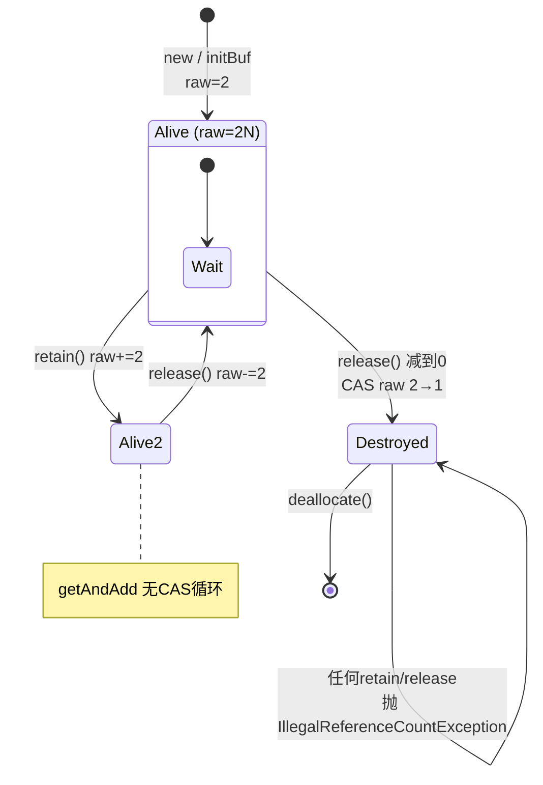

### 4.4 PooledByteBuf.deallocate：归还而非释放

```java
// PooledByteBuf.java
@Override
protected final void deallocate() {
    if (handle >= 0) {
        final long handle = this.handle;
        this.handle = -1;
        memory = null;
        chunk.arena.free(chunk, tmpNioBuf, handle, maxLength, cache);  // 还给arena/线程缓存
        tmpNioBuf = null;
        chunk = null;
        recycle();    // PooledByteBuf对象本身回Recycler对象池复用
    }
}
```

双重回收：**内存**归还 arena（或先入 PoolThreadCache），**ByteBuf 对象壳**归还 Recycler——高吞吐下 `new PooledDirectByteBuf` 的分配成本也被省掉了。

---

## 5. 分配器体系：ByteBufAllocator

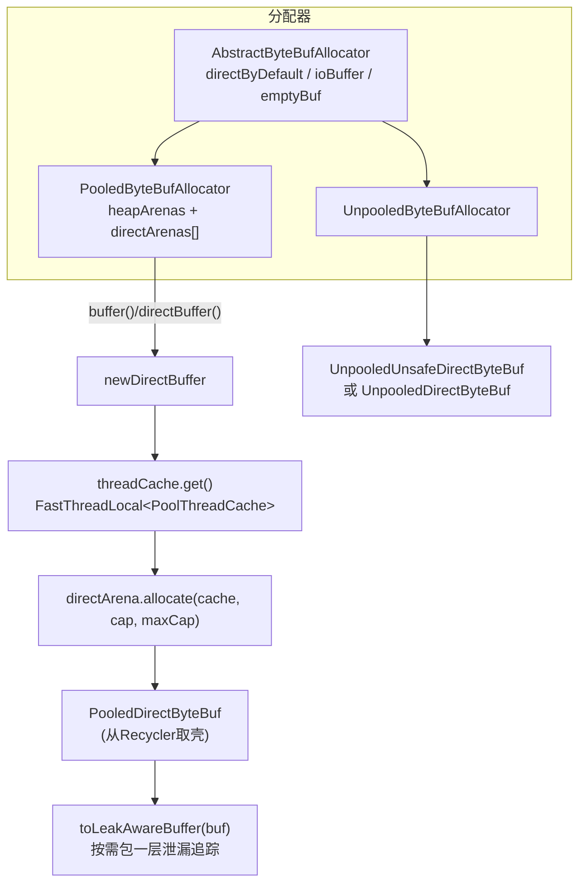

关键事实：

- **默认分配器**是 `PooledByteBufAllocator`，默认 `preferDirect=true`（有 Unsafe 时），即 **Direct + Pooled** 是 Netty 的默认形态。
- `AbstractByteBufAllocator#ioBuffer()`：给 I/O 用的 buffer——有 Unsafe 或池化可用时给 direct，否则 heap（因为无 Unsafe 时 direct 的释放/访问有坑）。
- 多 Arena（默认 `2 * CPU 核数`，`DEFAULT_NUM_DIRECT_ARENA`）：**用空间分片降低锁竞争**——每个线程绑定一个 arena，`PoolThreadCache.initialValue()` 时选 `leastUsedArena`（当前持有 cache 最少的 arena）。
- 堆/直接两套泛型：`PoolArena<byte[]>` 与 `PoolArena<ByteBuffer>`，同一份算法代码复用。

---

## 6. 池化分配器：jemalloc 思想

### 6.1 分级策略

| 级别 | 大小 | 分配路径 |
|------|------|---------|
| Small | ≤ 8KB（pageSize） | Subpage 切分 + 线程缓存 |
| Normal | 8KB ~ 16MB（chunkSize） | Chunk 内 run 分配 + 线程缓存 |
| Huge | > 16MB | 不池化，直接 `Unpooled` 分配，release 时销毁 |

> 4.1.65 已把 Tiny（<16B）合并进 Small 的大小类表（SizeClasses 按 jemalloc 的 size class 分档：16, 32, 48, 64, 80, 96, 112, 128...），所以只有 Small/Normal/Huge 三级（与 4.1.52 之前不同，老版本还有 tinySubpagePools）。

### 6.2 整体架构

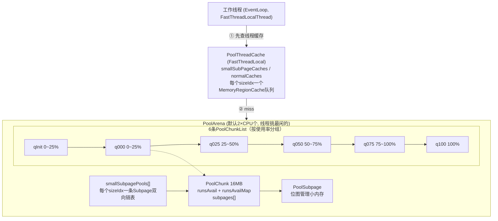

三道防线层层递进：**线程缓存（无锁）→ arena 内共享结构（有锁，但 arena 分片降低竞争）→ 新 chunk 分配**。

### 6.3 PoolChunk：jemalloc 风格的 run 管理

> ⚠️ 重要版本差异：4.1.52 之前 PoolChunk 用 `memoryMap[]/depth[]` 完全二叉树实现伙伴算法；**4.1.65 已重写为 jemalloc 风格的 runs（连续页区间）管理**，源码中仅在注释里残留 "memoryMap" 字样（`PoolChunk.java:416`）。以下分析以 4.1.65 实际代码为准。

核心字段：

```java
// PoolChunk.java
static final int PAGE_SIZE = 8192;              // 8KB
static final int MAX_ORDER = 11;                // 2^11 = 2048 页
final int chunkSize = 1 << (pageShifts + MAX_ORDER);   // 16MB

final T memory;                 // byte[] 或 ByteBuffer
final boolean unpooled;         // huge 分配的 chunk 不参与池

// 空闲 run 管理（4.1.65 新设计）
private final LongLongHashMap runsAvailMap;     // runOffset -> handle（按首尾页索引，O(1)定位邻居）
private final LongPriorityQueue[] runsAvail;    // 按页数档位分桶的空闲run优先队列
private final PoolSubpage<T>[] subpages;        // runOffset -> Subpage
```

**handle 的位编码**（一个 long 描述一块内存的全部信息）：

```
 63          49 48         34 33  32 31   30              0
+--------------+-------------+----+----+------------------+
| runOffset(15)|  size(15)   |isU |isS |   bitmapIdx(32)  |
+--------------+-------------+----+----+------------------+
 runOffset: 起始页号   size: run占的页数
 isUsed / isSubpage: 标志位   bitmapIdx: subpage内部槽位号
```

源码类注释（`PoolChunk.java:82-113`）明确了不变式：**runsAvailMap 记录每个空闲 run 的首、尾页偏移 → handle 映射，用于 O(1) 找到左右邻居做合并**。

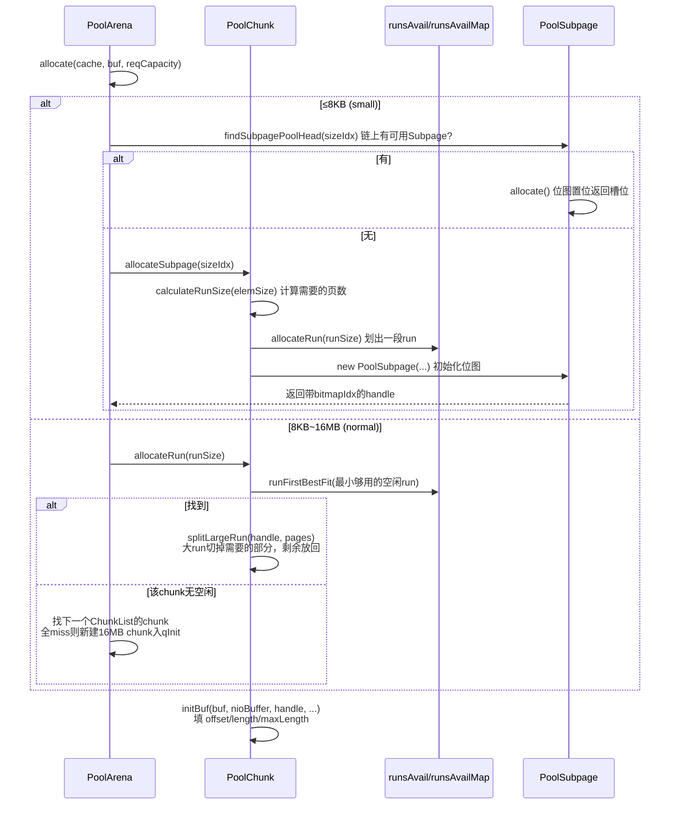

**释放与合并（伙伴算法的现代化身）**：

```java
// PoolChunk#free 流程（简化自源码）
if (isSubpage(handle)) {
    subpage.free(head, bitmapIdx(handle));      // 位图清位
    if (subpage 还有占用) return;               // 不归还 run
    // subpage 全空 → 从 smallSubpagePools 链表移除，继续归还整段 run
}
synchronized (runsAvail) {
    long finalRun = collapseRuns(handle);       // ★ 用 runsAvailMap O(1) 找左右邻居合并
    insertAvailRun(...);                        // 放回空闲队列
}
```

### 6.4 PoolSubpage：小内存的位图管理

一个 run（若干连续页，最小 1 页 = 8KB）被划成等大的 elemSize 槽位，用 long[] 位图管理：

```java
// PoolSubpage.java 关键字段
final PoolChunk<T> chunk;
final long[] bitmap;        // 每个 long 管 64 个槽位
int elemSize;               // 16/32/48/.../4096
int maxNumElems;
int nextAvail;              // 下一个可用槽（免扫描）
int numAvail;               // 剩余槽数
PoolSubpage<T> prev, next;  // 挂在 arena.smallSubpagePools[sizeIdx] 双向链表上
```

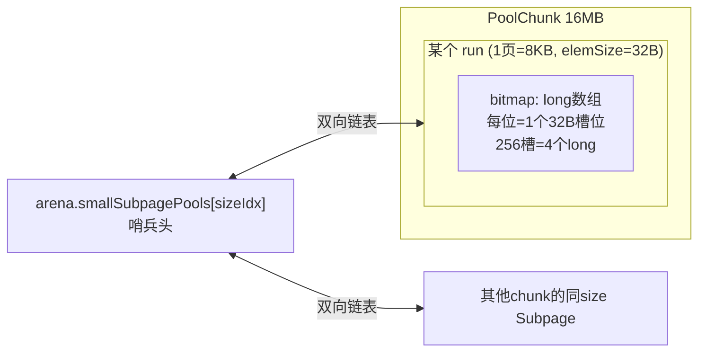

分配（`PoolSubpage#allocate`）：`getNextAvail()` 拿槽号 → `bitmap[q] |= 1L << r` 置位 → `numAvail==0` 时 `removeFromPool()`（满了就摘链，避免后续分配白跑）。释放对称：位清 0，若原本 `numAvail==0` 则 `addToPool()` 重新挂回；若全部空闲且链上不止自己，则销毁并把整段 run 还给 chunk。

### 6.5 PoolChunkList：使用率分组与 chunk 流转

6 条链按 chunk 使用率分档，**新 chunk 入 qInit，随使用率升降在链间迁移**：


分配时的**查链顺序**（`PoolArena#allocateNormal`）：`q050 → q025 → q000 → qInit → q075`（q100 必然失败不查）。优先用半满的 chunk，让 chunk 使用率向中间聚拢——**同样的分配总量用更少的 chunk 承载**，这是对抗碎片的关键（qInit 里的 chunk 空闲内存最多，留作"新鲜血液"；q000 里的 chunk 全空时整个归还操作系统）。

### 6.6 PoolThreadCache：无锁快车道

分配的最快路径完全无锁——**线程把刚释放的内存块私藏起来自己复用**：

```java
// PoolThreadCache.java
final PoolArena<byte[]> heapArena;      // 线程绑定的arena
final PoolArena<ByteBuffer> directArena;
// 每个 sizeIdx 一个队列（small 与 normal 分开，堆与直接分开，共4组数组）
private final MemoryRegionCache<byte[]>[] smallSubPageHeapCaches;
private final MemoryRegionCache<ByteBuffer>[] smallSubPageDirectCaches;
private final MemoryRegionCache<byte[]>[] normalHeapCaches;
private final MemoryRegionCache<ByteBuffer>[] normalDirectCaches;
private int allocations;                 // 分配计数，到阈值触发 trim
```

`MemoryRegionCache` 是按 sizeIdx 分桶的 `Entry` 队列（底层是 Netty 自制的 MPSC 队列，支持**其他线程代为释放**时的正确入队）：

```java
// PoolThreadCache.java:433 — Entry 本身也来自 Recycler
static final class Entry<T> {
    final Handle<Entry<?>> recyclerHandle;
    PoolChunk<T> chunk;
    ByteBuffer nioBuffer;
    long handle = -1;      // 内存块在chunk中的handle
    int normCapacity;
}
```

默认参数（`PooledByteBufAllocator` 静态块）：

| 参数 | 默认值 | 含义 |
|------|--------|------|
| pageSize | 8192 | 8KB |
| maxOrder | 11 | chunk = 8KB<<11 = **16MB** |
| smallCacheSize | 256 | 每 sizeIdx 的 small 缓存深度 |
| normalCacheSize | 64 | 每 sizeIdx 的 normal 缓存深度 |
| maxCachedBufferCapacity | 32KB | 超过 32KB 的释放不进缓存 |
| freeSweepAllocationThreshold | 8192 | 每 8192 次分配做一次 `trim()` |
| trimIntervalMillis | 0（可配） | EventLoop 上定时 trim（归还闲置内存） |

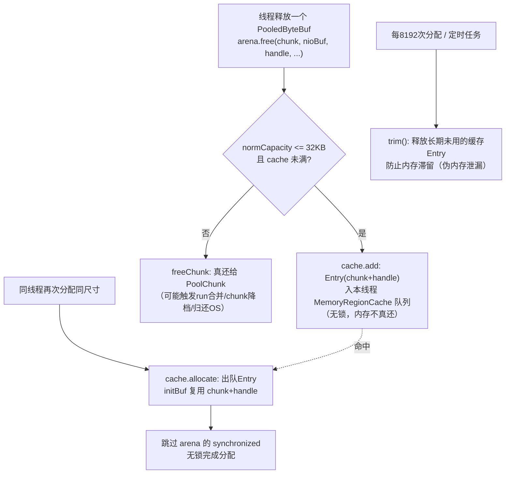

`trim()` 存在的意义：线程缓存里的内存**只属于本线程且不还给 chunk**，如果没有 trim，业务高峰期缓存的内存会一直滞留，监控上表现为 Netty 直接内存"只涨不跌"——这不是泄漏，但需要 trim（以及 EventExecutor 上的定时 trimTask）来归还闲置部分。这也是生产上调优 `-Dio.netty.allocator.` 系列参数的主要动机。

### 6.7 从 PooledByteBufAllocator 到 buffer 的完整时序

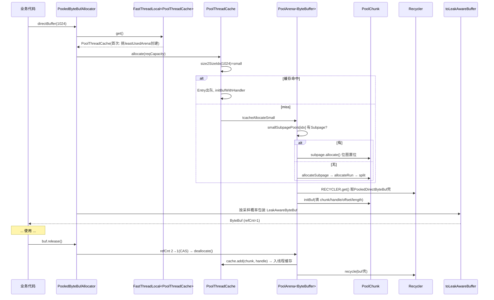

### 6.8 Recycler：ByteBuf 对象壳的池（简述）

`Recycler`（`io.netty.util.internal`）= **FastThreadLocal 的线程私有栈 + 弱引用**：

- 每线程一个 `Stack`，`get()` 从栈顶弹，`recycle()` 压回（无锁）；
- 跨线程回收走 `WeakOrderQueue`（MPSC 链表，惰性转移到目标线程栈）；
- Stack 持有对其所属线程的弱引用——线程死了，整个栈可被 GC，不泄漏。

在 ByteBuf 体系中，`PooledByteBuf` 壳、`PoolThreadCache.Entry` 都来自 Recycler：一次 release 真正做的只有"内存位图/队列操作 + 两个对象压栈"，全程无锁（同线程时）。

---

## 7. CompositeByteBuf：逻辑零拷贝拼接

HTTP 编解码器（头 + 体）、`writev` 聚合写等场景需要把多块 ByteBuf 当成一个连续缓冲区——物理上不合并、逻辑上统一索引。

结构（`CompositeByteBuf.java`）：内部一个 `Component` 数组（4.1.65 中已从 ArrayList 改为 `Component[]`，支持 `factory` 扩容），每个 Component 记录：

- `srcBuf`：原始 buf（retain 过，负责生命周期）
- `buf`：可能被 unwrap/替换后的实际访问目标
- `offset`：本组件在复合 buf 中的**起始偏移**（含前所有组件长度之和）
- `endOffset`：`offset + 本组件可读长度`
- `lengthAdjustment`：源 buf 的 readerIndex 修正

**索引换算是灵魂**：给定逻辑 index，二分查找定位 Component（组件按 offset 有序），换算 `srcIndex = index - c.offset + adjustment` 后委托 `c.buf` 执行。`_getByte` 这类操作跨两个组件时会退化（setBytes 分段处理），但 `nioBuffers(int,int)` 能把每个组件切成 ByteBuffer 数组交给 `writev`——这正是聚合写零拷贝的实现。

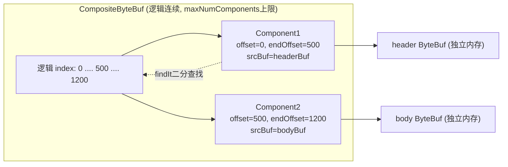

注意点：

- `addComponent` 传 `increaseWriterIndex=true` 才推进写索引（因为传入的 buf 的可读部分才计入）；
- 组件数超 `maxNumComponents` 时自动把相邻组件**物理合并**（copy 兜底）；
- 读写操作可能跨界，性能不如连续 buffer——它优化的是"避免拷贝"，不是"随机访问"。

---

## 8. 泄漏检测：ResourceLeakDetector

池化 + 引用计数的代价：**忘记 release 的 bug 从"内存泄漏"升级为"池被掏空/内存不还"**，且堆外内存不受 GC 管辖，必须主动检测。Netty 的方案：

### 8.1 四个级别（`-Dio.netty.leakDetection.level=...`）

| 级别 | 机制 | 开销 | 用途 |
|------|------|------|------|
| DISABLED | 关闭 | 0 | 生产确定无泄漏 |
| **SIMPLE（默认）** | 1/128 采样，记录**创建点**栈 | 极低 | 生产默认保护 |
| ADVANCED | 采样，**每次操作**（retain/release/touch）记 TraceRecord | 中 | 排查泄漏 |
| PARANOID | 100% 采样 + 全操作记录 | 很大 | 单测/压测短跑 |

### 8.2 原理：弱引用 + 引用队列 + 采样

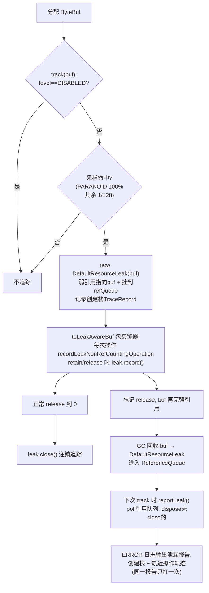

精妙之处：

1. **弱引用当哨兵**：`DefaultResourceLeak extends WeakReference`。只要 buf 被正确 release，代码会显式 `close()`（从 `allLeaks` 摘除）；反之 buf 被 GC 时 leak 对象进 `ReferenceQueue`——**"进了队列却没 close" = 泄漏**，零轮询成本。
2. **SIMPLE 只记创建点**就能回答"是谁创建了这个没释放的 buf"；ADVANCED 的 `AdvancedLeakAwareByteBuf` 在每个操作前 `leak.record()`（环形 TraceRecord 链，默认 `DEFAULT_RECORDS=4` 条 + TARGET_RECORDS），能回答"最后被谁摸过"。
3. **采样**使默认开销可忽略；`SimpleLeakAwareByteBuf` 与 `AdvancedLeakAwareByteBuf` 是两个装饰器，`AbstractByteBufAllocator#toLeakAwareBuffer` 按级别选择。
4. 排查时的用户 API：`buf.touch(hint)` 手动打标记（RecordContext），在泄漏报告中定位到具体业务路径。

---

## 9. 堆 vs 直接、池化 vs 非池化的选择

| 组合 | 分配释放 | I/O 适配 | 典型场景 |
|------|---------|---------|---------|
| 池化堆 | 线程缓存无锁复用 | 写 socket 前需拷到直接内存 | 业务内部消息传递 |
| **池化直接（默认）** | 无锁复用 + 堆外 | `nioBuffer()` 直接给 channel，**零拷贝** | 网络 I/O 路径 |
| 非池化直接 | `ByteBuffer.allocateDirect`（贵，Cleaner 回收） | 同上 | 大文件、低频大块 |
| 非池化堆 | `new byte[]`（最便宜，GC 管） | 需拷贝 | 测试、编码小数据（Unpooled 工具） |

堆外内存的代价与收益：省去一次堆→堆外拷贝（socket 写）、不受 GC 压缩移动（地址稳定，`hasMemoryAddress()` 可直接 Unsafe 访问），但分配昂贵（系统调用+内存映射）、必须手工管理生命周期——**这两条正是 Netty 建 arena 池和引用计数体系的根本原因**。

---

## 10. 设计精髓总结

1. **读写双索引消灭 flip**：把 ByteBuffer 最易错的模式切换问题转化为结构问题。
2. **模板方法 + 平台下沉**：`AbstractByteBuf` 只管索引和检查，字节操作全部是 `_get/_set` 原语，Unsafe/数组/ByteBuffer 三种后端在叶子类收口。
3. **引用计数是池化的前提**：`retain/release` + `deallocate()` 钩子让"释放"语义可编程（还池 vs 销毁）。奇偶编码 + xadd + 非volatile快路径是并发无锁化的教科书。
4. **jemalloc 三级流水线**：ThreadCache（无锁）→ Arena（分片降竞争）→ Chunk（run 分配 + 位图 + 使用率链），每一级的存在都对应一个具体的性能问题。
5. **run 管理取代二叉树**（4.1.52+）：`runsAvailMap` 让空闲块合并从 O(log n) 树操作变为 O(1) 哈希查邻居，是 Netty 跟随 jemalloc 4 的演进。
6. **零拷贝是体系而非单点**：slice/duplicate（视图）、CompositeByteBuf（逻辑拼接）、`nioBuffers()`（聚合写）、`wrappedBuffer`（包装数组）共同组成零拷贝工具箱。
7. **防御性设计**：泄漏检测用弱引用+引用队列把"忘记 release"从静默内存黑洞变成带创建栈的 ERROR 日志，且默认采样几乎零成本。
8. **对象池复用贯穿始终**：内存（arena）、Entry（Recycler）、ByteBuf 壳（Recycler）三层复用，高吞吐下的 GC 压力被系统性压制。

---

## 附：快问快答

**Q：ByteBuf 线程安全吗？**
默认不安全。索引是普通 int，设计假设是 EventLoop 串行访问。需要跨线程时自己加锁或用 `ReferenceCountUpdater` 保证的计数原子性（retain/release 是线程安全的，数据读写不是）。

**Q：`slice()` 出来的 buf 能活多久？**
只要父 buf 活着。父 buf release 到 0，切片即悬空。跨栈传递用 `retainedSlice()`。

**Q：为什么我的 Netty 直接内存一直涨？**
大概率是 PoolThreadCache 滞留（非泄漏）。可调 `io.netty.allocation.cacheTrimIntervalMillis`、看 `PooledByteBufAllocator.metric()`；若日志出现 `LEAK: ByteBuf.release() was not called` 才是真泄漏，按报告栈排查。

**Q：huge 分配（>16MB）走池吗？**
不走。`allocateHuge` 直接非池化分配，`unpooled=true`，release 时整体销毁。

**Q：`discardReadBytes` 为什么不推荐频繁调用？**
它是 memmove，数据越长越贵，且池化 buf 有更便宜的替代（直接还内存给池）。半包处理场景下 Netty 用 CompositeByteBuf/新分配代替了它。

**Q：4.1.65 与网上老文章的 PoolChunk 分析对不上？**
网上大量文章基于 ≤4.1.51 的 memoryMap 完全二叉树实现。4.1.52 起重写为 jemalloc 风格的 runsAvail/runsAvailMap，Tiny 级也被合并进 SizeClasses。读源码务必对版本。
