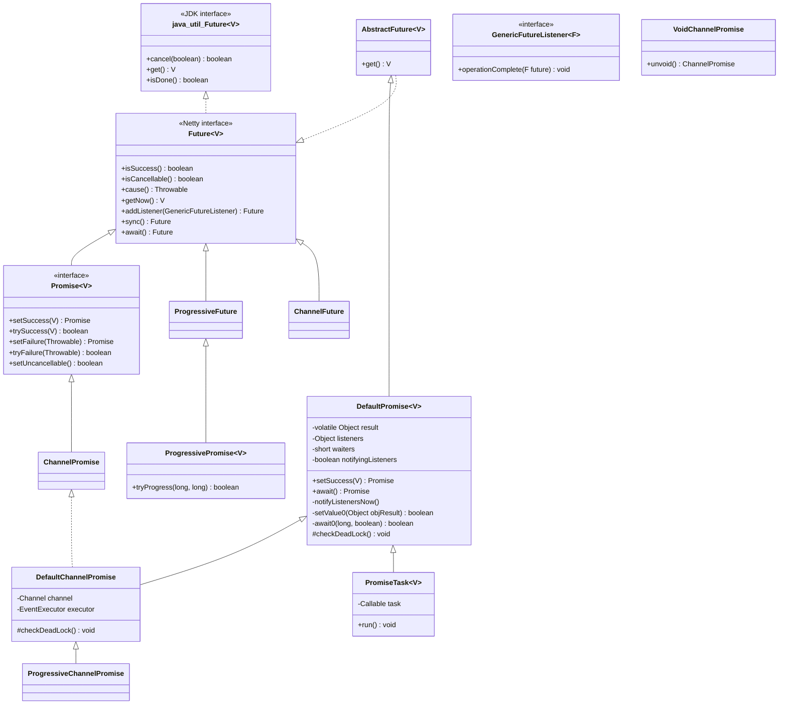
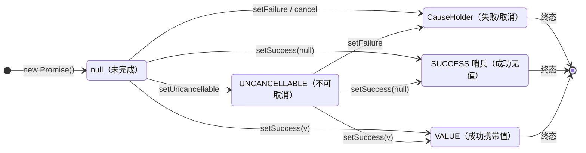
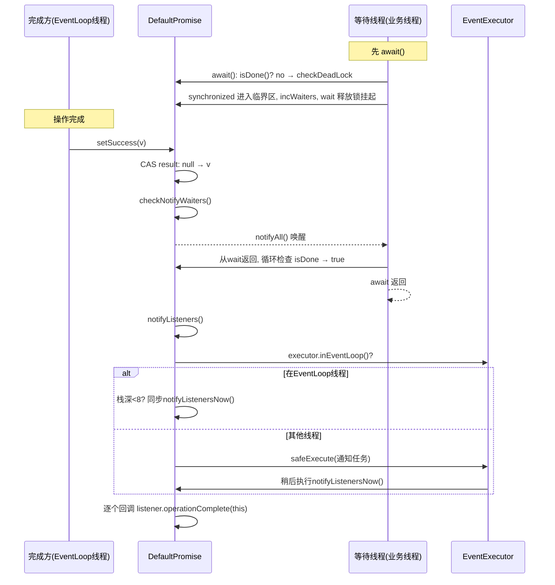
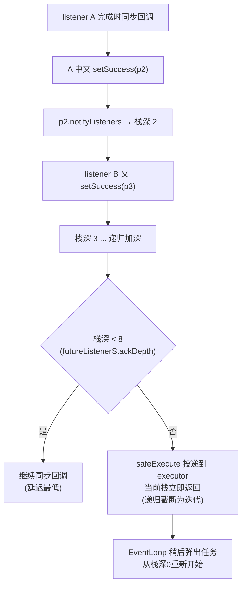
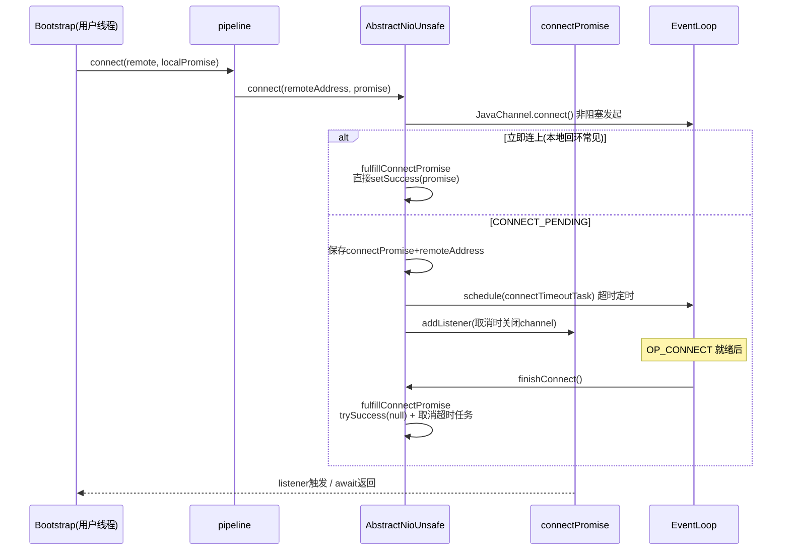

# Netty 源码剖析（三）：Future / Promise 异步体系

> 源码版本：Netty 4.1.65
> 涉及模块：`common/src/main/java/io/netty/util/concurrent/`（核心）、`transport/src/main/java/io/netty/channel/`（Channel 层应用）
> 涉及核心类：
> - `Future` / `Promise` / `GenericFutureListener` / `AbstractFuture`
> - `DefaultPromise`（**本文主角**）/ `DefaultFutureListeners` / `CompleteFuture` / `ImmediateEventExecutor`
> - `PromiseTask` / `ScheduledFutureTask` / `PromiseCombiner` / `PromiseNotifier`
> - `ChannelFuture` / `ChannelPromise` / `DefaultChannelPromise` / `VoidChannelPromise` / `ChannelFutureListener`

前置知识：`InternalThreadLocalMap`（见 01 篇）——Promise 的防栈溢出直接依赖它的 `futureListenerStackDepth` 字段直访。

---

## 1. 为什么不用 JDK 的 Future

`java.util.concurrent.Future` 的先天缺陷：

| 缺陷 | 说明 |
|------|------|
| 只能阻塞轮询 | `get()` 阻塞挂起线程；没有完成回调 |
| 无失败语义 | 失败只能靠 `get()` 抛 `ExecutionException` 获知，无法非阻塞查询 |
| 无取消区分 | 取消与失败混为一谈 |
| NIO 异步模型无法表达 | Netty 所有 I/O 操作（bind/connect/write/close）都是异步的，调用返回时操作尚未发生，结果必须由 EventLoop 线程稍后填充 |

Netty 的答案：**Future（读）+ Promise（写）+ Listener（回调）** 三件套。调用方拿到 Future 注册监听器；执行方（通常是 EventLoop）持有 Promise，操作完成时 `setSuccess/setFailure`，回调自动触发、等待者自动唤醒——**把"谁来填结果"和"谁来消费结果"从时间与线程两个维度解耦**。

---

## 2. 接口体系：读写分离的设计



职责划分（**生产者-消费者模式**）：

- **`Future<V>`**：只读视图。查询（`isSuccess/cause/getNow`）、等待（`await/sync`）、订阅（`addListener`）。消费者持有。
- **`Promise<V>`**：写视图。`setSuccess/setFailure/trySuccess/tryFailure/setUncancellable`。生产者持有（一般是 Netty 内部，用户不该手动 set 一个 ChannelPromise）。
- **`sync() vs await()`**：两者都阻塞等待完成，区别在**完成后**——`await` 只等不抛；`sync` 会把失败原因抛出（`rethrowIfFailed()`，`DefaultPromise.java:645-652`），且取消会抛 `CancellationException`。同步代码写 `sync()`，纯等待写 `await()`。
- **`setXxx vs tryXxx`**：promise 只能完成一次。`set` 二次调用抛 `IllegalStateException`（`DefaultPromise.java:96-99`）；`try` 静默返回 false——竞争完成（多个路径都可能完成同一个 promise）时用 `try`。

---

## 3. DefaultPromise：核心实现

### 3.1 字段与状态模型

```java
// DefaultPromise.java:39-68
private static final int MAX_LISTENER_STACK_DEPTH =
        Math.min(8, SystemPropertyUtil.getInt("io.netty.defaultPromise.maxListenerStackDepth", 8));

private static final AtomicReferenceFieldUpdater<DefaultPromise, Object> RESULT_UPDATER = ...;

private static final Object SUCCESS = new Object();          // 成功且无返回值
private static final Object UNCANCELLABLE = new Object();    // 不可取消态
private static final CauseHolder CANCELLATION_CAUSE_HOLDER = // 取消态的异常
        new CauseHolder(StacklessCancellationException.newInstance(...));

private volatile Object result;      // ★ 单字段承载全部状态（volatile + CAS）
private final EventExecutor executor;
private Object listeners;            // 单个listener 或 DefaultFutureListeners
private short waiters;               // await 中的等待线程数
private boolean notifyingListeners;  // 通知进行中标志
```

**一个 `volatile Object result` 字段编码全部状态**——这是 DefaultPromise 最核心的设计：



- 终态只有三种形态：`SUCCESS` / 业务值 / `CauseHolder`（包装失败异常；若内部是 `CancellationException` 即取消态，`isCancelled0`）
- `null → SUCCESS/VALUE/CAUSE` 用一次 CAS 完成，**完成动作本身无锁**
- `UNCANCELLABLE` 是个中间态：`setUncancellable()` 后 cancel 被拒绝，但仍可正常完成——用于"操作已经开始、结果未定、但绝不允许取消"的阶段（如 `ChannelOutboundBuffer.addFlush` 后的写操作）

### 3.2 完成：setSuccess / setFailure 全流程

```java
// DefaultPromise.java:604-621
private boolean setSuccess0(V result) {
    return setValue0(result == null ? SUCCESS : result);
}
private boolean setFailure0(Throwable cause) {
    return setValue0(new CauseHolder(checkNotNull(cause, "cause")));
}
private boolean setValue0(Object objResult) {
    if (RESULT_UPDATER.compareAndSet(this, null, objResult) ||
        RESULT_UPDATER.compareAndSet(this, UNCANCELLABLE, objResult)) {  // 中间态也允许完成
        if (checkNotifyWaiters()) {     // 有监听器才继续
            notifyListeners();
        }
        return true;
    }
    return false;   // 已是终态，完成失败
}

// DefaultPromise.java:627-632
private synchronized boolean checkNotifyWaiters() {
    if (waiters > 0) {
        notifyAll();        // 唤醒所有 await 的线程
    }
    return listeners != null;
}
```



三个值得咀嚼的细节：

1. **完成路径完全无锁**（CAS）+ **通知路径只在必要时进入锁**（`checkNotifyWaiters` 是 `synchronized`，但只在有线程等待时才竞争）。典型完成时既无 waiter 也无 listener，整个 setSuccess 就是一次 CAS，开销接近零。
2. `notifyAll()` 而不是 `notify()`：多个线程可以同时 await 同一个 promise，`notify` 可能唤醒错误的线程导致丢失唤醒。
3. `checkNotifyWaiters` 返回 `listeners != null`——**没有监听器就连通知流程都不进**，省一次 executor 判断。

### 3.3 等待：await 与防死锁

```java
// DefaultPromise.java:459-464
protected void checkDeadLock() {
    EventExecutor e = executor();
    if (e != null && e.inEventLoop()) {
        throw new BlockingOperationException(toString());
    }
}

// DefaultPromise.java:654-700（简化）
private boolean await0(long timeoutNanos, boolean interruptable) throws InterruptedException {
    if (isDone()) return true;
    if (timeoutNanos <= 0) return isDone();
    if (interruptable && Thread.interrupted()) throw new InterruptedException(toString());
    checkDeadLock();                                   // ★ 在EventLoop线程await直接抛异常
    long startTime = System.nanoTime();
    long waitTime = timeoutNanos;
    boolean interrupted = false;
    try {
        for (;;) {
            synchronized (this) {
                if (isDone()) return true;
                incWaiters();                          // 上限 Short.MAX_VALUE
                try {
                    wait(waitTime / 1000000, (int) (waitTime % 1000000));
                } catch (InterruptedException e) {
                    if (interruptable) throw e;        // await: 尊重中断
                    interrupted = true;                // awaitUninterruptibly: 只记录,继续等
                } finally {
                    decWaiters();
                }
            }
            if (isDone()) return true;
            waitTime = timeoutNanos - (System.nanoTime() - startTime);
            if (waitTime <= 0) return isDone();        // 超时重算，防虚假唤醒漏算时间
        }
    } finally {
        if (interrupted) Thread.currentThread().interrupt();  // 退出前补回中断标志
    }
}
```

并发设计要点：

- **waiters 计数**：`checkNotifyWaiters` 用它决定是否 `notifyAll`——完成方在没有任何等待者时不必争锁调用 notifyAll（waiters 的写都在 `synchronized(this)` 内，读写安全）。
- **checkDeadLock 防"自等"死锁**：在 EventLoop 线程里 `await()` 自己线程将来要完成的 promise，会让完成方永远没机会运行——**死锁且不可恢复**。Netty 直接抛 `BlockingOperationException` 快速失败。这是 Netty 对用户最重要的纪律约束："**永远不要在 EventLoop 里阻塞**"的代码化体现。
- **interruptable 双态**：`await()` 尊重中断；`awaitUninterruptibly()` 吞掉中断但**在 finally 里恢复中断标志位**——既不被中断打断，也不"吃掉"中断信号，这是并发编程的正确姿势。
- **虚假唤醒防护**：`wait()` 外面套 `for(;;) + isDone()` 循环；超时时间按 `System.nanoTime()` 基准重算，虚假唤醒不会延长总等待时间。

### 3.4 监听器：notifyListeners 与栈溢出保护（最精妙的部分）

监听器回调里经常会立刻完成另一个 promise（如链式 `thenCompose` 风格），那个 promise 的监听器又……**监听器通知是递归的**。Netty 用 FastThreadLocal 的栈深计数（见 01 篇）把递归深度封顶：

```java
// DefaultPromise.java:483-505
private void notifyListeners() {
    EventExecutor executor = executor();
    if (executor.inEventLoop()) {
        final InternalThreadLocalMap threadLocals = InternalThreadLocalMap.get();
        final int stackDepth = threadLocals.futureListenerStackDepth();
        if (stackDepth < MAX_LISTENER_STACK_DEPTH) {        // 深度<8：继续递归
            threadLocals.setFutureListenerStackDepth(stackDepth + 1);
            try {
                notifyListenersNow();                       // 同步（栈内）通知
            } finally {
                threadLocals.setFutureListenerStackDepth(stackDepth);  // 还原
            }
            return;
        }
    }
    // 深度超限 或 不在executor线程：投递为任务，递归变迭代
    safeExecute(executor, new Runnable() {
        @Override
        public void run() { notifyListenersNow(); }
    });
}
```



为什么不用队列把所有通知都异步化？——**性能**。浅层链式回调（最常见）同步执行零开销；只有深层链才付出一次任务投递的代价。`MAX_LISTENER_STACK_DEPTH` 可用 `-Dio.netty.defaultPromise.maxListenerStackDepth` 调整（上限 8）。

再看通知本体的"所有权交接"模式（`notifyListenersNow`，`DefaultPromise.java:537-565`）：

```java
private void notifyListenersNow() {
    Object listeners;
    synchronized (this) {
        if (notifyingListeners || this.listeners == null) return;  // 防重入
        notifyingListeners = true;
        listeners = this.listeners;
        this.listeners = null;                    // ★ 摘走监听器列表（所有权转移到局部变量）
    }
    for (;;) {                                    // 无锁遍历
        ...调用 operationComplete（无锁！）...
        synchronized (this) {
            if (this.listeners == null) {         // 期间又有人add？
                notifyingListeners = false;
                return;
            }
            listeners = this.listeners;           // 摘走新的一批，继续
            this.listeners = null;
        }
    }
}
```

- `notifyingListeners` 标志防止**同一线程重入**（监听器里再触发本 promise 的通知）导致双重通知。
- **锁内摘链、锁外回调**：回调执行时完全无锁——用户监听器里即使操作同一个 promise 也不会死锁。
- `for(;;)` 兜底：通知期间新 add 的监听器也会被通知（因为 promise 已完成，add 会直接触发通知，这里做的是不遗漏）。

### 3.5 监听器异常隔离

```java
// DefaultPromise.java:576-584
private static void notifyListener0(Future future, GenericFutureListener l) {
    try {
        l.operationComplete(future);
    } catch (Throwable t) {
        if (logger.isWarnEnabled()) {
            logger.warn("An exception was thrown by " + l.getClass().getName() + ".operationComplete()", t);
        }
    }
}
```

**单个监听器抛异常只 warn 日志，不影响其余监听器和 Promise 本身**——与 `ChannelPipeline` 的 fireExceptionCaught 不同，这里是终点（异常已无处再传播）。`safeExecute` 同理：executor 拒绝执行时只记 rejectedExecution 日志。

### 3.6 addListener 的时序二象性

```java
// addListener 逻辑（DefaultPromise.java，简化）
if (isDone()) {
    notifyListener(executor(), this, listener);   // 已完成：立刻通知（同样有栈深保护）
} else {
    synchronized (this) { addListener0(listener); }  // 未完成：挂链，等 setSuccess 触发
}
```

**同一个 listener 可能被在 EventLoop 线程同步调用，也可能在业务线程同步调用**（promise 已完成时，`addListener` 的调用线程就是执行线程）。因此监听器代码必须线程安全、且不能假设运行线程——这是 Netty 异步编程最容易踩坑的隐式契约。

---

## 4. 周边设施

### 4.1 DefaultFutureListeners：监听器存储的渐进优化

`listeners` 字段是 `Object`（`DefaultPromise.java:58`）：null→单个 listener 引用（多数 promise 只挂 1 个监听器，省掉集合开销）→ `DefaultFutureListeners`（≥2 个时升级为数组 + 按 generic 类型分桶，`notifyListeners0` 遍历）。**用多态字段做三级存储（无/单/多），是 Netty 对"多数场景只有一个监听器"的针对性优化**。

### 4.2 PromiseTask / ScheduledFutureTask：任务型 Promise

`SingleThreadEventExecutor.submit(callable)` 返回的 Future 就是 `PromiseTask`：

- 继承 `DefaultPromise` 并实现 `RunnableFuture`——**任务与结果是同一个对象**；
- `run()` 在 EventLoop 里执行 task 并 `setSuccess/setFailure`；
- 重写 `setSuccess` 等为 final/受限：**结果只能由任务本身填充**，外部不能篡改；
- `ScheduledFutureTask` 再加 `deadlineNanos`（小顶堆排序键，`compareTo` 按 deadline 再按任务序号）与 `periodNanos`（>0 固定速率 / <0 固定延迟，run 后重新入队）。

### 4.3 PromiseCombiner：多 Promise 聚合

（旧 `PromiseAggregator` 已废弃）"等这批操作都完成"：

```java
PromiseCombiner combiner = new PromiseCombiner(executor);
for (ChannelFuture f : futures) combiner.add(f);
combiner.finish(aggregatePromise);   // 全成功→aggregate成功；任一失败→失败(记第一个cause)
```

内部就是 `expectedCount/doneCount` 计数 + 每个子 future 挂监听器。`ChannelOutboundBuffer` 批量写、`writev` 的完成语义、`ChannelGroup` 广播都靠它。

### 4.4 PromiseNotifier：结果转发

`PromiseNotifier.cascade(...)` 把源 future 的结果**原样转发**给多个目标 promise（成功→成功、失败→失败、取消→取消）——构建"一个操作、多路通知"的标准件。

### 4.5 ProgressivePromise：进度

`ProgressivePromise` 增加 `setProgress(long progress, long total)`，写大文件时 `ChannelOutboundBuffer.progress` 会调用 `tryProgress` 触发 `operationProgressed`——Future 体系不止"完成通知"，还支持过程通知。

### 4.6 ImmediateEventExecutor：已完成值的执行策略

`ImmediateEventExecutor` 在**调用者线程直接 run**（嵌套调用则排队防递归），配合 `CompleteFuture` / `ImmediatePromise`（重写 `checkDeadLock` 放宽）服务"立即完成的 promise"场景，避免一次无意义的线程切换。

---

## 5. Channel 层：Promise 如何驱动网络编程

### 5.1 ChannelFuture / DefaultChannelPromise / VoidChannelPromise

- **`ChannelFuture`**：`Future<Void>` + `channel()`。Netty 的所有 I/O 操作都返回它。
- **`DefaultChannelPromise`**：持有 channel 引用；`executor()` 返回 `channel.eventLoop()`（通知一律发生在 channel 的 EventLoop 上——保证监听器与 handler 同线程，免加锁）；`checkDeadLock` 因此天然继承"不许在 EventLoop 里等"。
- **`VoidChannelPromise`**：性能特化——`ctx.writeAndFlush(msg)` 不带 listener 时传它：**不维护任何状态**，`setSuccess/setFailure` 空操作（失败时走 `pipeline.fireExceptionCaught` 上报），await/sync 直接抛异常。Netty 大量内部操作（connect 时 JavaChannel 的注册等）用这种"无人关心"的 promise 省掉 CAS 和监听器链。`unvoid()` 可升级为真 promise（用户后补 listener 时）。
- **`ChannelFutureListener` 内置件**：`CLOSE_ON_FAILURE`、`CLOSE`（写完关连接）、`ON_FAILURE`（记日志）——用一行 lambda 消灭最常见的样板代码。

### 5.2 连接流程中的 Promise（以 AbstractNioUnsafe.connect 为例）



细节体现的通用模式：

- **promise 由发起方创建、由 EventLoop 线程完成**——异步结果的"单写者"是 EventLoop；
- `trySuccess` 而非 `setSuccess`：`fulfillConnectPromise` 可能与超时任务竞争完成，静默认输避免异常；
- 超时路径 `promise.tryFailure(ConnectTimeoutException)` + 关 channel，双向竞争只有一方生效。

### 5.3 写路径中的 Promise（ChannelOutboundBuffer）

`write(msg, promise)` 时 msg 连同 promise 入队（`addMessage`）；`flush` 时 `addFlush` 把 promise **置为不可取消**（UNCANCELLABLE 态的实际用途——数据已经在发送队列里，取消没意义了）；真正写进 socket 后 `remove()` → `safeSuccess(promise)`，写失败 `remove(cause)` → `safeFail`。批量写时按进度 `progress()` 推进 ProgressivePromise。

---

## 6. 与其他异步方案的对比

| 维度 | Netty Future/Promise | CompletableFuture | JDK Future |
|------|---------------------|-------------------|-----------|
| 通知模型 | **单次回调**（promise 只能完成一次） | 多段 then 链式组合 | 阻塞 get |
| 执行线程控制 | 明确绑定 EventExecutor，**回调与 I/O 同线程** | 依赖 thenApply 等的 executor 参数，易混淆 | 无 |
| 失败/取消语义 | cause + CancellationException + isCancellable + UNCANCELLABLE 中间态 | exceptionally/timeoutAPI | 弱 |
| 防死锁 | checkDeadLock 主动抛异常 | 无 | 无 |
| 组合能力 | PromiseCombiner/Notifier（够用即可） | 极强（allOf/thenCombine...） | 无 |
| 定位 | **I/O 结果通知**，刻意保持简单 | 通用异步编程 | 最小可用 |

Netty 刻意不做"异步流式编程库"：Promise 的回调只有一次、组合能力最少——因为它的场景是网络操作结果通知，简单性和可预测性（线程、时序、异常路径）优先。

---

## 7. 设计精髓总结

1. **读写接口分离**：`Future`（消费者只读）/ `Promise`（生产者只写），一个对象两种视图，权限即文档。
2. **单字段状态机**：`volatile Object result` + 哨兵（SUCCESS/UNCANCELLABLE/CauseHolder）+ 两次 CAS 兜底，完成动作零锁、零分配。
3. **通知的三级策略**：无锁路径（无listener）→ 栈内同步递归（≤8 层，FastThreadLocal 计数封顶）→ 投递 executor 截断递归。性能优先，安全兜底。
4. **锁内摘链、锁外回调**：`notifyingListeners` + 局部变量接管 + for(;;) 收尾，回调期间无锁、无死锁、无遗漏。
5. **快速失败的纪律约束**：`checkDeadLock` 把"在 EventLoop 里阻塞等待"从线上事故变成开发期异常。
6. **正确的中断语义**：`awaitUninterruptibly` 吞中断但 finally 恢复标志位；`waiters` 计数让无等待者时完成方免争锁。
7. **特化无处不在**：VoidChannelPromise（无人关心→零状态）、listeners 单/多态字段（多数只挂一个）、ImmediateEventExecutor（已完成→不切换线程）。
8. **与 EventLoop 的强绑定**：所有通知收敛到 channel 的 EventLoop 执行，使监听器与 handler 共享单线程内存可见性——整个 Netty 无锁架构的地基之一。

---

## 附：快问快答

**Q：`sync()` 和 `await()` 选哪个？**
需要感知失败并中止流程用 `sync()`（失败抛异常）；只等完成（比如在测试里）用 `await()`。两者在 EventLoop 线程里都会抛 `BlockingOperationException`。

**Q：listener 到底在哪个线程执行？**
promise 已完成时：**调用 addListener 的线程**立即执行；未完成时：**完成 promise 时的线程若在 EventLoop 内则同步执行，否则投递到 promise 绑定的 executor**。监听器代码必须对线程无假设。

**Q：promise 完成两次会怎样？**
`setSuccess` 第二次抛 `IllegalStateException`；`trySuccess` 返回 false 静默。竞争完成场景（超时 vs 真正完成）必须用 try 版本。

**Q：为什么 promise 不支持链式 then？**
设计取舍。Netty 需要"一次完成、线程确定"的 I/O 通知原语，组合逻辑交给上层（或用 PromiseCombiner）。要链式组合时通常已经该换 CompletableFuture/响应式库了。

**Q：监听器里抛异常会怎样？**
被 `notifyListener0` 捕获，warn 日志，其余监听器照常执行——不会传播，也不会影响 promise 状态。

**Q：`setUncancellable` 是干嘛的？**
把 promise 锁进"不可取消但未完成"的中间态（flush 后的写请求）。之后 `cancel()` 返回 false，但仍可正常 set 成功/失败。
