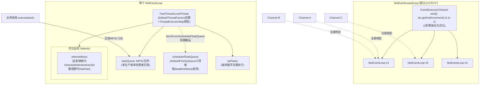
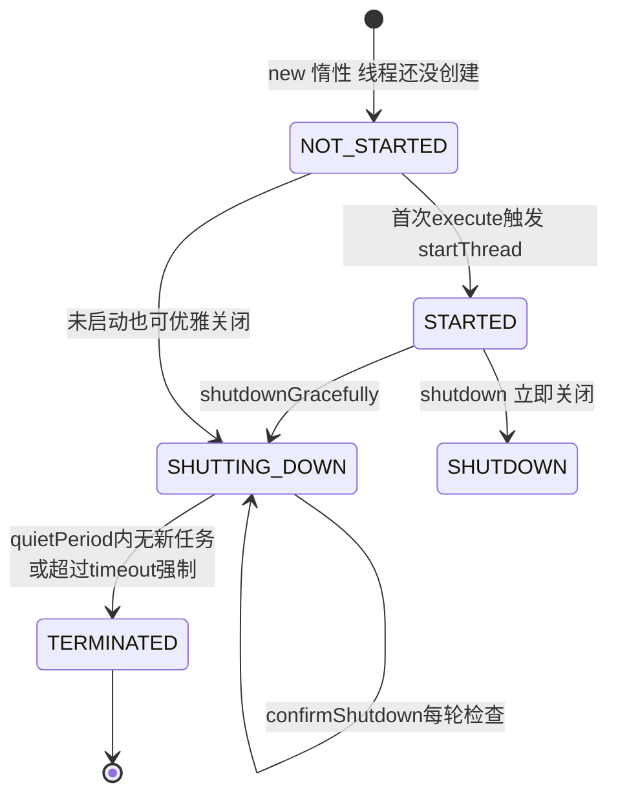
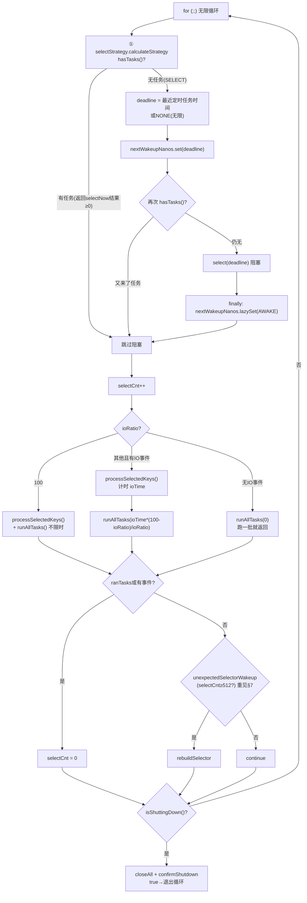
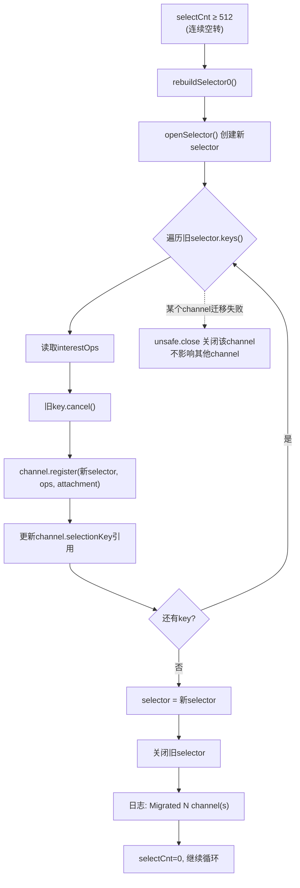
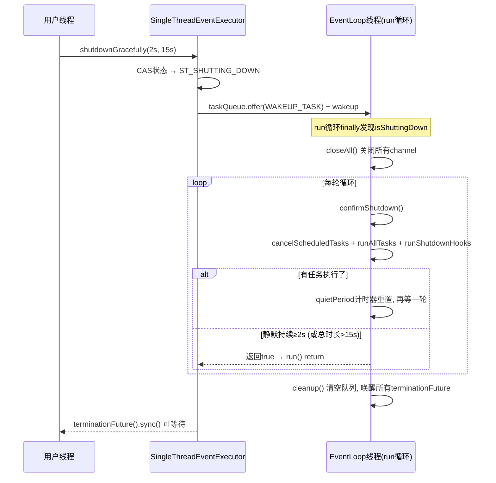

# Netty 源码剖析（四）：NioEventLoop 事件循环

> 源码版本：Netty 4.1.65
> 涉及核心类：
> - `transport/.../nio/NioEventLoop.java`（主循环、selector 优化、空轮询修复）
> - `transport/.../nio/NioEventLoopGroup.java`
> - `common/.../concurrent/SingleThreadEventExecutor.java`（状态机、任务队列、生命周期）
> - `common/.../concurrent/SingleThreadEventLoop.java`（tailTasks）
> - `common/.../concurrent/MultithreadEventExecutorGroup.java`、`DefaultEventExecutorChooserFactory`
> - `common/.../concurrent/ThreadExecutorMap`、`DefaultThreadFactory`
> - `transport/.../SelectedSelectionKeySet` / `NioTask`

前置知识：本文是系列前三篇的总装——EventLoop 线程就是 `FastThreadLocalThread`（01 篇），任务回调靠 Future/Promise（03 篇），而 EventLoop 的存在理由之一就是让 ByteBuf 无锁化（02 篇）。

---

## 1. NioEventLoop 是什么

**一个线程 + 一个 Selector + 两个任务队列**，串行地做两类事：

1. **I/O 事件**：selector 轮询就绪的 channel（accept/read/write/connect），分发给对应 `Unsafe` 处理；
2. **普通任务**：任何线程通过 `execute()` 提交的任务（包括定时任务、Promise 监听器通知、用户自定义任务）。

它同时是 `EventLoop`（channel 注册到它）和 `EventExecutor`（任务提交给它）。**Netty 无锁架构的根基**：同一个 channel 的所有操作都在其绑定的唯一 EventLoop 线程上串行执行，因此 handler 里的状态变量不需要任何同步。

---

## 2. 整体架构



类层次：

```
EventExecutorGroup (接口, 管理children/chooser/next())
  └─ MultithreadEventExecutorGroup (children数组+chooser)
       └─ MultithreadEventLoopGroup (register(Channel) → next().register)
            └─ NioEventLoopGroup (newChild → NioEventLoop)

EventExecutor (接口) ─ ExecutorService ─ Executor
  └─ AbstractScheduledEventExecutor (定时任务: scheduledTaskQueue小顶堆)
       └─ SingleThreadEventExecutor (单线程状态机+taskQueue)
            └─ SingleThreadEventLoop (tailTasks, executeAfterEventLoopIteration)
                 └─ NioEventLoop (selector + run()主循环)
```

三个关键绑定关系：

- **线程**：`ThreadPerTaskExecutor` + `DefaultThreadFactory` → 每个 EventLoop 惰性启动一个 `FastThreadLocalThread`（`DefaultThreadFactory.java:122`：`new FastThreadLocalThread(threadGroup, r, name)`），任务经 `FastThreadLocalRunnable.wrap` 包装（线程退出时 `removeAll()`，见 01 篇）。
- **ThreadExecutorMap**：任务提交时包装一层 `setCurrentEventExecutor(eventLoop)`（FastThreadLocal），使 EventLoop 线程内 `currentExecutor()` 可查——供 `PoolThreadCache` 的定时 trim 注册定时任务用（02 篇）。
- **Channel ↔ EventLoop**：一个 EventLoop 服务多个 channel；一个 channel 终生只属于一个 EventLoop。

---

## 3. Group 与Chooser：任务如何分配

```java
// DefaultEventExecutorChooserFactory.java:33-40
public EventExecutorChooser newChooser(EventExecutor[] executors) {
    if (isPowerOfTwo(executors.length)) {
        return new PowerOfTwoEventExecutorChooser(executors);   // 按位与
    } else {
        return new GenericEventExecutorChooser(executors);      // 取模
    }
}

// 2的幂：getAndIncrement & (n-1)
// 非2的幂：Math.abs(idx.getAndIncrement() % n)
```

老生常谈但值得注意的细节：线程数是 2 的幂时用**按位与**代替取模（省一次 idiv 指令）。`MultithreadEventExecutorGroup` 构造时逐个 `newChild` 创建 children，任何一个失败会把已创建的全部 `shutdownGracefully` 并等待终止（构造失败不留孤儿线程）。

`NioEventLoopGroup` 默认线程数 = `2 * CPU核数`（`MultithreadEventLoopGroup.DEFAULT_EVENT_LOOP_THREADS`）。

---

## 4. SingleThreadEventExecutor：单线程执行器骨架

### 4.1 状态机

```java
// SingleThreadEventExecutor.java:58-62
private static final int ST_NOT_STARTED = 1;
private static final int ST_STARTED = 2;
private static final int ST_SHUTTING_DOWN = 3;
private static final int ST_SHUTDOWN = 4;
private static final int ST_TERMINATED = 5;
```



**惰性启动**：构造 EventLoopGroup 并不会创建线程。`startThread()`（:942）只有第一次有任务提交（通常是第一个 channel 注册）时才 CAS `ST_NOT_STARTED→ST_STARTED` 并 `doStartThread()`——省掉空转线程。

### 4.2 execute：任务如何进入循环

```java
// SingleThreadEventExecutor.java:815-851（简化）
public void execute(Runnable task) {
    execute(task, !(task instanceof LazyRunnable) && wakesUpForTask(task));
}
private void execute(Runnable task, boolean immediate) {
    boolean inEventLoop = inEventLoop();
    if (inEventLoop) {
        addTask(task);                      // 自己线程: 直接入队, 不唤醒(反正马上会跑)
    } else {
        addTask(task);                      // ★ MPSC队列: 多线程无锁offer
        startThread();                      // 惰性启动
        if (isShutdown()) { ... remove + reject ... }   // 与关闭竞争: 回滚任务
    }
    if (!addTaskWakesUp && immediate) {
        wakeup(inEventLoop);                // 唤醒可能在select()阻塞的线程
    }
}
```

**任务队列是 MPSC**（`NioEventLoop.java:273-280`，覆盖了父类默认的 LinkedBlockingQueue）：

```java
// NioEventLoop.java:279-280
return maxPendingTasks == Integer.MAX_VALUE ? PlatformDependent.<Runnable>newMpscQueue()
        : PlatformDependent.<Runnable>newMpscQueue(maxPendingTasks);
```

- **M**ulti **P**roducer **S**ingle **C**onsumer：任意线程 offer（CAS 无锁），只有 EventLoop 线程 poll。单消费者的假设使队列实现比通用并发队列（如 LinkedBlockingQueue 的双锁）轻得多。
- 每个任务入队前后还要经过 `ThreadExecutorMap.apply` 包装，绑定 currentExecutor。

**`immediate` 的精妙之处**：普通任务入队必须唤醒（否则 select 阻塞中任务延迟执行）；但有些任务"入队即表示马上会自己醒来"（LazyRunnable，如定时任务搬运到普通队列后马上有 select 唤醒机制），此时省掉一次昂贵的 `selector.wakeup()` 系统调用。

### 4.3 runAllTasks：64 的秘密

主循环里执行任务有两个版本：

- `runAllTasks()`（ioRatio=100 时）：`do { fetchFromScheduledTaskQueue(); } while(!fetchedAll)` 把到期定时任务全部搬进 taskQueue 一次跑光——**不设时间上限**（适合收尾阶段）。
- `runAllTasks(timeoutNanos)`（ioRatio<100 时）：

```java
// SingleThreadEventExecutor.java:460-495（核心片段）
final long deadline = timeoutNanos > 0 ? nanoTime() + timeoutNanos : 0;
long runTasks = 0;
for (;;) {
    safeExecute(task);
    runTasks++;
    // 每64个任务才检查一次超时
    if ((runTasks & 0x3F) == 0) {
        lastExecutionTime = nanoTime();
        if (lastExecutionTime >= deadline) break;
    }
    task = pollTask();
    if (task == null) break;
}
```

`System.nanoTime()` 是一次系统调用级别的开销，**每执行 64 个任务才校验一次 deadline**——在"频繁检查保响应"与"计时开销"间取的折中常数。

`tailTasks`（`SingleThreadEventLoop`）：`afterRunningAllTasks()` 钩子在每轮任务批次结束后执行，供 `executeAfterEventLoopIteration(task)` 使用——"本轮循环收尾时务必执行一次"的钩子（如写任务的 flush 收尾、`FastThreadLocal.removeAll` 的兜底场景）。

---

## 5. run() 主循环：NioEventLoop 的心脏

```java
// NioEventLoop.java:435-528（逐段解析版）
@Override
protected void run() {
    int selectCnt = 0;                          // 空轮询计数
    for (;;) {
        try {
            int strategy;
            try {
                // ① 决策: 有任务就selectNow(非阻塞), 没有就准备阻塞select
                strategy = selectStrategy.calculateStrategy(selectNowSupplier, hasTasks());
                switch (strategy) {
                case SelectStrategy.CONTINUE: continue;
                case SelectStrategy.SELECT:
                    // ② 最长可睡到"最近一个定时任务的deadline"
                    long curDeadlineNanos = nextScheduledTaskDeadlineNanos();
                    if (curDeadlineNanos == -1L) curDeadlineNanos = NONE;  // 无定时任务→可无限睡
                    nextWakeupNanos.set(curDeadlineNanos);
                    try {
                        if (!hasTasks()) {       // ★ 二次检查: set之后可能刚来了任务
                            strategy = select(curDeadlineNanos);
                        }
                    } finally {
                        nextWakeupNanos.lazySet(AWAKE);   // 醒了(不用volatile写,见§6)
                    }
                }
            } catch (IOException e) {
                rebuildSelector0();              // selector坏了: 重建
                selectCnt = 0;
                handleLoopException(e);
                continue;
            }

            selectCnt++;
            cancelledKeys = 0;
            needsToSelectAgain = false;
            final int ioRatio = this.ioRatio;
            boolean ranTasks;

            // ③ I/O 与任务的时间分配
            if (ioRatio == 100) {
                try {
                    if (strategy > 0) processSelectedKeys();
                } finally {
                    ranTasks = runAllTasks();    // I/O不限时, 任务也跑光
                }
            } else if (strategy > 0) {
                final long ioStartTime = System.nanoTime();
                try {
                    processSelectedKeys();
                } finally {
                    final long ioTime = System.nanoTime() - ioStartTime;
                    // 任务预算 = I/O耗时 × (100-ioRatio)/ioRatio
                    ranTasks = runAllTasks(ioTime * (100 - ioRatio) / ioRatio);
                }
            } else {
                ranTasks = runAllTasks(0);       // 无I/O事件: 只跑一个批次的任务(不阻塞)
            }

            // ④ 空轮询判定
            if (ranTasks || strategy > 0) {
                selectCnt = 0;                   // 干了活, 正常
            } else if (unexpectedSelectorWakeup(selectCnt)) {  // 详见§7
                selectCnt = 0;
            }
        } catch (CancelledKeyException e) { /* JDK已知问题, 忽略 */ }
        catch (Error e) { throw (Error) e; }
        catch (Throwable t) { handleLoopException(t); }   // 循环不能死: 其他异常只记日志
        finally {
            // ⑤ 关闭检查: 每轮都看
            if (isShuttingDown()) {
                closeAll();                      // 关闭所有channel
                if (confirmShutdown()) {
                    return;                      // 真正退出循环
                }
            }
        }
    }
}
```



主循环的**鲁棒性设计**值得单独强调：

- `handleLoopException`：**任何业务层异常都不允许杀死事件循环**——循环死了整个端口上的所有 channel 全部失联。只有 `Error` 重新抛出。
- `CancelledKeyException` 单独捕获忽略（JDK selector 的已知怪癖）。
- finally 里每轮检查关闭——`shutdownGracefully` 不直接停线程，而是靠循环自然走到这里配合 `confirmShutdown` 收尾。

---

## 6. 阻塞、唤醒与 nextWakeupNanos

```java
// NioEventLoop.java
private static final long AWAKE = -1L;             // 当前醒着
private static final long NONE = Long.MAX_VALUE;   // 无定时任务
private final AtomicLong nextWakeupNanos = new AtomicLong(AWAKE);

private int select(long deadlineNanos) throws IOException {
    if (deadlineNanos == NONE) {
        return selector.select();                   // 无限阻塞
    }
    long timeoutMillis = deadlineToDelayNanos(deadlineNanos + 995000L) / 1000000L;
    // +995us: 向上取整补偿, 避免任务差1ms没到就白醒一次
    return timeoutMillis <= 0 ? selector.selectNow() : selector.select(timeoutMillis);
}

@Override
protected void wakeup(boolean inEventLoop) {
    if (!inEventLoop && nextWakeupNanos.getAndSet(AWAKE) != AWAKE) {
        selector.wakeup();    // 真正的系统调用, 仅当确实在睡才做
    }
}
```

 wakeup 的竞态分析（这是理解主循环最烧脑的部分）：

- **睡的一方**：`nextWakeupNanos.set(deadline)` → `hasTasks()` 再查 → `select()`；
- **叫醒的一方**：入队后 `wakeup()`：`getAndSet(AWAKE)` 若旧值已是 AWAKE（醒着/已有人叫了）就**跳过 wakeup 系统调用**。

关键场景——**任务恰好在"set之后、select之前"入队**：此时 `hasTasks()` 二次检查会捕获它（不进 select）；若恰在二次检查之后、`selector.select()` 之前入队，wakeup 方的 `getAndSet(AWAKE)` 拿到的是 deadline（非 AWAKE），会执行 `selector.wakeup()`——JDK 保证 select 调用期间到达的 wakeup 不会丢失。`finally` 中的 `lazySet(AWAKE)` 用普通写收尾，省掉一次 volatile 写的内存屏障。

`selector.wakeup()` 是一次 pipe 写系统调用，成本不可忽视——整段设计（二次检查 + AWAKE 哨兵 + lazySet + LazyRunnable 跳过唤醒）全部是为了**少调它**。

---

## 7. Selector 优化与 epoll 空轮询修复

### 7.1 openSelector：偷天换日的 selectedKeys

JDK `Selector.selectedKeys()` 返回 `HashSet`——**每次 select 就绪的 key 要先散列进 HashSet，处理时再走迭代器**。Netty 在 `openSelector()` 里用反射（Java9+ 走 Unsafe 直接改字段偏移）把 `sun.nio.ch.SelectorImpl` 的 `selectedKeys` / `publicSelectedKeys` 字段**替换成自己的 `SelectedSelectionKeySet`**：

- 底层是裸 `SelectionKey[]` 数组 + size，add 就是 `keys[size++] = k`（无散列、无装箱）；
- 遍历就是下标循环（`processSelectedKeysOptimized`，:645），无迭代器分配。

失败安全：任何反射异常都静默降级回 JDK 原生 Set（`processSelectedKeysPlain`），只是慢一点而已。可用 `-Dio.netty.noKeySetOptimization=true` 强制禁用。

### 7.2 processSelectedKeys：就绪事件分发

```java
// NioEventLoop.java:645-664（简化）
private void processSelectedKeysOptimized() {
    for (int i = 0; i < selectedKeys.size; ++i) {
        final SelectionKey k = selectedKeys.keys[i];
        selectedKeys.keys[i] = null;          // 立即置null: 防内存滞留+防重复处理
        final Object a = k.attachment();      // 注册时attach的channel自身
        if (a instanceof AbstractNioChannel) {
            processSelectedKey(k, (AbstractNioChannel) a);
        } else {
            processSelectedKey(k, (NioTask<SelectableChannel>) a);  // 原生channel也能挂进来
        }
        if (needsToSelectAgain) {             // 大量key被cancel后
            selectedKeys.reset(i + 1);
            selectAgain();                    // 清空并重新selectNow
            i = -1;                           // 从头遍历新数组
        }
    }
}

// NioEventLoop.java:673-（核心分发）
private void processSelectedKey(SelectionKey k, AbstractNioChannel ch) {
    final AbstractNioChannel.NioUnsafe unsafe = ch.unsafe();
    if (!k.isValid()) {
        unsafe.close(unsafe.voidPromise());   // key失效 → 关channel
        return;
    }
    int readyOps = k.readyOps();
    if ((readyOps & OP_CONNECT) != 0) {        // ① 连接完成: 先关掉OP_CONNECT再finishConnect
        int ops = k.interestOps();
        k.interestOps(ops & ~OP_CONNECT);
        unsafe.finishConnect();                // → 完成03篇讲的connectPromise
    }
    if ((readyOps & OP_WRITE) != 0) {          // ② socket可写: 冲刷发送缓冲
        ch.unsafe().forceFlush();
    }
    if ((readyOps & (OP_READ | OP_ACCEPT)) != 0 || readyOps == 0) {
        unsafe.read();                         // ③ 读/accept; readyOps==0是JDK bug兜底
    }
}
```

事件 → Unsafe → Pipeline 的三段式：`unsafe.read()` 在 `NioByteUnsafe` 里读 ByteBuf（`RecvByteBufAllocator` 决定分配多大）→ `pipeline.fireChannelRead(byteBuf)` 逐个 handler 传播；`NioMessageUnsafe`（服务端）则 `accept()` 出新 `SocketChannel` → fireChannelRead，由 `ServerBootstrapAcceptor` 注册到 worker group 的 EventLoop。

`needsToSelectAgain`：当同一轮处理中 cancel 的 key 数超过 `CLEANUP_INTERVAL=256`（`selectAgain()` 中设置），说明 selector 内部积累了大量死 key，直接清空重来一次。

### 7.3 epoll 空轮询 bug：检测与重建

**bug 现象**：Linux 部分 JDK/内核组合上，`selector.select()` 在无任何就绪事件时也立即返回 0 → 主循环全速空转 → CPU 100%。

**Netty 的修复 = 检测 + 换新**：

```java
// NioEventLoop.java:541-（检测）
private boolean unexpectedSelectorWakeup(int selectCnt) {
    if (Thread.interrupted()) {
        return true;                            // 是中断导致的, 修一下标志位
    }
    if (SELECTOR_AUTO_REBUILD_THRESHOLD > 0 &&
            selectCnt >= SELECTOR_AUTO_REBUILD_THRESHOLD) {   // 默认512
        logger.warn("Selector.select() returned prematurely {} times in a row; rebuilding Selector {}.",
                selectCnt, selector);
        rebuildSelector();
        return true;
    }
    return false;
}
```

判定标准：**连续 512 次 select 既无就绪事件、又没执行任何任务**（`ranTasks || strategy > 0` 都不满足时 selectCnt 才会累积）——正常负载下不可能连续空转这么多次。



`rebuildSelector0` 的工程细节：迁移失败的 channel 单独关闭，**不连坐**；旧 selector 最后关闭；整个过程在 EventLoop 线程内同步完成，对上层完全透明（channel 感知不到 selector 被换了）。

### 7.4 register：channel 如何挂上 selector

```java
// AbstractNioChannel.doRegister()（核心）
for (;;) {
    try {
        selectionKey = javaChannel().register(eventLoop().unwrappedSelector(), 0, this);
        return;
    } catch (CancelledKeyException e) {
        if (!selected) {
            eventLoop().selectNow();    // 队列里有脏的cancelled key, 先清一次
            selected = true;
        } else {
            throw e;
        }
    }
}
```

注意**初始 interestOps=0**：注册进 selector 但什么都不关心，之后由 `AbstractUnsafe.register0` → `pipeline.fireChannelActive` → `channel.read()`（head context）→ `doBeginRead()` 再打开 `OP_READ/OP_ACCEPT`。这个两段式让"注册完成"和"开始读"之间能插入 pipeline 初始化。

---

## 8. 优雅关闭：shutdownGracefully 与 confirmShutdown

```java
// 默认参数: quietPeriod=2s, timeout=15s
group.shutdownGracefully();
```



**quietPeriod 的语义**：必须"连续 2 秒没有任何新任务"才允许关——如果期间又来了任务（说明还有人在用），计时重置。这是"排水"而不是"关闸"：先等水流干，最多等 15 秒兜底。

`confirmShutdown` 里的 `Thread.sleep(100)`（:780 附近）：静默期内的节流轮询——已经决定不关了，每 100ms 醒一次看看有没有新任务，避免 busy loop。

---

## 9. 定时任务：小顶堆与 deadline 驱动

- `scheduledTaskQueue` = `DefaultPriorityQueue`（小顶堆），按 `deadlineNanos` 排序（同 deadline 按任务序号）；
- **两队列合一**：主循环阻塞前用堆顶 `deadlineNanos` 算 select 超时；醒来后 `fetchFromScheduledTaskQueue()` 把**到期**的定时任务搬进 taskQueue 统一执行——定时任务最终也是普通任务，只是入队时间由 deadline 决定；
- `ScheduledFutureTask.run()`（:155-192）：如果还没到期（被提前搬运了）就 `scheduleFromEventLoop` 放回堆；周期任务跑完按 `periodNanos` 正/负重算 deadline（固定速率/固定延迟）后重新入堆；
- `nonWakeupRunnable` 优化：不是所有定时任务入队都需要唤醒 EventLoop——如果新任务的 deadline 比当前堆顶还晚，就不用叫醒（反正还会按时醒），省一次 wakeup 系统调用。

---

## 10. 设计精髓总结

1. **串行化换无锁**：一个 channel 一个线程，是整个 Netty 无锁体系的根。代价（单 channel 吞吐上限）与收益（所有 handler 状态免同步）在服务端高连接数场景下稳赚。
2. **MPSC 队列单消费者假设**：因为消费者永远只有 EventLoop 线程自己，队列可以做到比通用并发队列更轻。
3. **双重检查 + 哨兵省系统调用**：wakeup 的全套竞态设计（nextWakeupNanos 的 AWAKE/NONE、二次 hasTasks、lazySet、LazyRunnable）都是为省 `selector.wakeup()` 这一次 pipe 写。
4. **选择器优化敢用黑魔法但留退路**：反射替换 JDK 私有字段，失败静默降级——激进的性能优化配上保守的兼容策略。
5. **空轮询 bug 的"绕过"哲学**：Netty 修不了 JDK/内核，但能**检测**（512 次计数）并**换新**（无缝迁移 key），把第三方 bug 的伤害限制在一次重建的代价内。
6. **循环永不死**：run() 的异常防线层层设防，任何非 Error 都吞掉记日志继续转——事件循环的死等于服务死亡。
7. **时间预算与批处理常数**：ioRatio 切分 I/O 与任务时间、64 个任务查一次超时、100ms 节流轮询——全是"控制权粒度"的工程权衡。
8. **惰性无处不在**：线程惰性启动、selector 超时惰性由 deadline 决定、tailTasks 在循环收尾才跑。

---

## 附：快问快答

**Q：EventLoop 线程数设多少合适？**
纯 I/O 转发型（代理/网关）默认 2×CPU 通常偏多，可降到 CPU 数；有阻塞调用（DB 同步 SDK）时应把阻塞逻辑放进独立的 `DefaultEventExecutorGroup` 业务线程池（`pipeline.addLast(businessGroup, handler)`），绝不能塞进 EventLoop。

**Q：`execute()` 提交的任务什么时候执行？**
如果 EventLoop 正阻塞在 select，立刻被唤醒执行；否则在本轮 I/O 处理完后的任务阶段执行。**上限延迟由 ioRatio 决定**——I/O 洪峰时任务预算会被压缩。

**Q：ioRatio 调大调小意味着什么？**
调大（→100）：I/O 优先，任务可能饥饿；调小：任务响应更快，但吞吐下降。默认 50 是折中。

**Q：为什么 handler 里不能阻塞？**
EventLoop 线程阻塞 = 该 EventLoop 上**所有 channel** 的读写、所有定时任务、所有 Promise 完成全部冻结（还会触发 03 篇的 BlockingOperationException）。这是 Netty 第一铁律。

**Q：CPU 100% 且日志出现 "rebuilding Selector" 怎么办？**
就是命中了 epoll 空轮询 bug 的修复路径。检查是否踩到已知 JDK bug 组合；重建本身开销很小，属正常自愈。可调 `-Dio.netty.selectorAutoRebuildThreshold`。

**Q：shutdownGracefully 后新任务还能提交吗？**
不能，会走拒绝策略（默认抛 RejectedExecutionException；`RejectedExecutionHandlers.backoff` 可换成退避重试）。
