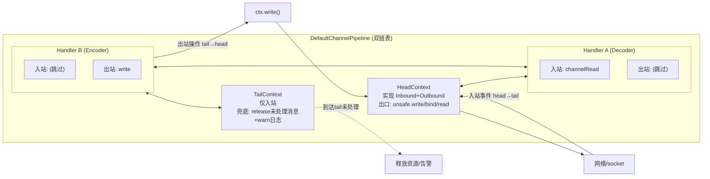
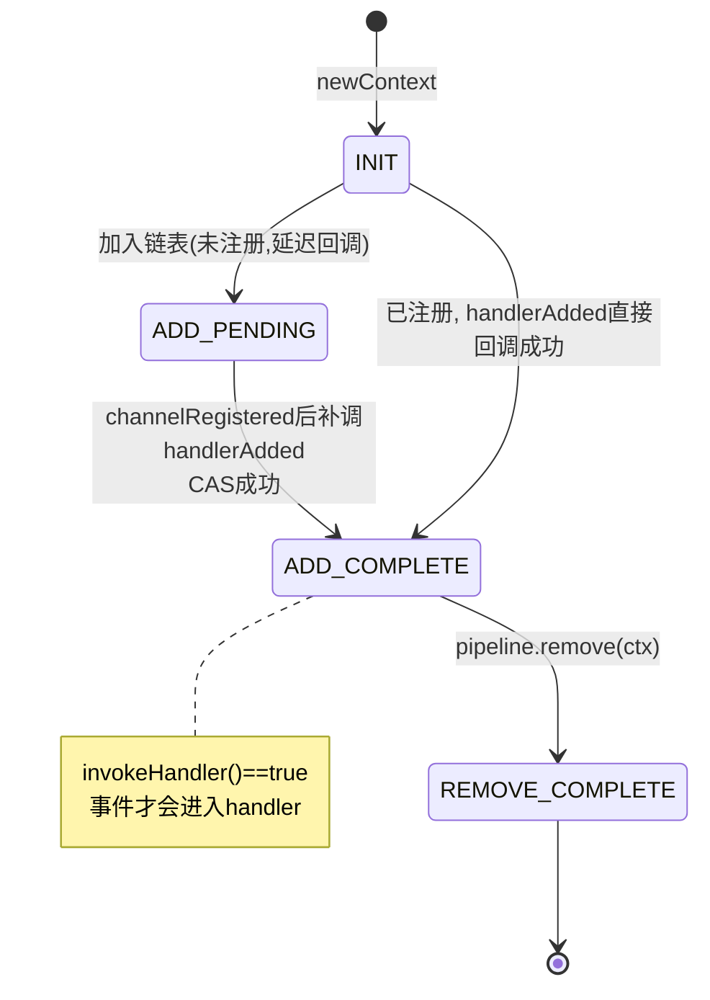
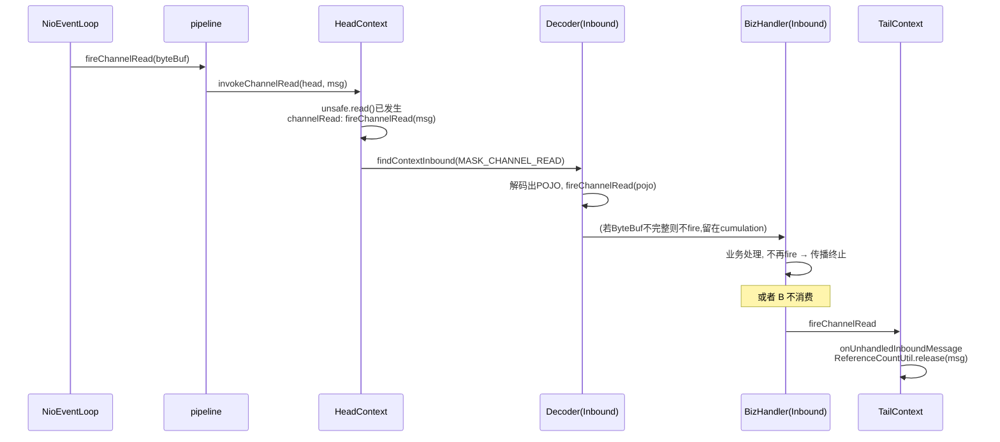
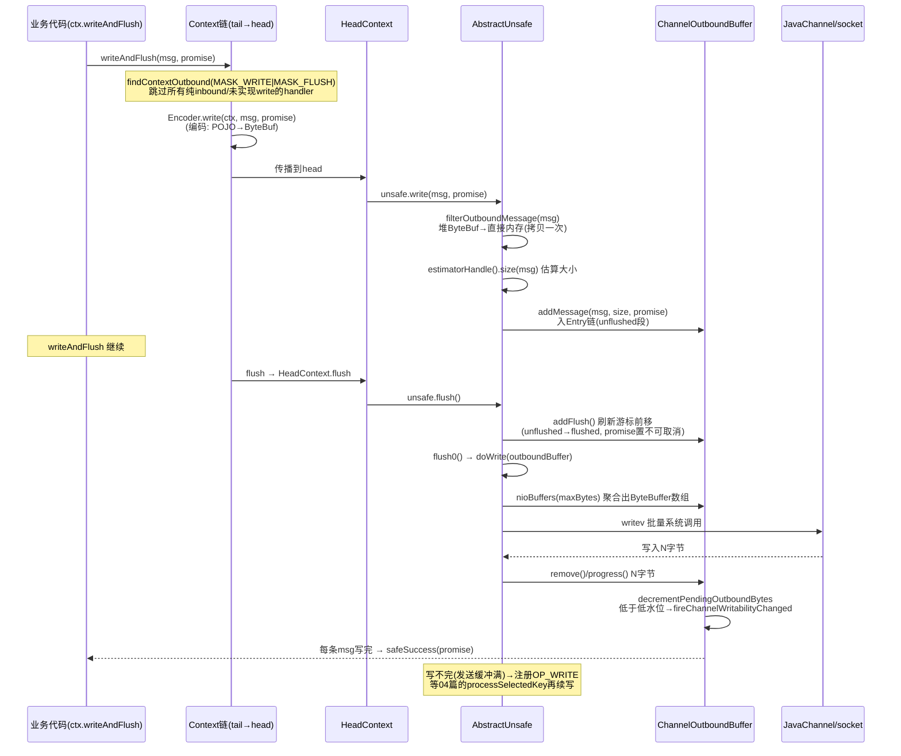

# Netty 源码剖析（五）：ChannelPipeline 与事件传播

> 源码版本：Netty 4.1.65
> 涉及核心类：
> - `transport/.../channel/ChannelPipeline.java`、`DefaultChannelPipeline.java`
> - `transport/.../channel/AbstractChannelHandlerContext.java`、`ChannelHandlerMask.java`
> - `transport/.../channel/ChannelOutboundBuffer.java`、`AbstractChannel.java`
> - `transport/.../channel/ChannelInitializer.java`、各 Adapter

前置知识：本文站在系列前四篇之上——事件传播的"线程"是 04 篇的 NioEventLoop，写路径的内存是 02 篇的 ByteBuf，`handlerSharableCache` 用的是 01 篇的 InternalThreadLocalMap，出站操作返回的是 03 篇的 ChannelPromise。Pipeline 是这些组件的总装配线。

---

## 1. Pipeline 是什么：责任链的双向变体

一个 `ChannelPipeline` 对应一个 `Channel`，是**双向链表结构的责任链**：

- **入站事件**（数据来了、连接活跃、异常）：从 **head → tail** 传播，由 `ChannelInboundHandler` 处理；
- **出站操作**（write/bind/connect/close）：从 **tail → head** 传播，由 `ChannelOutboundHandler` 处理，最终在 head 汇入 `Unsafe` 执行真正的 I/O。

这不是普通的过滤器链：**两个方向、两种 handler 类型、可跳过、可换线程、可动态增删节点**。Netty 的协议编解码（解码器看入站、编码器看出站）、SSL、压缩、日志等全部以 handler 形式插在这条链上，是 Netty 可扩展性的核心机制。



---

## 2. 数据结构：Context 包装的链表

### 2.1 为什么不直接链 handler

链表节点不是 `ChannelHandler` 而是 **`ChannelHandlerContext`**（`AbstractChannelHandlerContext`）。Context 封装了 handler 之外的一切基础设施：

```java
// AbstractChannelHandlerContext.java（关键字段）
volatile AbstractChannelHandlerContext next;    // 双链表
volatile AbstractChannelHandlerContext prev;
private final DefaultChannelPipeline pipeline;
final EventExecutor executor;                   // null → channel.eventLoop()
private final int executionMask;                // ★ 本handler处理哪些事件（位掩码）
private volatile int handlerState = INIT;       // 生命周期状态
```

好处：**链表操作、传播控制、线程绑定、生命周期管理全在 Context 层，handler 保持纯净的业务对象**；同一个 handler 实例（`@Sharable`）可以被多个 pipeline 复用，各自有独立的 Context。

### 2.2 Head 与 Tail

- **`HeadContext`**（`DefaultChannelPipeline.java:1305`）：同时实现入站/出站接口。出站方法全部一行直通 `unsafe`（`write → unsafe.write`、`bind → unsafe.bind`）；入站方法先 `ctx.fireXxx()` 向后传播，个别方法（`channelActive`、`channelReadComplete`、`channelRead`）额外做关键动作（见 §5.3）。
- **`TailContext`**（`:1245`）：只实现入站，是入站事件的**下水道**——所有到达 tail 仍未被消费的事件在这里兜底，`DefaultChannelPipeline` 为此提供了一组 `onUnhandledInboundXxx` 方法（`:1150-1215`）。

Tail 兜底的行为（都值得记住）：

| 未处理事件 | Tail 的处理 |
|-----------|------------|
| `channelRead` | `onUnhandledInboundMessage` → **`ReferenceCountUtil.release(msg)`**——没消费的 ByteBuf 必须释放，否则泄漏（02 篇的引用计数在此闭环） |
| `exceptionCaught` | warn 日志 *"the last handler in the pipeline did not handle the exception"*——生产上常见的"异常没人接"告警来源 |
| `userEventTriggered` | `onUnhandledInboundUserEventTriggered` → release（如果是 ReferenceCounted）+ debug 日志 |
| `channelActive/Inactive/ReadComplete...` | 仅 debug 日志，无副作用 |

### 2.3 addLast 的完整流程与延迟回调

```java
// DefaultChannelPipeline.java:940 附近（简化）
public final ChannelPipeline addLast(EventExecutorGroup group, String name, ChannelHandler handler) {
    final AbstractChannelHandlerContext newCtx;
    synchronized (this) {                          // ★ 链表修改全程持锁
        checkMultiplicity(handler);                // 非@Sharable的handler不允许重复add
        newCtx = newContext(group, filterName(name, handler), handler);
        addLast0(newCtx);                          // 纯指针操作挂到tail前
        if (!registered) {
            newCtx.invokeHandlerAddedCallback? no—>
            callHandlerCallbackLater(newCtx, true); // ★ 未注册: 排队, 等注册后补
            return this;
        }
        ...
    }
    callHandlerAdded0(newCtx);                     // 已注册: 立即回调 handlerAdded
    return this;
}
```

两个精妙点：

1. **`callHandlerCallbackLater`**（`:1120`）：channel 尚未注册到 EventLoop 时（Bootstrap 的 init 阶段就是如此），`handlerAdded` 回调被挂进 `pendingHandlerCallbackHead` 待办链，等 `channelRegistered` 事件到来时统一补发——**保证 handlerAdded 一定在 EventLoop 线程执行**，用户在 handlerAdded 里可以放心地做任何事（包括提交任务）。
2. **失败回滚**：`callHandlerAdded0` 若抛异常，节点自动从链表 `remove0` 摘除并 fireExceptionCaught——**半初始化的 handler 不会留在链上**。

### 2.4 handler 的线程绑定

`pipeline.addLast(EventExecutorGroup group, ...)` 可指定业务线程池：

```java
// DefaultChannelPipeline.java:123 — childExecutor
private EventExecutor childExecutor(EventExecutorGroup group) {
    // 相同 group 的 handler 固定绑定该 group 的同一个 child（Map<EventExecutorGroup, EventExecutor> 缓存）
    // 保证同组的多个 handler 在同一线程上按序执行
}
```

不指定则 `executor == null`，`executor()` 动态返回 `channel().eventLoop()`。这就是"把阻塞 handler 放进独立业务线程池"的原理——传播跨线程时靠 Context 的 `inEventLoop` 判断自动投递（§4.2）。

---

## 3. 事件掩码：传播路径的预计算优化

### 3.1 问题

一个 pipeline 上 10 个 handler，`fireChannelRead` 要逐个检查"这个 handler 关心 channelRead 吗？"——**反射 + 接口判断每次传播都做一遍**太贵。

### 3.2 方案：ChannelHandlerMask

`ChannelHandlerMask` 用**类级别的位掩码**预计算每个 handler 类关心的事件集合：

- 每种事件一个 bit：`MASK_CHANNEL_READ = 1<<5`、`MASK_WRITE`、`MASK_BIND`...（共约 20 个）；
- 掩码按 **handler 的 Class 缓存**在静态 Map 中（计算需反射扫描方法上的 `@Skip` 注解，只做一次）；
- **`@Skip` 注解标记"此方法只是透传，我没真正实现它"**——`ChannelInboundHandlerAdapter` 的所有默认方法都带 `@Skip`，所以纯透传的 adapter 掩码为 0，**整条传播路径直接跳过它**。

### 3.3 skipContext：跳过的精确语义

```java
// AbstractChannelHandlerContext.java:894（简化）
private static boolean skipContext(
        AbstractChannelHandlerContext ctx, EventExecutor currentExecutor, int mask, int onlyMask) {
    // ① 该handler不实现这类事件（纯inbound handler对出站事件掩码为0）→ 跳
    // ② handler实现该事件但方法带@Skip（只是adapter透传）→ 跳
    // ③ 但如果 handler 绑定了不同 executor：即使@Skip也不能跳——
    //    跨线程边界必须"落地"一次, 保证事件在被绑定的线程上有序传递
    return (ctx.executionMask & (onlyMask | mask)) == 0 ||
           (ctx.executor() == currentExecutor && (ctx.executionMask & mask) == 0);
}
```

第 ③ 条最容易被忽略：**掩码跳过只对"同线程链段"生效**。跨 executor 的节点是线程切换锚点，无论它是否关心该事件，事件都必须经过它走一遍 executor 派发，否则两个线程段上的事件顺序会乱。

`executionMask` 对 head/tail 也有特化：HeadContext 的掩码包含全部出站+若干入站事件，TailContext 是 `MASK_ONLY_INBOUND`——**连首尾节点的传播判断都掩码化了**。

---

## 4. 入站传播全流程

### 4.1 起点：EventLoop 调用 pipeline

04 篇的 `processSelectedKey` → `unsafe.read()` → 读出 ByteBuf 后调用 `pipeline.fireChannelRead(byteBuf)`：

```java
// DefaultChannelPipeline.java
public final ChannelPipeline fireChannelRead(Object msg) {
    AbstractChannelHandlerContext.invokeChannelRead(head, msg);  // 从head开始
    return this;
}
```

### 4.2 传播循环：invokeXxx 三件套

```java
// AbstractChannelHandlerContext.java:361（静态方法, 由上一节点调用）
static void invokeChannelRead(final AbstractChannelHandlerContext next, Object msg) {
    final Object m = next.pipeline.touch(msg, next);      // 泄漏检测touch(02篇§8)
    EventExecutor executor = next.executor();
    if (executor.inEventLoop()) {
        next.invokeChannelRead(m);                        // ① 同线程: 直接调
    } else {
        executor.execute(new Runnable() {                 // ② 跨线程: 投递到目标executor
            public void run() { next.invokeChannelRead(m); }
        });
    }
}

private void invokeChannelRead(Object msg) {
    if (invokeHandler()) {                                // ③ handler状态检查
        try {
            ((ChannelInboundHandler) handler()).channelRead(this, msg);
        } catch (Throwable t) {
            invokeExceptionCaught(t);                     // ④ 异常转入站异常通道
        }
    } else {
        fireChannelRead(msg);                             // 状态未就绪: 直接透传
    }
}
```

**每一次"跳一个节点"都是：findContextInbound（掩码+跳过）→ executor 检查 → invokeHandler 检查 → 回调 → 异常转道**。四个环节缺一不可。

### 4.3 handlerState 状态机



`invokeHandler()`（`:962`）：只有 `ADD_COMPLETE`（或非 ordered 且 `ADD_PENDING`）才真正调用 handler 方法；否则**静默跳过继续传播**——保证"还没初始化完/已被移除"的 handler 不收到任何事件。这套状态机解决了"注册前添加的 handler 何时生效"的时序问题。



### 4.4 异常传播

handler 方法抛出任何 Throwable → `invokeExceptionCaught`：先检查该 handler 是否实现 `exceptionCaught`（掩码判断，adapter 的默认实现带 @Skip 会被跳过）→ 实现则调用，否则 `fireExceptionCaught` 继续向后传 → **一路传到 Tail 变成 warn 日志**。所以生产上必须自己在链上安排 `exceptionCaught` 处理器，否则异常静默地只剩一条日志。

---

## 5. 出站传播与写路径

### 5.1 出站方法的统一模板

`ctx.write / bind / connect / close / deregister` 全部遵循同一模板（以 write 为例，`AbstractChannelHandlerContext.java:696-804`）：

```java
void write(Object msg, boolean flush, ChannelPromise promise) {
    // promise 校验失败 → 释放msg并返回（防泄漏优先）
    final AbstractChannelHandlerContext next = findContextOutbound(flush ? (MASK_WRITE|MASK_FLUSH) : MASK_WRITE);
    final Object m = pipeline.touch(msg, next);
    EventExecutor executor = next.executor();
    if (executor.inEventLoop()) {
        next.invokeWriteAndFlush(m, promise);   // 或 invokeWrite
    } else {
        WriteTask task = WriteTask.newInstance(next, m, promise, flush);  // Recycler复用的任务
        if (!safeExecute(executor, task, promise, m, !flush)) {
            task.cancel();                      // 拒绝执行: 回收task+失败promise+释放msg
        }
    }
}
```

注意 `safeExecute` 失败时的三重清理：**释放 msg + setFailure(promise) + 回收 WriteTask**——出站路径的每一步都严格遵守"谁持有谁释放"。

### 5.2 写路径完整时序



### 5.3 写缓冲 ChannelOutboundBuffer 的结构

```java
// ChannelOutboundBuffer 关键字段
private Entry unflushedEntry;   // 未刷新链头(刚write进来)
private Entry flushedEntry;     // 已刷新待发送链头
private Entry tailEntry;        // 总链尾
private volatile long totalPendingSize;   // 所有Entry的pendingSize之和(水位计算)
private volatile boolean unfocusable? no—unwritable;

static final class Entry {      // 来自ObjectPool(Recycler)复用
    Entry next;
    Object msg;                // ByteBuf/ByteBufHolder
    ChannelPromise promise;    // 完成回调
    long total;                // 总字节数
    int pendingSize;           // CHANNEL_OUTBOUND_BUFFER_ENTRY_OVERHEAD + msg可读字节
    int count = -1;            // writev时该msg切出的ByteBuffer数
    boolean cancelled;
}
```

**一条链 + 两个游标**：write 只追加到 unflushed 段；flush 把整段划入 flushed 段并把 promise 置为 UNCANCELLABLE（03 篇中间态的实战）；doWrite 从 flushedEntry 开始逐条写，写完 `remove()`（成功，`safeSuccess`）或 `remove(cause)`（失败，`safeFail`）。

**水位线（背压机制）**：

- 默认低水位 32KB / 高水位 64KB（`WRITE_BUFFER_LOW/HIGH_WATER_MARK`）；
- `addMessage` 后 totalPendingSize 超过高水位 → `setUnwritable` → `pipeline.fireChannelWritabilityChanged`；
- 发送回落后低于低水位 → `setWritable` → 再次通知。

正确姿势：**高吞吐写场景必须监听 writability，`channel.isWritable()==false` 时停止写或降速**，否则 outboundBuffer 无上限膨胀直到 OOM。`totalPendingSize` 计入的 `pendingSize` 包含每条 Entry 的固定开销（`CHANNEL_OUTBOUND_BUFFER_ENTRY_OVERHEAD`，64B），不只是消息字节——防止海量小消息绕过水位检测。

**关闭时的承诺**：`close()` 会 `failFlushed` + `close(cause)`——所有未发送完成的 promise 一律 `safeFail`，绝不悬挂（03 篇"Promise 必须完成"的纪律）。

### 5.4 HeadContext 的三个隐藏动作

出站到 head 是终点，但 head 在**入站方向**还有三个关键钩子：

```java
// DefaultChannelPipeline.java:1396+
public void channelActive(ctx)  { ctx.fireChannelActive();  readIfIsAutoRead(); }
public void channelRead(ctx, msg)  { ctx.fireChannelRead(msg); }      // :1409 继续传播
public void channelReadComplete(ctx) { ctx.fireChannelReadComplete(); readIfIsAutoRead(); }
```

`readIfIsAutoRead()` → `channel.read()` → 传播到 head 的 `read()` → `unsafe.beginRead()` → 注册 `OP_READ`。**这就是"自动读"的实现**：autoRead=true（默认）时，每次 readComplete 自动续订下一次读；把它关掉，读一次就停——流量控制的开关。

---

## 6. ctx.fireXxx vs pipeline.fireXxx vs channel.xxx

最容易混淆的三组调用：

| 调用 | 方向 | 起点 | 典型场景 |
|------|------|------|---------|
| `ctx.fireChannelRead(msg)` | 入站 | **当前节点的下一个** | handler 透传 |
| `pipeline.fireChannelRead(msg)` | 入站 | **head**（整个链重新走一遍） | 外部线程向 channel 注入事件 |
| `ctx.write(msg)` | 出站 | **当前节点的前一个**（继续向 head） | handler 内回写，只经过自己左侧的编码器 |
| `channel.write(msg)` / `pipeline.write` | 出站 | **tail**（走完整条链） | 外部写，经过所有出站 handler |
| `ctx.channel().write()` 等于 | 出站 | tail | 同上（channel 的默认实现就是 pipeline.tail） |

**handler 里回写用 `ctx.write` 而非 `channel.write`**：前者只经过当前位置到 head 之间的出站 handler，跳过了自己右侧（更早添加的）处理器——既省性能又避免重复编码。

---

## 7. ChannelInitializer：动态建链

Bootstrap 场景下 channel 先创建后注册，handler 要等 channel 就绪才能加。`ChannelInitializer` 用一个一次性的入站 handler 解决：

```java
// ChannelInitializer.java（核心逻辑）
// 触发点1: handlerAdded（channel已注册时）
// 触发点2: channelRegistered（handler在注册前就加进链时）
private boolean initChannel(ChannelHandlerContext ctx) throws Exception {
    if (initMap.add(ctx)) {                    // 防重入(4.1.65用IdentityHashMap)
        try {
            initChannel((C) ctx.channel());    // 用户回调: 这里addLast真正的handler
        } catch (Throwable cause) {
            exceptionCaught(ctx, cause);       // 初始化失败: 默认关闭channel
        } finally {
            ctx.pipeline().remove(this);       // ★ 无论如何移除自己: 一次性
        }
        return true;
    }
    return false;
}
```

细节：`initMap` 保证同一 ctx 只初始化一次（handlerAdded 与 channelRegistered 可能都触发）；用户 `initChannel` 里 add 的 handler 会在**同一次注册事件流中**继续收到后续事件；ServerBootstrap 的 `ServerBootstrapAcceptor` 也是作为普通 handler 加在 init 阶段，accept 到新连接后把 childHandler 挂上去并注册到 worker group。

---

## 8. 设计精髓总结

1. **双向责任链 + Context 包装**：handler 只写业务，链表操作/线程派发/生命周期/掩码全在 Context 层——组合优于继承的教科书示范。
2. **掩码预计算消灭运行时反射**：`@Skip` + 按类缓存的 executionMask，让"链上 10 个 handler 只有 2 个关心此事件"的传播只走 2 步；跨 executor 不跳的规则保住了顺序正确性。
3. **handlerState 状态机保证时序安全**：注册前添加的 handler 延迟回调 handlerAdded、ADD_PENDING 期间事件静默跳过、移除后永不回调——把并发时序问题变成了显式状态。
4. **传播即线程切换**：每个节点 hop 都检查 executor，跨线程自动投递任务——pipeline 天然是"多线程流水线"，用户配置 EventExecutorGroup 就能把慢 handler 隔离出 EventLoop。
5. **资源守恒的出站路径**：promise 校验失败/execute 被拒/close 残留——每条失败分支都 release msg + 完成 promise，与引用计数体系严丝合缝。
6. **Tail 兜底释放**：未被消费的 ByteBuf 在 tail 统一 release，泄漏检测（02 篇）的最后一道防线。
7. **水位线背压**：`pendingSize`（含 Entry 固定开销）+ 高低双水位 + writabilityChanged 事件，给不可控的网络发送速率装上了压力反馈。
8. **自动读的续订模式**：channelActive / channelReadComplete → readIfIsAutoRead → beginRead，"读"这个动作本身也是一次出站操作走 pipeline——入站事件驱动出站操作，首尾呼应。

---

## 附：快问快答

**Q：handler 里抛异常会怎样？**
被 invoke 层捕获 → 转 `exceptionCaught` 入站传播 → 一路向后。若没有任何 handler 处理，到 Tail 只剩 warn 日志。链上必须有一个兜底的 exceptionCaught handler。

**Q：入站消息不 fire 也不 release 会怎样？**
传到 Tail 被 release，安全。但如果你自己 new 了 ByteBuf 又不消费不传递，Tail 无法知道你的引用——引用计数泄漏，泄漏检测报告会指向创建点（02 篇 §8）。

**Q：为什么我的 handler 收不到 channelRead？**
检查三点：是不是 `ChannelOutboundHandler`（方向错了）；是不是纯 Adapter 没重写方法；消息是不是被前面的 Decoder 消费掉没 fire。

**Q：`@Sharable` 是干嘛的？**
允许同一个 handler 实例加入多个 channel 的 pipeline（如全局日志/统计 handler）。没打注解时 `checkMultiplicity` 会拒绝重复 add。**@Sharable handler 绝不能存 per-connection 状态**。

**Q：write 了但对方没收到？**
write 只入 outboundBuffer 的 unflushed 段，**必须 flush** 才真正写 socket。`writeAndFlush` = write + flush 一次传播完成。

**Q：怎么把慢业务挪出 EventLoop？**
`pipeline.addLast(businessGroup, "slow", handler)`——`childExecutor` 会绑定该 group 的一个线程，事件到达时自动投递。同 group 的 handler 固定同线程，保序。

**Q：pipeline 能在运行时改吗？**
可以，任何线程任何时刻（链表修改有 `synchronized(pipeline)` 保护）。典型用法：协议识别后动态 addLast 解码器（`io.netty.handler.codec` 的很多协议处理器内部就这么做）。
