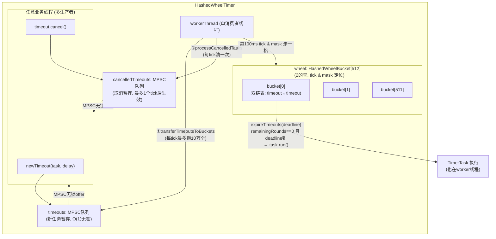
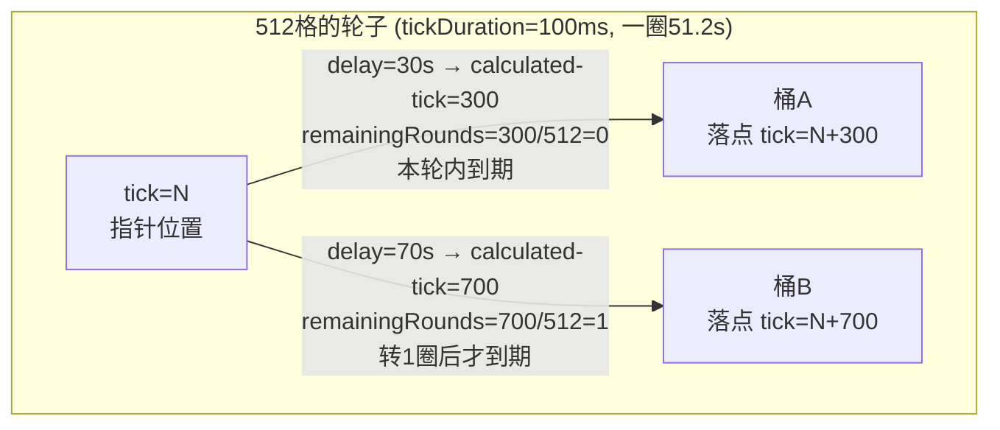
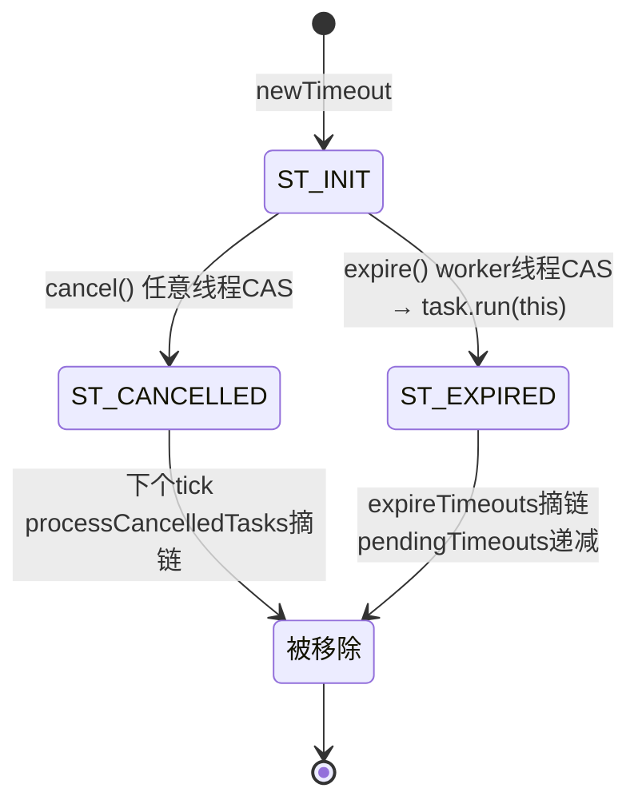

# Netty 源码剖析（六）：HashedWheelTimer 时间轮

> 源码版本：Netty 4.1.65
> 涉及类：`common/src/main/java/io/netty/util/HashedWheelTimer.java`（单文件实现，826 行，含 `Timer`/`TimerTask`/`Timeout` 三个配套接口）
> 理论出处：Varghese & Lauck 论文 *Hashed and Hierarchical Timing Wheels*（类注释 `HashedWheelTimer.java:75-81` 明确引用）

前置知识：时间轮的并发骨架直接复用了前几篇的组件——任务队列是 04 篇的 **MPSC 队列**，泄漏防护是 02 篇的 **ResourceLeakDetector**。读到这里，Netty 的工具箱你已经集齐了大半。

---

## 1. 时间轮是什么：为什么不用 DelayQueue

### 1.1 定时任务的经典实现及其代价

海量定时任务（I/O 超时、心跳、重连退避）常见三种实现：

| 实现 | 添加任务 | 到期检测 | 问题 |
|------|---------|---------|------|
| `ScheduledThreadPoolExecutor` / `DelayQueue` | O(log n)（小顶堆 sift-up） | 堆顶轮询 | 任务数 10万+ 时每次 add 都要动堆，锁竞争激烈 |
| 每个任务一个 `ScheduledFuture` 挂 EventLoop | — | — | 04 篇的方案：单线程小顶堆，量大时 `fetchFromScheduledTaskQueue` 搬运成本高 |
| **时间轮** | **O(1)**（入 MPSC 队列 + 一次哈希落桶） | 每 tick 只看一个桶 | 精度受 tick 粒度限制 |

### 1.2 时间轮的核心思想

> **一个环形数组（轮子），指针每 tickDuration 走一格；任务的 deadline 经哈希直接落到某个格子（bucket），指针走到该格时处理其中的任务。**

- 添加任务：`deadline / tickDuration` 计算圈数和落点 → **O(1)**；
- 到期检测：不用排序、不扫描全部任务——**时间本身在替你索引**：指针没到的格子里的任务必然没到期；
- 超过一轮的延迟：`remainingRounds`（剩余圈数）解决——指针每次经过该桶，任务圈数减一，减到 0 才到期。

**精度换性能**：javadoc 开篇就说 *"optimized for approximated I/O timeout scheduling"*——tick 默认 100ms，任务最多晚执行一个 tick。对超时/心跳这类场景，晚 100ms 毫无影响，但换来了 O(1) 添加和无锁入队。

---

## 2. 整体结构



三个组成部分的分工：

- **HashedWheelTimeout**（`:580`）：任务包装。既是任务（task + deadline + 三态 state），**又是桶链表的节点**（next/prev/bucket 字段直接长在它身上，`HashedWheelBucket.java:708-710` 注释明确说明这样免掉额外的节点对象分配）；
- **HashedWheelBucket**（`:712`）：`head/tail` 两条引用构成的双链表，只有 worker 线程访问，**零同步**；
- **Worker**（`:444`）：单线程消费者，驱动指针。

### 2.1 关键字段（`HashedWheelTimer.java:99-117`）

```java
private final Worker worker = new Worker();
private final Thread workerThread;                       // 独立线程(非EventLoop!)
private volatile int workerState;                        // 0 init / 1 started / 2 shutdown
private final long tickDuration;                         // 默认 100ms
private final HashedWheelBucket[] wheel;                 // 默认 512 格
private final int mask;                                  // wheel.length - 1 (按位与取模)
private final CountDownLatch startTimeInitialized;       // startTime 的发布屏障
private final Queue<HashedWheelTimeout> timeouts = PlatformDependent.newMpscQueue();          // :112
private final Queue<HashedWheelTimeout> cancelledTimeouts = PlatformDependent.newMpscQueue(); // :113
private final AtomicLong pendingTimeouts;                // 未决任务计数(限流用)
private volatile long startTime;                         // worker启动时刻的nanoTime基准
```

构造期做四件事（`:244-286`）：

1. **格子数归一到 2 的幂**（`normalizeTicksPerWheel`，`:313-319`，向左移位直到 ≥ ticksPerWheel）→ 取模用 `tick & mask` 替代（同 04 篇 Chooser 的优化）；
2. tickDuration 换算纳秒，**小于 1ms 强制抬到 1ms**（`:268-274`，sleep 精度做不到更细）；
3. `workerThread = threadFactory.newThread(worker)`——**注意不是 FastThreadLocalThread**（时间轮内部不碰 FastThreadLocal，普通线程足够）；
4. 泄漏追踪 + **实例数统计**：全局 `INSTANCE_COUNTER` 超过 64 个就打 error 日志（`:282-285`）——见 §7 的"共享单例"陷阱。

---

## 3. 添加任务：newTimeout

```java
// HashedWheelTimer.java:400-426
public Timeout newTimeout(TimerTask task, long delay, TimeUnit unit) {
    long pendingTimeoutsCount = pendingTimeouts.incrementAndGet();
    if (maxPendingTimeouts > 0 && pendingTimeoutsCount > maxPendingTimeouts) {
        pendingTimeouts.decrementAndGet();
        throw new RejectedExecutionException(...);       // ① 限流: 未决任务数上限
    }
    start();                                              // ② 惰性启动worker线程
    // ③ deadline 是相对 worker 启动时刻的纳秒差
    long deadline = System.nanoTime() + unit.toNanos(delay) - startTime;
    if (delay > 0 && deadline < 0) {
        deadline = Long.MAX_VALUE;                        // ④ 溢出保护: 视为"永远不到期"
    }
    HashedWheelTimeout timeout = new HashedWheelTimeout(this, task, deadline);
    timeouts.add(timeout);                                // ⑤ MPSC无锁入队
    return timeout;
}
```

五个细节：

1. **不做任何计算落桶**——添加路径只有"入 MPSC 队列"一次 O(1) 操作，落桶推迟到 worker 的下一个 tick（§4）。
2. **start() 的启动同步**（`:328-351`）：CAS `INIT→STARTED` 后 `workerThread.start()`，然后 `startTimeInitialized.await()` 等 worker 写好 `startTime` 才返回——保证后续 deadline 计算的基准有效。多个线程并发 newTimeout 时只有一个赢下 CAS，其余的只是等待。
3. **deadline 相对化**：以 `startTime` 为零点，wheel 内部所有时间运算（`waitForNextTick`、`expireTimeouts`）都在这个相对坐标系里，避免每次比较大数值。
4. **溢出保护**：delay 极大导致 `System.nanoTime() + delay` 回绕成负数时钳到 `Long.MAX_VALUE`——宁可永不执行也不"提前误执行"。
5. **maxPendingTimeouts**：防止生产者无限堆积任务的背压阀门（构造参数，默认不限）。

---

## 4. Worker 主循环：驱动轮子

```java
// HashedWheelTimer.java:449-488
public void run() {
    startTime = System.nanoTime();
    if (startTime == 0) { startTime = 1; }      // 0 被当作"未初始化"哨兵
    startTimeInitialized.countDown();            // 唤醒start()的等待者

    do {
        final long deadline = waitForNextTick();     // ① 睡到下一个tick
        if (deadline > 0) {
            int idx = (int) (tick & mask);           // ② 当前格子
            processCancelledTasks();                 // ③ 清理取消队列
            HashedWheelBucket bucket = wheel[idx];
            transferTimeoutsToBuckets();             // ④ MPSC队列 → 桶
            bucket.expireTimeouts(deadline);         // ⑤ 到期任务执行
            tick++;
        }
    } while (WORKER_STATE_UPDATER.get(HashedWheelTimer.this) == WORKER_STATE_STARTED);

    // ===== 退出清理: 收集未处理任务返回给stop()调用方 =====
    for (HashedWheelBucket bucket : wheel) bucket.clearTimeouts(unprocessedTimeouts);
    for (;;) { /* timeouts队列中未取消的也收进去 */ }
    processCancelledTasks();
}
```

### 4.1 waitForNextTick：睡出下一个 tick（`:538-573`）

```java
private long waitForNextTick() {
    long deadline = tickDuration * (tick + 1);              // 下一tick的绝对时刻(相对startTime)
    for (;;) {
        final long currentTime = System.nanoTime() - startTime;
        long sleepTimeMs = (deadline - currentTime + 999999) / 1000000;  // 纳秒→毫秒,向上取整
        if (sleepTimeMs <= 0) {
            return currentTime;                             // 到点了
        }
        if (PlatformDependent.isWindows()) {                // ★ Windows特判
            sleepTimeMs = sleepTimeMs / 10 * 10;
            if (sleepTimeMs == 0) { sleepTimeMs = 1; }
        }
        try {
            Thread.sleep(sleepTimeMs);
        } catch (InterruptedException ignored) {
            if (WORKER_STATE_UPDATER.get(...) == WORKER_STATE_SHUTDOWN) {
                return Long.MIN_VALUE;                      // 睡眠中被stop()打断
            }
        }
    }
}
```

- **为什么用 `Thread.sleep` 而不是 `wait/notify` 或 LockSupport**：tick 间隔是确定的，无需被新任务唤醒（新任务最多等一个 tick 就会被搬运——这正是"精度换性能"的另一面）。sleep 期间任何 newTimeout/cancel 都不需要通知 worker。
- **Windows 补丁**（`:553-563`）：JDK 在 Windows 上 `Thread.sleep(x)`（x 不是 10 的倍数时）有计时精度 bug（issue #356），sleep 值向下对齐到 10ms。代价是 Windows 上精度略差。
- **追赶机制**：如果某个任务执行太久（如 `task.run()` 卡了 300ms），醒来后 currentTime 会越过多个 tickDeadline，后续循环 `sleepTimeMs<=0` 直接连续空转 tick 补课——**轮子会"快进"追上真实时间，任务晚执行但不会漏执行**。

### 4.2 transferTimeoutsToBuckets：落桶与圈数计算（`:490-513`）

```java
private void transferTimeoutsToBuckets() {
    // 每个tick最多搬运10万个, 防止恶意生产者无限加任务把worker饿死
    for (int i = 0; i < 100000; i++) {
        HashedWheelTimeout timeout = timeouts.poll();
        if (timeout == null) break;
        if (timeout.state() == ST_CANCELLED) continue;   // 入队后已被取消

        long calculated = timeout.deadline / tickDuration;      // 应在第几tick到期
        timeout.remainingRounds = (calculated - tick) / wheel.length;  // ★ 圈数
        final long ticks = Math.max(calculated, tick);          // 已过期的按当前tick算
        int stopIndex = (int) (ticks & mask);                   // 落桶下标
        wheel[stopIndex].addTimeout(timeout);
    }
}
```

圈数（remainingRounds）的几何含义：



同一个桶里可以混着"本轮到期"和"3 轮后到期"的任务——指针每次路过该桶，所有任务的 `remainingRounds--`，减到 ≤0 的才检查 deadline。**哈希冲突（不同圈的任务落到同格）用圈数消化，这是"哈希时间轮"对"层级时间轮"（Kafka 的分层时间轮）的简化替代**。

### 4.3 expireTimeouts：到期执行（`HashedWheelBucket.java:735-757`）

```java
public void expireTimeouts(long deadline) {
    HashedWheelTimeout timeout = head;
    while (timeout != null) {
        HashedWheelTimeout next = timeout.next;
        if (timeout.remainingRounds <= 0) {
            next = remove(timeout);                  // 先摘链
            if (timeout.deadline <= deadline) {
                timeout.expire();                    // CAS INIT→EXPIRED 后执行task.run
            } else {
                throw new IllegalStateException(...); // 理论不可能: 落错桶
            }
        } else if (timeout.isCancelled()) {
            next = remove(timeout);                  // 圈数未到但被取消: 顺手清理
        } else {
            timeout.remainingRounds--;               // 还要转, 圈数减一
        }
        timeout = next;
    }
}
```

执行侧的三重防护：

1. **`expire()` 的 CAS**（`HashedWheelTimeout.java:663-675`）：`ST_INIT → ST_EXPIRED` 原子转换——与 cancel 竞争时只有一方成功，**保证任务至多执行一次**；
2. **task.run 的异常隔离**：catch Throwable 只记 warn，一个任务异常不影响同一桶里的其他任务和整个轮子；
3. **任务在 worker 线程执行**——`TimerTask.run()` 里绝不能阻塞（同 04 篇的 EventLoop 铁律），否则整个轮子上所有任务集体延迟。

### 4.4 取消：延迟一 tick 的 GC

```java
// HashedWheelTimeout.java:624-634
public boolean cancel() {
    if (!compareAndSetState(ST_INIT, ST_CANCELLED)) {
        return false;                 // 已过期/已取消, 取消失败
    }
    timer.cancelledTimeouts.add(this);  // 只入队, 不直接动桶
    return true;
}
```

**cancel 不直接从桶链表摘除节点**（那需要 worker 与业务线程对链表做同步）——只 CAS 状态 + 入 cancelledTimeouts 队列，等 worker 下个 tick 的 `processCancelledTasks()` 统一摘链。源码注释（`:629-631`）称之为可接受的"**GC latency of max 1 tick**"。被取消的任务即使指针路过（`remainingRounds<=0`）也会因 state 非 INIT 而被 `expire()` 的 CAS 拒绝，不会误执行。

### 4.5 Timeout 状态机



`cancel() / expire()` 都只允许从 INIT 出发——**一次性状态转换保证幂等**，与 03 篇 Promise 的"只完成一次"异曲同工。

---

## 5. stop：优雅关停

```java
// HashedWheelTimer.java:354-397（流程化）
public Set<Timeout> stop() {
    if (Thread.currentThread() == workerThread) throw new IllegalStateException(...); // ① 禁止自杀
    CAS STARTED → SHUTDOWN;   // 若本来就 INIT/SHUTDOWN: 补记账并返回空集
    while (workerThread.isAlive()) {        // ② interrupt + join(100) 轮询等worker退出
        workerThread.interrupt();
        workerThread.join(100);
    }
    // ③ 关闭泄漏追踪, 实例计数减一
    return worker.unprocessedTimeouts();    // ④ 未执行且未取消的任务交还调用方
}
```

- **`unprocessedTimeouts`**：worker 退出前把桶里和队列里所有 `非expired非cancelled` 的任务收集成 Set 返回（`:474-487`）——**停轮不吞任务**，调用方可以拿到这些任务转投别的时间轮或自己执行。
- **禁止在 TimerTask 里 stop 自己**：worker 正在执行你的 task，你把它 join 死就是死锁。
- 未 start 就 stop 也合法（INIT→SHUTDOWN），返回空集。

---

## 6. Netty 内外的应用与对比

### 6.1 时间轮家族

| 实现 | 结构 | 特点 |
|------|------|------|
| **Netty HashedWheelTimer** | 单层 + rounds | 单轮多圈，O(1) 落桶；tick 粒度固定 |
| Kafka `SystemTimer` | **层级时间轮**（秒/分/时多层） | 超长延迟在层间降级（cascade），tick 更细（1ms）仍可表达小时级延迟 |
| Dubbo `HashedWheelTimer` | Netty 的 fork | 加了任务取消计数等定制 |
| Linux 内核 | 层级时间轮 | 同 Kafka 思想 |

Netty 选单轮多圈而不是分层：I/O 超时场景延迟普遍在秒级（512 格 × 100ms = 51.2 秒一圈，重连退避几圈足够），分层带来的复杂度不值得。**longRounds 的代价是每次指针路过都要 `remainingRounds--`（最多 512 个任务白摸一遍），但对低精度场景可忽略**。

### 6.2 什么场景用它

- ✅ 连接空闲超时、请求超时、心跳检测、退避重连——**海量、低精度、频繁增删**的延迟任务；
- ❌ 精确调度（cron 类，误差敏感）——用 `ScheduledThreadPoolExecutor`；
- ❌ 任务本身耗时长——阻塞 worker 线程，应改为 `task.run()` 里向线程池提交真正的工作。

Netty 自身用 `HashedWheelTimer` 较少（连接超时走 EventLoop 的 `schedule`），但它是被 Dubbo（默认心跳/重连调度）、RocketMQ（请求超时）等大量中间件直接使用的"外销明星"组件。

---

## 7. 使用陷阱（源码中的防御都在提示你）

1. **必须全局单例**。构造函数里 `INSTANCE_COUNTER > 64` 就 error（`:282-285`），finalize/stop 里精心维护计数——**每个实例一条线程**，按连接 new 一个时间轮是经典事故（javadoc `:66-71` 专门警告）。正确姿势：应用里一个静态单例，`stop()` 挂在 shutdown hook。
2. **不 stop 会泄漏**。非 daemon worker 线程 + `ResourceLeakDetector.track(this)`（`:278`）——忘了 stop 的实例会被泄漏检测点名（02 篇 §8 的机制）。
3. **TimerTask 里不能阻塞**（§4.3）。
4. **cancel 是异步的**（§4.4）——cancel 返回后 1 个 tick 内任务仍占内存；对正确性无影响（CAS 保证不执行），但极限压测的内存曲线会看到这个延迟。
5. **精度 = tickDuration**。默认 100ms 意味着"延迟 500ms"的任务实际在 500~600ms 间执行；且 worker 被长任务拖住时误差进一步放大（会快进补课，见 §4.1）。
6. **轮子大小与 tick 的权衡**：512 格 × 100ms 若任务延迟普遍超过 51.2 秒，remainingRounds 很大，指针空扫成本上升——可调大 ticksPerWheel 或缩短 tick。

---

## 8. 设计精髓总结

1. **时间即索引**：把"何时到期"从需要排序的属性变成 O(1) 的哈希定位——排序成本被时间流逝的均匀性免费替代。
2. **O(1) 添加 + 单消费者模型**：添加 = MPSC 无锁入队；所有桶结构只被 worker 线程碰——零锁、零 volatile（桶链表的 next/prev 连 volatile 都不是，`:599-601` 注释明确说明）。
3. **异步化的取消**：状态 CAS（立即语义生效）+ 延迟摘链（下个 tick 物理清理），把跨线程链表操作的成本换成可接受的 1-tick 内存滞留。
4. **节点即链表元素**：HashedWheelTimeout 自带 next/prev，桶只是两条引用——零包装对象，海量任务下显著省内存。
5. **限流与防饿死**：maxPendingTimeouts 挡住生产端，transfer 每tick最多10万个挡住消费端。
6. **确定性优于精确性**：sleep 驱动 + 快进补课，任务晚执行但不漏执行；溢出钳到 MAX_VALUE 而不是提前误执行。
7. **组件复用的典范**：MPSC（04 篇）、ResourceLeakDetector（02 篇）、一次性 CAS 状态机（03 篇思想）——一个 800 行的组件把 Netty 工具箱用了个遍。

---

## 附：快问快答

**Q：tickDuration 设 1ms 是不是更准？**
是，但 worker 每秒要醒 1000 次空转（无任务也要 tick），且 `Thread.sleep(1)` 的实际精度在多数操作系统上就是 1~2ms，收益有限。默认 100ms 适配绝大多数超时场景。

**Q：时间轮和 EventLoop 的 schedule() 什么关系？**
两套独立机制。EventLoop 的 `schedule` 用小顶堆（04 篇 §9），任务和 channel 共享 EventLoop 线程；HashedWheelTimer 是独立线程 + 环形数组。前者适合与 channel 生命周期绑定的少量任务（如 connectTimeout），后者适合全局海量低精度任务。

**Q：一个任务能既不执行也不被取消地消失吗？**
不能。stop() 会把它返回给调用方；正常运行中它要么被 expire 要么等在被取消/在桶里——没有丢任务的路径（除非你忘记持有 Timeout 引用且从不 stop，那是泄漏不是丢失）。

**Q：为什么 bucket 链表不用 ArrayDeque 之类的容器？**
桶内高频中间删除（expire/cancel 摘链）+ 节点复用需求，侵入式双链表（节点自带指针）是最优解，且省掉迭代器和包装对象分配。

**Q：多线程并发 newTimeout 安全吗？**
安全。MPSC 队列保证入队原子性；startTime 通过 CountDownLatch 安全发布；deadline 只依赖线程本地的 nanoTime 快照。
