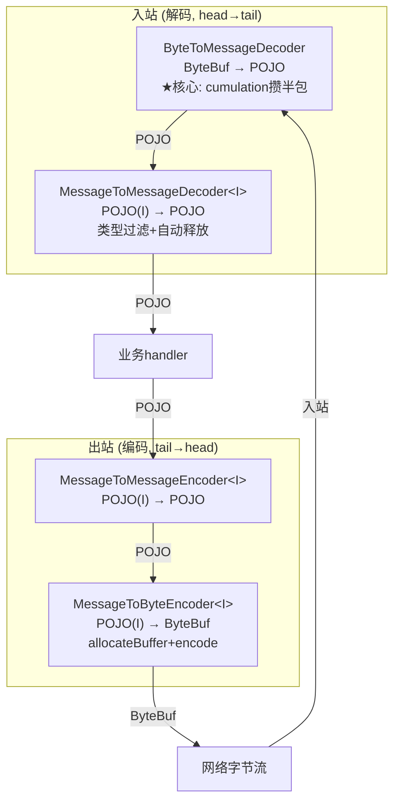
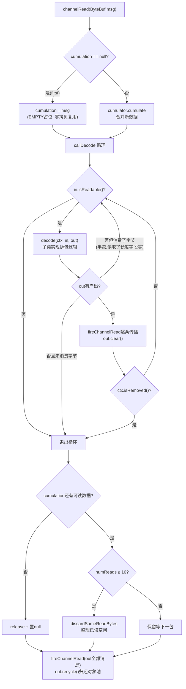
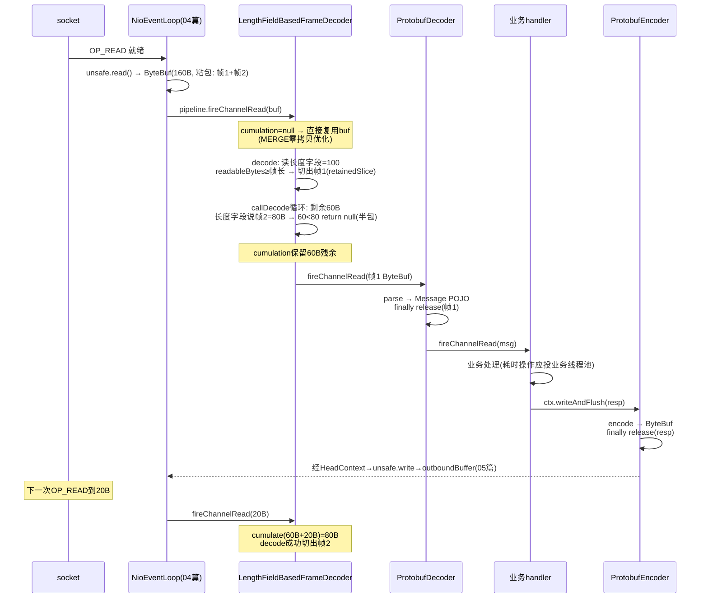

# Netty 源码剖析（七）：编解码器体系（codec）

> 源码版本：Netty 4.1.65
> 涉及模块：`codec/src/main/java/io/netty/handler/codec/`
> 涉及核心类：
> - **四大骨架**：`ByteToMessageDecoder`、`MessageToMessageDecoder`、`MessageToByteEncoder`、`MessageToMessageEncoder`
> - 组合器：`ByteToMessageCodec`、`MessageToMessageCodec`
> - 拆包器：`LengthFieldBasedFrameDecoder`、`LineBasedFrameDecoder`、`DelimiterBasedFrameDecoder`、`FixedLengthFrameDecoder`
> - 基础设施：`CodecOutputList`、`TypeParameterMatcher`、`ByteBufHolder`、异常体系

前置知识：编解码器就是 05 篇 Pipeline 上的普通 handler——入站方向把字节流变成 POJO（解码），出站方向把 POJO 变回字节流（编码）。所有内存操作都是 02 篇的 ByteBuf 与引用计数，异常会走 05 篇的 exceptionCaught 传播。

---

## 1. 为什么需要编解码框架：TCP 的流式本质

TCP 是**字节流**协议，没有"消息"边界。发送方连续 `write` 两次：

```
send: [A(100B)][B(60B)]        ← 应用层以为发了两条消息
recv: [#####160B#####]          ← 接收方可能一次读到160字节
recv: [###90B###][##70B##]      ← 也可能读到90+70，甚至50+50+60...
```

**粘包**（两条消息一起到）与**半包**（一条消息分几次到）是常态而非异常。codec 模块要解决三件事：

1. **攒**：数据不够一帧时存起来等下一次（半包）；
2. **切**：一次到达的数据里切出 N 帧（粘包）；
3. **变**：字节 ↔ 业务对象 的互相转换。

Netty 的答案是一个精巧的分层：**四个抽象骨架 + 一个累积缓冲 + 一堆协议专用拆包器**。

---

## 2. 四大骨架：类型转换矩阵

按"输入是什么、输出是什么"划分四个抽象类：



典型链路（入站三段式）：

```
socket → [LengthFieldBasedFrameDecoder]  ByteBuf(粘/半包) → ByteBuf(整帧)
       → [ProtobufDecoder]               ByteBuf(整帧)    → Message POJO
       → [业务 handler]                   Message          → 处理
```

出站（两段式）：`业务 POJO → ProtobufEncoder → ByteBuf → 字节流`。

**编解码器可以自由组合嵌套**——每个骨架只做一步类型转换，复杂协议用多个 handler 接力。

---

## 3. ByteToMessageDecoder：整个体系的心脏

### 3.1 核心字段（`ByteToMessageDecoder.java:150-175`）

```java
ByteBuf cumulation;                          // :154 累积缓冲(半包的家)
private Cumulator cumulator = MERGE_CUMULATOR;  // :155 累积策略
private boolean singleDecode;                // :156 每次channelRead只解一条(协议升级用)
private boolean first;                       // :157 本轮是否首包
private boolean firedChannelRead;            // :163 autoRead=false时的续读标记
private byte decodeState = STATE_INIT;       // :173 重入保护状态机
private int discardAfterReads = 16;          // :174 每16次read做一次内存整理
private int numReads;
```

构造函数里 `ensureNotSharable()`（:177-179）——**解码器有状态（cumulation），绝不允许 @Sharable**，构造时就强制校验（05 篇 checkMultiplicity 的第一道闸）。

### 3.2 channelRead：主流程（:268-304）

```java
public void channelRead(ChannelHandlerContext ctx, Object msg) throws Exception {
    if (msg instanceof ByteBuf) {                       // ① 只吃ByteBuf, 其他类型透传
        CodecOutputList out = CodecOutputList.newInstance();   // ② 对象池借来的输出列表
        try {
            first = cumulation == null;
            // ③ 累积: 半包合并到cumulation (所有权转移: msg被消费)
            cumulation = cumulator.cumulate(ctx.alloc(),
                    first ? Unpooled.EMPTY_BUFFER : cumulation, (ByteBuf) msg);
            // ④ 解码循环: 尽可能多地切出消息 → out
            callDecode(ctx, cumulation, out);
        } catch (DecoderException e) { throw e;
        } catch (Exception e) { throw new DecoderException(e); }
        finally {
            try {
                // ⑤ 累积缓冲整理
                if (cumulation != null && !cumulation.isReadable()) {
                    numReads = 0;
                    cumulation.release();               // 读完即释放(还给池)
                    cumulation = null;
                } else if (++numReads >= discardAfterReads) {
                    numReads = 0;
                    discardSomeReadBytes();             // 每16次read整理一次已读空间
                }
                // ⑥ 统一fire解码出的消息
                int size = out.size();
                firedChannelRead |= out.insertSinceRecycled();
                fireChannelRead(ctx, out, size);
            } finally {
                out.recycle();                          // ⑦ 归还对象池
            }
        }
    } else {
        ctx.fireChannelRead(msg);
    }
}
```



### 3.3 callDecode 循环：粘包与半包的统一处理（:426-479）

```java
protected void callDecode(ChannelHandlerContext ctx, ByteBuf in, List<Object> out) {
    while (in.isReadable()) {
        final int outSize = out.size();
        if (outSize > 0) {                     // ① 上轮解出的消息先fire掉
            fireChannelRead(ctx, out, outSize);
            out.clear();
            if (ctx.isRemoved()) break;
        }
        int oldInputLength = in.readableBytes();
        decodeRemovalReentryProtection(ctx, in, out);   // ② 调子类decode
        if (ctx.isRemoved()) break;
        if (out.isEmpty()) {
            if (oldInputLength == in.readableBytes()) break;   // ③a 没消费没产出→半包,等下次
            else continue;                     // ③b 消费了但没产出→继续循环
        }
        if (oldInputLength == in.readableBytes()) {
            throw new DecoderException(...decode() did not read anything but decoded a message...);
                                              // ④ 有产出但没消费字节→必为bug, 快速失败
        }
        if (isSingleDecode()) break;           // ⑤ 单条模式
    }
}
```

这段循环是整个 codec 体系的"合同条款"：

- **对子类 decode 的契约**：每次调用要么**消费字节**（读走一部分输入），要么**产出消息**，至少占一样；都不占=数据不足请退出（③a）；只产出不消费=逻辑错误（④，抛异常防死循环）；
- **粘包**：一次 decode 消费完一帧后 `continue`，缓冲区里还有数据就再解下一帧，直到 ③a；
- **半包**：decode 返回但 `out` 空、字节没少 → break，残余字节留在 cumulation 等下一次 channelRead；
- **③b 的场景**：decode 消费了字节（如读走了长度字段）但还没凑齐整帧——继续循环（子类内部已记录状态）。

`decodeRemovalReentryProtection`（:503-517）：decode 执行期间如果 handler 被 remove（用户在 fireChannelRead 的下游 handler 里动态改了链），用 `decodeState` 三态（INIT/CALLING_CHILD_DECODE/HANDLER_REMOVED_PENDING）标记"待移除"，decode 返回后再补发残余消息并真正移除——**移除与解码并发也不丢数据**。

### 3.4 两种累积策略：MERGE vs COMPOSITE（:80-148）

```java
// MERGE_CUMULATOR (:80-108) — 内存拷贝式合并
public ByteBuf cumulate(ByteBufAllocator alloc, ByteBuf cumulation, ByteBuf in) {
    if (!cumulation.isReadable() && in.isContiguous()) {
        cumulation.release();          // ★ 累积区为空: 直接复用in, 零拷贝零分配
        return in;
    }
    // 扩容三条件: 容量不足 / 快速写入路径不足且buf被共享(refCnt>1) / 只读
    if (required > cumulation.maxWritableBytes() ||
            (required > cumulation.maxFastWritableBytes() && cumulation.refCnt() > 1) ||
            cumulation.isReadOnly()) {
        return expandCumulation(alloc, cumulation, in);   // 新建大buffer迁移
    }
    cumulation.writeBytes(in, in.readerIndex(), required);  // 追加拷贝
    in.readerIndex(in.writerIndex());
    return cumulation;
}

// COMPOSITE_CUMULATOR (:115-148) — CompositeByteBuf零拷贝组合
// 累积区已是Composite且refCnt==1 → addFlattenedComponents直接挂新组件(不拷贝)
// 否则新建Composite把旧数据+新数据都挂进去
```

| 维度 | MERGE（默认） | COMPOSITE |
|------|--------------|-----------|
| 半包合并方式 | 拷贝进一个大 buffer | 挂组件到 CompositeByteBuf |
| 内存拷贝 | 每次合并都有 memmove | **零拷贝** |
| 后续解码访问 | 连续数组，`getByte` 一步到位 | 逻辑索引换算（02 篇 §7），**跨组件操作退化** |
| 适用 | 多数协议（帧不大、解码频繁随机访问） | 帧特别大 / 合并极频繁（如大文件传输流式协议） |

设计取舍很 Netty：**默认选"拷贝但访问快"**——因为 merge 发生在每包一次的频率，而 decode 对 cumulation 的访问（找帧头、读长度字段）在一次 channelRead 里发生 N 次。`refCnt() > 1` 时拒绝原地扩容（`maxFastWritableBytes` 分支，:91）——别人还引用着这块内存，改容量不安全（引用计数意识贯穿到这种细节）。

### 3.5 资源守恒：每条失败路径都释放

- `cumulate` 里 `finally { in.release(); }`（:102-106）：`writeBytes` 抛 OOM 也不泄漏输入；
- COMPOSITE 的 `finally`（:137-146）：所有权未转移时释放 in 和新建的 composite；
- `channelReadComplete`（:328-337）：`discardSomeReadBytes` 整理 + **autoRead=false 时若本轮没 fire 过消息要主动 `ctx.read()` 续读**（否则对端数据永远读不进来）；
- `handlerRemoved`（:240-260）：cumulation 还有残余数据 → fire 给下游（不吞数据）再释放。

---

## 4. LengthFieldBasedFrameDecoder：最常用的拆包器

### 4.1 五参数语义

```
长度 = frameLength    (长度字段的值)
  +-------------------+
  | 长度字段 |   载荷  |
  +-------------------+
  ↑lengthFieldOffset  ↑lengthFieldEndOffset
```

| 参数 | 含义 | 例 |
|------|------|----|
| `maxFrameLength` | 帧长上限，超出抛 TooLongFrameException（防 OOM/DoS） | 1024 |
| `lengthFieldOffset` | 长度字段在帧内的偏移（前面可能有 magic/版本头） | 4 |
| `lengthFieldLength` | 长度字段自身字节数（1/2/3/4/8） | 4 |
| `lengthAdjustment` | 长度修正：**长度字段的值是否已包含头部长度** | 见下 |
| `initialBytesToStrip` | 解码后剥掉帧头多少字节 | 0/4 |
| `failFast`（第6参） | 超长时立即失败 vs 读完再失败 | 默认 true |

**lengthAdjustment 是最容易踩坑的参数**：`总帧长 = lengthField的值 + lengthFieldEndOffset + lengthAdjustment`。协议若声明"长度=载荷长度"（不含头），则 `lengthAdjustment = lengthFieldOffset + lengthFieldLength` 把头补回来；若声明"长度=整帧长度"，则 adjustment=0。

### 4.2 decode 流程（:396-439）

```java
protected Object decode(ChannelHandlerContext ctx, ByteBuf in) {
    if (discardingTooLongFrame) discardingTooLongFrame(in);     // 上次超长帧还在丢弃模式
    if (in.readableBytes() < lengthFieldEndOffset) return null; // ① 连长度字段都不完整→半包
    long frameLength = getUnadjustedFrameLength(...);            // ② 读长度(支持1/2/3/4/8字节+大小端)
    if (frameLength < 0) failOnNegativeLengthField(...);         // ③ 非法长度(恶意/错位)
    frameLength += lengthAdjustment + lengthFieldEndOffset;      // ④ 修正为总帧长
    if (frameLength > maxFrameLength) { exceededFrameLength(...); return null; }  // ⑤ 超长→进入丢弃模式
    if (in.readableBytes() < frameLengthInt) return null;        // ⑥ 帧不完整→半包,留cumulation
    in.skipBytes(initialBytesToStrip);                           // ⑦ 剥头
    ByteBuf frame = extractFrame(ctx, in, readerIndex, actualFrameLength);  // ⑧ retainedSlice切片
    in.readerIndex(readerIndex + actualFrameLength);             // ⑨ 消费整帧字节
    return frame;
}
```

三个设计亮点：

1. **`return null` 就是半包信号**——什么都不消费地返回，`callDecode` 检测到"没消费没产出"就退出循环，cumulation 原地保留；
2. **丢弃模式（discardingTooLongFrame）**：超大帧到达时不能只抛异常——数据还在流里，必须**逐字节跳过整帧**再恢复，否则后续帧全部错位；`failFast=true` 时先抛 TooLongFrameException（立刻暴露问题），`false` 时等跳完再抛（完整日志）；
3. **extractFrame 用 `retainedSlice`**（02 篇 §3.5）：切出的帧与 cumulation 共享内存，不拷贝——**拆包是零拷贝的**。

### 4.3 其他拆包器一览

| 拆包器 | 帧边界依据 | 典型场景 |
|--------|-----------|---------|
| `LineBasedFrameDecoder` | `\n` / `\r\n`（`ByteProcessor.FIND_LF` 高效扫描） | 文本协议、Redis RESP |
| `DelimiterBasedFrameDecoder` | 自定义分隔符（多个分隔符取最先匹配者） | 自定义文本协议 |
| `FixedLengthFrameDecoder` | 固定长度 | 定长二进制协议 |
| `LengthFieldBasedFrameDecoder` | 头部长度字段 | **绝大多数二进制 RPC 协议** |

三者共性：都继承 `ByteToMessageDecoder`，都实现"边界没到就 return null、到了就切一段"的契约。

---

## 5. MessageToMessageDecoder 与编码器家族

### 5.1 MessageToMessageDecoder：POJO→POJO

```java
// :90 附近，channelRead 核心
if (acceptInboundMessage(msg)) {          // ① TypeParameterMatcher泛型类型过滤
    I cast = (I) msg;
    try {
        decode(ctx, cast, out);           // ② 子类转换
    } finally {
        ReferenceCountUtil.release(cast); // ③ ★无条件释放入站消息(所有权转移)
    }
} else {
    out.add(msg);                         // ④ 类型不匹配: 原样透传
}
finally { for (each in out) ctx.fireChannelRead(...); out.recycle(); }
```

第 ③ 步是**引用计数所有权的约定**：消息进入转换器即视为"消费"——子类 decode 里如果还要保留引用（存进集合），必须自己 `retain`（02 篇规则在 codec 层的落地）。`TypeParameterMatcher` 通过反射解析泛型参数 `I` 做 instanceof 级过滤（无需显式传 Class），匹配编译期泛型签名。

### 5.2 MessageToByteEncoder：POJO→ByteBuf（:98-131）

```
write(msg, promise)
  ├─ acceptOutboundMessage? 否 → ctx.write(msg) 透传
  ├─ 是 → buf = allocateBuffer(preferDirect)     // 默认 ctx.alloc().ioBuffer()
  │        encode(ctx, cast, buf)                // 子类写字节
  │        finally: ReferenceCountUtil.release(msg)   // 消费入站消息
  ├─ buf.isReadable()? → ctx.write(buf, promise) // 编码结果继续向head传播
  │                   否 → buf.release + ctx.write(EMPTY_BUFFER, promise)
  │                        // 空消息也要完成promise, 不能静默吞掉
  └─ catch: 非EncoderException包装成EncoderException抛出(→promise失败)
```

`preferDirect`：编码输出最终要写 socket，直接内存省一次堆→堆外拷贝（02 篇 §9）——所以默认 true。

### 5.3 MessageToMessageEncoder：POJO→POJO

出站版转换器。特殊点：**编码必须至少产出一个消息**（`out.isEmpty()` 抛 EncoderException）——出站操作有 promise 在等，静默丢弃会造成 promise 悬挂（03 篇"Promise 必须完成"）。产出多条时用 **PromiseCombiner**（03 篇 §4.3）聚合多个 write 的结果回填原 promise。

### 5.4 ByteToMessageCodec：组合而非继承

```java
public abstract class ByteToMessageCodec<I> extends ChannelDuplexHandler {
    private final MessageToByteEncoder<I> encoder;          // 出站: 内部Encoder转发到encode()
    private final ByteToMessageDecoder decoder = new ByteToMessageDecoder() {
        public void decode(...) { ByteToMessageCodec.this.decode(...); }  // 入站: 匿名子类转发
    };
}
```

为什么组合？Java 单继承限制只是表层原因，真正的理由：**编/解码是两个方向、两种生命周期**（encoder 无状态可 @Sharable，decoder 有 cumulation 绝不能）——分开组合让两者各自复用骨架的全部基础设施（类型匹配、释放、异常包装），`ChannelDuplexHandler` 只是薄薄的转发壳。

---

## 6. 支撑设施

### 6.1 CodecOutputList：可回收的输出容器

所有骨架的 `out` 都不是 `ArrayList` 而是 **`CodecOutputList`**——对象池（Recycler）管理的定长数组封装，`newInstance()` 借、`recycle()` 还，还带 `insertSinceRecycled()` 标记避免重复 fire。高吞吐下每条消息的解码都省掉列表分配——02/04 篇的对象池思想在 codec 层的应用。

### 6.2 异常体系

```
CodecException (RuntimeException)
 ├── DecoderException            解码器异常(包装子类异常)
 │    ├── TooLongFrameException      帧超长(LengthField/Delimiter...) → 通常应关闭连接
 │    └── CorruptedFrameException    帧损坏(校验失败/非法字段)      → 不可恢复, 关连接
 ├── EncoderException            编码器异常
 └── PrematureChannelClosureException  连接在响应完成前关闭(RPC客户端)
```

`TooLongFrameException` 不只是错误提示，它是**内存防护**：没有 maxFrameLength 校验的拆包器，恶意对端发一个 `0x7FFFFFFF` 长度头就能让 cumulation 扩容到 2GB——**自定义协议务必设置帧长上限**。

### 6.3 ByteBufHolder：带元数据的消息

`ByteBufHolder = ByteBuf + 元数据`（HTTP 的 `HttpContent`、WebSocket 的帧都实现它），自带 `copy/duplicate/retainedDuplicate/replace` 与引用计数透传——**协议消息对象的标准范式**：自己不存字节，包着一个 ByteBuf 并管理它的生命周期。

### 6.4 开箱即用的编解码器

- **string**：`StringDecoder/Encoder`（charset 转换，均 @Sharable）；
- **bytes**：`ByteArrayEncoder`（`Unpooled.wrappedBuffer` 零拷贝包装，@Sharable）；
- **serialization**：`ObjectEncoder/Decoder`——⚠️ javadoc 明确警告**Java 反序列化的 RCE 风险**，只应用于可信内网，绝不能暴露给公网；`CompatibleObjectEncoder` 用标准 ObjectStream 并按 `resetInterval` 定期 reset 防接收端对象缓存 OOM；
- **protobuf**：`ProtobufDecoder/Encoder` + `ProtobufVarint32FrameDecoder/LengthFieldPrepender`（varint 变长长度头的拆/封包配套）。

### 6.5 @Sharable 规则速查

| 组件 | 状态 | @Sharable |
|------|------|-----------|
| Encoder（MessageToByteEncoder 子类） | 无状态 | ✅ 常见（StringEncoder/ByteArrayEncoder） |
| Decoder（ByteToMessageDecoder 子类） | **cumulation 状态** | ❌ 构造期 `ensureNotSharable()` 强制 |
| ByteToMessageCodec | 含 decoder | ❌ `ensureNotSharable()` |
| LengthFieldBasedFrameDecoder | 含丢弃模式状态 | ❌ 每连接 new 一个 |

---

## 7. 一次完整的数据旅行（总装图）



---

## 8. 设计精髓总结

1. **模板方法 + 严格契约**：`callDecode` 用"要么消费字节、要么产出消息"的合同把粘/半包的复杂控制流从子类抽走——子类的 `decode` 只需关心"一帧的边界在哪"，这是整个 codec 框架可扩展性的根。
2. **cumulation 是半包的唯一答案**：所有拆包器共享同一套攒数据基础设施，只是帧边界判定不同；两个 Cumulator 策略（拷贝快访问 vs 组合零拷贝）暴露成可插拔点。
3. **零拷贝拆包**：帧切片用 retainedSlice 共享内存，"切"不产生数据拷贝。
4. **所有权转移的纪律**：codec 层的每个 finally 都在 release——消息被消费（转换完成）即释放，子类想保留必须显式 retain；所有失败路径（异常/OOM/移除）资源守恒。
5. **防护性设计**：maxFrameLength + 丢弃模式防恶意帧；"有产出没消费"快速失败防子类 bug 死循环；decodeState 防动态移除丢数据；ensureNotSharable 防误共享。
6. **组合优于继承**（ByteToMessageCodec）：编/解码状态性不同，组合让两边各取所需。
7. **对象池渗透**：CodecOutputList、Recycler——热路径上连一个 ArrayList 都不给 GC 添麻烦。

---

## 附：快问快答

**Q：解码器解出 10 条消息，下游 handler 收到几次 channelRead？**
每条一次（fireChannelRead 逐条 fire），随后一次 channelReadComplete。所以业务 handler 必须能处理"一次读周期内多次 channelRead"。

**Q：cumulation 会不会无限膨胀？**
长度类拆包器受 maxFrameLength 限制；自定义 decode 若一直"消费字节不产出"（③b），数据会被持续消费不会堆积；真正危险的是忘设 maxFrameLength 的自定义协议。

**Q：为什么我的解码器每连接 new 一个，不能全局单例？**
cumulation 是每连接的会话状态。全局单例解码器 = 所有连接共用一个累积缓冲 = 数据串台。编码器无状态，可以单例。

**Q：decode 里抛异常连接会断吗？**
取决于你。DecoderException 沿 pipeline 传播（05 篇 §4.4），没有 handler 处理就只剩 Tail 的 warn 日志，**连接不会自动断**。协议数据已错位时，正确做法是抛异常 + 在 exceptionCaught 里 `ctx.close()`。

**Q：MessageToMessageDecoder 和在业务 handler 里直接强转有什么区别？**
类型过滤（不匹配自动透传，一条链可挂多个转换器各取所需）、自动 release、异常包装成 DecoderException——转换逻辑复用且错误处理一致。

**Q：怎么自定义协议的拆包最省事？**
优先 `LengthFieldBasedFrameDecoder`（补一个 LengthFieldPrepender 编码器写长度头即可）；帧长可预知且固定用 FixedLength；文本用 Line/Delimiter。只有在边界规则奇特时才自己继承 `ByteToMessageDecoder` 写 decode。
